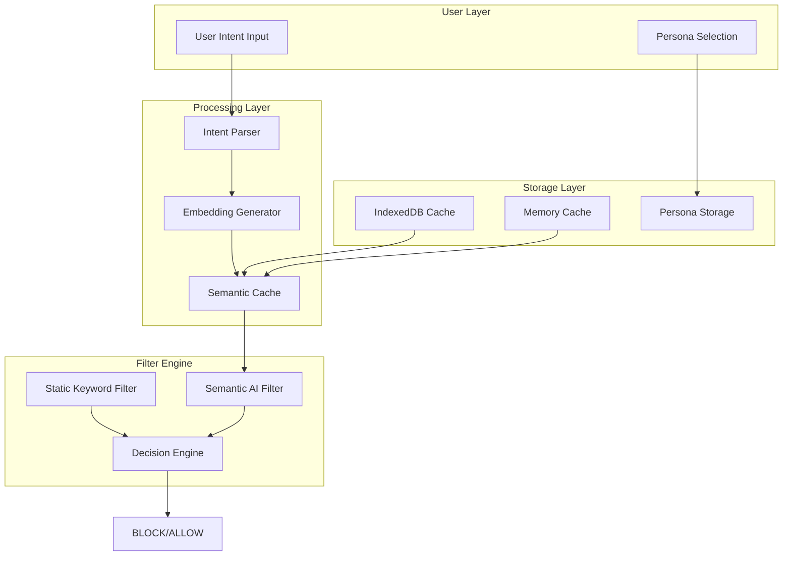
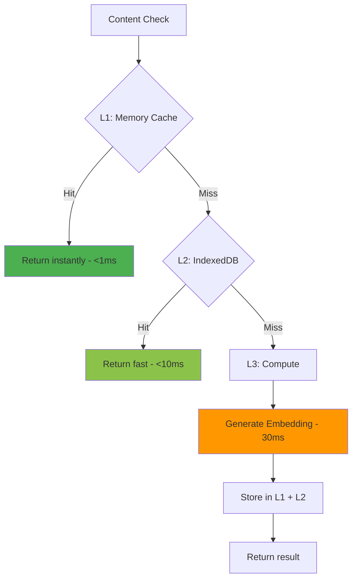
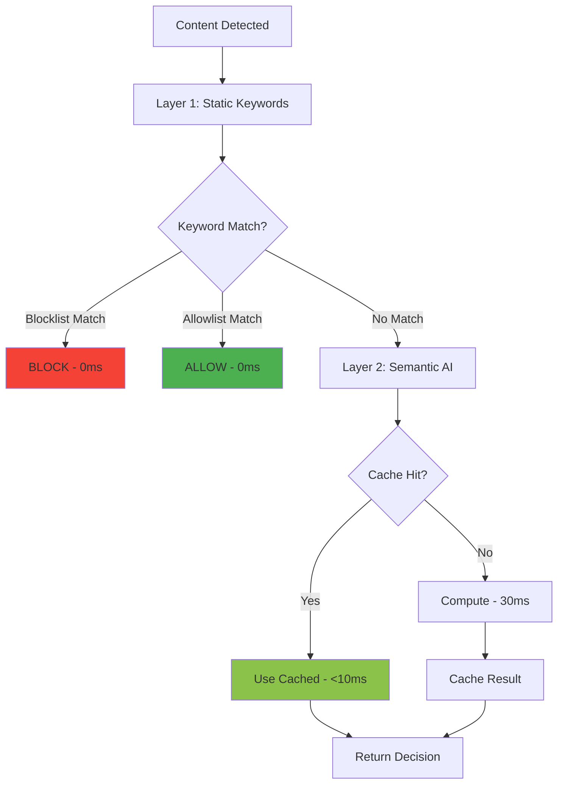

# 🧠 AI-Driven Behavioral Filtering Architecture

> **A Complete Guide to Building an Intelligent, Free, Privacy-First Content Filter**

---

## 📋 Table of Contents

1. [Executive Vision](#-executive-vision)
2. [The Problem We're Solving](#-the-problem-were-solving)
3. [Our Solution: The Agentic Filter](#-our-solution-the-agentic-filter)
4. [Architecture Overview](#-architecture-overview)
5. [Implementation Plan](#-implementation-plan)
   - Phase 1: Local AI Engine
   - Phase 2: Semantic Understanding
   - Phase 3: Multi-tier Caching
   - Phase 4: Hardware Acceleration
   - Phase 5: Negative Constraints
   - Phase 6: Hybrid Filtering
6. [Technical Specifications](#-technical-specifications)
7. [Implementation Roadmap](#-implementation-roadmap)
8. [References](#-references)

---

## 🎯 Executive Vision

### Goal
Transform FilterTube from a **keyword-based blocking system** into an **intelligent behavioral filter** that understands user intent through natural language.

### Reason
Traditional keyword filtering has fundamental limitations:
- Users must manually maintain long lists of blocked terms
- No understanding of context (e.g., "game" blocked even in "game theory")
- Missed content that semantically matches but uses different words
- High maintenance burden as new terms emerge

### Expected Outcome
A system where users describe their goals in plain language (e.g., "I want to focus on programming and avoid entertainment") and the AI automatically:
- Understands the semantic meaning
- Blocks related content without explicit keywords
- Handles context-aware exceptions
- Works 100% free, offline, and privacy-preserving

---

## ❌ The Problem We're Solving

### Current State: Keyword-Based Filtering

```
User wants to block: Gaming content
Current approach: blockedKeywords = ["game", "games", "gaming", "gamer", "gameplay", "esports", "twitch", ...]
```

**Problems with this approach:**

| Issue | Description | Impact |
|-------|-------------|--------|
| **Manual Maintenance** | User must add every possible keyword | Time-consuming, error-prone |
| **No Context Awareness** | "Game Theory" blocked alongside "Gaming Videos" | False positives |
| **Language Limitations** | Only works for exact matches | Misses synonyms, slang |
| **Incomplete Coverage** | New terms require manual updates | Content slips through |

### The Core Question
> How can we let users express their **intent** rather than manage **keyword lists**?

---

## ✅ Our Solution: The Agentic Filter

### Goal
Build an AI system that understands user intent semantically and filters content based on meaning, not keywords.

### Reason
Modern AI embedding models can convert text into numerical vectors that capture semantic meaning. Similar meanings produce similar vectors, enabling us to:
- Compare content against user intent mathematically
- Understand context without explicit rules
- Generalize to new content automatically

### Expected Outcome

```
User Input: "I want to focus on programming and avoid entertainment"

System Automatically Understands:
├── BLOCK: Gaming, Movies, Music, Social Media, Memes
├── ALLOW: Programming tutorials, Documentation, Technical blogs
└── CONTEXT: "Game Development Tutorial" → ALLOW (programming context)
             "Top 10 Games 2024" → BLOCK (entertainment context)
```

### Key Innovation: Vector Similarity

```
User Intent: "avoid entertainment"     → Vector: [0.23, -0.45, 0.67, ...]
Video Title: "Netflix New Releases"    → Vector: [0.21, -0.42, 0.71, ...]
                                          ↓
Cosine Similarity: 0.94 (very similar) → BLOCK

Video Title: "Python For Beginners"    → Vector: [-0.31, 0.52, -0.18, ...]
                                          ↓
Cosine Similarity: 0.12 (very different) → ALLOW
```

---

## 🏗️ Architecture Overview

### High-Level System Design



### Core Principle: 100% Local Processing

| Aspect | Our Approach | Reason | Result |
|--------|--------------|--------|--------|
| **AI Model** | Runs in browser | No API costs, works offline | Free forever |
| **Data Storage** | IndexedDB + Memory | Fast access, persistent | <10ms response |
| **Privacy** | Never leaves device | No external servers | Complete privacy |
| **Computation** | WebGPU accelerated | GPU-powered inference | 10-50ms processing |

---

## 📝 Implementation Plan

This section explains each component in progressive order, with clear reasoning and expected outcomes.

---

### Phase 1: Local AI Engine (Transformers.js)

#### Goal
Run AI models directly in the browser without any external API calls.

#### Reason
- **Cost**: Cloud APIs charge per request (~$0.001-0.01 each)
- **Privacy**: User data never leaves their device
- **Speed**: No network latency (200-800ms saved per request)
- **Reliability**: Works offline, no API downtime

#### Implementation

```javascript
import { pipeline } from '@xenova/transformers';

// Load embedding model (one-time, ~30MB, cached forever)
const embedder = await pipeline(
    'feature-extraction',
    'Xenova/all-MiniLM-L6-v2',
    { device: 'webgpu' }  // GPU acceleration when available
);

// Generate semantic embedding for any text
async function getEmbedding(text) {
    const result = await embedder(text, {
        pooling: 'mean',
        normalize: true
    });
    return result.data;  // Float32Array[384]
}
```

#### Result

| Metric | Cloud API | Local AI |
|--------|-----------|----------|
| Cost per request | $0.001-0.01 | $0 |
| Latency | 200-800ms | 20-50ms |
| Privacy | Data sent to servers | 100% local |
| Offline support | No | Yes |
| Monthly cost (heavy use) | $50-200 | $0 |

---

### Phase 2: Semantic Understanding (Cosine Similarity)

#### Goal
Compare content against user intent using mathematical similarity rather than keyword matching.

#### Reason
Two pieces of text with similar **meaning** will have similar **vector representations**, even if they use completely different words.

#### Implementation

```javascript
// Calculate similarity between two vectors (0 = different, 1 = identical)
function cosineSimilarity(vecA, vecB) {
    let dotProduct = 0;
    let normA = 0;
    let normB = 0;
    
    for (let i = 0; i < vecA.length; i++) {
        dotProduct += vecA[i] * vecB[i];
        normA += vecA[i] * vecA[i];
        normB += vecB[i] * vecB[i];
    }
    
    return dotProduct / (Math.sqrt(normA) * Math.sqrt(normB));
}

// Example: Check if video should be blocked
async function shouldBlock(videoTitle, userIntent) {
    const videoVector = await getEmbedding(videoTitle);
    const intentVector = await getEmbedding(userIntent);
    
    const similarity = cosineSimilarity(videoVector, intentVector);
    
    return similarity > 0.8;  // Block if highly similar to blocked intent
}
```

#### Result

| Content | User Intent: "avoid gaming" | Decision |
|---------|----------------------------|----------|
| "Top 10 Gaming Laptops" | Similarity: 0.87 | BLOCK ✅ |
| "Python Tutorial" | Similarity: 0.12 | ALLOW ✅ |
| "Esports Championship" | Similarity: 0.91 | BLOCK ✅ |
| "Game Theory Economics" | Similarity: 0.34 | ALLOW ✅ |

---

### Phase 3: Multi-tier Caching System

#### Goal
Minimize AI computation by caching results at multiple levels.

#### Reason
- First-time computation: 20-50ms
- Cached retrieval: <1ms
- Most content is seen repeatedly (same channels, similar titles)

#### Implementation



```typescript
class MultiTierCache {
    private memoryCache: Map<string, Float32Array>;  // L1: RAM
    private indexedDB: IDBDatabase;                   // L2: Persistent
    
    async get(key: string): Promise<Float32Array | null> {
        // L1: Memory (fastest)
        if (this.memoryCache.has(key)) {
            return this.memoryCache.get(key);  // <1ms
        }
        
        // L2: IndexedDB (persistent)
        const stored = await this.getFromDB(key);
        if (stored) {
            this.memoryCache.set(key, stored);  // Promote to L1
            return stored;  // <10ms
        }
        
        return null;  // Must compute
    }
    
    async set(key: string, embedding: Float32Array): Promise<void> {
        this.memoryCache.set(key, embedding);
        await this.storeInDB(key, embedding);
    }
}
```

#### Result

| Cache Layer | Speed | Persistence | Hit Rate (typical) |
|-------------|-------|-------------|-------------------|
| L1: Memory | <1ms | Session only | ~60% |
| L2: IndexedDB | <10ms | Permanent | ~30% |
| L3: Compute | 30-50ms | N/A | ~10% |

**Average response time: ~5ms** (vs 30ms without caching)

---

### Phase 4: Hardware Acceleration (WebGPU)

#### Goal
Leverage the user's GPU for faster AI inference.

#### Reason
- GPUs are optimized for parallel mathematical operations
- Modern browsers support WebGPU for GPU compute
- Can achieve 3-5x speedup over CPU-only processing

#### Implementation

```javascript
// Auto-detect and use best available backend
async function initializeModel() {
    let device = 'cpu';  // Default fallback
    
    // Check for WebGPU support
    if ('gpu' in navigator) {
        const adapter = await navigator.gpu.requestAdapter();
        if (adapter) {
            device = 'webgpu';
            console.log('🚀 Using WebGPU acceleration');
        }
    }
    
    // Fallback to WebGL if no WebGPU
    if (device === 'cpu' && typeof WebGLRenderingContext !== 'undefined') {
        device = 'webgl';
        console.log('⚡ Using WebGL acceleration');
    }
    
    return await pipeline(
        'feature-extraction',
        'Xenova/all-MiniLM-L6-v2',
        { device }
    );
}
```

#### Result

| Backend | Inference Speed | Browser Support |
|---------|-----------------|-----------------|
| WebGPU | 10-20ms | Chrome 113+, Edge 113+ |
| WebGL | 30-50ms | All modern browsers |
| CPU (WASM) | 80-150ms | All browsers |

---

### Phase 5: Negative Constraints (Exceptions)

#### Goal
Allow users to specify exceptions to their blocking rules.

#### Reason
Users often want to block a category but allow specific subcategories:
- Block "gaming" but allow "game development tutorials"
- Block "entertainment" but allow "educational documentaries"

#### Implementation

```javascript
interface FilterRules {
    blocked: TopicRule[];      // Topics to block
    exceptions: TopicRule[];   // Topics to allow (overrides blocks)
}

interface TopicRule {
    description: string;       // Human-readable
    embedding: Float32Array;   // Pre-computed vector
    threshold: number;         // Similarity threshold (0-1)
}

function evaluateContent(contentEmbedding, rules) {
    // Check exceptions FIRST (higher priority)
    for (const exception of rules.exceptions) {
        const similarity = cosineSimilarity(contentEmbedding, exception.embedding);
        if (similarity > exception.threshold) {
            return { 
                decision: 'ALLOW', 
                reason: `Exception: ${exception.description}` 
            };
        }
    }
    
    // Then check blocks
    for (const block of rules.blocked) {
        const similarity = cosineSimilarity(contentEmbedding, block.embedding);
        if (similarity > block.threshold) {
            return { 
                decision: 'BLOCK', 
                reason: `Blocked: ${block.description}` 
            };
        }
    }
    
    return { decision: 'ALLOW', reason: 'No match' };
}
```

#### Result

```
Rules:
├── Block: "gaming, entertainment, videos about games"
└── Exception: "game development, programming games, Unity tutorials"

Content Evaluation:
├── "Top 10 Gaming Moments" → BLOCK (matches "gaming")
├── "Unity Game Dev Tutorial" → ALLOW (matches exception)
├── "Esports Championship" → BLOCK (matches "gaming")
└── "Unreal Engine 5 Guide" → ALLOW (matches exception)
```

---

### Phase 6: Hybrid Static + AI Filtering

#### Goal
Combine fast keyword matching with intelligent semantic filtering for optimal performance.

#### Reason
- Some content can be decided instantly with keywords (0ms)
- AI should only process ambiguous cases
- Saves computation resources and battery

#### Implementation



```javascript
async function hybridFilter(content, persona) {
    // Layer 1: Instant keyword check (0ms)
    const keywordResult = checkKeywords(content, persona.keywords);
    if (keywordResult.matched) {
        return keywordResult;
    }
    
    // Layer 2: Semantic AI with caching
    const cacheKey = hash(content.title);
    const cached = await cache.get(cacheKey);
    
    if (cached) {
        return evaluateCached(cached, persona);  // <10ms
    }
    
    // Compute new embedding
    const embedding = await getEmbedding(content.title);
    await cache.set(cacheKey, embedding);
    
    return evaluateSemantic(embedding, persona);  // 30ms
}
```

#### Result

| Content Type | Filter Used | Speed |
|--------------|-------------|-------|
| Exact keyword match | Static | 0ms |
| Previously analyzed | Semantic Cache | <10ms |
| New content | Semantic AI | 30-50ms |

**Typical distribution**: 70% static, 25% cached, 5% computed

---

## 🔧 Technical Specifications

### Offscreen Document Architecture

#### Goal
Run heavy AI computation without blocking the browser UI.

#### Reason
Chrome Manifest V3 Service Workers cannot directly use WebGPU. We need a dedicated document for AI processing.

#### Implementation

```
┌─────────────────────────────────────────────────────────┐
│  Service Worker (background.js)                         │
│  ├── Receives filter requests                           │
│  ├── Manages cache layers                               │
│  └── Coordinates decisions                              │
│                    ↓ Heavy work delegated               │
├─────────────────────────────────────────────────────────┤
│  Offscreen Document (offscreen.html)                    │
│  ├── Loads Transformers.js                              │
│  ├── Runs AI model with WebGPU                          │
│  ├── Generates embeddings                               │
│  └── Returns results to Service Worker                  │
└─────────────────────────────────────────────────────────┘
```

```javascript
// background.js - Service Worker
async function createOffscreenDocument() {
    if (await chrome.offscreen.hasDocument()) return;
    
    await chrome.offscreen.createDocument({
        url: 'offscreen.html',
        reasons: ['LOCAL_STORAGE', 'WORKERS'],
        justification: 'AI model inference with WebGPU'
    });
}

async function getEmbedding(text) {
    await createOffscreenDocument();
    
    return chrome.runtime.sendMessage({
        target: 'offscreen',
        action: 'embed',
        text: text
    });
}
```

#### Result
- UI remains responsive during AI processing
- WebGPU acceleration available
- Model stays loaded in memory for fast subsequent requests

---

### Data Structures

#### Persona Model

```typescript
interface Persona {
    id: string;
    name: string;
    
    // User's natural language intent
    intent: string;
    
    // Pre-computed embeddings
    intentEmbedding: Float32Array;
    
    // Parsed filter rules
    rules: {
        blocked: TopicRule[];
        exceptions: TopicRule[];
        keywords: {
            blocklist: string[];
            allowlist: string[];
        };
    };
    
    // Settings
    settings: {
        threshold: number;      // 0.7 - 0.9 typical
        enableExceptions: boolean;
        cacheEnabled: boolean;
    };
    
    metadata: {
        createdAt: number;
        updatedAt: number;
    };
}
```

#### Cache Entry

```typescript
interface CacheEntry {
    embedding: Float32Array;
    timestamp: number;
    accessCount: number;
}

interface CacheConfig {
    maxMemoryEntries: 1000;     // L1 limit
    maxIndexedDBEntries: 10000; // L2 limit
    ttlDays: 30;                // Auto-expire old entries
}
```

---

### File Structure

```
js/
├── ai/
│   ├── embedder.js           # Transformers.js wrapper
│   ├── similarity.js         # Cosine similarity functions
│   ├── cache.js              # Multi-tier cache implementation
│   └── evaluator.js          # Content evaluation logic
├── offscreen/
│   ├── offscreen.html        # Hidden document for AI
│   └── offscreen.js          # AI model loader
├── filter_logic.js           # Main filter integration
├── background.js             # Service worker + coordinator
└── content_bridge.js         # Content script integration
```

---

## 🚀 Implementation Roadmap

### Phase 1: Foundation (Week 1-2)

| Priority | Task | File | Status |
|----------|------|------|--------|
| P0 | Set up Transformers.js | `js/ai/embedder.js` | 🔴 |
| P0 | Create offscreen document | `offscreen/` | 🔴 |
| P1 | Implement cosine similarity | `js/ai/similarity.js` | 🔴 |
| P1 | Basic persona storage | `background.js` | 🔴 |

### Phase 2: Caching (Week 3-4)

| Priority | Task | File | Status |
|----------|------|------|--------|
| P0 | Memory cache (L1) | `js/ai/cache.js` | 🔴 |
| P0 | IndexedDB cache (L2) | `js/ai/cache.js` | 🔴 |
| P1 | Cache eviction policy | `js/ai/cache.js` | 🔴 |

### Phase 3: Integration (Week 5-6)

| Priority | Task | File | Status |
|----------|------|------|--------|
| P0 | Hybrid filter logic | `js/ai/evaluator.js` | 🔴 |
| P0 | Hook into filter_logic.js | `js/filter_logic.js` | 🔴 |
| P1 | Negative constraints | `js/ai/evaluator.js` | 🔴 |

### Phase 4: Polish (Week 7-8)

| Priority | Task | Status |
|----------|------|--------|
| P1 | UI for intent input | 🔴 |
| P1 | Performance optimization | 🔴 |
| P2 | Documentation | 🔴 |

---

## 📊 Performance Targets

| Metric | Target | Acceptable | Unacceptable |
|--------|--------|------------|--------------|
| Static filter | <1ms | <5ms | >10ms |
| Cached query | <10ms | <20ms | >50ms |
| New content | <50ms | <100ms | >200ms |
| Cache hit rate | >90% | >80% | <70% |
| Memory usage | <100MB | <150MB | >200MB |

---

## 🔗 References

- [Transformers.js Documentation](https://huggingface.co/docs/transformers.js)
- [Chrome Offscreen API](https://developer.chrome.com/docs/extensions/reference/offscreen/)
- [WebGPU Specification](https://www.w3.org/TR/webgpu/)
- [IndexedDB API](https://developer.mozilla.org/en-US/docs/Web/API/IndexedDB_API)
- [Cosine Similarity Explained](https://en.wikipedia.org/wiki/Cosine_similarity)
- [Sentence Transformers](https://www.sbert.net/)

---

## 📝 Summary

This architecture transforms FilterTube from a manual keyword system into an intelligent, privacy-first content filter:

| Aspect | Before | After |
|--------|--------|-------|
| **User Input** | 50+ keywords | 1 sentence |
| **Understanding** | Exact match only | Semantic meaning |
| **Cost** | N/A | $0 forever |
| **Privacy** | N/A | 100% local |
| **Speed** | Instant | <50ms worst case |
| **Maintenance** | Constant updates | Self-adapting |

**The key insight**: By running AI locally with smart caching, we achieve the intelligence of cloud AI with the speed and privacy of local processing—all for free.
