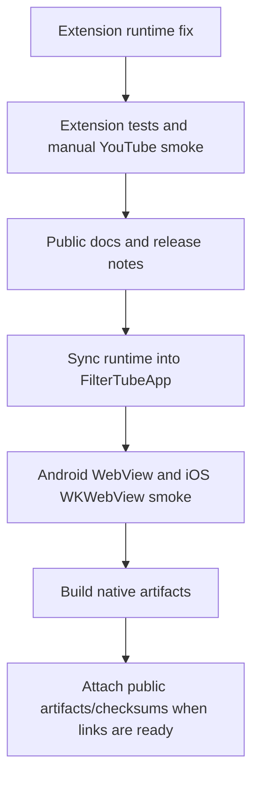

# App release and runtime sync workflow

Last updated: May 31, 2026.

This document is the release-order checklist for shipping FilterTube extension and native app updates together without losing the extension as the source of truth.

## Post-v3.3.5 source endpoint (2026-08-23)

The post-v3.3.5 extension checkpoint contains direct-access admission,
per-profile time and Self-Control policy, independent Blocked/Allowed rule
collections, large BlockTube migration, Advert Void, category hydration, and
experimental language/original-audio controls. Those behaviors are extension
source contracts first. They must be synced deliberately before claiming native
parity.

The 28-commit history from the v3.3.5 baseline is indexed in the public
[changelog](../CHANGELOG.md), while the dated runtime contracts remain in
[Functionality](FUNCTIONALITY.md), [Technical Documentation](TECHNICAL.md),
[Category behavior](CATEGORY_FILTER_CURRENT_BEHAVIOR_2026-08-08.md),
[Language behavior](LANGUAGE_FILTER_CURRENT_BEHAVIOR_2026-08-18.md), and the
[Self-Control audit](SELF_CONTROL_SESSION_SPEC_2026-08-17.md).

### Native synchronization boundary

- Run the sync command only after the extension source and focused tests are
  complete.
- Inspect the generated Android and iOS resource diff; do not hand-edit a
  generated runtime to create a second behavior path.
- Keep the Android custom Play/closed-testing app distinct from the simpler
  direct APK artifact. Direct artifact reuse (`4a658584`) is allowed only when
  the embedded version and versionCode are recorded honestly.
- Treat category/language/audio and Advert Void as evidence-gated on each native
  provider surface. An extension source test is not Android/iOS/TV playback
  proof.
- Keep native provider login, cookies, parent verification, and WebView/WKWebView
  ownership in the app repository; the sync step supplies runtime resources,
  not credentials or a replacement player/router.

## Why this exists

The Android and iOS apps bundle JavaScript runtime code copied from the public extension repository. That means extension filtering fixes must land here first, then be synced into the private app repository before the native apps are packaged.

The public `FilterTube` repository remains the release hub:

- extension source
- website
- public changelog
- GitHub Releases
- Android APK/AAB release assets
- checksums
- future store links

Website, dashboard, and release-surface changes from the current app release push are tracked in [Website and app release surface changelog](WEBSITE_APP_RELEASE_SURFACE_CHANGELOG.md).

The May 31 release-candidate documentation pass keeps this boundary explicit:

- Android phone/tablet is in final release testing / release setup until public Play Store or direct public links exist.
- iOS/iPad is in final release testing through the separate TestFlight/App Store path.
- Android TV / Fire TV are not part of the mobile/tablet MVP release and remain future separate packages.
- Runtime lag and correctness fixes must land in the extension first, then sync into the private native app repo before app packaging.

The private `FilterTubeApp` repository remains the native implementation workspace:

- Android app shell
- iOS/iPad app shell
- native control surfaces
- native WebView/WKWebView integration
- app-specific runtime wrappers

## Correct release order

1. Fix and test extension/runtime behavior in `/Users/devanshvarshney/FilterTube`.
2. Update extension docs, changelog, and public website copy if needed.
3. Sync extension runtime into `/Users/devanshvarshney/FilterTubeApp`.
4. Test Android and iOS native apps against the synced runtime.
5. Build signed Android artifacts in the app repo.
6. Copy or point the public release script at the Android artifact directory.
7. Build public extension ZIPs and optionally attach Android artifacts to the same GitHub release.
8. Update `filtertube.in/downloads` links/store labels when real channels become available.



## Runtime sync command

Run from the private app repo:

```bash
cd /Users/devanshvarshney/FilterTubeApp
node tools/sync-runtime-from-extension.mjs
```

Or run the public wrapper from this repo when `FilterTubeApp` is a sibling directory:

```bash
cd /Users/devanshvarshney/FilterTube
npm run sync:native-runtime
```

If the app repo is somewhere else:

```bash
FILTERTUBE_APP_REPO=/absolute/path/to/FilterTubeApp npm run sync:native-runtime
```

The sync script currently:

- copies selected extension files from `/Users/devanshvarshney/FilterTube`
- mirrors upstream extension source into `packages/extension-source/upstream`
- rebuilds Android `filtertube_runtime_full.js`
- writes the iOS runtime resource from the same generated bundle
- syncs Kids runtime, Nanah resources, Nanah engine, and release notes resources

Important rule: do not hand-edit generated app runtime assets for real filtering fixes. Fix the extension source first, then sync.

## Known app runtime copies

Current generated or mirrored native app runtime locations include:

```text
/Users/devanshvarshney/FilterTubeApp/apps/android/app/src/main/assets/filtertube_runtime_full.js
/Users/devanshvarshney/FilterTubeApp/apps/android/app/src/main/assets/filtertube_kids_runtime.js
/Users/devanshvarshney/FilterTubeApp/apps/ios/FilterTube/Resources/filtertube_runtime_full.js
/Users/devanshvarshney/FilterTubeApp/apps/ios/FilterTube/Resources/filtertube_kids_runtime.js
/Users/devanshvarshney/FilterTubeApp/packages/extension-source/upstream/
/Users/devanshvarshney/FilterTubeApp/packages/runtime-adapters/src/upstream/
/Users/devanshvarshney/FilterTubeApp/packages/runtime-bridge/src/upstream/
```

The normal release review should verify that these copies changed only because the sync script changed them.

## Android artifact release flow

Public repo release script:

```bash
cd /Users/devanshvarshney/FilterTube
FILTERTUBE_MOBILE_ARTIFACTS_DIR=/Users/devanshvarshney/FilterTubeApp/release-artifacts/android-mobile-tablet node build.js
```

The script will:

- build extension ZIPs
- stage the newest matching Android phone/tablet version and versionCode into `dist/mobile/`
- generate `.sha256` checksums
- ask whether to publish a GitHub release
- attach extension ZIPs, Android artifacts, and checksum files when publishing

Use `--all-mobile-artifacts` only for a special diagnostic release that intentionally needs multiple Android version codes attached.

Current v3.3.2 Android artifact pair from `/Users/devanshvarshney/FilterTubeApp/release-artifacts/android-mobile-tablet/`:

```text
FilterTube-mobile-tablet-v3.3.2-code30312-debug.apk
FilterTube-mobile-tablet-v3.3.2-code30312-release.aab
```

The release script filters by the current package version and then selects the highest `codeNNNN` artifacts, so older `code30310`/`code30311` files in the app artifact directory are not attached to the v3.3.2 release. There is no signed release APK in the current app artifact directory; if the debug APK is attached, it must be described as QA-only/direct-device validation.

If the extension release needs to attach the current MVP app while the app is
not being rebuilt at the same version, keep that mismatch explicit:

```bash
cd /Users/devanshvarshney/FilterTube
FILTERTUBE_MOBILE_ARTIFACTS_DIR=/Users/devanshvarshney/FilterTubeApp/release-artifacts/android-mobile-tablet \
FILTERTUBE_MOBILE_ARTIFACT_VERSION=3.3.2 \
node build.js
```

Interactive release builds now support the same safe reuse path. If you run
`npm run build`, answer `y` to Android artifacts, accept the default artifact
directory, and no Android files match the extension version, the script shows
the existing app artifact versions and asks whether to reuse the latest one.
For the current MVP app lane, choose that only when you intentionally want to
attach the existing app build to a newer extension release.

For example, a `v3.3.5` extension release can intentionally attach:

```text
FilterTube-mobile-tablet-v3.3.2-code30312-debug.apk
FilterTube-mobile-tablet-v3.3.2-code30312-release.aab
```

The generated release body will state that these are existing MVP app artifacts
reused for the extension release. Do not rename those files to `v3.3.5`; their
embedded app version/versionCode remains `v3.3.2-code30312`.

If the release is extension-only, do not provide `FILTERTUBE_MOBILE_ARTIFACTS_DIR` and decline the mobile artifact prompt.

## Changelog rule for major cross-platform releases

When extension and app ship together, the public changelog should include separate sections:

- Extension/runtime fixes
- Android phone/tablet app
- iOS/iPad app
- Sync/Nanah
- Website/downloads
- Known limitations

Do not hide app limitations inside vague release notes. If Android TV is not included, say that Android TV / Fire TV is a separate future package.

## Website rule

`filtertube.in/downloads` is the public front door. It should link to:

- browser store listings
- GitHub release ZIPs
- Android APK release assets
- Play Store link when public
- iOS/App Store link when public
- F-Droid/IzzyOnDroid links when accepted
- Accrescent only if the invite-only submission path opens for FilterTube

Screenshots should be added after Android and iOS visual QA is complete, not before.

## Pre-release checks

- Extension build passes.
- Whitelist/blocklist behavior is tested in extension before syncing.
- Runtime sync completed in app repo.
- Android WebView runtime smoke passed.
- iOS WKWebView runtime smoke passed.
- Nanah sync smoke passed if sync code changed.
- Public changelog has clear extension/app split.
- GitHub release assets include checksums for APKs.
- Website downloads page points to the intended release channel.
