# Architecture Documentation (v3.2.7)

## Overview

FilterTube v3.2.7 builds on the proactive channel identity system with performance optimizations, category filtering, and enhanced cross-browser support. This architecture documentation covers high-level design, filtering modes, memory management, and cross-browser compatibility.

## Filtering Modes Architecture (v3.2.5)

FilterTube v3.2.5 supports dual filtering modes: Blocklist and Whitelist, allowing users to control content visibility through allow/deny lists with significantly improved architecture.

### Blocklist Mode (Default)

Traditional filtering where content matching blocked channels or keywords is hidden:

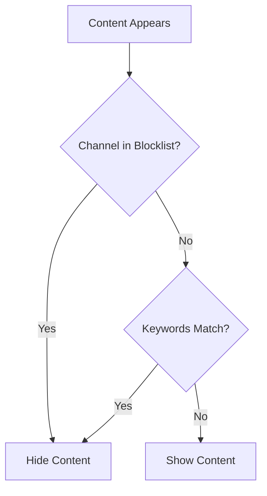
```mermaid
graph TD
    A[Content Appears] --> B{Channel in Blocklist?}
    B -->|Yes| C[Hide Content]
    B -->|No| D{Keywords Match?}
    D -->|Yes| C
    D -->|No| E[Show Content]
```

### Whitelist Mode

Content is hidden by default unless it matches whitelisted channels or keywords:

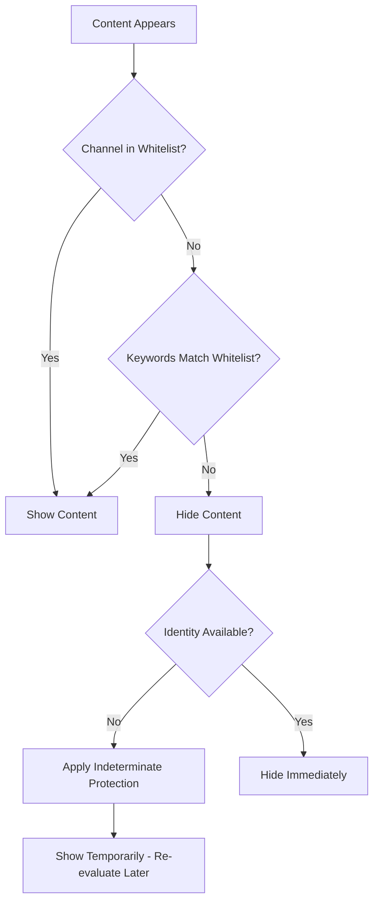
```mermaid
graph TD
    A[Content Appears] --> B{Channel in Whitelist?}

    B -->|Yes| C[Show Content]
    B -->|No| D{Keywords Match Whitelist?}
    D -->|Yes| C
    D -->|No| E[Hide Content]
    E --> F{Identity Available?}
    F -->|No| G[Apply Indeterminate Protection]
    F -->|Yes| H[Hide Immediately]
    G --> I[Show Temporarily - Re-evaluate Later]
```

### Mode Switching with Enhanced Staging

Users can switch modes with intelligent list migration and confirmation dialogs:

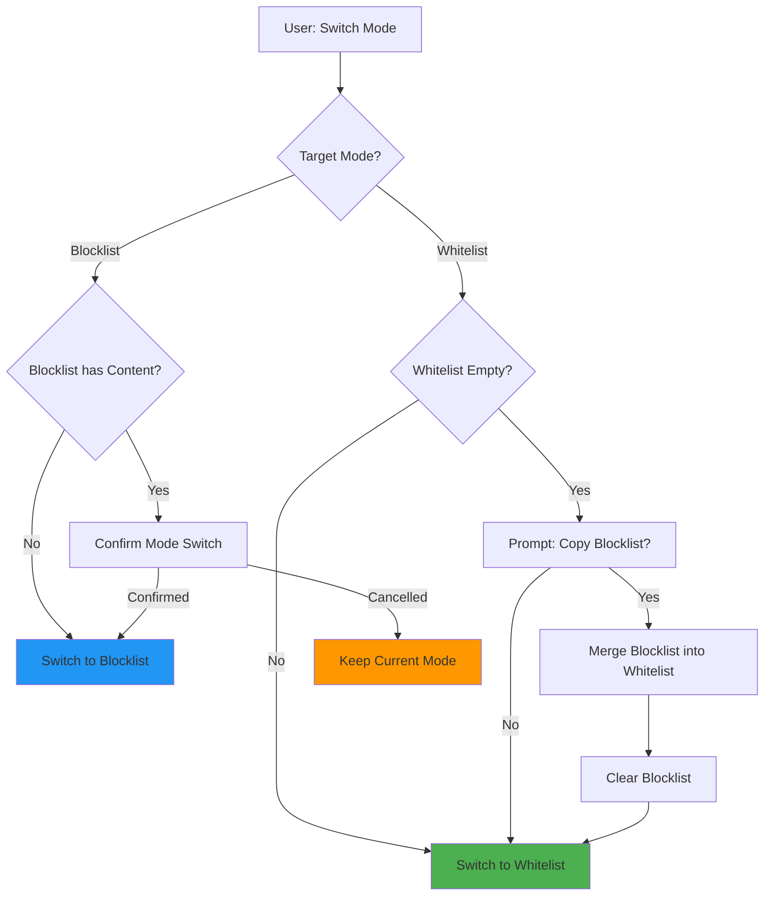
```mermaid
graph TD
    A[User: Switch Mode] --> B{Target Mode?}
    B -->|Whitelist| C{Whitelist Empty?}
    B -->|Blocklist| D{Blocklist has Content?}
    
    C -->|Yes| E[Prompt: Copy Blocklist?]
    C -->|No| F[Switch to Whitelist]
    
    D -->|Yes| G[Confirm Mode Switch]
    D -->|No| H[Switch to Blocklist]
    
    E -->|Yes| I[Merge Blocklist into Whitelist]
    E -->|No| F
    
    I --> J[Clear Blocklist]
    J --> F
    
    G -->|Confirmed| H
    G -->|Cancelled| K[Keep Current Mode]
    
    style F fill:#4caf50
    style H fill:#2196f3
    style K fill:#ff9800
```

**Mode Switching Implementation:**

```javascript
// Switching to Whitelist Mode
const switchToWhitelist = async (profile, copyBlocklist = true) => {
    if (copyBlocklist) {
        // Merge blocklist into whitelist
        profile.whitelistChannels = [...profile.whitelistChannels, ...profile.blockedChannels];
        profile.whitelistKeywords = [...profile.whitelistKeywords, ...profile.blockedKeywords];
        // Clear blocklist
        profile.blockedChannels = [];
        profile.blockedKeywords = [];
    }
    profile.mode = 'whitelist';
};
```

## UI/UX Architecture (v3.2.2)

### Optimistic Update System

The optimistic update system provides immediate visual feedback while maintaining data integrity:

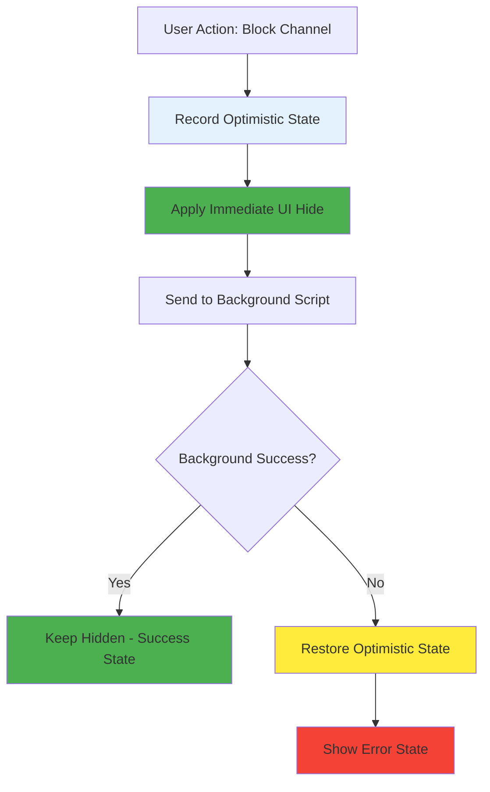
```mermaid
graph TD
    A[User Action: Block Channel] --> B[Record Optimistic State]
    B --> C[Apply Immediate UI Hide]
    C --> D[Send to Background Script]
    D --> E{Background Success?}
    E -->|Yes| F[Keep Hidden - Success State]
    E -->|No| G[Restore Optimistic State]
    G --> H[Show Error State]
    
    style B fill:#e3f2fd
    style C fill:#4caf50
    style F fill:#4caf50
    style G fill:#ffeb3b
    style H fill:#f44336
```

**Components:**

- **State Recording**: Captures DOM state before changes
- **Immediate Updates**: Applies visual changes instantly
- **Error Recovery**: Restores original state if operations fail
- **User Feedback**: Shows success/error states appropriately

### Mobile Menu Architecture

Enhanced mobile menu support with platform-specific rendering:

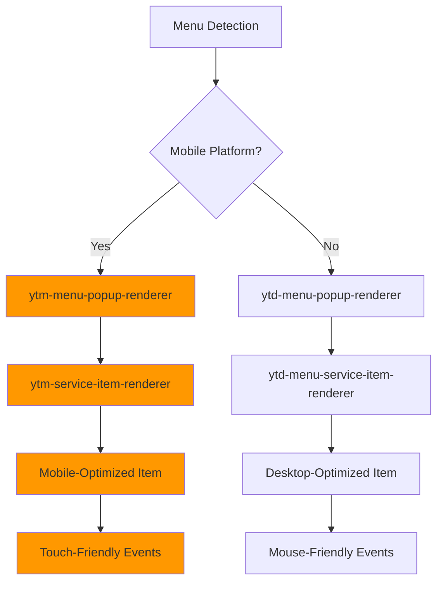
```mermaid
graph TD
    A[Menu Detection] --> B{Mobile Platform?}
    B -->|Yes| C[ytm-menu-popup-renderer]
    B -->|No| D[ytd-menu-popup-renderer]
    C --> E[ytm-service-item-renderer]
    D --> F[ytd-menu-service-item-renderer]
    E --> G[Mobile-Optimized Item]
    F --> H[Desktop-Optimized Item]
    G --> I[Touch-Friendly Events]
    H --> J[Mouse-Friendly Events]
    
    style C fill:#ff9800
    style E fill:#ff9800
    style G fill:#ff9800
    style I fill:#ff9800
```

**Mobile Enhancements:**

- **Platform Detection**: Automatically detects mobile vs desktop
- **Renderer Selection**: Uses appropriate renderer tags and scopes
- **Touch Optimization**: Maintains proper touch interactions
- **Bottom Sheet Support**: Handles mobile bottom-sheet containers

## Core Architecture (v3.2.1)

### Proactive Network Interception System

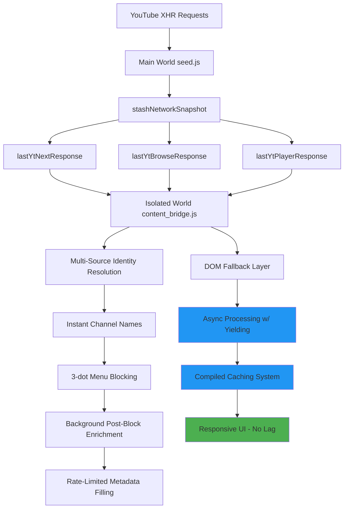
```mermaid
graph TD
    A[YouTube XHR Requests] --> B[Main World seed.js]
    B --> C[stashNetworkSnapshot]
    C --> D[lastYtNextResponse]
    C --> E[lastYtBrowseResponse]
    C --> F[lastYtPlayerResponse]
    
    D --> G[Isolated World content_bridge.js]
    E --> G
    F --> G
    
    G --> H[Multi-Source Identity Resolution]
    H --> I[Instant Channel Names]
    I --> J[3-dot Menu Blocking]
    
    J --> K[Background Post-Block Enrichment]
    K --> L[Rate-Limited Metadata Filling]
    
    G --> M[DOM Fallback Layer]
    M --> N[Async Processing w/ Yielding]
    N --> O[Compiled Caching System]
    O --> P[Responsive UI - No Lag]
    
    style N fill:#2196f3
    style O fill:#2196f3
    style P fill:#4caf50
```

### Network Snapshot Architecture

```javascript
// In seed.js - comprehensive network interception
function stashNetworkSnapshot(data, dataName) {
    if (dataName.includes('/youtubei/v1/next')) {
        window.filterTube.lastYtNextResponse = data;
        window.filterTube.lastYtNextResponseTs = Date.now();
    }
    if (dataName.includes('/youtubei/v1/browse')) {
        window.filterTube.lastYtBrowseResponse = data;
        window.filterTube.lastYtBrowseResponseTs = Date.now();
    }
    if (dataName.includes('/youtubei/v1/player')) {
        window.filterTube.lastYtPlayerResponse = data;
        window.filterTube.lastYtPlayerResponseTs = Date.now();
    }
}
```

**Intercepted endpoints:**
- `/youtubei/v1/next` – Home feed, watch next, recommendations
- `/youtubei/v1/browse` – Channel pages, search, Kids content
- `/youtubei/v1/player` – Video player metadata, Shorts data

## Component Architecture

### Main World Components

#### `seed.js` - Network Interception Engine
- **Purpose**: Hook into YouTube's XHR requests and stash responses
- **Key Functions**: `stashNetworkSnapshot()`, `FilterTubeEngine.process()`
- **Data Flow**: YouTube XHR → Snapshot Storage → Cross-world Messaging

#### `injector.js` - Identity Resolution Engine
- **Purpose**: Extract channel identity from multiple data sources
- **Key Functions**: `searchYtInitialDataForVideoChannel()`, `extractCollaboratorsFromDataObject()`
- **Data Sources**: Stashed snapshots, page globals, DOM data

### Isolated World Components

#### `content_bridge.js` - UI Bridge
- **Purpose**: Bridge between main world data and UI components
- **Key Functions**: `prefetchIdentityForCard()`, `injectFilterTubeMenuItem()`, `handleBlockChannelClick()`
- **Data Flow**: Main World → UI Updates → Background Messages

#### `dom_fallback.js` - DOM Processing
- **Purpose**: Process DOM elements when structured data fails
- **Key Functions**: `applyDOMFallback()`, `shouldHideContent()`
- **Fallback Strategy**: Last resort when structured data unavailable

### Background Script Components

#### `background.js` - Data Management
- **Purpose**: Persistent storage, API calls, enrichment scheduling
- **Key Functions**: `handleAddFilteredChannel()`, `schedulePostBlockEnrichment()`, `fetchChannelInfo()`
- **Storage**: Chrome storage API, profile management

## Data Flow Architecture

### Proactive Identity Resolution Flow

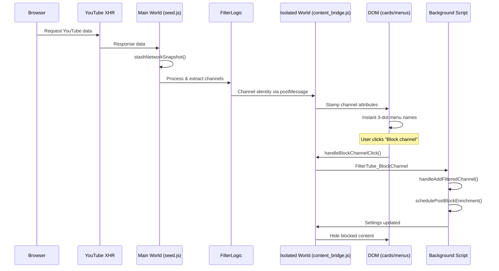
```mermaid
sequenceDiagram
    participant Browser
    participant XHR as YouTube XHR
    participant Main as Main World (seed.js)
    participant Filter as FilterLogic
    participant Isolated as Isolated World (content_bridge.js)
    participant DOM as DOM (cards/menus)
    participant BG as Background Script

    Browser->>XHR: Request YouTube data
    XHR->>Main: Response data
    Main->>Main: stashNetworkSnapshot()
    Main->>Filter: Process & extract channels
    Filter->>Isolated: Channel identity via postMessage
    Isolated->>DOM: Stamp channel attributes
    DOM->>DOM: Instant 3-dot menu names
    
    Note over DOM: User clicks "Block channel"
    DOM->>Isolated: handleBlockChannelClick()
    Isolated->>BG: FilterTube_BlockChannel
    BG->>BG: handleAddFilteredChannel()
    BG->>BG: schedulePostBlockEnrichment()
    BG->>Isolated: Settings updated
    Isolated->>DOM: Hide blocked content
```

### Post-Block Enrichment Flow

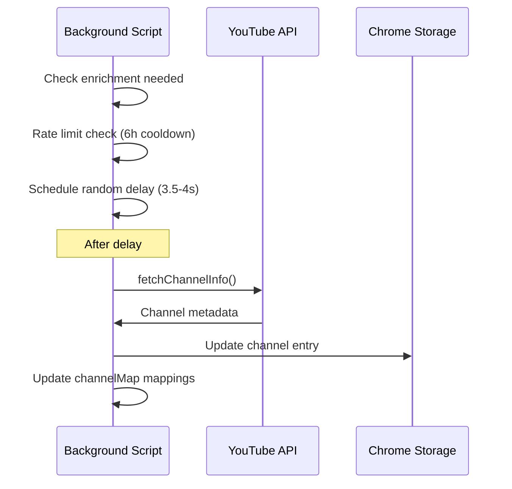
```mermaid
sequenceDiagram
    participant BG as Background Script
    participant API as YouTube API
    participant Storage as Chrome Storage
    
    BG->>BG: Check enrichment needed
    BG->>BG: Rate limit check (6h cooldown)
    BG->>BG: Schedule random delay (3.5-4s)
    
    Note over BG: After delay
    BG->>API: fetchChannelInfo()
    API->>BG: Channel metadata
    BG->>Storage: Update channel entry
    BG->>BG: Update channelMap mappings
```

### Video Metadata Extraction Flow (Content Filters)

FilterTube extracts and persists video metadata (duration, publish/upload dates) to enable content-based filtering:

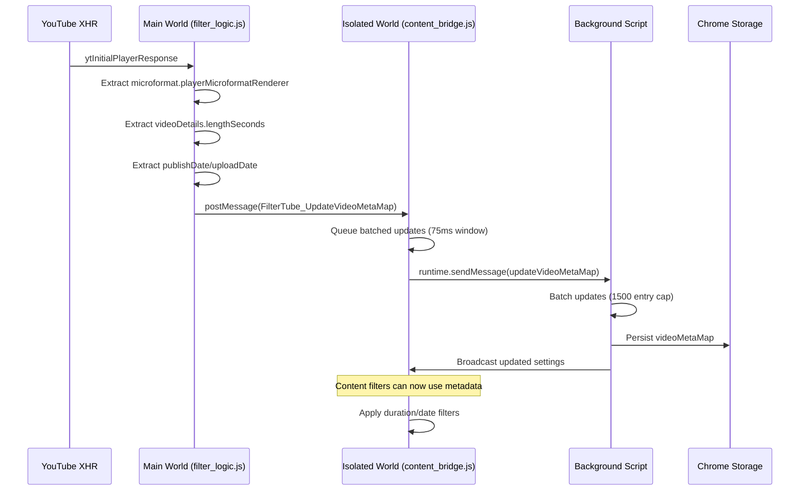
```mermaid
sequenceDiagram
    participant YT as YouTube XHR
    participant Main as Main World (filter_logic.js)
    participant Bridge as Isolated World (content_bridge.js)
    participant BG as Background Script
    participant Storage as Chrome Storage
    
    YT->>Main: ytInitialPlayerResponse
    Main->>Main: Extract microformat.playerMicroformatRenderer
    Main->>Main: Extract videoDetails.lengthSeconds
    Main->>Main: Extract publishDate/uploadDate
    
    Main->>Bridge: postMessage(FilterTube_UpdateVideoMetaMap)
    Bridge->>Bridge: Queue batched updates (75ms window)
    Bridge->>BG: runtime.sendMessage(updateVideoMetaMap)
    
    BG->>BG: Batch updates (1500 entry cap)
    BG->>Storage: Persist videoMetaMap
    BG->>Bridge: Broadcast updated settings
    
    Note over Bridge: Content filters can now use metadata
    Bridge->>Bridge: Apply duration/date filters
```

**Extraction Sources (Priority Order):**

1. **Player Microformat** (Primary):
   - `microformat.playerMicroformatRenderer.lengthSeconds` - Video duration (numeric string)
   - `microformat.playerMicroformatRenderer.publishDate` - ISO date string (e.g., "2024-01-15")
   - `microformat.playerMicroformatRenderer.uploadDate` - ISO datetime string (e.g., "2024-01-15T10:30:00Z")

2. **Video Details** (Secondary):
   - `videoDetails.lengthSeconds` - Fallback duration source

3. **DOM Overlays** (Tertiary):
   - `thumbnailOverlays[].thumbnailOverlayTimeStatusRenderer.text` - Duration badges (e.g., "1:38:14")
   - `lengthText.simpleText` - Duration text
   - `publishedTimeText.simpleText` - Relative time (e.g., "5 years ago")

4. **Cached videoMetaMap** (Fallback):
   - Persistent storage lookup by videoId

**Data Structure:**

```javascript
videoMetaMap: {
    'dQw4w9WgXcQ': {
        lengthSeconds: 212,                    // Numeric or string "212"
        publishDate: '2009-10-25',             // ISO date
        uploadDate: '2009-10-25T07:05:00Z'     // ISO datetime
    }
}
```

**Batching System:**

- Updates queued in `pendingVideoMetaUpdates` array
- Flush timer: 75ms debounce window
- Deduplication: Signature-based (`videoId|length|publish|upload`)
- Cache eviction: 6000 entry limit (removes oldest 1500 when exceeded)
- Storage cap: 1500 entries (enforced on flush)

### Content-Based Filtering Architecture

Three new content filters use `videoMetaMap` data:

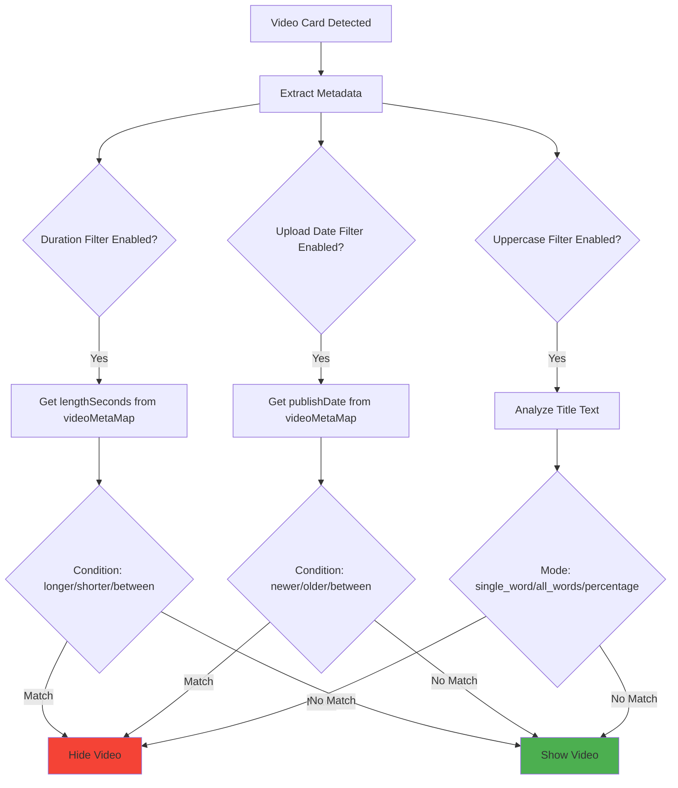
```mermaid
graph TD
    A[Video Card Detected] --> B[Extract Metadata]
    
    B --> C{Duration Filter Enabled?}
    B --> D{Upload Date Filter Enabled?}
    B --> E{Uppercase Filter Enabled?}
    
    C -->|Yes| F[Get lengthSeconds from videoMetaMap]
    D -->|Yes| G[Get publishDate from videoMetaMap]
    E -->|Yes| H[Analyze Title Text]
    
    F --> I{Condition: longer/shorter/between}
    G --> J{Condition: newer/older/between}
    H --> K{Mode: single_word/all_words/percentage}
    
    I -->|Match| L[Hide Video]
    J -->|Match| L
    K -->|Match| L
    
    I -->|No Match| M[Show Video]
    J -->|No Match| M
    K -->|No Match| M
    
    style L fill:#f44336
    style M fill:#4caf50
```

**Duration Filter:**

```javascript
contentFilters.duration = {
    enabled: true,
    condition: 'between',    // 'longer' | 'shorter' | 'between'
    minMinutes: 5,
    maxMinutes: 20
};

// Logic
const durationSeconds = videoMetaMap[videoId]?.lengthSeconds || extractFromDOM();
const durationMinutes = durationSeconds / 60;

if (condition === 'longer') hideIfTrue = durationMinutes > minMinutes;
if (condition === 'shorter') hideIfTrue = durationMinutes < minMinutes;
if (condition === 'between') hideIfTrue = durationMinutes < minMinutes || durationMinutes > maxMinutes;
```

**Upload Date Filter:**

```javascript
contentFilters.uploadDate = {
    enabled: true,
    condition: 'newer',      // 'newer' | 'older' | 'between'
    fromDate: '2024-01-01',
    toDate: '2024-12-31'
};

// Logic
const publishDate = videoMetaMap[videoId]?.publishDate || parseRelativeTime('5 years ago');
const timestamp = new Date(publishDate).getTime();

if (condition === 'newer') hideIfTrue = timestamp > fromTimestamp;
if (condition === 'older') hideIfTrue = timestamp < fromTimestamp;
if (condition === 'between') hideIfTrue = timestamp < fromTimestamp || timestamp > toTimestamp;
```

**Uppercase Filter:**

```javascript
contentFilters.uppercase = {
    enabled: true,
    mode: 'single_word',     // 'single_word' | 'all_words' | 'percentage'
    minWordLength: 2
};

// Logic (single_word mode)
const words = title.split(/\s+/);
for (const word of words) {
    if (word.length < minWordLength) continue;
    if (word === word.toUpperCase() && /[A-Z]/.test(word)) {
        hideIfTrue = true;
        break;
    }
}
```

### Category Filtering Architecture (v3.2.7)

FilterTube v3.2.7 introduces category-based filtering using YouTube's video category metadata:

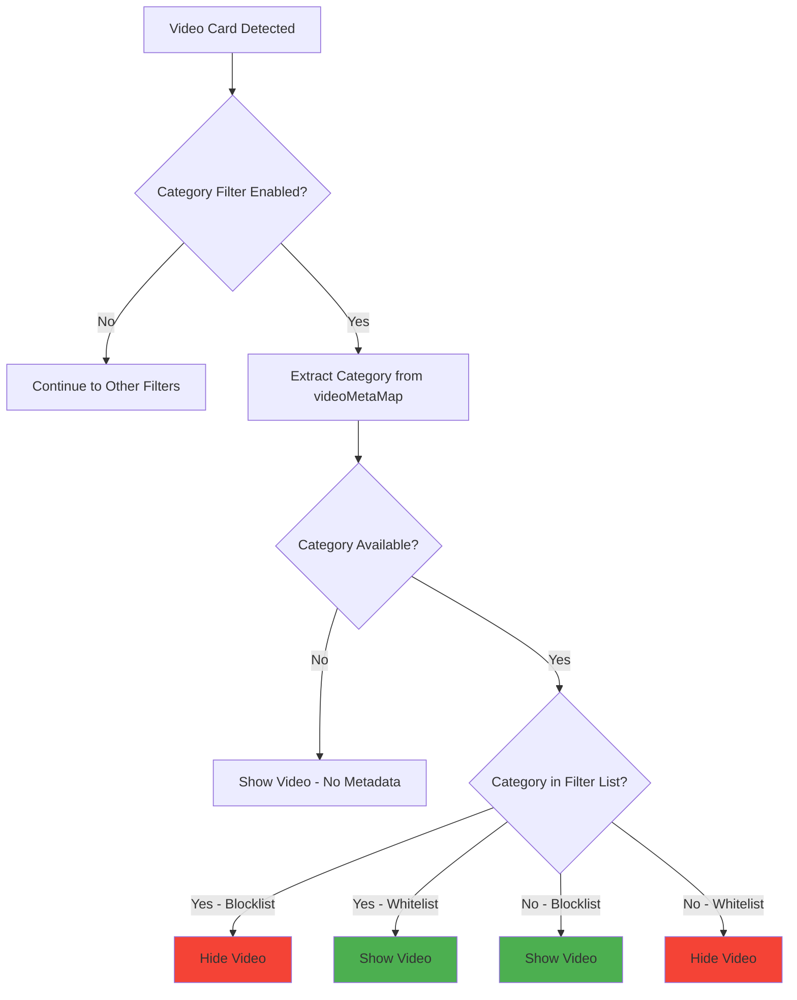
```mermaid
graph TD
    A[Video Card Detected] --> B{Category Filter Enabled?}
    B -->|No| C[Continue to Other Filters]
    B -->|Yes| D[Extract Category from videoMetaMap]
    D --> E{Category Available?}
    E -->|No| F[Show Video - No Metadata]
    E -->|Yes| G{Category in Filter List?}
    G -->|Yes - Blocklist| H[Hide Video]
    G -->|Yes - Whitelist| I[Show Video]
    G -->|No - Blocklist| J[Show Video]
    G -->|No - Whitelist| K[Hide Video]
    
    style H fill:#f44336
    style K fill:#f44336
    style I fill:#4caf50
    style J fill:#4caf50
```

**Category Data Structure:**

```javascript
videoMetaMap: {
    'dQw4w9WgXcQ': {
        lengthSeconds: 212,
        publishDate: '2009-10-25',
        uploadDate: '2009-10-25T07:05:00Z',
        category: 'Music'  // YouTube category name
    }
}

contentFilters.category = {
    enabled: true,
    mode: 'blocklist',       // 'blocklist' | 'whitelist'
    categories: ['Gaming', 'Music']
};
```

**Supported YouTube Categories:**
- Music, Gaming, Entertainment, News & Politics
- Education, Science & Technology, Sports
- Film & Animation, People & Blogs
- Comedy, Howto & Style, Autos & Vehicles
- Travel & Events, Pets & Animals, Nonprofits & Activism

### Memory Management Architecture (v3.2.7)

#### LRU Eviction for videoMetaMap

FilterTube v3.2.7 implements LRU (Least Recently Used) eviction to prevent unbounded memory growth:

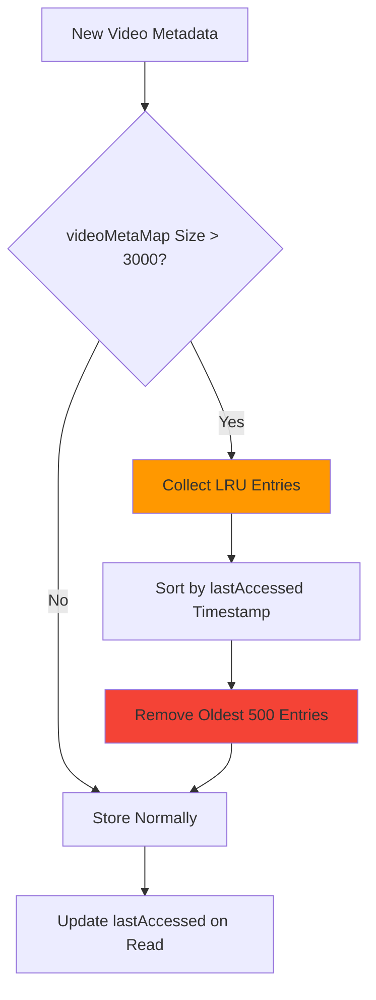
```mermaid
graph TD
    A[New Video Metadata] --> B{videoMetaMap Size > 3000?}
    B -->|No| C[Store Normally]
    B -->|Yes| D[Collect LRU Entries]
    D --> E[Sort by lastAccessed Timestamp]
    E --> F[Remove Oldest 500 Entries]
    F --> C
    C --> G[Update lastAccessed on Read]
    
    style D fill:#ff9800
    style F fill:#f44336
```

**Implementation:**

```javascript
// LRU eviction in background.js
const MAX_VIDEO_META_ENTRIES = 3000;
const EVICT_COUNT = 500;

function evictLRUEntries(videoMetaMap) {
    const entries = Object.entries(videoMetaMap);
    if (entries.length <= MAX_VIDEO_META_ENTRIES) return videoMetaMap;
    
    // Sort by lastAccessed (oldest first)
    entries.sort((a, b) => (a[1].lastAccessed || 0) - (b[1].lastAccessed || 0));
    
    // Remove oldest entries
    const toRemove = entries.slice(0, entries.length - MAX_VIDEO_META_ENTRIES + EVICT_COUNT);
    for (const [videoId] of toRemove) {
        delete videoMetaMap[videoId];
    }
    
    return videoMetaMap;
}
```

#### Pending-Meta Shimmer with TTL

The pending-meta shimmer system prevents stale "fetching metadata" states:

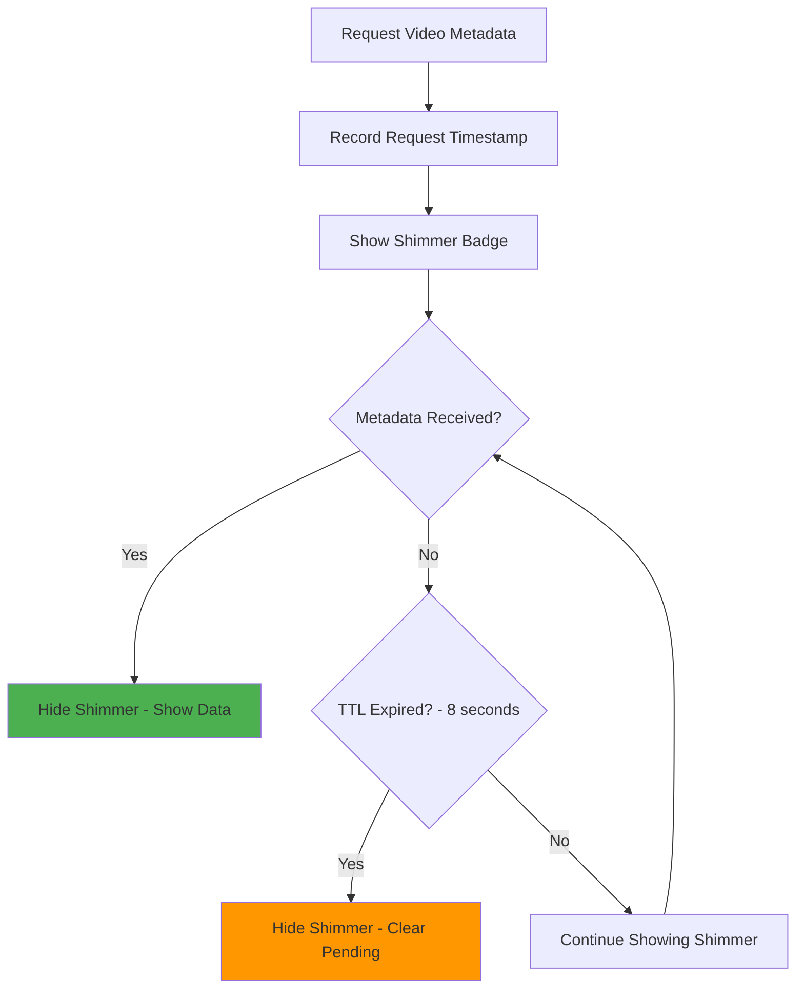
```mermaid
graph TD
    A[Request Video Metadata] --> B[Record Request Timestamp]
    B --> C[Show Shimmer Badge]
    C --> D{Metadata Received?}
    D -->|Yes| E[Hide Shimmer - Show Data]
    D -->|No| F{TTL Expired? - 8 seconds}
    F -->|Yes| G[Hide Shimmer - Clear Pending]
    F -->|No| H[Continue Showing Shimmer]
    H --> D
    
    style E fill:#4caf50
    style G fill:#ff9800
```

**TTL Cleanup:**

```javascript
const PENDING_META_TTL_MS = 8000; // 8 seconds

function cleanupStalePendingMeta() {
    const now = Date.now();
    const keys = Object.keys(lastWatchMetaFetchAttempt);
    for (const key of keys) {
        if (now - lastWatchMetaFetchAttempt[key] > PENDING_META_TTL_MS) {
            delete lastWatchMetaFetchAttempt[key];
        }
    }
}
```

**Safe Key-Collection Pattern:**
```javascript
// Safe iteration - copy keys before deleting
const keys = Object.keys(map);
for (const key of keys) {
    if (shouldDelete(map[key])) {
        delete map[key]; // Safe: iterating over copied array
    }
}
```

### Quick-Block Card Action Architecture (v3.2.7)

FilterTube adds an optional direct card-level block action in the Isolated World:

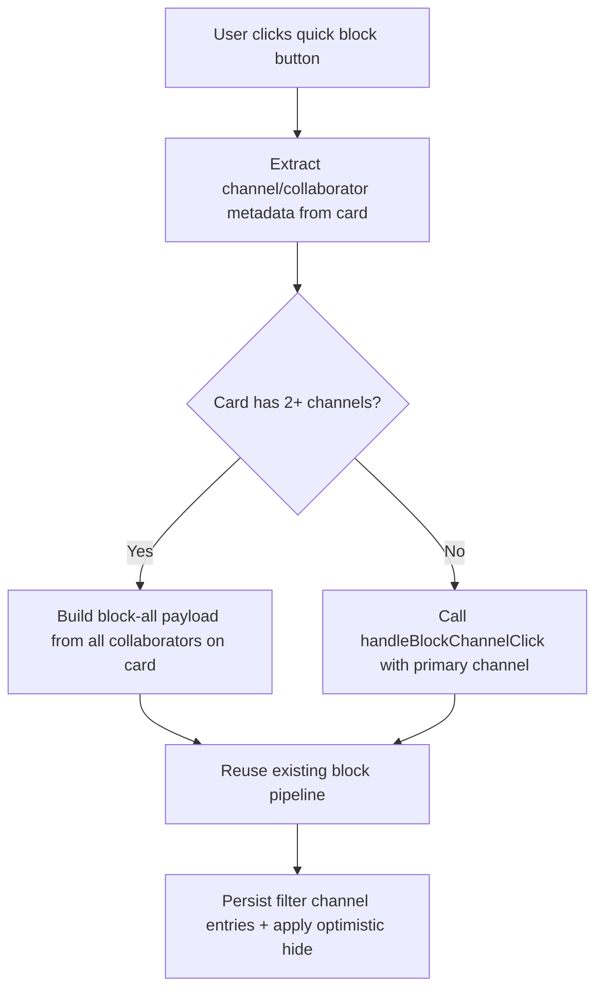
```mermaid
graph TD
    A[User clicks quick block button] --> B[Extract channel/collaborator metadata from card]
    B --> C{Card has 2+ channels?}
    C -->|No| D[Call handleBlockChannelClick with primary channel]
    C -->|Yes| E[Build block-all payload from all collaborators on card]
    E --> F[Reuse existing block pipeline]
    D --> F
    F --> G[Persist filter channel entries + apply optimistic hide]
```

Key implementation points:
- Controlled by `showQuickBlockButton` setting.
- Default-on in v3.2.7 via a one-time migration (`quickBlockDefaultV327Applied`) so it is enabled once without being re-forced in future updates.
- Single tap only (no extra quick menu).
- Reuses existing channel-block handlers (no parallel logic fork).
- For collaborator cards, one tap blocks every channel on that card.
- Applies on YouTube Main and YouTube Kids with profile-aware persistence.
- Comment-origin block actions are context-isolated to comment nodes; they skip playlist/video prefetch identity merges and videoId fallback lookups.
- Pointer tracking keeps hover active while inside host/anchor bounds, stabilizing the cross button on Search overlays and Home Shorts.

## Storage Architecture

### Profile-Aware Storage Structure

```javascript
// v3.2.1 Profile Architecture
const profilesV4 = {
    activeId: 'default',
    profiles: {
        'default': {
            id: 'default',
            name: 'Main Profile',
            settings: {
                main: {
                    blockedChannels: [channelData],
                    blockedKeywords: ['keyword'],
                    contentControls: { hideShorts: false }
                },
                kids: {
                    blockedChannels: [channelData],
                    blockedKeywords: ['keyword'],
                    contentControls: { hideShorts: false }
                }
            },
            security: {
                masterPin: 'encrypted',
                sessionPin: 'cached'
            }
        },
        'kids': {
            id: 'kids',
            name: 'Kids Profile',
            settings: {
                main: { /* empty */ },
                kids: {
                    blockedChannels: [channelData],
                    blockedKeywords: ['keyword']
                }
            }
        }
    }
};
```

### Channel Data Structure (v3.2.1)

```javascript
const channelData = {
    id: 'UC...',                    // Primary UC ID
    handle: '@handle',              // Normalized handle
    name: 'Channel Name',           // Sanitized display name
    handleDisplay: '@handle',       // UI display handle
    canonicalHandle: '@handle',     // Original handle
    logo: 'https://...',           // Channel avatar URL
    customUrl: 'c/name',            // Custom URL for legacy channels
    filterAll: false,               // Filter all content flag
    filterAllComments: true,       // Filter all comments flag
    collaborationGroupId: null,      // Collaboration group ID
    collaborationWith: ['@handle'], // Collaboration partners
    originalInput: '@handle',       // User's original input
    source: '3dot',                 // Blocking source
    addedAt: Date.now()             // Timestamp
};
```

## Cross-World Communication

### Message Passing Architecture

```javascript
// Main World → Isolated World
window.postMessage({
    type: 'FilterTube_UpdateVideoChannelMap',
    payload: { videoId: 'abc123', channelId: 'UC...' }
}, '*');

// Isolated World → Background Script
chrome.runtime.sendMessage({
    action: 'FilterTube_BlockChannel',
    channel: { id: 'UC...', handle: '@handle', name: 'Channel Name' },
    profile: 'main'
});

// Background → Isolated World
chrome.tabs.sendMessage(tabId, {
    action: 'FilterTube_SettingsUpdated',
    settings: updatedSettings
});
```

## Performance Architecture (v3.2.1 Performance Optimizations)

### Lag-Free Processing System

FilterTube v3.2.1 introduces major performance optimizations that eliminate user-perceived lag through:

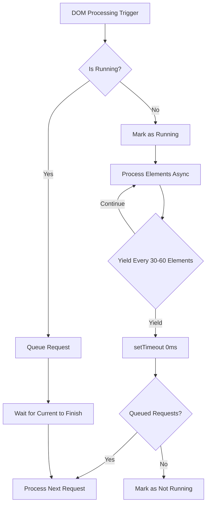
```mermaid
graph TD
    A[DOM Processing Trigger] --> B{Is Running?}
    B -->|No| C[Mark as Running]
    B -->|Yes| D[Queue Request]
    C --> E[Process Elements Async]
    E --> F{Yield Every 30-60 Elements}
    F -->|Continue| E
    F -->|Yield| G[setTimeout 0ms]
    G --> H{Queued Requests?}
    H -->|Yes| I[Process Next Request]
    H -->|No| J[Mark as Not Running]
    D --> K[Wait for Current to Finish]
    K --> I
```

1. **Async DOM Processing with Main Thread Yielding**
   - `applyDOMFallback()` now uses async/await with `yieldToMain()` calls every 30-60 elements
   - Prevents browser freezing during large DOM processing operations
   - Maintains responsive UI even during heavy filtering

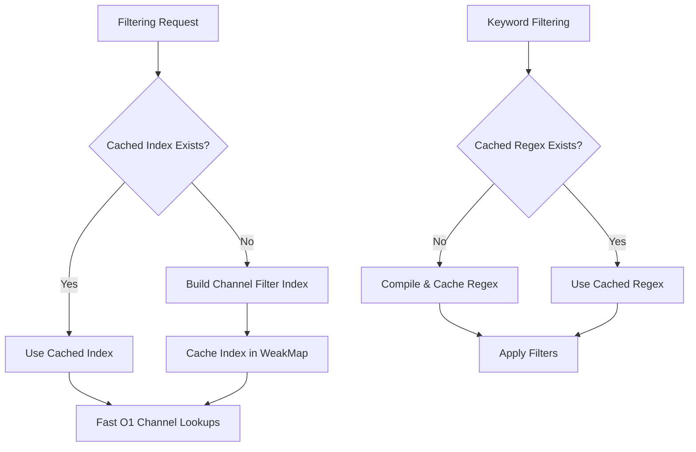
```mermaid
graph TD
    A[Filtering Request] --> B{Cached Index Exists?}
    B -->|No| C[Build Channel Filter Index]
    B -->|Yes| D[Use Cached Index]
    C --> E[Cache Index in WeakMap]
    D --> F[Fast O1 Channel Lookups]
    E --> F
    
    G[Keyword Filtering] --> H{Cached Regex Exists?}
    H -->|No| I[Compile & Cache Regex]
    H -->|Yes| J[Use Cached Regex]
    I --> K[Apply Filters]
    J --> K
```

2. **Compiled Regex & Channel Filter Caching**
   - Keyword regexes cached via `compiledKeywordRegexCache`
   - Channel filter indexes cached via `compiledChannelFilterIndexCache`
   - Eliminates repeated regex compilation for the same patterns

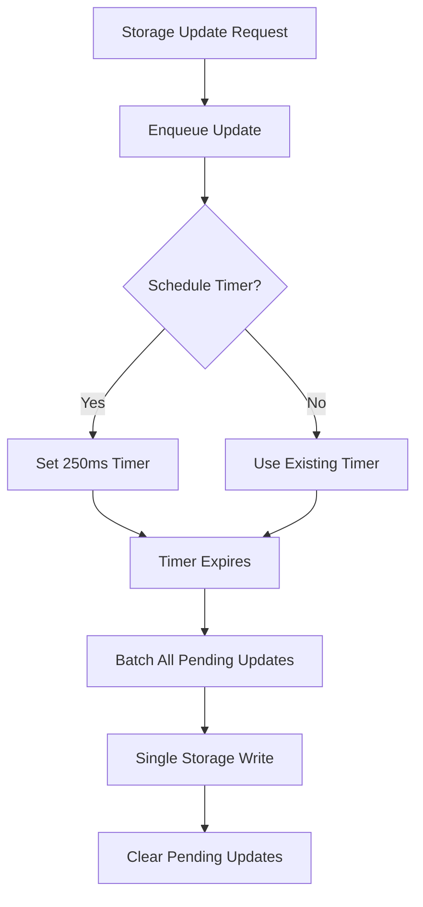
```mermaid
graph TD
    A[Storage Update Request] --> B[Enqueue Update]
    B --> C{Schedule Timer?}
    C -->|No| D[Use Existing Timer]
    C -->|Yes| E[Set 250ms Timer]
    E --> F[Timer Expires]
    D --> F
    F --> G[Batch All Pending Updates]
    G --> H[Single Storage Write]
    H --> I[Clear Pending Updates]
```

3. **Batched Storage Updates**
   - Channel map updates batched with 250ms flush intervals
   - Reduces storage I/O operations by 70-90%
   - Prevents storage contention during rapid updates

4. **Debounced Settings Refresh**
   - Settings updates throttled to prevent excessive DOM reprocessing
   - Minimum 250ms intervals between refresh operations

### Browser Performance Characteristics

**Chromium-based Browsers (Chrome, Edge, Opera):**
- ✅ Excellent performance - lag virtually eliminated
- ✅ Async yielding highly effective
- ✅ Storage batching provides maximum efficiency

**Firefox-based Browsers:**
- ⚠️ Good improvements but less dramatic
- ⚠️ Async yielding some effectiveness but needs tuning
- ⚠️ Storage operations may need different batching strategy
- 🔧 Ongoing optimization work required

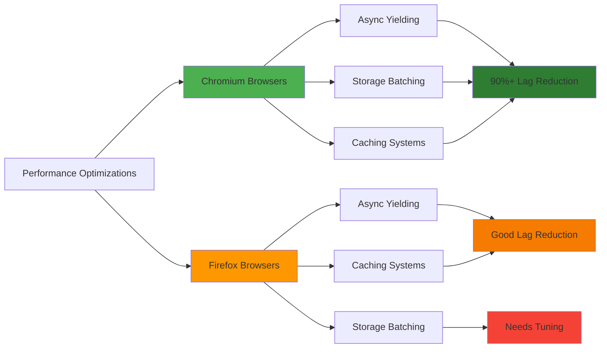
```mermaid
graph LR
    A[Performance Optimizations] --> B[Chromium Browsers]
    A --> C[Firefox Browsers]
    
    B --> D[Async Yielding]
    B --> E[Storage Batching]
    B --> F[Caching Systems]
    
    D --> G[90%+ Lag Reduction]
    E --> G
    F --> G
    
    C --> H[Async Yielding]
    C --> I[Storage Batching]
    C --> J[Caching Systems]
    
    H --> K[Good Lag Reduction]
    I --> L[Needs Tuning]
    J --> K
    
    style B fill:#4caf50
    style G fill:#2e7d32
    style C fill:#ff9800
    style K fill:#f57c00
    style L fill:#f44336
```

### Caching Strategy (v3.2.1+ Enhanced)

```javascript
// Multi-level caching architecture
const cacheHierarchy = {
    // Level 1: In-memory snapshots (most recent)
    networkSnapshots: {
        lastYtNextResponse: { data, timestamp },
        lastYtBrowseResponse: { data, timestamp },
        lastYtPlayerResponse: { data, timestamp }
    },
    
    // Level 2: Channel mappings (handle ↔ UC ID)
    channelMap: {
        '@handle': 'UC...',
        'UC...': '@handle',
        'c/name': 'UC...'
    },
    
    // Level 3: Video mappings (videoId → UC ID)
    videoChannelMap: {
        'videoId1': 'UC...',
        'videoId2': 'UC...'
    },
    
    // Level 3.5: Video metadata (duration, dates)
    videoMetaMap: {
        'videoId1': {
            lengthSeconds: 317,      // Numeric or string
            publishDate: '2024-01-15',
            uploadDate: '2024-01-15T10:30:00Z'
        }
    },
    
    // Level 4: Persistent storage (Chrome storage)
    persistentStorage: {
        profilesV4: { /* profile data */ },
        channelMap: { /* mappings */ },
        videoMetaMap: { /* video metadata */ }
    }
};
```

### Rate Limiting Architecture

```javascript
// Multi-dimensional rate limiting
const rateLimiting = {
    // Post-block enrichment: 6-hour cooldown per channel
    postBlockEnrichment: {
        key: `${profile}:${channelId.toLowerCase()}`,
        cooldown: 6 * 60 * 60 * 1000, // 6 hours
        storage: postBlockEnrichmentAttempted
    },
    
    // API calls: per-request throttling
    apiCalls: {
        key: `${endpoint}:${channelId}`,
        cooldown: 1000, // 1 second
        storage: pendingApiCalls
    },
    
    // DOM updates: debounced processing
    domUpdates: {
        key: 'domFallback',
        debounce: 100, // 100ms
        storage: debouncedUpdate
    }
};
```

## Error Handling Architecture

### Fallback Hierarchy

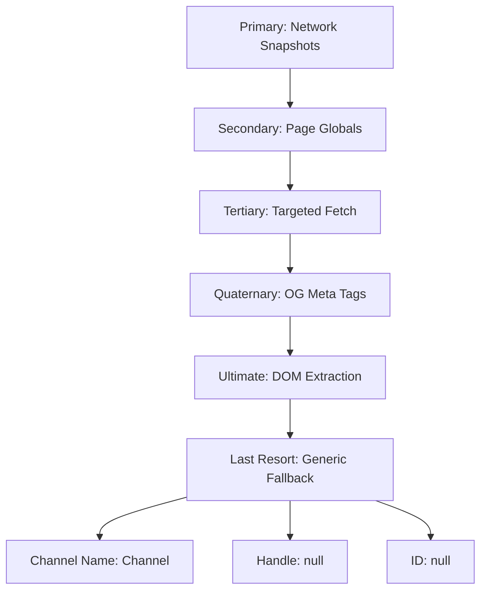
```mermaid
graph TD
    A[Primary: Network Snapshots] --> B[Secondary: Page Globals]
    B --> C[Tertiary: Targeted Fetch]
    C --> D[Quaternary: OG Meta Tags]
    D --> E[Ultimate: DOM Extraction]
    E --> F[Last Resort: Generic Fallback]
    
    F --> G[Channel Name: Channel]
    F --> H[Handle: null]
    F --> I[ID: null]
```

### Error Recovery Strategies

```javascript
// Multi-level error recovery
const errorRecovery = {
    // Network errors: CORS handling
    networkErrors: {
        detection: 'TypeError && message.includes("CORS")',
        action: 'fetchAlternativeMethod()',
        fallback: 'ogMetaExtraction()'
    },
    
    // Data parsing errors: graceful degradation
    parsingErrors: {
        detection: 'try/catch around JSON.parse',
        action: 'use alternative data sources',
        fallback: 'DOM extraction'
    },
    
    // Storage errors: local fallback
    storageErrors: {
        detection: 'chrome.storage API failures',
        action: 'use in-memory cache',
        fallback: 're-initialize from defaults'
    }
};
```

## Security Architecture

### Data Validation

```javascript
// Input sanitization and validation
const validationLayer = {
    // Channel name validation
    channelName: {
        rules: [
            'reject if starts with "@"',
            'reject if looks like UC ID',
            'reject if contains "•"',
            'reject if contains view/ago/watching'
        ],
        sanitizer: 'sanitizePersistedChannelName()'
    },
    
    // Handle validation
    handle: {
        rules: [
            'must start with "@"',
            'must be valid UTF-8',
            'must not contain invalid characters'
        ],
        normalizer: 'normalizeHandleValue()'
    },
    
    // UC ID validation
    ucId: {
        rules: [
            'must start with "UC"',
            'must be 24 characters total',
            'must contain only valid characters'
        ],
        validator: '/^UC[\\w-]{22}$/'
    }
};
```

### Cross-World Security

```javascript
// Secure cross-world communication
const securityMeasures = {
    // Message validation
    messageValidation: {
        sourceValidation: 'check event.source === window',
        typeValidation: 'validate message.type',
        payloadValidation: 'sanitize message.payload'
    },
    
    // Data isolation
    dataIsolation: {
        mainWorld: 'no direct DOM access',
        isolatedWorld: 'no direct network access',
        background: 'no direct DOM access'
    },
    
    // Storage encryption
    encryption: {
        masterPin: 'PBKDF2-SHA256 (150k iterations)',
        dataEncryption: 'AES-GCM with random IV',
        sessionCache: 'memory-only, time-limited'
    }
};
```

// Video → channel mapping
window.postMessage({
    type: 'FilterTube_UpdateVideoChannelMap',
    payload: [{ videoId: 'abc123', channelId: 'UC...' }]
}, '*');

// Collaboration data
window.postMessage({
    type: 'FilterTube_CacheCollaboratorInfo',
    payload: { videoId: 'abc123', collaborators: [...] }
}, '*');
```

#### Isolated → Main (Requests)
```javascript
// Request channel info
window.postMessage({
    type: 'FilterTube_RequestChannelInfo',
    requestId: 'uuid',
    payload: { videoId: 'abc123', expectedHandle: '@...' }
}, '*');

// Request collaborators
window.postMessage({
    type: 'FilterTube_RequestCollaborators',
    requestId: 'uuid',
    payload: { videoId: 'abc123' }
}, '*');
```

### Message Flow

1. **Main World** extracts channel data from XHR snapshots
2. **Broadcasts** updates to Isolated World via `postMessage`
3. **Isolated World** receives messages and stamps DOM immediately
4. **Background** persists mappings for future sessions
5. **Isolated World** can request additional data if needed

### **Release Notes + What's New Surface (v3.2.1)**

FilterTube ships an internal "What's New" dashboard tab that shares a single data source (`data/release_notes.json`) with the release banner injected on YouTube. The flow is lightweight and doesn't require network access beyond loading the packaged JSON.

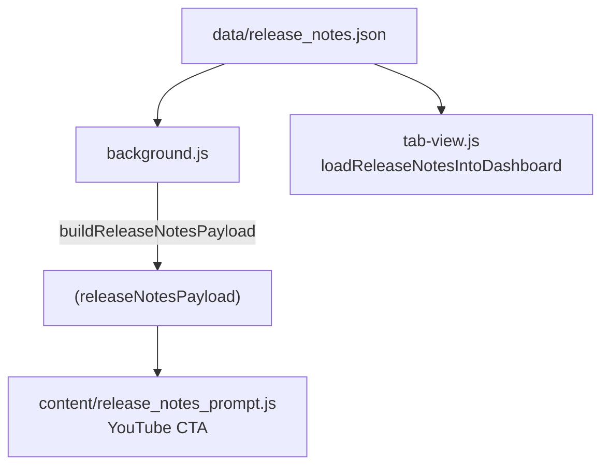
```mermaid
graph TD
    RN["data/release_notes.json"] --> BG["background.js"]
    BG -->|"buildReleaseNotesPayload"| Storage["(releaseNotesPayload)"]
    Storage --> Banner["content/release_notes_prompt.js<br/>YouTube CTA"]
    RN --> Dashboard["tab-view.js<br/>loadReleaseNotesIntoDashboard"]
```

* *Background* hydrates the payload when the extension updates or the banner pings `FilterTube_ReleaseNotesCheck`.
* *Content script* handles CTA clicks by messaging `FilterTube_OpenWhatsNew`; the background script focuses or spawns `tab-view.html?view=whatsnew`.
* *Tab view* reads both hash and `?view=` parameters, ensuring deep links land on the What’s New tab and scroll it into view.

This keeps announcements self-contained inside the extension, avoiding blocked `chrome-extension://` navigations or offsite changelog links.

### Import / Export & Data Portability (v3.2.1)

`js/io_manager.js` is the canonical normalization/adapter layer. Both UI (Tab View) and future sync tooling call into this module, preventing subtle drift between import/export flows. Key points:

* All inbound identifiers funnel through `normalizeChannelInput`, handling `UC…`, `@handles`, `/c/<slug>`, `/user/<slug>`, and plain names.
* Merge behavior is deterministic (`UCID > handle > customUrl > originalInput`) with earliest `addedAt` preserved so backups retain ordering.
* Export flow reads `StateManager` + `chrome.storage.local` (channel/keyword lists, channelMap) and emits a portable v3 schema.
* Import flow (`importV3`) supports native FilterTube exports, BlockTube JSON, and plaintext lists via adapters.

ASCII overview:

```text
File Input → io_manager.importV3()
            → normalizeIncomingV3()
            → mergeChannelLists / mergeKeywordLists
            → FilterTubeSettings.saveSettings()
            → StateManager broadcasts + recompiles
```

### **Multi-World Architecture with Proactive Pipeline**

```mermaid
graph TD
    subgraph "Main World (Page Context)"
        Seed[seed.js<br/>XHR Interception]
        Filter[filter_logic.js<br/>Channel Extraction]
        Snapshots[window.filterTube<br/>lastYt*Response]
    end

    subgraph "Isolated World (Extension)"
        Bridge[content_bridge.js<br/>Message Handler]
        DOM[DOM Stamping<br/>3-dot Menus]
        Fallback[DOM Fallback<br/>Visual Guard]
    end

    subgraph "Background (Service Worker)"
        Persist[Channel Persistence<br/>channelMap/videoChannelMap]
        Enrich[schedulePostBlockEnrichment<br/>Rate Limited]
        Kids[Zero-Network Mode<br/>Kids Safety]
    end

    YouTube[YouTube XHR] -->|JSON Response| Seed
    Seed -->|Stash Snapshot| Snapshots
    Snapshots -->|Extract Channel| Filter
    Filter -->|postMessage| Bridge
    Bridge -->|Stamp Cards| DOM
    Bridge -->|Persist Mappings| Persist
    Persist -->|Post-Block Fill| Enrich
    Enrich -.->|Skip Network| Kids
    
    DOM -->|Hide Content| Fallback
```

## Unified System Map

The following diagram illustrates the complete interaction between all FilterTube components, matching the logical flow of the system:

```ascii


+-------------------------------------------------------+          +--------------------------------------------------+
|              Settings Management Pipeline             |          |                Extension Bootstrap               |
|                                                       |          |                                                  |
|   +-------------+                                     |          |   +-------------+                                |
|   | 2a: popup.js|                                     |          |   | 1a: Manifest|                                |
|   |  User Input |                                     |          |   |  (Declares) |                                |
|   +------+------+                                     |          |   +------+------+                                |
|          | saves via                                  |          |          |                                       |
|   +------v------+                                     |          |          +--------------------+                  |
|   | StateManager|                                     |          |          | declares           | declares         |
|   +------+------+                                     |          |   +------v------+      +------v------+           |
|          | persists                                   |          |   | 1b: Content |      | 1c: seed.js |           |
|          v                                            |          |   |   Bridge    |      | (Main World)|           |
|   +-------------+      +-------------+                |          |   |  (Isolated) |      |    Hooks    |           |
|   | 2c: Storage |----->| 2d: Bridge  |                |          |   +------+------+      +-------------+           |
|   |  OnChanged  |      | Req Settings|                |          |          |                    |                  |
|   +-------------+      +------+------+                |          |          | injects            |                  |
|                               | sends (postMessage)   |          |   +------v------+             |                  |
|                               v                       |          |   | 1d: Injector|             |                  |
|                        +-------------+                |          |   | Coordinator |             |                  |
|                        | 2e: Injector|                |          |   +------+------+             |                  |
|                        | Recv Setting|                |          |          |                    |                  |
|                        +------+------+                |          +----------+--------------------+                  |
|                               | calls                 |                     |                                       |
|                               v                       |                     v                                       |
|                        +-------------+                |          +----------+---------------------------------------+
|                        | 2f: seed.js |                |          |                                                  |
|                        |Cache Setting|                |          |                                                  |
|                        +------+------+                |          |                                                  |
|                               | updates               |          |                                                  |
|                               v                       |          |                                                  |
+-------------------------------+-----------------------+          |                                                  |
                                |                                  |                                                  |
+-------------------------------+-----------------------+          |                                                  |
|                Data Interception Layer                |<---------+                                                  |
|                                                       |                                                             |
|   +-----------------------+     +-----------------------+     +-----------------------+                             |
|   | 3a: seed.js Hooks     |     | 3b: seed.js Hooks     |     | 4a: seed.js Fetch/XHR |                             |
|   | window.ytInitialData  |     | window.ytInitial      |     | Proxy (/youtubei/v1/* |                             |
|   | (Main + Kids pages)   |     | PlayerResponse        |     | incl. /player)        |                             |
|   +----------+------------+     +-----------+-----------+     +----------+------------+                             |
|              | intercepts                   | intercepts               | intercepts                                 |
|              v                              v                          v                                            |
|   +--------------------------------------------------------------------------------------+                          |
|   |                          3c: processWithEngine (Call Filter)                         |                          |
|   +------------------------------+-------------------------------+-----------------------+                          |
|                                  | calls                          |                                                 |
+----------------------+--------------------------------+                                                             |
                       |                                                                                              |
                       v                                                                                              |
|                 Filtering Engine Core                 |<---------+               DOM Fallback Layer                 |
|                                                       |          |                                                  |
|   +-------------+                                     |          |   +-------------+                                |
|   | 5a: Entry   |                                     |          |   | 6a: Observer|                                |
|   | processData |                                     |          |   |  Watch DOM  |                                |
|   +------+------+                                     |          |   +------+------+                                |
|          | uses mappings                              |          |          | detects nodes                         |
|   +------v------+      +-------------------+          |          |   +------v------+                                |
|   | 5b: Identity| <--- | 5e: videoChannel  |          |          |   | 6b: Apply   |                                |
|   | Resolution  |      |     Map Lookup    |          |          |   |  Fallback   |                                |
|   +------+------+      +-------------------+          |          |   +------+------+                                |
|          | harvests owner UC IDs                      |          |                                                  |
|          v                                            |          |                                                  |
|   +------------------------+                          |          |                                                  |
|   | 5f: Harvest + Persist  |                          |          |                                                  |
|   | videoId -> UC...       |                          |          |                                                  |
|   | (FilterTube_Update     |                          |          |                                                  |
|   |  VideoChannelMap)      |                          |          |                                                  |
|   +-----------+------------+                          |          |                                                  |
|               | postMessage                           |          |                                                  |
|               v                                       |          |                                                  |
|   +------------------------+                          |          |                                                  |
|   | content_bridge.js      |                          |          |                                                  |
|   | forwards to background |                          |          |                                                  |
|   +-----------+------------+                          |          |                                                  |
|               | chrome.runtime.sendMessage            |          |                                                  |
|               v                                       |          |                                                  |
|   +------------------------+                          |          |                                                  |
|   | background.js          |                          |          |                                                  |
|   | persists videoChannelMap|                         |          |                                                  |
|   +------------------------+                          |          |                                                  |
|          |                                            |          |          | scans                                 |
|   +------v------+                                     |          |   +------v------+                                |
|   | 5c: Traverse|                                     |          |   | 6c: Match   |                                |
|   |  Recursive  |                                     |          |   |   Content   |                                |
|   +------+------+                                     |          |   +------+------+                                |
|          | evaluates                                  |          |          | hides                                 |
|   +------v------+                                     |          |   +------v------+                                |
|   | 5d: Decision|<------------------------------------|----------|---| 6d: Toggle  |                                |
|   | _shouldBlock|          uses engine logic          |          |   | Visibility  |                                |
|   +------+------+                                     |          |   +-------------+                                |
|          | extracts                                   |          |                                                  |
|   +------v------+                                     |          |                                                  |
|   | 7a: Metadata|                                     |          |                                                  |
|   | _extractInfo|                                     |          |                                                  |
|   +-------------+                                     |          |                                                  |
+-------------------------------------------------------+          +--------------------------------------------------+


```

## Collaboration Filtering Lifecycle (2025 Refactor)

The collaboration pipeline spans **all three execution worlds** so that multi-channel uploads can be detected, stored, and rendered consistently. The flow below tracks a user invoking "Block All Collaborators" from the YouTube 3-dot menu:

```mermaid
sequenceDiagram
    participant DOM as block_channel.js + content_bridge.js<br/>(Isolated World)
    participant MW as injector.js + filter_logic.js<br/>(Main World)
    participant BG as background.js (SW)
    participant UI as tab-view.js + render_engine.js

    DOM->>DOM: Detect #attributed-channel-name<br/>parse collaborators
    DOM->>MW: postMessage FilterTube_RequestCollaboratorInfo
    MW->>MW: searchYtInitialDataForVideoChannel<br/>enrich handles + UC IDs
    MW-->>DOM: FilterTube_CollaboratorInfoResponse<br/>allCollaborators[] payload
    DOM->>BG: chrome.runtime.sendMessage handleAddFilteredChannel<br/>collaborationGroupId + collaborationWith
    BG->>BG: sanitizeChannelEntry → persist allCollaborators
    BG-->>UI: StateManager.broadcast('channelAdded')
    UI->>UI: render_engine.buildCollaborationMeta<br/>badge + tooltip + dashed rail
```

### Architectural Guarantees
1. **Deterministic grouping** – `content_bridge.js` creates a `collaborationGroupId` before storage, so every UI can reassemble the exact roster after reloads and across browsers.
2. **Lossless collaborator roster** – `allCollaborators` travels with each saved channel entry, allowing tooltips to show present vs. missing members without re-querying YouTube.
3. **Cross-world enrichment** – When the DOM only exposes the first collaborator link, the Request/Response hop to the Main World fills remaining handles/IDs directly from `ytInitialData`.
4. **FCFS rendering with inline metadata** – `render_engine.js` drops floating group containers and instead decorates each row in-place (badge, yellow rail, tooltip), preserving the filtered/sorted order defined by the user.

The collaboration lifecycle reuses the existing Hybrid Filtering channels (`window.postMessage`, `chrome.runtime` messaging, StateManager broadcasts), ensuring the new metadata behaves like any other persisted filter entry.

### Message Bus & Storage Hand-off

```ascii

  (Isolated World)                 (Main World)                    (Service Worker)              (UI Contexts)

  block_channel.js + content_bridge.js        injector.js / filter_logic.js          background.js            tab-view.js / popup.js
         |                               |                              |                             |
         | 1. DOM parse                  |                              |                             |
         |------------------------------>|                              |                             |
         | FilterTube_RequestCollabInfo  |                              |                             |
         |                               | 2. searchYtInitialData()     |                             |
         |                               |----------------------------->|                             |
         |                               | 3. Response w/ allCollaborators                            |
         |<------------------------------|                              |                             |
         | 4. chrome.runtime.sendMessage (handleAddFilteredChannel)     |                             |
         |------------------------------------------------------------->|                             |
         |                               |                              | 5. sanitizeChannelEntry()   |
         |                               |                              |    persist + broadcast      |
         |                               |                              |---------------------------->|
         |                               |                              |             channelAdded    |
         |                               |                              |                             | 6. render_engine.buildCollaborationMeta()
         |                               |                              |                             v

```

*Every hop carries the `collaborationGroupId`, `collaborationWith[]`, and `allCollaborators[]`, so downstream consumers never have to re-parse the DOM or `ytInitialData` for that upload.*

## Channel Identity Resolution & 404 Recovery (2025 Hardening)

YouTube intermittently rate-limits `/@handle/about` and can return `404` on the first block attempt. To keep blocking deterministic, the system uses a cache-first + main-world recovery approach so blocks can still resolve to a canonical UC ID:

```ascii
        +-------------------+
        | 1. Cache-first    |
        | channelMap lookup |
        +---------+---------+
                  |
   miss           | hit
     |            v
     v     (pre-seeded UC id)
+----+------------------------------+
| 2. Main-world replay via ytInitial|
|    data (searchYtInitialData...)  |
+----+------------------------------+
     | success
     |                      failure
     v                          |
+----+---------------------------+--------+
| 3. Shorts/handle helpers + bidirectional|
|    FilterTube_UpdateChannelMap broadcast|
+----+---------------------------+--------+
     | success
     v
+----+-------------------------------+
| 4. DOM cache invalidation & forced |
|    reprocessing (applyDOMFallback) |
+------------------------------------+
```

1. **Cache-first lookups (`background.js`)** – `handleAddFilteredChannel` checks `channelMap` before issuing any network fetch, so previously learned handles map instantly to UC IDs.
2. **Main-world replay (`injector.js` + `seed.js`)** – When metadata is missing or handle fetches fail, `content_bridge.js` can re-run a lookup using `searchYtInitialDataForVideoChannel(videoId)` to reuse the data that already rendered the card.
3. **Bidirectional broadcast** – Newly learned `(handle ↔ UC ID)` pairs are posted via `FilterTube_UpdateChannelMap`, persisted by the background worker, and replayed into future tabs so both interception and DOM layers stay in sync.
4. **DOM cache invalidation** – The DOM fallback tracks `data-filtertube-last-processed-id`. When a reused card swaps to a different video, stale `data-filtertube-channel-*` attributes are purged, forcing a fresh extraction with the latest mapping.

These steps keep channel identity deterministic even for collaboration uploads, Shorts feeds, and navigation refreshes that previously produced 404 loops.

### Shorts Flow & Identity Convergence

Shorts are unique because their cards often lack canonical IDs up front. The system uses a multi-layered convergence strategy:

```mermaid
sequenceDiagram
    participant CB as content_bridge.js
    participant DF as dom_fallback.js
    participant FL as filter_logic.js
    participant BG as background.js
    participant YT as YouTube API

    Note over CB,BG: Phase 1: Immediate Interaction
    CB->>BG: Block Channel Clicked
    BG->>BG: Persist in filterChannels + channelMap
    BG->>CB: Broadcast Settings Change

    Note over DF,FL: Phase 2: Instant Hiding
    DF->>DF: extractShortsVideoId()
    DF-->>BG: Query videoChannelMap
    DF->>DF: hide element (Zero Flash)

    Note over CB,YT: Phase 3: Enrichment
    CB->>CB: enrichVisibleShortsWithChannelInfo()
    CB->>YT: fetchChannelFromShortsUrl(videoId)
    YT-->>CB: Returns UC ID
    CB->>BG: updateVideoChannelMap(videoId -> UC ID)
    BG->>BG: storage.onChanged (recompileSettings)
    BG-->>CB: All Tabs: Sync refreshed settings
```

This hybrid path keeps **Zero-Flash** guarantees for Shorts even when metadata is missing: the DOM fallback hides immediately while the async canonical resolution finishes and broadcasts via `background.js`.

### Watch-page playlists (panel rows + no-flash Next/Prev)

Watch pages with `list=...` require additional guarantees beyond feed/search filtering:

1. **Playlist panel deterministic hiding**: playlist panel row elements are prioritized for prefetch observers, allowing the extension to learn `videoChannelMap[videoId] -> UC ID` for playlist items even when the DOM lacks full channel identity.
2. **Navigation guard**: when Next/Prev selects a blocked channel, the watch page auto-skips to the next allowed item without a visible playback flash.

### Bidirectional Mapping Synchronization

To ensure that a newly learned identity (e.g., resolving a `c/Name` to a UC ID) is available instantly across all open YouTube tabs, FilterTube implements a bidirectional sync loop:

```ascii
+-----------------------+      +-----------------------+      +-----------------------+
|   1. Main World       |      |   2. Content Bridge   |      |   3. Background SW    |
|   (Learning)          | ===> |   (Isolated World)    | ===> |   (Storage Manager)   |
| Intercepts JSON, finds|      | Receives mapping via  |      | Persists to           |
| mapping (Slug -> UC)  |      | postMessage           |      | channelMap            |
+-----------------------+      +-----------------------+      +-----------+-----------+
                                                                          |
                                                                          | trigger
                                                                          v
+-----------------------+      +-----------------------+      +-----------+-----------+
|   6. All Other Tabs   |      |  5. Settings Broadcast|      |  4. recompileSettings |
|   (Instant Update)    | <=== | Background sends      | <=== | storage.onChanged     |
| DOM Fallback re-runs  |      | FilterTube_Refreshed  |      | detects map update    |
| with new mappings     |      | to all tabs           |      |                       |
+-----------------------+      +-----------------------+      +-----------------------+
```

1. **Learning**: `filter_logic.js` or `injector.js` finds a previously unknown association between a legacy URL and a UC ID.
2. **Propagation**: The mapping is sent to the Isolated World.
3. **Persistence**: `background.js` saves it to `channelMap`.
4. **Trigger**: `background.js` has a `storage.onChanged` listener that detects updates to `channelMap` or `videoChannelMap`.
5. **Broadcast**: The background script immediately re-compiles settings and broadcasts them.
6. **Enforcement**: All tabs receive the update and immediately re-run their DOM filters to hide any content that matches the new mapping.


## 1. Extension Initialization & Script Injection Flow

**Motivation:**
FilterTube needs to filter YouTube content *before* it appears on screen to prevent unwanted videos from flashing briefly. The traditional approach of scanning the DOM is too slow. The solution is **data interception**: hooking into YouTube's JSON data structures before they're rendered. This requires injecting JavaScript into YouTube's page context (the "MAIN world") at the earliest possible moment.

**How it works (Simplified):**
Imagine FilterTube as a security guard. Instead of waiting for people (videos) to enter the building (the screen) and then kicking them out, FilterTube stands at the front door (the data connection) and checks everyone's ID before they even get inside. To do this, FilterTube has to arrive at the door *before* YouTube opens for business.

**Technical Flow:**

```text


+----------------------------+
|  Browser Loads Extension   |
+----------------------------+
             |
             v
+----------------------------+
|      manifest.json         |
+----------------------------+
      |              |
      | (Main)       | (Isolated)
      v              v
+-----------+  +----------------------------------------------+
|  seed.js  |  | Isolated World content scripts (ordered load) |
+-----------+  | identity.js → menu.js → dom_*.js →            |
               | block_channel.js → content_bridge.js          |
               +----------------------------------------------+
      |                  |
      |                  v
      |        +------------------+
      |        |  Request Settings|
      |        +------------------+
      |                  |
      v                  v
+----------------+ +------------------+
| Establish Hooks| |Init DOM Fallback |
| (ytInitialData)| |(MutationObserver)|
+----------------+ +------------------+
      |
      v
+----------------+
|  Wait for      |
|  Filter Engine |
+----------------+


```

## 2. Settings Compilation & Distribution Pipeline

**Motivation:**
FilterTube needs to distribute user filter settings across multiple isolated execution contexts. When a user adds a keyword like "spoilers", that setting must reach the background (for storage), the content bridge (for DOM fallback), and the main world scripts (for data interception). Chrome's security model prevents direct access, so a pipeline is needed.

**How it works (Simplified):**
When you change a setting, it's like sending a letter. You drop it in the mailbox (Popup). The post office (Background) stamps it and checks the address. Then a mail carrier (Content Bridge) takes it to the house (Page). Finally, the person inside (Filter Engine) reads it and updates their "Do Not Admit" list.

**Technical Flow:**

```text


+---------+       +------------+
| User UI | ----> | Background |
| (Popup) |       | (Storage)  |
+---------+       +------------+
                        |
                   (OnChanged)
                        |
                        v
                  +------------+
                  |  Compile   |
                  |  Settings  |
                  +------------+
                        |
                        v
                  +------------+       +------------+
                  |  Content   | ----> |  Injector  |
                  |  Bridge    |       | (Main World)|
                  +------------+       +------------+
                                             |
                                       (postMessage)
                                             |
                                             v
                                       +------------+
                                       |  seed.js   |
                                       | (Reprocess)|
                                       +------------+


```


## Component Breakdown

### **1. Background Service (`background.js`)**
*   **Context:** Background Service Worker.
*   **Role:** Central State Manager & Validator.
*   **Key Responsibilities:** Manages storage, compiles regex patterns to prevent crashes, and handles cross-browser compatibility.

### **2. Content Bridge (`content_bridge.js`)**
*   **Context:** Isolated World.
*   **Role:** The Bridge & The Enforcer.
*   **Key Responsibilities:** Injects Main World scripts, relays settings, and wires the Isolated World helper modules (`js/content/*`) that implement DOM fallback and 3-dot menu blocking.

### **3. Seed Script (`seed.js`)**
*   **Context:** Main World.
*   **Role:** The Interceptor.
*   **Key Responsibilities:** Hooks global objects (`ytInitialData`, `fetch`) immediately at startup to intercept data before YouTube sees it.

### **4. Filter Logic Engine (`filter_logic.js`)**
*   **Context:** Main World.
*   **Role:** The Brain.
*   **Key Responsibilities:** Recursively processes JSON, identifies video renderers, and applies filtering rules.

### **5. Injector (`injector.js`)**
*   **Context:** Main World.
*   **Role:** The Coordinator.
*   **Key Responsibilities:** Initializes the engine and coordinates settings updates.

### **6. State Manager (`state_manager.js`)**
*   **Context:** UI Contexts.
*   **Role:** The Truth.
*   **Key Responsibilities:** Centralizes all state operations (load, save, update) to ensure consistency across the UI.
