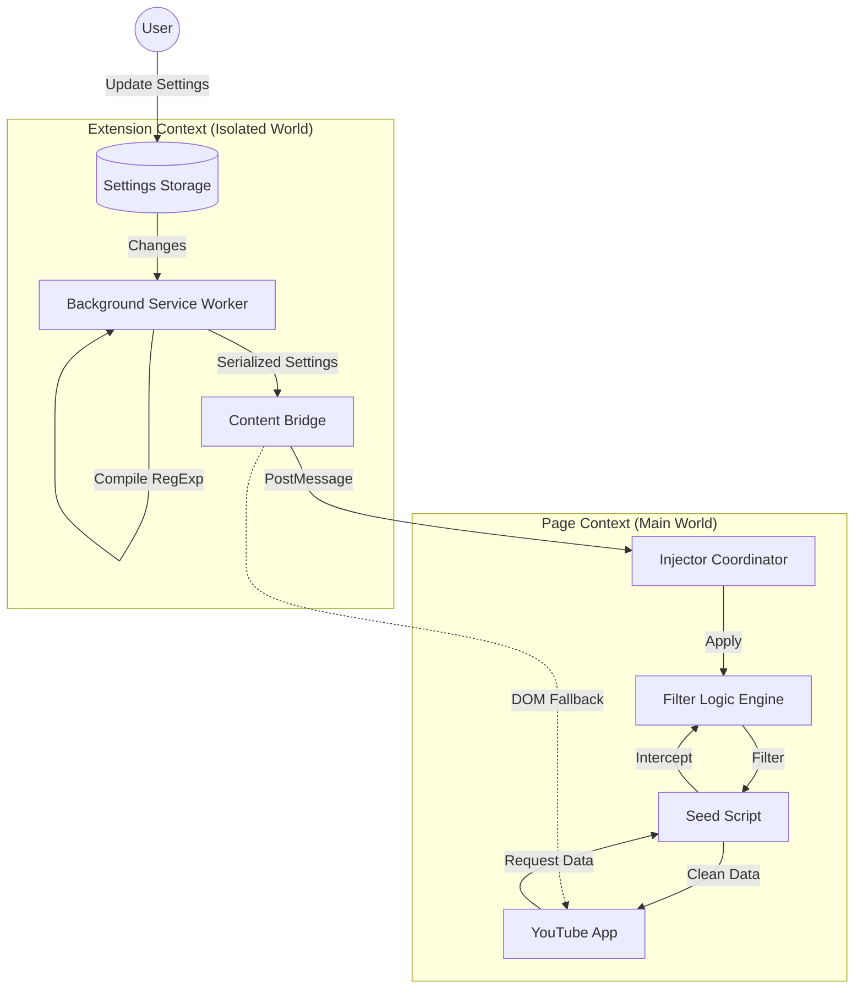
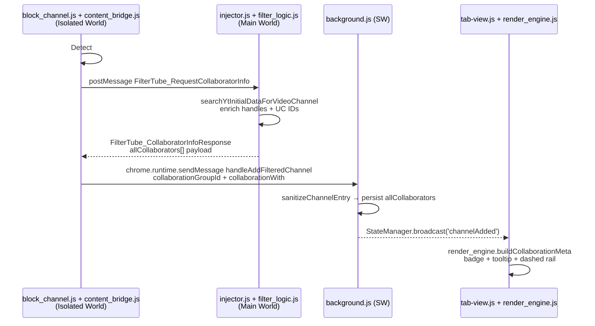
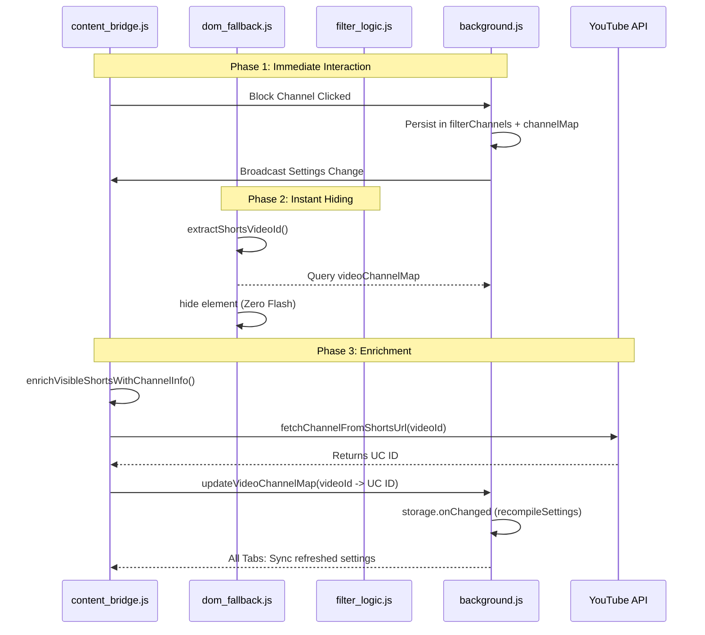

# FilterTube v3.1.6 Architecture Documentation

## Executive Summary

FilterTube v3.1.1 implements a robust **Hybrid Filtering Architecture** that combines preemptive **Data Interception (Main World)** with a resilient **DOM Fallback (Isolated World)**. This dual-layer approach ensures comprehensive content filtering across all YouTube surfaces (Home, Search, Watch, Shorts) while maintaining high performance and a "Zero Flash" user experience when YouTube routes content through JSON.

## Architecture Overview

### **Hybrid Filtering Strategy**

FilterTube operates on two synchronized layers:

1.  **Primary Layer: Data Interception (Main World engine)**
    *   Intercepts YouTube's raw JSON data (via `ytInitialData`, `ytInitialPlayerResponse`, and `fetch`/`XHR` overrides) before it reaches the rendering engine.
    *   Modifies the data structure to remove blocked content *before* it is ever created in the DOM.
    *   **Benefit:** True zero-flash filtering, high performance, no layout shift.

2.  **Secondary Layer: DOM Fallback (Visual Guard)**
    *   Monitors the DOM using efficient `MutationObserver`s.
    *   Catches any content that might bypass the data layer (e.g., client-side hydration updates, complex dynamic loading, watch-playlist playlist panel handling).
    *   **Hybrid blocking surfaces:** Shorts and some playlist/mix surfaces may require a DOM-first hide combined with async identity enrichment.
    *   Applies visual hiding (CSS) to blocked elements.
    *   **Benefit:** Reliability, handles edge cases and dynamic updates.

### **Release Notes + What’s New Surface (v3.1.6 addition)**

FilterTube now ships an internal “What’s New” dashboard tab that shares a single data source (`data/release_notes.json`) with the release banner injected on YouTube. The flow is lightweight and doesn’t require network access beyond loading the packaged JSON.

```mermaid
graph TD
    RN[data/release_notes.json] --> BG[background.js]
    BG -->|buildReleaseNotesPayload| Storage[(releaseNotesPayload)]
    Storage --> Banner[content/release_notes_prompt.js<br/>(YouTube CTA)]
    RN --> Dashboard[tab-view.js<br/>loadReleaseNotesIntoDashboard]
```

- **Background** hydrates the payload when the extension updates or the banner pings `FilterTube_ReleaseNotesCheck`.
- **Content script** handles CTA clicks by messaging `FilterTube_OpenWhatsNew`; the background script focuses or spawns `tab-view.html?view=whatsnew`.
- **Tab view** reads both hash and `?view=` parameters, ensuring deep links land on the What’s New tab and scroll it into view.

This keeps announcements self-contained inside the extension, avoiding blocked `chrome-extension://` navigations or offsite changelog links.

### Import / Export & Data Portability (v3.1.6 addition)

`js/io_manager.js` became the canonical normalization/adapter layer. Both UI (Tab View) and future sync tooling call into this module, preventing subtle drift between import/export flows. Key points:

- All inbound identifiers funnel through `normalizeChannelInput`, handling `UC…`, `@handles`, `/c/<slug>`, `/user/<slug>`, and plain names.
- Merge behavior is deterministic (`UCID > handle > customUrl > originalInput`) with earliest `addedAt` preserved so backups retain ordering.
- Export flow reads `StateManager` + `chrome.storage.local` (channel/keyword lists, channelMap) and emits a portable v3 schema.
- Import flow (`importV3`) supports native FilterTube exports, BlockTube JSON, and plaintext lists via adapters.

ASCII overview:

```text
File Input → io_manager.importV3()
            → normalizeIncomingV3()
            → mergeChannelLists / mergeKeywordLists
            → FilterTubeSettings.saveSettings()
            → StateManager broadcasts + recompiles
```

### **Multi-World Extension Architecture**

FilterTube leverages the modern "Isolated World" vs. "Main World" concept to bridge the gap between extension security and page access.



## Unified System Map

The following diagram illustrates the complete interaction between all FilterTube components, matching the logical flow of the system:

```ascii


+-------------------------------------------------------+          +--------------------------------------------------+
|              Settings Management Pipeline             |          |                Extension Bootstrap               |
|                                                       |          |                                                  |
|   +-------------+                                     |          |   +-------------+                                |
|   | 2a: popup.js|                                     |          |   | 1a: Manifest|                                |
|   |  User Input |                                     |          |   |  (Declares) |                                |
|   +------+------+                                     |          |   +------+------+                                |
|          | saves via                                  |          |          |                                       |
|   +------v------+                                     |          |          +--------------------+                  |
|   | StateManager|                                     |          |          | declares           | declares         |
|   +------+------+                                     |          |   +------v------+      +------v------+           |
|          | persists                                   |          |   | 1b: Content |      | 1c: seed.js |           |
|          v                                            |          |   |   Bridge    |      | (Main World)|           |
|   +-------------+      +-------------+                |          |   |  (Isolated) |      |    Hooks    |           |
|   | 2c: Storage |----->| 2d: Bridge  |                |          |   +------+------+      +-------------+           |
|   |  OnChanged  |      | Req Settings|                |          |          |                    |                  |
|   +-------------+      +------+------+                |          |          | injects            |                  |
|                               | sends (postMessage)   |          |   +------v------+             |                  |
|                               v                       |          |   | 1d: Injector|             |                  |
|                        +-------------+                |          |   | Coordinator |             |                  |
|                        | 2e: Injector|                |          |   +------+------+             |                  |
|                        | Recv Setting|                |          |          |                    |                  |
|                        +------+------+                |          +----------+--------------------+                  |
|                               | calls                 |                     |                                       |
|                               v                       |                     v                                       |
|                        +-------------+                |          +----------+---------------------------------------+
|                        | 2f: seed.js |                |          |                                                  |
|                        |Cache Setting|                |          |                                                  |
|                        +------+------+                |          |                                                  |
|                               | updates               |          |                                                  |
|                               v                       |          |                                                  |
+-------------------------------+-----------------------+          |                                                  |
                                |                                  |                                                  |
+-------------------------------+-----------------------+          |                                                  |
|                Data Interception Layer                |<---------+                                                  |
|                                                       |                                                             |
|   +-------------+            +-------------+          |                                                             |
|   | 4a: seed.js |            | 3a: seed.js |          |                                                             |
|   | Fetch Proxy |            |ytInitialData|          |                                                             |
|   +------+------+            +------+------+          |                                                             |
|          | intercepts               | intercepts      |                                                             |
|          v                          v                 |                                                             |
|   +----------------------------------------+          |                                                             |
|   |        3b: processWithEngine           |          |                                                             |
|   |             (Call Filter)              |          |                                                             |
|   +------------------+---------------------+          |                                                             |
|                      | calls                          |                                                             |
+----------------------+--------------------------------+                                                             |
                       |                                                                                              |
                       v                                                                                              |
+-------------------------------------------------------+          +--------------------------------------------------+
|                 Filtering Engine Core                 |<---------+               DOM Fallback Layer                 |
|                                                       |          |                                                  |
|   +-------------+                                     |          |   +-------------+                                |
|   | 5a: Entry   |                                     |          |   | 6a: Observer|                                |
|   | processData |                                     |          |   |  Watch DOM  |                                |
|   +------+------+                                     |          |   +------+------+                                |
|          | uses mappings                              |          |          | detects nodes                         |
|   +------v------+      +-------------------+          |          |   +------v------+                                |
|   | 5b: Identity| <--- | 5e: videoChannel  |          |          |   | 6b: Apply   |                                |
|   | Resolution  |      |     Map Lookup    |          |          |   |  Fallback   |                                |
|   +------+------+      +-------------------+          |          |   +------+------+                                |
|          |                                            |          |          | scans                                 |
|   +------v------+                                     |          |   +------v------+                                |
|   | 5c: Traverse|                                     |          |   | 6c: Match   |                                |
|   |  Recursive  |                                     |          |   |   Content   |                                |
|   +------+------+                                     |          |   +------+------+                                |
|          | evaluates                                  |          |          | hides                                 |
|   +------v------+                                     |          |   +------v------+                                |
|   | 5d: Decision|<------------------------------------|----------|---| 6d: Toggle  |                                |
|   | _shouldBlock|          uses engine logic          |          |   | Visibility  |                                |
|   +------+------+                                     |          |   +-------------+                                |
|          | extracts                                   |          |                                                  |
|   +------v------+                                     |          |                                                  |
|   | 7a: Metadata|                                     |          |                                                  |
|   | _extractInfo|                                     |          |                                                  |
|   +-------------+                                     |          |                                                  |
+-------------------------------------------------------+          +--------------------------------------------------+


```

## Collaboration Filtering Lifecycle (2025 Refactor)

The collaboration pipeline spans **all three execution worlds** so that multi-channel uploads can be detected, stored, and rendered consistently. The flow below tracks a user invoking "Block All Collaborators" from the YouTube 3-dot menu:



### Architectural Guarantees
1. **Deterministic grouping** – `content_bridge.js` creates a `collaborationGroupId` before storage, so every UI can reassemble the exact roster after reloads and across browsers.
2. **Lossless collaborator roster** – `allCollaborators` travels with each saved channel entry, allowing tooltips to show present vs. missing members without re-querying YouTube.
3. **Cross-world enrichment** – When the DOM only exposes the first collaborator link, the Request/Response hop to the Main World fills remaining handles/IDs directly from `ytInitialData`.
4. **FCFS rendering with inline metadata** – `render_engine.js` drops floating group containers and instead decorates each row in-place (badge, yellow rail, tooltip), preserving the filtered/sorted order defined by the user.

The collaboration lifecycle reuses the existing Hybrid Filtering channels (`window.postMessage`, `chrome.runtime` messaging, StateManager broadcasts), ensuring the new metadata behaves like any other persisted filter entry.

### Message Bus & Storage Hand-off

```ascii

  (Isolated World)                 (Main World)                    (Service Worker)              (UI Contexts)

  block_channel.js + content_bridge.js        injector.js / filter_logic.js          background.js            tab-view.js / popup.js
         |                               |                              |                             |
         | 1. DOM parse                  |                              |                             |
         |------------------------------>|                              |                             |
         | FilterTube_RequestCollabInfo  |                              |                             |
         |                               | 2. searchYtInitialData()     |                             |
         |                               |----------------------------->|                             |
         |                               | 3. Response w/ allCollaborators                            |
         |<------------------------------|                              |                             |
         | 4. chrome.runtime.sendMessage (handleAddFilteredChannel)     |                             |
         |------------------------------------------------------------->|                             |
         |                               |                              | 5. sanitizeChannelEntry()   |
         |                               |                              |    persist + broadcast      |
         |                               |                              |---------------------------->|
         |                               |                              |             channelAdded    |
         |                               |                              |                             | 6. render_engine.buildCollaborationMeta()
         |                               |                              |                             v

```

*Every hop carries the `collaborationGroupId`, `collaborationWith[]`, and `allCollaborators[]`, so downstream consumers never have to re-parse the DOM or `ytInitialData` for that upload.*

## Channel Identity Resolution & 404 Recovery (2025 Hardening)

YouTube intermittently rate-limits `/@handle/about` and can return `404` on the first block attempt. To keep blocking deterministic, the system uses a cache-first + main-world recovery approach so blocks can still resolve to a canonical UC ID:

```ascii
        +-------------------+
        | 1. Cache-first    |
        | channelMap lookup |
        +---------+---------+
                  |
   miss           | hit
     |            v
     v     (pre-seeded UC id)
+----+------------------------------+
| 2. Main-world replay via ytInitial|
|    data (searchYtInitialData...)  |
+----+------------------------------+
     | success
     |                      failure
     v                          |
+----+---------------------------+--------+
| 3. Shorts/handle helpers + bidirectional|
|    FilterTube_UpdateChannelMap broadcast|
+----+---------------------------+--------+
     | success
     v
+----+-------------------------------+
| 4. DOM cache invalidation & forced |
|    reprocessing (applyDOMFallback) |
+------------------------------------+
```

1. **Cache-first lookups (`background.js`)** – `handleAddFilteredChannel` checks `channelMap` before issuing any network fetch, so previously learned handles map instantly to UC IDs.
2. **Main-world replay (`injector.js` + `seed.js`)** – When metadata is missing or handle fetches fail, `content_bridge.js` can re-run a lookup using `searchYtInitialDataForVideoChannel(videoId)` to reuse the data that already rendered the card.
3. **Bidirectional broadcast** – Newly learned `(handle ↔ UC ID)` pairs are posted via `FilterTube_UpdateChannelMap`, persisted by the background worker, and replayed into future tabs so both interception and DOM layers stay in sync.
4. **DOM cache invalidation** – The DOM fallback tracks `data-filtertube-last-processed-id`. When a reused card swaps to a different video, stale `data-filtertube-channel-*` attributes are purged, forcing a fresh extraction with the latest mapping.

These steps keep channel identity deterministic even for collaboration uploads, Shorts feeds, and navigation refreshes that previously produced 404 loops.

### Shorts Flow & Identity Convergence

Shorts are unique because their cards often lack canonical IDs up front. The system uses a multi-layered convergence strategy:



This hybrid path keeps **Zero-Flash** guarantees for Shorts even when metadata is missing: the DOM fallback hides immediately while the async canonical resolution finishes and broadcasts via `background.js`.

### Watch-page playlists (panel rows + no-flash Next/Prev)

Watch pages with `list=...` require additional guarantees beyond feed/search filtering:

1. **Playlist panel deterministic hiding**: playlist panel row elements are prioritized for prefetch observers, allowing the extension to learn `videoChannelMap[videoId] -> UC ID` for playlist items even when the DOM lacks full channel identity.
2. **Navigation guard**: when Next/Prev selects a blocked channel, the watch page auto-skips to the next allowed item without a visible playback flash.

### Bidirectional Mapping Synchronization

To ensure that a newly learned identity (e.g., resolving a `c/Name` to a UC ID) is available instantly across all open YouTube tabs, FilterTube implements a bidirectional sync loop:

```ascii
+-----------------------+      +-----------------------+      +-----------------------+
|   1. Main World       |      |   2. Content Bridge   |      |   3. Background SW    |
|   (Learning)          | ===> |   (Isolated World)    | ===> |   (Storage Manager)   |
| Intercepts JSON, finds|      | Receives mapping via  |      | Persists to           |
| mapping (Slug -> UC)  |      | postMessage           |      | channelMap            |
+-----------------------+      +-----------------------+      +-----------+-----------+
                                                                          |
                                                                          | trigger
                                                                          v
+-----------------------+      +-----------------------+      +-----------+-----------+
|   6. All Other Tabs   |      |   5. Settings Broadcast|      |   4. recompileSettings|
|   (Instant Update)    | <=== | Background sends      | <=== | storage.onChanged     |
| DOM Fallback re-runs  |      | FilterTube_Refreshed  |      | detects map update    |
| with new mappings     |      | to all tabs           |      |                       |
+-----------------------+      +-----------------------+      +-----------------------+
```

1. **Learning**: `filter_logic.js` or `injector.js` finds a previously unknown association between a legacy URL and a UC ID.
2. **Propagation**: The mapping is sent to the Isolated World.
3. **Persistence**: `background.js` saves it to `channelMap`.
4. **Trigger**: `background.js` has a `storage.onChanged` listener that detects updates to `channelMap` or `videoChannelMap`.
5. **Broadcast**: The background script immediately re-compiles settings and broadcasts them.
6. **Enforcement**: All tabs receive the update and immediately re-run their DOM filters to hide any content that matches the new mapping.


## 1. Extension Initialization & Script Injection Flow

**Motivation:**
FilterTube needs to filter YouTube content *before* it appears on screen to prevent unwanted videos from flashing briefly. The traditional approach of scanning the DOM is too slow. The solution is **data interception**: hooking into YouTube's JSON data structures before they're rendered. This requires injecting JavaScript into YouTube's page context (the "MAIN world") at the earliest possible moment.

**How it works (Simplified):**
Imagine FilterTube as a security guard. Instead of waiting for people (videos) to enter the building (the screen) and then kicking them out, FilterTube stands at the front door (the data connection) and checks everyone's ID before they even get inside. To do this, FilterTube has to arrive at the door *before* YouTube opens for business.

**Technical Flow:**

```text


+----------------------------+
|  Browser Loads Extension   |
+----------------------------+
             |
             v
+----------------------------+
|      manifest.json         |
+----------------------------+
      |              |
      | (Main)       | (Isolated)
      v              v
+-----------+  +----------------------------------------------+
|  seed.js  |  | Isolated World content scripts (ordered load) |
+-----------+  | identity.js → menu.js → dom_*.js →            |
               | block_channel.js → content_bridge.js          |
               +----------------------------------------------+
      |                  |
      |                  v
      |        +------------------+
      |        |  Request Settings|
      |        +------------------+
      |                  |
      v                  v
+----------------+ +------------------+
| Establish Hooks| |Init DOM Fallback |
| (ytInitialData)| |(MutationObserver)|
+----------------+ +------------------+
      |
      v
+----------------+
|  Wait for      |
|  Filter Engine |
+----------------+


```

## 2. Settings Compilation & Distribution Pipeline

**Motivation:**
FilterTube needs to distribute user filter settings across multiple isolated execution contexts. When a user adds a keyword like "spoilers", that setting must reach the background (for storage), the content bridge (for DOM fallback), and the main world scripts (for data interception). Chrome's security model prevents direct access, so a pipeline is needed.

**How it works (Simplified):**
When you change a setting, it's like sending a letter. You drop it in the mailbox (Popup). The post office (Background) stamps it and checks the address. Then a mail carrier (Content Bridge) takes it to the house (Page). Finally, the person inside (Filter Engine) reads it and updates their "Do Not Admit" list.

**Technical Flow:**

```text


+---------+       +------------+
| User UI | ----> | Background |
| (Popup) |       | (Storage)  |
+---------+       +------------+
                        |
                   (OnChanged)
                        |
                        v
                  +------------+
                  |  Compile   |
                  |  Settings  |
                  +------------+
                        |
                        v
                  +------------+       +------------+
                  |  Content   | ----> |  Injector  |
                  |  Bridge    |       | (Main World)|
                  +------------+       +------------+
                                             |
                                       (postMessage)
                                             |
                                             v
                                       +------------+
                                       |  seed.js   |
                                       | (Reprocess)|
                                       +------------+


```


## Component Breakdown

### **1. Background Service (`background.js`)**
*   **Context:** Background Service Worker.
*   **Role:** Central State Manager & Validator.
*   **Key Responsibilities:** Manages storage, compiles regex patterns to prevent crashes, and handles cross-browser compatibility.

### **2. Content Bridge (`content_bridge.js`)**
*   **Context:** Isolated World.
*   **Role:** The Bridge & The Enforcer.
*   **Key Responsibilities:** Injects Main World scripts, relays settings, and wires the Isolated World helper modules (`js/content/*`) that implement DOM fallback and 3-dot menu blocking.

### **3. Seed Script (`seed.js`)**
*   **Context:** Main World.
*   **Role:** The Interceptor.
*   **Key Responsibilities:** Hooks global objects (`ytInitialData`, `fetch`) immediately at startup to intercept data before YouTube sees it.

### **4. Filter Logic Engine (`filter_logic.js`)**
*   **Context:** Main World.
*   **Role:** The Brain.
*   **Key Responsibilities:** Recursively processes JSON, identifies video renderers, and applies filtering rules.

### **5. Injector (`injector.js`)**
*   **Context:** Main World.
*   **Role:** The Coordinator.
*   **Key Responsibilities:** Initializes the engine and coordinates settings updates.

### **6. State Manager (`state_manager.js`)**
*   **Context:** UI Contexts.
*   **Role:** The Truth.
*   **Key Responsibilities:** Centralizes all state operations (load, save, update) to ensure consistency across the UI.
