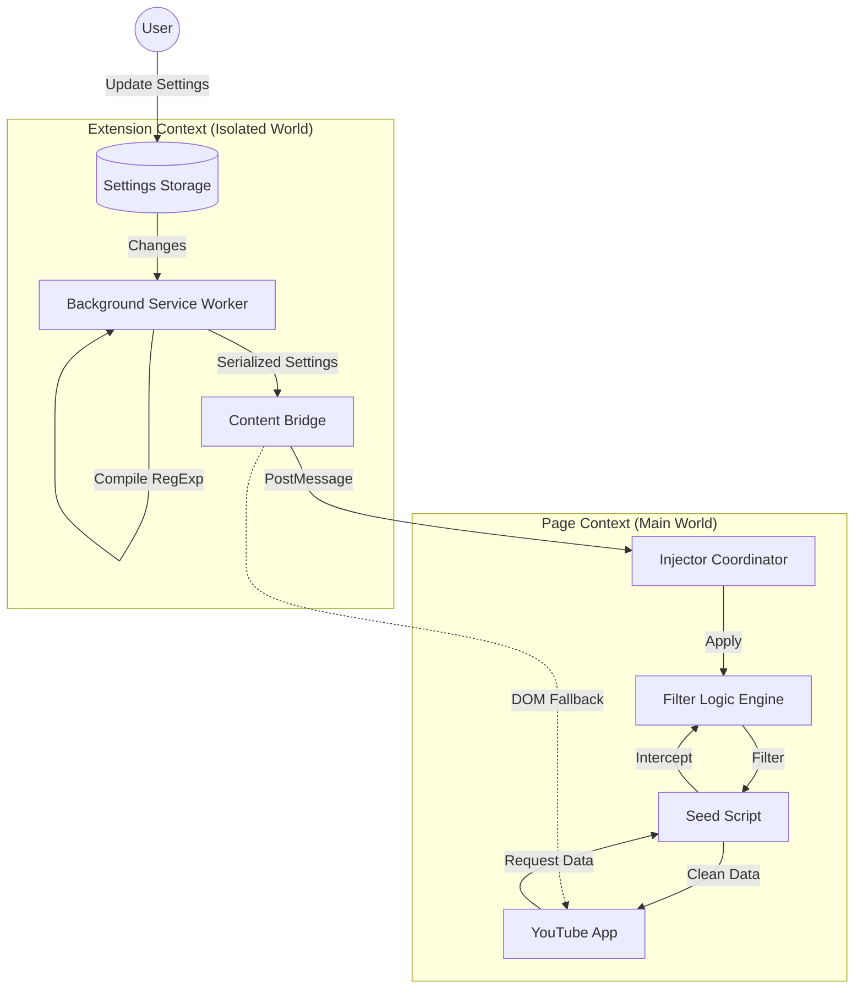

# FilterTube v3.0 Architecture Documentation

## Executive Summary

FilterTube v3.0 implements a robust **Hybrid Filtering Architecture** that combines preemptive **Data Interception** with a resilient **DOM Fallback** mechanism. This dual-layer approach ensures comprehensive content filtering across all YouTube surfaces (Home, Search, Watch, Shorts) while maintaining high performance and a "Zero Flash" user experience.

## Architecture Overview

### **Hybrid Filtering Strategy**

FilterTube operates on two synchronized layers:

1.  **Primary Layer: Data Interception ("Zero DOM")**
    *   Intercepts YouTube's raw JSON data (via `ytInitialData`, `ytInitialPlayerResponse`, and `fetch`/`XHR` overrides) before it reaches the rendering engine.
    *   Modifies the data structure to remove blocked content *before* it is ever created in the DOM.
    *   **Benefit:** True zero-flash filtering, high performance, no layout shift.

2.  **Secondary Layer: DOM Fallback (Visual Guard)**
    *   Monitors the DOM using efficient `MutationObserver`s.
    *   Catches any content that might bypass the data layer (e.g., client-side hydration updates, complex dynamic loading).
    *   Applies visual hiding (CSS) to blocked elements.
    *   **Benefit:** Reliability, handles edge cases and dynamic updates.

### **Multi-World Extension Architecture**

FilterTube leverages the modern "Isolated World" vs. "Main World" concept to bridge the gap between extension security and page access.

## Unified System Map

The following diagram illustrates the complete interaction between all FilterTube components, matching the logical flow of the system:

+-------------------------------------------------------+          +--------------------------------------------------+
|              Settings Management Pipeline             |          |                Extension Bootstrap               |
|                                                       |          |                                                  |
|   +-------------+                                     |          |   +-------------+                                |
|   | 2a: popup.js|                                     |          |   | 1a: Manifest|                                |
|   |  User Input |                                     |          |   |  (Declares) |                                |
|   +------+------+                                     |          |   +------+------+                                |
|          | saves to                                   |          |          |                                       |
|   +------v------+                                     |          |          +--------------------+                  |
|   |2b:background|                                     |          |          | declares           | declares         |
|   |Compile Regex|                                     |          |   +------v------+      +------v------+           |
|   +------+------+                                     |          |   | 1b: Content |      | 1c: seed.js |           |
|          | compiles                                   |          |   |   Bridge    |      | (Main World)|           |
|          v                                            |          |   |  (Isolated) |      |    Hooks    |           |
|   +-------------+      +-------------+                |          |   +------+------+      +-------------+           |
|   | 2c: Storage |----->| 2d: Bridge  |                |          |          |                    |                  |
|   |  OnChanged  |      | Req Settings|                |          |          | injects            |                  |
|   +-------------+      +------+------+                |          |   +------v------+             |                  |
|                               | sends (postMessage)   |          |   | 1d: Injector|             |                  |
|                               v                       |          |   | Coordinator |             |                  |
|                        +-------------+                |          |   +------+------+             |                  |
|                        | 2e: Injector|                |          |          |                    |                  |
|                        | Recv Setting|                |          +----------+--------------------+                  |
|                        +------+------+                |                     |                                       |
|                               | calls                 |                     | injects                               |
|                               v                       |                     v                                       |
|                        +-------------+                |          +----------+---------------------------------------+
|                        | 2f: seed.js |                |          |                                                  |
|                        |Cache Setting|                |          |                                                  |
|                        +------+------+                |          |                                                  |
|                               | updates               |          |                                                  |
|                               v                       |          |                                                  |
+-------------------------------+-----------------------+          |                                                  |
                                |                                  |                                                  |
+-------------------------------+-----------------------+          |                                                  |
|                Data Interception Layer                |<---------+                                                  |
|                                                       |                                                             |
|   +-------------+            +-------------+          |                                                             |
|   | 4a: seed.js |            | 3a: seed.js |          |                                                             |
|   | Fetch Proxy |            |ytInitialData|          |                                                             |
|   +------+------+            +------+------+          |                                                             |
|          | intercepts               | intercepts      |                                                             |
|          v                          v                 |                                                             |
|   +----------------------------------------+          |                                                             |
|   |        3b: processWithEngine           |          |                                                             |
|   |             (Call Filter)              |          |                                                             |
|   +------------------+---------------------+          |                                                             |
|                      | calls                          |                                                             |
+----------------------+--------------------------------+                                                             |
                       |                                                                                              |
                       v                                                                                              |
+-------------------------------------------------------+          +--------------------------------------------------+
|                 Filtering Engine Core                 |<---------+               DOM Fallback Layer                 |
|                                                       |          |                                                  |
|   +-------------+                                     |          |   +-------------+                                |
|   | 5a: Entry   |                                     |          |   | 6a: Observer|                                |
|   | processData |                                     |          |   |  Watch DOM  |                                |
|   +------+------+                                     |          |   +------+------+                                |
|          | instantiates                               |          |          | detects nodes                         |
|   +------v------+                                     |          |   +------v------+                                |
|   | 5b: Filter  |                                     |          |   | 6b: Apply   |                                |
|   |  Instance   |                                     |          |   |  Fallback   |                                |
|   +------+------+                                     |          |   +------+------+                                |
|          | processes                                  |          |          | scans                                 |
|   +------v------+                                     |          |   +------v------+                                |
|   | 5c: Traverse|                                     |          |   | 6c: Match   |                                |
|   |  Recursive  |                                     |          |   |   Content   |                                |
|   +------+------+                                     |          |   +------+------+                                |
|          | evaluates                                  |          |          | hides                                 |
|   +------v------+                                     |          |   +------v------+                                |
|   | 5d: Decision|<------------------------------------|----------|---| 6d: Toggle  |                                |
|   | _shouldBlock|          uses engine logic          |          |   | Visibility  |                                |
|   +------+------+                                     |          |   +-------------+                                |
|          | extracts                                   |          |                                                  |
|   +------v------+                                     |          |                                                  |
|   | 7a: Metadata|                                     |          |                                                  |
|   | _extractInfo|                                     |          |                                                  |
|   +-------------+                                     |          |                                                  |
+-------------------------------------------------------+          +--------------------------------------------------+

## 1. Extension Initialization & Script Injection Flow

**Motivation:**
FilterTube needs to filter YouTube content *before* it appears on screen to prevent unwanted videos from flashing briefly. The traditional approach of scanning the DOM is too slow. The solution is **data interception**: hooking into YouTube's JSON data structures before they're rendered. This requires injecting JavaScript into YouTube's page context (the "MAIN world") at the earliest possible moment.

**How it works (Simplified):**
Imagine FilterTube as a security guard. Instead of waiting for people (videos) to enter the building (the screen) and then kicking them out, FilterTube stands at the front door (the data connection) and checks everyone's ID before they even get inside. To do this, FilterTube has to arrive at the door *before* YouTube opens for business.

**Technical Flow:**

+----------------------------+
|  Browser Loads Extension   |
+----------------------------+
             |
             v
+----------------------------+
|      manifest.json         |
+----------------------------+
      |              |
      | (Main)       | (Isolated)
      v              v
+-----------+  +------------------+
|  seed.js  |  | content_bridge.js|
+-----------+  +------------------+
      |                  |
      |                  v
      |        +------------------+
      |        |  Request Settings|
      |        +------------------+
      |                  |
      v                  v
+----------------+ +------------------+
| Establish Hooks| |Init DOM Fallback |
| (ytInitialData)| |(MutationObserver)|
+----------------+ +------------------+
      |
      v
+----------------+
|  Wait for      |
|  Filter Engine |
+----------------+

## 2. Settings Compilation & Distribution Pipeline

**Motivation:**
FilterTube needs to distribute user filter settings across multiple isolated execution contexts. When a user adds a keyword like "spoilers", that setting must reach the background (for storage), the content bridge (for DOM fallback), and the main world scripts (for data interception). Chrome's security model prevents direct access, so a pipeline is needed.

**How it works (Simplified):**
When you change a setting, it's like sending a letter. You drop it in the mailbox (Popup). The post office (Background) stamps it and checks the address. Then a mail carrier (Content Bridge) takes it to the house (Page). Finally, the person inside (Filter Engine) reads it and updates their "Do Not Admit" list.

**Technical Flow:**

+---------+       +------------+
| User UI | ----> | Background |
| (Popup) |       | (Storage)  |
+---------+       +------------+
                        |
                   (OnChanged)
                        |
                        v
                  +------------+
                  |  Compile   |
                  |  Settings  |
                  +------------+
                        |
                        v
                  +------------+       +------------+
                  |  Content   | ----> |  Injector  |
                  |  Bridge    |       | (Main World)|
                  +------------+       +------------+
                                             |
                                       (postMessage)
                                             |
                                             v
                                       +------------+
                                       |  seed.js   |
                                       | (Reprocess)|
                                       +------------+

## Component Breakdown

### **1. Background Service (`background.js`)**
*   **Context:** Background Service Worker.
*   **Role:** Central State Manager & Validator.
*   **Key Responsibilities:** Manages storage, compiles regex patterns to prevent crashes, and handles cross-browser compatibility.

### **2. Content Bridge (`content_bridge.js`)**
*   **Context:** Isolated World.
*   **Role:** The Bridge & The Enforcer.
*   **Key Responsibilities:** Injects Main World scripts, relays settings, and runs the DOM Fallback (MutationObserver) to catch any missed content.

### **3. Seed Script (`seed.js`)**
*   **Context:** Main World.
*   **Role:** The Interceptor.
*   **Key Responsibilities:** Hooks global objects (`ytInitialData`, `fetch`) immediately at startup to intercept data before YouTube sees it.

### **4. Filter Logic Engine (`filter_logic.js`)**
*   **Context:** Main World.
*   **Role:** The Brain.
*   **Key Responsibilities:** Recursively processes JSON, identifies video renderers, and applies filtering rules.

### **5. Injector (`injector.js`)**
*   **Context:** Main World.
*   **Role:** The Coordinator.
*   **Key Responsibilities:** Initializes the engine and coordinates settings updates.