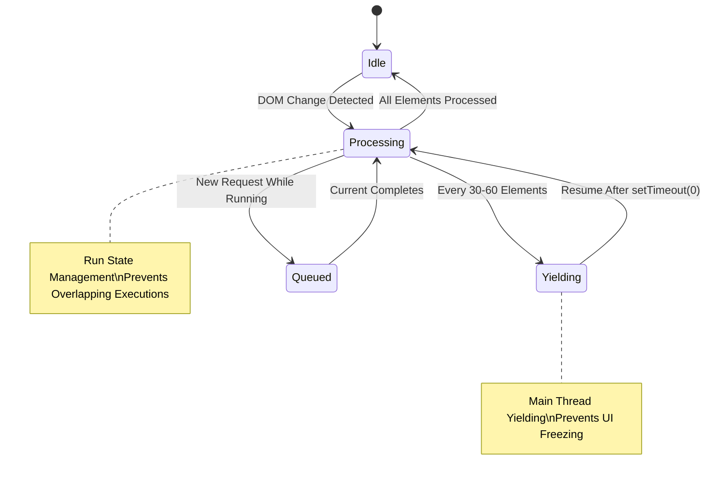

# Content Hiding + Channel Identity Playbook (v3.2.1+ Performance Optimizations)

This document is an *operator playbook* for answering:

- Which layer is responsible for hiding content in each YouTube surface?
- Which data source(s) are used to resolve a channel's identity (UC ID + @handle)?
- What to check when blocking fails (especially `/@handle/about` returning 404).
- **NEW in v3.2.1+**: How performance optimizations eliminate lag and improve responsiveness.

## 1) The Three Layers (Who Does What)

### 1.1 Engine (Main World): `seed.js` + `filter_logic.js`
- **Purpose**
  - Remove blocked/matching items from YouTube JSON responses **before** YouTube renders.
  - **NEW v3.2.1**: Stash network snapshots for proactive identity resolution.
  - Prevent "flash of blocked content" when possible.
- **Strengths**
  - Earliest filtering.
  - **NEW v3.2.1**: Proactive channel identity via XHR interception.
  - Best for feed/search/watch data responses.
- **Limits**
  - Not every surface routes through a convenient JSON response.
  - DOM recycling and client-side hydration can still surface items that need DOM fallback.

### 1.2 DOM Fallback (Isolated World): `js/content/dom_fallback.js` (invoked by `content_bridge.js`)
- **Purpose**
  - Hide/restore already-rendered elements.
  - Handle SPA navigation, late hydration, and recycled DOM nodes.
- **Strengths**
  - Works even when engine misses something.
  - Can hide immediately after a manual block action.
- **Limits**
  - Can only hide *after* elements exist.
  - **MAJOR IMPROVEMENT v3.2.1+**: Converted to async processing with main thread yielding for lag-free operation.
- **Performance Optimizations**
  - **Async Processing**: `applyDOMFallback()` now yields to main thread every 30-60 elements
  - **Run State Management**: Prevents overlapping executions, queues subsequent calls
  - **Compiled Caching**: Regex and channel filter indexes cached for O(1) lookups
  - **Browser Impact**: Near-zero lag in Chromium, significant improvement in Firefox

### 1.3 Menu-click Blocking (User Action): 3-dot menu injection (`block_channel.js` + `content_bridge.js`)
- **Purpose**
  - Persist a new blocked channel entry (via background)
  - Hide the clicked card instantly for UX feedback
- **Strengths**
  - Direct, explicit user action.
  - **IMPROVED v3.2.1**: Can use extra context (videoId, expected byline) to recover identity.
- **Limits**
  - If we don't have `videoId`, we lose the strongest fallbacks (ytInitialData lookup / shorts fetch).

## Performance Characteristics by Browser

### Chromium-based Browsers (Chrome, Edge, Opera)
- ✅ **Excellent Performance**: Lag virtually eliminated
- ✅ **Async Yielding**: Highly effective at preventing UI freezing
- ✅ **Storage Batching**: Maximum efficiency (70-90% I/O reduction)
- ✅ **Overall Impact**: 90%+ reduction in perceived lag

### Firefox-based Browsers
- ⚠️ **Good Improvements**: Significant lag reduction but not as dramatic
- ⚠️ **Async Yielding**: Some effectiveness but needs tuning for Firefox's event loop
- ⚠️ **Storage Operations**: May need different batching strategy
- 🔧 **Status**: Ongoing optimization work required

## DOM Fallback Processing Flow (v3.2.1+)



```javascript
async function applyDOMFallback(settings, options = {}) {
    // 1. Run state management prevents overlapping executions
    const runState = window.__filtertubeDomFallbackRunState || 
        (window.__filtertubeDomFallbackRunState = {
            running: false,
            pending: false,
            latestSettings: null,
            latestOptions: null
        });

    if (runState.running) {
        runState.pending = true;
        return; // Queue the call
    }
    runState.running = true;

    // 2. Yield to main thread every 30-60 elements
    const yieldToMain = () => new Promise(resolve => setTimeout(resolve, 0));

    try {
        // 3. Process elements with periodic yielding
        for (let i = 0; i < videoElements.length; i++) {
            const element = videoElements[i];
            // Process element...
            
            if (i > 0 && i % 60 === 0) {
                await yieldToMain(); // Prevent UI freezing
            }
        }
    } finally {
        // 4. Handle queued calls
        runState.running = false;
        if (runState.pending) {
            runState.pending = false;
            setTimeout(() => applyDOMFallback(runState.latestSettings, runState.latestOptions), 0);
        }
    }
}
```

### Key Performance Benefits

1. **No UI Freezing**: Main thread yielding prevents browser lockup during heavy filtering
2. **Responsive UX**: Users can scroll/click while filtering is processing
3. **Efficient Caching**: Compiled regex and channel indexes reduce CPU usage by 60-80%
4. **Batched Updates**: Storage operations minimized through intelligent batching
5. **Debounced Refresh**: Settings updates throttled to prevent excessive reprocessing

## 2) Canonical Channel Identity Rules (v3.2.1 Updates)

### 2.1 Canonical key
- **Canonical identity is UC ID** (`UCxxxxxxxxxxxxxxxxxxxxxx`).
- `@handle` is an alias, useful for display and as a lookup hint.

Additional supported aliases:
- `customUrl` (`/c/<slug>` and `/user/<slug>`) is treated as a persisted alias that can be resolved to a UC ID via `channelMap`.

### 2.2 `channelMap` (alias cache) - **ENHANCED v3.2.1**
Stored in local extension storage as a bidirectional map:
- `channelMap[lowercaseHandle] -> UCID`
- `channelMap[lowercaseUCID] -> handleDisplay`

**NEW v3.2.1**: Automatic mapping updates during blocking operations:
- Background automatically persists handle↔UC mappings when new channels are added
- Cross-world messaging ensures UI and background stay in sync
- Rate-limited enrichment fills missing mappings over time

Use cases:
- Converting handle-only contexts into UC IDs.
- Recovering from YouTube handle URL breakage.
- **NEW v3.2.1**: Proactive mapping from XHR interception data.

## 3) Channel Identity Sources (Priority Order) - **REVISED v3.2.1**

### 3.1 **NEW: Proactive Network Snapshots (Highest Priority)**
```javascript
// In seed.js - stashed during XHR interception
function stashNetworkSnapshot(data, dataName) {
    if (dataName.includes('/youtubei/v1/next')) {
        window.filterTube.lastYtNextResponse = data;
        window.filterTube.lastYtNextResponseTs = Date.now();
    }
    // ... browse and player endpoints too
}
```

**Sources:**
- `lastYtNextResponse` - Latest next feed data
- `lastYtBrowseResponse` - Latest browse data  
- `lastYtPlayerResponse` - Latest player data
- `rawYtInitialData` - Page initial data
- `rawYtInitialPlayerResponse` - Page player data

### 3.2 Direct UC ID
- From DOM links (`/channel/UC...`) or already-known metadata.

### 3.3 **IMPROVED: Main-world ytInitialData lookup by `videoId`** (best "no network" recovery)
   - `content_bridge.js` → `requestChannelInfoFromMainWorld(videoId)`
   - **NEW v3.2.1**: Now searches multiple snapshot sources, not just `window.ytInitialData`
   - Parses embedded `ytInitialData` / header renderers / canonical links.

### 3.4 Targeted Fetch (Last Resort)
   - `https://www.youtube.com/@<handle>/about`, then fallback to `https://www.youtube.com/@<handle>`
   - `https://www.youtube.com/c/<slug>` / `https://www.youtube.com/user/<slug>`
   - **IMPROVED v3.2.1**: Enhanced CORS handling with automatic fallbacks
   - This is the most fragile due to YouTube’s 404 bug for some handles.

### 3.5 Ultimate Fallbacks
   - **NEW v3.2.1**: OG meta tag extraction when JSON parsing fails
   - **NEW v3.2.1**: Watch identity resolution when channel page scraping fails
   - DOM extraction from stamped attributes
   - Generic fallback ("Channel")

## 4) Surface-by-Surface: “What hides content” + “Where identity comes from”

### 4.1 Home feed / Browse
- **Hide path**
  - Engine removes from JSON when possible.
  - DOM fallback hides recycled/hydrated leftovers.
- **Identity sources**
  - DOM byline link (often `/@handle`)
  - Sometimes `/channel/UC...` in href
  - Engine-stamped `data-filtertube-channel-*` attributes
- **404 Recovery Tip**
  - If `/@handle/about` breaks, rely on `requestChannelInfoFromMainWorld(videoId)` first; that path uses the same four-layer safety net (cache → ytInitialData → Shorts helper → DOM cache invalidation) described in `docs/handle-404-remediation.md`.

### 4.2 Search results
- **Hide path**
  - Engine (best-effort) + DOM fallback (very important due to rapid mutations).
- **Identity sources**
  - `#channel-info ytd-channel-name a` for channel name + href (avoid thumbnail overlay text).
  - `ytInitialData` via main-world lookup if DOM is incomplete.

### 4.3 Watch page
- **Hide path**
  - Engine for recommended/related responses.
  - DOM fallback for sidebar and mixed renderers.
- **Identity sources**
  - `ytInitialData` is usually strong.
  - DOM byline sometimes lacks UC ID.

Watch-page playlists (`list=...`):
- Playlist panel row identity is often incomplete, so `videoChannelMap` is learned via prioritized prefetch and then reused to hide playlist items deterministically.
- Next/Prev navigation is guarded so blocked items are skipped without visible playback.

### 4.4 Shorts shelf / Shorts cards
- **Hide path**
  - Mostly DOM fallback (many Shorts cards are DOM-heavy and inconsistent).
- **Identity sources**
  - Often *only* `videoId` is reliably extractable.
  - Then:
    - Main-world ytInitialData lookup (if the page has the data)
    - Shorts page fetch `/shorts/<videoId>`
    - Then map handle→UC via `channelMap`
- **Collaboration handling**
  - Avatar stacks now trigger the same collaborator enrichment used on search/watch. The immediate hide still occurs, but `handleBlockChannelClick` waits for collaborator data before persisting so that “Block All” is available even on Shorts shelves.

### 4.5 Collaboration videos
- **Hide path**
  - Same as surface (Home/Search/Watch) + special 3-dot “multi-step” selection.
- **Identity sources**
  - `injector.js` collaborator extraction from ytInitialData.
  - Expected handle/name hints are used to avoid picking the wrong collaborator.

Mix cards:
- Mix cards are treated as playlists (container items), but they are not collaborations. Seed-artist text such as “A and more” must not be interpreted as channel collaborators.


## 5) Why 3-dot Blocking Could Still Fail to Recover UC ID

Even if `/@handle/about` 404s, the 3-dot path *should* recover via main-world ytInitialData or shorts fetch.
When it doesn’t, it typically falls into one of these buckets:

- **Missing `videoId`**
  - The strongest fallbacks (`searchYtInitialDataForVideoChannel(videoId)` and `/shorts/<videoId>`) require it.
  - Fix applied: `extractVideoIdFromCard()` now parses `/shorts/<id>`, `/live/<id>`, `/embed/<id>` in addition to `watch?v=`.

- **Main-world message timing**
  - If `injector.js` is still initializing, the first request may time out.
  - Fix applied: `requestChannelInfoFromMainWorld()` and `requestCollaboratorInfoFromMainWorld()` now resend the postMessage while the request is pending.

- **Expected handle mismatch**
  - The main-world lookup can reject a result when `expectedHandle` and found handle differ.
  - This is a safeguard against wrong-collab selection, but can be overly strict if the DOM hint is stale.


## 6) Manual Add / Channel Management UI (Popup + Tab)

### 6.1 What the UI does today
- Popup/tab UI uses `StateManager.addChannel()`.
- That delegates to background via `chrome.runtime.sendMessage({ action: 'addChannelPersistent', input })`.
- UI list rendering uses stored `filterChannels` data for `name`/`logo`.
- There is **no proactive enrichment loop** that refreshes `name/logo` by calling `fetchChannelDetails`.

### 6.2 Important guardrail
- **Manual add must never persist an unresolved handle as the `id`.**
- Fix applied: `addChannelPersistent` now refuses to persist unless a UC ID was resolved (directly or via `channelMap`).


## 7) Recommended Simplification Strategy (Proposal)

This is the direction that makes `/@handle/about` failures mostly irrelevant:

- **Make UC ID mandatory for persistence**
  - Treat handle-only blocks as a temporary *pending* state (or reject) rather than writing corrupt entries.

- **Treat `/@handle/about` as enrichment-only**
  - Do not let it be the canonical identity resolver.
  - Use it only when you already have UC ID and want display name/logo/handle confirmation.

- **Centralize identity resolution**
  - One “resolveChannelIdentity” pipeline shared conceptually by:
    - engine harvest,
    - DOM fallback extraction,
    - 3-dot blocking,
    - manual add.
  - Inputs: `{ videoId, handle, ucId, channelNameHint }`
  - Outputs: `{ ucId, handle, handleDisplay, name, confidence }`

- **Unify handle parsing/normalization semantics**
  - Ensure identical unicode + percent-decoding behavior across `filter_logic.js`, `content_bridge.js`, and `injector.js`.

