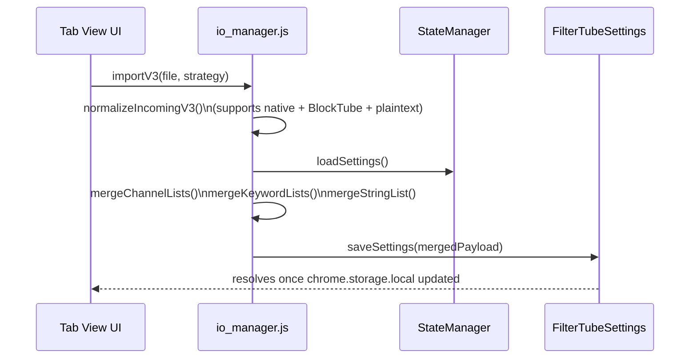

# FilterTube Data Portability + Sync + Whitelist Master Plan

## 0) Why this doc exists

This document defines **how FilterTube will implement**:

- **Phase 1 (now):** Import/Export of filters + settings.
- **Phase 2 (next):** Secure account-less **P2P sync** between devices (OTP + QR).
- **Phase 3 (next):** **Whitelist** (private + public/community lists) and **Kids Mode**.
- **Phase 4 (later):** ML/Semantic filtering and thumbnail analysis.

It is grounded in the current code architecture:

- **Storage truth:** `chrome.storage.local` keys compiled in `js/background.js:getCompiledSettings()`.
- **UI truth:** `js/state_manager.js` + `js/settings_shared.js`.
- **Filtering truth:** `js/filter_logic.js` (Main World) + DOM fallback modules (`js/content/*`).

The outcome is a versioned schema that can evolve without forcing painful rewrites.

---

## 1) Current system reality (constraints we must respect)

### 1.1 Current storage model (today)

The system already stores and depends on the following core concepts:

- **Profiles V4 (multi-profile + PIN)**  
  - `ftProfilesV4 = { schemaVersion: 4, activeProfileId, profiles: { [id]: { type, parentProfileId, name, settings, main, kids, security } } }`
  - `security.masterPinVerifier` (Default) / `security.profilePinVerifier` (others) = PBKDF2-SHA256 150k + salt + iterations + keyLen.
  - Unlock state is **UI-local**; background holds a **session-only PIN cache** after verifying PIN via `FilterTube_SessionPinAuth`.
  - Import/restore is **gated to Default (Master)** (and only if unlocked when PIN-protected).

- **Keywords**
  - UI-friendly list: `uiKeywords` (objects with `word`, `exact`, `comments`, timestamps)
  - Compiled list: `filterKeywords` + `filterKeywordsComments` (regex `{pattern, flags}`)
- **Channels**
  - UI-friendly list: `filterChannels` (objects like `{ id, handle, name, customUrl, logo, filterAll, filterAllComments, ... }`)
- **Identity caches**
  - `channelMap`: bidirectional alias map (`handle/customUrl` ↔ `UC...`) used for fast matching and 404 recovery.
  - `videoChannelMap`: `videoId → UC...` used for Shorts + watch playlist panels.
- **Controls/toggles** (many booleans)
- **Stats**
- **Theme** stored as `ftThemePreference`

### 1.2 Settings compilation pipeline (must stay stable)

- `js/settings_shared.js` is responsible for:
  - normalizing keywords/channels
  - generating compiled regex lists
  - persisting a canonical payload to storage
- `js/background.js:getCompiledSettings()` is responsible for:
  - reading storage keys
  - sanitizing compiled regex entries
  - returning a “compiled settings” object to content scripts / main world.

**Implication:** Import/Export must integrate with `StateManager` + `FilterTubeSettings.saveSettings()` so the compilation path remains the single path.

### 1.3 The “worlds” problem (P2P sync must not fight it)

FilterTube runs across multiple execution contexts:

- **UI contexts** (popup/tab): can use File APIs for Import/Export.
- **Background SW:** best place for durable sync flows.
- **Content scripts:** not a good place for long I/O.
- **Main world scripts:** should not own storage.

**Implication:**

- Phase 1 Import/Export lives in **Tab View Settings** (UI context).
- Phase 2 Sync orchestration lives in **background** (so it continues even if UI closes).
- PIN verification for encryption happens in **background**; UIs must send PIN for the active profile and background caches it temporarily.

---

## 2) Design principles (so future features stay maintainable)

- **One canonical payload:** The exported JSON is the same payload we send over P2P sync.
- **Versioned schema:** `meta.version` and a migration plan.
- **Adapters for external formats:** BlockTube and plaintext import are converted into the canonical schema.
- **Deterministic merge keys:** Deduplication must be stable across devices.
- **Separation of “lists” and “policy”:**
  - Lists = what you block/allow.
  - Policy = where/how those lists apply (YouTube vs Kids, modes, strictness).
- **Avoid quota traps:** Public lists can be huge, so they belong in IndexedDB later.

---

## 3) Canonical portable schema (FilterTube Export Format)

### 3.1 Schema goals

- Represents current FilterTube state without losing information.
- Adds forward-compatible slots for:
  - `blockedVideoIds` (BlockTube migration)
  - whitelists
  - P2P sync metadata
  - ML/intelligence configuration

### 3.2 Proposed schema: `filtertube_portable_v1`

This is the **export/import contract**.

```json
{
  "meta": {
    "schema": "filtertube_portable",
    "version": 1,
    "exportedAt": 1735280000000,
    "app": {
      "name": "FilterTube",
      "minAppVersion": "3.1.6"
    }
  },
  "profiles": {
    "main": {
      "policy": {
        "mode": "blocklist",
        "enabled": true,
        "contentControls": {
          "hideAllShorts": false,
          "hideAllComments": false,
          "filterComments": false,
          "hideHomeFeed": false,
          "hideSponsoredCards": false
        }
      },
      "lists": {
        "block": {
          "keywords": [],
          "channels": [],
          "videoIds": []
        },
        "allow": {
          "channels": [],
          "keywords": [],
          "publicSubscriptions": []
        }
      }
    },
    "kids": {
      "policy": {
        "mode": "whitelist",
        "enabled": false,
        "contentControls": {}
      },
      "lists": {
        "block": { "keywords": [], "channels": [], "videoIds": [] },
        "allow": { "channels": [], "keywords": [], "publicSubscriptions": [] }
      }
    }
  },
  "shared": {
    "identity": {
      "channelMap": {},
      "videoChannelMap": {}
    },
    "ui": {
      "theme": "light"
    },
    "stats": {
      "hiddenCount": 0,
      "savedSeconds": 0
    }
  },
  "intelligence": {
    "semantic": {
      "enabled": false,
      "threshold": 0.85,
      "blockedTopics": [],
      "allowedTopics": []
    },
    "thumbnail": {
      "enabled": false,
      "blur": false,
      "sensitivity": 0.8
    }
  }
}
```

### 3.3 How this maps to today’s storage keys

- **Keywords**
  - Export: `profiles.main.lists.block.keywords` comes from stored `uiKeywords` (plus channel-derived entries, because those matter for full portability).
  - Import: we will restore keywords through `FilterTubeSettings.saveSettings()` so `filterKeywords` is recompiled safely.

- **Channels**
  - Export: `profiles.main.lists.block.channels` comes from stored `filterChannels` entries.

- **Identity caches**
  - Export: `shared.identity.channelMap` + `shared.identity.videoChannelMap` from storage.

- **Toggles**
  - Export: `profiles.main.policy.contentControls` maps to current keys (`hideAllShorts`, `hideAllComments`, etc.).

**Note:** This schema is intentionally a superset. In Phase 1, most `kids` and `intelligence` sections will export as defaults.

### 3.3 Profiles V4 export surface (what actually ships today)

```
ftProfilesV4
├─ schemaVersion: 4
├─ activeProfileId: "default" | "<other>"
└─ profiles
   ├─ default
   │  ├─ type: "account"
   │  ├─ parentProfileId: null
   │  ├─ name: "Default"
   │  ├─ settings: { enabled, autoBackupEnabled, autoBackupMode, autoBackupFormat, syncKidsToMain, ...toggles }
   │  ├─ main: { channels, keywords }
   │  ├─ kids: { mode: "blocklist", strictMode, blockedChannels, blockedKeywords }
   │  └─ security: { masterPinVerifier? }
   └─ otherProfileId...
      ├─ type: "account"|"child"
      ├─ parentProfileId: "default"|accountId
      ├─ settings/main/kids (same shape as above)
      └─ security: { profilePinVerifier? }
```

### 3.4 Export scopes (per-profile vs full)

- **Full (Default active)**: include entire `ftProfilesV4` (all profiles).
- **Profile-only (non-default active)**: include only the active profile inside `ftProfilesV4`.
- UI enforces this: non-default profiles cannot export “full”.

### 3.5 Encrypted export/backup container (current)

```json
{
  "meta": {
    "version": 3,
    "exportType": "full|profile",
    "profileId": "default|child1",
    "profileName": "Default",
    "encrypted": true
  },
  "encrypted": {
    "salt": "<base64>",
    "iv": "<base64>",
    "ciphertext": "<base64>",
    "iterations": 150000,
    "algo": "PBKDF2-SHA256 + AES-GCM"
  }
}
```

### 3.6 Auto-backup policy (per profile)

- Keys: `autoBackupEnabled`, `autoBackupMode` (`latest|history`), `autoBackupFormat` (`auto|plain|encrypted`).
- Destination: `Downloads/FilterTube Backup/<ProfileLabel>/FilterTube-Backup-(Latest|<timestamp>).(json|encrypted.json)`.
- Encryption decision:
  - `encrypted`: always encrypt.
  - `plain`: never encrypt.
  - `auto`: encrypt if the active profile has a PIN verifier; else plain.
- **Session PIN cache requirement**: background encrypts only if the PIN was verified via `FilterTube_SessionPinAuth` for the active profile; otherwise encrypted backup is skipped (safe default).

---

## 4) Phase 1 (NOW): Import/Export feature (File-based)

### 4.1 Supported input formats

- **FilterTube native export** (the schema above)
- **BlockTube JSON export**
- **Plain text fallback**
  - one entry per line
  - can contain `UC...`, `@handle`, `/c/slug`, `/user/slug`, and keyword lines

### 4.2 Parse + normalization rules (adapters)

#### 4.2.1 BlockTube adapter

- **Channels**
  - Extract UC IDs from `filterData.channelId` array (skip `//` comments + empty lines).
  - Best-effort extract names from the preceding `// Blocked by ... (Name) (date)` comment.
- **Keywords**
  - Import `filterData.title` strings as block keywords.
- **Video IDs**
  - Import `filterData.videoId` into `profiles.main.lists.block.videoIds`.

**Decision:** Keep video IDs as raw blocks (immediate effect), and later provide a “Smart Analyzer” to convert them to channel blocks.

#### 4.2.2 Plaintext adapter

Line classification:

- **UC ID:** `^UC[A-Za-z0-9_-]{22}$`
- **Handle:** contains `@` (normalize percent-decoding + unicode)
- **Custom URL:** `/c/<slug>` or `/user/<slug>` (normalize to `c/slug` or `user/slug`)
- **Otherwise:** treat as keyword.

### 4.3 Import strategies

- **Default:** Merge (safe)
- **Optional advanced:** Replace (restore backup)

Merge rules:

- **Channels:** dedupe by canonical key priority:
  - UC ID if present
  - else handle
  - else customUrl
  - else originalInput
- **Keywords:** dedupe by `word + exact + comments` (case-insensitive).
- **Video IDs:** dedupe by exact videoId.
- **Identity caches:** merge `channelMap` + `videoChannelMap` (new wins only if existing is missing).
- **ProfilesV4:** replace or merge per export scope; PIN verifiers are kept as-is (never downgraded to plaintext).

### 4.4 Where this integrates into code (minimal disruption)

Planned modules:

- **New:** `js/io_manager.js`
  - Stateless: parse raw text/json → returns canonical portable schema object.
  - Export: reads from `StateManager.getState()` + `chrome.storage.local` (for maps/stats) to build export object.
  - **2025.12 Update:** now owns *all* normalization helpers (`normalizeChannelInput`, `sanitizeChannelEntry`, keyword merge rules) so both UI + future sync reuse a single implementation.

- **Update:** `js/state_manager.js`
  - Add `exportState()` / `importState(strategy)` wrappers.
  - These wrappers call `FilterTubeSettings.saveSettings()` so compilation remains correct.
  - Add new storage keys when ready (Phase 1 minimal: `blockedVideoIds` can be added later, but schema supports it now).

- **UI:** `html/tab-view.html` Settings view
  - Add “Data Management” card:
    - Export button
    - Import file input
    - Import strategy selector (Merge vs Replace)
    - Status UI

#### 4.4.1 ASCII flow (UI → JSON)

```text
Tab View (Import/Export)
    |
    v
StateManager.loadSettings()
    |
    v
FilterTubeSettings.saveSettings()
    |
    v
chrome.storage.local (uiKeywords, filterChannels, channelMap, stats)
    |
    v
js/io_manager.js::buildV3Export()
    |
    v
Portable JSON (meta + profiles + maps)
```

#### 4.4.2 Mermaid sequence (Import Merge)



#### 4.4.3 c/ChannelName + custom URLs

- Every inbound string passes through `normalizeChannelInput` which:
  - accepts `@handles`, `UCIDs`, `/channel/UC...`, `/c/<slug>`, `/user/<slug>`, bare `c/slug`, and even plain names.
  - percent-decodes UTF-8 and stores a lowercase `customUrl` key (e.g. `c/Filmy_Gyaan` → `c/filmy_gyaan`).
- When both a handle and custom URL arrive, the canonical priority is `UCID > handle > customUrl > originalInput`.
- During merge, the earliest `addedAt` stamp survives so backups keep historical order even when merging multiple files.

### 4.5 Success criteria

- Exported file can recreate filters on a new browser profile.
- Importing BlockTube immediately hides imported channels/keywords.
- Import does not corrupt `filterKeywords` compiled entries.
- After import, background recompiles and content scripts receive settings refresh.

---

## 5) Phase 2 (NEXT): Secure P2P sync (no accounts)

### 5.1 Non-negotiable requirements

- No account.
- Works across devices on different networks.
- Secure against passive eavesdropping.
- Resistant to active MITM (human-verifiable confirmation).
- Does not permanently store user data on the server.

### 5.2 Architecture overview

We treat sync as **transport only**. The payload is the same portable JSON.

- **Signaling server:** only exchanges WebRTC offers/answers/ICE.
  - Stores rooms ephemerally with expiry.
  - Does not store payload.
- **WebRTC data channel:** transports encrypted chunks.
- **Crypto:** uses WebCrypto.

### 5.3 Pairing UX (OTP + QR)

- **Device A (sender):**
  - “Sync to another device” → create session
  - shows:
    - `6-digit code` (easy typing)
    - QR code embedding session info (code + server URL)
    - a **Short Authentication String (SAS)** like `blue-sun-42`
- **Device B (receiver):**
  - “Receive from another device” → enter code or scan QR
  - displays SAS and asks user to confirm it matches Device A

If SAS mismatches: abort.

### 5.4 Crypto model (WebCrypto, practical)

- Each device generates an ephemeral ECDH keypair.
- During signaling exchange, devices exchange public keys.
- Derive a shared secret with ECDH.
- Use HKDF to derive:
  - `aesKey`
  - `hmacKey`
  - `sasKey` (for human-verifiable SAS)
- Encrypt payload chunks with AES-GCM.

### 5.5 Conflict resolution model

We should explicitly support both:

- **One-way transfer** (Device A overwrites/merges into Device B)
- **Two-way merge** (future)

For Phase 2 initial:

- Receiver chooses Merge or Replace.
- Merge uses the same deterministic rules as file import.

For future two-way merge:

- Introduce per-entry stable IDs:
  - `channelEntryId` = hash of `(ucId|handle|customUrl)`
  - `keywordEntryId` = hash of `(word|exact|comments|scope)`
- Keep `addedAt` and `updatedAt` for tie-breaking.

### 5.6 Where this lives in code

- **Background (preferred):** sync session lifecycle + applying imported payload.
- **UI (tab view):** pairing UI + QR rendering.

We can start with a small internal module:

- `js/sync/p2p_sync.js` (later)

and keep it separate from filtering logic.

---

## 6) Phase 3: Whitelist (private + public) + Kids Mode

### 6.1 Whitelist types

- **Private whitelist (PIN-protected):**
  - Parents define allowed channels/keywords.
  - Child cannot edit without PIN.

- **Public/community whitelist subscriptions:**
  - User subscribes to a URL list.
  - FilterTube downloads list periodically.
  - User can enable/disable per subscription.

### 6.2 Storage strategy (chrome.storage vs IndexedDB)

- **chrome.storage.local** (small, fast):
  - settings booleans
  - user-maintained channel/keyword lists
  - subscription metadata (URLs, timestamps)
  - identity caches (`channelMap`, `videoChannelMap`)

- **IndexedDB** (large):
  - downloaded public whitelist lists (thousands to tens of thousands of channels)
  - future semantic topic graphs

### 6.3 Policy: modes and priority

Modes:

- **blocklist:** default for normal YouTube
- **whitelist:** strict allow-only (ideal for Kids)
- **hybrid:** allow-only gatekeeper + blocklist overrides

Priority decision:

- **Blocklist wins** over whitelist.
  - If something is explicitly blocked, it must be blocked even if it appears in a public whitelist.

### 6.4 YouTube vs YouTube Kids: how to avoid “mixing mess”

This is the core question you asked: should Kids filters be shared with main YouTube?

#### Recommended approach: separate profiles, optional sharing toggles

- **Profiles are separate by default:**
  - `profiles.main` applies to `www.youtube.com`
  - `profiles.kids` applies to `www.youtubekids.com`

- **Sharing behavior is explicit (later UI switches):**
  - “Also apply my main blocklist in Kids” (default ON)
  - “Also apply my Kids whitelist on main YouTube” (default OFF)

Reasoning:

- A parent’s YouTube is not supposed to become strict whitelist-only.
- A kid’s environment usually needs strict allow-only.
- But “bad channels” are typically bad everywhere, so reusing the **blocklist** is often beneficial.

#### Implementation consequence

- The portable schema keeps **two separate list sets**.
- The engine chooses which profile to apply based on `location.hostname`.

### 6.5 Kids DOM differences

YouTube Kids has different DOM and likely different renderer structures.

Plan:

- Add separate content script entry for `*://www.youtubekids.com/*`.
- Implement `js/content/dom_fallback_kids.js` with Kids-specific selectors.
- Initially, prioritize DOM fallback (like Shorts), then later add data interception if feasible.

UI:

- Use the existing **Kids Mode** sidebar tab in `tab-view.html` as the management UI for `profiles.kids`.

### 6.6 PIN protection model

We should not store plaintext PIN.

- Store `pinSalt` + `pinHash` (PBKDF2 via WebCrypto).
- Gate sensitive actions:
  - editing Kids whitelist
  - enabling/disabling Kids policy
  - importing into Kids profile

---

## 7) Phase 4: ML/Semantic + thumbnail analysis (prepare now, implement later)

### 7.1 Data model boundaries

We must not mix:

- **User intent** (what user blocked/allowed)
- **Model suggestions** (what ML thinks)

Plan:

- User intent stays in `profiles.*.lists.*`.
- ML config stays in `intelligence.*`.
- ML-generated candidates are stored separately (future) as suggestions that the user can accept/reject.

### 7.2 Semantic tree and whitelist in the same world

Long-term, we can model:

- topics (violence, gambling, etc.)
- related channels
- related keywords

But the schema should keep:

- **explicit user whitelist**
- **topic-based allow/block**

as separate levers.

---

## 8) Implementation roadmap (concrete)

### Phase 1 (Import/Export)

- Add `Settings` page UI card for Import/Export.
- Add `js/io_manager.js` for parsing/exporting.
- Add `StateManager.importPortable()` / `StateManager.exportPortable()`.

### Phase 2 (P2P Sync)

- Implement signaling server (separate deploy).
- Implement WebRTC sync module.
- Add UI in Settings:
  - Send to device
  - Receive from device

### Phase 3 (Whitelist + Kids)

- Implement new `profiles` storage keys.
- Implement IndexedDB storage for public lists.
- Implement Kids content script + UI.
- Implement PIN gating.

---

## 9) Open decisions (you should confirm after reading)

- **Schema naming/versioning:** keep `filtertube_portable_v1` as first stable contract.
- **Where to store `videoIds` blocks:** in main profile only for Phase 1, unless you want Kids imports to also support videoId blocks.
- **Sharing default:** I recommend:
  - share blocklist from main → kids by default
  - do not share kids whitelist → main by default
- **P2P direction:** start with one-way transfer (simple), add two-way merge later.

---

## 10) Completion status

This plan is ready for your feedback. Once you confirm the open decisions, we can implement **Phase 1 Import/Export** in code with minimal disruption to the existing architecture.
