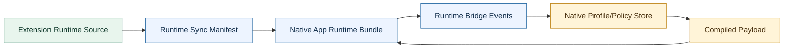

# Mobile App Upstream Checkpoint - 2026-04-28

This checkpoint records the extension-side behavior that was upstreamed while bringing the native app closer to extension parity. The mobile app should consume these rules through the runtime sync path, not by hand-porting divergent logic.

## Scope

Covered by this checkpoint:

- mobile 3-dot menu parity
- watch playlist and Mix row recovery
- collaborator roster correctness
- Mix false-positive protection
- exact keyword matching
- `Filter All` linked keyword behavior
- source badge and row tint semantics
- Kids/Main sync semantics
- UI parity expectations for Help, What's New, Accounts & Sync, Filters, and Kids Mode

Not covered:

- private YouTube APIs
- Innertube/protobuf request cloning
- APK-internal formats
- app-native fullscreen/back/PiP implementation

Those native shell seams belong in the app repo. The extension only defines the filtering/runtime source of truth.

## Commit Trace

Verified from `git log --since='2026-04-28 00:00'`.

### Upstream extension commits

- `dd7d17e` - mobile runtime parity fixes
- `d04ce52` - exact filter and menu state parity
- `61c7e84` - softened collaboration menu selected tint
- `ae51de3` - Mix collaborator discriminator hardening
- `af667b9` - authoritative collaborator roster precedence
- `24a91f5` - collaborator roster documentation

### Downstream app commits tied to this checkpoint

- `762723b` - native parity pass, app docs, synced upstream runtime snapshot, Nanah/backup/UI work
- `c8a9550` - internal QA release blockers and feature gating
- `235f41b` - synced upstream exact/filter-all/menu-state parity
- `7c145a3` - synced softened collaboration menu tint
- `face906` - synced Mix discriminator fix
- `e2efbbf` - synced authoritative collaborator roster fix

Downstream app sync commits should point back to the extension commits when the generated app runtime is refreshed.

## Runtime Ownership

```text
Extension repo
    js/content_bridge.js
    js/content/dom_fallback.js
    js/content/menu.js
    js/injector.js
    js/background.js
    js/settings_shared.js
        |
        | node tools/sync-runtime-from-extension.mjs
        v
Native app bundled runtime
    managed WebView surface
        |
        v
Native shell state
    profiles, PIN, import/export, Nanah sync, fullscreen, back, restore
```

The extension remains upstream for page/runtime behavior. The native app may own storage and shell UX, but it should not fork the filtering rules by editing generated runtime files.



## Mobile 3-Dot Menu Parity

The custom 3-dot entry is expected to work across:

- Home/feed cards
- Search result cards
- Home/Search Shorts shelves
- Shorts watch/cards where a stable video ID is available
- comment author rows
- watch playlist rows
- YTM watch-like rows
- Mix rows, with Mix-specific guardrails
- collaboration cards, including hidden roster surfaces

Important runtime rules:

- Quick-cross can be disabled without disabling the custom 3-dot menu path.
- Quick-cross and 3-dot blocking should share identity recovery and persistence semantics.
- Comment-origin blocking is isolated to the comment author and must not borrow the enclosing video channel.
- A block should not report success if the row still has no stable channel identity. Prefer a clear failure state over a fake "Channel Blocked" UI.
- Handles are display/alias identities. Persisted blocking should resolve toward a stable `UC...` channel ID whenever possible.

## Watch Playlist And Mix Recovery

Watch playlist and Mix rows often expose weaker identity than normal cards. The upstream rule is:

```text
row identity present
    -> block directly

row identity weak, videoId present
    -> recover through watch:VIDEO_ID / videoChannelMap / intercepted player or next data

row identity weak, no stable videoId
    -> fail clearly
```

Mix containers are not collaborations. A Mix card may contain a collaboration seed video, but the Mix container title or byline is not a collaborator roster.

Mix guardrails include:

- `radioRenderer`
- `compactRadioRenderer`
- RD playlist IDs
- thumbnail overlay text/icon `Mix` / `MIX`
- video-count signals
- titles beginning with normalized `Mix` separator patterns

If the seed video is a real collaboration, collaborator recovery must come from the seed video's authoritative JSON/watch data, not from the Mix title.

## Collaborator Roster Rules

The authoritative collaborator discriminator is:

```text
shortBylineText.runs[0]
  .navigationEndpoint.showSheetCommand
  .panelLoadingStrategy.inlineContent.sheetViewModel
  .header.panelHeaderViewModel.title.content == "Collaborators"
```

When this header-backed sheet exists:

- it outranks avatar-stack fallback data
- it outranks direct DOM byline parsing
- it may be used to correct/invalidate cached fallback rosters
- fallback rows can fill missing metadata but cannot invent extra collaborators

Composite fallback rows are pruned when they are only a concatenation of real labels already present in the roster. Example:

```text
Raw fallback:
    Bizarrap
    Daddy Yankee Bizarrap
    Daddy Yankee

Sanitized roster:
    Bizarrap
    Daddy Yankee
```

Expected collaborator counts must be corrected after pruning so the UI does not keep showing unresolved "All Collaborators" states for rows that were only fallback artifacts.

## Exact Matching

`Exact` means whole-term matching, not substring matching.

Expected examples:

```text
Keyword: Man
Exact off: matches "Man", "Mans", "Human", "Manchester"
Exact on:  matches "Man"
Exact on:  does not match "Mans"
```

Implementation uses Unicode-aware boundaries so non-English handles, titles, and keywords do not degrade into percent-encoded or ASCII-only matching.

## Filter All Linked Keywords

`Filter All` is channel-owned state.

```text
Channel row
    filterAll: true
        |
        v
Derived keyword row
    exact: true
    source: channel-derived
    linked to the owning channel
```

Rules:

- `Filter All` from Channel Management and `Filter All` from the 3-dot menu converge on the same channel state.
- The derived keyword is regenerated from channel state.
- The derived keyword should not be independently deleted as a user-authored keyword.
- To remove the derived keyword, turn off `Filter All` or remove the owning channel row.
- On Kids Mode, `Filter All` creates a Kids-derived keyword in the Kids keyword list.
- When Kids -> Main sync is enabled and modes match, the synced Main keyword should retain both channel-derived and `From Kids` meaning.

## Source Badges And Row Tinting

Source labels and row color are part of the product language, not decoration.

| Source | Label | Base tint |
| --- | --- | --- |
| Channel-derived keyword | `From Channel` | green |
| Comment author/channel | `From Comments` | brown |
| Collaboration group | `Collaboration` | yellow |
| Kids-synced rule | `From Kids` | pink |

Blended cases should show blended meaning:

- Main channel-derived keyword: green
- Main collaboration-derived keyword from `Filter All`: green blended with yellow
- Main comment-derived keyword from `Filter All`: green blended with brown
- Main rule synced from Kids and derived by `Filter All`: green blended with pink
- Kids Mode `Filter All`: green only, because it is native to the Kids list

The app should mirror these meanings in native UI. It does not need to embed extension HTML, but it should preserve labels, colors, state keys, and behavior.

## 3-Dot Menu Visual State

The fallback menu should communicate four different states:

- available: red FilterTube block action
- `Filter All` selected before block: red filled pill, no immediate destructive action
- row blocking in progress: selected row feedback without making all text unreadable
- blocked: green check/text state with a soft background tint

The selected/blocked collaboration rows should not become a heavy green slab. The background should stay subtle enough that collaborator names, handles, and `Filter All` pills remain readable.

## Kids/Main Sync

Kids and Main are independent rule spaces inside the same active profile.

`syncKidsToMain` is mode-aware:

- Kids blocklist syncs into Main only when Main is also in blocklist mode.
- Kids whitelist syncs into Main only when Main is also in whitelist mode.
- Mismatched modes do not invert meaning.
- Kids whitelist never becomes a Main blocklist.
- Kids blocklist never becomes a Main whitelist.

This matters for app UI wording. The setting should read as applying matching-mode Kids rules to Main, not as merging two unrelated lists.

## Channel Metadata And Avatars

Channel entries persist metadata needed for stable UI:

- `id`
- `handle`
- `canonicalHandle`
- `customUrl`
- `name`
- `logo`
- collaborator metadata when available
- source metadata such as comments/kids/collaboration

`logo` is the avatar URL, not a downloaded binary image cache in the extension. Native apps may choose to cache images on-device, but the portable rule data should keep the URL metadata so lists can render immediately when the platform image cache is warm.

Unicode handles should be stored/displayed as decoded handles where possible. Percent-encoded forms are only transport artifacts and should not become the primary UI label.

## Semantic ML Release Gate

Semantic ML is a future/disabled control unless runtime matching is implemented and verified. It can stay in docs/help as a future placeholder, but it should not be presented as an active filter in either extension or native app UI.

## App UI Parity Expectations

The native app should mirror extension information architecture, not extension HTML:

- Dashboard
- Filters
- Kids Mode
- Help
- What's New
- Accounts & Sync
- Import/Export
- profile badge/dropdown
- source badges and row chips

Native app surfaces should preserve:

- labels
- state meanings
- list mode semantics
- source badges
- `Exact`, `Comment`, and `Filter All` pill behavior
- Kids/Main separation
- Nanah sync language
- PIN lock restrictions

Pinned/locked profile behavior:

- profile selection remains available
- Help remains available
- What's New remains available
- Donate/support remains available
- rule editing, viewing surfaces, Accounts & Sync, import/export, and settings changes require unlock for a PIN-protected active profile

## Verification Expectations

Before claiming app parity, verify these as live behavior, not just UI presence:

- 3-dot menu entry appears and blocks correctly on Home, Search, Shorts, comments, watch rows, and Mix rows.
- Mix cards do not become fake collaborations.
- Real collaboration cards show the correct roster and preserve `k/n` collaboration state in list UI.
- `Filter All` persists through reload/profile switch and creates/removes derived keywords only through channel state.
- Exact matching blocks whole terms only.
- Kids `Filter All` creates Kids keywords.
- Kids -> Main sync only applies when list modes match.
- Unicode handles resolve to stable UC IDs and display decoded labels.
- Help/What's New/Accounts & Sync match extension IA in native form.
