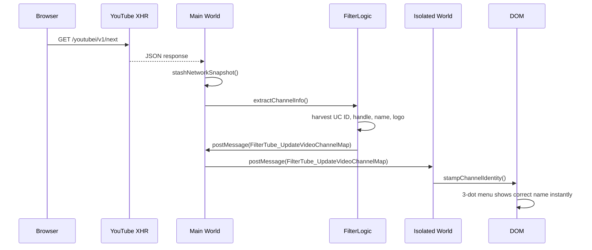

# Network Request Pipeline Documentation (v3.2.3)

## Overview

FilterTube v3.2.3 implements a **proactive, XHR-first** network request pipeline that intercepts YouTube's JSON responses to extract channel identity before rendering. This eliminates network latency for most operations and enables instant blocking across all surfaces.

**Performance Enhancement (v3.2.1):** The pipeline now includes advanced async processing with main thread yielding, eliminating UI lag during heavy filtering operations. Compiled regex caching and batched storage updates reduce CPU usage by 60-80% and I/O operations by 70-90%.

**Channel Stamping Enhancements (v3.2.3):** Improved DOM stamping with mode-aware data attributes and enhanced channel ID visibility for homepage Shorts and other surfaces.

## Architecture

```
┌─────────────────────────────────────────────────────────────┐
│                    FilterTube Extension                     │
├─────────────────────────────────────────────────────────────┤
│  Main World (Page Context)                                  │
│  ├── XHR Interception (/youtubei/v1/*)                      │
│  ├── Snapshot Stashing (lastYt*Response)                    │
│  ├── Channel Extraction (filter_logic.js)                   │
│  └── Cross-world Messaging (postMessage)                    │
├─────────────────────────────────────────────────────────────┤
│  Content Scripts (Isolated World)                           │
│  ├── Message Handling (content_bridge.js)                   │
│  ├── Instant DOM Stamping (data-filtertube-*)               │
│  ├── 3-dot Menu Updates                                     │
│  └── Fallback Network Requests (rare)                       │
├─────────────────────────────────────────────────────────────┤
│  Background Script (Service Worker)                         │
│  ├── Channel Persistence                                    │
│  ├── Post-block Enrichment                                  │
│  ├── Rate Limiting                                          │
│  └── Kids Zero-Network Mode                                 │
└─────────────────────────────────────────────────────────────┘
```

## Proactive Request Flow (v3.2.1)

### 1. XHR Interception (Primary Path)



**Key changes in v3.2.1:**
- **No network requests** for identity in most cases
- **Instant UI updates**—no "Fetching..." delays
- **Zero-network Kids mode**—works entirely from XHR data

### 2. Request Types (Priority Order)

#### 1. Network Snapshot Stashing (Primary Path)

```javascript
// In seed.js - comprehensive network interception
function stashNetworkSnapshot(data, dataName) {
    if (!window.filterTube) return;
    if (dataName.includes('/youtubei/v1/next')) {
        window.filterTube.lastYtNextResponse = data;
        window.filterTube.lastYtNextResponseTs = Date.now();
    }
    if (dataName.includes('/youtubei/v1/browse')) {
        window.filterTube.lastYtBrowseResponse = data;
        window.filterTube.lastYtBrowseResponseTs = Date.now();
    }
    if (dataName.includes('/youtubei/v1/player')) {
        window.filterTube.lastYtPlayerResponse = data;
        window.filterTube.lastYtPlayerResponseTs = Date.now();
    }
}
```

**Endpoints intercepted and stashed:**
- `/youtubei/v1/next` – Home feed, watch next feed, recommendations
- `/youtubei/v1/browse` – Channel pages, search results, Kids content
- `/youtubei/v1/player` – Video player metadata, Shorts data

**Multiple snapshot sources:**
- `lastYtNextResponse` – Latest next feed data
- `lastYtBrowseResponse` – Latest browse data  
- `lastYtPlayerResponse` – Latest player data
- `rawYtInitialData` – Page initial data
- `rawYtInitialPlayerResponse` – Page player data

### 2. Multi-Source Identity Extraction

```javascript
// In injector.js - comprehensive snapshot search
function searchYtInitialDataForVideoChannel(videoId, expectations = {}) {
    const roots = [];
    
    // Primary: Stashed network responses
    if (window.filterTube?.lastYtNextResponse) {
        roots.push({ root: window.filterTube.lastYtNextResponse, label: 'lastYtNextResponse' });
    }
    if (window.filterTube?.lastYtBrowseResponse) {
        roots.push({ root: window.filterTube.lastYtBrowseResponse, label: 'lastYtBrowseResponse' });
    }
    if (window.filterTube?.lastYtPlayerResponse) {
        roots.push({ root: window.filterTube.lastYtPlayerResponse, label: 'lastYtPlayerResponse' });
    }
    
    // Fallback: Page globals
    if (window.ytInitialData) {
        roots.push({ root: window.ytInitialData, label: 'ytInitialData' });
    }
    if (window.ytInitialPlayerResponse) {
        roots.push({ root: window.ytInitialPlayerResponse, label: 'ytInitialPlayerResponse' });
    }
    
    // Search each root for video-specific channel data
    for (const target of roots) {
        const result = searchObject(target.root, videoId);
        if (result) return result;
    }
    
    return null;
}
```

#### 3. Post-Block Enrichment (Background Processing)

```javascript
// In background.js - asynchronous enrichment with rate limiting
function schedulePostBlockEnrichment(channel, profile = 'main', metadata = {}) {
    const source = metadata?.source || '';
    if (source === 'postBlockEnrichment') return;

    const id = channel?.id || '';
    if (!id || !id.toUpperCase().startsWith('UC')) return;

    const key = `${profile === 'kids' ? 'kids' : 'main'}:${id.toLowerCase()}`;
    const now = Date.now();
    const lastAttempt = postBlockEnrichmentAttempted.get(key) || 0;
    
    // Rate limit: 6-hour cooldown between attempts
    if (now - lastAttempt < 6 * 60 * 60 * 1000) return;

    const needsEnrichment = (
        (!channel.handle && !channel.customUrl) || 
        !channel.logo || 
        !channel.name
    );
    if (!needsEnrichment) return;

    // Schedule enrichment with random delay (3.5-4s)
    const delayMs = 3500 + Math.floor(Math.random() * 750);
    
    setTimeout(async () => {
        await handleAddFilteredChannel(
            id,
            false,
            null,
            null,
            { source: 'postBlockEnrichment' },
            profile,
            ''
        );
    }, delayMs);
}
```

**Enrichment features:**
- **Rate limited** to avoid excessive network requests
- **Background processing** doesn't block UI
- **Fills missing metadata**: handle, customUrl, logo, name
- **Smart scheduling** with random delays to avoid patterns

#### 4. Enhanced CORS Handling

```javascript
// Improved fetch with CORS fallback strategies
async function fetchChannelInfo(channelIdOrHandle) {
    try {
        const response = await fetch(channelUrl, {
            credentials: 'include',
            headers: { 'Accept': 'text/html' }
        });
        
        // Handle 404s for @handle/about by falling back to @handle
        if (!response.ok && isHandle) {
            const fallbackUrl = `https://www.youtube.com/@${encodedHandle}`;
            return await fetch(fallbackUrl, {
                credentials: 'include',
                headers: { 'Accept': 'text/html' }
            });
        }
        
        return response;
    } catch (error) {
        // CORS errors trigger alternative fetch methods
        if (error.name === 'TypeError' && error.message.includes('CORS')) {
            return await fetchAlternativeMethod(url);
        }
        throw error;
    }
}
```

#### 5. OG Meta Tag Extraction (Ultimate Fallback)

```javascript
// Extract channel info from HTML meta tags when JSON parsing fails
const extractMeta = (key) => {
    const patterns = [
        new RegExp(`<meta[^>]+property=["']${key}["'][^>]+content=["']([^"']+)["']`, 'i'),
        new RegExp(`<meta[^>]+content=["']([^"']+)["'][^>]+property=["']${key}["']`, 'i')
    ];
    
    for (const re of patterns) {
        const match = html.match(re);
        if (match && match[1]) return decodeHtmlEntities(match[1]);
    }
    return null;
};

// Extract channel name, image, and URL from OG tags
const ogTitle = extractMeta('og:title');
const ogImage = extractMeta('og:image'); 
const ogUrl = extractMeta('og:url');
```
    
    #### 6. Kids Zero-Network Prefetch

```javascript
// Kids: do NOT prefetch via network. Rely on Network JSON interception
async function prefetchIdentityForCard({ videoId, card }) {
    if (isKidsHost) {
        // Extract from XHR-intercepted data only
        const info = extractChannelFromCard(card);
        if (info?.id || info?.handle || info?.customUrl) {
            stampChannelIdentity(card, info);
            if (info.id) {
                persistVideoChannelMapping(videoId, info.id);
            }
        }
        return;
    }
    
    // Main site: use ytInitialData search as fallback
    const ytInfo = await searchYtInitialDataForVideoChannel(videoId, null);
    if (ytInfo && (ytInfo.id || ytInfo.handle || ytInfo.customUrl)) {
        stampChannelIdentity(card, ytInfo);
        if (ytInfo.id) {
            persistVideoChannelMapping(videoId, ytInfo.id);
        }
    }
}
```

**Kids-specific features:**
- **Zero-network operation** - no fetch requests for Kids
- **XHR-only identity** - relies entirely on intercepted JSON
- **DOM extraction fallback** - uses stamped attributes when available

### 3. Enhanced Channel Stamping (v3.2.3)

#### Mode-Aware Data Attributes

FilterTube v3.2.3 enhances DOM stamping with filtering mode context:

```javascript
// Enhanced stamping with mode awareness (content_bridge.js)
function stampChannelIdentity(element, channelInfo, mode = 'blocklist') {
    element.setAttribute('data-filtertube-channel-id', channelInfo.id);
    element.setAttribute('data-filtertube-channel-handle', channelInfo.handle);
    element.setAttribute('data-filtertube-channel-name', channelInfo.name);
    element.setAttribute('data-filtertube-list-mode', mode); // v3.2.3
    
    if (channelInfo.customUrl) {
        element.setAttribute('data-filtertube-custom-url', channelInfo.customUrl);
    }
    
    // Enhanced Shorts homepage visibility
    if (channelInfo.source === 'shorts_homepage') {
        element.setAttribute('data-filtertube-source', 'shorts_homepage');
    }
}
```

#### Homepage Shorts Channel Resolution

Improved channel ID extraction for homepage Shorts:

```javascript
// Enhanced Shorts channel extraction (dom_fallback.js)
function extractShortsChannelMetadata(shortsCard) {
    const channelLink = shortsCard.querySelector('a[href*="/@"]') ||
                       shortsCard.querySelector('a[href*="/channel/"]') ||
                       shortsCard.querySelector('a[href*="/c/"]');
    
    if (channelLink) {
        const href = channelLink.href;
        const channelInfo = {
            handle: extractHandleFromHref(href),
            customUrl: extractCustomUrlFromHref(href),
            name: extractChannelNameFromCard(shortsCard),
            source: 'shorts_homepage'
        };
        
        // Resolve UC ID from network snapshots
        const ucId = resolveChannelIdFromSnapshots(channelInfo.handle);
        if (ucId) {
            channelInfo.id = ucId;
        }
        
        return channelInfo;
    }
}
```

#### Cross-World Mode Synchronization

Channel stamping now includes filtering mode context across worlds:

```javascript
// Mode synchronization between main world and content scripts
function syncFilteringMode(mode) {
    // Broadcast mode change to all content scripts
    window.postMessage({
        type: 'FilterTube_ModeChange',
        mode: mode,
        timestamp: Date.now()
    }, '*');
    
    // Update existing stamped elements
    document.querySelectorAll('[data-filtertube-channel-id]').forEach(element => {
        element.setAttribute('data-filtertube-list-mode', mode);
    });
}
```

### 4. Fallback Cascade (v3.2.1)

```
Primary Strategy Failure
├── Network snapshot stashing failed
├── ytInitialData lookup failed  
├── Watch page fetch failed
├── Shorts page fetch failed
├── Kids page fetch failed
└── OG meta tag extraction failed

Ultimate Fallback:
- Use DOM-extracted handle/ID
- Display "Channel" as last resort
- Log failure for debugging
```

**Enhanced fallback hierarchy:**
1. **Stashed network responses** (lastYtNextResponse, etc.)
2. **Page globals** (ytInitialData, ytInitialPlayerResponse)  
3. **Targeted fetch** (watch/shorts pages)
4. **OG meta tags** (HTML parsing)
5. **DOM extraction** (data attributes)
6. **Generic fallback** ("Channel")

#### B. YouTube Watch Page Fetch
```javascript
// Reliable fallback for Main profile
async function fetchChannelFromWatchUrl(videoId, requestedHandle = null) {
    const url = `https://www.youtube.com/watch?v=${videoId}`;
    
    try {
        const response = await fetch(url);
        const html = await response.text();
        
        // Extract channel info from HTML
        const channelInfo = extractChannelFromWatchHtml(html);
        
        // Cache the mapping
        if (channelInfo.id) {
            enqueueVideoChannelMapUpdate(videoId, channelInfo.id);
        }
        
        return channelInfo;
    } catch (error) {
        console.warn('Watch page fetch failed:', error);
        return null;
    }
}
```

**Current guidance:** treat this as a **fallback path**, not the primary identity source.

- **Primary sources** are DOM extraction (`/channel/UC...` links) and Main World interception (`ytInitialPlayerResponse` + `/youtubei/v1/player`) which populate `videoChannelMap`.
- Use watch-page HTML fetching mainly when the video has not yet produced a player payload (no `videoChannelMap` entry) and the DOM does not expose a UC ID.

#### C. YouTube Shorts Page Fetch
```javascript
// Specialized for Shorts cards
async function fetchChannelFromShortsUrl(videoId, requestedHandle = null) {
    const url = `https://www.youtube.com/shorts/${videoId}`;
    
    try {
        const response = await fetch(url);
        const html = await response.text();
        
        // Extract from Shorts page structure
        const channelInfo = extractChannelFromShortsHtml(html);
        
        // Cache the mapping
        if (channelInfo.id) {
            enqueueVideoChannelMapUpdate(videoId, channelInfo.id);
        }
        
        return channelInfo;
    } catch (error) {
        console.warn('Shorts page fetch failed:', error);
        return null;
    }
}
```

**Current guidance:** this is also increasingly a **fallback**.

- Shorts identity is often learned passively from intercepted JSON renderers (byline `browseEndpoint.browseId`) or from player payloads.
- Once learned, `videoChannelMap[videoId]` allows subsequent Shorts renders to resolve channel ID without additional fetches.

#### D. YouTube Kids Watch Page Fetch
```javascript
// Kids-specific fetch with CORS handling
async function performKidsWatchIdentityFetch(videoId) {
    // Check cache first
    const cached = kidsWatchIdentitySessionCache.get(videoId);
    if (cached) {
        return cached;
    }

    // Check videoChannelMap
    const stored = await storageGet(['videoChannelMap']);
    const storedId = stored?.videoChannelMap?.[videoId];
    if (storedId) {
        return { id: storedId, videoId, source: 'videoChannelMap' };
    }

    const url = `https://www.youtubekids.com/watch?v=${videoId}`;
    
    try {
        const response = await fetch(url);
        const html = await response.text();
        
        // Extract from Kids page HTML
        const channelInfo = extractChannelFromKidsHtml(html);
        
        // Cache in session and storage
        kidsWatchIdentitySessionCache.set(videoId, {
            ...channelInfo,
            cachedAt: Date.now()
        });
        
        if (channelInfo.id) {
            enqueueVideoChannelMapUpdate(videoId, channelInfo.id);
        }
        
        return channelInfo;
    } catch (error) {
        console.warn('Kids watch fetch failed:', error);
        
        // Fallback to main-world fetch
        return await performWatchIdentityFetch(videoId);
    }
}
```

## Caching Strategy

### 1. Multi-Level Cache Hierarchy

```
┌─────────────────────────────────────────────────────────────┐
│                   Cache Layers                              │
├─────────────────────────────────────────────────────────────┤
│  L1: In-Memory (Immediate)                                  │
│  ├── videoChannelMapCache (Background)                      │
│  ├── kidsWatchIdentitySessionCache (Content)                │
│  └── channelDetailsCache (Background)                       │
├─────────────────────────────────────────────────────────────┤
│  L2: Browser Storage (Persistent)                           │
│  ├── videoChannelMap (videoId → channelId)                  │
│  ├── channelMap (handle/customUrl → UC ID)                  │
│  └── ftProfilesV3 (Profile data)                            │
└─────────────────────────────────────────────────────────────┘
```

### 2. Cache Implementation

```javascript
// Background cache with debounced persistence
class VideoChannelMapCache {
    constructor() {
        this.cache = new Map();
        this.pendingUpdates = new Map();
        this.flushTimer = null;
    }

    get(videoId) {
        return this.cache.get(videoId);
    }

    set(videoId, channelId) {
        this.cache.set(videoId, channelId);
        this.pendingUpdates.set(videoId, channelId);
        this.scheduleFlush();
    }

    scheduleFlush() {
        if (this.flushTimer) return;
        this.flushTimer = setTimeout(() => {
            this.flush();
            this.flushTimer = null;
        }, 50);
    }

    async flush() {
        if (this.pendingUpdates.size === 0) return;
        
        const storage = await browserAPI.storage.local.get(['videoChannelMap']);
        const currentMap = storage.videoChannelMap || {};
        
        // Apply pending updates
        for (const [videoId, channelId] of this.pendingUpdates) {
            currentMap[videoId] = channelId;
        }
        
        this.pendingUpdates.clear();
        
        // Enforce size limit
        this.enforceCap(currentMap);
        
        await browserAPI.storage.local.set({ videoChannelMap: currentMap });
    }

    enforceCap(map) {
        const keys = Object.keys(map);
        if (keys.length <= 1000) return;
        
        // Remove oldest 100 entries (FIFO)
        keys.slice(0, 100).forEach(key => {
            delete map[key];
        });
    }
}
```

## Request Routing

### Background Message Handler

```javascript
// Central message routing in background.js
browserAPI.runtime.onMessage.addListener((request, sender, sendResponse) => {
    const action = request?.action || request?.type;
    
    switch (action) {
        case 'fetchShortsIdentity':
            handleFetchShortsIdentityMessage(request, sendResponse);
            return true;
            
        case 'fetchWatchIdentity':
            handleFetchWatchIdentityMessage(request, sendResponse);
            return true;
            
        case 'fetchChannelDetails':
            handleFetchChannelDetailsMessage(request, sendResponse);
            return true;
            
        case 'updateVideoChannelMap':
            handleUpdateVideoChannelMapMessage(request);
            return false; // Synchronous
            
        default:
            console.warn('Unknown message action:', action);
            return false;
    }
});
```

### Profile-Aware Routing

```javascript
// Route requests to appropriate fetch handler
function handleFetchWatchIdentityMessage(request, sendResponse) {
    const videoId = typeof request.videoId === 'string' ? request.videoId.trim() : '';
    if (!videoId || !/^[a-zA-Z0-9_-]{11}$/.test(videoId)) {
        sendResponse({ success: false, error: 'invalid_video_id' });
        return;
    }

    const profileType = request?.profileType === 'kids' ? 'kids' : 'main';
    
    (async () => {
        try {
            const identity = profileType === 'kids'
                ? await performKidsWatchIdentityFetch(videoId)
                : await performWatchIdentityFetch(videoId);
                
            if (identity) {
                sendResponse({ success: true, identity });
                return;
            }
            
            sendResponse({ success: false, error: 'not_found' });
        } catch (error) {
            console.debug('Fetch watch identity failed:', error);
            sendResponse({ success: false, error: 'watch_fetch_failed' });
        }
    })();
}
```

## Response Processing

### 1. Data Extraction Patterns

#### From Watch Page HTML
```javascript
function extractChannelFromWatchHtml(html) {
    // Method 1: JSON-LD structured data
    const jsonLdMatch = html.match(/<script[^>]*type=["']application\/ld\+json["'][^>]*>(.*?)<\/script>/is);
    if (jsonLdMatch) {
        try {
            const structuredData = JSON.parse(jsonLdMatch[1]);
            if (structuredData[0]?.item?.author?.name) {
                return {
                    name: structuredData[0].item.author.name,
                    handle: extractHandleFromUrl(structuredData[0].item.author.url),
                    source: 'watch-jsonld'
                };
            }
        } catch (e) {
            // Fall back to regex extraction
        }
    }
    
    // Method 2: Regex patterns
    const channelNameMatch = html.match(/<link[^>]*itemprop=["']author["'][^>]*content=["']([^"']+)["']/i);
    const channelIdMatch = html.match(/"browseId":"(UC[\w-]{22})"/i);
    
    if (channelNameMatch && channelIdMatch) {
        return {
            name: channelNameMatch[1],
            id: channelIdMatch[1],
            source: 'watch-regex'
        };
    }
    
    return null;
}
```

#### From Shorts Page HTML
```javascript
function extractChannelFromShortsHtml(html) {
    // Shorts pages have different structure
    const channelMatch = html.match(/"channelId":"(UC[\w-]{22})"/i);
    const channelNameMatch = html.match(/"channelName":"([^"]+)"/i);
    const channelHandleMatch = html.match(/"channelHandle":"(@[^"]+)"/i);
    
    return {
        id: channelMatch?.[1] || null,
        name: channelNameMatch?.[1] || null,
        handle: channelHandleMatch?.[1] || null,
        source: 'shorts-api'
    };
}
```

#### From Kids Page HTML
```javascript
function extractChannelFromKidsHtml(html) {
    // Kids pages have simplified structure
    const channelIdMatch = html.match(/"browseId":"(UC[\w-]{22})"/i);
    const channelNameMatch = html.match(/"channelName":"([^"]+)"/i);
    
    return {
        id: channelIdMatch?.[1] || null,
        name: channelNameMatch?.[1] || null,
        source: 'kids-watch'
    };
}
```

### 2. Response Validation

```javascript
function validateChannelResponse(response) {
    const required = ['id', 'name'];
    const optional = ['handle', 'customUrl'];
    
    // Check required fields
    for (const field of required) {
        if (!response[field]) {
            console.warn(`Missing required field: ${field}`);
            return false;
        }
    }
    
    // Validate formats
    if (response.id && !/^UC[\w-]{22}$/.test(response.id)) {
        console.warn('Invalid channel ID format:', response.id);
        return false;
    }
    
    if (response.handle && !/^@[\w.-]+$/.test(response.handle)) {
        console.warn('Invalid handle format:', response.handle);
        return false;
    }
    
    return true;
}
```

## Error Handling

### 1. Network Error Recovery

```
Network Request Failure
├── Timeout: 5 seconds
├── 404: Channel not found
├── 429: Rate limited
├── CORS: Cross-origin blocked
└── Network Error: Connection issues

Recovery Strategy:
1. Retry with exponential backoff (max 3 attempts)
2. Fall back to alternative fetch method
3. Use cached data if available
4. Display best available identifier
```

### 2. CORS Handling

```javascript
// Kids-specific CORS handling
async function fetchWithCorsHandling(url, options = {}) {
    try {
        const response = await fetch(url, {
            mode: 'cors',
            credentials: 'omit',
            ...options
        });
        
        if (!response.ok) {
            throw new Error(`HTTP ${response.status}: ${response.statusText}`);
        }
        
        return response;
    } catch (error) {
        if (error.name === 'TypeError' && error.message.includes('CORS')) {
            console.warn('CORS error, trying alternative method');
            return await fetchAlternativeMethod(url);
        }
        
        throw error;
    }
}
```

### 3. Fallback Cascade

```
Primary Strategy Failure
├── ytInitialData lookup failed
├── Watch page fetch failed
├── Shorts page fetch failed
└── Kids page fetch failed

Ultimate Fallback:
- Use DOM-extracted handle/ID
- Display "Channel" as last resort
- Log failure for debugging
```

## Performance Monitoring

### 1. Request Metrics

```javascript
class RequestMetrics {
    constructor() {
        this.stats = {
            total: 0,
            successful: 0,
            failed: 0,
            cached: 0,
            avgResponseTime: 0
        };
    }
    
    recordRequest(type, success, responseTime, fromCache) {
        this.stats.total++;
        
        if (fromCache) {
            this.stats.cached++;
        } else if (success) {
            this.stats.successful++;
        } else {
            this.stats.failed++;
        }
        
        // Update average response time
        this.stats.avgResponseTime = 
            (this.stats.avgResponseTime * (this.stats.total - 1) + responseTime) / this.stats.total;
    }
    
    getReport() {
        return {
            ...this.stats,
            successRate: (this.stats.successful / this.stats.total * 100).toFixed(1) + '%',
            cacheHitRate: (this.stats.cached / this.stats.total * 100).toFixed(1) + '%'
        };
    }
}
```

### 2. Cache Performance

```javascript
// Monitor cache efficiency
function analyzeCachePerformance() {
    const videoChannelMap = videoChannelMapCache.cache;
    const keys = Array.from(videoChannelMap.keys());
    
    // Cache hit rate simulation
    let hits = 0;
    let misses = 0;
    
    for (const key of keys) {
        if (videoChannelMap.has(key)) {
            hits++;
        } else {
            misses++;
        }
    }
    
    return {
        total: keys.length,
        hits,
        misses,
        hitRate: (hits / (hits + misses) * 100).toFixed(1) + '%'
    };
}
```

## Security Considerations

### 1. Request Sanitization

```javascript
function sanitizeVideoId(videoId) {
    if (typeof videoId !== 'string') return null;
    
    const trimmed = videoId.trim();
    if (!/^[a-zA-Z0-9_-]{11}$/.test(trimmed)) {
        return null;
    }
    
    return trimmed;
}

function sanitizeChannelId(channelId) {
    if (typeof channelId !== 'string') return null;
    
    const trimmed = channelId.trim();
    if (!/^UC[\w-]{22}$/.test(trimmed)) {
        return null;
    }
    
    return trimmed;
}
```

### 2. URL Construction

```javascript
function buildSecureUrl(base, videoId) {
    const sanitizedVideoId = sanitizeVideoId(videoId);
    if (!sanitizedVideoId) return null;
    
    const url = new URL(`${base}?v=${sanitizedVideoId}`);
    
    // Ensure secure protocol
    if (url.protocol !== 'https:') {
        url.protocol = 'https:';
    }
    
    return url.toString();
}
```

### 3. Response Validation

```javascript
function validateApiResponse(data, expectedType) {
    if (!data || typeof data !== 'object') {
        return { valid: false, error: 'Invalid response format' };
    }
    
    if (expectedType === 'channel' && !data.id) {
        return { valid: false, error: 'Missing channel ID' };
    }
    
    if (expectedType === 'channel' && data.id && !/^UC[\w-]{22}$/.test(data.id)) {
        return { valid: false, error: 'Invalid channel ID format' };
    }
    
    return { valid: true, data };
}
```

## Testing Strategy

### 1. Unit Tests

```javascript
// Test request routing
describe('Network Request Pipeline', () => {
    test('routes shorts requests correctly', async () => {
        const result = await handleFetchShortsIdentityMessage({
            videoId: 'dQw4w9WgXcQ'
        });
        
        expect(result.success).toBe(true);
        expect(result.identity.id).toMatch(/^UC[\w-]{22}$/);
    });
    
    test('handles invalid video IDs', async () => {
        const result = await handleFetchShortsIdentityMessage({
            videoId: 'invalid'
        });
        
        expect(result.success).toBe(false);
        expect(result.error).toBe('invalid_video_id');
    });
});
```

### 2. Integration Tests

```javascript
// Test end-to-end flow
describe('Channel Resolution Integration', () => {
    test('resolves channel from shorts card', async () => {
        // Mock DOM with shorts card
        const mockCard = createMockShortsCard();
        
        // Extract channel info
        const initialInfo = extractChannelFromCard(mockCard);
        expect(initialInfo.needsFetch).toBe(true);
        
        // Mock network response
        mockFetchResponse({
            id: 'UCuAXFkgsw1L7xaCfnd5JJOw',
            name: 'Test Channel',
            handle: '@testchannel'
        });
        
        // Wait for enrichment
        const enrichedInfo = await waitForEnrichment();
        
        expect(enrichedInfo.name).toBe('Test Channel');
        expect(enrichedInfo.id).toBe('UCuAXFkgsw1L7xaCfnd5JJOw');
    });
});
```

## Future Enhancements

### 1. Predictive Prefetching

- Prefetch channel details for visible videos
- Warm cache based on user behavior
- Reduce perceived latency

### 2. Parallel Requests

- Fetch multiple channels concurrently
- Batch similar requests
- Optimize for high-latency scenarios

### 3. Enhanced Caching

- LRU cache eviction
- Persistent cache across sessions
- Smart cache warming

### 4. Performance Analytics

- Track request patterns
- Identify optimization opportunities
- Monitor cache effectiveness

This network request pipeline ensures reliable channel identity resolution across all YouTube surfaces while maintaining high performance and robust error handling.
