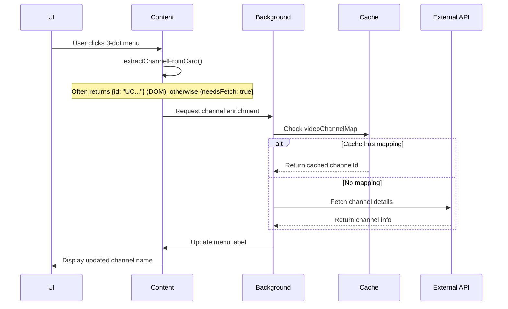

# Network Request Pipeline Documentation

## Overview

FilterTube v3.1.8 implements a sophisticated network request pipeline for channel identity resolution across both YouTube Main and YouTube Kids domains. This pipeline ensures accurate channel information is available for 3-dot menu labels and blocking actions.

## Architecture

```
┌─────────────────────────────────────────────────────────────┐
│                    FilterTube Extension                     │
├─────────────────────────────────────────────────────────────┤
│  Content Scripts (Isolated World)                           │
│  ├── Initial DOM Extraction                                 │
│  ├── Background Request Trigger                             │
│  └── Async Label Update                                     │
├─────────────────────────────────────────────────────────────┤
│  Background Script (Service Worker)                         │
│  ├── Request Routing                                        │
│  ├── Cache Layer                                            │
│  ├── Fetch Handlers                                         │
│  └── Response Processing                                    │
├─────────────────────────────────────────────────────────────┤
│  External APIs                                              │
│  ├── YouTube Watch Page                                     │
│  ├── YouTube Shorts Page                                    │
│  └── YouTube Kids Watch Page                                │
└─────────────────────────────────────────────────────────────┘
```

## Request Flow

### 1. Initial Trigger



**Important update (current behavior):** the diagram above shows the *menu enrichment* request flow, but in practice **FilterTube often already knows the UC channel ID before the user opens the menu**.

- **Main World interception (preferred):** `js/seed.js` intercepts `ytInitialData`, `ytInitialPlayerResponse`, and `/youtubei/v1/*` fetch/XHR payloads. `js/filter_logic.js` harvests `videoId -> UC...` and posts it via `window.postMessage({ type: 'FilterTube_UpdateVideoChannelMap' })`.
- **Persistence:** `js/content_bridge.js` receives `FilterTube_UpdateVideoChannelMap` and forwards it to `background.js` (`action: 'updateVideoChannelMap'`). This makes Shorts/Watch identity available *on future renders* and across surfaces.
- **DOM-first shortcut (now common):** many cards (including Shorts surfaces) now expose `/channel/UC...` anchors, so `extractChannelFromCard()` can return a UC ID immediately, meaning `needsFetch` is often false.

### 2. Request Types

#### A. Main World ytInitialData Lookup
```javascript
// Fastest: Extract from page's initial data
async function searchYtInitialDataForVideoChannel(videoId, options = {}) {
    const expectedHandle = options.expectedHandle || null;
    const expectedName = options.expectedName || null;

    // Search through ytInitialData structure
    const initialData = window.ytInitialData;
    if (!initialData) return null;

    // Deep search for video-related channel info
    const searchResult = deepSearchInitialData(initialData, videoId);
    if (searchResult) {
        return {
            id: searchResult.channelId,
            handle: searchResult.handle,
            name: searchResult.name,
            source: 'ytInitialData'
        };
    }

    return null;
}
```

#### A2. Main World player payload harvesting (Watch + Shorts)

In addition to `ytInitialData`, the **player response** is now a major identity source:

- `window.ytInitialPlayerResponse` (defineProperty hook in `js/seed.js`)
- `/youtubei/v1/player` (fetch/XHR interception in `js/seed.js`)

These commonly include explicit fields such as `videoDetails.videoOwnerChannelId` / `videoDetails.channelId` or `microformat.playerMicroformatRenderer.externalChannelId`, allowing `filter_logic.js` to register:

- `channelMap` mappings (UC ID ↔ handle/customUrl)
- `videoChannelMap` mappings (videoId → UC ID)

#### B. YouTube Watch Page Fetch
```javascript
// Reliable fallback for Main profile
async function fetchChannelFromWatchUrl(videoId, requestedHandle = null) {
    const url = `https://www.youtube.com/watch?v=${videoId}`;
    
    try {
        const response = await fetch(url);
        const html = await response.text();
        
        // Extract channel info from HTML
        const channelInfo = extractChannelFromWatchHtml(html);
        
        // Cache the mapping
        if (channelInfo.id) {
            enqueueVideoChannelMapUpdate(videoId, channelInfo.id);
        }
        
        return channelInfo;
    } catch (error) {
        console.warn('Watch page fetch failed:', error);
        return null;
    }
}
```

**Current guidance:** treat this as a **fallback path**, not the primary identity source.

- **Primary sources** are DOM extraction (`/channel/UC...` links) and Main World interception (`ytInitialPlayerResponse` + `/youtubei/v1/player`) which populate `videoChannelMap`.
- Use watch-page HTML fetching mainly when the video has not yet produced a player payload (no `videoChannelMap` entry) and the DOM does not expose a UC ID.

#### C. YouTube Shorts Page Fetch
```javascript
// Specialized for Shorts cards
async function fetchChannelFromShortsUrl(videoId, requestedHandle = null) {
    const url = `https://www.youtube.com/shorts/${videoId}`;
    
    try {
        const response = await fetch(url);
        const html = await response.text();
        
        // Extract from Shorts page structure
        const channelInfo = extractChannelFromShortsHtml(html);
        
        // Cache the mapping
        if (channelInfo.id) {
            enqueueVideoChannelMapUpdate(videoId, channelInfo.id);
        }
        
        return channelInfo;
    } catch (error) {
        console.warn('Shorts page fetch failed:', error);
        return null;
    }
}
```

**Current guidance:** this is also increasingly a **fallback**.

- Shorts identity is often learned passively from intercepted JSON renderers (byline `browseEndpoint.browseId`) or from player payloads.
- Once learned, `videoChannelMap[videoId]` allows subsequent Shorts renders to resolve channel ID without additional fetches.

#### D. YouTube Kids Watch Page Fetch
```javascript
// Kids-specific fetch with CORS handling
async function performKidsWatchIdentityFetch(videoId) {
    // Check cache first
    const cached = kidsWatchIdentitySessionCache.get(videoId);
    if (cached) {
        return cached;
    }

    // Check videoChannelMap
    const stored = await storageGet(['videoChannelMap']);
    const storedId = stored?.videoChannelMap?.[videoId];
    if (storedId) {
        return { id: storedId, videoId, source: 'videoChannelMap' };
    }

    const url = `https://www.youtubekids.com/watch?v=${videoId}`;
    
    try {
        const response = await fetch(url);
        const html = await response.text();
        
        // Extract from Kids page HTML
        const channelInfo = extractChannelFromKidsHtml(html);
        
        // Cache in session and storage
        kidsWatchIdentitySessionCache.set(videoId, {
            ...channelInfo,
            cachedAt: Date.now()
        });
        
        if (channelInfo.id) {
            enqueueVideoChannelMapUpdate(videoId, channelInfo.id);
        }
        
        return channelInfo;
    } catch (error) {
        console.warn('Kids watch fetch failed:', error);
        
        // Fallback to main-world fetch
        return await performWatchIdentityFetch(videoId);
    }
}
```

## Caching Strategy

### 1. Multi-Level Cache Hierarchy

```
┌─────────────────────────────────────────────────────────────┐
│                   Cache Layers                              │
├─────────────────────────────────────────────────────────────┤
│  L1: In-Memory (Immediate)                                  │
│  ├── videoChannelMapCache (Background)                      │
│  ├── kidsWatchIdentitySessionCache (Content)                │
│  └── channelDetailsCache (Background)                       │
├─────────────────────────────────────────────────────────────┤
│  L2: Browser Storage (Persistent)                           │
│  ├── videoChannelMap (videoId → channelId)                  │
│  ├── channelMap (handle/customUrl → UC ID)                  │
│  └── ftProfilesV3 (Profile data)                            │
└─────────────────────────────────────────────────────────────┘
```

### 2. Cache Implementation

```javascript
// Background cache with debounced persistence
class VideoChannelMapCache {
    constructor() {
        this.cache = new Map();
        this.pendingUpdates = new Map();
        this.flushTimer = null;
    }

    get(videoId) {
        return this.cache.get(videoId);
    }

    set(videoId, channelId) {
        this.cache.set(videoId, channelId);
        this.pendingUpdates.set(videoId, channelId);
        this.scheduleFlush();
    }

    scheduleFlush() {
        if (this.flushTimer) return;
        this.flushTimer = setTimeout(() => {
            this.flush();
            this.flushTimer = null;
        }, 50);
    }

    async flush() {
        if (this.pendingUpdates.size === 0) return;
        
        const storage = await browserAPI.storage.local.get(['videoChannelMap']);
        const currentMap = storage.videoChannelMap || {};
        
        // Apply pending updates
        for (const [videoId, channelId] of this.pendingUpdates) {
            currentMap[videoId] = channelId;
        }
        
        this.pendingUpdates.clear();
        
        // Enforce size limit
        this.enforceCap(currentMap);
        
        await browserAPI.storage.local.set({ videoChannelMap: currentMap });
    }

    enforceCap(map) {
        const keys = Object.keys(map);
        if (keys.length <= 1000) return;
        
        // Remove oldest 100 entries (FIFO)
        keys.slice(0, 100).forEach(key => {
            delete map[key];
        });
    }
}
```

## Request Routing

### Background Message Handler

```javascript
// Central message routing in background.js
browserAPI.runtime.onMessage.addListener((request, sender, sendResponse) => {
    const action = request?.action || request?.type;
    
    switch (action) {
        case 'fetchShortsIdentity':
            handleFetchShortsIdentityMessage(request, sendResponse);
            return true;
            
        case 'fetchWatchIdentity':
            handleFetchWatchIdentityMessage(request, sendResponse);
            return true;
            
        case 'fetchChannelDetails':
            handleFetchChannelDetailsMessage(request, sendResponse);
            return true;
            
        case 'updateVideoChannelMap':
            handleUpdateVideoChannelMapMessage(request);
            return false; // Synchronous
            
        default:
            console.warn('Unknown message action:', action);
            return false;
    }
});
```

### Profile-Aware Routing

```javascript
// Route requests to appropriate fetch handler
function handleFetchWatchIdentityMessage(request, sendResponse) {
    const videoId = typeof request.videoId === 'string' ? request.videoId.trim() : '';
    if (!videoId || !/^[a-zA-Z0-9_-]{11}$/.test(videoId)) {
        sendResponse({ success: false, error: 'invalid_video_id' });
        return;
    }

    const profileType = request?.profileType === 'kids' ? 'kids' : 'main';
    
    (async () => {
        try {
            const identity = profileType === 'kids'
                ? await performKidsWatchIdentityFetch(videoId)
                : await performWatchIdentityFetch(videoId);
                
            if (identity) {
                sendResponse({ success: true, identity });
                return;
            }
            
            sendResponse({ success: false, error: 'not_found' });
        } catch (error) {
            console.debug('Fetch watch identity failed:', error);
            sendResponse({ success: false, error: 'watch_fetch_failed' });
        }
    })();
}
```

## Response Processing

### 1. Data Extraction Patterns

#### From Watch Page HTML
```javascript
function extractChannelFromWatchHtml(html) {
    // Method 1: JSON-LD structured data
    const jsonLdMatch = html.match(/<script[^>]*type=["']application\/ld\+json["'][^>]*>(.*?)<\/script>/is);
    if (jsonLdMatch) {
        try {
            const structuredData = JSON.parse(jsonLdMatch[1]);
            if (structuredData[0]?.item?.author?.name) {
                return {
                    name: structuredData[0].item.author.name,
                    handle: extractHandleFromUrl(structuredData[0].item.author.url),
                    source: 'watch-jsonld'
                };
            }
        } catch (e) {
            // Fall back to regex extraction
        }
    }
    
    // Method 2: Regex patterns
    const channelNameMatch = html.match(/<link[^>]*itemprop=["']author["'][^>]*content=["']([^"']+)["']/i);
    const channelIdMatch = html.match(/"browseId":"(UC[\w-]{22})"/i);
    
    if (channelNameMatch && channelIdMatch) {
        return {
            name: channelNameMatch[1],
            id: channelIdMatch[1],
            source: 'watch-regex'
        };
    }
    
    return null;
}
```

#### From Shorts Page HTML
```javascript
function extractChannelFromShortsHtml(html) {
    // Shorts pages have different structure
    const channelMatch = html.match(/"channelId":"(UC[\w-]{22})"/i);
    const channelNameMatch = html.match(/"channelName":"([^"]+)"/i);
    const channelHandleMatch = html.match(/"channelHandle":"(@[^"]+)"/i);
    
    return {
        id: channelMatch?.[1] || null,
        name: channelNameMatch?.[1] || null,
        handle: channelHandleMatch?.[1] || null,
        source: 'shorts-api'
    };
}
```

#### From Kids Page HTML
```javascript
function extractChannelFromKidsHtml(html) {
    // Kids pages have simplified structure
    const channelIdMatch = html.match(/"browseId":"(UC[\w-]{22})"/i);
    const channelNameMatch = html.match(/"channelName":"([^"]+)"/i);
    
    return {
        id: channelIdMatch?.[1] || null,
        name: channelNameMatch?.[1] || null,
        source: 'kids-watch'
    };
}
```

### 2. Response Validation

```javascript
function validateChannelResponse(response) {
    const required = ['id', 'name'];
    const optional = ['handle', 'customUrl'];
    
    // Check required fields
    for (const field of required) {
        if (!response[field]) {
            console.warn(`Missing required field: ${field}`);
            return false;
        }
    }
    
    // Validate formats
    if (response.id && !/^UC[\w-]{22}$/.test(response.id)) {
        console.warn('Invalid channel ID format:', response.id);
        return false;
    }
    
    if (response.handle && !/^@[\w.-]+$/.test(response.handle)) {
        console.warn('Invalid handle format:', response.handle);
        return false;
    }
    
    return true;
}
```

## Error Handling

### 1. Network Error Recovery

```
Network Request Failure
├── Timeout: 5 seconds
├── 404: Channel not found
├── 429: Rate limited
├── CORS: Cross-origin blocked
└── Network Error: Connection issues

Recovery Strategy:
1. Retry with exponential backoff (max 3 attempts)
2. Fall back to alternative fetch method
3. Use cached data if available
4. Display best available identifier
```

### 2. CORS Handling

```javascript
// Kids-specific CORS handling
async function fetchWithCorsHandling(url, options = {}) {
    try {
        const response = await fetch(url, {
            mode: 'cors',
            credentials: 'omit',
            ...options
        });
        
        if (!response.ok) {
            throw new Error(`HTTP ${response.status}: ${response.statusText}`);
        }
        
        return response;
    } catch (error) {
        if (error.name === 'TypeError' && error.message.includes('CORS')) {
            console.warn('CORS error, trying alternative method');
            return await fetchAlternativeMethod(url);
        }
        
        throw error;
    }
}
```

### 3. Fallback Cascade

```
Primary Strategy Failure
├── ytInitialData lookup failed
├── Watch page fetch failed
├── Shorts page fetch failed
└── Kids page fetch failed

Ultimate Fallback:
- Use DOM-extracted handle/ID
- Display "Channel" as last resort
- Log failure for debugging
```

## Performance Monitoring

### 1. Request Metrics

```javascript
class RequestMetrics {
    constructor() {
        this.stats = {
            total: 0,
            successful: 0,
            failed: 0,
            cached: 0,
            avgResponseTime: 0
        };
    }
    
    recordRequest(type, success, responseTime, fromCache) {
        this.stats.total++;
        
        if (fromCache) {
            this.stats.cached++;
        } else if (success) {
            this.stats.successful++;
        } else {
            this.stats.failed++;
        }
        
        // Update average response time
        this.stats.avgResponseTime = 
            (this.stats.avgResponseTime * (this.stats.total - 1) + responseTime) / this.stats.total;
    }
    
    getReport() {
        return {
            ...this.stats,
            successRate: (this.stats.successful / this.stats.total * 100).toFixed(1) + '%',
            cacheHitRate: (this.stats.cached / this.stats.total * 100).toFixed(1) + '%'
        };
    }
}
```

### 2. Cache Performance

```javascript
// Monitor cache efficiency
function analyzeCachePerformance() {
    const videoChannelMap = videoChannelMapCache.cache;
    const keys = Array.from(videoChannelMap.keys());
    
    // Cache hit rate simulation
    let hits = 0;
    let misses = 0;
    
    for (const key of keys) {
        if (videoChannelMap.has(key)) {
            hits++;
        } else {
            misses++;
        }
    }
    
    return {
        total: keys.length,
        hits,
        misses,
        hitRate: (hits / (hits + misses) * 100).toFixed(1) + '%'
    };
}
```

## Security Considerations

### 1. Request Sanitization

```javascript
function sanitizeVideoId(videoId) {
    if (typeof videoId !== 'string') return null;
    
    const trimmed = videoId.trim();
    if (!/^[a-zA-Z0-9_-]{11}$/.test(trimmed)) {
        return null;
    }
    
    return trimmed;
}

function sanitizeChannelId(channelId) {
    if (typeof channelId !== 'string') return null;
    
    const trimmed = channelId.trim();
    if (!/^UC[\w-]{22}$/.test(trimmed)) {
        return null;
    }
    
    return trimmed;
}
```

### 2. URL Construction

```javascript
function buildSecureUrl(base, videoId) {
    const sanitizedVideoId = sanitizeVideoId(videoId);
    if (!sanitizedVideoId) return null;
    
    const url = new URL(`${base}?v=${sanitizedVideoId}`);
    
    // Ensure secure protocol
    if (url.protocol !== 'https:') {
        url.protocol = 'https:';
    }
    
    return url.toString();
}
```

### 3. Response Validation

```javascript
function validateApiResponse(data, expectedType) {
    if (!data || typeof data !== 'object') {
        return { valid: false, error: 'Invalid response format' };
    }
    
    if (expectedType === 'channel' && !data.id) {
        return { valid: false, error: 'Missing channel ID' };
    }
    
    if (expectedType === 'channel' && data.id && !/^UC[\w-]{22}$/.test(data.id)) {
        return { valid: false, error: 'Invalid channel ID format' };
    }
    
    return { valid: true, data };
}
```

## Testing Strategy

### 1. Unit Tests

```javascript
// Test request routing
describe('Network Request Pipeline', () => {
    test('routes shorts requests correctly', async () => {
        const result = await handleFetchShortsIdentityMessage({
            videoId: 'dQw4w9WgXcQ'
        });
        
        expect(result.success).toBe(true);
        expect(result.identity.id).toMatch(/^UC[\w-]{22}$/);
    });
    
    test('handles invalid video IDs', async () => {
        const result = await handleFetchShortsIdentityMessage({
            videoId: 'invalid'
        });
        
        expect(result.success).toBe(false);
        expect(result.error).toBe('invalid_video_id');
    });
});
```

### 2. Integration Tests

```javascript
// Test end-to-end flow
describe('Channel Resolution Integration', () => {
    test('resolves channel from shorts card', async () => {
        // Mock DOM with shorts card
        const mockCard = createMockShortsCard();
        
        // Extract channel info
        const initialInfo = extractChannelFromCard(mockCard);
        expect(initialInfo.needsFetch).toBe(true);
        
        // Mock network response
        mockFetchResponse({
            id: 'UCuAXFkgsw1L7xaCfnd5JJOw',
            name: 'Test Channel',
            handle: '@testchannel'
        });
        
        // Wait for enrichment
        const enrichedInfo = await waitForEnrichment();
        
        expect(enrichedInfo.name).toBe('Test Channel');
        expect(enrichedInfo.id).toBe('UCuAXFkgsw1L7xaCfnd5JJOw');
    });
});
```

## Future Enhancements

### 1. Predictive Prefetching

- Prefetch channel details for visible videos
- Warm cache based on user behavior
- Reduce perceived latency

### 2. Parallel Requests

- Fetch multiple channels concurrently
- Batch similar requests
- Optimize for high-latency scenarios

### 3. Enhanced Caching

- LRU cache eviction
- Persistent cache across sessions
- Smart cache warming

### 4. Performance Analytics

- Track request patterns
- Identify optimization opportunities
- Monitor cache effectiveness

This network request pipeline ensures reliable channel identity resolution across all YouTube surfaces while maintaining high performance and robust error handling.
