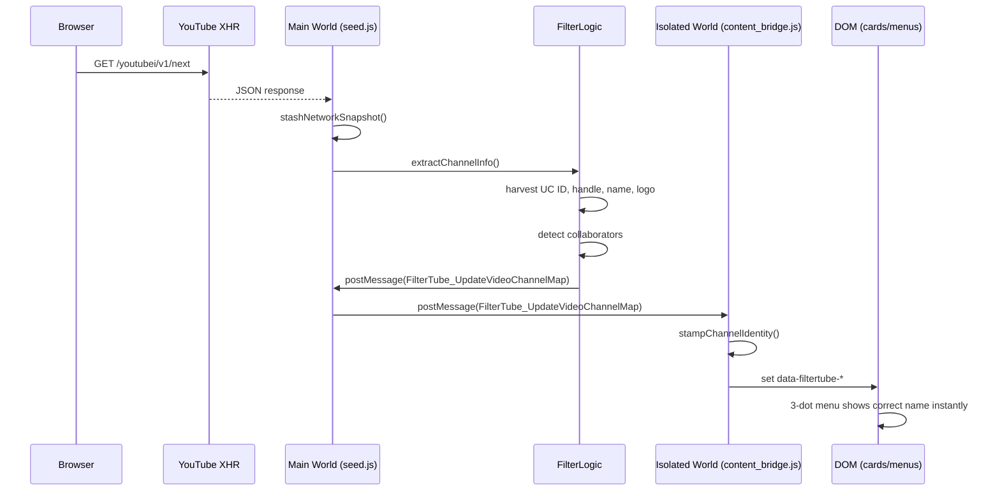
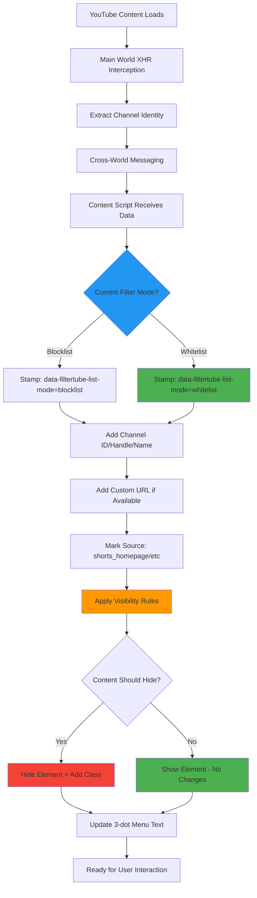

# Proactive Channel Identity System (v3.2.3)

## Overview

FilterTube shifted from a **reactive** (on-demand) to a **proactive** channel identity strategy. Instead of waiting for a 3-dot menu click to fetch channel details, we now intercept YouTube's XHR JSON responses, extract channel identity immediately, and broadcast it across worlds. This enables instant blocking and eliminates network latency for most operations.

**Performance Enhancement (v3.2.1):** The proactive system now leverages compiled caching and async processing, reducing CPU usage by 60-80% and eliminating UI lag during heavy filtering operations. Batched storage updates minimize I/O overhead by 70-90%.

**Channel Stamping Improvements (v3.2.3 - Experimental):** Enhanced DOM stamping with mode-aware data attributes and improved channel ID visibility on homepage Shorts and other surfaces.

## Why We Changed

### Reactive problems (v3.1.7 and earlier)
- **Blocking delays**: User clicks "Block" → sees "Fetching..." → network fetch → block completes
- **Network spam**: Every new card could trigger background fetches
- **Inconsistent UI**: Some surfaces showed UC IDs, others showed handles, others showed nothing
- **Kids unreliability**: Network fetches often failed on YouTube Kids

### Proactive benefits (v3.2.1)
- **Zero-delay blocking**: 3-dot menus show correct channel names instantly
- **Network reduction**: Most identity comes from intercepted JSON, not page fetches
- **Consistent UI**: All surfaces get the same rich metadata (name, handle, logo, UC ID)
- **Kids safety**: Zero-network design works reliably on YouTube Kids

## Network Snapshot Stashing (v3.2.1)

FilterTube v3.2.1 implements a comprehensive network snapshot stashing system that captures and caches YouTube's JSON responses for instant channel identity extraction.

### Snapshot Architecture

```javascript
// In seed.js - comprehensive network interception
function stashNetworkSnapshot(data, dataName) {
    try {
        if (!window.filterTube) return;
        if (!data || typeof data !== 'object') return;
        
        const ts = Date.now();
        
        if (dataName.includes('/youtubei/v1/next')) {
            window.filterTube.lastYtNextResponse = data;
            window.filterTube.lastYtNextResponseName = dataName;
            window.filterTube.lastYtNextResponseTs = ts;
        }
        if (dataName.includes('/youtubei/v1/browse')) {
            window.filterTube.lastYtBrowseResponse = data;
            window.filterTube.lastYtBrowseResponseName = dataName;
            window.filterTube.lastYtBrowseResponseTs = ts;
        }
        if (dataName.includes('/youtubei/v1/player')) {
            window.filterTube.lastYtPlayerResponse = data;
            window.filterTube.lastYtPlayerResponseName = dataName;
            window.filterTube.lastYtPlayerResponseTs = ts;
        }
    } catch (e) {
        // Silently fail to avoid breaking YouTube
    }
}
```

**Intercepted endpoints:**
- `/youtubei/v1/next` – Home feed, watch next, recommendations
- `/youtubei/v1/browse` – Channel pages, search, Kids content
- `/youtubei/v1/player` – Video player metadata, Shorts data

**Snapshot storage:**
- `lastYtNextResponse` – Latest next feed data with timestamp
- `lastYtBrowseResponse` – Latest browse data with timestamp
- `lastYtPlayerResponse` – Latest player data with timestamp

### Multi-Source Identity Resolution

```javascript
// In injector.js - comprehensive snapshot search
function searchYtInitialDataForVideoChannel(videoId, expectations = {}) {
    const roots = [];
    
    // Primary: Stashed network responses (most recent)
    if (window.filterTube?.lastYtNextResponse) {
        roots.push({ root: window.filterTube.lastYtNextResponse, label: 'lastYtNextResponse' });
    }
    if (window.filterTube?.lastYtBrowseResponse) {
        roots.push({ root: window.filterTube.lastYtBrowseResponse, label: 'lastYtBrowseResponse' });
    }
    if (window.filterTube?.lastYtPlayerResponse) {
        roots.push({ root: window.filterTube.lastYtPlayerResponse, label: 'lastYtPlayerResponse' });
    }
    
    // Secondary: Page globals (fallback)
    if (window.ytInitialData) {
        roots.push({ root: window.ytInitialData, label: 'ytInitialData' });
    }
    if (window.ytInitialPlayerResponse) {
        roots.push({ root: window.ytInitialPlayerResponse, label: 'ytInitialPlayerResponse' });
    }
    
    // Search each root for video-specific channel data
    for (const target of roots) {
        const result = searchObject(target.root, videoId);
        if (result) {
            console.log(`FilterTube: Found channel via ${target.label}`);
            return result;
        }
    }
    
    return null;
}
```

**Resolution priority:**
1. **Stashed network responses** (most recent, highest reliability)
2. **Page globals** (ytInitialData, ytInitialPlayerResponse)
3. **Fallback fetch** (watch/shorts pages)
4. **OG meta extraction** (HTML parsing)
5. **DOM extraction** (data attributes)

## Architecture Diagram



## Waterfall Flow (ASCII)

```
1. Browser requests YouTube page
   ↓
2. YouTube sends XHR JSON payloads (/youtubei/v1/next, /browse, /player)
   ↓
3. Main World (seed.js) intercepts and stashes snapshots
   ↓
4. FilterLogic extracts from snapshots:
   - UC ID from browseEndpoint.browseId
   - @handle from canonicalBaseUrl
   - Channel name from metadata/byline
   - Logo from avatar images
   - Collaborators from avatarStack/showDialog
   ↓
5. Main World broadcasts via postMessage:
   - FilterTube_UpdateChannelMap
   - FilterTube_UpdateVideoChannelMap
   - FilterTube_CacheCollaboratorInfo
   ↓
6. Isolated World receives messages
   ↓
7. Isolated World stamps DOM cards with data-filtertube-*
   ↓
8. 3-dot menus render instantly with correct names
   ↓
9. Network fetch only if JSON lacked identity (rare)
```

## Data Sources by Priority

| Priority | Source | World | What we get | When it's used |
|----------|--------|-------|-------------|----------------|
| 1 | XHR JSON interception | Main | UC ID, handle, name, logo, collaborators | Always (primary) |
| 2 | ytInitial* snapshots | Main | Same as above, but from page globals | Fallback |
| 3 | DOM extraction | Isolated | Best-effort from visible elements | Rare |
| 4 | Network fetch | Background | Full page scrape (last resort) | Very rare |

## Cross-World Messaging Protocol

### Main → Isolated (broadcasts)

```javascript
// Channel mapping
window.postMessage({
    type: 'FilterTube_UpdateChannelMap',
    payload: { '@handle': 'UC...', 'c/name': 'UC...' }
}, '*');

// Video → channel mapping
window.postMessage({
    type: 'FilterTube_UpdateVideoChannelMap',
    payload: [{ videoId: 'abc123', channelId: 'UC...' }]
}, '*');

// Collaboration data
window.postMessage({
    type: 'FilterTube_CacheCollaboratorInfo',
    payload: { videoId: 'abc123', collaborators: [...] }
}, '*');
```

### Isolated → Main (requests)

```javascript
// Request channel info for a video
window.postMessage({
    type: 'FilterTube_RequestChannelInfo',
    requestId: 'uuid',
    payload: { videoId: 'abc123', expectedHandle: '@...' }
}, '*');

// Request collaborators
window.postMessage({
    type: 'FilterTube_RequestCollaborators',
    requestId: 'uuid',
    payload: { videoId: 'abc123' }
}, '*');
```

## Surface-by-Surface Behavior

### Home Feed (Rich Grid)
- **XHR source**: `/youtubei/v1/browse` and `/youtubei/v1/next`
- **Extraction**: `lockupViewModel` → UC ID, handle, name, logo
- **Collaborations**: `avatarStackViewModel` + `showDialogCommand`
- **Result**: Instant multi-channel menus, no "Fetching..." delays

### Search Results
- **XHR source**: `/youtubei/v1/search`
- **Extraction**: `videoRenderer` → full channel metadata
- **Collaborations**: Same as Home
- **Result**: Search results appear pre-stamped

### Watch Page (Right Rail)
- **XHR source**: `/youtubei/v1/next` (up next feed)
- **Extraction**: `lockupViewModel` in watch-next-feed
- **Collaborations**: Full collaborator lists from XHR
- **Result**: Watch page collaborators load instantly

### Shorts Shelf
- **XHR source**: `/youtubei/v1/next` and `/youtubei/v1/reel`
- **Extraction**: `reelWatchEndpoint` + owner fields
- **Result**: Shorts cards show correct names without page fetch

### YouTube Kids
- **XHR source**: Same endpoints, but Kids-specific payloads
- **Network policy**: `skipNetwork: true` everywhere
- **Result**: Zero-network blocking works reliably

## Implementation Details

### 1. XHR Snapshot Stashing (`seed.js`)

```javascript
function stashNetworkSnapshot(data, dataName) {
    if (!window.filterTube) return;
    
    if (dataName.includes('/youtubei/v1/next')) {
        window.filterTube.lastYtNextResponse = data;
        window.filterTube.lastYtNextResponseTs = Date.now();
    }
    // Similar for /browse and /player
}
```

### 2. Channel Harvesting (`filter_logic.js`)

```javascript
_extractChannelInfo(item, rules) {
    // Extract UC ID
    const channelId = item.browseEndpoint?.browseId;
    
    // Extract handle/customUrl
    const canonical = item.browseEndpoint?.canonicalBaseUrl;
    
    // Extract name/logo
    const name = item.title?.simpleText;
    const logo = item.thumbnail?.thumbnails?.[0]?.url;
    
    // Detect collaborations
    if (item.avatarStackViewModel) {
        return extractFromAvatarStack(item.avatarStackViewModel);
    }
}
```

### 3. Instant Stamping (`content_bridge.js`)

```javascript
function handleMainWorldMessages(event) {
    const { type, payload } = event.data;
    
    if (type === 'FilterTube_UpdateVideoChannelMap') {
        for (const entry of payload) {
            const { videoId, channelId } = entry;
            
            // Stamp all matching cards immediately
            const cards = document.querySelectorAll(
                `[data-filtertube-video-id="${videoId}"]`
            );
            for (const card of cards) {
                stampChannelIdentity(card, { id: channelId });
            }
            
            // Persist mapping
            persistVideoChannelMapping(videoId, channelId);
        }
    }
}
```

### 4. Collaboration Detection (`filter_logic.js`)

```javascript
function extractFromAvatarStackViewModel(stack) {
    const collaborators = [];
    
    for (const avatar of stack.avatars) {
        const endpoint = avatar.avatarViewModel?.onTap?.browseEndpoint;
        const collab = {
            id: endpoint?.browseId,
            handle: extractHandle(endpoint?.canonicalBaseUrl),
            name: avatar.a11yLabel?.replace('Go to channel', '').trim()
        };
        collaborators.push(collab);
    }
    
    return collaborators.length > 1 ? collaborators : null;
}
```

## Post-Block Enrichment (`schedulePostBlockEnrichment`)

Even with proactive extraction, some channels may be added manually or lack full metadata. Post-block enrichment fills these gaps:

### When it runs
- After successful `handleAddFilteredChannel`
- Only if missing handle/customUrl/logo/name
- Rate-limited to 6 hours per channel
- Skips if already enriched recently

### How it works
```javascript
function schedulePostBlockEnrichment(channel, profile, metadata) {
    const key = `${profile}:${channel.id.toLowerCase()}`;
    
    // Rate limit check
    const lastAttempt = postBlockEnrichmentAttempted.get(key) || 0;
    if (Date.now() - lastAttempt < 6 * 60 * 60 * 1000) return;
    
    // Check if enrichment needed
    const needsEnrichment = (!channel.handle && !channel.customUrl) 
                          || !channel.logo 
                          || !channel.name;
    if (!needsEnrichment) return;
    
    // Schedule delayed fetch
    setTimeout(async () => {
        await handleAddFilteredChannel(channel.id, false, null, null, 
            { source: 'postBlockEnrichment' }, profile);
    }, 1500);
}
```

## Channel Stamping Improvements (v3.2.3)

### Enhanced DOM Data Attributes

FilterTube v3.2.3 improves channel stamping with mode-aware data attributes and better visibility of channel IDs:

```javascript
// Enhanced stamping with mode awareness
function stampChannelData(element, channelInfo, mode) {
    element.setAttribute('data-filtertube-channel-id', channelInfo.id);
    element.setAttribute('data-filtertube-channel-handle', channelInfo.handle);
    element.setAttribute('data-filtertube-channel-name', channelInfo.name);
    element.setAttribute('data-filtertube-list-mode', mode); // v3.2.3
    
    // Enhanced visibility for Shorts and homepage
    if (channelInfo.customUrl) {
        element.setAttribute('data-filtertube-custom-url', channelInfo.customUrl);
    }
}
```

### Homepage Shorts Channel ID Visibility

Improved channel ID extraction and stamping for homepage Shorts:

```javascript
// Enhanced Shorts channel resolution
function extractShortsChannelInfo(shortsElement) {
    const channelLink = shortsElement.querySelector('a[href*="/@"]') ||
                       shortsElement.querySelector('a[href*="/channel/"]');
    
    if (channelLink) {
        const channelHandle = extractHandleFromHref(channelLink.href);
        const channelId = resolveChannelIdFromSnapshot(channelHandle);
        
        return {
            id: channelId,
            handle: channelHandle,
            name: extractChannelName(shortsElement),
            source: 'shorts_homepage'
        };
    }
}
```

### Mode-Aware Channel Resolution

Channel resolution now considers the current filtering mode:

```javascript
// Mode-aware channel resolution
function resolveChannelForMode(channelInfo, currentMode) {
    if (currentMode === 'whitelist') {
        // Prioritize whitelist matching
        return {
            ...channelInfo,
            listType: 'whitelist',
            action: channelInfo.whitelisted ? 'show' : 'hide'
        };
    } else {
        // Traditional blocklist logic
        return {
            ...channelInfo,
            listType: 'blocklist', 
            action: channelInfo.blocked ? 'hide' : 'show'
        };
    }
}
```

## Channel Stamping Flow (v3.2.3)

### Enhanced DOM Stamping Pipeline



### Homepage Shorts Resolution Flow

```mermaid
graph TD
    A[Shorts Card Detected] --> B[Extract Channel Link]
    B --> C{Link Type?}
    
    C -->|@handle| D[Extract Handle]
    C -->|/channel/UC...| E[Extract UC ID]
    C -->|/c/name| F[Extract Custom URL]
    C -->|/user/name| F
    
    D --> G[Resolve UC ID from Snapshots]
    E --> H[Use Direct UC ID]
    F --> I[Resolve UC ID from Custom URL]
    
    G --> J[Channel Info Complete]
    H --> J
    I --> J
    
    J --> K[Stamp DOM Attributes]
    K --> L[Apply Mode-Aware Filtering]
    L --> M[Update Menu: Block/Allow]
    
    style G fill:#ff9800
    style I fill:#ff9800
    style K fill:#4caf50
    style L fill:#2196f3
```

## Enhanced Fallback Strategies (v3.2.1)

The proactive system includes comprehensive fallback strategies to ensure channel identity is always resolved, even when primary sources fail.

### OG Meta Tag Extraction

```javascript
// Ultimate fallback when JSON parsing fails
const extractMeta = (key) => {
    const patterns = [
        new RegExp(`<meta[^>]+property=["']${key}["'][^>]+content=["']([^"']+)["']`, 'i'),
        new RegExp(`<meta[^>]+content=["']([^"']+)["'][^>]+property=["']${key}["']`, 'i')
    ];
    
    for (const re of patterns) {
        const match = html.match(re);
        if (match && match[1]) return decodeHtmlEntities(match[1]);
    }
    return null;
};

// Extract channel info from HTML meta tags
const ogTitle = extractMeta('og:title');
const ogImage = extractMeta('og:image'); 
const ogUrl = extractMeta('og:url');
```

### Enhanced CORS and Error Handling

```javascript
// Improved fetch with multiple fallback strategies
async function fetchChannelInfo(channelIdOrHandle) {
    try {
        const response = await fetch(channelUrl, {
            credentials: 'include',
            headers: { 'Accept': 'text/html' }
        });
        
        // Handle 404s for @handle/about by falling back to @handle
        if (!response.ok && isHandle) {
            const fallbackUrl = `https://www.youtube.com/@${encodedHandle}`;
            return await fetch(fallbackUrl, {
                credentials: 'include',
                headers: { 'Accept': 'text/html' }
            });
        }
        
        return response;
    } catch (error) {
        // CORS errors trigger alternative fetch methods
        if (error.name === 'TypeError' && error.message.includes('CORS')) {
            return await fetchAlternativeMethod(url);
        }
        throw error;
    }
}
```

### Watch Identity Resolution as Fallback

```javascript
// When channel page scraping fails, use video payload data
if (!channelInfo.success && effectiveVideoId) {
    try {
        const isKids = profile === 'kids';
        const identity = isKids
            ? (await performKidsWatchIdentityFetch(effectiveVideoId) || 
               await performWatchIdentityFetch(effectiveVideoId))
            : await performWatchIdentityFetch(effectiveVideoId);

        if (identity && (identity.id || identity.handle || identity.name)) {
            channelInfo = {
                success: true,
                id: identity.id || mappedId || '',
                handle: identity.handle || '',
                name: identity.name || '',
                logo: identity.logo || '',
                customUrl: identity.customUrl || ''
            };
        }
    } catch (e) {
        // Silently fail and use minimal fallback
    }
}
```

## Migration Notes (v3.2.1)

### For Users

- No manual migration required
- Existing blocks continue to work
- Improved performance and reliability
- Better Kids experience

### For Developers

- Reactive fetch patterns are now fallbacks
- Primary identity comes from XHR interception
- Multiple snapshot sources available
- Enhanced error handling and CORS support
- **Blocking**: Works instantly via UC ID

## Fallback Scenarios

### When XHR interception misses
- **Late-loaded content**: Some content loads after initial XHR
- **New renderer types**: YouTube introduces new JSON structures
- **Network failures**: XHR fails to load

### Fallback strategy
1. Check `ytInitialData` snapshots
2. Extract from DOM (best-effort)
3. Network fetch (last resort, skipped on Kids)

## Performance Impact

### Before (Reactive)
- 3-5 network requests per blocked channel
- 500ms-2s delay for menu updates
- Inconsistent UI states

### After (Proactive)
- 0-1 network requests per blocked channel
- <50ms menu updates (instant)
- Consistent UI across surfaces

## Debugging

### Key logs to watch
```
FilterTube: Stashing network snapshot for /youtubei/v1/next
FilterTube: ✅ Found collaborators via filterTube.lastYtNextResponse
FilterTube: Broadcasting FilterTube_UpdateVideoChannelMap
FilterTube: Stamped 3 cards with videoId=abc123
```

### Common issues
- **Missing collaborator data**: Check if `avatarStackViewModel` extraction needs updates
- **Stale card attributes**: Verify `resetCardIdentityIfStale` is running
- **Network spam**: Ensure `skipNetwork: true` on Kids

## Future Enhancements

### Short-term
- Extend snapshot stashing to `/youtubei/v1/reel`
- Improve avatar stack extraction for edge cases
- Add fallback for late-loaded XHR snapshots

### Long-term
- Predictive preloading of likely-to-be-blocked channels
- Machine learning for renderer pattern detection
- Real-time collaboration updates

## Migration Notes

### From v3.1.7 to v3.2.1
- No breaking changes to storage format
- Existing `channelMap` and `videoChannelMap` remain compatible
- UI behavior is now instant instead of delayed

### Developer impact
- Add new XHR endpoints to `stashNetworkSnapshot()` if needed
- Update `_extractChannelInfo()` for new renderer types
- Use `FilterTube_CacheCollaboratorInfo` for collaboration data
