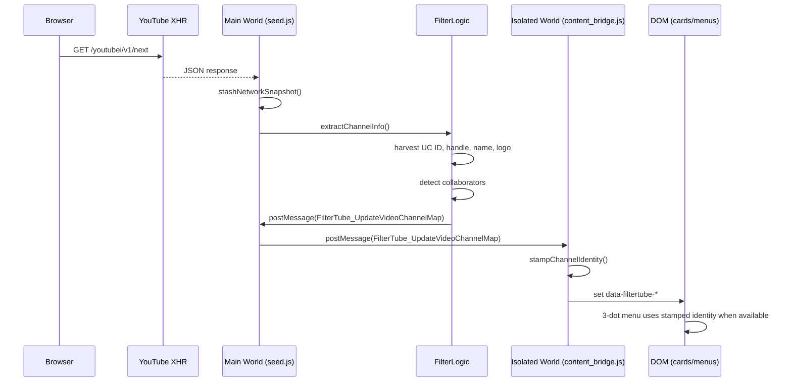
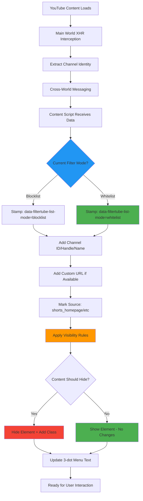

# Proactive Channel Identity System (v3.2.5)

## Overview

FilterTube shifted from a **reactive** (on-demand) to a **proactive** channel identity strategy. Instead of waiting for every 3-dot menu click to fetch channel details, we intercept YouTube's XHR JSON responses, extract channel identity when the payload exposes it, and broadcast it across worlds. This enables fast blocking on many cards and reduces network latency for most operations, while still preserving fallback resolvers for video-id-only or weak-identity surfaces.

**Historical performance note (v3.2.1):** Compiled caching, async processing, and batched storage updates were added to reduce CPU and I/O pressure. Earlier release notes used "60-80%" CPU, "70-90%" I/O, and "eliminating UI lag" language; those are historical estimates, not current proof. Any concrete performance claim now requires a `performanceClaimAuthority` measurement with route, browser/device, rule-state, sample-size, and artifact evidence.

**Channel Stamping Improvements (v3.2.5):** Enhanced DOM stamping with mode-aware data attributes and improved channel ID visibility on homepage Shorts and other surfaces.

## Why We Changed

### Reactive problems (v3.1.7 and earlier)
- **Blocking delays**: User clicks "Block" → sees "Fetching..." → network fetch → block completes
- **Network spam**: Every new card could trigger background fetches
- **Inconsistent UI**: Some surfaces showed UC IDs, others showed handles, others showed nothing
- **Kids unreliability**: Network fetches often failed on YouTube Kids

### Proactive benefits (v3.2.1)
- **Fast blocking on proven identity**: 3-dot menus can show correct channel names instantly when JSON/maps/DOM already provide enough identity
- **Network reduction**: Most identity comes from intercepted JSON, not page fetches
- **More consistent UI**: Surfaces can share harvested metadata (name, handle, logo, UC ID) through learned maps, but not every surface exposes all fields immediately
- **Kids safety goal**: JSON and learned-map identity should avoid network work on YouTube Kids whenever possible. Current behavior still includes a background Kids watch fallback after stored/session/pending identity checks when a Kids watch surface only exposes a video id.

## Network Snapshot Stashing (v3.2.1)

FilterTube v3.2.1 implements a comprehensive network snapshot stashing system that captures and caches YouTube's JSON responses for early channel identity extraction when the response contains the required fields.

### Snapshot Architecture

```javascript
// In seed.js - comprehensive network interception
function stashNetworkSnapshot(data, dataName) {
    try {
        if (!window.filterTube) return;
        if (!data || typeof data !== 'object') return;
        
        const ts = Date.now();
        
        if (dataName.includes('/youtubei/v1/next')) {
            window.filterTube.lastYtNextResponse = data;
            window.filterTube.lastYtNextResponseName = dataName;
            window.filterTube.lastYtNextResponseTs = ts;
        }
        if (dataName.includes('/youtubei/v1/browse')) {
            window.filterTube.lastYtBrowseResponse = data;
            window.filterTube.lastYtBrowseResponseName = dataName;
            window.filterTube.lastYtBrowseResponseTs = ts;
        }
        if (dataName.includes('/youtubei/v1/player')) {
            window.filterTube.lastYtPlayerResponse = data;
            window.filterTube.lastYtPlayerResponseName = dataName;
            window.filterTube.lastYtPlayerResponseTs = ts;
        }
    } catch (e) {
        // Silently fail to avoid breaking YouTube
    }
}
```

**Intercepted endpoints:**
- `/youtubei/v1/next` – Home feed, watch next, recommendations
- `/youtubei/v1/browse` – Channel pages, search, Kids content
- `/youtubei/v1/player` – Video player metadata, Shorts data

**Snapshot storage:**
- `lastYtNextResponse` – Latest next feed data with timestamp
- `lastYtBrowseResponse` – Latest browse data with timestamp
- `lastYtPlayerResponse` – Latest player data with timestamp

### Multi-Source Identity Resolution

```javascript
// In injector.js - comprehensive snapshot search
function searchYtInitialDataForVideoChannel(videoId, expectations = {}) {
    const roots = [];
    
    // Primary: Stashed network responses (most recent)
    if (window.filterTube?.lastYtNextResponse) {
        roots.push({ root: window.filterTube.lastYtNextResponse, label: 'lastYtNextResponse' });
    }
    if (window.filterTube?.lastYtBrowseResponse) {
        roots.push({ root: window.filterTube.lastYtBrowseResponse, label: 'lastYtBrowseResponse' });
    }
    if (window.filterTube?.lastYtPlayerResponse) {
        roots.push({ root: window.filterTube.lastYtPlayerResponse, label: 'lastYtPlayerResponse' });
    }
    
    // Secondary: Page globals (fallback)
    if (window.ytInitialData) {
        roots.push({ root: window.ytInitialData, label: 'ytInitialData' });
    }
    if (window.ytInitialPlayerResponse) {
        roots.push({ root: window.ytInitialPlayerResponse, label: 'ytInitialPlayerResponse' });
    }
    
    // Search each root for video-specific channel data
    for (const target of roots) {
        const result = searchObject(target.root, videoId);
        if (result) {
            console.log(`FilterTube: Found channel via ${target.label}`);
            return result;
        }
    }
    
    return null;
}
```

**Resolution priority:**
1. **Stashed network responses** (most recent, highest reliability)
2. **Page globals** (ytInitialData, ytInitialPlayerResponse)
3. **Learned maps** (`channelMap`, `videoChannelMap`, `videoMetaMap`)
4. **DOM extraction** (data attributes and visible-card context)
5. **Fallback fetch** (watch/shorts/Kids/channel pages after cache/map checks)
6. **OG/meta extraction** (HTML parsing inside fetched fallback documents)

## Architecture Diagram


```mermaid
sequenceDiagram
    participant Browser
    participant XHR as YouTube XHR
    participant Main as Main World (seed.js)
    participant Filter as FilterLogic
    participant Isolated as Isolated World (content_bridge.js)
    participant DOM as DOM (cards/menus)

    Browser->>XHR: GET /youtubei/v1/next
    XHR-->>Main: JSON response
    Main->>Main: stashNetworkSnapshot()
    Main->>Filter: extractChannelInfo()
    Filter->>Filter: harvest UC ID, handle, name, logo
    Filter->>Filter: detect collaborators
    Filter->>Main: postMessage(FilterTube_UpdateVideoChannelMap)
    Main->>Isolated: postMessage(FilterTube_UpdateVideoChannelMap)
    Isolated->>Isolated: stampChannelIdentity()
    Isolated->>DOM: set data-filtertube-*
    DOM->>DOM: 3-dot menu uses stamped identity when available
```

## Waterfall Flow (ASCII)

```
1. Browser requests YouTube page
   ↓
2. YouTube sends XHR JSON payloads (/youtubei/v1/next, /browse, /player)
   ↓
3. Main World (seed.js) intercepts and stashes snapshots
   ↓
4. FilterLogic extracts from snapshots:
   - UC ID from browseEndpoint.browseId
   - @handle from canonicalBaseUrl
   - Channel name from metadata/byline
   - Logo from avatar images
   - Collaborators from avatarStack/showDialog
   ↓
5. Main World broadcasts via postMessage:
   - FilterTube_UpdateChannelMap
   - FilterTube_UpdateVideoChannelMap
   - FilterTube_CacheCollaboratorInfo
   ↓
6. Isolated World receives messages
   ↓
7. Isolated World stamps DOM cards with data-filtertube-*
   ↓
8. 3-dot menus render from stamped identity when enough UC/handle/name data is
   already known
   ↓
9. Background resolver only if JSON/player/maps/DOM lacked enough identity for the active action
```

## Data Sources by Priority

| Priority | Source | World | What we get | When it's used |
|----------|--------|-------|-------------|----------------|
| 1 | XHR JSON interception | Main | UC ID, handle, name, logo, collaborators when present in the payload | Preferred first evidence tier for endpoint data, not proof that every visible card is complete before render |
| 2 | ytInitial* snapshots | Main | Same classes of identity when present in page globals | Secondary page-global evidence tier when endpoint snapshots are absent or incomplete |
| 3 | Learned maps | Background + content | `channelMap`, `videoChannelMap`, `videoMetaMap` persisted from previous JSON/player/DOM proof | First-class bridge between JSON and later DOM/menu actions |
| 4 | DOM extraction | Isolated | Best-effort from visible elements | Visible-card fallback/enrichment |
| 5 | Network fetch | Background | Watch/Shorts/Kids/channel page resolver after cache/map checks | Last resort; not globally budgeted yet |

## Cross-World Messaging Protocol

### Main → Isolated (broadcasts)

```javascript
// Channel mapping
window.postMessage({
    type: 'FilterTube_UpdateChannelMap',
    payload: { '@handle': 'UC...', 'c/name': 'UC...' }
}, '*');

// Video → channel mapping
window.postMessage({
    type: 'FilterTube_UpdateVideoChannelMap',
    payload: [{ videoId: 'abc123', channelId: 'UC...' }]
}, '*');

// Collaboration data
window.postMessage({
    type: 'FilterTube_CacheCollaboratorInfo',
    payload: { videoId: 'abc123', collaborators: [...] }
}, '*');
```

### Isolated → Main (requests)

```javascript
// Request channel info for a video
window.postMessage({
    type: 'FilterTube_RequestChannelInfo',
    requestId: 'uuid',
    payload: { videoId: 'abc123', expectedHandle: '@...' }
}, '*');

// Request collaborators
window.postMessage({
    type: 'FilterTube_RequestCollaborators',
    requestId: 'uuid',
    payload: { videoId: 'abc123' }
}, '*');
```

## Surface-by-Surface Behavior

### Home Feed (Rich Grid)
- **XHR source**: `/youtubei/v1/browse` and `/youtubei/v1/next`
- **Extraction**: `lockupViewModel` → UC ID, handle, name, logo
- **Collaborations**: `avatarStackViewModel` + `showDialogCommand`
- **Result**: Fast multi-channel menus when the roster is present in
  JSON/maps/DOM; otherwise the menu can still enter a resolver/failure path.

### Search Results
- **XHR source**: `/youtubei/v1/search`
- **Extraction**: `videoRenderer` → full channel metadata
- **Collaborations**: Same as Home
- **Result**: Search results can be stamped early when the search payload carries complete renderer identity; unresolved or delayed rows still use the normal waterfall.

### Watch Page (Right Rail)
- **XHR source**: `/youtubei/v1/next` (up next feed)
- **Extraction**: `lockupViewModel` in watch-next-feed
- **Collaborations**: Full collaborator lists from XHR
- **Result**: Watch page collaborators load quickly when the `/next` payload
  exposes the roster; hidden or delayed sheet/dialog rosters still require
  recovery.

### Shorts Shelf
- **XHR source**: `/youtubei/v1/next` and `/youtubei/v1/reel`
- **Extraction**: `reelWatchEndpoint` + owner fields
- **Result**: Shorts cards use learned video-id mappings when available; video-id-only Shorts can still need player/map/resolver proof before channel-accurate blocking.

### YouTube Kids
- **XHR source**: Same endpoint family, but Kids-specific payloads and renderer owner extensions
- **Network policy**: prefer Kids JSON/maps and page-context `skipNetwork` paths, with a guarded background Kids watch fallback after cache/map checks
- **Result**: Kids blocking should avoid network when current data proves identity, but zero-network behavior is not guaranteed by current source

## Implementation Details

### 1. XHR Snapshot Stashing (`seed.js`)

```javascript
function stashNetworkSnapshot(data, dataName) {
    if (!window.filterTube) return;
    
    if (dataName.includes('/youtubei/v1/next')) {
        window.filterTube.lastYtNextResponse = data;
        window.filterTube.lastYtNextResponseTs = Date.now();
    }
    // Similar for /browse and /player
}
```

### 2. Channel Harvesting (`filter_logic.js`)

```javascript
_extractChannelInfo(item, rules) {
    // Extract UC ID
    const channelId = item.browseEndpoint?.browseId;
    
    // Extract handle/customUrl
    const canonical = item.browseEndpoint?.canonicalBaseUrl;
    
    // Extract name/logo
    const name = item.title?.simpleText;
    const logo = item.thumbnail?.thumbnails?.[0]?.url;
    
    // Detect collaborations
    if (item.avatarStackViewModel) {
        return extractFromAvatarStack(item.avatarStackViewModel);
    }
}
```

### 3. Fast Stamping When Identity Is Proven (`content_bridge.js`)

```javascript
function handleMainWorldMessages(event) {
    const { type, payload } = event.data;
    
    if (type === 'FilterTube_UpdateVideoChannelMap') {
        for (const entry of payload) {
            const { videoId, channelId } = entry;
            
            // Stamp all matching cards after a trusted video -> channel map arrives
            const cards = document.querySelectorAll(
                `[data-filtertube-video-id="${videoId}"]`
            );
            for (const card of cards) {
                stampChannelIdentity(card, { id: channelId });
            }
            
            // Persist mapping
            persistVideoChannelMapping(videoId, channelId);
        }
    }
}
```

### 4. Collaboration Detection (`filter_logic.js`)

```javascript
function extractFromAvatarStackViewModel(stack) {
    const collaborators = [];
    
    for (const avatar of stack.avatars) {
        const endpoint = avatar.avatarViewModel?.onTap?.browseEndpoint;
        const collab = {
            id: endpoint?.browseId,
            handle: extractHandle(endpoint?.canonicalBaseUrl),
            name: avatar.a11yLabel?.replace('Go to channel', '').trim()
        };
        collaborators.push(collab);
    }
    
    return collaborators.length > 1 ? collaborators : null;
}
```

## Post-Block Enrichment (`schedulePostBlockEnrichment`)

Even with proactive extraction, some channels may be added manually or lack full metadata. Post-block enrichment fills these gaps:

### When it runs
- After successful `handleAddFilteredChannel`
- Only if missing handle/customUrl/logo/name
- Rate-limited to 6 hours per channel
- Skips if already enriched recently

### How it works
```javascript
function schedulePostBlockEnrichment(channel, profile, metadata) {
    const key = `${profile}:${channel.id.toLowerCase()}`;
    
    // Rate limit check
    const lastAttempt = postBlockEnrichmentAttempted.get(key) || 0;
    if (Date.now() - lastAttempt < 6 * 60 * 60 * 1000) return;
    
    // Check if enrichment needed
    const needsEnrichment = (!channel.handle && !channel.customUrl) 
                          || !channel.logo 
                          || !channel.name;
    if (!needsEnrichment) return;
    
    // Schedule delayed fetch
    setTimeout(async () => {
        await handleAddFilteredChannel(channel.id, false, null, null, 
            { source: 'postBlockEnrichment' }, profile);
    }, 1500);
}
```

## Channel Stamping Improvements (v3.2.3)

### Enhanced DOM Data Attributes

FilterTube v3.2.3 improves channel stamping with mode-aware data attributes and better visibility of channel IDs:

```javascript
// Enhanced stamping with mode awareness
function stampChannelData(element, channelInfo, mode) {
    element.setAttribute('data-filtertube-channel-id', channelInfo.id);
    element.setAttribute('data-filtertube-channel-handle', channelInfo.handle);
    element.setAttribute('data-filtertube-channel-name', channelInfo.name);
    element.setAttribute('data-filtertube-list-mode', mode); // v3.2.3
    
    // Enhanced visibility for Shorts and homepage
    if (channelInfo.customUrl) {
        element.setAttribute('data-filtertube-custom-url', channelInfo.customUrl);
    }
}
```

### Homepage Shorts Channel ID Visibility

Improved channel ID extraction and stamping for homepage Shorts:

```javascript
// Enhanced Shorts channel resolution
function extractShortsChannelInfo(shortsElement) {
    const channelLink = shortsElement.querySelector('a[href*="/@"]') ||
                       shortsElement.querySelector('a[href*="/channel/"]');
    
    if (channelLink) {
        const channelHandle = extractHandleFromHref(channelLink.href);
        const channelId = resolveChannelIdFromSnapshot(channelHandle);
        
        return {
            id: channelId,
            handle: channelHandle,
            name: extractChannelName(shortsElement),
            source: 'shorts_homepage'
        };
    }
}
```

### Mode-Aware Channel Resolution

Channel resolution now considers the current filtering mode:

```javascript
// Mode-aware channel resolution
function resolveChannelForMode(channelInfo, currentMode) {
    if (currentMode === 'whitelist') {
        // Prioritize whitelist matching
        return {
            ...channelInfo,
            listType: 'whitelist',
            action: channelInfo.whitelisted ? 'show' : 'hide'
        };
    } else {
        // Traditional blocklist logic
        return {
            ...channelInfo,
            listType: 'blocklist', 
            action: channelInfo.blocked ? 'hide' : 'show'
        };
    }
}
```

## Channel Stamping Flow (v3.2.3)

### Enhanced DOM Stamping Pipeline


```mermaid
graph TD
    A[YouTube Content Loads] --> B[Main World XHR Interception]
    B --> C[Extract Channel Identity]
    C --> D[Cross-World Messaging]
    D --> E[Content Script Receives Data]
    E --> F{Current Filter Mode?}
    
    F -->|Blocklist| G[Stamp: data-filtertube-list-mode=blocklist]
    F -->|Whitelist| H[Stamp: data-filtertube-list-mode=whitelist]
    
    G --> I[Add Channel ID/Handle/Name]
    H --> I
    I --> J[Add Custom URL if Available]
    J --> K[Mark Source: shorts_homepage/etc]
    K --> L[Apply Visibility Rules]
    
    L --> M{Content Should Hide?}
    M -->|Yes| N[Hide Element + Add Class]
    M -->|No| O[Show Element - No Changes]
    
    N --> P[Update 3-dot Menu Text]
    O --> P
    P --> Q[Ready for User Interaction]
    
    style F fill:#2196f3
    style H fill:#4caf50
    style L fill:#ff9800
    style N fill:#f44336
    style O fill:#4caf50
```

### Homepage Shorts Resolution Flow

```mermaid
graph TD
    A[Shorts Card Detected] --> B[Extract Channel Link]
    B --> C{Link Type?}
    
    C -->|@handle| D[Extract Handle]
    C -->|/channel/UC...| E[Extract UC ID]
    C -->|/c/name| F[Extract Custom URL]
    C -->|/user/name| F
    
    D --> G[Resolve UC ID from Snapshots]
    E --> H[Use Direct UC ID]
    F --> I[Resolve UC ID from Custom URL]
    
    G --> J[Channel Info Complete]
    H --> J
    I --> J
    
    J --> K[Stamp DOM Attributes]
    K --> L[Apply Mode-Aware Filtering]
    L --> M[Update Menu: Block/Allow]
    
    style G fill:#ff9800
    style I fill:#ff9800
    style K fill:#4caf50
    style L fill:#2196f3
```

## Enhanced Fallback Strategies (v3.2.1)

The proactive system includes fallback strategies to improve identity resolution when primary sources fail. These paths can still return null, `not_found`, or failure when YouTube does not expose enough reliable identity.

### OG Meta Tag Extraction

```javascript
// Ultimate fallback when JSON parsing fails
const extractMeta = (key) => {
    const patterns = [
        new RegExp(`<meta[^>]+property=["']${key}["'][^>]+content=["']([^"']+)["']`, 'i'),
        new RegExp(`<meta[^>]+content=["']([^"']+)["'][^>]+property=["']${key}["']`, 'i')
    ];
    
    for (const re of patterns) {
        const match = html.match(re);
        if (match && match[1]) return decodeHtmlEntities(match[1]);
    }
    return null;
};

// Extract channel info from HTML meta tags
const ogTitle = extractMeta('og:title');
const ogImage = extractMeta('og:image'); 
const ogUrl = extractMeta('og:url');
```

### Enhanced CORS and Error Handling

```javascript
// Improved fetch with multiple fallback strategies
async function fetchChannelInfo(channelIdOrHandle) {
    try {
        const response = await fetch(channelUrl, {
            credentials: 'include',
            headers: { 'Accept': 'text/html' }
        });
        
        // Handle 404s for @handle/about by falling back to @handle
        if (!response.ok && isHandle) {
            const fallbackUrl = `https://www.youtube.com/@${encodedHandle}`;
            return await fetch(fallbackUrl, {
                credentials: 'include',
                headers: { 'Accept': 'text/html' }
            });
        }
        
        return response;
    } catch (error) {
        // CORS errors trigger alternative fetch methods
        if (error.name === 'TypeError' && error.message.includes('CORS')) {
            return await fetchAlternativeMethod(url);
        }
        throw error;
    }
}
```

### Watch Identity Resolution as Fallback

```javascript
// When channel page scraping fails, use video payload data
if (!channelInfo.success && effectiveVideoId) {
    try {
        const isKids = profile === 'kids';
        const identity = isKids
            ? (await performKidsWatchIdentityFetch(effectiveVideoId) || 
               await performWatchIdentityFetch(effectiveVideoId))
            : await performWatchIdentityFetch(effectiveVideoId);

        if (identity && (identity.id || identity.handle || identity.name)) {
            channelInfo = {
                success: true,
                id: identity.id || mappedId || '',
                handle: identity.handle || '',
                name: identity.name || '',
                logo: identity.logo || '',
                customUrl: identity.customUrl || ''
            };
        }
    } catch (e) {
        // Silently fail and use minimal fallback
    }
}
```

## Migration Notes (v3.2.1)

### For Users

- No manual migration required
- Existing blocks continue to work
- Improved performance and reliability
- Better Kids experience

### For Developers

- Reactive fetch patterns are now fallbacks
- Primary identity comes from XHR interception
- Multiple snapshot sources available
- Enhanced error handling and CORS support
- **Blocking**: Works instantly when a stable UC ID or trusted alias/map is already known

## Fallback Scenarios

### When XHR interception misses
- **Late-loaded content**: Some content loads after initial XHR
- **New renderer types**: YouTube introduces new JSON structures
- **Network failures**: XHR fails to load

### Fallback strategy
1. Check `ytInitialData` snapshots
2. Extract from DOM (best-effort)
3. Network fetch (last resort; Kids watch still has a guarded background fallback after cache/map checks)

## Performance Impact

### Before (Reactive)
- 3-5 network requests per blocked channel
- 500ms-2s delay for menu updates
- Inconsistent UI states

### After (Proactive)
- Usually fewer network requests per blocked channel because JSON/maps are checked first
- Fast menu updates when identity was already harvested or stamped
- More consistent UI across surfaces, with route-specific fallback behavior where identity is incomplete

## Debugging

### Key logs to watch
```
FilterTube: Stashing network snapshot for /youtubei/v1/next
FilterTube: ✅ Found collaborators via filterTube.lastYtNextResponse
FilterTube: Broadcasting FilterTube_UpdateVideoChannelMap
FilterTube: Stamped 3 cards with videoId=abc123
```

### Common issues
- **Missing collaborator data**: Check if `avatarStackViewModel` extraction needs updates
- **Stale card attributes**: Verify `resetCardIdentityIfStale` is running
- **Network spam**: Confirm whether the path is page-context `skipNetwork`, background Kids watch fallback, handle repair, post-block enrichment, or another resolver before changing behavior

## Future Enhancements

### Short-term
- Extend snapshot stashing to `/youtubei/v1/reel`
- Improve avatar stack extraction for edge cases
- Add fallback for late-loaded XHR snapshots

### Long-term
- Predictive preloading of likely-to-be-blocked channels
- Machine learning for renderer pattern detection
- Real-time collaboration updates

## Migration Notes

### From v3.1.7 to v3.2.1
- No breaking changes to storage format
- Existing `channelMap` and `videoChannelMap` remain compatible
- UI behavior is faster on proven identity, but weak or video-id-only surfaces
  can still need resolver work before a stable channel rule is saved.

### Developer impact
- Add new XHR endpoints to `stashNetworkSnapshot()` if needed
- Update `_extractChannelInfo()` for new renderer types
- Use `FilterTube_CacheCollaboratorInfo` for collaboration data
