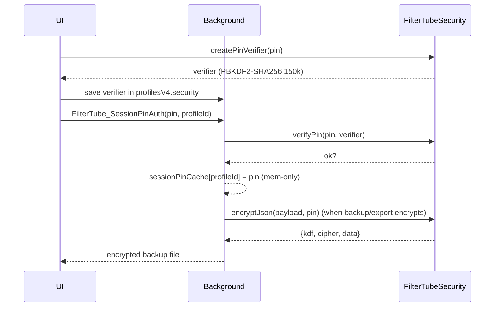

# Profiles & PIN Model (Spec)

## Goals

- Profiles are independent: each profile has its own settings, filters, and optional PIN.
- If a profile is PIN-protected, its UI must stay locked (no restricted views rendered) until the correct PIN is entered.
- If a profile has no PIN, it must be fully accessible.
- A hard refresh of the New Tab UI must re-lock any PIN-protected profile (no persisted unlock).
- Popup UI and New Tab UI may behave independently for unlock state unless we explicitly implement a secure shared session.

## Definitions

- **Profile**: An entry inside `ftProfilesV4.profiles[profileId]`.
- **Default (Master)**: The `profileId === "default"` profile.
- **Account profile**: `type: "account"` (or inferred account when no `type` and no `parentProfileId`).
- **Child profile**: `type: "child"` (or inferred child when `parentProfileId` is present).
- **Locked profile**: A profile is considered locked if it has a PIN verifier.
  - Master: `profiles.default.security.masterPinVerifier` 
  - Non-default: `profiles[profileId].security.profilePinVerifier` 
- **Unlocked session state (UI-local)**:
  - Stored in-memory in the UI context (`unlockedProfiles` Set).
  - Not persisted to `storage`.
  - Reset on hard refresh / tab close.
- **PIN crypto artifacts**:
  - Verifier: PBKDF2-SHA256 with 150k iterations + random salt → stored as `{kdf, hashAlg, iterations, salt, hash}`.
  - Encryption container: PBKDF2-SHA256 (150k) → AES-GCM (random IV) with `{kdf, cipher, data}` payload.

## ftProfilesV4 JSON model (current)

```json
{
  "schemaVersion": 4,
  "activeProfileId": "default",
  "profiles": {
    "default": {
      "type": "account",
      "parentProfileId": null,
      "name": "Default",
      "settings": {
        "enabled": true,
        "syncKidsToMain": false,
        "autoBackupEnabled": true,
        "autoBackupMode": "latest",
        "autoBackupFormat": "auto",
        "...": "other per-profile settings (hideShorts, hideComments, etc.)"
      },
      "main": {
        "channels": [],
        "keywords": []
      },
      "kids": {
        "mode": "blocklist",
        "strictMode": true,
        "blockedChannels": [],
        "blockedKeywords": []
      },
      "security": {
        "masterPinVerifier": { "kdf": "pbkdf2-sha256", "iterations": 150000, "salt": "...", "hash": "..." }
      }
    },
    "child1": {
      "type": "child",
      "parentProfileId": "default",
      "name": "Kiddo",
      "settings": { "...": "same shape as above" },
      "main": { "...": "profile-specific main settings" },
      "kids": { "...": "kids profile data" },
      "security": {
        "profilePinVerifier": { "kdf": "pbkdf2-sha256", "iterations": 150000, "salt": "...", "hash": "..." }
      }
    }
  }
}
```

Key points:

- Settings are **per-profile**; feature flags (e.g., hideShorts) live under the active profile’s `settings`.
- Auto-backup flags live per profile (`autoBackupEnabled`, `autoBackupMode`, `autoBackupFormat`).
- PIN verifiers live under `security` (`masterPinVerifier` for Default; `profilePinVerifier` for others).
- `activeProfileId` controls UI scoping and export scope.

## Current Implemented Rules

### 1) View access rules (New Tab UI)

- If **active profile is locked and not unlocked in this UI session**:
  - Allowed views:
    - `help`, `whatsnew`, `support`
  - Blocked views:
    - Everything else (Dashboard / Filters / Kids / Semantic / Settings / etc.)
  - Expected behavior:
    - Blocked views do not render.
    - Navigation to a blocked view is redirected to `help`.

- If **active profile is unlocked** (correct PIN entered in this UI session):
  - All views for that profile are accessible.

- If **active profile has no PIN**:
  - All views are accessible.

### 2) Profile switching rules (New Tab UI)

- Switching to a profile requires:
  - **Only the target profile’s PIN**, if the target profile is PIN-protected.
  - No Master PIN requirement for switching across profiles.

### 3) Profile type (Account vs Child)

- Type is treated as a **grouping/metadata** concept for UI (and possible future policy), not an access restriction by itself.
- If `profile.type` is missing:
  - If `parentProfileId` exists => inferred as `child`
  - Else => inferred as `account`

### 4) Mutations / edits while locked

- When the UI is locked:
  - Mutating actions (adding/removing channels/keywords, toggling settings) are blocked.
  - StateManager also no-ops mutating operations while locked (defense-in-depth).

### 5) Popup vs New Tab unlock

- Unlock state is currently **local-only** to each UI context.
  - Popup unlock does not unlock New Tab automatically.
  - New Tab unlock does not unlock popup automatically.
- **Background session PIN cache**:
  - UIs send `FilterTube_SessionPinAuth` with the PIN; background verifies against stored verifier and keeps a **memory-only** cache per profile.
  - UIs can clear it with `FilterTube_ClearSessionPin` (on lock/Logout).
  - Auto-backup encryption depends on this cache (see below); if missing, encrypted auto-backup is skipped.

### 6) Admin-only actions / downgrade safety

- Import/restore is **Master-only** (active profile must be `default`; Master PIN must be unlocked if set).
- Full export is **Master-only**; non-default exports are forced to “active profile only”.
- Account policy controls (allow account creation, max accounts) are **Master-only** and disabled elsewhere.
- When a profile is locked, StateManager and UI both block mutations (defense-in-depth).

## PIN cryptography & flows

- **Create/Update PIN**:
  - UI collects PIN → `FilterTubeSecurity.createPinVerifier(pin)` → PBKDF2-SHA256 (150k, random salt) → verifier stored in `profiles[*].security`.
- **Verify PIN**:
  - UI sends PIN to background via `FilterTube_SessionPinAuth`.
  - Background loads `ftProfilesV4`, picks the correct verifier (master vs profile), runs `FilterTubeSecurity.verifyPin`, and **only then** caches the PIN in `sessionPinCache` (memory only, per-profile).
- **Encrypt export/backup**:
  - If format is `encrypted` or `auto`+profile has PIN, background requires a cached session PIN.
  - Payload is wrapped as `{ meta: { encrypted: true, ... }, encrypted: { kdf: PBKDF2-SHA256 150k + salt, cipher: AES-GCM + iv, data: b64 } }`.
- **Decrypt import**:
  - UI (tab view) prompts for password/PIN, calls `FilterTubeSecurity.decryptJson(encrypted, password)`, then imports the decrypted payload through the normal import path.



## Admin / Master-only actions (Current)

Some actions are intentionally limited to the Default (Master) profile UI context.

- **Account policy controls** (e.g. allow account creation / max accounts):
  - Only editable while `activeProfileId === "default"`.
  - If Master has a PIN, Master must be unlocked first.

- **Creating independent accounts**:
  - Initiated from Default (subject to account policy).

Note: This does not affect a parallel account’s ability to access its own Filters/Kids/Settings when it has no PIN or after it is unlocked.

### Import / restore

- Import/restore UI is gated to **Default (Master) context**. If Default has a PIN, it must be unlocked first.
- Non-default profiles cannot import/restore (prevents overwrite by children).

## Data portability / backup rules (Current)

### Auto-backup

- Auto-backup reads settings from the **active profile’s `settings` object** when `ftProfilesV4` is present.
- Backup output behavior:
  - If active profile is `default`: export type is `full` and includes `profilesV4`.
  - If active profile is not `default`: export type is `profile` and includes only the active profile inside `profilesV4`.
- Destination:
  - `Downloads/FilterTube Backup/<ProfileName>/FilterTube-Backup-<timestamp>.json`
- Rotation:
  - Rotates per profile folder.
- Enablement:
  - `profilesV4.profiles[activeId].settings.autoBackupEnabled === true`
- Modes:
  - `latest`: overwrites `FilterTube-Backup-Latest.json|encrypted.json`
  - `history`: writes timestamped files and rotates within the profile folder
- Format:
  - `auto`: encrypt if profile has a PIN verifier
  - `plain`: always plaintext JSON
  - `encrypted`: always encrypted container
- Encryption gating:
  - Requires session PIN cached in background; if absent and encryption is needed, backup is **skipped** (safe default).

### Auto-backup safety flow

```mermaid
flowchart TD
    UI[UI (Popup/Tab)] -->|PIN| BGAuth[FilterTube_SessionPinAuth\n(verifies PIN, caches in memory)]
    BGAuth --> Cache[Session PIN cache (mem only)]
    Auto[Auto-backup scheduler] --> Build[buildAutoBackupPayload\n(scope = active profile)]
    Build --> DecideFmt{Format?}
    DecideFmt -->|plain| SavePlain[write JSON]
    DecideFmt -->|encrypted| NeedPIN{Session PIN?}
    NeedPIN -->|no| Skip[skip backup (safe default)]
    NeedPIN -->|yes| Encrypt[PBKDF2-SHA256 150k + AES-GCM]
    Encrypt --> SaveEnc[write encrypted JSON container]
    SavePlain --> Rotate[rotate per-profile folder (if history mode)]
    SaveEnc --> Rotate
```

### Auto-backup mode & format (New)

- **Per-profile enablement**: `profilesV4.profiles[activeId].settings.autoBackupEnabled`.
- **Mode** (`profilesV4.profiles[activeId].settings.autoBackupMode`):
  - `latest`: overwrites a single file per profile (`FilterTube-Backup-Latest.*`).
  - `history`: keeps timestamped backups (rotates per profile folder).
- **Format** (`profilesV4.profiles[activeId].settings.autoBackupFormat`):
  - `auto`: encrypt if the active profile has a PIN, otherwise plain JSON.
  - `plain`: always write plain JSON.
  - `encrypted`: always write encrypted backup containers.

### Encrypted auto-backups (New)

- If auto-backups are encrypted, the background uses an **in-memory, session-only PIN cache**.
- The cache is populated only when an extension UI page sends the PIN and the background **verifies it against the stored verifier**.
- If the profile is PIN-protected but no session PIN is available, auto-backup is skipped (best-effort).

## Profile creation & robustness rules

- **Creation surfaces**: Tab view “Profiles” card (`ftCreateAccountBtn` / `ftCreateChildBtn`); Default (Master) must allow account creation and stay within `maxAccounts`.
- **Types**:
  - `account` (or inferred when no `parentProfileId`).
  - `child` (explicit type or inferred when `parentProfileId` is set).
- **Parent linkage**: Children carry `parentProfileId`; policies can later use this to gate cross-account switches.
- **Lock gate**: Any profile with a PIN stays locked until correct PIN entered; locked state blocks restricted views and all mutations (StateManager defense-in-depth).
- **Import/export scope**: Default can export/import full; non-default exports/imports active-only; encrypted imports require the correct password/PIN.
- **Session security**: Unlock is UI-local; background only trusts a PIN once verified; cache is memory-only (cleared on profile lock/clear action).
- **Tamper resistance**:
  - PIN verification happens in background (UI cannot “claim” unlock).
  - No persisted unlock tokens; reload resets lock state.
  - Encrypted backups require the verified PIN at creation time; imports require the correct password/PIN to decrypt.

### Manual export

- Default can export full or active-only.
- Non-default profiles are forced to export active-only (current UI behavior).
- Manual import is allowed only when the active profile is Default (and unlocked if PIN-protected).

## Known open decisions / remaining work

### A) Shared unlock session (popup ↔ new tab)

- Option A (current): strict local-only unlock.
- Option B (future): shared unlock within the extension session, but **only if background verifies PIN** (do not trust “unlocked” claims from UIs).

### B) What “Child” should mean (policy)

Currently: child is mostly UI grouping.

Possible future policies (not implemented):

- Disable export / disable backup in child profiles.
- Always restrict certain tabs in child profiles unless a parent/admin action occurs.

### C) UI/UX alignment

- Align New Tab profile selector UX with popup dropdown.
- Grey/disable admin-only actions consistently based on lock state and active profile.

## Implementation checklist (Status)

- **[Done]** Strict lock gate in New Tab UI (no restricted views rendered while locked).
- **[Done]** Profile switching prompts only for the target profile PIN (no Master PIN required just to switch).
- **[Done]** Mutations blocked while locked (UI + StateManager defense-in-depth).
- **[Done]** Auto-backup per-profile enable/mode/format + encrypted auto-backup using background-verified session PIN cache.
- **[Done]** New Tab UI exposes auto-backup mode/format controls.
- **[Done]** Dashboard keyword/channel counts update on profile switch.
- **[In progress]** Standardize dropdown styling across all UIs (Sort/Date/Settings/selects).
- **[In progress]** Standardize profile selector styling/colors across Popup + New Tab (shared accent colors).
- **[Done]** Gate import/restore behind Default (Master) UI context (best-effort safety).

## Encrypted backup safety notes

- Encrypted backups intentionally keep a small **plaintext `meta`** section (version/app/exportType/profile label + `encrypted: true`).
- This metadata **does not enable decryption**.
- Decryption security comes from:
  - PBKDF2-SHA256 (150k iterations, per-backup random salt)
  - AES-GCM (random IV)
- The biggest real-world risk is **weak PINs/passwords** (e.g. 4-digit PINs) because backups can be brute-forced offline.

## Quick sanity test matrix

- **Profile has no PIN**:
  - Can open Dashboard/Filters/Kids/Semantic/Settings.
  - Can edit settings/lists.

- **Profile has PIN, not yet unlocked in this session**:
  - Cannot access Dashboard/Filters/Kids/Semantic/Settings.
  - Can access Help/What’s New/Support.
  - Hard refresh keeps it locked.

- **Profile has PIN, unlocked in this session**:
  - Can access all views.
  - Can edit settings/lists.

- **Switching profiles**:
  - Only prompts for the target profile’s PIN (if any).
  - Does not require Master PIN just to switch.
