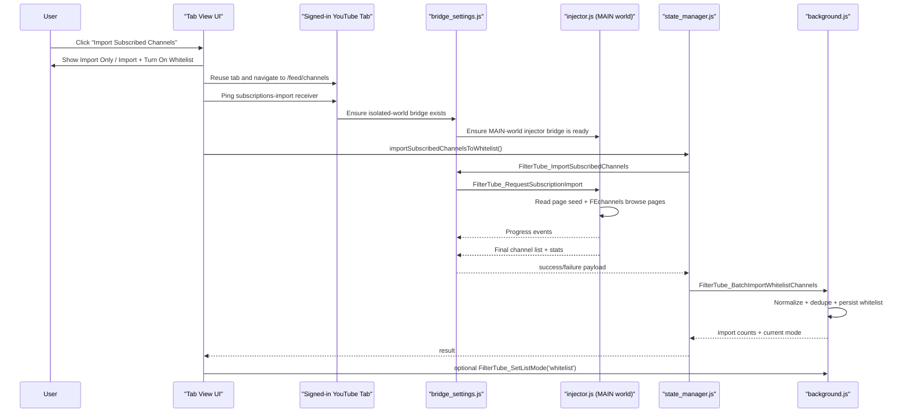

# Subscribed Channels Import (Whitelist)

## Overview

FilterTube can import the active YouTube account's subscribed channels into the current profile's `main.whitelistChannels`.

This is an on-demand whitelist acquisition flow, not part of the normal passive filtering pipeline.

Key properties:

- entry point is **Tab View** only
- source account is the signed-in account in the selected YouTube tab
- selected tab is moved to `/feed/channels`
- import runs through the existing cross-world bridge instead of popup-only state
- imported channels are normalized and merged into whitelist
- the user can either:
  - **Import Only**
  - **Import + Turn On Whitelist**

## Two Ways To Build The Whitelist

FilterTube currently has two distinct whitelist-construction paths:

### 1. Direct whitelist population

This writes entries straight into whitelist storage without requiring whitelist mode to be active first.

Examples:

- manual whitelist adds while already in whitelist mode
- subscribed-channels import with **Import Only**

In this path, the current blocklist stays as-is.

### 2. Mode-switch migration

This happens when the user turns whitelist mode on through the existing mode-switch pipeline.

In this path:

- current blocklist channels are merged into whitelist
- current blocklist keywords are merged into whitelist
- the blocklist is then cleared for that scope

Subscribed-channels import can optionally end by entering this second path when the user chooses **Import + Turn On Whitelist**.

## User Contract

### Import Only

- Appends the imported subscriptions into `whitelistChannels`
- Leaves current blocklist channels and keywords unchanged
- Does **not** switch list mode automatically

### Import + Turn On Whitelist

- First appends the imported subscriptions into `whitelistChannels`
- Then activates the existing `FilterTube_SetListMode('whitelist')` flow
- That current mode-switch path merges the profile's present blocklist channels and keywords into whitelist and clears the blocklist

This is why the confirmation modal explicitly warns that turning whitelist mode on is broader than a plain import.

## End-to-End Flow



## Startup Contract

```ascii
┌────────────────────────────────────────────────────────────────────┐
│ 1. Tab View chooses a main YouTube tab                            │
│ 2. If needed, that tab is sent to /feed/channels                  │
│ 3. Tab View waits for:                                            │
│    - page load complete                                           │
│    - FilterTube bridge available in the tab                       │
│ 4. If the receiver is missing, background injects the import      │
│    bridge into that tab                                           │
│ 5. Only then does the actual subscriptions request start          │
└────────────────────────────────────────────────────────────────────┘
```

This startup layer exists because the importer must run from a real signed-in YouTube page context. The page having subscription data is not enough by itself; FilterTube must also have its bridge alive inside that page.

## Runtime Messaging

### Tab View -> YouTube Tab

- `FilterTube_Ping` with `feature: 'subscriptions_import'`
- `FilterTube_ImportSubscribedChannels`

### Tab View -> Background

- `FilterTube_EnsureSubscriptionsImportBridge`
- `FilterTube_BatchImportWhitelistChannels`
- optional `FilterTube_SetListMode`

### Isolated World -> Main World

- `FilterTube_RequestSubscriptionImport`

### Main World -> Isolated World

- `FilterTube_SubscriptionsImportProgress`
- `FilterTube_SubscriptionsImportResponse`
- `FilterTube_InjectorBridgeReady`
- `FilterTube_InjectorToBridge_Ready`

## Data Sources

The current implementation uses a layered source strategy after the tab reaches `/feed/channels`.

### 1. Page seed

`injector.js` first attempts a page-local seed from:

- `window.ytInitialData`
- `window.__INITIAL_DATA__`
- `window.filterTube.lastYtInitialData`
- `window.filterTube.rawYtInitialData`
- `window.filterTube.lastYtBrowseResponse`
- `ytd-channel-renderer` / `ytm-channel-list-item-renderer` DOM data

This gives FilterTube a fast first batch without waiting for continuation requests.

### 2. Active `youtubei` browse requests

After the seed, `injector.js` continues through `POST /youtubei/v1/browse?prettyPrint=false` with `browseId: FEchannels`.

Request profiles are built from page `ytcfg` context:

- `web_fechannels`
- `mweb_fechannels`

Host preference today:

- `www.youtube.com` / `youtube.com` prefers `web_fechannels` first
- `m.youtube.com` prefers `mweb_fechannels` first

The importer can retry the alternate profile if the first one fails or looks logged out.

## Normalized Channel Shape

Imported channels are normalized into the same whitelist channel shape used elsewhere in FilterTube.

```ascii
id             -> canonical UC channel ID when available
handle         -> normalized @handle for matching
canonicalHandle-> display-safe handle copy
customUrl      -> legacy c/... or user/... slug when present
name           -> best available channel title
logo           -> best available avatar URL
source         -> subscriptions_import
filterAll      -> false
filterAllComments -> true
addedAt        -> renderer timestamp or import time
```

## Merge and Persistence

Persistence happens in `background.js`, not in the page.

Steps:

1. `StateManager.importSubscribedChannelsToWhitelist()` validates:
   - UI lock state
   - target tab id
   - target profile id
   - active profile did not change before/during import
2. `FilterTube_BatchImportWhitelistChannels` merges imported entries into the active profile's `main.whitelistChannels`
3. The background also updates:
   - legacy `ftProfilesV3.main.whitelistChannels`
   - legacy `ftProfilesV3.main.whitelistedChannels`
   - `channelMap` for learned `handle/customUrl <-> UC` mappings
4. All open YouTube tabs receive `FilterTube_RefreshNow`

Merge result counts:

- `imported`
- `updated`
- `duplicates`
- `skipped`

## UI States and Counts

The inline tab-view notice surfaces the import lifecycle:

- looking for YouTube
- waiting for page load
- waiting for FilterTube bridge
- importing
- empty
- success
- error

Displayed summary pieces can include:

- `new`
- `repaired`
- `already present`
- `skipped`
- `pages read`
- `import stopped early`

Important note:

- `pages read` is currently an importer statistic, not a strict "API continuation pages only" count
- if page seed contributes entries first, it can count as the first page in the displayed total

## Failure Modes

Common failure codes:

- `signed_out`
- `subscriptions_import_unavailable`
- `tab_import_failed`
- `profile_locked`
- `profile_changed`
- `timeout`
- `persist_failed`

Operational note:

- if YouTube tabs were already open when the extension was freshly installed or reloaded, a one-time page refresh may still be required before the bridge can run in those old tabs

## Why This Is Tab-View Only

The bulk import is intentionally a dashboard flow:

- it needs a signed-in YouTube page context
- it can open or retarget a real YouTube tab
- it can surface multi-step status and retry states
- it needs clearer whitelist-mode consequences than the popup can comfortably explain

The popup remains for fast rule edits, not for this import workflow.

## Mobile / WebView Outlook

The same contract can be reused in a future mobile webview-based app:

- start from a signed-in YouTube webview/session
- route that session to `/feed/channels`
- run the same `FEchannels` import strategy inside that authenticated context
- avoid sticky app-mode hacks such as `persist_app`

That keeps the future mobile importer aligned with the extension rather than creating a separate subscriptions ingestion path.
