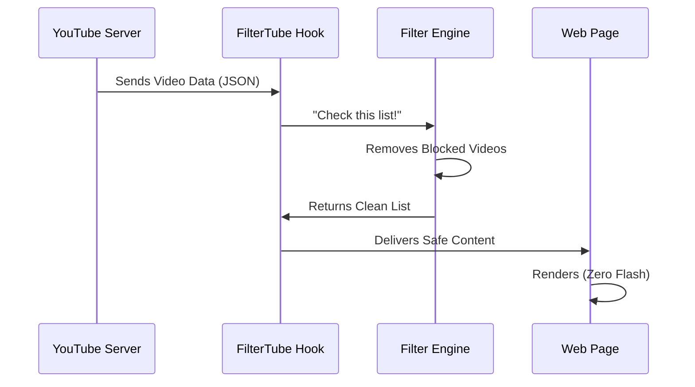

# FilterTube v3.0 Technical Documentation

This document provides a deep technical dive into the implementation of FilterTube's hybrid filtering engine.

## Core Technologies

*   **JavaScript (ES6+)**: Core logic.
*   **Manifest V3**: The extension standard used.
*   **Proxy & Object.defineProperty**: Used for hooking global browser APIs.
*   **MutationObserver**: Used for the DOM fallback layer.
*   **Custom Events / postMessage**: Used for cross-world communication.
*   **StateManager**: Centralized state management for consistent settings across UI and background.

## 1. Data Interception: `ytInitialData` Hook

**Motivation:**
YouTube loads content by injecting JSON data into the page. Traditional filtering waits for the DOM, causing a "flash of content". FilterTube intercepts this data *before* it renders.

**How it works (Simplified):**
YouTube tries to hand a list of videos to the webpage. FilterTube steps in the middle, takes the list, crosses out the videos you don't want, and then hands the cleaned list to the webpage. The webpage never knows those videos existed.

**Technical Flow:**



## 2. Data Interception: Fetch Hook

**Motivation:**
YouTube loads more content as you scroll (infinite scroll) using `fetch` requests. FilterTube must intercept these dynamic requests to ensure new content is also filtered.

**How it works (Simplified):**
When you scroll down, YouTube asks its server for "more videos". FilterTube listens for this request. When the server replies with the new videos, FilterTube quickly checks them, removes the bad ones, and then gives the rest to YouTube to show you.

**Technical Flow:**

```ascii

+-----------+      +-------------+      +-------------+
|  YouTube  | ---> | window.fetch| ---> |  Original   |
|  (Scroll) |      |   (Proxy)   |      |   Fetch     |
+-----------+      +-------------+      +-------------+
                                               |
                                               v
+-----------+      +-------------+      +-------------+
|  Receive  | <--- | New Response| <--- |   Clone &   |
| Filtered  |      | (Filtered)  |      |   Parse     |
+-----------+      +-------------+      +-------------+
                                               |
                                               v
                                        +-------------+
                                        | FilterTube  |
                                        |   Engine    |
                                        +-------------+
```

## 3. Filtering Engine: Recursive Blocking Decision

**Motivation:**
YouTube's data structure is complex and nested. Videos can appear inside "shelves", "grids", or "lists". The engine must find every video, extract its details (title, channel), and check if it matches your filters.

**How it works (Simplified):**
The engine acts like a meticulous inspector. It opens every box (data object) YouTube sends. If it finds a video inside, it reads the label (title/channel). If the label is on your "Block List", it throws the video in the trash. If it's a box of boxes (a playlist or shelf), it opens those too and checks everything inside.

**Technical Flow:**

```ascii

+-------------+
| processData |
+-------------+
       |
       v
+-------------+       +-------------+
|  Traverse   | ----> | Check Type  |
|  JSON Tree  |       | (Renderer?) |
+-------------+       +-------------+
       ^                     | Yes
       |                     v
       |              +-------------+
    (Recurse)         |   Extract   |
       |              |   Metadata  |
       |              +-------------+
       |                     |
       |                     v
+-------------+       +-------------+
| Keep Item   | <---- | Match Rules?|
+-------------+  No   +-------------+
                             | Yes
                             v
                      +-------------+
                      | Block Item  |
                      | (Set Null)  |
                      +-------------+

```


## 4. DOM Fallback System

**Motivation:**
Sometimes data interception misses something (e.g., complex updates). The DOM Fallback is a safety net that watches the screen itself and hides anything that slipped through.

**How it works (Simplified):**
This is the backup security guard patrolling the building. If a banned video somehow snuck past the front door check, this guard spots it on the wall (the screen) and immediately throws a "Do Not Display" sheet over it so you can't see it.

**Technical Flow:**

```ascii

+-------------+
|  Mutation   |
|  Observer   |
+-------------+
       |
       v
+-------------+       +-------------+
|  New Node   | ----> | Is Video?   |
|  Detected   |       | (Selector)  |
+-------------+       +-------------+
                             | Yes
                             v
                      +-------------+
                      |   Extract   |
                      |   Data      |
                      +-------------+
                             |
                             v
+-------------+       +-------------+
|  Do Nothing | <---- | Match Rules?|
+-------------+  No   +-------------+
                             | Yes
                             v
                      +-------------+
                      |  Apply CSS  |
                      |  (Hide)     |
                      +-------------+

```


## 5. Stats Calculation (Time Saved)

**Motivation:**
Users want to know how much time they've saved by not watching unwanted content.

**How it works:**
1.  **Detection**: When a video is blocked, FilterTube looks for its duration (e.g., "10:05").
2.  **Calculation**: It parses "10:05" into 605 seconds.
3.  **Accumulation**: It adds this to a running total stored locally.
4.  **Display**: The UI converts the total seconds back into "Minutes/Hours Saved".

**Technical Flow:**

```mermaid
graph TD
    A[Video Blocked] --> B{Has Duration?}
    B -- Yes --> C[Parse Duration]
    B -- No --> D[Use Average (5m)]
    C --> E[Add to Total Stats]
    D --> E
    E --> F[Save to Storage]
    F --> G[Update UI Badge]
```

## 6. Centralized State Management

**Motivation:**
With multiple UIs (Popup, Tab View) and background processes, keeping settings in sync is critical. `StateManager` acts as the single source of truth.

**How it works:**
*   **Single Source**: All components read/write settings via `StateManager`.
*   **Broadcasting**: When settings change in one place, `StateManager` notifies all other parts of the extension.
*   **Consistency**: Ensures that if you add a filter in the Tab View, the Popup updates instantly.

## 7. Channel Matching Algorithm

**Motivation:**
Channels can be identified by Name ("My Channel"), Handle ("@mychannel"), or ID ("UC..."). Users might use any of these. The algorithm must normalize and match correctly.

**How it works (Simplified):**
If you ban "@coolguy", the system needs to know that "Cool Guy Vlogs" is the same person. It looks at the video's "ID card" which lists their Name, Handle, and ID number. It checks if any of those match what you banned.

**Technical Flow:**

```ascii

+-------------+
| Channel In  |
| (Name/ID/@) |
+-------------+
       |
       v
+-------------+       +-------------+
|  Normalize  | ----> |  Compare    |
|  (Lowercase)|       |  (Rules)    |
+-------------+       +-------------+
                             |
                             v
                      +-------------+
                      | Match Type? |
                      +-------------+
                       /     |     \
                  (@Handle) (ID)  (Name)
                     /       |       \
             +-------+   +-------+   +-------+
             | Exact |   | Exact |   |Partial|
             +-------+   +-------+   +-------+


```
