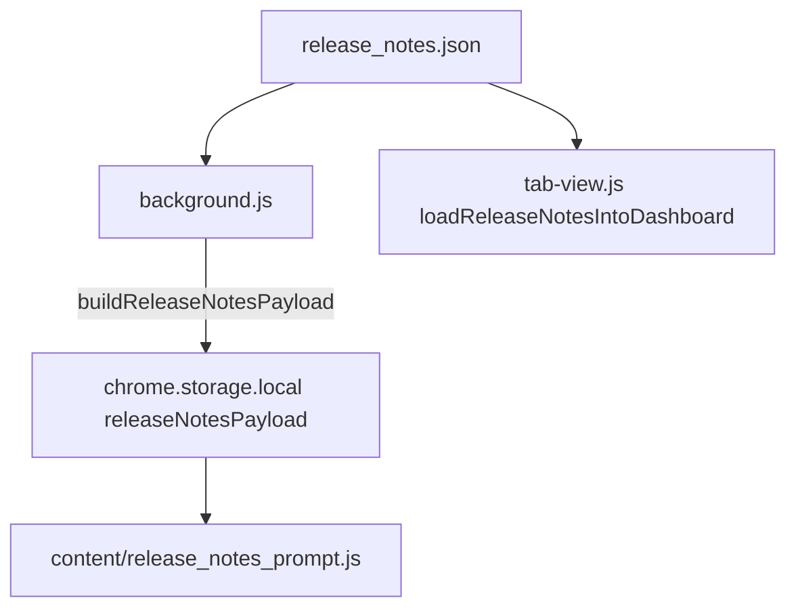

# FilterTube v3.1.6 Technical Documentation

This document provides a deep technical dive into the implementation of FilterTube's hybrid filtering engine as of v3.1.1.

## Core Technologies

*   **JavaScript (ES6+)**: Core logic.
*   **Manifest V3**: The extension standard used.
*   **Proxy & Object.defineProperty**: Used for hooking global browser APIs.
*   **MutationObserver**: Used for the DOM fallback layer.
*   **Custom Events / postMessage**: Used for cross-world communication.
*   **StateManager**: Centralized state management for consistent settings across UI and background.

## 1. Data Interception: `ytInitialData` Hook

**Motivation:**
YouTube loads content by injecting JSON data into the page. Traditional filtering waits for the DOM, causing a "flash of content". FilterTube intercepts this data *before* it renders.

**How it works (Simplified):**
YouTube tries to hand a list of videos to the webpage. FilterTube steps in the middle, takes the list, crosses out the videos you don't want, and then hands the cleaned list to the webpage. The webpage never knows those videos existed.

**Technical Flow:**


## 2. Data Interception: Fetch Hook

**Motivation:**
YouTube loads more content as you scroll (infinite scroll) using `fetch` requests. FilterTube must intercept these dynamic requests to ensure new content is also filtered.

**How it works (Simplified):**
When you scroll down, YouTube asks its server for "more videos". FilterTube listens for this request. When the server replies with the new videos, FilterTube quickly checks them, removes the bad ones, and then gives the rest to YouTube to show you.

**Technical Flow:**

```ascii

+-----------+      +-------------+      +-------------+
|  YouTube  | ---> | window.fetch| ---> |  Original   |
|  (Scroll) |      |   (Proxy)   |      |   Fetch     |
+-----------+      +-------------+      +-------------+
                                               |
                                               v
+-----------+      +-------------+      +-------------+
|  Receive  | <--- | New Response| <--- |   Clone &   |
| Filtered  |      | (Filtered)  |      |   Parse     |
+-----------+      +-------------+      +-------------+
                                               |
                                               v
                                        +-------------+
                                        | FilterTube  |
                                        |   Engine    |
                                        +-------------+
```

## 3. Filtering Engine: Recursive Blocking Decision

**Motivation:**
YouTube's data structure is complex and nested. Videos can appear inside "shelves", "grids", or "lists". The engine must find every video, extract its details (title, channel), and check if it matches your filters.

**How it works (Simplified):**
The engine acts like a meticulous inspector. It opens every box (data object) YouTube sends. If it finds a video inside, it reads the label (title/channel). If the label is on your "Block List", it throws the video in the trash. If it's a box of boxes (a playlist or shelf), it opens those too and checks everything inside.

**Technical Flow:**

```ascii

+-------------+
| processData |
+-------------+
       |
       v
+-------------+       +-------------+
|  Traverse   | ----> | Check Type  |
|  JSON Tree  |       | (Renderer?) |
+-------------+       +-------------+
       ^                     | Yes
       |                     v
       |              +-------------+
    (Recurse)         |   Extract   |
       |              |   Metadata  |
       |              +-------------+
       |                     |
       |                     v
+-------------+       +-------------+
| Keep Item   | <---- | Match Rules?|
+-------------+  No   +-------------+
                             | Yes
                             v
                      +-------------+
                      | Block Item  |
                      | (Set Null)  |
                      +-------------+

```

## 9. Collaboration Detection & Cross-World Synchronization

Collaboration filtering relies on coordinated logic across all three execution worlds. The end-to-end detection pipeline is:

```ascii

YouTube DOM (Isolated World)
  ├─ js/content/* (loaded before content_bridge.js)
  │   • dom_extractors.js / dom_helpers.js (videoId, duration, card lookup)
  │   • dom_fallback.js (MutationObserver fallback hide/restore)
  │   • block_channel.js (3-dot dropdown observer + card resolver)
  └─ content_bridge.js
      • Settings sync + main-world injection
      • Parse collaboration signals (#attributed-channel-name / yt-text-view-model / avatar stack)
      • Inject menu items + handle clicks (Block Channel / Filter All / Block All Collaborators)
      • If data missing → post FilterTube_RequestCollaboratorInfo →

Main World
  └─ injector.js / filter_logic.js
      • searchYtInitialDataForVideoChannel(videoId)
      • Extract listItems[].listItemViewModel entries (name, handle, UC ID)
      • Respond with allCollaborators[] payload →

Isolated World (resume)
  • Generate collaborationGroupId (UUID)
  • Send chrome.runtime.sendMessage(handleAddFilteredChannel, {
        input, filterAll, collaborationWith, collaborationGroupId,
        allCollaborators
    }) →

Background Service Worker
  • sanitizeChannelEntry() persists full metadata
  • Broadcasts StateManager events to every UI context

UI Contexts (tab-view.js, popup.js)
  • render_engine.buildCollaborationMeta() groups rows by collaborationGroupId
  • A 🤝 badge + tooltip summarizes present/missing collaborators

```

### Data Structures Propagated

- `collaborationGroupId`: deterministic link between channels blocked in the same action.
- `collaborationWith[]`: per-channel "other members" list used for warnings and tooltips.
- `allCollaborators[]`: canonical roster (name/handle/id) stored on each channel row so the UI can reason about partial groups even after reordering or searching.

## 10. Collaboration UI & Storage Semantics

- **Storage (`background.js` + `settings_shared.js`)**: `sanitizeChannelEntry` preserves `collaborationGroupId`, `collaborationWith`, and `allCollaborators`, meaning compiled settings always contain the metadata necessary for UI rehydration.
- **Render Engine**: `buildCollaborationMeta` compares the stored roster with currently filtered entries, computes `presentCount/totalCount`, and emits:
  - `collaboration-entry` + yellow rail (full groups)
  - `collaboration-partial` + dashed rail (missing members)
  - `title` attribute tooltips with “Originally blocked with / Still blocked / Missing now” copy.
- **Search & Sort Integrity**: Because every collaborator remains an independent row, FCFS ordering, keyword search, and sort toggles behave exactly as non-collab entries, avoiding clipping issues seen with floating group containers.
- **Home Feed Menu Parity**: `block_channel.js` watcher treats `button-view-model` wrappers as click anchors, so collaboration-aware menu injection (multi-channel + Block All) works on lockup-based home cards, grid shelves, and Shorts shelves alike.

## 11. Handle Normalization & Regex Improvements

- **Extraction + decoding**: handle parsing is percent-decoding + unicode-aware, so unicode handles and encoded links normalize consistently across DOM scraping and URL parsing.
- **Canonicalization**: normalization strips URLs/querystrings and enforces lowercase so duplicates and mixed input sources converge to the same key.
- **Storage sync**: once an association is learned (handle ↔ UC ID, and custom URL ↔ UC ID), it is persisted in `channelMap` so future matching avoids network calls.
- **Regex Compilation**: `compileKeywords` escapes user input but keeps literal dots/underscores intact, ensuring collaboration-derived keywords like `@foo.bar` remain matchable.

## 12. Shorts Canonical Resolution (Detailed)

Shorts cards rarely embed canonical IDs, so FilterTube performs a resolution pipeline that prefers cache + main-world data before network:

```mermaid
sequenceDiagram
    participant DOM as block_channel.js + content_bridge.js (Shorts UI)
    participant FETCH as Remote Fetches
    participant BG as background.js

    DOM->>DOM: Detect ytd-reel-item / ytd-shorts-lockup
    DOM->>FETCH: fetch shorts watch URL (resolve uploader handle)
    DOM->>DOM: try channelMap / ytInitialData replay (no network)
    DOM->>FETCH: fetch handle/customUrl pages only as a fallback
    DOM->>BG: handleAddFilteredChannel({ id, handle, isShorts:true })
    BG->>BG: Persist channel, broadcast state update
    DOM->>DOM: hide container (parent rich-item) immediately → zero blank slots
```



- **Grace period**: while identity enrichment runs, DOM fallback can hide immediately so the user does not see blocked content.
- **Convergence**: once the canonical UC ID is known, subsequent interceptors (data + DOM) recognize the entry on every surface without repeated fetches.
- **Collaborator Harvesting**: When Shorts expose the avatar stack, `extractCollaboratorsFromAvatarStackElement` seeds collaborator names/handles and the main-world hop fills UC IDs. The same multi-select UI appears regardless of layout.

## 4. DOM Fallback System (Safety Net)

**Motivation:**
Sometimes data interception misses something (e.g., complex updates). The DOM Fallback is a safety net that watches the screen itself and hides anything that slipped through.

**How it works (Simplified):**
This is the backup security guard patrolling the building. If a banned video somehow snuck past the front door check, this guard spots it on the wall (the screen) and immediately throws a "Do Not Display" sheet over it so you can't see it.

**Technical Flow:**

```ascii

+-------------+
|  Mutation   |
|  Observer   |
+-------------+
       |
       v
+-------------+       +-------------+
|  New Node   | ----> | Is Video?   |
|  Detected   |       | (Selector)  |
+-------------+       +-------------+
                             | Yes
                             v
                      +-------------+
                      |   Extract   |
                      |   Data      |
                      +-------------+
                             |
                             v
+-------------+       +-------------+
|  Do Nothing | <---- | Match Rules?|
+-------------+  No   +-------------+
                             | Yes
                             v
                      +-------------+
                      |  Apply CSS  |
                      |  (Hide)     |
                      +-------------+

```


## 5. Stats Calculation (Time Saved)

**Motivation:**
Users want to know how much time they've saved by not watching unwanted content.

**How it works:**
1.  **Detection**: When a video is blocked, FilterTube looks for its duration (e.g., "10:05").
2.  **Calculation**: It parses "10:05" into 605 seconds.
3.  **Accumulation**: It adds this to a running total stored locally.
4.  **Display**: The UI converts the total seconds back into "Minutes/Hours Saved".

**Technical Flow:**


**Note (v3.0.1):** FilterTube now tracks actual video durations extracted from YouTube's metadata whenever available, providing accurate time saved calculations instead of generic estimates.

## 6. Centralized State Management

**Motivation:**
With multiple UIs (Popup, Tab View) and background processes, keeping settings in sync is critical. `StateManager` acts as the single source of truth.

**How it works:**
*   **Single Source**: All components read/write settings via `StateManager`.
*   **Broadcasting**: When settings change in one place, `StateManager` notifies all other parts of the extension.
*   **Consistency**: Ensures that if you add a filter in the Tab View, the Popup updates instantly.

## 7. Channel Matching Algorithm

**Motivation:**
Channels can be identified by Name ("My Channel"), Handle ("@mychannel"), or ID ("UC..."). Users might use any of these. The algorithm must normalize and match correctly.

**How it works (Simplified):**
If you ban "@coolguy", the system needs to know that "Cool Guy Vlogs" is the same person. It looks at the video's "ID card" which lists their Name, Handle, and ID number. It checks if any of those match what you banned.

**Technical Flow:**

```ascii

+-------------+
| Channel In  |
| (Name/ID/@) |
+-------------+
       |
       v
+-------------+       +-------------+
|  Normalize  | ----> |  Compare    |
|  (Lowercase)|       |  (Rules)    |
+-------------+       +-------------+
                             |
                             v
                      +-------------+
                      | Match Type? |
                      +-------------+
                       /     |     \
                  (@Handle) (ID)  (Name)
                     /       |       \
             +-------+   +-------+   +-------+
             | Exact |   | Exact |   |Partial|
             +-------+   +-------+   +-------+


```

## 8. Shorts Blocking Architecture (Hybrid Model)

## 13. Release Notes System (v3.1.6)

The release notes experience is now shared between the banner that appears on YouTube and the new “What’s New” tab in the dashboard. Both consume `data/release_notes.json`.

### 13.1 Data Flow Overview



### 13.2 Banner CTA flow


### 13.3 What’s New tab behavior

- `tab-view.js` reads both the hash and `?view=` query param so deep links select the correct nav item and scroll it into view.
- `data/release_notes.json` entries support `bannerSummary`, `highlights[]`, and `detailsUrl`. Dashboard cards render the highlights list; the banner uses `bannerSummary`.
- Import/export doc updates reference this shared file so future releases update one source.

## 14. Import/Export Implementation Details (v3.1.6)

### 14.1 Module responsibilities

| Module | Responsibility |
| --- | --- |
| `js/io_manager.js` | Normalizes keywords/channels, adapters, merge logic, and v3 schema builder. |
| `state_manager.js` + `FilterTubeSettings` | Entry points that read/write storage so compilation remains centralized. |
| `html/tab-view.html` + `tab-view.js` | Provide UI controls (file picker, merge/replace). |

### 14.2 ASCII dataflow (Export)

```text
Tab View Export Button
    |
    v
StateManager.loadSettings()
    |
    v
io_manager.js::buildV3Export()
    |
    v
Blob + FileSaver
```

### 14.3 ASCII dataflow (Import Merge)

```text
User selects JSON
    |
    v
io_manager.js::importV3()
    |
    v
normalizeIncomingV3()
    |
    v
mergeChannelLists() / mergeKeywordLists()
    |
    v
FilterTubeSettings.saveSettings()
```

### 14.4 Notes on custom channels

- Inputs such as `https://www.youtube.com/c/Filmy_Gyaan` normalize to `c/filmy_gyaan`.
- Merge priority: `UCID > @handle > customUrl > name/originalInput`.
- When both a handle and custom URL are present, `sanitizeChannelEntry` retains both to improve lookups across surfaces.

### 14.5 Channel enrichment queue & throttling

Imported backups often contain bare IDs/handles without canonical metadata (logo, custom URL, collaboration hints). To avoid hammering YouTube for every entry simultaneously, the UI defers enrichment through a queue managed inside `state_manager.js`:


Key behaviors:

- **Deduping:** `channelEnrichmentAttempted` ensures each unique handle/ID is only fetched once per session.
- **Throttle:** `processChannelEnrichmentQueue` sleeps ~2 seconds between requests, preventing burst traffic after large imports.
- **Auto-drain:** Once the queue is empty, enrichment stops until the next import or manual add; nothing persists that would keep pinging YouTube.
- **Fallback safe:** If a fetch fails (network/offline), the entry stays without enriched data but the queue still advances—avoiding infinite retries.


**Motivation:**
Shorts are unique because they often lack channel information in the initial DOM. To ensure robust blocking, the system uses cache-first + main-world recovery to resolve a canonical UC ID whenever possible.

**How it works:**
1.  **User Action**: User clicks "Block Channel" in 3 dots menu.
2.  **Cache-first resolution**: resolve using `channelMap` (handle/customUrl ↔ UC ID) when possible.
3.  **Main-world recovery**: if a `videoId` is available, query main-world `ytInitialData` for the uploader identity.
4.  **Network fallback**: fetch handle/customUrl pages only when necessary.
5.  **Finalize**: persist the channel keyed by UC ID; the DOM fallback provides immediate visual feedback while enrichment completes.

The exact latency depends on which fallback path is needed (cache/main-world/network). The goal is that blocks remain correct and converge quickly to a canonical UC ID.

**Technical Flow:**

```ascii
[User Click "Block"]
       |
       v
+-----------------------+
|  1. Identify Type     |
+-----------------------+
       |
       +--------(If Short)-------+
       |                         |
       v                         v
+--------------------+    +----------------------+
| 2. Fetch Short URL |    | (Standard Video)     |
| -> Get Channel ID  |    | Have Channel ID      |
+--------------------+    +----------------------+
       |                         |
       +-----------+-------------+
                   |
                   v
+-----------------------------------+
| 3. Fetch Canonical ID (Robustness)| <--- "The 1-sec Safety Check"
| -> Resolve to unique UC ID        |      (Ensures Zero Leakage)
+-----------------------------------+
                   |
                   v
+-----------------------------------+
| 4. Update Block List & Hide Card  |
+-----------------------------------+
| 5. Update videoChannelMap (Global)|
+-----------------------------------+
```
