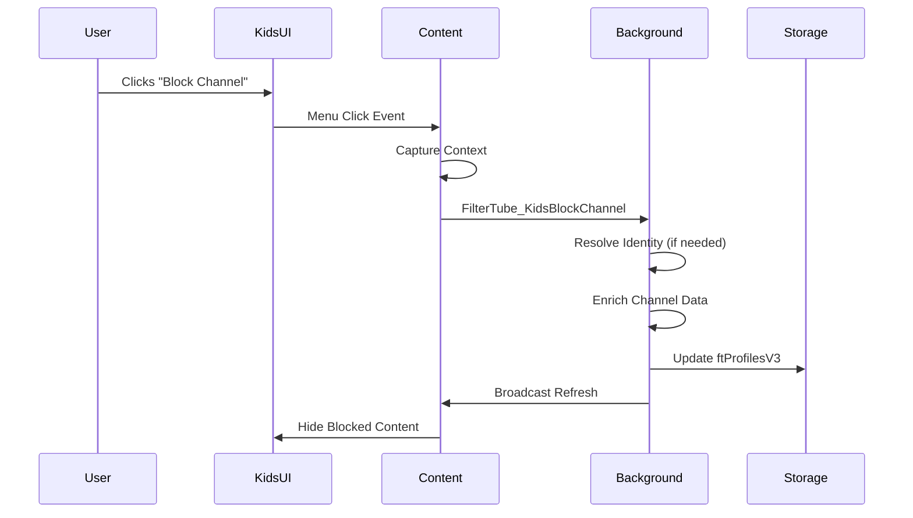

# YouTube Kids Integration Documentation

## Overview

FilterTube v3.1.6 introduces native integration with YouTube Kids, allowing users to block channels directly from Kids UI while maintaining the same filtering power available on YouTube Main.

## Architecture

### Dual-Profile System

```
┌─────────────────────────────────────────────────────────────────────┐
│                    FilterTube Extension                             │
├─────────────────────────────────────────────────────────────────────┤
│  Background Script (Service Worker)                                 │
│  ├── Profile Detection (URL-based)                                  │
│  ├── Kids Native Message Handler                                    │
│  └── Settings Compilation (per-profile)                             │
├─────────────────────────────────────────────────────────────────────┤
│  Content Scripts                                                    │
│  ├── Main: youtube.com (existing logic)                             │
│  └── Kids: youtubekids.com (new native integration)                 │
└─────────────────────────────────────────────────────────────────────┘
```

### Profile Detection

```javascript
function isKidsUrl(url) {
    return typeof url === 'string' && url.includes('youtubekids.com');
}

// Route to appropriate profile
const targetProfile = isKidsUrl(senderUrl) ? 'kids' : 'main';
```

## Native Blocking Flow

### Event Detection

FilterTube integrates with YouTube Kids' native blocking UI through passive event listeners:

```javascript
// Monitor menu clicks and toast notifications
document.addEventListener('click', (e) => {
    const menuItem = e.target.closest('ytk-menu-service-item-renderer');
    if (menuItem?.textContent?.toLowerCase().includes('block')) {
        const blockType = menuItem.textContent.toLowerCase().includes('channel') ? 'channel' : 'video';
        handleKidsNativeBlock(blockType);
    }
}, true);

// Also monitor toast notifications
document.addEventListener('DOMNodeInserted', (e) => {
    const toast = e.target.matches?.('tp-yt-paper-toast#toast') ? e.target : null;
    if (toast && /(video|channel)\s+blocked/i.test(toast.textContent)) {
        const blockType = /channel\s+blocked/i.test(toast.textContent) ? 'channel' : 'video';
        handleKidsNativeBlock(blockType);
    }
}, true);
```

### Context Capture

When a block action is detected, FilterTube captures relevant context:

```javascript
function captureKidsMenuContext(menuButton) {
    const context = {
        ts: Date.now(),
        videoId: '',
        channelId: '',
        channelName: '',
        source: 'kidsMenu'
    };

    // Extract from video card
    const card = menuButton?.closest('ytk-compact-video-renderer, ytk-grid-video-renderer, ytk-video-renderer');
    if (card) {
        // Extract video ID
        context.videoId = extractVideoIdFromCard(card);
        
        // Extract channel ID from link
        const channelLink = card.querySelector('a[href*="/channel/"], a[href*="/channel/"]');
        if (channelLink && window.FilterTubeIdentity?.extractChannelIdFromPath) {
            context.channelId = window.FilterTubeIdentity.extractChannelIdFromPath(channelLink.href);
        }
        
        // Extract channel name
        context.channelName = channelLink?.textContent?.trim() || '';
    }

    // Fallback to page context
    const isWatch = location.pathname.startsWith('/watch');
    if (isWatch && !context.videoId) {
        const params = new URLSearchParams(location.search);
        const v = params.get('v');
        if (v && /^[a-zA-Z0-9_-]{11}$/.test(v)) {
            context.videoId = v;
        }
    }

    return context;
}
```

### Message Flow



## Storage Structure

### Kids Profile Data

```json
{
    "ftProfilesV3": {
        "kids": {
            "blockedChannels": [
                {
                    "id": "UCuAXFkgsw1L7xaCfnd5JJOw",
                    "handle": "@channel",
                    "name": "Channel Name",
                    "customUrl": null,
                    "originalInput": "@channel",
                    "source": "kidsNativeChannel",
                    "addedAt": 1641024000000,
                    "filterAll": false
                }
            ],
            "blockedKeywords": [
                {
                    "word": "keyword",
                    "exact": false,
                    "comments": true,
                    "addedAt": 1641024000000,
                    "source": "user"
                }
            ]
        }
    }
}
```

## Identity Resolution

### Kids-Specific Fetch Function

```javascript
async function performKidsWatchIdentityFetch(videoId) {
    // Check videoChannelMap first (fast path)
    const stored = await storageGet(['videoChannelMap']);
    const storedId = stored?.videoChannelMap?.[videoId];
    if (storedId) {
        return { id: storedId, videoId, source: 'videoChannelMap' };
    }

    // Check session cache
    if (kidsWatchIdentitySessionCache.has(videoId)) {
        return kidsWatchIdentitySessionCache.get(videoId);
    }

    // Fetch from Kids watch page (CORS-limited)
    try {
        const response = await fetch(`https://www.youtubekids.com/watch?v=${videoId}`);
        const html = await response.text();
        
        // Extract from page HTML
        const match = html.match(/"browseId":"(UC[\w-]{22})"/i);
        if (match) {
            const identity = { id: match[1], videoId, source: 'kidsWatch' };
            
            // Cache in session and storage
            kidsWatchIdentitySessionCache.set(videoId, identity);
            enqueueVideoChannelMapUpdate(videoId, match[1]);
            
            return identity;
        }
    } catch (error) {
        console.warn('Kids watch fetch failed:', error);
    }

    // Fallback to main-world fetch
    return await performWatchIdentityFetch(videoId);
}
```

## UI Integration

### Tab View Support

The FilterTube tab view now supports Kids profile with dedicated sections:

```javascript
// Render Kids channels
document.addEventListener('DOMContentLoaded', () => {
    RenderEngine.renderChannelList({
        container: document.getElementById('kids-channels-container'),
        channels: StateManager.getKidsChannels(),
        profile: 'kids',
        minimal: false,
        showSearch: true,
        showSort: true,
        showNodeMapping: true,
        onDelete: (index) => StateManager.removeKidsChannel(index),
        onToggleFilterAll: (index) => StateManager.toggleKidsChannelFilterAll(index)
    });
});

// Render Kids keywords
RenderEngine.renderKeywordList({
    container: document.getElementById('kids-keywords-container'),
    keywords: StateManager.getKidsKeywords(),
    profile: 'kids',
    minimal: true,
    includeToggles: true,
    onDelete: (word) => StateManager.removeKidsKeyword(word),
    onToggleExact: (word) => StateManager.toggleKidsKeywordExact(word),
    onToggleComments: (word) => StateManager.toggleKidsKeywordComments(word)
});
```

### Toggle Behavior

Kids profile includes all toggle functionality:

- **Filter All Content**: Automatically adds channel name as keyword
- **Exact Match**: Toggle between exact/partial matching
- **Comments**: Toggle comment filtering for keywords

## Performance Optimizations

### 1. Session Caching

```javascript
// In-memory cache for Kids identity requests
const kidsWatchIdentitySessionCache = new Map();
const KIDS_SESSION_CACHE_TTL = 300000; // 5 minutes

// Cache with TTL
function cacheKidsIdentity(videoId, identity) {
    kidsWatchIdentitySessionCache.set(videoId, {
        ...identity,
        cachedAt: Date.now()
    });
}
```

### 2. Debounced Updates

Kids profile uses the same debounced storage system as Main profile:

```javascript
// Share videoChannelMap updates across profiles
function enqueueVideoChannelMapUpdate(videoId, channelId) {
    const v = typeof videoId === 'string' ? videoId.trim() : '';
    const c = typeof channelId === 'string' ? channelId.trim() : '';
    if (!v || !c) return;
    
    pendingVideoChannelMapUpdates.set(v, c);
    
    // Update in-memory cache immediately
    if (videoChannelMapCache) {
        videoChannelMapCache[v] = c;
    }
    
    scheduleVideoChannelMapFlush();
}
```

## Error Handling

### CORS Limitations

YouTube Kids blocks cross-origin requests from www.youtube.com. FilterTube handles this by:

1. **Using Kids watch pages** when possible
2. **Falling back to main-world extraction** from Kids page HTML
3. **Leveraging videoChannelMap** for previously resolved identities

### Fallback Strategy

```
Kids Native Block
├── Context Capture (videoId, channelId, channelName)
├── videoChannelMap Lookup (fast path)
├── Kids Watch Page Fetch (if needed)
├── Main-World Fallback (ytInitialData)
└── Store in ftProfilesV3.kids.blockedChannels
```

## Security Considerations

### 1. Isolation

- Kids and Main profiles are completely isolated
- No data leakage between profiles
- Separate storage namespaces

### 2. Input Validation

```javascript
// Validate video ID format
if (!/^[a-zA-Z0-9_-]{11}$/.test(videoId)) {
    return { success: false, error: 'invalid_video_id' };
}

// Validate channel ID format
if (!/^UC[\w-]{22}$/.test(channelId)) {
    return { success: false, error: 'invalid_channel_id' };
}
```

### 3. Message Sanitization

All messages between content scripts and background are validated:

```javascript
// Background message handler
if (action === 'FilterTube_KidsBlockChannel') {
    const channel = request?.channel && typeof request.channel === 'object' ? request.channel : null;
    if (!channel) {
        sendResponse({ success: false, error: 'missing_channel' });
        return;
    }
    
    // Process block request...
}
```

## Testing Scenarios

### 1. Native Block from Video Card

1. Navigate to YouTube Kids
2. Find a video from channel to block
3. Click 3-dot menu → "Block this channel"
4. Verify: Channel appears in Kids tab view
5. Verify: Videos from channel are hidden

### 2. Native Block from Channel Page

1. Navigate to channel page on Kids
2. Click "Block" button (if available)
3. Verify: Channel added to block list
4. Verify: Page content is hidden

### 3. Cross-Profile Isolation

1. Block channel on YouTube Kids
2. Check YouTube Main → channel not blocked
3. Block channel on YouTube Main
4. Check YouTube Kids → channel not blocked

## Migration Path

### Existing Users

- Current Main profile blocks are preserved
- Kids profile starts empty
- Users can manually migrate channels if needed

### Data Import/Export

- Kids profile supports separate import/export
- Format compatible with Main profile
- Includes profile identifier in exports

## Future Enhancements

### Planned Features

1. **Sync Across Profiles**: Option to share blocks between Main and Kids
2. **Enhanced Context**: Better extraction from Kids UI variations
3. **Bulk Operations**: Multi-select and block on Kids pages
4. **Analytics**: Per-profile blocking statistics

### Extension Points

The Kids integration is designed to be extensible:

- Additional UI elements can be added to context capture
- New fetch strategies can be plugged in
- Toggle behaviors can be extended
- Storage format supports new fields
