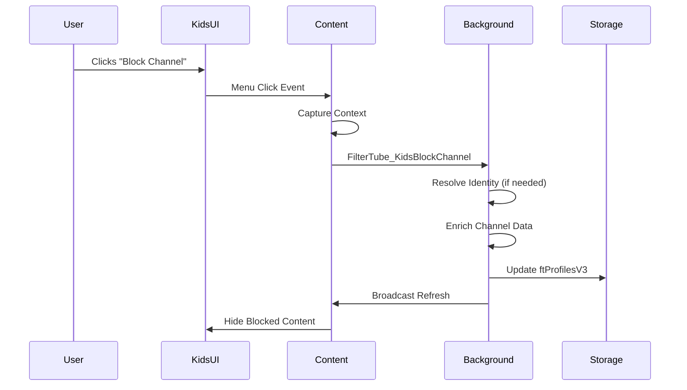

# YouTube Kids Integration Documentation (v3.2.3)

## Overview

FilterTube v3.2.3 provides **zero-network** integration with YouTube Kids, relying entirely on proactive XHR interception to extract channel identity without any network requests. This ensures reliable blocking on YouTube Kids where traditional network fetching often fails.

**Whitelist Mode Support (v3.2.3):** YouTube Kids now supports whitelist mode for granular content control, allowing parents to specify exactly which channels and content are allowed.

## Whitelist Mode for Kids (v3.2.3)

### Kids Profile Whitelist Support

YouTube Kids profiles now support whitelist mode for enhanced parental control:

```javascript
// In background.js - Kids whitelist mode handling
async function handleKidsWhitelistChannel(request) {
    const { channel, videoId } = request;
    
    // Add to Kids whitelist instead of blocklist
    const result = await handleAddFilteredChannel(
        channel.originalInput || channel.id,
        false,
        null,
        null,
        {
            displayHandle: channel.handleDisplay,
            canonicalHandle: channel.canonicalHandle,
            channelName: channel.name,
            customUrl: channel.customUrl,
            source: 'user'
        },
        'kids',
        videoId,
        'whitelist' // Use whitelist list type
    );
    
    return result;
}
```

### Mode-Aware Kids Filtering

Kids content filtering now respects the profile's filtering mode:

```javascript
// In content_bridge.js - Kids mode-aware filtering
function shouldHideKidsContent(title, channel, kidsSettings) {
    const mode = kidsSettings.mode === 'whitelist' ? 'whitelist' : 'blocklist';
    
    if (mode === 'whitelist') {
        // Hide by default, only show whitelisted content
        return !matchesKidsWhitelist(title, channel, kidsSettings);
    } else {
        // Traditional blocklist mode
        return matchesKidsBlocklist(title, channel, kidsSettings);
    }
}

function matchesKidsWhitelist(title, channel, settings) {
    // Check against Kids whitelist channels
    if (settings.whitelistChannels && 
        settings.whitelistChannels.some(ch => matchesChannel(channel, ch))) {
        return true;
    }
    
    // Check against Kids whitelist keywords
    if (settings.whitelistKeywords && 
        settings.whitelistKeywords.some(regex => regex.test(title))) {
        return true;
    }
    
    return false;
}
```

### Kids UI Controls

The Kids profile interface includes whitelist mode controls:

```javascript
// In tab-view.js - Kids whitelist toggle
function renderKidsListModeControls() {
    const state = StateManager.getState();
    const kidsMode = state?.kids?.mode === 'whitelist' ? 'whitelist' : 'blocklist';
    
    const toggle = UIComponents.createToggleButton({
        text: 'Whitelist',
        active: kidsMode === 'whitelist',
        onToggle: async (nextState) => {
            const resp = await sendRuntimeMessage({
                action: 'FilterTube_SetListMode',
                profileType: 'kids',
                mode: nextState ? 'whitelist' : 'blocklist',
                copyBlocklist: false // Kids typically starts with empty whitelist
            });
            
            if (resp.ok) {
                await StateManager.loadSettings();
                renderKidsKeywords();
                renderKidsChannels();
            }
        }
    });
    
    return toggle;
}
```

## Zero-Network Architecture (v3.2.1)

### Proactive Channel Identity on Kids

```javascript
// In seed.js - network snapshot stashing works on Kids too
function stashNetworkSnapshot(data, dataName) {
    if (dataName.includes('/youtubei/v1/browse')) {
        // Kids browse responses contain channel identity
        window.filterTube.lastYtBrowseResponse = data;
        window.filterTube.lastYtBrowseResponseTs = Date.now();
    }
}

// In content_bridge.js - Kids zero-network prefetch
async function prefetchIdentityForCard({ videoId, card }) {
    const isKidsHost = typeof location !== 'undefined' && 
                      String(location.hostname || '').includes('youtubekids.com');
    
    if (isKidsHost) {
        // Kids: do NOT prefetch via network. Rely on Network JSON interception
        const info = extractChannelFromCard(card);
        if (info?.id || info?.handle || info?.customUrl) {
            stampChannelIdentity(card, info);
            if (info.id) {
                persistVideoChannelMapping(videoId, info.id);
            }
        }
        return;
    }
}
```

**Kids-specific features:**
- **Zero network requests** - completely relies on XHR interception
- **Instant blocking** - no "Fetching..." delays on Kids
- **Reliable operation** - works even when Kids blocks external requests
- **DOM extraction fallback** - uses stamped attributes when available

### Enhanced Kids Native Blocking (v3.2.1)

```javascript
// In block_channel.js - improved Kids context capture
function captureKidsMenuContext(menuButton) {
    const context = {
        ts: now,
        videoId: '',
        channelId: '',
        channelHandle: '',
        customUrl: '',
        channelName: '',
        source: 'kidsMenu'
    };
    
    // Extract handle from channel links
    if (href) {
        const extractedHandle = window.FilterTubeIdentity?.extractRawHandle?.(href) || '';
        if (extractedHandle && extractedHandle.startsWith('@')) {
            context.channelHandle = extractedHandle;
        }
        
        // Extract customUrl from /c/ and /user/ paths
        const decoded = (() => {
            try { return decodeURIComponent(href); } catch (e) { return href; }
        })();
        if (decoded.startsWith('/c/')) {
            const slug = decoded.split('/')[2] || '';
            if (slug) context.customUrl = `c/${slug}`;
        } else if (decoded.startsWith('/user/')) {
            const slug = decoded.split('/')[2] || '';
            if (slug) context.customUrl = `user/${slug}`;
        }
    }
    
    return context;
}

// Enhanced Kids blocking with validation
async function handleKidsNativeBlock(blockType = 'video', options = {}) {
    let ctx = lastKidsMenuContext;
    
    // Refresh stale context to reduce errors
    if (!ctx || (!ctx.channelId && !ctx.channelName)) {
        const fresh = captureKidsMenuContext(lastClickedMenuButton);
        if (fresh) {
            lastKidsMenuContext = fresh;
            ctx = fresh;
        }
    }
    
    // Validate and sanitize channel name
    let channelName = ctx?.channelName || '';
    if (/^[a-zA-Z0-9_-]{11}$/.test(channelName) || /^UC[\w-]{22}$/i.test(channelName)) {
        channelName = '';
    }
    
    const safeHandle = (ctx?.channelHandle || '').trim();
    const safeCustomUrl = (ctx?.customUrl || '').trim();
    
    // Send to background with proper identifiers
    chrome.runtime?.sendMessage({
        action: 'FilterTube_KidsBlockChannel',
        videoId: ctx?.videoId || null,
        channel: {
            name: channelName || null,
            id: ctx?.channelId || '',
            handle: safeHandle || null,
            customUrl: safeCustomUrl || null,
            originalInput: (ctx?.channelId && ctx?.channelId.startsWith('UC'))
                ? ctx?.channelId
                : (safeHandle || safeCustomUrl || ''),
            source: blockType === 'channel' ? 'kidsNativeChannel' : 'kidsNativeVideo'
        }
    });
}
```

**Kids blocking improvements:**
- **Handle extraction** from channel links
- **CustomUrl support** for /c/ and /user/ channels
- **Context refresh** to reduce stale data
- **Name validation** to avoid persisting IDs as names
- **Proper identifier prioritization**

## Architecture

### Zero-Network Design

```text
┌─────────────────────────────────────────────────────────────────────┐
│                    FilterTube Extension                             │
├─────────────────────────────────────────────────────────────────────┤
│  Main World (Page Context)                                          │
│  ├── XHR Interception (/youtubei/v1/*)                              │
│  ├── Snapshot Stashing (lastYt*Response)                            │
│  └── Channel Extraction (no network)                                │
├─────────────────────────────────────────────────────────────────────┤
│  Isolated World (Extension)                                         │
│  ├── Message Handling (content_bridge.js)                           │
│  ├── Native UI Integration (block_channel.js)                       │
│  └── DOM Stamping (instant)                                         │
├─────────────────────────────────────────────────────────────────────┤
│  Background Script (Service Worker)                                 │
│  ├── Profile Detection (URL-based)                                  │
│  ├── Kids Native Message Handler                                    │
│  └── Settings Compilation (per-profile)                             │
└─────────────────────────────────────────────────────────────────────┘
```

### Key Principle: No Network Fetches

All channel identity on YouTube Kids comes from:
1. **XHR JSON interception** – `/youtubei/v1/next`, `/youtubei/v1/browse`
2. **DOM extraction** – When available in page markup
3. **Never from network fetches** – `skipNetwork: true` enforced everywhere

### Profile Detection

```javascript
function isKidsUrl(url) {
    return typeof url === 'string' && url.includes('youtubekids.com');
}

// Route to appropriate profile
const targetProfile = isKidsUrl(senderUrl) ? 'kids' : 'main';
```

## Zero-Network Identity Resolution

### Proactive Channel Extraction

```javascript
// In filter_logic.js - XHR interception works the same as Main
function extractChannelInfoForKids(item, rules) {
    // Extract UC ID from browseEndpoint
    const channelId = item.browseEndpoint?.browseId;
    
    // Extract handle/customUrl from canonicalBaseUrl
    const canonical = item.browseEndpoint?.canonicalBaseUrl;
    const handle = canonical ? normalizeChannelHandle(canonical) : '';
    const customUrl = canonical ? extractCustomUrlFromCanonicalBaseUrl(canonical) : '';
    
    // Extract name from metadata
    const name = item.title?.simpleText || item.byline?.simpleText;
    
    return { id: channelId, handle, customUrl, name };
}
```

### Cross-world Messaging

Same messages as Main YouTube, but with Kids-specific data:

```javascript
// Main World broadcasts channel info
window.postMessage({
    type: 'FilterTube_UpdateChannelMap',
    payload: { '@handle': 'UC...', 'c/name': 'UC...' }
}, '*');

// Isolated World receives and stamps instantly
function handleMainWorldMessages(event) {
    if (event.data.type === 'FilterTube_UpdateChannelMap') {
        // Stamp all matching cards immediately
        stampKidsCardsWithChannelInfo(event.data.payload);
    }
}
```

## Native Blocking Flow (Zero-Network)

### Event Detection

```javascript
// Monitor menu clicks and toast notifications
document.addEventListener('click', (e) => {
    const menuItem = e.target.closest('ytk-menu-service-item-renderer');
    if (menuItem?.textContent?.toLowerCase().includes('block')) {
        const blockType = menuItem.textContent.toLowerCase().includes('channel') ? 'channel' : 'video';
        handleKidsNativeBlock(blockType);
    }
}, true);

// Also monitor toast notifications
document.addEventListener('DOMNodeInserted', (e) => {
    const toast = e.target.matches?.('tp-yt-paper-toast#toast') ? e.target : null;
    if (toast && /(video|channel)\s+blocked/i.test(toast.textContent)) {
        const blockType = /channel\s+blocked/i.test(toast.textContent) ? 'channel' : 'video';
        handleKidsNativeBlock(blockType);
    }
}, true);
```

### Context Capture (Enhanced for Zero-Network)

When a block action is detected, FilterTube captures context without any network fetches:

```javascript
function captureKidsMenuContext(menuButton) {
    const context = {
        ts: Date.now(),
        videoId: '',
        channelId: '',
        channelName: '',
        handle: '',
        customUrl: '',
        source: 'kidsMenu'
    };

    // Extract from video card
    const card = menuButton?.closest('ytk-compact-video-renderer, ytk-grid-video-renderer, ytk-video-renderer');
    if (card) {
        // Check for stamped attributes first (from XHR)
        context.channelId = card.getAttribute('data-filtertube-channel-id') || '';
        context.handle = card.getAttribute('data-filtertube-channel-handle') || '';
        context.customUrl = card.getAttribute('data-filtertube-channel-custom') || '';
        context.channelName = card.getAttribute('data-filtertube-channel-name') || '';
        
        // Fallback to DOM extraction
        if (!context.channelId) {
            const channelLink = card.querySelector('a[href*="/channel/"], a[href*="/@"]');
            if (channelLink) {
                context.channelId = extractChannelIdFromPath(channelLink.href);
                context.handle = extractRawHandle(channelLink.href);
                context.channelName = channelLink.textContent?.trim() || '';
            }
        }
        
        // Extract video ID
        context.videoId = card.getAttribute('data-filtertube-video-id') || 
                         extractVideoIdFromCard(card) || '';
    }

    // Fallback to page context (no network fetch)
    const isWatch = location.pathname.startsWith('/watch');
    if (isWatch && !context.videoId) {
        const params = new URLSearchParams(location.search);
        const v = params.get('v');
        if (v && /^[a-zA-Z0-9_-]{11}$/.test(v)) {
            context.videoId = v;
        }
    }
    
    // Never trigger network fetches on Kids
    return context;
}
    }

    return context;
}
```

### Message Flow



## Storage Structure

### Kids Profile Data

```json
{
    "ftProfilesV3": {
        "kids": {
            "blockedChannels": [
                {
                    "id": "UCuAXFkgsw1L7xaCfnd5JJOw",
                    "handle": "@channel",
                    "name": "Channel Name",
                    "customUrl": null,
                    "originalInput": "@channel",
                    "source": "kidsNativeChannel",
                    "addedAt": 1641024000000,
                    "filterAll": false
                }
            ],
            "blockedKeywords": [
                {
                    "word": "keyword",
                    "exact": false,
                    "comments": true,
                    "addedAt": 1641024000000,
                    "source": "user"
                }
            ]
        }
    }
}
```

## Identity Resolution

### Kids-Specific Fetch Function

FilterTube uses the same **identity caches** on both YouTube Main and YouTube Kids:

- `videoChannelMap`: `videoId -> UC...` (learned passively from intercepted YouTube JSON such as `ytInitialPlayerResponse` and `/youtubei/v1/player`, then persisted)
- `channelMap`: `@handle` / `c/<slug>` / `user/<slug>` ↔ `UC...`

On Kids, these caches are especially important because direct network fetches can be **CORS-limited**.

```javascript
async function performKidsWatchIdentityFetch(videoId) {
    // Check videoChannelMap first (fast path)
    const stored = await storageGet(['videoChannelMap']);
    const storedId = stored?.videoChannelMap?.[videoId];
    if (storedId) {
        return { id: storedId, videoId, source: 'videoChannelMap' };
    }

    // Check session cache
    if (kidsWatchIdentitySessionCache.has(videoId)) {
        return kidsWatchIdentitySessionCache.get(videoId);
    }

    // Fetch from Kids watch page (CORS-limited)
    try {
        const response = await fetch(`https://www.youtubekids.com/watch?v=${videoId}`);
        const html = await response.text();
        
        // Extract from page HTML
        const match = html.match(/"browseId":"(UC[\w-]{22})"/i);
        if (match) {
            const identity = { id: match[1], videoId, source: 'kidsWatch' };
            
            // Cache in session and storage
            kidsWatchIdentitySessionCache.set(videoId, identity);
            enqueueVideoChannelMapUpdate(videoId, match[1]);
            
            return identity;
        }
    } catch (error) {
        console.warn('Kids watch fetch failed:', error);
    }

    // Fallback to main-world fetch
    return await performWatchIdentityFetch(videoId);
}
```

**Note:** this function represents a **fallback path** used when the UC ID is not already known via DOM extraction or `videoChannelMap`. The preferred path for both Main and Kids is to reuse mappings learned from intercepted JSON so blocking can happen immediately.

## UI Integration

### Tab View Support

The FilterTube tab view now supports Kids profile with dedicated sections:

```javascript
// Render Kids channels
document.addEventListener('DOMContentLoaded', () => {
    RenderEngine.renderChannelList({
        container: document.getElementById('kids-channels-container'),
        channels: StateManager.getKidsChannels(),
        profile: 'kids',
        minimal: false,
        showSearch: true,
        showSort: true,
        showNodeMapping: true,
        onDelete: (index) => StateManager.removeKidsChannel(index),
        onToggleFilterAll: (index) => StateManager.toggleKidsChannelFilterAll(index)
    });
});

// Render Kids keywords
RenderEngine.renderKeywordList({
    container: document.getElementById('kids-keywords-container'),
    keywords: StateManager.getKidsKeywords(),
    profile: 'kids',
    minimal: true,
    includeToggles: true,
    onDelete: (word) => StateManager.removeKidsKeyword(word),
    onToggleExact: (word) => StateManager.toggleKidsKeywordExact(word),
    onToggleComments: (word) => StateManager.toggleKidsKeywordComments(word)
});
```

### Toggle Behavior

Kids profile includes all toggle functionality:

- **Filter All Content**: Automatically adds channel name as keyword
- **Exact Match**: Toggle between exact/partial matching
- **Comments**: Toggle comment filtering for keywords

## Performance Optimizations

### 1. Session Caching

```javascript
// In-memory cache for Kids identity requests
const kidsWatchIdentitySessionCache = new Map();
const KIDS_SESSION_CACHE_TTL = 300000; // 5 minutes

// Cache with TTL
function cacheKidsIdentity(videoId, identity) {
    kidsWatchIdentitySessionCache.set(videoId, {
        ...identity,
        cachedAt: Date.now()
    });
}
```

### 2. Debounced Updates

Kids profile uses the same debounced storage system as Main profile:

```javascript
// Share videoChannelMap updates across profiles
function enqueueVideoChannelMapUpdate(videoId, channelId) {
    const v = typeof videoId === 'string' ? videoId.trim() : '';
    const c = typeof channelId === 'string' ? channelId.trim() : '';
    if (!v || !c) return;
    
    pendingVideoChannelMapUpdates.set(v, c);
    
    // Update in-memory cache immediately
    if (videoChannelMapCache) {
        videoChannelMapCache[v] = c;
    }
    
    scheduleVideoChannelMapFlush();
}
```

## Error Handling

### CORS Limitations

YouTube Kids blocks cross-origin requests from https://www.youtube.com. FilterTube handles this by:

1. **Using Kids watch pages** when possible
2. **Falling back to main-world extraction** from Kids page HTML
3. **Leveraging videoChannelMap** for previously resolved identities

### Fallback Strategy

```text
Kids Native Block
├── Context Capture (videoId, channelId, channelName)
├── videoChannelMap Lookup (fast path)
├── Kids Watch Page Fetch (if needed)
├── Main-World Fallback (ytInitialData)
└── Store in ftProfilesV3.kids.blockedChannels
```

## Security Considerations

### 1. Isolation

- Kids and Main profiles are completely isolated
- No data leakage between profiles
- Separate storage namespaces

### 2. Input Validation

```javascript
// Validate video ID format
if (!/^[a-zA-Z0-9_-]{11}$/.test(videoId)) {
    return { success: false, error: 'invalid_video_id' };
}

// Validate channel ID format
if (!/^UC[\w-]{22}$/.test(channelId)) {
    return { success: false, error: 'invalid_channel_id' };
}
```

### 3. Message Sanitization

All messages between content scripts and background are validated:

```javascript
// Background message handler
if (action === 'FilterTube_KidsBlockChannel') {
    const channel = request?.channel && typeof request.channel === 'object' ? request.channel : null;
    if (!channel) {
        sendResponse({ success: false, error: 'missing_channel' });
        return;
    }
    
    // Process block request...
}
```

## Testing Scenarios

### 1. Native Block from Video Card

1. Navigate to YouTube Kids
2. Find a video from channel to block
3. Click 3-dot menu → "Block this channel"
4. Verify: Channel appears in Kids tab view
5. Verify: Videos from channel are hidden

### 2. Native Block from Channel Page

1. Navigate to channel page on Kids
2. Click "Block" button (if available)
3. Verify: Channel added to block list
4. Verify: Page content is hidden

### 3. Cross-Profile Isolation

1. Block channel on YouTube Kids
2. Check YouTube Main → channel not blocked
3. Block channel on YouTube Main
4. Check YouTube Kids → channel not blocked

## Migration Path

### Existing Users

- Current Main profile blocks are preserved
- Kids profile starts empty
- Users can manually migrate channels if needed

### Data Import/Export

- Kids profile supports separate import/export
- Format compatible with Main profile
- Includes profile identifier in exports

## Future Enhancements

### Planned Features

1. **Sync Across Profiles**: Option to share blocks between Main and Kids
2. **Enhanced Context**: Better extraction from Kids UI variations
3. **Bulk Operations**: Multi-select and block on Kids pages
4. **Analytics**: Per-profile blocking statistics

### Extension Points

The Kids integration is designed to be extensible:

- Additional UI elements can be added to context capture
- New fetch strategies can be plugged in
- Toggle behaviors can be extended
- Storage format supports new fields
