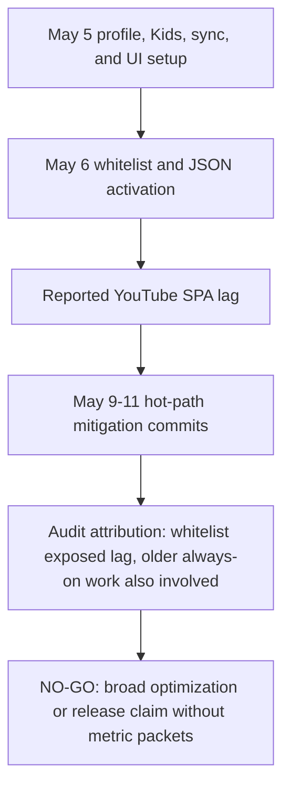

# FilterTube Active Goal Completion Audit - Current Behavior - 2026-05-21

Status: audit-only proof. This is not an implementation patch.
Runtime behavior is unchanged.

## Purpose

This slice applies the active persistent goal completion rule to the exact
objective now in force:

```text
Perform a complete proof-backed audit of the FilterTube codebase, covering every
feature, file, method, JSON path, DOM selector, runtime observer/listener/timer,
settings mode, and cross-feature interaction, to identify reliability,
false-hide/leak, performance, and code-burden risks before making any
implementation changes.
```

Completion is not proven. Do not call `update_goal(status='complete')` while any
objective row below remains incomplete, indirect, source-enumerated only,
lexical-only, current-behavior-only, or future-proof-missing.

The current broad `npm run audit:runtime` snapshot is a backlog signal, not a
green completion proof. Passing focused lanes prove scoped current-behavior
claims only; they do not prove that every future implementation change is safe.

Content bridge selector semantic addendum: `docs/audit/FILTERTUBE_CONTENT_BRIDGE_SELECTOR_SEMANTIC_REGISTER_2026-05-21.md` and `tests/runtime/content-bridge-selector-semantic-register-current-behavior.test.mjs` move the DOM selector objective from source-count only toward semantic proof for the largest selector file. The addendum classifies all 244 current `js/content_bridge.js` selector API sites into 13 source-derived selector/effect groups and separately pins all 36 dynamic/non-literal selectors across 11 dynamic selector families. It records that no `contentBridgeSelectorSemanticAuthority`, `contentBridgeSelectorEffectReport`, `contentBridgeSelectorOwnerContract`, `contentBridgeDynamicSelectorEscapePolicy`, `contentBridgeSelectorNoRuleBudget`, or `contentBridgeSelectorRestoreProof` exists in runtime source yet.

DOM fallback selector semantic addendum: `docs/audit/FILTERTUBE_DOM_FALLBACK_SELECTOR_SEMANTIC_REGISTER_2026-05-21.md` and `tests/runtime/dom-fallback-selector-semantic-register-current-behavior.test.mjs` move the DOM selector, hide/restore, false-hide, lifecycle, and performance objectives from the DOM fallback source-count row toward semantic proof for `js/content/dom_fallback.js` and `js/content/dom_helpers.js`. The addendum classifies 164 current selector API sites: 161 in `dom_fallback.js`, 3 in `dom_helpers.js`, 152 static literal args, 12 dynamic/non-literal args, 120 unique static selector literals, 11 semantic selector groups, and 12 dynamic selector families spanning comments, current-watch controls, guide subscriptions, helper visual writers, main card identity, Mix/playlist/watch identity, whitelist metadata, shelf/grid/playlist guards, stale restore and broad controls, mobile open-app cleanup, and Shorts/survey/chip selectors. It also preserves the non-completion boundary: selector target ownership, dynamic escape policy, no-rule budgets, sibling-visible fixtures, and shared restore authority are not complete, and no `domFallbackSelectorSemanticAuthority`, `domFallbackSelectorEffectReport`, `domFallbackSelectorOwnerContract`, `domFallbackDynamicSelectorEscapePolicy`, `domFallbackSelectorNoRuleBudget`, `domFallbackSelectorRestoreProof`, `domFallbackSiblingVisibleFixtureReport`, or `domHelperSelectorInputContract` exists in runtime source yet.

2026-05-30 DOM selector and hide/restore packet current-source rerun: the focused selector packet was rerun with `node --test --test-reporter=spec tests/runtime/selector-authority-current-behavior.test.mjs tests/runtime/p0-selector-authority-current-behavior.test.mjs tests/runtime/dom-selector-instance-register-current-behavior.test.mjs tests/runtime/dom-target-source-current-behavior.test.mjs tests/runtime/dom-route-scope-current-behavior.test.mjs tests/runtime/content-bridge-selector-semantic-register-current-behavior.test.mjs tests/runtime/dom-fallback-selector-semantic-register-current-behavior.test.mjs tests/runtime/content-control-dom-style-selector-matrix-current-behavior.test.mjs tests/runtime/css-style-hide-authority-current-behavior.test.mjs tests/runtime/dom-broad-hide-boundary-current-behavior.test.mjs tests/runtime/dom-hide-side-effect-current-behavior.test.mjs tests/runtime/p0-hide-restore-current-behavior.test.mjs tests/runtime/hide-restore-authority-current-behavior.test.mjs tests/runtime/source-tier-effect-authority-current-behavior.test.mjs tests/runtime/dom-identity-confidence-current-behavior.test.mjs tests/runtime/comments-dom-cleanup-boundary-current-behavior.test.mjs tests/runtime/navigation-header-search-dom-cleanup-boundary-current-behavior.test.mjs tests/runtime/video-info-dom-cleanup-boundary-current-behavior.test.mjs tests/runtime/watch-playlist-panel-dom-cleanup-boundary-current-behavior.test.mjs tests/runtime/playlist-mix-dom-cleanup-boundary-current-behavior.test.mjs tests/runtime/sponsored-cards-dom-cleanup-boundary-current-behavior.test.mjs tests/runtime/live-chat-dom-cleanup-boundary-current-behavior.test.mjs tests/runtime/player-endscreen-dom-cleanup-boundary-current-behavior.test.mjs tests/runtime/video-sidebar-dom-cleanup-boundary-current-behavior.test.mjs tests/runtime/shorts-dom-cleanup-boundary-current-behavior.test.mjs tests/runtime/recommended-dom-cleanup-boundary-current-behavior.test.mjs tests/runtime/home-feed-dom-cleanup-boundary-current-behavior.test.mjs tests/runtime/members-only-dom-cleanup-boundary-current-behavior.test.mjs tests/runtime/tab-view-lifecycle-selector-boundary-current-behavior.test.mjs tests/runtime/popup-lifecycle-selector-boundary-current-behavior.test.mjs` and passed 224/224 tests. This revalidates current-source selector authority, P0 selector gates, DOM selector instance enumeration, DOM target/source rows, route scope rows, content-bridge and DOM fallback selector semantics, content-control style selector rows, CSS/style hide boundaries, broad hide boundaries, hide side effects, P0 hide/restore gates, hide/restore authority gaps, source-tier effect boundaries, DOM identity confidence, and the comments/navigation/video-info/playlist/Mix/sponsored/live-chat/player/sidebar/Shorts/recommended/home-feed/members-only/tab-view/popup selector cleanup boundaries. Runtime behavior changed by this rerun: no. Selector implementation authority, DOM target mutation approval, broad hide pruning, hide/restore registry authority, whitelist/cache optimization, JSON-first promotion, release/public-claim use, and `update_goal(status='complete')` remain `NO-GO`.

Filter logic direct renderer rule semantic addendum: `docs/audit/FILTERTUBE_FILTER_LOGIC_DIRECT_RENDERER_RULE_SEMANTIC_REGISTER_2026-05-21.md` and `tests/runtime/filter-logic-direct-renderer-rule-semantic-register-current-behavior.test.mjs` move the JSON path objective from representative `FILTER_RULES` checks toward semantic proof for runtime direct renderer rule declarations. The addendum classifies all 45 current top-level `FILTER_RULES` source declarations in `js/filter_logic.js`, including 44 unique renderer keys, the duplicate `gridVideoRenderer` declarations at lines 431 and 604, 7 `BASE_VIDEO_RULES` aliases, 38 object literal rules, and 11 semantic rule groups. It also preserves the non-completion boundary: direct renderer keys are not every documented JSON path, and no `filterLogicDirectRuleAuthority`, `filterLogicRendererRuleReport`, `rendererRuleDuplicatePolicy`, `rendererRuleFieldPathManifest`, `rendererRuleEffectDecision`, or `rendererRuleFixtureProvenance` exists in runtime source yet.

Filter logic rule path semantic addendum: `docs/audit/FILTERTUBE_FILTER_LOGIC_RULE_PATH_SEMANTIC_REGISTER_2026-05-21.md` and `tests/runtime/filter-logic-rule-path-semantic-register-current-behavior.test.mjs` move the JSON path, renderer, source/effect, false-hide/leak, performance, code-burden, cross-feature, and implementation-change objectives from renderer-key grouping toward executable runtime path-string proof for `js/filter_logic.js`. The addendum classifies 440 effective runtime path rows after duplicate override, 174 unique effective path literals, 177 renderer-field pairs, 151 text-match path rows, 152 channel identity path rows, 34 video identity path rows, and 103 metadata predicate path rows. It also pins that `gridVideoRenderer` duplicate source declarations make source counts differ from effective runtime rows, current runtime paths use dot-index syntax with 0 bracket-index path rows, and documented encyclopedia paths are not loaded by runtime/build source. It preserves the non-completion boundary: route/surface effects, list-mode behavior, identity confidence, fixture provenance, DOM fallback parity, native runtime parity, no-rule budgets, and future simultaneous allow/block semantics are not complete, and no `filterLogicRulePathAuthority`, `filterLogicRulePathManifest`, `filterLogicRulePathSyntaxContract`, `filterLogicEffectiveRendererPathReport`, `filterLogicDuplicatePathOverridePolicy`, `filterLogicJsonDomParityReport`, `filterLogicPathFixtureProvenance`, `filterLogicJsonFirstReadinessGate`, `filterLogicPathEffectDecision`, or `filterLogicPathNoRuleBudget` exists in runtime source yet.

Filter logic rule field effect semantic addendum: `docs/audit/FILTERTUBE_FILTER_LOGIC_RULE_FIELD_EFFECT_SEMANTIC_REGISTER_2026-05-21.md` and `tests/runtime/filter-logic-rule-field-effect-semantic-register-current-behavior.test.mjs` move the JSON path, renderer, source/effect, settings-mode, false-hide/leak, performance, code-burden, cross-feature, and implementation-change objectives from path-string inventory toward field-effect proof for `js/filter_logic.js`. The addendum classifies 11 rule fields with runtime consumers, 9 consumer methods with `rules.<field>` references, 20 method-field consumer pairs, and 63 `rules.<field>` token references. It pins that `title`, `description`, `commentText`, `channelName`, `duration`, `publishedTime`, `viewCount`, and `metadataRows` can enter candidate search text, `channelName`/`channelId`/`channelHandle` feed channel-policy evidence only after extraction and matching, `videoId` is a join key rather than channel identity, `viewCount` has no current view-count threshold predicate, `_checkCategoryFilters()` can schedule category metadata fetches, and `processData()` harvests before the disabled-filtering skip. It preserves the non-completion boundary: field availability is not effect authority, JSON-first behavior still needs route/surface effects, list-mode proof, identity confidence, fixture provenance, DOM fallback parity, native runtime parity, no-rule budgets, category fetch budgets, future simultaneous allow/block semantics, and field-effect decision, category fetch budget, and no-work proof for each path class, and no `filterLogicRuleFieldEffectAuthority`, `filterLogicRuleFieldEffectManifest`, `filterLogicJsonPathEffectDecision`, `filterLogicFieldConsumerReport`, `filterLogicViewCountPredicateAuthority`, `filterLogicCategoryFetchBudget`, `filterLogicWhitelistFieldEffectReport`, `filterLogicRuleFieldFixtureProvenance`, `filterLogicRuleFieldNoWorkBudget`, or `filterLogicJsonFirstEffectGate` exists in runtime source yet.

JSON-first filter readiness gate addendum: `docs/audit/FILTERTUBE_JSON_FIRST_FILTER_READINESS_GATE_CURRENT_BEHAVIOR_2026-05-21.md` and `tests/runtime/json-first-filter-readiness-gate-current-behavior.test.mjs` move the JSON path, source/effect, settings-mode, no-work, performance, DOM fallback, native parity, false-hide/leak, code-burden, cross-feature, and implementation-change objectives from separate path/field facts toward a first-class JSON filter promotion gate. The addendum keeps 13 promotion rows blocked: normalized path syntax, renderer ownership, field-effect authority, route/surface scope, list-mode semantics, identity confidence, mutation effect, category/network budget, no-rule/no-work budget, fixture provenance, DOM fallback parity, native parity, and optimization budget. It pins that `viewCount` is metadata/search text only, `videoId` is not channel identity, category filtering can schedule metadata fetch work, harvest can occur before disabled filtering, and whitelist mode bypasses the old no-rule fast path. It preserves the non-completion boundary: a JSON field still needs `rendererKey`, `runtimePath`, `documentedPath`, `endpoint`, `route`, `surface`, `profileType`, `listMode`, `ruleState`, `fieldEffect`, `identityConfidence`, `allowedEffects`, `forbiddenEffects`, `networkBudget`, `noWorkBudget`, `positiveFixture`, `negativeSiblingFixture`, `domParity`, `nativeParity`, and `rollbackOrRestoreProof` before it can become first-class filter behavior, and no `jsonFirstFilterReadinessGate`, `jsonFirstPathSyntaxManifest`, `jsonFirstRendererCoverageDecision`, `jsonFirstFieldEffectDecision`, `jsonFirstRouteSurfaceReport`, `jsonFirstListModeMatrix`, `jsonFirstIdentityConfidenceReport`, `jsonFirstMutationEffectReport`, `jsonFirstCategoryFetchBudget`, `jsonFirstNoWorkBudget`, `jsonFirstFixtureProvenance`, `jsonFirstDomParityReport`, `jsonFirstNativeParityReport`, or `jsonFirstOptimizationBudget` exists in runtime source yet.

These remain blocked JSON-first promotion slices, not approval to change runtime behavior.

JSON-first no-work optimization crosswalk addendum: `docs/audit/FILTERTUBE_JSON_FIRST_NO_WORK_OPTIMIZATION_CROSSWALK_CURRENT_BEHAVIOR_2026-05-21.md` and `tests/runtime/json-first-no-work-optimization-crosswalk-current-behavior.test.mjs` move the JSON-first and performance objectives from broad readiness gates toward concrete optimization locations found by codebase inspection. The addendum identifies seed fetch pass-through, seed XHR pass-through, engine harvest split, DOM lifecycle gate, quick-block lifecycle gate, category metadata fetch gate, and metric artifact gate as blocked candidates. It pins that missing settings and disabled mode still allow fetch parse/stringify work, XHR can mark/wrap/hook before late guards, DOM fallback considers whitelist, broad boolean controls, strict content-filter booleans, and selected-category gates active, fallback menu and quick-block lifecycle work need separate budgets, and category filtering can become metadata network work. It preserves the non-completion boundary: JSON-first filtering needs source owner, route, surface, endpoint, profile type, list mode, rule state, active JSON fields, active DOM selectors, parse/stringify/processData/harvest/listener/observer/timer/network/storage/hide/restore budgets, positive/negative fixtures, DOM parity, native parity, and metric artifacts before optimization behavior changes, and no `jsonFirstNoWorkOptimizationCrosswalk`, `jsonFirstWorkDecision`, `jsonFirstSeedPassThroughBudget`, `jsonFirstXhrPassThroughBudget`, `jsonFirstHarvestDecision`, `jsonFirstDomLifecycleBudget`, `jsonFirstQuickBlockLifecycleBudget`, `jsonFirstCategoryMetadataBudget`, `jsonFirstMetricArtifactReport`, or `jsonFirstNoWorkOptimizationBudget` exists in runtime source yet.

JSON-first implementation locus register addendum: `docs/audit/FILTERTUBE_JSON_FIRST_IMPLEMENTATION_LOCUS_REGISTER_CURRENT_BEHAVIOR_2026-05-21.md` and `tests/runtime/json-first-implementation-locus-register-current-behavior.test.mjs` moves the JSON-first, optimization, endpoint/XHR, method/callable, lifecycle, DOM fallback, quick-block, category metadata, false-hide/leak, performance, cross-feature, and implementation-change objectives from candidate classes toward exact source-locus proof. The addendum pins `js/seed.js:197`, `js/seed.js:336`, `js/seed.js:606`, `js/seed.js:692`, `js/filter_logic.js:154`, `js/filter_logic.js:426`, `js/filter_logic.js:2126`, `js/filter_logic.js:3434`, `js/content_bridge.js:1621`, `js/content_bridge.js:5717`, `js/content_bridge.js:6061`, `js/content/dom_fallback.js:1933`, `js/content/dom_fallback.js:2487`, `js/content/block_channel.js:808`, `js/content/block_channel.js:1454`, and `js/content/block_channel.js:2359` as the current code-inspection anchors for future first-class JSON filter contracts. It preserves the non-completion boundary: source-locus, endpoint, active-rule, renderer rule, path syntax, work decision, transport, harvest/mutation, metadata fetch, DOM active-work, DOM lifecycle, menu lifecycle, quick-block lifecycle, metric, parity, and rollback proof are not complete, and no `jsonFirstImplementationLocusRegister`, `jsonFirstSourceLocusDecision`, `jsonFirstEndpointDecision`, `jsonFirstActiveRuleReport`, `jsonFirstRendererRuleManifest`, `jsonFirstWorkDecision`, `jsonFirstTransportBudget`, `jsonFirstHarvestMutationBudget`, `jsonFirstMetadataFetchBudget`, `jsonFirstDomActiveWorkReport`, `jsonFirstMenuLifecycleBudget`, `jsonFirstQuickBlockLifecycleBudget`, or `jsonFirstMetricFixtureReport` exists in runtime source yet.

2026-05-30 JSON path and JSON-first packet current-source rerun: the broad JSON proof packet was rerun with `node --test --test-reporter=spec tests/runtime/json-path-authority-current-behavior.test.mjs tests/runtime/json-dom-inventory-truth-current-behavior.test.mjs tests/runtime/json-runtime-coverage-gap-current-behavior.test.mjs tests/runtime/json-section-coverage-index-current-behavior.test.mjs tests/runtime/filter-logic-direct-renderer-rule-semantic-register-current-behavior.test.mjs tests/runtime/filter-logic-rule-path-semantic-register-current-behavior.test.mjs tests/runtime/filter-logic-rule-field-effect-semantic-register-current-behavior.test.mjs tests/runtime/json-first-*.test.mjs tests/runtime/json-comment-*.test.mjs tests/runtime/xhr-comment-continuation-parity-boundary-current-behavior.test.mjs tests/runtime/main-watch-html-embedded-playlist-endscreen-json-current-behavior.test.mjs tests/runtime/main-watch-initial-lockup-shorts-json-current-behavior.test.mjs tests/runtime/main-next-reload-modern-comments-current-behavior.test.mjs tests/runtime/kids-latest-json-owner-extension-fixture-boundary-current-behavior.test.mjs tests/runtime/playlist-json-player-metadata-boundary-current-behavior.test.mjs tests/runtime/ytm-watch-playlist-panel-json-parity-current-behavior.test.mjs tests/runtime/content-control-json-first-boundary-index-current-behavior.test.mjs tests/runtime/content-filter-field-effect-manifest-gate-current-behavior.test.mjs tests/runtime/content-filter-field-effect-route-surface-matrix-current-behavior.test.mjs tests/runtime/endpoint-decision-matrix-current-behavior.test.mjs tests/runtime/p0-endpoint-policy-current-behavior.test.mjs tests/runtime/main-guide-endpoint-no-work-boundary-current-behavior.test.mjs tests/runtime/main-watch-autoplay-video-endpoint-current-behavior.test.mjs tests/runtime/network-fetch-xhr-callsite-register-current-behavior.test.mjs tests/runtime/xhr-no-work-boundary-current-behavior.test.mjs tests/runtime/seed-xhr-no-work-list-mode-boundary-current-behavior.test.mjs` and passed 896/896 tests. This revalidates current-source JSON path authority gaps, JSON/DOM inventory boundaries, runtime JSON coverage gaps, section coverage, direct renderer declarations, effective rule paths, rule field effects, JSON-first readiness, no-work crosswalks, implementation loci, endpoint matching, URL normalization, response mutation, XHR response overrides, fetch rebuild behavior, pending queue replay, network snapshot stash/permission/freshness/source-precedence/traversal/application/stale-cache/stale-marker boundaries, video metadata storage/fetch/content/category/revision/profile/freshness/merge/no-work boundaries, comment keyword/author/ViewModel/structural/entity/continuation parity, route/surface fixture and metric gates, content-control JSON-first boundaries, endpoint policy, guide/autoplay/embedded-watch/Kids/playlist/YTM fixture boundaries, and network fetch/XHR callsite rows. Runtime behavior changed by this rerun: no. JSON path authority, first-class JSON promotion, route/surface implementation authority, JSON fixture/metric artifact approval, whitelist/cache optimization, native parity, release/public-claim use, and `update_goal(status='complete')` remain `NO-GO`.

2026-05-30 transport/storage and cross-context packet current-source rerun: the focused packet was rerun with `node --test --test-reporter=spec tests/runtime/storage-access-callsite-register-current-behavior.test.mjs tests/runtime/storage-key-authority-current-behavior.test.mjs tests/runtime/p0-storage-cache-current-behavior.test.mjs tests/runtime/storage-payload-quota-boundary-current-behavior.test.mjs tests/runtime/storage-refresh-force-reprocess-coalescing-current-behavior.test.mjs tests/runtime/message-transport-callsite-register-current-behavior.test.mjs tests/runtime/message-side-effect-register-current-behavior.test.mjs tests/runtime/background-message-authority-current-behavior.test.mjs tests/runtime/background-message-action-semantic-register-current-behavior.test.mjs tests/runtime/message-sender-class-matrix-current-behavior.test.mjs tests/runtime/message-trust-hardening-gap-current-behavior.test.mjs tests/runtime/page-message-trust-current-behavior.test.mjs tests/runtime/p0-message-mutation-current-behavior.test.mjs tests/runtime/network-fetch-xhr-callsite-register-current-behavior.test.mjs tests/runtime/network-authority-current-behavior.test.mjs tests/runtime/p0-network-authority-current-behavior.test.mjs tests/runtime/network-fetch-reason-matrix-current-behavior.test.mjs tests/runtime/network-credential-policy-matrix-current-behavior.test.mjs tests/runtime/xhr-no-work-boundary-current-behavior.test.mjs tests/runtime/seed-xhr-no-work-list-mode-boundary-current-behavior.test.mjs tests/runtime/seed-fetch-no-work-list-mode-boundary-current-behavior.test.mjs tests/runtime/settings-refresh-fanout-current-behavior.test.mjs tests/runtime/settings-refresh-cross-context-consumer-boundary-current-behavior.test.mjs tests/runtime/background-compiled-cache-invalidation-lifecycle-boundary-current-behavior.test.mjs tests/runtime/state-manager-request-refresh-fanout-boundary-current-behavior.test.mjs tests/runtime/background-script-injection-trust-boundary-current-behavior.test.mjs tests/runtime/content-bridge-main-world-message-dispatch-boundary-current-behavior.test.mjs tests/runtime/injector-main-world-message-dispatch-boundary-current-behavior.test.mjs tests/runtime/subscription-import-request-lifecycle-boundary-current-behavior.test.mjs tests/runtime/background-identity-fetch-network-budget-boundary-current-behavior.test.mjs tests/runtime/backup-nanah-trusted-state-boundary-current-behavior.test.mjs tests/runtime/backup-download-blob-url-lifecycle-boundary-current-behavior.test.mjs tests/runtime/background-auto-backup-scheduler-boundary-current-behavior.test.mjs tests/runtime/nanah-vendor-runtime-session-lifecycle-boundary-current-behavior.test.mjs tests/runtime/security-crypto-payload-boundary-current-behavior.test.mjs tests/runtime/state-manager-storage-reload-enrichment-lifecycle-boundary-current-behavior.test.mjs tests/runtime/content-bridge-prefetch-identity-lifecycle-boundary-current-behavior.test.mjs tests/runtime/compiled-settings-profile-list-mode-assembly-boundary-current-behavior.test.mjs tests/runtime/json-first-network-snapshot-consumer-request-transport-current-behavior.test.mjs` and passed 287/287 tests. This revalidates current-source storage access/key/cache/quota rows, forced refresh coalescing, message transport/side-effect/sender/trust rows, page-message mutation boundaries, network fetch/XHR and credential/reason rows, seed fetch/XHR no-work gates, settings refresh fanout and cross-context consumers, background compiled-cache invalidation, StateManager request refresh fanout and storage reload/enrichment, background script injection trust, content-bridge and injector MAIN-world dispatch, subscription import lifecycle, background identity fetch network budget, backup/Nanah trusted-state and blob URL lifecycle, auto-backup scheduling, Nanah vendor runtime session lifecycle, security crypto payload handling, content-bridge identity prefetch lifecycle, compiled settings profile/list-mode assembly, and network-snapshot request transport. Runtime behavior changed by this rerun: no. Transport authority, storage schema authority, sender-class capability policy, page-message nonce/origin policy, settings refresh pruning approval, compiled-cache revision authority, request-fanout pruning, network credential/reason authority, identity fetch budget approval, backup/Nanah trust policy, JSON-first promotion, whitelist/cache optimization, release/public-claim use, and `update_goal(status='complete')` remain `NO-GO`.

2026-05-30 rule mutation and action-layer packet current-source rerun: the focused packet was rerun with `node --test --test-reporter=spec tests/runtime/rule-mutation-entrypoint-authority-current-behavior.test.mjs tests/runtime/p0-rule-mutation-current-behavior.test.mjs tests/runtime/fallback-menu-action-gate-current-behavior.test.mjs tests/runtime/quick-block-default-migration-boundary-current-behavior.test.mjs tests/runtime/quick-block-hover-lifecycle-timer-boundary-current-behavior.test.mjs tests/runtime/quick-block-block-menu-affordance-boundary-current-behavior.test.mjs tests/runtime/content-bridge-menu-injection-action-boundary-current-behavior.test.mjs tests/runtime/content-bridge-menu-blocked-state-list-shape-current-behavior.test.mjs tests/runtime/content-bridge-menu-action-list-target-current-behavior.test.mjs tests/runtime/background-add-filtered-channel-list-target-current-behavior.test.mjs tests/runtime/filter-all-toggle-list-target-current-behavior.test.mjs tests/runtime/main-filter-all-comments-scope-current-behavior.test.mjs tests/runtime/add-filtered-channel-filter-all-comments-default-current-behavior.test.mjs tests/runtime/kids-comments-filter-all-boundary-current-behavior.test.mjs tests/runtime/keyword-comments-scope-migration-boundary-current-behavior.test.mjs tests/runtime/batch-whitelist-import-persistence-boundary-current-behavior.test.mjs tests/runtime/list-mode-transition-persistence-boundary-current-behavior.test.mjs tests/runtime/single-channel-rule-mutation-persistence-boundary-current-behavior.test.mjs tests/runtime/profile-management-persistence-boundary-current-behavior.test.mjs tests/runtime/content-bridge-collaborator-identity-promotion-handoff-current-behavior.test.mjs` and passed 192/192 tests. This revalidates current-source rule mutation entrypoints, P0 mutation blockers, fallback-menu action gates, quick-block default migration and hover lifecycle, quick-block/block-menu affordance gates, content-bridge menu injection, menu blocked-state list-shape, menu action list-target behavior, background `addFilteredChannel` list-target behavior, Filter All list-target behavior, Main and Kids comment-scope behavior, add-time Filter All comments defaults, keyword-comments migration, batch whitelist import persistence, list-mode transition persistence, single-channel rule mutation persistence, profile-management persistence, and collaborator identity promotion handoff. Runtime behavior changed by this rerun: no. Rule mutation authority, sender/session policy, list-target authority, fallback-menu action parity, quick-block lifecycle/action budgets, Filter All comments provenance, whitelist import mode authority, list-mode transition copy policy, profile revision authority, collaborator route/surface parity, installed-tab parity, JSON-first promotion, whitelist/cache optimization, release/public-claim use, and `update_goal(status='complete')` remain `NO-GO`.

2026-05-30 collaborator/menu/YTM/native packet current-source rerun: the focused collaborator and native-menu reliability packet was rerun with `node --test --test-reporter=spec tests/runtime/collab-dialog-lifecycle-current-behavior.test.mjs tests/runtime/collab-dialog-method-semantic-register-current-behavior.test.mjs tests/runtime/content-menu-method-semantic-register-current-behavior.test.mjs tests/runtime/fallback-menu-action-gate-current-behavior.test.mjs tests/runtime/content-bridge-menu-injection-action-boundary-current-behavior.test.mjs tests/runtime/content-bridge-menu-blocked-state-list-shape-current-behavior.test.mjs tests/runtime/content-bridge-menu-action-list-target-current-behavior.test.mjs tests/runtime/quick-block-block-menu-affordance-boundary-current-behavior.test.mjs tests/runtime/content-bridge-collaborator-enrichment-retry-boundary-current-behavior.test.mjs tests/runtime/content-bridge-collaborator-metadata-extraction-side-effect-boundary-current-behavior.test.mjs tests/runtime/content-bridge-collaborator-identity-promotion-handoff-current-behavior.test.mjs tests/runtime/content-bridge-collaborator-main-world-merge-mutation-current-behavior.test.mjs tests/runtime/main-collab-resolved-search-card-dialog-current-behavior.test.mjs tests/runtime/main-watch-tmp-playlist-collab-dialog-current-behavior.test.mjs tests/runtime/ytm-show-sheet-collaborator-roster-current-behavior.test.mjs tests/runtime/ytm-show-sheet-injector-filter-logic-parity-current-behavior.test.mjs tests/runtime/ytm-show-sheet-enrichment-handoff-current-behavior.test.mjs tests/runtime/ytm-logs-playlist-bottom-sheet-stale-identity-current-behavior.test.mjs tests/runtime/native-dropdown-close-state-current-behavior.test.mjs tests/runtime/native-overlay-fullscreen-quiet-mode-boundary-current-behavior.test.mjs` and passed 162/162 tests. This revalidates current-source collaborator dialog lifecycle and method semantics, content menu method semantics, fallback-menu action gates, menu injection/action/list-target and blocked-state behavior, quick-block/block-menu affordance behavior, collaborator enrichment retry, collaborator metadata extraction, collaborator identity promotion, collaborator main-world merge mutation, Main resolved-collab and TMP watch playlist fixtures, YTM showSheet roster/parity/enrichment gaps, YTM stale bottom-sheet identity, native dropdown close-state behavior, and native overlay/fullscreen quiet-mode boundaries. Runtime behavior changed by this rerun: no. Collaborator grammar authority, broader non-Topic collaborator provenance, YTM showSheet filter authority, menu/action parity authority, quick-block full parity, stale open-tab cache cleanup, installed visible-tab byte parity, native dropdown/menu timing authority, JSON-first promotion, whitelist/cache optimization, release/public-claim use, and `update_goal(status='complete')` remain `NO-GO`.

2026-05-30 lifecycle observer/listener/timer packet current-source rerun: the broad lifecycle packet was rerun with `node --test --test-reporter=spec tests/runtime/p0-lifecycle-current-behavior.test.mjs tests/runtime/lifecycle-source-current-behavior.test.mjs tests/runtime/lifecycle-instance-register-current-behavior.test.mjs tests/runtime/lifecycle-owner-matrix-current-behavior.test.mjs tests/runtime/repo-lifecycle-primitive-coverage-current-behavior.test.mjs tests/runtime/lifecycle-effect-budget-current-behavior.test.mjs tests/runtime/page-runtime-lifecycle-authority-current-behavior.test.mjs tests/runtime/lifecycle-teardown-decision-register-current-behavior.test.mjs tests/runtime/dom-fallback-lifecycle-callback-semantic-register-current-behavior.test.mjs tests/runtime/content-bridge-lifecycle-callback-semantic-register-current-behavior.test.mjs tests/runtime/bridge-settings-listener-timer-boundary-current-behavior.test.mjs tests/runtime/content-bridge-startup-timing-boundary-current-behavior.test.mjs tests/runtime/seed-page-global-patch-teardown-boundary-current-behavior.test.mjs tests/runtime/page-global-patch-authority-current-behavior.test.mjs tests/runtime/content-bridge-prefetch-identity-lifecycle-boundary-current-behavior.test.mjs tests/runtime/background-compiled-cache-invalidation-lifecycle-boundary-current-behavior.test.mjs tests/runtime/state-manager-storage-reload-enrichment-lifecycle-boundary-current-behavior.test.mjs tests/runtime/background-auto-backup-scheduler-boundary-current-behavior.test.mjs tests/runtime/backup-download-blob-url-lifecycle-boundary-current-behavior.test.mjs tests/runtime/nanah-vendor-runtime-session-lifecycle-boundary-current-behavior.test.mjs tests/runtime/subscription-import-request-lifecycle-boundary-current-behavior.test.mjs tests/runtime/ui-components-portal-lifecycle-boundary-current-behavior.test.mjs tests/runtime/website-client-lifecycle-surface-current-behavior.test.mjs tests/runtime/tab-view-lifecycle-selector-boundary-current-behavior.test.mjs tests/runtime/popup-lifecycle-selector-boundary-current-behavior.test.mjs tests/runtime/collab-dialog-lifecycle-current-behavior.test.mjs tests/runtime/content-control-dom-style-lifecycle-restore-current-behavior.test.mjs tests/runtime/right-rail-whitelist-observer-current-behavior.test.mjs tests/runtime/quick-block-hover-lifecycle-timer-boundary-current-behavior.test.mjs tests/runtime/menu-observer-kids-passive-lifecycle-boundary-current-behavior.test.mjs tests/runtime/ytm-watch-player-observer-timer-budget-current-behavior.test.mjs tests/runtime/empty-install-idle-observer-budget-current-behavior.test.mjs tests/runtime/native-overlay-fullscreen-quiet-mode-boundary-current-behavior.test.mjs` and passed 241/241 tests. This revalidates current-source P0 lifecycle gates, lifecycle source/instance/owner matrices, repo-wide observer/listener/timer/frame primitive coverage, lifecycle effect budgets, page-runtime lifecycle authority gaps, teardown decision rows, DOM fallback and content-bridge lifecycle callbacks, bridge settings listener/timer behavior, content bridge startup timing, seed and page-global patch teardown gaps, prefetch identity lifecycle, background compiled-cache invalidation, StateManager storage reload/enrichment, background auto-backup scheduling, backup blob URL cleanup, Nanah vendor sessions, subscription import lifecycle, UI portal lifecycles, website/tab-view/popup/collab dialog lifecycles, content-control style lifecycle restore, right-rail whitelist observer behavior, quick-block hover timers, Kids passive menu observer behavior, YTM watch/player observer-timer budgets, empty-install idle observer budgets, and native overlay/fullscreen quiet-mode boundaries. Runtime behavior changed by this rerun: no. Shared lifecycle registry authority, listener add/remove cleanup authority, observer release parity approval, timer/frame budget authority, route teardown authority, page-global patch teardown authority, native menu timing authority, no-work lifecycle budgets, metric artifacts, JSON-first promotion, whitelist/cache optimization, release/public-claim use, and `update_goal(status='complete')` remain `NO-GO`.

2026-05-30 settings-mode/cross-feature packet current-source rerun: the focused mode and cross-feature packet was rerun with `node --test --test-reporter=spec tests/runtime/settings-mode-coverage-matrix-current-behavior.test.mjs tests/runtime/settings-mode-source-effect-current-behavior.test.mjs tests/runtime/mode-surface-effect-matrix-current-behavior.test.mjs tests/runtime/cross-feature-authority-matrix-current-behavior.test.mjs tests/runtime/enabled-master-switch-disabled-runtime-boundary-current-behavior.test.mjs tests/runtime/json-first-list-mode-matrix-boundary-current-behavior.test.mjs tests/runtime/content-control-active-work-matrix-current-behavior.test.mjs tests/runtime/compiled-settings-profile-list-mode-assembly-boundary-current-behavior.test.mjs tests/runtime/compiled-settings-field-register-current-behavior.test.mjs tests/runtime/settings-authority-source-current-behavior.test.mjs tests/runtime/settings-refresh-key-parity-register-current-behavior.test.mjs tests/runtime/settings-refresh-cross-context-consumer-boundary-current-behavior.test.mjs tests/runtime/active-rule-authority-current-behavior.test.mjs tests/runtime/profile-viewing-space-authority-current-behavior.test.mjs tests/runtime/ui-row-list-mode-authority-current-behavior.test.mjs tests/runtime/p0-settings-mutation-current-behavior.test.mjs tests/runtime/settings-refresh-fanout-current-behavior.test.mjs tests/runtime/profile-management-persistence-boundary-current-behavior.test.mjs tests/runtime/list-mode-transition-persistence-boundary-current-behavior.test.mjs tests/runtime/batch-whitelist-import-persistence-boundary-current-behavior.test.mjs tests/runtime/whitelist-optimization-readiness-gap-matrix-current-behavior.test.mjs tests/runtime/optimization-stop-go-decision-record-current-behavior.test.mjs` and passed 176/176 tests. This revalidates current-source settings-mode coverage, settings source/effect behavior, mode/surface effects, cross-feature authority rows, enabled-master disabled-runtime boundaries, JSON-first list-mode behavior, content-control active-work decisions, compiled settings profile/list-mode assembly and field registers, settings authority source, settings refresh key parity and cross-context consumers, active-rule authority, profile viewing-space authority, UI row list-mode authority, P0 settings mutation blockers, settings refresh fanout, profile-management persistence, list-mode transition persistence, batch whitelist import persistence, whitelist optimization readiness gaps, and stop/go decision rows. Runtime behavior changed by this rerun: no. Settings authority, revision/dirty-key authority, list-mode transition copy policy, profile revision authority, active-rule authority, cross-feature authority, disabled/no-work runtime authority, whitelist/cache optimization, JSON-first promotion, release/public-claim use, and `update_goal(status='complete')` remain `NO-GO`.

2026-05-30 static/package and public-claim packet current-source rerun: the focused release-surface packet was rerun with `node --test --test-reporter=spec tests/runtime/static-html-support-script-surface-current-behavior.test.mjs tests/runtime/compress-video-script-failure-mode-boundary-current-behavior.test.mjs tests/runtime/media-asset-duplicate-derivative-boundary-current-behavior.test.mjs tests/runtime/website-route-asset-surface-current-behavior.test.mjs tests/runtime/css-load-style-surface-current-behavior.test.mjs tests/runtime/extension-asset-data-package-surface-current-behavior.test.mjs tests/runtime/extension-icon-logo-package-parity-boundary-current-behavior.test.mjs tests/runtime/browser-manifest-runtime-load-order-current-behavior.test.mjs tests/runtime/design-token-json-css-parity-boundary-current-behavior.test.mjs tests/runtime/package-lock-script-optional-dependency-boundary-current-behavior.test.mjs tests/runtime/root-package-metadata-script-surface-current-behavior.test.mjs tests/runtime/tracked-public-doc-claim-surface-current-behavior.test.mjs tests/runtime/generated-local-output-dependency-surface-current-behavior.test.mjs tests/runtime/website-package-config-dependency-surface-current-behavior.test.mjs tests/runtime/website-client-lifecycle-surface-current-behavior.test.mjs tests/runtime/website-route-component-render-graph-current-behavior.test.mjs tests/runtime/website-route-build-smoke-artifact-boundary-current-behavior.test.mjs tests/runtime/website-remote-request-privacy-performance-boundary-current-behavior.test.mjs tests/runtime/release-notes-json-version-gate-boundary-current-behavior.test.mjs tests/runtime/manifest-permission-authority-current-behavior.test.mjs tests/runtime/p0-manifest-permission-current-behavior.test.mjs tests/runtime/manifest-permission-feature-map-boundary-current-behavior.test.mjs tests/runtime/external-navigation-authority-current-behavior.test.mjs tests/runtime/p0-external-navigation-current-behavior.test.mjs tests/runtime/external-navigation-surface-boundary-current-behavior.test.mjs tests/runtime/extension-ui-css-page-state-boundary-current-behavior.test.mjs tests/runtime/legacy-layout-quarantine-package-boundary-current-behavior.test.mjs tests/runtime/quarantined-content-css-package-boundary-current-behavior.test.mjs` and passed 172/172 tests. This revalidates current-source static HTML/support-script boundaries, compress-video failure modes, media duplicate/derivative byte budgets, website route/asset and build-smoke artifacts, CSS load/style surfaces, extension assets/data/icons, browser manifest load order, design-token JSON/CSS drift, package-lock lifecycle and optional dependency boundaries, root package metadata, tracked public docs, generated local output/dependency caches, website package/config dependencies, website client lifecycle, website route render graph, website remote/privacy/performance surfaces, release-note JSON version gates, manifest permission authority and P0 gaps, external navigation authority and P0 gaps, extension UI CSS page-state, legacy layout quarantine, and quarantined content CSS package boundaries. Runtime behavior changed by this rerun: no. Package artifact authority, manifest permission feature ownership, public-claim parity, release-note version parity, design-token parity, website build/deploy artifact authority, media deletion/readiness, external-navigation policy, static HTML loader authority, release/package readiness, JSON-first public claims, native/release parity, and `update_goal(status='complete')` remain `NO-GO`.

Static HTML/support script surface addendum: `docs/audit/FILTERTUBE_STATIC_HTML_SUPPORT_SCRIPT_SURFACE_CURRENT_BEHAVIOR_2026-05-21.md` and `tests/runtime/static-html-support-script-surface-current-behavior.test.mjs` move the every-file objective from open tracked-file rows toward current-behavior proof for extension HTML and a manual support script. The addendum pins `html/popup.html`, `html/tab-view.html`, `html/troubleshoot.html`, and `scripts/compress-video.swift`: popup is the default popup in all four manifests, has `#popupRoot`, one external Google Fonts stylesheet, and 9 hand-authored scripts; tab-view has current runtime openers for dashboard, Kids content, filter categories, and What New, plus 100 unique IDs, 9 `data-tab` values including hidden future `semantic`, 8 external URL occurrences across 7 unique URLs, 7 `target="_blank"` anchors with three source-level `rel` states, and 12 hand-authored scripts including QR/Nanah vendor load order; troubleshoot is empty and lacks a current product opener; and `compress-video.swift` deletes existing output before `.mp4` support is checked and before export succeeds while lacking package-script, dry-run, temporary-output, atomic replacement, and failure-mode proof. It preserves the non-completion boundary: extension HTML still needs loader, resource/CSP, route-state, external navigation, UI smoke, and package proof, while the support script still needs dry-run/atomic/failure-mode contracts, and no `staticHtmlSurfaceAuthority`, `extensionHtmlLoaderOrderManifest`, `extensionHtmlCspResourceReport`, `extensionHtmlRouteStateReport`, `extensionHtmlExternalNavigationReport`, `extensionHtmlSmokeFixture`, `troubleshootHtmlSurfaceDecision`, `compressVideoScriptAuthority`, `compressVideoDryRunContract`, `compressVideoAtomicOutputContract`, or `supportScriptFailureModeReport` exists in runtime or support source yet.

Compress-video script failure-mode boundary addendum: `docs/audit/FILTERTUBE_COMPRESS_VIDEO_SCRIPT_FAILURE_MODE_BOUNDARY_CURRENT_BEHAVIOR_2026-05-22.md` and `tests/runtime/compress-video-script-failure-mode-boundary-current-behavior.test.mjs` move the support-script, website media optimization, release/package, performance, reliability, code-burden, source/evidence, and implementation-change objectives from broad support-script proof toward direct failure-mode proof for `scripts/compress-video.swift`. The addendum pins `scripts/compress-video.swift` at 97 counted source lines, 3,339 bytes, sha256 `196c1ebf918b94e3d36fd2bd04658c4fa4762a85ad5657b49ede7aaa93e2e36b`, 1 `CompressionError` enum, 5 error cases, 1 `presetName(for:)` function, 4 `AVAssetExportPreset*` tokens, 1 `CommandLine.arguments` read, 1 `AVURLAsset` construction, 2 `AVAssetExportSession` tokens, 1 `fileExists` check, 1 `removeItem` call, 1 `.mp4` support check, 1 `shouldOptimizeForNetworkUse` write, 1 modern `export(to:as:)` call, 1 legacy `exportAsynchronously` call, 3 `DispatchSemaphore`/semaphore tokens, 1 `exporter.status` switch, 2 `attributesOfItem` reads, 1 stdout print, 1 stderr write, 1 `exit(1)` call, 0 package scripts referencing `compress-video`, 0 `build.js` references, and 0 tracked non-doc source callers outside the script itself. It pins current ordering: exporter creation, existing output deletion, `.mp4` support check, export configuration, then modern or legacy AVFoundation output write. It preserves the non-completion boundary: the manual optimization helper still needs preset manifests, output destruction reports, dry-run plans, temporary-output contracts, atomic replacement contracts, source-output media manifests, package-script gates, media budgets, failure fixtures, and no `compressVideoFailureModeBoundaryContract`, `compressVideoPresetManifest`, `compressVideoOutputDestructionReport`, `compressVideoDryRunPlan`, `compressVideoTemporaryOutputContract`, `compressVideoAtomicReplacementContract`, `compressVideoSourceOutputManifest`, `compressVideoPackageScriptGate`, `compressVideoMediaBudgetReport`, or `compressVideoFailureFixtureProvenance` exists in product source yet.

Media asset duplicate/derivative boundary addendum: `docs/audit/FILTERTUBE_MEDIA_ASSET_DUPLICATE_DERIVATIVE_BOUNDARY_CURRENT_BEHAVIOR_2026-05-22.md` and `tests/runtime/media-asset-duplicate-derivative-boundary-current-behavior.test.mjs` move media optimization, website asset, extension package, release/package, performance, code-burden, support-script, source/evidence, and implementation-change objectives from broad website/asset proof toward direct MP4 duplicate and derivative proof. The addendum pins 10 tracked media/provenance files, 6 tracked MP4 files, 50,128,618 MP4 bytes, 4 text provenance files, 5,999 text provenance bytes, 3 byte-identical website homepage MP4 files, 37,258,272 homepage duplicate-group bytes, 24,838,848 duplicate overhead beyond one retained copy, an iOS source/public split from 6,152,963 bytes to 2,179,940 bytes, 3,973,023 iOS derivative byte reduction, 4 extension ambient video source/output references, 2 website served media URL families, 0 current source references to `/videos/homepage/homepage_hero_day.mp4`, 0 package scripts referencing `compress-video`, 0 `build.js` `compress-video` references, and 0 tracked non-doc callers outside `scripts/compress-video.swift`. It pins current behavior: root extension builds copy `assets` wholesale; popup and dashboard generated shells refer to `../assets/images/homepage_hero_day.mp4`; `website/components/route-content.js` serves `/videos/homepage/day/homepage_hero_day.mp4` and `/videos/ios/ios_hero_slow_540.mp4`; one byte-identical public homepage alias is currently unreferenced by tracked website source; and iOS compression provenance is changelog text plus file hashes rather than an executable derivative record. It preserves the non-completion boundary: media changes still need route/render evidence, package/deploy artifact proof, reduced-motion and startup budgets, derivative command provenance, source/output hash manifests, duplicate-cleanup gates, browser ZIP size budgets, public-claim artifact gates, and no `mediaAssetDuplicateDerivativeBoundaryContract`, `mediaAssetProvenanceManifest`, `mediaDerivativeManifest`, `mediaByteBudgetReport`, `mediaRouteConsumerReport`, `extensionWebsiteMediaSplitPolicy`, `mediaDuplicateCleanupGate`, `mediaCompressionCommandProvenance`, `mediaReducedMotionBudget`, `mediaPackageSizeBudget`, or `mediaArtifactHashManifest` exists in product source yet.

Website route/asset surface addendum: `docs/audit/FILTERTUBE_WEBSITE_ROUTE_ASSET_SURFACE_CURRENT_BEHAVIOR_2026-05-21.md` and `tests/runtime/website-route-asset-surface-current-behavior.test.mjs` move the every-file, public claim, performance, code-burden, release, and implementation-change objectives toward current-behavior proof for website routes, components, assets, remotes, lifecycle hooks, and ignored generated output. The addendum pins 42 tracked website files, 9 platform slugs/detail pages, 13 sitemap routes with static `lastModified: "2026-05-16"`, duplicate logo and homepage video hashes, the iOS source/derivative video split, 22 source remote URL strings outside package-lock metadata, three client components with theme/scene cleanup, and unused `website/components/site-data.js` as legacy public-copy burden. It preserves the non-completion boundary: route screenshots/build proof, public claim artifact gates, asset provenance, media derivative manifests, external navigation policy, remote request policy, performance budgets, deploy evidence, and legacy data deletion proof are not complete, and no `websiteRouteSurfaceAuthority`, `websiteRouteManifest`, `websitePlatformClaimManifest`, `websiteAssetProvenanceManifest`, `websiteMediaDerivativeManifest`, `websiteExternalNavigationAuthority`, `websiteRemoteRequestManifest`, `websitePublicClaimArtifactGate`, `websiteGeneratedOutputBoundary`, or `websiteLegacyDataDeletionDecision` exists in tracked website source yet.

CSS load/style surface addendum: `docs/audit/FILTERTUBE_CSS_LOAD_STYLE_SURFACE_CURRENT_BEHAVIOR_2026-05-21.md` and `tests/runtime/css-load-style-surface-current-behavior.test.mjs` moves the every-file, DOM selector, style/hide, extension UI, website, package/quarantine, accessibility/responsive, false-hide/leak, performance, code-burden, release, and implementation-change objectives toward current-behavior proof for all tracked CSS files. The addendum pins 9 tracked CSS files, 11,134 counted source lines, 298,089 bytes, 1,556 lexical rule blocks, 593 `!important` declarations, 47 `display:none` declarations, 72 `:not(.filter-tube-visible)` clauses, 167 `filter-tube-visible` tokens, 6 `filtertube-hidden` tokens, 37 `@media` blocks, 7 `@keyframes` blocks, and 3 `[hidden]` selectors. It also preserves the non-completion boundary: popup/dashboard visual fixtures, responsive/accessibility proof, manifest/package proof, false-hide fixtures, dynamic style lifecycle ownership, website/extension boundary proof, deletion readiness, and release/native boundary proof are not complete, and no `cssLoadSurfaceAuthority`, `cssPackageQuarantineManifest`, `cssExtensionPageLoadManifest`, `cssContentScriptActivationGate`, `cssLegacyRevealModelDecision`, `cssSelectorEffectReport`, `cssImportantDebtBudget`, `cssResponsiveVisualFixtureReport`, `cssDynamicStyleLifecycleRegistry`, `cssWebsiteExtensionBoundaryReport`, or `cssDeletionReadinessReport` exists in product source yet.

Extension asset/data package surface addendum: `docs/audit/FILTERTUBE_EXTENSION_ASSET_DATA_PACKAGE_SURFACE_CURRENT_BEHAVIOR_2026-05-21.md` and `tests/runtime/extension-asset-data-package-surface-current-behavior.test.mjs` move the every-file, release/package, public claim, performance, code-burden, extension UI, manifest/resource parity, design-token, and implementation-change objectives toward current-behavior proof for tracked extension static assets and packaged data. The addendum pins 12 tracked asset/data files, 8,372,067 bytes, 3 root `assets/images` files totaling 8,327,776 bytes, 7 icon files totaling 19,342 bytes, `data/release_notes.json` with one comment row plus 23 version rows, and `design/design_tokens.json` as a non-package-copied design input. It also pins direct UI consumers: the 4,537,443-byte ambient video is used by generated popup/dashboard shells, Android and iOS 1536x1024 PNGs are used directly in tab-view app cards, action/extension manifest icons use only `icon-16`, `icon-32`, `icon-48`, and `icon-128` PNGs, `icons/file.svg` is web-accessible in default/Chrome/Firefox but not Opera, release notes stage `3.3.2` while package/browser versions remain `3.3.1`, and design JSON token values diverge from current `css/design_tokens.css`. It preserves the non-completion boundary: package artifact proof, asset byte/startup budgets, reduced-motion and visual fixtures, manifest/store icon parity, release-version gating, native/app parity, design-token parity, and deletion readiness are not complete, and no `extensionAssetPackageAuthority`, `extensionStaticAssetManifest`, `extensionAssetByteBudget`, `extensionMediaReducedMotionProof`, `extensionIconManifestParityReport`, `extensionWebAccessibleIconParityDecision`, `extensionReleaseNotesSchemaAuthority`, `extensionReleaseNotesVersionGate`, `extensionDesignTokenParityReport`, or `extensionAssetDeletionReadinessReport` exists in product source yet.

Extension icon/logo package parity boundary addendum: `docs/audit/FILTERTUBE_EXTENSION_ICON_LOGO_PACKAGE_PARITY_BOUNDARY_CURRENT_BEHAVIOR_2026-05-22.md` and `tests/runtime/extension-icon-logo-package-parity-boundary-current-behavior.test.mjs` move tracked-file, extension icon, website logo, manifest/resource parity, package/release, public identity, performance, code-burden, and implementation-change objectives from broad asset proof toward direct icon/logo package parity proof. The addendum pins 10 selected binary/vector files, 29,560 bytes, 7 root icon files, 3 website icon/logo files, 4 byte-identical 128px PNG files, 13,624 duplicate-group bytes, 10,218 duplicate overhead bytes beyond one retained copy, 28 active manifest icon references across 4 manifests, 12 action icon entries, 16 extension icon entries, `icons/file.svg` web-accessible exposure in default/Chrome/Firefox but not Opera, 2 packaged-but-manifest-inactive root icon files, 1 dashboard `../icons/icon-128.png` consumer, 2 popup `../icons/icon-48.png` source/output consumers, and 3 website `/brand/logo.png` route/header consumers. It preserves the non-completion boundary: icon/logo changes still need package artifact proof, manifest parity reports, website route artifact proof, native/store parity proof, visual fixtures, metadata/browser-render proof, deletion-readiness gates, and no `extensionIconLogoPackageParityContract`, `extensionIconManifestReferenceReport`, `extensionIconWebAccessibleParityReport`, `extensionIconPackageInclusionReport`, `extensionIconInactiveAssetDecision`, `websiteLogoDuplicateManifest`, `websiteLogoRouteConsumerReport`, `iconLogoReleaseArtifactParityReport`, `iconLogoVisualFixtureProvenance`, or `iconLogoDeletionReadinessGate` exists in selected product source yet.

Release notes JSON version gate boundary addendum: `docs/audit/FILTERTUBE_RELEASE_NOTES_JSON_VERSION_GATE_BOUNDARY_CURRENT_BEHAVIOR_2026-05-22.md` and `tests/runtime/release-notes-json-version-gate-boundary-current-behavior.test.mjs` move JSON path, release/package, public-claim, manifest version, prompt/dashboard, external-navigation, first-class JSON claim, reliability, performance, code-burden, source/evidence, cross-feature, and implementation-change objectives from broad asset/release proof toward direct release-note JSON version-gate proof. The addendum pins `data/release_notes.json` at 317 lines, 23,020 bytes, sha256 `a8d59b18e9bffd1c828538ee58b3b8e9be7c641fea3ff064220311485a3b1c6b`, 24 array rows, 1 comment row, 23 version rows, 7 current top-level keys, 110 highlight strings, newest staged version `3.3.2`, packaged extension/browser version `3.3.1`, one missing `detailsUrl` row for `3.3.2`, 19 release-tag details URLs, 3 commit details URLs, 4 manifest prompt loads, 13-line background JSON loader, 20-line background payload builder, 14-line update payload block, 64-line background release-note message branch, 104-line dashboard loader, and 250-line content prompt. It preserves the non-completion boundary: release-note changes still need schema reports, package/manifest parity gates, staged-entry policy, details URL policy, prompt sender gates, What's New URL policy, dashboard render fixtures, native parity reports, public-claim gates, first-class JSON filter promotion gates, and no `releaseNotesJsonVersionGateContract`, `releaseNotesJsonSchemaReport`, `releaseNotesPackageVersionParityReport`, `releaseNotesManifestVersionParityReport`, `releaseNotesCurrentVersionEntryReport`, `releaseNotesStagedEntryPolicy`, `releaseNotesDetailsUrlPolicy`, `releaseNotesRuntimeConsumerReport`, `releaseNotesPromptSenderGate`, `releaseNotesWhatsNewUrlPolicy`, `releaseNotesDashboardRenderFixture`, `releaseNotesNativeParityReport`, `releaseNotesPublicClaimGate`, or `releaseNotesFirstClassJsonClaimGate` exists in selected product source yet.

Browser manifest runtime load-order addendum: `docs/audit/FILTERTUBE_BROWSER_MANIFEST_RUNTIME_LOAD_ORDER_CURRENT_BEHAVIOR_2026-05-21.md` and `tests/runtime/browser-manifest-runtime-load-order-current-behavior.test.mjs` move the every-file, JSON-first startup, manifest/package, runtime lifecycle, host-scope, permission, web-accessible resource, browser parity, performance, code-burden, and implementation-change objectives toward current-behavior proof for all four tracked browser manifests. The addendum pins 4 manifest files, 336 newline counts, 9,409 bytes, byte-identical default/Chrome manifests, Firefox's single no-`world` helper stack plus fallback `seed` injection, Opera's two no-`world` entries, 55 content-script file references across all manifests, 14 unique tracked content-script files, no `content_scripts.css`, shared permissions and host permissions, `youtube-nocookie.com` host permission without active content-script or web-resource matches, `icons/file.svg` web-accessible drift, and build-time manifest handling that only repairs collaborator-before-bridge order. It preserves the non-completion boundary: browser package artifacts, startup readiness reports, host classification, resource reasons, permission-feature mapping, package quarantine proof, and browser-specific smoke fixtures are not complete, and no `browserManifestRuntimeLoadOrderAuthority`, `browserManifestPackageParityReport`, `browserManifestContentScriptWorldReport`, `browserManifestSeedReadyReport`, `browserManifestHostScopeClassification`, `browserManifestWebAccessibleResourceDecision`, `browserManifestPermissionFeatureMap`, `browserManifestBuildValidationReport`, `browserManifestPackageQuarantineReport`, or `browserManifestJsonFirstStartupGate` exists in product source yet.

Design token JSON/CSS parity boundary addendum: `docs/audit/FILTERTUBE_DESIGN_TOKEN_JSON_CSS_PARITY_BOUNDARY_CURRENT_BEHAVIOR_2026-05-22.md` and `tests/runtime/design-token-json-css-parity-boundary-current-behavior.test.mjs` move JSON path, design-token, CSS load, extension UI, package, visual/accessibility, performance, code-burden, public-claim, first-class JSON claim, source/evidence, and implementation-change objectives from broad asset proof toward direct design-token JSON/CSS parity proof. The addendum pins `design/design_tokens.json` at 82 lines, 1,902 bytes, sha256 `57bada64f3690a22fedea5f07aadc029e129f971465f8c66baab4a005984b3f0`, metadata version `0.1.0`, updated `2025-11-18`, 6 top-level keys, 53 leaf values, `css/design_tokens.css` at 302 lines, 10,361 bytes, 80 base `--ft-*` definitions, 192 total CSS variable declarations, 715 selected active `var(--ft-...)` references, 82 unique referenced variables, 29 undefined referenced variables, 27 unreferenced CSS token definitions, 43 mapped JSON leaves, 3 exact JSON/CSS matches, 40 divergent mapped values, popup/dashboard HTML design-token load order, empty troubleshoot HTML, `build.js` package-copy of `css` but not `design`, no design-token package script, and no `build.js` reference to `design/design_tokens.json`. It preserves the non-completion boundary: design-token changes still need schema reports, CSS generation reports, undefined/unused variable budgets, HTML load reports, package inclusion reports, theme/scene parity reports, visual fixture provenance, deletion-readiness gates, first-class JSON promotion gates, and no `designTokenJsonCssParityContract`, `designTokenJsonSchemaReport`, `designTokenCssGenerationReport`, `designTokenCssReferenceReport`, `designTokenUndefinedVarReport`, `designTokenUnusedVarBudget`, `designTokenPackageInclusionReport`, `designTokenHtmlLoadReport`, `designTokenThemeSceneParityReport`, `designTokenFirstClassJsonClaimGate`, `designTokenVisualFixtureProvenance`, or `designTokenDeletionReadinessGate` exists in selected product source yet.

Package lock script/optional dependency boundary addendum: `docs/audit/FILTERTUBE_PACKAGE_LOCK_SCRIPT_OPTIONAL_DEPENDENCY_BOUNDARY_CURRENT_BEHAVIOR_2026-05-22.md` and `tests/runtime/package-lock-script-optional-dependency-boundary-current-behavior.test.mjs` move JSON path, package metadata, lockfile, dependency-health, install lifecycle, release/package, performance, code-burden, first-class JSON config, source/evidence, and implementation-change objectives from broad package proof toward direct lockfile script/optional dependency proof. The addendum pins `package.json` at 61 lines, 2,405 bytes, sha256 `36053d322780ce787de403be574cc400936ef2a994b4c8eca62561154fe81aec`, `package-lock.json` at 1,461 lines, 49,916 bytes, sha256 `f52d6482693be9cd4edacdc1f1491b4d2cda796522bfd0e4dcf86e0c879ad974`, `website/package.json` at 23 lines, 477 bytes, sha256 `881918c3694fca755065dd9e29cb24613fa35af162c174dd8e68bf273ac62351`, and `website/package-lock.json` at 1,678 lines, 55,337 bytes, sha256 `468e8779d0c2826fb258a783ffe88a735b3269964c23ad510ae3118ac17b6b10`. It pins root lockfile version 3 with 112 package entries, 111 non-root entries, 1 install-script marker (`node_modules/esbuild`), 3 bin entries, 26 optional `@esbuild/*` entries, 0 missing integrity entries, and 0 missing resolved entries; website lockfile version 3 with 101 package entries, 100 non-root entries, 1 install-script marker (`node_modules/sharp`), 5 bin entries, 65 optional entries, 6 no-integrity/no-resolved bundled nested Tailwind wasm entries, 7 bundled marker entries, and 5 peer dependency entries. It preserves the non-completion boundary: package-lock changes still need lifecycle-script allowlists, clean-install transcripts, platform result matrices, executable-entry policies, optional platform manifests, integrity exception reports, dependency license policies, vulnerability/deprecation review, dependency-burden budgets, release artifact dependency proof, first-class JSON config gates, and no `packageLockScriptOptionalDependencyBoundaryContract`, `packageLockLifecycleScriptReport`, `packageLockOptionalPlatformPackageReport`, `packageLockBinEntryReport`, `packageLockIntegrityExceptionReport`, `packageLockReproducibleInstallGate`, `packageLockLicensePolicyReport`, `packageLockFirstClassJsonConfigGate`, `packageLockDependencyBurdenBudget`, or `packageLockReleaseArtifactDependencyReport` exists in selected product source yet.

Root package metadata script surface addendum: `docs/audit/FILTERTUBE_ROOT_PACKAGE_METADATA_SCRIPT_SURFACE_CURRENT_BEHAVIOR_2026-05-21.md` and `tests/runtime/root-package-metadata-script-surface-current-behavior.test.mjs` move the every-file, release/package, public claim, dependency, performance, code-burden, JSON-first claim, and implementation-change objectives toward current-behavior proof for root project metadata. The addendum pins 7 tracked root metadata files, 2,950 newline counts, 134,214 bytes, `package.json` version `3.3.2`, 27 package scripts including `test` and `audit:runtime`, an `npm test` smoke-lane entrypoint, no `private`/`engines`/`packageManager` declarations, 2 runtime dependencies, 3 development dependencies, lockfile version 3 with 112 package entries, all non-root lockfile entries carrying integrity values, license counts across locked packages, two deprecated locked packages (`glob` and `inflight`), README version/license/line-count/download/JSON-first claims, changelog top version `3.3.2`, build packaging of only `README.md`, `CHANGELOG.md`, and `LICENSE`, ignored local raw JSON evidence captures, tracked `package-lock.json`, and the historical channel-identity plan as audit context only. It preserves the non-completion boundary: broader package script execution proof, dependency reproducibility/deprecation review, public claim parity, release-version gating, reduced JSON fixture provenance, dev-manifest dirty-worktree gates, and first-class JSON filter promotion gates are not complete, and no `rootPackageMetadataAuthority`, `packageScriptExecutionGate`, `packageLockReproducibilityReport`, `rootDocClaimParityReport`, `rootGitignoreEvidenceBoundary`, `rootReleaseClaimGate`, `rootJsonFirstClaimGate`, or `rootMetadataDeletionReadinessReport` exists in product source yet.

JSON-first reference doc surface addendum: `docs/audit/FILTERTUBE_JSON_FIRST_REFERENCE_DOC_SURFACE_CURRENT_BEHAVIOR_2026-05-21.md` and `tests/runtime/json-first-reference-doc-surface-current-behavior.test.mjs` move the every-file, tracked-doc, JSON path, renderer inventory, optimization, performance, code-burden, source/evidence boundary, and implementation-change objectives toward current-behavior proof for the four tracked JSON-first reference docs. The addendum pins 4 tracked JSON-first reference docs, 6,486 newline counts, 402,371 bytes, `docs/JSON_FIRST_FILTERING_PLAN.md`, `docs/json_paths_encyclopedia.md`, `docs/watch_json_paths.md`, and `docs/youtube_renderer_inventory.md`, JSON-first plan line-205 authority-style wording, 264 bracket-index snippets and 54 dot-index snippets across the path encyclopedia, watch collaborator `showDialogCommand`/`showSheetCommand` variants, renderer inventory status wording, and that the four reference docs are not loaded by product runtime or build source. It preserves the non-completion boundary: reduced fixtures, syntax conversion proof, blocklist/whitelist/empty/disabled/sibling-visible fixtures, route/surface/profile/list-mode proof, identity-confidence and allowed-effect records, no-work budgets, metric artifacts, runtime parity, DOM fallback parity, claim gates, deletion readiness, and first-class JSON filter promotion remain incomplete, and no `jsonReferenceDocSurfaceAuthority`, `jsonReferenceDocRuntimeParityReport`, `jsonReferenceDocFixtureProvenance`, `jsonReferenceDocSyntaxClassifier`, `jsonReferenceDocClaimGate`, `jsonReferenceDocOptimizationGate`, or `jsonReferenceDocDeletionReadinessReport` exists in product source yet.

Tracked public doc claim surface addendum: `docs/audit/FILTERTUBE_TRACKED_PUBLIC_DOC_CLAIM_SURFACE_CURRENT_BEHAVIOR_2026-05-21.md` and `tests/runtime/tracked-public-doc-claim-surface-current-behavior.test.mjs` move the every-file, tracked-doc, public-claim, release/package, native sync, runtime lifecycle, network/lifecycle, performance, code-burden, source/evidence boundary, cross-feature, and implementation-change objectives toward current-behavior proof for the tracked product docs outside the JSON-reference subset. The addendum pins 29 tracked product/public docs, 16,059 newline counts, 692,767 bytes, 29 H1 headings, 376 H2 headings, 676 H3 headings, 3,090 inline-code spans, 144 absolute local path strings, 291 product/build/site file-reference tokens, 11 s/t phrase tokens, 41 `complete`, 13 `guarantee`, 17 `zero`, 25 `instant`, 35 `performance`, 93 `release`, 108 `native`, 182 `sync`, 217 `fetch`, 11 `observer`, 8 `listener`, and 4 `timer` tokens. It also pins the one product-source doc reference from `website/assets/videos/README.md` to `docs/filtertube-scenic-media-prompt-brief.md`, `build.js` not package-copying `docs`, and ignored local docs excluded from tracked-doc obligations. It preserves the non-completion boundary: claim-to-runtime traceability, line-specific reliability proof, route/surface/profile/list-mode fixtures, release artifact parity, native app revision and generated-runtime freshness proof, performance metric artifacts, network/lifecycle no-work budgets, ignored-doc migration decisions, public docs deletion readiness, and first-class JSON filter promotion gates remain incomplete, and no `trackedPublicDocClaimAuthority`, `trackedPublicDocRuntimeParityReport`, `trackedPublicDocReleaseParityReport`, `trackedPublicDocNativeParityReport`, `trackedPublicDocMetricAuthority`, `trackedPublicDocLifecycleBudget`, `trackedPublicDocIgnoredBoundaryReport`, `trackedPublicDocDeletionReadinessReport`, or `trackedPublicDocJsonFirstPromotionGate` exists in product source yet.

Filter logic method semantic addendum: `docs/audit/FILTERTUBE_FILTER_LOGIC_METHOD_SEMANTIC_REGISTER_2026-05-21.md` and `tests/runtime/filter-logic-method-semantic-register-current-behavior.test.mjs` move the method objective from representative filter-engine tokens toward semantic proof for `js/filter_logic.js`. The addendum classifies 55 current method and entrypoint rows: 12 top-level helper function declarations, 41 `YouTubeDataFilter` class methods, 2 `FilterTubeEngine` global interface functions, and 11 semantic method groups spanning debug/log relay queues, path/text helpers, handle extraction, settings construction, channel matching, harvest/map writes, candidate unwrap, block decisions, field parsing, recursion/entrypoints, and whitelist/debug telemetry. It also preserves the non-completion boundary: nested local callbacks, per-field JSON effects, map-write permission, disabled/no-rule budgets, and method fixture provenance are not complete, and no `filterLogicMethodAuthority`, `filterLogicMethodEffectReport`, `filterLogicNoRuleMethodBudget`, `filterLogicHarvestMutationDecision`, `filterLogicEntrypointContract`, or `filterLogicMethodFixtureProvenance` exists in runtime source yet.

Seed method semantic addendum: `docs/audit/FILTERTUBE_SEED_METHOD_SEMANTIC_REGISTER_2026-05-21.md` and `tests/runtime/seed-method-semantic-register-current-behavior.test.mjs` move the method and runtime lifecycle objectives from representative seed transport tokens toward semantic proof for `js/seed.js`. The addendum classifies 35 current method/callback rows: 13 top-level function declarations, 6 local helper functions, 5 page/prototype patch functions, 6 property accessor functions, 1 timer callback, 1 local wrapped-listener callback, 1 global object method, 2 bootstrap entrypoints, and 8 semantic method groups spanning bootstrap/idempotency, snapshot/replay queue, debug/clone helpers, engine dispatch/no-work boundaries, `ytInitial*` hooks/accessors, fetch interception, XHR interception, and settings/global relay. It also preserves the non-completion boundary: inline predicate callbacks, per-endpoint JSON path effects, fetch/XHR no-work budgets, page-global patch teardown, settings replay provenance, and seed fixture provenance are not complete, and no `seedMethodAuthority`, `seedMethodEffectReport`, `seedNoWorkBudget`, `seedTransportPatchOwner`, `seedReplayQueueBudget`, `seedAccessorContract`, or `seedPageGlobalFixtureProvenance` exists in runtime source yet.

DOM fallback method semantic addendum: `docs/audit/FILTERTUBE_DOM_FALLBACK_METHOD_SEMANTIC_REGISTER_2026-05-21.md` and `tests/runtime/dom-fallback-method-semantic-register-current-behavior.test.mjs` move the method, DOM selector, lifecycle, hide/restore, and performance objectives from representative DOM fallback tokens toward semantic proof for `js/content/dom_fallback.js` and `js/content/dom_helpers.js`. The addendum classifies 49 current top-level function declarations: 46 in `dom_fallback.js`, 3 in `dom_helpers.js`, and 11 semantic method groups spanning run-state/tracking, identity normalization and compiled rules, playlist/watch route identity, blocked markers and stale restore, dynamic style controls, text/keyword matching, fallback surface handlers, active-work cleanup, the main DOM fallback pipeline, the hide decision engine, and shared visual writers. It also preserves the non-completion boundary: inline callbacks, selector target semantics, route/mode negative fixtures, direct display writers, stats/media side effects, page-lifetime guard teardown, and no-rule budgets are not complete, and no `domFallbackMethodAuthority`, `domFallbackEffectReport`, `domFallbackNoWorkBudget`, `domFallbackLifecycleOwner`, `domFallbackHideDecisionReport`, `domFallbackSelectorTargetReport`, `domFallbackGlobalDependencyContract`, or `domHelperVisualWriterReport` exists in runtime source yet.

Direct hide writer external dependency addendum: `docs/audit/FILTERTUBE_DIRECT_HIDE_WRITER_REGISTER_2026-05-20.md` and `tests/runtime/direct-hide-writer-register-current-behavior.test.mjs` now pin the shared-helper external dependency boundary for `toggleVisibility()` without changing runtime behavior. The addendum records 5 external shared-helper dependency symbols, 9 external shared-helper side-effect callsites, 4 `content_bridge.js`-provided dependency symbols, 1 `dom_extractors.js`-provided dependency symbol, 5 `skipStats`-guarded stats/tracker callsites, and 2 `skipStats`-unguarded media callsites. It preserves the non-completion boundary: visual hide changes still need provider load-order proof, missing-provider behavior proof, stats policy, media policy, storage-write policy, structured hide-decision ids, sibling-visible fixtures, and no `sharedHideSideEffectAuthority` exists in runtime source yet.

Direct hide missing-provider executable continuation: the same register and test now pin 0 provider guard checks in `toggleVisibility()`, 0 provider try/catch wrappers in `toggleVisibility()`, 4 executable missing-provider scenarios, 3 missing-provider paths that mutate before throwing, and 1 missing-provider path that throws before visual mutation. It preserves the non-completion boundary: this is current-behavior proof only, not permission to change load order, provider guards, stats/media coupling, restore semantics, or direct hide writer policy.

Direct hide manifest load-order continuation: the same register and test now tie the shared helper dependency boundary to all four browser manifests. They pin 4 manifest helper-stack rows, 4 rows with `dom_helpers.js` before `dom_extractors.js`, 4 rows with `dom_extractors.js` before `content_bridge.js`, 1 provider symbol available from a pre-bridge provider file, and 4 provider symbols defined only in `content_bridge.js`. It preserves the non-completion boundary: manifest order is a current source fact, not call-time provider authority or permission to change hide timing, stats/media coupling, early callbacks, or browser-specific runtime behavior.

DOM fallback lifecycle callback addendum: `docs/audit/FILTERTUBE_DOM_FALLBACK_LIFECYCLE_CALLBACK_SEMANTIC_REGISTER_2026-05-21.md` and `tests/runtime/dom-fallback-lifecycle-callback-semantic-register-current-behavior.test.mjs` move the runtime observer/listener/timer objective from the DOM fallback source-count row toward semantic proof for `js/content/dom_fallback.js`. The addendum classifies all 13 current lifecycle instances in that file: 3 addEventListener instances, 10 setTimeout instances, 2 primitive families, 7 semantic callback groups, 0 explicit teardown or clear instances, and 3 page-lifetime listener guards. It also preserves the non-completion boundary: synthetic playlist navigation, media pause coupling, pending metadata reruns, route/list-mode negative fixtures, no-rule budgets, fullscreen/native pause policy, and teardown ownership are not complete, and no `domFallbackLifecycleCallbackAuthority`, `domFallbackLifecycleEffectReport`, `domFallbackCallbackOwnerContract`, `domFallbackNoRuleLifecycleBudget`, `domFallbackCallbackTeardownRegistry`, `domFallbackPlaylistGuardPolicy`, `domFallbackPendingRunBudget`, or `domFallbackSyntheticNavigationBudget` exists in runtime source yet.

Background method semantic addendum: `docs/audit/FILTERTUBE_BACKGROUND_METHOD_SEMANTIC_REGISTER_2026-05-21.md` and `tests/runtime/background-method-semantic-register-current-behavior.test.mjs` move the method, settings-mode, storage/cache, network, mutation, backup, reliability, performance, and cross-feature objectives from representative background tokens toward semantic proof for `js/background.js`. The addendum classifies all 75 current top-level function declarations in that file: 62 plain function declarations, 13 async function declarations, and 12 semantic method groups spanning defensive helpers/messaging, profile backup/export state, subscription import/sender normalization, security session/PIN, backup scheduling, migrations, post-block enrichment and channel-derived keywords, profile compile/storage, learned identity map caches, release notes/runtime info, identity resolver network work, and rule mutation/channel persistence. It also preserves the non-completion boundary: inline listener callbacks, message action branches, storage revision policy, sender trust, route/profile/list-mode negative fixtures, resolver network budgets, backup scheduling authority, and mutation rollback proof are not complete, and no `backgroundMethodAuthority`, `backgroundMethodEffectReport`, `backgroundMethodNoWorkBudget`, `backgroundStorageRevisionReport`, `backgroundNetworkResolverBudget`, `backgroundRuleMutationContract`, or `backgroundBackupScheduleAuthority` exists in runtime source yet.

State manager method semantic addendum: `docs/audit/FILTERTUBE_STATE_MANAGER_METHOD_SEMANTIC_REGISTER_2026-05-21.md` and `tests/runtime/state-manager-method-semantic-register-current-behavior.test.mjs` move the method, settings-mode, storage/cache, message/mutation, profile, import, lifecycle, reliability, false-hide/leak, performance, code-burden, and cross-feature objectives from representative `StateManager` tokens toward semantic proof for `js/state_manager.js`. The addendum classifies all 55 current IIFE-scoped function declarations in that file: 21 plain function declarations, 34 async function declarations, 30 public API entries, and 9 semantic method groups spanning lock/backup/access helpers, settings save/profile/broadcast work, channel enrichment queue work, Kids keyword/channel mutations, Main keyword mutations, Main channel/import/map mutations, toggle/content/category mutations, theme/listener APIs, and storage-sync reload handling. It also preserves the non-completion boundary: inline callbacks, storage key parity, V3/V4 profile revision policy, dropped concurrent saves, refresh/broadcast authority, listener event contracts, channel enrichment budgets, import target-profile proof, route/profile/list-mode negative fixtures, and rollback proof are not complete, and no `stateManagerMethodAuthority`, `stateManagerMutationEffectReport`, `stateManagerSaveQueueContract`, `stateManagerProfileRevisionReport`, `stateManagerRefreshBroadcastAuthority`, `stateManagerStorageReloadBudget`, `stateManagerListenerEventContract`, or `stateManagerChannelEnrichmentBudget` exists in runtime source yet.

Render engine method semantic addendum: `docs/audit/FILTERTUBE_RENDER_ENGINE_METHOD_SEMANTIC_REGISTER_2026-05-21.md` and `tests/runtime/render-engine-method-semantic-register-current-behavior.test.mjs` move the method, settings-mode, UI row-action, DOM write, lifecycle/timer, accessibility, performance, false-hide/leak, code-burden, and cross-feature objectives from representative `RenderEngine` tokens toward semantic proof for `js/render_engine.js`. The addendum classifies all 35 current IIFE-scoped declarations in that file: 30 plain function declarations, 5 const arrow helper declarations, 0 async function declarations, 4 public API entries, and 6 semantic method groups spanning dependency/scheduling helpers, badge/source decoration, channel display identity helpers, keyword rendering and row actions, channel rendering and row actions, and collaboration grouping. It also preserves the non-completion boundary: inline callbacks, UIComponents fallback policy, row-action mutation authority, state override provenance, Main/Kids list-mode visual parity, idle render budget, accessibility proof, channel display identity policy, collaboration row proof, route/profile/list-mode negative fixtures, and sibling-visible row fixtures are not complete, and no `renderEngineMethodAuthority`, `renderEngineRowActionContract`, `renderEngineDomEffectReport`, `renderEngineIdleRenderBudget`, `renderEngineVisibleRowParityReport`, `renderEngineAccessibilityContract`, or `renderEngineIdentityDisplayPolicy` exists in runtime source yet.

Tab-view method semantic addendum: `docs/audit/FILTERTUBE_TAB_VIEW_METHOD_SEMANTIC_REGISTER_2026-05-21.md` and `tests/runtime/tab-view-method-semantic-register-current-behavior.test.mjs` move the method, settings-mode, dashboard UI, profile/lock, import/export, Nanah sync, list-mode, DOM selector, lifecycle/timer, accessibility, performance, false-hide/leak, code-burden, and cross-feature objectives from representative `tab-view` tokens toward semantic proof for `js/tab-view.js`. The addendum classifies all 311 current named declarations in that file: 210 plain function declarations, 70 async function declarations, 29 const arrow helper declarations, 2 async const arrow helper declarations, and 22 semantic method groups spanning responsive navigation, Main/Kids filter and content controls, route/release note handling, runtime/browser-tab messaging, subscription import, profile dropdowns, managed child editing, lock/navigation gates, modal helpers, Nanah mode/scope/target/session/apply flows, PIN/profile management, import/export downloads, account policy handlers, managed row and list-mode rendering, dashboard stats, date filters, navigation, and toasts. It also preserves the non-completion boundary: inline callbacks, 147 listener sites, selector target semantics, DOM write ownership, runtime message action authority, managed-child row/action authority, list-mode transfer/copy proof, Nanah apply policy, import/export mutation planning, profile lock/session proof, interval/frame/timeout lifecycle, route/profile/list-mode negative fixtures, and dashboard render budgets are not complete, and no `tabViewMethodAuthority`, `tabViewListenerLifecycleContract`, `tabViewListModeMutationReport`, `tabViewManagedChildEditContract`, `tabViewNanahSyncPolicyReport`, `tabViewImportExportMutationPlan`, `tabViewProfileLockAccessReport`, `tabViewDashboardRenderBudget`, or `tabViewNavigationStateContract` exists in runtime source yet.

Settings shared method semantic addendum: `docs/audit/FILTERTUBE_SETTINGS_SHARED_METHOD_SEMANTIC_REGISTER_2026-05-21.md` and `tests/runtime/settings-shared-method-semantic-register-current-behavior.test.mjs` move the method, settings-mode, storage/cache, compiler, migration, profile, theme, reliability, false-hide/leak, performance, code-burden, and cross-feature objectives from representative `settings_shared` tokens toward semantic proof for `js/settings_shared.js`. The addendum classifies all 29 current named declarations in that file: 27 IIFE-scoped function declarations, 2 local const arrow helper declarations, 0 async function declarations, 21 public `FilterTubeSettings` entries, and 9 semantic method groups spanning defensive object helpers, keyword normalization and compilation, channel normalization, profile migration helpers, compiled settings building, settings load/read-path migration, settings save/storage persistence, theme preference/change helpers, and storage change detection. It also preserves the non-completion boundary: inline storage callbacks, settings key completeness, V3/V4 migration defaults, read-path storage writes, save result/rollback policy, background cache revision, bridge/StateManager invalidation parity, content/category dependency proof, stale alias policy, theme DOM side effects, route/profile/list-mode negative fixtures, and storage error fixtures are not complete, and no `settingsSharedMethodAuthority`, `settingsSharedStorageDependencyManifest`, `settingsSharedProfileMigrationReport`, `settingsSharedReadPathWriteBudget`, `settingsSharedSaveResultContract`, `settingsSharedCompiledSettingsReport`, `settingsSharedThemePreferenceContract`, or `settingsSharedChangeDetectionContract` exists in runtime source yet.

IO manager method semantic addendum: `docs/audit/FILTERTUBE_IO_MANAGER_METHOD_SEMANTIC_REGISTER_2026-05-21.md` and `tests/runtime/io-manager-method-semantic-register-current-behavior.test.mjs` move the method, import/export, backup, profile migration, settings-mode, storage/cache, encryption, Nanah restore, download, reliability, false-hide/leak, performance, code-burden, and cross-feature objectives from representative `io_manager` tokens toward semantic proof for `js/io_manager.js`. The addendum classifies all 52 current named declarations in that file: 46 IIFE-scoped function declarations, 30 plain function declarations, 16 async function declarations, 6 local const arrow helper declarations, 11 public `FilterTubeIO` entries, and 12 semantic method groups spanning primitive defensive helpers, download runtime helpers, keyword/channel normalization, profile scope and security, legacy profile derivation and V3 persistence, storage access wrappers, profiles V4 migration and sanitization, import format parsing, export serialization, import merge and persistence, encrypted/Nanah state, and auto-backup download/rotation. It also preserves the non-completion boundary: inline callbacks, import strategy coverage, active/full/target profile scope, PIN auth policy, V3/V4 parity, list-mode and whitelist preservation, atomic import rollback, encrypted container schema, Nanah trusted-state restore permission, runtime downloads cleanup, blob URL lifecycle, backup rotation filesystem proof, timer teardown, route/profile/list-mode negative fixtures, and storage/download error fixtures are not complete, and no `ioManagerMethodAuthority`, `ioManagerProfileMigrationReport`, `ioManagerImportMutationPlan`, `ioManagerExportScopeContract`, `ioManagerPinAuthContract`, `ioManagerEncryptedBackupContract`, `ioManagerNanahRestorePolicy`, `ioManagerDownloadLifecycleBudget`, `ioManagerAutoBackupScheduleAuthority`, `ioManagerBackupRotationReport`, `ioManagerStorageWriteEffectReport`, or `ioManagerFixtureProvenance` exists in runtime source yet.

Popup method semantic addendum: `docs/audit/FILTERTUBE_POPUP_METHOD_SEMANTIC_REGISTER_2026-05-21.md` and `tests/runtime/popup-method-semantic-register-current-behavior.test.mjs` move the method, settings-mode, popup UI, DOM selector, lifecycle/timer, profile/lock, list-mode, runtime message, content-control, video-filter, accessibility, reliability, false-hide/leak, performance, code-burden, and cross-feature objectives from representative `popup` tokens toward semantic proof for `js/popup.js`. The addendum classifies all 53 current named declarations in that file: 36 plain function declarations, 11 async function declarations, 3 const arrow helper declarations, 3 async const arrow helper declarations, 0 public exported API entries, and 11 semantic method groups spanning popup bootstrap/content DOM, video filter controls, content-control visibility, runtime messaging/session unlock, list mode controls, defensive helpers, profile metadata helpers, dropdown/modal/PIN unlock, lock gate/profile switch, rendering/search sync, and enabled toggle. It also preserves the non-completion boundary: inline callbacks, 30 listener sites, 23 popup DOM ids, modal teardown, profile lock/session proof, list-mode transfer/copy proof, active YouTube/Kids route decisions, content-control visibility/search parity, runtime message action authority, tab-open/window fallback policy, row mutation authority, popup/tab-view parity, keyboard/accessibility fixtures, route/profile/list-mode negative fixtures, and render/state dependency proof are not complete, and no `popupMethodAuthority`, `popupDomEffectReport`, `popupListenerLifecycleContract`, `popupListModeMutationReport`, `popupProfileLockAccessReport`, `popupProfileSwitchMutationPlan`, `popupContentControlVisibilityReport`, `popupVideoFilterRoutePolicy`, `popupRuntimeMessageContract`, `popupRenderStateDependencyReport`, `popupAccessibilityContract`, or `popupFixtureProvenance` exists in runtime source yet.

UI components method semantic addendum: `docs/audit/FILTERTUBE_UI_COMPONENTS_METHOD_SEMANTIC_REGISTER_2026-05-21.md` and `tests/runtime/ui-components-method-semantic-register-current-behavior.test.mjs` move the method, settings-mode, shared UI, DOM selector, lifecycle/timer, observer, accessibility, toast, dropdown, reliability, false-hide/leak, performance, code-burden, and cross-feature objectives from representative `UIComponents` tokens toward semantic proof for `js/ui_components.js`. The addendum classifies all 33 current named declarations in that file: 22 plain function declarations, 11 const arrow helper declarations, 0 async function declarations, 19 public `UIComponents` entries, and 7 semantic method groups spanning module theme/profile helpers, button/icon factories, input/select factories, tab factories, list/card factories, enhanced select dropdown helpers, and toast lifecycle. It also preserves the non-completion boundary: inline callbacks, 17 listener sites, raw HTML label/content/icon inputs, dropdown portal teardown, disabled-state observer disconnect, scroll/resize listener budget, nested frame positioning, toast timer cleanup, profile color/theme parity, keyboard/accessibility fixtures, duplicate enhancement proof, popup/tab-view/render-engine caller parity, and route/profile/list-mode negative UI fixtures are not complete, and no `uiComponentsMethodAuthority`, `uiComponentsDomEffectReport`, `uiComponentsListenerLifecycleContract`, `uiComponentsDropdownTeardownRegistry`, `uiComponentsToastLifecycleBudget`, `uiComponentsAccessibilityContract`, `uiComponentsSelectorScopeReport`, `uiComponentsPublicApiManifest`, `uiComponentsRawHtmlPolicy`, `uiComponentsProfileColorContract`, or `uiComponentsFixtureProvenance` exists in runtime source yet.

Security manager method semantic addendum: `docs/audit/FILTERTUBE_SECURITY_MANAGER_METHOD_SEMANTIC_REGISTER_2026-05-21.md` and `tests/runtime/security-manager-method-semantic-register-current-behavior.test.mjs` move the method, profile/lock, import/export, encrypted backup, Nanah restore, reliability, performance, code-burden, cross-feature, and implementation-change objectives from representative `FilterTubeSecurity` tokens toward semantic proof for `js/security_manager.js`. The addendum classifies all 12 current named declarations in that file: 6 plain function declarations, 6 async function declarations, 0 const arrow helper declarations, 4 public `FilterTubeSecurity` entries, and 5 semantic method groups spanning crypto defensive helpers, byte encoding helpers, PBKDF2 derivation, PIN verifier lifecycle, and encrypted JSON lifecycle. It also preserves the non-completion boundary: caller authorization paths, profile lock gate, parent/child mutation gate, import preview, Nanah trust decision, backup rotation effect, encrypted payload compatibility, wrong-PIN UX, timing comparison policy, and browser WebCrypto compatibility are not complete, and no `securityManagerMethodAuthority`, `securityManagerCryptoAvailabilityContract`, `securityManagerPinVerifierContract`, `securityManagerEncryptedJsonContract`, `securityManagerKdfCompatibilityReport`, `securityManagerTimingComparisonPolicy`, `securityManagerPayloadValidationReport`, `securityManagerCallerMutationGate`, or `securityManagerFixtureProvenance` exists in runtime source yet.

Content controls catalog method semantic addendum: `docs/audit/FILTERTUBE_CONTENT_CONTROLS_CATALOG_METHOD_SEMANTIC_REGISTER_2026-05-21.md` and `tests/runtime/content-controls-catalog-method-semantic-register-current-behavior.test.mjs` move the method, settings-mode, UI catalog, content-control, route/surface, reliability, false-hide/leak, performance, code-burden, cross-feature, and implementation-change objectives from representative `FilterTubeContentControlsCatalog` tokens toward semantic proof for `js/content_controls_catalog.js`. The addendum classifies all 3 current named declarations in that file: 3 plain function declarations, 0 async function declarations, 0 const arrow helper declarations, 3 public `FilterTubeContentControlsCatalog` entries, and 2 semantic method groups spanning content-control snapshot accessors and lookup accessors. It also pins 7 catalog groups, 29 catalog controls, 7 `accentColor` entries, 1 empty description entry, 1 escaped-newline description entry, no DOM/listener/timer/storage ownership, and the current `getCatalog()` shallow-copy boundary where nested control objects remain shared. It preserves the non-completion boundary: route scope, runtime enforcement, default values, settings compiler parity, background cache invalidation, DOM fallback selector ownership, JSON endpoint support, watch/player route policy, Kids/YTM surface behavior, popup/tab-view visual parity, and future simultaneous allow/block semantics are not complete, and no `contentControlsCatalogMethodAuthority`, `contentControlsCatalogRuntimeSemanticsManifest`, `contentControlsCatalogKeyParityReport`, `contentControlsCatalogRouteScopeReport`, `contentControlsCatalogControlEffectBudget`, `contentControlsCatalogAccessorCopyContract`, `contentControlsCatalogUiRuntimeAlignmentReport`, or `contentControlsCatalogFixtureProvenance` exists in runtime source yet.

Nanah sync adapter method semantic addendum: `docs/audit/FILTERTUBE_NANAH_SYNC_ADAPTER_METHOD_SEMANTIC_REGISTER_2026-05-21.md` and `tests/runtime/nanah-sync-adapter-method-semantic-register-current-behavior.test.mjs` move the method, settings-mode, import/export, Nanah sync, profile mutation, envelope, preview/apply, reliability, false-hide/leak, performance, code-burden, cross-feature, and implementation-change objectives from representative `FilterTubeNanahAdapter` tokens toward semantic proof for `js/nanah_sync_adapter.js`. The addendum classifies all 23 current named declarations in that file: 16 plain function declarations, 7 async function declarations, 0 const arrow helper declarations, 10 public `FilterTubeNanahAdapter` entries, and 5 semantic method groups spanning defensive normalization/merge helpers, scoped profile transfer, runtime/device descriptor helpers, envelope build/summary, and incoming envelope apply. It also pins 3 `JSON.stringify` calls, 3 `JSON.parse` calls, 8 `throw new Error` statements, 2 `new Map` calls, 2 `await io.loadProfilesV4` calls, 1 `await io.saveProfilesV4` call, 1 `await io.exportV3` call, 1 `return io.importV3` call, no DOM/listener/timer/storage ownership, and current preview/apply behavior where preview strategy writes no storage, Main/Kids route to scoped V4 apply, and active/full route to `io.importV3()`. It preserves the non-completion boundary: trusted-link sender class, profile lock gate, target-profile authorization, preview/apply equivalence, mutation revision, runtime refresh, V3/V4 sanitizer parity, empty-whitelist warning, unsupported envelope diagnostics, JSON parse provenance, peer device identity, and future simultaneous allow/block semantics are not complete, and no `nanahAdapterMethodAuthority`, `nanahAdapterEnvelopeContract`, `nanahAdapterScopedMutationReport`, `nanahAdapterPreviewApplyEquivalenceReport`, `nanahAdapterTargetProfileAuthority`, `nanahAdapterTrustedSenderContract`, `nanahAdapterProfileLockGate`, `nanahAdapterRuntimeRefreshContract`, `nanahAdapterSanitizerParityReport`, or `nanahAdapterFixtureProvenance` exists in runtime source yet.

Block channel method semantic addendum: `docs/audit/FILTERTUBE_BLOCK_CHANNEL_METHOD_SEMANTIC_REGISTER_2026-05-21.md` and `tests/runtime/block-channel-method-semantic-register-current-behavior.test.mjs` move the method, settings-mode, quick-block, native dropdown, Kids native block, DOM selector, lifecycle/timer/observer/listener, mutation, optimistic hide, reliability, false-hide/leak, performance, code-burden, cross-feature, and implementation-change objectives from representative block-channel tokens toward semantic proof for `js/content/block_channel.js`. The addendum classifies all 61 current named method/helper/callback declarations in that file: 40 function declarations in scope, 35 plain function declarations, 5 async function declarations, 21 const helper/callback declarations, 19 const arrow helper/callback declarations, 2 local const IIFE result declarations, and 9 semantic method groups spanning module state/mode gates, surface overlay/visibility helpers, card target/anchor resolution, viewport hover/occlusion work, quick-block identity/action builders, mutation and optimistic hide paths, quick-block DOM lifecycle, dropdown injection lifecycle, and Kids native block sync. It also pins 34 `addEventListener` calls, 6 `MutationObserver` references, 6 `observe` calls, 2 `disconnect` calls, 11 `setTimeout` calls, 1 `setInterval` call, 3 `requestAnimationFrame` calls, 5 `document.createElement` occurrences, 17 `setAttribute` calls, 11 `style.display` references, 2 `chrome.runtime?.sendMessage` calls, 2 `addChannelDirectly` references, and 2 `applyDOMFallback` references. Current behavior remains that delayed boot starts menu and quick-block observers after 1000ms, the quick-block gate requires `showQuickBlockButton === true` and non-whitelist mode, optimistic hide writes `style.display = 'none'`, Kids native block sends `FilterTube_KidsBlockChannel`, and there is no `removeEventListener` path and no `clearInterval` path. It preserves the non-completion boundary: quick-block route ownership, disabled/no-rule lifecycle budgets, whitelist zero-observer behavior, overlay pause policy, dropdown observer teardown, per-card identity confidence, sibling-visible hide proof, Kids/native sender trust, mutation revision, and future simultaneous allow/block semantics are not complete, and no `blockChannelMethodAuthority`, `blockChannelQuickBlockLifecycleContract`, `blockChannelQuickBlockActionReport`, `blockChannelAffordanceNoWorkBudget`, `blockChannelSelectorTargetReport`, `blockChannelOptimisticHideReport`, `blockChannelDropdownObserverRegistry`, `blockChannelKidsNativeSyncContract`, `blockChannelMutationSenderContract`, or `blockChannelFixtureProvenance` exists in runtime source yet.

Collaborator dialog method semantic addendum: `docs/audit/FILTERTUBE_COLLAB_DIALOG_METHOD_SEMANTIC_REGISTER_2026-05-21.md` and `tests/runtime/collab-dialog-method-semantic-register-current-behavior.test.mjs` move the method, collaborator lifecycle, learned identity, page-message trust, DOM selector, mutation, reliability, false-hide/leak, performance, code-burden, cross-feature, and implementation-change objectives from lifecycle-only collaborator dialog tokens toward semantic proof for `js/content/collab_dialog.js`. The addendum classifies all 13 current named function declarations in that file: 13 plain function declarations, 0 async function declarations, 0 const helper/callback declarations, 9 arrow callback sites in scope, and 6 semantic method groups spanning refresh and boot lifecycle, trigger capture and queueing, entry resolution, card mutation and propagation, broadcast and extraction, and dialog acceptance/observer dispatch. It also pins 3 `addEventListener` calls, 1 `MutationObserver` reference, 1 `observe` call, 0 `disconnect` calls, 2 `setTimeout` calls, 2 `clearTimeout` calls, 1 `document.querySelectorAll` call, 6 element `querySelector` calls, 7 `setAttribute` calls, 4 `removeAttribute` calls, 1 `postMessage` call, 2 `applyDOMFallback` references, 7 `pendingCollabCards` references, 12 `pendingCollabDialogTrigger` references, 2 `resolvedCollaboratorsByVideoId` references, and 1 `refreshActiveCollaborationMenu` reference. Current behavior remains that boot only runs from `DOMContentLoaded`, `window.collabDialogModule` exports 4 helpers, document click/keydown capture listeners have no removal path, the dialog observer has no disconnect path, collaborator cards can be mutated, `resolvedCollaboratorsByVideoId` can be updated, active collaboration menus can be refreshed, and `FilterTube_CollabDialogData` is posted with wildcard target. It preserves the non-completion boundary: collaborator lifecycle ownership, page-message trust, pending-card provenance, dialog title/header acceptance, learned identity confidence, Mix/avatar-stack false-hide boundaries, route/profile/list-mode negative fixtures, disabled/no-rule lifecycle budgets, observer/listener teardown, and future simultaneous allow/block semantics are not complete, and no `collabDialogMethodAuthority`, `collabDialogLifecycleContract`, `collabDialogPendingCardAuthority`, `collabDialogMutationReport`, `collabDialogMessageTrustContract`, `collabDialogSelectorTargetReport`, `collabDialogIdentityConfidenceReport`, `collabDialogNoWorkBudget`, `collabDialogTeardownRegistry`, or `collabDialogFixtureProvenance` exists in runtime source yet.

Injector method semantic addendum: `docs/audit/FILTERTUBE_INJECTOR_METHOD_SEMANTIC_REGISTER_2026-05-21.md` and `tests/runtime/injector-method-semantic-register-current-behavior.test.mjs` move the method, main-world bridge, settings relay, subscription import, page-message trust, learned identity lookup, DOM selector, lifecycle/timer, network/fetch, page-global hook, reliability, false-hide/leak, performance, code-burden, cross-feature, and implementation-change objectives from representative injector settings capability tokens toward semantic proof for `js/injector.js`. The addendum classifies all 103 current named method/helper/callback declarations in that file: 64 function declarations in scope, 61 plain function declarations, 3 async function declarations, 39 const helper/callback declarations, 31 const arrow helper/callback declarations, 1 async const arrow helper/callback declaration, 7 const IIFE result declarations, 100 arrow callback sites in scope, and 12 semantic method groups spanning bridge lifecycle/logging, collaborator identity sanitization, subscription context helpers, subscription seed collection, subscription expansion/wait work, subscription entry normalization/summary, credentialed YouTubei fetch queueing, collaborator matcher/cache work, collaborator data extraction, channel snapshot identity search, collaborator snapshot/DOM search, and seed hook/queue lifecycle. It also pins 2 `window.addEventListener` calls, 0 `removeEventListener` calls, 5 `setTimeout` calls, 1 `setInterval` call, 1 `fetch` call, 10 `postMessage` calls, 10 wildcard postMessage target calls, 2 `dispatchEvent` calls, 1 click call, 3 `scrollTo` calls, 2 `Object.defineProperty` calls, 58 `window.filterTube` references, 15 `FilterTubeEngine` references, 7 `initialDataQueue` references, and 6 `collaboratorCache` references. Current behavior remains that subscription import bridge install runs before the duplicate-run guard, settings messages merge caller payload into `currentSettings` without a revision gate, subscription import can scroll/click and issue credentialed `/youtubei/v1/browse?prettyPrint=false` requests, collaborator/channel lookup responses use wildcard page messages, `connectToSeedGlobal()` writes seed processing hooks, the backup `ytInitialData` hook uses `Object.defineProperty`, the engine readiness interval polls every 100ms with a 5000ms timeout, and there is no listener teardown path. It preserves the non-completion boundary: injector message authority, settings revision ownership, subscription import action ownership, YouTubei fetch budget, snapshot provenance, identity confidence, page-global patch ownership, route/profile/list-mode negative fixtures, disabled/no-rule budgets, listener teardown, and future simultaneous allow/block semantics are not complete, and no `injectorMethodAuthority`, `injectorBridgeMessageTrustContract`, `injectorSettingsRevisionContract`, `injectorSubscriptionImportActionToken`, `injectorSubscriptionImportWorkBudget`, `injectorYoutubeiFetchPolicy`, `injectorSnapshotSearchProvenance`, `injectorCollaboratorIdentityConfidenceReport`, `injectorChannelLookupAuthority`, `injectorSeedHookLifecycleContract`, `injectorPageGlobalPatchReport`, or `injectorFixtureProvenance` exists in runtime source yet.

Content menu method semantic addendum: `docs/audit/FILTERTUBE_CONTENT_MENU_METHOD_SEMANTIC_REGISTER_2026-05-21.md` and `tests/runtime/content-menu-method-semantic-register-current-behavior.test.mjs` move the method, content helper, menu CSS, HTML escaping, DOM style injection, load-order, theme/menu vocabulary, reliability, false-hide/leak, performance, code-burden, cross-feature, and implementation-change objectives from helper-count `js/content/menu.js` tokens toward semantic proof for the content menu helper. The addendum classifies all 2 current named function declarations in that file: 2 plain function declarations, 0 async function declarations, 0 const helper/callback declarations, 1 module-scoped state declaration, 0 arrow callback sites in scope, and 2 semantic method groups spanning HTML escaping and shared menu style injection. It also pins 3 `document` literal occurrences, 0 `window` literal occurrences, 0 selector API calls, 1 `document.createElement` call, 1 `document.documentElement` reference, 0 `addEventListener` calls, 0 `MutationObserver` references, 0 `setTimeout` calls, 0 `setInterval` calls, 1 `textContent` reference, 1 `appendChild` call, 5 `.replace` calls, 3 `filterTubeMenuStylesInjected` references, 21 `filtertube-menu-item` selector token occurrences, 31 `filtertube-block-channel-item` selector token occurrences, 9 `filtertube-modern-bottom-sheet-item` selector token occurrences, 14 `filtertube-filter-all-toggle` selector token occurrences, and 114 `!important` declarations. Current behavior remains that `js/content/menu.js` is manifest-loaded before `js/content_bridge.js`, `escapeHtml()` escapes five HTML-sensitive characters, `ensureFilterTubeMenuStyles()` appends `#filtertube-menu-styles` to `document.documentElement` through a boolean-only injection guard, there is no duplicate DOM check beyond the boolean, there is no style teardown path, and there is no explicit export. It preserves the non-completion boundary: menu affordance authority, style scope, load-order ownership, theme parity, block/allow vocabulary, native menu surface coverage, disabled/no-rule budgets, duplicate injection behavior, style teardown, and future simultaneous allow/block semantics are not complete, and no `contentMenuMethodAuthority`, `contentMenuStyleInjectionContract`, `contentMenuHtmlEscapingContract`, `contentMenuStyleScopeReport`, `contentMenuLoadOrderContract`, `contentMenuThemeParityReport`, `contentMenuTeardownRegistry`, or `contentMenuFixtureProvenance` exists in runtime source yet.

Bridge settings method semantic addendum: `docs/audit/FILTERTUBE_BRIDGE_SETTINGS_METHOD_SEMANTIC_REGISTER_2026-05-21.md` and `tests/runtime/bridge-settings-method-semantic-register-current-behavior.test.mjs` move the method, settings relay, runtime message, subscription import, page-message trust, seed relay, storage refresh, profile/host, reliability, false-hide/leak, performance, code-burden, cross-feature, and implementation-change objectives from representative `js/content/bridge_settings.js` tokens toward semantic proof for the isolated-world settings bridge. The addendum classifies all 23 current named method/helper/callback declarations in that file: 12 plain function declarations, 1 named function expression declaration, 10 const helper/callback declarations, 5 const arrow helper/callback declarations, 5 const IIFE result declarations, 0 async function declarations, 0 async const arrow declarations, 39 arrow callback sites in scope, and 7 semantic method groups spanning import readiness waiters, subscription import requests, runtime action profile gates, host normalization, background settings fetch/debug work, seed relay lifecycle, and storage refresh fanout. It also pins 2 `window.addEventListener` calls, 0 `removeEventListener` calls, 1 runtime `onMessage.addListener` call, 1 storage `onChanged.addListener` call, 6 `setTimeout` calls, 2 `clearTimeout` calls, 0 `MutationObserver` references, 2 wildcard `postMessage` calls, 2 runtime sendMessage calls, 6 `applyDOMFallback` references, 4 `injectMainWorldScripts` references, 5 `sendSettingsToMainWorld` references, 3 `scheduleSeedRetry` references, import request clamping, `event.source === window` plus `data.source === 'injector'` message gates, `getCompiledSettings` background fetches, Kids empty-whitelist normalization to blocklist mode, wildcard `FilterTube_SettingsToInjector` settings relay, 250ms seed retries, ignored `channelMap`-only storage writes, and video-map storage refresh without forced DOM reprocess. It preserves the non-completion boundary: sender trust, settings revision ownership, subscription import action token and progress budget, runtime action sender authority, storage refresh authority, profile/host authority, seed retry budget, route/profile/list-mode negative fixtures, and future simultaneous allow/block semantics are not complete, and no `bridgeSettingsMethodAuthority`, `bridgeSettingsMessageTrustContract`, `bridgeSettingsSubscriptionImportActionToken`, `bridgeSettingsSubscriptionImportProgressBudget`, `bridgeSettingsRuntimeActionSenderContract`, `bridgeSettingsSettingsRevisionContract`, `bridgeSettingsSeedRelayBudget`, `bridgeSettingsStorageRefreshAuthority`, `bridgeSettingsProfileHostContract`, or `bridgeSettingsFixtureProvenance` exists in runtime source yet.

Handle resolver method semantic addendum: `docs/audit/FILTERTUBE_HANDLE_RESOLVER_METHOD_SEMANTIC_REGISTER_2026-05-21.md` and `tests/runtime/handle-resolver-method-semantic-register-current-behavior.test.mjs` move the method, learned-identity, network, storage/cache, page-message trust, DOM fallback rerun, reliability, false-hide/leak, performance, code-burden, cross-feature, and implementation-change objectives from representative `js/content/handle_resolver.js` tokens toward semantic proof for handle-to-channel-id repair. The addendum classifies all 7 current named method/helper declarations in that file: 6 plain function declarations, 1 async function declaration, 0 const helper/callback declarations, 0 const arrow helper/callback declarations, 5 arrow callback sites in scope, and 4 semantic method groups spanning learned map persistence, handle normalization, DOM fallback rerun scheduling, and resolver fetch/cache behavior. It also pins 0 `document` literal occurrences, 5 `window` literal occurrences, 4 `browserAPI_BRIDGE` references, 8 `currentSettings` references, 3 `applyDOMFallback` references, 15 `resolvedHandleCache` references, 4 `pendingDomFallbackRerunTimer` references, 2 `FilterTube_UpdateChannelMap` references, 1 `fetchChannelDetails` reference, 12 `channelMap` references, 4 `PENDING` token occurrences, 1 `setTimeout` call, 0 `addEventListener` calls, 0 `MutationObserver` references, 2 wildcard `postMessage` calls, 2 runtime sendMessage calls, 1 same-origin `fetch` call, 1 `browserAPI_BRIDGE.storage.local.get` reference, 1 `response.text` reference, and 1 `text.match` reference. Current behavior remains that the resolver reads `channelMap` before network work, uses a `PENDING` sentinel that returns null to callers, can delegate `backgroundOnly` repair to `fetchChannelDetails`, can fetch `/@handle/about` and `/@handle`, posts `FilterTube_UpdateChannelMap` with wildcard target, mutates `currentSettings.channelMap`, schedules a 250ms forced DOM fallback rerun, and has no listener, observer, interval, teardown, settings revision, network budget, or message trust token. It preserves the non-completion boundary: resolver network authority, learned-map write authority, page-message trust, identity confidence, background fetch sender trust, no-rule budgets, cache revision, DOM fallback rerun ownership, route/profile/list-mode negative fixtures, and future simultaneous allow/block semantics are not complete, and no `handleResolverMethodAuthority`, `handleResolverNetworkPolicy`, `handleResolverCacheContract`, `handleResolverMapWriteAuthority`, `handleResolverPageMessageTrustContract`, `handleResolverDomFallbackRerunBudget`, `handleResolverBackgroundFetchContract`, `handleResolverIdentityConfidenceReport`, `handleResolverNoRuleBudget`, or `handleResolverFixtureProvenance` exists in runtime source yet.

DOM extractors method semantic addendum: `docs/audit/FILTERTUBE_DOM_EXTRACTORS_METHOD_SEMANTIC_REGISTER_2026-05-21.md` and `tests/runtime/dom-extractors-method-semantic-register-current-behavior.test.mjs` move the method, DOM selector, learned-identity, source/effect, hide/restore, reliability, false-hide/leak, performance, code-burden, cross-feature, and implementation-change objectives from representative `js/content/dom_extractors.js` tokens toward semantic proof for DOM identity extraction and cached stamps. The addendum classifies all 18 current top-level function declarations in that file, with 0 async function declarations, 5 local const arrow or IIFE result declarations, 23 arrow token sites, 47 `VIDEO_CARD_SELECTORS` entries, and 5 semantic method groups spanning card identity stamping and recycled-node cleanup, card selector and title extraction, duration parsing and cache behavior, channel metadata normalization and cache behavior, and video id extraction waterfall. It also pins 21 `querySelector` calls, 4 `querySelectorAll` calls, 9 `closest` calls, 20 `getAttribute` calls, 7 `setAttribute` calls, 59 `removeAttribute` calls, 8 `hasAttribute` calls, 2 `classList.remove` calls, 2 `style.display` references, 10 `textContent` references, 3 `innerText` references, 87 `data-filtertube-*` token occurrences, 0 timers, 0 listeners, 0 observers, 0 page messages, 0 runtime messages, and 0 fetches. Current behavior remains that video-id stamping can clear stale recycled-node channel, hidden, blocked, collaborator, processed, and pending attributes; channel metadata extraction can trust or remove cached handle/id values and write new DOM channel stamps; duration extraction uses an empty `data-filtertube-duration` negative cache; and video id extraction prefers Kids/current hrefs before falling back to stamped, dataset, attribute, and selected data-host slots. It preserves the non-completion boundary: selector scope, identity confidence, cache freshness, video stamp mutation reporting, channel metadata provenance, duration cache budgets, innerText fallback budgets, recycled-node restore proof, route/profile/list-mode negative fixtures, and future simultaneous allow/block semantics are not complete, and no `domExtractorMethodAuthority`, `domExtractorIdentityConfidenceReport`, `domExtractorSelectorScopeContract`, `domExtractorCacheFreshnessContract`, `domExtractorVideoStampMutationReport`, `domExtractorChannelMetadataReport`, `domExtractorDurationCacheBudget`, `domExtractorInnerTextBudget`, `domExtractorRecycledNodeRestoreProof`, or `domExtractorFixtureProvenance` exists in runtime source yet.

Shared identity method semantic addendum: `docs/audit/FILTERTUBE_SHARED_IDENTITY_METHOD_SEMANTIC_REGISTER_2026-05-21.md` and `tests/runtime/shared-identity-method-semantic-register-current-behavior.test.mjs` move the method, shared identity, learned-identity, settings-mode, false-hide/leak, performance, code-burden, cross-feature, and implementation-change objectives from representative `js/shared/identity.js` tokens toward semantic proof for identity normalization and channel matching. The addendum classifies all 22 current IIFE-scoped named function declarations in that file, with 22 plain function declarations, 0 async function declarations, 5 const arrow helper declarations, 1 returned arrow helper declaration, 8 arrow token sites, 14 public `FilterTubeIdentity` API entries, and 6 semantic method groups spanning handle normalization, canonical UC/custom URL input handling, channel filter index construction, indexed channel matching, direct one-filter matching, and fast HTML fragment identity extraction. It also pins 0 `document` literal occurrences, 3 `window` literal occurrences, 3 `self` literal occurrences, 1 `globalThis` literal occurrence, 4 `new URL` calls, 1 `JSON.parse` call, 3 `decodeURIComponent` calls, 8 `new Set` calls, 0 `new Map` calls, 2 `Array.isArray` calls, 9 try/catch blocks, 0 listeners, 0 observers, 0 timers, 0 fetches, 0 runtime messages, 0 page messages, and 1 `Object.assign` export merge. Current behavior remains that `normalizeUcIdForComparison` is internal despite a `StateManager` optional probe, existing extra `root.FilterTubeIdentity` keys are preserved while shared API keys are overwritten, encoded zero-width handles normalize, `normalizeHandleValue('@Some Handle')` returns `@some`, indexed matching protects stable-name matches when metadata already has a different UC id, direct `channelMatchesFilter` can match object filters by equal name even when filter and metadata ids differ, name-only strings can match through `buildChannelFilterIndex` plus `channelMetaMatchesIndex`, direct `channelMatchesFilter` does not match a plain string name by metadata name, and fast HTML extraction returns null unless it finds an id, handle, or custom URL. It preserves the non-completion boundary: shared identity authority, API/export parity, normalization contracts, match decision reporting, index/direct parity, caller fallback parity, HTML extraction provenance, name-fallback policy, unicode fixtures, load-order proof, route/profile/list-mode negative fixtures, and future simultaneous allow/block semantics are not complete, and no `sharedIdentityMethodAuthority`, `sharedIdentityApiManifest`, `sharedIdentityNormalizationContract`, `sharedIdentityMatchDecisionReport`, `sharedIdentityIndexParityReport`, `sharedIdentityCallerParityReport`, `sharedIdentityHtmlExtractionProvenance`, `sharedIdentityNameFallbackPolicy`, `sharedIdentityUnicodeFixtureProvenance`, or `sharedIdentityLoadOrderContract` exists in runtime source yet.

Prompt onboarding method semantic addendum: `docs/audit/FILTERTUBE_PROMPT_ONBOARDING_METHOD_SEMANTIC_REGISTER_2026-05-21.md` and `tests/runtime/prompt-onboarding-method-semantic-register-current-behavior.test.mjs` move the method, prompt/onboarding, runtime lifecycle, message/mutation, external navigation, DOM overlay, release-note, reliability, false-hide/leak, performance, code-burden, cross-feature, and implementation-change objectives from representative prompt surface tokens toward semantic proof for prompt overlays and navigation. The addendum classifies both current prompt content-script modules, with 440 combined source lines, 9 named function declarations, 9 plain function declarations, 0 async function declarations, 1 const arrow callback declaration, 14 arrow token sites, and 4 semantic method groups spanning theme palette, DOM overlay assembly, dismissal/ack behavior, and eligibility requests. It also pins 18 `document.createElement` calls, 3 `document.getElementById` calls, 18 `appendChild` calls, 6 `onclick` assignments, 2 `addEventListener` calls, 0 `removeEventListener` calls, 0 `MutationObserver` references, 3 `setTimeout` calls, 0 intervals, 0 fetches, 5 runtime sendMessage calls, 1 runtime `getURL` call, 1 `window.open` call, 1 `location.href` write, and 1 `window.location.reload` call. Current behavior remains that release prompt loads before first-run prompt, install/update background paths inject only `first_run_prompt.js`, duplicate guards are per-prompt ids rather than cross-prompt ownership, anonymous style nodes have no teardown, first-run completion is sent before reload, and `FilterTube_OpenWhatsNew` uses caller `targetLink` before `window.open`/`location.href` fallback. It preserves the non-completion boundary: prompt priority, replay ownership, sender trust, storage ack reporting, URL allowlisting, viewport fit, duplicate overlay ownership, style teardown, route/profile/list-mode negative fixtures, and future simultaneous allow/block semantics are not complete, and no `PromptCoordinator`, `promptQueue`, `activePromptOwner`, `promptOnboardingMethodAuthority`, `promptOnboardingQueueContract`, `promptOnboardingSenderClassContract`, `promptOnboardingStorageAckReport`, `promptOnboardingUrlNavigationPolicy`, `promptOnboardingDomLifecycleContract`, `promptOnboardingViewportFitProof`, `promptOnboardingDuplicateOverlayRegistry`, `promptOnboardingStyleTeardownRegistry`, or `promptOnboardingFixtureProvenance` exists in runtime source yet.

Bridge injection method semantic addendum: `docs/audit/FILTERTUBE_BRIDGE_INJECTION_METHOD_SEMANTIC_REGISTER_2026-05-21.md` and `tests/runtime/bridge-injection-method-semantic-register-current-behavior.test.mjs` move the method, startup injection, main-world script injection, manifest load order, background message, fallback DOM script lifecycle, settings relay, runtime lifecycle/timer, reliability, false-hide/leak, performance, code-burden, cross-feature, and implementation-change objectives from representative startup/content-helper tokens toward semantic proof for isolated bridge injection. The addendum classifies `js/content/bridge_injection.js`, with 127 source lines, 5 named method/helper declarations, 1 plain function declaration, 2 async function declarations, 1 named function expression declaration, 1 async named function expression declaration, 0 const helper/callback declarations, 0 const arrow helper/callback declarations, 8 arrow callback sites, and 4 semantic method groups spanning debug/global bootstrap, background scripting, fallback DOM script injection, and main-world orchestration. It also pins 15 `globalThis` literal occurrences, 15 `bridgeState` references, 5 `scriptsInjected` references, 3 `injectionInProgress` references, 7 `injectionPromise` references, 4 `browserAPI_BRIDGE` references, 4 `IS_FIREFOX_BRIDGE` references, 5 `currentSettings` references, 7 `debugLog` references, 4 `injectMainWorldScripts` references, 2 `requestSettingsFromBackground` references, 1 `api.runtime.sendMessage` call, 1 `api.runtime.getURL` call, 1 `api.scripting?.executeScript` reference, 4 `document` literal occurrences, 1 `document.createElement` call, 1 `appendChild` call, 2 `setTimeout` calls, 0 listeners, 0 observers, 0 page messages, 2 `new Promise` calls, and 2 `new Error` calls. Current behavior remains that Chromium injection delegates to background action `injectScripts`, background maps caller script names to `js/*.js` and executes them in `MAIN` world, fallback browsers append web-accessible script tags to `document.head || document.documentElement`, Firefox adds `seed` only in the fallback list, fallback load spacing is fixed at 50ms, successful injection schedules `requestSettingsFromBackground()` after 100ms, failed injection clears `injectionPromise`, and `injectionInProgress` is state-only while guard decisions use `scriptsInjected` and `injectionPromise`. It preserves the non-completion boundary: script injection trust, MAIN-world load-order authority, Firefox/Chromium parity, settings replay ownership, retry/backoff, global alias freshness, fallback script lifecycle, sender-class policy, route/profile/list-mode negative fixtures, and future simultaneous allow/block semantics are not complete, and no `bridgeInjectionMethodAuthority`, `bridgeInjectionScriptManifest`, `bridgeInjectionMainWorldLoadOrderContract`, `bridgeInjectionSenderContract`, `bridgeInjectionFallbackDomLifecycleReport`, `bridgeInjectionRetryBudget`, `bridgeInjectionSettingsReplayContract`, `bridgeInjectionGlobalAliasContract`, or `bridgeInjectionFixtureProvenance` exists in runtime source yet.

Build release method semantic addendum: `docs/audit/FILTERTUBE_BUILD_RELEASE_METHOD_SEMANTIC_REGISTER_2026-05-21.md` and `tests/runtime/build-release-method-semantic-register-current-behavior.test.mjs` move the method, release/package, public release claim, static/generated/source boundary, mobile artifact, README/docs mutation, manifest parity, reliability, false-hide/leak, performance, code-burden, cross-feature, and implementation-change objectives from representative build/release tokens toward semantic proof for `build.js`. The addendum classifies `build.js`, with 686 source lines, 25 named method/helper/callback declarations, 17 plain function declarations, 4 async function declarations, 4 const arrow helper/callback declarations, 37 arrow token sites, 35 callback-like sites, and 6 semantic method groups spanning package assembly, mobile artifact staging, release prompt/body generation, GitHub release transport, interactive prompt helpers, and README badge/LoC mutation. It also pins 3 `fs.copySync` references, 1 `fs.readJsonSync` reference, 1 `fs.writeJsonSync` reference, 2 `fs.writeFileSync` references, 8 `fs.existsSync` references, 2 `https.request` references, 2 `readline.createInterface` references, 2 `process.stdout.isTTY` references, 9 await expressions, 5 `new Promise` references, 1 `archive.glob` reference, 1 `archive.finalize` reference, 2 `GITHUB_TOKEN` references, 1 `draft: false` reference, 1 `prerelease: false` reference, 4 `.sha256` references, 0 listeners, 0 timers, 0 observers, and 0 fetch calls. Current behavior remains that normal builds mutate README badges before copying packages, single-target builds preserve the rest of `dist`, package roots are broad directories, manifest validation repairs only `collab_dialog.js` before `content_bridge.js`, ZIP creation lacks a checksum manifest, mobile artifact staging is opt-in and filename/versionCode based, non-interactive release prompting is skipped, public GitHub releases are created before asset uploads, and failed asset uploads have no rollback/delete path. It preserves the non-completion boundary: package manifest authority, README mutation policy, release draft-first safety, mobile claim gating, asset upload manifest proof, generated UI freshness, browser manifest parity, native/vendor freshness, release fixture provenance, route/profile/list-mode negative fixtures, and future simultaneous allow/block semantics are not complete, and no `buildReleaseMethodAuthority`, `buildPackageManifestAuthority`, `buildReadmeMutationContract`, `buildReleaseDraftFirstContract`, `buildMobileArtifactClaimGate`, `buildGitHubAssetUploadManifest`, `buildGeneratedUiFreshnessReport`, `buildManifestParityReport`, `buildVendorNativeFreshnessContract`, or `buildReleaseFixtureProvenance` exists in build/release source yet.

Generated UI shell method semantic addendum: `docs/audit/FILTERTUBE_GENERATED_UI_SHELL_METHOD_SEMANTIC_REGISTER_2026-05-21.md` and `tests/runtime/generated-ui-shell-method-semantic-register-current-behavior.test.mjs` move the method, static/generated/source boundary, release/package, popup/dashboard UI, HTML load order, reliability, false-hide/leak, performance, code-burden, cross-feature, and implementation-change objectives from generated marker checks toward semantic proof for the extension shell build/source/output chain. The addendum classifies `scripts/build-extension-ui.mjs`, `src/extension-shell/popup.jsx`, `src/extension-shell/tab-view-decor.jsx`, `src/extension-shell/shared/runtime.js`, `js/ui-shell/popup-shell.js`, and `js/ui-shell/tab-view-decor.js`, with 249 authoring/build source lines, 697 generated output lines, 7,615 authoring/build bytes, 39,369 generated output bytes, 8 named method/helper/component declarations, 3 plain function declarations, 2 async function declarations, 3 export function declarations, 2 arrow token sites, and 4 semantic method groups spanning the esbuild UI build script, popup shell render, tab-view ambient shell render, and shared shell runtime. It also pins 6 `document` literal occurrences in authoring/build source, 1 `window` literal occurrence in authoring/build source, 12 style property writes in authoring/build source, 6 dataset writes/reads in authoring/build source, 2 render calls in authoring/build source, 2 video JSX elements in authoring/build source, 20 `document` literal occurrences in generated output, 2 `window` literal occurrences in generated output, 28 style property writes in generated output, 12 dataset writes/reads in generated output, and 4 render calls in generated output. Current behavior remains that `npm run build:ui` and `build.js` invoke the shell build, the script writes two browser IIFE esbuild outputs into `js/ui-shell`, popup and tab-view HTML load generated scripts before hand-owned runtime scripts, generated output is tracked source, missing mount nodes skip rendering silently, build failure sets `process.exitCode` without deleting stale output, and no source/output freshness manifest, generated output hash manifest, or `sourceMappingURL` exists today. It preserves the non-completion boundary: source/output freshness, generated output hash provenance, package parity, popup/dashboard render fixtures, build failure contract, stale output policy, route/profile/list-mode negative fixtures, and future simultaneous allow/block semantics are not complete, and no `generatedUiShellMethodAuthority`, `uiShellFreshnessManifest`, `uiShellSourceHashManifest`, `uiShellGeneratedOutputHash`, `uiShellGeneratedOutputOwner`, `uiShellPackageParityReport`, `uiShellBrowserRenderFixture`, `uiShellBuildFailureContract`, `uiShellSourceOutputDriftReport`, or `uiShellReleaseFixtureProvenance` exists in generated UI shell source, generated output, build script, or HTML load surfaces yet.

Nanah vendor build method semantic addendum: `docs/audit/FILTERTUBE_NANAH_VENDOR_BUILD_METHOD_SEMANTIC_REGISTER_2026-05-21.md` and `tests/runtime/nanah-vendor-build-method-semantic-register-current-behavior.test.mjs` move the method, static/generated/vendor boundary, release/package, dashboard Nanah sync, QR generation, HTML load order, reliability, false-hide/leak, performance, code-burden, cross-feature, and implementation-change objectives from vendor marker checks toward semantic proof for the Nanah/QR build/source/output chain. The addendum classifies `scripts/build-nanah-vendor.mjs`, `js/vendor/nanah.bundle.js`, `js/vendor/qrcode.bundle.js`, `html/tab-view.html`, `js/tab-view.js`, and `js/nanah_sync_adapter.js`, with 65 build script lines, 2,961 vendor output lines, 1,818 build script bytes, 94,657 vendor output bytes, 4 named method/helper declarations, 0 plain function declarations, 4 async function declarations, 1 arrow token site, and 4 semantic method groups spanning vendor directory preparation, QR vendor bundle build, Nanah vendor bundle build, and vendor build orchestration. It also pins 8 `path.resolve` occurrences, 2 `esbuild.build` occurrences, 6 await expressions, 1 `fs.mkdir` occurrence, 1 `window` literal occurrence, 0 `document` literal occurrences, 0 listeners, 0 timers, 0 observers, and 0 fetch calls in the build script. Current behavior remains that `npm run build:nanah-vendor` is a separate package script, normal `npm run build` does not invoke `scripts/build-nanah-vendor.mjs`, QR bundling uses `qrcode ^1.5.4` with lockfile version `qrcode 1.5.4`, Nanah bundling depends on sibling `../nanah`, dashboard HTML loads `qrcode.bundle.js` before `nanah.bundle.js` before `nanah_sync_adapter.js` before `tab-view.js`, dashboard code consumes `window.FilterTubeQrCode?.toCanvas` and `window.FilterTubeNanah`, tracked vendor output has no `sourceMappingURL`, and build failure sets `process.exitCode` without deleting stale vendor output. It preserves the non-completion boundary: Nanah sibling revision provenance, QR package/version hash provenance, output hash authority, package parity, release/native freshness, global API surface fixtures, stale output policy, route/profile/list-mode negative fixtures, and future simultaneous allow/block semantics are not complete, and no `nanahVendorBuildMethodAuthority`, `nanahVendorSourceRevisionManifest`, `nanahVendorOutputHashManifest`, `nanahVendorPackageVersionManifest`, `nanahVendorSiblingRepoContract`, `nanahVendorQrCodePackageContract`, `nanahVendorGlobalApiContract`, `nanahVendorBuildFreshnessReport`, `nanahVendorPackageParityReport`, or `nanahVendorFixtureProvenance` exists in vendor build, vendor output, dashboard HTML, adapter, or tab-view consumer source yet.

Legacy layout method semantic addendum: `docs/audit/FILTERTUBE_LEGACY_LAYOUT_METHOD_SEMANTIC_REGISTER_2026-05-21.md` and `tests/runtime/legacy-layout-method-semantic-register-current-behavior.test.mjs` move the method, DOM selector, visual hide/restore, release/package, static/generated/source boundary, renderer inventory, reliability, false-hide/leak, performance, code-burden, cross-feature, and implementation-change objectives from quarantined legacy marker checks toward semantic proof for the packaged-but-manifest-inactive layout repair script. The addendum classifies `js/layout.js`, with 680 source lines, 30,604 source bytes, 5 exported method declarations on `window.filterTubeLayout`, 0 plain function declarations, 5 function expression properties, 0 async function declarations, 18 arrow token sites, and 5 semantic method groups spanning search/watch layout repair, Shorts shelf layout repair, homepage Shorts layout rewrite, the extreme hide writer, and the post-filter hide sweep. It also pins 63 selector API sites, 63 static selector sites, 0 dynamic selector sites, 52 unique static selector literals, 42 `querySelector` calls, 18 `querySelectorAll` calls, 3 `closest` calls, 0 `matches` calls, 12 `setAttribute` calls, 146 direct style property writes, 34 `style.display` writes, 3 `classList.add` calls, 32 `filter-tube-visible` token occurrences, 10 `:not(.filter-tube-visible)` selector clauses, 0 listeners, 0 timers, 0 observers, and 0 fetch calls. Current behavior remains that `js/layout.js` is absent from active and dist browser manifest content scripts, copied into `dist/chrome/js/layout.js`, `dist/firefox/js/layout.js`, and `dist/opera/js/layout.js` through `build.js` broad `COMMON_DIRS` package copying, exposes `window.filterTubeLayout`, has no current non-doc source caller, and can hide broad renderer families solely because `.filter-tube-visible` is absent if reactivated. It preserves the non-completion boundary: manifest load ownership, package quarantine, selector effect authority, visible-marker decision policy, extreme hide restore proof, inventory coverage policy, native sync gating, deletion readiness, route/profile/list-mode negative fixtures, and future simultaneous allow/block semantics are not complete, and no `legacyLayoutMethodAuthority`, `legacyLayoutManifestLoadContract`, `legacyLayoutPackageQuarantineManifest`, `legacyLayoutSelectorEffectReport`, `legacyLayoutVisibleMarkerDecisionContract`, `legacyLayoutExtremeHideRestoreProof`, `legacyLayoutInventoryCoveragePolicy`, `legacyLayoutNativeSyncGate`, `legacyLayoutFixtureProvenance`, or `legacyLayoutDeletionReadinessReport` exists in layout source, manifests, package script, or current dist manifests yet.

Native runtime sync method semantic addendum: `docs/audit/FILTERTUBE_NATIVE_RUNTIME_SYNC_METHOD_SEMANTIC_REGISTER_2026-05-21.md` and `tests/runtime/native-runtime-sync-method-semantic-register-current-behavior.test.mjs` move the method, release/package, native app sync, static/generated/source boundary, JSON-first filtering parity, reliability, false-hide/leak, performance, code-burden, cross-feature, and implementation-change objectives from a wrapper marker toward semantic proof for the public native sync delegation path. The addendum classifies `scripts/sync-native-runtime.mjs`, with 34 source lines, 1,070 source bytes, 4 script-level semantic phases, 0 named method declarations, 0 plain function declarations, 0 async function declarations, 0 arrow token sites, 3 import declarations, and 6 const declarations spanning app repo path resolution, sync script existence gating, process delegation, and status propagation. It also pins 2 `path.resolve` occurrences, 1 `path.join` occurrence, 1 `fs.existsSync` occurrence, 1 `spawnSync` call site, 3 `process.exit` calls, 5 `console.error` calls, 1 `console.log` call, 0 listeners, 0 timers, 0 observers, 0 fetch calls, and 0 write/copy/remove file mutation calls in the public wrapper. Current behavior remains that `npm run sync:native-runtime` invokes the wrapper, normal `npm run build` does not invoke it, the wrapper resolves `FILTERTUBE_APP_REPO` or sibling `../FilterTubeApp`, delegates with `spawnSync(process.execPath, [syncScript])`, inherits env and stdio, exits `result.status ?? 1`, and does not read the app runtime manifest directly. It also records the sibling app boundary: `/Users/devanshvarshney/FilterTubeApp/tools/sync-runtime-from-extension.mjs` has 2,284 lines, 109,397 bytes, 18 total named function declarations, and 16 `runtimeBundleOrder` entries, while the current app manifest has 32 entries all sourced from `/Users/devanshvarshney/FilterTube`, has 0 `destinationKind` fields, includes `js/layout.js`, `js/vendor/nanah.bundle.js`, `js/vendor/qrcode.bundle.js`, the managed app policy contract artifact, `js/nanah_managed_live_policy.js`, and `js/nanah_managed_open_sync.js`, and excludes `data/release_notes.json`. It preserves the non-completion boundary: app repo contract, source/app revision provenance, manifest hash report, destination-kind metadata, generated runtime freshness, native release gating, raw-capture exclusion reporting, JSON-first filtering parity in native assets, and future simultaneous allow/block semantics are not complete, and no `nativeSyncWrapperMethodAuthority`, `nativeSyncWrapperAppRepoContract`, `nativeSyncWrapperAppRevisionReport`, `nativeSyncWrapperManifestHashReport`, `nativeSyncWrapperDestinationKindManifest`, `nativeSyncWrapperBuildIntegrationGate`, `nativeSyncWrapperReleaseFreshnessReport`, `nativeSyncWrapperStatusContract`, `nativeSyncWrapperFixtureProvenance`, or `nativeSyncWrapperRawCaptureExclusionReport` exists in the public wrapper, package file, build script, app sync script, or current app runtime manifest yet.

Native runtime sync manifest freshness addendum: `docs/audit/FILTERTUBE_NATIVE_RUNTIME_SYNC_MANIFEST_FRESHNESS_BOUNDARY_CURRENT_BEHAVIOR_2026-05-22.md` and `tests/runtime/native-runtime-sync-manifest-freshness-boundary-current-behavior.test.mjs` move the native sync, release/package, generated runtime, first-class JSON parity, release-note parity, false-hide/leak, performance, code-burden, cross-feature, and implementation-change objectives from wrapper delegation proof toward direct app manifest freshness proof. The addendum pins the current sibling app state: app dirty state is not release authority for this contract-plus-helper-copy slice, there are 32 runtime sync manifest entries, 0 `destinationKind` fields, 32 direct source/destination hash matches, 0 direct hash diffs, 46 broad extension-source mirror matches, 0 missing mirror files, 0 mirror hash diffs, 16 `runtimeBundleOrder` entries including `js/layout.js`, and 6 generated app runtime artifact hashes. It also pins release-note drift: public `data/release_notes.json` has 317 lines and hash `a8d59b18e9bffd1c828538ee58b3b8e9be7c641fea3ff064220311485a3b1c6b`, while current Android/iOS native release-note resources have 301 lines and hash `911628cbd7f6354c58aa82064f3ef1f29cda3904a87e3ea263534600a0880737`. It preserves the non-completion boundary: manifest-listed direct copies and broad runtime mirror rows now match, but generated runtime assets still lack a report tying source revision, app revision, manifest hash, destination hashes, generated runtime hashes, and release artifacts together; no `nativeRuntimeSyncManifestFreshnessContract`, `nativeRuntimeSyncDirectCopyHashReport`, `nativeRuntimeSyncGeneratedRuntimeHashReport`, `nativeRuntimeSyncAppDirtyStateReport`, `nativeRuntimeSyncReleaseNotesParityReport`, `nativeRuntimeSyncDestinationKindManifest`, `nativeRuntimeSyncSourceMirrorReport`, `nativeRuntimeSyncRuntimeBundleOrderGate`, `nativeRuntimeSyncLayoutQuarantineGate`, or `nativeRuntimeSyncFirstClassJsonParityGate` exists in the public wrapper, package file, build script, app sync script, or current app runtime manifest yet.

Generated local output/dependency surface addendum: `docs/audit/FILTERTUBE_GENERATED_LOCAL_OUTPUT_DEPENDENCY_SURFACE_CURRENT_BEHAVIOR_2026-05-21.md` and `tests/runtime/generated-local-output-dependency-surface-current-behavior.test.mjs` move the every-file, release/package, website build/deploy, dependency, performance, code-burden, JSON-first package gate, source/evidence boundary, and implementation-change objectives toward current-behavior proof for ignored local output and install caches. The addendum pins that `dist`, `node_modules`, `website/.next`, `website/.vercel`, and `website/node_modules` are ignored and absent from `git ls-files`; current file/byte footprints are 177/61,137,712, 956/26,325,623, 2,288/346,208,509, 291/29,815,128, and 18,619/325,539,259; each browser `dist` tree has 58 files with broad `js`, `css`, `html`, `icons`, `data`, `assets`, plus copied README/changelog/license; the three `v3.3.1` ZIP hashes are pinned; `.next` and `.vercel` artifacts are local build evidence only; and root/website `node_modules` contain 92 and 295 package manifests as local cache state. It preserves the non-completion boundary: package manifest authority, ZIP checksum release gates, clean dependency reproducibility, website route screenshot/deploy evidence, generated output freshness, cleanup decisions, and first-class JSON filter artifact gates are not complete, and no `generatedLocalOutputBoundaryAuthority`, `localDependencyCacheAuthority`, `distPackageFreshnessReport`, `distZipChecksumManifest`, `nextBuildArtifactFreshnessReport`, `vercelOutputReleaseAuthority`, `nodeModulesDependencyProof`, `generatedOutputCleanupDecision`, or `firstClassJsonFilterPackageGate` exists in product source yet.

Website package/config dependency surface addendum: `docs/audit/FILTERTUBE_WEBSITE_PACKAGE_CONFIG_DEPENDENCY_SURFACE_CURRENT_BEHAVIOR_2026-05-21.md` and `tests/runtime/website-package-config-dependency-surface-current-behavior.test.mjs` move the every-file, website config, dependency, build/deploy, public-claim, analytics-scope, performance, code-burden, release, and implementation-change objectives toward current-behavior proof for tracked website package/config files. The addendum pins 7 tracked website package/config files with 1,733 newline counts and 56,283 bytes; `website/package.json` as private `filtertube-website` version `1.0.0` with only `dev`, `build`, and `start` scripts; Node engine `22.x`; 8 direct dependencies; locked Next `16.1.6`, React/React DOM `19.2.4`, Tailwind `4.2.1`, and Vercel Analytics `2.0.1`; `website/package-lock.json` lockfile version 3 with 101 package entries, 100 non-root entries, 65 optional entries, 0 dev entries, 0 deprecated entries, and 6 bundled optional Tailwind wasm nested entries without top-level integrity; simple Next/PostCSS/jsconfig/Vercel ignore boundaries; website-only analytics import/rendering; and no app/components `fetch()` or `MutationObserver` usage. It preserves the non-completion boundary: clean dependency reproducibility, build proof, route smoke proof, analytics scope proof, config parity, deploy artifact gates, and first-class JSON public-claim gates are not complete, and no `websitePackageConfigAuthority`, `websiteDependencyReproducibilityReport`, `websiteLockfileIntegrityReport`, `websiteNodeEngineContract`, `websiteBuildScriptProof`, `websiteRouteSmokeProof`, `websiteAnalyticsScopeAuthority`, `websiteDeployArtifactGate`, or `websiteFirstClassJsonClaimGate` exists in tracked website source yet.

Website client lifecycle surface addendum: `docs/audit/FILTERTUBE_WEBSITE_CLIENT_LIFECYCLE_SURFACE_CURRENT_BEHAVIOR_2026-05-21.md` and `tests/runtime/website-client-lifecycle-surface-current-behavior.test.mjs` move the every-file, website component, runtime observer/listener/timer, localStorage, hydration, menu interaction, public-claim, performance, code-burden, and first-class JSON public-claim objectives toward current-behavior proof for tracked website client lifecycle owners. The addendum pins 22 tracked website app/component JavaScript files, three `"use client";` files, and four lifecycle-source fingerprints: `website/app/layout.js`, `website/components/scene-controller.js`, `website/components/site-header.js`, and `website/components/theme-toggle.js`. It records 3 `useEffect(...)` calls, 1 `useEffectEvent(...)` call, 2 `useState(...)` calls, 1 `startTransition(...)` call, 3 `addEventListener(...)` calls, 3 `removeEventListener(...)` calls, 1 `window.setTimeout(...)` call, 2 `window.clearTimeout(...)` calls, 2 `localStorage.getItem(...)` calls, 1 `localStorage.setItem(...)` call, 1 `window.dispatchEvent(...)` call, and 4 JSX `onClick=` props, while tracked website app/component JavaScript has no `fetch(...)`, observer, interval, animation-frame, or `sessionStorage` references. The 2026-05-27 method-semantic continuation pins 22 website client method/callback rows: 8 scene controller rows, 8 theme toggle rows, 5 site header rows, 1 reveal row, 3 listener rows, 1 timer row, 1 storage-write row, and 1 dispatch row. It also adds ASCII and Mermaid lifecycle diagrams for layout bootstrap, scene scheduling, theme storage, header menu state, and reveal rendering boundaries, while keeping website client method semantic proof PARTIAL and lifecycle cleanup, theme preference authority, timer/listener budgets, and first-class JSON public-claim use at NO-GO. It preserves the non-completion boundary: route smoke proof, browser screenshots, accessibility fixtures, timer/listener budgets, localStorage error and cross-tab fixtures, analytics/remote request policy, deploy artifact evidence, and public-claim parity proof are not complete, and no `websiteClientLifecycleAuthority`, `websiteHydrationScriptContract`, `websiteSceneScheduleBudget`, `websiteThemePreferenceAuthority`, `websiteClientListenerRegistry`, `websiteClientTimerBudget`, `websiteLocalStorageContract`, `websiteHeaderMenuInteractionAuthority`, `websiteClientLifecycleFixtureProvenance`, or `websiteFirstClassJsonPublicClaimGate` exists in tracked website app/component source yet.

Website route/component render graph addendum: `docs/audit/FILTERTUBE_WEBSITE_ROUTE_COMPONENT_RENDER_GRAPH_CURRENT_BEHAVIOR_2026-05-21.md` and `tests/runtime/website-route-component-render-graph-current-behavior.test.mjs` move the every-file, website route, website component, method/callable, render primitive, import graph, public-claim, performance, code-burden, and first-class JSON public-claim objectives toward current-behavior proof for tracked website app/component rendering. The addendum pins 22 tracked website app/component JavaScript files, 4,608 newline counts, 185,419 bytes, 9 route/app files, 13 component/data files, 44 function declarations, 24 exported function declarations, 20 local function declarations, 31 `export const` declarations, 1 re-export declaration, 9 default route exports, 55 import lines, 12 JSX `<Link>` sites, 1 JSX `<Image>` site, 2 JSX `<video>` sites, 1 JSX `<Script>` site, 14 literal `<a>` sites, 2 `<button>` sites, 35 `.map(...)` calls, 2 `.filter(...)` calls, the dynamic `/:slug` static-param/metadata/notFound path, sitemap 13-route generation with static `lastModified: "2026-05-16"`, and `@/components/site-data` as an unimported 7-export legacy public-copy module. The 2026-05-27 `BrowserLogoRail` method-semantic addendum inside that same doc pins one exported website callable, three prop defaults, six `browserLinks` rows, six cdnjs logo URL rows, one plain image render site, one target-blank anchor, `rel="noreferrer"` without `rel="noopener"`, no storage/timer/listener/observer/fetch/runtime mutation side effects, and an ASCII flow showing browser-link data moving into external logo anchors. It preserves the non-completion boundary: route smoke/build proof, browser screenshots, accessibility fixtures, external-navigation policy, media budgets, deploy artifact evidence, public-claim parity, runtime/native parity, and first-class JSON public-claim gates are not complete, and no `websiteRouteComponentGraphAuthority`, `websiteRouteRenderManifest`, `websiteRouteScreenshotProof`, `websiteStaticParamMetadataContract`, `websiteRouteDataOwnershipReport`, `websiteComponentImportGraphManifest`, `websiteLegacySiteDataDeletionDecision`, `websiteRenderMapAccessibilityReport`, `websitePublicCopyRuntimeParityGate`, or `websiteJsonFirstPublicClaimGate` exists in tracked website app/component source yet.

Website dynamic route method semantic register addendum: `docs/audit/FILTERTUBE_WEBSITE_DYNAMIC_ROUTE_METHOD_SEMANTIC_REGISTER_2026-05-22.md` and `tests/runtime/website-dynamic-route-method-semantic-register-current-behavior.test.mjs` move the every-file, method/callable, website route, public-claim, performance, code-burden, source/evidence boundary, first-class JSON public-claim, and implementation-change objectives toward method-level proof for `website/app/[slug]/page.js`. The addendum pins 4 dynamic-route boundary source files, `website/app/[slug]/page.js` at 54 lines and 1,229 bytes, 3 route method rows, 3 import lines, 1 `export const` declaration, 3 exported function declarations, 2 async exported functions, 1 default async route export, 9 platform slugs, 9 detail-page entries, 22 related-page references, 0 unresolved related-page references, 2 `.map(...)` callsites, 1 `.filter(...)` callsite, 1 `notFound()` callsite, 2 `await params` callsites, and 0 `fetch`, timer, listener, or `MutationObserver` primitives. It pins current behavior for `generateStaticParams()`, `generateMetadata({ params })`, and `DetailPage({ params })`, including closed static route params, metadata `{}` for unknown pages, render-time `notFound()`, and related-page filtering. It preserves the non-completion boundary: static route manifests, metadata/public-claim parity, related-page negative fixtures, route screenshots, accessibility proof, media budgets, release artifact references, native runtime freshness, and first-class JSON public-claim gates are not complete, and no `websiteDynamicRouteMethodAuthority`, `websiteDynamicRouteStaticParamManifest`, `websiteDynamicRouteMetadataParityReport`, `websiteDynamicRouteRelatedPageIntegrityReport`, `websiteDynamicRouteNotFoundFixture`, `websiteDynamicRouteScreenshotProof`, `websiteDynamicRouteAccessibilityReport`, `websiteDynamicRoutePublicClaimGate`, `websiteDynamicRouteMediaBudget`, or `websiteDynamicRouteFirstClassJsonClaimGate` exists in tracked website route/component source yet.

Website route build-smoke artifact boundary addendum: `docs/audit/FILTERTUBE_WEBSITE_ROUTE_BUILD_SMOKE_ARTIFACT_BOUNDARY_CURRENT_BEHAVIOR_2026-05-22.md` and `tests/runtime/website-route-build-smoke-artifact-boundary-current-behavior.test.mjs` move the every-file, website route, generated-output, build/deploy, public-claim, performance, accessibility, media, source/evidence boundary, first-class JSON public-claim, and implementation-change objectives toward current local route artifact proof. The addendum pins ignored `.next` route artifacts without treating them as product authority: 7 tracked website route source files compared, 2 route data files compared, 6 generated manifest files pinned, a 13-route public source set, 18 generated prerender routes, 1 generated dynamic route, 0 generated `notFoundRoutes`, 10 generated app-path manifest entries, 15 generated `.html` files, 15 generated `.rsc` files, 18 generated `.meta` files, 13 public source routes with generated html/rsc/meta triplets, and 13 sitemap `<loc>` entries. It also pins build id `mU-54AWzEaOTVx1n8fwjP`, the generated `/[slug]` expansion boundary, and that no fresh build command, browser screenshot proof, accessibility fixture, or deploy artifact proof is captured. It preserves the non-completion boundary: fresh build command reports, clean dependency reproducibility, route screenshots, accessibility checks, hydration proof, media budgets, deploy artifact references, public-claim parity, native runtime freshness, and first-class JSON public-claim gates are not complete, and no `websiteRouteBuildSmokeAuthority`, `websiteFreshBuildCommandReport`, `websiteRouteArtifactManifest`, `websiteRouteSmokeScreenshotProof`, `websiteRouteAccessibilityProof`, `websiteRouteHydrationSmokeProof`, `websiteRouteMediaLoadBudget`, `websiteRouteDeployArtifactReport`, `websiteRoutePublicClaimParityReport`, or `websiteRouteFirstClassJsonClaimGate` exists in tracked website source yet.

Storage access callsite register addendum: `docs/audit/FILTERTUBE_STORAGE_ACCESS_CALLSITE_REGISTER_CURRENT_BEHAVIOR_2026-05-21.md` and `tests/runtime/storage-access-callsite-register-current-behavior.test.mjs` move the storage/cache, settings-mode, learned-identity, import/export, Nanah, dashboard refresh, runtime listener, performance, false-hide/leak, code-burden, cross-feature interaction, and implementation-change objectives from split-key overview toward current source-derived callsite proof. The addendum pins 8 tracked non-vendor JavaScript files with current storage access, 57 raw direct storage rows, 27 wrapper callsite rows, 84 combined current storage access rows, 21 direct `local.get` rows, 33 direct `local.set` rows, 3 direct `onChanged.addListener` rows, 16 `storageGet(...)` wrapper rows, 4 `readStorage(...)` wrapper rows, and 7 `writeStorage(...)` wrapper rows. It also pins the three split storage listeners (`backgroundCacheInvalidationListener`, `contentSettingsRefreshListener`, and `dashboardExternalReloadListener`), the compile read-path write (`compiledSettingsReadPathWrite`), learned-map writes (`channelMapFlushWrite`, `videoChannelMapFlushWrite`, `videoMetaMapFlushWrite`, `subscriptionImportChannelMapWrite`, and `nanahChannelMapMergeWrite`), and dynamic Nanah trusted-link storage through `[key]`. It preserves the non-completion boundary: row-level fixtures, storage schema ownership, listener parity, settings-mode matrices, revision reports, map-only budgets, and no-work evidence are not complete, and no `storageAccessCallsiteAuthority`, `storageOperationEffectReport`, `storageKeySchemaManifest`, `storageKeyStaticDynamicClassifier`, `storageListenerParityReport`, `storageWriteRevisionContract`, `storageReadPathMutationReport`, `storageWrapperParityContract`, `storageMapOnlyBudget`, or `storageSettingsModeGate` exists in product storage source yet.

Message transport callsite register addendum: `docs/audit/FILTERTUBE_MESSAGE_TRANSPORT_CALLSITE_REGISTER_CURRENT_BEHAVIOR_2026-05-22.md` and `tests/runtime/message-transport-callsite-register-current-behavior.test.mjs` move the message transport, runtime listener, page-message bridge, tab broadcast, settings-mode, learned-identity, performance, false-hide/leak, code-burden, cross-feature interaction, and implementation-change objectives from action-only and P0 trust summaries toward current source-derived transport proof. The addendum pins 61 tracked product JS/JSX/MJS files scanned, 14 files with current message transport rows, 64 total rows, 4 `runtime.onMessage.addListener` rows, 27 `runtime.sendMessage` rows, 3 `tabs.sendMessage` rows, 4 `window.addEventListener("message")` rows, and 26 `window.postMessage` rows. It also pins split receivers (`primaryBackgroundActionReceiver`, `secondaryBackgroundTypeReceiver`, `contentRuntimeActionReceiver`, `dashboardRuntimeMessageReceiver`, `contentBridgeMainWorldMessageReceiver`, `subscriptionImportMainWorldReceiver`, and `mainWorldBridgeReceiver`), runtime mutation senders (`addChannelPersistentRuntimeMutation`, `kidsBlockChannelRuntimeMutation`, and list-mode/whitelist mutation rows), learned-map page-message rows, settings relay, subscription import, and tab-message rows. It preserves the non-completion boundary: sender-class fixtures, pending-request proof, nonce/origin policy, tab-route proof, settings-revision ownership, no-work budgets, teardown decisions, and negative-spoof fixtures are not complete, and no `messageTransportCallsiteAuthority`, `messageTransportEffectReport`, `runtimeMessageSenderContract`, `pageMessageNonceContract`, `messageTransportReceiverManifest`, `messageTransportTabBroadcastAuthority`, `messageTransportPendingRequestRegistry`, `messageTransportNoWorkBudget`, `messageTransportSpoofFixtureReport`, or `messageTransportTeardownRegistry` exists in product transport source yet.

Network fetch/XHR callsite register addendum: `docs/audit/FILTERTUBE_NETWORK_FETCH_XHR_CALLSITE_REGISTER_CURRENT_BEHAVIOR_2026-05-22.md` and `tests/runtime/network-fetch-xhr-callsite-register-current-behavior.test.mjs` move the network, endpoint/XHR, JSON-first, settings-mode, learned-identity, performance, false-hide/leak, code-burden, cross-feature interaction, and implementation-change objectives from reason-family summaries toward current source-derived request/body proof. The addendum pins 61 tracked product JS/JSX/MJS files scanned, 6 files with current network fetch/XHR rows, 29 total rows, 16 request primitive rows, 13 response consumption rows, 13 `fetch` rows, 3 XHR prototype rows, 3 `response.body.getReader` rows, 3 `response.json` rows, and 7 `response.text` rows. It also pins extension release-note fetches, background watch/Shorts/Kids/channel HTML fetches, direct content-script handle/watch/Shorts fetches, main-world subscription import POST, seed passive fetch JSON decode, and seed XHR prototype patches while excluding `runtime.getURL(...)`, `URL.createObjectURL(...)`, and local `file.text()` from network counts. It preserves the non-completion boundary: network owner, reason, route, profile, list mode, credentials, dedupe, timeout, body-parse budget, XHR patch budget, JSON-first body decision, no-rule/disabled proof, and sibling-visible fixtures are not complete, and no `networkFetchXhrCallsiteAuthority`, `networkRequestPrimitiveRegister`, `networkResponseConsumptionDecision`, `networkFetchNoWorkBudget`, `networkXhrPatchBudget`, `networkCredentialPolicyReport`, `networkJsonFirstBodyDecision`, or `networkFetchFixtureProvenance` exists in product network source yet.

Compiled settings field register addendum: `docs/audit/FILTERTUBE_COMPILED_SETTINGS_FIELD_REGISTER_CURRENT_BEHAVIOR_2026-05-22.md` and `tests/runtime/compiled-settings-field-register-current-behavior.test.mjs` move the settings-mode, JSON-first, no-work, learned-identity, performance, false-hide/leak, code-burden, cross-feature interaction, and implementation-change objectives from broad compiler parity notes toward current source-derived field proof. The addendum pins 6 settings/compiler/runtime files, 274 raw compiled/settings field rows, 130 unique file-field-operation rows, 44 background compiled fields, 36 shared UI compiled fields, 8 background-only compiled fields, 7 filter-logic processed fields, 10 seed cached-settings fields, 6 content-bridge current-settings fields, and 4 bridge-settings settings fields. It also pins the background-only compiled fields `channelMap`, `listMode`, `profileType`, `useExactWordMatching`, `videoChannelMap`, `videoMetaMap`, `whitelistChannels`, and `whitelistKeywords`, plus no shared-only compiled fields. It preserves the non-completion boundary: field ownership, compiler parity, JSON-first field decisions, list-mode/profile routing, active-rule reasons, storage revision policy, message relay policy, seed/filter/bridge work budgets, DOM/native parity, and positive/negative fixtures are not complete, and no `compiledSettingsFieldRegisterAuthority`, `compiledSettingsSchemaManifest`, `compiledSettingsFieldParityReport`, `compiledSettingsConsumerManifest`, `settingsJsonFirstFieldDecision`, `settingsJsonFirstNoWorkBudget`, `compiledSettingsRevisionContract`, or `compiledSettingsFixtureProvenance` exists in product settings source yet.

Settings refresh key parity register addendum: `docs/audit/FILTERTUBE_SETTINGS_REFRESH_KEY_PARITY_REGISTER_CURRENT_BEHAVIOR_2026-05-22.md` and `tests/runtime/settings-refresh-key-parity-register-current-behavior.test.mjs` move the storage-key, settings-mode, JSON-first, no-work, performance, false-hide/leak, code-burden, cross-feature interaction, and implementation-change objectives from split key-list tests toward current source-derived refresh parity proof. The addendum pins 4 settings refresh key source files, 7 key owner sets, 49 unique keys, 43 background compiler read keys, 14 background invalidation keys, 36 shared settings keys, 38 expanded shared change keys, 40 expanded shared load keys, 42 content bridge refresh keys, 39 StateManager reload keys, 30 background compiler keys not invalidated by the background listener, 3 compiler keys not watched by content bridge refresh, and 6 compiler keys not watched by StateManager reload. It also pins the current `channelMap` early return, `videoChannelMap`/`videoMetaMap` map-only refresh policy, `hideComments`/`hideAllComments` invalidation drift, and the absence of dirty-key, revision, no-op, active-rule, DOM reprocess, seed update, main-world relay, UI reload, and work-budget decisions. It preserves the non-completion boundary: one refresh key manifest, settings revision contract, no-op proof, consumer refresh matrix, per-key work budgets, and positive/negative fixtures are not complete, and no `settingsRefreshKeyParityAuthority`, `settingsRefreshKeyManifest`, `settingsRefreshRevisionContract`, `settingsDirtyKeyDecision`, `settingsNoOpRefreshReport`, `settingsConsumerRefreshMatrix`, `settingsRefreshWorkBudget`, or `settingsRefreshFixtureProvenance` exists in product settings source yet.

Learned identity map cache persistence boundary addendum: `docs/audit/FILTERTUBE_LEARNED_IDENTITY_MAP_CACHE_PERSISTENCE_BOUNDARY_CURRENT_BEHAVIOR_2026-05-22.md` and `tests/runtime/learned-identity-map-cache-persistence-boundary-current-behavior.test.mjs` move learned-identity, storage/cache, settings refresh, JSON-first, DOM stamp, DOM fallback rerun, performance, false-hide/leak, code-burden, cross-feature interaction, and implementation-change objectives from write-entrypoint proof toward direct cache persistence proof. The addendum pins 5 learned identity map cache persistence source files, 7 source/effect blocks, 264 background map cache cluster block lines, 8987 background map cache cluster block bytes, 27 background map message receiver block lines, 1185 background map message receiver block bytes, 92 content_bridge map persistence helpers block lines, 3966 content_bridge map persistence helpers block bytes, 103 content_bridge main-world map receiver block lines, 4981 content_bridge main-world map receiver block bytes, 58 bridge_settings map storage-change block lines, 1855 bridge_settings map storage-change block bytes, 16 state_manager persistChannelMap block lines, 468 state_manager persistChannelMap block bytes, 95 filter_logic map producer cluster block lines, 3795 filter_logic map producer cluster block bytes, 38 selected background compiledSettingsCache tokens, 93 selected background channelMap tokens, 46 selected background videoChannelMap tokens, 40 selected background videoMetaMap tokens, 31 selected content_bridge applyDOMFallback tokens, and 11 runtime learned identity map cache persistence fixtures. It pins current harness behavior: filter_logic producers validate and batch before page messages; background uses three debounced flush timers without revision reports; background map message receivers accept updates without sender policy or profile gates; content_bridge helpers patch local settings before background persistence; page-message receivers can stamp DOM, rerun fallback, and bypass background cache through direct custom URL storage; and bridge_settings plus StateManager map storage paths have asymmetric refresh behavior. It preserves the non-completion boundary: learned identity map cache persistence still needs a cache persistence contract, flush report, revision policy, direct storage bypass report, storage refresh policy, compiled cache patch report, producer/receiver parity report, fixture provenance, metric artifact, and no `learnedIdentityMapCachePersistenceContract`, `learnedIdentityMapCacheFlushReport`, `learnedIdentityMapCacheRevisionPolicy`, `learnedIdentityMapDirectStorageBypassReport`, `learnedIdentityMapStorageRefreshPolicy`, `learnedIdentityMapCompiledCachePatchReport`, `learnedIdentityMapProducerReceiverParityReport`, `learnedIdentityMapFixtureProvenance`, or `learnedIdentityMapMetricArtifact` exists in product runtime source yet.

Storage payload quota boundary addendum: `docs/audit/FILTERTUBE_STORAGE_PAYLOAD_QUOTA_BOUNDARY_CURRENT_BEHAVIOR_2026-05-22.md` and `tests/runtime/storage-payload-quota-boundary-current-behavior.test.mjs` move storage/cache, import/export, Nanah, learned-identity, settings-mode, JSON-first, performance, reliability, false-hide/leak, code-burden, cross-feature interaction, and implementation-change objectives from storage callsite/cache proof toward direct payload-size and quota-adjacent proof. The addendum pins 5 storage payload quota source files, 14 source/effect blocks, background whole-map writes for `channelMap`, `videoChannelMap`, and `videoMetaMap`, the 1000/100 `videoChannelMap` entry cap, the 2000/500 `videoMetaMap` entry cap, no equivalent `channelMap` entry cap in the pinned background block, full-object backup JSON creation through Blob/data URLs, background and IO backup rotation by record count rather than byte count, Nanah `payload` JSON string envelopes, StateManager direct whole-`channelMap` storage writes, 0 selected `getBytesInUse` tokens, and 0 selected `QUOTA` tokens. It pins current harness behavior: entry-count caps are not byte budgets, backup/export paths stringify entire payloads without payload-byte budgets, Nanah envelopes stringify and parse payloads without size gates, and selected storage write paths lack shared quota authority. It preserves the non-completion boundary: storage payload changes still need byte-budget reports, quota preflight, quota error classification, map entry/byte cap policy, backup payload budgets, Nanah envelope size policy, export/import payload manifests, backup rotation byte reports, fixture provenance, and no `storagePayloadQuotaBoundaryContract`, `storagePayloadByteBudgetReport`, `storageGetBytesInUsePreflight`, `storageQuotaErrorClassifier`, `storageMapEntryAndByteCapPolicy`, `storageBackupPayloadBudget`, `storageNanahEnvelopeSizePolicy`, `storageExportImportPayloadManifest`, `storageBackupRotationByteReport`, or `storageQuotaFixtureProvenance` exists in selected product runtime source yet.

Backup download Blob URL lifecycle boundary addendum: `docs/audit/FILTERTUBE_BACKUP_DOWNLOAD_BLOB_URL_LIFECYCLE_BOUNDARY_CURRENT_BEHAVIOR_2026-05-22.md` and `tests/runtime/backup-download-blob-url-lifecycle-boundary-current-behavior.test.mjs` move backup/export, storage/cache, import/export, extension UI, browser permission, performance, reliability, code-burden, cross-feature interaction, and implementation-change objectives from broad backup/download proof toward direct Blob URL lifecycle proof. The addendum pins 3 backup download Blob URL lifecycle source files, 10 source/effect blocks, 6 selected `URL.createObjectURL` tokens, 6 selected `URL.revokeObjectURL` tokens, 4 selected `Blob([` tokens, 8 selected `downloads.download` tokens, 3 selected `downloads.search` tokens, 3 selected `downloads.erase` tokens, 1 selected `data:application/json` token, 0 selected `removeFile` tokens, and 0 selected `clearObjectUrl` tokens. It pins current harness behavior: background auto-backup creates an object URL or `data:application/json` fallback and schedules revocation only after the downloads API wrapper resolves; background and IO wrappers have separate Firefox/promise and Chrome/callback branches with settled guards but no timeout owner; IO directory probing writes `FilterTube Backup/.test` before real backup save; IO save creates the backup object URL before directory probing; tab-view anchor fallback creates a hidden anchor, clicks it, removes it after 2000 ms, schedules object URL revoke after 60000 ms, and resolves after 250 ms; downloads API lastError revokes the first object URL then creates a second anchor object URL; and selected sources use `downloads.erase` without filesystem deletion proof. It preserves the non-completion boundary: backup download changes still need object URL registries, revoke policy, API result reports, anchor fallback policy, probe policy, filesystem deletion proof, timeout budgets, error classification, cleanup metrics, and no `backupDownloadBlobUrlLifecycleContract`, `backupDownloadObjectUrlRegistry`, `backupDownloadRevokePolicy`, `backupDownloadApiResultReport`, `backupDownloadAnchorFallbackPolicy`, `backupDownloadProbePolicy`, `backupDownloadFilesystemDeletionProof`, `backupDownloadTimeoutBudget`, `backupDownloadErrorClassificationReport`, or `backupDownloadCleanupMetricArtifact` exists in selected product runtime source yet.

Security crypto payload boundary addendum: `docs/audit/FILTERTUBE_SECURITY_CRYPTO_PAYLOAD_BOUNDARY_CURRENT_BEHAVIOR_2026-05-22.md` and `tests/runtime/security-crypto-payload-boundary-current-behavior.test.mjs` move the security/PIN, encrypted backup, import/export, Nanah, profile/viewing-space, storage/cache, JSON-first, performance, reliability, false-hide/leak, code-burden, cross-feature interaction, and implementation-change objectives from method-level crypto coverage toward executable cryptographic container proof. The addendum pins 5 security crypto payload source files, 10 source/effect blocks, deterministic PIN verifier output for injected salt `AQIDBAUGBwgJCgsMDQ4PEA==`, deterministic encrypted JSON output for injected IV `oKGio6Slpqeoqaqr`, default 150000 iteration declarations, PBKDF2/SHA-256/AES-GCM token counts, 16-byte salt and 12-byte IV behavior, current `got === expected` PIN comparison, 0 `additionalData` tokens, 0 `version` tokens, selected caller expectations for background encrypted auto-backup, IO encrypted helpers, tab-view decrypt, and popup/tab PIN wrappers, plus current malformed payload failures. It preserves the non-completion boundary: crypto payload changes still need schema reports, iteration bounds, timing policy, version policy, associated-data policy, encrypted payload size budgets, compatibility matrices, tamper fixtures, caller contracts, and no `securityCryptoPayloadBoundaryContract`, `securityCryptoPayloadSchemaReport`, `securityPinVerifierTimingPolicy`, `securityPinVerifierIterationBounds`, `securityEncryptedJsonVersionPolicy`, `securityEncryptedJsonAadPolicy`, `securityEncryptedPayloadSizeBudget`, `securityEncryptedPayloadCompatibilityMatrix`, `securityEncryptedPayloadTamperFixture`, or `securityEncryptedPayloadCallerContract` exists in selected product runtime source yet.

Enabled master switch disabled-runtime boundary addendum: `docs/audit/FILTERTUBE_ENABLED_MASTER_SWITCH_DISABLED_RUNTIME_BOUNDARY_CURRENT_BEHAVIOR_2026-05-22.md` and `tests/runtime/enabled-master-switch-disabled-runtime-boundary-current-behavior.test.mjs` move the settings-mode, JSON-first, no-work, endpoint/XHR, DOM fallback, storage/cache refresh, StateManager, performance, reliability, false-hide/leak, code-burden, cross-feature interaction, and implementation-change objectives from broad disabled/no-work facts toward a dedicated master-switch proof. The addendum pins 7 enabled disabled-runtime source files, 14 source/effect blocks, seed fetch disabled parse/stringify work, seed XHR disabled pre-body return, engine harvest-before-disabled behavior, DOM fallback active-work and disabled cleanup gates, background compile inclusion, background storage invalidation omission, shared settings inclusion, content bridge refresh inclusion, StateManager valid-key inclusion, StateManager external reload inclusion, and 6 runtime guard fixtures. It also records that codebase inspection is finding future optimization locations and first-class JSON filter blockers without opening the implementation gate. It preserves the non-completion boundary: disabled pass-through budgets, XHR listener budgets, engine harvest permission, DOM restore proof, settings refresh parity, JSON-first promotion gates, metric artifacts, and no `enabledMasterSwitchRuntimeContract`, `enabledDisabledNoWorkDecisionReport`, `enabledSeedTransportNoWorkBudget`, `enabledEngineHarvestBeforeSkipReport`, `enabledDomFallbackActiveGateReport`, `enabledSettingsRefreshParityReport`, `enabledBackgroundCacheInvalidationReport`, `enabledDisabledRuntimeFixtureProvenance`, `enabledDisabledRuntimeMetricArtifact`, or `enabledRuntimeAuthorityGate` exists in product runtime source yet.

Stats surface legacy metric boundary addendum: `docs/audit/FILTERTUBE_STATS_SURFACE_LEGACY_METRIC_BOUNDARY_CURRENT_BEHAVIOR_2026-05-22.md` and `tests/runtime/stats-surface-legacy-metric-boundary-current-behavior.test.mjs` move the false-hide/leak, performance, reliability, storage/cache, hide/restore, dashboard, settings-mode, JSON-first, cross-feature interaction, and implementation-change objectives from older P0 stats proof toward source-pinned metric side-effect proof. The addendum pins 6 stats metric boundary source files, 14 source/effect blocks, 2 content bridge storage reads for stats in pinned blocks, 1 content bridge storage write for stats in pinned blocks, 1 background legacy stats storage read, 1 background legacy stats storage write, 1 StateManager external reload `stats` entry, 0 StateManager external reload `statsBySurface` entries, 2 dashboard stats rotation listener callsites, 2 dashboard stats rotation timer callsites, and 6 runtime guard fixtures. It pins that DOM hide/restore still couples stats and media side effects, content stats use `statsBySurface` with Main legacy fallback, restore accounting depends on `data-filtertube-time-saved`, legacy `recordTimeSaved` writes caller-provided seconds into `stats`, StateManager loads but does not externally reload on `statsBySurface`, and dashboard falls back to legacy Main stats. It preserves the non-completion boundary: structured hide eligibility, trusted/ranged legacy metric writes, restore accounting, dashboard refresh parity, storage-write budgets, JSON-side metric eligibility, and no `statsSurfaceMetricBoundaryContract`, `statsSideEffectAuthority`, `statsStructuredHideDecisionReport`, `statsLegacyRecordTimeSavedGate`, `statsSurfaceRefreshParityReport`, `statsStorageWriteBudget`, `statsDashboardFallbackDecision`, `statsNoRuleMetricEligibilityReport`, `statsMediaSideEffectSeparationReport`, or `statsMetricArtifact` exists in product runtime source yet.

Prompt release overlay boundary addendum: `docs/audit/FILTERTUBE_PROMPT_RELEASE_OVERLAY_BOUNDARY_CURRENT_BEHAVIOR_2026-05-22.md` and `tests/runtime/prompt-release-overlay-boundary-current-behavior.test.mjs` move the prompt/onboarding, release-note, manifest load-order, background message, dashboard, external-navigation, mobile viewport, public-claim, JSON-first public-claim, cross-feature interaction, and implementation-change objectives from older prompt authority, P0 prompt, and method proof toward source-pinned prompt owner proof. The addendum pins 10 prompt release boundary source files, 12 source/effect blocks, 4 browser manifest prompt load-order lists, 2 prompt content modules, 2 overlay prompt ids, 5 background prompt action branches, 24 release note data entries, 23 release note version rows, staged newest release-note version `3.3.2`, packaged extension/browser version `3.3.1`, and 6 runtime guard fixtures. It pins release-before-first-run-before-content-bridge manifest order, install/update first-run prompt injection, update release-note payload staging, top-right adjacent overlay placement, local mobile CSS, release/first-run acknowledgement storage writes, direct `request?.url` What's New tab opening, content fallback `window.open`/`location.href`, dashboard release-note rendering, and staged release-note/public-claim drift. It preserves the non-completion boundary: prompt owner and priority, acknowledgement sender-class proof, URL navigation policy, mobile viewport fit, release version gates, style-node teardown, JSON-first public-claim gates, and no `promptReleaseOverlayBoundaryContract`, `promptCoordinatorDecisionReport`, `promptPriorityQueueContract`, `promptAckSenderClassGate`, `promptWhatsNewUrlPolicy`, `promptViewportFitReport`, `promptReleaseNoteVersionGate`, `promptStyleTeardownRegistry`, `promptInstallUpdateFixtureProvenance`, or `promptFirstClassJsonClaimGate` exists in product runtime source yet.

Release build artifact claim boundary addendum: `docs/audit/FILTERTUBE_RELEASE_BUILD_ARTIFACT_CLAIM_BOUNDARY_CURRENT_BEHAVIOR_2026-05-22.md` and `tests/runtime/release-build-artifact-claim-boundary-current-behavior.test.mjs` move the release/package, build artifact, README public-copy, manifest version, mobile artifact, generated UI freshness, public-claim, first-class JSON filter claim, performance direction, reliability, code-burden, source/evidence boundary, and implementation-change objectives from split build-method, package-parity, public-release, root-metadata, prompt-release, and generated-output proof toward a joined artifact-claim boundary. The addendum pins 9 release build artifact boundary source files, 11 source/effect blocks, browser/package version `3.3.1`, staged newest release-note version `3.3.2`, 24 release note data entries, 23 release note version rows, broad package directories, common package files, build script README mutation, browser ZIP checksum absence, public non-draft release creation before asset upload proof, mobile `.sha256` staging, 0 package/public-claim/artifact manifests, and 5 runtime guard fixtures. It confirms codebase inspection is finding future optimization locations and first-class JSON filter blockers before runtime changes. It preserves the non-completion boundary: package manifests, README mutation gates, draft-first release flow, upload rollback, mobile artifact claim gates, ZIP checksum manifests, generated UI freshness, browser manifest parity, public claim fixtures, first-class JSON claim gates, and no `releaseBuildArtifactClaimContract`, `releasePackageManifestAuthority`, `releaseReadmeMutationGate`, `releaseDraftFirstGate`, `releaseAssetUploadRollbackPlan`, `releaseMobileArtifactClaimGate`, `releaseZipChecksumManifest`, `releaseGeneratedUiFreshnessGate`, `releaseBrowserManifestParityReport`, `releasePublicClaimFixtureProvenance`, or `releaseFirstClassJsonClaimGate` exists in product, build, website, or audit runtime source yet.

2026-05-27 release-package and installed-runtime provenance continuation: `docs/audit/FILTERTUBE_P0_RELEASE_PACKAGE_CURRENT_BEHAVIOR_2026-05-19.md`, `tests/runtime/p0-release-package-current-behavior.test.mjs`, and the related release-package rows in `docs/audit/FILTERTUBE_OBJECTIVE_COVERAGE_LEDGER_2026-05-18.md` and `docs/audit/FILTERTUBE_AUDIT_COMPLETION_GAP_REGISTER_2026-05-20.md` now pin the current ignored `dist/` package tree and local Chrome Default profile evidence without opening the release gate. The continuation pins four browser manifest package-reference validation rows with 24 combined unique referenced paths, 0 unresolved manifest file references, 0 manifest referenced roots outside `COMMON_DIRS`, and 0 manifest content-script CSS references; four-manifest permission/resource evidence with 5 exact permissions per manifest, 3 exact host permissions per manifest, active matches limited to `youtube.com` and `youtubekids.com`, 4 host-only `youtube-nocookie.com` gaps, and the current MAIN/ISOLATED content-script world split; local `dist/` evidence with 3 browser staged directories, 59 staged files per browser, 3 ZIP artifacts, 180 total `dist` files, 58 source-backed non-manifest staged files per browser, and 54 byte-identical source-backed non-manifest staged files per browser; Chrome Default unpacked workspace evidence for extension id `gkgjigdfdccckblmglboobikfcpeelio`, workspace root `/Users/devanshvarshney/FilterTube`, stored version `3.3.2`, Local Extension Settings presence, no packed `Default/Extensions/<id>` directory, current `manifest.json`/`package.json`/`js/content_bridge.js` hashes, and the workspace ampersand Topic fix token; Default installed permission parity evidence with active/granted API permissions `activeTab`, `downloads`, `scripting`, `storage`, and `tabs`, explicit hosts `youtube-nocookie.com`, `youtube.com`, and `youtubekids.com`, scriptable hosts `youtube.com` and `youtubekids.com`, the known scriptable `youtube-nocookie.com` gap, no disable reasons, and no withholding permissions; and a live Chrome process attestation boundary that distinguishes visible Default Chrome without remote debugging from a separate automation Chrome profile using `/private/tmp/filtertube-live-spa-chrome-profile` on CDP port 9222. It preserves the non-completion boundary: committed package manifest authority, reproducible package build authority, loaded-browser package/runtime parity authority, active-tab permission use proof, incognito runtime availability, visible YouTube tab content-script byte parity, extension reload timestamp authority, upload proof, public-claim proof, and release publication authority remain `NO-GO`.

2026-05-30 manifest incognito static boundary continuation: the same P0 release
package audit now pins that all four source manifests lack an explicit
`incognito` key while retaining YouTube and YouTube Kids content-script match
coverage and the existing host-only `youtube-nocookie.com` gap. This answers
the manual incognito testing boundary without claiming runtime availability:
repository manifests and Default-profile files cannot prove that an active
private/incognito session loaded FilterTube. Source manifest incognito runtime
authority, active incognito session runtime authority, active-tab byte parity,
and release/public-claim use remain `NO-GO`. Runtime behavior changed by this
continuation: no; the broad audit remains active.

2026-05-30 Chrome profile substitution proof continuation: the same P0 release
package audit now binds the user-observed testing confusion to the active
release/runtime gate. The visible Default Chrome process is recorded as
`/Applications/Google Chrome.app/Contents/MacOS/Google Chrome` with no explicit
`--user-data-dir`, no `--remote-debugging-port`, and no Default
`DevToolsActivePort` file. A separate automation Chrome process is recorded
with `--user-data-dir=/private/tmp/filtertube-live-spa-chrome-profile`,
`--remote-debugging-port=9222`,
`--load-extension=/Users/devanshvarshney/FilterTube`, automation profile
extension id `gkgjigdfdccckblmglboobikfcpeelio`, automation profile extension
path `/Users/devanshvarshney/FilterTube`, CDP browser `Chrome/148.0.7778.179`,
protocol `1.3`, WebSocket URL present, and CDP target count observed: 0. This
proves profile substitution risk, not live YouTube parity: Default profile
workspace path proof remains `PARTIAL`, automation profile proof remains
`PARTIAL`, visible Default Chrome CDP target list authority remains `NO-GO`,
visible YouTube tab content-script byte parity authority remains `NO-GO`,
visible YouTube tab extension reload timestamp authority remains `NO-GO`,
active incognito session runtime authority remains `NO-GO`, and runtime
behavior changed: no. Future lag, whitelist, menu, or incognito proof must be
labeled as visible Default-profile proof or automation-profile proof; the
latter cannot replace the former.

2026-05-30 release package/profile parity current-source rerun: the focused
release package and installed-runtime packet was rerun with
`node --test --test-reporter=spec tests/runtime/p0-release-package-current-behavior.test.mjs tests/runtime/release-package-parity-current-behavior.test.mjs tests/runtime/release-build-artifact-claim-boundary-current-behavior.test.mjs tests/runtime/build-release-method-semantic-register-current-behavior.test.mjs tests/runtime/prompt-release-overlay-boundary-current-behavior.test.mjs tests/runtime/release-notes-json-version-gate-boundary-current-behavior.test.mjs`
and passed 40/40 tests. Current audit anchors remain present at
`docs/audit/FILTERTUBE_P0_RELEASE_PACKAGE_CURRENT_BEHAVIOR_2026-05-19.md`
for package/profile provenance,
`docs/audit/FILTERTUBE_RELEASE_PACKAGE_PARITY_AUDIT_2026-05-18.md` for the
package-root and release-parity gate,
`docs/audit/FILTERTUBE_RELEASE_BUILD_ARTIFACT_CLAIM_BOUNDARY_CURRENT_BEHAVIOR_2026-05-22.md`
for package/public-claim artifact limits,
`docs/audit/FILTERTUBE_BUILD_RELEASE_METHOD_SEMANTIC_REGISTER_2026-05-21.md`
for build/release method semantics,
`docs/audit/FILTERTUBE_PROMPT_RELEASE_OVERLAY_BOUNDARY_CURRENT_BEHAVIOR_2026-05-22.md`
for install/update prompt ownership, and
`docs/audit/FILTERTUBE_RELEASE_NOTES_JSON_VERSION_GATE_BOUNDARY_CURRENT_BEHAVIOR_2026-05-22.md`
for release-note version drift. This revalidates the current-state claim that
local package roots, manifest references, staged `dist/` contents, Default
profile workspace path evidence, static incognito manifest absence, and
automation-profile substitution risk are documented, but no committed package
manifest authority, reproducible package build authority, loaded active-tab byte
parity, extension reload timestamp proof, active incognito runtime proof, public
claim manifest, release upload proof, or release publication authority exists.
Runtime behavior changed by this rerun: no. Release readiness,
installed-visible-tab parity, incognito runtime availability,
whitelist/cache optimization, JSON-first promotion, release/public-claim use,
and `update_goal(status='complete')` remain `NO-GO`.

JSON-first active work predicate register addendum: `docs/audit/FILTERTUBE_JSON_FIRST_ACTIVE_WORK_PREDICATE_REGISTER_CURRENT_BEHAVIOR_2026-05-22.md` and `tests/runtime/json-first-active-work-predicate-register-current-behavior.test.mjs` move the JSON-first, no-work, settings-mode, endpoint/XHR, DOM fallback, quick-block, category metadata, lifecycle, performance, false-hide/leak, code-burden, cross-feature interaction, and implementation-change objectives from source-locus proof toward active-work predicate proof. The addendum pins 5 source files with active-work predicates, 11 predicate anchors, 2 endpoint key sets with 5 entries each, 3 seed content-filter branches, 6 seed JSON active-rule branches, 3 seed skip route classes, 4 `processWithEngine()` work classes, 36 DOM fallback active triggers, 28 DOM fallback boolean keys, 8 fallback menu warmup scans at 1500 ms, a 1000 ms quick-block setup delay, and no quick-block periodic timer after the 2026-05-25 SPA drag optimization addendum. It also pins the current predicate mismatches: fetch body parsing before disabled/no-settings decisions, XHR mark/wrap work before late guards, category enabled checks without selected-value proof, whitelist DOM fallback activity, engine harvest before disabled checks, fallback menu lifecycle work before later `showBlockMenuItem` checks, and quick-block lifecycle setup before per-card action gates. It preserves the non-completion boundary: no unified active-work decision exists for parse, stringify, harvest, mutation, DOM scan, menu repair, quick-block lifecycle, metadata fetch, listener, observer, timer, fixtures, or metric artifacts, and no `jsonFirstActiveWorkPredicateAuthority`, `jsonFirstActiveRulePredicateReport`, `jsonFirstNoWorkDecisionMatrix`, `jsonFirstEndpointActiveRuleDecision`, `jsonFirstDomActiveWorkPredicate`, `jsonFirstQuickBlockLifecyclePredicate`, `jsonFirstFallbackMenuLifecyclePredicate`, `jsonFirstCategorySelectedDecision`, `jsonFirstDisabledModeWorkBudget`, or `jsonFirstActiveWorkFixtureProvenance` exists in product runtime source yet.

JSON-first metric artifact gate addendum: `docs/audit/FILTERTUBE_JSON_FIRST_METRIC_ARTIFACT_GATE_CURRENT_BEHAVIOR_2026-05-22.md` and `tests/runtime/json-first-metric-artifact-gate-current-behavior.test.mjs` move the JSON-first, no-work, optimization, performance, runtime lifecycle, resolver, network, storage, stats, DOM fallback, false-hide/leak, code-burden, cross-feature interaction, source/evidence boundary, and implementation-change objectives from no-work crosswalk and performance-claim proof toward metric-artifact proof. The addendum pins 11 metric artifact boundary files, 9 runtime metric boundary source files, 10 source/effect blocks, 0 `performance.now()` callsites, 0 `console.time()` callsites, 77 `Date.now()` callsites, 21 `statsBySurface` token occurrences, 76 `setTimeout` callsites, 2 `setInterval` callsites, 13 `MutationObserver` tokens, 12 `fetch()` callsites, 2 `XMLHttpRequest` tokens, seed debug timing, filter-logic debug elapsed time, StateManager debug enrichment duration, background identity timeout/stream limits, handle resolver pending/fetch/rerun behavior, and content saved-time stats. It confirms runtime has debug diagnostics and product stats, not a committed JSON-first metric artifact contract. It preserves the non-completion boundary: route/surface/list-mode sample artifacts, parse/stringify/processData/harvest/listener/observer/timer/network/storage/hide/restore counters, DOM/native parity measurement, resolver budget metrics, storage budget metrics, optimization measurement fixtures, and no `jsonFirstMetricArtifactGate`, `jsonFirstMetricArtifactReport`, `jsonFirstRuntimeMetricSample`, `jsonFirstRouteWorkBudgetReport`, `jsonFirstOptimizationMeasurementFixture`, `jsonFirstPerformanceClaimAuthority`, `jsonFirstNoWorkMetricArtifact`, `jsonFirstDomMetricParityReport`, `jsonFirstResolverMetricBudget`, or `jsonFirstStorageMetricBudget` exists in product runtime source yet.

JSON-first response mutation contract addendum: `docs/audit/FILTERTUBE_JSON_FIRST_RESPONSE_MUTATION_CONTRACT_CURRENT_BEHAVIOR_2026-05-22.md` and `tests/runtime/json-first-response-mutation-contract-current-behavior.test.mjs` move the JSON-first, endpoint/XHR, settings-mode, no-work, performance, reliability, false-hide/leak, code-burden, cross-feature interaction, and implementation-change objectives from active-work predicate proof toward response mutation proof. The addendum pins 1 response-mutation source file, 5 fetch endpoint entries, 5 XHR endpoint entries, 1 fetch endpoint substring gate, 2 XHR endpoint substring gates, 1 raw `/youtubei/v1/next` shortcut, 1 fetch JSON decode site, 2 fetch response replacement branches, 3 preserved response metadata fields, 1 fetch parse-failure pass-through branch, 1 fetch non-OK pass-through branch, 2 XHR body parse modes, 1 XHR `JSON.parse` site, 1 XHR `JSON.stringify` replacement site, 2 XHR modified response fields, 2 per-instance XHR property override sites, and 4 listener hook sites. It also pins current harness behavior: nonmatching fetch skips clone/parse/stringify/process work, non-OK fetch skips body parsing, invalid JSON returns the original response, active matching fetch rebuilds the body while preserving status/statusText/headers, and harvest-only matching fetch still parses and stringifies. It preserves the non-completion boundary: JSON-first response mutation still needs parsed endpoint policy, content-type/cache/stream contract, active-rule mutation permission, XHR override compatibility proof, disabled/no-rule budgets, sibling-visible fixtures, and metric artifacts, and no `jsonFirstResponseMutationAuthority`, `jsonFirstResponseMutationContract`, `jsonFirstEndpointParserContract`, `jsonFirstFetchResponseDecision`, `jsonFirstXhrResponseDecision`, `jsonFirstResponseMetadataReport`, `jsonFirstResponsePassThroughReason`, `jsonFirstCommentContinuationDecision`, or `jsonFirstResponseMutationFixtureProvenance` exists in product runtime source yet.

JSON-first endpoint match policy addendum: `docs/audit/FILTERTUBE_JSON_FIRST_ENDPOINT_MATCH_POLICY_CURRENT_BEHAVIOR_2026-05-22.md` and `tests/runtime/json-first-endpoint-match-policy-current-behavior.test.mjs` move the JSON-first, endpoint/XHR, settings-mode, no-work, performance, reliability, false-hide/leak, code-burden, cross-feature interaction, and implementation-change objectives from response mutation proof toward endpoint classifier proof. The addendum pins 1 endpoint-match source file, 5 fetch endpoint entries, 5 XHR endpoint entries, 2 identical endpoint arrays, 1 fetch raw substring endpoint gate, 2 XHR raw substring endpoint gates, 1 raw `/youtubei/v1/next` shortcut, 2 parsed pathname helper definitions, 2 parsed pathname label callsites, 0 pre-match origin/pathname/segment-boundary gates, 2 query-only positive fixtures, 2 longer-path positive fixtures, 2 nonmatching bypass fixtures, 1 Request-object fetch positive fixture, and 1 URL-object XHR positive fixture. It also pins current harness behavior: nonmatching fetch skips clone/parse/stringify/process work, query-only fetch endpoint text still intercepts with `fetch:/log`, longer-path fetch endpoint text still intercepts with `fetch:/youtubei/v1/searchExtra`, `Request.url` can admit fetch processing, XHR query-only and longer-path endpoint text mark processing true, URL-object XHR values are stringified, and XHR `send()` can restore the process mark. It preserves the non-completion boundary: JSON-first endpoint matching still needs parsed origin/hostname/pathname/search policy, endpoint boundary proof, exact endpoint positive fixtures, query-only and longer-path negative fixtures, malformed/relative URL fixtures, shared fetch/XHR/comment shortcut parity, route/surface/list-mode permission, body-work permission, and metric artifacts, and no `jsonFirstEndpointMatchPolicy`, `jsonFirstEndpointParserContract`, `jsonFirstParsedEndpointDecision`, `jsonFirstRawUrlMatchReport`, `jsonFirstEndpointBoundaryFixtureProvenance`, `jsonFirstEndpointNegativeFixtureReport`, `jsonFirstFetchEndpointDecision`, `jsonFirstXhrEndpointDecision`, or `jsonFirstCommentEndpointDecision` exists in product runtime source yet.

JSON-first URL normalization contract addendum: `docs/audit/FILTERTUBE_JSON_FIRST_URL_NORMALIZATION_CONTRACT_CURRENT_BEHAVIOR_2026-05-22.md` and `tests/runtime/json-first-url-normalization-contract-current-behavior.test.mjs` move the JSON-first, endpoint/XHR, settings-mode, no-work, performance, reliability, false-hide/leak, code-burden, cross-feature interaction, and implementation-change objectives from endpoint classifier proof toward parsed URL normalization proof. The addendum pins 1 URL-normalization source file, 2 parsed pathname helper definitions, 1 unique parsed pathname helper body, 0 pre-match parsed pathname callsites, 2 post-match parsed pathname label callsites, 2 parsed URL base-origin fallback sites, 2 parsed URL catch fallback split-query sites, 3 raw URL stringification sites before match, 1 Request.url extraction site, 1 raw object includes shortcut site, 0 origin/hostname/hash/query gates before match, 2 relative URL positive fixtures, 2 cross-origin exact-path positive fixtures, 2 hash-fragment endpoint-text positive fixtures, 2 malformed raw endpoint positive fixtures, 1 fetch URL-object parse-without-process fixture, 1 fetch Request-object process fixture, and 1 XHR URL-object mark fixture. It also pins current harness behavior: relative endpoint paths enter fetch/XHR matching, cross-origin exact endpoint paths enter fetch/XHR matching, hash-fragment endpoint text enters matching while fetch labels `fetch:/watch`, malformed raw endpoint text enters matching while fetch labels `fetch:http://[/youtubei/v1/search`, fetch URL objects parse response JSON but skip `processWithEngine()` and stringify, fetch Request objects process through `Request.url`, and XHR URL objects are stringified and marked. It preserves the non-completion boundary: JSON-first URL normalization still needs one parsed URL decision, same-origin and cross-origin policy, relative and malformed URL policy, hash/query endpoint-text negative fixtures, URL value-kind policy, shared fetch/XHR parser parity, comment shortcut permission, body-work permission, and metric artifacts, and no `jsonFirstUrlNormalizationContract`, `jsonFirstEndpointUrlParserContract`, `jsonFirstParsedUrlDecision`, `jsonFirstEndpointUrlValueKind`, `jsonFirstFetchUrlObjectDecision`, `jsonFirstXhrUrlObjectDecision`, `jsonFirstRelativeEndpointDecision`, `jsonFirstMalformedUrlDecision`, or `jsonFirstUrlFragmentQueryPolicy` exists in product runtime source yet.

JSON-first comment continuation shortcut addendum: `docs/audit/FILTERTUBE_JSON_FIRST_COMMENT_CONTINUATION_SHORTCUT_CURRENT_BEHAVIOR_2026-05-22.md` and `tests/runtime/json-first-comment-continuation-shortcut-current-behavior.test.mjs` move the JSON-first, endpoint/XHR, settings-mode, no-work, performance, reliability, false-hide/leak, code-burden, cross-feature interaction, and implementation-change objectives from parsed URL normalization proof toward comment-continuation mutation proof. The addendum pins 1 comment-continuation source file, 1 fetch-only shortcut branch, 1 raw `/youtubei/v1/next` shortcut gate, 1 `hideAllComments` guard, 1 response collection root checked by the shortcut, 1 continuation command shape checked by the shortcut, 2 comment renderer item shapes checked by the shortcut, 1 synthetic response replacement branch, 1 synthetic end marker continuation item, 1 `continuationEndpoint: null` writer site, 3 metadata fields preserved by the shortcut response, 2 append endpoint comment positive fixtures, 2 non-append command miss fixtures, 1 non-endpoints collection miss fixture, 1 non-comment append fallback fixture, 1 `hideAllComments` false fallback fixture, 1 non-next endpoint fallback fixture, 2 engine bypass fixtures, and 5 engine fallback fixtures. It also pins current harness behavior: append `commentThreadRenderer` and direct `commentRenderer` endpoint continuations return one synthetic end marker without `processData()`, reload and replace comment continuations fall through to normal engine processing, `onResponseReceivedActions` append comment continuations miss the shortcut, non-comment append payloads use normal processing, disabled shortcut and non-next endpoint cases use normal processing, and shortcut responses preserve status/statusText/headers. It preserves the non-completion boundary: JSON-first comment continuation handling still needs parsed endpoint policy, collection-root parity, append/reload/replace command parity, XHR parity, comment renderer shape provenance, sibling-preservation proof, no-work budgets, response metadata/body-mode proof, route/surface/list-mode permission, and metric artifacts, and no `jsonFirstCommentContinuationContract`, `jsonFirstCommentContinuationDecision`, `jsonFirstCommentShortcutShapeReport`, `jsonFirstCommentSyntheticEndDecision`, `jsonFirstCommentSiblingPreservationReport`, `jsonFirstCommentContinuationNoWorkBudget`, `jsonFirstCommentCommandParityReport`, `jsonFirstCommentContinuationFixtureProvenance`, or `jsonFirstCommentContinuationMetricArtifact` exists in product runtime source yet.

JSON-first XHR response override contract addendum: `docs/audit/FILTERTUBE_JSON_FIRST_XHR_RESPONSE_OVERRIDE_CONTRACT_CURRENT_BEHAVIOR_2026-05-22.md` and `tests/runtime/json-first-xhr-response-override-contract-current-behavior.test.mjs` move the JSON-first, endpoint/XHR, settings-mode, no-work, performance, reliability, false-hide/leak, code-burden, cross-feature interaction, and implementation-change objectives from comment-continuation mutation proof toward page-visible XHR override proof. The addendum pins 1 XHR response-override source file, 5 XHR endpoint entries, 2 XHR mark sites before body guards, 2 send-time ready/load hook installs, 2 listener wrapper hook sites, 1 response processor definition, 7 pre-parse guard branches, 2 response body parse modes, 1 text `JSON.parse` site, 1 `processWithEngine()` XHR callsite, 2 modified response backing fields, 2 per-instance response getter override sites, 3 response getter return branches after mutation, 2 fallback prototype getter branches, 1 `responseProcessed` terminal write site, 1 text response override positive fixture, 1 JSON response override positive fixture, 5 late guard no-mutation fixtures, and 1 listener wrapper invocation fixture. It also pins current harness behavior: text-like XHR mutation returns a string from both `response` and `responseText`, JSON XHR mutation returns an object from `response` and a string from `responseText`, no-settings/disabled/error/invalid-JSON/unsupported-type cases remain marked and hookable but do not install mutation fields, and marked load listeners observe modified `responseText` because processing runs before the page listener. It preserves the non-completion boundary: JSON-first XHR override handling still needs shared endpoint policy, body-mode decision records, listener-hook permission, mutation permission, getter compatibility proof, page-listener read-order proof, override lifetime/teardown proof, pass-through reason records, disabled/no-settings/error/invalid/unsupported negative fixtures, route/surface/list-mode permission, and metric artifacts, and no `jsonFirstXhrResponseOverrideContract`, `jsonFirstXhrResponseOverrideDecision`, `jsonFirstXhrBodyModeReport`, `jsonFirstXhrGetterCompatibilityReport`, `jsonFirstXhrListenerOrderReport`, `jsonFirstXhrPassThroughReason`, `jsonFirstXhrOverrideLifetimeRegistry`, `jsonFirstXhrResponseOverrideFixtureProvenance`, or `jsonFirstXhrResponseOverrideMetricArtifact` exists in product runtime source yet.

JSON-first fetch response rebuild metadata contract addendum: `docs/audit/FILTERTUBE_JSON_FIRST_FETCH_RESPONSE_REBUILD_METADATA_CONTRACT_CURRENT_BEHAVIOR_2026-05-22.md` and `tests/runtime/json-first-fetch-response-rebuild-metadata-contract-current-behavior.test.mjs` move the JSON-first, endpoint/XHR, settings-mode, no-work, performance, reliability, false-hide/leak, code-burden, cross-feature interaction, and implementation-change objectives from page-visible XHR override proof toward fetch response metadata and body-mode proof. The addendum pins 1 fetch response rebuild source file, 5 fetch endpoint entries, 1 fetch response clone body-read site, 2 fetch response rebuild branches, 2 `new Response` body writer sites, 2 `JSON.stringify` rebuild body sites, 3 selected metadata fields preserved per rebuild, 6 selected metadata assignment sites, 2 headers object pass-through sites, 0 headers clone/copy sites, 0 content-type decision sites, 0 body mode decision sites, 0 response identity metadata writer sites, 3 pass-through branches returning the original response, 1 normal rebuild positive fixture, 1 comment shortcut rebuild positive fixture, and 3 pass-through original-response fixtures. It also pins current harness behavior: normal processed rebuilds return a new response with stringified processed JSON, preserve status/statusText/the same headers object, and do not preserve original `url`, `redirected`, or `type`; comment shortcut rebuilds use the same selected metadata shape while replacing comments with a synthetic end marker; nonmatching and non-OK fetches return the original response without clone/parse/stringify/process work; invalid JSON reads clone JSON once and returns the original response without stringify or `processData()`. It preserves the non-completion boundary: JSON-first fetch response rebuild handling still needs shared endpoint policy, body-mode decision records, content-type policy, header clone/copy policy, response identity compatibility proof, stream/cache/trailer/body-used policy, pass-through reason records, active-rule mutation permission, route/surface/list-mode permission, and metric artifacts, and no `jsonFirstFetchResponseRebuildContract`, `jsonFirstFetchResponseMetadataDecision`, `jsonFirstFetchBodyModeReport`, `jsonFirstFetchHeaderClonePolicy`, `jsonFirstFetchResponseIdentityReport`, `jsonFirstFetchPassThroughReason`, `jsonFirstFetchRebuildFixtureProvenance`, `jsonFirstFetchResponseMetricArtifact`, or `jsonFirstFetchContentTypeDecision` exists in product runtime source yet.

JSON-first pending queue replay contract addendum: `docs/audit/FILTERTUBE_JSON_FIRST_PENDING_QUEUE_REPLAY_CONTRACT_CURRENT_BEHAVIOR_2026-05-22.md` and `tests/runtime/json-first-pending-queue-replay-contract-current-behavior.test.mjs` move the JSON-first, endpoint/XHR, settings-mode, no-work, performance, reliability, false-hide/leak, code-burden, cross-feature interaction, lifecycle/timer, and implementation-change objectives from fetch response metadata proof toward startup queue/replay proof. The addendum pins 1 pending queue source file, 1 queue state declaration, 2 replay timer state declarations, 1 replay function, 1 schedule function, a 250 ms replay delay, 1 direct no-settings queue push site, 0 direct no-settings cap sites, 0 direct no-settings schedule sites, 1 `queueForLater()` push site, a 60-item helper cap threshold, a 40-item retained tail, 1 helper schedule site, 1 engine-missing helper callsite, 1 harvest-missing helper callsite, 1 replay no-engine reschedule site, 2 queued data clone sites, 2 queued data suffixes, 1 settings-update queue drain site, 2 queued global assignment branches, 1 stats queued item exposure site, 1 fetch no-settings queue fixture, 1 direct no-settings over-cap fixture, 1 engine-missing cap/timer fixture, and 1 global setter queued assignment fixture. It also pins current harness behavior: matching fetches before settings clone JSON, stringify an unchanged response, increment `queuedItems`, and schedule no replay timer; settings update drains queued fetch work with a `-queued` suffix but cannot change the already-returned response; 65 matching fetches before settings leave 65 queued items because the direct no-settings path has no cap; 65 matching fetches with engine missing after settings retain 44 helper-capped items and schedule one 250 ms timer; restored engine replay drains those items with a `-replay` suffix; queued `ytInitialData` drains through updateSettings and then re-enters the installed setter for a second processing pass. It preserves the non-completion boundary: JSON-first pending queue replay still needs queue admission reasons, queue cap policy, settings revision at admission/replay, engine readiness state, active-rule state, queued item size/age, timer install/teardown policy, replay work budgets, response-already-returned effect policy, global assignment guard, setter reentry policy, pass-through reasons, route/surface/list-mode permission, and metric artifacts, and no `jsonFirstPendingQueueReplayContract`, `jsonFirstPendingQueueAdmissionDecision`, `jsonFirstPendingQueueCapPolicy`, `jsonFirstPendingQueueReplayBudget`, `jsonFirstPendingQueueResponseEffectReport`, `jsonFirstPendingQueueSettingsRevision`, `jsonFirstPendingQueueTimerPolicy`, `jsonFirstPendingQueueGlobalAssignmentGuard`, `jsonFirstPendingQueueFixtureProvenance`, or `jsonFirstPendingQueueMetricArtifact` exists in product runtime source yet.

JSON-first network snapshot stash contract addendum: `docs/audit/FILTERTUBE_JSON_FIRST_NETWORK_SNAPSHOT_STASH_CONTRACT_CURRENT_BEHAVIOR_2026-05-22.md` and `tests/runtime/json-first-network-snapshot-stash-contract-current-behavior.test.mjs` move the JSON-first, endpoint/XHR, settings-mode, no-work, performance, reliability, false-hide/leak, code-burden, cross-feature interaction, learned-identity, and implementation-change objectives from pending queue/replay proof toward network snapshot consumer proof. The addendum pins 2 snapshot source files, 1 seed snapshot writer function, 4 seed endpoint families written, 1 intercepted fetch endpoint family not written, 4 latest snapshot response fields, 4 latest snapshot name fields, 4 latest snapshot timestamp fields, 2 recent snapshot arrays, a 12-entry recent snapshot retained tail, 3 recent entry fields, 3 `processWithEngine()` stash callsites, 2 settings-update initial-global snapshot assignments, 3 injector snapshot consumer clusters, 2 recent browse consumer clusters, 2 recent search consumer clusters, 2 latest search consumer clusters, 2 latest next consumer clusters, 3 latest browse consumer clusters, 2 latest player consumer clusters, 4 latest snapshot fixtures, 2 recent array cap fixtures, 1 missing guide snapshot fixture, and 1 harvest-only snapshot fixture. It also pins current harness behavior: search and browse fetches stash processed latest objects and retain the last 12 recent entries, next and player keep latest processed objects without recent arrays, guide fetches are processed and returned but create no guide snapshot family, and harvest-only search paths stash original data rather than processed engine results. It preserves the non-completion boundary: JSON-first network snapshot handling still needs snapshot admission decisions, endpoint-to-snapshot policy, freshness and timestamp policy, clone/mutation isolation, retention policy, guide endpoint policy, next/player history policy, consumer route/profile permission, source-effect provenance, stale/missing snapshot fixtures, and metric artifacts, and no `jsonFirstNetworkSnapshotStashContract`, `jsonFirstNetworkSnapshotAdmissionDecision`, `jsonFirstNetworkSnapshotEndpointPolicy`, `jsonFirstNetworkSnapshotFreshnessReport`, `jsonFirstNetworkSnapshotClonePolicy`, `jsonFirstNetworkSnapshotConsumerPermission`, `jsonFirstNetworkSnapshotGuidePolicy`, `jsonFirstNetworkSnapshotFixtureProvenance`, or `jsonFirstNetworkSnapshotMetricArtifact` exists in product runtime source yet.

JSON-first network snapshot consumer freshness addendum: `docs/audit/FILTERTUBE_JSON_FIRST_NETWORK_SNAPSHOT_CONSUMER_FRESHNESS_CURRENT_BEHAVIOR_2026-05-22.md` and `tests/runtime/json-first-network-snapshot-consumer-freshness-current-behavior.test.mjs` move the JSON-first, endpoint/XHR, settings-mode, no-work, performance, reliability, false-hide/leak, code-burden, cross-feature interaction, learned-identity, subscription import, and implementation-change objectives from snapshot producer proof toward consumer freshness proof. The addendum pins 1 snapshot consumer source file, 4 consumer functions with direct snapshot reads, 2 subscription import snapshot seed functions, 2 identity snapshot consumer functions, a writer-retained recent browse read horizon, a 6-entry recent search read horizon, 0 latest search timestamp consumer reads, 0 latest next timestamp consumer reads, 0 latest browse timestamp consumer reads outside the subscription import timestamp picker, 0 latest player timestamp consumer reads, 0 explicit snapshot max age checks, 0 explicit settings revision gates, 0 explicit current-route permission gates for identity snapshots, 2 stale import fixtures, and 2 stale identity fixtures. It also pins current harness behavior: subscription import on `/feed/channels` consumes stale latest and recent browse snapshot data with timestamp 1, subscription import returns empty seed rows on `/watch` while its timestamp picker still returns stale browse timestamp 1, channel identity on `/watch?v=currentVideo` consumes a recent search snapshot for `staleVideo42`, and channel identity reads latest search, next, and browse roots even when matching timestamp fields are set to 1. It preserves the non-completion boundary: JSON-first network snapshot consumers still need consumer cluster authority, max-age policy, route permission, profile permission, settings revision gates, current-video gates, import age budgets, stale/missing snapshot reasons, source-effect provenance, and metric artifacts, and no `jsonFirstNetworkSnapshotConsumerFreshnessContract`, `jsonFirstNetworkSnapshotAgePolicy`, `jsonFirstNetworkSnapshotRoutePermission`, `jsonFirstNetworkSnapshotProfilePermission`, `jsonFirstNetworkSnapshotSettingsRevisionGate`, `jsonFirstNetworkSnapshotStaleFixture`, `jsonFirstNetworkSnapshotCurrentVideoGate`, or `jsonFirstNetworkSnapshotImportAgeBudget` exists in product runtime source yet.

JSON-first network snapshot clone isolation addendum: `docs/audit/FILTERTUBE_JSON_FIRST_NETWORK_SNAPSHOT_CLONE_ISOLATION_CURRENT_BEHAVIOR_2026-05-22.md` and `tests/runtime/json-first-network-snapshot-clone-isolation-current-behavior.test.mjs` move the JSON-first, endpoint/XHR, settings-mode, no-work, performance, reliability, false-hide/leak, code-burden, cross-feature interaction, learned-identity, subscription import, and implementation-change objectives from consumer freshness proof toward snapshot mutation-isolation proof. The addendum pins 2 source files with snapshot clone/reference surface, 1 snapshot writer function, 4 direct latest snapshot object assignment sites, 2 direct recent entry data writes, 2 direct recent array tail writes, 0 snapshot writer clone callsites, 0 snapshot writer object freeze or seal callsites, 1 engine-result direct stash callsite, 1 harvest-only direct stash callsite, 1 fallback direct stash callsite, 1 normal fetch response stringify site after processing, 1 subscription import object-identity dedupe site, 2 latest/recent alias fixtures, 2 latest-only alias fixtures, 1 fallback direct-reference fixture, 1 harvest-only direct-reference fixture, and 5 response body isolation fixtures. It also pins current harness behavior: search and browse latest fields alias their newest recent entries and the exact `processData()` result object, next and player latest snapshots alias their exact `processData()` result objects without recent arrays, fallback stashes the same parsed object passed through failed engine processing and `basicProcessing()`, harvest-only stashes the same parsed object passed to `harvestOnly()`, and parsed response JSON is separate from later snapshot mutations. It preserves the non-completion boundary: JSON-first network snapshots still need clone policy, mutation isolation reports, reference alias reports, freeze/read-only policy, consumer mutation budgets, response-body isolation policy, source-effect provenance, and metric artifacts, and no `jsonFirstNetworkSnapshotCloneIsolationContract`, `jsonFirstNetworkSnapshotClonePolicy`, `jsonFirstNetworkSnapshotMutationIsolationReport`, `jsonFirstNetworkSnapshotReferenceAliasReport`, `jsonFirstNetworkSnapshotConsumerMutationBudget`, `jsonFirstNetworkSnapshotResponseBodyIsolationReport`, `jsonFirstNetworkSnapshotObjectFreezePolicy`, or `jsonFirstNetworkSnapshotCloneFixtureProvenance` exists in product runtime source yet.

JSON-first network snapshot endpoint admission addendum: `docs/audit/FILTERTUBE_JSON_FIRST_NETWORK_SNAPSHOT_ENDPOINT_ADMISSION_CURRENT_BEHAVIOR_2026-05-22.md` and `tests/runtime/json-first-network-snapshot-endpoint-admission-current-behavior.test.mjs` move the JSON-first, endpoint/XHR, settings-mode, no-work, performance, reliability, false-hide/leak, code-burden, cross-feature interaction, learned-identity, and implementation-change objectives from snapshot mutation-isolation proof toward endpoint admission proof. The addendum pins 1 source file with snapshot endpoint admission surface, 5 fetch endpoint entries, 5 XHR endpoint entries, 4 snapshot writer endpoint branches, 1 fetch endpoint family without a snapshot branch, 1 raw fetch endpoint gate, 2 raw XHR endpoint mark sites, 2 parsed data label callsites, 4 snapshot label substring branch sites, 4 exact endpoint snapshot fixtures, 1 guide no-snapshot fixture, 1 longer-path snapshot fixture, 3 query/hash/relative no-snapshot fixtures, 1 cross-origin exact snapshot fixture, and 2 XHR raw mark fixtures. It also pins current harness behavior: exact search, browse, next, and player fetches create their matching snapshot families, exact guide fetches process without creating a snapshot, `/youtubei/v1/searchExtra` processes and becomes a search snapshot, query/hash/relative endpoint text can process without creating any snapshot family, cross-origin exact `/youtubei/v1/browse` creates a browse snapshot, and XHR query-only and longer-path endpoint text mark the request before any snapshot family exists. It preserves the non-completion boundary: JSON-first network snapshot admission still needs parsed endpoint family decisions, endpoint boundary policy, guide endpoint policy, false-positive reports, fetch/XHR transport parity, body-work versus snapshot-admission parity, route/surface/profile permission, and metric artifacts, and no `jsonFirstNetworkSnapshotEndpointAdmissionContract`, `jsonFirstNetworkSnapshotParsedFamilyDecision`, `jsonFirstNetworkSnapshotEndpointFamilyPolicy`, `jsonFirstNetworkSnapshotGuideEndpointPolicy`, `jsonFirstNetworkSnapshotFalsePositiveReport`, `jsonFirstNetworkSnapshotTransportParityReport`, `jsonFirstNetworkSnapshotEndpointFixtureProvenance`, or `jsonFirstNetworkSnapshotEndpointMetricArtifact` exists in product runtime source yet.

JSON-first network snapshot permission boundary addendum: `docs/audit/FILTERTUBE_JSON_FIRST_NETWORK_SNAPSHOT_PERMISSION_BOUNDARY_CURRENT_BEHAVIOR_2026-05-22.md` and `tests/runtime/json-first-network-snapshot-permission-boundary-current-behavior.test.mjs` move the JSON-first, endpoint/XHR, settings-mode, no-work, performance, reliability, false-hide/leak, code-burden, cross-feature interaction, learned-identity, profile/surface, and implementation-change objectives from endpoint admission proof toward producer permission proof. The addendum pins 1 source file with snapshot permission boundary surface, 1 snapshot writer function, 0 snapshot writer route or hostname reads, 0 snapshot writer profile or list-mode reads, 0 snapshot writer enabled-state reads, 2 pre-writer settings gates, 0 settings-update endpoint snapshot clear sites, 0 global endpoint snapshot initializers, 4 route/surface snapshot fixtures, 3 host snapshot fixtures, 4 profile/list-mode snapshot fixtures, 1 no-settings no-snapshot fixture, 1 disabled no-snapshot fixture, and 1 settings-change retention fixture. It also pins current harness behavior: search snapshots are written on `/watch`, `/feed/channels`, `/shorts`, and `/results` when settings are enabled; browse snapshots are written on `www.youtube.com`, `music.youtube.com`, and `m.youtube.com` when settings are enabled; search snapshots are written for main/blocklist, main/whitelist, kids/blocklist, and kids/whitelist settings; matching fetches before settings or with `enabled=false` create no endpoint snapshot; and switching settings to disabled kids whitelist keeps the previous search snapshot and recent search entry. It preserves the non-completion boundary: JSON-first network snapshot permission still needs producer and consumer permission decisions, route/surface/host/profile/list-mode policy, settings revision gates, disabled-state invalidation, retention policy, read/write permission parity, source-effect provenance, and metric artifacts, and no `jsonFirstNetworkSnapshotPermissionBoundaryContract`, `jsonFirstNetworkSnapshotProducerPermissionDecision`, `jsonFirstNetworkSnapshotRoutePermission`, `jsonFirstNetworkSnapshotSurfacePermission`, `jsonFirstNetworkSnapshotHostPermission`, `jsonFirstNetworkSnapshotProfilePermission`, `jsonFirstNetworkSnapshotSettingsRevisionGate`, `jsonFirstNetworkSnapshotRetentionPolicy`, `jsonFirstNetworkSnapshotDisabledInvalidationReport`, or `jsonFirstNetworkSnapshotPermissionMetricArtifact` exists in product runtime source yet.

JSON-first network snapshot consumer permission addendum: `docs/audit/FILTERTUBE_JSON_FIRST_NETWORK_SNAPSHOT_CONSUMER_PERMISSION_CURRENT_BEHAVIOR_2026-05-22.md` and `tests/runtime/json-first-network-snapshot-consumer-permission-current-behavior.test.mjs` move the JSON-first, endpoint/XHR, settings-mode, no-work, performance, reliability, false-hide/leak, code-burden, cross-feature interaction, learned-identity, subscription import, profile/surface, and implementation-change objectives from producer permission proof toward consumer read-permission proof. The addendum pins 1 consumer source file with snapshot permission surface, 4 consumer functions with direct snapshot reads, 1 subscription import route gate, 1 identity watch-context calculation, 1 identity current-video calculation, 0 snapshot consumer `currentSettings` reads, 0 snapshot consumer `settingsReceived` reads, 0 snapshot consumer profile/list-mode reads, 0 snapshot consumer enabled-state reads, 3 host-agnostic import fixtures, 1 settings-mirror import fixture, 3 route-agnostic identity fixtures, 2 settings-mirror identity fixtures, and 1 collaborator snapshot permission fixture. It also pins current harness behavior: subscription import consumes browse snapshots on `www.youtube.com`, `music.youtube.com`, and `m.youtube.com` when pathname is `/feed/channels`; subscription import consumes browse snapshots even when `window.filterTube.settings` is disabled kids whitelist; channel identity consumes search snapshots on `/watch`, `/results`, and `/shorts` with a disabled kids whitelist settings mirror; and collaborator identity consumes a search snapshot on `/shorts` with disabled kids whitelist settings mirror. It preserves the non-completion boundary: JSON-first network snapshot consumers still need consumer permission decisions, consumer cluster reports, route/host/profile/list-mode policy, settings revision gates, read-denial reasons, producer/consumer revision parity, stale reason reporting, fixture provenance, and metric artifacts, and no `jsonFirstNetworkSnapshotConsumerPermissionContract`, `jsonFirstNetworkSnapshotConsumerPermissionDecision`, `jsonFirstNetworkSnapshotConsumerClusterReport`, `jsonFirstNetworkSnapshotConsumerSettingsRevisionGate`, `jsonFirstNetworkSnapshotConsumerRoutePolicy`, `jsonFirstNetworkSnapshotConsumerHostPolicy`, `jsonFirstNetworkSnapshotConsumerProfilePolicy`, `jsonFirstNetworkSnapshotConsumerReadReason`, `jsonFirstNetworkSnapshotConsumerFixtureProvenance`, or `jsonFirstNetworkSnapshotConsumerMetricArtifact` exists in product runtime source yet.

JSON-first network snapshot consumer source precedence addendum: `docs/audit/FILTERTUBE_JSON_FIRST_NETWORK_SNAPSHOT_CONSUMER_SOURCE_PRECEDENCE_CURRENT_BEHAVIOR_2026-05-22.md` and `tests/runtime/json-first-network-snapshot-consumer-source-precedence-current-behavior.test.mjs` move the JSON-first, endpoint/XHR, settings-mode, no-work, performance, reliability, false-hide/leak, code-burden, cross-feature interaction, learned-identity, subscription import, profile/surface, and implementation-change objectives from consumer read-permission proof toward consumer source-precedence proof. The addendum pins 1 consumer source file with snapshot source-precedence surface, 1 subscription import ordered seed candidate array, 5 fixed subscription import candidate slots before the recent spread, 1 recent browse spread slot, 1 subscription import merge function, 1 channel identity ordered target array, 10 channel identity root push sites, 1 channel identity first-result break site, 1 collaborator identity ordered root array, 7 collaborator identity root push sites, 1 collaborator identity score arbitration site, 1 collaborator identity strict-greater score update site, 1 subscription maxChannels precedence fixture, 1 subscription duplicate-merge precedence fixture, 2 channel first-root precedence fixtures, 1 collaborator equal-score tie fixture, and 1 collaborator higher-score later-root fixture. It also pins current harness behavior: subscription import with `maxChannels=1` returns `lastYtBrowseResponse` before later recent browse entries; subscription import duplicate merge keeps the earlier strong display name for the same channel id; channel identity returns `lastYtSearchResponse` before `lastYtNextResponse` for the same video id; channel identity returns `ytInitialData` before snapshot roots for the same video id; collaborator identity keeps the earlier root when a later root has equal score; and collaborator identity replaces the earlier root when a later root has a higher score. It preserves the non-completion boundary: JSON-first network snapshot consumers still need source-precedence decisions, root-order decisions, winning-root reports, rejected-root reports, score reports, explicit tie policy, merge policy, freshness override policy, fixture provenance, metric artifacts, and no `jsonFirstNetworkSnapshotConsumerSourcePrecedenceContract`, `jsonFirstNetworkSnapshotConsumerRootOrderDecision`, `jsonFirstNetworkSnapshotConsumerWinningRootReport`, `jsonFirstNetworkSnapshotConsumerRejectedRootReport`, `jsonFirstNetworkSnapshotConsumerScoreReport`, `jsonFirstNetworkSnapshotConsumerTiePolicy`, `jsonFirstNetworkSnapshotConsumerMergePolicy`, `jsonFirstNetworkSnapshotConsumerFreshnessOverridePolicy`, `jsonFirstNetworkSnapshotConsumerSourceFixtureProvenance`, or `jsonFirstNetworkSnapshotConsumerSourceMetricArtifact` exists in product runtime source yet.

JSON-first network snapshot consumer traversal budget addendum: `docs/audit/FILTERTUBE_JSON_FIRST_NETWORK_SNAPSHOT_CONSUMER_TRAVERSAL_BUDGET_CURRENT_BEHAVIOR_2026-05-22.md` and `tests/runtime/json-first-network-snapshot-consumer-traversal-budget-current-behavior.test.mjs` move the JSON-first, endpoint/XHR, settings-mode, no-work, performance, reliability, false-hide/leak, code-burden, cross-feature interaction, learned-identity, subscription import, profile/surface, lifecycle/work-budget, and implementation-change objectives from consumer source-precedence proof toward consumer traversal-budget proof. The addendum pins 1 consumer source file with snapshot traversal-budget surface, 1 subscription artifact recursive visitor, 1 subscription artifact visited set, 0 subscription artifact explicit depth caps, 0 subscription artifact array slice caps, 1 channel identity root recursive search function, 1 channel identity root search visited WeakSet, 0 channel identity root search explicit depth caps, 1 channel identity recent-search retained-root cap, 1 collaborator identity root-search depth cap, 1 collaborator identity recent-search retained-root cap, 2 collaborator extractor nested depth caps, 2 collaborator extractor nested array caps, 1 deep subscription traversal fixture, 1 deep channel traversal fixture, 2 collaborator depth-boundary fixtures, 2 channel recent-search cap fixtures, and 2 collaborator recent-search cap fixtures. It also pins current harness behavior: subscription import can collect a `channelRenderer` nested deeper than 20 object levels; channel identity can find a `videoRenderer` nested deeper than 20 object levels; collaborator identity finds a collaborator video object at depth 12 but drops the same object at depth 13; channel identity ignores a matching recent search entry outside the last six entries and consumes one inside that horizon; and collaborator identity has the same six-entry recent search horizon. It preserves the non-completion boundary: JSON-first network snapshot consumers still need traversal decisions, visited-node reports, depth policy, array-cap policy, recent-root horizon policy, cutoff reasons, traversal metric artifacts, fixture provenance, traversal duration reports, and no `jsonFirstNetworkSnapshotConsumerTraversalBudgetContract`, `jsonFirstNetworkSnapshotConsumerTraversalDecision`, `jsonFirstNetworkSnapshotConsumerVisitedNodeReport`, `jsonFirstNetworkSnapshotConsumerDepthPolicy`, `jsonFirstNetworkSnapshotConsumerArrayCapPolicy`, `jsonFirstNetworkSnapshotConsumerRecentRootHorizon`, `jsonFirstNetworkSnapshotConsumerCutoffReason`, `jsonFirstNetworkSnapshotConsumerTraversalMetricArtifact`, `jsonFirstNetworkSnapshotConsumerTraversalFixtureProvenance`, or `jsonFirstNetworkSnapshotConsumerTraversalDurationReport` exists in product runtime source yet.

JSON-first network snapshot consumer effect boundary addendum: `docs/audit/FILTERTUBE_JSON_FIRST_NETWORK_SNAPSHOT_CONSUMER_EFFECT_BOUNDARY_CURRENT_BEHAVIOR_2026-05-22.md` and `tests/runtime/json-first-network-snapshot-consumer-effect-boundary-current-behavior.test.mjs` move the JSON-first, endpoint/XHR, settings-mode, no-work, performance, reliability, false-hide/leak, code-burden, cross-feature interaction, learned-identity, subscription import, profile/surface, lifecycle/work-budget, message/effect, and implementation-change objectives from consumer traversal-budget proof toward consumer effect-boundary proof. The addendum pins 2 consumer effect-boundary source files, 1 injector channel info response postMessage site, 0 injector channel info storage/message/persist/stamp/rerun sites, 1 injector collaborator info response postMessage site, 2 injector collaborator cache update callsites inside request handling, 1 content bridge channel response pending resolve site, 0 content bridge channel response persist/stamp/rerun sites, 1 content bridge collaborator response pending resolve site, 1 content bridge collaborator response `applyResolvedCollaborators` site, 1 content bridge update video-channel map persist site, 2 content bridge update video-channel map stamp sites, 2 content bridge update video-channel map DOM fallback mentions, 2 content bridge prefetch snapshot lookup sites, 3 content bridge prefetch persist video-channel map sites, 1 content bridge search wrapper positive cache write, 2 content bridge search wrapper negative cache writes, 1 runtime channel request no-cache fixture, and 1 runtime collaborator local-cache fixture. It also pins current harness behavior: injector channel-info requests emit `FilterTube_ChannelInfoResponse` for matching snapshot evidence but do not retain that result after the snapshot root is removed, while injector collaborator-info requests can emit `FilterTube_CollaboratorInfoResponse` from a later injector-local collaborator cache read after the snapshot root is removed. It preserves the non-completion boundary: JSON-first network snapshot consumers still need response effect decisions, cache effect reports, map-write effect reports, DOM stamp reports, DOM rerun reports, target scope reports, allowed/blocked effect records, fixture provenance, metric artifacts, and no `jsonFirstNetworkSnapshotConsumerEffectBoundaryContract`, `jsonFirstNetworkSnapshotConsumerEffectDecision`, `jsonFirstNetworkSnapshotConsumerResponseEffectReport`, `jsonFirstNetworkSnapshotConsumerCacheEffectReport`, `jsonFirstNetworkSnapshotConsumerMapWriteEffectReport`, `jsonFirstNetworkSnapshotConsumerDomStampEffectReport`, `jsonFirstNetworkSnapshotConsumerDomRerunEffectReport`, `jsonFirstNetworkSnapshotConsumerTargetScopeReport`, `jsonFirstNetworkSnapshotConsumerEffectFixtureProvenance`, or `jsonFirstNetworkSnapshotConsumerEffectMetricArtifact` exists in product runtime source yet.

JSON-first network snapshot consumer request transport addendum: `docs/audit/FILTERTUBE_JSON_FIRST_NETWORK_SNAPSHOT_CONSUMER_REQUEST_TRANSPORT_CURRENT_BEHAVIOR_2026-05-22.md` and `tests/runtime/json-first-network-snapshot-consumer-request-transport-current-behavior.test.mjs` move the JSON-first, endpoint/XHR, settings-mode, no-work, performance, reliability, false-hide/leak, code-burden, cross-feature interaction, learned-identity, subscription import, profile/surface, lifecycle/work-budget, message/effect, request/response transport, and implementation-change objectives from consumer effect-boundary proof toward consumer request-transport proof. The addendum pins 2 consumer request-transport source files, 2 pending snapshot request maps, 2 snapshot request id counters, 2 snapshot request functions, 2 request timeout constants at 2000 ms, 2 request retry delays at 250 ms, 2 request retry delays at 1000 ms, 2 request postMessage wildcard targets, 1 injector same-window request listener gate, 2 injector content_bridge request source gates, 2 injector response postMessage wildcard targets, 2 bridge response clearTimeout sites, 2 bridge response pending delete sites, 2 bridge response pending resolve sites, 1 runtime channel retry and timeout fixture, 1 runtime channel response clear fixture, 1 runtime collaborator retry and timeout fixture, and 1 runtime unsolicited collaborator response fixture. It also pins current harness behavior: channel requests post immediately, retry at 250 ms and 1000 ms while pending, then resolve `null` at 2000 ms; channel responses clear timeout, delete pending state, resolve by request id, and suppress later retries; collaborator requests follow the same retry/timeout shape with expected collaborator fields; and unsolicited collaborator responses with non-empty collaborator arrays can still call `applyResolvedCollaborators`. It preserves the non-completion boundary: JSON-first network snapshot consumers still need request transport decisions, request nonces, pending request registries, retry policy, timeout policy, response correlation reports, sender capability, fixture provenance, metric artifacts, and no `jsonFirstNetworkSnapshotConsumerRequestTransportContract`, `jsonFirstNetworkSnapshotConsumerRequestTransportDecision`, `jsonFirstNetworkSnapshotConsumerRequestNonce`, `jsonFirstNetworkSnapshotConsumerPendingRequestRegistry`, `jsonFirstNetworkSnapshotConsumerRetryPolicy`, `jsonFirstNetworkSnapshotConsumerTimeoutPolicy`, `jsonFirstNetworkSnapshotConsumerResponseCorrelationReport`, `jsonFirstNetworkSnapshotConsumerTransportSenderCapability`, `jsonFirstNetworkSnapshotConsumerRequestFixtureProvenance`, or `jsonFirstNetworkSnapshotConsumerRequestMetricArtifact` exists in product runtime source yet.

JSON-first network snapshot consumer application addendum: `docs/audit/FILTERTUBE_JSON_FIRST_NETWORK_SNAPSHOT_CONSUMER_APPLICATION_CURRENT_BEHAVIOR_2026-05-22.md` and `tests/runtime/json-first-network-snapshot-consumer-application-current-behavior.test.mjs` move the JSON-first, endpoint/XHR, settings-mode, no-work, performance, reliability, false-hide/leak, code-burden, cross-feature interaction, learned-identity, subscription import, profile/surface, lifecycle/work-budget, message/effect, request/response transport, cache/DOM application, and implementation-change objectives from consumer request-transport proof toward consumer application proof. The addendum pins 1 consumer application source file, 1 resolved collaborator cache map, 1 active collaboration menu map, 7 `applyResolvedCollaborators` token occurrences, 6 `applyResolvedCollaborators` callsites outside declaration, 4 `refreshActiveCollaborationMenu` token occurrences, 3 `refreshActiveCollaborationMenu` callsites outside declaration, 5 resolved collaborator map set callsites, 8 resolved collaborator map get callsites, 1 direct card collaborator serialized write site, 1 direct card collaborator source-label write site, 1 direct card collaborator timestamp write site, 1 direct card resolved-state write site, 1 direct card pending-dialog cleanup site, 1 direct card requested cleanup site, 1 active menu refresh callsite, 1 playlist fallback refresh callsite, 1 zero-delay DOM fallback rerun timer, and 5 runtime application fixtures. It also pins current harness behavior: matching cards are stamped, pending collaborator attributes are cleared, the resolved map is updated, playlist fallback state is refreshed, and DOM fallback is scheduled; no-card collaborator application can still update the resolved map and schedule follow-on work while returning `false`; a richer global resolved cache blocks lower-quality incoming collaborators without `force`; `force: true` bypasses the global richer-cache gate but does not overwrite a richer per-card cache; and active menu refresh can prefer a richer resolved-map roster over incoming and card-cache rosters. It preserves the non-completion boundary: JSON-first network snapshot consumers still need application decisions, resolved-cache reports, DOM stamp reports, active-menu refresh reports, playlist popover refresh reports, DOM fallback rerun budgets, cache downgrade policies, card-stamp correlation reports, metric artifacts, and no `jsonFirstNetworkSnapshotConsumerApplicationContract`, `jsonFirstNetworkSnapshotConsumerApplicationDecision`, `jsonFirstNetworkSnapshotConsumerResolvedCacheReport`, `jsonFirstNetworkSnapshotConsumerDomStampReport`, `jsonFirstNetworkSnapshotConsumerActiveMenuRefreshReport`, `jsonFirstNetworkSnapshotConsumerPlaylistPopoverRefreshReport`, `jsonFirstNetworkSnapshotConsumerDomFallbackRerunBudget`, `jsonFirstNetworkSnapshotConsumerCacheDowngradePolicy`, `jsonFirstNetworkSnapshotConsumerCardStampCorrelationReport`, or `jsonFirstNetworkSnapshotConsumerApplicationMetricArtifact` exists in product runtime source yet.

JSON-first network snapshot consumer stale cache cleanup addendum: `docs/audit/FILTERTUBE_JSON_FIRST_NETWORK_SNAPSHOT_CONSUMER_STALE_CACHE_CLEANUP_CURRENT_BEHAVIOR_2026-05-22.md` and `tests/runtime/json-first-network-snapshot-consumer-stale-cache-cleanup-current-behavior.test.mjs` move the JSON-first, endpoint/XHR, settings-mode, no-work, performance, reliability, false-hide/leak, code-burden, cross-feature interaction, learned-identity, subscription import, profile/surface, lifecycle/work-budget, message/effect, request/response transport, cache/DOM application, stale cache cleanup, recycled-card restore, and implementation-change objectives from consumer application proof toward stale-cache cleanup proof. The addendum pins 1 consumer stale-cache cleanup source file, 6 stale-cache cleanup functions, 71 reset block lines, 34 reset removeAttribute callsites, 1 reset setAttribute callsite, 2 reset classList.remove callsites, 2 reset style.removeProperty callsites, 33 should-stamp block lines, 62 validated-cache block lines, 24 validated-cache removeAttribute callsites, 13 collaborator-only cleanup block lines, 7 collaborator-only cleanup removeAttribute callsites, 2 card video-id removeAttribute literal sites, 3 card video-id setAttribute literal sites, 8 reset token occurrences, 2 card-link proof token occurrences, 9 `extractVideoIdFromCard(card)` token occurrences, 1 resolved-map stale check site, and 7 runtime stale-cache cleanup fixtures. It also pins current harness behavior: broad stale reset clears collaborator, hidden, style, wrapper, and channel metadata before stamping the supplied id; live-id mismatch rejects stale stamping and cleans to the live id; stamped-id mismatch rejects the write but retains old collaborator cache; no-live validation clears collaborator fields but retains cached video id; live/cached mismatch clears many fields but retains collaborator source/timestamp markers and global resolved-map entries; matched validation returns sanitized cache; and collaborator-only cleanup leaves video id and hidden state untouched. It preserves the non-completion boundary: JSON-first network snapshot consumers still need stale-cache cleanup decisions, card video-id evidence reports, stale marker reports, global cache retention policies, stamp rejection cleanup policies, no-live cache retention policies, recycled-card restore proof, fixture provenance, metric artifacts, and no `jsonFirstNetworkSnapshotConsumerStaleCacheCleanupContract`, `jsonFirstNetworkSnapshotConsumerStaleCacheDecision`, `jsonFirstNetworkSnapshotConsumerCardVideoIdEvidenceReport`, `jsonFirstNetworkSnapshotConsumerStaleMarkerReport`, `jsonFirstNetworkSnapshotConsumerGlobalCacheRetentionPolicy`, `jsonFirstNetworkSnapshotConsumerStampRejectionCleanupPolicy`, `jsonFirstNetworkSnapshotConsumerNoLiveCacheRetentionPolicy`, `jsonFirstNetworkSnapshotConsumerRecycledCardRestoreProof`, `jsonFirstNetworkSnapshotConsumerStaleCleanupFixtureProvenance`, or `jsonFirstNetworkSnapshotConsumerStaleCleanupMetricArtifact` exists in product runtime source yet.

JSON-first network snapshot consumer card video-id evidence addendum: `docs/audit/FILTERTUBE_JSON_FIRST_NETWORK_SNAPSHOT_CONSUMER_CARD_VIDEO_ID_EVIDENCE_CURRENT_BEHAVIOR_2026-05-22.md` and `tests/runtime/json-first-network-snapshot-consumer-card-video-id-evidence-current-behavior.test.mjs` move the JSON-first, endpoint/XHR, settings-mode, no-work, performance, reliability, false-hide/leak, code-burden, cross-feature interaction, learned-identity, subscription import, profile/surface, lifecycle/work-budget, message/effect, request/response transport, cache/DOM application, stale cache cleanup, card video-id evidence, recycled-card restore, and implementation-change objectives from stale-cache cleanup proof toward video-id evidence proof. The addendum pins 2 consumer card video-id evidence source files, 148 ensureVideoIdForCard block lines, 50 ensure removeAttribute callsites, 1 ensure setAttribute callsite, 2 ensure classList.remove callsites, 2 ensure style.display references, 8 ensure hasAttribute callsites, 20 ensure high-risk tag comparisons, 156 extractVideoIdFromCard block lines, 6 extractor querySelector callsites, 1 extractor querySelectorAll callsite, 5 extractor href regex match callsites, 1 extractor scanDataForVideoId callsite, 14 cardContainsVideoIdLink block lines, 4 card-link selector templates, 33 should-stamp block lines, 4 should-stamp reset callsites, 21 content_bridge ensureVideoIdForCard token occurrences, 19 content_bridge extractVideoIdFromCard token occurrences, 32 all-product ensureVideoIdForCard token occurrences, 29 all-product extractVideoIdFromCard token occurrences, 8 content_bridge video-id setAttribute literal sites, 3 content_bridge video-id removeAttribute literal sites, and 5 runtime video-id evidence fixtures. It also pins current harness behavior: href evidence can beat stale stamped video id; high-risk no-cached cards can be stamped and have many stale markers cleared while inline display remains hidden; high-risk cached mismatch restores display but retains collaborator payload/source/timestamp markers; lower-risk cached ids can fast-return without anchor scans or stale cleanup; and link proof can stamp a requested id when live and stamped evidence are absent. It preserves the non-completion boundary: JSON-first network snapshot consumers still need video-id evidence reports, evidence contracts, evidence decisions, live-id provenance reports, href proof policies, stamped-id trust policies, ensure-video-id side-effect reports, fast-return policies, restore proof, fixture provenance, metric artifacts, and no `jsonFirstNetworkSnapshotConsumerCardVideoIdEvidenceReport`, `jsonFirstNetworkSnapshotConsumerCardVideoIdEvidenceContract`, `jsonFirstNetworkSnapshotConsumerCardVideoIdEvidenceDecision`, `jsonFirstNetworkSnapshotConsumerLiveVideoIdProvenanceReport`, `jsonFirstNetworkSnapshotConsumerHrefProofPolicy`, `jsonFirstNetworkSnapshotConsumerStampedVideoIdTrustPolicy`, `jsonFirstNetworkSnapshotConsumerEnsureVideoIdSideEffectReport`, `jsonFirstNetworkSnapshotConsumerVideoIdFastReturnPolicy`, `jsonFirstNetworkSnapshotConsumerVideoIdRestoreProof`, `jsonFirstNetworkSnapshotConsumerVideoIdEvidenceFixtureProvenance`, or `jsonFirstNetworkSnapshotConsumerVideoIdEvidenceMetricArtifact` exists in product runtime source yet.

JSON-first network snapshot consumer stale marker matrix addendum: `docs/audit/FILTERTUBE_JSON_FIRST_NETWORK_SNAPSHOT_CONSUMER_STALE_MARKER_MATRIX_CURRENT_BEHAVIOR_2026-05-22.md` and `tests/runtime/json-first-network-snapshot-consumer-stale-marker-matrix-current-behavior.test.mjs` move the JSON-first, endpoint/XHR, settings-mode, no-work, performance, reliability, false-hide/leak, code-burden, cross-feature interaction, learned-identity, subscription import, profile/surface, lifecycle/work-budget, message/effect, request/response transport, cache/DOM application, stale cache cleanup, card video-id evidence, stale marker retention, recycled-card restore, hide/restore, and implementation-change objectives from video-id evidence proof toward stale marker matrix proof. The addendum pins 3 consumer stale-marker matrix source files, 6 cleanup/evidence blocks, 31 combined unique stale marker literals, 148 ensureVideoIdForCard marker block lines, 31 ensure marker literals, 50 ensure removeAttribute callsites, 71 resetCardIdentityIfStale marker block lines, 23 reset marker literals, 34 reset removeAttribute callsites, 62 validated-cache marker block lines, 19 validated-cache marker literals, 24 validated-cache removeAttribute callsites, 13 collaborator-only marker block lines, 7 collaborator-only marker literals, 7 collaborator-only removeAttribute callsites, 47 isExplicitlyHiddenByFilterTube marker block lines, 13 fallback hidden marker literals, 7 fallback hidden removeAttribute callsites, 152 DOM fallback processed-loop marker block lines, 17 processed-loop marker literals, 27 processed-loop removeAttribute callsites, 36 content_bridge video-id token occurrences, 5 dom_extractors video-id token occurrences, 5 dom_fallback video-id token occurrences, and 5 runtime stale-marker matrix fixtures. It also pins current harness behavior: extractor no-cached high-risk cleanup clears stale markers but can leave inline display hidden; extractor cached-mismatch cleanup restores display but retains collaborator marker family; bridge reset cleanup leaves last-mode and whitelist-pending markers; validated-cache mismatch leaves source/timestamp, hidden, custom, and processed markers; and DOM fallback stale-hidden cleanup restores visibility only when explicit hide reason markers do not force an early return. It preserves the non-completion boundary: JSON-first network snapshot consumers still need stale marker reports, stale marker matrices, cleanup decisions, retention policies, hidden-marker restore proof, collaborator-marker retention policies, processed-marker policies, blocked-marker policies, fixture provenance, metric artifacts, and no `jsonFirstNetworkSnapshotConsumerStaleMarkerReport`, `jsonFirstNetworkSnapshotConsumerStaleMarkerMatrix`, `jsonFirstNetworkSnapshotConsumerStaleMarkerCleanupDecision`, `jsonFirstNetworkSnapshotConsumerStaleMarkerRetentionPolicy`, `jsonFirstNetworkSnapshotConsumerHiddenMarkerRestoreProof`, `jsonFirstNetworkSnapshotConsumerCollaboratorMarkerRetentionPolicy`, `jsonFirstNetworkSnapshotConsumerProcessedMarkerPolicy`, `jsonFirstNetworkSnapshotConsumerBlockedMarkerPolicy`, `jsonFirstNetworkSnapshotConsumerStaleMarkerFixtureProvenance`, or `jsonFirstNetworkSnapshotConsumerStaleMarkerMetricArtifact` exists in product runtime source yet.

JSON-first video meta DOM rerun addendum: `docs/audit/FILTERTUBE_JSON_FIRST_VIDEO_META_DOM_RERUN_CURRENT_BEHAVIOR_2026-05-22.md` and `tests/runtime/json-first-video-meta-dom-rerun-current-behavior.test.mjs` move the JSON-first, settings-mode, category/date/duration metadata, no-work, performance, reliability, false-hide/leak, code-burden, cross-feature interaction, lifecycle/timer, message/effect, network fetch, cache/DOM application, processed-marker, background storage flush, and implementation-change objectives from stale-marker proof toward video-meta rerun proof. The addendum pins 3 video-meta DOM rerun source files, 8 source/effect blocks, 62 persistVideoMetaMapping block lines, 10 persist block videoMetaMap tokens, 1 persist runtime sendMessage callsite, 16 rerun schedule block lines, 550 ms content DOM rerun debounce, 1 rerun setTimeout callsite, 1 rerun clearTimeout callsite, 57 touchDomForVideoMetaUpdate block lines, 3 touch removeAttribute callsites, 1 touch setAttribute callsite, 2 touch querySelectorAll callsites, 101 watch meta fetch queue block lines, 3 watch meta fetch concurrency limit, 60000 ms fetch cooldown, 98 fetchVideoMetaFromWatchUrl block lines, 1 watch fetch callsite, 1 watch JSON.parse callsite, 26 FilterTube_UpdateVideoMetaMap branch lines, 39 DOM fallback category videoMetaMap block lines, 2 category-block scheduleVideoMetaFetch tokens, 41 background enqueueVideoMetaMapUpdate block lines, 75 ms background videoMetaMap flush debounce, 40 background videoMetaMap tokens, and 5 runtime video-meta DOM rerun fixtures. It also pins current harness behavior: persistence stores and forwards only cleaned non-empty metadata rows; targeted DOM touch clears duration, processed, last-processed, and channel markers on direct and anchor-found cards while retaining hidden, collaborator, blocked, and whitelist-pending markers; rerun scheduling replaces a pending timer and calls `applyDOMFallback(null)` after 550 ms; `FilterTube_UpdateVideoMetaMap` schedules a rerun only after a DOM touch and ignores empty or same-source messages; and the fetch queue skips satisfied metadata, queues missing requested fields once, rejects invalid ids, and keeps background flush timing separate. It preserves the non-completion boundary: JSON-first video metadata still needs DOM rerun contracts, DOM touch reports, fetch budgets, message effect reports, map persistence policies, timer registries, fixture provenance, metric artifacts, category fetch policies, background flush authority, and no `jsonFirstVideoMetaDomRerunContract`, `jsonFirstVideoMetaDomTouchReport`, `jsonFirstVideoMetaFetchBudget`, `jsonFirstVideoMetaMessageEffectReport`, `jsonFirstVideoMetaMapPersistencePolicy`, `jsonFirstVideoMetaDomRerunTimerRegistry`, `jsonFirstVideoMetaFixtureProvenance`, `jsonFirstVideoMetaMetricArtifact`, `jsonFirstVideoMetaCategoryFetchPolicy`, or `jsonFirstVideoMetaBackgroundFlushAuthority` exists in product runtime source yet.

JSON-first video meta background storage addendum: `docs/audit/FILTERTUBE_JSON_FIRST_VIDEO_META_BACKGROUND_STORAGE_CURRENT_BEHAVIOR_2026-05-22.md` and `tests/runtime/json-first-video-meta-background-storage-current-behavior.test.mjs` move the JSON-first, settings-mode, category/date/duration metadata, no-work, performance, reliability, false-hide/leak, code-burden, cross-feature interaction, lifecycle/timer, message/effect, cache/DOM application, processed-marker, background storage flush, compiled-cache, storage/cache, and implementation-change objectives from content-side video-meta rerun proof toward background storage proof. The addendum pins 1 video-meta background storage source file, 8 source/effect blocks, 19 videoMetaMap declaration block lines, 655 declaration block bytes, 19 ensureVideoMetaMapCache block lines, 15 ensure videoMetaMap tokens, 1 ensure storageGet callsite, 13 enforceVideoMetaMapCap block lines, 2000 maximum videoMetaMap entries, 500 eviction count, 21 flushVideoMetaMapUpdates block lines, 3 flush pending tokens, 1 flush storage set callsite, 7 scheduleVideoMetaMapFlush block lines, 1 schedule setTimeout callsite, 75 ms background flush debounce, 41 enqueueVideoMetaMapUpdate block lines, 11 enqueue videoMetaMap tokens, 6 enqueue compiledSettingsCache tokens, 16 updateVideoMetaMap branch lines, 1 branch enqueue callsite, 15 compiler pass-through block lines, 40 background videoMetaMap tokens, 5 pendingVideoMetaMapUpdates tokens, 4 videoMetaMapFlushTimer tokens, 1 updateVideoMetaMap token, 2 enqueueVideoMetaMapUpdate tokens, 38 compiledSettingsCache tokens, and 5 runtime background video-meta storage fixtures. It also pins current harness behavior: cache load shallow-copies storage once and recovers to an empty object after storage errors; enqueue cleans metadata, drops empty rows, patches loaded cache and cached Main/Kids compiled settings, and schedules one 75 ms timer; flush merges pending updates, clears pending writes, enforces cap, and writes storage; scheduler keeps one timer until the handler clears it; and array-form messages can carry category metadata while the legacy single-video request shape omits category. It preserves the non-completion boundary: JSON-first video metadata background still needs storage contracts, flush reports, compiled-cache patch reports, message schemas, revision policies, eviction reports, storage error reports, fixture provenance, metric artifacts, content rerun parity, and no `jsonFirstVideoMetaBackgroundStorageContract`, `jsonFirstVideoMetaBackgroundFlushReport`, `jsonFirstVideoMetaCompiledCachePatchReport`, `jsonFirstVideoMetaBackgroundMessageSchema`, `jsonFirstVideoMetaBackgroundRevisionPolicy`, `jsonFirstVideoMetaEvictionPolicyReport`, `jsonFirstVideoMetaStorageErrorReport`, `jsonFirstVideoMetaBackgroundFixtureProvenance`, `jsonFirstVideoMetaBackgroundMetricArtifact`, or `jsonFirstVideoMetaBackgroundContentRerunParity` exists in product runtime source yet.

JSON-first video meta category parity addendum: `docs/audit/FILTERTUBE_JSON_FIRST_VIDEO_META_CATEGORY_PARITY_CURRENT_BEHAVIOR_2026-05-22.md` and `tests/runtime/json-first-video-meta-category-parity-current-behavior.test.mjs` move the JSON-first, settings-mode, category metadata, no-work, performance, reliability, false-hide/leak, code-burden, cross-feature interaction, DOM fallback, filter-logic, lifecycle/timer, cache/DOM application, marker, fetch-demand, and implementation-change objectives from video-meta storage proof toward JSON/DOM category decision parity proof. The addendum pins 3 video-meta category parity source files, 57 filter_logic category method block lines, 2683 filter_logic category method block bytes, 3 filter_logic category method videoMetaMap tokens, 2 filter_logic scheduleVideoMetaFetch tokens, 9 filter_logic category tokens, 19 filter_logic category renderer allowlist entries, 12 filter_logic content/category call block lines, 39 DOM fallback category block lines, 2136 DOM fallback category block bytes, 3 DOM fallback videoMetaMap tokens, 2 DOM fallback scheduleVideoMetaFetch tokens, 10 DOM fallback category tokens, 2 DOM fallback pendingCategory tokens, 75 DOM fallback pending metadata block lines, 4103 DOM fallback pending metadata block bytes, 2 DOM fallback pending metadata setTimeout callsites, 6 DOM fallback pending category attribute tokens, 8 DOM fallback category marker block lines, 333 DOM fallback category marker block bytes, 2 DOM fallback category marker attribute tokens, 94 content_bridge scheduleVideoMetaFetch function lines, 3689 content_bridge scheduleVideoMetaFetch function bytes, 4 content_bridge scheduleVideoMetaFetch category tokens, and 4 runtime video-meta category parity fixtures. It also pins current harness behavior: the JSON engine hides selected categories in block mode, hides unselected categories in allow mode, skips unsupported renderers, and schedules category fetch while returning no hide decision when category metadata is missing; DOM fallback uses the same present-category block/allow decision but adds pending category state in allow mode or on home/search routes; pending-category-only state writes `data-filtertube-pending-category`, stamps a timestamp, and schedules an 8120 ms recheck; and `data-filtertube-hidden-by-category` is written only when category decision and final hide both hold. It preserves the non-completion boundary: JSON-first video metadata category still needs category parity contracts, JSON/DOM category decision reports, pending policies, marker reports, fetch policies, no-work budgets, fixture provenance, metric artifacts, allow/block parity reports, revision policies, and no `jsonFirstVideoMetaCategoryParityContract`, `jsonFirstVideoMetaJsonDomCategoryDecisionReport`, `jsonFirstVideoMetaCategoryPendingPolicy`, `jsonFirstVideoMetaCategoryMarkerReport`, `jsonFirstVideoMetaCategoryFetchPolicy`, `jsonFirstVideoMetaCategoryNoWorkBudget`, `jsonFirstVideoMetaCategoryFixtureProvenance`, `jsonFirstVideoMetaCategoryMetricArtifact`, `jsonFirstVideoMetaCategoryAllowBlockParity`, or `jsonFirstVideoMetaCategoryRevisionPolicy` exists in product runtime source yet.

JSON-first video meta fetch policy addendum: `docs/audit/FILTERTUBE_JSON_FIRST_VIDEO_META_FETCH_POLICY_CURRENT_BEHAVIOR_2026-05-22.md` and `tests/runtime/json-first-video-meta-fetch-policy-current-behavior.test.mjs` move the JSON-first, settings-mode, category/date/duration metadata, no-work, performance, reliability, false-hide/leak, code-burden, cross-feature interaction, network fetch, lifecycle/timer, filter-logic, DOM fallback, cache/DOM application, route/profile, and implementation-change objectives from category parity proof toward metadata fetch policy proof. The addendum pins 3 video-meta fetch policy source files, 76 content_bridge scheduleVideoMetaFetch body lines, 2960 schedule body bytes, 8 schedule needDuration tokens, 8 schedule needDates tokens, 8 schedule needCategory tokens, 5 last-attempt tokens, 17 processWatchMetaFetchQueue body lines, 727 queue body bytes, 98 fetchVideoMetaFromWatchUrl body lines, 3382 fetch body bytes, 1 fetch callsite, 1 JSON.parse callsite, 1 persistence callsite, 1 DOM touch callsite, 1 DOM rerun callsite, 3 watch meta fetch concurrency limit, 60000 ms cooldown, 3000 attempt-map cap, 800 attempt-map trim count, 1 content_bridge scheduleVideoMetaFetch token occurrence, 8 DOM fallback scheduleVideoMetaFetch token occurrences, 2 filter_logic scheduleVideoMetaFetch token occurrences, 1 DOM fallback category fetch callsite, 1 DOM fallback upload-date fetch callsite, 1 DOM fallback explicit duration fetch callsite, 1 DOM fallback default duration fetch callsite, 1 filter_logic category fetch callsite, and 4 runtime video-meta fetch policy fixtures. It also pins current harness behavior: the callsite matrix contains JSON category, DOM category, DOM upload-date, DOM explicit duration, and DOM default duration fetch requests; satisfied metadata skips work; invalid ids are rejected; duplicate same-video work is suppressed; default options request duration metadata; only three active watch metadata fetches start before queued ids wait; Kids hosts return before fetching; and YouTube hosts fetch watch HTML with same-origin credentials, parse player metadata, persist length/date/category fields, touch DOM, and schedule a DOM rerun only after a touch. It preserves the non-completion boundary: JSON-first video metadata fetch still needs fetch policy contracts, reason matrices, budget reports, callsite authority, need-flag reports, concurrency policies, Kids policies, metric artifacts, revision policies, no-work budgets, and no `jsonFirstVideoMetaFetchPolicyContract`, `jsonFirstVideoMetaFetchReasonMatrix`, `jsonFirstVideoMetaFetchBudgetReport`, `jsonFirstVideoMetaFetchCallsiteAuthority`, `jsonFirstVideoMetaFetchNeedFlagReport`, `jsonFirstVideoMetaFetchConcurrencyPolicy`, `jsonFirstVideoMetaFetchKidsPolicy`, `jsonFirstVideoMetaFetchMetricArtifact`, `jsonFirstVideoMetaFetchRevisionPolicy`, or `jsonFirstVideoMetaFetchNoWorkBudget` exists in product runtime source yet.

JSON-first video meta content parity addendum: `docs/audit/FILTERTUBE_JSON_FIRST_VIDEO_META_CONTENT_PARITY_CURRENT_BEHAVIOR_2026-05-22.md` and `tests/runtime/json-first-video-meta-content-parity-current-behavior.test.mjs` move the JSON-first, settings-mode, duration/upload-date metadata, no-work, performance, reliability, false-hide/leak, code-burden, cross-feature interaction, network fetch, lifecycle/timer, filter-logic, DOM fallback, cache/DOM application, marker, route/profile, and implementation-change objectives from fetch policy proof toward JSON/DOM content decision parity proof. The addendum pins 3 video-meta content parity source files, 234 filter_logic extract duration block lines, 11823 extract duration block bytes, 4 extract duration videoMetaMap tokens, 7 extract duration lengthSeconds tokens, 126 extract published time block lines, 6495 extract published time block bytes, 3 extract published time videoMetaMap tokens, 2 extract published time uploadDate tokens, 2 extract published time publishDate tokens, 155 check content filters block lines, 7739 check content filters block bytes, 19 content renderer allowlist entries, 10 content call block lines, 170 DOM fallback upload-date block lines, 9701 DOM upload-date block bytes, 3 DOM upload-date videoMetaMap tokens, 2 DOM upload-date scheduleVideoMetaFetch tokens, 11 DOM upload-date parseDateMs tokens, 71 DOM fallback duration block lines, 4480 DOM duration block bytes, 4 DOM duration videoMetaMap tokens, 4 DOM duration scheduleVideoMetaFetch tokens, 1 DOM duration cache marker setAttribute callsite, 75 DOM pending metadata block lines, 4091 DOM pending metadata block bytes, 6 DOM pending upload-date attribute tokens, 2 DOM pending metadata setTimeout callsites, 76 content_bridge scheduleVideoMetaFetch body lines, 2960 schedule body bytes, 8 schedule needDuration tokens, 8 schedule needDates tokens, 8 schedule needCategory tokens, and 5 runtime video-meta content parity fixtures. It also pins current harness behavior: JSON duration uses `videoMetaMap.lengthSeconds` with block and allow semantics; JSON upload-date uses `videoMetaMap.uploadDate` and blank cutoffs no-op; DOM upload-date uses metadata when present, schedules date fetch when missing, and marks pending only after a valid cutoff need; DOM duration writes cached `data-filtertube-duration`, uses it for decisions, and schedules Kids or mix-like fetches when missing; pending upload-date markers stamp a timestamp, schedule an 8120 ms recheck, and clear stale state. It preserves the non-completion boundary: JSON-first video metadata content still needs content parity contracts, duration decision reports, upload-date decision reports, JSON/DOM content decision reports, pending upload-date policies, duration cache policies, no-work budgets, fixture provenance, metric artifacts, revision policies, and no `jsonFirstVideoMetaContentParityContract`, `jsonFirstVideoMetaDurationDecisionReport`, `jsonFirstVideoMetaUploadDateDecisionReport`, `jsonFirstVideoMetaJsonDomContentDecisionReport`, `jsonFirstVideoMetaUploadDatePendingPolicy`, `jsonFirstVideoMetaDurationCachePolicy`, `jsonFirstVideoMetaContentNoWorkBudget`, `jsonFirstVideoMetaContentFixtureProvenance`, `jsonFirstVideoMetaContentMetricArtifact`, or `jsonFirstVideoMetaContentRevisionPolicy` exists in product runtime source yet.

JSON-first video meta no-work budget addendum: `docs/audit/FILTERTUBE_JSON_FIRST_VIDEO_META_NO_WORK_BUDGET_CURRENT_BEHAVIOR_2026-05-22.md` and `tests/runtime/json-first-video-meta-no-work-budget-current-behavior.test.mjs` move the JSON-first, settings-mode, metadata fetch, no-work, performance, reliability, false-hide/leak, code-burden, lifecycle/timer, network fetch, filter-logic, DOM fallback, queue/cooldown, route/profile, and implementation-change objectives from content parity proof toward metadata work-budget proof. The addendum pins 3 video-meta no-work budget source files, 76 content_bridge scheduleVideoMetaFetch body lines, 2960 schedule body bytes, 1 schedule Date.now callsite, 1 last-attempt get callsite, 1 last-attempt set callsite, 1 pending has callsite, 1 queued has callsite, 1 queue push callsite, 1 process queue callsite, 8 needDuration tokens, 8 needDates tokens, 8 needCategory tokens, 17 processWatchMetaFetchQueue body lines, 727 queue body bytes, 0 queue-to-fetch option forwarding callsites, 1 queue-to-fetch video-id-only callsite, 98 fetchVideoMetaFromWatchUrl body lines, 3382 fetch body bytes, 170 DOM fallback upload-date block lines, 9701 DOM upload-date block bytes, 1 DOM upload-date Date.now callsite, 1 DOM upload-date fetch schedule callsite, 1 didScheduleMetaFetch token, 2 needsTimestamp tokens, 71 DOM fallback duration block lines, 4480 DOM duration block bytes, 1 explicit duration fetch callsite, 1 default duration fetch callsite, 57 filter_logic category method block lines, 2683 filter_logic category method block bytes, 1 selected-empty guard callsite, and 5 runtime video-meta no-work budget fixtures. It also pins current harness behavior: invalid ids, satisfied metadata, and all-false need flags avoid timestamp/cooldown/queue/fetch work; no-options scheduling defaults to duration; queue execution forwards only the video id and loses need flags; duplicate pending calls can refresh cooldown without starting a second fetch; blank upload-date cutoffs can still schedule date fetch work; and mix-like duration callsites schedule no-options metadata fetches. It preserves the non-completion boundary: JSON-first video metadata no-work still needs scheduler skip reports, need-reason reports, cooldown policies, queue reason-retention policies, duplicate pending retry policies, upload-date cutoff work gates, default duration fetch policies, metric artifacts, revision policies, and no `jsonFirstVideoMetaNoWorkBudgetContract`, `jsonFirstVideoMetaSchedulerSkipReport`, `jsonFirstVideoMetaSchedulerNeedReasonReport`, `jsonFirstVideoMetaSchedulerCooldownPolicy`, `jsonFirstVideoMetaQueueReasonRetentionPolicy`, `jsonFirstVideoMetaDuplicatePendingRetryPolicy`, `jsonFirstVideoMetaUploadDateCutoffWorkGate`, `jsonFirstVideoMetaDefaultDurationFetchPolicy`, `jsonFirstVideoMetaNoWorkMetricArtifact`, or `jsonFirstVideoMetaNoWorkRevisionPolicy` exists in product runtime source yet.

JSON-first video meta revision boundary addendum: `docs/audit/FILTERTUBE_JSON_FIRST_VIDEO_META_REVISION_BOUNDARY_CURRENT_BEHAVIOR_2026-05-22.md` and `tests/runtime/json-first-video-meta-revision-boundary-current-behavior.test.mjs` move the JSON-first, settings-mode, metadata fetch, no-work, performance, reliability, false-hide/leak, code-burden, lifecycle/timer, message/effect, network fetch, storage/cache, compiled-cache, filter-logic, DOM fallback, profile/surface, route, and implementation-change objectives from no-work budget proof toward metadata revision-boundary proof. The addendum pins 3 video-meta revision boundary source files, 62 content_bridge persistVideoMetaMapping block lines, 2792 persist block bytes, 10 persist videoMetaMap tokens, 12 persist currentSettings tokens, 1 persist sendMessage callsite, 0 persist revision tokens, 5 content_bridge FilterTube_UpdateVideoMetaMap branch lines, 300 branch bytes, 41 background enqueueVideoMetaMapUpdate block lines, 1654 enqueue bytes, 11 enqueue videoMetaMap tokens, 6 enqueue compiledSettingsCache tokens, 0 enqueue revision tokens, 16 background updateVideoMetaMap receiver branch lines, 596 receiver branch bytes, 15 background compiler videoMetaMap pass-through block lines, 912 compiler pass-through bytes, 57 filter_logic queueVideoMetaMapping block lines, 2359 queue block bytes, 5 seenVideoMetaUpdates tokens, 4 pendingVideoMetaUpdates tokens, 1 queue postMessage callsite, 0 queue revision tokens, 3 filter_logic processed videoMetaMap pass-through lines, 240 processed pass-through bytes, and 4 runtime video-meta revision boundary fixtures. It also pins current harness behavior: content persistence mutates disabled currentSettings and strips revision/provenance fields; filter logic queueing dedupes across revision-only changes and posts rows without row revision/profile fields; background update patches both main and kids compiled caches with one unpartitioned metadata map; and consumers pass videoMetaMap by reference without a revision-stamped/profile-scoped view. It preserves the non-completion boundary: JSON-first video metadata revision still needs revision contracts, revision reports, settings revision policies, profile scope policies, source provenance reports, message revision gates, background revision gates, consumer revision decisions, fixture provenance, metric artifacts, and no `jsonFirstVideoMetaRevisionBoundaryContract`, `jsonFirstVideoMetaRevisionReport`, `jsonFirstVideoMetaSettingsRevisionPolicy`, `jsonFirstVideoMetaProfileScopePolicy`, `jsonFirstVideoMetaSourceProvenanceReport`, `jsonFirstVideoMetaMessageRevisionGate`, `jsonFirstVideoMetaBackgroundRevisionGate`, `jsonFirstVideoMetaConsumerRevisionDecision`, `jsonFirstVideoMetaRevisionFixtureProvenance`, or `jsonFirstVideoMetaRevisionMetricArtifact` exists in product runtime source yet.

JSON-first video meta profile/surface boundary addendum: `docs/audit/FILTERTUBE_JSON_FIRST_VIDEO_META_PROFILE_SURFACE_BOUNDARY_CURRENT_BEHAVIOR_2026-05-22.md` and `tests/runtime/json-first-video-meta-profile-surface-boundary-current-behavior.test.mjs` move the JSON-first, settings-mode, metadata fetch, no-work, performance, reliability, false-hide/leak, code-burden, lifecycle/timer, message/effect, network fetch, storage/cache, compiled-cache, filter-logic, DOM fallback, profile/surface, route/host, Kids, list-mode, and implementation-change objectives from metadata revision-boundary proof toward profile/surface permission proof. The addendum pins 4 video-meta profile/surface boundary source files, 62 content_bridge persistVideoMetaMapping block lines, 2792 persist block bytes, 0 persist profile tokens, 0 persist listMode tokens, 76 scheduleVideoMetaFetch block lines, 2960 schedule block bytes, 0 schedule profile tokens, 0 schedule listMode tokens, 98 fetchVideoMetaFromWatchUrl block lines, 3382 fetch block bytes, 1 fetch hostname token, 1 fetch youtubekids token, 27 FilterTube_UpdateVideoMetaMap branch lines, 1030 receiver branch bytes, 3 background target-profile block lines, 246 target-profile bytes, 24 background getCompiledSettings receiver branch lines, 1469 receiver branch bytes, 7 receiver profileType tokens, 15 background compiler videoMetaMap pass-through block lines, 912 compiler pass-through bytes, 41 background enqueueVideoMetaMapUpdate block lines, 1654 enqueue bytes, 3 filter_logic processed videoMetaMap pass-through lines, 252 processed pass-through bytes, 28 filter_logic _registerVideoMetaMapping block lines, 1217 register block bytes, 57 _checkCategoryFilters block lines, 2683 category block bytes, 7 duration videoMetaMap fallback lines, 464 duration fallback bytes, 11 published-date videoMetaMap fallback lines, 672 published fallback bytes, 39 DOM category videoMetaMap block lines, 2136 DOM category bytes, 170 DOM upload-date videoMetaMap block lines, 9701 DOM upload-date bytes, 71 DOM duration videoMetaMap block lines, 4492 DOM duration bytes, and 5 runtime video-meta profile/surface fixtures. It also pins current harness behavior: content persistence accepts Kids/whitelist/disabled settings without row profile fields; Kids-host scheduling is admitted before the watch-fetch host guard; background updates patch Main and Kids compiled caches with one unpartitioned map; filter logic consumes the same map under a Kids profile without a scoped view; and DOM fallback route-local category logic reads a global metadata row. It preserves the non-completion boundary: JSON-first video metadata profile/surface still needs profile/surface contracts, profile scope reports, surface permission reports, Kids policies, list-mode policies, settings gates, consumer permission decisions, fetch surface budgets, fixture provenance, metric artifacts, and no `jsonFirstVideoMetaProfileSurfaceContract`, `jsonFirstVideoMetaProfileScopeReport`, `jsonFirstVideoMetaSurfacePermissionReport`, `jsonFirstVideoMetaKidsPolicy`, `jsonFirstVideoMetaListModePolicy`, `jsonFirstVideoMetaSettingsGate`, `jsonFirstVideoMetaConsumerPermissionDecision`, `jsonFirstVideoMetaFetchSurfaceBudget`, `jsonFirstVideoMetaProfileFixtureProvenance`, or `jsonFirstVideoMetaProfileMetricArtifact` exists in product runtime source yet.

JSON-first video meta freshness/eviction boundary addendum: `docs/audit/FILTERTUBE_JSON_FIRST_VIDEO_META_FRESHNESS_EVICTION_BOUNDARY_CURRENT_BEHAVIOR_2026-05-22.md` and `tests/runtime/json-first-video-meta-freshness-eviction-boundary-current-behavior.test.mjs` move the JSON-first, settings-mode, metadata fetch, no-work, performance, reliability, false-hide/leak, code-burden, lifecycle/timer, message/effect, network fetch, storage/cache, compiled-cache, filter-logic, freshness/eviction, and implementation-change objectives from profile/surface proof toward freshness/eviction proof. The addendum pins 3 video-meta freshness/eviction boundary source files, 10 freshness/eviction source/effect blocks, 62 content_bridge persistVideoMetaMapping block lines, 2792 persist block bytes, 0 persist Date.now callsites, 0 persist fetchedAt tokens, 0 persist updatedAt tokens, 0 persist expiresAt tokens, 1 persist Object.keys callsite, 1 persist eviction slice callsite, 76 scheduleVideoMetaFetch block lines, 2960 schedule block bytes, 1 schedule Date.now callsite, 5 schedule lastWatchMetaFetchAttempt tokens, 0 schedule fetchedAt tokens, 0 schedule updatedAt tokens, 0 schedule expiresAt tokens, 17 processWatchMetaFetchQueue block lines, 727 queue block bytes, 19 background ensureVideoMetaMapCache block lines, 685 ensure block bytes, 13 background enforceVideoMetaMapCap block lines, 376 enforce block bytes, 1 enforce Object.keys callsite, 1 enforce eviction slice callsite, 21 background flushVideoMetaMapUpdates block lines, 797 flush block bytes, 41 background enqueueVideoMetaMapUpdate block lines, 1654 enqueue block bytes, 0 enqueue fetchedAt tokens, 0 enqueue updatedAt tokens, 0 enqueue expiresAt tokens, 57 filter_logic queueVideoMetaMapping block lines, 2359 queue block bytes, 1 filter queue Date.now callsite, 5 seenVideoMetaUpdates tokens, 28 filter_logic _registerVideoMetaMapping block lines, 1217 register block bytes, 3 filter_logic processed videoMetaMap pass-through lines, 252 processed pass-through bytes, 60000 ms watch fetch cooldown, 3000 attempt-map cap, 800 attempt-map trim count, 2000 videoMetaMap maximum entries, 500 videoMetaMap eviction count, and 5 runtime video-meta freshness/eviction fixtures. It also pins current harness behavior: content persistence row cleanup and first-key cap eviction; stale parseable scheduler no-fetch behavior; background stale load/flush retention with cleaned new writes; background first-key eviction independent of fetchedAt recency; and filter logic freshness-only dedupe with no freshness payload. It preserves the non-completion boundary: JSON-first video metadata freshness/eviction still needs freshness contracts, age policies, row provenance reports, fetch freshness gates, eviction policy reports, attempt cooldown reports, stale-row fixture provenance, metric artifacts, consumer freshness decisions, and no `jsonFirstVideoMetaFreshnessEvictionContract`, `jsonFirstVideoMetaFreshnessReport`, `jsonFirstVideoMetaAgePolicy`, `jsonFirstVideoMetaRowProvenanceReport`, `jsonFirstVideoMetaFetchFreshnessGate`, `jsonFirstVideoMetaEvictionPolicyReport`, `jsonFirstVideoMetaAttemptCooldownReport`, `jsonFirstVideoMetaStaleRowFixtureProvenance`, `jsonFirstVideoMetaFreshnessMetricArtifact`, or `jsonFirstVideoMetaConsumerFreshnessDecision` exists in product runtime source yet.

JSON-first video meta merge/schema boundary addendum: `docs/audit/FILTERTUBE_JSON_FIRST_VIDEO_META_MERGE_SCHEMA_BOUNDARY_CURRENT_BEHAVIOR_2026-05-22.md` and `tests/runtime/json-first-video-meta-merge-schema-boundary-current-behavior.test.mjs` move the JSON-first, settings-mode, metadata fetch, no-work, performance, reliability, false-hide/leak, code-burden, lifecycle/timer, message/effect, storage/cache, compiled-cache, filter-logic, metadata schema, merge policy, and implementation-change objectives from freshness/eviction proof toward row merge/schema proof. The addendum pins 3 video-meta merge/schema boundary source files, 8 merge/schema source/effect blocks, 62 content_bridge persistVideoMetaMapping block lines, 2792 persist block bytes, 2 persist delete token occurrences, 1 persist spread token occurrence, 11 persist lengthSeconds tokens, 8 persist category tokens, 26 FilterTube_UpdateVideoMetaMap branch lines, 1025 branch bytes, 1 content update persist callsite, 2 content update touch callsites, 1 content update rerun callsite, 16 background updateVideoMetaMap receiver branch lines, 596 receiver branch bytes, 4 receiver entries tokens, 0 receiver category tokens, 0 receiver request.category tokens, 41 background enqueueVideoMetaMapUpdate block lines, 1654 enqueue block bytes, 1 enqueue delete token occurrence, 0 enqueue spread token occurrences, 7 enqueue clean tokens, 6 enqueue category tokens, 21 background flushVideoMetaMapUpdates block lines, 797 flush block bytes, 15 background compiler videoMetaMap pass-through block lines, 912 compiler block bytes, 57 filter_logic queueVideoMetaMapping block lines, 2359 queue block bytes, 7 queue category tokens, 28 filter_logic _registerVideoMetaMapping block lines, 1217 register block bytes, 2 register spread token occurrences, 2 register same tokens, 0 register category tokens, 16 player video-meta harvest block lines, 952 harvest block bytes, 5 harvest category tokens, and 5 runtime video-meta merge/schema fixtures. It also pins current harness behavior: category-only content persistence replaces complete rows with partial clean metadata; category-only background enqueue/flush replaces loaded cache rows with partial clean metadata; filter logic ignores category-only changes when duration and dates are unchanged; filter logic can merge a partial row locally while queueing only the partial metadata outward; and the background legacy single-video update shape omits category forwarding. It preserves the non-completion boundary: JSON-first video metadata merge/schema still needs merge schema contracts, row completeness reports, partial update policies, category merge decisions, field-loss reports, legacy message schemas, storage merge reports, consumer schema decisions, fixture provenance, metric artifacts, and no `jsonFirstVideoMetaMergeSchemaContract`, `jsonFirstVideoMetaRowCompletenessReport`, `jsonFirstVideoMetaPartialUpdatePolicy`, `jsonFirstVideoMetaCategoryMergeDecision`, `jsonFirstVideoMetaFieldLossReport`, `jsonFirstVideoMetaLegacyMessageSchema`, `jsonFirstVideoMetaStorageMergeReport`, `jsonFirstVideoMetaConsumerSchemaDecision`, `jsonFirstVideoMetaMergeFixtureProvenance`, or `jsonFirstVideoMetaMergeMetricArtifact` exists in product runtime source yet.

JSON-first renderer traversal/mutation boundary addendum: `docs/audit/FILTERTUBE_JSON_FIRST_RENDERER_TRAVERSAL_MUTATION_BOUNDARY_CURRENT_BEHAVIOR_2026-05-22.md` and `tests/runtime/json-first-renderer-traversal-mutation-boundary-current-behavior.test.mjs` move the JSON-first, JSON path, settings-mode, no-work, performance, reliability, false-hide/leak, code-burden, response mutation, filter-logic, recursive traversal, renderer wrapper, array compaction, object omission, and implementation-change objectives from readiness/no-work proof toward renderer traversal/mutation proof. The addendum pins 2 renderer traversal/mutation boundary source files, 5 traversal/mutation source/effect blocks, 40 filter_logic filter block lines, 1448 filter block bytes, 4 recursive filter call tokens, 1 _shouldBlock callsite, 1 Array.isArray callsite, 1 filtered.push callsite, 1 return filtered callsite, 1 return null callsite, 1 Object.keys callsite, 1 Object.entries callsite, 1 result[key] assignment, 32 processData block lines, 1232 processData block bytes, 2 processData Date.now callsites, 1 processData filter callsite, 23 global interface block lines, 892 global interface block bytes, 2 global interface processData tokens, 2 global interface harvestOnly tokens, 44 unwrapRendererForFiltering block lines, 1907 unwrap block bytes, 2 preferredNestedRenderers tokens, 3 wrapperRendererType tokens, 3 ViewModel tokens, 301 _shouldBlock block lines, 15380 _shouldBlock block bytes, 11 _shouldBlock return true tokens, 11 _shouldBlock return false tokens, 20 _shouldBlock whitelist tokens, 5 _shouldBlock filterKeywords tokens, 4 _shouldBlock filterChannels tokens, 1 _checkContentFilters callsite, 1 _checkCategoryFilters callsite, 1 _shouldBlock postMessage callsite, 271 seed processWithEngine block lines, 12681 seed processWithEngine block bytes, 2 FilterTubeEngine.processData tokens, 4 harvestOnly tokens, 4 JSON.stringify tokens, and 5 runtime renderer traversal/mutation fixtures. It also pins current harness behavior: active no-match traversal rebuilds object and array containers; disabled processing returns the original payload reference; array traversal compacts blocked renderer items while preserving allowed siblings; object property traversal omits nested blocked renderer children while retaining unrelated sibling properties; and richItemRenderer wrapper removal follows preferred nested renderer blocking. It preserves the non-completion boundary: JSON-first renderer traversal still needs traversal contracts, mutation budgets, recursive filter reports, array compaction policies, object omission policies, renderer wrapper policies, renderer sibling policies, no-op identity policies, metric artifacts, fixture provenance, and no `jsonFirstRendererTraversalContract`, `jsonFirstRendererMutationBudget`, `jsonFirstRecursiveFilterReport`, `jsonFirstArrayCompactionPolicy`, `jsonFirstObjectOmissionPolicy`, `jsonFirstRendererWrapperPolicy`, `jsonFirstRendererSiblingPolicy`, `jsonFirstFilterNoopIdentityPolicy`, `jsonFirstTraversalMetricArtifact`, or `jsonFirstRendererMutationFixtureProvenance` exists in product runtime source yet.

JSON-first block decision/effect boundary addendum: `docs/audit/FILTERTUBE_JSON_FIRST_BLOCK_DECISION_EFFECT_BOUNDARY_CURRENT_BEHAVIOR_2026-05-22.md` and `tests/runtime/json-first-block-decision-effect-boundary-current-behavior.test.mjs` move the JSON-first, JSON path, settings-mode, no-work, performance, reliability, false-hide/leak, code-burden, message/effect, filter-logic, route exception, comment, channel-only, collaboration, decision-order, and implementation-change objectives from renderer traversal proof toward block-decision/effect proof. The addendum pins 1 block decision/effect boundary source file, 9 block decision/effect source/effect blocks, 301 _shouldBlock block lines, 15380 _shouldBlock block bytes, 17 collaboration cache block lines, 786 collaboration cache block bytes, 6 Shorts decision block lines, 328 Shorts decision block bytes, 15 route exception block lines, 460 route exception block bytes, 105 whitelist decision block lines, 5392 whitelist decision block bytes, 17 channel decision block lines, 1090 channel decision block bytes, 21 keyword decision block lines, 1123 keyword decision block bytes, 34 comment decision block lines, 1947 comment decision block bytes, 13 content/category decision block lines, 542 content/category decision block bytes, 11 _shouldBlock return true tokens, 11 _shouldBlock return false tokens, 6 _logWhitelistDecision tokens, 4 _matchesAnyChannel tokens, 6 _regexMatches tokens, 1 postMessage token, 1 hideAllShorts token, 2 filterKeywordsComments tokens, 1 _checkContentFilters token, 1 _checkCategoryFilters token, 2 document.location tokens, and 6 runtime block decision/effect fixtures. It pins current harness behavior: `/feed/channels` preserves a video that empty whitelist mode would remove; `hideAllShorts` blocks before that route exception; channel-only renderers skip keyword filtering but honor channel rules; comments bypass non-comment empty whitelist fail-closed behavior but still honor comment keyword blocking; collaboration cache messages can post while a renderer remains allowed; and any matching collaborator can remove the whole renderer after the cache side effect is posted. It preserves the non-completion boundary: JSON-first block decisions still need block-decision contracts, effect reports, decision-order reports, side-effect budgets, collaboration effect decisions, route exception decisions, comment policies, channel-only field policies, short-circuit reports, fixture provenance, and no `jsonFirstBlockDecisionContract`, `jsonFirstBlockDecisionEffectReport`, `jsonFirstDecisionOrderReport`, `jsonFirstDecisionSideEffectBudget`, `jsonFirstCollaborationEffectDecision`, `jsonFirstRouteExceptionDecision`, `jsonFirstCommentDecisionPolicy`, `jsonFirstChannelOnlyFieldPolicy`, `jsonFirstDecisionShortCircuitReport`, or `jsonFirstBlockDecisionFixtureProvenance` exists in product runtime source yet.

JSON-first candidate extraction boundary addendum: `docs/audit/FILTERTUBE_JSON_FIRST_CANDIDATE_EXTRACTION_BOUNDARY_CURRENT_BEHAVIOR_2026-05-22.md` and `tests/runtime/json-first-candidate-extraction-boundary-current-behavior.test.mjs` move the JSON-first, JSON path, settings-mode, no-work, performance, reliability, false-hide/leak, code-burden, filter-logic, candidate extraction, metadata search, video id, playlist id, collaborator, avatar-stack, showSheet, cross-feature, and implementation-change objectives from block-decision/effect proof toward candidate-extraction proof. The addendum pins 1 candidate extraction boundary source file, 11 candidate extraction source/effect blocks, 25 collect text block lines, 1249 collect text block bytes, 23 extract video id block lines, 1033 extract video id block bytes, 16 extract playlist id block lines, 670 extract playlist id block bytes, 80 build candidate block lines, 4260 build candidate block bytes, 15 candidate search text block lines, 655 candidate search text block bytes, 21 extract title block lines, 681 extract title block bytes, 34 extract description block lines, 1556 extract description block bytes, 318 extract channel info block lines, 18196 extract channel info block bytes, 101 avatar stack extraction block lines, 5289 avatar stack extraction block bytes, 117 showDialog extraction block lines, 7760 showDialog extraction block bytes, 94 rule channel extraction block lines, 4977 rule channel extraction block bytes, 11 build candidate _collectTextFromPaths tokens, 3 build candidate metadataText tokens, 1 build candidate extractChannelIdentity token, 3 extract channel info avatarStackViewModel tokens, 11 extract channel info showDialogCommand tokens, 4 extract channel info getByPath tokens, 3 extract channel info getTextFromPaths tokens, 3 extract channel info return collaborators tokens, 1 extract channel info return channelInfo token, and 6 runtime candidate extraction fixtures. It pins current harness behavior: `_buildCandidate()` gates channel identity but still builds metadata text; keyword filtering can match channelName metadata when identity extraction is skipped; invalid video ids are rejected while valid endpoint ids and non-empty playlist ids feed mix flags; showDialog extraction returns collaborators and emits mapping side effects; documented showSheet collaborator rosters are not parsed by filter logic today; and avatar-stack collaborators can remove a mix-like radio renderer through channel rules. It preserves the non-completion boundary: JSON-first candidate extraction still needs extraction contracts, candidate reports, identity gates, metadata search policies, video-id policies, playlist policies, collaboration source policies, avatar-stack policies, showSheet policies, fixture provenance, and no `jsonFirstCandidateExtractionContract`, `jsonFirstCandidateExtractionReport`, `jsonFirstCandidateIdentityGate`, `jsonFirstCandidateMetadataSearchPolicy`, `jsonFirstCandidateVideoIdPolicy`, `jsonFirstCandidatePlaylistPolicy`, `jsonFirstCandidateCollaborationSourcePolicy`, `jsonFirstCandidateAvatarStackPolicy`, `jsonFirstCandidateShowSheetPolicy`, or `jsonFirstCandidateExtractionFixtureProvenance` exists in product runtime source yet.

JSON-first channel match boundary addendum: `docs/audit/FILTERTUBE_JSON_FIRST_CHANNEL_MATCH_BOUNDARY_CURRENT_BEHAVIOR_2026-05-22.md` and `tests/runtime/json-first-channel-match-boundary-current-behavior.test.mjs` move the JSON-first, JSON path, settings-mode, no-work, performance, reliability, false-hide/leak, code-burden, shared identity, learned identity, channelMap, filter-logic, channel matching, DOM parity, cross-feature, and implementation-change objectives from candidate-extraction proof toward channel-match proof. The addendum pins 2 channel match boundary source files, 7 channel match source/effect blocks, 11 filter_logic build channel index block lines, 370 filter_logic build channel index block bytes, 19 filter_logic _matchesAnyChannel block lines, 719 filter_logic _matchesAnyChannel block bytes, 170 filter_logic _matchesChannel fallback block lines, 7880 filter_logic _matchesChannel fallback block bytes, 118 shared buildChannelFilterIndex block lines, 4624 shared buildChannelFilterIndex block bytes, 48 shared channelMetaMatchesIndex block lines, 1937 shared channelMetaMatchesIndex block bytes, 164 shared channelMatchesFilter block lines, 6948 shared channelMatchesFilter block bytes, 9 shared isChannelBlocked block lines, 467 shared isChannelBlocked block bytes, 17 filter_logic _matchesChannel return true tokens, 2 filter_logic _matchesChannel return false tokens, 17 filter_logic _matchesChannel channelMap tokens, 11 shared channelMetaMatchesIndex return true tokens, 2 shared channelMetaMatchesIndex return false tokens, 18 shared channelMatchesFilter return true tokens, 7 shared channelMatchesFilter return false tokens, 3 shared buildChannelFilterIndex nameOnlyNames tokens, 3 shared buildChannelFilterIndex stableNames tokens, 3 shared channelMetaMatchesIndex nameOnlyNames tokens, 3 shared channelMetaMatchesIndex stableNames tokens, and 6 runtime channel match fixtures. It pins current harness behavior: shared indexed matching admits stable ids and channelMap cross-links as booleans; direct and indexed shared match paths diverge for object names and name-only strings; direct `@handle` matching has weak name fallback not shared by indexed handle matching; filter_logic uses the shared index path when an index exists; legacy filter_logic fallback differs from shared direct matching while keeping handle/name and map fallbacks; and a full shared-index JSON path guards stable-name mismatch while blocking exact UC id matches. It preserves the non-completion boundary: JSON-first channel matching still needs channel match contracts, decision reports, confidence policies, index/direct parity, fallback-scope reports, name-only policies, stable-name guards, channelMap provenance reports, caller matrices, fixture provenance, and no `jsonFirstChannelMatchContract`, `jsonFirstChannelMatchDecisionReport`, `jsonFirstChannelMatchConfidencePolicy`, `jsonFirstChannelMatchIndexDirectParity`, `jsonFirstChannelMatchFallbackScope`, `jsonFirstChannelMatchNameOnlyPolicy`, `jsonFirstChannelMatchStableNameGuard`, `jsonFirstChannelMapProvenanceReport`, `jsonFirstChannelMatchCallerMatrix`, or `jsonFirstChannelMatchFixtureProvenance` exists in product runtime source yet.

JSON-first keyword match boundary addendum: `docs/audit/FILTERTUBE_JSON_FIRST_KEYWORD_MATCH_BOUNDARY_CURRENT_BEHAVIOR_2026-05-22.md` and `tests/runtime/json-first-keyword-match-boundary-current-behavior.test.mjs` move the JSON-first, JSON path, settings-mode, no-work, performance, reliability, false-hide/leak, code-burden, keyword matching, comment, whitelist, DOM parity, background compile, shared settings, filter-logic, cross-feature, and implementation-change objectives from channel-match proof toward keyword-match proof. The addendum pins 4 keyword match boundary source files, 10 keyword match source/effect blocks, 29 filter_logic keyword regex reconstruction block lines, 1445 filter_logic keyword regex reconstruction block bytes, 15 filter_logic candidate search text block lines, 663 filter_logic candidate search text block bytes, 18 filter_logic _regexMatches block lines, 488 filter_logic _regexMatches block bytes, 15 filter_logic whitelist keyword block lines, 687 filter_logic whitelist keyword block bytes, 21 filter_logic blocklist keyword block lines, 1123 filter_logic blocklist keyword block bytes, 34 filter_logic comment keyword block lines, 1947 filter_logic comment keyword block bytes, 15 settings_shared compileKeywords block lines, 740 settings_shared compileKeywords block bytes, 23 background compileKeywordEntries block lines, 1040 background compileKeywordEntries block bytes, 35 background comments keyword fallback block lines, 1961 background comments keyword fallback block bytes, 36 DOM fallback matchesKeyword block lines, 1278 DOM fallback matchesKeyword block bytes, 7 filter_logic total _regexMatches tokens, 2 filter_logic total filterKeywordsComments tokens, 4 settings_shared compileKeywords tokens, 4 background compileKeywordEntries tokens, 4 DOM fallback matchesKeyword tokens, and 8 runtime keyword match fixtures. It pins current harness behavior: substring keywords can hide larger words; exact Unicode-boundary patterns do not hide larger words but do hide standalone words; global regex state resets across repeated JSON siblings; candidate search text can match title, description, tags, metadata, and channel display text; serialized `filterKeywordsComments` is ignored while direct `RegExp` comment lists block; global keywords can still hide comments through candidate metadata even when the explicit comment keyword list is empty; whitelist keyword matches allow content while whitelist keyword misses fail closed; and channel-only renderers skip JSON keyword matching. It preserves the non-completion boundary: JSON-first keyword matching still needs keyword match contracts, decision reports, boundary policies, comment-scope reports, source provenance, JSON/DOM parity reports, whitelist miss reports, regex state reports, channel-derived keyword provenance, fixture provenance, and no `jsonFirstKeywordMatchContract`, `jsonFirstKeywordDecisionReport`, `jsonFirstKeywordBoundaryPolicy`, `jsonFirstKeywordCommentScopeReport`, `jsonFirstKeywordSourceProvenance`, `jsonFirstKeywordDomParityReport`, `jsonFirstKeywordWhitelistMissReport`, `jsonFirstKeywordRegexStateReport`, `jsonFirstChannelDerivedKeywordProvenance`, or `jsonFirstKeywordFixtureProvenance` exists in product runtime source yet.

JSON-first uppercase title boundary addendum: `docs/audit/FILTERTUBE_JSON_FIRST_UPPERCASE_TITLE_BOUNDARY_CURRENT_BEHAVIOR_2026-05-22.md` and `tests/runtime/json-first-uppercase-title-boundary-current-behavior.test.mjs` move the JSON-first, JSON path, settings-mode, no-work, performance, reliability, false-hide/leak, code-burden, content filters, uppercase-title heuristic, DOM parity, seed active-work, background compile, filter-logic, cross-feature, and implementation-change objectives from keyword-match proof toward uppercase-title proof. The addendum pins 4 uppercase title boundary source files, 9 uppercase title source/effect blocks, 6 filter_logic content filter defaults block lines, 395 filter_logic content filter defaults block bytes, 19 filter_logic content filter merge block lines, 1098 filter_logic content filter merge block bytes, 155 filter_logic check content filters block lines, 7747 filter_logic check content filters block bytes, 31 filter_logic uppercase-title method block lines, 1342 filter_logic uppercase-title method block bytes, 9 seed active content-filter predicate block lines, 365 seed active content-filter predicate block bytes, 11 DOM fallback active content-filter predicate block lines, 395 DOM fallback active content-filter predicate block bytes, 18 DOM fallback loop content-filter predicate block lines, 906 DOM fallback loop content-filter predicate block bytes, 280 DOM fallback shouldHideContent tail block lines, 14598 DOM fallback shouldHideContent tail block bytes, 6 background content filter default block lines, 390 background content filter default block bytes, 11 filter_logic total uppercase tokens, 2 filter_logic total _checkUppercaseTitle tokens, 7 filter_logic total contentFilters tokens, 2 DOM fallback total uppercase tokens, 0 DOM fallback total _checkUppercaseTitle tokens, 18 DOM fallback total contentFilters tokens, 1 seed total uppercase token, 4 seed total contentFilters tokens, 1 background total uppercase token, 9 background total contentFilters tokens, and 8 runtime uppercase-title fixtures. It pins current harness behavior: `single_word` mode hides standalone uppercase ASCII words while allowing lowercase; the ASCII-only heuristic leaves non-ASCII uppercase-looking words visible; `all_caps` hides all-ASCII uppercase titles and allows mixed-case titles with one uppercase word; `both` mode hides all-caps titles or a single uppercase word; `minWordLength` controls matching while `minWordLength: 0` falls back to 2; channel-only renderers skip uppercase content filtering; seed and DOM active predicates wake on uppercase enabled; and DOM `shouldHideContent()` contains no uppercase enforcement branch. It preserves the non-completion boundary: JSON-first uppercase-title filtering still needs uppercase title contracts, decision reports, boundary policies, DOM parity reports, locale policies, renderer-scope reports, no-work budgets, fixture provenance, metric artifacts, settings validity reports, and no `jsonFirstUppercaseTitleContract`, `jsonFirstUppercaseDecisionReport`, `jsonFirstUppercaseBoundaryPolicy`, `jsonFirstUppercaseDomParityReport`, `jsonFirstUppercaseLocalePolicy`, `jsonFirstUppercaseRendererScope`, `jsonFirstUppercaseNoWorkBudget`, `jsonFirstUppercaseFixtureProvenance`, `jsonFirstUppercaseMetricArtifact`, or `jsonFirstUppercaseSettingsValidityReport` exists in product runtime source yet.

JSON-first hideAllShorts boundary addendum: `docs/audit/FILTERTUBE_JSON_FIRST_HIDE_ALL_SHORTS_BOUNDARY_CURRENT_BEHAVIOR_2026-05-22.md` and `tests/runtime/json-first-hide-all-shorts-boundary-current-behavior.test.mjs` move the JSON-first, JSON path, settings-mode, no-work, performance, reliability, false-hide/leak, code-burden, Shorts global filter, renderer traversal, renderer discovery, DOM parity, marker/restore, seed active-work, background compile, filter-logic, cross-feature, and implementation-change objectives from uppercase-title proof toward hide-all-Shorts proof. The addendum pins 4 hideAllShorts boundary source files, 17 hideAllShorts source/effect blocks, 15 filter_logic Shorts rules block lines, 653 filter_logic Shorts rules block bytes, 10 filter_logic renderer discovery block lines, 464 filter_logic renderer discovery block bytes, 21 filter_logic unwrap preferred nested block lines, 932 filter_logic unwrap preferred nested block bytes, 5 filter_logic build candidate Shorts block lines, 219 filter_logic build candidate Shorts block bytes, 12 filter_logic videoChannelMap Shorts block lines, 556 filter_logic videoChannelMap Shorts block bytes, 5 filter_logic hideAllShorts decision block lines, 326 filter_logic hideAllShorts decision block bytes, 5 filter_logic whitelist Shorts exception block lines, 251 filter_logic whitelist Shorts exception block bytes, 10 seed active JSON rules block lines, 634 seed active JSON rules block bytes, 27 DOM fallback active boolean keys block lines, 874 DOM fallback active boolean keys block bytes, 4 DOM fallback hidden marker block lines, 125 DOM fallback hidden marker block bytes, 2 DOM fallback restore selector block lines, 80 DOM fallback restore selector block bytes, 12 DOM fallback disguised Shorts detection block lines, 788 DOM fallback disguised Shorts detection block bytes, 18 DOM fallback global short video decision block lines, 885 DOM fallback global short video decision block bytes, 275 DOM fallback Shorts section block lines, 13317 DOM fallback Shorts section block bytes, 35 background boolean pass-through block lines, 3596 background boolean pass-through block bytes, 1 background install default block line, 34 background install default block bytes, 16 background storage refresh keys block lines, 461 background storage refresh keys block bytes, 2 filter_logic total hideAllShorts tokens, 7 filter_logic total shortsLockupViewModelV2 tokens, 5 seed total hideAllShorts tokens, 8 DOM fallback total hideAllShorts tokens, 1 DOM fallback total hideShorts token, 15 DOM fallback total hidden-by-hide-all-shorts marker tokens, 8 background total hideAllShorts tokens, 6 background total hideShorts tokens, and 6 runtime hideAllShorts fixtures. It pins current harness behavior: discovered direct `shortsLockupViewModel` and `reelItemRenderer` are removed when `hideAllShorts` is true; direct `shortsLockupViewModelV2` remains because recursive discovery only checks `Renderer` and `ViewModel` suffixes; nested `shortsLockupViewModelV2` under `richItemRenderer` is removed through unwrap; ordinary `videoRenderer` rows with `/shorts/` URL evidence remain visible to the JSON engine; background compiles V4 `hideShorts` into `hideAllShorts`; seed wakes JSON work on `hideAllShorts`; and DOM fallback owns separate global Shorts selectors, markers, restore cleanup, disguised-card detection, and yielding loops. It preserves the non-completion boundary: JSON-first hide-all-Shorts filtering still needs hide-all-Shorts contracts, decision reports, renderer discovery policies, JSON/DOM parity reports, V2 leak reports, disguised Shorts policies, no-work budgets, marker restore proof, fixture provenance, metric artifacts, and no `jsonFirstHideAllShortsContract`, `jsonFirstHideAllShortsDecisionReport`, `jsonFirstHideAllShortsRendererDiscoveryPolicy`, `jsonFirstHideAllShortsJsonDomParityReport`, `jsonFirstHideAllShortsV2LeakReport`, `jsonFirstHideAllShortsDisguisedShortPolicy`, `jsonFirstHideAllShortsNoWorkBudget`, `jsonFirstHideAllShortsMarkerRestoreProof`, `jsonFirstHideAllShortsFixtureProvenance`, or `jsonFirstHideAllShortsMetricArtifact` exists in product runtime source yet.

JSON-first hideAllComments boundary addendum: `docs/audit/FILTERTUBE_JSON_FIRST_HIDE_ALL_COMMENTS_BOUNDARY_CURRENT_BEHAVIOR_2026-05-22.md` and `tests/runtime/json-first-hide-all-comments-boundary-current-behavior.test.mjs` move the JSON-first, JSON path, settings-mode, no-work, performance, reliability, false-hide/leak, code-burden, comments global filter, comment keyword scope, renderer traversal, renderer inventory, comment continuation, DOM parity, mobile marker/restore, seed active-work, background compile, filter-logic, cross-feature, and implementation-change objectives from hide-all-Shorts proof toward hide-all-comments proof. The addendum pins 4 hideAllComments boundary source files, 21 hideAllComments source/effect blocks, 9 filter_logic comment rules block lines, 380 filter_logic comment rules block bytes, 1 filter_logic candidate comment flag block line, 100 filter_logic candidate comment flag block bytes, 105 filter_logic whitelist comment bypass block lines, 5392 filter_logic whitelist comment bypass block bytes, 34 filter_logic comment decision block lines, 1947 filter_logic comment decision block bytes, 10 seed active JSON rules block lines, 634 seed active JSON rules block bytes, 7 seed engine settings log block lines, 394 seed engine settings log block bytes, 28 seed basic comment hide block lines, 1574 seed basic comment hide block bytes, 37 seed comment continuation block lines, 2266 seed comment continuation block bytes, 16 DOM fallback comments CSS block lines, 671 DOM fallback comments CSS block bytes, 30 DOM fallback collect mobile comments block lines, 1386 DOM fallback collect mobile comments block bytes, 42 DOM fallback comments global block lines, 1934 DOM fallback comments global block bytes, 17 DOM fallback comments restore and inputs block lines, 781 DOM fallback comments restore and inputs block bytes, 76 DOM fallback comments thread filtering block lines, 3674 DOM fallback comments thread filtering block bytes, 77 DOM fallback comments renderer filtering block lines, 4223 DOM fallback comments renderer filtering block bytes, 99 DOM fallback comments view-model filtering block lines, 5312 DOM fallback comments view-model filtering block bytes, 28 DOM fallback active boolean keys block lines, 905 DOM fallback active boolean keys block bytes, 44 background storage read keys block lines, 1408 background storage read keys block bytes, 35 background comments keyword fallback block lines, 1961 background comments keyword fallback block bytes, 22 background V4 comments compile block lines, 1515 background V4 comments compile block bytes, 3 background boolean comments block lines, 182 background boolean comments block bytes, 16 background storage refresh keys block lines, 461 background storage refresh keys block bytes, 3 filter_logic total hideAllComments tokens, 1 filter_logic total filterComments token, 2 filter_logic total filterKeywordsComments tokens, 2 filter_logic total commentRenderer tokens, 1 filter_logic total commentThreadRenderer token, 0 filter_logic total commentViewModel tokens, 9 seed total hideAllComments tokens, 2 seed total filterKeywordsComments tokens, 1 seed total commentRenderer token, 1 seed total commentThreadRenderer token, 3 DOM fallback total hideAllComments tokens, 1 DOM fallback total hideComments token, 1 DOM fallback total filterComments token, 3 DOM fallback total filterKeywordsComments tokens, 3 DOM fallback total commentRenderer tokens, 2 DOM fallback total commentViewModel tokens, 5 DOM fallback total mobile-comments-card marker tokens, 9 background total hideAllComments tokens, 15 background total hideComments tokens, 12 background total filterComments tokens, 11 background total filterKeywordsComments tokens, and 7 runtime hideAllComments fixtures. It pins current harness behavior: direct `commentRenderer` and `commentThreadRenderer` are removed when `hideAllComments` is true; an `itemSectionRenderer` comment section remains as an empty structural wrapper after nested comments are removed; ordinary `videoRenderer` rows remain visible when only `hideAllComments` is true; direct `commentViewModel` rows remain under `hideAllComments` and comment keyword rules; `filterKeywordsComments` removes matching comments without removing ordinary videos with the same text; comment author channel rules remove matching comment rows; background compiles V4 `hideComments` into `hideAllComments`; seed wakes JSON work and rewrites comment continuations; and DOM fallback owns separate comment containers, threads, renderers, ViewModels, and mobile card markers. It preserves the non-completion boundary: JSON-first hide-all-comments filtering still needs hide-all-comments contracts, comment decision reports, renderer inventory policies, JSON/DOM comment parity reports, modern comment ViewModel leak reports, structural wrapper cleanup policies, comment continuation response contracts, no-work budgets, marker restore proof, fixture provenance, metric artifacts, and no `jsonFirstHideAllCommentsContract`, `jsonFirstHideAllCommentsDecisionReport`, `jsonFirstCommentsRendererInventoryPolicy`, `jsonFirstCommentsJsonDomParityReport`, `jsonFirstCommentsViewModelLeakReport`, `jsonFirstCommentsStructuralWrapperPolicy`, `jsonFirstCommentsContinuationResponseContract`, `jsonFirstCommentsNoWorkBudget`, `jsonFirstCommentsMarkerRestoreProof`, `jsonFirstCommentsFixtureProvenance`, or `jsonFirstCommentsMetricArtifact` exists in product runtime source yet.

JSON-first hideMixPlaylists boundary addendum: `docs/audit/FILTERTUBE_JSON_FIRST_HIDE_MIX_PLAYLISTS_BOUNDARY_CURRENT_BEHAVIOR_2026-05-22.md` and `tests/runtime/json-first-hide-mix-playlists-boundary-current-behavior.test.mjs` move the JSON-first, JSON path, settings-mode, no-work, performance, reliability, false-hide/leak, code-burden, Mix/radio playlist global filter, renderer traversal, candidate classification, DOM parity, chip marker/restore, playlist-card interaction, seed active-work, background compile/cache invalidation, filter-logic, cross-feature, and implementation-change objectives from hide-all-comments proof toward hide-mix-playlists proof. The addendum pins 4 hideMixPlaylists boundary source files, 16 hideMixPlaylists source/effect blocks, 17 filter_logic radio rules block lines, 833 filter_logic radio rules block bytes, 4 filter_logic unwrap mix nested block lines, 183 filter_logic unwrap mix nested block bytes, 15 filter_logic extract playlist id block lines, 676 filter_logic extract playlist id block bytes, 7 filter_logic candidate mix flag block lines, 314 filter_logic candidate mix flag block bytes, 8 filter_logic category renderer allowlist block lines, 618 filter_logic category renderer allowlist block bytes, 10 seed active JSON rules block lines, 634 seed active JSON rules block bytes, 48 DOM fallback mix helper block lines, 2207 DOM fallback mix helper block bytes, 15 DOM fallback mix CSS rules block lines, 588 DOM fallback mix CSS rules block bytes, 28 DOM fallback active boolean keys block lines, 905 DOM fallback active boolean keys block bytes, 27 DOM fallback playlist cards exclude radio block lines, 1459 DOM fallback playlist cards exclude radio block bytes, 21 DOM fallback mix chip direct block lines, 1127 DOM fallback mix chip direct block bytes, 14 DOM fallback mix card decision block lines, 566 DOM fallback mix card decision block bytes, 24 DOM fallback chip filtering block lines, 968 DOM fallback chip filtering block bytes, 44 background storage read keys block lines, 1408 background storage read keys block bytes, 35 background boolean pass-through block lines, 3596 background boolean pass-through block bytes, 16 background storage refresh keys block lines, 461 background storage refresh keys block bytes, 0 filter_logic total hideMixPlaylists tokens, 2 filter_logic total isMix tokens, 5 filter_logic total radioRenderer tokens, 5 filter_logic total compactRadioRenderer tokens, 11 filter_logic total playlistId tokens, 0 seed total hideMixPlaylists tokens, 5 DOM fallback total hideMixPlaylists tokens, 2 DOM fallback total isMix tokens, 3 DOM fallback total hidden-by-mix-radio marker tokens, 10 DOM fallback total start_radio markers, 12 background total hideMixPlaylists tokens, and 6 runtime hideMixPlaylists fixtures. It pins current harness behavior: `hideMixPlaylists` does not remove JSON `radioRenderer` rows, does not remove JSON `compactRadioRenderer` rows, does not remove playlist rows with `RD` playlist ids, and does not remove playlist rows with Mix-like titles; ordinary playlist and video rows remain visible; `_buildCandidate()` still classifies radio, compact radio, `RD` playlist ids, and Mix title-prefix playlist rows as `isMix`; `filter_logic.js` and seed active JSON rules have no `hideMixPlaylists` decision; background compiles the setting while storage refresh keys omit it; and DOM fallback owns `start_radio=1` selectors, Mixes chip hiding, and the `data-filtertube-hidden-by-mix-radio` marker. It preserves the non-completion boundary: JSON-first hide-mix-playlists filtering still needs hide-mix-playlists contracts, Mix decision reports, renderer inventory policies, JSON/DOM Mix parity reports, DOM-only policy reports, stale background cache reports, playlist/Mix interaction policies, no-work budgets, marker restore proof, fixture provenance, metric artifacts, and no `jsonFirstHideMixPlaylistsContract`, `jsonFirstHideMixPlaylistsDecisionReport`, `jsonFirstMixRendererInventoryPolicy`, `jsonFirstMixJsonDomParityReport`, `jsonFirstMixDomOnlyPolicy`, `jsonFirstMixBackgroundCacheReport`, `jsonFirstMixPlaylistInteractionPolicy`, `jsonFirstMixNoWorkBudget`, `jsonFirstMixMarkerRestoreProof`, `jsonFirstMixFixtureProvenance`, or `jsonFirstMixMetricArtifact` exists in product runtime source yet.

JSON-first hideMembersOnly boundary addendum: `docs/audit/FILTERTUBE_JSON_FIRST_HIDE_MEMBERS_ONLY_BOUNDARY_CURRENT_BEHAVIOR_2026-05-22.md` and `tests/runtime/json-first-hide-members-only-boundary-current-behavior.test.mjs` move the JSON-first, JSON path, settings-mode, no-work, performance, reliability, false-hide/leak, code-burden, Members-only global filter, renderer traversal, candidate metadata extraction, DOM parity, broad watch/shelf selector, marker/restore, seed active-work, background compile/refresh, shared settings, filter-logic, cross-feature, and implementation-change objectives from hide-mix-playlists proof toward hide-members-only proof. The addendum pins 5 hideMembersOnly boundary source files, 9 hideMembersOnly source/effect blocks, 79 filter_logic candidate builder block lines, 4266 filter_logic candidate builder block bytes, 10 seed active JSON rules block lines, 634 seed active JSON rules block bytes, 41 DOM fallback members CSS rules block lines, 2483 DOM fallback members CSS rules block bytes, 28 DOM fallback active boolean keys block lines, 905 DOM fallback active boolean keys block bytes, 81 DOM fallback members direct block lines, 5060 DOM fallback members direct block bytes, 35 background boolean pass-through block lines, 3596 background boolean pass-through block bytes, 16 background storage refresh keys block lines, 461 background storage refresh keys block bytes, 38 settings_shared settings keys block lines, 1031 settings_shared settings keys block bytes, 54 settings_shared build compiled settings block lines, 1916 settings_shared build compiled settings block bytes, 0 filter_logic total hideMembersOnly tokens, 0 filter_logic total membership-evidence tokens, 0 seed total hideMembersOnly tokens, 0 seed total membership-evidence tokens, 3 DOM fallback total hideMembersOnly tokens, 18 DOM fallback total membership tokens, 13 DOM fallback total yt-badge-shape--membership tokens, 7 DOM fallback total data-filtertube-members-only-hidden marker tokens, 3 DOM fallback total UUMO markers, 13 background total hideMembersOnly tokens, 23 settings_shared total hideMembersOnly tokens, and 6 runtime hideMembersOnly fixtures. It pins current harness behavior: `hideMembersOnly` does not remove JSON `videoRenderer` rows with Members-only badge or accessibility evidence, does not remove JSON `playlistRenderer` rows titled `Members-only videos` or carrying a `UUMO` playlist id, ordinary video and playlist rows remain visible, `_buildCandidate()` can surface Members-only words only as generic metadata while exposing no `isMembersOnly` field, `filter_logic.js` and seed active JSON rules have no `hideMembersOnly` decision, background compiles and refreshes the setting, shared settings compile it, and DOM fallback owns membership badge selectors, `UUMO` selectors, broad watch/shelf targets, and the `data-filtertube-members-only-hidden` marker. It preserves the non-completion boundary: JSON-first hide-members-only filtering still needs hide-members-only contracts, decision reports, renderer inventory policies, JSON/DOM parity reports, DOM-only policy reports, broad-hide reports, no-work budgets, marker restore proof, settings parity reports, fixture provenance, metric artifacts, and no `jsonFirstHideMembersOnlyContract`, `jsonFirstHideMembersOnlyDecisionReport`, `jsonFirstMembersOnlyRendererInventoryPolicy`, `jsonFirstMembersOnlyJsonDomParityReport`, `jsonFirstMembersOnlyDomOnlyPolicy`, `jsonFirstMembersOnlyBroadHideReport`, `jsonFirstMembersOnlyNoWorkBudget`, `jsonFirstMembersOnlyMarkerRestoreProof`, `jsonFirstMembersOnlySettingsParityReport`, `jsonFirstMembersOnlyFixtureProvenance`, or `jsonFirstMembersOnlyMetricArtifact` exists in product runtime source yet.

JSON-first hideSponsoredCards boundary addendum: `docs/audit/FILTERTUBE_JSON_FIRST_HIDE_SPONSORED_CARDS_BOUNDARY_CURRENT_BEHAVIOR_2026-05-22.md` and `tests/runtime/json-first-hide-sponsored-cards-boundary-current-behavior.test.mjs` move the JSON-first, JSON path, settings-mode, no-work, performance, reliability, false-hide/leak, code-burden, sponsored-card global filter, ad renderer traversal, DOM parity, ad-surface selector, seed active-work, background compile/refresh, shared settings, filter-logic, cross-feature, and implementation-change objectives from hide-members-only proof toward hide-sponsored-cards proof. The addendum pins 5 hideSponsoredCards boundary source files, 7 hideSponsoredCards source/effect blocks, 10 seed active JSON rules block lines, 634 seed active JSON rules block bytes, 15 DOM fallback sponsored CSS rules block lines, 567 DOM fallback sponsored CSS rules block bytes, 28 DOM fallback active boolean keys block lines, 905 DOM fallback active boolean keys block bytes, 35 background boolean pass-through block lines, 3596 background boolean pass-through block bytes, 16 background storage refresh keys block lines, 461 background storage refresh keys block bytes, 38 settings_shared settings keys block lines, 1031 settings_shared settings keys block bytes, 54 settings_shared build compiled settings block lines, 1916 settings_shared build compiled settings block bytes, 0 filter_logic total hideSponsoredCards tokens, 0 filter_logic total sponsored-ad-renderer tokens, 0 seed total hideSponsoredCards tokens, 0 seed total sponsored-ad-renderer tokens, 2 DOM fallback total hideSponsoredCards tokens, 1 DOM fallback total ytd-ad-slot-renderer token, 2 DOM fallback total ytd-promoted selector tokens, 1 DOM fallback total ytd-search-pyv-renderer token, 1 DOM fallback total ytd-display-ad-renderer token, 1 DOM fallback total ytd-companion-slot-renderer token, 1 DOM fallback total engagement-panel-ads token, 13 background total hideSponsoredCards tokens, 23 settings_shared total hideSponsoredCards tokens, and 5 runtime hideSponsoredCards fixtures. It pins current harness behavior: `hideSponsoredCards` does not remove JSON `adSlotRenderer`, `promotedSparklesWebRenderer`, or `searchPyvRenderer` rows, does not remove nested promoted content inside an ad slot wrapper, ordinary video rows remain visible, `filter_logic.js` and seed active JSON rules have no sponsored-card decision, background compiles and refreshes the setting, shared settings compile it, and DOM fallback owns the ad slot, promoted sparkles, search PYV, display ad, companion ad, action companion ad, and engagement-panel ad selectors. It preserves the non-completion boundary: JSON-first hide-sponsored-cards filtering still needs hide-sponsored-cards contracts, decision reports, renderer inventory policies, JSON/DOM parity reports, DOM-only policy reports, ad-surface reports, no-work budgets, CSS target reports, settings parity reports, fixture provenance, metric artifacts, and no `jsonFirstHideSponsoredCardsContract`, `jsonFirstHideSponsoredCardsDecisionReport`, `jsonFirstSponsoredRendererInventoryPolicy`, `jsonFirstSponsoredJsonDomParityReport`, `jsonFirstSponsoredDomOnlyPolicy`, `jsonFirstSponsoredAdSurfaceReport`, `jsonFirstSponsoredNoWorkBudget`, `jsonFirstSponsoredCssTargetReport`, `jsonFirstSponsoredSettingsParityReport`, `jsonFirstSponsoredFixtureProvenance`, or `jsonFirstSponsoredMetricArtifact` exists in product runtime source yet.

JSON-first hideHomeFeed boundary addendum: `docs/audit/FILTERTUBE_JSON_FIRST_HIDE_HOME_FEED_BOUNDARY_CURRENT_BEHAVIOR_2026-05-22.md` and `tests/runtime/json-first-hide-home-feed-boundary-current-behavior.test.mjs` move the JSON-first, JSON path, settings-mode, no-work, performance, reliability, false-hide/leak, code-burden, home-feed global filter, route-scoped browse filtering, desktop/mobile route parity, DOM parity, marker/restore, seed active-work, background compile/refresh, shared settings, filter-logic, cross-feature, and implementation-change objectives from hide-sponsored-cards proof toward hide-home-feed proof. The addendum pins 5 hideHomeFeed boundary source files, 9 hideHomeFeed source/effect blocks, 10 seed active JSON rules block lines, 634 seed active JSON rules block bytes, 37 seed desktop home browse skip block lines, 1625 seed desktop home browse skip block bytes, 12 DOM fallback home-feed CSS rules block lines, 622 DOM fallback home-feed CSS rules block bytes, 23 DOM fallback home-feed marker block lines, 1286 DOM fallback home-feed marker block bytes, 28 DOM fallback active boolean keys block lines, 905 DOM fallback active boolean keys block bytes, 35 background boolean pass-through block lines, 3596 background boolean pass-through block bytes, 16 background storage refresh keys block lines, 461 background storage refresh keys block bytes, 38 settings_shared settings keys block lines, 1031 settings_shared settings keys block bytes, 54 settings_shared build compiled settings block lines, 1916 settings_shared build compiled settings block bytes, 0 filter_logic total hideHomeFeed tokens, 0 seed total hideHomeFeed tokens, 3 DOM fallback total hideHomeFeed tokens, 4 DOM fallback total data-filtertube-hidden-by-hide-home-feed tokens, 4 DOM fallback total ytd-browse home selector tokens, 9 DOM fallback total data-filtertube-route-home tokens, 2 DOM fallback total ytm-rich-grid-renderer tokens, 2 DOM fallback total ytm-rich-section-renderer tokens, 6 DOM fallback total ytm-item-section-renderer tokens, 2 DOM fallback total ytm-section-list-renderer tokens, 13 background total hideHomeFeed tokens, 23 settings_shared total hideHomeFeed tokens, and 5 runtime hideHomeFeed fixtures. It pins current harness behavior: `hideHomeFeed` does not remove JSON `richItemRenderer`, home section, or lockup rows; desktop home browse continuations with only `hideHomeFeed` run harvest-only and skip JSON mutation; desktop home browse continuations with `hideHomeFeed` plus an active keyword rule call the JSON engine because the keyword, not `hideHomeFeed`, activates JSON work; mobile home browse continuations with only `hideHomeFeed` still call the JSON engine and leave home rows unchanged; `filter_logic.js` and seed active JSON rules have no hide-home-feed decision; background compiles and refreshes the setting; shared settings compile it; and DOM fallback owns desktop `ytd-browse[page-subtype="home"]`, mobile `data-filtertube-route-home`, and `data-filtertube-hidden-by-hide-home-feed` marker behavior. It preserves the non-completion boundary: JSON-first hide-home-feed filtering still needs hide-home-feed contracts, decision reports, route policies, JSON/DOM parity reports, DOM-only policy reports, no-work budgets, marker restore proof, mobile parity reports, fixture provenance, metric artifacts, and no `jsonFirstHideHomeFeedContract`, `jsonFirstHideHomeFeedDecisionReport`, `jsonFirstHomeFeedRoutePolicy`, `jsonFirstHomeFeedJsonDomParityReport`, `jsonFirstHomeFeedDomOnlyPolicy`, `jsonFirstHomeFeedNoWorkBudget`, `jsonFirstHomeFeedMarkerRestoreProof`, `jsonFirstHomeFeedMobileParityReport`, `jsonFirstHomeFeedFixtureProvenance`, or `jsonFirstHomeFeedMetricArtifact` exists in product runtime source yet.

JSON-first hidePlaylistCards boundary addendum: `docs/audit/FILTERTUBE_JSON_FIRST_HIDE_PLAYLIST_CARDS_BOUNDARY_CURRENT_BEHAVIOR_2026-05-22.md` and `tests/runtime/json-first-hide-playlist-cards-boundary-current-behavior.test.mjs` move the JSON-first, JSON path, settings-mode, no-work, performance, reliability, false-hide/leak, code-burden, playlist-card global filter, renderer traversal, DOM parity, playlist/Mix interaction, direct display writer, seed active-work, background compile/cache invalidation, shared settings, filter-logic, cross-feature, and implementation-change objectives from hide-home-feed proof toward hide-playlist-cards proof. The addendum pins 5 hidePlaylistCards boundary source files, 8 hidePlaylistCards source/effect blocks, 10 seed active JSON rules block lines, 634 seed active JSON rules block bytes, 16 DOM fallback playlist-card CSS rules block lines, 998 DOM fallback playlist-card CSS rules block bytes, 26 DOM fallback playlist-card direct block lines, 1457 DOM fallback playlist-card direct block bytes, 28 DOM fallback active boolean keys block lines, 905 DOM fallback active boolean keys block bytes, 35 background boolean pass-through block lines, 3596 background boolean pass-through block bytes, 16 background storage refresh keys block lines, 461 background storage refresh keys block bytes, 38 settings_shared settings keys block lines, 1031 settings_shared settings keys block bytes, 54 settings_shared build compiled settings block lines, 1916 settings_shared build compiled settings block bytes, 0 filter_logic total hidePlaylistCards tokens, 0 seed total hidePlaylistCards tokens, 3 DOM fallback total hidePlaylistCards tokens, 1 DOM fallback total ytd-playlist-renderer token, 1 DOM fallback total ytd-grid-playlist-renderer token, 1 DOM fallback total ytd-compact-playlist-renderer token, 19 DOM fallback total yt-lockup-view-model tokens, 2 DOM fallback total yt-collection-thumbnail-view-model tokens, 2 DOM fallback total yt-collections-stack tokens, 10 DOM fallback total start_radio=1 tokens, 12 background total hidePlaylistCards tokens, 23 settings_shared total hidePlaylistCards tokens, and 6 runtime hidePlaylistCards fixtures. It pins current harness behavior: `hidePlaylistCards` does not remove JSON `playlistRenderer`, `compactPlaylistRenderer`, collection-stack `lockupViewModel`, or radio renderer rows; desktop home browse continuations with only `hidePlaylistCards` run harvest-only and skip JSON mutation; desktop home browse continuations with `hidePlaylistCards` plus an active keyword rule call the JSON engine because the keyword, not `hidePlaylistCards`, activates JSON work; `filter_logic.js` and seed active JSON rules have no hide-playlist-cards decision; background compiles the setting but storage-change invalidation omits it; shared settings compile it; and DOM fallback owns classic playlist selectors, collection-stack lockup selectors, direct `list=` lockup hiding, shelf/horizontal-list container hiding, and `start_radio=1` Mix/radio exclusion. It preserves the non-completion boundary: JSON-first hide-playlist-cards filtering still needs hide-playlist-cards contracts, decision reports, renderer inventory policies, JSON/DOM parity reports, DOM-only policy reports, no-work budgets, Mix exclusion policies, marker/restore proof, settings parity reports, fixture provenance, metric artifacts, and no `jsonFirstHidePlaylistCardsContract`, `jsonFirstHidePlaylistCardsDecisionReport`, `jsonFirstPlaylistCardsRendererInventoryPolicy`, `jsonFirstPlaylistCardsJsonDomParityReport`, `jsonFirstPlaylistCardsDomOnlyPolicy`, `jsonFirstPlaylistCardsNoWorkBudget`, `jsonFirstPlaylistCardsMixExclusionPolicy`, `jsonFirstPlaylistCardsMarkerRestoreProof`, `jsonFirstPlaylistCardsSettingsParityReport`, `jsonFirstPlaylistCardsFixtureProvenance`, or `jsonFirstPlaylistCardsMetricArtifact` exists in product runtime source yet.

JSON-first hideRecommended boundary addendum: `docs/audit/FILTERTUBE_JSON_FIRST_HIDE_RECOMMENDED_BOUNDARY_CURRENT_BEHAVIOR_2026-05-22.md` and `tests/runtime/json-first-hide-recommended-boundary-current-behavior.test.mjs` move the JSON-first, JSON path, settings-mode, no-work, performance, reliability, false-hide/leak, code-burden, watch recommendation toggle, watch-next renderer traversal, DOM parity, endpoint no-work, background compile/cache invalidation, content bridge refresh, shared settings, filter-logic, seed active-work, cross-feature, and implementation-change objectives from hide-playlist-cards proof toward hide-recommended proof. The addendum pins 6 hideRecommended boundary source files, 9 hideRecommended source/effect blocks, 10 seed active JSON rules block lines, 634 seed active JSON rules block bytes, 8 DOM fallback recommended CSS rules block lines, 215 DOM fallback recommended CSS rules block bytes, 28 DOM fallback active boolean keys block lines, 905 DOM fallback active boolean keys block bytes, 44 background storage read keys block lines, 1408 background storage read keys block bytes, 35 background boolean pass-through block lines, 3596 background boolean pass-through block bytes, 16 background storage refresh keys block lines, 461 background storage refresh keys block bytes, 38 settings_shared settings keys block lines, 1031 settings_shared settings keys block bytes, 57 settings_shared build compiled settings block lines, 2056 settings_shared build compiled settings block bytes, 44 content bridge storage refresh keys block lines, 1263 content bridge storage refresh keys block bytes, 0 filter_logic total hideRecommended tokens, 0 seed total hideRecommended tokens, 2 DOM fallback total hideRecommended tokens, 1 DOM fallback total #related token, 1 DOM fallback total #items.ytd-watch-next-secondary-results-renderer token, 12 background total hideRecommended tokens, 23 settings_shared total hideRecommended tokens, 1 bridge_settings total hideRecommended token, 9 filter_logic total compactVideoRenderer tokens, 4 filter_logic total watchCardCompactVideoRenderer tokens, 4 filter_logic total endScreenVideoRenderer tokens, and 6 runtime hideRecommended fixtures. It pins current harness behavior: `hideRecommended` does not remove JSON `compactVideoRenderer`, `watchCardCompactVideoRenderer`, or nested `secondarySearchContainerRenderer` rows; watch recommendation JSON filtering currently belongs to ordinary keyword rules, not `hideRecommended`; `/youtubei/v1/next` still enters `processData` and does not run harvest-only with only `hideRecommended` enabled; `filter_logic.js` and seed active JSON rules have no hide-recommended decision; background reads and compiles the setting but storage-change invalidation omits it; content bridge storage refresh includes it; shared settings compile it; and DOM fallback owns `#related` plus `#items.ytd-watch-next-secondary-results-renderer`. It preserves the non-completion boundary: JSON-first hide-recommended filtering still needs hide-recommended contracts, decision reports, renderer inventory policies, JSON/DOM watch recommendation parity reports, DOM-only policy reports, endpoint no-work budgets, cache invalidation reports, route policies, settings parity reports, fixture provenance, metric artifacts, and no `jsonFirstHideRecommendedContract`, `jsonFirstHideRecommendedDecisionReport`, `jsonFirstWatchRecommendationsRendererInventoryPolicy`, `jsonFirstWatchRecommendationsJsonDomParityReport`, `jsonFirstWatchRecommendationsDomOnlyPolicy`, `jsonFirstWatchRecommendationsNoWorkBudget`, `jsonFirstWatchRecommendationsCacheInvalidationReport`, `jsonFirstWatchRecommendationsRoutePolicy`, `jsonFirstWatchRecommendationsSettingsParityReport`, `jsonFirstWatchRecommendationsFixtureProvenance`, or `jsonFirstWatchRecommendationsMetricArtifact` exists in product runtime source yet.

JSON-first hideVideoSidebar boundary addendum: `docs/audit/FILTERTUBE_JSON_FIRST_HIDE_VIDEO_SIDEBAR_BOUNDARY_CURRENT_BEHAVIOR_2026-05-22.md` and `tests/runtime/json-first-hide-video-sidebar-boundary-current-behavior.test.mjs` move the JSON-first, JSON path, settings-mode, no-work, performance, reliability, false-hide/leak, code-burden, watch sidebar toggle, watch-next renderer traversal, DOM parity, endpoint no-work, background compile/cache invalidation, content bridge refresh, shared settings, filter-logic, seed active-work, cross-feature, and implementation-change objectives from hide-recommended proof toward hide-video-sidebar proof. The addendum pins 6 hideVideoSidebar boundary source files, 9 hideVideoSidebar source/effect blocks, 10 seed active JSON rules block lines, 634 seed active JSON rules block bytes, 7 DOM fallback video-sidebar CSS rules block lines, 172 DOM fallback video-sidebar CSS rules block bytes, 28 DOM fallback active boolean keys block lines, 905 DOM fallback active boolean keys block bytes, 44 background storage read keys block lines, 1408 background storage read keys block bytes, 35 background boolean pass-through block lines, 3596 background boolean pass-through block bytes, 16 background storage refresh keys block lines, 461 background storage refresh keys block bytes, 38 settings_shared settings keys block lines, 1031 settings_shared settings keys block bytes, 57 settings_shared build compiled settings block lines, 2056 settings_shared build compiled settings block bytes, 44 content bridge storage refresh keys block lines, 1263 content bridge storage refresh keys block bytes, 0 filter_logic total hideVideoSidebar tokens, 0 seed total hideVideoSidebar tokens, 2 DOM fallback total hideVideoSidebar tokens, 1 DOM fallback total #secondary.ytd-watch-flexy token, 12 background total hideVideoSidebar tokens, 23 settings_shared total hideVideoSidebar tokens, 1 bridge_settings total hideVideoSidebar token, 9 filter_logic total compactVideoRenderer tokens, 4 filter_logic total watchCardCompactVideoRenderer tokens, 4 filter_logic total endScreenVideoRenderer tokens, and 6 runtime hideVideoSidebar fixtures. It pins current harness behavior: `hideVideoSidebar` does not remove JSON `compactVideoRenderer`, `watchCardCompactVideoRenderer`, or nested `secondarySearchContainerRenderer` rows; watch sidebar JSON filtering currently belongs to ordinary keyword rules, not `hideVideoSidebar`; `/youtubei/v1/next` still enters `processData` and does not run harvest-only with only `hideVideoSidebar` enabled; `filter_logic.js` and seed active JSON rules have no hide-video-sidebar decision; background reads and compiles the setting but storage-change invalidation omits it; content bridge storage refresh includes it; shared settings compile it; and DOM fallback owns `#secondary.ytd-watch-flexy`. It preserves the non-completion boundary: JSON-first hide-video-sidebar filtering still needs hide-video-sidebar contracts, decision reports, renderer inventory policies, JSON/DOM watch sidebar parity reports, DOM-only policy reports, endpoint no-work budgets, cache invalidation reports, route policies, settings parity reports, fixture provenance, metric artifacts, and no `jsonFirstHideVideoSidebarContract`, `jsonFirstHideVideoSidebarDecisionReport`, `jsonFirstWatchSidebarRendererInventoryPolicy`, `jsonFirstWatchSidebarJsonDomParityReport`, `jsonFirstWatchSidebarDomOnlyPolicy`, `jsonFirstWatchSidebarNoWorkBudget`, `jsonFirstWatchSidebarCacheInvalidationReport`, `jsonFirstWatchSidebarRoutePolicy`, `jsonFirstWatchSidebarSettingsParityReport`, `jsonFirstWatchSidebarFixtureProvenance`, or `jsonFirstWatchSidebarMetricArtifact` exists in product runtime source yet.

JSON-first hideLiveChat boundary addendum: `docs/audit/FILTERTUBE_JSON_FIRST_HIDE_LIVE_CHAT_BOUNDARY_CURRENT_BEHAVIOR_2026-05-22.md` and `tests/runtime/json-first-hide-live-chat-boundary-current-behavior.test.mjs` move the JSON-first, JSON path, settings-mode, no-work, performance, reliability, false-hide/leak, code-burden, live chat toggle, watch-next engagement panel traversal, DOM parity, endpoint no-work, background compile/cache invalidation, content bridge refresh, shared settings, filter-logic, seed active-work, cross-feature, and implementation-change objectives from hide-video-sidebar proof toward hide-live-chat proof. The addendum pins 6 hideLiveChat boundary source files, 9 hideLiveChat source/effect blocks, 10 seed active JSON rules block lines, 634 seed active JSON rules block bytes, 8 DOM fallback live-chat CSS rules block lines, 195 DOM fallback live-chat CSS rules block bytes, 28 DOM fallback active boolean keys block lines, 905 DOM fallback active boolean keys block bytes, 44 background storage read keys block lines, 1408 background storage read keys block bytes, 35 background boolean pass-through block lines, 3596 background boolean pass-through block bytes, 16 background storage refresh keys block lines, 461 background storage refresh keys block bytes, 38 settings_shared settings keys block lines, 1031 settings_shared settings keys block bytes, 57 settings_shared build compiled settings block lines, 2056 settings_shared build compiled settings block bytes, 44 content bridge storage refresh keys block lines, 1263 content bridge storage refresh keys block bytes, 0 filter_logic total hideLiveChat tokens, 0 seed total hideLiveChat tokens, 2 DOM fallback total hideLiveChat tokens, 1 DOM fallback total ytd-live-chat-frame#chat token, 1 DOM fallback total #chat-container token, 12 background total hideLiveChat tokens, 23 settings_shared total hideLiveChat tokens, 1 bridge_settings total hideLiveChat token, 0 filter_logic total engagementPanelSectionListRenderer tokens, 0 filter_logic total liveChatRenderer tokens, and 6 runtime hideLiveChat fixtures. It pins current harness behavior: `hideLiveChat` does not remove JSON `engagementPanelSectionListRenderer` or nested `liveChatRenderer` rows; ordinary keyword rules can remove a neighboring `compactVideoRenderer` row while live chat JSON remains; `/youtubei/v1/next` still enters `processData` and does not run harvest-only with only `hideLiveChat` enabled; `filter_logic.js` and seed active JSON rules have no hide-live-chat decision; background reads and compiles the setting but storage-change invalidation omits it; content bridge storage refresh includes it; shared settings compile it; and DOM fallback owns `ytd-live-chat-frame#chat` and `#chat-container`. It preserves the non-completion boundary: JSON-first hide-live-chat filtering still needs hide-live-chat contracts, decision reports, renderer inventory policies, JSON/DOM live chat parity reports, DOM-only policy reports, endpoint no-work budgets, cache invalidation reports, route policies, settings parity reports, fixture provenance, metric artifacts, and no `jsonFirstHideLiveChatContract`, `jsonFirstHideLiveChatDecisionReport`, `jsonFirstLiveChatRendererInventoryPolicy`, `jsonFirstLiveChatJsonDomParityReport`, `jsonFirstLiveChatDomOnlyPolicy`, `jsonFirstLiveChatNoWorkBudget`, `jsonFirstLiveChatCacheInvalidationReport`, `jsonFirstLiveChatRoutePolicy`, `jsonFirstLiveChatSettingsParityReport`, `jsonFirstLiveChatFixtureProvenance`, or `jsonFirstLiveChatMetricArtifact` exists in product runtime source yet.

JSON-first hideWatchPlaylistPanel boundary addendum: `docs/audit/FILTERTUBE_JSON_FIRST_HIDE_WATCH_PLAYLIST_PANEL_BOUNDARY_CURRENT_BEHAVIOR_2026-05-22.md` and `tests/runtime/json-first-hide-watch-playlist-panel-boundary-current-behavior.test.mjs` move the JSON-first, JSON path, settings-mode, no-work, performance, reliability, false-hide/leak, code-burden, watch playlist panel toggle, watch-next playlist panel traversal, DOM parity, endpoint no-work, background compile/cache invalidation, content bridge refresh, shared settings, filter-logic, seed active-work, cross-feature, and implementation-change objectives from hide-live-chat proof toward hide-watch-playlist-panel proof. The addendum pins 6 hideWatchPlaylistPanel boundary source files, 11 hideWatchPlaylistPanel source/effect blocks, 7 filter_logic shared video renderer rules block lines, 344 filter_logic shared video renderer rules block bytes, 20 filter_logic playlist panel harvest block lines, 949 filter_logic playlist panel harvest block bytes, 9 DOM fallback watch-playlist-panel CSS rules block lines, 264 DOM fallback watch-playlist-panel CSS rules block bytes, 44 background storage read keys block lines, 1408 background storage read keys block bytes, 57 settings_shared build compiled settings block lines, 2056 settings_shared build compiled settings block bytes, 44 content bridge storage refresh keys block lines, 1263 content bridge storage refresh keys block bytes, 0 filter_logic total hideWatchPlaylistPanel tokens, 0 seed total hideWatchPlaylistPanel tokens, 2 DOM fallback total hideWatchPlaylistPanel tokens, 12 background total hideWatchPlaylistPanel tokens, 23 settings_shared total hideWatchPlaylistPanel tokens, 1 bridge_settings total hideWatchPlaylistPanel token, 1 filter_logic total playlistPanelRenderer token, 6 filter_logic total playlistPanelVideoRenderer tokens, 2 DOM fallback total ytd-playlist-panel-renderer tokens, 4 DOM fallback total ytm-playlist-panel-renderer tokens, 2 DOM fallback total ytm-playlist-panel-renderer-v2 tokens, and 6 runtime hideWatchPlaylistPanel fixtures. It pins current harness behavior: `hideWatchPlaylistPanel` does not remove JSON `playlistPanelRenderer` or nested `playlistPanelVideoRenderer` rows; ordinary keyword rules can remove a nested `playlistPanelVideoRenderer` row while the playlist panel header remains; `/youtubei/v1/next` still enters `processData` and does not run harvest-only with only `hideWatchPlaylistPanel` enabled; `filter_logic.js` and seed active JSON rules have no hide-watch-playlist-panel decision; background reads and compiles the setting but storage-change invalidation omits it; content bridge storage refresh includes it; shared settings compile it; and DOM fallback owns `ytd-playlist-panel-renderer`, `ytm-playlist-panel-renderer`, and `ytm-playlist-panel-renderer-v2`. It preserves the non-completion boundary: JSON-first hide-watch-playlist-panel filtering still needs hide-watch-playlist-panel contracts, decision reports, renderer inventory policies, JSON/DOM watch playlist panel parity reports, DOM-only policy reports, selected/current row reports, endpoint no-work budgets, cache invalidation reports, route policies, settings parity reports, fixture provenance, metric artifacts, first-class hide-watch-playlist-panel authority gates, and no `jsonFirstHideWatchPlaylistPanelContract`, `jsonFirstHideWatchPlaylistPanelDecisionReport`, `jsonFirstWatchPlaylistPanelRendererInventoryPolicy`, `jsonFirstWatchPlaylistPanelJsonDomParityReport`, `jsonFirstWatchPlaylistPanelDomOnlyPolicy`, `jsonFirstWatchPlaylistPanelNoWorkBudget`, `jsonFirstWatchPlaylistPanelCacheInvalidationReport`, `jsonFirstWatchPlaylistPanelRoutePolicy`, `jsonFirstWatchPlaylistPanelSettingsParityReport`, `jsonFirstWatchPlaylistPanelFixtureProvenance`, or `jsonFirstWatchPlaylistPanelMetricArtifact` exists in product runtime source yet.

JSON-first hideVideoInfo boundary addendum: `docs/audit/FILTERTUBE_JSON_FIRST_HIDE_VIDEO_INFO_BOUNDARY_CURRENT_BEHAVIOR_2026-05-22.md` and `tests/runtime/json-first-hide-video-info-boundary-current-behavior.test.mjs` move the JSON-first, JSON path, settings-mode, no-work, performance, reliability, false-hide/leak, code-burden, video-info chrome master toggle, watch metadata renderer traversal, whitelist-mode scaffolding, child video-info control interaction, DOM parity, endpoint no-work, background compile/cache invalidation, content bridge refresh, shared settings, filter-logic, seed active-work, cross-feature, and implementation-change objectives from hide-watch-playlist-panel proof toward hide-video-info proof. The addendum pins 6 hideVideoInfo boundary source files, 11 hideVideoInfo source/effect blocks, 10 filter_logic watch primary metadata rules block lines, 431 filter_logic watch primary metadata rules block bytes, 6 filter_logic whitelist watch scaffolding block lines, 449 filter_logic whitelist watch scaffolding block bytes, 49 DOM fallback video-info CSS rules block lines, 1516 DOM fallback video-info CSS rules block bytes, 44 background storage read keys block lines, 1408 background storage read keys block bytes, 58 settings_shared build compiled settings block lines, 2100 settings_shared build compiled settings block bytes, 44 content bridge storage refresh keys block lines, 1263 content bridge storage refresh keys block bytes, 0 filter_logic total hideVideoInfo tokens, 0 seed total hideVideoInfo tokens, 2 DOM fallback total hideVideoInfo tokens, 12 background total hideVideoInfo tokens, 23 settings_shared total hideVideoInfo tokens, 1 bridge_settings total hideVideoInfo token, 2 filter_logic total videoPrimaryInfoRenderer tokens, 2 filter_logic total videoSecondaryInfoRenderer tokens, 6 DOM fallback video-info CSS block hideInfoMaster tokens, 1 DOM fallback video-info CSS block #actions.ytd-watch-metadata token, 1 DOM fallback video-info CSS block #owner.ytd-watch-metadata token, 1 DOM fallback video-info CSS block #description.ytd-watch-metadata token, 1 DOM fallback video-info CSS block ytd-merch-shelf-renderer token, and 7 runtime hideVideoInfo fixtures. It pins current harness behavior: `hideVideoInfo` does not remove JSON `videoPrimaryInfoRenderer` or `videoSecondaryInfoRenderer` rows; ordinary keyword rules can remove a matching `videoPrimaryInfoRenderer` row while nonmatching watch metadata JSON remains; whitelist mode preserves `videoPrimaryInfoRenderer` and `videoSecondaryInfoRenderer` rows with an empty whitelist even when `hideVideoInfo` is enabled; `/youtubei/v1/next` still enters `processData` and does not run harvest-only with only `hideVideoInfo` enabled; `filter_logic.js` and seed active JSON rules have no hide-video-info decision; background reads and compiles the setting but storage-change invalidation omits it; content bridge storage refresh includes it; shared settings compile it; and DOM fallback owns `#actions.ytd-watch-metadata`, `#info > #menu-container`, `a[aria-label="Ask"]`, `button[aria-label="Ask"]`, `#owner.ytd-watch-metadata`, `#top-row.ytd-video-secondary-info-renderer`, `#description.ytd-watch-metadata`, `ytd-expander.ytd-video-secondary-info-renderer`, `#ticket-shelf`, `ytd-merch-shelf-renderer`, `#offer-module`, and `#clarify-box`. It preserves the non-completion boundary: JSON-first hide-video-info filtering still needs hide-video-info contracts, decision reports, renderer inventory policies, JSON/DOM video-info parity reports, DOM-only policy reports, whitelist-mode reports, child-control interaction reports, endpoint no-work budgets, cache invalidation reports, route policies, settings parity reports, fixture provenance, metric artifacts, first-class hide-video-info authority gates, and no `jsonFirstHideVideoInfoContract`, `jsonFirstHideVideoInfoDecisionReport`, `jsonFirstVideoInfoRendererInventoryPolicy`, `jsonFirstVideoInfoJsonDomParityReport`, `jsonFirstVideoInfoDomOnlyPolicy`, `jsonFirstVideoInfoWhitelistModeReport`, `jsonFirstVideoInfoNoWorkBudget`, `jsonFirstVideoInfoCacheInvalidationReport`, `jsonFirstVideoInfoRoutePolicy`, `jsonFirstVideoInfoSettingsParityReport`, `jsonFirstVideoInfoFixtureProvenance`, or `jsonFirstVideoInfoMetricArtifact` exists in product runtime source yet.

JSON-first hideVideoButtonsBar boundary addendum: `docs/audit/FILTERTUBE_JSON_FIRST_HIDE_VIDEO_BUTTONS_BAR_BOUNDARY_CURRENT_BEHAVIOR_2026-05-22.md` and `tests/runtime/json-first-hide-video-buttons-bar-boundary-current-behavior.test.mjs` move the JSON-first, JSON path, settings-mode, no-work, performance, reliability, false-hide/leak, code-burden, video-buttons-bar child toggle, watch metadata renderer traversal, whitelist-mode scaffolding, hideVideoInfo master-toggle interaction, DOM parity, endpoint no-work, background compile/cache invalidation, content bridge refresh, shared settings, filter-logic, seed active-work, cross-feature, and implementation-change objectives from hide-video-info proof toward hide-video-buttons-bar proof. The addendum pins 6 hideVideoButtonsBar boundary source files, 12 hideVideoButtonsBar source/effect blocks, 10 filter_logic watch primary metadata rules block lines, 431 filter_logic watch primary metadata rules block bytes, 6 filter_logic whitelist watch scaffolding block lines, 449 filter_logic whitelist watch scaffolding block bytes, 8 DOM fallback video-buttons-bar CSS rules block lines, 263 DOM fallback video-buttons-bar CSS rules block bytes, 11 DOM fallback video-info mode declaration block lines, 445 DOM fallback video-info mode declaration block bytes, 44 background storage read keys block lines, 1408 background storage read keys block bytes, 59 settings_shared build compiled settings block lines, 2156 settings_shared build compiled settings block bytes, 44 content bridge storage refresh keys block lines, 1263 content bridge storage refresh keys block bytes, 0 filter_logic total hideVideoButtonsBar tokens, 0 seed total hideVideoButtonsBar tokens, 2 DOM fallback total hideVideoButtonsBar tokens, 12 background total hideVideoButtonsBar tokens, 23 settings_shared total hideVideoButtonsBar tokens, 1 bridge_settings total hideVideoButtonsBar token, 2 filter_logic total videoPrimaryInfoRenderer tokens, 2 filter_logic total videoSecondaryInfoRenderer tokens, 1 DOM fallback video-buttons-bar CSS block hideInfoMaster token, 1 DOM fallback video-buttons-bar CSS block #actions.ytd-watch-metadata token, 1 DOM fallback video-buttons-bar CSS block #info > #menu-container token, and 7 runtime hideVideoButtonsBar fixtures. It pins current harness behavior: `hideVideoButtonsBar` does not remove JSON `videoPrimaryInfoRenderer` or `videoSecondaryInfoRenderer` rows; ordinary keyword rules can remove a matching `videoPrimaryInfoRenderer` row while nonmatching watch metadata JSON remains; whitelist mode preserves `videoPrimaryInfoRenderer` and `videoSecondaryInfoRenderer` rows with an empty whitelist even when `hideVideoButtonsBar` is enabled; `/youtubei/v1/next` still enters `processData` and does not run harvest-only with only `hideVideoButtonsBar` enabled; `filter_logic.js` and seed active JSON rules have no hide-video-buttons-bar decision; background reads and compiles the setting but storage-change invalidation omits it; content bridge storage refresh includes it; shared settings compile it; DOM fallback owns `#actions.ytd-watch-metadata` and `#info > #menu-container`; and DOM fallback hides the same buttons bar selectors when `hideInfoMaster` is true or when `settings.hideVideoButtonsBar` is true. It preserves the non-completion boundary: JSON-first hide-video-buttons-bar filtering still needs hide-video-buttons-bar contracts, decision reports, renderer inventory policies, JSON/DOM video-buttons-bar parity reports, DOM-only policy reports, whitelist-mode reports, child-control interaction reports, endpoint no-work budgets, cache invalidation reports, route policies, settings parity reports, fixture provenance, metric artifacts, first-class hide-video-buttons-bar authority gates, and no `jsonFirstHideVideoButtonsBarContract`, `jsonFirstHideVideoButtonsBarDecisionReport`, `jsonFirstVideoButtonsBarRendererInventoryPolicy`, `jsonFirstVideoButtonsBarJsonDomParityReport`, `jsonFirstVideoButtonsBarDomOnlyPolicy`, `jsonFirstVideoButtonsBarWhitelistModeReport`, `jsonFirstVideoButtonsBarChildControlInteractionReport`, `jsonFirstVideoButtonsBarNoWorkBudget`, `jsonFirstVideoButtonsBarCacheInvalidationReport`, `jsonFirstVideoButtonsBarRoutePolicy`, `jsonFirstVideoButtonsBarSettingsParityReport`, `jsonFirstVideoButtonsBarFixtureProvenance`, or `jsonFirstVideoButtonsBarMetricArtifact` exists in product runtime source yet.

JSON-first hideVideoChannelRow boundary addendum: `docs/audit/FILTERTUBE_JSON_FIRST_HIDE_VIDEO_CHANNEL_ROW_BOUNDARY_CURRENT_BEHAVIOR_2026-05-22.md` and `tests/runtime/json-first-hide-video-channel-row-boundary-current-behavior.test.mjs` move the JSON-first, JSON path, settings-mode, no-work, performance, reliability, false-hide/leak, code-burden, video-channel-row child toggle, watch metadata renderer traversal, whitelist-mode scaffolding, hideVideoInfo master-toggle interaction, DOM parity, endpoint no-work, background compile/cache invalidation, content bridge refresh, shared settings, filter-logic, seed active-work, cross-feature, and implementation-change objectives from hide-video-buttons-bar proof toward hide-video-channel-row proof. The addendum pins 6 hideVideoChannelRow boundary source files, 12 hideVideoChannelRow source/effect blocks, 10 filter_logic watch primary metadata rules block lines, 431 filter_logic watch primary metadata rules block bytes, 6 filter_logic whitelist watch scaffolding block lines, 449 filter_logic whitelist watch scaffolding block bytes, 8 DOM fallback video-channel-row CSS rules block lines, 280 DOM fallback video-channel-row CSS rules block bytes, 11 DOM fallback video-info mode declaration block lines, 445 DOM fallback video-info mode declaration block bytes, 44 background storage read keys block lines, 1408 background storage read keys block bytes, 61 settings_shared build compiled settings block lines, 2256 settings_shared build compiled settings block bytes, 44 content bridge storage refresh keys block lines, 1263 content bridge storage refresh keys block bytes, 0 filter_logic total hideVideoChannelRow tokens, 0 seed total hideVideoChannelRow tokens, 2 DOM fallback total hideVideoChannelRow tokens, 12 background total hideVideoChannelRow tokens, 23 settings_shared total hideVideoChannelRow tokens, 1 bridge_settings total hideVideoChannelRow token, 2 filter_logic total videoPrimaryInfoRenderer tokens, 2 filter_logic total videoSecondaryInfoRenderer tokens, 1 DOM fallback video-channel-row CSS block hideInfoMaster token, 1 DOM fallback video-channel-row CSS block #owner.ytd-watch-metadata token, 1 DOM fallback video-channel-row CSS block #top-row.ytd-video-secondary-info-renderer token, and 7 runtime hideVideoChannelRow fixtures. It pins current harness behavior: `hideVideoChannelRow` does not remove JSON `videoPrimaryInfoRenderer` or `videoSecondaryInfoRenderer` rows; ordinary keyword or channel rules can remove a matching `videoSecondaryInfoRenderer` row while nonmatching watch metadata JSON remains; whitelist mode preserves `videoPrimaryInfoRenderer` and `videoSecondaryInfoRenderer` rows with an empty whitelist even when `hideVideoChannelRow` is enabled; `/youtubei/v1/next` still enters `processData` and does not run harvest-only with only `hideVideoChannelRow` enabled; `filter_logic.js` and seed active JSON rules have no hide-video-channel-row decision; background reads and compiles the setting but storage-change invalidation omits it; content bridge storage refresh includes it; shared settings compile it; DOM fallback owns `#owner.ytd-watch-metadata` and `#top-row.ytd-video-secondary-info-renderer`; and DOM fallback hides the same channel row selectors when `hideInfoMaster` is true or when `settings.hideVideoChannelRow` is true. It preserves the non-completion boundary: JSON-first hide-video-channel-row filtering still needs hide-video-channel-row contracts, decision reports, renderer inventory policies, JSON/DOM video-channel-row parity reports, DOM-only policy reports, whitelist-mode reports, child-control interaction reports, endpoint no-work budgets, cache invalidation reports, route policies, settings parity reports, fixture provenance, metric artifacts, first-class hide-video-channel-row authority gates, and no `jsonFirstHideVideoChannelRowContract`, `jsonFirstHideVideoChannelRowDecisionReport`, `jsonFirstVideoChannelRowRendererInventoryPolicy`, `jsonFirstVideoChannelRowJsonDomParityReport`, `jsonFirstVideoChannelRowDomOnlyPolicy`, `jsonFirstVideoChannelRowWhitelistModeReport`, `jsonFirstVideoChannelRowChildControlInteractionReport`, `jsonFirstVideoChannelRowNoWorkBudget`, `jsonFirstVideoChannelRowCacheInvalidationReport`, `jsonFirstVideoChannelRowRoutePolicy`, `jsonFirstVideoChannelRowSettingsParityReport`, `jsonFirstVideoChannelRowFixtureProvenance`, or `jsonFirstVideoChannelRowMetricArtifact` exists in product runtime source yet.

JSON-first hideVideoDescription boundary addendum: `docs/audit/FILTERTUBE_JSON_FIRST_HIDE_VIDEO_DESCRIPTION_BOUNDARY_CURRENT_BEHAVIOR_2026-05-22.md` and `tests/runtime/json-first-hide-video-description-boundary-current-behavior.test.mjs` move the JSON-first, JSON path, settings-mode, no-work, performance, reliability, false-hide/leak, code-burden, video-description child toggle, watch metadata renderer traversal, whitelist-mode scaffolding, hideVideoInfo master-toggle interaction, DOM parity, endpoint no-work, background compile/cache invalidation, content bridge refresh, shared settings, filter-logic, seed active-work, cross-feature, and implementation-change objectives from hide-video-channel-row proof toward hide-video-description proof. The addendum pins 6 hideVideoDescription boundary source files, 12 hideVideoDescription source/effect blocks, 10 filter_logic watch primary metadata rules block lines, 431 filter_logic watch primary metadata rules block bytes, 6 filter_logic whitelist watch scaffolding block lines, 449 filter_logic whitelist watch scaffolding block bytes, 8 DOM fallback video-description CSS rules block lines, 291 DOM fallback video-description CSS rules block bytes, 11 DOM fallback video-info mode declaration block lines, 445 DOM fallback video-info mode declaration block bytes, 44 background storage read keys block lines, 1408 background storage read keys block bytes, 62 settings_shared build compiled settings block lines, 2314 settings_shared build compiled settings block bytes, 44 content bridge storage refresh keys block lines, 1263 content bridge storage refresh keys block bytes, 0 filter_logic total hideVideoDescription tokens, 0 seed total hideVideoDescription tokens, 2 DOM fallback total hideVideoDescription tokens, 12 background total hideVideoDescription tokens, 23 settings_shared total hideVideoDescription tokens, 1 bridge_settings total hideVideoDescription token, 2 filter_logic total videoPrimaryInfoRenderer tokens, 2 filter_logic total videoSecondaryInfoRenderer tokens, 1 DOM fallback video-description CSS block hideInfoMaster token, 1 DOM fallback video-description CSS block #description.ytd-watch-metadata token, 1 DOM fallback video-description CSS block ytd-expander.ytd-video-secondary-info-renderer token, and 7 runtime hideVideoDescription fixtures. It pins current harness behavior: `hideVideoDescription` does not remove JSON `videoPrimaryInfoRenderer` or `videoSecondaryInfoRenderer` rows; ordinary keyword rules can remove a matching `videoPrimaryInfoRenderer` row while nonmatching watch metadata JSON remains; whitelist mode preserves `videoPrimaryInfoRenderer` and `videoSecondaryInfoRenderer` rows with an empty whitelist even when `hideVideoDescription` is enabled; `/youtubei/v1/next` still enters `processData` and does not run harvest-only with only `hideVideoDescription` enabled; `filter_logic.js` and seed active JSON rules have no hide-video-description decision; background reads and compiles the setting but storage-change invalidation omits it; content bridge storage refresh includes it; shared settings compile it; DOM fallback owns `#description.ytd-watch-metadata` and `ytd-expander.ytd-video-secondary-info-renderer`; and DOM fallback hides the same description selectors when `hideInfoMaster` is true or when `settings.hideVideoDescription` is true. It preserves the non-completion boundary: JSON-first hide-video-description filtering still needs hide-video-description contracts, decision reports, renderer inventory policies, JSON/DOM video-description parity reports, DOM-only policy reports, whitelist-mode reports, child-control interaction reports, endpoint no-work budgets, cache invalidation reports, route policies, settings parity reports, fixture provenance, metric artifacts, first-class hide-video-description authority gates, and no `jsonFirstHideVideoDescriptionContract`, `jsonFirstHideVideoDescriptionDecisionReport`, `jsonFirstVideoDescriptionRendererInventoryPolicy`, `jsonFirstVideoDescriptionJsonDomParityReport`, `jsonFirstVideoDescriptionDomOnlyPolicy`, `jsonFirstVideoDescriptionWhitelistModeReport`, `jsonFirstVideoDescriptionChildControlInteractionReport`, `jsonFirstVideoDescriptionNoWorkBudget`, `jsonFirstVideoDescriptionCacheInvalidationReport`, `jsonFirstVideoDescriptionRoutePolicy`, `jsonFirstVideoDescriptionSettingsParityReport`, `jsonFirstVideoDescriptionFixtureProvenance`, or `jsonFirstVideoDescriptionMetricArtifact` exists in product runtime source yet.

JSON-first hideAskButton boundary addendum: `docs/audit/FILTERTUBE_JSON_FIRST_HIDE_ASK_BUTTON_BOUNDARY_CURRENT_BEHAVIOR_2026-05-22.md` and `tests/runtime/json-first-hide-ask-button-boundary-current-behavior.test.mjs` move the JSON-first, JSON path, settings-mode, no-work, performance, reliability, false-hide/leak, code-burden, Ask button child toggle, watch metadata renderer traversal, whitelist-mode scaffolding, explicit hideAskButton whitelist behavior, hideVideoInfo master-toggle interaction, DOM parity, endpoint no-work, background compile/cache invalidation, content bridge refresh, shared settings, filter-logic, seed active-work, cross-feature, and implementation-change objectives from hide-video-description proof toward hide-ask-button proof. The addendum pins 6 hideAskButton boundary source files, 12 hideAskButton source/effect blocks, 10 filter_logic watch primary metadata rules block lines, 431 filter_logic watch primary metadata rules block bytes, 6 filter_logic whitelist watch scaffolding block lines, 449 filter_logic whitelist watch scaffolding block bytes, 8 DOM fallback Ask button CSS rules block lines, 218 DOM fallback Ask button CSS rules block bytes, 11 DOM fallback video-info mode declaration block lines, 445 DOM fallback video-info mode declaration block bytes, 44 background storage read keys block lines, 1408 background storage read keys block bytes, 60 settings_shared build compiled settings block lines, 2200 settings_shared build compiled settings block bytes, 44 content bridge storage refresh keys block lines, 1263 content bridge storage refresh keys block bytes, 0 filter_logic total hideAskButton tokens, 0 seed total hideAskButton tokens, 2 DOM fallback total hideAskButton tokens, 12 background total hideAskButton tokens, 23 settings_shared total hideAskButton tokens, 1 bridge_settings total hideAskButton token, 2 filter_logic total videoPrimaryInfoRenderer tokens, 2 filter_logic total videoSecondaryInfoRenderer tokens, 1 DOM fallback Ask button CSS block hideInfoMaster token, 1 DOM fallback Ask button CSS block a[aria-label="Ask"] token, 1 DOM fallback Ask button CSS block button[aria-label="Ask"] token, and 7 runtime hideAskButton fixtures. It pins current harness behavior: `hideAskButton` does not remove JSON `videoPrimaryInfoRenderer` or `videoSecondaryInfoRenderer` rows; ordinary keyword rules can remove a matching `videoPrimaryInfoRenderer` row while nonmatching watch metadata JSON remains; whitelist mode preserves `videoPrimaryInfoRenderer` and `videoSecondaryInfoRenderer` rows with an empty whitelist even when `hideAskButton` is enabled; `/youtubei/v1/next` still enters `processData` and does not run harvest-only with only `hideAskButton` enabled; `filter_logic.js` and seed active JSON rules have no hide-ask-button decision; background reads and compiles the setting but storage-change invalidation omits it; content bridge storage refresh includes it; shared settings compile it; DOM fallback owns `a[aria-label="Ask"]` and `button[aria-label="Ask"]`; DOM fallback hides Ask button selectors when `hideInfoMaster` is true or when `settings.hideAskButton` is true; and explicit `settings.hideAskButton` is not directly gated by `listMode !== 'whitelist'`. It preserves the non-completion boundary: JSON-first hide-ask-button filtering still needs hide-ask-button contracts, decision reports, renderer inventory policies, JSON/DOM Ask button parity reports, DOM-only policy reports, whitelist-mode reports, child-control interaction reports, endpoint no-work budgets, cache invalidation reports, route policies, settings parity reports, fixture provenance, metric artifacts, first-class hide-ask-button authority gates, and no `jsonFirstHideAskButtonContract`, `jsonFirstHideAskButtonDecisionReport`, `jsonFirstAskButtonRendererInventoryPolicy`, `jsonFirstAskButtonJsonDomParityReport`, `jsonFirstAskButtonDomOnlyPolicy`, `jsonFirstAskButtonWhitelistModeReport`, `jsonFirstAskButtonChildControlInteractionReport`, `jsonFirstAskButtonNoWorkBudget`, `jsonFirstAskButtonCacheInvalidationReport`, `jsonFirstAskButtonRoutePolicy`, `jsonFirstAskButtonSettingsParityReport`, `jsonFirstAskButtonFixtureProvenance`, or `jsonFirstAskButtonMetricArtifact` exists in product runtime source yet.

JSON-first hideMerchTicketsOffers boundary addendum: `docs/audit/FILTERTUBE_JSON_FIRST_HIDE_MERCH_TICKETS_OFFERS_BOUNDARY_CURRENT_BEHAVIOR_2026-05-22.md` and `tests/runtime/json-first-hide-merch-tickets-offers-boundary-current-behavior.test.mjs` move the JSON-first, JSON path, settings-mode, no-work, performance, reliability, false-hide/leak, code-burden, Merch/Tickets/Offers child toggle, watch metadata renderer traversal, whitelist-mode scaffolding, explicit hideMerchTicketsOffers whitelist behavior, hideVideoInfo master-toggle interaction, DOM parity, endpoint no-work, background compile/cache invalidation, content bridge refresh, shared settings, filter-logic, seed active-work, cross-feature, and implementation-change objectives from hide-ask-button proof toward hide-merch-tickets-offers proof. The addendum pins 6 hideMerchTicketsOffers boundary source files, 12 hideMerchTicketsOffers source/effect blocks, 10 filter_logic watch primary metadata rules block lines, 431 filter_logic watch primary metadata rules block bytes, 6 filter_logic whitelist watch scaffolding block lines, 449 filter_logic whitelist watch scaffolding block bytes, 10 DOM fallback Merch/Tickets/Offers CSS rules block lines, 274 DOM fallback Merch/Tickets/Offers CSS rules block bytes, 11 DOM fallback video-info mode declaration block lines, 445 DOM fallback video-info mode declaration block bytes, 44 background storage read keys block lines, 1408 background storage read keys block bytes, 63 settings_shared build compiled settings block lines, 2376 settings_shared build compiled settings block bytes, 44 content bridge storage refresh keys block lines, 1263 content bridge storage refresh keys block bytes, 0 filter_logic total hideMerchTicketsOffers tokens, 0 seed total hideMerchTicketsOffers tokens, 2 DOM fallback total hideMerchTicketsOffers tokens, 12 background total hideMerchTicketsOffers tokens, 23 settings_shared total hideMerchTicketsOffers tokens, 1 bridge_settings total hideMerchTicketsOffers token, 2 filter_logic total videoPrimaryInfoRenderer tokens, 2 filter_logic total videoSecondaryInfoRenderer tokens, 1 DOM fallback Merch/Tickets/Offers CSS block hideInfoMaster token, 1 DOM fallback Merch/Tickets/Offers CSS block #ticket-shelf token, 1 DOM fallback Merch/Tickets/Offers CSS block ytd-merch-shelf-renderer token, 1 DOM fallback Merch/Tickets/Offers CSS block #offer-module token, 1 DOM fallback Merch/Tickets/Offers CSS block #clarify-box token, and 7 runtime hideMerchTicketsOffers fixtures. It pins current harness behavior: `hideMerchTicketsOffers` does not remove JSON `videoPrimaryInfoRenderer` or `videoSecondaryInfoRenderer` rows; ordinary keyword rules can remove a matching `videoPrimaryInfoRenderer` row while nonmatching watch metadata JSON remains; whitelist mode preserves `videoPrimaryInfoRenderer` and `videoSecondaryInfoRenderer` rows with an empty whitelist even when `hideMerchTicketsOffers` is enabled; `/youtubei/v1/next` still enters `processData` and does not run harvest-only with only `hideMerchTicketsOffers` enabled; `filter_logic.js` and seed active JSON rules have no hide-merch-tickets-offers decision; background reads and compiles the setting but storage-change invalidation omits it; content bridge storage refresh includes it; shared settings compile it; DOM fallback owns `#ticket-shelf`, `ytd-merch-shelf-renderer`, `#offer-module`, and `#clarify-box`; DOM fallback hides Merch/Tickets/Offers selectors when `hideInfoMaster` is true or when `settings.hideMerchTicketsOffers` is true; and explicit `settings.hideMerchTicketsOffers` is not directly gated by `listMode !== 'whitelist'`. It preserves the non-completion boundary: JSON-first hide-merch-tickets-offers filtering still needs hide-merch-tickets-offers contracts, decision reports, renderer inventory policies, JSON/DOM Merch/Tickets/Offers parity reports, DOM-only policy reports, whitelist-mode reports, child-control interaction reports, endpoint no-work budgets, cache invalidation reports, route policies, settings parity reports, fixture provenance, metric artifacts, first-class hide-merch-tickets-offers authority gates, and no `jsonFirstHideMerchTicketsOffersContract`, `jsonFirstHideMerchTicketsOffersDecisionReport`, `jsonFirstMerchTicketsOffersRendererInventoryPolicy`, `jsonFirstMerchTicketsOffersJsonDomParityReport`, `jsonFirstMerchTicketsOffersDomOnlyPolicy`, `jsonFirstMerchTicketsOffersWhitelistModeReport`, `jsonFirstMerchTicketsOffersChildControlInteractionReport`, `jsonFirstMerchTicketsOffersNoWorkBudget`, `jsonFirstMerchTicketsOffersCacheInvalidationReport`, `jsonFirstMerchTicketsOffersRoutePolicy`, `jsonFirstMerchTicketsOffersSettingsParityReport`, `jsonFirstMerchTicketsOffersFixtureProvenance`, or `jsonFirstMerchTicketsOffersMetricArtifact` exists in product runtime source yet.

JSON-first hideEndscreenVideowall boundary addendum: `docs/audit/FILTERTUBE_JSON_FIRST_HIDE_ENDSCREEN_VIDEOWALL_BOUNDARY_CURRENT_BEHAVIOR_2026-05-22.md` and `tests/runtime/json-first-hide-endscreen-videowall-boundary-current-behavior.test.mjs` move the JSON-first, JSON path, settings-mode, no-work, performance, reliability, false-hide/leak, code-burden, endscreen-videowall toggle, direct endScreenVideoRenderer traversal, compactAutoplayRenderer gap, whitelist-mode behavior, player overlay DOM parity, endpoint no-work, background compile/cache invalidation, content bridge refresh, shared settings, filter-logic, seed active-work, cross-feature, and implementation-change objectives from hide-merch-tickets-offers proof toward hide-endscreen-videowall proof. The addendum pins 6 hideEndscreenVideowall boundary source files, 13 hideEndscreenVideowall source/effect blocks, 8 filter_logic shared video renderer rules block lines, 415 filter_logic shared video renderer rules block bytes, 8 filter_logic category renderer allowlist block lines, 618 filter_logic category renderer allowlist block bytes, 10 filter_logic nested known keys block lines, 427 filter_logic nested known keys block bytes, 8 filter_logic content renderer allowlist block lines, 618 filter_logic content renderer allowlist block bytes, 10 seed active JSON rules block lines, 634 seed active JSON rules block bytes, 8 DOM fallback endscreen-videowall CSS rules block lines, 253 DOM fallback endscreen-videowall CSS rules block bytes, 28 DOM fallback active boolean keys block lines, 905 DOM fallback active boolean keys block bytes, 44 background storage read keys block lines, 1408 background storage read keys block bytes, 35 background boolean pass-through block lines, 3596 background boolean pass-through block bytes, 16 background storage refresh keys block lines, 461 background storage refresh keys block bytes, 38 settings_shared settings keys block lines, 1031 settings_shared settings keys block bytes, 64 settings_shared build compiled settings block lines, 2438 settings_shared build compiled settings block bytes, 44 content bridge storage refresh keys block lines, 1263 content bridge storage refresh keys block bytes, 0 filter_logic total hideEndscreenVideowall tokens, 0 seed total hideEndscreenVideowall tokens, 2 DOM fallback total hideEndscreenVideowall tokens, 12 background total hideEndscreenVideowall tokens, 23 settings_shared total hideEndscreenVideowall tokens, 1 bridge_settings total hideEndscreenVideowall token, 4 filter_logic total endScreenVideoRenderer tokens, 0 filter_logic total compactAutoplayRenderer tokens, 1 DOM fallback endscreen-videowall CSS block #movie_player .ytp-endscreen-content token, 1 DOM fallback endscreen-videowall CSS block #movie_player .ytp-fullscreen-grid-stills-container token, and 7 runtime hideEndscreenVideowall fixtures. It pins current harness behavior: `hideEndscreenVideowall` does not remove JSON `endScreenVideoRenderer` or `compactAutoplayRenderer` rows; ordinary keyword rules can remove a matching supported `endScreenVideoRenderer` row while matching `compactAutoplayRenderer` remains; empty whitelist mode can remove supported `endScreenVideoRenderer` while `compactAutoplayRenderer` still passes through; `/youtubei/v1/next` still enters `processData` and does not run harvest-only with only `hideEndscreenVideowall` enabled; `filter_logic.js` and seed active JSON rules have no hide-endscreen-videowall decision; background reads and compiles the setting but storage-change invalidation omits it; content bridge storage refresh includes it; shared settings compile it; DOM fallback owns `#movie_player .ytp-endscreen-content` and `#movie_player .ytp-fullscreen-grid-stills-container`; and the DOM videowall CSS block is not gated by `listMode !== 'whitelist'`. It preserves the non-completion boundary: JSON-first hide-endscreen-videowall filtering still needs hide-endscreen-videowall contracts, decision reports, renderer inventory policies, JSON/DOM endscreen-videowall parity reports, DOM-only policy reports, whitelist-mode reports, player overlay policies, endpoint no-work budgets, cache invalidation reports, route policies, settings parity reports, fixture provenance, metric artifacts, first-class hide-endscreen-videowall authority gates, and no `jsonFirstHideEndscreenVideowallContract`, `jsonFirstHideEndscreenVideowallDecisionReport`, `jsonFirstEndscreenVideowallRendererInventoryPolicy`, `jsonFirstEndscreenVideowallJsonDomParityReport`, `jsonFirstEndscreenVideowallDomOnlyPolicy`, `jsonFirstEndscreenVideowallWhitelistModeReport`, `jsonFirstEndscreenVideowallPlayerOverlayPolicy`, `jsonFirstEndscreenVideowallNoWorkBudget`, `jsonFirstEndscreenVideowallCacheInvalidationReport`, `jsonFirstEndscreenVideowallRoutePolicy`, `jsonFirstEndscreenVideowallSettingsParityReport`, `jsonFirstEndscreenVideowallFixtureProvenance`, or `jsonFirstEndscreenVideowallMetricArtifact` exists in product runtime source yet.

JSON-first hideEndscreenCards boundary addendum: `docs/audit/FILTERTUBE_JSON_FIRST_HIDE_ENDSCREEN_CARDS_BOUNDARY_CURRENT_BEHAVIOR_2026-05-22.md` and `tests/runtime/json-first-hide-endscreen-cards-boundary-current-behavior.test.mjs` move the JSON-first, JSON path, settings-mode, no-work, performance, reliability, false-hide/leak, code-burden, endscreen-cards toggle, direct endScreenVideoRenderer traversal, compactAutoplayRenderer gap, whitelist-mode behavior, player overlay DOM parity, endpoint no-work, background compile/cache invalidation, content bridge refresh, shared settings, filter-logic, seed active-work, cross-feature, and implementation-change objectives from hide-endscreen-videowall proof toward hide-endscreen-cards proof. The addendum pins 6 hideEndscreenCards boundary source files, 13 hideEndscreenCards source/effect blocks, 8 filter_logic shared video renderer rules block lines, 415 filter_logic shared video renderer rules block bytes, 8 filter_logic category renderer allowlist block lines, 618 filter_logic category renderer allowlist block bytes, 10 filter_logic nested known keys block lines, 427 filter_logic nested known keys block bytes, 8 filter_logic content renderer allowlist block lines, 618 filter_logic content renderer allowlist block bytes, 10 seed active JSON rules block lines, 634 seed active JSON rules block bytes, 7 DOM fallback endscreen-cards CSS rules block lines, 177 DOM fallback endscreen-cards CSS rules block bytes, 28 DOM fallback active boolean keys block lines, 905 DOM fallback active boolean keys block bytes, 44 background storage read keys block lines, 1408 background storage read keys block bytes, 35 background boolean pass-through block lines, 3596 background boolean pass-through block bytes, 16 background storage refresh keys block lines, 461 background storage refresh keys block bytes, 38 settings_shared settings keys block lines, 1031 settings_shared settings keys block bytes, 65 settings_shared build compiled settings block lines, 2492 settings_shared build compiled settings block bytes, 44 content bridge storage refresh keys block lines, 1263 content bridge storage refresh keys block bytes, 0 filter_logic total hideEndscreenCards tokens, 0 seed total hideEndscreenCards tokens, 2 DOM fallback total hideEndscreenCards tokens, 12 background total hideEndscreenCards tokens, 23 settings_shared total hideEndscreenCards tokens, 1 bridge_settings total hideEndscreenCards token, 4 filter_logic total endScreenVideoRenderer tokens, 0 filter_logic total compactAutoplayRenderer tokens, 1 DOM fallback endscreen-cards CSS block #movie_player .ytp-ce-element token, and 7 runtime hideEndscreenCards fixtures. It pins current harness behavior: `hideEndscreenCards` does not remove JSON `endScreenVideoRenderer` or `compactAutoplayRenderer` rows; ordinary keyword rules can remove a matching supported `endScreenVideoRenderer` row while matching `compactAutoplayRenderer` remains; empty whitelist mode can remove supported `endScreenVideoRenderer` while `compactAutoplayRenderer` still passes through; `/youtubei/v1/next` still enters `processData` and does not run harvest-only with only `hideEndscreenCards` enabled; `filter_logic.js` and seed active JSON rules have no hide-endscreen-cards decision; background reads and compiles the setting but storage-change invalidation omits it; content bridge storage refresh includes it; shared settings compile it; DOM fallback owns `#movie_player .ytp-ce-element`; and the DOM end-screen card CSS block is not gated by `listMode !== 'whitelist'`. It preserves the non-completion boundary: JSON-first hide-endscreen-cards filtering still needs hide-endscreen-cards contracts, decision reports, renderer inventory policies, JSON/DOM endscreen-cards parity reports, DOM-only policy reports, whitelist-mode reports, player overlay policies, endpoint no-work budgets, cache invalidation reports, route policies, settings parity reports, fixture provenance, metric artifacts, first-class hide-endscreen-cards authority gates, and no `jsonFirstHideEndscreenCardsContract`, `jsonFirstHideEndscreenCardsDecisionReport`, `jsonFirstEndscreenCardsRendererInventoryPolicy`, `jsonFirstEndscreenCardsJsonDomParityReport`, `jsonFirstEndscreenCardsDomOnlyPolicy`, `jsonFirstEndscreenCardsWhitelistModeReport`, `jsonFirstEndscreenCardsPlayerOverlayPolicy`, `jsonFirstEndscreenCardsNoWorkBudget`, `jsonFirstEndscreenCardsCacheInvalidationReport`, `jsonFirstEndscreenCardsRoutePolicy`, `jsonFirstEndscreenCardsSettingsParityReport`, `jsonFirstEndscreenCardsFixtureProvenance`, or `jsonFirstEndscreenCardsMetricArtifact` exists in product runtime source yet.

JSON-first hideTopHeader boundary addendum: `docs/audit/FILTERTUBE_JSON_FIRST_HIDE_TOP_HEADER_BOUNDARY_CURRENT_BEHAVIOR_2026-05-22.md` and `tests/runtime/json-first-hide-top-header-boundary-current-behavior.test.mjs` move the JSON-first, JSON path, settings-mode, no-work, performance, reliability, false-hide/leak, code-burden, top-header toggle, topbar JSON pass-through, masthead DOM parity, endpoint no-work, background compile/cache invalidation, content bridge refresh, shared settings, filter-logic, seed active-work, cross-feature, and implementation-change objectives from hide-endscreen-cards proof toward hide-top-header proof. The addendum pins 6 hideTopHeader boundary source files, 9 hideTopHeader source/effect blocks, 10 seed active JSON rules block lines, 634 seed active JSON rules block bytes, 7 DOM fallback top-header CSS rules block lines, 162 DOM fallback top-header CSS rules block bytes, 28 DOM fallback active boolean keys block lines, 905 DOM fallback active boolean keys block bytes, 44 background storage read keys block lines, 1408 background storage read keys block bytes, 35 background boolean pass-through block lines, 3596 background boolean pass-through block bytes, 16 background storage refresh keys block lines, 461 background storage refresh keys block bytes, 38 settings_shared settings keys block lines, 1031 settings_shared settings keys block bytes, 3 settings_shared top-header compile block lines, 146 settings_shared top-header compile block bytes, 44 content bridge storage refresh keys block lines, 1263 content bridge storage refresh keys block bytes, 0 filter_logic total hideTopHeader tokens, 0 seed total hideTopHeader tokens, 2 DOM fallback total hideTopHeader tokens, 12 background total hideTopHeader tokens, 23 settings_shared total hideTopHeader tokens, 1 bridge_settings total hideTopHeader token, 0 filter_logic total desktopTopbarRenderer tokens, 0 filter_logic total topbarRenderer tokens, 1 DOM fallback total #masthead-container token, and 6 runtime hideTopHeader fixtures. It pins current harness behavior: `hideTopHeader` does not remove JSON topbar objects or neighboring watch rows; ordinary keyword rules can remove a matching watch row while topbar JSON remains; `/youtubei/v1/next` still enters `processData` and does not run harvest-only with only `hideTopHeader` enabled; `filter_logic.js` and seed active JSON rules have no hide-top-header decision; background reads and compiles the setting but storage-change invalidation omits it; content bridge storage refresh includes it; shared settings compile it; and DOM fallback owns `#masthead-container`. It preserves the non-completion boundary: JSON-first hide-top-header filtering still needs hide-top-header contracts, decision reports, renderer inventory policies, JSON/DOM top-header parity reports, DOM-only policy reports, route no-work budgets, cache invalidation reports, route policies, settings parity reports, fixture provenance, metric artifacts, first-class hide-top-header authority gates, and no `jsonFirstHideTopHeaderContract`, `jsonFirstHideTopHeaderDecisionReport`, `jsonFirstTopHeaderRendererInventoryPolicy`, `jsonFirstTopHeaderJsonDomParityReport`, `jsonFirstTopHeaderDomOnlyPolicy`, `jsonFirstTopHeaderNoWorkBudget`, `jsonFirstTopHeaderCacheInvalidationReport`, `jsonFirstTopHeaderRoutePolicy`, `jsonFirstTopHeaderSettingsParityReport`, `jsonFirstTopHeaderFixtureProvenance`, or `jsonFirstTopHeaderMetricArtifact` exists in product runtime source yet.

JSON-first hideNotificationBell boundary addendum: `docs/audit/FILTERTUBE_JSON_FIRST_HIDE_NOTIFICATION_BELL_BOUNDARY_CURRENT_BEHAVIOR_2026-05-22.md` and `tests/runtime/json-first-hide-notification-bell-boundary-current-behavior.test.mjs` move the JSON-first, JSON path, settings-mode, no-work, performance, reliability, false-hide/leak, code-burden, notification-bell toggle, notificationRenderer traversal, topbar notification JSON pass-through, DOM parity, endpoint no-work, background compile/cache invalidation, content bridge refresh, shared settings, filter-logic, seed active-work, cross-feature, and implementation-change objectives from hide-top-header proof toward hide-notification-bell proof. The addendum pins 6 hideNotificationBell boundary source files, 10 hideNotificationBell source/effect blocks, 17 filter_logic notificationRenderer rule block lines, 899 filter_logic notificationRenderer rule block bytes, 10 seed active JSON rules block lines, 634 seed active JSON rules block bytes, 8 DOM fallback notification-bell CSS rules block lines, 248 DOM fallback notification-bell CSS rules block bytes, 28 DOM fallback active boolean keys block lines, 905 DOM fallback active boolean keys block bytes, 44 background storage read keys block lines, 1408 background storage read keys block bytes, 35 background boolean pass-through block lines, 3596 background boolean pass-through block bytes, 16 background storage refresh keys block lines, 461 background storage refresh keys block bytes, 38 settings_shared settings keys block lines, 1031 settings_shared settings keys block bytes, 2 settings_shared notification-bell compile block lines, 102 settings_shared notification-bell compile block bytes, 44 content bridge storage refresh keys block lines, 1263 content bridge storage refresh keys block bytes, 0 filter_logic total hideNotificationBell tokens, 0 seed total hideNotificationBell tokens, 2 DOM fallback total hideNotificationBell tokens, 12 background total hideNotificationBell tokens, 23 settings_shared total hideNotificationBell tokens, 1 bridge_settings total hideNotificationBell token, 1 filter_logic total notificationRenderer token, 0 seed total notificationRenderer tokens, 1 DOM fallback total ytd-notification-topbar-button-renderer token, 1 DOM fallback total ytd-notification-topbar-button-shape-renderer token, and 6 runtime hideNotificationBell fixtures. It pins current harness behavior: `hideNotificationBell` does not remove JSON topbar notification button objects or `notificationRenderer` rows; ordinary keyword rules can remove a matching `notificationRenderer` row while topbar notification button JSON remains; `/youtubei/v1/next` still enters `processData` and does not run harvest-only with only `hideNotificationBell` enabled; `filter_logic.js` and seed active JSON rules have no hide-notification-bell decision; background reads and compiles the setting but storage-change invalidation omits it; content bridge storage refresh includes it; shared settings compile it; and DOM fallback owns `ytd-notification-topbar-button-renderer` and `ytd-notification-topbar-button-shape-renderer`. It preserves the non-completion boundary: JSON-first hide-notification-bell filtering still needs hide-notification-bell contracts, decision reports, renderer inventory policies, JSON/DOM notification-bell parity reports, DOM-only policy reports, route no-work budgets, cache invalidation reports, route policies, settings parity reports, fixture provenance, metric artifacts, first-class hide-notification-bell authority gates, and no `jsonFirstHideNotificationBellContract`, `jsonFirstHideNotificationBellDecisionReport`, `jsonFirstNotificationBellRendererInventoryPolicy`, `jsonFirstNotificationBellJsonDomParityReport`, `jsonFirstNotificationBellDomOnlyPolicy`, `jsonFirstNotificationBellNoWorkBudget`, `jsonFirstNotificationBellCacheInvalidationReport`, `jsonFirstNotificationBellRoutePolicy`, `jsonFirstNotificationBellSettingsParityReport`, `jsonFirstNotificationBellFixtureProvenance`, or `jsonFirstNotificationBellMetricArtifact` exists in product runtime source yet.

JSON-first hideExploreTrending boundary addendum: `docs/audit/FILTERTUBE_JSON_FIRST_HIDE_EXPLORE_TRENDING_BOUNDARY_CURRENT_BEHAVIOR_2026-05-22.md` and `tests/runtime/json-first-hide-explore-trending-boundary-current-behavior.test.mjs` move the JSON-first, JSON path, settings-mode, no-work, performance, reliability, false-hide/leak, code-burden, explore-trending navigation toggle, guide JSON pass-through, browse route no-work, DOM parity, background compile/cache invalidation, content bridge refresh, shared settings, filter-logic, seed active-work, cross-feature, and implementation-change objectives from hide-notification-bell proof toward hide-explore-trending proof. The addendum pins 6 hideExploreTrending boundary source files, 9 hideExploreTrending source/effect blocks, 10 seed active JSON rules block lines, 634 seed active JSON rules block bytes, 9 DOM fallback explore-trending CSS rules block lines, 297 DOM fallback explore-trending CSS rules block bytes, 28 DOM fallback active boolean keys block lines, 905 DOM fallback active boolean keys block bytes, 44 background storage read keys block lines, 1408 background storage read keys block bytes, 35 background boolean pass-through block lines, 3596 background boolean pass-through block bytes, 16 background storage refresh keys block lines, 461 background storage refresh keys block bytes, 38 settings_shared settings keys block lines, 1031 settings_shared settings keys block bytes, 1 settings_shared explore-trending compile block line, 56 settings_shared explore-trending compile block bytes, 44 content bridge storage refresh keys block lines, 1263 content bridge storage refresh keys block bytes, 0 filter_logic total hideExploreTrending tokens, 0 seed total hideExploreTrending tokens, 2 DOM fallback total hideExploreTrending tokens, 12 background total hideExploreTrending tokens, 23 settings_shared total hideExploreTrending tokens, 1 bridge_settings total hideExploreTrending token, 0 filter_logic total guideEntryRenderer tokens, 0 filter_logic total compactLinkRenderer tokens, 1 DOM fallback total /feed/explore token, 1 DOM fallback total /feed/trending token, 1 DOM fallback total ytd-browse[page-subtype="trending"] token, and 6 runtime hideExploreTrending fixtures. It pins current harness behavior: `hideExploreTrending` does not remove JSON Explore/Trending guide entries or neighboring supported rows; ordinary keyword rules can remove a neighboring supported row while Explore/Trending guide JSON remains; `/youtubei/v1/browse` still enters `processData` and does not run harvest-only with only `hideExploreTrending` enabled on `/feed/explore`; `filter_logic.js` and seed active JSON rules have no hide-explore-trending decision; background reads and compiles the setting but storage-change invalidation omits it; content bridge storage refresh includes it; shared settings compile it; and DOM fallback owns `/feed/explore`, `/feed/trending`, and `ytd-browse[page-subtype="trending"]`. It preserves the non-completion boundary: JSON-first hide-explore-trending filtering still needs hide-explore-trending contracts, decision reports, renderer inventory policies, JSON/DOM Explore/Trending parity reports, DOM-only policy reports, route no-work budgets, cache invalidation reports, route policies, settings parity reports, fixture provenance, metric artifacts, first-class hide-explore-trending authority gates, and no `jsonFirstHideExploreTrendingContract`, `jsonFirstHideExploreTrendingDecisionReport`, `jsonFirstExploreTrendingRendererInventoryPolicy`, `jsonFirstExploreTrendingJsonDomParityReport`, `jsonFirstExploreTrendingDomOnlyPolicy`, `jsonFirstExploreTrendingNoWorkBudget`, `jsonFirstExploreTrendingCacheInvalidationReport`, `jsonFirstExploreTrendingRoutePolicy`, `jsonFirstExploreTrendingSettingsParityReport`, `jsonFirstExploreTrendingFixtureProvenance`, or `jsonFirstExploreTrendingMetricArtifact` exists in product runtime source yet.

JSON-first hideMoreFromYouTube boundary addendum: `docs/audit/FILTERTUBE_JSON_FIRST_HIDE_MORE_FROM_YOUTUBE_BOUNDARY_CURRENT_BEHAVIOR_2026-05-22.md` and `tests/runtime/json-first-hide-more-from-youtube-boundary-current-behavior.test.mjs` move the JSON-first, JSON path, settings-mode, no-work, performance, reliability, false-hide/leak, code-burden, more-from-youtube navigation toggle, guide-section JSON pass-through, guide endpoint no-work, DOM parity, background compile/cache invalidation, content bridge refresh, shared settings, filter-logic, seed active-work, cross-feature, and implementation-change objectives from hide-explore-trending proof toward hide-more-from-youtube proof. The addendum pins 6 hideMoreFromYouTube boundary source files, 9 hideMoreFromYouTube source/effect blocks, 10 seed active JSON rules block lines, 634 seed active JSON rules block bytes, 7 DOM fallback more-from-youtube CSS rules block lines, 205 DOM fallback more-from-youtube CSS rules block bytes, 28 DOM fallback active boolean keys block lines, 905 DOM fallback active boolean keys block bytes, 44 background storage read keys block lines, 1408 background storage read keys block bytes, 35 background boolean pass-through block lines, 3596 background boolean pass-through block bytes, 16 background storage refresh keys block lines, 461 background storage refresh keys block bytes, 38 settings_shared settings keys block lines, 1031 settings_shared settings keys block bytes, 1 settings_shared more-from-youtube compile block line, 56 settings_shared more-from-youtube compile block bytes, 44 content bridge storage refresh keys block lines, 1263 content bridge storage refresh keys block bytes, 0 filter_logic total hideMoreFromYouTube tokens, 0 seed total hideMoreFromYouTube tokens, 2 DOM fallback total hideMoreFromYouTube tokens, 12 background total hideMoreFromYouTube tokens, 23 settings_shared total hideMoreFromYouTube tokens, 1 bridge_settings total hideMoreFromYouTube token, 1 filter_logic total guideSectionRenderer token, 0 filter_logic total guideEntryRenderer tokens, 0 filter_logic total compactLinkRenderer tokens, 2 DOM fallback total ytd-guide-section-renderer tokens, 1 DOM fallback total nth-last-child(2) token, and 6 runtime hideMoreFromYouTube fixtures. It pins current harness behavior: `hideMoreFromYouTube` does not remove JSON More from YouTube guide sections or neighboring supported rows; ordinary keyword rules can remove a neighboring supported row while More from YouTube guide JSON remains; `/youtubei/v1/guide` still enters `processData` and does not run harvest-only with only `hideMoreFromYouTube` enabled; `filter_logic.js` and seed active JSON rules have no hide-more-from-youtube decision; background reads and compiles the setting but storage-change invalidation omits it; content bridge storage refresh includes it; shared settings compile it; and DOM fallback owns `#sections > ytd-guide-section-renderer:nth-last-child(2)`. It preserves the non-completion boundary: JSON-first hide-more-from-youtube filtering still needs hide-more-from-youtube contracts, decision reports, renderer inventory policies, JSON/DOM More from YouTube parity reports, DOM-only policy reports, route no-work budgets, cache invalidation reports, route policies, settings parity reports, fixture provenance, metric artifacts, first-class hide-more-from-youtube authority gates, and no `jsonFirstHideMoreFromYouTubeContract`, `jsonFirstHideMoreFromYouTubeDecisionReport`, `jsonFirstMoreFromYouTubeRendererInventoryPolicy`, `jsonFirstMoreFromYouTubeJsonDomParityReport`, `jsonFirstMoreFromYouTubeDomOnlyPolicy`, `jsonFirstMoreFromYouTubeNoWorkBudget`, `jsonFirstMoreFromYouTubeCacheInvalidationReport`, `jsonFirstMoreFromYouTubeRoutePolicy`, `jsonFirstMoreFromYouTubeSettingsParityReport`, `jsonFirstMoreFromYouTubeFixtureProvenance`, or `jsonFirstMoreFromYouTubeMetricArtifact` exists in product runtime source yet.

JSON-first hideSubscriptions boundary addendum: `docs/audit/FILTERTUBE_JSON_FIRST_HIDE_SUBSCRIPTIONS_BOUNDARY_CURRENT_BEHAVIOR_2026-05-22.md` and `tests/runtime/json-first-hide-subscriptions-boundary-current-behavior.test.mjs` move the JSON-first, JSON path, settings-mode, no-work, performance, reliability, false-hide/leak, code-burden, subscriptions navigation toggle, guide-section JSON pass-through, guide endpoint no-work, DOM parity, background compile/cache invalidation, content bridge refresh, shared settings, filter-logic, seed active-work, cross-feature, and implementation-change objectives from hide-more-from-youtube proof toward hide-subscriptions proof. The addendum pins 6 hideSubscriptions boundary source files, 9 hideSubscriptions source/effect blocks, 10 seed active JSON rules block lines, 634 seed active JSON rules block bytes, 9 DOM fallback subscriptions CSS rules block lines, 437 DOM fallback subscriptions CSS rules block bytes, 28 DOM fallback active boolean keys block lines, 905 DOM fallback active boolean keys block bytes, 44 background storage read keys block lines, 1408 background storage read keys block bytes, 35 background boolean pass-through block lines, 3596 background boolean pass-through block bytes, 16 background storage refresh keys block lines, 461 background storage refresh keys block bytes, 38 settings_shared settings keys block lines, 1031 settings_shared settings keys block bytes, 1 settings_shared subscriptions compile block line, 52 settings_shared subscriptions compile block bytes, 44 content bridge storage refresh keys block lines, 1263 content bridge storage refresh keys block bytes, 0 filter_logic total hideSubscriptions tokens, 0 seed total hideSubscriptions tokens, 2 DOM fallback total hideSubscriptions tokens, 12 background total hideSubscriptions tokens, 23 settings_shared total hideSubscriptions tokens, 1 bridge_settings total hideSubscriptions token, 1 filter_logic total guideSectionRenderer token, 0 filter_logic total guideEntryRenderer tokens, 0 filter_logic total compactLinkRenderer tokens, 2 DOM fallback total ytd-guide-section-renderer tokens, 1 DOM fallback subscriptions CSS block /feed/subscriptions token, 1 DOM fallback subscriptions CSS block page-subtype="subscriptions" token, 1 DOM fallback subscriptions CSS block ytd-guide-collapsible-section-entry-renderer token, 3 DOM fallback subscriptions CSS block :has( tokens, 1 DOM fallback subscriptions CSS block /feed/history token, 1 DOM fallback subscriptions CSS block a[href^="/@"] token, and 6 runtime hideSubscriptions fixtures. It pins current harness behavior: `hideSubscriptions` does not remove JSON Subscriptions guide sections or neighboring supported rows; ordinary keyword rules can remove a neighboring supported row while Subscriptions guide JSON remains; `/youtubei/v1/guide` still enters `processData` and does not run harvest-only with only `hideSubscriptions` enabled; `filter_logic.js` and seed active JSON rules have no hide-subscriptions decision; background reads and compiles the setting but storage-change invalidation omits it; content bridge storage refresh includes it; shared settings compile it; and DOM fallback owns `.yt-simple-endpoint[href^="/feed/subscriptions"]`, `#sections > ytd-guide-section-renderer:has(ytd-guide-collapsible-section-entry-renderer):has(a[href^="/@"]):not(:has(a[href="/feed/history"]))`, and `ytd-browse[page-subtype="subscriptions"]`. It preserves the non-completion boundary: JSON-first hide-subscriptions filtering still needs hide-subscriptions contracts, decision reports, renderer inventory policies, JSON/DOM Subscriptions parity reports, DOM-only policy reports, route no-work budgets, cache invalidation reports, route policies, settings parity reports, fixture provenance, metric artifacts, first-class hide-subscriptions authority gates, and no `jsonFirstHideSubscriptionsContract`, `jsonFirstHideSubscriptionsDecisionReport`, `jsonFirstSubscriptionsRendererInventoryPolicy`, `jsonFirstSubscriptionsJsonDomParityReport`, `jsonFirstSubscriptionsDomOnlyPolicy`, `jsonFirstSubscriptionsNoWorkBudget`, `jsonFirstSubscriptionsCacheInvalidationReport`, `jsonFirstSubscriptionsRoutePolicy`, `jsonFirstSubscriptionsSettingsParityReport`, `jsonFirstSubscriptionsFixtureProvenance`, or `jsonFirstSubscriptionsMetricArtifact` exists in product runtime source yet.

JSON-first hideSearchShelves boundary addendum: `docs/audit/FILTERTUBE_JSON_FIRST_HIDE_SEARCH_SHELVES_BOUNDARY_CURRENT_BEHAVIOR_2026-05-22.md` and `tests/runtime/json-first-hide-search-shelves-boundary-current-behavior.test.mjs` move the JSON-first, JSON path, settings-mode, no-work, performance, reliability, false-hide/leak, code-burden, search-shelves toggle, search shelf JSON pass-through, search endpoint harvest-only behavior, DOM parity, background compile/cache invalidation, content bridge refresh, shared settings, filter-logic, seed active-work, cross-feature, and implementation-change objectives from hide-subscriptions proof toward hide-search-shelves proof. The addendum pins 6 hideSearchShelves boundary source files, 12 hideSearchShelves source/effect blocks, 3 filter_logic shelfRenderer rule block lines, 103 filter_logic shelfRenderer rule block bytes, 3 filter_logic richShelfRenderer rule block lines, 93 filter_logic richShelfRenderer rule block bytes, 10 seed active JSON rules block lines, 634 seed active JSON rules block bytes, 48 seed search skip block lines, 2438 seed search skip block bytes, 8 DOM fallback search-shelves CSS rules block lines, 314 DOM fallback search-shelves CSS rules block bytes, 28 DOM fallback active boolean keys block lines, 905 DOM fallback active boolean keys block bytes, 44 background storage read keys block lines, 1408 background storage read keys block bytes, 35 background boolean pass-through block lines, 3596 background boolean pass-through block bytes, 16 background storage refresh keys block lines, 461 background storage refresh keys block bytes, 38 settings_shared settings keys block lines, 1031 settings_shared settings keys block bytes, 1 settings_shared search-shelves compile block line, 51 settings_shared search-shelves compile block bytes, 44 content bridge storage refresh keys block lines, 1263 content bridge storage refresh keys block bytes, 0 filter_logic total hideSearchShelves tokens, 0 seed total hideSearchShelves tokens, 2 DOM fallback total hideSearchShelves tokens, 12 background total hideSearchShelves tokens, 23 settings_shared total hideSearchShelves tokens, 1 bridge_settings total hideSearchShelves token, 2 filter_logic total shelfRenderer tokens, 2 filter_logic total richShelfRenderer tokens, 0 filter_logic total gridShelfViewModel tokens, 1 seed total shelfRenderer token, 1 seed total richShelfRenderer token, 1 seed total gridShelfViewModel token, 13 DOM fallback total ytd-shelf-renderer tokens, 2 DOM fallback total ytd-horizontal-card-list-renderer tokens, 1 DOM fallback search-shelves CSS block ytd-shelf-renderer token, 1 DOM fallback search-shelves CSS block ytd-horizontal-card-list-renderer token, 2 DOM fallback search-shelves CSS block #primary > .ytd-two-column-search-results-renderer tokens, and 7 runtime hideSearchShelves fixtures. It pins current harness behavior: `hideSearchShelves` does not remove JSON search shelves or neighboring supported rows; ordinary keyword rules can remove a matching `shelfRenderer` while Search Shelves JSON control remains unrelated to that removal; `/youtubei/v1/search` runs harvest-only and does not call `processData` with only `hideSearchShelves` enabled on `/results`; `/youtubei/v1/search` enters `processData` when an ordinary keyword rule is active with `hideSearchShelves` enabled; `filter_logic.js` and seed active JSON rules have no hide-search-shelves decision; background reads and compiles the setting but storage-change invalidation omits it; content bridge storage refresh includes it; shared settings compile it; and DOM fallback owns `#primary > .ytd-two-column-search-results-renderer ytd-shelf-renderer` and `#primary > .ytd-two-column-search-results-renderer ytd-horizontal-card-list-renderer`. It preserves the non-completion boundary: JSON-first hide-search-shelves filtering still needs hide-search-shelves contracts, decision reports, renderer inventory policies, JSON/DOM Search Shelves parity reports, DOM-only policy reports, route no-work budgets, cache invalidation reports, route policies, settings parity reports, fixture provenance, metric artifacts, first-class hide-search-shelves authority gates, and no `jsonFirstHideSearchShelvesContract`, `jsonFirstHideSearchShelvesDecisionReport`, `jsonFirstSearchShelvesRendererInventoryPolicy`, `jsonFirstSearchShelvesJsonDomParityReport`, `jsonFirstSearchShelvesDomOnlyPolicy`, `jsonFirstSearchShelvesNoWorkBudget`, `jsonFirstSearchShelvesCacheInvalidationReport`, `jsonFirstSearchShelvesRoutePolicy`, `jsonFirstSearchShelvesSettingsParityReport`, `jsonFirstSearchShelvesFixtureProvenance`, or `jsonFirstSearchShelvesMetricArtifact` exists in product runtime source yet.

JSON-first disableAutoplay/disableAnnotations boundary addendum: `docs/audit/FILTERTUBE_JSON_FIRST_DISABLE_AUTOPLAY_ANNOTATIONS_BOUNDARY_CURRENT_BEHAVIOR_2026-05-22.md` and `tests/runtime/json-first-disable-autoplay-annotations-boundary-current-behavior.test.mjs` move the JSON-first, JSON path, settings-mode, no-work, performance, reliability, false-hide/leak, code-burden, player-control toggle, compact autoplay JSON pass-through, watch-next endpoint work, DOM parity, background compile/cache invalidation, content bridge refresh, shared settings, filter-logic, seed active-work, cross-feature, and implementation-change objectives from hide-search-shelves proof toward player-control proof. The addendum pins 6 disableAutoplay/disableAnnotations boundary source files, 10 disableAutoplay/disableAnnotations source/effect blocks, 8 filter_logic shared video renderer rules block lines, 415 filter_logic shared video renderer rules block bytes, 10 seed active JSON rules block lines, 634 seed active JSON rules block bytes, 8 DOM fallback autoplay CSS rules block lines, 235 DOM fallback autoplay CSS rules block bytes, 8 DOM fallback annotations CSS rules block lines, 185 DOM fallback annotations CSS rules block bytes, 28 DOM fallback active boolean keys block lines, 905 DOM fallback active boolean keys block bytes, 44 background storage read keys block lines, 1408 background storage read keys block bytes, 35 background boolean pass-through block lines, 3596 background boolean pass-through block bytes, 16 background storage refresh keys block lines, 461 background storage refresh keys block bytes, 38 settings_shared settings keys block lines, 1031 settings_shared settings keys block bytes, 2 settings_shared disable controls compile block lines, 102 settings_shared disable controls compile block bytes, 44 content bridge storage refresh keys block lines, 1263 content bridge storage refresh keys block bytes, 0 filter_logic total disableAutoplay tokens, 0 filter_logic total disableAnnotations tokens, 0 seed total disableAutoplay tokens, 0 seed total disableAnnotations tokens, 1 DOM fallback total disableAutoplay token, 1 DOM fallback total disableAnnotations token, 12 background total disableAutoplay tokens, 12 background total disableAnnotations tokens, 23 settings_shared total disableAutoplay tokens, 23 settings_shared total disableAnnotations tokens, 1 bridge_settings total disableAutoplay token, 1 bridge_settings total disableAnnotations token, 0 filter_logic total compactAutoplayRenderer tokens, 4 filter_logic total endScreenVideoRenderer tokens, 1 DOM fallback autoplay CSS block button[data-tooltip-target-id="ytp-autonav-toggle-button"] token, 1 DOM fallback autoplay CSS block .autonav-endscreen token, 1 DOM fallback annotations CSS block .annotation token, 1 DOM fallback annotations CSS block .iv-branding token, and 6 runtime disableAutoplay/disableAnnotations fixtures. It pins current harness behavior: compact autoplay and supported end-screen JSON rows pass through unchanged when only `disableAutoplay` and `disableAnnotations` are enabled; ordinary keyword rules can remove a matching supported `endScreenVideoRenderer` while a matching `compactAutoplayRenderer` remains; `/youtubei/v1/next` still enters `processData` with only both disable controls enabled; `filter_logic.js` and seed active JSON rules have no disable-autoplay or disable-annotations decision; background reads and compiles both settings but storage-change invalidation omits both; content bridge storage refresh includes both; shared settings compile both; and DOM fallback owns `button[data-tooltip-target-id="ytp-autonav-toggle-button"]`, `.autonav-endscreen`, `.annotation`, and `.iv-branding`. It preserves the non-completion boundary: JSON-first disable-autoplay/annotations behavior still needs player-control contracts, decision reports, renderer inventory policies, JSON/DOM player control parity reports, DOM-only policy reports, compact-autoplay gap reports, route no-work budgets, cache invalidation reports, route policies, settings parity reports, fixture provenance, metric artifacts, first-class disable-autoplay/annotations authority gates, and no `jsonFirstDisableAutoplayAnnotationsContract`, `jsonFirstDisableAutoplayAnnotationsDecisionReport`, `jsonFirstPlayerControlRendererInventoryPolicy`, `jsonFirstPlayerControlJsonDomParityReport`, `jsonFirstPlayerControlDomOnlyPolicy`, `jsonFirstCompactAutoplayGapReport`, `jsonFirstPlayerControlNoWorkBudget`, `jsonFirstPlayerControlCacheInvalidationReport`, `jsonFirstPlayerControlRoutePolicy`, `jsonFirstPlayerControlSettingsParityReport`, `jsonFirstPlayerControlFixtureProvenance`, or `jsonFirstPlayerControlMetricArtifact` exists in product runtime source yet.

Quick-block/block-menu affordance boundary addendum: `docs/audit/FILTERTUBE_QUICK_BLOCK_BLOCK_MENU_AFFORDANCE_BOUNDARY_CURRENT_BEHAVIOR_2026-05-22.md` and `tests/runtime/quick-block-block-menu-affordance-boundary-current-behavior.test.mjs` move the every-feature, settings-mode, DOM selector, lifecycle/listener/observer/timer, no-work, performance, reliability, false-hide/leak, code-burden, menu action, quick-block action, storage/cache refresh, StateManager, content bridge, block-channel, and cross-feature objectives from broad lifecycle and menu rows toward dedicated affordance-control proof. The addendum pins 7 quick-block/block-menu affordance boundary source files, 16 quick-block/block-menu affordance source/effect blocks, 10 catalog feed affordance controls block lines, 488 catalog feed affordance controls block bytes, 38 settings_shared settings keys block lines, 1031 settings_shared settings keys block bytes, 2 settings_shared affordance compile block lines, 126 settings_shared affordance compile block bytes, 35 background boolean pass-through block lines, 3596 background boolean pass-through block bytes, 16 background storage refresh keys block lines, 461 background storage refresh keys block bytes, 44 content bridge storage refresh keys block lines, 1263 content bridge storage refresh keys block bytes, 33 state manager valid setting keys block lines, 1063 state manager valid setting keys block bytes, 41 state manager external reload keys block lines, 1604 state manager external reload keys block bytes, 44 quick block card selectors block lines, 1519 quick block card selectors block bytes, 10 quick block enabled gate block lines, 296 quick block enabled gate block bytes, 209 quick block setup lifecycle block lines, 8699 quick block setup lifecycle block bytes, 14 normal menu injection gate block lines, 411 normal menu injection gate block bytes, 31 fallback menu button creation block lines, 1533 fallback menu button creation block bytes, 127 fallback menu scan lifecycle block lines, 4115 fallback menu scan lifecycle block bytes, 104 fallback popover open block lines, 3500 fallback popover open block bytes, 212 fallback perform block action block lines, 9930 fallback perform block action block bytes, 43 quick block selector entries, 11 quick block setup addEventListener callsites, 1 quick block setup MutationObserver callsite, 2 quick block setup setTimeout callsites, 1 quick block setup setInterval callsite, 1 quick block setup requestAnimationFrame callsite, 4 fallback menu scan addEventListener callsites, 1 fallback menu scan MutationObserver callsite, 3 fallback menu scan setTimeout callsites, 1 fallback menu scan setInterval callsite, 1 fallback menu scan requestAnimationFrame callsite, 18 fallback menu scan selector literals, and 7 runtime quick-block/block-menu affordance fixtures. It pins current harness behavior: both affordance keys are Feed catalog controls; shared settings, background, and StateManager default them on unless explicitly false; background compiles both but background storage-change invalidation omits both; content bridge and StateManager refresh/reload include both; quick-block action gating requires `showQuickBlockButton === true` and non-whitelist mode; quick-block lifecycle setup installs listener/observer/timer/frame work without reading either affordance setting or `listMode`; primary 3-dot injection has `listMode` and `showBlockMenuItem` gates; fallback scanner/button/popover/action blocks lack those gates; and fallback actions can hide rows, mutate block state, refresh settings, and force DOM fallback reruns from the fallback path. It preserves the non-completion boundary: quick-block/block-menu behavior still needs affordance contracts, quick-block/menu decision reports, lifecycle budgets, action-gate reports, fallback parity reports, settings cache invalidation reports, selector inventory policies, false-hide/restore reports, route pause policies, fixture provenance, metric artifacts, first-class affordance authority gates, and no `contentAffordanceControlsContract`, `quickBlockMenuAffordanceDecisionReport`, `quickBlockLifecycleBudget`, `blockMenuActionGateReport`, `fallbackMenuActionGateParityReport`, `affordanceSettingsCacheInvalidationReport`, `quickBlockDomSelectorInventoryPolicy`, `fallbackMenuFalseHideRestoreReport`, `affordanceRoutePausePolicy`, `affordanceFixtureProvenance`, or `affordanceMetricArtifact` exists in product runtime source yet.

Quick-block default migration boundary addendum: `docs/audit/FILTERTUBE_QUICK_BLOCK_DEFAULT_MIGRATION_BOUNDARY_CURRENT_BEHAVIOR_2026-05-22.md` and `tests/runtime/quick-block-default-migration-boundary-current-behavior.test.mjs` move the settings-mode, install/update mutation, storage/cache, quick-block affordance, reliability, false-hide/leak, performance, code-burden, and cross-feature objectives from default-on affordance proof toward executed migration proof. The addendum pins 1 quick-block default migration boundary source file, 7 source/effect blocks, 7 migration constants block lines, 379 migration constants bytes, 18 compareSemver block lines, 513 compareSemver bytes, 4 isVersionAtLeast block lines, 98 isVersionAtLeast bytes, 53 applyQuickBlockDefaultMigrationOnce block lines, 2485 migration block bytes, 93 onInstalled handler block lines, 4239 onInstalled handler bytes, 47 install branch block lines, 2072 install branch bytes, 41 update branch block lines, 2010 update branch bytes, and 6 runtime quick-block default migration fixtures. It pins current harness behavior: the applied marker skips writes, installs below version `3.2.9` skip writes, updates from `3.2.9` or later skip writes, updates from pre-target versions write root `showQuickBlockButton: true`, mark `quickBlockDefaultV327Applied: true`, and set every V4 profile `settings.showQuickBlockButton = true` while preserving other profile fields; install writes root quick-block and block-menu defaults before calling the migration; update calls the migration with `details.previousVersion || ''`. It preserves the non-completion boundary: quick-block default migration still needs a migration contract, per-profile mutation report, install/update decision report, root-versus-profile precedence policy, marker/version intent report, failure/rollback report, storage revision, fixture provenance, metric artifact, first-class affordance migration gate, and no `quickBlockDefaultMigrationContract`, `quickBlockDefaultMigrationReport`, `quickBlockDefaultProfileMutationReport`, `quickBlockDefaultInstallUpdateGate`, `quickBlockDefaultRootProfilePrecedencePolicy`, `quickBlockDefaultMarkerVersionReport`, `quickBlockDefaultFailureRollbackReport`, `quickBlockDefaultStorageRevision`, `quickBlockDefaultFixtureProvenance`, or `quickBlockDefaultMetricArtifact` exists in product runtime source yet.

Keyword-comments scope migration boundary addendum: `docs/audit/FILTERTUBE_KEYWORD_COMMENTS_SCOPE_MIGRATION_BOUNDARY_CURRENT_BEHAVIOR_2026-05-22.md` and `tests/runtime/keyword-comments-scope-migration-boundary-current-behavior.test.mjs` move the settings-mode, install/update mutation, storage/cache, keyword/comment scope, comments global filter, reliability, false-hide/leak, performance, code-burden, and cross-feature objectives from keyword-match and comments proof toward executed migration proof. The addendum pins 1 keyword-comments scope migration boundary source file, 5 source/effect blocks, 7 migration constants block lines, 379 migration constants bytes, 87 applyKeywordCommentsScopeMigrationOnce block lines, 4395 migration block bytes, 93 onInstalled handler block lines, 4239 onInstalled handler bytes, 47 install branch block lines, 2072 install branch bytes, 41 update branch block lines, 2010 update branch bytes, and 7 runtime keyword-comments scope migration fixtures. It pins current harness behavior: the applied marker skips writes; disabled-comments root migration writes marker plus root `filterComments: false`, root keyword `comments: false`, and root channel `filterAllComments: false`; comments-enabled root migration preserves row comment flags while still clearing root `filterComments`; V4 profile migration deletes `settings.filterComments`, preserves unrelated settings, migrates `main.channels`, `main.keywords`, `main.whitelistChannels`, and `main.whitelistKeywords` by each profile comments gate, and preserves alias rows outside the local migration target; the catch path writes only marker plus root `filterComments: false`; install and update both call the migration after quick-block migration. It preserves the non-completion boundary: keyword-comments scope migration still needs a migration contract, per-row mutation report, root/profile comments-scope decision report, list-mode parity report, alias row policy, Kids row policy, install/update sequencing report, failure/rollback report, storage revision, fixture provenance, metric artifact, first-class comments-scope migration gate, and no `keywordCommentsScopeMigrationContract`, `keywordCommentsScopeMigrationReport`, `keywordCommentsScopeRowMutationReport`, `keywordCommentsScopeRootProfileDecision`, `keywordCommentsScopeListModeParityReport`, `keywordCommentsScopeAliasRowPolicy`, `keywordCommentsScopeKidsRowPolicy`, `keywordCommentsScopeInstallUpdateSequence`, `keywordCommentsScopeFailureRollbackReport`, `keywordCommentsScopeStorageRevision`, `keywordCommentsScopeFixtureProvenance`, or `keywordCommentsScopeMetricArtifact` exists in product runtime source yet.

Content control JSON-first boundary index addendum: `docs/audit/FILTERTUBE_CONTENT_CONTROL_JSON_FIRST_BOUNDARY_INDEX_CURRENT_BEHAVIOR_2026-05-22.md` and `tests/runtime/content-control-json-first-boundary-index-current-behavior.test.mjs` move the every-feature, settings-mode, JSON-first, DOM parity, no-work, cache invalidation, false-hide/leak, performance, code-burden, content catalog, StateManager, shared settings, background compile, and implementation-change objectives from scattered per-control proof toward one catalog-to-boundary index. The addendum pins 4 content control JSON-first boundary source files, 7 catalog groups, 29 catalog controls, 27 catalog controls with JSON-first-named proof docs, 27 unique proof docs, 27 unique proof tests, 2 runtime alias controls, 27 direct runtime key controls, 2 default-on affordance controls, catalog group sizes `core=3`, `feed=6`, `watch=4`, `video_info=6`, `player=4`, `navigation=5`, and `search=1`, and every catalog key from `hideShorts` through `hideSearchShelves`. It pins current harness behavior: every catalog control has a current proof doc/test artifact; `hideShorts` maps to runtime `hideAllShorts`; `hideComments` maps to runtime `hideAllComments`; `showQuickBlockButton` and `showBlockMenuItem` are action affordances rather than JSON row-filter controls; shared settings uses `hideAllShorts` and `hideAllComments`; StateManager valid UI keys use `hideShorts` and `hideComments`; StateManager external reload watches `hideAllShorts` and `hideAllComments`; and background storage-change invalidation includes `hideAllShorts` and `hideComments` but not `hideAllComments` or `hideShorts`. It preserves the non-completion boundary: content control JSON-first promotion still needs a catalog/runtime key contract, alias policy, route and surface matrix, settings-mode matrix, JSON/DOM parity matrix, settings invalidation parity report, per-control no-work budgets, fixture provenance, metric artifacts, native parity, rollback/restore proof, and no `contentControlJsonFirstBoundaryIndex`, `contentControlRuntimeSettingContract`, `contentControlBoundaryProofManifest`, `contentControlAliasPolicy`, `contentControlJsonDomParityMatrix`, `contentControlNoWorkBudgetMatrix`, `contentControlSettingsInvalidationParityReport`, `contentControlFixtureProvenance`, or `contentControlFirstClassJsonGate` exists in product runtime source yet.

Content control active-work matrix addendum: `docs/audit/FILTERTUBE_CONTENT_CONTROL_ACTIVE_WORK_MATRIX_CURRENT_BEHAVIOR_2026-05-22.md` and `tests/runtime/content-control-active-work-matrix-current-behavior.test.mjs` move the every-feature, settings-mode, JSON-first, DOM fallback, no-work, background cache invalidation, content bridge refresh, StateManager reload, performance, reliability, false-hide/leak, code-burden, and cross-feature objectives from catalog-to-boundary proof toward work-permission proof. The addendum pins 8 content control active-work matrix source files, 12 source/effect blocks, 7 catalog groups, 29 catalog controls, 2 runtime alias controls, 2 seed active JSON predicate controls, 2 filter_logic direct content-control decision controls, 25 DOM active gate controls, 26 DOM style controls, 4 background exact-runtime invalidation controls, 1 background alias-only invalidation control, 24 background omitted invalidation controls, 29 content bridge refresh controls, 29 StateManager reload controls, and 6 runtime content-control active-work matrix fixtures. It pins current harness behavior: seed JSON and filter_logic direct decisions admit only `hideAllShorts` and `hideAllComments`; DOM active gating omits `showQuickBlockButton`, `showBlockMenuItem`, `disableAutoplay`, and `disableAnnotations`; DOM style branches omit `hideShorts`, `showQuickBlockButton`, and `showBlockMenuItem`; background exact invalidation covers `hideAllShorts`, `hideHomeFeed`, `hideSponsoredCards`, and `hideMembersOnly`; `hideComments` is alias-only invalidation for runtime `hideAllComments`; and content bridge plus StateManager watch all 29 controls without proving background cache freshness or JSON no-work behavior. It preserves the non-completion boundary: content control active-work behavior still needs runtime key manifests, JSON work decisions, DOM work decisions, background invalidation policies, affordance-work policies, player DOM-only policies, no-work budgets, fixture provenance, metric artifacts, first-class JSON promotion gates, and no `contentControlActiveWorkMatrixContract`, `contentControlJsonWorkDecision`, `contentControlDomWorkDecision`, `contentControlRuntimeKeyManifest`, `contentControlNoWorkBudgetReport`, `contentControlBackgroundInvalidationPolicy`, `contentControlAffordanceWorkPolicy`, `contentControlPlayerDomOnlyPolicy`, `contentControlOptimizationMetricArtifact`, `contentControlActiveWorkFixtureProvenance`, or `contentControlFirstClassJsonPromotionGate` exists in product runtime source yet.

Content control alias mutation boundary addendum: `docs/audit/FILTERTUBE_CONTENT_CONTROL_ALIAS_MUTATION_BOUNDARY_CURRENT_BEHAVIOR_2026-05-22.md` and `tests/runtime/content-control-alias-mutation-boundary-current-behavior.test.mjs` move the settings-mode, JSON-first, StateManager mutation, shared settings persistence, background compile/cache invalidation, seed active-work, filter-logic, DOM fallback, false-hide/leak, performance, code-burden, and implementation-change objectives from alias index proof toward executed save/load mutation proof. The addendum pins 7 content control alias mutation boundary source files, 13 source/effect blocks, 79 settings_shared buildCompiledSettings block lines, 3162 buildCompiledSettings bytes, 37 V4 save root payload block lines, 2916 V4 root payload bytes, 36 V4 profile settings block lines, 2798 V4 profile settings bytes, 183 legacy save payload block lines, 11854 legacy payload bytes, 40 load alias block lines, 3417 load alias bytes, 37 StateManager saveSettings payload block lines, 2094 StateManager save payload bytes, 33 StateManager valid keys block lines, 1063 StateManager valid keys bytes, 41 StateManager external reload key block lines, 1604 external reload key bytes, 452 background main compile alias block lines, 28067 background compile alias bytes, 16 background storage refresh key block lines, 461 background refresh key bytes, 10 seed active JSON rules block lines, 634 seed active rules bytes, 12 filter_logic processed defaults block lines, 425 filter_logic defaults bytes, 28 DOM fallback active boolean key block lines, and 905 DOM fallback active key bytes. It pins executed harness behavior: shared settings `saveSettings({ hideShorts: true, hideComments: true })` returns compiled runtime `hideAllShorts` and `hideAllComments`, writes root `hideAllShorts` and `hideAllComments`, writes V4 profile `hideShorts` and `hideComments`, does not write root `hideShorts` or `hideComments`, and legacy `loadSettings()` maps root `hideAllShorts` and `hideAllComments` back to UI-facing aliases. It preserves the non-completion boundary: content control alias mutation still needs a catalog/runtime alias contract, storage alias policy, V4/root precedence report, StateManager mutation report, background invalidation parity report, JSON setting-field manifest, DOM alias parity report, per-alias no-work budgets, fixture provenance, metric artifacts, first-class JSON gate proof, and no `contentControlAliasMutationContract`, `contentControlStorageAliasPolicy`, `contentControlAliasReadWriteReport`, `contentControlStateManagerAliasMutationReport`, `contentControlBackgroundInvalidationParityReport`, `contentControlJsonSettingFieldManifest`, `contentControlDomAliasParityReport`, `contentControlAliasNoWorkBudget`, `contentControlAliasFixtureProvenance`, or `contentControlAliasFirstClassJsonGate` exists in product runtime source yet.

Kids comments Filter All boundary addendum: `docs/audit/FILTERTUBE_KIDS_COMMENTS_FILTER_ALL_BOUNDARY_CURRENT_BEHAVIOR_2026-05-22.md` and `tests/runtime/kids-comments-filter-all-boundary-current-behavior.test.mjs` move the settings-mode, Kids row-action, keyword/comment scope, channel-derived Filter All, JSON comment filtering, shared/background compiler parity, reliability, false-hide/leak, performance, code-burden, and cross-feature objectives from keyword-comments migration proof toward executed Kids comments proof. The addendum pins 5 Kids comments Filter All boundary source files, 8 source/effect blocks, 33 StateManager toggleKidsKeywordComments block lines, 1187 toggleKidsKeywordComments bytes, 35 StateManager toggleKidsChannelFilterAll block lines, 1184 toggleKidsChannelFilterAll bytes, 64 RenderEngine keyword comments gate block lines, 3192 keyword comments gate bytes, 44 RenderEngine channel Filter All toggle block lines, 2100 channel Filter All toggle bytes, 47 background Kids compile block lines, 2401 background Kids compile bytes, 27 background compiled channel object block lines, 1850 background channel object bytes, 72 settings_shared syncFilterAllKeywords block lines, 2967 syncFilterAllKeywords bytes, 34 filter_logic comment decision block lines, 1999 comment decision bytes, and 7 runtime Kids comments Filter All fixtures. It pins current harness behavior: Kids blocklist keyword comments can toggle through StateManager while rendered Kids keyword rows hide the comment toggle; Kids whitelist keyword comments can also toggle through StateManager; Kids channel Filter All toggles `filterAll` and preserves `filterAllComments`; Kids channel Filter All in whitelist mode writes nothing; RenderEngine keeps Main channel-derived comments toggles but hides Kids keyword comments toggles; background Kids compile merges channel-derived Filter All patterns into `filterKeywordsComments` through `mergeWithChannels()`; shared compiler derives channel-derived comment reach from `filterAllComments`; and filter_logic consumes `filterKeywordsComments` without provenance. It preserves the non-completion boundary: Kids comments Filter All behavior still needs a Kids comments row contract, row-action parity report, Kids channel comments-scope policy, compiler parity report, list-mode effect report, managed-child surface report, JSON comment keyword provenance report, fixture provenance, metric artifact, refresh/backup mutation report, first-class Kids comments Filter All gate, and no `kidsCommentsFilterAllContract`, `kidsCommentsRowActionParityReport`, `kidsChannelCommentsScopePolicy`, `kidsCommentsCompilerParityReport`, `kidsCommentsListModeEffectReport`, `kidsCommentsManagedChildSurfaceReport`, `kidsCommentsKeywordProvenanceReport`, `kidsCommentsFixtureProvenance`, `kidsCommentsMetricArtifact`, `kidsCommentsMutationRefreshReport`, or `kidsCommentsFilterAllAuthorityGate` exists in product runtime source yet.

Content control DOM style selector matrix addendum: `docs/audit/FILTERTUBE_CONTENT_CONTROL_DOM_STYLE_SELECTOR_MATRIX_CURRENT_BEHAVIOR_2026-05-22.md` and `tests/runtime/content-control-dom-style-selector-matrix-current-behavior.test.mjs` move the every-DOM-selector, content catalog, settings-mode, JSON-first, DOM fallback, no-work, performance, reliability, false-hide/leak, code-burden, `:has()` support, list-mode, runtime alias, route-attribute, restore, and cross-feature objectives from active-work proof toward selector/effect proof. The addendum pins 2 content-control DOM style selector matrix source files, 27 source/effect blocks, 7 catalog groups, 29 catalog controls, 26 controls that can affect DOM style output, 25 direct style selector branches, 3 catalog controls without DOM style branch, 1 catalog control resolved through DOM style runtime alias, 5 unconditional mobile open-app selector rows, 111 control-gated selector rows, 116 total selector rows, 46 `:has()` selector tokens, 5 `:not(:has(...))` selector tokens, and 6 runtime content-control DOM style selector matrix fixtures. It pins current harness behavior: `ensureContentControlStyles()` has 345 lines and 12583 bytes; the writer has 26 `rules.push` callsites, 26 display-none declarations, and 1 `style.textContent` assignment; `hideMembersOnly` is the largest branch with 31 selector rows; `hidePlaylistCards` has 7 selector rows with Mix exclusions; `hideSubscriptions` owns a dynamic `supportsHasSelector` guide-section selector; catalog `hideComments` maps to runtime `hideAllComments`; `hideVideoInfo` drives five child branches through `hideInfoMaster`; explicit `hideAskButton` and `hideMerchTicketsOffers` are not directly wrapped by `listMode !== 'whitelist'`; and one shared `#filtertube-content-controls-style` node is rewritten from local settings. It preserves the non-completion boundary: content-control DOM style selectors still need selector ownership, route/surface scope, target-shape reports, `:has()` support policy, list-mode effect reports, restore proof, negative sibling-visible fixtures, no-work budgets, metric artifacts, JSON/DOM parity decisions, and no `contentControlDomStyleSelectorMatrix`, `contentControlDomStyleSelectorManifest`, `contentControlStyleSelectorOwnerReport`, `contentControlStyleSelectorEffectDecision`, `contentControlStyleRestoreProof`, `contentControlStyleSiblingFixtureReport`, `contentControlHasSelectorSupportPolicy`, `contentControlStyleNoWorkBudget`, `contentControlStyleMetricArtifact`, or `contentControlStyleFirstClassJsonGate` exists in product runtime source yet.

Content control DOM style lifecycle restore addendum: `docs/audit/FILTERTUBE_CONTENT_CONTROL_DOM_STYLE_LIFECYCLE_RESTORE_CURRENT_BEHAVIOR_2026-05-22.md` and `tests/runtime/content-control-dom-style-lifecycle-restore-current-behavior.test.mjs` move the every-DOM-selector, DOM fallback, settings-mode, JSON-first, no-work, disabled-state, route-attribute, restore, reliability, false-hide/leak, performance, code-burden, player-control, open-app cleanup, and cross-feature objectives from selector/effect proof toward style lifecycle and restore proof. The addendum pins 1 content-control DOM style lifecycle source file, 6 source/effect blocks, 345 ensureContentControlStyles block lines, 12583 ensureContentControlStyles bytes, 68 hasActiveDOMFallbackWork block lines, 2333 hasActiveDOMFallbackWork bytes, 33 clearStaleDOMFallbackVisibility block lines, 1412 clearStaleDOMFallbackVisibility bytes, 14 no-active cleanup branch lines, 629 no-active cleanup branch bytes, 6 style-writer callsite block lines, 371 style-writer callsite block bytes, 21 disabled cleanup branch lines, 959 disabled cleanup branch bytes, 26 style writer rules.push callsites, 1 style writer textContent assignment, 0 style writer rules.length empty-state gates, 1 clear-stale style text blanking callsite, 0 clear-stale style node removal callsites, 1 disabled cleanup style text blanking callsite, and 6 runtime content-control DOM style lifecycle fixtures. It pins current harness behavior: the writer creates one reusable `#filtertube-content-controls-style` node; active writer calls always retain unconditional mobile open-app cleanup CSS; toggling `hideHomeFeed` off rewrites CSS and drops home selectors while preserving open-app cleanup; invalid settings or missing `document.head` return before route attributes, style creation, support checks, and open-app cleanup; the no-active branch can return before `ensureContentControlStyles()` runs; `enabled === false`, `disableAutoplay` alone, and `disableAnnotations` alone are not active DOM fallback work; and stale cleanup blanks the shared style node without removing it. It preserves the non-completion boundary: content-control DOM style lifecycle still needs a node lifecycle report, selector-owner restore proof, route-attribute update policy, no-active cleanup budget, disabled cleanup budget, open-app cleanup policy, regeneration decision report, metric artifact, JSON/DOM parity gate, player DOM-only policy, and no `contentControlStyleLifecycleRestoreMatrix`, `contentControlStyleNodeLifecycleReport`, `contentControlStyleRestoreProof`, `contentControlStyleRouteAttributeReport`, `contentControlStyleNoActiveCleanupBudget`, `contentControlStyleDisabledCleanupBudget`, `contentControlStyleOpenAppCleanupPolicy`, `contentControlStyleRegenDecisionReport`, `contentControlStyleNoWorkMetricArtifact`, or `contentControlStyleJsonFirstParityGate` exists in product runtime source yet.

Open App cleanup boundary addendum: `docs/audit/FILTERTUBE_OPEN_APP_CLEANUP_BOUNDARY_CURRENT_BEHAVIOR_2026-05-22.md` and `tests/runtime/open-app-cleanup-boundary-current-behavior.test.mjs` move the every-DOM-selector, DOM fallback, settings-mode, JSON-first, no-work, disabled-state, restore, reliability, false-hide/leak, performance, code-burden, mobile shell cleanup, open-app cleanup, and cross-feature objectives from style lifecycle proof toward direct app-shell cleanup proof. The addendum pins 1 open-app cleanup boundary source file, 4 source/effect blocks, 345 ensureContentControlStyles block lines, 12583 ensureContentControlStyles bytes, 22 hideYouTubeOpenAppButtons block lines, 961 hideYouTubeOpenAppButtons block bytes, 33 clearStaleDOMFallbackVisibility block lines, 1412 clearStaleDOMFallbackVisibility bytes, 21 disabled cleanup branch lines, 959 disabled cleanup branch bytes, 1 direct querySelectorAll callsite, 1 direct selector literal callsite, 5 Open App classification predicates, 1 nearest `ytm-button-renderer` target-promotion callsite, 1 inline `display:none!important` write, 1 marker write, 0 marker removal callsites, 0 shared `toggleVisibility()` callsites, 1 swallowed catch block, 5 style-writer Open App CSS selector rows, 0 clear-stale marker references, 0 disabled-cleanup marker references, 1 product runtime marker reference, and 6 runtime open-app cleanup fixtures. It pins current harness behavior: the style writer emits 5 Open App CSS selector rows and calls direct cleanup once; fake DOM execution hides label, `intent://`, `youtube://`, `open_app`, and Play Store Open App candidates; wrapper targets are hidden when `closest('ytm-button-renderer')` succeeds while bare `intent://` anchors are hidden directly; safe candidates remain visible; query failures are swallowed; and stale cleanup, disabled cleanup, and product runtime source contain no restore owner for `data-filtertube-hidden-open-app`. It preserves the non-completion boundary: Open App cleanup still needs an app-shell cleanup contract, selector policy, target-shape report, route/surface policy, sibling-visible fixture, restore owner, disabled-state restore proof, stale cleanup budget, error metric artifact, CSS/direct-writer parity report, JSON/DOM parity gate, and no `openAppCleanupBoundaryContract`, `openAppCleanupDecisionReport`, `openAppCleanupRestoreProof`, `openAppCleanupSelectorPolicy`, `openAppCleanupSettingsGate`, `openAppCleanupRoutePolicy`, `openAppCleanupMetricArtifact`, `openAppCleanupShellVsContentPolicy`, `openAppCleanupNoWorkBudget`, or `openAppCleanupJsonParityGate` exists in product runtime source yet.

Members-only DOM cleanup boundary addendum: `docs/audit/FILTERTUBE_MEMBERS_ONLY_DOM_CLEANUP_BOUNDARY_CURRENT_BEHAVIOR_2026-05-22.md` and `tests/runtime/members-only-dom-cleanup-boundary-current-behavior.test.mjs` move the every-DOM-selector, DOM fallback, settings-mode, JSON-first, no-work, disabled-state, restore, reliability, false-hide/leak, performance, code-burden, Members-only cleanup, broad-hide, and cross-feature objectives from JSON-first hideMembersOnly proof toward direct Members-only DOM cleanup proof. The addendum pins 1 members-only DOM cleanup boundary source file, 5 source/effect blocks, 345 ensureContentControlStyles block lines, 12583 ensureContentControlStyles bytes, 41 members-only CSS block lines, 2483 members-only CSS block bytes, 81 members-only direct cleanup block lines, 5060 members-only direct cleanup block bytes, 33 clearStaleDOMFallbackVisibility block lines, 1412 clearStaleDOMFallbackVisibility bytes, 21 disabled cleanup branch lines, 959 disabled cleanup branch bytes, 1 CSS rules.push callsite, 1 CSS display-none declaration, 11 CSS membership class tokens, 9 CSS `Members only` tokens, 9 CSS `Member-only` tokens, 1 CSS watch-shell selector, 2 CSS `list=UUMO` tokens, 5 direct querySelectorAll callsites, 5 direct forEach callsites, 5 direct inline display writes, 5 generic marker writes, 5 specialized marker writes, 1 local display restore callsite, 1 specialized marker removal callsite, 5 direct closest callsites, 0 clear-stale specialized marker references, 0 disabled-cleanup specialized marker references, 7 product runtime specialized marker references, 1 product runtime specialized marker removal callsite, and 6 runtime members-only DOM cleanup fixtures. It pins current harness behavior: fake DOM execution hides title-aria, membership-badge, `UUMO` link, and shelf-title evidence; badge cleanup hides both an immediate host and a parent shelf when present; a non-membership badge host stays visible; the local `hideMembersOnly === false` branch removes inline display, `data-filtertube-hidden`, and `data-filtertube-members-only-hidden`; and stale cleanup plus disabled cleanup omit the specialized Members-only marker. It preserves the non-completion boundary: Members-only DOM cleanup still needs a DOM cleanup contract, selector policy, target-shape report, route/surface policy, sibling-visible fixture, broad-hide decision report, shared restore owner, stale cleanup budget, disabled-state restore proof, metric artifact, CSS/direct-writer parity report, JSON/DOM parity gate, explicit DOM-only policy, and no `membersOnlyDomCleanupBoundaryContract`, `membersOnlyDomCleanupDecisionReport`, `membersOnlyDomCleanupRestoreProof`, `membersOnlyDomCleanupSelectorPolicy`, `membersOnlyDomCleanupTargetShapeReport`, `membersOnlyDomCleanupRoutePolicy`, `membersOnlyDomCleanupSiblingFixture`, `membersOnlyDomCleanupStaleCleanupBudget`, `membersOnlyDomCleanupMetricArtifact`, or `membersOnlyDomCleanupJsonParityGate` exists in product runtime source yet.

Playlist/Mix DOM cleanup boundary addendum: `docs/audit/FILTERTUBE_PLAYLIST_MIX_DOM_CLEANUP_BOUNDARY_CURRENT_BEHAVIOR_2026-05-22.md` and `tests/runtime/playlist-mix-dom-cleanup-boundary-current-behavior.test.mjs` move the every-DOM-selector, DOM fallback, settings-mode, JSON-first, no-work, disabled-state, restore, reliability, false-hide/leak, performance, code-burden, playlist cleanup, Mix cleanup, marker ownership, and cross-feature objectives from separate JSON-first playlist/Mix proof toward direct playlist/Mix DOM cleanup proof. The addendum pins 1 playlist/Mix DOM cleanup boundary source file, 8 source/effect blocks, 345 ensureContentControlStyles block lines, 12583 ensureContentControlStyles bytes, 16 playlist-card CSS block lines, 998 playlist-card CSS block bytes, 15 Mix CSS block lines, 588 Mix CSS block bytes, 48 playlist/Mix direct cleanup block lines, 2586 playlist/Mix direct cleanup block bytes, 26 playlist-card direct block lines, 1457 playlist-card direct block bytes, 21 Mix chip direct block lines, 1127 Mix chip direct block bytes, 13 Mix card decision block lines, 564 Mix card decision block bytes, 18 explicit marker guard block lines, 1301 explicit marker guard block bytes, 33 clearStaleDOMFallbackVisibility block lines, 1412 clearStaleDOMFallbackVisibility bytes, 21 disabled cleanup branch lines, and 959 disabled cleanup branch bytes. It pins current harness behavior: playlist CSS excludes Mix/radio through `start_radio=1`; Mix CSS owns radio renderer and `start_radio=1` selectors; fake DOM execution hides valid playlist collection-stack lockups plus shelf/horizontal containers while leaving radio, missing-stack, and missing-`list=` lockups untouched; Mix chip cleanup hides and restores only normalized Mixes chips; the per-card path sets and removes `data-filtertube-hidden-by-mix-radio`; and stale cleanup plus disabled cleanup omit that specialized Mix/radio marker. It preserves the non-completion boundary: Playlist/Mix DOM cleanup still needs a DOM cleanup contract, selector policy, target-shape report, playlist/Mix interaction policy, route/surface policy, sibling-visible fixture, shared restore owner, stale cleanup budget, disabled-state restore proof, metric artifact, CSS/direct-writer parity report, JSON/DOM parity gate, explicit DOM-only policy, and no `playlistMixDomCleanupBoundaryContract`, `playlistMixDomCleanupDecisionReport`, `playlistMixDomCleanupRestoreProof`, `playlistMixDomCleanupSelectorPolicy`, `playlistMixDomCleanupTargetShapeReport`, `playlistMixDomCleanupInteractionPolicy`, `playlistMixDomCleanupStaleCleanupBudget`, `playlistMixDomCleanupDisabledRestoreProof`, `playlistMixDomCleanupMetricArtifact`, or `playlistMixDomCleanupJsonParityGate` exists in product runtime source yet.

Home-feed DOM cleanup boundary addendum: `docs/audit/FILTERTUBE_HOME_FEED_DOM_CLEANUP_BOUNDARY_CURRENT_BEHAVIOR_2026-05-22.md` and `tests/runtime/home-feed-dom-cleanup-boundary-current-behavior.test.mjs` move the every-DOM-selector, route-attribute, DOM fallback, settings-mode, JSON-first, no-work, disabled-state, restore, reliability, false-hide/leak, performance, code-burden, home-feed route cleanup, marker ownership, and cross-feature objectives from JSON-first hideHomeFeed proof toward direct home-feed DOM cleanup proof. The addendum pins 1 home-feed DOM cleanup boundary source file, 8 source/effect blocks, 345 ensureContentControlStyles block lines, 12583 ensureContentControlStyles bytes, 12 home-feed CSS block lines, 622 home-feed CSS block bytes, 23 home-feed fallback block lines, 1286 home-feed fallback block bytes, 68 active DOM fallback work block lines, 2333 active DOM fallback work block bytes, 14 no-active cleanup branch lines, 629 no-active cleanup branch bytes, 33 clearStaleDOMFallbackVisibility block lines, 1412 clearStaleDOMFallbackVisibility bytes, 21 disabled cleanup branch lines, 959 disabled cleanup branch bytes, 1 home-feed fallback callsite block line, and 46 home-feed fallback callsite block bytes. It pins current harness behavior: home-feed CSS contains desktop home selectors and mobile route-home selectors; fake DOM execution hides queried targets on `/` when `hideHomeFeed` is true and writes `data-filtertube-hidden-by-hide-home-feed`; unmarked off-route targets remain untouched even when the setting is true; previously marked off-route targets are restored by removing the marker and calling the restore toggle; the no-active branch can call stale cleanup before the style writer and home helper run; and stale cleanup plus disabled cleanup omit the specialized home-feed marker. It preserves the non-completion boundary: Home-feed DOM cleanup still needs a DOM cleanup contract, selector policy, target-shape report, route policy, mobile parity report, sibling-visible fixture, shared restore owner, stale cleanup budget, disabled-state restore proof, metric artifact, CSS/direct-writer parity report, JSON/DOM parity gate, explicit DOM-only policy, and no `homeFeedDomCleanupBoundaryContract`, `homeFeedDomCleanupDecisionReport`, `homeFeedDomCleanupRestoreProof`, `homeFeedDomCleanupSelectorPolicy`, `homeFeedDomCleanupMarkerReport`, `homeFeedDomCleanupRoutePolicy`, `homeFeedDomCleanupMobileParityReport`, `homeFeedDomCleanupStaleCleanupBudget`, `homeFeedDomCleanupDisabledRestoreProof`, `homeFeedDomCleanupMetricArtifact`, or `homeFeedDomCleanupJsonParityGate` exists in product runtime source yet.

Comments DOM cleanup boundary addendum: `docs/audit/FILTERTUBE_COMMENTS_DOM_CLEANUP_BOUNDARY_CURRENT_BEHAVIOR_2026-05-22.md` and `tests/runtime/comments-dom-cleanup-boundary-current-behavior.test.mjs` move the every-DOM-selector, DOM fallback, settings-mode, JSON-first, no-work, disabled-state, restore, reliability, false-hide/leak, performance, code-burden, comments cleanup, mobile marker ownership, whitelist-mode, and cross-feature objectives from JSON-first hideAllComments proof toward direct comments DOM cleanup proof. The addendum pins 1 comments DOM cleanup boundary source file, 10 source/effect blocks, 345 ensureContentControlStyles block lines, 12583 ensureContentControlStyles bytes, 16 comments CSS block lines, 671 comments CSS block bytes, 30 collectMobileCommentEntryCards block lines, 1386 collectMobileCommentEntryCards block bytes, 42 comments global hide block lines, 1934 comments global hide block bytes, 17 comments restore/input block lines, 781 comments restore/input block bytes, 68 active DOM fallback work block lines, 2333 active DOM fallback work block bytes, 14 no-active cleanup branch lines, 629 no-active cleanup branch bytes, 33 clearStaleDOMFallbackVisibility block lines, 1412 clearStaleDOMFallbackVisibility bytes, 21 disabled cleanup branch lines, 959 disabled cleanup branch bytes, 1 comments fallback callsite block line, and 46 comments fallback callsite block bytes. It pins current harness behavior: the mobile comments collector runs only on `/watch`, promotes comment-looking candidates to their closest mobile comment container, and ignores safe candidates; `hideAllComments` hides containers, classic threads, and collected mobile cards while writing `data-filtertube-mobile-comments-card`; the global branch returns before reply renderers and modern comment view-model renderers are toggled; toggle-off restore removes the marker only from collected cards that still classify as comments; whitelist mode locally restores containers and the composer; and stale cleanup plus disabled cleanup omit the mobile comments marker. It preserves the non-completion boundary: Comments DOM cleanup still needs a DOM cleanup contract, selector policy, target-shape report, route policy, mobile marker report, shared restore owner, stale cleanup budget, disabled-state restore proof, whitelist-mode comments policy, metric artifact, CSS/direct-writer parity report, JSON/DOM parity gate, explicit DOM-only policy, and no `commentsDomCleanupBoundaryContract`, `commentsDomCleanupDecisionReport`, `commentsDomCleanupRestoreProof`, `commentsDomCleanupSelectorPolicy`, `commentsDomCleanupMarkerReport`, `commentsDomCleanupRoutePolicy`, `commentsDomCleanupMobileParityReport`, `commentsDomCleanupWhitelistPolicy`, `commentsDomCleanupStaleCleanupBudget`, `commentsDomCleanupDisabledRestoreProof`, `commentsDomCleanupMetricArtifact`, or `commentsDomCleanupJsonParityGate` exists in product runtime source yet.

Shorts DOM cleanup boundary addendum: `docs/audit/FILTERTUBE_SHORTS_DOM_CLEANUP_BOUNDARY_CURRENT_BEHAVIOR_2026-05-22.md` and `tests/runtime/shorts-dom-cleanup-boundary-current-behavior.test.mjs` move the every-DOM-selector, DOM fallback, settings-mode, JSON-first, no-work, disabled-state, restore, reliability, false-hide/leak, performance, code-burden, Shorts cleanup, mobile navigation, disguised-card detection, video-id join, empty-shelf cleanup, and cross-feature objectives from JSON-first hideAllShorts proof toward direct Shorts DOM cleanup proof. The addendum pins 1 Shorts DOM cleanup boundary source file, 12 source/effect blocks, 68 active DOM fallback work block lines, 2333 active DOM fallback work block bytes, 14 no-active cleanup branch lines, 629 no-active cleanup branch bytes, 33 clearStaleDOMFallbackVisibility block lines, 1412 clearStaleDOMFallbackVisibility bytes, 21 disabled cleanup branch lines, 959 disabled cleanup branch bytes, 29 Shorts collection block lines, 1651 Shorts collection block bytes, 22 Shorts container toggle block lines, 1165 Shorts container toggle block bytes, 29 disguised Shorts detection block lines, 1409 disguised Shorts detection block bytes, 54 Shorts selector/extract block lines, 2084 Shorts selector/extract block bytes, 141 Shorts card decision block lines, 7008 Shorts card decision block bytes, 91 container cleanup block lines, 5464 container cleanup block bytes, 24 home Shorts shelf cleanup block lines, 1638 home Shorts shelf cleanup block bytes, 18 search Shorts shelf cleanup block lines, 1234 search Shorts shelf cleanup block bytes, and 9 runtime Shorts DOM cleanup fixtures. It pins current harness behavior: Shorts collection gathers shelves, desktop guide entries, and mobile nav entries; `hideAllShorts` hides collected containers with `data-filtertube-hidden-by-hide-all-shorts`; toggle-off restore removes that marker and restores only when the shelf-title marker is absent; disguised normal video cards are stamped from Shorts href, `play short`, or `SHORTS` overlay evidence; Shorts card decisions promote targets to rich-item or grid-shelf parents before falling back to the card; `extractShortsVideoId()` can join card evidence to `videoChannelMap`; home and search Shorts shelves can be hidden as `Empty Shorts shelf`; stale cleanup includes the hide-all-Shorts marker; and disabled cleanup does not directly name that marker. It preserves the non-completion boundary: Shorts DOM cleanup still needs a DOM cleanup contract, selector policy, target-shape report, route policy, mobile navigation report, disguised Shorts policy, video-id join decision, shelf cleanup decision, shared restore owner, stale cleanup budget, disabled-state restore proof, metric artifact, CSS/direct-writer parity report, JSON/DOM parity gate, explicit DOM-only policy, and no `shortsDomCleanupBoundaryContract`, `shortsDomCleanupDecisionReport`, `shortsDomCleanupRestoreProof`, `shortsDomCleanupSelectorPolicy`, `shortsDomCleanupTargetShapeReport`, `shortsDomCleanupRoutePolicy`, `shortsDomCleanupMobileNavReport`, `shortsDomCleanupDisguisedPolicy`, `shortsDomCleanupVideoIdJoinDecision`, `shortsDomCleanupShelfDecisionReport`, `shortsDomCleanupStaleCleanupBudget`, `shortsDomCleanupDisabledRestoreProof`, `shortsDomCleanupMetricArtifact`, or `shortsDomCleanupJsonParityGate` exists in product runtime source yet.

Sponsored Cards DOM cleanup boundary addendum: `docs/audit/FILTERTUBE_SPONSORED_CARDS_DOM_CLEANUP_BOUNDARY_CURRENT_BEHAVIOR_2026-05-22.md` and `tests/runtime/sponsored-cards-dom-cleanup-boundary-current-behavior.test.mjs` move the every-DOM-selector, DOM fallback, settings-mode, JSON-first, no-work, disabled-state, restore, reliability, false-hide/leak, performance, code-burden, sponsored-card cleanup, ad-surface selector, style lifecycle, Open App coupling, and cross-feature objectives from JSON-first hideSponsoredCards proof toward direct sponsored-card DOM cleanup proof. The addendum pins 1 sponsored-card DOM cleanup boundary source file, 6 source/effect blocks, 345 ensureContentControlStyles block lines, 12583 ensureContentControlStyles bytes, 15 sponsored-card CSS block lines, 567 sponsored-card CSS block bytes, 68 active DOM fallback work block lines, 2333 active DOM fallback work block bytes, 14 no-active cleanup branch lines, 629 no-active cleanup branch bytes, 33 clearStaleDOMFallbackVisibility block lines, 1412 clearStaleDOMFallbackVisibility bytes, 21 disabled cleanup branch lines, 959 disabled cleanup branch bytes, and 6 runtime sponsored-card DOM cleanup fixtures. It pins current harness behavior: `hideSponsoredCards` writes ad-slot, in-feed ad, promoted sparkles, search PYV, display ad, companion ad, action companion ad, and engagement-panel ad selectors into the shared style node; style regeneration removes those selectors when the setting turns off; whitelist mode still emits the sponsored-card CSS branch; unsupported `:has()` support does not suppress sponsored-card selectors; each active style-writer pass also calls Open App cleanup; `hasActiveDOMFallbackWork()` treats `hideSponsoredCards` as active DOM fallback work; and stale cleanup, disabled cleanup, and product runtime source contain no sponsored-card feature marker. It preserves the non-completion boundary: sponsored-card DOM cleanup still needs a DOM cleanup contract, decision report, style selector policy, target-shape report, route policy, ad-surface report, restore proof, stale cleanup budget, disabled-state restore proof, metric artifact, JSON/DOM parity gate, and no `sponsoredCardsDomCleanupBoundaryContract`, `sponsoredCardsDomCleanupDecisionReport`, `sponsoredCardsDomCleanupStyleSelectorPolicy`, `sponsoredCardsDomCleanupTargetShapeReport`, `sponsoredCardsDomCleanupRoutePolicy`, `sponsoredCardsDomCleanupAdSurfaceReport`, `sponsoredCardsDomCleanupRestoreProof`, `sponsoredCardsDomCleanupStaleCleanupBudget`, `sponsoredCardsDomCleanupDisabledRestoreProof`, `sponsoredCardsDomCleanupMetricArtifact`, or `sponsoredCardsDomCleanupJsonParityGate` exists in product runtime source yet.

Watch Playlist Panel DOM cleanup boundary addendum: `docs/audit/FILTERTUBE_WATCH_PLAYLIST_PANEL_DOM_CLEANUP_BOUNDARY_CURRENT_BEHAVIOR_2026-05-22.md` and `tests/runtime/watch-playlist-panel-dom-cleanup-boundary-current-behavior.test.mjs` move the every-DOM-selector, DOM fallback, settings-mode, JSON-first, no-work, disabled-state, restore, reliability, false-hide/leak, performance, code-burden, watch playlist panel cleanup, panel selector, style lifecycle, Open App coupling, and cross-feature objectives from JSON-first hideWatchPlaylistPanel proof toward direct watch playlist panel DOM cleanup proof. The addendum pins 1 watch-playlist-panel DOM cleanup boundary source file, 6 source/effect blocks, 345 ensureContentControlStyles block lines, 12583 ensureContentControlStyles bytes, 9 watch-playlist-panel CSS block lines, 264 watch-playlist-panel CSS block bytes, 68 active DOM fallback work block lines, 2333 active DOM fallback work block bytes, 14 no-active cleanup branch lines, 629 no-active cleanup branch bytes, 33 clearStaleDOMFallbackVisibility block lines, 1412 clearStaleDOMFallbackVisibility bytes, 21 disabled cleanup branch lines, 959 disabled cleanup branch bytes, and 6 runtime watch-playlist-panel DOM cleanup fixtures. It pins current harness behavior: `hideWatchPlaylistPanel` writes `ytd-playlist-panel-renderer`, `ytm-playlist-panel-renderer`, and `ytm-playlist-panel-renderer-v2` selectors into the shared style node; style regeneration removes those selectors when the setting turns off; whitelist mode still emits the watch playlist panel CSS branch; unsupported `:has()` support does not suppress watch playlist panel selectors; each active style-writer pass also calls Open App cleanup; `hasActiveDOMFallbackWork()` treats `hideWatchPlaylistPanel` as active DOM fallback work; and stale cleanup, disabled cleanup, and product runtime source contain no watch playlist panel feature marker. It preserves the non-completion boundary: watch playlist panel DOM cleanup still needs a DOM cleanup contract, decision report, style selector policy, target-shape report, route policy, panel surface report, restore proof, stale cleanup budget, disabled-state restore proof, metric artifact, JSON/DOM parity gate, and no `watchPlaylistPanelDomCleanupBoundaryContract`, `watchPlaylistPanelDomCleanupDecisionReport`, `watchPlaylistPanelDomCleanupStyleSelectorPolicy`, `watchPlaylistPanelDomCleanupTargetShapeReport`, `watchPlaylistPanelDomCleanupRoutePolicy`, `watchPlaylistPanelDomCleanupPanelSurfaceReport`, `watchPlaylistPanelDomCleanupRestoreProof`, `watchPlaylistPanelDomCleanupStaleCleanupBudget`, `watchPlaylistPanelDomCleanupDisabledRestoreProof`, `watchPlaylistPanelDomCleanupMetricArtifact`, or `watchPlaylistPanelDomCleanupJsonParityGate` exists in product runtime source yet.

Video Sidebar DOM cleanup boundary addendum: `docs/audit/FILTERTUBE_VIDEO_SIDEBAR_DOM_CLEANUP_BOUNDARY_CURRENT_BEHAVIOR_2026-05-22.md` and `tests/runtime/video-sidebar-dom-cleanup-boundary-current-behavior.test.mjs` move the every-DOM-selector, DOM fallback, settings-mode, JSON-first, no-work, disabled-state, restore, reliability, false-hide/leak, performance, code-burden, video sidebar cleanup, secondary-column selector, style lifecycle, Open App coupling, and cross-feature objectives from JSON-first hideVideoSidebar proof toward direct video sidebar DOM cleanup proof. The addendum pins 1 video-sidebar DOM cleanup boundary source file, 6 source/effect blocks, 345 ensureContentControlStyles block lines, 12583 ensureContentControlStyles bytes, 7 video-sidebar CSS block lines, 172 video-sidebar CSS block bytes, 68 active DOM fallback work block lines, 2333 active DOM fallback work block bytes, 14 no-active cleanup branch lines, 629 no-active cleanup branch bytes, 33 clearStaleDOMFallbackVisibility block lines, 1412 clearStaleDOMFallbackVisibility bytes, 21 disabled cleanup branch lines, 959 disabled cleanup branch bytes, and 6 runtime video-sidebar DOM cleanup fixtures. It pins current harness behavior: `hideVideoSidebar` writes `#secondary.ytd-watch-flexy` into the shared style node; style regeneration removes that selector when the setting turns off; whitelist mode still emits the video sidebar CSS branch; unsupported `:has()` support does not suppress video sidebar selectors; each active style-writer pass also calls Open App cleanup; `hasActiveDOMFallbackWork()` treats `hideVideoSidebar` as active DOM fallback work; and stale cleanup, disabled cleanup, and product runtime source contain no video sidebar feature marker. It preserves the non-completion boundary: video sidebar DOM cleanup still needs a DOM cleanup contract, decision report, style selector policy, target-shape report, route policy, secondary-column report, restore proof, stale cleanup budget, disabled-state restore proof, metric artifact, JSON/DOM parity gate, and no `videoSidebarDomCleanupBoundaryContract`, `videoSidebarDomCleanupDecisionReport`, `videoSidebarDomCleanupStyleSelectorPolicy`, `videoSidebarDomCleanupTargetShapeReport`, `videoSidebarDomCleanupRoutePolicy`, `videoSidebarDomCleanupSecondaryColumnReport`, `videoSidebarDomCleanupRestoreProof`, `videoSidebarDomCleanupStaleCleanupBudget`, `videoSidebarDomCleanupDisabledRestoreProof`, `videoSidebarDomCleanupMetricArtifact`, or `videoSidebarDomCleanupJsonParityGate` exists in product runtime source yet.

Live Chat DOM cleanup boundary addendum: `docs/audit/FILTERTUBE_LIVE_CHAT_DOM_CLEANUP_BOUNDARY_CURRENT_BEHAVIOR_2026-05-22.md` and `tests/runtime/live-chat-dom-cleanup-boundary-current-behavior.test.mjs` move the every-DOM-selector, DOM fallback, settings-mode, JSON-first, no-work, disabled-state, restore, reliability, false-hide/leak, performance, code-burden, live chat cleanup, chat surface selector, style lifecycle, Open App coupling, and cross-feature objectives from JSON-first hideLiveChat proof toward direct live chat DOM cleanup proof. The addendum pins 1 live-chat DOM cleanup boundary source file, 6 source/effect blocks, 345 ensureContentControlStyles block lines, 12583 ensureContentControlStyles bytes, 8 live-chat CSS block lines, 195 live-chat CSS block bytes, 68 active DOM fallback work block lines, 2333 active DOM fallback work block bytes, 14 no-active cleanup branch lines, 629 no-active cleanup branch bytes, 33 clearStaleDOMFallbackVisibility block lines, 1412 clearStaleDOMFallbackVisibility bytes, 21 disabled cleanup branch lines, 959 disabled cleanup branch bytes, and 6 runtime live-chat DOM cleanup fixtures. It pins current harness behavior: `hideLiveChat` writes `ytd-live-chat-frame#chat` and `#chat-container` selectors into the shared style node; style regeneration removes those selectors when the setting turns off; whitelist mode still emits the live chat CSS branch; unsupported `:has()` support does not suppress live chat selectors; each active style-writer pass also calls Open App cleanup; `hasActiveDOMFallbackWork()` treats `hideLiveChat` as active DOM fallback work; and stale cleanup, disabled cleanup, and product runtime source contain no live chat feature marker. It preserves the non-completion boundary: live chat DOM cleanup still needs a DOM cleanup contract, decision report, style selector policy, target-shape report, route policy, chat surface report, restore proof, stale cleanup budget, disabled-state restore proof, metric artifact, JSON/DOM parity gate, and no `liveChatDomCleanupBoundaryContract`, `liveChatDomCleanupDecisionReport`, `liveChatDomCleanupStyleSelectorPolicy`, `liveChatDomCleanupTargetShapeReport`, `liveChatDomCleanupRoutePolicy`, `liveChatDomCleanupChatSurfaceReport`, `liveChatDomCleanupRestoreProof`, `liveChatDomCleanupStaleCleanupBudget`, `liveChatDomCleanupDisabledRestoreProof`, `liveChatDomCleanupMetricArtifact`, or `liveChatDomCleanupJsonParityGate` exists in product runtime source yet.

Video Info DOM cleanup boundary addendum: `docs/audit/FILTERTUBE_VIDEO_INFO_DOM_CLEANUP_BOUNDARY_CURRENT_BEHAVIOR_2026-05-22.md` and `tests/runtime/video-info-dom-cleanup-boundary-current-behavior.test.mjs` move the every-DOM-selector, DOM fallback, settings-mode, JSON-first, no-work, disabled-state, restore, reliability, false-hide/leak, performance, code-burden, video info cleanup, watch metadata selector, master-mode coupling, whitelist-mode coupling, style lifecycle, Open App coupling, and cross-feature objectives from JSON-first video-info child proofs toward direct video-info DOM cleanup proof. The addendum pins 1 video-info DOM cleanup boundary source file, 11 source/effect blocks, 345 ensureContentControlStyles block lines, 12583 ensureContentControlStyles bytes, 49 video-info mode group block lines, 1516 video-info mode group block bytes, 8 video-buttons-bar CSS block lines, 263 video-buttons-bar CSS block bytes, 8 ask-button CSS block lines, 218 ask-button CSS block bytes, 8 video-channel-row CSS block lines, 280 video-channel-row CSS block bytes, 8 video-description CSS block lines, 291 video-description CSS block bytes, 10 merch-tickets-offers CSS block lines, 274 merch-tickets-offers CSS block bytes, 68 active DOM fallback work block lines, 2333 active DOM fallback work block bytes, 14 no-active cleanup branch lines, 629 no-active cleanup branch bytes, 33 clearStaleDOMFallbackVisibility block lines, 1412 clearStaleDOMFallbackVisibility bytes, 21 disabled cleanup branch lines, 959 disabled cleanup branch bytes, and 6 runtime video-info DOM cleanup fixtures. It pins current harness behavior: `hideVideoInfo` is a master mode flag that emits all five child selector branches only in blocklist mode; `hideVideoInfo` in whitelist mode emits no video-info child selectors; explicit whitelist-mode child flags still emit Ask and Merch/Tickets/Offers selectors while Buttons Bar, Channel Row, and Description remain suppressed by direct whitelist guards; style regeneration removes video-info selectors when mode or settings change; each active style-writer pass also calls Open App cleanup; `hasActiveDOMFallbackWork()` treats all six video-info flags as active DOM fallback work; and stale cleanup, disabled cleanup, and product runtime source contain no video-info feature marker. It preserves the non-completion boundary: video-info DOM cleanup still needs a DOM cleanup contract, decision report, master-mode policy, style selector policy, target-shape report, whitelist policy, restore proof, stale cleanup budget, disabled-state restore proof, metric artifact, JSON/DOM parity gate, and no `videoInfoDomCleanupBoundaryContract`, `videoInfoDomCleanupDecisionReport`, `videoInfoDomCleanupMasterModePolicy`, `videoInfoDomCleanupStyleSelectorPolicy`, `videoInfoDomCleanupTargetShapeReport`, `videoInfoDomCleanupWhitelistPolicy`, `videoInfoDomCleanupRestoreProof`, `videoInfoDomCleanupStaleCleanupBudget`, `videoInfoDomCleanupDisabledRestoreProof`, `videoInfoDomCleanupMetricArtifact`, or `videoInfoDomCleanupJsonParityGate` exists in product runtime source yet.

Player/End-screen DOM cleanup boundary addendum: `docs/audit/FILTERTUBE_PLAYER_ENDSCREEN_DOM_CLEANUP_BOUNDARY_CURRENT_BEHAVIOR_2026-05-22.md` and `tests/runtime/player-endscreen-dom-cleanup-boundary-current-behavior.test.mjs` move the every-DOM-selector, DOM fallback, settings-mode, JSON-first, no-work, disabled-state, restore, reliability, false-hide/leak, performance, code-burden, player end-screen cleanup, end-screen selector, autoplay selector, annotations selector, active-work coupling, style lifecycle, Open App coupling, and cross-feature objectives from JSON-first player/end-screen proofs toward direct player/end-screen DOM cleanup proof. The addendum pins 1 player/end-screen DOM cleanup boundary source file, 9 source/effect blocks, 345 ensureContentControlStyles block lines, 12583 ensureContentControlStyles bytes, 34 player/end-screen CSS group block lines, 856 player/end-screen CSS group block bytes, 8 endscreen videowall CSS block lines, 253 endscreen videowall CSS block bytes, 7 endscreen cards CSS block lines, 177 endscreen cards CSS block bytes, 8 disable autoplay CSS block lines, 235 disable autoplay CSS block bytes, 8 disable annotations CSS block lines, 185 disable annotations CSS block bytes, 68 active DOM fallback work block lines, 2333 active DOM fallback work block bytes, 14 no-active cleanup branch lines, 629 no-active cleanup branch bytes, 33 clearStaleDOMFallbackVisibility block lines, 1412 clearStaleDOMFallbackVisibility bytes, 21 disabled cleanup branch lines, 959 disabled cleanup branch bytes, and 6 runtime player/end-screen DOM cleanup fixtures. It pins current harness behavior: all four player/end-screen controls emit seven selector rows when the style writer runs; direct style-writer execution can emit `disableAutoplay` and `disableAnnotations` selectors, but `hasActiveDOMFallbackWork()` returns false for those flags alone in blocklist mode; `hideEndscreenVideowall` and `hideEndscreenCards` are active DOM fallback keys; style regeneration removes player/end-screen selector rows when the settings are absent; each active style-writer pass also calls Open App cleanup; and stale cleanup, disabled cleanup, and product runtime source contain no player/end-screen feature marker. It preserves the non-completion boundary: player/end-screen DOM cleanup still needs a DOM cleanup contract, decision report, style selector policy, target-shape report, active-work policy, autoplay policy, annotation policy, restore proof, stale cleanup budget, disabled-state restore proof, metric artifact, JSON/DOM parity gate, and no `playerEndscreenDomCleanupBoundaryContract`, `playerEndscreenDomCleanupDecisionReport`, `playerEndscreenDomCleanupStyleSelectorPolicy`, `playerEndscreenDomCleanupTargetShapeReport`, `playerEndscreenDomCleanupActiveWorkPolicy`, `playerEndscreenDomCleanupAutoplayPolicy`, `playerEndscreenDomCleanupAnnotationPolicy`, `playerEndscreenDomCleanupRestoreProof`, `playerEndscreenDomCleanupStaleCleanupBudget`, `playerEndscreenDomCleanupDisabledRestoreProof`, `playerEndscreenDomCleanupMetricArtifact`, or `playerEndscreenDomCleanupJsonParityGate` exists in product runtime source yet.

Navigation/Header/Search DOM cleanup boundary addendum: `docs/audit/FILTERTUBE_NAVIGATION_HEADER_SEARCH_DOM_CLEANUP_BOUNDARY_CURRENT_BEHAVIOR_2026-05-22.md` and `tests/runtime/navigation-header-search-dom-cleanup-boundary-current-behavior.test.mjs` move the every-DOM-selector, DOM fallback, settings-mode, JSON-first, no-work, disabled-state, restore, reliability, false-hide/leak, performance, code-burden, navigation header search cleanup, top header selector, notification selector, explore/trending selector, More from YouTube selector, subscriptions selector, search shelves selector, `:has()` support coupling, style lifecycle, Open App coupling, and cross-feature objectives from JSON-first navigation/header/search proofs toward direct navigation/header/search DOM cleanup proof. The addendum pins 1 navigation/header/search DOM cleanup boundary source file, 11 source/effect blocks, 345 ensureContentControlStyles block lines, 12583 ensureContentControlStyles bytes, 53 navigation/header/search CSS group block lines, 1673 navigation/header/search CSS group block bytes, 7 top header CSS block lines, 162 top header CSS block bytes, 8 notification bell CSS block lines, 248 notification bell CSS block bytes, 9 explore trending CSS block lines, 297 explore trending CSS block bytes, 7 more from YouTube CSS block lines, 205 more from YouTube CSS block bytes, 9 subscriptions CSS block lines, 437 subscriptions CSS block bytes, 8 search shelves CSS block lines, 314 search shelves CSS block bytes, 68 active DOM fallback work block lines, 2333 active DOM fallback work block bytes, 14 no-active cleanup branch lines, 629 no-active cleanup branch bytes, 33 clearStaleDOMFallbackVisibility block lines, 1412 clearStaleDOMFallbackVisibility bytes, 21 disabled cleanup branch lines, 959 disabled cleanup branch bytes, and 6 runtime navigation/header/search DOM cleanup fixtures. It pins current harness behavior: all six controls emit 12 selector rows when the style writer runs with `:has()` support; disabling `:has()` support removes only the dynamic subscriptions guide-section selector while preserving fixed subscription selectors; all six flags are active DOM fallback keys; style regeneration removes navigation/header/search selector rows when the settings are absent; each active style-writer pass also calls Open App cleanup; and stale cleanup, disabled cleanup, and product runtime source contain no navigation/header/search feature marker. It preserves the non-completion boundary: navigation/header/search DOM cleanup still needs a DOM cleanup contract, decision report, style selector policy, target-shape report, route policy, navigation surface report, `:has()` support policy, positional guide-section policy, restore proof, stale cleanup budget, disabled-state restore proof, metric artifact, JSON/DOM parity gate, and no `navigationHeaderSearchDomCleanupBoundaryContract`, `navigationHeaderSearchDomCleanupDecisionReport`, `navigationHeaderSearchDomCleanupStyleSelectorPolicy`, `navigationHeaderSearchDomCleanupTargetShapeReport`, `navigationHeaderSearchDomCleanupRoutePolicy`, `navigationHeaderSearchDomCleanupSurfaceReport`, `navigationHeaderSearchDomCleanupHasSelectorPolicy`, `navigationHeaderSearchDomCleanupGuidePositionPolicy`, `navigationHeaderSearchDomCleanupRestoreProof`, `navigationHeaderSearchDomCleanupStaleCleanupBudget`, `navigationHeaderSearchDomCleanupDisabledRestoreProof`, `navigationHeaderSearchDomCleanupMetricArtifact`, or `navigationHeaderSearchDomCleanupJsonParityGate` exists in product runtime source yet.

Recommended DOM cleanup boundary addendum: `docs/audit/FILTERTUBE_RECOMMENDED_DOM_CLEANUP_BOUNDARY_CURRENT_BEHAVIOR_2026-05-22.md` and `tests/runtime/recommended-dom-cleanup-boundary-current-behavior.test.mjs` move the every-DOM-selector, DOM fallback, settings-mode, JSON-first, no-work, disabled-state, restore, reliability, false-hide/leak, performance, code-burden, recommended cleanup, watch rail selector, style lifecycle, Open App coupling, and cross-feature objectives from JSON-first hideRecommended proof toward direct recommended DOM cleanup proof. The addendum pins 1 recommended DOM cleanup boundary source file, 6 source/effect blocks, 345 ensureContentControlStyles block lines, 12583 ensureContentControlStyles bytes, 8 recommended CSS block lines, 215 recommended CSS block bytes, 68 active DOM fallback work block lines, 2333 active DOM fallback work block bytes, 14 no-active cleanup branch lines, 629 no-active cleanup branch bytes, 33 clearStaleDOMFallbackVisibility block lines, 1412 clearStaleDOMFallbackVisibility bytes, 21 disabled cleanup branch lines, 959 disabled cleanup branch bytes, and 6 runtime recommended DOM cleanup fixtures. It pins current harness behavior: `hideRecommended` writes `#related` and `#items.ytd-watch-next-secondary-results-renderer` selectors into the shared style node; style regeneration removes those selectors when the setting turns off; whitelist mode still emits the recommended CSS branch; unsupported `:has()` support does not suppress recommended selectors; each active style-writer pass also calls Open App cleanup; `hasActiveDOMFallbackWork()` treats `hideRecommended` as active DOM fallback work; and stale cleanup, disabled cleanup, and product runtime source contain no recommended feature marker. It preserves the non-completion boundary: recommended DOM cleanup still needs a DOM cleanup contract, decision report, style selector policy, target-shape report, route policy, watch rail report, restore proof, stale cleanup budget, disabled-state restore proof, metric artifact, JSON/DOM parity gate, and no `recommendedDomCleanupBoundaryContract`, `recommendedDomCleanupDecisionReport`, `recommendedDomCleanupStyleSelectorPolicy`, `recommendedDomCleanupTargetShapeReport`, `recommendedDomCleanupRoutePolicy`, `recommendedDomCleanupWatchRailReport`, `recommendedDomCleanupRestoreProof`, `recommendedDomCleanupStaleCleanupBudget`, `recommendedDomCleanupDisabledRestoreProof`, `recommendedDomCleanupMetricArtifact`, or `recommendedDomCleanupJsonParityGate` exists in product runtime source yet.

Content bridge prefetch identity lifecycle boundary addendum: `docs/audit/FILTERTUBE_CONTENT_BRIDGE_PREFETCH_IDENTITY_LIFECYCLE_BOUNDARY_CURRENT_BEHAVIOR_2026-05-22.md` and `tests/runtime/content-bridge-prefetch-identity-lifecycle-boundary-current-behavior.test.mjs` move the runtime lifecycle, JSON-first snapshot consumer, identity hydration, learned-map write, DOM stamp, DOM fallback rerun, no-work optimization, performance, reliability, false-hide/leak, code-burden, and cross-feature objectives from broad content-bridge lifecycle proof toward direct content bridge prefetch identity lifecycle proof. The addendum pins 1 content bridge prefetch identity lifecycle boundary source file, 11 source/effect blocks, 363 prefetch lifecycle cluster block lines, 12782 prefetch lifecycle cluster block bytes, 7 schedulePrefetchScan block lines, 222 schedulePrefetchScan block bytes, 27 attachPrefetchObservers block lines, 1128 attachPrefetchObservers block bytes, 20 startCardPrefetchObserver block lines, 621 startCardPrefetchObserver block bytes, 42 installPlaylistPanelPrefetchHook block lines, 1120 installPlaylistPanelPrefetchHook block bytes, 73 installRightRailWhitelistObserver block lines, 2409 installRightRailWhitelistObserver block bytes, 52 queuePrefetchForCard block lines, 2150 queuePrefetchForCard block bytes, 10 drainPrefetchQueue block lines, 368 drainPrefetchQueue block bytes, 5 withTimeout block lines, 156 withTimeout block bytes, 91 prefetchIdentityForCard block lines, 4064 prefetchIdentityForCard block bytes, 152 stamp/reset identity block lines, 6313 stamp/reset identity block bytes, 5 prefetch lifecycle cluster document.addEventListener callsites, 2 prefetch lifecycle cluster MutationObserver callsites, 1 prefetch lifecycle cluster IntersectionObserver callsite, 3 prefetch lifecycle cluster setTimeout callsites, 1 prefetch lifecycle cluster requestAnimationFrame callsite, 2 prefetch lifecycle cluster disconnect callsites, 2 prefetch lifecycle cluster querySelectorAll callsites, 3 prefetch lifecycle cluster querySelector callsites, 5 prefetch lifecycle cluster persistVideoChannelMapping callsites, 7 prefetch lifecycle cluster stampChannelIdentity callsites, 3 prefetch lifecycle cluster applyDOMFallback mentions, and 6 runtime content bridge prefetch lifecycle fixtures. It pins current harness behavior: the card observer uses one `IntersectionObserver`, one `visibilitychange` listener, and per-card queue admission; attach scans include playlist-panel rows plus `VIDEO_CARD_SELECTORS`, use `observedPrefetchCards`, and cap one pass at 120 cards; playlist-panel and right-rail hooks add separate observer/listener/timer work; right-rail refresh work is whitelist-aware and route-aware; queue admission resets stale identity, clears untrusted attributes, dedupes by video id for 30 seconds, caps the queue at 10, and drains with concurrency 2 only while visible; and identity hydration performs no direct `fetch()` in `prefetchIdentityForCard()` but can stamp DOM identity, persist learned map entries, and schedule DOM fallback after a successful stamp. It preserves the non-completion boundary: content bridge prefetch identity behavior still needs a lifecycle contract, active-work decision, observer budget, queue budget, snapshot-effect report, DOM-stamp report, map-write report, whitelist pending policy, route pause policy, fixture provenance, metric artifact, and no `contentBridgePrefetchIdentityLifecycleContract`, `contentBridgePrefetchActiveWorkDecision`, `contentBridgePrefetchObserverBudget`, `contentBridgePrefetchQueueBudget`, `contentBridgePrefetchSnapshotEffectReport`, `contentBridgePrefetchDomStampReport`, `contentBridgePrefetchMapWriteReport`, `contentBridgePrefetchWhitelistPendingPolicy`, `contentBridgePrefetchRoutePausePolicy`, `contentBridgePrefetchFixtureProvenance`, or `contentBridgePrefetchMetricArtifact` exists in product runtime source yet.

Subscription import request lifecycle boundary addendum: `docs/audit/FILTERTUBE_SUBSCRIPTION_IMPORT_REQUEST_LIFECYCLE_BOUNDARY_CURRENT_BEHAVIOR_2026-05-22.md` and `tests/runtime/subscription-import-request-lifecycle-boundary-current-behavior.test.mjs` move runtime-message, page-message, settings-mode, JSON-first readiness, whitelist import, network fetch, lifecycle timer, profile mutation, UI progress, performance, reliability, false-hide/leak, code-burden, and cross-feature objectives from scattered method proof toward direct subscription import request lifecycle proof. The addendum pins 9 subscription import request lifecycle source files, 5 JS source files, 4 manifest files, 13 source/effect blocks, 40 bridge_settings guarded requester block lines, 1938 bridge_settings guarded requester block bytes, 50 bridge_settings subscription listener block lines, 2295 bridge_settings subscription listener block bytes, 52 bridge_settings runtime import action block lines, 2614 bridge_settings runtime import action block bytes, 38 content_bridge requester block lines, 1648 content_bridge requester block bytes, 1 content_bridge requester assignment block line, 97 content_bridge requester assignment block bytes, 5 content_bridge message handler header block lines, 229 content_bridge message handler header block bytes, 27 content_bridge subscription progress/response block lines, 1412 content_bridge subscription progress/response block bytes, 71 injector subscription bridge install block lines, 2766 injector subscription bridge install block bytes, 450 injector fetchSubscribedChannelsFromYoutubei block lines, 19755 injector fetchSubscribedChannelsFromYoutubei block bytes, 54 StateManager fetchSubscribedChannelsFromImportTab block lines, 2213 StateManager fetchSubscribedChannelsFromImportTab block bytes, 109 StateManager importSubscribedChannelsToWhitelist block lines, 4527 StateManager importSubscribedChannelsToWhitelist block bytes, 201 tab-view startSubscribedChannelsImport block lines, 8431 tab-view startSubscribedChannelsImport block bytes, 22 tab-view runtime progress listener block lines, 874 tab-view runtime progress listener block bytes, 5 wildcard page-message target callsites, 5 selected setTimeout callsites, 6 selected clearTimeout callsites, 1 injector fetch import fetch() callsite, 2 injector fetch import AbortController tokens, and 8 runtime subscription import lifecycle fixtures. It pins current harness behavior: all four manifests load `js/content/bridge_settings.js` before `js/content_bridge.js`; bridge_settings defines a guarded requester while content_bridge later assigns the effective requester unconditionally; the effective timeout clamp drifts from 120000 ms to 150000 ms; bridge_settings requires `source: 'injector'` while content_bridge accepts same-window `FilterTube_*` messages unless `source: 'content_bridge'`; injector accepts type/source gated import requests, posts wildcard progress and response messages, and performs one credentialed YouTubei POST path with abort timers and continuation delays; StateManager and tab-view add lock, profile, tab, request id, and source tab gates around whitelist import and UI progress. It preserves the non-completion boundary: subscription import request lifecycle still needs a lifecycle contract, requester override report, page-message capability token, progress/response policy, timeout budget, YouTubei fetch budget, manifest load-order report, profile mutation report, UI progress policy, fixture provenance, metric artifact, and no `subscriptionImportRequestLifecycleContract`, `subscriptionImportRequesterOverrideReport`, `subscriptionImportCapabilityToken`, `subscriptionImportPageMessageTrustReport`, `subscriptionImportProgressResponsePolicy`, `subscriptionImportTimeoutBudget`, `subscriptionImportYoutubeiFetchBudget`, `subscriptionImportManifestLoadOrderReport`, `subscriptionImportProfileMutationReport`, `subscriptionImportUiProgressPolicy`, `subscriptionImportFixtureProvenance`, or `subscriptionImportMetricArtifact` exists in product runtime source yet.

Batch whitelist import persistence boundary addendum: `docs/audit/FILTERTUBE_BATCH_WHITELIST_IMPORT_PERSISTENCE_BOUNDARY_CURRENT_BEHAVIOR_2026-05-22.md` and `tests/runtime/batch-whitelist-import-persistence-boundary-current-behavior.test.mjs` move settings mutation, whitelist import, profile lock, storage/cache, channel identity merge, channelMap write, V3/V4 mirror, backup, tab refresh, list-mode effect, performance, reliability, false-hide/leak, code-burden, and cross-feature objectives from method proof toward direct batch whitelist import persistence proof. The addendum pins 2 batch whitelist import persistence source files, 6 source/effect blocks, 57 background normalizeImportedWhitelistChannelEntry block lines, 2426 background normalizeImportedWhitelistChannelEntry block bytes, 29 background importedWhitelistEntriesMatch block lines, 1228 background importedWhitelistEntriesMatch block bytes, 33 background mergeImportedWhitelistChannelEntry block lines, 2544 background mergeImportedWhitelistChannelEntry block bytes, 44 background mergeImportedWhitelistChannels block lines, 1463 background mergeImportedWhitelistChannels block bytes, 170 background FilterTube_BatchImportWhitelistChannels action block lines, 7012 background FilterTube_BatchImportWhitelistChannels action block bytes, 109 StateManager importSubscribedChannelsToWhitelist block lines, 4527 StateManager importSubscribedChannelsToWhitelist block bytes, 1 selected isTrustedUiSender token, 1 selected isProfileSessionAuthorized token, 19 selected targetProfileId tokens, 2 selected mergeImportedWhitelistChannels tokens, 1 selected storage.local.set token, 2 selected compiledSettingsCache tokens, 1 selected scheduleAutoBackupInBackground token, 1 selected tabs.query token, 1 selected sendMessageToTabQuietly token, 4 selected channelMap tokens, 3 selected ftProfilesV3 tokens, 3 selected FT_PROFILES_V4_KEY tokens, 1 selected whitelistedChannels token, 7 selected currentMode tokens, 14 selected counts tokens, 7 selected sendResponse callsites, and 7 runtime batch whitelist import persistence fixtures. It pins current harness behavior: StateManager checks lock and profile stability, then hands off to `FilterTube_BatchImportWhitelistChannels`; the background action requires trusted UI sender, active target profile equality, and session authorization; merge helpers accept id/handle/custom URL identity, skip entries without identity, count imported/updated/duplicate/skipped rows, preserve stronger existing names, preserve existing `filterAllComments`, OR `filterAll`, unshift new imports, and keep earliest `addedAt`; the action writes V4 and V3 profile mirrors, optionally writes `channelMap`, invalidates both compiled settings caches, schedules `whitelist_subscriptions_imported` backup, refreshes YouTube tabs, and returns `currentMode` without switching blocklist to whitelist. It preserves the non-completion boundary: batch whitelist import persistence still needs a mutation contract, mutation report, rollback policy, profile-lock report, mode-effect report, channel-map policy, V3 mirror policy, cache invalidation report, backup/refresh budget, fixture provenance, metric artifact, and no `batchWhitelistImportPersistenceContract`, `batchWhitelistImportMutationReport`, `batchWhitelistImportRollbackPolicy`, `batchWhitelistImportProfileLockReport`, `batchWhitelistImportModeEffectReport`, `batchWhitelistImportChannelMapPolicy`, `batchWhitelistImportV3MirrorPolicy`, `batchWhitelistImportCacheInvalidationReport`, `batchWhitelistImportBackupRefreshBudget`, `batchWhitelistImportFixtureProvenance`, or `batchWhitelistImportMetricArtifact` exists in product runtime source yet.

List-mode transition persistence boundary addendum: `docs/audit/FILTERTUBE_LIST_MODE_TRANSITION_PERSISTENCE_BOUNDARY_CURRENT_BEHAVIOR_2026-05-22.md` and `tests/runtime/list-mode-transition-persistence-boundary-current-behavior.test.mjs` move settings-mode transition, UI toggle intent, subscription-import mode activation, storage/cache, legacy mirror clearing, destructive transfer, managed child editing, backup, tab refresh, reliability, false-hide/leak, performance, code-burden, and cross-feature objectives from broader P0/UI-row proof toward direct list-mode transition persistence proof. The addendum pins 4 list-mode transition persistence source files, 8 source/effect blocks, 209 background FilterTube_SetListMode action block lines, 9626 background FilterTube_SetListMode action block bytes, 38 background SetListMode merge helper block lines, 2126 background SetListMode merge helper block bytes, 31 background SetListMode write/side-effect block lines, 1151 background SetListMode write/side-effect block bytes, 192 background FilterTube_TransferWhitelistToBlocklist action block lines, 9102 background FilterTube_TransferWhitelistToBlocklist action block bytes, 173 popup renderListModeControls block lines, 7911 popup renderListModeControls block bytes, 174 tab-view renderListModeControls block lines, 9296 tab-view renderListModeControls block bytes, 47 tab-view enableWhitelistModeAfterImport block lines, 1554 tab-view enableWhitelistModeAfterImport block bytes, 111 StateManager importSubscribedChannelsToWhitelist block lines, 4533 StateManager importSubscribedChannelsToWhitelist block bytes, 1 selected background shouldCopyBlocklist token, 1 selected background copyBlocklist token, 2 selected background mergeAndClearBlocklistIntoWhitelist tokens, 2 selected background isTrustedUiSender tokens, 0 selected background isProfileSessionAuthorized tokens, 2 selected background storage.local.set tokens, 4 selected background compiledSettingsCache tokens, 2 selected background scheduleAutoBackupInBackground tokens, 2 selected background tabs.query tokens, 2 selected background sendMessageToTabQuietly tokens, 2 selected background FilterTube_RefreshNow tokens, and 8 runtime list-mode transition persistence fixtures. It pins current harness behavior: popup and tab-view compute `copyBlocklist` only when enabling whitelist and whitelist rows are empty; subscription import mode enablement sends `copyBlocklist:false`; background declares `shouldCopyBlocklist` but always calls `mergeAndClearBlocklistIntoWhitelist()` when whitelist is requested; Main whitelist transition clears root legacy blocklist mirrors; blocklist mode does not transfer whitelist rows back unless the separate transfer action runs; transfer moves whitelist rows into blocklist rows and clears whitelist arrays; the background mode-action blocks lack session authorization proof; tab-view managed child editing uses `saveManagedChildSurface()` with separate copy/transfer logic; and StateManager batch import persistence returns `currentMode` without toggling mode. It preserves the non-completion boundary: list-mode transition persistence still needs a mutation contract, mutation report, copy-flag policy, rollback policy, profile-lock report, mode-effect report, legacy mirror policy, cache invalidation report, backup/refresh budget, managed-child parity report, fixture provenance, metric artifact, and no `listModeTransitionPersistenceContract`, `listModeTransitionMutationReport`, `listModeTransitionCopyFlagPolicy`, `listModeTransitionRollbackPolicy`, `listModeTransitionProfileLockReport`, `listModeTransitionModeEffectReport`, `listModeTransitionLegacyMirrorPolicy`, `listModeTransitionCacheInvalidationReport`, `listModeTransitionBackupRefreshBudget`, `listModeTransitionManagedChildParityReport`, `listModeTransitionFixtureProvenance`, or `listModeTransitionMetricArtifact` exists in product runtime source yet.

Single-channel rule mutation persistence boundary addendum: `docs/audit/FILTERTUBE_SINGLE_CHANNEL_RULE_MUTATION_PERSISTENCE_BOUNDARY_CURRENT_BEHAVIOR_2026-05-22.md` and `tests/runtime/single-channel-rule-mutation-persistence-boundary-current-behavior.test.mjs` move single-row allow/block channel mutation, Main/Kids action selection, content quick-block mutation, legacy Main block add, sender/lock policy, list-type inference, storage/cache, network identity repair, channelMap/videoChannelMap writes, backup scheduling, post-block enrichment, reliability, false-hide/leak, performance, code-burden, and cross-feature objectives from broad P0/rule-mutation proof toward direct single-channel persistence proof. The addendum pins 3 single-channel rule mutation persistence source files, 9 source/effect blocks, 75 StateManager addChannel block lines, 3276 StateManager addChannel block bytes, 79 StateManager addKidsChannel block lines, 3400 StateManager addKidsChannel block bytes, 40 background addWhitelistChannelPersistent block lines, 1329 background addWhitelistChannelPersistent block bytes, 54 background FilterTube_KidsWhitelistChannel block lines, 2107 background FilterTube_KidsWhitelistChannel block bytes, 43 background FilterTube_KidsBlockChannel block lines, 1769 background FilterTube_KidsBlockChannel block bytes, 287 background addChannelPersistent action block lines, 13345 background addChannelPersistent action block bytes, 32 background secondary addFilteredChannel receiver block lines, 1186 background secondary addFilteredChannel receiver block bytes, 894 background handleAddFilteredChannel block lines, 45226 background handleAddFilteredChannel block bytes, 55 content_bridge addChannelDirectly block lines, 2662 content_bridge addChannelDirectly block bytes, 2 selected background isTrustedUiSender tokens, 0 selected background isProfileSessionAuthorized tokens, 5 selected background handleAddFilteredChannel tokens, 5 selected background storage.local.set tokens, 2 selected background compiledSettingsCache tokens, 5 selected background scheduleAutoBackupInBackground tokens, 39 selected background channelMap tokens, 6 selected background fetchChannelInfo tokens, 7 selected background performWatchIdentityFetch tokens, 3 selected background performKidsWatchIdentityFetch tokens, 2 selected background performShortsIdentityFetch tokens, 14 selected background targetListType tokens, and 11 runtime single-channel rule mutation persistence fixtures. It pins current harness behavior: StateManager chooses Main add action from `state.mode`; StateManager chooses Kids add action from Kids mode; Main and Kids whitelist single adds are trusted-sender gated but not session-locked; Kids block, legacy `addChannelPersistent`, and secondary `addFilteredChannel` paths lack matching trusted-sender/session gates in the pinned blocks; content quick-block `addFilteredChannel` defaults to blocklist list type; legacy `addChannelPersistent` uses a separate inline persistence path; `handleAddFilteredChannel()` mixes fetch/identity repair, V4/V3/root storage writes, map writes, cache invalidation, and post-block enrichment; and `content_bridge.addChannelDirectly()` can request a second backup after a successful background mutation. It preserves the non-completion boundary: single-channel rule mutation persistence still needs a mutation contract, mutation report, sender policy, profile-lock report, list-type policy, storage-write report, cache invalidation report, network budget, backup policy, post-enrichment policy, fixture provenance, metric artifact, and no `singleChannelRuleMutationPersistenceContract`, `singleChannelRuleMutationReport`, `singleChannelRuleMutationSenderPolicy`, `singleChannelRuleMutationProfileLockReport`, `singleChannelRuleMutationListTypePolicy`, `singleChannelRuleMutationStorageWriteReport`, `singleChannelRuleMutationCacheInvalidationReport`, `singleChannelRuleMutationNetworkBudget`, `singleChannelRuleMutationBackupPolicy`, `singleChannelRuleMutationPostEnrichmentPolicy`, `singleChannelRuleMutationFixtureProvenance`, or `singleChannelRuleMutationMetricArtifact` exists in product runtime source yet.

Profile management persistence boundary addendum: `docs/audit/FILTERTUBE_PROFILE_MANAGEMENT_PERSISTENCE_BOUNDARY_CURRENT_BEHAVIOR_2026-05-22.md` and `tests/runtime/profile-management-persistence-boundary-current-behavior.test.mjs` move profile switching, profile manager delete, account and child creation, parent-managed child saves, IO profile load/save, background profile-storage cache invalidation, settings-mode, profile/viewing-space, profile-lock, backup, reliability, false-hide/leak, performance, code-burden, and cross-feature objectives from broad P0 profile proof toward direct profile management persistence proof. The addendum pins 4 profile management persistence source files, 9 source/effect blocks, 357 tab-view renderProfilesManager block lines, 17731 tab-view renderProfilesManager block bytes, 24 tab-view refreshProfilesUI block lines, 954 tab-view refreshProfilesUI block bytes, 44 tab-view switchToProfile block lines, 1595 tab-view switchToProfile block bytes, 48 popup switchToProfile block lines, 1659 popup switchToProfile block bytes, 120 tab-view create account handler block lines, 5004 tab-view create account handler block bytes, 107 tab-view create child handler block lines, 4589 tab-view create child handler block bytes, 53 tab-view saveManagedChildSurface block lines, 2341 tab-view saveManagedChildSurface block bytes, 67 io_manager load/save profiles block lines, 2563 io_manager load/save profiles block bytes, 42 background profile storage invalidation block lines, 1464 background profile storage invalidation block bytes, 15 selected tab-view ensureProfileUnlocked tokens, 28 selected tab-view saveProfilesV4 tokens, 52 selected tab-view loadProfilesV4 tokens, 66 selected tab-view activeProfileId tokens, 38 selected background compiledSettingsCache tokens, 7 selected background getCompiledSettings tokens, and 11 runtime profile management persistence fixtures. It pins current harness behavior: tab-view and popup profile switches write `activeProfileId` only after local unlock and UI reload; profile delete resolves active profile back to Default without backup or revision report; account creation copies backup policy and keeps the current profile active; child creation requires a parent account and defaults Main denied/Kids allowed; managed child save writes the target surface locally without broadcast or compiled revision report; IO profile load can write sanitized or migrated V4 during read-path loading; invalid profile save writes an empty object instead of a structured error report; and background profile storage changes invalidate both compiled caches without a revision report. It preserves the non-completion boundary: profile management persistence still needs a mutation contract, mutation report, switch revision report, lock policy, create/delete report, backup policy, cache invalidation report, managed-child report, fixture provenance, metric artifact, and no `profileManagementPersistenceContract`, `profileManagementMutationReport`, `profileManagementSwitchRevisionReport`, `profileManagementLockPolicy`, `profileManagementCreateDeleteReport`, `profileManagementBackupPolicy`, `profileManagementCacheInvalidationReport`, `profileManagementManagedChildReport`, `profileManagementFixtureProvenance`, or `profileManagementMetricArtifact` exists in product runtime source yet.

YouTube Music surface identity boundary addendum: `docs/audit/FILTERTUBE_YOUTUBE_MUSIC_SURFACE_IDENTITY_BOUNDARY_CURRENT_BEHAVIOR_2026-05-22.md` and `tests/runtime/youtube-music-surface-identity-boundary-current-behavior.test.mjs` move YouTube Music/YTM settings-mode, JSON path, DOM selector, learned-identity, route/surface, capture, performance, reliability, false-hide/leak, code-burden, and cross-feature objectives from partial YTM coverage toward direct YTM surface identity proof. The addendum pins 6 YTM surface source files in `js/background.js`, `js/content/bridge_settings.js`, `js/content/dom_extractors.js`, `js/filter_logic.js`, `js/content_bridge.js`, and `js/content/dom_fallback.js`; 10 source/effect blocks; 51 `VIDEO_CARD_SELECTORS` block lines and 1722 block bytes; 10 bridge/background profile classifier block lines and 293 bridge classifier block bytes; 17 `videoWithContextRenderer` rule block lines and 1109 block bytes; 22 rich item nested renderer preference block lines and 932 block bytes; 239 sheet-like collaborator extraction block lines and 12385 block bytes; 86 YTM video card extraction block lines and 4663 block bytes; 33 mapped YTM fallback block lines and 1503 block bytes; 304 YTM style selector cluster block lines and 11188 block bytes; 38 YTM channel selector cluster block lines and 2211 block bytes; 14 `VIDEO_CARD_SELECTORS` `ytm-` tokens; 0 bridge profile classifier `music.youtube.com` tokens; 0 background `isKidsUrl()` `music.youtube.com` tokens; 10 filter_logic `videoWithContextRenderer` tokens; 1 `compactPlaylistRenderer` token; 14 sheet-like `showSheetCommand` tokens; 23 content_bridge YTM video card `ytm-` tokens; 22 DOM fallback YTM style `ytm-` tokens; 23 DOM fallback YTM channel `ytm-` tokens; 0 explicit manifest `music.youtube.com` patterns; and 7 runtime YTM surface identity fixtures. It pins current harness behavior: YTM is admitted through generic `*.youtube.com` manifest scope and classified as Main; direct `videoWithContextRenderer` can block from byline fields; compact playlist JSON remains partial; sheet collaborator data is extracted by content bridge but not used by filter logic as equivalent channel authority; YTM DOM selectors remain broad; mapped YTM fallback can join `videoChannelMap` and still request `mainworld` repair; and raw YTM capture provenance remains partial. It preserves the non-completion boundary: YTM still needs host/profile policy, renderer authority, DOM selector policy, show-sheet parity, compact-playlist decision, fixture provenance, metric artifact, and JSON/DOM parity gates, and no `youtubeMusicSurfaceIdentityContract`, `youtubeMusicSurfaceDecisionReport`, `youtubeMusicProfilePolicy`, `youtubeMusicRendererAuthority`, `youtubeMusicDomSelectorPolicy`, `youtubeMusicShowSheetParityReport`, `youtubeMusicCompactPlaylistDecision`, `youtubeMusicFixtureProvenance`, `youtubeMusicMetricArtifact`, or `youtubeMusicJsonDomParityGate` exists in product runtime source yet.

Backup Nanah trusted-state boundary addendum: `docs/audit/FILTERTUBE_BACKUP_NANAH_TRUSTED_STATE_BOUNDARY_CURRENT_BEHAVIOR_2026-05-22.md` and `tests/runtime/backup-nanah-trusted-state-boundary-current-behavior.test.mjs` move backup/export, encrypted full backup, Nanah trusted-device recovery, profile/viewing-space, security/PIN, storage/cache, settings-mode, mutation, runtime refresh, reliability, false-hide/leak, performance, code-burden, and cross-feature objectives from broad P0 backup proof toward direct trusted-state recovery proof. The addendum pins 3 backup Nanah trusted-state source files in `js/io_manager.js`, `js/tab-view.js`, and `js/nanah_sync_adapter.js`; 8 source/effect blocks; 16 `normalizeNanahBackupState()` block lines and 492 block bytes; 485 `importV3()` block lines and 30221 block bytes; 36 Nanah restore write block lines and 1686 block bytes; 31 `exportV3Encrypted()` block lines and 1415 block bytes; 15 `importV3Encrypted()` block lines and 688 block bytes; 82 `runExportV3Encrypted()` block lines and 3969 block bytes; 152 `runImportV3FromFile()` block lines and 6968 block bytes; 93 Nanah portable/apply cluster block lines and 3587 block bytes; 2 `includeTrustedNanahState` tokens in `exportV3Encrypted()`; 1 `containsNanahTrustedState` token; 10 `targetProfileId` tokens in `importV3()`; 1 `restoreTrustedNanahState` token in `importV3()`; 0 `targetProfileId` tokens in `importV3Encrypted()`; 1 `showChoiceModal` token in `runImportV3FromFile()`; 1 `StateManager.loadSettings` token in `runImportV3FromFile()`; and 5 runtime trusted-state boundary fixtures. It pins current harness behavior: full encrypted export can include Nanah trusted links and device id only when trusted state is requested and export type is full; active/profile encrypted export excludes it; full import leaves Nanah trust untouched unless `restoreTrustedNanahState` is true; restore merges trusted links and writes the incoming device id; the manual UI warns about same-device restore and recommends settings-only; encrypted import helper does not forward `targetProfileId`; and Nanah main/kids scoped sync bypasses full backup trusted-state restore policy. It preserves the non-completion boundary: trusted-state backup recovery still needs a boundary contract, decision report, same-device proof, export policy, restore policy, profile-scope report, target-profile report, storage-write report, post-import revision, fixture provenance, metric artifact, and no `backupNanahTrustedStateBoundaryContract`, `backupNanahTrustedStateDecisionReport`, `backupNanahTrustedStateSameDeviceProof`, `backupNanahTrustedStateExportPolicy`, `backupNanahTrustedStateRestorePolicy`, `backupNanahTrustedStateProfileScopeReport`, `backupNanahTrustedStateTargetProfileReport`, `backupNanahTrustedStateStorageWriteReport`, `backupNanahTrustedStatePostImportRevision`, `backupNanahTrustedStateFixtureProvenance`, `backupNanahTrustedStateMetricArtifact`, or `nanahTrustedRecoveryAuthority` exists in product runtime source yet.

Manifest permission feature-map boundary addendum: `docs/audit/FILTERTUBE_MANIFEST_PERMISSION_FEATURE_MAP_BOUNDARY_CURRENT_BEHAVIOR_2026-05-22.md` and `tests/runtime/manifest-permission-feature-map-boundary-current-behavior.test.mjs` move manifest/permission, tracked-file, runtime lifecycle, message trust, external navigation, release/static/native, storage/cache, settings-mode, reliability, false-hide/leak, performance, code-burden, cross-feature, JSON-first filter readiness, source/evidence, and implementation-change objectives from broad P0 manifest proof toward direct permission feature-map proof. The addendum pins 4 browser manifest files, 10 runtime permission consumer source files, and `build.js`; 8 source/effect blocks; 145 broad runtime permission API tokens; 56 runtime storage API tokens; 18 `storage.local.get` tokens; 28 `storage.local.set` tokens; 4 `storage.onChanged` tokens; 61 runtime tabs API tokens; 17 `tabs.query` tokens; 5 `tabs.sendMessage` tokens; 10 `tabs.create` tokens; 1 `tabs.update` token; 9 `scripting.executeScript` tokens; 17 runtime downloads API tokens; 8 `downloads.download` tokens; 3 `downloads.search` tokens; 3 `downloads.erase` tokens; 4 manifest `activeTab` tokens; 0 product runtime `activeTab` tokens; 2 build `ensureCollabDialogScriptOrder` tokens; 0 build `validateManifestPermissions` tokens; and 7 runtime manifest permission feature-map fixtures. It pins current harness behavior: all manifests declare the same five permissions and three host patterns; `youtube-nocookie.com` is host-permitted but not content-script or web-resource matched; storage, tabs, scripting, and downloads permissions are consumed across multiple feature families; `activeTab` is declared without a named runtime callsite; and build packaging repairs collaboration script order without validating permission, host, resource, or world drift. It preserves the non-completion boundary: permission feature maps still need contracts, owner reports, trusted-sender matrices, host-scope reports, build validation reports, fixture provenance, metrics, and no `manifestPermissionFeatureMapContract`, `manifestPermissionFeatureOwnerReport`, `manifestStoragePermissionOwnerReport`, `manifestTabsPermissionOwnerReport`, `manifestScriptingPermissionOwnerReport`, `manifestDownloadsPermissionOwnerReport`, `manifestActiveTabPermissionUseReport`, `manifestHostPermissionScopeReport`, `manifestPermissionTrustedSenderMatrix`, `manifestPermissionBuildValidationReport`, `manifestPermissionFixtureProvenance`, or `manifestPermissionMetricArtifact` exists in product runtime source yet.

External navigation surface boundary addendum: `docs/audit/FILTERTUBE_EXTERNAL_NAVIGATION_SURFACE_BOUNDARY_CURRENT_BEHAVIOR_2026-05-22.md` and `tests/runtime/external-navigation-surface-boundary-current-behavior.test.mjs` move external navigation/link authority, prompt/onboarding, release-note, manifest/permission, message trust, static HTML, website route, public claim, storage/cache, settings-mode, reliability, false-hide/leak, performance, code-burden, cross-feature, source/evidence, and implementation-change objectives from family-level navigation proof toward direct open/link surface proof. The addendum pins 15 external navigation source files spanning extension runtime, extension HTML, and website components/pages; 10 source/effect blocks; 5 runtime `tabs.create` callsites; 7 runtime `window.open` callsites; 1 runtime `location.href` assignment; 8 runtime `runtime.getURL` callsites; 2 `FilterTube_OpenWhatsNew` tokens; 2 `createBrowserTab()` tokens; 5 `updateBrowserTab()` tokens; 4 `queryBrowserTabs()` tokens; 15 static/component `target="_blank"` tokens; 4 static/component `rel` tokens containing `noopener`; 14 static/component `rel` tokens containing `noreferrer`; 15 literal external `href="https://...` tokens; 2 `mailto:` href tokens; 33 HTTPS literal tokens; and 7 runtime external-navigation surface fixtures. It pins current harness behavior: background What’s New opens `request?.url || WHATS_NEW_PAGE_URL`; the release banner has background message, `window.open`, and `location.href` paths; popup internal opens use extension URLs with duplicated fallbacks; tab-view support and subscription import use fixed URLs; extension target-blank anchors have uneven rel policy; website external links are split across shared and page-local helpers; and public URL literals are not classified by URL class. It preserves the non-completion boundary: navigation still needs URL class reports, trusted-sender reports, What’s New URL policy, release fallback policy, extension HTML link policy, website link policy, subscription import tab policy, public URL data reports, fixture provenance, metrics, and no `externalNavigationSurfaceBoundaryContract`, `externalNavigationDecisionReport`, `externalNavigationUrlClassReport`, `externalNavigationTrustedSenderReport`, `externalNavigationWhatsNewUrlPolicy`, `externalNavigationReleaseFallbackPolicy`, `externalNavigationExtensionHtmlLinkPolicy`, `externalNavigationWebsiteLinkPolicy`, `externalNavigationSubscriptionImportTabPolicy`, `externalNavigationPublicUrlDataReport`, `externalNavigationFixtureProvenance`, or `externalNavigationMetricArtifact` exists in product runtime or website source yet.

Tab-view lifecycle/selector boundary addendum: `docs/audit/FILTERTUBE_TAB_VIEW_LIFECYCLE_SELECTOR_BOUNDARY_CURRENT_BEHAVIOR_2026-05-22.md` and `tests/runtime/tab-view-lifecycle-selector-boundary-current-behavior.test.mjs` move runtime lifecycle, DOM selector, settings-mode, dashboard UI, profile/viewing-space, subscription import, stats, storage/cache refresh, reliability, false-hide/leak, performance, code-burden, cross-feature, source/evidence, and implementation-change objectives from broad lifecycle counts toward direct tab-view hot-file selector proof. The addendum pins 2 tab-view source files, 12 selected source/effect blocks, 180 `js/tab-view.js` lifecycle primitives, 147 `addEventListener` callsites, 0 `removeEventListener` callsites, 0 `MutationObserver` tokens, 0 `IntersectionObserver` tokens, 1 `setInterval` callsite, 1 `clearInterval` callsite, 14 `setTimeout` callsites, 4 `clearTimeout` callsites, 11 `requestAnimationFrame` callsites, 2 `cancelAnimationFrame` callsites, 1 runtime `onMessage` listener, 5 `window.addEventListener` callsites, 2 `document.addEventListener` callsites, 3 `StateManager.subscribe` callsites, 234 `document.getElementById` tokens, 175 unique JS id literals, 100 static HTML ids, 85 JS id literals not present as static HTML ids, 10 static HTML ids not directly reached by JS id literals, 30 `querySelector` tokens, 27 `querySelectorAll` tokens, and 6 runtime tab-view lifecycle/selector fixtures. It pins current harness behavior: responsive navigation uses a data-attribute idempotence guard without a remove path; Main and Kids video filter saves debounce writes through local timers; dashboard stats owns the only tab-view interval and clears before scheduling a 2500 ms rotation; dashboard stats buttons use per-element `__filtertubeBound` guards; subscription import progress uses one runtime message listener filtered by action, in-progress state, request id, and source tab id; hash and popstate navigation listeners install at the end of the `DOMContentLoaded` bootstrap; and static HTML ids cannot prove the dynamic tab-view selector surface by themselves. It preserves the non-completion boundary: tab-view still needs lifecycle/selector contracts, decision reports, dynamic id provenance, static id parity, listener owner reports, timer budgets, runtime message listener policy, bootstrap split reports, settings save timer reports, dashboard rotation metrics, fixture provenance, and no `tabViewLifecycleSelectorBoundaryContract`, `tabViewLifecycleDecisionReport`, `tabViewSelectorAuthorityReport`, `tabViewDynamicIdProvenanceReport`, `tabViewStaticIdParityReport`, `tabViewListenerOwnerReport`, `tabViewTimerBudgetReport`, `tabViewRuntimeMessageListenerPolicy`, `tabViewBootstrapSplitReport`, `tabViewSettingsSaveTimerReport`, `tabViewDashboardRotationMetricArtifact`, or `tabViewLifecycleFixtureProvenance` exists in product runtime source yet.

Popup lifecycle/selector boundary addendum: `docs/audit/FILTERTUBE_POPUP_LIFECYCLE_SELECTOR_BOUNDARY_CURRENT_BEHAVIOR_2026-05-22.md` and `tests/runtime/popup-lifecycle-selector-boundary-current-behavior.test.mjs` move popup UI, runtime lifecycle, DOM selector, generated shell, settings-mode, list-mode, profile/lock, runtime message, external open, content-control, video-filter, reliability, false-hide/leak, performance, code-burden, cross-feature, source/evidence, and implementation-change objectives from method-level popup proof toward direct popup lifecycle/selector proof. The addendum pins 2 popup source files, 11 selected source/effect blocks, 33 `js/popup.js` lifecycle primitives, 30 `addEventListener` callsites, 0 `removeEventListener` callsites, 0 `MutationObserver` tokens, 0 `IntersectionObserver` tokens, 0 `setInterval` callsites, 0 `clearInterval` callsites, 2 `setTimeout` callsites, 0 `clearTimeout` callsites, 1 `requestAnimationFrame` callsite, 0 `cancelAnimationFrame` callsites, 3 `document.addEventListener` callsites, 0 `window.addEventListener` callsites, 2 `StateManager.subscribe` callsites, 4 `sendRuntimeMessage` tokens, 1 `.runtime.sendMessage` callsite, 5 `window.open` callsites, 52 `document.getElementById` tokens, 23 unique JS id literals, 1 static HTML id, 23 JS id literals not present as static HTML ids, 1 static HTML id not directly reached by JS id literals, 4 `querySelector` tokens, 6 `querySelectorAll` tokens, 82 `document.createElement` tokens, 5 `innerHTML` writes, and 6 runtime popup lifecycle/selector fixtures. It pins current harness behavior: `html/popup.html` is a `#popupRoot` shell; working controls are generated by the UI shell and `initializePopupFiltersTabs()`; video filter controls bind after a fixed 100 ms delay; popup listeners are popup-document lifetime today; list-mode controls send background mutations through a local runtime message helper; profile unlock and switch are UI-local; popup open-in-tab flows use runtime URLs with `window.open` fallbacks; and static HTML cannot prove popup selector coverage because every direct JS id literal is outside the static HTML id set. It preserves the non-completion boundary: popup still needs lifecycle/selector contracts, decision reports, selector authority, dynamic id provenance, generated shell parity, listener owner reports, delayed binding budgets, runtime message policy, list-mode mutation reports, profile-lock mutation reports, external open policy, fixture provenance, and no `popupLifecycleSelectorBoundaryContract`, `popupLifecycleDecisionReport`, `popupSelectorAuthorityReport`, `popupDynamicIdProvenanceReport`, `popupGeneratedShellParityReport`, `popupListenerOwnerReport`, `popupDelayedBindingBudgetReport`, `popupRuntimeMessagePolicy`, `popupListModeMutationReport`, `popupProfileLockMutationReport`, `popupExternalOpenPolicy`, or `popupLifecycleFixtureProvenance` exists in product runtime source yet.

UI components portal lifecycle boundary addendum: `docs/audit/FILTERTUBE_UI_COMPONENTS_PORTAL_LIFECYCLE_BOUNDARY_CURRENT_BEHAVIOR_2026-05-22.md` and `tests/runtime/ui-components-portal-lifecycle-boundary-current-behavior.test.mjs` move runtime observer/listener/timer, DOM selector, shared extension UI, settings-mode surface, reliability, leak, performance, code-burden, cross-feature, and implementation-change objectives from method-level UI component proof toward direct portal/timer proof. The addendum pins 1 UI components portal lifecycle source file, 3 source/effect blocks, 26 `flashButtonSuccess` block lines, 1132 `flashButtonSuccess` block bytes, 378 `createDropdownFromSelect` block lines, 14973 dropdown block bytes, 20 `showToast` block lines, 633 toast block bytes, 10 selected `document.createElement` tokens, 2 selected `document.body.appendChild` tokens, 7 selected `addEventListener` tokens, 2 selected `window.addEventListener` tokens, 1 selected `document.addEventListener` token, 3 selected `setTimeout` tokens, 0 selected `clearTimeout` tokens, 4 selected `requestAnimationFrame` tokens, 1 selected `cancelAnimationFrame` token, 1 selected `MutationObserver` token, 1 selected `observe` token, 0 selected `disconnect` tokens, 1 selected `querySelector` token, 1 selected `querySelectorAll` token, 2 selected `closest` tokens, 1 selected `innerHTML` write, 8 selected `textContent` writes, 2 selected `dispatchEvent` tokens, 4 selected `remove` tokens, 4 selected `hidden` writes, 3 selected `style.display` writes, 2 selected `ftSelectEnhanced` tokens, 2 selected `btn-success-flash` tokens, 3 selected `ft-toast` literal tokens, 2 selected `ft-select-menu` tokens, and 0 selected `removeEventListener` tokens. It pins current harness behavior: button success feedback is restored by an uncancelled timer; enhanced select setup has local duplicate guards; the dropdown is appended to `document.body`; window/document/select/option listeners are installed without local removal; dropdown positioning uses animation frames; disabled-state observation uses a `MutationObserver` without a local `disconnect()` path; option clicks dispatch `change` and `input`; and toasts remove existing `.ft-toast` nodes before scheduling nested removal timers. It preserves the non-completion boundary: shared UI components still need portal lifecycle contracts, dropdown registries, listener owner reports, observer teardown reports, frame budgets, toast timer budgets, transient button timer reports, duplicate enhancement policies, body portal cleanup proof, accessibility state reports, fixture provenance, metrics, and no `uiComponentsPortalLifecycleContract`, `uiComponentsDropdownPortalRegistry`, `uiComponentsDropdownListenerOwnerReport`, `uiComponentsDropdownObserverTeardownReport`, `uiComponentsFrameBudgetReport`, `uiComponentsToastTimerBudget`, `uiComponentsTransientButtonTimerReport`, `uiComponentsDuplicateEnhancementPolicy`, `uiComponentsBodyPortalCleanupProof`, `uiComponentsAccessibilityStateReport`, `uiComponentsFixtureProvenance`, or `uiComponentsLifecycleMetricArtifact` exists in product runtime source yet.

Extension UI CSS page-state boundary addendum: `docs/audit/FILTERTUBE_EXTENSION_UI_CSS_PAGE_STATE_BOUNDARY_CURRENT_BEHAVIOR_2026-05-22.md` and `tests/runtime/extension-ui-css-page-state-boundary-current-behavior.test.mjs` move extension UI CSS, static popup/dashboard HTML, generated shell, shell runtime, popup runtime, dashboard runtime, responsive/a11y, motion, reliability, performance, code-burden, cross-feature, source/evidence, and implementation-change objectives from CSS load topology toward active UI page-state proof. The addendum pins 14 selected source files, 5 active extension UI CSS files, 2 extension HTML pages, 3 generated-shell source files, 2 generated-shell output files, 2 hand-owned UI runtime files, 9,386 counted active CSS lines, 241,678 active CSS bytes, 1,350 lexical rule blocks, 115 `!important` declarations, 25 `display:none` declarations, 36 `@media` blocks, 6 `@keyframes` blocks, 3 `[hidden]` selectors, 16 `:focus-visible` selectors, 134 `:hover` selectors, 255 dark-theme selector prefixes, 331 `data-theme` tokens, 54 `data-surface` tokens, 7 `data-scene` tokens, 47 `.active` selectors, 56 `transition` declarations, 91 `transform` declarations, and 5 runtime extension UI CSS page-state fixtures. It pins current harness behavior: popup and dashboard load design tokens, components, page-specific CSS, and serene shell CSS in fixed order; generated shell output loads before hand-owned popup/dashboard runtime; shell runtime sets `root.dataset.scene`, `root.dataset.theme`, `root.dataset.surface`, `body.dataset.surface`, `ft-extension-surface`, and popup width `392px`; popup shell source/output both carry 13 `ft-popup-shell` tokens; tab-view decor source/output both carry 11 `ft-tab-view-ambient` tokens; and static HTML cannot prove page-state coverage because theme, scene, surface, enabled/disabled, lock, active, hover, focus, hidden, motion, and responsive states are split across generated output, hand runtime, and CSS selectors. It preserves the non-completion boundary: extension UI CSS still needs generated source-output parity manifests, browser visual fixtures, responsive and accessibility checks, reduced-motion proof, theme/scene policy, runtime state owner reports, fixture provenance, and no `extensionUiCssPageStateAuthority`, `extensionUiCssStateSelectorReport`, `extensionUiCssShellStateParityReport`, `extensionUiCssResponsiveFixtureReport`, `extensionUiCssAccessibilityFixtureReport`, `extensionUiCssMotionBudgetReport`, `extensionUiCssVisualRegressionReport`, `extensionUiCssGeneratedShellParityGate`, `extensionUiCssThemeScenePolicy`, `extensionUiCssRuntimeStateOwnerReport`, or `extensionUiCssFixtureProvenance` exists in product runtime source yet.

Legacy layout quarantine/package boundary addendum: `docs/audit/FILTERTUBE_LEGACY_LAYOUT_QUARANTINE_PACKAGE_BOUNDARY_CURRENT_BEHAVIOR_2026-05-22.md` and `tests/runtime/legacy-layout-quarantine-package-boundary-current-behavior.test.mjs` move code-burden, package/quarantine, manifest/load, web-accessible resource, extension HTML, DOM selector, renderer inventory, reliability, false-hide/leak, performance, cross-feature, native/runtime sync, source/evidence, and implementation-change objectives from method-level legacy layout semantics toward package/load proof. The addendum pins `js/layout.js` at 680 lines, 30,604 bytes, sha256 `48831ccdc2d62c75818d9c6a153d7bfacec9d7be9f2408485f74b1a7c13c57c7`, 5 exported method declarations, 63 selector API sites, 52 unique static selector literals, 146 direct style property writes, 34 `style.display` writes, 32 `filter-tube-visible` token occurrences, 0 listeners/timers/observers/fetch calls, 4 active manifest files, 7 active content-script entries, 59 active content-script JS refs, 19 active web-accessible resource refs, 0 active `js/layout.js` load/exposure refs, 3 dist manifest files, 5 dist content-script entries, 44 dist content-script JS refs, 14 dist web-accessible resource refs, 0 dist `js/layout.js` load/exposure refs, 2 extension HTML files, 21 extension HTML script tags, 0 extension HTML `js/layout.js` script refs, 3 packaged dist copies, and 3 renderer-inventory `js/layout.js` references. It pins current harness behavior: `build.js` copies the whole `js` directory, `dist/chrome/js/layout.js`, `dist/firefox/js/layout.js`, and `dist/opera/js/layout.js` are byte-identical to source, active and dist manifests do not load or web-expose `js/layout.js`, popup/dashboard HTML do not load it, no current non-doc runtime caller reaches `window.filterTubeLayout` outside `js/layout.js` itself, and renderer inventory layout-fix rows are not active filtering coverage proof. It preserves the non-completion boundary: legacy layout still needs package cleanup proof, activation/deletion gates, inventory parity, web-accessible policy, native/runtime parity, reactivation fixtures, deletion-readiness artifacts, and no `legacyLayoutQuarantineBoundaryContract`, `legacyLayoutPackageInclusionReport`, `legacyLayoutActiveLoadReport`, `legacyLayoutDistCopyParityReport`, `legacyLayoutRuntimeCallerReport`, `legacyLayoutInventoryDependencyReport`, `legacyLayoutWebAccessiblePolicy`, `legacyLayoutNativeSyncParityReport`, `legacyLayoutReactivationFixtureProvenance`, or `legacyLayoutDeletionReadinessArtifact` exists in product runtime source yet.

Quarantined content CSS package boundary addendum: `docs/audit/FILTERTUBE_QUARANTINED_CONTENT_CSS_PACKAGE_BOUNDARY_CURRENT_BEHAVIOR_2026-05-22.md` and `tests/runtime/quarantined-content-css-package-boundary-current-behavior.test.mjs` move code-burden, package/quarantine, manifest/load, web-accessible resource, extension HTML, CSS selector, reliability, false-hide/leak, performance, cross-feature, native/runtime sync, first-class JSON filtering, source/evidence, and implementation-change objectives from broad CSS surface proof toward direct package/load proof for `css/content.css`, `css/filter.css`, and `css/layout.css`. The addendum pins 3 selected quarantined content CSS files, 1,262 counted source lines, 43,883 bytes, 137 lexical rule blocks, 478 `!important` declarations, 22 `display:none` declarations, 72 `:not(.filter-tube-visible)` clauses, 167 `filter-tube-visible` tokens, 6 `filtertube-hidden` tokens, 14 `:has(...)` selectors, 1 `clip-path` declaration, 8 `pointer-events:none` declarations, 10 `visibility:hidden` declarations, 10 `opacity:0` declarations, 4 active manifest files, 7 active content-script entries, 59 active content-script JS refs, 0 active content script CSS refs, 19 active web-accessible resource refs, 0 active quarantined CSS load/exposure refs, 3 dist manifest files, 5 dist content-script entries, 44 dist content-script JS refs, 0 dist content script CSS refs, 14 dist web-accessible resource refs, 0 dist quarantined CSS load/exposure refs, 3 extension HTML files, 10 extension HTML link tags, 0 extension HTML quarantined CSS links, 9 packaged dist CSS copies, and one remaining non-doc tracked `filter-tube-visible` consumer outside the selected CSS files: `js/layout.js` with 32 occurrences. It pins current harness behavior: `build.js` copies the whole `css` directory, `dist/chrome/css/*`, `dist/firefox/css/*`, and `dist/opera/css/*` copies of the three selected files are byte-identical to source, active and dist manifests do not load or web-expose the selected CSS, extension HTML does not link it, the selected files encode an old default-hide/reveal model, and active runtime hiding uses `.filtertube-hidden` / `.filtertube-hidden-shelf` instead. It preserves the non-completion boundary: quarantined content CSS still needs package cleanup proof, activation/deletion gates, web-accessible policy, native/runtime parity, false-hide fixtures, first-class JSON/DOM parity, deletion-readiness artifacts, and no `quarantinedContentCssPackageBoundaryContract`, `quarantinedContentCssManifestLoadReport`, `quarantinedContentCssDistCopyParityReport`, `quarantinedContentCssLegacyRevealPolicy`, `quarantinedContentCssActivationFixtureProvenance`, `quarantinedContentCssDeletionReadinessArtifact`, `quarantinedContentCssNativeSyncParityReport`, `quarantinedContentCssFalseHideFixtureReport`, `quarantinedContentCssPackageCleanupGate`, or `quarantinedContentCssWebAccessiblePolicy` exists in product source yet.

StateManager storage reload/enrichment lifecycle boundary addendum: `docs/audit/FILTERTUBE_STATE_MANAGER_STORAGE_RELOAD_ENRICHMENT_LIFECYCLE_BOUNDARY_CURRENT_BEHAVIOR_2026-05-22.md` and `tests/runtime/state-manager-storage-reload-enrichment-lifecycle-boundary-current-behavior.test.mjs` move runtime observer/listener/timer, settings-mode, storage/cache, message mutation, learned identity, performance-risk, reliability, false-hide/leak, code-burden, cross-feature interaction, source/evidence, and implementation-change objectives from method-level StateManager proof toward direct storage reload and enrichment lifecycle proof. The addendum pins 1 StateManager storage reload/enrichment lifecycle source file, 4 source/effect blocks, 11 `scheduleChannelNameEnrichment` block lines, 343 `scheduleChannelNameEnrichment` block bytes, 57 `processChannelEnrichmentQueue` block lines, 2074 `processChannelEnrichmentQueue` block bytes, 58 `saveSettings` block lines, 2675 `saveSettings` block bytes, 120 `setupStorageListener` block lines, 5053 `setupStorageListener` block bytes, 5 selected `setTimeout` tokens, 0 selected `clearTimeout` tokens, 1 selected `chrome.storage.onChanged.addListener` token, 4 selected `isSaving` tokens, 4 selected `notifyListeners` tokens, and 39 selected storage key literal rows. It pins current harness behavior: `saveSettings()` drops concurrent calls while `isSaving`, broadcasts only compiled settings, and emits `save`; channel enrichment uses zero-delay scheduling, sends `addFilteredChannel`, caps one session, and delays next work by randomized 5000-6999 ms backoff; the storage listener skips non-local, saving, and map-only `channelMap` changes; theme changes emit `themeChanged`; external reload uses a 150 ms debounce, loads with `notify:false`, `resetEnrichment:false`, and `scheduleEnrichment:false`, and reruns pending reloads with a zero-delay timer; and no clear/remove teardown path exists in the selected block. It preserves the non-completion boundary: StateManager storage reload and enrichment lifecycle behavior still needs reload lifecycle contracts, decision reports, timer budgets, race reports, teardown reports, save queue contracts, enrichment lifecycle contracts, network budgets, retry policies, storage-key parity reports, listener teardown registries, metric artifacts, and no `stateManagerStorageReloadLifecycleContract`, `stateManagerExternalReloadDecisionReport`, `stateManagerExternalReloadTimerBudget`, `stateManagerExternalReloadRaceReport`, `stateManagerExternalReloadTeardownReport`, `stateManagerSaveQueueContract`, `stateManagerChannelEnrichmentLifecycleContract`, `stateManagerChannelEnrichmentNetworkBudget`, `stateManagerChannelEnrichmentRetryPolicy`, `stateManagerStorageKeyParityReport`, `stateManagerListenerTeardownRegistry`, or `stateManagerLifecycleMetricArtifact` exists in product runtime source yet.

Background compiled cache invalidation lifecycle boundary addendum: `docs/audit/FILTERTUBE_BACKGROUND_COMPILED_CACHE_INVALIDATION_LIFECYCLE_BOUNDARY_CURRENT_BEHAVIOR_2026-05-22.md` and `tests/runtime/background-compiled-cache-invalidation-lifecycle-boundary-current-behavior.test.mjs` move storage/cache key authority, runtime listener, settings-mode, message mutation, profile/viewing-space, JSON-first readiness, performance-risk, reliability, false-hide/leak, code-burden, cross-feature interaction, source/evidence, and implementation-change objectives from broad compiled-cache proof toward direct background compiled cache invalidation lifecycle proof. The addendum pins 1 background compiled cache invalidation lifecycle source file, 8 source/effect blocks, 1 cacheShape block line, 56 cacheShape block bytes, 8 getCompiledSettingsCacheGate block lines, 414 getCompiledSettingsCacheGate block bytes, 44 getCompiledSettingsStorageKeys block lines, 1408 getCompiledSettingsStorageKeys block bytes, 4 getCompiledSettingsMigrationWrite block lines, 185 getCompiledSettingsMigrationWrite block bytes, 10 getCompiledSettingsCacheAssign block lines, 336 getCompiledSettingsCacheAssign block bytes, 24 runtimeGetCompiledSettingsBranch block lines, 1474 runtimeGetCompiledSettingsBranch block bytes, 16 applySettingsBranch block lines, 855 applySettingsBranch block bytes, 41 storageInvalidationListener block lines, 1464 storageInvalidationListener block bytes, 43 compiler storage key rows, 14 background invalidation key rows, 30 compiler-only storage key rows, 1 invalidation-only storage key row, 10 selected `compiledSettingsCache` tokens, 7 selected `getCompiledSettings` tokens, 2 selected `FilterTube_ApplySettings` tokens, 1 selected `browserAPI.storage.onChanged.addListener` token, 1 selected `browserAPI.storage.local.get` token, 1 selected `browserAPI.storage.local.set` token, 1 selected `sendMessageToTabQuietly` token, 5 selected `forceRefresh` tokens, 3 selected `request.settings` tokens, 0 selected `compiledSettingsRevision` tokens, and 0 selected `cacheInvalidationReport` tokens. It pins current harness behavior: the background cache identity is only `main` and `kids`; the compiler and runtime message branch can return cache before storage read; `getCompiledSettings()` reads 43 direct storage keys and can write `storageUpdates` during compilation; the compiler and message branch both assign cache; `FilterTube_ApplySettings` assigns caller `request.settings` into cache and broadcasts it without sender or revision proof; background storage invalidation watches 14 keys, nulls both caches, recompiles main and kids, omits 30 direct compiler keys, and has no clear/remove teardown path. It preserves the non-completion boundary: background compiled cache invalidation still needs lifecycle contracts, key parity reports, revision reports, cache source reports, invalidation decision reports, key manifests, caller-payload policies, read-path mutation reports, recompile budgets, broadcast policies, metric artifacts, and no `backgroundCompiledCacheInvalidationLifecycleContract`, `backgroundCompiledCacheKeyParityReport`, `backgroundCompiledCacheRevisionReport`, `backgroundCompiledCacheSourceReport`, `backgroundStorageInvalidationDecisionReport`, `backgroundStorageInvalidationKeyManifest`, `backgroundApplySettingsPayloadPolicy`, `backgroundCompiledCacheReadPathMutationReport`, `backgroundCompiledCacheRecompileBudget`, `backgroundCompiledCacheBroadcastPolicy`, or `backgroundCompiledCacheMetricArtifact` exists in product runtime source yet.

StateManager request refresh fanout boundary addendum: `docs/audit/FILTERTUBE_STATE_MANAGER_REQUEST_REFRESH_FANOUT_BOUNDARY_CURRENT_BEHAVIOR_2026-05-22.md` and `tests/runtime/state-manager-request-refresh-fanout-boundary-current-behavior.test.mjs` move settings-mode, storage/cache, message mutation, profile/viewing-space, JSON-first readiness, performance-risk, reliability, false-hide/leak, code-burden, cross-feature interaction, source/evidence, and implementation-change objectives from broad StateManager refresh proof toward direct request-refresh fanout proof. The addendum pins 1 StateManager request refresh fanout source file, 10 source/effect blocks, 59 saveSettingsBroadcastPath block lines, 2677 saveSettingsBroadcastPath block bytes, 11 broadcastSettings block lines, 309 broadcastSettings block bytes, 15 requestRefresh block lines, 486 requestRefresh block bytes, 302 kidsRequestRefreshMutations block lines, 11258 kidsRequestRefreshMutations block bytes, 214 mainKeywordRequestRefreshMutations block lines, 8120 mainKeywordRequestRefreshMutations block bytes, 74 mainChannelWhitelistRequestRefresh block lines, 3276 mainChannelWhitelistRequestRefresh block bytes, 110 subscriptionImportRequestRefresh block lines, 4533 subscriptionImportRequestRefresh block bytes, 39 mainChannelRemoveRequestRefresh block lines, 1391 mainChannelRemoveRequestRefresh block bytes, 112 syncKidsToMainRequestRefresh block lines, 4232 syncKidsToMainRequestRefresh block bytes, 104 contentCategoryRequestRefresh block lines, 4476 contentCategoryRequestRefresh block bytes, 18 requestRefresh callsite rows, 10 selected `await requestRefresh('main')` tokens, 8 selected `await requestRefresh('kids')` tokens, 3 selected `broadcastSettings(` tokens, 1 selected `FilterTube_ApplySettings` token, 1 selected `getCompiledSettings` token, 1 selected `forceRefresh` token, 10 selected `await saveSettings()` tokens, 6 selected `persistMainProfiles(` tokens, 9 selected `persistKidsProfiles(` tokens, and 0 selected `settingsRevision` tokens. It pins current harness behavior: `saveSettings()` can broadcast `result.compiledSettings` directly; `broadcastSettings()` sends caller payloads through `FilterTube_ApplySettings`; `requestRefresh()` asks background for `getCompiledSettings` with `forceRefresh:true` and rebounds that response through the same apply-settings surface; Main whitelist branches use `persistMainProfiles()` plus `requestRefresh('main')` while blocklist branches generally use `saveSettings()`; Kids mutation branches use profile persistence plus `requestRefresh('kids')`; subscription import and `syncKidsToMain` add profile/import side effects before `requestRefresh('main')`; and Main content/category changes can produce direct save broadcast plus background force-refresh rebound. It preserves the non-completion boundary: StateManager refresh fanout still needs callsite reports, direct compiled broadcast policies, background refresh rebound policies, revision reports, profile scope reports, save-vs-refresh decision reports, content/category refresh budgets, Kids mutation refresh policies, metric artifacts, and no `stateManagerRequestRefreshFanoutContract`, `stateManagerRequestRefreshCallsiteReport`, `stateManagerDirectCompiledBroadcastPolicy`, `stateManagerBackgroundRefreshReboundPolicy`, `stateManagerRefreshRevisionReport`, `stateManagerRefreshProfileScopeReport`, `stateManagerSaveVsRefreshDecisionReport`, `stateManagerContentCategoryRefreshBudget`, `stateManagerKidsMutationRefreshPolicy`, or `stateManagerRefreshFanoutMetricArtifact` exists in product runtime source yet.

Nanah vendor runtime session lifecycle boundary addendum: `docs/audit/FILTERTUBE_NANAH_VENDOR_RUNTIME_SESSION_LIFECYCLE_BOUNDARY_CURRENT_BEHAVIOR_2026-05-22.md` and `tests/runtime/nanah-vendor-runtime-session-lifecycle-boundary-current-behavior.test.mjs` move vendor bundle, runtime observer/listener/timer, crypto/session, dashboard sync, cross-feature interaction, reliability, leak, performance, code-burden, JSON-first filter readiness, and implementation-change objectives from build-output proof toward generated runtime session proof. The addendum pins 4 selected source files, `js/vendor/nanah.bundle.js` at 876 lines and 27692 bytes, 1 `WebRtcDataChannelTransport` class at line 489 with 381 lines and 12964 bytes, 8 selected `addEventListener` tokens, 0 selected `removeEventListener` tokens, 0 selected timers, 18 selected `crypto.subtle` tokens, 6 selected `getRandomValues` tokens, 6 selected `randomUUID` tokens, 6 selected `AES-GCM` tokens, 6 selected `HKDF` tokens, 7 selected `ECDH` tokens, 5 selected `MAX_DATA_CHANNEL_MESSAGE_CHARS` tokens, 4 selected `incomingChunks` tokens, 7 dashboard `client.on` registrations, 3 `nanahClient.send` call sites, 1 `nanahClient.confirmSas` gate, and 1 SAS relay impersonation warning. It preserves the non-completion boundary: Nanah carries settings payloads rather than YouTube response JSON; session lifecycle still lacks connect timeout, reconnect policy, chunk expiry, listener-owner teardown proof, close teardown fixture, crypto handshake fixture, memory/latency budget, native sync parity, and first-class JSON filter parity, and no `nanahVendorRuntimeSessionLifecycleContract`, `nanahVendorWebSocketLifecycleReport`, `nanahVendorDataChannelListenerReport`, `nanahVendorPeerConnectionStateReport`, `nanahVendorCryptoHandshakeReport`, `nanahVendorSasConfirmationGate`, `nanahVendorChunkReassemblyBudget`, `nanahVendorRelayTimeoutPolicy`, `nanahVendorCloseTeardownReport`, or `nanahVendorFirstClassJsonFilterBoundary` exists in the generated Nanah bundle, dashboard runtime, Nanah adapter, or dashboard HTML yet.

Website remote request privacy/performance boundary addendum: `docs/audit/FILTERTUBE_WEBSITE_REMOTE_REQUEST_PRIVACY_PERFORMANCE_BOUNDARY_CURRENT_BEHAVIOR_2026-05-22.md` and `tests/runtime/website-remote-request-privacy-performance-boundary-current-behavior.test.mjs` move the website public-claim, privacy, remote request, external URL, website config, performance, code-burden, source/evidence, and first-class JSON public-claim objectives toward direct website remote surface proof. The addendum pins 29 tracked website source/config text files, 14 selected file fingerprints, 39 URL-like literal tokens, 23 unique URL-like literal tokens, 6 `cdnjs.cloudflare.com` browser-logo URL literals, 1 `@vercel/analytics/next` import, 1 `<Analytics />` render site, 1 `next/font/google` import, 1 raw `<img` path for `browser.logo`, 1 Next `<Image` path for the local website logo, 0 tracked website `fetch(` callsites, 0 `MutationObserver` tokens, 0 `new Image` tokens, 8 `target="_blank"` tokens, 8 `rel="noreferrer"` tokens, 0 `rel="noopener noreferrer"` tokens, and 3 `window.localStorage` tokens across the scanned website source/config files. It preserves the non-completion boundary: website remote-request changes still need analytics scope reports, remote request manifests, CDN-logo localization decisions, font request policies, privacy-copy parity, route performance budgets, public URL class reports, browser-side request evidence, deploy artifact gates, and first-class JSON public-claim gates, and no `websiteRemoteRequestPrivacyPerformanceContract`, `websiteRemoteRequestManifest`, `websiteRemoteImageAssetPolicy`, `websiteAnalyticsScopeReport`, `websiteFontRequestPolicy`, `websitePrivacyClaimParityReport`, `websiteRemoteRequestPerformanceBudget`, `websiteNoRemoteAssetBuildGate`, `websiteExternalUrlClassReport`, or `websiteFirstClassJsonPublicClaimGate` exists in selected website source or config yet.

## Completion Evidence Table

| Objective requirement | Current authoritative evidence inspected | Current verification verdict | Why completion is not proven | Required proof before `update_goal` |
| --- | --- | --- | --- | --- |
| every feature | `docs/audit/FILTERTUBE_OBJECTIVE_COVERAGE_LEDGER_2026-05-18.md`; `docs/audit/FILTERTUBE_FEATURE_SOURCE_DEPENDENCY_REGISTER_2026-05-20.md`; `docs/audit/FILTERTUBE_P0_OBLIGATION_STATUS_LEDGER_2026-05-20.md` | proof-started | Feature rows name dependencies and P0 families, but 217/217 P0 obligations remain `future-proof-missing`. | Per-feature positive, negative, route, mode, side-effect, restore, provenance, and authority proof. |
| every file | `docs/audit/FILTERTUBE_TRACKED_FILE_OBLIGATION_INDEX_2026-05-20.md` | source-enumerated only | The tracked-file index covers 149 tracked files, but each row remains obligation-open rather than implementation-ready. | A per-file obligation decision with owner, runtime effect, deletion/merge boundary, and fixtures where behavior can change. |
| every method | `docs/audit/FILTERTUBE_ALL_CALLABLE_INDEX_2026-05-18.md`; `docs/audit/FILTERTUBE_METHOD_SEMANTIC_AUDIT_REGISTER_2026-05-20.md`; `docs/audit/FILTERTUBE_METHOD_SEMANTIC_PROOF_GAP_INDEX_CURRENT_BEHAVIOR_2026-05-25.md`; `docs/audit/FILTERTUBE_BACKGROUND_METHOD_SEMANTIC_REGISTER_2026-05-21.md`; `docs/audit/FILTERTUBE_FILTER_LOGIC_METHOD_SEMANTIC_REGISTER_2026-05-21.md`; `docs/audit/FILTERTUBE_SEED_METHOD_SEMANTIC_REGISTER_2026-05-21.md`; `docs/audit/FILTERTUBE_DOM_FALLBACK_METHOD_SEMANTIC_REGISTER_2026-05-21.md`; `docs/audit/FILTERTUBE_STATE_MANAGER_METHOD_SEMANTIC_REGISTER_2026-05-21.md`; `docs/audit/FILTERTUBE_RENDER_ENGINE_METHOD_SEMANTIC_REGISTER_2026-05-21.md`; `docs/audit/FILTERTUBE_TAB_VIEW_METHOD_SEMANTIC_REGISTER_2026-05-21.md`; `docs/audit/FILTERTUBE_SETTINGS_SHARED_METHOD_SEMANTIC_REGISTER_2026-05-21.md`; `docs/audit/FILTERTUBE_IO_MANAGER_METHOD_SEMANTIC_REGISTER_2026-05-21.md`; `docs/audit/FILTERTUBE_POPUP_METHOD_SEMANTIC_REGISTER_2026-05-21.md`; `docs/audit/FILTERTUBE_UI_COMPONENTS_METHOD_SEMANTIC_REGISTER_2026-05-21.md`; `docs/audit/FILTERTUBE_SECURITY_MANAGER_METHOD_SEMANTIC_REGISTER_2026-05-21.md`; `docs/audit/FILTERTUBE_CONTENT_CONTROLS_CATALOG_METHOD_SEMANTIC_REGISTER_2026-05-21.md`; `docs/audit/FILTERTUBE_NANAH_SYNC_ADAPTER_METHOD_SEMANTIC_REGISTER_2026-05-21.md`; `docs/audit/FILTERTUBE_BLOCK_CHANNEL_METHOD_SEMANTIC_REGISTER_2026-05-21.md`; `docs/audit/FILTERTUBE_COLLAB_DIALOG_METHOD_SEMANTIC_REGISTER_2026-05-21.md`; `docs/audit/FILTERTUBE_INJECTOR_METHOD_SEMANTIC_REGISTER_2026-05-21.md`; `docs/audit/FILTERTUBE_CONTENT_MENU_METHOD_SEMANTIC_REGISTER_2026-05-21.md`; `docs/audit/FILTERTUBE_BRIDGE_INJECTION_METHOD_SEMANTIC_REGISTER_2026-05-21.md`; `docs/audit/FILTERTUBE_BRIDGE_SETTINGS_METHOD_SEMANTIC_REGISTER_2026-05-21.md`; `docs/audit/FILTERTUBE_HANDLE_RESOLVER_METHOD_SEMANTIC_REGISTER_2026-05-21.md`; `docs/audit/FILTERTUBE_DOM_EXTRACTORS_METHOD_SEMANTIC_REGISTER_2026-05-21.md`; `docs/audit/FILTERTUBE_SHARED_IDENTITY_METHOD_SEMANTIC_REGISTER_2026-05-21.md`; `docs/audit/FILTERTUBE_PROMPT_ONBOARDING_METHOD_SEMANTIC_REGISTER_2026-05-21.md`; `docs/audit/FILTERTUBE_GENERATED_UI_SHELL_METHOD_SEMANTIC_REGISTER_2026-05-21.md`; `docs/audit/FILTERTUBE_NANAH_VENDOR_BUILD_METHOD_SEMANTIC_REGISTER_2026-05-21.md`; `docs/audit/FILTERTUBE_LEGACY_LAYOUT_METHOD_SEMANTIC_REGISTER_2026-05-21.md` | lexical-only plus hot-file semantic slices and explicit repo-wide semantic gap index | The callable index enumerates 5,789 lexical callables across 69 JS/JSX/MJS files, and the method semantic proof gap index records 69 files with lexical accounting, 0 files with complete per-callable semantic proof, and 5,789 callables still requiring semantic proof before behavior changes. `js/background.js`, `js/filter_logic.js`, `js/seed.js`, `js/content/dom_fallback.js`, `js/content/dom_helpers.js`, `js/state_manager.js`, `js/render_engine.js`, `js/tab-view.js`, `js/settings_shared.js`, `js/io_manager.js`, `js/popup.js`, `js/ui_components.js`, `js/security_manager.js`, `js/content_controls_catalog.js`, `js/nanah_sync_adapter.js`, `js/content/block_channel.js`, `js/content/collab_dialog.js`, `js/injector.js`, and `js/content/menu.js` now have source-derived method inventories; `js/content/bridge_injection.js` now has main-world injection/bootstrap method semantics, `js/content/bridge_settings.js` now has settings relay/import/storage method semantics, `js/content/handle_resolver.js` now has identity repair/network/cache method semantics, `js/content/dom_extractors.js` now has DOM identity/cache/stamp method semantics, `js/shared/identity.js` now has matching/normalization method semantics, `js/content/first_run_prompt.js` plus `js/content/release_notes_prompt.js` now have prompt overlay/navigation method semantics, and generated UI shell build/source/output now has generated shell method/artifact semantics, but lexical presence plus hot-file slices are not repository-wide semantic method proof. | Per-method behavior class, owner, inputs, side effects, caller graph, fixtures, and blocked/allowed implementation boundary. |
| every JSON path | `docs/audit/FILTERTUBE_JSON_PATH_AUTHORITY_CURRENT_BEHAVIOR_2026-05-19.md`; `docs/audit/FILTERTUBE_JSON_RUNTIME_COVERAGE_GAP_REGISTER_2026-05-20.md`; `docs/audit/FILTERTUBE_JSON_SECTION_COVERAGE_INDEX_2026-05-20.md`; `docs/audit/FILTERTUBE_FILTER_LOGIC_DIRECT_RENDERER_RULE_SEMANTIC_REGISTER_2026-05-21.md`; `docs/audit/FILTERTUBE_FILTER_LOGIC_RULE_PATH_SEMANTIC_REGISTER_2026-05-21.md`; `docs/audit/FILTERTUBE_FILTER_LOGIC_RULE_FIELD_EFFECT_SEMANTIC_REGISTER_2026-05-21.md`; `docs/audit/FILTERTUBE_JSON_FIRST_FILTER_READINESS_GATE_CURRENT_BEHAVIOR_2026-05-21.md`; `docs/audit/FILTERTUBE_JSON_FIRST_NO_WORK_OPTIMIZATION_CROSSWALK_CURRENT_BEHAVIOR_2026-05-21.md` | evidence-mapped plus direct-rule, path-string, field-effect, blocked JSON-first promotion, and optimization/no-work slices, not authority-backed | JSON paths are classified by current source and fixture gaps, direct runtime rule declarations are now grouped, effective runtime path strings are now inventoried, rule-field consumers/effects are now classified, and the first-class JSON filter plus no-work optimization gates are now explicit, but no executable JSON path authority or per-field manifest exists. | Route/surface, endpoint/global source, settings mode, positive/negative fixture, mutation authority, DOM fallback parity, native runtime parity, field-effect decision, category fetch budget, no-work proof, and optimization budget for each path class. |
| every DOM selector | `docs/audit/FILTERTUBE_DOM_SELECTOR_INSTANCE_REGISTER_2026-05-18.md`; `docs/audit/FILTERTUBE_CONTENT_BRIDGE_SELECTOR_SEMANTIC_REGISTER_2026-05-21.md`; `docs/audit/FILTERTUBE_DOM_FALLBACK_SELECTOR_SEMANTIC_REGISTER_2026-05-21.md`; `docs/audit/FILTERTUBE_P0_SELECTOR_AUTHORITY_CURRENT_BEHAVIOR_2026-05-19.md` | source-enumerated plus hot-file semantic slices | The selector register records 643 selector API sites, and the content-bridge plus DOM fallback/helper addenda group 408 of them, but repository-wide broad/dynamic selector semantics are not fully proven. | Selector owner, route/surface scope, target shape, negative sibling-visible fixture, hide/restore proof, and cleanup authority. |
| every runtime observer/listener/timer | `docs/audit/FILTERTUBE_LIFECYCLE_INSTANCE_REGISTER_2026-05-18.md`; `docs/audit/FILTERTUBE_CONTENT_BRIDGE_LIFECYCLE_CALLBACK_SEMANTIC_REGISTER_2026-05-21.md`; `docs/audit/FILTERTUBE_DOM_FALLBACK_LIFECYCLE_CALLBACK_SEMANTIC_REGISTER_2026-05-21.md`; `docs/audit/FILTERTUBE_LIFECYCLE_EFFECT_BUDGET_CURRENT_BEHAVIOR_2026-05-20.md`; `docs/audit/FILTERTUBE_LIFECYCLE_TEARDOWN_DECISION_REGISTER_2026-05-20.md` | source-enumerated plus hot-file semantic slices | The lifecycle register records 489 runtime lifecycle instances, and `js/content_bridge.js` plus `js/content/dom_fallback.js` now have source-derived callback/effect groups for 100 instances, but instance counts and hot-file slices do not prove work permission, teardown equivalence, or route pause policy repository-wide. | Owner/effect decision, route/surface budget, no-rule counter, teardown proof, fullscreen/native pause policy, and leak test coverage. |
| every settings mode | `docs/audit/FILTERTUBE_SETTINGS_MODE_COVERAGE_MATRIX_2026-05-18.md`; `docs/audit/FILTERTUBE_SETTINGS_MODE_SOURCE_EFFECT_CURRENT_BEHAVIOR_2026-05-20.md`; `docs/audit/FILTERTUBE_MODE_SURFACE_EFFECT_MATRIX_CURRENT_BEHAVIOR_2026-05-20.md` | current-behavior pinned | Main blocklist, whitelist, Kids, YTM, profile/viewing-space, stale aliases, and source/effect decisions still lack one settings-mode authority. | Mode-specific source, compiler, cache, endpoint, DOM, network, hide/allow, and no-work fixtures. |
| every cross-feature interaction | `docs/audit/FILTERTUBE_CROSS_FEATURE_AUTHORITY_MATRIX_2026-05-18.md`; `docs/audit/FILTERTUBE_FEATURE_SOURCE_DEPENDENCY_REGISTER_2026-05-20.md`; `docs/audit/FILTERTUBE_IDENTITY_EFFECT_OBLIGATION_CROSSWALK_2026-05-20.md` | dependency-mapped, not complete | Interactions are named, but split authority still exists across settings, identity, endpoint, DOM, storage/cache, messages, prompts, release, and native sync. | Interaction-specific caller graph, authority owner, conflict policy, positive/negative fixtures, and rollback/restore proof. |
| reliability risks | `docs/audit/FILTERTUBE_P0_OBLIGATION_STATUS_LEDGER_2026-05-20.md`; `docs/audit/FILTERTUBE_IMPLEMENTATION_READINESS_GATE_2026-05-18.md` | current gaps pinned | Reliability risks are classified, but no runtime implementation gate is open. | Runnable fixtures for the exact reliability invariant being changed plus future-proof authority. |
| false-hide risks | `docs/audit/FILTERTUBE_HIDE_DECISION_PIPELINE_CURRENT_BEHAVIOR_2026-05-19.md`; `docs/audit/FILTERTUBE_DIRECT_HIDE_WRITER_REGISTER_2026-05-20.md`; `docs/audit/FILTERTUBE_DOM_IDENTITY_CONFIDENCE_CURRENT_BEHAVIOR_2026-05-20.md` | high-risk current behavior pinned | Hide decisions, identity confidence, direct display writers, and pending whitelist states remain split. | Exact-target proof, negative sibling-visible proof, identity confidence proof, restore proof, and stats side-effect policy. |
| leak risks | `docs/audit/FILTERTUBE_LIFECYCLE_TEARDOWN_AUDIT_2026-05-17.md`; `docs/audit/FILTERTUBE_LIFECYCLE_TEARDOWN_DECISION_REGISTER_2026-05-20.md`; `docs/audit/FILTERTUBE_HIDE_RESTORE_AUTHORITY_AUDIT_2026-05-18.md` | teardown gaps pinned | Observers, listeners, timers, menu affordances, hide markers, and page-runtime owners do not share one teardown authority. | Owner disposal proof, navigation teardown proof, restore proof, leak budget, and equivalent-work analysis. |
| performance risks | `docs/audit/FILTERTUBE_PERFORMANCE_CLAIM_EVIDENCE_BOUNDARY_2026-05-20.md`; `docs/audit/FILTERTUBE_NETWORK_FETCH_REASON_MATRIX_CURRENT_BEHAVIOR_2026-05-20.md`; `docs/audit/FILTERTUBE_IDENTITY_WORK_BUDGET_CURRENT_BEHAVIOR_2026-05-20.md`; `docs/audit/FILTERTUBE_JSON_FIRST_NO_WORK_OPTIMIZATION_CROSSWALK_CURRENT_BEHAVIOR_2026-05-21.md` | claim boundary and optimization candidates pinned | Historic performance claims lack runtime metric authority, and no-work, identity work, resolver work, lifecycle work, body parse/stringify, and network fetch reasons remain separate. | Route/device/sample-size metrics, no-rule counters, lifecycle budgets, fetch budgets, dedupe proof, and before/after artifact evidence. |
| code-burden risks | `docs/audit/FILTERTUBE_CODE_BURDEN_DECLUTTER_BOUNDARY_CURRENT_BEHAVIOR_2026-05-19.md`; `docs/audit/FILTERTUBE_STATIC_GENERATED_VENDOR_AUDIT_2026-05-18.md`; `docs/audit/FILTERTUBE_TRACKED_FILE_OBLIGATION_INDEX_2026-05-20.md` | cleanup boundary pinned | Code burden is mapped, including a first optimization structural burden queue with 12 source-locus rows and 0 implementation-ready structural cleanup rows, but cleanup, deletion, packaging, static/generated/vendor, source-boundary, JSON-first structural optimization, and whitelist structural optimization decisions are blocked without owner proof. | Source family, runtime owner, package/public/native/raw boundary, behavioral equivalence proof, source-owner approval, metric artifact proof, and fixture-backed deletion/merge decision. |
| before making implementation changes | `docs/audit/FILTERTUBE_IMPLEMENTATION_READINESS_GATE_2026-05-18.md`; `docs/audit/FILTERTUBE_AUDIT_COMPLETION_GAP_REGISTER_2026-05-20.md`; `docs/audit/FILTERTUBE_P0_OBLIGATION_STATUS_LEDGER_2026-05-20.md` | gate closed | implementation-ready obligations: 0. The audit corpus allows more proof work, not behavior changes. | A closed readiness gate with requirement-by-requirement proof and an explicit implementation plan for the selected behavior. |

## Completion Decision

Do not call `update_goal(status='complete')` because:

- The objective coverage ledger says completion is not proven.
- 217/217 P0 obligations remain `future-proof-missing`.
- 149 tracked files still have open obligations.
- 5,789 lexical callables are not semantic method proof, and the method gap
  index records 69 tracked JS/JSX/MJS files, 0 files with complete
  per-callable semantic proof, and 5,789 lexical callables still requiring
  semantic proof before behavior changes.
- 643 selector sites and 489 lifecycle instances are source-enumerated rather than semantically proven.
- No runtime authority symbols exist for `activeGoalCompletionAuthority`, `goalCompletionProofRegistry`, `auditCompletionAuthority`, `implementationGateOpen`, or `futureBehaviorProofRegistry`.

JSON-first whitelist decision identity boundary addendum: `docs/audit/FILTERTUBE_JSON_FIRST_WHITELIST_DECISION_IDENTITY_BOUNDARY_CURRENT_BEHAVIOR_2026-05-22.md` and `tests/runtime/json-first-whitelist-decision-identity-boundary-current-behavior.test.mjs` move the JSON-first, JSON path, settings-mode, no-work, performance, reliability, false-hide/leak, code-burden, filter-logic, whitelist mode, identity confidence, creator-page fallback, comment bypass, and implementation-change objectives from broad block-decision proof toward direct whitelist identity proof. The addendum pins 1 whitelist decision identity boundary source file, 301 _shouldBlock block lines, 15380 _shouldBlock block bytes, 105 whitelist decision branch lines, 5392 whitelist decision branch bytes, 9 whitelist no-rule block lines, 327 whitelist no-rule block bytes, 17 whitelist channel loop lines, 961 whitelist channel loop bytes, 15 whitelist keyword loop lines, 687 whitelist keyword loop bytes, 27 whitelist unresolved/page fallback lines, 1379 whitelist unresolved/page fallback bytes, 8 whitelist no-match tail lines, 288 whitelist no-match tail bytes, 6 _logWhitelistDecision tokens, one each of `allow:matched_channel`, `allow:matched_keyword`, `allow:creator_page_whitelisted`, `block:no_whitelist_rules`, `block:unresolved_identity`, and `block:no_whitelist_match`, 3 `pageChannelMeta` tokens, 5 whitelist-branch `return false` tokens, 3 whitelist-branch `return true` tokens, and 6 runtime whitelist identity fixtures. It pins current harness behavior: empty whitelist removes a normal video; channel whitelist identity preserves it; whitelist keyword allow can preserve identityless JSON while nonmatching keywords still block; creator-page fallback requires matching `pageChannelMeta`; unresolved channel-rule whitelist removes identityless JSON when fallback is unavailable; and comments bypass empty whitelist fail-closed behavior while still honoring comment keyword blocking. It preserves the non-completion boundary: whitelist changes still need decision contracts, identity reports, empty-rule policies, channel allow reports, keyword allow reports, creator-page fallback reports, unresolved identity policies, comment policies, no-match reasons, fixture provenance, and no `jsonFirstWhitelistDecisionContract`, `jsonFirstWhitelistIdentityDecisionReport`, `jsonFirstWhitelistEmptyRulePolicy`, `jsonFirstWhitelistChannelAllowReport`, `jsonFirstWhitelistKeywordAllowReport`, `jsonFirstWhitelistCreatorPageFallbackReport`, `jsonFirstWhitelistUnresolvedIdentityPolicy`, `jsonFirstWhitelistCommentPolicy`, `jsonFirstWhitelistNoMatchReason`, or `jsonFirstWhitelistDecisionFixtureProvenance` exists in product runtime source yet.

JSON-first list-mode matrix boundary addendum: `docs/audit/FILTERTUBE_JSON_FIRST_LIST_MODE_MATRIX_BOUNDARY_CURRENT_BEHAVIOR_2026-05-22.md` and `tests/runtime/json-first-list-mode-matrix-boundary-current-behavior.test.mjs` move the JSON-first, JSON path, settings-mode, no-work, performance, reliability, false-hide/leak, code-burden, filter-logic, disabled mode, empty blocklist, empty whitelist, unknown `listMode`, simultaneous allow/block, comment policy, and implementation-change objectives from whitelist identity proof toward direct list-mode matrix proof. The addendum pins 1 list-mode matrix boundary source file, 301 _shouldBlock block lines, 15380 _shouldBlock block bytes, 5 list-mode setup block lines, 368 list-mode setup block bytes, 105 whitelist decision branch lines, 5392 whitelist decision branch bytes, 85 blocklist decision tail lines, 4702 blocklist decision tail bytes, 32 processData block lines, 1240 processData block bytes, 7 enabled skip block lines, 387 enabled skip block bytes, 2 `_shouldBlock` `listMode === 'whitelist'` tokens, 1 `_shouldBlock` `this.settings.listMode` token, 1 `_hasChannelPolicyRules` token, 1 `extractChannelIdentity` token, 4 `filterChannels` tokens, 5 `filterKeywords` tokens, 6 `whitelistChannels` tokens, 5 `whitelistKeywords` tokens, 2 `hideAllComments` tokens, 1 `hideAllShorts` token, 11 `_shouldBlock` `return true` tokens, 11 `_shouldBlock` `return false` tokens, 1 `_checkContentFilters` token, 1 `_checkCategoryFilters` token, 2 `filterKeywordsComments` tokens, 3 `pageChannelMeta` tokens, 1 processData `_harvestChannelData` token, 1 processData `settings.enabled === false` token, 2 processData `return data` tokens, 1 processData `this.filter(data)` token, 2 processData `blockedCount` tokens, and 6 runtime list-mode matrix fixtures. It pins current harness behavior: disabled settings return the original payload even when whitelist would fail-close; empty blocklist preserves a normal video while empty whitelist removes it; unknown `listMode` falls back to blocklist and leaves whitelist rows dormant; blocklist mode does not let matching whitelist rows override a blocklist channel row; whitelist mode does not let matching blocklist rows override a whitelist channel allow; and comments bypass empty whitelist fail-close while blocklist author rows still remove comments. It preserves the non-completion boundary: list-mode changes still need matrix contracts, decision reports, disabled-mode harvest policies, empty blocklist policies, empty whitelist policies, unknown-mode fallback policies, simultaneous allow/block policies, conflict reports, comment list-mode policies, fixture provenance, and no `jsonFirstListModeMatrixContract`, `jsonFirstListModeDecisionReport`, `jsonFirstDisabledModeHarvestPolicy`, `jsonFirstEmptyBlocklistPolicy`, `jsonFirstEmptyWhitelistPolicy`, `jsonFirstUnknownListModeFallbackPolicy`, `jsonFirstSimultaneousAllowBlockPolicy`, `jsonFirstBlocklistWhitelistConflictReport`, `jsonFirstCommentListModePolicy`, or `jsonFirstListModeFixtureProvenance` exists in product runtime source yet.

Seed fetch no-work/list-mode boundary addendum: `docs/audit/FILTERTUBE_SEED_FETCH_NO_WORK_LIST_MODE_BOUNDARY_CURRENT_BEHAVIOR_2026-05-22.md` and `tests/runtime/seed-fetch-no-work-list-mode-boundary-current-behavior.test.mjs` move the JSON-first, settings-mode, no-work, performance, reliability, false-hide/leak, code-burden, seed transport, endpoint, fetch, disabled mode, empty blocklist, empty whitelist, content/category, comment shortcut, and implementation-change objectives from engine list-mode proof toward fetch-transport no-work proof. The addendum pins 1 seed fetch no-work/list-mode boundary source file, 139 shouldSkipEngineProcessing block lines, 6452 shouldSkipEngineProcessing block bytes, 99 processWithEngine block lines, 4797 processWithEngine block bytes, 86 setupFetchInterception block lines, 4263 setupFetchInterception block bytes, 8 fetch endpoint list block lines, 217 fetch endpoint list block bytes, 54 fetch body-work block lines, 3175 fetch body-work block bytes, 37 fetch comment shortcut block lines, 2266 fetch comment shortcut block bytes, 203 setupXhrInterception comparison block lines, 9658 setupXhrInterception comparison block bytes, selected fetch endpoint/parse/stringify/processWithEngine/comment/processWithEngine/shouldSkip token counts, and 8 runtime seed fetch no-work/list-mode fixtures. It pins current harness behavior: matching search fetches with empty blocklist pass through without parse, stringify, or harvest-only work; whitelist mode on the same search route runs `processData()`; boolean content-filter settings activate seed JSON work; malformed truthy content-filter settings do not activate seed JSON work; disabled and missing-settings fetches pass through without body work; desktop and mobile home empty-blocklist fetches share pass-through no-work behavior; empty selected category is inactive for search fetch JSON work; append comment continuations with `hideAllComments` bypass the engine with a synthetic end marker; and reload comment continuations still call `processData()`. It also records that codebase inspection is finding optimization locations and first-class JSON filter promotion blockers, not opening the implementation gate. It preserves the non-completion boundary: seed fetch changes still need no-work/list-mode contracts, work-decision reports, parse/stringify budgets, disabled pass-through policies, missing-settings queue reports, harvest-only policies, mobile home policies, category selected policies, comment continuation policies, fixture provenance, metric artifacts, and no `jsonFirstSeedFetchNoWorkListModeContract`, `jsonFirstSeedFetchWorkDecisionReport`, `jsonFirstSeedFetchParseStringifyBudget`, `jsonFirstSeedFetchDisabledPassThroughPolicy`, `jsonFirstSeedFetchMissingSettingsQueueReport`, `jsonFirstSeedFetchHarvestOnlyPolicy`, `jsonFirstSeedFetchMobileHomePolicy`, `jsonFirstSeedFetchCategorySelectedPolicy`, `jsonFirstSeedFetchCommentContinuationPolicy`, or `jsonFirstSeedFetchNoWorkFixtureProvenance` exists in product runtime source yet.

Seed XHR no-work/list-mode boundary addendum: `docs/audit/FILTERTUBE_SEED_XHR_NO_WORK_LIST_MODE_BOUNDARY_CURRENT_BEHAVIOR_2026-05-22.md` and `tests/runtime/seed-xhr-no-work-list-mode-boundary-current-behavior.test.mjs` move the JSON-first, settings-mode, no-work, performance, reliability, false-hide/leak, code-burden, seed transport, endpoint, XHR, disabled mode, empty blocklist, empty whitelist, content/category, hook/listener, transport parity, and implementation-change objectives from fetch-transport proof toward XHR-transport no-work proof. The addendum pins 1 seed XHR no-work/list-mode boundary source file, 139 shouldSkipEngineProcessing block lines, 6452 shouldSkipEngineProcessing block bytes, 99 processWithEngine block lines, 4797 processWithEngine block bytes, 203 setupXhrInterception block lines, 9658 setupXhrInterception block bytes, 8 XHR endpoint list block lines, 242 XHR endpoint list block bytes, 79 XHR processor block lines, 4199 XHR processor block bytes, 25 XHR listener wrapper block lines, 1010 XHR listener wrapper block bytes, 26 XHR prototype listener patch block lines, 1378 XHR prototype listener patch block bytes, 11 XHR open patch block lines, 529 XHR open patch block bytes, 26 XHR send patch block lines, 1186 XHR send patch block bytes, selected XHR endpoint/mark/hook/wrap/body/processWithEngine/shouldSkip token counts, and 8 runtime seed XHR no-work/list-mode fixtures. It pins current harness behavior: matching search XHRs with empty blocklist bypass hook/body work; whitelist search XHR runs `processData()`; disabled and missing-settings XHRs do not mark, hook, or do body work; disabled page `load` listeners are not wrapped when XHR body work is bypassed; desktop and mobile home empty-blocklist XHRs bypass body work; empty selected category does not make search XHR active JSON work; and player, next, and guide XHRs with empty blocklist bypass body work. It preserves the non-completion boundary: seed XHR changes still need no-work/list-mode contracts, work-decision reports, hook budgets, listener-wrap budgets, body-work budgets, disabled no-work policies, missing-settings policies, harvest-only policies, mobile home policies, endpoint-family policies, fixture provenance, metric artifacts, and no `jsonFirstSeedXhrNoWorkListModeContract`, `jsonFirstSeedXhrWorkDecisionReport`, `jsonFirstSeedXhrHookBudget`, `jsonFirstSeedXhrListenerWrapBudget`, `jsonFirstSeedXhrBodyWorkBudget`, `jsonFirstSeedXhrDisabledNoWorkPolicy`, `jsonFirstSeedXhrMissingSettingsPolicy`, `jsonFirstSeedXhrHarvestOnlyPolicy`, `jsonFirstSeedXhrMobileHomePolicy`, or `jsonFirstSeedXhrEndpointFamilyPolicy` exists in product runtime source yet.

Seed initial global no-work/list-mode boundary addendum: `docs/audit/FILTERTUBE_SEED_INITIAL_GLOBAL_NO_WORK_LIST_MODE_BOUNDARY_CURRENT_BEHAVIOR_2026-05-22.md` and `tests/runtime/seed-initial-global-no-work-list-mode-boundary-current-behavior.test.mjs` move the JSON-first, settings-mode, no-work, performance, reliability, false-hide/leak, code-burden, seed transport, page-global, disabled mode, missing-settings queue, raw snapshot replay, player response, home/search route, and implementation-change objectives from fetch/XHR transport proof toward page-global no-work proof. The addendum pins 1 seed initial global no-work/list-mode boundary source file, 102 establishDataHooks block lines, 5012 establishDataHooks block bytes, 45 ytInitialData hook block lines, 2221 ytInitialData hook block bytes, 45 ytInitialPlayerResponse hook block lines, 2436 ytInitialPlayerResponse hook block bytes, 70 updateSettings block lines, 3450 updateSettings block bytes, 99 processWithEngine block lines, 4797 processWithEngine block bytes, 139 shouldSkipEngineProcessing block lines, 6452 shouldSkipEngineProcessing block bytes, 29 replayPendingQueueIfReady block lines, 993 replayPendingQueueIfReady block bytes, 17 cloneData block lines, 534 cloneData block bytes, selected setter/processWithEngine/updateSettings/shouldSkip token counts, and 8 runtime seed initial global no-work/list-mode fixtures. It pins current harness behavior: search empty-blocklist `ytInitialData` setters bypass debug and engine work; search whitelist `ytInitialData` runs `processData()`; boolean content-filter `ytInitialData` runs `processData()`; malformed truthy content-filter `ytInitialData` remains no-work; disabled `ytInitialData` skips debug-size and engine work; missing-settings `ytInitialData` queues and then empty settings clear without replay; home `ytInitialData` with empty blocklist bypasses engine work; `ytInitialPlayerResponse` with empty blocklist bypasses engine work; and existing `ytInitialData` before settings queues and then empty settings clear without replay. It also records that codebase inspection is finding optimization locations and first-class JSON filter promotion blockers across page globals, not opening the implementation gate. It preserves the non-completion boundary: seed initial global changes still need no-work/list-mode contracts, work-decision reports, debug-size budgets, queue replay policies, raw snapshot policies, setter assignment guards, home policies, player-response policies, fixture provenance, metric artifacts, and no `jsonFirstSeedInitialGlobalNoWorkListModeContract`, `jsonFirstSeedInitialGlobalWorkDecisionReport`, `jsonFirstSeedInitialGlobalDebugSizeBudget`, `jsonFirstSeedInitialGlobalQueueReplayPolicy`, `jsonFirstSeedInitialGlobalRawSnapshotPolicy`, `jsonFirstSeedInitialGlobalSetterAssignmentGuard`, `jsonFirstSeedInitialGlobalHomePolicy`, `jsonFirstSeedInitialPlayerResponsePolicy`, `jsonFirstSeedInitialGlobalFixtureProvenance`, or `jsonFirstSeedInitialGlobalMetricArtifact` exists in product runtime source yet.

2026-05-30 seed no-work gate current-source rerun: the focused seed/JSON no-work packet was rerun with `node --test --test-reporter=spec tests/runtime/json-first-no-work-optimization-crosswalk-current-behavior.test.mjs tests/runtime/json-first-active-work-predicate-register-current-behavior.test.mjs tests/runtime/enabled-master-switch-disabled-runtime-boundary-current-behavior.test.mjs tests/runtime/seed-fetch-no-work-list-mode-boundary-current-behavior.test.mjs tests/runtime/seed-xhr-no-work-list-mode-boundary-current-behavior.test.mjs tests/runtime/seed-initial-global-no-work-list-mode-boundary-current-behavior.test.mjs` and passed 50/50 tests. Current source anchors remain present at `js/seed.js:220` for active JSON filter-rule detection, `js/seed.js:234` for `hasNetworkJsonWork()`, `js/seed.js:253` for pre-parse network bypass, `js/seed.js:263` for engine-skip decisions, `js/seed.js:314` for search empty-rule skip, `js/seed.js:337` for channel empty-rule skip, `js/seed.js:406` for `processWithEngine()` no-active-work return, `js/seed.js:1002` for clearing queued globals and raw snapshots when settings have no active JSON work, and `js/injector.js:171` plus `js/injector.js:185` for the same main-world active-work predicate mirror. This revalidates the current-source claim that no-settings, disabled, empty blocklist, empty category, malformed truthy content-filter, fetch, XHR, and initial-global page data now avoid parse/stringify/hook/replay/body work unless whitelist mode, strict content filters, active JSON rules, or comment-continuation rules require it. Runtime behavior changed by this rerun: no. Live SPA metric artifacts, installed visible-tab parity, route/surface JSON parity, raw fixture provenance, whitelist optimization approval, JSON-first first-class promotion, release/public-claim use, and `update_goal(status='complete')` remain `NO-GO`.

Seed settings replay provenance boundary addendum: `docs/audit/FILTERTUBE_SEED_SETTINGS_REPLAY_PROVENANCE_BOUNDARY_CURRENT_BEHAVIOR_2026-05-23.md` and `tests/runtime/seed-settings-replay-provenance-boundary-current-behavior.test.mjs` move the settings replay provenance, JSON-first, settings-mode, no-work, performance, reliability, false-hide/leak, code-burden, seed transport, page-global, content bridge, injector, StateManager, background relay, duplicate delivery, disabled replay, raw snapshot replay, and implementation-change objectives from page-global no-work proof toward cross-owner settings replay proof. The addendum pins 5 seed settings replay provenance source files, 70 seed updateSettings block lines, 3450 seed updateSettings block bytes, 25 seed global interface block lines, 867 seed global interface block bytes, 33 bridge apply-settings message block lines, 1454 bridge apply-settings message block bytes, 49 bridge seed relay block lines, 1284 bridge seed relay block bytes, 105 injector seed relay block lines, 3946 injector seed relay block bytes, 11 StateManager broadcastSettings block lines, 309 StateManager broadcastSettings block bytes, 16 background apply-settings block lines, 855 background apply-settings block bytes, selected seed/bridge/injector/StateManager/background relay token counts, and 5 runtime seed settings replay provenance fixtures. It pins current harness behavior: seed caches the incoming settings object; first settings update drains queued globals, assigns through installed setters, then replays raw snapshots; equivalent duplicate settings updates replay raw `ytInitialData` and `ytInitialPlayerResponse` again without revision or dirty-key proof; public `window.filterTube.rawYtInitialData` and `rawYtInitialPlayerResponse` fields can feed replay when closure raw snapshots are absent; disabled replay skips engine calls but still assigns raw snapshots through setters and pays setter stringify; and current relay source keeps StateManager, background, content bridge, and injector as split settings replay owners. It preserves the non-completion boundary: seed settings replay still needs provenance contracts, decision reports, revision reports, dirty-key policies, queue drain budgets, raw snapshot replay policies, setter reentry guards, relay owner reports, duplicate delivery policies, fixture provenance, metric artifacts, and no `seedSettingsReplayProvenanceContract`, `seedSettingsReplayDecisionReport`, `seedSettingsRevisionReport`, `seedSettingsDirtyKeyPolicy`, `seedSettingsQueueDrainBudget`, `seedSettingsRawSnapshotReplayPolicy`, `seedSettingsSetterReentryGuard`, `seedSettingsRelayOwnerReport`, `seedSettingsDuplicateDeliveryPolicy`, `seedSettingsReplayFixtureProvenance`, or `seedSettingsReplayMetricArtifact` exists in product runtime source yet.

Seed page-global patch teardown boundary addendum: `docs/audit/FILTERTUBE_SEED_PAGE_GLOBAL_PATCH_TEARDOWN_BOUNDARY_CURRENT_BEHAVIOR_2026-05-23.md` and `tests/runtime/seed-page-global-patch-teardown-boundary-current-behavior.test.mjs` move the runtime lifecycle, page-global patch teardown, JSON-first, no-work, performance, reliability, false-hide/leak, code-burden, seed transport, fetch patch, XHR prototype patch, initial-global accessor, response override, duplicate seed execution, and implementation-change objectives from broad patch-authority proof toward direct page-global patch teardown proof. The addendum pins 1 seed page-global patch teardown source file, 102 establishDataHooks block lines, 5012 establishDataHooks block bytes, 86 setupFetchInterception block lines, 4263 setupFetchInterception block bytes, 203 setupXhrInterception block lines, 9658 setupXhrInterception block bytes, 25 seed global interface block lines, 867 seed global interface block bytes, 20 seed initialization block lines, 564 seed initialization block bytes, selected fetch/XHR/accessor/readiness/teardown token counts, and 5 runtime seed page-global patch teardown fixtures. It pins current harness behavior: initial seed load patches fetch, four XHR prototype methods, both `ytInitial*` accessors, readiness flags, and `window.filterTube`; ordinary duplicate seed load is guarded; forced seed re-entry can rewrap fetch while XHR prototype methods stay stable through the XHR installed flag; processed XHR instances receive per-instance response accessors without a removal owner; and the seed global interface exposes no restore/unpatch/dispose/destroy/teardown/clear owner. It preserves the non-completion boundary: seed page-global patches still need teardown contracts, owner reports, fetch idempotence reports, XHR idempotence reports, initial-global accessor owner reports, response accessor lifetime reports, restore policies, lifetime justifications, fixture provenance, metric artifacts, and no `seedPageGlobalPatchTeardownContract`, `seedPageGlobalPatchOwnerReport`, `seedFetchPatchIdempotenceReport`, `seedXhrPatchIdempotenceReport`, `seedInitialGlobalAccessorOwnerReport`, `seedXhrResponseAccessorLifetimeReport`, `seedPageGlobalPatchRestorePolicy`, `seedPageGlobalPatchLifetimeJustification`, `seedPageGlobalPatchFixtureProvenance`, or `seedPageGlobalPatchMetricArtifact` exists in product runtime source yet.

Bridge settings listener/timer boundary addendum: `docs/audit/FILTERTUBE_BRIDGE_SETTINGS_LISTENER_TIMER_BOUNDARY_CURRENT_BEHAVIOR_2026-05-23.md` and `tests/runtime/bridge-settings-listener-timer-boundary-current-behavior.test.mjs` move the runtime observer/listener/timer, settings-mode, storage refresh, seed relay, subscription import, JSON-first no-work, performance, reliability, false-hide/leak, code-burden, content bridge, cross-feature, and implementation-change objectives from broad bridge method proof toward direct bridge listener/timer proof. The addendum pins 1 bridge settings listener/timer source file, 71 waiter cluster block lines, 2340 waiter cluster block bytes, 43 subscription request block lines, 1942 subscription request block bytes, 53 subscription message listener block lines, 2299 subscription message listener block bytes, 122 runtime listener block lines, 5701 runtime listener block bytes, 201 seed relay cluster block lines, 8139 seed relay cluster block bytes, 131 storage refresh cluster block lines, 4506 storage refresh cluster block bytes, 3 storage listener registration block lines, 96 storage listener registration block bytes, selected listener/timer/seed/storage/message token counts, 6 runtime bridge settings listener/timer fixtures, and 5 storage admission executable continuation rows. It pins current harness behavior: initial bridge settings load attaches the guarded window message listener, guarded runtime message listener, and storage change listener; main-world readiness waiters resolve from injector ready messages while timeout callbacks remain armed but settled; settings sent before seed readiness attach exactly one seed-ready listener and repeated failed sends can schedule multiple 250 ms retry timers; seed retry callbacks recursively reschedule until `window.filterTube.updateSettings()` succeeds; storage refresh immediately force-refreshes outside the 250 ms interval and then coalesces relevant storage changes into one delayed force-refresh timer; storage admission ignores lone `channelMap` and non-`local` changes, keeps map-only refreshes from forced card reprocess, and escalates a pending map-only refresh when a keyword change joins it; and subscription import progress clears and rearms the request timeout before final response clears the active timeout and deletes the pending request. It preserves the non-completion boundary: bridge settings still needs listener/timer contracts, seed retry budget reports, seed-ready listener owner reports, storage refresh decision reports, storage listener teardown reports, readiness timeout budgets, subscription request lifecycle reports, runtime message decision reports, fixture provenance, metric artifacts, and no `bridgeSettingsListenerTimerContract`, `bridgeSettingsSeedRetryBudgetReport`, `bridgeSettingsSeedReadyListenerOwnerReport`, `bridgeSettingsStorageRefreshDecisionReport`, `bridgeSettingsStorageListenerTeardownReport`, `bridgeSettingsReadinessTimeoutBudget`, `bridgeSettingsSubscriptionRequestLifecycleReport`, `bridgeSettingsRuntimeMessageDecisionReport`, `bridgeSettingsFixtureProvenance`, or `bridgeSettingsMetricArtifact` exists in product runtime source yet.

Content bridge startup timing boundary addendum: `docs/audit/FILTERTUBE_CONTENT_BRIDGE_STARTUP_TIMING_BOUNDARY_CURRENT_BEHAVIOR_2026-05-23.md` and `tests/runtime/content-bridge-startup-timing-boundary-current-behavior.test.mjs` move the runtime observer/listener/timer, startup injection, settings-mode, DOM fallback startup, JSON-first no-work, performance, reliability, false-hide/leak, code-burden, content bridge, cross-feature, and implementation-change objectives from broad startup readiness proof toward direct content bridge startup timing proof. The addendum pins 2 content bridge startup timing source files, bridge_injection at 127 lines and 4741 bytes, content_bridge at 12985 lines and 579257 bytes, 23 fallback block lines, 904 fallback block bytes, 46 injectMainWorldScripts block lines, 1752 injectMainWorldScripts block bytes, 236 main-world handler block lines, 11060 main-world handler block bytes, 12 initialize block lines, 392 initialize block bytes, 341 initializeDOMFallback block lines, 16321 initializeDOMFallback block bytes, 26 DOM observer setup slice lines, 948 DOM observer setup slice bytes, selected startup timer/listener/observer/readiness token counts, and 8 runtime content bridge startup timing fixtures. It pins current harness behavior: fallback script injection spaces loads with a 50 ms timer and no cleanup owner for injected script elements; successful MAIN-world injection schedules a fixed 100 ms settings replay; content_bridge registers the message listener and starts initialize from a fixed 50 ms timer; initialize awaits injection and settings but starts DOM fallback without awaiting it; the main-world handler refreshes on full injector ready while ignoring bridge-ready messages; DOM fallback waits 1000 ms, can request settings again, applies fallback work, and installs fallback menu buttons; observer setup attaches to body or waits for DOMContentLoaded once; and DOM fallback startup has no local singleton guard or shared startup owner report. It preserves the non-completion boundary: content bridge startup timing still needs startup timing contracts, startup timer budget reports, injection settings replay reports, ready-message decision reports, initialize promise contracts, first DOM fallback policies, DOM fallback singleton reports, startup observer owner reports, fixture provenance, metric artifacts, and no `contentBridgeStartupTimingContract`, `contentBridgeStartupTimerBudgetReport`, `contentBridgeInjectionSettingsReplayReport`, `contentBridgeReadyMessageDecisionReport`, `contentBridgeInitializePromiseContract`, `contentBridgeFirstDomFallbackPolicy`, `contentBridgeDomFallbackSingletonReport`, `contentBridgeStartupObserverOwnerReport`, `contentBridgeStartupFixtureProvenance`, or `contentBridgeStartupMetricArtifact` exists in product runtime source yet.

2026-05-28 startup no-work executable continuation: the same startup timing proof now executes `needsMainWorldRuntimeWork()`, `ensureMainWorldRuntimeForSettings()`, and `ensureMainWorldRuntimeForBridgeRequest()` through the current source slice. It records startup no-work gate executable rows: 4, startup explicit bridge request bypass rows: 1, startup executable continuation behavior changed: no, and startup executable continuation approval: `NO-GO`. Null, disabled, and empty blocklist startup settings skip MAIN-world injection; whitelist startup and explicit bridge identity requests still inject and replay settings. This narrows empty-install SPA lag proof without approving DOM fallback startup deletion, page-message listener changes, identity bridge injection changes, whitelist admission changes, JSON-first promotion, metric artifacts, or broader startup lifecycle authority.

Background script injection trust boundary addendum: `docs/audit/FILTERTUBE_BACKGROUND_SCRIPT_INJECTION_TRUST_BOUNDARY_CURRENT_BEHAVIOR_2026-05-23.md` and `tests/runtime/background-script-injection-trust-boundary-current-behavior.test.mjs` move the message trust, manifest/permission, startup injection, content bridge, settings-mode, JSON-first filter readiness, performance, reliability, false-hide/leak, code-burden, cross-feature, and implementation-change objectives from startup readiness proof toward direct background-mediated script injection trust proof. The addendum pins 2 background script injection trust source files, background at 6270 lines and 282251 bytes, bridge_injection at 127 lines and 4741 bytes, 4 manifest scripting permission carriers, 47 injectScripts block lines, 1612 injectScripts block bytes, 33 subscriptions bridge block lines, 1207 subscriptions bridge block bytes, 14 injectViaScriptingAPI block lines, 505 injectViaScriptingAPI block bytes, 23 injectViaFallback block lines, 904 injectViaFallback block bytes, 46 injectMainWorldScripts block lines, 1752 injectMainWorldScripts block bytes, selected injection trust token counts, and 8 runtime background script injection trust fixtures. It pins current harness behavior: bridge_injection requests `injectScripts` from background on Chromium-like startup paths; background derives the MAIN-world injection target from sender tab and frame; missing sender tab and missing scripting API fail early; caller-provided script names are trimmed and mapped to `js/*.js`; an empty file list succeeds without executing scripts; non-empty injection calls asynchronous MAIN-world `executeScript`; unclassified path shapes are mapped before browser-side loading decides the result; and the subscriptions bridge injects a fixed isolated-world file list into caller-supplied tab id. It preserves the non-completion boundary: background script injection trust still needs trusted sender contracts, script allowlist reports, sender class reports, target scope reports, world policies, subscription bridge injection policies, scripting permission owner reports, fixture provenance, metrics, web-accessible resource reason reports, and no `backgroundScriptInjectionTrustContract`, `backgroundInjectScriptsAllowedScriptReport`, `backgroundInjectScriptsSenderClassReport`, `backgroundInjectScriptsTargetScopeReport`, `backgroundInjectScriptsWorldPolicy`, `backgroundSubscriptionsBridgeInjectionPolicy`, `backgroundScriptingPermissionOwnerReport`, `backgroundScriptInjectionFixtureProvenance`, `backgroundScriptInjectionMetricArtifact`, or `backgroundScriptInjectionWebAccessibleResourceReason` exists in product runtime source yet.

Content bridge main-world message dispatch boundary addendum: `docs/audit/FILTERTUBE_CONTENT_BRIDGE_MAIN_WORLD_MESSAGE_DISPATCH_BOUNDARY_CURRENT_BEHAVIOR_2026-05-23.md` and `tests/runtime/content-bridge-main-world-message-dispatch-boundary-current-behavior.test.mjs` move the message trust, runtime listener, content bridge, settings refresh, learned identity, collaborator, storage/cache, JSON-first filter readiness, performance, reliability, false-hide/leak, code-burden, cross-feature, and implementation-change objectives from broad page-message proof toward direct content bridge main-world receiver dispatch proof. The addendum pins 1 content bridge main-world dispatch source file, content_bridge at 12985 lines and 579257 bytes, 236 handler lines, 11060 handler bytes, 12 handler `FilterTube_*` branches, 1 startsWith `FilterTube_` token, 1 self-source exclusion token, 1 same-window guard, 0 event.origin tokens, 0 nonce tokens, 0 trustedSource tokens, 0 allowedSource tokens, 5 pending request lookups, 1 pending collab-card lookup, 4 clearTimeout tokens, 1 setTimeout token, 1 requestAnimationFrame token, 3 applyDOMFallback tokens, selected learned-map/storage/collaborator token counts, and 8 runtime content bridge main-world message dispatch fixtures. It pins current harness behavior: the receiver admits same-window `FilterTube_*` messages while excluding only `source === 'content_bridge'`; the exact branch inventory contains 12 message types; readiness and refresh messages request settings and refresh can force DOM fallback reprocess; learned map messages persist channel/video/meta/custom-url identity and can rerun DOM work; pending response messages use request ids as local correlation; subscription progress can rearm a timeout; cache and dialog collaborator messages can apply collaborators without pending request ownership; and the handler lacks origin, nonce, trusted-source, allowed-source, sender capability, route, host, and settings revision gates. It preserves the non-completion boundary: content bridge main-world dispatch still needs page-message sender policies, nonce reports, side-effect reports, refresh ownership reports, learned-map message policies, pending response correlation reports, unsolicited collaborator policies, fixture provenance, metrics, and no `contentBridgeMainWorldMessageDispatchContract`, `contentBridgePageMessageSenderPolicy`, `contentBridgePageMessageNonceReport`, `contentBridgeMessageTypeSideEffectReport`, `contentBridgeRefreshOwnershipReport`, `contentBridgeLearnedMapMessagePolicy`, `contentBridgePendingResponseCorrelationReport`, `contentBridgeUnsolicitedCollaboratorPolicy`, `contentBridgeMessageDispatchMetricArtifact`, or `contentBridgeMainWorldMessageFixtureProvenance` exists in product runtime source yet.

2026-05-28 content bridge message ingress executable continuation: the same dispatch proof now executes the current `handleMainWorldMessages(event)` slice for ignored ingress, readiness, and refresh branches. It pins message dispatch executable ingress rows: 5, message dispatch executable behavior changed: no, and message dispatch executable approval: `NO-GO`. Off-window `FilterTube_*`, same-window non-`FilterTube_*`, and same-window self-source messages return without settings requests or DOM fallback; `FilterTube_InjectorToBridge_Ready` requests settings; and `FilterTube_Refresh` requests settings then calls `applyDOMFallback(..., { forceReprocess: true })`. This narrows noisy SPA listener no-work proof without approving page-message listener changes, refresh ownership changes, learned-map message policy changes, JSON-first promotion, whitelist optimization, metric artifacts, or first-class message dispatch authority.

Injector main-world message dispatch boundary addendum: `docs/audit/FILTERTUBE_INJECTOR_MAIN_WORLD_MESSAGE_DISPATCH_BOUNDARY_CURRENT_BEHAVIOR_2026-05-23.md` and `tests/runtime/injector-main-world-message-dispatch-boundary-current-behavior.test.mjs` move the message trust, runtime listener, injector/main-world bridge, settings relay, subscription import, learned identity lookup, collaborator cache, JSON-first filter readiness, network/fetch, performance, reliability, false-hide/leak, code-burden, cross-feature, and implementation-change objectives from injector method proof toward direct main-world injector dispatch proof. The addendum pins 1 injector main-world dispatch source file, injector at 3536 lines and 153876 bytes, 46 subscription handler lines, 1795 subscription handler bytes, 7 install block lines, 355 install block bytes, 120 main listener block lines, 5391 main listener block bytes, 5 selected message types, 2 addEventListener tokens, 0 removeEventListener tokens, 3 postMessage tokens, 3 wildcard postMessage target tokens, 2 same-window guards, 2 injector self-guards, 4 content_bridge source gates, 1 filter_logic source gate, 0 event.origin tokens, 0 nonce tokens, 0 capability tokens, 0 revision tokens, 9 requestId tokens, selected settings/cache/lookup token counts, and 8 runtime injector main-world message dispatch fixtures. It pins current harness behavior: subscription import listener installation runs before the duplicate-run guard; the named subscription listener uses an installed flag but no removal path; `FilterTube_RequestSubscriptionImport` from `content_bridge` calls `fetchSubscribedChannelsFromYoutubei()` and posts wildcard subscription responses; the anonymous listener accepts string source labels; `FilterTube_SettingsToInjector` merges caller payload and drains queued work without revision; `FilterTube_CacheCollaboratorInfo` mutates the collaborator cache from `filter_logic`; collaborator and channel lookup requests post wildcard responses; and the selected listener blocks lack origin, nonce, capability, sender capability, settings revision, route, host, profile, list-mode, and active-rule reason gates. It preserves the non-completion boundary: injector main-world dispatch still needs page-message sender policies, nonce reports, settings revision reports, subscription import dispatch policies, action-token reports, collaborator cache message policies, lookup request correlation reports, fixture provenance, metrics, and no `injectorMainWorldMessageDispatchContract`, `injectorPageMessageSenderPolicy`, `injectorPageMessageNonceReport`, `injectorSettingsMessageRevisionReport`, `injectorSubscriptionImportDispatchPolicy`, `injectorSubscriptionImportActionTokenReport`, `injectorCollaboratorCacheMessagePolicy`, `injectorLookupRequestCorrelationReport`, `injectorMainWorldDispatchMetricArtifact`, or `injectorMainWorldMessageFixtureProvenance` exists in product runtime source yet.

2026-05-28 injector message ingress executable continuation: the same injector dispatch proof now executes the current subscription import handler, install guard, and anonymous injector message listener source slices. It pins injector dispatch executable ingress rows: 8, injector dispatch executable behavior changed: no, and injector dispatch executable approval: `NO-GO`. Repeat subscription bridge install does not add another listener; off-window, wrong-type, and self-source subscription messages do not fetch or respond; a same-window subscription import request from `content_bridge` calls `fetchSubscribedChannelsFromYoutubei(requestId, payload)` and posts a wildcard subscription response; off-window, self-source, and wrong-source settings messages do not merge settings, update seed, or drain queued data; and a same-window settings message from `content_bridge` merges payload, sets settings received, calls `updateSeedSettings()`, checks `hasNetworkJsonWork()`, and drains queued data when active. This narrows injector listener no-work proof without approving injector dispatch changes, subscription import policy changes, settings revision changes, collaborator cache policies, lookup policies, JSON-first promotion, whitelist optimization, metrics, or first-class injector dispatch authority.

Ignored whitelist bundle boundary addendum: `docs/audit/FILTERTUBE_IGNORED_WHITELIST_BUNDLE_BOUNDARY_CURRENT_BEHAVIOR_2026-05-23.md` and `tests/runtime/ignored-whitelist-bundle-boundary-current-behavior.test.mjs` move source/evidence boundary, whitelist optimization scope, release/package exclusion, runtime listener/timer/observer inventory, storage/message trust, performance, reliability, false-hide/leak, code-burden, cross-feature, and implementation-change objectives from broad ignored-corpus proof toward direct ignored whitelist bundle exclusion proof. The addendum pins 2 ignored whitelist bundle files, `WHITELIST_background.js` at 32472 lines and 1700002 bytes, `WHITELIST_content.JS` at 9302 lines and 674344 bytes, 2 ignored git-status entries, 2 `git check-ignore -v` mappings, 34/21 `chrome.storage.local.get` tokens, 24/9 `chrome.storage.local.set` tokens, 16/29 `chrome.runtime.sendMessage` tokens, 1/4 `chrome.runtime.onMessage.addListener` tokens, 0/21 `MutationObserver` tokens, 1/39 `querySelectorAll` tokens, 1/146 `querySelector` tokens, 9/64 `addEventListener` tokens, 25/81 `setTimeout` tokens, 35/2 `fetch(` tokens, 588/635 `WhitelistVideo` tokens, 7 active release-surface files with zero exact bundle-name or `WhitelistVideo` references, 0 current dist bundle copies, and 7 runtime ignored whitelist bundle boundary fixtures. It pins current harness behavior: both bundles are ignored root evidence rather than tracked release source; active manifests, build script, package metadata, README, tracked product source, and current dist output do not reference the bundle names or marker; the ignored content bundle carries high lifecycle and selector density if ever reintroduced; and current whitelist optimization scope remains the active JSON-first runtime owners, not ignored historical bundles. It preserves the non-completion boundary: ignored whitelist bundles still need release-exclusion reports, extraction decisions, lifecycle budgets, message/storage reports, fixture provenance, current-runtime parity reports, optimization input policies, deletion-readiness artifacts, metrics, and no `ignoredWhitelistBundleBoundaryContract`, `ignoredWhitelistBundleReleaseExclusionReport`, `ignoredWhitelistBundleExtractionDecision`, `ignoredWhitelistBundleLifecycleBudget`, `ignoredWhitelistBundleMessageStorageReport`, `ignoredWhitelistBundleFixtureProvenance`, `ignoredWhitelistBundleCurrentRuntimeParityReport`, `ignoredWhitelistBundleOptimizationInputPolicy`, `ignoredWhitelistBundleDeletionReadinessArtifact`, or `ignoredWhitelistBundleMetricArtifact` exists in product runtime source yet.

Current dirty worktree audit boundary addendum: `docs/audit/FILTERTUBE_CURRENT_DIRTY_WORKTREE_AUDIT_BOUNDARY_CURRENT_BEHAVIOR_2026-05-23.md` and `tests/runtime/current-dirty-worktree-audit-boundary-current-behavior.test.mjs` move implementation-change, source/evidence, package metadata, public-doc claim, whitelist optimization scope, JSON-first readiness, reliability, performance, false-hide/leak, code-burden, and cross-feature objectives from broad dirty-state awareness toward direct tracked-diff classification proof. The addendum pins 16 modified tracked files, 321 additions, 170 deletions, 14 public/core documentation claim-surface rows, one `js/state_manager.js` comment-only header edit with 2 additions and 2 deletions, one `package.json` audit-script addition with 1 addition and 0 deletions, and 6 runtime dirty-worktree boundary fixtures. It pins current harness behavior: the only modified tracked JavaScript runtime file changes StateManager header wording before `const StateManager = (() => {`; no executable StateManager token, branch, storage key, message action, list mutation path, whitelist row path, request-refresh call, save path, timer, listener, or runtime export changes in that diff; `package.json` only adds `audit:runtime -> node --test tests/runtime/*.test.mjs`; existing build/dev/browser/native-sync scripts and package dependency metadata remain unchanged; and audit artifacts stay under `docs/audit` and `tests/runtime`. It preserves the non-completion boundary: dirty-worktree optimization still needs diff classification contracts, runtime-effect reports, package-script gates, public-doc claim review, optimization input policies, implementation-change gates, fixture provenance, metrics, release-readiness reports, and no `currentDirtyWorktreeAuditBoundaryContract`, `currentDirtyWorktreeDiffClassificationReport`, `currentDirtyWorktreeRuntimeEffectReport`, `currentDirtyWorktreePackageScriptGate`, `currentDirtyWorktreePublicDocClaimReview`, `currentDirtyWorktreeOptimizationInputPolicy`, `currentDirtyWorktreeImplementationChangeGate`, `currentDirtyWorktreeFixtureProvenance`, `currentDirtyWorktreeMetricArtifact`, or `currentDirtyWorktreeReleaseReadinessReport` exists in product runtime source yet.

Ignored local planning text boundary addendum: `docs/audit/FILTERTUBE_IGNORED_LOCAL_PLANNING_TEXT_BOUNDARY_CURRENT_BEHAVIOR_2026-05-23.md` and `tests/runtime/ignored-local-planning-text-boundary-current-behavior.test.mjs` move source/evidence, whitelist optimization scope, release/package exclusion, first-class JSON filter readiness, tracked-doc claim, runtime listener/timer/observer inventory, reliability, performance, false-hide/leak, code-burden, and cross-feature objectives from broad ignored-corpus awareness toward direct ignored local planning/text exclusion proof. The addendum pins 7 ignored local planning/text artifacts, 7 ignored git-status entries, 7 `git check-ignore -v` mappings, line/byte/SHA-256 fingerprints for `docs/MOBILE_APP_UI_SPEC.md`, `docs/spa-collab-watchlist-handoff.md`, `docs/subscribed-channels-whitelist-import-plan.md`, `cher.md`, `import_channels.txt`, `extracted_watch_paths.txt`, and `YTM-LOGS.txt`, selected token counts including `ytInitialData`, `channelId`, `MutationObserver`, `addEventListener`, `setTimeout`, `querySelector`, `youtubei`, `whitelist`, `JSON`, and `json`, zero exact path references across active release surfaces, zero current dist copies, and 7 runtime ignored local planning text boundary fixtures. It pins current harness behavior: all seven artifacts are ignored local evidence rather than tracked release source; active manifests, build script, package metadata, README, product source, and current dist output do not reference or package them; `build.js` common package surfaces exclude them; and first-class JSON filtering and whitelist optimization cannot be based on these raw planning/import/log files without reduced reviewed fixtures. It preserves the non-completion boundary: ignored local planning text optimization still needs release-exclusion reports, extraction decisions, fixture provenance, optimization input policies, doc claim gates, package boundary reports, metrics, deletion-readiness reports, current-runtime parity reports, and no `ignoredLocalPlanningTextBoundaryContract`, `ignoredLocalPlanningTextReleaseExclusionReport`, `ignoredLocalPlanningTextExtractionDecision`, `ignoredLocalPlanningTextFixtureProvenance`, `ignoredLocalPlanningTextOptimizationInputPolicy`, `ignoredLocalPlanningTextDocClaimGate`, `ignoredLocalPlanningTextPackageBoundaryReport`, `ignoredLocalPlanningTextMetricArtifact`, `ignoredLocalPlanningTextDeletionReadinessReport`, or `ignoredLocalPlanningTextCurrentRuntimeParityReport` exists in product runtime source yet.

Background auto-backup scheduler boundary addendum: `docs/audit/FILTERTUBE_BACKGROUND_AUTO_BACKUP_SCHEDULER_BOUNDARY_CURRENT_BEHAVIOR_2026-05-23.md` and `tests/runtime/background-auto-backup-scheduler-boundary-current-behavior.test.mjs` move runtime timer/listener, message trust, backup/export, storage/cache, profile/list mutation side-effect, post-block enrichment, download/rotation, reliability, performance, false-hide/leak, code-burden, cross-feature, and implementation-change objectives from broad backup/export awareness toward direct background auto-backup scheduler proof. The addendum pins 5 scheduler source files, 9 source/effect blocks, 97 background createAutoBackupInBackground block lines, 3751 create block bytes, 25 background scheduleAutoBackupInBackground block lines, 863 scheduler block bytes, 8 wait-policy block lines, 376 wait-policy block bytes, 11 post-block wait block lines, 336 wait block bytes, 12 FilterTube_ScheduleAutoBackup action block lines, 652 action block bytes, StateManager/content_bridge/tab-view/IO-manager scheduler blocks, selected `setTimeout`, `clearTimeout`, `pendingAutoBackupTrigger`, `pendingAutoBackupOptions`, `sessionPinCache`, `missing_session_pin`, `encryptJson`, `downloadWithBrowserApi`, `rotateAutoBackups`, and `Number.isFinite` token counts, and 8 runtime background auto-backup scheduler fixtures. It pins current harness behavior: `FilterTube_ScheduleAutoBackup` accepts caller trigger/options and finite numeric delay without local trusted-sender, session, allowlist, or clamp policy; `scheduleAutoBackupInBackground()` clears the previous timer and lets the latest trigger/options win; channel-added triggers wait for post-block enrichment unless overridden; encrypted auto-backup can skip with `missing_session_pin`; and backup scheduling is split across background, StateManager, content bridge, tab-view, and IO-manager owners. It preserves the non-completion boundary: background auto-backup scheduling still needs trigger policies, sender policies, delay-clamp reports, timer lifecycle reports, post-block wait budgets, encryption skip reports, download/rotation reports, split-owner reports, metrics, and no `backgroundAutoBackupSchedulerContract`, `backgroundAutoBackupTriggerPolicy`, `backgroundAutoBackupSenderPolicy`, `backgroundAutoBackupDelayClampReport`, `backgroundAutoBackupTimerLifecycleReport`, `backgroundAutoBackupPostEnrichmentWaitBudget`, `backgroundAutoBackupEncryptionSkipReport`, `backgroundAutoBackupDownloadRotationReport`, `backgroundAutoBackupSplitOwnerReport`, or `backgroundAutoBackupMetricArtifact` exists in product runtime source yet.

Native overlay/fullscreen quiet mode boundary addendum: `docs/audit/FILTERTUBE_NATIVE_OVERLAY_FULLSCREEN_QUIET_MODE_BOUNDARY_CURRENT_BEHAVIOR_2026-05-23.md` and `tests/runtime/native-overlay-fullscreen-quiet-mode-boundary-current-behavior.test.mjs` move runtime observer/listener/timer, native overlay/fullscreen, whitelist optimization scope, JSON-first no-work, DOM fallback, quick-block, fallback menu, prompt overlay, performance, reliability, false-hide/leak, code-burden, cross-feature, and implementation-change objectives from broad lifecycle/quiet-mode awareness toward direct native-overlay/fullscreen quiet mode proof. The addendum pins 7 quiet-mode source files, 5 source/effect blocks, 11 content_bridge native quiet predicate block lines, 468 predicate block bytes, 342 initializeDOMFallback quiet cluster block lines, 16323 initialize cluster bytes, 630 fallback menu quiet cluster block lines, 25685 fallback cluster bytes, 11 quick-block enabled predicate block lines, 298 quick predicate bytes, 225 quick-block lifecycle setup block lines, 9085 quick setup bytes, selected content_bridge quiet/lifecycle counts, selected block_channel quiet/lifecycle counts, selected non-content-bridge zero quiet-token owner counts, and 7 runtime native overlay/fullscreen quiet mode fixtures. It pins current harness behavior: `isFilterTubeNativeOverlayQuietMode()` recognizes two native window flags and two document attributes; content-bridge DOM fallback, pending whitelist refresh, fallback menu scans, and fallback menu warmups use local quiet checks after installation; quick-block lifecycle setup installs styles and page-level listeners before action-level `isQuickBlockEnabled()` checks; quick-block action state uses `showQuickBlockButton === true` and `listMode !== 'whitelist'`; DOM fallback, seed, bridge settings, first-run prompt, and release-notes prompt do not consume the native quiet predicate or native quiet attributes in the selected scan; and fixed prompt overlays can still render after runtime/background checks without local fullscreen/native-overlay suppression. It preserves the non-completion boundary: native-overlay/fullscreen quiet mode still needs shared decision contracts, per-owner consumer reports, fullscreen non-player pause contracts, quick-block pause reports, DOM fallback pause reports, seed no-work budgets, prompt overlay policies, fixture provenance, timer/listener/observer pause budgets, metrics, and no `nativeOverlayQuietModeContract`, `nativeOverlayQuietModeConsumerReport`, `fullscreenNonPlayerPauseContract`, `fullscreenNativeOverlayPauseAuthority`, `nonPlayerRuntimePauseReport`, `quickBlockNativeOverlayPauseReport`, `domFallbackFullscreenPauseReport`, `seedFullscreenNoWorkBudget`, `promptOverlayFullscreenPolicy`, or `nativeOverlayMetricArtifact` exists in product runtime source yet.

Background identity fetch network budget boundary addendum: `docs/audit/FILTERTUBE_BACKGROUND_IDENTITY_FETCH_NETWORK_BUDGET_BOUNDARY_CURRENT_BEHAVIOR_2026-05-23.md` and `tests/runtime/background-identity-fetch-network-budget-boundary-current-behavior.test.mjs` move network/fetch authority, background message trust, identity repair, whitelist optimization scope, JSON-first readiness, DOM unresolved-handle escalation, cache/pending behavior, credentials, performance, reliability, false-hide/leak, code-burden, cross-feature, and implementation-change objectives from trigger-chain awareness toward direct background identity fetch network-budget proof. The addendum pins 4 identity-fetch source files, 13 source/effect blocks, 42 handleFetchShortsIdentityMessage block lines, 1658 shorts message bytes, 28 handleFetchWatchIdentityMessage block lines, 1054 watch message bytes, 67 performShortsIdentityFetch block lines, 2543 shorts fetch bytes, 94 performKidsWatchIdentityFetch block lines, 3605 Kids fetch bytes, 93 performWatchIdentityFetch block lines, 3584 watch fetch bytes, 7 fetchShorts/fetchWatch action branch lines, 272 action branch bytes, 12 fetchChannelDetails branch lines, 607 detail branch bytes, 744 fetchChannelInfo block lines, 32110 channel-info bytes, content bridge watch/Shorts/direct fallback caller blocks, handle_resolver fetchIdForHandle block, DOM fallback unresolved-handle escalation block, selected cache/pending/fetch/credential/direct-fallback/escalation token counts, selected zero policy token counts, and 8 runtime background identity fetch network budget fixtures. It pins current harness behavior: background Shorts/watch identity actions validate video ids and use caches/pending maps; Shorts, Kids watch, and Main watch helpers use credentialed HTML fetches with `AbortController`, timers, stream-preview reads, and partial limits; `fetchShortsIdentity`, `fetchWatchIdentity`, and `fetchChannelDetails` branches lack local sender/reason/route/tab/active-rule/fetch-budget policy; `fetchChannelInfo()` can perform credentialed channel HTML fetches; content bridge sends background watch/Shorts identity requests and has a direct same-origin Shorts fallback only when `allowDirectFetch` reaches that path; `fetchIdForHandle()` can send `fetchChannelDetails`, post learned-map updates, and rerun DOM fallback; and DOM fallback unresolved-handle repair can call `fetchIdForHandle(..., { skipNetwork: true, backgroundOnly: true })`, where `skipNetwork` does not mean no background network work. It preserves the non-completion boundary: background identity fetches still need sender policies, reason reports, route/profile reports, credential policies, cache-budget reports, active-rule gates, direct fallback policies, DOM escalation reports, fixture provenance, metrics, and no `backgroundIdentityFetchNetworkBudgetContract`, `backgroundIdentityFetchSenderPolicy`, `backgroundIdentityFetchReasonReport`, `backgroundIdentityFetchRouteProfileReport`, `backgroundIdentityFetchCredentialPolicy`, `backgroundIdentityFetchCacheBudgetReport`, `backgroundIdentityFetchActiveRuleGate`, `backgroundIdentityFetchDirectFallbackPolicy`, `backgroundIdentityFetchDomEscalationReport`, or `backgroundIdentityFetchMetricArtifact` exists in product runtime source yet.

Content direct identity fallback side-effect boundary addendum: `docs/audit/FILTERTUBE_CONTENT_DIRECT_IDENTITY_FALLBACK_SIDE_EFFECT_BOUNDARY_CURRENT_BEHAVIOR_2026-05-23.md` and `tests/runtime/content-direct-identity-fallback-side-effect-boundary-current-behavior.test.mjs` move network/fetch authority, identity resolver, whitelist optimization scope, JSON-first readiness, clicked-target retry, DOM unresolved-handle repair, learned-map update, same-origin credentials, performance, reliability, false-hide/leak, code-burden, cross-feature, and implementation-change objectives from broad network reason and identity fanout proof toward direct content page-context fallback side-effect proof. The addendum pins 3 content direct identity fallback source files, 8 source/effect blocks, 14 handle resolver rerun timer block lines, 429 rerun timer bytes, 134 handle resolver fetchIdForHandle block lines, 4787 fetchIdForHandle bytes, 45 handle resolver direct handle branch lines, 1310 direct handle bytes, 69 content bridge Shorts wrapper block lines, 2661 Shorts wrapper bytes, 124 content bridge Shorts direct fetch block lines, 6367 Shorts direct bytes, 44 content bridge watch fetch head block lines, 1789 watch fetch head bytes, 136 clicked-target direct fallback cluster lines, 7498 clicked-target cluster bytes, 50 DOM fallback background-only escalation block lines, 3656 DOM escalation bytes, selected fetch/same-origin/allowDirectFetch/skipNetwork/backgroundOnly/pending-map token counts, and 8 runtime content direct identity fallback fixtures. It pins current harness behavior: direct handle fallback can fetch `/@handle/about` and `/@handle` with same-origin credentials after cache and skipNetwork gates; background-only handle repair can send `fetchChannelDetails`, post `FilterTube_UpdateChannelMap`, and schedule a DOM fallback rerun; Shorts wrapper asks background first and calls direct Shorts fetch only when `allowDirectFetch` is true; direct watch fetch skips Kids hosts and uses `pendingWatchFetches` before same-origin `/watch` fetch; clicked-target fallback tries background watch before legacy direct watch and can allow direct Shorts retry; post-action Shorts fanout keeps `allowDirectFetch` false; and DOM unresolved-handle repair uses `skipNetwork` plus `backgroundOnly` rather than page-context direct fetch. It preserves the non-completion boundary: content direct identity fallback still needs fetch policies, user-action reports, credential policies, DOM repair budgets, direct-fetch gates, map-write reports, rerun budgets, fixture provenance, metrics, and no `contentDirectIdentityFallbackContract`, `contentDirectIdentityFetchPolicy`, `contentDirectIdentityUserActionReport`, `contentDirectIdentityCredentialPolicy`, `contentDirectIdentityDomRepairBudget`, `contentDirectIdentityDirectFetchGate`, `contentDirectIdentityMapWriteReport`, `contentDirectIdentityRerunBudget`, `contentDirectIdentityFallbackFixtureProvenance`, or `contentDirectIdentityMetricArtifact` exists in product runtime source yet.

Settings refresh cross-context consumer boundary addendum: `docs/audit/FILTERTUBE_SETTINGS_REFRESH_CROSS_CONTEXT_CONSUMER_BOUNDARY_CURRENT_BEHAVIOR_2026-05-23.md` and `tests/runtime/settings-refresh-cross-context-consumer-boundary-current-behavior.test.mjs` move settings-mode, storage/cache, message trust, runtime listener/timer, content bridge, injector/main-world, seed replay, JSON-first readiness, DOM fallback, whitelist optimization scope, performance, reliability, false-hide/leak, code-burden, cross-feature, and implementation-change objectives from broad settings refresh fanout proof toward direct cross-context settings consumer side-effect proof. The addendum pins 7 settings refresh cross-context consumer source files, 13 source/effect blocks, 28 background ApplySettings branch lines, 1487 background ApplySettings bytes, 41 background storage invalidation lines, 1464 background storage invalidation bytes, 121 bridge runtime listener lines, 5701 bridge runtime listener bytes, 115 bridge request settings lines, 5333 bridge request settings bytes, 51 bridge seed delivery lines, 1335 bridge seed delivery bytes, 92 bridge storage refresh lines, 3395 bridge storage refresh bytes, 11 content bridge page refresh lines, 538 page refresh bytes, 23 injector settings receiver lines, 871 receiver bytes, 21 injector seed update lines, 1003 seed update bytes, 60 injector process queue lines, 2108 process queue bytes, 98 seed updateSettings lines, 4640 seed updateSettings bytes, 63 DOM fallback apply-head lines, 2188 DOM fallback apply-head bytes, 34 filter logic processData lines, 1247 filter logic processData bytes, selected settings refresh token counts, selected zero policy token counts, 5 runtime settings refresh cross-context consumer fixtures, and 3 settings refresh executable continuation rows. It pins current harness behavior: background `FilterTube_ApplySettings` can replace compiled cache and push caller settings to matching tabs; background storage invalidation nulls both profile caches and recompiles without broadcasting; bridge `FilterTube_RefreshNow`, pushed settings, profile-mismatch pulls, and storage refresh can all deliver settings and force DOM fallback; bridge seed delivery posts `FilterTube_SettingsToInjector`, calls or retries `window.filterTube.updateSettings`, and stores pending seed settings; same-window page refresh can pull settings and force DOM fallback; injector merges settings, updates seed, drains initial-data queue, and can call `FilterTubeEngine.processData`; settings refresh executable continuation pins off-window/self-source settings messages as no-ops, no-work settings as queue-clearing without engine calls, and active settings as queued engine replay; seed updateSettings can process pending data and reprocess stored `ytInitialData`/`ytInitialPlayerResponse`; DOM fallback serializes overlapping runs and can clear stale visibility; and filter logic harvests before disabled-check filtering. It preserves the non-completion boundary: settings refresh cross-context consumers still need consumer contracts, revision policies, dirty-key reports, DOM fallback budgets, seed replay budgets, main-world capability gates, profile scope reports, no-op refresh decisions, metrics, and no `settingsRefreshCrossContextConsumerContract`, `settingsRefreshCrossContextConsumerReport`, `settingsRefreshRevisionPolicy`, `settingsRefreshDirtyKeyReport`, `settingsRefreshDomFallbackBudget`, `settingsRefreshSeedReplayBudget`, `settingsRefreshMainWorldCapabilityGate`, `settingsRefreshProfileScopeReport`, `settingsRefreshNoOpDecisionReport`, or `settingsRefreshMetricArtifact` exists in product runtime source yet.

2026-05-30 settings refresh evidence packet contract continuation: `docs/audit/FILTERTUBE_SETTINGS_REFRESH_OPTIMIZATION_CANDIDATE_EVIDENCE_PACKET_CONTRACT_CURRENT_BEHAVIOR_2026-05-29.md` and `tests/runtime/settings-refresh-optimization-candidate-evidence-packet-contract-current-behavior.test.mjs` now link the settings-refresh dirty-key producer/consumer/readiness chain to the generic first-optimization evidence packet contract without declaring runtime readiness. The continuation pins settings refresh candidate evidence packet rows: 12, settings refresh candidate binding rows covered: 12, settings refresh readiness rows covered: 12, first optimization evidence packet rows referenced: 10, required settings refresh packet fields: 29, implementation-ready settings refresh evidence packets: 0, runtime settings refresh evidence packet approvals: 0, settings refresh evidence packet approval: NO-GO, settings refresh evidence chain closure: CHAIN-CLOSED, and settings refresh implementation readiness from chain closure: NO-GO. The required packet fields include `producerPath`, `consumerPath`, `changedKeys`, `forceReprocessPolicy`, `mapOnlyStaleProof`, `seedReplayBudget`, `lifecycleBudget`, `importSyncRollbackProof`, `noOpDecision`, `metricArtifact`, `sideEffectBudget`, `parityReport`, `diagnosticPrivacyClass`, and `rolloutClaimBoundary`. It keeps forced refresh pruning, map-only pruning, seed replay pruning, observer/menu/quick pruning, import/sync pruning, whitelist optimization, JSON-first promotion, release/public-claim use, and runtime behavior changes at `NO-GO`.

2026-05-30 settings refresh/cache current-source rerun: the focused settings-refresh/cache packet was rerun with `node --test --test-reporter=spec tests/runtime/settings-refresh-key-parity-register-current-behavior.test.mjs tests/runtime/settings-refresh-dirty-key-producer-matrix-current-behavior.test.mjs tests/runtime/settings-refresh-dirty-key-consumer-matrix-current-behavior.test.mjs tests/runtime/settings-refresh-dirty-key-producer-consumer-join-matrix-current-behavior.test.mjs tests/runtime/settings-refresh-optimization-candidate-binding-matrix-current-behavior.test.mjs tests/runtime/settings-refresh-optimization-readiness-boundary-current-behavior.test.mjs tests/runtime/settings-refresh-optimization-candidate-evidence-packet-contract-current-behavior.test.mjs tests/runtime/settings-refresh-cross-context-consumer-boundary-current-behavior.test.mjs tests/runtime/storage-refresh-force-reprocess-coalescing-current-behavior.test.mjs tests/runtime/background-compiled-cache-invalidation-lifecycle-boundary-current-behavior.test.mjs tests/runtime/state-manager-request-refresh-fanout-boundary-current-behavior.test.mjs tests/runtime/seed-settings-replay-provenance-boundary-current-behavior.test.mjs` and passed 76/76 tests. Current source anchors remain present at `js/content/bridge_settings.js:223` for `FilterTube_RefreshNow`, `js/content/bridge_settings.js:283` for pushed `FilterTube_ApplySettings`, `js/content/bridge_settings.js:557` for storage refresh scheduling, `js/content/bridge_settings.js:572` for the pending force-reprocess upgrade bit, `js/content/bridge_settings.js:645` for map-only refresh demotion, `js/background.js:1774` and `js/background.js:1779` for compiled settings cache admission, `js/background.js:3249` for getCompiledSettings message cache admission, `js/background.js:4395` and `js/background.js:4410` for UI-pushed settings invalidation/recompile/broadcast, `js/state_manager.js:1231` for direct settings broadcast, and `js/state_manager.js:1246` for explicit forced refresh requests. This revalidates the current-source claim that pending map-only storage refresh is upgraded when a keyword/profile change arrives before the timer fires, pending map-only storage refresh stays non-forcing when no rule-changing key arrives, bridge settings source carries an explicit pending force-reprocess upgrade bit, background compiled cache current cache gate behavior is pinned, StateManager direct compiled broadcast and background refresh rebound remain pinned, seed replay provenance remains bounded by current settings active-work/no-work gates, cross-context consumers still force DOM fallback on correctness-critical refresh paths, and settings refresh candidate evidence packet rows remain `NO-GO` for implementation. Runtime behavior changed by this rerun: no. Live visible-tab stale-card parity, metric artifacts, forced-refresh pruning approval, map-only pruning approval, seed replay pruning approval, import/sync rollback proof, whitelist optimization, JSON-first promotion, release/public-claim use, and `update_goal(status='complete')` remain `NO-GO`.

Compiled settings profile/list-mode assembly boundary addendum: `docs/audit/FILTERTUBE_COMPILED_SETTINGS_PROFILE_LIST_MODE_ASSEMBLY_BOUNDARY_CURRENT_BEHAVIOR_2026-05-23.md` and `tests/runtime/compiled-settings-profile-list-mode-assembly-boundary-current-behavior.test.mjs` move compiled-settings, settings-mode, profile/viewing-space, whitelist optimization scope, JSON-first readiness, Kids/main host handling, sync-Kids-to-main behavior, bridge normalization, filter-logic consumer parity, reliability, false-hide/leak, performance, code-burden, cross-feature, and implementation-change objectives from broad field/list-mode proof toward direct compiled settings profile/list-mode assembly proof. The addendum pins 3 compiled settings profile/list-mode assembly source files, 6 source/effect blocks, 55 background profile/list-mode whitelist lines, 3428 background profile/list-mode whitelist bytes, 65 background whitelist channel compiler lines, 3878 whitelist channel compiler bytes, 31 bridge host normalization lines, 1404 bridge host normalization bytes, 36 bridge request profile gate lines, 1758 request profile gate bytes, 125 filter process settings lines, 6348 filter process settings bytes, 145 filter list-mode identity admission lines, 7062 identity admission bytes, selected compiled settings profile/list-mode token counts, selected zero policy token counts, and 6 runtime compiled settings profile/list-mode fixtures. It pins current harness behavior: background assigns `compiledSettings.listMode` and `compiledSettings.profileType`; background can merge Kids whitelist keyword/channel rows into main under synced whitelist mode and tags synced Kids channels with `__ftFromKids`; background compiles whitelist channels with identity, source, collaboration, and dedupe fields; bridge normalization changes a main-profile empty whitelist on Kids hosts to blocklist while leaving Kids-profile, non-empty, and non-Kids cases unchanged; bridge request profile gating retries mismatched compiled settings with `forceRefresh: true`; filter logic rebuilds serialized whitelist keyword regexes, lowercases whitelist channel identity fields, preserves object video meta maps, and requires whitelist channel identity only in exact whitelist mode. It preserves the non-completion boundary: compiled settings profile/list-mode assembly still needs compiler contracts, profile scope policies, revision policies, whitelist assembly reports, Kids empty-whitelist policies, bridge normalization reports, filter consumer parity, fixture provenance, metrics, and no `compiledSettingsProfileListModeContract`, `compiledSettingsProfileListModeReport`, `compiledSettingsListModeProfileScopePolicy`, `compiledSettingsWhitelistAssemblyReport`, `compiledSettingsKidsEmptyWhitelistPolicy`, `compiledSettingsBridgeNormalizationReport`, `compiledSettingsFilterLogicConsumerParity`, `compiledSettingsProfileListModeFixtureProvenance`, `compiledSettingsProfileListModeMetricArtifact`, or `compiledSettingsProfileListModeRevisionPolicy` exists in product runtime source yet.

2026-05-30 blocklist/whitelist invariant current-source rerun: the focused
behavior packet was rerun with
`node --test --test-reporter=spec tests/runtime/main-profile-blocklist-keyword-alias-current-behavior.test.mjs tests/runtime/json-first-list-mode-matrix-boundary-current-behavior.test.mjs tests/runtime/json-first-keyword-match-boundary-current-behavior.test.mjs tests/runtime/json-first-channel-match-boundary-current-behavior.test.mjs tests/runtime/json-first-whitelist-decision-identity-boundary-current-behavior.test.mjs tests/runtime/compiled-settings-profile-list-mode-assembly-boundary-current-behavior.test.mjs`
and passed 45/45 tests. Current source anchors remain present at
`js/background.js:1984` for profile mode derivation,
`js/background.js:2011` for whitelist keyword compilation,
`js/background.js:2062` for canonical Main blocklist keywords winning over
`blockedKeywords`, `js/background.js:2212` for whitelist channel compilation,
`js/filter_logic.js:1846` for runtime list-mode selection,
`js/filter_logic.js:1933` for JSON whitelist fail-close on non-comment
renderers, `js/filter_logic.js:2059` for blocklist keyword iteration,
`js/content/dom_fallback.js:1938` for DOM fallback active-work admission in
whitelist mode, `js/content/dom_fallback.js:4596` for DOM whitelist
fail-close outside comment context, `js/content/dom_fallback.js:4699` for the
DOM whitelist no-match decision, and `js/seed.js:234` plus `js/seed.js:236` for
network JSON active-work admission in whitelist mode. This revalidates the
current-source claim that visible Main keyword rows are compiled before stale
aliases, empty blocklist preserves while empty whitelist fail-closes normal
video JSON, blocklist and whitelist rows do not override the active list mode,
comments bypass empty whitelist fail-close while retaining comment keyword
blocking, whitelist keyword allows can preserve identityless JSON while misses
fail closed, and compiled profile/list-mode assembly still supplies the
runtime mode and whitelist identities consumed by filter logic. Runtime
behavior changed by this rerun: no. Live YouTube visible-tab parity, installed
extension reload proof, route/surface blocklist and whitelist screenshots,
DOM/JSON parity across every renderer, stale-cache cleanup, metric artifacts,
whitelist optimization, release/public-claim use, and
`update_goal(status='complete')` remain `NO-GO`.

DOM fallback run-state visibility cleanup boundary addendum: `docs/audit/FILTERTUBE_DOM_FALLBACK_RUN_STATE_VISIBILITY_CLEANUP_BOUNDARY_CURRENT_BEHAVIOR_2026-05-23.md` and `tests/runtime/dom-fallback-run-state-visibility-cleanup-boundary-current-behavior.test.mjs` move DOM fallback, runtime listener/timer, selector, hide/restore, stale visibility, scroll preservation, whitelist optimization scope, JSON-first readiness, performance, reliability, false-hide/leak, code-burden, cross-feature, and implementation-change objectives from broad settings-refresh awareness toward direct fallback run-state/cleanup proof. The addendum pins 2 DOM fallback run-state visibility cleanup source files, 10 source/effect blocks, 84 helper toggleVisibility lines, 3286 helper toggleVisibility bytes, 53 helper container visibility lines, 2177 helper container visibility bytes, 58 explicit hidden detection lines, 2864 explicit hidden bytes, 68 active-work decision lines, 2333 active-work bytes, 33 stale cleanup lines, 1412 stale cleanup bytes, 63 apply run-head lines, 2188 run-head bytes, 71 scroll/watch cleanup lines, 3055 scroll/watch cleanup bytes, 21 disabled cleanup lines, 959 disabled cleanup bytes, 22 scroll restore lines, 893 scroll restore bytes, 11 finally lines, 342 finally bytes, selected DOM fallback run-state visibility token counts, selected zero policy token counts, and 6 runtime DOM fallback run-state visibility cleanup fixtures. It pins current harness behavior: `toggleVisibility()` hides and restores the current class/attribute/inline-display markers; recycled hidden rows without explicit reason markers are restored when live and processed video ids diverge; disabled/empty blocklist is no-work, exact whitelist and active lists/toggles/filters are work; stale cleanup restores hidden/pending nodes and clears content-control CSS; `applyDOMFallback()` serializes overlapping runs with `window.__filtertubeDomFallbackRunState` and schedules a pending rerun from `finally`; and scroll restoration uses one scroll listener plus a recent-user-scroll gate. It also records that the codebase inspection is finding optimization locations and first-class JSON filter blockers rather than opening the implementation gate. It preserves the non-completion boundary: DOM fallback run-state visibility cleanup still needs run-state contracts, stale marker cleanup policies, scroll budgets, active-work decision reports, visibility ownership reports, selector budgets, fixture provenance, metrics, and no `domFallbackRunStateVisibilityCleanupContract`, `domFallbackRunStateReport`, `domFallbackStaleVisibilityCleanupPolicy`, `domFallbackScrollRestoreBudget`, `domFallbackPendingRerunBudget`, `domFallbackActiveWorkDecisionReport`, `domFallbackVisibilityOwnershipReport`, `domFallbackCleanupFixtureProvenance`, `domFallbackSelectorBudgetReport`, or `domFallbackMetricArtifact` exists in product runtime source yet.

Content bridge whitelist pending refresh boundary addendum: `docs/audit/FILTERTUBE_CONTENT_BRIDGE_WHITELIST_PENDING_REFRESH_BOUNDARY_CURRENT_BEHAVIOR_2026-05-23.md` and `tests/runtime/content-bridge-whitelist-pending-refresh-boundary-current-behavior.test.mjs` move content bridge, DOM fallback, whitelist pending placeholders, runtime observer/listener/timer, DOM selector, route exclusion, scroll-preserving rerun, whitelist optimization scope, JSON-first readiness, performance, reliability, false-hide/leak, code-burden, cross-feature, and implementation-change objectives from broad fallback cleanup proof toward direct whitelist-pending refresh proof. The addendum pins 2 content bridge whitelist pending refresh source files, 9 source/effect blocks, 75 right-rail observer lines, 2413 right-rail observer bytes, 60 fallback throttle lines, 2297 fallback throttle bytes, 69 whitelist pending queue lines, 3668 queue bytes, 111 whitelist pending apply lines, 5760 apply bytes, 93 fallback mutation observer lines, 4015 mutation observer bytes, 12 DOM fallback pending selector lines, 468 selector bytes, 54 pending state-reset lines, 3079 state-reset bytes, 16 pending identity-hide lines, 960 identity-hide bytes, 4 focused-return lines, 83 focused-return bytes, selected whitelist pending refresh token counts, selected zero policy token counts, and 9 runtime content bridge whitelist pending refresh fixtures. It pins current harness behavior: the pending recheck coalesces to one timer and calls DOM fallback with `preserveScroll: true` plus `onlyWhitelistPending: true`; pending hide applies temporary hidden and whitelist-pending markers outside excluded routes; pending hide skips blocklist, home/search/feed-channels/watch routes, selected playlist rows, processed, already pending, and already hidden nodes; the queue collects direct and nested card candidates from added mutations, ignores script/style/link/svg/path nodes, dedupes object references, caps candidates at 160, and coalesces behind one timer; nested no-op containers still perform `querySelector()` and `querySelectorAll()` before mode, route, or cap checks make the later apply/candidate-add path ineffective; fallback mutation observation queues pending hide for added-node batches and schedules immediate fallback only for relevant content; DOM fallback narrows focused whitelist-pending rechecks, clears processed state, and returns before later broad passes; and the release gate now records that queue intake currently happens before mode and route exclusions can make apply a no-op. It preserves the non-completion boundary: content bridge whitelist pending refresh still needs refresh contracts, queue budgets, placeholder policies, observer/timer owner reports, route exclusion policies, focused-rerun parity, fixture provenance, metrics, and no `contentBridgeWhitelistPendingRefreshContract`, `contentBridgeWhitelistPendingRefreshReport`, `whitelistPendingHideQueueBudget`, `whitelistPendingPlaceholderPolicy`, `whitelistPendingObserverOwnerReport`, `whitelistPendingRouteExclusionPolicy`, `whitelistPendingRerunBudgetReport`, `whitelistPendingDomFallbackConsumerParity`, `whitelistPendingFixtureProvenance`, or `whitelistPendingMetricArtifact` exists in product runtime source yet.

Quick-block hover lifecycle timer boundary addendum: `docs/audit/FILTERTUBE_QUICK_BLOCK_HOVER_LIFECYCLE_TIMER_BOUNDARY_CURRENT_BEHAVIOR_2026-05-23.md` and `tests/runtime/quick-block-hover-lifecycle-timer-boundary-current-behavior.test.mjs` move quick-block, runtime observer/listener/timer, DOM selector, hover/sticky UI, fallback action rerun, whitelist optimization scope, native overlay/fullscreen quiet mode, DOM fallback, reliability, performance, false-hide/leak, code-burden, cross-feature, and implementation-change objectives from broad quiet-mode proof toward direct quick-block lifecycle proof. The addendum pins 1 quick-block hover lifecycle timer source file, 9 source/effect blocks, 8 quick-block globals lines, 328 globals bytes, 31 surface predicate lines, 974 surface predicate bytes, 15 viewport RAF lines, 490 viewport RAF bytes, 64 hover-state lines, 1961 hover-state bytes, 34 action fallback lines, 1448 action fallback bytes, 14 wrap hover lines, 888 wrap hover bytes, 148 ensure-button lines, 6428 ensure-button bytes, 41 sweep schedule lines, 1342 sweep schedule bytes, 225 observer setup lines, 9085 observer setup bytes, selected quick-block lifecycle token counts, selected zero policy token counts, and 9 runtime quick-block lifecycle fixtures. It pins current harness behavior: active hover sets hover/sticky markers and schedules sticky cleanup; inactive leave clears hover while keeping sticky for the leave window; overlay, mobile search, or viewport-hidden state clears hover/sticky without scheduling a sticky timer; viewport refresh coalesces behind one requestAnimationFrame; sweep scheduling coalesces behind one 80 ms timer; setup installs page-level listeners, a MutationObserver, and `yt-navigate-finish` sweep scheduling without local teardown; and fallback success can schedule `applyDOMFallback(null, { preserveScroll: true })` after 120 ms. It preserves the non-completion boundary: quick-block lifecycle still needs hover lifecycle contracts, timer budgets, observer owner reports, route sweep budgets, viewport RAF budgets, hover sticky policies, teardown registries, fallback rerun budgets, fixture provenance, metrics, and no `quickBlockHoverLifecycleContract`, `quickBlockHoverLifecycleReport`, `quickBlockTimerBudget`, `quickBlockObserverOwnerReport`, `quickBlockPeriodicSweepBudget`, `quickBlockViewportRafBudget`, `quickBlockHoverStickyPolicy`, `quickBlockTeardownRegistry`, `quickBlockActionFallbackRerunBudget`, or `quickBlockLifecycleMetricArtifact` exists in product runtime source yet.

2026-05-30 quick-block Home/Shorts affordance current-source rerun: the
focused quick-block packet was rerun with
`node --test --test-reporter=spec tests/runtime/quick-block-hover-lifecycle-timer-boundary-current-behavior.test.mjs tests/runtime/quick-block-block-menu-affordance-boundary-current-behavior.test.mjs tests/runtime/quick-block-default-migration-boundary-current-behavior.test.mjs`
and passed 24/24 tests. Current source anchors remain present at
`js/content/block_channel.js:411` for `scheduleQuickBlockHoverIntent()`,
`js/content/block_channel.js:515` for `resolveQuickBlockHost()`,
`js/content/block_channel.js:550` for `resolveOutermostShortsQuickBlockHost()`,
`js/content/block_channel.js:1183` for `findQuickBlockCardFromTarget()`,
`js/content/block_channel.js:1205` for `isQuickBlockEnabled`,
`js/content/block_channel.js:1788` for `ensureQuickBlockButton()`,
`js/content/block_channel.js:1949` for `scheduleQuickBlockSweep()`, and
`js/content/block_channel.js:1979` for `setupQuickBlockObserver()`. This
revalidates the current-source claim that Home/Shorts nested hover targets can
promote to the outer Shorts card before the duplicate-card guard, quick-block
remains disabled in whitelist mode and when `showQuickBlockButton !== true`,
the old `quickBlockPeriodicTimer` path is absent, and desktop work stays
hover-lazy instead of startup/full-document-sweep driven. Runtime behavior
changed by this rerun: no. Installed visible-tab quick-cross parity, mobile and
desktop Home/Shorts placement screenshots, stale open-tab reload proof,
route/surface metric artifacts, rollback/restore proof, whitelist optimization,
release/public-claim use, and `update_goal(status='complete')` remain `NO-GO`.

Menu observer Kids passive lifecycle boundary addendum: `docs/audit/FILTERTUBE_MENU_OBSERVER_KIDS_PASSIVE_LIFECYCLE_BOUNDARY_CURRENT_BEHAVIOR_2026-05-23.md` and `tests/runtime/menu-observer-kids-passive-lifecycle-boundary-current-behavior.test.mjs` move normal menu observer, YouTube Kids passive native-block listener, runtime observer/listener/timer, DOM selector, dropdown state, pending fetch cancellation, whitelist-mode menu quietness, route identity stamping, background message shape, reliability, performance, false-hide/leak, code-burden, cross-feature, and implementation-change objectives from broad block-channel proof toward direct menu/Kids lifecycle proof. The addendum pins 1 menu observer Kids passive lifecycle source file, 10 source/effect blocks, 51 menu injection state lines, 1517 menu state bytes, 25 dropdown pending state lines, 762 dropdown state bytes, 124 normal menu observer lines, 5014 observer bytes, 46 Kids passive listener lines, 2558 Kids listener bytes, 123 Kids context capture lines, 5460 context bytes, 97 Kids native block handler lines, 3790 Kids handler bytes, 25 visible-dropdown retry lines, 1027 retry bytes, 16 dropdown lock lines, 526 lock bytes, 245 dropdown internal lines, 11707 internal bytes, 5 startup timer lines, 127 startup bytes, selected menu/Kids lifecycle token counts, selected zero policy token counts, and 9 runtime menu/Kids lifecycle fixtures. It pins current harness behavior: non-Kids setup installs a capture click listener, dropdown attribute observers, a body MutationObserver, and a 150 ms visible-dropdown retry; Kids setup installs a capture click listener plus body MutationObserver and suppresses toast fallback for 2000 ms after a handled click; Kids native block handling uses a 1000 ms action throttle, 15000 ms context TTL, and 10000 ms dedupe timer before sending `FilterTube_KidsBlockChannel`; dropdown appearance uses a WeakSet lock around internal injection; whitelist mode cleans injected menu items before injection; dropdown internals cancel pending dropdown fetches on `aria-hidden`, close dropdowns when cards disappear, stamp watch/shorts ids, clean stale FilterTube menu items, and call `injectFilterTubeMenuItem()`; and the startup timer still delays 1000 ms before calling both `setupMenuObserver();` and `setupQuickBlockObserver();`. It preserves the non-completion boundary: menu observer and Kids passive lifecycle still need lifecycle contracts, observer owner reports, pending-fetch cancellation policies, injected-state reports, Kids block dedupe budgets, message authority, teardown registries, fixture provenance, metrics, and no `menuDropdownLifecycleContract`, `menuDropdownLifecycleReport`, `menuDropdownObserverOwnerReport`, `menuDropdownPendingFetchCancellationPolicy`, `menuDropdownInjectionStateReport`, `kidsPassiveBlockLifecycleContract`, `kidsNativeBlockDedupBudget`, `kidsBlockMessageAuthority`, `menuObserverTeardownRegistry`, or `menuDropdownLifecycleMetricArtifact` exists in product runtime source yet.

2026-05-28 menu bounded-discovery executable continuation: the same menu observer boundary now pins runtime fixture coverage for the 2500 ms dropdown discovery shutdown timer and the no-helper outside-pointer Escape fallback. It records native dropdown discovery stop executable rows: 1, native dropdown escape fallback executable rows: 1, native dropdown executable continuation behavior changed: no, and native dropdown executable continuation approval: `NO-GO`. This narrows the runtime observer/listener/timer proof for the user-observed menu regression path without approving menu lifecycle optimization, close-helper simplification, outside-pointer policy changes, route/surface authority, whitelist behavior changes, or runtime behavior changes.

2026-05-30 native dropdown close-state ledger link: `tests/runtime/native-dropdown-close-state-current-behavior.test.mjs`, `docs/audit/FILTERTUBE_RELEASE_REGRESSION_LAG_AND_BLOCKLIST_FIX_2026-05-26.md`, and the menu observer boundary above now form the active proof packet for the comment 3-dot menu close regression. The executable slice pins that `forceCloseDropdown()` closes reusable desktop native dropdowns without writing poisoned inline hidden/display state, still hides mobile/dialog dropdowns by marking `data-filtertube-force-hidden="true"`, repairs only nodes explicitly marked with `data-filtertube-force-hidden`, and leaves normal YouTube outside-click hidden state alone. The outside-pointer fallback closes only visible dropdowns containing `.filtertube-block-channel-item`, leaves plain native YouTube dropdowns, hidden dropdowns, inside-dropdown clicks, and 3-dot menu-button clicks under YouTube control, and routes close through `forceCloseDropdown()` when available or Escape when the helper is unavailable. This keeps comment menu behavior, outside-click close behavior, menu lifecycle optimization, close-helper simplification, outside-pointer policy changes, route/surface authority, whitelist behavior changes, and runtime behavior changes at `NO-GO` until broader menu lifecycle contracts and fixture provenance are complete.

2026-05-30 native dropdown close-state current-source rerun: the focused native menu packet was rerun with `node --test --test-reporter=spec tests/runtime/native-dropdown-close-state-current-behavior.test.mjs tests/runtime/menu-observer-kids-passive-lifecycle-boundary-current-behavior.test.mjs` and passed 12/12 tests. Current source anchors remain present at `js/content_bridge.js:497` for `forceCloseDropdown()`, `js/content_bridge.js:557` for mobile/dialog `data-filtertube-force-hidden` marking, `js/content_bridge.js:562` and `js/content_bridge.js:563` for forced-hidden cleanup, `js/content/block_channel.js:2325` for `repairFilterTubeHiddenDropdownState()`, `js/content/block_channel.js:2338` for the explicit FilterTube-forced hidden gate, `js/content/block_channel.js:2462` for discovery-time repair, `js/content/block_channel.js:2484` for the outside-pointer `.filtertube-block-channel-item` gate, `js/content/block_channel.js:2488` for close helper use, and `js/content/block_channel.js:2565` for the 2500 ms discovery stop timer. This revalidates the current-source claim that FilterTube closes only its injected visible dropdown surface on outside pointer fallback, avoids writing persistent hidden/display state to reusable desktop native dropdown roots, repairs only its own forced-hidden mobile/dialog state, and leaves plain YouTube native dropdown state under YouTube ownership. Runtime behavior changed by this rerun: no. Live visible-tab comment-menu parity, installed extension reload proof, route/surface menu screenshots, broad menu lifecycle optimization, close-helper simplification, outside-pointer policy changes, whitelist behavior changes, release/public-claim use, and `update_goal(status='complete')` remain `NO-GO`.

Content bridge menu injection action boundary addendum: `docs/audit/FILTERTUBE_CONTENT_BRIDGE_MENU_INJECTION_ACTION_BOUNDARY_CURRENT_BEHAVIOR_2026-05-23.md` and `tests/runtime/content-bridge-menu-injection-action-boundary-current-behavior.test.mjs` move content-bridge menu injection, 3-dot block action, pending dropdown fetches, collaborator enrichment, optimistic hide/restore, direct channel mutation, backup scheduling, settings refresh, DOM fallback rerun, post-action enrichment, reliability, performance, false-hide/leak, code-burden, cross-feature, and implementation-change objectives from broad menu lifecycle proof toward direct menu action proof. The addendum pins 1 content bridge menu injection action source file, 7 source/effect blocks, 76 metadata payload lines, 3754 metadata payload bytes, 123 dropdown cleanup lines, 4170 dropdown cleanup bytes, 735 menu injection lines, 34684 menu injection bytes, 71 menu handler lines, 2490 menu handler bytes, 119 blocked marker/target lines, 5113 marker bytes, 1226 handleBlockChannelClick lines, 60722 click handler bytes, 54 addChannelDirectly lines, 2662 direct-add bytes, selected content bridge menu action token counts, selected zero policy token counts, and 9 runtime content bridge menu action fixtures. It pins current harness behavior: metadata payload keeps display handles strict and stores names separately; dropdown cleanup cancels pending fetches and clears injected collaboration state; menu injection remains gated by whitelist mode and `showBlockMenuItem === false`, waits for menu readiness with observers plus timeout, stores pending dropdown fetch state, and can update menu/channel DOM identity after enrichment; menu handlers gate disabled, toggle, placeholder, multi-step, and block-click paths; blocked markers stamp current optimistic hide metadata; direct add sends `type: 'addFilteredChannel'` and schedules `FilterTube_ScheduleAutoBackup`; and block click fanout still includes optimistic hide, restoration on failure, success dropdown close, settings refresh, DOM fallback rerun, and post-action Shorts/playlist enrichment. It preserves the non-completion boundary: content bridge menu action still needs action contracts, pending dropdown fetch policies, optimistic hide reports, mutation fanout budgets, DOM fallback budgets, backup scheduling policies, identity enrichment policies, fixture provenance, metrics, and no `contentBridgeMenuActionContract`, `contentBridgeMenuActionReport`, `contentBridgePendingDropdownFetchPolicy`, `contentBridgeMenuOptimisticHideReport`, `contentBridgeMenuMutationFanoutBudget`, `contentBridgeMenuDomFallbackBudget`, `contentBridgeMenuBackupSchedulePolicy`, `contentBridgeMenuIdentityEnrichmentPolicy`, `contentBridgeMenuActionFixtureProvenance`, or `contentBridgeMenuActionMetricArtifact` exists in product runtime source yet.

Content bridge collaborator enrichment retry boundary addendum: `docs/audit/FILTERTUBE_CONTENT_BRIDGE_COLLABORATOR_ENRICHMENT_RETRY_BOUNDARY_CURRENT_BEHAVIOR_2026-05-23.md` and `tests/runtime/content-bridge-collaborator-enrichment-retry-boundary-current-behavior.test.mjs` move collaborator enrichment, pending dialog-card state, retry timers, main-world lookup options, resolved collaborator application, active menu refresh, playlist fallback refresh, forced DOM fallback rerun, reliability, performance, false-hide/leak, code-burden, cross-feature, and implementation-change objectives from broad collaborator response proof toward direct collaborator enrichment retry proof. The addendum pins 1 content bridge collaborator enrichment retry source file, 6 source/effect blocks, 58 pending dialog state lines, 2208 pending dialog bytes, 17 retry lines, 778 retry bytes, 54 lookup option lines, 2358 lookup bytes, 56 enrichment request lines, 2572 request bytes, 97 apply resolved lines, 3596 apply resolved bytes, 94 apply by video id lines, 3508 apply-by-video bytes, selected collaborator enrichment retry token counts, selected zero authority token counts, and 10 runtime collaborator enrichment retry fixtures. It pins current harness behavior: pending dialog enrichment creates `vid:` keys, pending attributes, partial collaborator storage, expected-count hints, and a 20000 ms expiry; retry scheduling caps at three attempts, clears `data-filtertube-collab-requested`, and defaults to 700 ms; lookup options merge partial, cached, and channel-info hints while parsing hidden-collaborator labels; request enrichment marks pending before duplicate main-world suppression, applies non-empty responses, and retries empty or failed responses; resolved application writes serialized collaborator state, refreshes active menus and playlist popovers, and schedules zero-delay forced DOM fallback; and video-id batch application can create pending entries, call `window.collabDialogModule.applyCollaboratorsToCard()`, skip lower-quality rosters unless forced, and schedule the same forced fallback. It preserves the non-completion boundary: collaborator enrichment still needs enrichment contracts, retry policies, pending-card reports, lookup option policies, application reports, DOM fallback budgets, menu refresh reports, fixture provenance, metrics, and no `contentBridgeCollaboratorEnrichmentContract`, `contentBridgeCollaboratorRetryPolicy`, `contentBridgeCollaboratorPendingCardReport`, `contentBridgeCollaboratorLookupOptionsPolicy`, `contentBridgeCollaboratorApplicationReport`, `contentBridgeCollaboratorDomFallbackBudget`, `contentBridgeCollaboratorMenuRefreshReport`, `contentBridgeCollaboratorFixtureProvenance`, `contentBridgeCollaboratorMetricArtifact`, or `contentBridgeCollaboratorAuthorityGate` exists in product runtime source yet.

Content bridge collaborator metadata extraction side-effect boundary addendum: `docs/audit/FILTERTUBE_CONTENT_BRIDGE_COLLABORATOR_METADATA_EXTRACTION_SIDE_EFFECT_BOUNDARY_CURRENT_BEHAVIOR_2026-05-23.md` and `tests/runtime/content-bridge-collaborator-metadata-extraction-side-effect-boundary-current-behavior.test.mjs` move collaborator metadata extraction, renderer JSON path handling, DOM selector handling, video-id stamping, collaborator cache attrs, resolved collaborator application, enrichment opt-in, reliability, performance, false-hide/leak, code-burden, JSON-first, cross-feature, and implementation-change objectives from direct collaborator enrichment retry proof toward extraction side-effect proof. The addendum pins 1 content bridge collaborator metadata extraction source file, 5 source/effect blocks, 242 renderer extraction lines, 12604 renderer extraction bytes, 45 renderer candidate inventory lines, 1996 renderer candidate inventory bytes, 484 element extraction lines, 24961 element extraction bytes, 78 cache/enrich helper lines, 3331 cache/enrich helper bytes, 88 YTM byline branch lines, 5456 YTM byline branch bytes, selected collaborator metadata extraction token counts, selected zero authority token counts, and 11 runtime collaborator metadata extraction fixtures. It pins current harness behavior: renderer JSON extraction rejects Mix renderer signals, renderer JSON extraction can recover collaborators from bounded deep `showSheetCommand` scans, element extraction can stamp card and wrapper video-id attrs, renderer-derived collaborators cache lockup metadata and expected-count attrs, renderer-derived collaborators can call `applyResolvedCollaborators()` twice, hidden DOM collaborator text can cache partial collaborators and request enrichment, a plain single-channel name containing `and` remains outside collaborator mode without avatar stack, and the captured headerless YTM showSheet roster falls back to one partial `Shakira` enrichment seed instead of bridge renderer hydration or resolved collaborator application. It preserves the non-completion boundary: collaborator metadata extraction still needs extraction contracts, extraction decisions, side-effect reports, pure-read extraction, renderer JSON path policies, DOM selector policies, enrichment opt-in policies, showSheet filter authority boundaries, fixture provenance, metrics, and no `contentBridgeCollaboratorMetadataExtractionContract`, `contentBridgeCollaboratorMetadataExtractionDecision`, `contentBridgeCollaboratorExtractionSideEffectReport`, `contentBridgeCollaboratorPureReadMode`, `contentBridgeCollaboratorRendererJsonPathPolicy`, `contentBridgeCollaboratorDomSelectorPolicy`, `contentBridgeCollaboratorEnrichmentOptInPolicy`, `contentBridgeCollaboratorExtractionFixtureProvenance`, `contentBridgeCollaboratorExtractionMetricArtifact`, `contentBridgeCollaboratorExtractionAuthorityGate`, `contentBridgeShowSheetCapturedFixtureParityReport`, `contentBridgeShowSheetFilterAuthorityBoundary`, or `contentBridgeShowSheetSideEffectBudget` exists in product runtime source yet.

Content bridge collaborator identity promotion handoff addendum: `docs/audit/FILTERTUBE_CONTENT_BRIDGE_COLLABORATOR_IDENTITY_PROMOTION_HANDOFF_CURRENT_BEHAVIOR_2026-05-23.md` and `tests/runtime/content-bridge-collaborator-identity-promotion-handoff-current-behavior.test.mjs` move collaborator identity promotion, watch/YTM warmup, collaboration DOM signal classification, channel-info normalization, `extractChannelFromCard()` handoff, resolved-cache preference, collaborator cache writes, reliability, performance, false-hide/leak, code-burden, JSON-first, cross-feature, and implementation-change objectives from extraction side-effect proof toward caller-side promotion proof. The addendum pins 1 content bridge collaborator identity promotion source file, 7 source/effect blocks, 28 warmup lines, 1229 warmup bytes, 88 YTM promotion lines, 3141 YTM promotion bytes, 26 DOM signal lines, 1247 DOM signal bytes, 136 normalization lines, 5694 normalization bytes, 82 generic promotion lines, 2962 generic promotion bytes, 32 extract-channel priority handoff lines, 1622 priority handoff bytes, 24 lockup handoff lines, 1290 lockup handoff bytes, selected collaborator identity promotion token counts, selected zero authority token counts, and 10 runtime collaborator identity promotion fixtures. It pins current harness behavior: watch-like warmup parses two-name bylines but skips Mix cards; YTM promotion calls collaborator extraction and returns collaboration-shaped identity with incomplete-roster enrichment needs; generic promotion prefers richer resolved-cache data over weaker extraction; normalization merges existing, resolved-cache, and avatar-stack rosters, writes collaborator cache attrs, and can inflate expected count from overlapping raw roster inputs; and Mix promotion/normalization clears collaborator metadata while keeping base identity. It preserves the non-completion boundary: collaborator identity promotion still needs promotion contracts, decisions, side-effect reports, pure-read promotion policies, caller policies, route-scope reports, cache-write reports, fixture provenance, metrics, and no `contentBridgeCollaboratorIdentityPromotionContract`, `contentBridgeCollaboratorIdentityPromotionDecision`, `contentBridgeCollaboratorPromotionSideEffectReport`, `contentBridgeCollaboratorPromotionPureReadPolicy`, `contentBridgeCollaboratorPromotionCallerPolicy`, `contentBridgeCollaboratorPromotionRouteScopeReport`, `contentBridgeCollaboratorPromotionCacheWriteReport`, `contentBridgeCollaboratorPromotionFixtureProvenance`, `contentBridgeCollaboratorPromotionMetricArtifact`, or `contentBridgeCollaboratorPromotionAuthorityGate` exists in product runtime source yet.

2026-05-28 topic stale collaborator state continuation: `docs/audit/FILTERTUBE_CONTENT_BRIDGE_COLLABORATOR_IDENTITY_PROMOTION_HANDOFF_CURRENT_BEHAVIOR_2026-05-23.md` and `tests/runtime/content-bridge-collaborator-identity-promotion-handoff-current-behavior.test.mjs` now pin the `Kully B & Gussy G - Topic` stale-state guard without declaring goal completion. Fresh ampersand Topic extraction stays outside collaborator mode, and same-video cached collaborator attrs or resolved collaborator cache state are cleared when the visible byline is a literal ampersand Topic label and the roster is name-only. The continuation pins topic stale collaborator state rows: 5, topic stale ampersand-topic guard rows: 4, topic stale action-layer trust rows: 0, topic stale installed-tab parity status: MISSING, and topic stale collaborator state risk: GATED_FOR_NAME_ONLY_AMPERSAND_TOPIC. It preserves the non-completion boundary: general cache evidence gates, grammar-version/provenance stamps, installed-tab byte parity, JSON-first collaborator parity, whitelist optimization, and release/public-claim authority remain `NO-GO`.

2026-05-28 collaborator cache provenance readiness continuation: the same collaborator identity promotion handoff audit now pins the source-level reason the stale Topic case has one guard while general cache provenance remains incomplete. Same-video cache validation rejects literal ampersand Topic name-only rosters; collaborator source labels are written by some paths but not authoritative; `applyCollaboratorsByVideoId()` writes collaborator attrs without source/timestamp stamps; extraction can return cache before fresh parsing; resolved collaborator maps store list-only state; and the Block All cleanup branch deletes under a `!has(videoId)` guard. The continuation pins collaborator cache provenance readiness rows: 7, collaborator cache ampersand-topic guard rows: 1, collaborator cache source-label write-only rows: 2, collaborator cache stale-delete no-op rows: 1, collaborator cache provenance validation rows: 1, collaborator cache runtime behavior changed: yes, and collaborator cache provenance risk: PARTIAL. It preserves the non-completion boundary: general provenance validation, stale invalidation, installed-tab cleanup, JSON-first collaborator parity, whitelist optimization, and release/public-claim authority remain `NO-GO`.

Content bridge collaborator main-world merge mutation addendum: `docs/audit/FILTERTUBE_CONTENT_BRIDGE_COLLABORATOR_MAIN_WORLD_MERGE_MUTATION_CURRENT_BEHAVIOR_2026-05-23.md` and `tests/runtime/content-bridge-collaborator-main-world-merge-mutation-current-behavior.test.mjs` move collaborator main-world merge, in-place roster mutation, primary identity mutation, lookup option construction, document video-id targeting, menu enrichment handoff, reliability, performance, false-hide/leak, code-burden, JSON-first, cross-feature, and implementation-change objectives from caller-side promotion proof toward enrichment-merge mutation proof. The addendum pins 1 content bridge collaborator main-world merge source file, 4 source/effect blocks, 10 name-normalization lines, 293 name-normalization bytes, 142 main-world merge lines, 5989 merge bytes, 26 main-world enrich lines, 1235 enrich bytes, 55 menu enrichment handoff lines, 2880 handoff bytes, selected collaborator main-world merge token counts, selected zero authority token counts, and 11 runtime collaborator main-world merge fixtures. It pins current harness behavior: name normalization lowercases and collapses whitespace; main-world merge mutates DOM-derived collaborators in place; merge repairs weak collaborator names while preserving conflicting existing handle/id values; merge copies the first collaborator into primary fields; merge recomputes `needsEnrichment`; enrichment is inactive without collaboration identity or video id; and enrichment queries a source card by `data-filtertube-video-id`, builds lookup options, requests main-world data, and mutates the roster. It preserves the non-completion boundary: collaborator main-world merge still needs merge contracts, decisions, mutation reports, lookup policies, primary identity policies, conflict policies, caller budgets, fixture provenance, metrics, and no `contentBridgeCollaboratorMainWorldMergeContract`, `contentBridgeCollaboratorMainWorldMergeDecision`, `contentBridgeCollaboratorMainWorldMutationReport`, `contentBridgeCollaboratorMainWorldLookupPolicy`, `contentBridgeCollaboratorMergePrimaryIdentityPolicy`, `contentBridgeCollaboratorMergeConflictPolicy`, `contentBridgeCollaboratorMergeCallerBudget`, `contentBridgeCollaboratorMergeFixtureProvenance`, `contentBridgeCollaboratorMergeMetricArtifact`, or `contentBridgeCollaboratorMergeAuthorityGate` exists in product runtime source yet.

Content bridge menu blocked-state list-shape addendum: `docs/audit/FILTERTUBE_CONTENT_BRIDGE_MENU_BLOCKED_STATE_LIST_SHAPE_CURRENT_BEHAVIOR_2026-05-23.md` and `tests/runtime/content-bridge-menu-blocked-state-list-shape-current-behavior.test.mjs` move menu blocked-state, stored-entry lookup, already-blocked row state, filter-all hydration, blocked-element refresh sync, whitelist/list-mode interaction, reliability, performance, false-hide/leak, code-burden, cross-feature, and implementation-change objectives from collaborator merge mutation proof toward menu list-shape proof. The addendum pins 1 content bridge menu blocked-state source file, 3 source/effect blocks, 16 stored entry lookup lines, 581 stored entry bytes, 57 already-blocked check lines, 2949 already-blocked bytes, 33 blocked-element sync lines, 1521 blocked-element sync bytes, selected menu blocked-state token counts, selected zero mode/list token counts, and 11 runtime menu blocked-state fixtures. It pins current harness behavior: `findStoredChannelEntry()` returns entries from `currentSettings.filterChannels` by handle or id and ignores whitelist arrays; the same lookup returns `null` when `filterChannels` is absent even if whitelist fields exist; `checkIfChannelBlocked()` reads only storage `filterChannels` and `channelMap`; the already-blocked check disables the menu item and hydrates filter-all controls; fallback matching works by normalized handle or exact id; `syncBlockedElementsWithFilters()` keeps stamped blocked elements hidden while `filterChannels` still matches; and the sync path clears blocked attrs and restores visibility when only whitelist fields remain. It preserves the non-completion boundary: menu blocked-state still needs list-mode contracts, decisions, list target policies, stored-entry reports, blocked-element sync reports, restore policies, whitelist interaction reports, filter-all state policies, fixture provenance, metrics, and no `contentBridgeMenuBlockedStateListModeContract`, `contentBridgeMenuBlockedStateDecision`, `contentBridgeMenuBlockedStateListTargetPolicy`, `contentBridgeMenuStoredEntryReport`, `contentBridgeBlockedElementSyncReport`, `contentBridgeBlockedElementRestorePolicy`, `contentBridgeMenuWhitelistInteractionReport`, `contentBridgeMenuFilterAllStatePolicy`, `contentBridgeMenuBlockedStateFixtureProvenance`, or `contentBridgeMenuBlockedStateMetricArtifact` exists in product runtime source yet.

Content bridge menu action list-target addendum: `docs/audit/FILTERTUBE_CONTENT_BRIDGE_MENU_ACTION_LIST_TARGET_CURRENT_BEHAVIOR_2026-05-23.md` and `tests/runtime/content-bridge-menu-action-list-target-current-behavior.test.mjs` move menu action list targets, primary dropdown gating, attached interaction delegation, fallback popover mutation, direct background add messages, filter-all payloads, backup scheduling, optimistic hide/restore, DOM fallback rerun, reliability, performance, false-hide/leak, code-burden, cross-feature, and implementation-change objectives from menu list-shape proof toward action list-target proof. The addendum pins 1 content bridge menu action list-target source file, 5 source/effect blocks, 213 fallback performBlock lines, 9930 fallback performBlock bytes, 738 primary injection lines, 34747 primary injection bytes, 71 attached handler lines, 2490 attached handler bytes, 1226 block-click handler lines, 60722 block-click handler bytes, 54 direct-add lines, 2662 direct-add bytes, selected menu action list-target token counts, selected zero list-target token counts, and 11 runtime menu action list-target fixtures. It pins current harness behavior: primary dropdown injection returns in whitelist mode and clears injected rows when the menu item is disabled; attached interaction handlers delegate block clicks without repeating list-mode gates; the block-click handler contains no `listMode`, no `showBlockMenuItem`, and no `whitelistChannels` token but contains 8 `addChannelDirectly` callsites plus mutation fanout; fallback `performBlock` contains no local list-mode gate and can call `addChannelDirectly()` or hand off to `handleBlockChannelClick()`; `addChannelDirectly()` sends `type: 'addFilteredChannel'` without `listMode`, `whitelistChannels`, `filterChannels`, or `listTarget` payload fields; successful direct add schedules `FilterTube_ScheduleAutoBackup`; and YouTube Kids hostnames derive the `kids` profile. It preserves the non-completion boundary: menu action list-target still needs action list-target contracts, action decisions, profile target reports, fallback mutation gates, fallback list-mode policies, direct-add list-target reports, whitelist bypass reports, optimistic-hide budgets, mutation fanout metrics, fixture provenance, and no `contentBridgeMenuActionListTargetContract`, `contentBridgeMenuActionListTargetDecision`, `contentBridgeMenuActionProfileTargetReport`, `contentBridgeFallbackMenuMutationGate`, `contentBridgeFallbackMenuListModePolicy`, `contentBridgeMenuDirectAddListTargetReport`, `contentBridgeMenuActionWhitelistBypassReport`, `contentBridgeMenuActionOptimisticHideBudget`, `contentBridgeMenuActionMutationFanoutMetric`, or `contentBridgeMenuActionListTargetFixtureProvenance` exists in product runtime source yet.

Background addFilteredChannel list-target addendum: `docs/audit/FILTERTUBE_BACKGROUND_ADD_FILTERED_CHANNEL_LIST_TARGET_CURRENT_BEHAVIOR_2026-05-23.md` and `tests/runtime/background-add-filtered-channel-list-target-current-behavior.test.mjs` move background add-filtered-channel receiver, helper list target, profile/list storage, list-type forwarding, sender/session policy, identity repair, channel-map writes, V4/V3/root storage writes, compiled-cache invalidation, backup scheduling, Kids refresh, reliability, performance, false-hide/leak, code-burden, cross-feature, and implementation-change objectives from content menu action proof toward background receiver/helper proof. The addendum pins 1 background addFilteredChannel source file, 6 source/effect blocks, 39 receiver lines, 1579 receiver bytes, 893 helper lines, 45226 helper bytes, 158 helper signature/input lines, 6464 signature/input bytes, 358 identity-repair lines, 19385 identity-repair bytes, 352 existing/write lines, 18483 existing/write bytes, 28 commit/return lines, 894 commit/return bytes, selected background addFilteredChannel token counts, selected sender/list-forwarding token counts, and 11 runtime background addFilteredChannel list-target fixtures. It pins current harness behavior: the secondary receiver accepts `type: 'addFilteredChannel'`, forwards input, filter-all, collaborator metadata, profile, video id, and normalized list type; the helper declares `listType = 'blocklist'` and normalizes `targetListType`; a caller-provided whitelist list type reaches the helper; Main blocklist writes V4 `main.channels`, root `filterChannels`, and `uiChannels`; Main whitelist writes V4 `main.whitelistChannels` and V3 `main.whitelistedChannels`; Kids blocklist and whitelist write their matching V4/V3 lists and can send Kids tab refresh; identity repair can read channel maps, fetch watch/Shorts/Kids identity, and enqueue channel/video map updates; commits write storage, null both compiled caches, and queue post-block enrichment; and successful receiver responses schedule list-target channel-add backups. It preserves the non-completion boundary: background addFilteredChannel still needs list-target contracts, receiver reports, sender policies, list-type forwarding policies, profile target reports, storage-write reports, cache invalidation reports, backup policies, identity-repair budgets, fixture provenance, and no `backgroundAddFilteredChannelListTargetContract`, `backgroundAddFilteredChannelReceiverReport`, `backgroundAddFilteredChannelSenderPolicy`, `backgroundAddFilteredChannelListTypeForwardingPolicy`, `backgroundAddFilteredChannelProfileTargetReport`, `backgroundAddFilteredChannelStorageWriteReport`, `backgroundAddFilteredChannelCacheInvalidationReport`, `backgroundAddFilteredChannelBackupPolicy`, `backgroundAddFilteredChannelIdentityRepairBudget`, or `backgroundAddFilteredChannelFixtureProvenance` exists in product runtime source yet.

Filter All toggle list-target addendum: `docs/audit/FILTERTUBE_FILTER_ALL_TOGGLE_LIST_TARGET_CURRENT_BEHAVIOR_2026-05-23.md` and `tests/runtime/filter-all-toggle-list-target-current-behavior.test.mjs` move Filter All toggle list target, content bridge checkbox payload, secondary background toggle receiver, root `filterChannels` mutation, active V4 Main mirror, StateManager Main/Kids mode gates, sender/session policy, storage/cache invalidation, backup scheduling, listener notification, reliability, performance, false-hide/leak, code-burden, cross-feature, and implementation-change objectives from background addFilteredChannel proof toward per-channel Filter All mutation proof. The addendum pins 3 Filter All toggle source files, 5 source/effect blocks, 14 background receiver lines, 413 receiver bytes, 95 background helper lines, 3435 helper bytes, 66 content bridge checkbox lines, 2391 checkbox bytes, 34 StateManager Main toggle lines, 988 Main toggle bytes, 36 StateManager Kids toggle lines, 1188 Kids toggle bytes, selected Filter All toggle token counts, selected zero whitelist/sender token counts, and 10 runtime Filter All toggle fixtures. It pins current harness behavior: the content bridge checkbox sends only `channelId` and `value`; the secondary background receiver forwards only `message.channelId` and `message.value` and schedules `filter_all_toggled` backup on success; the background helper reads root `filterChannels`, finds exact id/handle matches only there, writes root `filterChannels` plus active V4 `main.channels`, does not update whitelist or Kids rows, invalidates both compiled caches, and returns `Channel not found` for whitelist-only rows; StateManager Main and Kids UI toggles return `false` in whitelist mode; Main UI toggles recompute keywords and save settings; and Kids UI toggles persist `kids.blockedChannels`, refresh Kids, notify listeners, and schedule `kids_filter_all_toggled`. It preserves the non-completion boundary: Filter All toggle still needs list-target contracts, receiver reports, sender policies, list-target policies, profile target reports, storage-write reports, cache invalidation reports, row-action parity reports, comment-scope reports, fixture provenance, and no `filterAllToggleListTargetContract`, `filterAllToggleReceiverReport`, `filterAllToggleSenderPolicy`, `filterAllToggleListTargetPolicy`, `filterAllToggleProfileTargetReport`, `filterAllToggleStorageWriteReport`, `filterAllToggleCacheInvalidationReport`, `filterAllToggleRowActionParityReport`, `filterAllToggleCommentScopeReport`, or `filterAllToggleFixtureProvenance` exists in product runtime source yet.

Main Filter All comments scope addendum: `docs/audit/FILTERTUBE_MAIN_FILTER_ALL_COMMENTS_SCOPE_CURRENT_BEHAVIOR_2026-05-23.md` and `tests/runtime/main-filter-all-comments-scope-current-behavior.test.mjs` move Main channel-derived Filter All comments scope, Main comment row actions, StateManager `filterAllComments` mutation, inactive Filter All row behavior, whitelist-mode write-silence, shared/background compiler parity, JSON comment keyword provenance, reliability, performance, false-hide/leak, code-burden, cross-feature, and implementation-change objectives from per-channel Filter All mutation proof toward comments-scope proof. The addendum pins 5 Main Filter All comments scope source files, 6 source/effect blocks, 45 StateManager comments toggle lines, 1434 StateManager comments toggle bytes, 64 RenderEngine keyword comments toggle lines, 3192 keyword comments toggle bytes, 16 RenderEngine channel-ref lookup lines, 669 channel-ref lookup bytes, 72 settings_shared syncFilterAllKeywords lines, 2967 syncFilterAllKeywords bytes, 82 background syncStoredMainKeywordsWithChannels lines, 2534 background sync bytes, 33 filter_logic comment decision lines, 1902 comment decision bytes, selected Main Filter All comments token counts, and 10 runtime Main Filter All comments scope fixtures. It pins current harness behavior: Main blocklist channel-derived comment toggles default missing `filterAllComments` to `true`, then persist `false`; recompute saves a channel-derived keyword with `comments: false`; Main whitelist mode returns `false` without save, broadcast, channel update event, or backup; inactive `filterAll: false` rows can still persist latent `filterAllComments` while recompute emits no channel-derived keyword; settings_shared carries `filterAllComments` into `comments` and drops stale channel-derived keywords; RenderEngine routes Main channel-derived comment toggles by `entry.channelRef` through component, click, and keyboard paths while suppressing Kids comment controls; background Main keyword sync mirrors the comments flag without explicit profile/list-mode fields; and JSON comment filtering consumes compiled comment keyword regexes without row provenance. It preserves the non-completion boundary: Main Filter All comments scope still needs comments-scope contracts, toggle mutation reports, list-mode policies, channel-ref policies, compiler parity reports, JSON comment provenance reports, inactive-row policies, fixture provenance, metric artifacts, and no `mainFilterAllCommentsScopeContract`, `mainFilterAllCommentsToggleReport`, `mainFilterAllCommentsListModePolicy`, `mainFilterAllCommentsChannelRefPolicy`, `mainFilterAllCommentsCompilerParityReport`, `mainFilterAllCommentsJsonProvenanceReport`, `mainFilterAllCommentsInactiveFilterAllReport`, `mainFilterAllCommentsFixtureProvenance`, `mainFilterAllCommentsMetricArtifact`, or `mainFilterAllCommentsAuthorityGate` exists in product runtime source yet.

addFilteredChannel Filter All comments default addendum: `docs/audit/FILTERTUBE_ADD_FILTERED_CHANNEL_FILTER_ALL_COMMENTS_DEFAULT_CURRENT_BEHAVIOR_2026-05-23.md` and `tests/runtime/add-filtered-channel-filter-all-comments-default-current-behavior.test.mjs` move content direct-add payloads, secondary background addFilteredChannel receiver behavior, helper signature, new/existing channel row comments defaults, background/shared compiler defaults, StateManager enrichment messages, backup triggers, JSON comment provenance, reliability, performance, false-hide/leak, code-burden, cross-feature, and implementation-change objectives from Main comments-scope proof toward add-time comments default proof. The addendum pins 4 addFilteredChannel Filter All comments default source files, 8 source/effect blocks, 54 content direct-add lines, 2662 content direct-add bytes, 39 background receiver lines, 1579 receiver bytes, 2 helper signature lines, 204 helper signature bytes, 21 existing-channel update lines, 1247 existing-channel update bytes, 20 new-channel object lines, 1081 new-channel object bytes, 106 background channel-derived helper/sync lines, 3482 helper/sync bytes, 12 StateManager enrichment message lines, 460 enrichment message bytes, 72 settings_shared syncFilterAllKeywords lines, 2967 syncFilterAllKeywords bytes, selected addFilteredChannel Filter All comments token counts, selected zero comments-scope token counts, and 11 runtime addFilteredChannel Filter All comments default fixtures. It pins current harness behavior: content `addChannelDirectly()` sends `filterAll` and no `filterAllComments`; YouTube Kids hostnames still omit `filterAllComments`; the secondary background receiver drops caller-provided `filterAllComments`, forwards eight helper arguments, and schedules profile/list-derived backup; the helper signature has no comments-scope parameter; new channel rows store `filterAll: filterAll` without `filterAllComments`; existing channel rows can enable `filterAll` while preserving any existing `filterAllComments`; background and shared compilers default missing `filterAllComments` to `comments: true` and preserve explicit `false`; StateManager enrichment sends `filterAll: false` with no comments-scope field; backups do not distinguish add-time comments defaults; and JSON comment filtering later receives compiled comment regexes without add-time provenance. It preserves the non-completion boundary: addFilteredChannel Filter All comments defaults still need payload contracts, payload policies, receiver reports, default comments policies, compiler reports, existing-row merge reports, JSON comment provenance reports, backup policies, fixture provenance, metric artifacts, and no `addFilteredChannelFilterAllCommentsContract`, `addFilteredChannelFilterAllCommentsPayloadPolicy`, `addFilteredChannelFilterAllCommentsReceiverReport`, `addFilteredChannelFilterAllCommentsDefaultPolicy`, `addFilteredChannelFilterAllCommentsCompilerReport`, `addFilteredChannelFilterAllCommentsExistingRowReport`, `addFilteredChannelFilterAllCommentsJsonProvenanceReport`, `addFilteredChannelFilterAllCommentsBackupPolicy`, `addFilteredChannelFilterAllCommentsFixtureProvenance`, or `addFilteredChannelFilterAllCommentsAuthorityGate` exists in product runtime source yet.

JSON comment keyword provenance addendum: `docs/audit/FILTERTUBE_JSON_COMMENT_KEYWORD_PROVENANCE_BOUNDARY_CURRENT_BEHAVIOR_2026-05-23.md` and `tests/runtime/json-comment-keyword-provenance-boundary-current-behavior.test.mjs` move JSON comment keyword provenance, channel-derived Filter All keyword compilation, comments-scope metadata loss, serialized comments keyword reconstruction, global-before-comment keyword precedence, background/shared compiler parity, reliability, performance, false-hide/leak, code-burden, cross-feature, and implementation-change objectives from add-time comments default proof toward direct JSON comment provenance proof. The addendum pins 3 JSON comment keyword provenance source files, 8 source/effect blocks, 15 settings_shared compileKeywords lines, 740 compileKeywords bytes, 72 settings_shared syncFilterAllKeywords lines, 2971 syncFilterAllKeywords bytes, 2 buildCompiledSettings comments lines, 170 buildCompiledSettings comments bytes, 29 filter_logic processSettings regex lines, 1445 processSettings regex bytes, 95 filter_logic candidate metadata/search lines, 4931 candidate metadata/search bytes, 55 filter_logic global/comment keyword branch lines, 3070 global/comment keyword branch bytes, 7 background V4 comment compile lines, 370 V4 comment compile bytes, 35 background legacy comments fallback lines, 1961 legacy comments fallback bytes, selected JSON comment keyword provenance token counts, and 10 runtime JSON comment keyword provenance fixtures. It pins current harness behavior: settings_shared keeps a `filterAllComments:false` channel-derived keyword in global `filterKeywords`; excludes that keyword from `filterKeywordsComments`; compiled keyword objects expose only `pattern` and `flags`; filter_logic reconstructs global `filterKeywords` and `whitelistKeywords` but not serialized `filterKeywordsComments`; comment text is included in JSON candidate metadata; the global keyword branch runs before the comment-specific branch; a comment mentioning a Filter All channel is removed by the global keyword branch even when that channel row has `filterAllComments:false`; the same comment survives when the global keyword list is removed and no comment regex exists; serialized comments-only patterns are ignored while direct `RegExp` comment keywords still block; and background V4/legacy comment compilers also emit compiled regex entries without row provenance. It preserves the non-completion boundary: JSON comment keyword provenance still needs provenance contracts, global precedence reports, channel-scope policies, compiled metadata reports, serialized reconstruction reports, decision-order reports, false-hide budgets, fixture provenance, metric artifacts, and no `jsonCommentKeywordProvenanceContract`, `jsonCommentKeywordGlobalPrecedenceReport`, `jsonCommentKeywordChannelScopePolicy`, `jsonCommentKeywordCompiledMetadataReport`, `jsonCommentKeywordSerializedReconstructionReport`, `jsonCommentKeywordDecisionOrderReport`, `jsonCommentKeywordFalseHideBudget`, `jsonCommentKeywordFixtureProvenance`, `jsonCommentKeywordMetricArtifact`, or `jsonCommentKeywordAuthorityGate` exists in product runtime source yet.

JSON comment author channel provenance addendum: `docs/audit/FILTERTUBE_JSON_COMMENT_AUTHOR_CHANNEL_PROVENANCE_BOUNDARY_CURRENT_BEHAVIOR_2026-05-23.md` and `tests/runtime/json-comment-author-channel-provenance-boundary-current-behavior.test.mjs` move JSON comment author channel provenance, commentRenderer author identity paths, filterChannels normalization, whitelist comment bypass, global channel branch ordering, comment author channel matching, filterAllComments policy, dormant whitelist-mode block rows, background/shared channel compiler parity, reliability, performance, false-hide/leak, code-burden, cross-feature, and implementation-change objectives from direct JSON comment keyword proof toward direct JSON comment author/channel proof. The addendum pins 3 JSON comment author channel provenance source files, 8 source/effect blocks, 5 filter_logic comment renderer rules lines, 229 comment renderer rules bytes, 17 filterChannels normalization lines, 1026 normalization bytes, 45 shouldBlock setup lines, 2191 setup bytes, 105 whitelist comment bypass lines, 5392 bypass bytes, 17 global channel branch lines, 1090 global channel bytes, 34 comment branch author lines, 1947 author branch bytes, 82 settings_shared sanitizeChannelEntry lines, 3619 sanitize bytes, 40 background compiled channel object lines, 2893 background object bytes, selected JSON comment author channel token counts, and 10 runtime JSON comment author channel provenance fixtures. It pins current harness behavior: `commentRenderer` maps author browse id and author text to channel identity; filter_logic preserves channel row fields during normalization; the whitelist fail-closed branch skips comment renderers; the global channel branch runs before comment-specific filtering; a matching `filterChannels` row removes a comment author even when `filterAll:false` and `filterAllComments:false`; a nonmatching row preserves the same comment; whitelist mode still removes the comment when a matching dormant blocklist row remains; an empty whitelist without a blocklist row preserves the comment; a whitelist channel row alone does not route the comment author through the whitelist allow branch; and shared/background compilers carry `filterAllComments` before filter_logic ignores it for author-channel comment decisions. It preserves the non-completion boundary: JSON comment author channel provenance still needs provenance contracts, `filterAllComments` policies, global branch reports, whitelist-mode reports, compiled metadata reports, decision-order reports, false-hide budgets, fixture provenance, metric artifacts, and no `jsonCommentAuthorChannelProvenanceContract`, `jsonCommentAuthorChannelFilterAllCommentsPolicy`, `jsonCommentAuthorChannelGlobalBranchReport`, `jsonCommentAuthorChannelWhitelistModeReport`, `jsonCommentAuthorChannelCompiledMetadataReport`, `jsonCommentAuthorChannelDecisionOrderReport`, `jsonCommentAuthorChannelFalseHideBudget`, `jsonCommentAuthorChannelFixtureProvenance`, `jsonCommentAuthorChannelMetricArtifact`, or `jsonCommentAuthorChannelAuthorityGate` exists in product runtime source yet.

JSON comment ViewModel parity addendum: `docs/audit/FILTERTUBE_JSON_COMMENT_VIEW_MODEL_PARITY_BOUNDARY_CURRENT_BEHAVIOR_2026-05-23.md` and `tests/runtime/json-comment-view-model-parity-boundary-current-behavior.test.mjs` move JSON comment ViewModel parity, modern comment renderer inventory, no-rule return behavior, hideAllComments direct modern comment shape, comments-only keyword parity, global keyword parity, continuation shortcut renderer detection, DOM fallback ViewModel selector parity, global hide branch behavior, reliability, performance, false-hide/leak, code-burden, cross-feature, and implementation-change objectives from direct JSON comment author/channel proof toward modern comment-shape parity proof. The addendum pins 3 JSON comment ViewModel parity source files, 9 source/effect blocks, 9 filter_logic comment rules lines, 380 comment rules bytes, 9 no-rule return lines, 411 no-rule return bytes, 34 comment decision lines, 1947 comment decision bytes, 10 seed active JSON rules lines, 634 active JSON bytes, 37 seed comment continuation shortcut lines, 2266 continuation shortcut bytes, 16 DOM fallback comments CSS lines, 671 comments CSS bytes, 12 DOM fallback comment setup lines, 877 setup bytes, 15 DOM fallback global hide lines, 535 global hide bytes, 99 DOM fallback ViewModel filtering lines, 5312 ViewModel filtering bytes, selected JSON comment ViewModel parity token counts, and 10 runtime JSON comment ViewModel parity fixtures. It pins current harness behavior: direct JSON `commentViewModel` remains under `hideAllComments:true`; direct JSON `commentRenderer` is removed under the same setting; direct JSON `commentViewModel` remains under matching `filterKeywordsComments`; direct JSON `commentRenderer` is removed by the same comments-only keyword; direct JSON `commentViewModel` remains under matching global `filterKeywords`; a `commentThreadRenderer` wrapping a modern ViewModel survives comment-keyword filtering; a continuation response containing `commentViewModel` survives `hideAllComments:true`; a continuation response containing `commentRenderer` loses that item under `hideAllComments:true`; source order keeps no-rule return before comment decisions; and DOM fallback contains a ViewModel-specific path while JSON renderer rules and seed continuation shortcut do not. It preserves the non-completion boundary: JSON comment ViewModel parity still needs parity contracts, renderer-rule reports, JSON decision reports, continuation policies, DOM parity reports, global-hide policies, keyword policies, structural wrapper reports, false-hide/leak budgets, and no `jsonCommentViewModelParityContract`, `jsonCommentViewModelRendererRuleReport`, `jsonCommentViewModelJsonDecisionReport`, `jsonCommentViewModelContinuationPolicy`, `jsonCommentViewModelDomParityReport`, `jsonCommentViewModelGlobalHidePolicy`, `jsonCommentViewModelKeywordPolicy`, `jsonCommentViewModelStructuralWrapperReport`, `jsonCommentViewModelFalseHideLeakBudget`, or `jsonCommentViewModelAuthorityGate` exists in product runtime source yet.

JSON comment structural wrapper cleanup addendum: `docs/audit/FILTERTUBE_JSON_COMMENT_STRUCTURAL_WRAPPER_CLEANUP_BOUNDARY_CURRENT_BEHAVIOR_2026-05-23.md` and `tests/runtime/json-comment-structural-wrapper-cleanup-boundary-current-behavior.test.mjs` move JSON comment structural wrapper cleanup, recursive renderer removal, empty parent wrapper retention, itemSectionRenderer comment sections, continuation action wrapper retention, seed engine-error fallback splicing, DOM comment selector parity, sibling preservation, reliability, performance, false-hide/leak, code-burden, cross-feature, and implementation-change objectives from modern comment-shape parity proof toward structural cleanup proof. The addendum pins 3 JSON comment structural wrapper cleanup source files, 10 source/effect blocks, 10 filter_logic whitelist containers lines, 267 whitelist container bytes, 9 filter_logic comment rules lines, 380 comment rules bytes, 34 comment decision lines, 1947 comment decision bytes, 12 array recursion lines, 404 array recursion bytes, 11 object renderer removal lines, 536 object removal bytes, 9 recursive property copy lines, 347 property copy bytes, 5 seed engine catch lines, 220 engine catch bytes, 28 seed basic comment hide lines, 1574 basic comment hide bytes, 16 DOM fallback comments CSS lines, 671 comments CSS bytes, 15 DOM fallback global hide lines, 535 global hide bytes, selected JSON comment structural cleanup token counts, and 11 runtime JSON comment structural wrapper cleanup fixtures. It pins current harness behavior: `hideAllComments:true` removes nested classic comments but leaves a top-level `itemSectionRenderer` comment section with empty `contents`; the same setting preserves a mixed `itemSectionRenderer` wrapper when a non-comment sibling remains; a generic `itemSectionRenderer` wrapper also remains after nested comments are removed; direct comment-keyword filtering can remove a nested direct `commentRenderer` while leaving the parent section wrapper empty; a `commentThreadRenderer` with raw comment fields survives comments-only keyword filtering; continuation action wrappers can remain with empty `continuationItems` after engine filtering removes direct comment renderer items; seed's engine-error fallback removes the whole watch-page comment section by splice while preserving a video sibling; source order keeps renderer-object removal before recursive property copy; and DOM fallback has comment-section selectors and a global-hide branch without sharing JSON structural pruning. It preserves the non-completion boundary: JSON comment structural cleanup still needs structural cleanup contracts, wrapper decision reports, empty-wrapper pruning policies, section sibling policies, continuation wrapper cleanup reports, seed fallback parity reports, DOM structural parity reports, false-hide/leak budgets, fixture provenance, and no `jsonCommentStructuralCleanupContract`, `jsonCommentStructuralWrapperDecisionReport`, `jsonCommentEmptyWrapperPruningPolicy`, `jsonCommentSectionSiblingPolicy`, `jsonCommentContinuationWrapperCleanupReport`, `jsonCommentSeedFallbackParityReport`, `jsonCommentDomStructuralParityReport`, `jsonCommentStructuralFalseHideLeakBudget`, `jsonCommentStructuralFixtureProvenance`, or `jsonCommentStructuralAuthorityGate` exists in product runtime source yet.

XHR comment continuation parity addendum: `docs/audit/FILTERTUBE_XHR_COMMENT_CONTINUATION_PARITY_BOUNDARY_CURRENT_BEHAVIOR_2026-05-23.md` and `tests/runtime/xhr-comment-continuation-parity-boundary-current-behavior.test.mjs` move XHR comment continuation parity, fetch-only synthetic end behavior, XHR response override body modes, `/youtubei/v1/next` transport parity, modern comment ViewModel handling, reload/replace/actions command parity, disabled-mode hook work, reliability, performance, false-hide/leak, code-burden, cross-feature, and implementation-change objectives from structural cleanup proof toward direct transport parity proof. The addendum pins 2 XHR comment continuation parity source files, 6 source/effect blocks, 86 seed fetch interception lines, 4259 fetch interception bytes, 38 seed fetch comment shortcut lines, 2266 shortcut bytes, 203 seed XHR interception lines, 9654 XHR interception bytes, 79 seed XHR processor lines, 4187 XHR processor bytes, 8 seed XHR endpoint lines, 242 endpoint bytes, 26 seed XHR send hook lines, 1186 send hook bytes, selected fetch/XHR shortcut token counts, and 8 runtime XHR comment continuation parity fixtures. It pins current harness behavior: fetch append comment continuation under `hideAllComments:true` bypasses the engine and returns one synthetic end marker with `continuationEndpoint:null`; XHR text and `responseType:"json"` append comment continuations call `processWithEngine()` with `xhr:/youtubei/v1/next`, remove classic comments, and leave empty continuation arrays instead of a synthetic end marker; XHR `commentViewModel` continuations survive `hideAllComments:true`; XHR reload, replace, and `onResponseReceivedActions` append payloads share the generic engine path; and disabled XHR still marks and hooks the endpoint without response override. It preserves the non-completion boundary: XHR comment continuation parity still needs parity contracts, decision reports, transport parity reports, synthetic-end policies, engine-bypass reports, body-mode reports, ViewModel parity reports, command parity reports, fixture provenance, metrics, and no `xhrCommentContinuationParityContract`, `xhrCommentContinuationDecisionReport`, `xhrCommentContinuationTransportParityReport`, `xhrCommentContinuationSyntheticEndPolicy`, `xhrCommentContinuationEngineBypassReport`, `xhrCommentContinuationBodyModeReport`, `xhrCommentContinuationViewModelParityReport`, `xhrCommentContinuationCommandParityReport`, `xhrCommentContinuationFixtureProvenance`, or `xhrCommentContinuationMetricArtifact` exists in product runtime source yet.

JSON comment entity payload provenance addendum: `docs/audit/FILTERTUBE_JSON_COMMENT_ENTITY_PAYLOAD_PROVENANCE_BOUNDARY_CURRENT_BEHAVIOR_2026-05-23.md` and `tests/runtime/json-comment-entity-payload-provenance-boundary-current-behavior.test.mjs` move comment entity payload provenance, reduced Main append-continuation fixture evidence, `frameworkUpdates.entityBatchUpdate.commentEntityPayload` text and author identity, visible shell/entity join behavior, global/comment keyword misses, author channel misses, hide-all entity retention, fetch shortcut entity retention, reliability, performance, false-hide/leak, code-burden, cross-feature, and implementation-change objectives from transport parity proof toward direct entity payload proof. The addendum pins 3 JSON comment entity payload provenance source/fixture files, 7 source/effect blocks, 9 filter_logic comment renderer rule lines, 380 rule bytes, 46 candidate metadata lines, 2507 metadata bytes, 34 comment decision lines, 1947 decision bytes, 11 object renderer removal lines, 536 removal bytes, 9 recursive property copy lines, 347 copy bytes, 38 seed fetch comment shortcut lines, 2266 shortcut bytes, 47 fixture entity payload lines, 1834 fixture bytes, selected runtime JS zero-token counts for entity payload authority strings, selected fixture token counts, and 10 runtime JSON comment entity payload provenance fixtures. It pins current harness behavior: the reduced fixture ties one visible `commentThreadRenderer` shell to one entity payload using matching `commentKey`, `entityKey`, and payload key values; product runtime JS lacks selected entity payload tokens; global and comments-only keywords matching only entity payload text leave the response unchanged; channel-id and handle filters matching only entity payload author fields leave the response unchanged; `hideAllComments:true` removes the visible continuation item while preserving entity payload text and author identity; `hideAllComments:true` plus the global entity keyword still preserves the entity payload; and the fetch shortcut bypasses the engine, writes a synthetic end marker, and preserves `frameworkUpdates`. It preserves the non-completion boundary: JSON comment entity payload provenance still needs provenance contracts, decision reports, rule manifests, text extraction policies, author extraction policies, join policies, cleanup policies, fetch shortcut policies, fixture provenance, metrics, and no `jsonCommentEntityPayloadProvenanceContract`, `jsonCommentEntityPayloadDecisionReport`, `jsonCommentEntityPayloadRuleManifest`, `jsonCommentEntityTextExtractionPolicy`, `jsonCommentEntityAuthorExtractionPolicy`, `jsonCommentEntityJoinPolicy`, `jsonCommentEntityCleanupPolicy`, `jsonCommentEntityFetchShortcutPolicy`, `jsonCommentEntityFixtureProvenance`, or `jsonCommentEntityMetricArtifact` exists in product runtime source yet.

JSON comment continuation sibling preservation addendum: `docs/audit/FILTERTUBE_JSON_COMMENT_CONTINUATION_SIBLING_PRESERVATION_BOUNDARY_CURRENT_BEHAVIOR_2026-05-23.md` and `tests/runtime/json-comment-continuation-sibling-preservation-boundary-current-behavior.test.mjs` move mixed comment continuation sibling preservation, fetch shortcut collection replacement, engine array-recursion sibling retention, header/control sibling preservation, video sibling preservation, original continuation item overwrite, metadata preservation, comment keyword contrast, reliability, performance, false-hide/leak, code-burden, cross-feature, and implementation-change objectives from entity payload proof toward direct mixed-continuation proof. The addendum pins 2 JSON comment continuation sibling preservation source files, 6 source/effect blocks, 38 seed fetch comment shortcut lines, 2266 shortcut bytes, 7 seed fetch normal processing lines, 417 normal-processing bytes, 12 filter_logic array recursion lines, 404 array recursion bytes, 11 object renderer removal lines, 536 removal bytes, 9 recursive property copy lines, 347 copy bytes, 34 comment decision lines, 1947 decision bytes, selected seed/filter_logic token counts, fetch shortcut zero-token counts for header/video sibling detection, and 8 runtime JSON comment continuation sibling preservation fixtures. It pins current harness behavior: engine filtering with `hideAllComments:true` removes a classic comment item from a mixed append continuation while preserving a header-like sibling, video sibling, and original continuation item; fetch shortcut with the same mixed append continuation bypasses the engine and returns only the synthetic continuation item; the shortcut drops the header-like sibling, video sibling, and original continuation endpoint; the shortcut preserves response metadata and spread fields outside `onResponseReceivedEndpoints`; fetch normal path with `hideAllComments:false` and a comments-only keyword removes the matching comment while preserving siblings; and a non-comment-only append continuation reaches normal engine processing. It preserves the non-completion boundary: JSON comment continuation sibling preservation still needs sibling preservation contracts, decision reports, mixed collection policies, header preservation policies, video sibling policies, endpoint preservation policies, fetch replacement reports, engine parity reports, fixture provenance, metrics, and no `jsonCommentContinuationSiblingPreservationContract`, `jsonCommentContinuationSiblingDecisionReport`, `jsonCommentContinuationMixedCollectionPolicy`, `jsonCommentContinuationHeaderPreservationPolicy`, `jsonCommentContinuationVideoSiblingPolicy`, `jsonCommentContinuationEndpointPreservationPolicy`, `jsonCommentContinuationFetchReplacementReport`, `jsonCommentContinuationEngineParityReport`, `jsonCommentContinuationSiblingFixtureProvenance`, or `jsonCommentContinuationSiblingMetricArtifact` exists in product runtime source yet.

JSON comment continuation collection-root parity addendum: `docs/audit/FILTERTUBE_JSON_COMMENT_CONTINUATION_COLLECTION_ROOT_PARITY_BOUNDARY_CURRENT_BEHAVIOR_2026-05-23.md` and `tests/runtime/json-comment-continuation-collection-root-parity-boundary-current-behavior.test.mjs` move collection-root parity, endpoint/action/command root handling, fetch shortcut bypass, mixed-root leak behavior, action-root cleanup, command-root cleanup, root precedence, spread-metadata preservation, reliability, performance, false-hide/leak, code-burden, cross-feature, and implementation-change objectives from sibling-preservation proof toward direct collection-root proof. The addendum pins 2 JSON comment continuation collection-root parity source files, 5 source/effect blocks, 38 seed fetch comment shortcut lines, 2266 shortcut bytes, 7 seed fetch normal processing lines, 417 normal-processing bytes, 12 filter_logic array recursion lines, 404 array recursion bytes, 11 object renderer removal lines, 536 removal bytes, 34 comment decision lines, 1947 decision bytes, fetch shortcut onResponseReceivedEndpoints tokens: 2, fetch shortcut onResponseReceivedActions tokens: 0, fetch shortcut onResponseReceivedCommands tokens: 0, fetch shortcut appendContinuationItemsAction tokens: 2, fetch shortcut processWithEngine tokens: 0, fetch normal processWithEngine tokens: 1, selected seed/filter_logic onResponseReceivedCommands tokens: 1, selected seed/filter_logic onResponseReceivedActions tokens: 2, selected seed/filter_logic onResponseReceivedEndpoints tokens: 4, and 8 runtime JSON comment continuation collection-root parity fixtures. It pins current harness behavior: endpoint-root append comments trigger the fetch shortcut and bypass the engine; action-root append comments alone miss the shortcut and are removed by the normal engine path; command-root append comments alone miss the shortcut and are removed by the normal engine path; mixed endpoint/action/command roots with an endpoint-root comment trigger the shortcut and leave action-root and command-root comments unchanged; endpoint-root non-comment append items do not trigger the shortcut, so action-root and command-root comments reach engine cleanup; endpoint shortcut preserves non-endpoint roots and spread metadata; and the shortcut source has no `onResponseReceivedActions` or `onResponseReceivedCommands` branch. It preserves the non-completion boundary: JSON comment continuation collection-root parity still needs collection-root contracts, decision reports, action-root policies, command-root policies, root precedence policies, cross-root cleanup policies, mixed-root leak budgets, engine-bypass reports, fixture provenance, metrics, and no `jsonCommentContinuationCollectionRootParityContract`, `jsonCommentContinuationCollectionRootDecisionReport`, `jsonCommentContinuationActionRootPolicy`, `jsonCommentContinuationCommandRootPolicy`, `jsonCommentContinuationRootPrecedencePolicy`, `jsonCommentContinuationCrossRootCleanupPolicy`, `jsonCommentContinuationMixedRootLeakBudget`, `jsonCommentContinuationRootEngineBypassReport`, `jsonCommentContinuationCollectionRootFixtureProvenance`, or `jsonCommentContinuationCollectionRootMetricArtifact` exists in product runtime source yet.

JSON comment continuation command-shape parity addendum: `docs/audit/FILTERTUBE_JSON_COMMENT_CONTINUATION_COMMAND_SHAPE_PARITY_BOUNDARY_CURRENT_BEHAVIOR_2026-05-23.md` and `tests/runtime/json-comment-continuation-command-shape-parity-boundary-current-behavior.test.mjs` move append/reload/replace command-shape parity, append shortcut bypass, reload cleanup, replace cleanup, mixed-command cleanup, non-comment command sibling loss, layout continuation-key drift, reliability, performance, false-hide/leak, code-burden, cross-feature, and implementation-change objectives from collection-root proof toward direct command-shape proof. The addendum pins 2 JSON comment continuation command-shape parity source files, 5 source/effect blocks, 38 seed fetch comment shortcut lines, 2266 shortcut bytes, 7 seed fetch normal processing lines, 417 normal-processing bytes, 12 filter_logic array recursion lines, 404 array recursion bytes, 11 object renderer removal lines, 536 removal bytes, 34 comment decision lines, 1947 decision bytes, fetch shortcut appendContinuationItemsAction tokens: 2, fetch shortcut reloadContinuationItemsCommand tokens: 0, fetch shortcut replaceContinuationItemsCommand tokens: 0, fetch shortcut processWithEngine tokens: 0, fetch normal processWithEngine tokens: 1, 2 seed layout continuation-key rows with append/reload/replace, and 6 runtime JSON comment continuation command-shape parity fixtures. It pins current harness behavior: endpoint-root append classic comments trigger the fetch shortcut, bypass the engine, and return one synthetic append end marker; endpoint-root reload classic comments do not trigger the shortcut and are removed by the normal engine path; endpoint-root replace classic comments do not trigger the shortcut and are removed by the normal engine path; endpoint-root append non-comment items plus reload/replace comments do not trigger the shortcut, preserving the append non-comment while removing reload/replace comments; endpoint-root append classic comments plus reload/replace classic comments trigger the shortcut and drop reload/replace entries through root replacement without engine decisions; and endpoint-root append classic comments plus reload/replace non-comment items trigger the shortcut and drop non-comment reload/replace siblings before engine traversal. It preserves the non-completion boundary: JSON comment continuation command-shape parity still needs command-shape contracts, decision reports, append command policies, reload command policies, replace command policies, mixed-command cleanup policies, non-comment command sibling policies, command engine-bypass reports, fixture provenance, metrics, and no `jsonCommentContinuationCommandShapeParityContract`, `jsonCommentContinuationCommandShapeDecisionReport`, `jsonCommentContinuationAppendCommandPolicy`, `jsonCommentContinuationReloadCommandPolicy`, `jsonCommentContinuationReplaceCommandPolicy`, `jsonCommentContinuationMixedCommandCleanupPolicy`, `jsonCommentContinuationNonCommentCommandSiblingPolicy`, `jsonCommentContinuationCommandEngineBypassReport`, `jsonCommentContinuationCommandFixtureProvenance`, or `jsonCommentContinuationCommandMetricArtifact` exists in product runtime source yet.

JSON comment continuation raw-URL admission addendum: `docs/audit/FILTERTUBE_JSON_COMMENT_CONTINUATION_RAW_URL_ADMISSION_BOUNDARY_CURRENT_BEHAVIOR_2026-05-23.md` and `tests/runtime/json-comment-continuation-raw-url-admission-boundary-current-behavior.test.mjs` move raw URL admission, parsed endpoint policy, query/hash/longer-path endpoint text, cross-origin endpoint text, Request object behavior, URL object catch fallback, shortcut false-hide/leak, pass-through behavior, performance, reliability, code-burden, cross-feature, and implementation-change objectives from command-shape proof toward direct comment-continuation URL admission proof. The addendum pins 1 JSON comment continuation raw-URL admission source file, 4 source/effect blocks, 86 seed fetch interception lines, 4259 interception bytes, 8 seed fetch admission gate lines, 355 admission bytes, 38 seed fetch comment shortcut lines, 2266 shortcut bytes, 5 seed fetch catch fallback lines, 247 catch bytes, 1 fetch endpoint raw `urlStr.includes` gate, 1 fetch comment shortcut raw `url.includes` gate, 1 Request.url extraction site, 1 response clone JSON site, 1 catch original-response return site, 0 shortcut `processWithEngine` tokens, 1 normal `processWithEngine` token, and 9 runtime JSON comment continuation raw-URL admission fixtures. It pins current harness behavior: exact string `/youtubei/v1/next` returns one synthetic end marker; query-only raw next text on `/watch`, hash-fragment raw next text on `/watch`, longer-path `/youtubei/v1/nextExtra`, and cross-origin exact `/youtubei/v1/next` can return the same synthetic end marker; a fetch `Request` object follows the string URL shortcut path; a fetch `URL` object parses response JSON, skips `processWithEngine()`, skips response rebuild, and returns the original comment body; query-only raw endpoint text with `hideAllComments:false` still reaches normal processing with data label `fetch:/watch`; and a nonmatching raw URL avoids clone, parse, process, stringify, and shortcut work. It preserves the non-completion boundary: JSON comment continuation raw-URL admission still needs raw admission contracts, parsed endpoint decisions, raw URL decision reports, query endpoint policies, hash endpoint policies, longer-path policies, cross-origin policies, URL object policies, fixture provenance, metrics, and no `jsonCommentContinuationRawUrlAdmissionContract`, `jsonCommentContinuationParsedEndpointDecision`, `jsonCommentContinuationRawUrlDecisionReport`, `jsonCommentContinuationQueryEndpointPolicy`, `jsonCommentContinuationHashEndpointPolicy`, `jsonCommentContinuationLongerPathPolicy`, `jsonCommentContinuationCrossOriginPolicy`, `jsonCommentContinuationUrlObjectPolicy`, `jsonCommentContinuationRawUrlFixtureProvenance`, or `jsonCommentContinuationRawUrlMetricArtifact` exists in product runtime source yet.

Kids latest JSON owner-extension fixture addendum: `docs/audit/FILTERTUBE_KIDS_LATEST_JSON_OWNER_EXTENSION_FIXTURE_BOUNDARY_CURRENT_BEHAVIOR_2026-05-23.md`, `tests/runtime/kids-latest-json-owner-extension-fixture-boundary-current-behavior.test.mjs`, and `tests/runtime/fixtures/captures/kids-latest-compact-video-owner-extension.json` move raw Kids capture extraction, Kids public-web compact renderer proof, `kidsVideoOwnerExtension` owner identity, blocklist, whitelist, sibling preservation, video-map side effects, reliability, performance, false-hide/leak, code-burden, cross-feature, and implementation-change objectives from raw-capture obligation proof toward direct Kids JSON owner-extension proof. The addendum pins 3 source/fixture files, raw `yt_kids_latest.json` tokens of 60 `compactVideoRenderer`, 60 `kidsVideoOwnerExtension`, 60 `externalChannelId`, and 60 `KIDS_BLOCK`, 36 base video rules lines, 1575 base video rules bytes, 9 shared video renderer mapping lines, 415 shared mapping bytes, 55 harvest renderer mapping lines, 2535 harvest mapping bytes, 36 harvest Kids owner lines, 1887 harvest Kids owner bytes, 17 video channel map registration lines, 636 registration bytes, 13 video map fallback decision lines, 556 fallback bytes, filter_logic token counts of `kidsVideoOwnerExtension`: 2, `compactVideoRenderer`: 9, `videoChannelMap`: 8, `FilterTube_UpdateVideoChannelMap`: 1, and 6 runtime Kids latest owner extension fixtures. It pins current harness behavior: a reduced fixture for `yt_kids_latest.json` carries two adjacent Kids `compactVideoRenderer` siblings (`nGKm7EQ09rE` -> `UCO0vPDAqN7BTK9kNAeP3sKw` and `HgwlTY7M4og` -> `UChhs18W6Mp4MSB3FskumnXw`); a matching blocklist owner removes the first and preserves the nonmatching sibling; stripped byline endpoints still block through `kidsVideoOwnerExtension` harvest into `videoChannelMap` fallback in the same pass; whitelist mode preserves the matching owner and removes the nonmatching sibling; fixture processing queues `FilterTube_UpdateVideoChannelMap` for both videos and two `FilterTube_UpdateChannelMap` byline messages; and raw capture indexing moves `yt_kids_latest.json` to partial-extracted while `ytkids_browse?alt=json.json` remains unextracted/malformed direct JSON. It preserves the non-completion boundary: Kids latest JSON owner-extension proof still needs fixture contracts, compact-video owner decision reports, owner-extension harvest reports, sibling preservation fixtures, whitelist decision policies, raw capture provenance, video-channel map side-effect reports, native parity reports, metrics, and no `kidsLatestJsonOwnerExtensionFixtureContract`, `kidsLatestCompactVideoOwnerDecisionReport`, `kidsLatestOwnerExtensionHarvestReport`, `kidsLatestSiblingPreservationFixture`, `kidsLatestWhitelistDecisionPolicy`, `kidsLatestRawCaptureProvenance`, `kidsLatestVideoChannelMapSideEffectReport`, `kidsLatestNativeParityReport`, `kidsLatestMetricArtifact`, or `kidsLatestJsonFirstAuthorityGate` exists in product runtime source yet.

Kids browse malformed fragment addendum: `docs/audit/FILTERTUBE_KIDS_BROWSE_MALFORMED_FRAGMENT_BOUNDARY_CURRENT_BEHAVIOR_2026-05-23.md`, `tests/runtime/kids-browse-malformed-fragment-boundary-current-behavior.test.mjs`, and `tests/runtime/fixtures/captures/kids-browse-malformed-fragment-compact-video.json` move malformed Kids raw-container admission, parseable fragment extraction, Kids browse `kidsLibraryRenderer`, `kidsSlimOwnerRenderer` owner rail, `compactVideoRenderer` sibling decisions, blocklist, whitelist, side effects, reliability, performance, false-hide/leak, code-burden, cross-feature, and implementation-change objectives from Kids latest owner-extension proof toward direct malformed Kids browse fragment proof. The addendum pins 3 source/fixture files, direct raw JSON parse failure, 5 balanced top-level JSON fragments, browse fragment index 4 at line 688 with 423123 bytes, raw `ytkids_browse?alt=json.json` tokens of 40 `compactVideoRenderer`, 40 `kidsVideoOwnerExtension`, 40 `externalChannelId`, 40 `KIDS_BLOCK`, 5 `kidsSlimOwnerRenderer`, 1 `accounts_list?alt=json`, and 2 `next XHR -` markers, filter_logic token counts of `kidsSlimOwnerRenderer`: 0, `kidsLibraryRenderer`: 0, `compactVideoRenderer`: 9, `kidsVideoOwnerExtension`: 2, `videoChannelMap`: 8, and 7 runtime Kids browse malformed fragment fixtures. It pins current harness behavior: the whole raw capture fails direct `JSON.parse()`; a reduced fixture from the parseable browse fragment carries two adjacent compact-video siblings (`Gh-XKNuvvC4` -> `UC5PYHgAzJ1wLEidB58SK6Xw` and `G-xKXHAWPYU` -> `UCw0Mbalwv25Zk756uAONAmg`) plus owner rail entries; a matching blocklist owner removes the matching compact video while owner rail entries remain visible; whitelist mode preserves the matching compact video and removes the nonmatching compact sibling while owner rail entries remain visible; fixture processing queues three `FilterTube_UpdateChannelMap` messages and one `FilterTube_UpdateVideoChannelMap` message; and raw capture indexing moves `ytkids_browse?alt=json.json` to partial-extracted while preserving the malformed direct-JSON warning. It preserves the non-completion boundary: Kids browse malformed fragment proof still needs raw-container contracts, admission reports, fragment extraction policies, compact-video decision reports, owner-rail decision reports, owner-rail whitelist policies, video-map side-effect reports, native WebView parity reports, metrics, and no `kidsBrowseMalformedFragmentContract`, `kidsBrowseRawContainerAdmissionReport`, `kidsBrowseFragmentExtractionPolicy`, `kidsBrowseCompactVideoDecisionReport`, `kidsBrowseOwnerRailDecisionReport`, `kidsBrowseOwnerRailWhitelistPolicy`, `kidsBrowseVideoMapSideEffectReport`, `kidsBrowseNativeWebViewParityReport`, `kidsBrowseMetricArtifact`, or `kidsBrowseJsonFirstAuthorityGate` exists in product runtime source yet.

Main watch get-watch playlist/end-screen addendum: `docs/audit/FILTERTUBE_MAIN_WATCH_GET_WATCH_PLAYLIST_END_SCREEN_CURRENT_BEHAVIOR_2026-05-23.md`, `tests/runtime/main-watch-get-watch-playlist-end-screen-current-behavior.test.mjs`, and `tests/runtime/fixtures/captures/main-watch-get-watch-playlist-end-screen.json` move Main watch/next raw extraction, direct get-watch JSON, playlist-panel rows, end-screen rows, blocklist, whitelist, learned map side effects, reliability, performance, false-hide/leak, code-burden, cross-feature, and implementation-change objectives from raw-capture obligation proof toward direct watch/next fixture proof. The addendum pins 3 source/fixture files, `get_watch?prettyPrint=false.json` as a valid direct JSON array, `watchpage.json` as a Markdown/`var ytInitialData` container warning, 25 traversed `playlistPanelVideoRenderer` rows, 8 traversed `endScreenVideoRenderer` rows, 0 `compactAutoplayRenderer` rows in the selected raw source, and 9 runtime Main watch get-watch fixtures. It pins current harness behavior: no-rule processing passes through two playlist-panel siblings and two end-screen siblings unchanged; blocklist mode removes matching playlist/end-screen rows while preserving nonmatching siblings; whitelist mode is global across the reduced response; no-rule processing queues one `FilterTube_UpdateChannelMap` message and one `FilterTube_UpdateVideoChannelMap` message covering all four videos; and raw capture indexing moves `get_watch?prettyPrint=false.json` to partial-extracted while `watchpage.json` remains a separate embedded-container obligation outside that direct watch-next fixture. It preserves the non-completion boundary: Main watch get-watch proof still needs DOM wall, compact autoplay, direct watch-card, selected playlist shell, `/player` metadata-only, route-scoped no-work, metrics, and no `mainWatchGetWatchPlaylistEndScreenContract`, `mainWatchGetWatchFixtureAdmissionReport`, `mainWatchPlaylistPanelDecisionReport`, `mainWatchEndScreenDecisionReport`, `mainWatchWhitelistFamilyScopePolicy`, `mainWatchVideoMapSideEffectReport`, `mainWatchRawShapeClassifier`, `mainWatchCompactAutoplayFixtureGate`, `mainWatchDomWallParityReport`, or `mainWatchJsonFirstOptimizationBudget` exists in product runtime source yet.

Main search universal watch-card addendum: `docs/audit/FILTERTUBE_MAIN_SEARCH_UNIVERSAL_WATCH_CARD_CURRENT_BEHAVIOR_2026-05-23.md`, `tests/runtime/main-search-universal-watch-card-current-behavior.test.mjs`, and `tests/runtime/fixtures/captures/main-search-universal-watch-card-renderer.json` move Main search raw extraction, escaped `ytInitialData` admission, universal watch-card wrapper filtering, blocklist, whitelist, direct child-renderer boundary, reliability, performance, false-hide/leak, code-burden, cross-feature, and implementation-change objectives from raw-capture obligation proof toward direct search hero-card fixture proof. The addendum pins 3 source/fixture files, `strange_ytInitialData.json` as a non-direct-JSON escaped `var ytInitialData` string literal, raw token counts of 2 `universalWatchCardRenderer`, 2 `watchCardRichHeaderRenderer`, 2 `watchCardHeroVideoRenderer`, 21 `searchRefinementCardRenderer`, and 2 `compactChannelRenderer`, one 121-line reduced fixture, and 6 runtime Main search universal watch-card fixtures. It pins current harness behavior: no-rule processing passes the hero card through unchanged with no map side effects; blocklist keyword or channel identity removes the wrapper; whitelist mode preserves a matching channel and removes a nonmatching one; direct `watchCardHeroVideoRenderer`, `watchCardRichHeaderRenderer`, and `watchCardRHPanelVideoRenderer` remain absent from direct `FILTER_RULES`; and the raw hero video ID sits under `navigationEndpoint.watchEndpoint`, not the current wrapper video-id path. It preserves the non-completion boundary: Main search watch-card proof still needs direct child renderer policy, hero-video path policy, search refinement sibling policy, compact channel policy, escaped container admission contracts, metrics, and no `mainSearchUniversalWatchCardContract`, `mainSearchUniversalWatchCardFixtureAdmissionReport`, `mainSearchUniversalWatchCardDecisionReport`, `mainSearchUniversalWatchCardWhitelistPolicy`, `mainSearchUniversalWatchCardHeroVideoPathPolicy`, `mainSearchDirectWatchCardChildRendererPolicy`, `mainSearchEscapedYtInitialDataAdmissionReport`, `mainSearchWatchCardSiblingLeakReport`, `mainSearchWatchCardMetricArtifact`, or `mainSearchWatchCardJsonFirstOptimizationBudget` exists in product runtime source yet.

Main search direct watch-card subrenderer addendum: `docs/audit/FILTERTUBE_MAIN_SEARCH_DIRECT_WATCH_CARD_SUBRENDERER_CURRENT_BEHAVIOR_2026-05-23.md`, `tests/runtime/main-search-direct-watch-card-subrenderer-current-behavior.test.mjs`, and `tests/runtime/fixtures/captures/main-search-direct-watch-card-rich-hero-subrenderers.json` move the direct watch-card child-renderer objective from synthetic-only proof toward real-source child-object proof without making the raw source a direct-renderer observation. The addendum pins 3 source/fixture files, `strange_ytInitialData.json` as a non-direct-JSON escaped `var ytInitialData` string literal, raw token counts of 2 `universalWatchCardRenderer`, 2 `watchCardRichHeaderRenderer`, 2 `watchCardHeroVideoRenderer`, and 0 `watchCardRHPanelVideoRenderer`, one 228-line reduced fixture, and 8 runtime Main search direct watch-card subrenderer fixtures. It pins current harness behavior: no-rule direct rich-header/hero subrenderers pass through unchanged; matching keyword and channel blocklist rules still preserve the direct subrenderers; whitelist nonmatch mode also preserves them; the same child values filter when kept under the supported `universalWatchCardRenderer` wrapper; direct watch-card child renderers remain absent from direct `FILTER_RULES`; and the raw hero video ID sits under `navigationEndpoint.watchEndpoint`, not the current wrapper video-id path. It preserves the non-completion boundary: Main search watch-card proof still needs RHS panel capture proof, direct positive/negative sibling fixtures, hero endpoint/video-map policy, disabled/no-work budgets, metrics, and no `mainSearchDirectWatchCardSubrendererContract`, `directWatchCardSubrendererDecisionReport`, `directWatchCardSubrendererWhitelistPolicy`, `watchCardHeroNavigationEndpointPolicy`, `watchCardRhsPanelCaptureAuthority`, or `watchCardJsonFirstOptimizationBudget` exists in product runtime source yet.

Main search compact channel addendum: `docs/audit/FILTERTUBE_MAIN_SEARCH_COMPACT_CHANNEL_CURRENT_BEHAVIOR_2026-05-23.md`, `tests/runtime/main-search-compact-channel-current-behavior.test.mjs`, and `tests/runtime/fixtures/captures/main-search-compact-channel-renderer.json` move Main search raw extraction, escaped `ytInitialData` admission, compact channel renderer, channel-map side effect, blocklist/list-mode, whitelist/list-mode, sibling leak, reliability, performance, false-hide/leak, code-burden, cross-feature, and implementation-change objectives from raw-capture obligation proof toward direct search channel-card fixture proof. The addendum pins 3 source/fixture files, `strange_ytInitialData.json` as a non-direct-JSON escaped `var ytInitialData` string literal, raw token counts of 2 `compactChannelRenderer`, 21 `searchRefinementCardRenderer`, and 2 `universalWatchCardRenderer`, one 90-line reduced fixture, and 7 runtime Main search compact channel fixtures. It pins current harness behavior: no-rule processing passes the channel card through unchanged while queuing one `FilterTube_UpdateChannelMap` side effect; blocklist keyword and channel rules pass through the captured channel card; whitelist mode preserves the channel card both when the channel matches and when it does not match; a matching channel rule removes the supported universal watch-card sibling while leaving the compact channel row visible; and `compactChannelRenderer` remains absent from direct `FILTER_RULES`. It preserves the non-completion boundary: Main search compact channel proof still needs direct rule policy, whitelist decision policy, channel-map side-effect policy, sibling leak policy, escaped container admission contracts, metrics, and no `mainSearchCompactChannelContract`, `mainSearchCompactChannelFixtureAdmissionReport`, `mainSearchCompactChannelDecisionReport`, `mainSearchCompactChannelWhitelistPolicy`, `mainSearchCompactChannelSideEffectReport`, `mainSearchCompactChannelSiblingLeakReport`, `mainSearchCompactChannelEscapedYtInitialDataAdmissionReport`, `mainSearchCompactChannelMetricArtifact`, or `mainSearchCompactChannelJsonFirstOptimizationBudget` exists in product runtime source yet.

DOMs.html mutated Main DOM classification addendum: `docs/audit/FILTERTUBE_DOMS_HTML_MUTATED_MAIN_DOM_CLASSIFICATION_CURRENT_BEHAVIOR_2026-05-23.md`, `tests/runtime/doms-html-mutated-main-dom-classification-current-behavior.test.mjs`, and `tests/runtime/fixtures/captures/main-doms-mutated-main-dom.html` move raw DOM capture extraction, mixed Main DOM classification, quick-block/fallback-menu marker proof, post/community absence proof, selector reliability, false-hide/leak, code-burden, cross-feature, and implementation-change objectives from stale post-obligation wording toward direct raw-shape classification proof. The addendum pins 3 source/fixture files, raw `DOMs.html` sha256 `1e36cfc6bdf9272f1febe54445646ea26c482d4346114727a363cee8cf042c5e`, 6759 raw lines, 11 pinned raw headings, 10 FilterTube mutation markers, 8 absent post/community tokens, one reduced mixed-Main DOM fixture, and 5 runtime DOMs.html classification fixtures. It pins current harness behavior: `DOMs.html` is already mutated by FilterTube quick-block/fallback-menu/processed/card identity markers; it contains home, search, watch, playlist, Shorts, Mix/radio, and collaboration headings; it lacks clean post/backstage/header/action-menu/permalink tokens; the reduced fixture preserves one Home Mix fallback-menu card, one Home video native-menu card, one search collaboration video card, and one watch right-rail playlist lockup; and raw capture indexing moves `DOMs.html` to partial-extracted while keeping Main post/community insertion proof blocked. It preserves the non-completion boundary: DOMs.html classification still needs clean Main post/community DOM fixtures, native action-menu insertion proof, author identity proof, negative sibling-visible proof, selector ownership reports, metrics, and no `domsHtmlCaptureClassification`, `rawDomMutationStateReport`, `postCommunityFixtureReadinessReport`, `mainPostMenuInsertionFixture`, `mainPostSiblingVisibilityFixture`, or `mainDomMutatedCapturePolicy` exists in product runtime source yet.

Watchpage embedded postRenderer addendum: `docs/audit/FILTERTUBE_WATCHPAGE_EMBEDDED_POST_RENDERER_CURRENT_BEHAVIOR_2026-05-23.md`, `tests/runtime/watchpage-embedded-post-renderer-current-behavior.test.mjs`, and `tests/runtime/fixtures/captures/main-watchpage-embedded-post-renderer.json` move raw capture extraction, modern post JSON, JSON path, settings-mode, blocklist/list-mode, whitelist/list-mode, channel-map side effects, watch/feed route classification, reliability, performance, false-hide/leak, code-burden, cross-feature, and implementation-change objectives from the `watchpage.json` container warning toward direct embedded postRenderer proof. The addendum pins 3 source/fixture files, raw `watchpage.json` sha256 `baf8a78adbbc5509c3ab50e4a26131ba294293771b89666498f34324cbd82ab3`, 32116 raw lines, 4572676 raw bytes, a Markdown plus `var ytInitialData` container, embedded object span `10468..4572046`, 4561578 embedded bytes, 2 parsed `postRenderer` keys, 24 `lockupViewModel` keys, 18 `shortsLockupViewModel` keys, 3 raw text `postRenderer` tokens, and 8 runtime watchpage embedded postRenderer fixtures. It pins current harness behavior: direct raw JSON parsing throws; the embedded object is `twoColumnBrowseResultsRenderer` rich-grid content with `FEwhat_to_watch` values rather than `twoColumnWatchNextResults`; the reduced fixture carries two modern `postRenderer` authors; blocklist keyword and channel rules leave both posts visible; whitelist matching and nonmatching modes leave both posts visible; processing still queues two `FilterTube_UpdateChannelMap` messages; and a supported `backstagePostRenderer` sibling can be filtered while the captured modern `postRenderer` row remains visible. It preserves the non-completion boundary: watchpage embedded postRenderer proof still needs postRenderer rule decisions, sharedPostRenderer decisions, post JSON field provenance, sibling preservation fixtures, DOM action-menu insertion fixtures, route classification policy, channel-map side-effect permission, no-rule/disabled work budgets, and no `watchpageEmbeddedPostRendererContract`, `watchpageEmbeddedPostRendererFixtureAdmissionReport`, `watchpagePostRendererDecisionReport`, `watchpagePostRendererWhitelistPolicy`, `watchpagePostRendererRouteClassificationPolicy`, `watchpagePostRendererSideEffectReport`, `watchpagePostRendererSiblingFixture`, `watchpagePostRendererDomInsertionFixture`, `watchpagePostRendererNoRuleBudget`, or `watchpagePostRendererJsonFirstAuthorityGate` exists in product runtime source yet.

YTM browse channelListItemRenderer addendum: `docs/audit/FILTERTUBE_YTM_BROWSE_CHANNEL_LIST_ITEM_CURRENT_BEHAVIOR_2026-05-23.md`, `tests/runtime/ytm-browse-channel-list-item-current-behavior.test.mjs`, and `tests/runtime/fixtures/captures/ytm-browse-channel-list-item-renderer.json` move raw capture extraction, YouTube Music browse JSON, channel-list renderer paths, settings-mode, blocklist/list-mode, whitelist/list-mode, channel-map side effects, reliability, performance, false-hide/leak, code-burden, cross-feature, JSON-first, and implementation-change objectives from unextracted browse evidence toward direct channel-list proof. The addendum pins 3 source/fixture files, raw `ytm_browse?prettyPrint=false.json` sha256 `4444c7dcb6b6a884846a19169bed286f1019cd7275a6d1292392b1c1de95bdf8`, 52334 raw lines, 3005515 raw bytes, direct JSON object shape, route `browse FEchannels`, 983 parsed `channelListItemRenderer` rows, 984 raw `channelListItemRenderer` tokens, 984 parsed `browseEndpoint` keys, one shelf/vertical-list root, two adjacent reduced channel rows, one 160-line reduced fixture, and 8 runtime YTM browse channel-list fixtures. It pins current harness behavior: no-rule processing preserves both rows while queuing two `FilterTube_UpdateChannelMap` messages; matching keyword and channel blocklist rules preserve both rows; whitelist matching and nonmatching modes preserve both rows; and `channelListItemRenderer` remains absent from direct `FILTER_RULES` while map harvest remains possible. It preserves the non-completion boundary: YTM browse channel-list proof still needs direct decision policy, whitelist policy, disabled/no-work budgets, negative sibling proof, video/playlist browse guardrails, route policy, metrics, and no `ytmBrowseChannelListItemContract`, `ytmBrowseChannelListItemDecisionReport`, `ytmBrowseChannelListItemWhitelistPolicy`, `ytmBrowseChannelListItemSideEffectBudget`, `ytmBrowseChannelListItemSiblingPreservationFixture`, `ytmBrowseChannelListItemRoutePolicy`, `ytmBrowseChannelListItemMetricArtifact`, or `ytmBrowseChannelListItemJsonFirstGate` exists in product runtime source yet.

YTM watch/player DOM addendum: `docs/audit/FILTERTUBE_YTM_WATCH_PLAYER_DOM_CURRENT_BEHAVIOR_2026-05-23.md`, `tests/runtime/ytm-watch-player-dom-current-behavior.test.mjs`, and `tests/runtime/fixtures/captures/ytm-watch-player-dom.html` move raw capture extraction, YouTube Music watch/player DOM, DOM selector, selected playlist-row policy, settings-mode, blocklist/list-mode, whitelist/list-mode, no-playback side effects, observer/timer budgets, reliability, performance, false-hide/leak, code-burden, cross-feature, JSON-first, and implementation-change objectives from unextracted watch/player evidence toward rendered-DOM proof. The addendum pins 3 source/fixture files, raw `YTM-WATCH PLAYER.html` sha256 `d0600cc4b7bb5684b532f825d689d32a5c7b24b37c6da6477d0f4dc637303ea3`, 16412 raw logical lines, 16411 raw newline count, 2279232 raw bytes, rendered mobile watch/player DOM after FilterTube mutation, 2 `html5-video-player` tokens, 4 `movie_player` tokens, 1 `ytm-watch-player-controls` token, 1 `ytm-playlist-panel-renderer` token, 25 playlist panel video rows, 30 related/video-with-context rows, 3 radio rows, 5 `data-filtertube-hidden=true` tokens, 10 `filtertube-hidden` tokens, 70 quick-block buttons, 42 channel-id markers, 6 observer markers, and one 175-line reduced fixture. It pins current harness behavior: the reduced fixture preserves `#movie_player`, `ytm-watch-player-controls`, one hidden related row, one selected hidden playlist row, one visible playlist sibling, and one nonselected hidden sibling; the raw capture proves the selected row carries `aria-selected=true`, confirmed block state, hidden markers, and channel id `UCfg5XmOVjJ4yoeE0XkqmGAQ`; current product source still handles this through broad playlist-panel CSS, broad `#movie_player` end-screen CSS, selected-row skip/click logic, and YTM quick-block extraction. It preserves the non-completion boundary: YTM watch/player DOM proof still needs settings-mode pass-through, whitelist selected/current-row behavior, no-playback side-effect proof, observer/timer budgets, JSON/DOM parity, metrics, and no `ytmWatchPlayerDomContract`, `ytmWatchPlayerSelectedRowDecisionReport`, `ytmWatchPlayerSiblingPreservationFixture`, `ytmWatchPlayerWhitelistModeReport`, `ytmWatchPlayerNoPlaybackSideEffectReport`, `ytmWatchPlayerObserverBudget`, `ytmWatchPlayerJsonDomParityReport`, or `ytmWatchPlayerJsonFirstGate` exists in product runtime source yet.

YTM selected/current-row side-effect boundary addendum: `docs/audit/FILTERTUBE_YTM_WATCH_PLAYER_SELECTED_ROW_SIDE_EFFECT_BOUNDARY_CURRENT_BEHAVIOR_2026-05-23.md`, `tests/runtime/ytm-watch-player-selected-row-side-effect-boundary-current-behavior.test.mjs`, and `tests/runtime/fixtures/captures/ytm-watch-player-dom.html` move the no-playback side-effect objective from a generic YTM watch/player blocker to a named current-behavior owner map. The addendum pins raw `YTM-WATCH PLAYER.html` side-effect context with 8 `aria-selected=true` tokens, 5 `data-filtertube-hidden=true` tokens, 1 confirmed block-state token, and 1 `html5-main-video` token; the reduced fixture preserves selected video `NLDFEkIvcbc`, selected channel `UCfg5XmOVjJ4yoeE0XkqmGAQ`, visible sibling `75NRE2KB8jc`, and hidden sibling `BRycGIKZzpQ`. It pins current source behavior: YTM selected-row detection is admitted by `aria-selected=true`; current-watch owner block can pause, hide, click alternate links, open collapsed panels, retry fallback, click next, or hide the shell; manual click, autoplay-ended, selected-row scan, and hidden-selected-row retry paths remain separate side-effect owners. It preserves the non-completion boundary: no `ytmWatchPlayerSelectedRowPlaybackPolicy`, `ytmWatchPlayerNoPlaybackSideEffectReport`, `ytmWatchPlayerPlaylistSkipDecisionReport`, `ytmWatchPlayerSelectedRowModeMatrix`, `ytmWatchPlayerAutoplayGuardBudget`, `ytmWatchPlayerSyntheticNavigationBudget`, `ytmWatchPlayerCollapsedPanelBudget`, or `ytmWatchPlayerSelectedRowRestoreReport` exists in product runtime source yet.

YTM whitelist selected-row mode boundary addendum: `docs/audit/FILTERTUBE_YTM_WATCH_PLAYER_WHITELIST_SELECTED_ROW_MODE_BOUNDARY_CURRENT_BEHAVIOR_2026-05-23.md`, `tests/runtime/ytm-watch-player-whitelist-selected-row-mode-boundary-current-behavior.test.mjs`, and `tests/runtime/fixtures/captures/ytm-watch-player-dom.html` move the whitelist optimization objective from generic YTM watch/player proof toward a named selected-row mode boundary. The addendum pins the selected YTM row `NLDFEkIvcbc` / `UCfg5XmOVjJ4yoeE0XkqmGAQ`, the visible sibling `75NRE2KB8jc` / `UCm9VWKAFz0aXpuEHPHMae7w`, a 98-line DOM selected-row branch, and a 106-line JSON whitelist branch. It proves current behavior: DOM whitelist selected rows are restored instead of hidden or skipped; blocklist selected rows can schedule next-button clicks; current-watch owner side effects skip whitelist mode; YTM whitelist restore is inherited from generic playlist-row logic rather than a YTM-specific branch; and JSON playlist-panel whitelist filtering has no selected-row exemption. It preserves the non-completion boundary: no `ytmWatchPlayerWhitelistSelectedRowPolicy`, `ytmWatchPlayerSelectedRowJsonDomParityReport`, `ytmWatchPlayerWhitelistCurrentVideoDecisionReport`, `ytmWatchPlayerWhitelistPlaybackSideEffectReport`, `ytmWatchPlayerWhitelistSelectedRowFixture`, `ytmWatchPlayerWhitelistSelectedRowMetricArtifact`, `ytmWatchPlayerWhitelistSelectedRowLeakReport`, or `ytmWatchPlayerWhitelistSelectedRowOptimizationGate` exists in product runtime source yet.

YTM watch/player observer timer budget addendum: `docs/audit/FILTERTUBE_YTM_WATCH_PLAYER_OBSERVER_TIMER_BUDGET_CURRENT_BEHAVIOR_2026-05-23.md`, `tests/runtime/ytm-watch-player-observer-timer-budget-current-behavior.test.mjs`, and `tests/runtime/fixtures/captures/ytm-watch-player-dom.html` move the observer/timer budget objective from generic YTM watch/player proof toward named lifecycle owners. The addendum pins raw YTM watch/player evidence with 6 observer markers, 70 quick-block buttons, 25 playlist rows, and 30 related video rows, plus reduced fixture evidence with 3 quick-block buttons and 0 observer markers. It proves current behavior: DOM playlist guards install click and ended listeners, content bridge has whitelist-pending and fallback mutation timer queues, content bridge fallback menus scan YTM rows with mutation/click/scroll/warmup owners, and block-channel quick-block setup admits YTM rows while installing page-level listeners, a mutation observer, and a periodic sweep interval. It preserves the non-completion boundary: no `ytmWatchPlayerObserverTimerBudget`, `ytmWatchPlayerLifecycleOwnerReport`, `ytmWatchPlayerMutationObserverBudget`, `ytmWatchPlayerQuickBlockObserverBudget`, `ytmWatchPlayerPlaylistGuardListenerReport`, `ytmWatchPlayerWhitelistNoWorkObserverReport`, `ytmWatchPlayerRerunTimerBudget`, or `ytmWatchPlayerObserverMetricArtifact` exists in product runtime source yet.

YTM watch playlist-panel JSON parity addendum: `docs/audit/FILTERTUBE_YTM_WATCH_PLAYLIST_PANEL_JSON_PARITY_CURRENT_BEHAVIOR_2026-05-23.md`, `tests/runtime/ytm-watch-playlist-panel-json-parity-current-behavior.test.mjs`, and `tests/runtime/fixtures/captures/ytm-watch-playlist-panel-json.json` move the JSON-first and JSON/DOM parity objectives from generic YTM watch/player proof toward a named playlist-panel JSON gate while the implementation gate remains closed. The addendum pins `YTM.json` as a mixed direct JSON/prose capture with six balanced top-level fragments, three parsed watch playlist-panel renderer fragments, a 184-line reduced fixture, and current filtering behavior for no-rule, blocklist keyword, blocklist channel, whitelist match, and empty whitelist modes. It proves the current parity gap: JSON has the DOM visible sibling `75NRE2KB8jc`, but it has no selected row and no DOM selected hidden video `NLDFEkIvcbc`, so JSON playlist-panel filtering cannot replace the selected-row DOM branch or prove no-playback side effects. It preserves the non-completion boundary: no `ytmWatchPlaylistPanelJsonContract`, `ytmWatchPlaylistPanelJsonDomParityReport`, `ytmWatchPlaylistPanelSelectedRowPolicy`, `ytmWatchPlaylistPanelCurrentVideoFixture`, `ytmWatchPlaylistPanelWhitelistParityReport`, `ytmWatchPlaylistPanelNoPlaybackSideEffectReport`, `ytmWatchPlaylistPanelMetricArtifact`, or `ytmWatchPlaylistPanelJsonFirstGate` exists in product runtime source yet.

Playlist player end-screen DOM classification addendum: `docs/audit/FILTERTUBE_PLAYLIST_PLAYER_ENDSCREEN_DOM_CLASSIFICATION_CURRENT_BEHAVIOR_2026-05-23.md`, `tests/runtime/playlist-player-endscreen-dom-classification-current-behavior.test.mjs`, and `tests/runtime/fixtures/captures/playlist-player-endscreen-dom.html` move the player end-screen DOM objective forward by proving rendered desktop player end-screen DOM exists in `playlist.html`, while preserving the blocker that the source is an already-mutated playlist capture with 106 `filtertube-hidden` tokens, 53 `data-filtertube-hidden` tokens, 2 `aria-selected=true` tokens, and 0 `compactAutoplayRenderer` tokens. It is not clean Main watch DOM wall proof, and the active audit still needs clean Main watch blocklist, whitelist, disabled/no-work, fullscreen, sibling-visible, no synthetic click, and no playback side-effect proof before optimization, JSON-first authority work, or player end-screen DOM behavior changes can rely on it.

## Current Work Allowed

- Continue audit slices that map source behavior to explicit obligations.
- Add fixture provenance and reduced current-behavior tests.
- Add future-proof tests that fail until an implementation authority exists.
- Add neutral counters or contracts only when they do not change runtime filtering,
  DOM mutation, message, lifecycle, network, storage, or settings semantics.

## Current Work Blocked

- Do not change runtime filtering behavior.
- Do not delete or merge runtime owners as code-burden cleanup.
- Do not broaden or prune selectors.
- Do not change JSON mutation, endpoint interception, identity fallback, learned
  map writes, hide/restore behavior, or lifecycle ownership.
- Do not treat a green audit run as permission to make implementation changes.

Main watch HTML end-screen shape classification addendum: `docs/audit/FILTERTUBE_MAIN_WATCH_HTML_ENDSCREEN_SHAPE_CLASSIFICATION_CURRENT_BEHAVIOR_2026-05-23.md` and `tests/runtime/main-watch-html-endscreen-shape-classification-current-behavior.test.mjs` move the Main watch DOM wall question forward by proving the ignored `YT_MAIN_WATCH.html` capture is embedded JSON evidence rather than rendered DOM wall proof. The addendum pins 69613 raw lines, 7873780 raw bytes, SHA-256 `3d6de64dc55e211790c1b555d90420fb6bdb47104cb7c38cb903a3dbc966160c`, two `ytInitialData` objects, 21 raw `endScreenVideoRenderer` tokens, 27 raw `playlistPanelVideoRenderer` tokens, zero raw `compactAutoplayRenderer` tokens, and zero raw player DOM end-screen selector tokens. Parsed embedded JSON shows 19 traversed `endScreenVideoRenderer` rows across two player overlay result lists, 5 `endScreenPlaylistRenderer` rows, 26 `playlistPanelVideoRenderer` rows, and one `shortsLockupViewModel`; both player-response objects contain zero end-screen or playlist-panel renderer keys. It preserves the non-completion boundary: the active audit still needs a rendered Main watch DOM wall fixture with blocklist, whitelist, sibling-visible, fullscreen, disabled/no-work, and no playback side-effect proof before implementation or optimization work can rely on player end-screen DOM behavior.

Main watch HTML embedded playlist/end-screen JSON addendum: `docs/audit/FILTERTUBE_MAIN_WATCH_HTML_EMBEDDED_PLAYLIST_ENDSCREEN_JSON_CURRENT_BEHAVIOR_2026-05-23.md`, `tests/runtime/main-watch-html-embedded-playlist-endscreen-json-current-behavior.test.mjs`, and `tests/runtime/fixtures/captures/main-watch-html-embedded-playlist-endscreen-json.json` move `YT_MAIN_WATCH.html` from classification-only evidence to partial embedded JSON fixture proof while keeping the DOM wall open. The addendum pins the selected `ytInitialData[1]` span `4505651..7857979`, 3356005 bytes, SHA-256 `62961f85f1ca83bbe70cdc8e5424bb3751b1e7f9d18ed6c63308e12ca9f06cd9`, 26 parsed `playlistPanelVideoRenderer` rows, 12 parsed `endScreenVideoRenderer` rows, zero `compactAutoplayRenderer` rows, and a reduced fixture with playlist rows `pcbnucHE3gU` and `1U6WY_z8Vu8` plus end-screen rows `84kbG2ExdZs` and `8Li0Tyeqlc4`. It pins current harness behavior: no-rule preserves rows and queues map side effects; blocklist channel removes matching NYUSHA playlist/end-screen rows; blocklist keyword removes only the matching Tron end-screen row; whitelist channel preserves matching rows and removes unsupported siblings. It preserves the non-completion boundary: the active audit still needs rendered player DOM wall proof, compact autoplay if present elsewhere, endpoint/no-work budgets, watch-card direct renderers, and no playback side-effect proof before optimization can rely on player end-screen behavior.

Extracted watch paths text dump classification addendum: `docs/audit/FILTERTUBE_EXTRACTED_WATCH_PATHS_TEXT_DUMP_CLASSIFICATION_CURRENT_BEHAVIOR_2026-05-23.md` and `tests/runtime/extracted-watch-paths-text-dump-classification-current-behavior.test.mjs` move the Main watch path-dump row forward by proving `extracted_watch_paths.txt` is derived text inventory rather than raw JSON, rendered DOM, or reduced fixture proof. The addendum pins 677 logical lines, 191278 bytes, SHA-256 `be92bbf6041b99088c9057ef77b1a190e30e2cec5ddb59dea4f127d5c8258613`, two sections, 674 path/value rows, 255 `videoOwnerRenderer` tokens, 530 `showDialogCommand` tokens, 562 `listItemViewModel` tokens, 12 `browseEndpoint.browseId` tokens, 10 `canonicalBaseUrl` tokens, zero `var ytInitialData`, zero player DOM end-screen tokens, and zero watch-next/end-screen/compact-autoplay renderer keys. It preserves the non-completion boundary: the active audit still needs rendered Main watch DOM wall proof, `/player` metadata-only proof, endpoint policy, compact-autoplay evidence if present elsewhere, no-rule budgets, selected/current row policy, and no playback side-effect proof before implementation or optimization work can rely on this path dump.

Main watch autoplay endpoint addendum: `docs/audit/FILTERTUBE_MAIN_WATCH_AUTOPLAY_VIDEO_ENDPOINT_CURRENT_BEHAVIOR_2026-05-23.md`, `tests/runtime/main-watch-autoplay-video-endpoint-current-behavior.test.mjs`, and `tests/runtime/fixtures/captures/main-watch-autoplay-video-endpoint.json` move the Main watch autoplay question forward by proving the ignored `get_watch?prettyPrint=false.json` capture uses endpoint autoplay objects rather than a literal `compactAutoplayRenderer`. The addendum pins 46562 raw source lines, 5046178 raw source bytes, SHA-256 `578230df9dc00dfebc8ac0ec4cc1ec2f796abf7cf4584c9e4ece67856fdf90e0`, two `autoplayVideo` tokens, two `nextButtonVideo` tokens, zero `previousButtonVideo` tokens, zero `compactAutoplayRenderer` tokens, 26 `playlistPanelVideoRenderer` tokens, and 9 `endScreenVideoRenderer` tokens. It pins current harness behavior: the reduced fixture ties one supported playlist row to endpoint autoplay for the same video; blocklist keyword, blocklist channel, and whitelist nonmatch modes remove that playlist row while endpoint autoplay still points to the same video; endpoint-only autoplay passes through and queues no map side effects; and runtime source lacks direct authority for `autoplayVideo`, `nextButtonVideo`, `previousButtonVideo`, or `compactAutoplayRenderer`. It preserves the non-completion boundary: the active audit still needs endpoint policy, endpoint-only block/allow decisions, rendered watch/player DOM proof, any real compact autoplay renderer fixture, no playback/prefetch side-effect proof, and disabled/no-work metrics before implementation or optimization work can rely on watch autoplay behavior.

Main watch initial lockup/Shorts JSON addendum: `docs/audit/FILTERTUBE_MAIN_WATCH_INITIAL_LOCKUP_SHORTS_JSON_CURRENT_BEHAVIOR_2026-05-23.md`, `tests/runtime/main-watch-initial-lockup-shorts-json-current-behavior.test.mjs`, and `tests/runtime/fixtures/captures/main-watch-initial-lockup-shorts-json.json` move the `YT_MAIN.json` question forward by proving the ignored capture is mixed watch initial JSON plus a later player JSON fragment rather than Main browse/search proof. The addendum pins 50481 raw logical lines, 4951099 raw bytes, SHA-256 `64c7861ff6baa76816082479f5bdda591faef3e72e2510e6da80866cba1c3357`, whole-file JSON parse failure, two balanced top-level JSON fragments, fragment 0 at line 1 with 4826868 bytes and 20 `lockupViewModel` keys, 30 `shortsLockupViewModel` keys, one `reelShelfRenderer`, four `continuationItemRenderer` keys, zero parsed `videoRenderer`, `richItemRenderer`, `gridVideoRenderer`, or `channelRenderer` keys, plus a second `player?prettyprint=false` fragment at line 47533 now extracted separately as metadata-only proof. It pins current harness behavior: no-rule processing preserves watch lockups, Shorts, and continuation scaffolding while queuing map side effects; blocklist keyword/channel modes remove only matching watch lockups; Mix display metadata is keyword-searchable but not creator-channel identity; `hideAllShorts` removes Shorts JSON while preserving watch lockups; whitelist channel/keyword modes preserve matching lockups and remove unsupported siblings while preserving continuation. It preserves the non-completion boundary: the active audit still needs rendered watch/player DOM wall proof, compact autoplay if present elsewhere, watch-card direct renderers, `/player` endpoint policy and no-work budgets, route-scoped no-rule budgets, and separate true Main browse/search fixtures before implementation or optimization work can rely on `YT_MAIN.json`.

Main watch player fragment metadata addendum: `docs/audit/FILTERTUBE_MAIN_WATCH_PLAYER_FRAGMENT_METADATA_CURRENT_BEHAVIOR_2026-05-23.md`, `tests/runtime/main-watch-player-fragment-metadata-current-behavior.test.mjs`, and `tests/runtime/fixtures/captures/main-watch-player-fragment-metadata.json` move the second `YT_MAIN.json` fragment from unextracted to metadata-only current-behavior proof. The addendum pins fragment 1 at line 47533 with 124193 bytes and SHA-256 `a54a51cc0624c21ea56f442b11166200be7c0345ab4d027ddad3d860855d7c73`, `videoDetails.videoId=WMweEpGlu_U`, channel `UC3IZKseVpdzPSBaWxBxundA`, one `playerMicroformatRenderer`, one correction card, and two reduced `endscreenElementRenderer` siblings. It pins current harness behavior: no-rule and disabled modes pass the response through while harvesting owner/meta maps; blocklist and whitelist modes do not remove metadata-only player rows; seed `/player` processing remains unchanged; and the active audit still needs rendered watch/player DOM wall proof, endpoint policy/no-work budgets, compact autoplay if present elsewhere, direct watch-card renderers, and route-scoped Main browse/search fixtures before optimization can rely on `YT_MAIN.json`.

Main upnext feed watchpage lockup continuation addendum: `docs/audit/FILTERTUBE_MAIN_UPNEXT_FEED_WATCHPAGE_LOCKUP_CONTINUATION_CURRENT_BEHAVIOR_2026-05-23.md`, `tests/runtime/main-upnext-feed-watchpage-lockup-continuation-current-behavior.test.mjs`, and `tests/runtime/fixtures/captures/main-upnext-feed-watchpage-lockup-continuation.json` move the Main watch continuation question forward by extracting `YT_MAIN_UPNEXT_FEED_WATCHPAGE.json` as a prose-plus-balanced-fragments `/youtubei/v1/next` payload that appends lockup rows into `watch-next-feed`. The addendum pins 19918 raw source lines, 852491 raw source bytes, SHA-256 `3732b657182676a97adfa527d19c6f32408ba90509dc8221504a3658db13b6d2`, direct raw JSON parse failure, two balanced top-level JSON fragments, watch-next fragment index 1, watch-next fragment start line 139, 840530 watch-next fragment bytes, 22 continuation items, 20 parsed `lockupViewModel` keys, one `reelShelfRenderer`, one `continuationItemRenderer`, zero parsed `compactAutoplayRenderer`, `endScreenVideoRenderer`, and `playlistPanelVideoRenderer` keys, and 7 runtime watchpage lockup continuation fixtures. It pins current harness behavior: no-rule processing preserves the video lockup and Mix playlist sibling while queuing one channel-map and one video-map side effect; blocklist keyword and channel rules remove the matching video lockup while preserving the Mix sibling; Mix display metadata is keyword-searchable but not creator-channel identity; and whitelist channel allow preserves the matching video lockup while removing the unresolved Mix sibling. It preserves the non-completion boundary: the active audit still needs rendered watch DOM wall proof, endpoint-only autoplay policy, compact autoplay if present elsewhere, playlist-panel parity, parsed collaborator roster proof, watch-rail scaffold proof, and no `mainUpnextWatchpageLockupContinuationContract`, `mainUpnextWatchpageLockupDecisionReport`, `mainUpnextWatchpageTargetIdPolicy`, `mainUpnextWatchpageMixIdentityPolicy`, `mainUpnextWatchpageMapSideEffectReport`, `mainUpnextWatchpageSiblingPreservationFixture`, `mainUpnextWatchpageMetricArtifact`, or `mainUpnextWatchpageJsonFirstGate` exists in product runtime source yet.

Main upnext feed watchpage2 claim-prefaced lockup continuation addendum: `docs/audit/FILTERTUBE_MAIN_UPNEXT_FEED_WATCHPAGE2_CLAIM_PREFACED_LOCKUP_CONTINUATION_CURRENT_BEHAVIOR_2026-05-23.md`, `tests/runtime/main-upnext-feed-watchpage2-claim-prefaced-lockup-continuation-current-behavior.test.mjs`, and `tests/runtime/fixtures/captures/main-upnext-feed-watchpage2-claim-prefaced-lockup-continuation.json` move the Main watch continuation question forward by extracting `YT_MAIN_UPNEXT_FEED_WATCHPAGE2.json` as a claim-prefaced `/youtubei/v1/next` payload that appends lockup rows into `watch-next-feed`. The addendum pins 20079 raw source lines, 863854 raw source bytes, SHA-256 `3916ffe4978ebaed0397d9f45d090541545f126ba4153dedfbecb9859d9ec8e8`, direct raw JSON parse failure, one balanced top-level JSON fragment, fragment index 0, fragment start line 63, 857711 fragment bytes, 22 continuation items, 20 parsed `lockupViewModel` keys, three parsed `shortsLockupViewModel` keys, one `reelShelfRenderer`, one `continuationItemRenderer`, zero parsed `compactAutoplayRenderer`, `autoplayVideo`, `nextButtonVideo`, `previousButtonVideo`, `endScreenVideoRenderer`, `playlistPanelVideoRenderer`, `showDialogCommand`, `coAuthors`, `ownerText`, `bylineText`, and `avatarStackViewModel` keys, and 8 runtime watchpage2 claim-prefaced continuation fixtures. It pins current harness behavior: prose collaborator tokens exist in the raw prelude but are not parsed collaborator roster proof; no-rule processing preserves two video lockups and queues two channel-map messages plus one video-map payload; blocklist keyword and channel rules remove either matching primary decorated-avatar row while preserving the sibling; and whitelist channel allow preserves only the matching row. It preserves the non-completion boundary: the active audit still needs rendered watch DOM wall proof, endpoint-only autoplay policy, compact autoplay if present elsewhere, playlist-panel parity, parsed collaborator roster proof, watch-rail scaffold proof, and no `mainUpnextWatchpage2ClaimPrefacedContract`, `mainUpnextWatchpage2RawClaimClassifier`, `mainUpnextWatchpage2LockupDecisionReport`, `mainUpnextWatchpage2CollaboratorClaimPolicy`, `mainUpnextWatchpage2TargetIdPolicy`, `mainUpnextWatchpage2MapSideEffectReport`, `mainUpnextWatchpage2SiblingPreservationFixture`, or `mainUpnextWatchpage2JsonFirstGate` exists in product runtime source yet.

Main upnext feed watchpage3 autoplay previous/end-screen addendum: `docs/audit/FILTERTUBE_MAIN_UPNEXT_FEED_WATCHPAGE3_AUTOPLAY_PREVIOUS_END_SCREEN_CURRENT_BEHAVIOR_2026-05-23.md`, `tests/runtime/main-upnext-feed-watchpage3-autoplay-previous-end-screen-current-behavior.test.mjs`, and `tests/runtime/fixtures/captures/main-upnext-feed-watchpage3-autoplay-previous-end-screen.json` move the Main watch autoplay question forward by extracting `YT_MAIN_UPNEXT_FEED_WATCHPAGE3.json` as an embedded `ytInitialData` watch payload with playlist rows, player-overlay end-screen rows, and autoplay/next/previous endpoint objects. The addendum pins 56516 raw source lines, 6000015 raw source bytes, SHA-256 `cd7bea15c5bc0b5dbac5ef78d9f8046de8153a83d4adb44ce2961c41c1062b1a`, assignment span `23..5942993`, 5945215 embedded bytes, two `autoplayVideo` tokens, two `nextButtonVideo` tokens, two `previousButtonVideo` tokens, zero `compactAutoplayRenderer` tokens, 29 raw `playlistPanelVideoRenderer` tokens, 12 raw `endScreenVideoRenderer` tokens, 28 parsed playlist-panel keys, 11 parsed end-screen keys, and 12 runtime watchpage3 fixtures. It pins current harness behavior: no-rule processing passes the reduced embedded response unchanged and queues learned video-channel side effects for five supported rows; endpoint-only autoplay/next/previous objects pass through and queue no map side effects; blocklist channel and keyword rules remove supported playlist or player-overlay end-screen rows while endpoint watch controls survive; whitelist nonmatch removes supported rows while `autoplayVideo`, `nextButtonVideo`, and `previousButtonVideo` remain; and whitelist match can preserve Stephen Barton rows while `previousButtonVideo` still points to nonmatching `TSHg9Kg_ciM`. It preserves the non-completion boundary: the active audit still needs endpoint policy, explicit block/allow decisions for `autoplayVideo`/`nextButtonVideo`/`previousButtonVideo`, player-overlay/playlist/endpoint parity, no playback or prefetch side-effect proof, `/next` no-rule proof, `/player` metadata-only proof, any real compact autoplay renderer fixture, and no `mainUpnextWatchpage3YtInitialDataContract`, `mainUpnextWatchpage3PreviousEndpointPolicy`, `mainUpnextWatchpage3PlayerOverlayEndScreenParityReport`, `mainUpnextWatchpage3WhitelistEndpointDecisionReport`, `mainUpnextWatchpage3RawShapeExtractor`, `mainUpnextWatchpage3EndpointSideEffectReport`, or `mainUpnextWatchpage3JsonFirstOptimizationBudget` exists in product runtime source yet.

YTM logs playlist bottom-sheet stale identity addendum: `docs/audit/FILTERTUBE_YTM_LOGS_PLAYLIST_BOTTOM_SHEET_STALE_IDENTITY_CURRENT_BEHAVIOR_2026-05-24.md`, `tests/runtime/ytm-logs-playlist-bottom-sheet-stale-identity-current-behavior.test.mjs`, and `tests/runtime/fixtures/captures/ytm-logs-playlist-bottom-sheet-stale-identity.html` move the YTM menu and optimization question forward by extracting `YTM-LOGS.txt` into direct stale bottom-sheet identity proof. The addendum pins 8322 raw logical lines, 500222 raw bytes, visible playlist owner evidence for `@KillTony`, playlist id `PLD8Xk89jYzqSAjDsjIfndRA1uZKzwIxm-`, observed injected bottom-sheet identity `UCWFKCr40YwOZQx8FHU_ZqqQ`, observed label `@JerryRigEverything`, 54 raw `bottom-sheet-container` tokens, 12 raw `filtertube-block-channel-item` tokens, 24 raw `addEventListener` tokens, 21 raw `setTimeout` tokens, and 184 raw `querySelector` tokens. It preserves the non-completion boundary: YTM menu optimization still needs trigger-card key reports, stale-menu negative siblings, menu injection race budgets, teardown proof, JSON/DOM parity, and no `ytmLogsPlaylistBottomSheetIdentityContract`, `ytmLogsPlaylistBottomSheetIdentityReport`, `ytmLogsBottomSheetTriggerCardKeyReport`, `ytmLogsPlaylistMenuStaleIdentityPolicy`, `ytmLogsPlaylistOwnerHandleAuthority`, `ytmLogsPlaylistJsonDomParityGate`, `ytmLogsMenuInjectionRaceBudget`, `ytmLogsBottomSheetTeardownReport`, `ytmLogsStaleMenuNegativeSiblingFixture`, or `ytmLogsPlaylistBlockActionAuthority` exists in product runtime source yet.

TMP watch playlist collaborator dialog addendum: `docs/audit/FILTERTUBE_MAIN_WATCH_TMP_PLAYLIST_COLLAB_DIALOG_CURRENT_BEHAVIOR_2026-05-24.md`, `tests/runtime/main-watch-tmp-playlist-collab-dialog-current-behavior.test.mjs`, and `tests/runtime/fixtures/captures/main-watch-tmp-playlist-collab-dialog.json` move the Main watch playlist collaborator and JSON-first whitelist optimization question forward by promoting `tmp.json` from historical scratch to mixed-container watch proof. The addendum pins 81428 logical lines, 10241427 raw bytes, SHA-256 `4ffc80cf815c461a0251ca491431b392671e0569268b39e1c22c1ff833a56529`, one `var ytInitialData` assignment, one `get_watch?printPretty=Flase JSON` marker, get-watch array start line 28512, 6048291 get-watch array bytes, 2 parsed array entries, 1 parsed `watchNextResponse`, 25 parsed `playlistPanelVideoRenderer`, 8 parsed `endScreenVideoRenderer`, 2 parsed `autoplayVideo`, 2 parsed `nextButtonVideo`, 0 parsed `previousButtonVideo`, 10 parsed `showDialogCommand`, 196 parsed `listItemViewModel`, 0 parsed `compactAutoplayRenderer`, and 10 runtime tmp playlist collaborator fixtures. It pins current harness behavior: no-rule mode preserves a selected Mix collaborator row and normal sibling while harvesting `UCGnjeahCJW1AF34HBmQTJ-Q -> @shakiraVEVO`; blocklist and whitelist decisions match renderer-context collaborator IDs such as `UCYLNGLIzMhRTi6ZOLjAPSmw`; the title-command Shakira ID alone does not block or allow the collaborator row. It preserves the non-completion boundary: complete parsed collaborator identity reconciliation, title-command versus renderer-context authority, whitelist decision reports, mixed-container admission, sibling visibility, side-effect budgets, and no `mainWatchTmpPlaylistCollabIdentityReconciliationReport`, `mainWatchTmpPlaylistCollabWhitelistDecisionReport`, `mainWatchTmpMixedContainerAdmissionGate`, or `mainWatchTmpPlaylistCollabJsonFirstOptimizationBudget` exists in product runtime source yet.

YTM showSheet collaborator roster addendum: `docs/audit/FILTERTUBE_YTM_SHOW_SHEET_COLLABORATOR_ROSTER_CURRENT_BEHAVIOR_2026-05-24.md`, `tests/runtime/ytm-show-sheet-collaborator-roster-current-behavior.test.mjs`, and `tests/runtime/fixtures/captures/ytm-show-sheet-collab-video-with-context-renderer.json` move the YTM collaborator and JSON-first whitelist optimization question forward by proving a modern `showSheetCommand.sheetViewModel` roster exists in captured `YTM-XHR.json` while current candidate extraction still collapses it to display byline identity. The addendum pins 49806 raw logical lines, 5141307 raw bytes, SHA-256 `8c3f3695c69dc865d2eade43eb8e0dc7b44e2fdeff19417269a8cb24a7b54773`, 116 raw `showSheetCommand` tokens, 0 raw `showDialogCommand` tokens, 59 raw `videoWithContextRenderer` tokens, 67 raw `listItemViewModel` tokens, and a 3-row roster for `UCGnjeahCJW1AF34HBmQTJ-Q -> @shakiraVEVO`, `UCYLNGLIzMhRTi6ZOLjAPSmw -> @spotify`, and `UCRMqQWxCWE0VMvtUElm-rEA -> @beele`. It pins current harness behavior: title keyword filtering works on the supported `videoWithContextRenderer`; no-rule and disabled modes preserve the row while queuing three channel-map side effects; blocklist channel rules for any roster collaborator leak; whitelist channel allow for any roster collaborator false-hides the row. It preserves the non-completion boundary: showSheet collaborator extraction, blocklist and whitelist decision reports, candidate-extraction reporting, no-work and side-effect budgets, and no `ytmShowSheetCollaboratorContract`, `ytmShowSheetCollaboratorWhitelistPolicy`, `ytmShowSheetCollaboratorBlocklistPolicy`, `ytmShowSheetCollaboratorCandidateExtractionReport`, `ytmShowSheetCollaboratorSideEffectBudget`, `ytmShowSheetCollaboratorNoWorkBudget`, or `ytmShowSheetCollaboratorJsonFirstGate` exists in product runtime source yet.

YTM showSheet injector/filter-logic parity addendum: `docs/audit/FILTERTUBE_YTM_SHOW_SHEET_INJECTOR_FILTER_LOGIC_PARITY_CURRENT_BEHAVIOR_2026-05-24.md` and `tests/runtime/ytm-show-sheet-injector-filter-logic-parity-current-behavior.test.mjs` move the same YTM collaborator and JSON-first whitelist optimization question from single-owner filter proof into cross-owner parity proof. The addendum pins `js/injector.js` at 3536 lines, 153876 bytes, SHA-256 `cc46569b1fad3e1fed6041ae24b3e7078cb024b11825e76e54075d77b0aed515`, `js/filter_logic.js` at 3498 lines, 165151 bytes, SHA-256 `4159fd729e04a82fc54bf39a79b179872205df841e1c6fe067f81ffcf1d11641`, injector token counts of 14 `showSheetCommand`, 15 `showDialogCommand`, 4 `extractCollaboratorsFromDataObject`, and 2 `searchYtInitialDataForCollaborators`, and filter-logic token counts of 0 `showSheetCommand`, 11 `showDialogCommand`, 0 `extractCollaboratorsFromDataObject`, and 0 `searchYtInitialDataForCollaborators`. It pins current harness behavior: injector direct extraction and `lastYtNextResponse` snapshot search return the captured Shakira, Spotify, and Beele roster, while filter logic still uses display byline identity and diverges in blocklist and whitelist modes. It preserves the non-completion boundary: shared collaborator extraction, snapshot-to-filter candidate parity, whitelist parity, blocklist parity, side-effect/no-work budgets, and no `ytmShowSheetInjectorFilterLogicParityContract`, `ytmShowSheetMainWorldRosterFilterParityReport`, `ytmShowSheetSnapshotToFilterCandidateContract`, `ytmShowSheetCollaboratorSharedExtractionPolicy`, `ytmShowSheetWhitelistParityFixture`, `ytmShowSheetBlocklistParityFixture`, `ytmShowSheetParitySideEffectBudget`, `ytmShowSheetParityNoWorkBudget`, or `ytmShowSheetParityJsonFirstGate` exists in product runtime source yet.

YTM showSheet enrichment handoff addendum: `docs/audit/FILTERTUBE_YTM_SHOW_SHEET_ENRICHMENT_HANDOFF_CURRENT_BEHAVIOR_2026-05-24.md` and `tests/runtime/ytm-show-sheet-enrichment-handoff-current-behavior.test.mjs` move the same YTM collaborator and JSON-first whitelist optimization question from parser parity into request/matcher handoff proof. The addendum pins `content_bridge` lookup options for the captured headerless YTM showSheet path: partial expected name `Shakira`, expected count `3`, no expected handles, and bridge roster fallback flag `false`; it then pins `injector` matcher behavior for those options: expected count `3` promotes roster fallback to `true`, fuzzy-matches `Shakira` to `shakiraVEVO`, validates the three-collaborator roster, and returns Shakira, Spotify, and Beele from `lastYtNextResponse`. It preserves the non-completion boundary: enrichment handoff still is not filter authority, `filter_logic` still has zero `showSheetCommand` tokens, blocklist/whitelist behavior remains governed by the previous leak/false-hide fixtures, and no `ytmShowSheetEnrichmentHandoffContract`, `ytmShowSheetBridgeLookupOptionReport`, `ytmShowSheetInjectorMatcherReport`, `ytmShowSheetEnrichmentApplicationReport`, `ytmShowSheetFilterAuthorityBoundary`, `ytmShowSheetHandoffSideEffectBudget`, `ytmShowSheetHandoffNoWorkBudget`, or `ytmShowSheetSharedRosterDecisionGate` exists in product runtime source yet.

Shorts reel overlay owner authority boundary addendum: `docs/audit/FILTERTUBE_SHORTS_REEL_OVERLAY_OWNER_AUTHORITY_BOUNDARY_CURRENT_BEHAVIOR_2026-05-24.md` and `tests/runtime/shorts-reel-overlay-owner-authority-boundary-current-behavior.test.mjs` move the Shorts/reels JSON-first owner question from generic fixture traceability into direct current-behavior proof. The addendum pins `reel_item_watch?prettyPrint=False.JSON` as 1971 lines, 149486 bytes, SHA-256 `cc8befaef3cf44c893f3809af34cdc1c798a3b855e0aacfd9b2034381f0b1026`, and the reduced active overlay fixture as 108 lines, 3706 bytes, SHA-256 `99452336bec6d1be5a2242b9c3cefe06061fe980c256ac675fc721cb6a2a648e`. It proves the captured `reelPlayerOverlayRenderer` carries owner UC id `UC-6YsZ1GcOMIehkb8eHioUQ`, handle `@ElectricRevolution`, subscribe-button channel id, channel-name command run, canonical URL, and avatar evidence, while direct overlay processing queues a channel-map side effect but preserves the payload under matching blocklist and whitelist channel rules. It preserves the non-completion boundary: active Shorts/reel overlay owner fields still need rule promotion decisions, whitelist policy, video-id join policy, side-effect/no-work budgets, negative sibling proof, and no `shortsReelOverlayOwnerAuthorityContract`, `shortsReelOverlayDecisionReport`, `reelPlayerOverlayRendererFilterRulePromotion`, `shortsReelOverlayMetapanelOwnerPolicy`, `shortsReelOverlayWhitelistPolicy`, `shortsReelOverlayVideoIdJoinPolicy`, `shortsReelOverlaySideEffectBudget`, or `shortsReelOverlayJsonFirstGate` exists in product runtime source yet.

Main watch initial Shorts owner-absent boundary addendum: `docs/audit/FILTERTUBE_MAIN_WATCH_INITIAL_SHORTS_OWNER_ABSENT_BOUNDARY_CURRENT_BEHAVIOR_2026-05-24.md` and `tests/runtime/main-watch-initial-shorts-owner-absent-boundary-current-behavior.test.mjs` move the `YT_MAIN.json` Shorts lockup question forward by isolating the real watch-initial Shorts remix shelf as owner-absent proof. The addendum pins the already reduced fixture as 296 lines, 12468 bytes, SHA-256 `274f7b1f766aa43f7194fe0f8c601ac1316f713c43b1aff9a1a1e73b6128d1bb`, with Shorts IDs `_NsY2tXTveU` and `lJ4Ty2Xos08`, title/accessibility text, and no owner-channel fields. It pins current harness behavior: channel blocklist preserves the isolated shelf and emits no map side effects, keyword blocklist and `hideAllShorts` remove supported rows, channel whitelist fails closed because identity is unresolved, and keyword whitelist can allow a matching title row. It preserves the non-completion boundary: owner-present Shorts lockup proof, owner promotion policy, whitelist identity reports, side-effect budgets, route-scoped no-work budgets, and first-class Shorts lockup JSON authority are still missing.

Main compact radio playlist id authority boundary addendum: `docs/audit/FILTERTUBE_MAIN_COMPACT_RADIO_PLAYLIST_ID_AUTHORITY_BOUNDARY_CURRENT_BEHAVIOR_2026-05-24.md` and `tests/runtime/main-compact-radio-playlist-id-authority-boundary-current-behavior.test.mjs` move the `playlist.json` Mix/radio question forward by isolating the real generated `compactRadioRenderer` as playlist-id proof rather than creator-channel proof. The addendum pins raw `playlist.json` as 3610 lines, 165443 bytes, SHA-256 `f5766312bdddcceb20ecd2a4b54045843dfab89108b75c2f5bc8a0ee368d4ce5`, reduced fixture `main-compact-radio-renderer.json` as 60 lines, 1186 bytes, SHA-256 `b30c66b9932c6a248e6b3221385323c37aa7d9517a3204ad1e5534aa404b6c7f`, playlist id `RDEPo5wWmKEaI`, seed video ids `EPo5wWmKEaI` and `t4H_Zoh7G5A`, display byline `YouTube`, and no owner channel fields. It pins current harness behavior: title keyword filters the row, playlist-id and seed-video-id keyword rules do not, channel blocklist preserves it, channel whitelist removes it, title whitelist allows it, and `hideMixPlaylists` remains non-JSON for this fixture. It preserves the non-completion boundary: playlist id policy, seed-video policy, display-byline policy, JSON/DOM Mix parity, whitelist identity reports, side-effect/no-work budgets, and first-class compact radio JSON authority are still missing.

Notification renderer source-only boundary addendum: `docs/audit/FILTERTUBE_NOTIFICATION_RENDERER_SOURCE_ONLY_BOUNDARY_CURRENT_BEHAVIOR_2026-05-24.md` and `tests/runtime/notification-renderer-source-only-boundary-current-behavior.test.mjs` move the notificationRenderer and notification-bell question forward by separating source-level coverage from fixture-backed route proof. The addendum pins that `js/filter_logic.js` has `FILTER_RULES.notificationRenderer`, the renderer inventory marks the renderer and `<ytd-notification-renderer>` as covered, and committed capture fixtures still have zero real `notificationRenderer` rows. It pins current synthetic behavior: no-rule preserves the row and queues channel-map side effects from browse id/handle fields, keyword and channel blocklist rules remove it, whitelist channel allows it, and `hideNotificationBell` preserves the JSON row. It preserves the non-completion boundary: real notification route fixtures, renderer inventory policy, JSON/DOM notification-bell parity, no-rule/disabled budgets, map side-effect reports, sibling proof, and first-class notification renderer JSON authority are still missing.

Shared post renderer source-only boundary addendum: `docs/audit/FILTERTUBE_SHARED_POST_RENDERER_SOURCE_ONLY_BOUNDARY_CURRENT_BEHAVIOR_2026-05-24.md` and `tests/runtime/shared-post-renderer-source-only-boundary-current-behavior.test.mjs` move the active audit from broad shared-post gap wording into direct source/fixture-gap proof. The addendum pins that documented `sharedPostRenderer` sharer/original paths are not current direct `FILTER_RULES` authority, that committed capture fixtures contain no real `sharedPostRenderer` row, and that synthetic shared posts preserve under blocklist and whitelist modes while still queuing sharer/original channel-map side effects. It preserves the non-completion boundary: real shared-post captures, sharer-versus-original policy, whitelist decision reports, side-effect/no-work budgets, DOM/menu proof, sibling proof, and first-class shared-post JSON authority are still missing.

Main post community DOM insertion fixture-gap addendum: `docs/audit/FILTERTUBE_MAIN_POST_COMMUNITY_DOM_INSERTION_FIXTURE_GAP_CURRENT_BEHAVIOR_2026-05-24.md` and `tests/runtime/main-post-community-dom-insertion-fixture-gap-current-behavior.test.mjs` move the active audit from broad post-menu wording into direct native/fallback/fixture-gap proof. The addendum pins that native clicked-menu targeting and post author extraction source include post renderer support, but fallback scan source omits post renderers and the current committed evidence still lacks a clean Main post/community DOM insertion fixture. It preserves the non-completion boundary: clean Main post action-menu capture, native/fallback parity, whitelist/no-work behavior, author identity confidence, sibling-visible proof, and first-class post/community DOM insertion authority are still missing.

Network credential policy matrix addendum: `docs/audit/FILTERTUBE_NETWORK_CREDENTIAL_POLICY_MATRIX_CURRENT_BEHAVIOR_2026-05-24.md` and `tests/runtime/network-credential-policy-matrix-current-behavior.test.mjs` move the active audit from broad network-callsite counts into direct credential-mode ownership proof. The addendum pins 13 scoped product `fetch` callsites, 11 explicit credential options, 2 extension-resource fetch rows without explicit credentials, 6 `include` rows, 4 `same-origin` rows, and 1 `omit` row. It preserves the non-completion boundary: credential modes remain local callsite choices for background identity/channel fetches, content direct repair, subscription import, public fallback, and release-note fetches; first-class owner/reason/route/profile/list-mode credential policy, no-work budget, privacy class, fixture provenance, and metric artifacts are still missing.

Runtime diagnostic logging policy matrix addendum: `docs/audit/FILTERTUBE_RUNTIME_DIAGNOSTIC_LOGGING_POLICY_MATRIX_CURRENT_BEHAVIOR_2026-05-24.md` and `tests/runtime/runtime-diagnostic-logging-policy-matrix-current-behavior.test.mjs` move the active audit from broad metric-artifact and console-token counts into direct diagnostic logging policy proof. The addendum pins 21 scoped source files, 419 active `console.*` callsites, 203 `console.log` callsites, 124 `console.warn` callsites, 68 `console.error` callsites, 24 `console.debug` callsites, 0 `console.info` callsites, 196 page-runtime-core callsites, and 131 background-storage-state callsites. It preserves the non-completion boundary: identity, collaborator, network repair, import/export, JSON decision, dashboard, and build/release diagnostics remain local console choices; first-class log owner/reason/route/profile/list-mode policy, privacy class, redaction, no-work budget, metric artifact, and release gate proof are still missing.

2026-05-27 diagnostic source-flow continuation: the runtime diagnostic logging
policy matrix now carries ASCII and Mermaid source-flow diagrams for 9 current
diagnostic paths across seed, injector, filter logic, content bridge,
background, import/export, quick-block/menu helpers, and build/release scripts.
This does not approve logging cleanup or runtime metrics; diagnostic
source-flow proof remains `PARTIAL`, runtime diagnostic policy approvals remain
`0`, and implementation-ready diagnostic rows remain `0`.

Optimization candidate priority register addendum: `docs/audit/FILTERTUBE_OPTIMIZATION_CANDIDATE_PRIORITY_REGISTER_CURRENT_BEHAVIOR_2026-05-24.md` and `tests/runtime/optimization-candidate-priority-register-current-behavior.test.mjs` move the active audit from finding optimization locations into a ranked, audit-only work order. The addendum pins 12 source-backed optimization candidates, 6 P0 prerequisites, 5 P1 follow-on candidates, 1 P2 rollout candidate, and 0 implementation-ready candidates. It preserves the non-completion boundary: metric artifacts, seed fetch/XHR pass-through budgets, active-work decisions, harvest/mutation splits, list-mode/empty-whitelist policy, DOM/menu/quick-block/category lifecycle budgets, diagnostic logging policy, native/release parity, and first-class authority reports remain missing before JSON-first or whitelist optimization behavior can change.

P0 optimization metric work decision authority addendum: `docs/audit/FILTERTUBE_P0_OPTIMIZATION_METRIC_WORK_DECISION_AUTHORITY_CURRENT_BEHAVIOR_2026-05-24.md` and `tests/runtime/p0-optimization-metric-work-decision-authority-current-behavior.test.mjs` move the active audit from a ranked optimization list into a concrete P0 implementation gate. The addendum pins 6 P0 authority rows and proves all 6 are still current gaps: metric artifact authority, seed transport work decision, harvest versus mutation decision, list-mode and whitelist work decision, lifecycle owner work decision, and diagnostic measurement policy. It preserves the non-completion boundary: no JSON-first or whitelist optimization behavior is implementation-ready until route/surface/list-mode metric artifacts, work decisions, side-effect budgets, parity fixtures, and first-class authority reports exist.

P0 optimization route surface metric fixture matrix addendum: `docs/audit/FILTERTUBE_P0_OPTIMIZATION_ROUTE_SURFACE_METRIC_FIXTURE_MATRIX_CURRENT_BEHAVIOR_2026-05-24.md` and `tests/runtime/p0-optimization-route-surface-metric-fixture-matrix-current-behavior.test.mjs` move the active audit from the P0 work-decision gate into exact route/surface metric fixture obligations. The addendum pins 12 obligations across disabled, empty blocklist, empty whitelist, active blocklist, unresolved whitelist, content/category empty values, lifecycle-affordance-off, and diagnostic measurement scenarios. It preserves the non-completion boundary: JSON-first and whitelist optimization still require measured route/surface/list-mode artifacts, sibling-visible proof, restore proof, JSON/DOM parity, side-effect budgets, and first-class metric reports before runtime behavior changes.

Optimization stop go decision record addendum: `docs/audit/FILTERTUBE_OPTIMIZATION_STOP_GO_DECISION_RECORD_CURRENT_BEHAVIOR_2026-05-24.md` and `tests/runtime/optimization-stop-go-decision-record-current-behavior.test.mjs` move the active audit from route/surface obligations into the current implementation decision. The addendum pins stop-now whitelist optimization as NO-GO, stop-now JSON-first optimization as NO-GO, continued proof-backed pre-implementation audit as GO, and the first future runtime patch as gated behind one candidate id, one obligation id, metric artifacts, work decisions, side-effect budgets, and parity fixtures. It preserves the non-completion boundary: the broad audit remains active and no optimization behavior is implementation-ready.

2026-05-27 release stabilization stop/go revalidation: no-work JSON gates, forced visible-card reprocess, canonical Main keyword compilation, quick-block/menu/native menu repairs, and `Kully B & Gussy G - Topic` ampersand handling are documented in the same stop/go record; stop-now broad whitelist optimization remains NO-GO, stop-now broad JSON-first promotion remains NO-GO, continued audit remains GO, and the first future optimization patch remains GATED.

2026-05-27 collaborator Topic source-flow continuation: `docs/audit/FILTERTUBE_CONTENT_BRIDGE_COLLABORATOR_IDENTITY_PROMOTION_HANDOFF_CURRENT_BEHAVIOR_2026-05-23.md` now carries an ampersand Topic source-flow addendum. It pins the parser, extraction gates, watch-like warmup, DOM signal checks, menu promotion, and quick-block Block All handoff that keep `Kully B & Gussy G - Topic` out of collaborator mode without stronger evidence. It preserves the non-completion boundary: topic ampersand proof is still `PARTIAL`, and byline grammar authority, negative fixture packets, menu parity, quick-block Topic fixtures, installed-tab byte parity, JSON-first promotion, whitelist optimization, and release/public-claim use remain `NO-GO`.

2026-05-28 collaborator byline grammar evidence-gate implementation: the same collaborator identity promotion handoff audit now carries the 2026-05-28 separator evidence implementation addendum. It keeps `Kully B & Gussy G - Topic` literal, gates the former single-channel `and` false-positive risk for no-evidence watch-like names such as `Law and Crime Network`, and preserves evidence-backed true collaborator rows through `N more`, avatar stack, attributed collaborator markup, or distinct channel links. It preserves the non-completion boundary: grammar authority, generated negative corpora, route/surface parity, installed-tab proof, JSON-first collaborator authority, whitelist optimization, release/public-claim use, and true text-only collaborator leak analysis remain `NO-GO`.

2026-05-28 single-channel `and` negative fixture refresh: the same collaborator identity promotion handoff audit now carries 6 byline fixture rows where the 3 former current-risk rows are evidence-gated and the 3 controls still protect true collaborator, Mix, and ampersand Topic behavior. It preserves the non-completion boundary: route/surface authority, installed-tab parity, quick-block/menu action parity, metric artifacts, JSON-first promotion, whitelist optimization, release/public-claim use, and broader collaborator authority remain `NO-GO`.

2026-05-28 watch-like `and` route-surface matrix refresh: the same collaborator identity promotion handoff audit now carries 8 matrix rows. It proves generic no-evidence cards and desktop watch-like/right-rail bare `and` bylines stay non-collaboration unless separator evidence exists, while Mix and ampersand Topic controls stay protected, collapsed `N more` and distinct links remain stronger admission evidence, and YTM showSheet parity remains a separate future JSON-first authority gap. It preserves the non-completion boundary: route/surface authority, installed-tab parity, JSON-first collaborator parity, metric artifacts, quick-block/menu action parity, whitelist optimization, release/public-claim use, and broader collaborator authority remain `NO-GO`.

2026-05-28 JSON-first seed/injector/bridge predicate parity continuation: `docs/audit/FILTERTUBE_JSON_FIRST_ACTIVE_WORK_PREDICATE_REGISTER_CURRENT_BEHAVIOR_2026-05-22.md` now carries 7 parity rows for seed body-work admission, injector queued-replay admission, bridge MAIN-world admission, shared rule branches, whitelist always-active behavior, identity prefetch, and DOM fallback separation. It records the narrow runtime continuation that seed now requires content-filter `enabled` values to be exactly `true`, matching injector and bridge passive-admission predicates. It preserves the non-completion boundary: shared predicate authority, JSON-first predicate merge optimization, route/surface no-work budgets, DOM fallback deletion, identity prefetch consolidation, release/public-claim use, and broader runtime behavior changes remain `NO-GO`.

2026-05-30 JSON-first work-class decision linkage: `docs/audit/FILTERTUBE_JSON_FIRST_ACTIVE_WORK_PREDICATE_REGISTER_CURRENT_BEHAVIOR_2026-05-22.md` now separates passive JSON body parsing, queued initial-data replay, MAIN-world runtime injection, identity prefetch observer, filter-logic harvest, filter-logic mutation, DOM fallback scan/stale cleanup, and quick/menu user-action affordance work. It preserves the non-completion boundary: `jsonFirstWorkClassDecisionReport` is absent, and predicate merging, JSON-first first-class promotion, DOM fallback pruning, identity prefetch consolidation, quick/menu lifecycle pruning, release/public-claim use, and broad-audit completion remain `NO-GO`.

2026-05-28 content-filter enabled normalization continuation: `docs/audit/FILTERTUBE_COMPILED_SETTINGS_FIELD_REGISTER_CURRENT_BEHAVIOR_2026-05-22.md` now carries 7 normalization rows for shared compiler pass-through, background compiler pass-through, filter-logic processing pass-through, seed strict admission, truthy effect consumers, strict consumers, and schema authority. It proves deep `contentFilters.*.enabled` coercion is absent in the shared compiler, background compiler, and filter-logic processing path, while seed passive JSON admission now ignores malformed truthy values. It preserves the non-completion boundary: content-filter schema authority, predicate merge optimization, route/surface no-work budgets, import/sync normalization proof, DOM fallback deletion, release/public-claim use, and broader runtime behavior changes remain `NO-GO`.

2026-05-27 content-filter ingress normalization continuation: `docs/audit/FILTERTUBE_IMPORT_EXPORT_NANAH_AUTHORITY_AUDIT_2026-05-18.md` now carries 8 ingress rows for V4 profile sanitizer pass-through, plain import V4 merge pass-through, Nanah scoped apply pass-through, Main state load pass-through, Kids V4/V3 state load pass-through, local content-filter update pass-through, category filter strictness contrast, and runtime predicate impact. It proves import/sync/state ingress can preserve caller-shaped `contentFilters.*.enabled` values while category filters already coerce `enabled === true`. It preserves the non-completion boundary: import/sync content-filter schema authority, shared content-filter normalizer ownership, JSON-first predicate merge approval, route/surface no-work budgets, DOM fallback deletion, release/public-claim use, and runtime behavior changes remain `NO-GO`.

2026-05-27 content-filter field semantics continuation: `docs/audit/FILTERTUBE_JSON_FIRST_VIDEO_META_CONTENT_PARITY_CURRENT_BEHAVIOR_2026-05-22.md` now carries an audit-only field-semantics addendum for duration, upload-date, and uppercase filters with ASCII and Mermaid flow diagrams. It proves JSON duration semantics are richer than DOM duration semantics, DOM upload-date owns fetch and pending-marker side effects, uppercase has JSON enforcement but only DOM wakeup, and seed/injector/bridge differ on truthy versus strict content-filter activation. It keeps the active goal incomplete: content-filter field semantics contract authority, JSON-first first-class content-filter promotion, DOM fallback deletion, release/public-claim use, and runtime behavior changes remain `NO-GO`.

2026-05-30 content-filter route/surface no-work chain continuation:
`docs/audit/FILTERTUBE_CONTENT_FILTER_FIELD_SEMANTICS_CONTRACT_GATE_CURRENT_BEHAVIOR_2026-05-29.md`,
`docs/audit/FILTERTUBE_CONTENT_FILTER_FIELD_EFFECT_MANIFEST_GATE_CURRENT_BEHAVIOR_2026-05-29.md`,
`docs/audit/FILTERTUBE_CONTENT_FILTER_FIELD_EFFECT_ROUTE_SURFACE_MATRIX_CURRENT_BEHAVIOR_2026-05-29.md`,
`docs/audit/FILTERTUBE_CONTENT_FILTER_ROUTE_SURFACE_NO_WORK_BUDGET_CURRENT_BEHAVIOR_2026-05-29.md`,
`tests/runtime/content-filter-field-semantics-contract-gate-current-behavior.test.mjs`,
`tests/runtime/content-filter-field-effect-manifest-gate-current-behavior.test.mjs`,
`tests/runtime/content-filter-field-effect-route-surface-matrix-current-behavior.test.mjs`,
and
`tests/runtime/content-filter-route-surface-no-work-budget-current-behavior.test.mjs`
now link content-filter field meaning, side-effect ownership, route/surface
behavior, and no-work budgets without declaring JSON-first promotion ready. The
continuation pins 12 content-filter field semantics contract rows, 16
content/category semantic callable rows already lifted into the method gate, 0
JSON-first content-filter first-class approvals, 0 DOM fallback content-filter
deletion approvals, and 0 settings ingress content-filter normalization
approvals; 12 content-filter field-effect manifest rows, 3 JSON pure decision
rows, 1 JSON metadata-fetch side-effect row, 5 DOM side-effect rows, and 2
bridge/background metadata side-effect rows; 12 content-filter route/surface
rows, 9 route/surface classes, 12 route/surface closure rows, 0 runtime
route/surface closure approvals, 0 implementation-ready route/surface rows,
content-filter route/surface closure `ROUTE-SURFACE-CHAIN-CLOSED`, and
content-filter route/surface implementation readiness from closure `NO-GO`;
and 12 content-filter route/surface no-work budget rows, 7 current cheap
no-work gate families covered, 6 known over-work gap families covered, 0
runtime no-work authority approvals, content-filter no-work budget approval
`NO-GO`, 7 content-filter no-work closure rows, 12 budget rows covered by
closure rows, 7 source input families linked, 0 committed no-work metric
artifacts, 0 committed live trace artifacts, 0 runtime no-work closure
approvals, content-filter no-work closure `BUDGET-CHAIN-CLOSED`, and
content-filter implementation readiness from closure `NO-GO`. It keeps
JSON-first content-filter first-class authority, JSON-first no-work authority,
DOM fallback content-filter deletion, DOM fallback no-work route deletion,
metadata scheduler fetch authority, YTM/Kids/native/comment route parity,
ingress normalization, whitelist optimization, release/public-claim use, and
runtime behavior changes at `NO-GO`.

2026-05-28 quick-block collaborator action handoff refresh: `docs/audit/FILTERTUBE_QUICK_BLOCK_BLOCK_MENU_AFFORDANCE_BOUNDARY_CURRENT_BEHAVIOR_2026-05-22.md` now records that the quick-block action layer is unchanged, but the known bare `and` upstream source path is gated before it can supply collaborator-shaped context. It preserves the non-completion boundary: action grammar parity, Topic negative action fixtures, installed-tab parity traces, rollback proof, metric artifacts, JSON-first promotion, whitelist optimization, release/public-claim use, and synthetic collaborator-shaped consequence handling remain `NO-GO`.

2026-05-28 quick-block action consequence fixture refresh: the same quick-block/block-menu affordance boundary audit still proves a synthetic split `Law and Crime Network` collaborator list becomes a `Both Channels` Block All action, but the known bare byline source path no longer creates that split upstream. It preserves the non-completion boundary: action parity, route/surface authority, installed-tab proof, rollback/restore proof, metric artifacts, JSON-first promotion, whitelist optimization, release/public-claim use, and synthetic collaborator-shaped consequence handling remain `NO-GO`.

2026-05-27 primary menu collaborator action consequence continuation: `docs/audit/FILTERTUBE_CONTENT_BRIDGE_MENU_ACTION_LIST_TARGET_CURRENT_BEHAVIOR_2026-05-23.md` now executes the current `renderFilterTubeMenuEntries()` implementation and records 3 primary-menu consequence rows. It preserves the non-completion boundary: collaborator-shaped `Kully B & Gussy G - Topic` state renders collaborator rows plus a resolving block-all row, resolved `Law and Crime Network` split state renders an actionable `Both Channels` row, and unsplit single-channel state renders one normal row, but menu grammar authority, ampersand Topic guard proof, route/surface authority, installed-tab proof, rollback/restore proof, metric artifacts, JSON-first promotion, whitelist optimization, release/public-claim use, and runtime behavior changes remain `NO-GO`.

2026-05-29 Topic quick-block clean-state parity fixture continuation: `docs/audit/FILTERTUBE_CONTENT_BRIDGE_COLLABORATOR_IDENTITY_PROMOTION_HANDOFF_CURRENT_BEHAVIOR_2026-05-23.md` now executes quick-block action construction for the same `Kully B & Gussy G - Topic` boundary. It proves clean state stays a single-channel quick-block action and stale collaborator-shaped `base.allCollaborators` is stripped before quick-block Block All construction. It preserves the non-completion boundary: menu rendering is not grammar authority, quick-block full Topic parity authority is `PARTIAL_GO`, installed-tab byte parity is `MISSING`, and runtime behavior changed by this continuation is yes.

2026-05-29 Topic menu renderer parity report contract continuation: `docs/audit/FILTERTUBE_CONTENT_BRIDGE_MENU_ACTION_LIST_TARGET_CURRENT_BEHAVIOR_2026-05-23.md` now defines and partially satisfies the report packet required before `menu renderer Topic parity proof` can move to full `GO`. It pins 10 report rows, 20 required fields, 7 implementation-ready rows, 1 runtime approval, `PARTIAL_GO_SOURCE`, and the installed-tab byte trace as `MISSING`. It preserves the non-completion boundary and changes runtime behavior only for literal ampersand Topic name-only menu state.

2026-05-29 collaborator writer-side method-gate continuation: `docs/audit/FILTERTUBE_METHOD_SEMANTIC_PROOF_GAP_INDEX_CURRENT_BEHAVIOR_2026-05-25.md` now lifts the `Kully B & Gussy G - Topic` writer-side guard into the repo-wide method proof gate. It pins 8 writer/action boundary rows for the shared writer guard, `applyResolvedCollaborators()`, `applyCollaboratorsByVideoId()`, renderer hydration, cache-result promotion, active-menu refresh, quick-block collaborator collection, and native menu rendering. It preserves the non-completion boundary: collaborator writer-side guard proof status is `PRESENT_FOR_AMPERSAND_TOPIC_NAME_ONLY`, action-layer patch approval is `NO-GO`, installed-tab parity authority is `NO-GO`, and runtime behavior changed by this continuation is yes.

2026-05-30 Topic guard current-source rerun: the focused Topic/collaborator
test packet was rerun with
`node --test --test-reporter=spec tests/runtime/content-bridge-collaborator-identity-promotion-handoff-current-behavior.test.mjs tests/runtime/content-bridge-menu-action-list-target-current-behavior.test.mjs tests/runtime/quick-block-block-menu-affordance-boundary-current-behavior.test.mjs`
and passed 30/30 tests. Current source anchors remain present at
`js/content_bridge.js:4996` for
`isAmpersandTopicNameOnlyCollaboratorState()`, `js/content_bridge.js:5010` for
`clearAmpersandTopicCollaboratorState()`, `js/content_bridge.js:5018` for
`rejectAmpersandTopicCollaboratorWrite()`, `js/content_bridge.js:13500` for
`contentBridgeAmpersandTopicSingleChannelMenuGuard()`,
`js/content/block_channel.js:1428` for `collectQuickBlockCollaborators()`, and
`js/content/block_channel.js:1430` plus `js/content/block_channel.js:1451` for
`skipAmpersandTopicNameOnlyRoster()` admission and use. This revalidates the
current-source claim that fresh `Kully B & Gussy G - Topic` bylines stay
single-channel, stale name-only ampersand Topic rosters are cleared before
writer/menu/quick-block handoff, and quick-block keeps the Topic action as a
single-channel action. Runtime behavior changed by this rerun: no. Installed
visible-tab byte parity, stale open-tab cache cleanup, route/surface Topic
negative corpora, broader non-Topic collaborator provenance, JSON-first
collaborator authority, whitelist optimization, release/public-claim use, and
`update_goal(status='complete')` remain `NO-GO`.

2026-05-30 installed Topic reload parity gap continuation: the same collaborator
identity promotion handoff audit now carries the Installed Topic Reload Parity
Gap Addendum - 2026-05-30. It records that current source and focused tests keep
`Kully B & Gussy G - Topic` as one Topic label, while the user-observed
installed tab can still show stale collaborator rows until the installed
content-script bytes and already-open YouTube tab state are proven fresh. The
continuation pins installed Topic reload parity rows: 4, source-focused Topic
guard tests: PASS, runtime behavior changed by reload parity addendum: no,
installed reloaded-tab byte trace: MISSING, uncovered writer-path proof:
MISSING, and menu-layer grammar fix approval: NO-GO. This keeps installed-tab
byte parity, stale open-tab cache cleanup, uncovered writer-path proof,
menu-layer grammar ownership, release/public-claim use, and
`update_goal(status='complete')` at `NO-GO`.

2026-05-30 Topic writer-path source census continuation: the same collaborator
identity promotion handoff audit now carries the Topic Writer-Path Source Census
Addendum - 2026-05-30. It enumerates 9 current-source rows across active-menu
refresh, `applyResolvedCollaborators()`, `applyCollaboratorsByVideoId()`,
renderer hydration, cache-result promotion, normalization cache priming,
message-entry funnels, menu enrichment resolved-map writes, and non-writer
quick-block/filter-logic/injector/DOM-extractor boundaries. It pins Topic writer-path source census rows: 9, DOM collaborator attr writer rows covered: 6,
resolved-map writer rows covered: 5, entrypoint funnel rows covered: 3, known
content_bridge DOM attr writer coverage:
PRESENT_FOR_AMPERSAND_TOPIC_NAME_ONLY, uncovered writer-path proof from source
census: PARTIAL_SOURCE_CENSUS, installed reloaded-tab byte trace: MISSING,
runtime behavior changed by writer-path census addendum: no, and menu-layer
grammar fix approval: NO-GO. This narrows the live `Kully B & Gussy G - Topic`
discrepancy to stale installed bytes/open-tab state or non-enumerated
main-world/JSON provenance, while installed-tab parity, stale open-tab cleanup,
JSON-first collaborator authority, release/public-claim use, and
`update_goal(status='complete')` remain `NO-GO`.

2026-05-30 ampersand Topic root-cause boundary continuation: the same
collaborator identity promotion handoff audit now carries the Ampersand Topic
Root-Cause Boundary Addendum - 2026-05-30. It separates the menu symptom from
the classifier cause: current source keeps plain `&` literal, and the false
`Kully B & Gussy G - Topic` collaborator menu requires upstream
collaborator-shaped state before the action layer renders it. It pins ampersand
Topic root-cause rows: 5, menu root-cause status:
DOWNSTREAM_RENDERER_NOT_CLASSIFIER, current source fresh parser status:
NO_PLAIN_AMPERSAND_SPLIT, current source stale name-only roster status:
REJECTED_FOR_VISIBLE_TOPIC_LABEL, true collaborator preservation status:
STRONGER_EVIDENCE_STILL_ADMITTED, and runtime behavior changed by root-cause
addendum: no. It keeps installed-tab byte parity, stale open-tab cleanup,
uncovered writer proof, JSON-first collaborator authority, release/public-claim
use, and `update_goal(status='complete')` at `NO-GO`.

2026-05-30 installed Chrome DOM evidence boundary continuation: the same
collaborator identity promotion handoff audit now records live connected-user
Chrome DOM evidence without claiming installed extension source-byte parity.
The sampled user tab was `https://www.youtube.com/watch?v=aJOTlE1K90k`, and
the read-only DOM probe found 301 FilterTube-stamped DOM nodes, 236
`data-filtertube-video-id` attrs, 235 processed card attrs, 20 hidden attrs, 4
quick-block event wrapper attrs, and 0 collaborator attrs in that sampled
Maroon 5 watch tab. Direct navigation to
`chrome-extension://gkgjigdfdccckblmglboobikfcpeelio/js/content_bridge.js`
was blocked by browser policy, so installed source byte parity remains
`NOT_PROVED`. Current status: installed Chrome DOM evidence rows: 5, installed
Chrome extension activity status: OBSERVED_DOM_STAMPS, installed Chrome source
resource probe: BLOCKED_BY_BROWSER_POLICY, runtime behavior changed by
installed Chrome DOM evidence addendum: no. Installed source byte parity, the
`Kully B & Gussy G - Topic` live negative fixture, allowed installed-resource
hashing, JSON-first collaborator authority, release/public-claim use, and
`update_goal(status='complete')` remain `NO-GO`.

2026-05-30 ampersand Topic cross-feature matrix linkage:
`docs/audit/FILTERTUBE_CROSS_FEATURE_AUTHORITY_MATRIX_2026-05-18.md` now
carries the Ampersand Topic Single-Channel Collaborator Boundary - 2026-05-30.
It ties the parser evidence gate, name-only writer reject, menu single-channel
guard, identity normalization guard, quick-block guard, and true-collaborator
signal preservation into one cross-feature row family. Current status:
ampersand Topic boundary rows: 6, literal `Kully B & Gussy G - Topic` without
avatar stack/two links/N-more: single-channel, stale name-only ampersand Topic
roster behavior: clear-or-reject-before-writer-menu-quick-block, true
collaborator behavior changed by this addendum: no, runtime behavior changed
by this addendum: no, collaborator JSON-first authority promotion: NO-GO,
installed open-tab parity proof: still required, and release/public-claim use:
NO-GO.

Whitelist optimization readiness gap matrix addendum: `docs/audit/FILTERTUBE_WHITELIST_OPTIMIZATION_READINESS_GAP_MATRIX_CURRENT_BEHAVIOR_2026-05-24.md` and `tests/runtime/whitelist-optimization-readiness-gap-matrix-current-behavior.test.mjs` move the active audit from the whitelist NO-GO decision into exact readiness gaps. The addendum pins 10 implementation-blocking whitelist gaps: empty whitelist policy, unresolved identity policy, list-mode conflict policy, transition mutation policy, import dormant-mode policy, pending-hide lifecycle policy, watch right-rail policy, JSON/DOM selected-row parity, surface parity, and metric/entry gate. It preserves the non-completion boundary: whitelist optimization still has 0 implementation-ready rows.

2026-05-30 whitelist optimization readiness current-source rerun: the focused whitelist readiness dependency packet was rerun with `node --test --test-reporter=spec tests/runtime/whitelist-optimization-readiness-gap-matrix-current-behavior.test.mjs tests/runtime/optimization-stop-go-decision-record-current-behavior.test.mjs tests/runtime/json-first-list-mode-matrix-boundary-current-behavior.test.mjs tests/runtime/json-first-whitelist-decision-identity-boundary-current-behavior.test.mjs tests/runtime/content-bridge-whitelist-pending-refresh-boundary-current-behavior.test.mjs tests/runtime/whitelist-pending-intake-no-work-contract-current-behavior.test.mjs tests/runtime/right-rail-whitelist-observer-current-behavior.test.mjs tests/runtime/ytm-watch-player-whitelist-selected-row-mode-boundary-current-behavior.test.mjs tests/runtime/batch-whitelist-import-persistence-boundary-current-behavior.test.mjs tests/runtime/list-mode-transition-persistence-boundary-current-behavior.test.mjs tests/runtime/p0-optimization-route-surface-metric-fixture-matrix-current-behavior.test.mjs tests/runtime/candidate-obligation-binding-matrix-current-behavior.test.mjs tests/runtime/first-optimization-implementation-readiness-gate-current-behavior.test.mjs` and passed 97/97 tests. Current source anchors remain present at `js/filter_logic.js:1933` for whitelist JSON fail-close, `js/filter_logic.js:1961` for `block:no_whitelist_rules`, `js/filter_logic.js:1973` for `allow:matched_channel`, `js/filter_logic.js:1990` for `allow:matched_keyword`, `js/filter_logic.js:2007` for `allow:creator_page_whitelisted`, `js/filter_logic.js:2018` for `block:unresolved_identity`, `js/content_bridge.js:1217` for the right-rail whitelist observer, `js/content_bridge.js:1228` and `js/content_bridge.js:1237` for the current watch-route skip, `js/content_bridge.js:6148` and `js/content_bridge.js:6153` for pending-hide queue state and cap, `js/content_bridge.js:6163` for focused `onlyWhitelistPending` DOM fallback recheck, `js/content_bridge.js:6177` and `js/content_bridge.js:6224` for pending-hide route exclusions, `js/content/dom_fallback.js:2073` and `js/content/dom_fallback.js:2076` for focused pending-only admission, `js/content/dom_fallback.js:3947` for focused pending-only early return, `js/background.js:3304` and `js/background.js:3452` for list-mode transition mutation behavior, and `js/background.js:3545` plus `js/state_manager.js:1809` for batch whitelist import persistence. This revalidates the current-source claim that whitelist readiness is still blocked by empty-whitelist policy, unresolved-identity policy, list-mode conflict policy, transition mutation policy, dormant import mode, pending-hide lifecycle policy, watch/right-rail ownership, JSON/DOM selected-row parity, route/surface parity, and missing metric/entry evidence. Runtime behavior changed by this rerun: no. Broad whitelist optimization, JSON-first promotion, release/public-claim use, installed visible-tab parity, route/surface metric artifacts, first optimization implementation approval, and `update_goal(status='complete')` remain `NO-GO`.

First optimization patch evidence packet contract addendum: `docs/audit/FILTERTUBE_FIRST_OPTIMIZATION_PATCH_EVIDENCE_PACKET_CONTRACT_CURRENT_BEHAVIOR_2026-05-24.md` and `tests/runtime/first-optimization-patch-evidence-packet-contract-current-behavior.test.mjs` move the active audit from readiness gaps into the exact evidence packet required before any first runtime optimization patch. The addendum pins 10 evidence rows, 0 implementation-ready evidence packets, and required identity-scope, work-budget, fixture/parity, and side-effect policy fields. It preserves the non-completion boundary: optimization remains blocked until one future patch binds candidate id, obligation id, source locus, route/surface/list-mode scope, metric artifact, fixtures, side-effect budgets, parity proof, and rollout claim boundaries.

Candidate obligation binding matrix addendum: `docs/audit/FILTERTUBE_CANDIDATE_OBLIGATION_BINDING_MATRIX_CURRENT_BEHAVIOR_2026-05-24.md` and `tests/runtime/candidate-obligation-binding-matrix-current-behavior.test.mjs` move the active audit from first-patch evidence fields into concrete candidate-to-obligation planning. The addendum pins 10 binding rows, 12 optimization candidates referenced, 12 route/surface obligations referenced, 10 whitelist readiness rows referenced, 10 evidence packet rows referenced, 0 metric-backed bindings, and 0 implementation-ready bindings. It preserves the non-completion boundary: the broad audit remains active and no optimization behavior is ready until one binding has a metric artifact, fixture packet, side-effect budget, parity proof, and rollout boundary.

First optimization metric artifact schema addendum: `docs/audit/FILTERTUBE_FIRST_OPTIMIZATION_METRIC_ARTIFACT_SCHEMA_CURRENT_BEHAVIOR_2026-05-24.md` and `tests/runtime/first-optimization-metric-artifact-schema-current-behavior.test.mjs` move the active audit from candidate-to-obligation planning into the exact metric artifact schema a first future optimization patch must carry. The addendum pins 12 schema rows, 10 candidate bindings requiring metric artifacts, 12 route/surface obligations requiring metric artifacts, 1 evidence row requiring a metric artifact, 0 committed first-optimization metric artifacts, 0 runtime metric collectors, and 0 implementation-ready metric artifacts. It preserves the non-completion boundary: the broad audit remains active and no optimization behavior is ready until one scoped artifact proves route, surface, mode, source, work counters, fixtures, side effects, parity, diagnostics, and rollout boundaries together.

First optimization metric source-owner matrix addendum: `docs/audit/FILTERTUBE_FIRST_OPTIMIZATION_METRIC_SOURCE_OWNER_MATRIX_CURRENT_BEHAVIOR_2026-05-24.md` and `tests/runtime/first-optimization-metric-source-owner-matrix-current-behavior.test.mjs` move the active audit from metric artifact schema into exact source-owner mapping for future counters. The addendum pins 12 source-owner rows, 12 schema rows covered, 14 runtime source files referenced, 10 owner families referenced, 0 source-owner rows with implemented collectors, and 0 implementation-ready source-owner rows. It preserves the non-completion boundary: the broad audit remains active and no optimization behavior is ready until source ownership, collector boundaries, fixture provenance, side-effect budgets, diagnostic privacy, and rollout proof are decided together for one scoped first patch.

First optimization metric collector insertion gate addendum: `docs/audit/FILTERTUBE_FIRST_OPTIMIZATION_METRIC_COLLECTOR_INSERTION_GATE_CURRENT_BEHAVIOR_2026-05-24.md` and `tests/runtime/first-optimization-metric-collector-insertion-gate-current-behavior.test.mjs` move the active audit from source-owner mapping into exact collector insertion boundaries. The addendum pins 12 collector insertion gate rows, 12 metric source-owner rows covered, 12 metric schema rows covered, 12 route/surface obligations covered, 0 runtime collector insertion points approved, 0 collector rows with no-work preservation proof, and 0 implementation-ready collector rows. It preserves the non-completion boundary: the broad audit remains active and no optimization behavior is ready until collector insertion, no-work preservation, side-effect budgets, fixture provenance, diagnostic privacy, and rollout proof are decided together for one scoped first patch.

First optimization metric collector no-work preservation matrix addendum: `docs/audit/FILTERTUBE_FIRST_OPTIMIZATION_METRIC_COLLECTOR_NO_WORK_PRESERVATION_MATRIX_CURRENT_BEHAVIOR_2026-05-24.md` and `tests/runtime/first-optimization-metric-collector-no-work-preservation-matrix-current-behavior.test.mjs` move the active audit from collector insertion boundaries into exact no-work preservation requirements. The addendum pins 12 collector no-work preservation rows, 12 collector insertion rows covered, 4 P0 no-work fixture names covered, 9 required no-work counter groups covered, 12 route/surface obligations covered, 0 runtime collector no-work proofs approved, and 0 implementation-ready collector no-work rows. It preserves the non-completion boundary: the broad audit remains active and no optimization behavior is ready until one scoped collector can prove disabled, no-rule, empty-list, transport, DOM, network, storage, visual, diagnostic, and rollout behavior remain unchanged while being measured.

First optimization metric collector side-effect budget matrix addendum: `docs/audit/FILTERTUBE_FIRST_OPTIMIZATION_METRIC_COLLECTOR_SIDE_EFFECT_BUDGET_MATRIX_CURRENT_BEHAVIOR_2026-05-24.md` and `tests/runtime/first-optimization-metric-collector-side-effect-budget-matrix-current-behavior.test.mjs` move the active audit from no-work preservation into exact side-effect budget requirements. The addendum pins 12 collector side-effect budget rows, 12 collector no-work preservation rows covered, 12 collector insertion rows covered, 7 evidence side-effect rows covered, 12 required work-budget fields covered, 12 route/surface obligations covered, 0 runtime collector side-effect budgets approved, and 0 implementation-ready side-effect rows. It preserves the non-completion boundary: the broad audit remains active and no optimization behavior is ready until one scoped collector can prove settings, artifact, transport, engine, DOM, lifecycle, network, storage, visual, whitelist, diagnostic, and rollout side-effect budgets before runtime behavior changes.

First optimization metric collector fixture provenance matrix addendum: `docs/audit/FILTERTUBE_FIRST_OPTIMIZATION_METRIC_COLLECTOR_FIXTURE_PROVENANCE_MATRIX_CURRENT_BEHAVIOR_2026-05-24.md` and `tests/runtime/first-optimization-metric-collector-fixture-provenance-matrix-current-behavior.test.mjs` move the active audit from side-effect budgets into exact fixture provenance requirements. The addendum pins 12 collector fixture provenance rows, 12 route/surface obligations covered, 10 candidate binding rows covered, 6 evidence fixture/parity rows covered, 8 required fixture/parity fields covered, 11 P0 capture traceability rows covered, 46 unique raw capture obligation paths covered, 0 runtime collector fixture packets approved, and 0 implementation-ready fixture provenance rows. It preserves the non-completion boundary: the broad audit remains active and no optimization behavior is ready until one scoped collector can prove committed fixture provenance, raw-source boundaries, positive/negative/no-rule/disabled fixtures, JSON/DOM/native parity, release-input exclusion, and rollout scope before runtime behavior changes.

First optimization metric collector parity rollout boundary addendum: `docs/audit/FILTERTUBE_FIRST_OPTIMIZATION_METRIC_COLLECTOR_PARITY_ROLLOUT_BOUNDARY_CURRENT_BEHAVIOR_2026-05-24.md` and `tests/runtime/first-optimization-metric-collector-parity-rollout-boundary-current-behavior.test.mjs` move the active audit from fixture provenance into JSON/DOM/native parity and release/public rollout boundaries. The addendum pins 12 collector parity rollout rows, 12 collector fixture provenance rows covered, 12 route/surface obligations covered, 2 evidence parity rollout rows covered, 8 parity and release boundary source docs covered, 0 runtime collector parity rollout proofs approved, and 0 implementation-ready parity rollout rows. It preserves the non-completion boundary: the broad audit remains active and no optimization behavior, native sync claim, release package change, public claim, or JSON-first/whitelist rollout is ready until one scoped collector can prove exactly which surfaces were measured and which remain explicitly unclaimed.

First optimization implementation readiness gate addendum: `docs/audit/FILTERTUBE_FIRST_OPTIMIZATION_IMPLEMENTATION_READINESS_GATE_CURRENT_BEHAVIOR_2026-05-24.md` and `tests/runtime/first-optimization-implementation-readiness-gate-current-behavior.test.mjs` consolidate the first optimization prerequisite chain into one current implementation decision. The addendum pins 14 implementation readiness rows, 8 stop/go decision rows covered, 12 optimization candidates covered, 6 P0 authority rows covered, 12 route/surface obligations covered, 10 whitelist readiness gaps covered, 10 evidence packet rows covered, 10 candidate binding rows covered, 12 metric schema rows covered, 12 source-owner rows covered, 12 collector insertion rows covered, 12 no-work rows covered, 12 side-effect rows covered, 12 fixture provenance rows covered, 12 parity rollout rows covered, 69 method semantic proof gap files covered, 5,789 method semantic proof gap lexical callables covered, 0 files with complete per-callable semantic proof, 0 runtime first optimization approvals, and 0 implementation-ready first optimization rows. It preserves the non-completion boundary: the broad audit remains active and no JSON-first, whitelist, collector, native, release, or public rollout optimization is ready until one scoped future patch proves the full prerequisite chain and the affected callables have semantic method proof.

First optimization candidate selection boundary addendum: `docs/audit/FILTERTUBE_FIRST_OPTIMIZATION_CANDIDATE_SELECTION_BOUNDARY_CURRENT_BEHAVIOR_2026-05-24.md` and `tests/runtime/first-optimization-candidate-selection-boundary-current-behavior.test.mjs` select `FT-BIND-00-metric-artifact-foundation` as the next audit-only first-optimization work packet without approving runtime behavior changes. The addendum pins 10 candidate selection rows, 1 selected audit work packet, 0 selected runtime behavior patches, 0 implementation-ready selected candidate rows, 10 candidate-obligation bindings reviewed, 12 optimization candidates covered, 12 route/surface obligations covered, 10 evidence packet rows covered, 12 metric schema rows covered, 12 source-owner rows covered, 12 collector insertion rows covered, 12 no-work rows covered, 12 side-effect rows covered, 12 fixture provenance rows covered, and 12 parity rollout rows covered. It preserves the non-completion boundary: the broad audit remains active and no JSON-first, whitelist, collector, native, release, or public rollout optimization is ready until a scoped metric artifact foundation packet proves owner mapping, fixtures, no-work, side-effect, parity, diagnostic, and rollout boundaries.

First optimization metric artifact foundation packet addendum: `docs/audit/FILTERTUBE_FIRST_OPTIMIZATION_METRIC_ARTIFACT_FOUNDATION_PACKET_CURRENT_BEHAVIOR_2026-05-24.md` and `tests/runtime/first-optimization-metric-artifact-foundation-packet-current-behavior.test.mjs` define the concrete audit-only packet required for the selected `FT-BIND-00-metric-artifact-foundation` work packet before a runtime collector or optimization patch can be considered. The addendum pins 12 foundation packet rows, 1 selected foundation binding row covered, 10 candidate selection rows covered, 12 metric schema rows covered, 12 source-owner rows covered, 12 collector insertion rows covered, 12 no-work rows covered, 12 side-effect rows covered, 12 fixture provenance rows covered, 12 parity rollout rows covered, 12 route/surface obligations covered, 8 diagnostic logging policy rows covered, 69 method semantic proof gap files covered, 5,789 method semantic proof gap lexical callables covered, 0 files with complete per-callable semantic proof, 0 committed foundation metric artifacts, 0 runtime metric collectors approved, and 0 implementation-ready foundation packet rows. It preserves the non-completion boundary: the broad audit remains active and no JSON-first, whitelist, collector, native, release, or public rollout optimization is ready until this packet has exact artifact path, insertion, no-work, fixture, side-effect, diagnostic, parity, rollout, and affected callable semantic proof.

First optimization metric artifact path boundary addendum: `docs/audit/FILTERTUBE_FIRST_OPTIMIZATION_METRIC_ARTIFACT_PATH_BOUNDARY_CURRENT_BEHAVIOR_2026-05-24.md` and `tests/runtime/first-optimization-metric-artifact-path-boundary-current-behavior.test.mjs` reserve the future audit artifact root `docs/audit/artifacts/first-optimization/metric-foundation/` without committing metric artifacts or approving collectors. The addendum pins 10 path boundary rows, 1 reserved future artifact root, 9 reserved future artifact files, 0 committed foundation metric artifact files, 0 runtime metric collector approvals, 0 implementation-ready artifact path rows, 12 foundation packet rows covered, 12 metric schema rows covered, 12 source-owner rows covered, 12 collector insertion rows covered, 12 no-work rows covered, 12 side-effect rows covered, 12 fixture provenance rows covered, and 12 parity rollout rows covered. It preserves the non-completion boundary: the broad audit remains active and no JSON-first, whitelist, collector, native, release, or public rollout optimization is ready until actual packet rows, artifact files, insertion approval, no-work, side-effect, diagnostic, parity, and rollout proof exist.

First optimization packet manifest contract addendum: `docs/audit/FILTERTUBE_FIRST_OPTIMIZATION_PACKET_MANIFEST_CONTRACT_CURRENT_BEHAVIOR_2026-05-24.md` and `tests/runtime/first-optimization-packet-manifest-contract-current-behavior.test.mjs` define the future `packet-manifest.json` shape for the selected metric-foundation artifact without creating the manifest, artifacts, or runtime collectors. The addendum pins 12 manifest contract rows, 1 reserved manifest path covered, 0 committed packet manifest files, 0 runtime metric collector approvals, 0 implementation-ready manifest contract rows, 10 artifact path rows covered, 12 foundation packet rows covered, 12 metric schema rows covered, 12 source-owner rows covered, 12 collector insertion rows covered, 12 no-work rows covered, 12 side-effect rows covered, 12 fixture provenance rows covered, and 12 parity rollout rows covered. It preserves the non-completion boundary: the broad audit remains active and no JSON-first, whitelist, collector, native, release, or public rollout optimization is ready until a real manifest and every referenced path, fixture, no-work, side-effect, diagnostic, parity, rollout, verification, and authority row are proved.

First optimization metric sample contract addendum: `docs/audit/FILTERTUBE_FIRST_OPTIMIZATION_METRIC_SAMPLE_CONTRACT_CURRENT_BEHAVIOR_2026-05-24.md` and `tests/runtime/first-optimization-metric-sample-contract-current-behavior.test.mjs` define the future `metric-sample.json` shape for the selected metric-foundation artifact without creating the sample, artifacts, or runtime collectors. The addendum pins 12 metric sample contract rows, 1 reserved metric sample path covered, 0 committed metric sample files, 0 runtime metric collector approvals, 0 implementation-ready metric sample contract rows, 12 manifest contract rows covered, 10 artifact path rows covered, 12 foundation packet rows covered, 12 metric schema rows covered, 12 source-owner rows covered, 12 collector insertion rows covered, 12 no-work rows covered, 12 side-effect rows covered, 12 fixture provenance rows covered, 12 parity rollout rows covered, 69 method semantic proof gap files covered, 5,789 method semantic proof gap lexical callables covered, and 0 files with complete per-callable semantic proof. It preserves the non-completion boundary: the broad audit remains active and no JSON-first, whitelist, collector, native, release, or public rollout optimization is ready until a real sample and every referenced collector, no-work, side-effect, fixture, diagnostic, parity, rollout, verification, authority, and affected callable semantic proof row are proved.

2026-05-30 settings refresh fanout metric sample linkage: the audit completion
gap register now links `docs/audit/FILTERTUBE_FIRST_OPTIMIZATION_METRIC_SAMPLE_CONTRACT_CURRENT_BEHAVIOR_2026-05-24.md`
and `tests/runtime/first-optimization-metric-sample-contract-current-behavior.test.mjs`
to `docs/audit/FILTERTUBE_SETTINGS_REFRESH_OPTIMIZATION_READINESS_BOUNDARY_CURRENT_BEHAVIOR_2026-05-29.md`
without creating metric files or approving collectors. The linkage pins
settings refresh fanout metric sample linkage rows: 9, source settings-refresh
fanout rows linked: 9, inline `domLifecycleCounters` fanout fields linked: 8,
committed metric sample files from fanout linkage: 0, runtime behavior changed
by fanout linkage: no, runtime collector insertion from fanout linkage: NO-GO,
observer/menu/quick pruning from fanout linkage: NO-GO, whitelist optimization
from fanout linkage: NO-GO, and JSON-first promotion from fanout linkage:
NO-GO. This keeps metric collector insertion, observer/menu/quick pruning,
whitelist optimization, JSON-first promotion, release/public-claim use, and
`update_goal(status='complete')` at `NO-GO`.

First optimization source owner map contract addendum: `docs/audit/FILTERTUBE_FIRST_OPTIMIZATION_SOURCE_OWNER_MAP_CONTRACT_CURRENT_BEHAVIOR_2026-05-24.md` and `tests/runtime/first-optimization-source-owner-map-contract-current-behavior.test.mjs` define the future `source-owner-map.json` shape for the selected metric-foundation artifact without creating the map, artifacts, or runtime collectors. The addendum pins 12 source owner map contract rows, 1 reserved source owner map path covered, 0 committed source owner map files, 0 runtime metric collector approvals, 0 implementation-ready source owner map contract rows, 12 metric sample contract rows covered, 12 manifest contract rows covered, 10 artifact path rows covered, 12 foundation packet rows covered, 12 metric schema rows covered, 12 source-owner rows covered, 12 collector insertion rows covered, 12 no-work rows covered, 12 side-effect rows covered, 12 fixture provenance rows covered, 12 parity rollout rows covered, 69 method semantic proof gap files covered, 5,789 method semantic proof gap lexical callables covered, and 0 files with complete per-callable semantic proof. It preserves the non-completion boundary: the broad audit remains active and no JSON-first, whitelist, collector, native, release, or public rollout optimization is ready until a real source-owner map and every referenced owner, collector, no-work, side-effect, fixture, diagnostic, parity, rollout, verification, authority, and affected callable semantic proof row are proved.

First optimization fixture provenance contract addendum: `docs/audit/FILTERTUBE_FIRST_OPTIMIZATION_FIXTURE_PROVENANCE_CONTRACT_CURRENT_BEHAVIOR_2026-05-24.md` and `tests/runtime/first-optimization-fixture-provenance-contract-current-behavior.test.mjs` define the future `fixture-provenance.json` shape for the selected metric-foundation artifact without creating the provenance packet, artifacts, or runtime collectors. The addendum pins 12 fixture provenance contract rows, 1 reserved fixture provenance path covered, 0 committed fixture provenance files, 0 runtime metric collector approvals, 0 implementation-ready fixture provenance contract rows, 12 source owner map contract rows covered, 12 metric sample contract rows covered, 12 manifest contract rows covered, 10 artifact path rows covered, 12 foundation packet rows covered, 12 metric schema rows covered, 12 source-owner rows covered, 12 collector insertion rows covered, 12 no-work rows covered, 12 side-effect rows covered, 12 fixture provenance rows covered, 12 parity rollout rows covered, 69 method semantic proof gap files covered, 5,789 method semantic proof gap lexical callables covered, and 0 files with complete per-callable semantic proof. It preserves the non-completion boundary: the broad audit remains active and no JSON-first, whitelist, collector, native, release, or public rollout optimization is ready until a real fixture provenance packet and every referenced raw-source, fixture, no-work, side-effect, owner, parity, rollout, verification, authority, and affected callable semantic proof row are proved.

First optimization no-work preservation contract addendum: `docs/audit/FILTERTUBE_FIRST_OPTIMIZATION_NO_WORK_PRESERVATION_CONTRACT_CURRENT_BEHAVIOR_2026-05-24.md` and `tests/runtime/first-optimization-no-work-preservation-contract-current-behavior.test.mjs` define the future `no-work-preservation.json` shape for the selected metric-foundation artifact without creating the preservation packet, artifacts, or runtime collectors. The addendum pins 12 no-work preservation contract rows, 1 reserved no-work preservation path covered, 0 committed no-work preservation files, 0 runtime metric collector approvals, 0 implementation-ready no-work preservation contract rows, 12 fixture provenance contract rows covered, 12 source owner map contract rows covered, 12 metric sample contract rows covered, 12 manifest contract rows covered, 10 artifact path rows covered, 12 foundation packet rows covered, 12 metric schema rows covered, 12 source-owner rows covered, 12 collector insertion rows covered, 12 no-work rows covered, 12 side-effect rows covered, 12 fixture provenance rows covered, 12 parity rollout rows covered, 69 method semantic proof gap files covered, 5,789 method semantic proof gap lexical callables covered, and 0 files with complete per-callable semantic proof. It preserves the non-completion boundary: the broad audit remains active and no JSON-first, whitelist, collector, native, release, or public rollout optimization is ready until a real no-work preservation packet and every referenced disabled, missing-settings, no-rule, empty-list, transport, DOM, network, storage, visual, diagnostic, parity, rollout, verification, authority, and affected callable semantic proof row are proved.

First optimization side-effect budget contract addendum: `docs/audit/FILTERTUBE_FIRST_OPTIMIZATION_SIDE_EFFECT_BUDGET_CONTRACT_CURRENT_BEHAVIOR_2026-05-24.md` and `tests/runtime/first-optimization-side-effect-budget-contract-current-behavior.test.mjs` define the future `side-effect-budget.json` shape for the selected metric-foundation artifact without creating the budget packet, artifacts, or runtime collectors. The addendum pins 12 side-effect budget contract rows, 1 reserved side-effect budget path covered, 0 committed side-effect budget files, 0 runtime metric collector approvals, 0 implementation-ready side-effect budget contract rows, 12 no-work preservation contract rows covered, 12 fixture provenance contract rows covered, 12 source owner map contract rows covered, 12 metric sample contract rows covered, 12 manifest contract rows covered, 10 artifact path rows covered, 12 foundation packet rows covered, 12 metric schema rows covered, 12 source-owner rows covered, 12 collector insertion rows covered, 12 no-work rows covered, 12 side-effect rows covered, 12 fixture provenance rows covered, 12 parity rollout rows covered, 69 method semantic proof gap files covered, 5,789 method semantic proof gap lexical callables covered, and 0 files with complete per-callable semantic proof. It preserves the non-completion boundary: the broad audit remains active and no JSON-first, whitelist, collector, native, release, or public rollout optimization is ready until a real side-effect budget packet and every referenced settings, artifact, transport, engine, DOM, lifecycle, network, storage, visual, whitelist, diagnostic, no-work coupling, parity, rollout, verification, authority, and affected callable semantic proof row are proved.

First optimization diagnostic privacy contract addendum: `docs/audit/FILTERTUBE_FIRST_OPTIMIZATION_DIAGNOSTIC_PRIVACY_CONTRACT_CURRENT_BEHAVIOR_2026-05-24.md` and `tests/runtime/first-optimization-diagnostic-privacy-contract-current-behavior.test.mjs` define the future `diagnostic-privacy.json` shape for the selected metric-foundation artifact without creating the privacy packet, artifacts, or runtime collectors. The addendum pins 12 diagnostic privacy contract rows, 1 reserved diagnostic privacy path covered, 0 committed diagnostic privacy files, 0 runtime metric collector approvals, 0 implementation-ready diagnostic privacy contract rows, 12 side-effect budget contract rows covered, 12 no-work preservation contract rows covered, 12 fixture provenance contract rows covered, 12 source owner map contract rows covered, 12 metric sample contract rows covered, 12 manifest contract rows covered, 10 artifact path rows covered, 12 foundation packet rows covered, 12 metric schema rows covered, 12 source-owner rows covered, 12 collector insertion rows covered, 12 no-work rows covered, 12 side-effect rows covered, 12 fixture provenance rows covered, 12 parity rollout rows covered, 21 diagnostic logging policy source files covered, 419 active console callsites covered, 69 method semantic proof gap files covered, 5,789 method semantic proof gap lexical callables covered, and 0 files with complete per-callable semantic proof. It preserves the non-completion boundary: the broad audit remains active and no JSON-first, whitelist, collector, diagnostic logging removal, native, release, or public rollout optimization is ready until a real diagnostic privacy packet and every referenced console inventory, privacy class, redaction, debug gate, metric replacement, no-work, fixture provenance, rollout, verification, authority, and affected callable semantic proof row are proved.

First optimization parity rollout contract addendum: `docs/audit/FILTERTUBE_FIRST_OPTIMIZATION_PARITY_ROLLOUT_CONTRACT_CURRENT_BEHAVIOR_2026-05-24.md` and `tests/runtime/first-optimization-parity-rollout-contract-current-behavior.test.mjs` move the active audit from diagnostic privacy contract shape into the future `parity-rollout.json` rollout boundary for the selected metric-foundation artifact without creating rollout files, runtime collectors, native sync changes, release packages, or public claims. The addendum pins 12 parity rollout contract rows, 1 reserved parity rollout path covered, 0 committed parity rollout files, 0 runtime metric collector approvals, 0 implementation-ready parity rollout contract rows, 12 diagnostic privacy contract rows covered, 12 side-effect budget contract rows covered, 12 no-work preservation contract rows covered, 12 fixture provenance contract rows covered, 12 source owner map contract rows covered, 12 metric sample contract rows covered, 12 manifest contract rows covered, 10 artifact path rows covered, 12 foundation packet rows covered, 12 metric schema rows covered, 12 source-owner rows covered, 12 collector insertion rows covered, 12 no-work rows covered, 12 side-effect rows covered, 12 fixture provenance rows covered, 12 parity rollout rows covered, 2 evidence parity rollout rows covered, 8 parity/release boundary source docs covered, 69 method semantic proof gap files covered, 5,789 method semantic proof gap lexical callables covered, and 0 files with complete per-callable semantic proof. It preserves the non-completion boundary: the broad audit remains active and no JSON-first, whitelist, collector, native, release, or public rollout optimization is ready until a real rollout packet proves measured surfaces, unclaimed surfaces, rollback boundaries, verification output, diagnostic/privacy handling, authority rows, and affected callable semantic proof.

First optimization verification output contract addendum: `docs/audit/FILTERTUBE_FIRST_OPTIMIZATION_VERIFICATION_OUTPUT_CONTRACT_CURRENT_BEHAVIOR_2026-05-24.md` and `tests/runtime/first-optimization-verification-output-contract-current-behavior.test.mjs` move the active audit from parity rollout contract shape into the future `verification-output.tap` proof boundary for the selected metric-foundation artifact without creating output files, runtime collectors, native sync changes, release packages, or public claims. The addendum pins 12 verification output contract rows, 1 reserved verification output path covered, 0 committed verification output files, 0 runtime metric collector approvals, 0 implementation-ready verification output contract rows, 12 parity rollout contract rows covered, 12 diagnostic privacy contract rows covered, 12 side-effect budget contract rows covered, 12 no-work preservation contract rows covered, 12 fixture provenance contract rows covered, 12 source owner map contract rows covered, 12 metric sample contract rows covered, 12 manifest contract rows covered, 10 artifact path rows covered, 12 foundation packet rows covered, 12 metric schema rows covered, 12 source-owner rows covered, 12 collector insertion rows covered, 12 no-work rows covered, 12 side-effect rows covered, 12 fixture provenance rows covered, 12 parity rollout rows covered, 69 method semantic proof gap files covered, 5,789 method semantic proof gap lexical callables covered, 0 files with complete per-callable semantic proof, expected runtime audit tests: 4457, expected runtime audit pass: 4457, and expected runtime audit fail 0. It preserves the non-completion boundary: the broad audit remains active and no JSON-first, whitelist, collector, native, release, or public rollout optimization is ready until exact TAP output, artifact absence checks, authority absence checks, rollback boundaries, unclaimed surfaces, diagnostic/privacy handling, affected callable semantic proof, and approval rows are proved.

First optimization metric foundation contract coverage gate addendum: `docs/audit/FILTERTUBE_FIRST_OPTIMIZATION_METRIC_FOUNDATION_CONTRACT_COVERAGE_GATE_CURRENT_BEHAVIOR_2026-05-24.md` and `tests/runtime/first-optimization-metric-foundation-contract-coverage-gate-current-behavior.test.mjs` prove the reserved metric-foundation artifact contract set is complete without creating the artifact root, artifact files, runtime collectors, native sync changes, release packages, or public claims. The addendum pins 12 contract coverage rows, 1 reserved artifact root covered, 9 reserved artifact files covered, 9 contract docs covered, 9 contract tests covered, 0 committed foundation metric artifact files, 0 runtime metric collector approvals, 0 implementation-ready contract coverage rows, 10 artifact path rows covered, 12 foundation packet rows covered, 12 metric schema rows covered, 12 source-owner rows covered, 12 collector insertion rows covered, 12 no-work rows covered, 12 side-effect rows covered, 12 fixture provenance rows covered, 12 parity rollout rows covered, 69 method semantic proof gap files covered, 5,789 method semantic proof gap lexical callables covered, 0 files with complete per-callable semantic proof, expected runtime audit tests: 4457, expected runtime audit pass: 4457, and expected runtime audit fail 0. It preserves the non-completion boundary: the broad audit remains active and no JSON-first, whitelist, collector, native, release, or public rollout optimization is ready until artifact files, collector approval, no-work proof, side-effect proof, fixture provenance, diagnostic privacy, parity rollout, verification output, rollback boundaries, unclaimed surfaces, affected callable semantic proof, and release/public-claim limits are proved.

First optimization rollback unclaimed surface boundary addendum: `docs/audit/FILTERTUBE_FIRST_OPTIMIZATION_ROLLBACK_UNCLAIMED_SURFACE_BOUNDARY_CURRENT_BEHAVIOR_2026-05-24.md` and `tests/runtime/first-optimization-rollback-unclaimed-surface-boundary-current-behavior.test.mjs` move the active audit from metric-foundation contract coverage into an explicit rollback, measured-surface, unclaimed-surface, native, release, raw-capture, diagnostic performance, and public-claim boundary without creating artifacts, runtime collectors, native sync changes, release packages, or public claims. The addendum pins 12 rollback/unclaimed boundary rows, 12 upstream metric foundation contract coverage rows covered, 12 verification output contract rows covered, 12 parity rollout contract rows covered, 12 diagnostic privacy contract rows covered, 12 collector parity rollout rows covered, 8 release/native/public boundary source docs covered, 0 committed rollback/unclaimed artifacts, 0 runtime rollback approvals, 0 runtime unclaimed-surface approvals, 0 runtime metric collector approvals, 0 implementation-ready rollback/unclaimed rows, 69 method semantic proof gap files covered, 5,789 method semantic proof gap lexical callables covered, 0 files with complete per-callable semantic proof, expected runtime audit tests: 4457, expected runtime audit pass: 4457, and expected runtime audit fail 0. It preserves the non-completion boundary: the broad audit remains active and no JSON-first, whitelist, collector, native, release, public claim, or rollback implementation is ready until measured surfaces, unclaimed surfaces, rollback commands or owners, artifact absence checks, authority absence checks, raw-capture exclusions, diagnostic privacy, verification output, affected callable semantic proof, and release/public-claim limits are proved.

First optimization artifact commit readiness gate addendum: `docs/audit/FILTERTUBE_FIRST_OPTIMIZATION_ARTIFACT_COMMIT_READINESS_GATE_CURRENT_BEHAVIOR_2026-05-24.md` and `tests/runtime/first-optimization-artifact-commit-readiness-gate-current-behavior.test.mjs` move the active audit from rollback/unclaimed boundaries into the explicit NO-GO boundary for committing the reserved metric-foundation artifact root and files. The addendum pins 12 artifact commit readiness rows, 1 reserved artifact root covered, 9 reserved artifact files covered, 9 contract docs covered, 9 contract tests covered, 0 committed metric foundation artifact files, 0 runtime metric collector approvals, 0 runtime rollback approvals, 0 runtime unclaimed-surface approvals, 0 implementation-ready artifact commit rows, 12 contract coverage rows covered, 12 rollback/unclaimed rows covered, 12 verification output contract rows covered, 12 parity rollout contract rows covered, 12 foundation packet rows covered, 10 artifact path boundary rows covered, 14 implementation readiness rows covered, 69 method semantic proof gap files covered, 5,789 method semantic proof gap lexical callables covered, 0 files with complete per-callable semantic proof, expected runtime audit tests: 4457, expected runtime audit pass: 4457, and expected runtime audit fail 0. It preserves the non-completion boundary: the broad audit remains active and no JSON-first, whitelist, collector, native, release, public claim, rollback, or artifact commit implementation is ready until collector approval, no-work proof, side-effect proof, fixture provenance, diagnostic privacy, parity rollout, verification output, rollback, unclaimed-surface, native/release, raw-capture, public-claim limits, and affected callable semantic proof are proved.

First optimization collector approval authority boundary addendum: `docs/audit/FILTERTUBE_FIRST_OPTIMIZATION_COLLECTOR_APPROVAL_AUTHORITY_BOUNDARY_CURRENT_BEHAVIOR_2026-05-24.md` and `tests/runtime/first-optimization-collector-approval-authority-boundary-current-behavior.test.mjs` move the active audit from artifact commit readiness into the explicit NO-GO boundary for runtime metric collector approval. The addendum pins 12 collector approval authority rows, 1 selected first optimization binding covered, 12 collector insertion rows covered, 12 collector no-work rows covered, 12 collector side-effect rows covered, 12 collector fixture provenance rows covered, 12 collector parity rollout rows covered, 12 diagnostic privacy contract rows covered, 12 verification output contract rows covered, 12 rollback/unclaimed rows covered, 14 implementation readiness rows covered, 0 runtime metric collector approvals, 0 runtime collector insertion points approved, 0 runtime collector no-work proofs approved, 0 runtime collector side-effect budgets approved, 0 runtime collector fixture packets approved, 0 runtime collector parity rollout proofs approved, 0 runtime rollback approvals, 0 runtime unclaimed-surface approvals, 0 implementation-ready collector approval rows, 69 method semantic proof gap files covered, 5,789 method semantic proof gap lexical callables covered, 0 files with complete per-callable semantic proof, expected runtime audit tests: 4457, expected runtime audit pass: 4457, and expected runtime audit fail 0. It preserves the non-completion boundary: the broad audit remains active and no JSON-first, whitelist, collector, native, release, public claim, rollback, artifact commit, or runtime optimization implementation is ready until one scoped packet proves collector approval across source-owner, insertion, no-work, side-effect, fixture, diagnostic, parity, verification, rollback, native/release, raw-capture, public-claim limits, and affected callable semantic proof.

First optimization source-owner approval boundary addendum: `docs/audit/FILTERTUBE_FIRST_OPTIMIZATION_SOURCE_OWNER_APPROVAL_BOUNDARY_CURRENT_BEHAVIOR_2026-05-24.md` and `tests/runtime/first-optimization-source-owner-approval-boundary-current-behavior.test.mjs` move the active audit from collector approval authority into the explicit NO-GO boundary for source-owner approval. The addendum pins 12 source-owner approval boundary rows, 1 selected first optimization binding covered, 12 source-owner matrix rows covered, 12 source-owner map contract rows covered, 12 metric schema rows covered, 12 metric sample contract rows covered, 12 manifest contract rows covered, 14 runtime source files referenced, 10 owner families referenced, 1 reserved source-owner map path covered, 0 committed source-owner map files, 0 runtime source-owner approvals, 0 runtime metric collector approvals, 0 runtime collector insertion points approved, 0 implementation-ready source-owner approval rows, 69 method semantic proof gap files covered, 5,789 method semantic proof gap lexical callables covered, 0 files with complete per-callable semantic proof, expected runtime audit tests: 4457, expected runtime audit pass: 4457, and expected runtime audit fail 0. It preserves the non-completion boundary: the broad audit remains active and no JSON-first, whitelist, collector, native, release, public claim, rollback, artifact commit, source-owner approval, or runtime optimization implementation is ready until one scoped packet proves line anchors, callables, field production, teardown, no-work, side-effect, fixture, diagnostic, parity, verification, rollback, native/release, raw-capture, public-claim limits, and affected callable semantic proof.

First optimization source locus callable anchor boundary addendum: `docs/audit/FILTERTUBE_FIRST_OPTIMIZATION_SOURCE_LOCUS_CALLABLE_ANCHOR_BOUNDARY_CURRENT_BEHAVIOR_2026-05-24.md` and `tests/runtime/first-optimization-source-locus-callable-anchor-boundary-current-behavior.test.mjs` moves the active audit from source-owner approval NO-GO wording into current line/callable anchor proof. The addendum pins 12 source-locus callable boundary rows, 12 source-owner approval rows covered, 12 source owner map contract rows covered, 12 metric source-owner rows covered, 12 metric schema rows covered, 38 line anchors covered, 14 runtime source files covered, 2 audit/test anchor files covered, 9 listener/observer/timer surfaces pinned, 0 committed source-owner map files, 0 runtime source-owner approvals, 0 runtime metric collector approvals, 0 runtime collector insertion points approved, 0 implementation-ready source-locus callable rows, expected runtime audit tests: 4457, expected runtime audit pass: 4457, and expected runtime audit fail 0. It preserves the non-completion boundary: the broad audit remains active and no JSON-first, whitelist, collector, native, release, public claim, rollback, artifact commit, source-owner approval, source-owner map artifact, or runtime optimization implementation is ready until these anchors gain source hashes, owner approval, callable teardown proof, no-work proof, side-effect budgets, fixture provenance, diagnostic privacy, parity, verification, rollback, native/release, raw-capture, and public-claim limits.

First optimization structural burden queue addendum: `docs/audit/FILTERTUBE_CODE_BURDEN_DECLUTTER_BOUNDARY_CURRENT_BEHAVIOR_2026-05-19.md` and `tests/runtime/code-burden-declutter-boundary-current-behavior.test.mjs` moves the active audit from source-locus/callable anchor proof into a strict audit-only structural/code-burden queue. The addendum pins 12 structural burden rows mapped to the 12 source-locus callable rows, 5 large runtime source files over 1000 lines covered, 12 optimization priority candidates covered, 0 implementation-ready structural cleanup rows, 0 runtime source-owner approvals, 0 runtime metric collector approvals, and 0 JSON-first structural optimization approvals. It preserves the non-completion boundary: the broad audit remains active and no runtime structural cleanup, JSON-first structural optimization, whitelist cleanup, source-owner map commit, or runtime metric collector insertion is ready until the queue gains owner approval, metric artifacts, no-work proof, side-effect budgets, fixture provenance, parity, rollback, native/release, raw-capture, and public-claim limits.

First optimization source-locus fingerprint boundary addendum: `docs/audit/FILTERTUBE_FIRST_OPTIMIZATION_SOURCE_LOCUS_FINGERPRINT_BOUNDARY_CURRENT_BEHAVIOR_2026-05-24.md` and `tests/runtime/first-optimization-source-locus-fingerprint-boundary-current-behavior.test.mjs` moves the active audit from source-locus/callable anchor proof into current file fingerprint proof without changing runtime behavior. The addendum pins 12 source-locus callable rows covered, 14 runtime source files fingerprinted, 2 audit/test anchor files fingerprinted, 16 current fingerprint rows covered, 38 upstream line anchors covered, 0 committed source-owner map files, 0 runtime source-owner approvals, 0 runtime metric collector approvals, 0 runtime collector insertion points approved, 0 implementation-ready source-locus fingerprint rows, expected runtime audit tests: 4457, expected runtime audit pass: 4457, and expected runtime audit fail 0. It preserves the non-completion boundary: the broad audit remains active and no JSON-first, whitelist, collector, native, release, public claim, rollback, artifact commit, source-owner approval, source-owner map artifact, or runtime optimization implementation is ready until current hashes gain owner approval, callable teardown proof, no-work proof, side-effect budgets, fixture provenance, diagnostic privacy, parity, verification, rollback, native/release, raw-capture, and public-claim limits.

First optimization source-locus teardown ownership boundary addendum: `docs/audit/FILTERTUBE_FIRST_OPTIMIZATION_SOURCE_LOCUS_TEARDOWN_OWNERSHIP_BOUNDARY_CURRENT_BEHAVIOR_2026-05-24.md` and `tests/runtime/first-optimization-source-locus-teardown-ownership-boundary-current-behavior.test.mjs` moves the active audit from source-locus fingerprint proof into current teardown ownership classification without changing runtime behavior. The addendum pins 12 source-locus teardown boundary rows, 12 source-locus callable rows covered, 12 source-locus fingerprint rows covered, 8 runtime source files with teardown evidence covered, 14 runtime/build source files classified, 2 audit/test anchor files covered, 42 current source teardown anchors covered, 5 lifecycle teardown classes covered, 0 committed source-owner map files, 0 runtime source-owner approvals, 0 runtime metric collector approvals, 0 runtime collector insertion points approved, 0 implementation-ready source-locus teardown rows, expected runtime audit tests: 4457, expected runtime audit pass: 4457, and expected runtime audit fail 0. It preserves the non-completion boundary: the broad audit remains active and no JSON-first, whitelist, collector, native, release, public claim, rollback, artifact commit, source-owner approval, source-owner map artifact, teardown owner approval, or runtime optimization implementation is ready until local teardown classifications gain owner approval, no-work proof, side-effect budgets, fixture provenance, diagnostic privacy, parity, verification, rollback, native/release, raw-capture, and public-claim limits.

First optimization source-locus no-work ownership boundary addendum: `docs/audit/FILTERTUBE_FIRST_OPTIMIZATION_SOURCE_LOCUS_NO_WORK_OWNERSHIP_BOUNDARY_CURRENT_BEHAVIOR_2026-05-24.md` and `tests/runtime/first-optimization-source-locus-no-work-ownership-boundary-current-behavior.test.mjs` moves the active audit from source-locus teardown classification into current source-locus no-work ownership classification without changing runtime behavior. The addendum pins 12 source-locus no-work boundary rows, 12 source-locus callable rows covered, 12 source-locus fingerprint rows covered, 12 source-locus teardown rows covered, 12 collector no-work rows covered, 4 P0 no-work fixture names covered, 9 required no-work counter groups covered, 14 runtime/build source files classified, 12 runtime/build source files with no-work evidence covered, 2 audit/test anchor files covered, 48 current source no-work anchors covered, 7 no-work risk classes covered, 0 committed no-work preservation files, 0 committed source-owner map files, 0 runtime source-owner approvals, 0 runtime metric collector approvals, 0 runtime collector insertion points approved, 0 implementation-ready source-locus no-work rows, expected runtime audit tests: 4457, expected runtime audit pass: 4457, and expected runtime audit fail 0. It preserves the non-completion boundary: the broad audit remains active and no JSON-first, whitelist, collector, native, release, public claim, rollback, artifact commit, source-owner approval, source-owner map artifact, teardown owner approval, no-work owner approval, or runtime optimization implementation is ready until source-local no-work classifications become measured no-work proof with owner approval, side-effect budgets, fixture provenance, diagnostic privacy, parity, verification, rollback, native/release, raw-capture, and public-claim limits.

First optimization source-locus side-effect ownership boundary addendum: `docs/audit/FILTERTUBE_FIRST_OPTIMIZATION_SOURCE_LOCUS_SIDE_EFFECT_OWNERSHIP_BOUNDARY_CURRENT_BEHAVIOR_2026-05-24.md` and `tests/runtime/first-optimization-source-locus-side-effect-ownership-boundary-current-behavior.test.mjs` moves the active audit from source-locus no-work classification into current source-locus side-effect ownership classification without changing runtime behavior. The addendum pins 12 source-locus side-effect boundary rows, 12 source-locus callable rows covered, 12 source-locus fingerprint rows covered, 12 source-locus teardown rows covered, 12 source-locus no-work rows covered, 12 collector side-effect rows covered, 7 evidence side-effect rows covered, 12 required work-budget fields covered, 14 runtime/build source files classified, 12 runtime/build source files with side-effect evidence covered, 2 audit/test anchor files covered, 53 current source side-effect anchors covered, 8 side-effect risk classes covered, 0 committed side-effect budget files, 0 committed no-work preservation files, 0 committed source-owner map files, 0 runtime source-owner approvals, 0 runtime metric collector approvals, 0 runtime collector insertion points approved, 0 implementation-ready source-locus side-effect rows, expected runtime audit tests: 4457, expected runtime audit pass: 4457, and expected runtime audit fail 0. It preserves the non-completion boundary: the broad audit remains active and no JSON-first, whitelist, collector, native, release, public claim, rollback, artifact commit, source-owner approval, source-owner map artifact, teardown owner approval, no-work owner approval, side-effect owner approval, or runtime optimization implementation is ready until source-local side-effect classifications become measured budgets with owner approval, no-work proof, fixture provenance, diagnostic privacy, parity, verification, rollback, native/release, raw-capture, and public-claim limits.

First optimization source-locus fixture provenance ownership boundary addendum: `docs/audit/FILTERTUBE_FIRST_OPTIMIZATION_SOURCE_LOCUS_FIXTURE_PROVENANCE_OWNERSHIP_BOUNDARY_CURRENT_BEHAVIOR_2026-05-24.md` and `tests/runtime/first-optimization-source-locus-fixture-provenance-ownership-boundary-current-behavior.test.mjs` moves the active audit from source-locus side-effect classification into current source-locus fixture provenance ownership classification without changing runtime behavior. The addendum pins 12 source-locus fixture provenance boundary rows, 12 source-locus callable rows covered, 12 source-locus fingerprint rows covered, 12 source-locus teardown rows covered, 12 source-locus no-work rows covered, 12 source-locus side-effect rows covered, 12 collector fixture provenance rows covered, 12 fixture provenance contract rows covered, 11 P0 capture traceability rows covered, 46 unique raw capture obligation paths covered, 44 committed reduced fixture fragments covered, 25 current fixture provenance anchors covered, 0 committed fixture provenance files, 0 committed source-owner map files, 0 committed side-effect budget files, 0 committed no-work preservation files, 0 runtime source-owner approvals, 0 runtime metric collector approvals, 0 runtime collector insertion points approved, 0 implementation-ready source-locus fixture provenance rows, expected runtime audit tests: 4457, expected runtime audit pass: 4457, and expected runtime audit fail 0. It preserves the non-completion boundary: the broad audit remains active and no JSON-first, whitelist, collector, native, release, public claim, rollback, artifact commit, source-owner approval, source-owner map artifact, teardown owner approval, no-work owner approval, side-effect owner approval, fixture provenance owner approval, or runtime optimization implementation is ready until source-local fixture provenance classifications become a measured packet with owner approval, no-work proof, side-effect budgets, diagnostic privacy, parity, verification, rollback, native/release, raw-capture, and public-claim limits.

First optimization source-locus diagnostic privacy ownership boundary addendum: `docs/audit/FILTERTUBE_FIRST_OPTIMIZATION_SOURCE_LOCUS_DIAGNOSTIC_PRIVACY_OWNERSHIP_BOUNDARY_CURRENT_BEHAVIOR_2026-05-24.md` and `tests/runtime/first-optimization-source-locus-diagnostic-privacy-ownership-boundary-current-behavior.test.mjs` moves the active audit from source-locus fixture provenance classification into current source-locus diagnostic privacy ownership classification without changing runtime behavior. The addendum pins 12 source-locus diagnostic privacy boundary rows, 12 source-locus callable rows covered, 12 source-locus fingerprint rows covered, 12 source-locus teardown rows covered, 12 source-locus no-work rows covered, 12 source-locus side-effect rows covered, 12 source-locus fixture provenance rows covered, 12 diagnostic privacy contract rows covered, 21 diagnostic logging policy source files covered, 419 active console callsites covered, 35 current diagnostic privacy anchors covered, 0 committed diagnostic privacy files, 0 committed fixture provenance files, 0 committed source-owner map files, 0 committed side-effect budget files, 0 committed no-work preservation files, 0 runtime source-owner approvals, 0 runtime metric collector approvals, 0 runtime collector insertion points approved, 0 implementation-ready source-locus diagnostic privacy rows, expected runtime audit tests: 4457, expected runtime audit pass: 4457, and expected runtime audit fail 0. It preserves the non-completion boundary: the broad audit remains active and no JSON-first, whitelist, collector, native, release, public claim, rollback, artifact commit, source-owner approval, source-owner map artifact, teardown owner approval, no-work owner approval, side-effect owner approval, fixture provenance owner approval, diagnostic privacy owner approval, logging removal, or runtime optimization implementation is ready until source-local diagnostic privacy classifications become a measured packet with redaction, debug-gate, metric replacement, no-work, fixture provenance, parity, verification, rollback, native/release, raw-capture, and public-claim limits.

First optimization source-locus parity release verification ownership boundary addendum: `docs/audit/FILTERTUBE_FIRST_OPTIMIZATION_SOURCE_LOCUS_PARITY_RELEASE_VERIFICATION_OWNERSHIP_BOUNDARY_CURRENT_BEHAVIOR_2026-05-24.md` and `tests/runtime/first-optimization-source-locus-parity-release-verification-ownership-boundary-current-behavior.test.mjs` moves the active audit from source-locus diagnostic privacy classification into current source-locus parity, release, and verification ownership classification without changing runtime behavior. The addendum pins 12 source-locus parity release verification boundary rows, 12 source-locus callable rows covered, 12 source-locus diagnostic privacy rows covered, 12 parity rollout contract rows covered, 12 verification output contract rows covered, 12 rollback/unclaimed boundary rows covered, 12 collector parity rollout rows covered, 68 current parity release verification anchors covered, 0 committed parity rollout files, 0 committed verification output files, 0 runtime source-owner approvals, 0 runtime metric collector approvals, 0 runtime rollback approvals, 0 runtime unclaimed-surface approvals, 0 implementation-ready source-locus parity release verification rows, expected runtime audit tests: 4457, expected runtime audit pass: 4457, and expected runtime audit fail 0. It preserves the non-completion boundary: the broad audit remains active and no JSON-first, whitelist, collector, native, release, public claim, rollback, artifact commit, persisted TAP output, source-owner approval, or runtime optimization implementation is ready until parity/release classifications become a measured packet with diagnostic privacy, fixture provenance, no-work, side-effect, native freshness, package parity, raw-capture exclusion, public-claim scope, rollback, unclaimed surfaces, and exact verification output.

First optimization source-locus implementation authority boundary addendum: `docs/audit/FILTERTUBE_FIRST_OPTIMIZATION_SOURCE_LOCUS_IMPLEMENTATION_AUTHORITY_BOUNDARY_CURRENT_BEHAVIOR_2026-05-24.md` and `tests/runtime/first-optimization-source-locus-implementation-authority-boundary-current-behavior.test.mjs` moves the active audit from source-locus parity/release classification into current source-locus implementation authority classification without changing runtime behavior. The addendum pins 12 source-locus implementation authority rows, 12 source-locus callable rows covered, 12 source-locus parity release verification rows covered, 12 source-owner approval rows covered, 12 collector approval authority rows covered, 12 artifact commit readiness rows covered, 12 metric foundation contract coverage rows covered, 14 first optimization implementation readiness rows covered, 9 reserved metric foundation artifact files covered, 60 current source-locus implementation authority anchors covered, 0 committed metric foundation artifact files, 0 runtime first optimization approvals, 0 runtime source-owner approvals, 0 runtime metric collector approvals, 0 runtime rollback approvals, 0 runtime unclaimed-surface approvals, 0 implementation-ready source-locus implementation rows, expected runtime audit tests: 4457, expected runtime audit pass: 4457, and expected runtime audit fail 0. It preserves the non-completion boundary: the broad audit remains active and no JSON-first, whitelist, collector, native, release, public claim, rollback, artifact commit, source-owner approval, metric artifact commit, or runtime optimization implementation is ready until source-locus classifications become a measured packet with all owner, collector, artifact, no-work, side-effect, fixture, diagnostic, parity, verification, rollback, native/release, raw-capture, and public-claim limits.

2026-05-30 first optimization metric/artifact gate current-source rerun: the focused metric foundation, artifact, approval, and source-locus packet was rerun with `node --test --test-reporter=spec tests/runtime/first-optimization-candidate-selection-boundary-current-behavior.test.mjs tests/runtime/first-optimization-metric-artifact-foundation-packet-current-behavior.test.mjs tests/runtime/first-optimization-metric-artifact-path-boundary-current-behavior.test.mjs tests/runtime/first-optimization-packet-manifest-contract-current-behavior.test.mjs tests/runtime/first-optimization-metric-sample-contract-current-behavior.test.mjs tests/runtime/first-optimization-source-owner-map-contract-current-behavior.test.mjs tests/runtime/first-optimization-fixture-provenance-contract-current-behavior.test.mjs tests/runtime/first-optimization-no-work-preservation-contract-current-behavior.test.mjs tests/runtime/first-optimization-side-effect-budget-contract-current-behavior.test.mjs tests/runtime/first-optimization-diagnostic-privacy-contract-current-behavior.test.mjs tests/runtime/first-optimization-parity-rollout-contract-current-behavior.test.mjs tests/runtime/first-optimization-verification-output-contract-current-behavior.test.mjs tests/runtime/first-optimization-metric-foundation-contract-coverage-gate-current-behavior.test.mjs tests/runtime/first-optimization-rollback-unclaimed-surface-boundary-current-behavior.test.mjs tests/runtime/first-optimization-artifact-commit-readiness-gate-current-behavior.test.mjs tests/runtime/first-optimization-collector-approval-authority-boundary-current-behavior.test.mjs tests/runtime/first-optimization-source-owner-approval-boundary-current-behavior.test.mjs tests/runtime/first-optimization-source-locus-callable-anchor-boundary-current-behavior.test.mjs tests/runtime/first-optimization-source-locus-fingerprint-boundary-current-behavior.test.mjs tests/runtime/first-optimization-source-locus-teardown-ownership-boundary-current-behavior.test.mjs tests/runtime/first-optimization-source-locus-no-work-ownership-boundary-current-behavior.test.mjs tests/runtime/first-optimization-source-locus-side-effect-ownership-boundary-current-behavior.test.mjs tests/runtime/first-optimization-source-locus-fixture-provenance-ownership-boundary-current-behavior.test.mjs tests/runtime/first-optimization-source-locus-diagnostic-privacy-ownership-boundary-current-behavior.test.mjs tests/runtime/first-optimization-source-locus-parity-release-verification-ownership-boundary-current-behavior.test.mjs tests/runtime/first-optimization-source-locus-implementation-authority-boundary-current-behavior.test.mjs` and passed 156/156 tests. Current audit anchors remain present at `docs/audit/FILTERTUBE_FIRST_OPTIMIZATION_METRIC_ARTIFACT_FOUNDATION_PACKET_CURRENT_BEHAVIOR_2026-05-24.md` for the 12-row foundation packet, `docs/audit/FILTERTUBE_FIRST_OPTIMIZATION_METRIC_ARTIFACT_PATH_BOUNDARY_CURRENT_BEHAVIOR_2026-05-24.md` for reserved artifact root `docs/audit/artifacts/first-optimization/metric-foundation/`, `docs/audit/FILTERTUBE_FIRST_OPTIMIZATION_METRIC_FOUNDATION_CONTRACT_COVERAGE_GATE_CURRENT_BEHAVIOR_2026-05-24.md` for the nine artifact contract docs/tests, `docs/audit/FILTERTUBE_FIRST_OPTIMIZATION_ARTIFACT_COMMIT_READINESS_GATE_CURRENT_BEHAVIOR_2026-05-24.md` for artifact commit `NO-GO`, `docs/audit/FILTERTUBE_FIRST_OPTIMIZATION_COLLECTOR_APPROVAL_AUTHORITY_BOUNDARY_CURRENT_BEHAVIOR_2026-05-24.md` for 0 runtime metric collector approvals, `docs/audit/FILTERTUBE_FIRST_OPTIMIZATION_SOURCE_OWNER_APPROVAL_BOUNDARY_CURRENT_BEHAVIOR_2026-05-24.md` for 0 runtime source-owner approvals, and `docs/audit/FILTERTUBE_FIRST_OPTIMIZATION_SOURCE_LOCUS_IMPLEMENTATION_AUTHORITY_BOUNDARY_CURRENT_BEHAVIOR_2026-05-24.md` for 0 implementation-ready source-locus implementation rows. The nine reserved files `packet-manifest.json`, `metric-sample.json`, `source-owner-map.json`, `fixture-provenance.json`, `no-work-preservation.json`, `side-effect-budget.json`, `diagnostic-privacy.json`, `parity-rollout.json`, and `verification-output.tap` remain absent. This revalidates the current-state claim that the metric foundation contract chain is defined, but no metric artifact, runtime collector approval, source-owner approval, verification output, rollback approval, unclaimed-surface approval, artifact commit readiness, or first optimization implementation approval exists. Runtime behavior changed by this rerun: no. JSON-first promotion, whitelist/cache optimization, release/public-claim use, native sync claims, runtime collector insertion, artifact commit, and `update_goal(status='complete')` remain `NO-GO`.

JSON-first implementation authority boundary addendum: `docs/audit/FILTERTUBE_JSON_FIRST_IMPLEMENTATION_AUTHORITY_BOUNDARY_CURRENT_BEHAVIOR_2026-05-24.md` and `tests/runtime/json-first-implementation-authority-boundary-current-behavior.test.mjs` moves the active audit from source-locus proof into a single JSON-first implementation authority NO-GO without changing runtime behavior. The addendum pins 13 JSON-first implementation authority rows, 16 current JSON-first source anchors, 69 method semantic proof gap files covered, 5,789 method semantic proof gap lexical callables covered, 0 files with complete per-callable semantic proof, 0 runtime JSON-first implementation approvals, 0 runtime JSON-first promotion authority rows, 0 runtime whitelist optimization approvals, 0 runtime metric collector approvals, 0 committed JSON-first metric artifacts, 0 implementation-ready JSON-first rows, expected runtime audit tests: 4457, expected runtime audit pass: 4457, and expected runtime audit fail 0. Completion remains unproven; JSON-first filtering is a future first-class direction, not current behavior-change permission.

JSON-first route/surface implementation authority boundary addendum: `docs/audit/FILTERTUBE_JSON_FIRST_ROUTE_SURFACE_IMPLEMENTATION_AUTHORITY_BOUNDARY_CURRENT_BEHAVIOR_2026-05-24.md` and `tests/runtime/json-first-route-surface-implementation-authority-boundary-current-behavior.test.mjs` moves the active audit from generic JSON-first implementation NO-GO into exact route/surface authority proof without changing runtime behavior. The addendum pins 12 JSON-first route/surface implementation authority rows, 9 route/surface effect classes covered, 12 route/surface metric obligations covered, 0 runtime JSON-first route/surface approvals, 0 runtime route/surface metric artifacts, 0 runtime JSON-first implementation approvals, 0 runtime whitelist optimization approvals, 0 runtime metric collector approvals, 0 implementation-ready JSON-first route/surface rows, expected runtime audit tests: 4457, expected runtime audit pass: 4457, and expected runtime audit fail 0. Completion remains unproven; endpoint-shaped JSON rows still need route/surface proof before first-class implementation.

JSON-first route/surface fixture packet contract addendum: `docs/audit/FILTERTUBE_JSON_FIRST_ROUTE_SURFACE_FIXTURE_PACKET_CONTRACT_CURRENT_BEHAVIOR_2026-05-24.md` and `tests/runtime/json-first-route-surface-fixture-packet-contract-current-behavior.test.mjs` moves the active audit from route/surface authority proof into the exact fixture packet contract that would be required before JSON-first route/surface behavior can become first-class. The addendum pins 12 JSON-first route/surface fixture packet rows, 12 route/surface authority rows covered, 12 route/surface metric obligations covered, 8 fixture mode classes required, 14 fixture evidence classes required, 69 method semantic proof gap files covered, 5,789 method semantic proof gap lexical callables covered, 0 files with complete per-callable semantic proof, 0 runtime JSON-first fixture packet approvals, 0 committed route/surface fixture packet files, 0 implementation-ready JSON-first fixture packet rows, expected runtime audit tests: 4457, expected runtime audit pass: 4457, and expected runtime audit fail 0. Completion remains unproven; fixture packets, metrics, parity, diagnostics, rollback, native/release, affected callable semantic proof, and public-claim proof are still missing.

JSON-first route/surface fixture artifact path boundary addendum: `docs/audit/FILTERTUBE_JSON_FIRST_ROUTE_SURFACE_FIXTURE_ARTIFACT_PATH_BOUNDARY_CURRENT_BEHAVIOR_2026-05-24.md` and `tests/runtime/json-first-route-surface-fixture-artifact-path-boundary-current-behavior.test.mjs` moves the active audit from fixture packet contract proof into the exact reserved artifact path boundary for that future packet without creating artifacts or changing runtime behavior. The addendum pins 6 JSON-first route/surface fixture artifact path rows, 1 reserved future artifact root, 5 reserved future artifact files, 69 method semantic proof gap files covered, 5,789 method semantic proof gap lexical callables covered, 0 files with complete per-callable semantic proof, 0 committed route/surface fixture packet files, 0 runtime JSON-first fixture packet approvals, 0 implementation-ready route/surface fixture artifact path rows, expected runtime audit tests: 4457, expected runtime audit pass: 4457, and expected runtime audit fail 0. Completion remains unproven; path reservation is not fixture approval, route/surface metric approval, parity proof, rollback proof, native/release proof, affected callable semantic proof, or public-claim proof.

JSON-first route/surface fixture artifact commit readiness gate addendum: `docs/audit/FILTERTUBE_JSON_FIRST_ROUTE_SURFACE_FIXTURE_ARTIFACT_COMMIT_READINESS_GATE_CURRENT_BEHAVIOR_2026-05-24.md` and `tests/runtime/json-first-route-surface-fixture-artifact-commit-readiness-gate-current-behavior.test.mjs` moves the active audit from reserved artifact path proof into the exact commit-readiness gate for that future packet without creating artifacts or changing runtime behavior. The addendum pins 10 JSON-first route/surface fixture artifact commit readiness rows, 1 reserved future artifact root, 5 reserved future artifact files, 69 method semantic proof gap files covered, 5,789 method semantic proof gap lexical callables covered, 0 files with complete per-callable semantic proof, 0 committed route/surface fixture packet files, 0 runtime JSON-first fixture packet approvals, 0 runtime route/surface metric artifact approvals, 0 implementation-ready route/surface fixture artifact commit rows, expected runtime audit tests: 4457, expected runtime audit pass: 4457, and expected runtime audit fail 0. Completion remains unproven; commit readiness still needs fixture provenance, metrics, no-work, side effects, parity, diagnostics, rollback, native/release, raw-capture exclusion, affected callable semantic proof, and public-claim proof.

JSON-first route/surface fixture artifact contract coverage gate addendum:
`docs/audit/FILTERTUBE_JSON_FIRST_ROUTE_SURFACE_FIXTURE_ARTIFACT_CONTRACT_COVERAGE_GATE_CURRENT_BEHAVIOR_2026-05-24.md`
and
`tests/runtime/json-first-route-surface-fixture-artifact-contract-coverage-gate-current-behavior.test.mjs`
moves the active audit from artifact commit readiness into the exact
contract-coverage gate for that future packet without creating artifacts,
or changing runtime behavior. The addendum pins 10
JSON-first route/surface fixture artifact contract coverage rows, 1 reserved
future artifact root, 5 reserved future artifact files, 5 per-file fixture artifact contract docs, 5 per-file fixture artifact contract tests, 69 method semantic proof gap files covered, 5,789 method semantic proof gap lexical callables covered, 0 files with complete per-callable semantic proof, 0 committed
route/surface fixture packet files, 0 runtime JSON-first fixture packet
approvals, 0 runtime route/surface metric artifact approvals, 0
implementation-ready route/surface fixture artifact contract coverage rows,
expected runtime audit tests: 4457, expected runtime audit pass: 4457, and
expected runtime audit fail 0. Completion remains unproven; the explicit
per-file contracts still need committed artifacts, fixture provenance, metrics,
no-work, side effects, parity, diagnostics, rollback, native/release,
raw-capture exclusion, affected callable semantic proof, public-claim proof,
approvals, and exact verification output.

JSON-first route/surface fixture manifest contract addendum:
`docs/audit/FILTERTUBE_JSON_FIRST_ROUTE_SURFACE_FIXTURE_MANIFEST_CONTRACT_CURRENT_BEHAVIOR_2026-05-24.md`
and
`tests/runtime/json-first-route-surface-fixture-manifest-contract-current-behavior.test.mjs`
moves the active audit from aggregate contract coverage into the first per-file
route/surface fixture artifact contract without creating artifacts or changing
runtime behavior. The addendum pins 12 JSON-first route/surface fixture
manifest contract rows, 1 reserved manifest path, 69 method semantic proof gap files covered, 5,789 method semantic proof gap lexical callables covered,
0 files with complete per-callable semantic proof, 0 committed route/surface
fixture manifest files, 0 runtime JSON-first fixture manifest approvals, 0
runtime route/surface metric artifact approvals, 0 implementation-ready
JSON-first fixture manifest contract rows, expected runtime audit tests: 4457,
expected runtime audit pass: 4457, and expected runtime audit fail 0. Completion
remains unproven; manifest contract coverage still needs actual manifest,
sample, provenance, parity report, verification output, metrics, no-work, side
effects, diagnostics, rollback, native/release, raw-capture exclusion, and
affected callable semantic proof, and public-claim proof.

## JSON-First Route/Surface Fixture Sample Contract Addendum

`docs/audit/FILTERTUBE_JSON_FIRST_ROUTE_SURFACE_FIXTURE_SAMPLE_CONTRACT_CURRENT_BEHAVIOR_2026-05-24.md`
and
`tests/runtime/json-first-route-surface-fixture-sample-contract-current-behavior.test.mjs`
add the second per-file route/surface fixture artifact contract to the active
goal completion audit without claiming completion. This current-behavior slice
pins 12 JSON-first route/surface fixture sample contract rows, 1 reserved
sample path, 69 method semantic proof gap files covered, 5,789 method
semantic proof gap lexical callables covered, 0 files with complete
per-callable semantic proof, 0 committed route/surface fixture sample files, 0 runtime
JSON-first fixture sample approvals, 0 runtime route/surface metric artifact
approvals, 0 implementation-ready JSON-first fixture sample contract rows,
expected runtime audit tests: 4457, expected runtime audit pass: 4457, and
expected runtime audit fail 0. Affected callable semantic proof is still
missing.

## First Optimization Collector Insertion Approval Boundary Addendum

`docs/audit/FILTERTUBE_FIRST_OPTIMIZATION_COLLECTOR_INSERTION_APPROVAL_BOUNDARY_CURRENT_BEHAVIOR_2026-05-24.md`
and
`tests/runtime/first-optimization-collector-insertion-approval-boundary-current-behavior.test.mjs`
move the active audit from source-locus closure into collector insertion
approval absence without claiming completion. This current-behavior slice pins
12 collector insertion approval boundary rows, 12 collector approval authority
rows covered, 12 collector insertion gate rows covered, 12 source-owner
approval rows covered, 12 collector source-locus closure rows covered, 63
method semantic proof gap files covered, 5,789 lexical callables still
requiring semantic proof, 0 files with complete per-callable semantic proof, 0
runtime source-owner approvals, 0 runtime metric collector approvals, 0 runtime
collector insertion points approved, 0 runtime rollback approvals, 0 runtime
unclaimed-surface approvals, 0 implementation-ready collector insertion
approval rows, expected runtime audit tests: 4457, expected runtime audit pass:
4457, and expected runtime audit fail 0. The broad audit remains active.

## First Optimization Collector Source-Locus Closure Boundary Addendum

`docs/audit/FILTERTUBE_FIRST_OPTIMIZATION_COLLECTOR_SOURCE_LOCUS_CLOSURE_BOUNDARY_CURRENT_BEHAVIOR_2026-05-24.md`
and
`tests/runtime/first-optimization-collector-source-locus-closure-boundary-current-behavior.test.mjs`
add collector/source-locus closure proof to the active goal completion audit
without claiming completion. This current-behavior slice pins 12 collector
source-locus closure rows, 12 collector approval authority rows covered, 12
source-locus implementation authority rows covered, 12 source-owner approval
rows covered, 69 method semantic proof gap files covered, 5,789 lexical
callables still requiring semantic proof, 0 files with complete per-callable
semantic proof, 0 runtime source-owner approvals, 0 runtime metric collector
approvals, 0 runtime collector insertion points approved, 0 committed metric
foundation artifact files, 0 implementation-ready collector source-locus
closure rows, expected runtime audit tests: 4457, expected runtime audit pass:
4457, and expected runtime audit fail 0.

## JSON-First Route/Surface Fixture Provenance Artifact Contract Addendum

`docs/audit/FILTERTUBE_JSON_FIRST_ROUTE_SURFACE_FIXTURE_PROVENANCE_ARTIFACT_CONTRACT_CURRENT_BEHAVIOR_2026-05-24.md`
and
`tests/runtime/json-first-route-surface-fixture-provenance-artifact-contract-current-behavior.test.mjs`
add the third per-file route/surface fixture artifact contract to the active
goal completion audit without claiming completion. This current-behavior slice
pins 12 JSON-first route/surface fixture provenance artifact contract rows, 1
reserved provenance path, 69 method semantic proof gap files covered, 5,789
method semantic proof gap lexical callables covered, 0 files with complete
per-callable semantic proof, 0 committed route/surface fixture provenance
artifact files, 0 runtime JSON-first fixture provenance approvals, 0 runtime
route/surface metric artifact approvals, 0 implementation-ready JSON-first
fixture provenance artifact contract rows, expected runtime audit tests: 4457,
expected runtime audit pass: 4457, and expected runtime audit fail 0. Affected
callable semantic proof is still missing.

## JSON-First Route/Surface Fixture Parity Report Contract Addendum

`docs/audit/FILTERTUBE_JSON_FIRST_ROUTE_SURFACE_FIXTURE_PARITY_REPORT_CONTRACT_CURRENT_BEHAVIOR_2026-05-24.md`
and
`tests/runtime/json-first-route-surface-fixture-parity-report-contract-current-behavior.test.mjs`
add the fourth per-file route/surface fixture artifact contract to the active
goal completion audit without claiming completion. This current-behavior slice
pins 12 JSON-first route/surface fixture parity report contract rows, 1
reserved parity report path, 69 method semantic proof gap files covered, 5,789
method semantic proof gap lexical callables covered, 0 files with complete
per-callable semantic proof, 0 committed route/surface fixture parity report
files, 0 runtime JSON-first fixture parity report approvals, 0 runtime
route/surface metric artifact approvals, 0 implementation-ready JSON-first
fixture parity report contract rows, expected runtime audit tests: 4457,
expected runtime audit pass: 4457, and expected runtime audit fail 0.
Affected callable semantic proof is still missing.

## JSON-First Route/Surface Fixture Verification Output Contract Addendum

`docs/audit/FILTERTUBE_JSON_FIRST_ROUTE_SURFACE_FIXTURE_VERIFICATION_OUTPUT_CONTRACT_CURRENT_BEHAVIOR_2026-05-24.md`
and
`tests/runtime/json-first-route-surface-fixture-verification-output-contract-current-behavior.test.mjs`
add the fifth per-file route/surface fixture artifact contract to the active
goal completion audit without claiming completion. This current-behavior slice
pins 12 JSON-first route/surface fixture verification output contract rows, 1
reserved verification output path, 69 method semantic proof gap files covered,
5,789 method semantic proof gap lexical callables covered, 0 files with
complete per-callable semantic proof, 0 committed route/surface fixture
verification output files, 0 runtime JSON-first fixture verification output
approvals, 0 runtime route/surface metric artifact approvals, 0
implementation-ready JSON-first fixture verification output contract rows,
expected runtime audit tests: 4457, expected runtime audit pass: 4457, and
expected runtime audit fail 0. Affected callable semantic proof is still
missing.

## First Optimization Collector No-Work Approval Boundary Addendum

`docs/audit/FILTERTUBE_FIRST_OPTIMIZATION_COLLECTOR_NO_WORK_APPROVAL_BOUNDARY_CURRENT_BEHAVIOR_2026-05-24.md`
and
`tests/runtime/first-optimization-collector-no-work-approval-boundary-current-behavior.test.mjs`
move the active audit from collector insertion approval absence into collector
no-work approval absence without claiming completion. This current-behavior
slice pins 12 collector no-work approval boundary rows, 12 collector no-work
preservation rows covered, 12 no-work preservation contract rows covered, 12
source-locus no-work rows covered, 12 collector insertion approval rows
covered, 69 method semantic proof gap files covered, 5,789 lexical callables
still requiring semantic proof, 0 files with complete per-callable semantic
proof, 0 runtime source-owner approvals, 0 runtime metric collector approvals, 0
runtime collector insertion points approved, 0 runtime collector no-work proofs
approved, 0 committed no-work preservation files, 0 implementation-ready
collector no-work approval rows, expected runtime audit tests: 4457, expected
runtime audit pass: 4457, and expected runtime audit fail 0. The broad audit
remains active.

## First Optimization Collector Side-Effect Approval Boundary Addendum

`docs/audit/FILTERTUBE_FIRST_OPTIMIZATION_COLLECTOR_SIDE_EFFECT_APPROVAL_BOUNDARY_CURRENT_BEHAVIOR_2026-05-24.md`
and
`tests/runtime/first-optimization-collector-side-effect-approval-boundary-current-behavior.test.mjs`
move the active audit from collector no-work approval absence into collector
side-effect approval absence without claiming completion. This current-behavior
slice pins 12 collector side-effect approval boundary rows, 12 collector
side-effect budget rows covered, 12 side-effect budget contract rows covered,
12 source-locus side-effect rows covered, 12 collector no-work approval rows
covered, 0 runtime source-owner approvals, 0 runtime metric collector
approvals, 0 runtime collector insertion points approved, 0 runtime collector
no-work proofs approved, 0 runtime collector side-effect budgets approved, 0
committed side-effect budget files, 0 implementation-ready collector
side-effect approval rows, 69 method semantic proof gap files covered, 5,789
lexical callables still requiring semantic proof, 0 files with complete
per-callable semantic proof, expected runtime audit tests: 4457, expected
runtime audit pass: 4457, and expected runtime audit fail 0. The broad audit
remains active.

## First Optimization Collector Fixture Provenance Approval Boundary Addendum

`docs/audit/FILTERTUBE_FIRST_OPTIMIZATION_COLLECTOR_FIXTURE_PROVENANCE_APPROVAL_BOUNDARY_CURRENT_BEHAVIOR_2026-05-24.md`
and
`tests/runtime/first-optimization-collector-fixture-provenance-approval-boundary-current-behavior.test.mjs`
move the active audit from collector side-effect approval absence into
collector fixture provenance approval absence without claiming completion. This
current-behavior slice pins 12 collector fixture provenance approval boundary
rows, 12 collector fixture provenance rows covered, 12 fixture provenance
contract rows covered, 12 source-locus fixture provenance rows covered, 12
collector side-effect approval rows covered, 0 runtime source-owner approvals,
0 runtime metric collector approvals, 0 runtime collector insertion points
approved, 0 runtime collector side-effect budgets approved, 0 runtime
collector fixture packets approved, 0 committed fixture provenance files, 0
implementation-ready collector fixture provenance approval rows, 63 method
semantic proof gap files covered, 5,789 lexical callables still requiring
semantic proof, 0 files with complete per-callable semantic proof, expected
runtime audit tests: 4457, expected runtime audit pass: 4457, and expected
runtime audit fail 0. The broad audit remains active.

## First Optimization Collector Diagnostic Privacy Approval Boundary Addendum

`docs/audit/FILTERTUBE_FIRST_OPTIMIZATION_COLLECTOR_DIAGNOSTIC_PRIVACY_APPROVAL_BOUNDARY_CURRENT_BEHAVIOR_2026-05-24.md`
and
`tests/runtime/first-optimization-collector-diagnostic-privacy-approval-boundary-current-behavior.test.mjs`
move the active audit from collector fixture provenance approval absence into
collector diagnostic privacy approval absence without claiming completion. This
current-behavior slice pins 12 collector diagnostic privacy approval boundary
rows, 12 diagnostic privacy contract rows covered, 12 source-locus diagnostic
privacy rows covered, 21 diagnostic logging policy source files covered, 419
active console callsites covered, 12 collector fixture provenance approval
rows covered, 69 method semantic proof gap files covered, 5,789 lexical
callables still requiring semantic proof, 0 files with complete per-callable
semantic proof, 0 runtime source-owner approvals, 0 runtime metric collector
approvals, 0 runtime collector fixture packets approved, 0 runtime collector
diagnostic privacy approvals, 0 committed diagnostic privacy files, 0
implementation-ready collector diagnostic privacy approval rows, expected
runtime audit tests: 4457, expected runtime audit pass: 4457, and expected
runtime audit fail 0. The broad audit remains active.

## First Optimization Collector Parity Rollout Approval Boundary Addendum

`docs/audit/FILTERTUBE_FIRST_OPTIMIZATION_COLLECTOR_PARITY_ROLLOUT_APPROVAL_BOUNDARY_CURRENT_BEHAVIOR_2026-05-24.md`
and
`tests/runtime/first-optimization-collector-parity-rollout-approval-boundary-current-behavior.test.mjs`
move the active audit from collector diagnostic privacy approval absence into
collector parity rollout approval absence without claiming completion. This
current-behavior slice pins 12 collector parity rollout approval boundary rows,
12 collector parity rollout rows covered, 12 parity rollout contract rows
covered, 12 source-locus parity release verification rows covered, 12
collector diagnostic privacy approval rows covered, 69 method semantic proof gap files covered, 5,789 lexical callables still requiring semantic proof, 0
files with complete per-callable semantic proof, 0 runtime source-owner
approvals, 0 runtime metric collector approvals, 0 runtime collector parity
rollout approvals, 0 committed parity rollout files, 0 implementation-ready
collector parity rollout approval rows, expected runtime audit tests: 4457,
expected runtime audit pass: 4457, and expected runtime audit fail 0. The
broad audit remains active.

## JSON-First Route/Surface Metric Verification Output Contract Addendum

`docs/audit/FILTERTUBE_JSON_FIRST_ROUTE_SURFACE_METRIC_VERIFICATION_OUTPUT_CONTRACT_CURRENT_BEHAVIOR_2026-05-24.md`
and
`tests/runtime/json-first-route-surface-metric-verification-output-contract-current-behavior.test.mjs`
move the active audit into route/surface metric verification output contract
definition without claiming completion. This current-behavior slice pins 12
JSON-first route/surface metric verification output contract rows, 1 reserved
route/surface metric verification output path, 1 related first-optimization
foundation verification output path, 12 source verification output contract
rows covered, 10 metric artifact contract coverage rows covered, 0 committed
route/surface metric verification output files, 0 committed route/surface
metric artifact files, 0 committed first-optimization foundation verification
output files, 0 runtime route/surface metric verification output approvals, 0
runtime route/surface metric artifact approvals, 0 runtime metric collector
approvals, 0 runtime collector verification output approvals, 0
implementation-ready route/surface metric verification output contract rows,
expected runtime audit tests: 4457, expected runtime audit pass: 4457, and
expected runtime audit fail 0. The broad audit remains active.

## JSON-First Route/Surface Metric Fixture Provenance Contract Addendum

`docs/audit/FILTERTUBE_JSON_FIRST_ROUTE_SURFACE_METRIC_FIXTURE_PROVENANCE_CONTRACT_CURRENT_BEHAVIOR_2026-05-24.md`
and
`tests/runtime/json-first-route-surface-metric-fixture-provenance-contract-current-behavior.test.mjs`
move the active audit into route/surface metric fixture provenance contract
definition without claiming completion. This current-behavior slice pins 12
JSON-first route/surface metric fixture provenance contract rows, 1 reserved
route/surface metric fixture provenance path, 1 related first-optimization
foundation fixture provenance path, 12 source fixture provenance contract rows
covered, 10 metric artifact contract coverage rows covered, 0 committed
route/surface metric fixture provenance files, 0 committed route/surface
metric artifact files, 0 committed first-optimization foundation fixture
provenance files, 0 runtime route/surface metric fixture provenance approvals,
0 runtime route/surface metric artifact approvals, 0 runtime metric collector
approvals, 0 runtime collector fixture provenance approvals, 0
implementation-ready route/surface metric fixture provenance contract rows,
expected runtime audit tests: 4457, expected runtime audit pass: 4457, and
expected runtime audit fail 0. The broad audit remains active.

## JSON-First Route/Surface Metric Artifact Contract Coverage Gate Addendum

`docs/audit/FILTERTUBE_JSON_FIRST_ROUTE_SURFACE_METRIC_ARTIFACT_CONTRACT_COVERAGE_GATE_CURRENT_BEHAVIOR_2026-05-24.md`
and
`tests/runtime/json-first-route-surface-metric-artifact-contract-coverage-gate-current-behavior.test.mjs`
move the active audit into route/surface metric artifact contract coverage and
artifact-approval gap proof without claiming completion. This current-behavior
slice pins 10 JSON-first route/surface metric artifact contract coverage rows,
5 source metric foundation contract docs referenced, 5 source metric foundation
contract tests referenced, 5 route/surface-specific per-file metric artifact
contract docs covered, 5 route/surface-specific per-file metric artifact
contract tests covered, 69 method semantic proof gap files covered, 5,789
method semantic proof gap lexical callables covered, 0 files with complete
per-callable semantic proof, 0 committed route/surface metric artifact files,
0 runtime route/surface metric artifact approvals, 0 runtime metric collector
approvals, 0 runtime JSON-first implementation approvals, 0 runtime whitelist
optimization approvals, 0 implementation-ready route/surface metric artifact
contract coverage rows, expected runtime audit tests: 4457, expected runtime
audit pass: 4457, and expected runtime audit fail 0. It remains blocked on
affected callable semantic proof, and the broad audit remains active.

## JSON-First Route/Surface Metric Side-Effect Budget Contract Addendum

`docs/audit/FILTERTUBE_JSON_FIRST_ROUTE_SURFACE_METRIC_SIDE_EFFECT_BUDGET_CONTRACT_CURRENT_BEHAVIOR_2026-05-24.md`
and
`tests/runtime/json-first-route-surface-metric-side-effect-budget-contract-current-behavior.test.mjs`
move the active audit into the third route/surface metric per-file contract
without claiming completion. This current-behavior slice pins 12 JSON-first
route/surface metric side-effect budget contract rows, 1 reserved
route/surface metric side-effect budget path, 0 committed route/surface metric
side-effect budget files, 0 runtime route/surface metric side-effect budget
approvals, 0 runtime route/surface metric artifact approvals, 0 runtime metric
collector approvals, 0 runtime collector side-effect approvals, 0
implementation-ready JSON-first route/surface metric side-effect budget
contract rows, expected runtime audit tests: 4457, expected runtime audit
pass: 4457, and expected runtime audit fail 0. The broad audit remains active.

## JSON-First Route/Surface Metric No-Work Budget Contract Addendum

`docs/audit/FILTERTUBE_JSON_FIRST_ROUTE_SURFACE_METRIC_NO_WORK_BUDGET_CONTRACT_CURRENT_BEHAVIOR_2026-05-24.md`
and
`tests/runtime/json-first-route-surface-metric-no-work-budget-contract-current-behavior.test.mjs`
move the active audit into the second route/surface metric per-file contract
without claiming completion. This current-behavior slice pins 12 JSON-first
route/surface metric no-work budget contract rows, 1 reserved route/surface
metric no-work budget path, 0 committed route/surface metric no-work budget
files, 0 runtime route/surface metric no-work budget approvals, 0 runtime
route/surface metric artifact approvals, 0 runtime metric collector approvals,
0 runtime collector no-work approvals, 0 implementation-ready JSON-first
route/surface metric no-work budget contract rows, expected runtime audit
tests: 4457, expected runtime audit pass: 4457, and expected runtime audit fail
0. The broad audit remains active.

## JSON-First Route/Surface Metric Sample Contract Addendum

`docs/audit/FILTERTUBE_JSON_FIRST_ROUTE_SURFACE_METRIC_SAMPLE_CONTRACT_CURRENT_BEHAVIOR_2026-05-24.md`
and
`tests/runtime/json-first-route-surface-metric-sample-contract-current-behavior.test.mjs`
move the active audit into the first route/surface metric sample contract
without claiming completion. This current-behavior slice pins 12 JSON-first
route/surface metric sample contract rows, 1 reserved route/surface metric
sample path, 0 committed route/surface metric sample files, 0 runtime
route/surface metric sample approvals, 0 runtime route/surface metric artifact
approvals, 0 runtime metric collector approvals, 0 implementation-ready
JSON-first route/surface metric sample contract rows, expected runtime audit
tests: 4457, expected runtime audit pass: 4457, and expected runtime audit fail
0. The broad audit remains active.

## JSON-First Route/Surface Metric Artifact Commit Readiness Gate Addendum

`docs/audit/FILTERTUBE_JSON_FIRST_ROUTE_SURFACE_METRIC_ARTIFACT_COMMIT_READINESS_GATE_CURRENT_BEHAVIOR_2026-05-24.md`
and
`tests/runtime/json-first-route-surface-metric-artifact-commit-readiness-gate-current-behavior.test.mjs`
move the active audit into route/surface metric artifact commit-readiness
absence without claiming completion. This current-behavior slice pins 10
JSON-first route/surface metric artifact commit readiness rows, 6 metric
artifact path boundary rows covered, 12 metric artifact approval boundary rows
covered, 12 route/surface metric obligations covered, 69 method semantic proof gap files covered, 5,789 method semantic proof gap lexical callables covered, 0
files with complete per-callable semantic proof, 0 committed route/surface
metric artifact files, 0 committed first-optimization foundation metric sample
files, 0 runtime route/surface metric artifact approvals, 0 runtime metric
collector approvals, 0 runtime JSON-first implementation approvals, 0 runtime
whitelist optimization approvals, 0 implementation-ready route/surface metric
artifact commit rows, expected runtime audit tests: 4457, expected runtime
audit pass: 4457, and expected runtime audit fail 0. It remains blocked on
affected callable semantic proof, and the broad audit remains active.

## JSON-First Route/Surface Metric Artifact Path Boundary Addendum

`docs/audit/FILTERTUBE_JSON_FIRST_ROUTE_SURFACE_METRIC_ARTIFACT_PATH_BOUNDARY_CURRENT_BEHAVIOR_2026-05-24.md`
and
`tests/runtime/json-first-route-surface-metric-artifact-path-boundary-current-behavior.test.mjs`
move the active audit into route/surface metric artifact path absence without
claiming completion. This current-behavior slice pins 6 JSON-first
route/surface metric artifact path rows, 1 reserved future metric artifact
root, 5 reserved future metric artifact files, 1 related first-optimization
foundation sample path, 69 method semantic proof gap files covered, 5,789
method semantic proof gap lexical callables covered, 0 files with complete
per-callable semantic proof, 0 committed route/surface metric artifact files,
0 runtime route/surface metric artifact approvals, 0 runtime metric collector
approvals, 0 runtime JSON-first implementation approvals, 0 runtime whitelist
optimization approvals, 0 implementation-ready route/surface metric artifact
path rows, expected runtime audit tests: 4457, expected runtime audit pass:
4457, and expected runtime audit fail 0. It remains blocked on affected
callable semantic proof, and the broad audit remains active.

## JSON-First Route/Surface Metric Artifact Approval Boundary Addendum

`docs/audit/FILTERTUBE_JSON_FIRST_ROUTE_SURFACE_METRIC_ARTIFACT_APPROVAL_BOUNDARY_CURRENT_BEHAVIOR_2026-05-24.md`
and
`tests/runtime/json-first-route-surface-metric-artifact-approval-boundary-current-behavior.test.mjs`
move the active audit into route/surface metric artifact approval absence
without claiming completion. This current-behavior slice pins 12 JSON-first
route/surface metric artifact approval boundary rows, 12 route/surface metric
obligations covered, 12 JSON-first fixture approval rows covered, 12 metric
artifact schema rows covered, 12 source-owner rows covered, 12 collector
insertion rows covered, 12 collector no-work rows covered, 12 collector
side-effect rows covered, 12 collector fixture provenance rows covered, 63
method semantic proof gap files covered, 5,789 method semantic proof gap
lexical callables covered, 0 files with complete per-callable semantic proof,
0 runtime route/surface metric artifact approvals, 0 runtime metric collector
approvals, 0 runtime JSON-first implementation approvals, 0 runtime whitelist
optimization approvals, 0 committed route/surface metric artifact files, 0
implementation-ready route/surface metric artifact approval rows, expected
runtime audit tests: 4457, expected runtime audit pass: 4457, and expected
runtime audit fail 0. The broad audit remains active.

## JSON-First Route/Surface Fixture Approval Boundary Addendum

`docs/audit/FILTERTUBE_JSON_FIRST_ROUTE_SURFACE_FIXTURE_APPROVAL_BOUNDARY_CURRENT_BEHAVIOR_2026-05-24.md`
and
`tests/runtime/json-first-route-surface-fixture-approval-boundary-current-behavior.test.mjs`
move the active audit into JSON-first route/surface fixture approval absence
without claiming completion. This current-behavior slice pins 12 JSON-first
route/surface fixture approval boundary rows, 12 fixture packet contract rows
covered, 10 fixture artifact contract coverage rows covered, 63 method
semantic proof gap files covered, 5,789 method semantic proof gap lexical
callables covered, 0 files with complete per-callable semantic proof, 0
runtime JSON-first fixture packet approvals, 0 runtime JSON-first fixture
artifact approvals, 0 runtime route/surface metric artifact approvals, 0
committed route/surface fixture packet files, 0 implementation-ready JSON-first
fixture approval rows, expected runtime audit tests: 4457, expected runtime
audit pass: 4457, and expected runtime audit fail 0. The broad audit remains
active.

2026-05-30 JSON-first route/surface fixture and metric gate current-source rerun:
the focused route/surface authority, fixture packet, fixture artifact, metric
artifact, and approval packet was rerun with `node --test --test-reporter=spec tests/runtime/json-first-route-surface-implementation-authority-boundary-current-behavior.test.mjs tests/runtime/json-first-route-surface-fixture-packet-contract-current-behavior.test.mjs tests/runtime/json-first-route-surface-fixture-artifact-path-boundary-current-behavior.test.mjs tests/runtime/json-first-route-surface-fixture-artifact-commit-readiness-gate-current-behavior.test.mjs tests/runtime/json-first-route-surface-fixture-artifact-contract-coverage-gate-current-behavior.test.mjs tests/runtime/json-first-route-surface-fixture-manifest-contract-current-behavior.test.mjs tests/runtime/json-first-route-surface-fixture-sample-contract-current-behavior.test.mjs tests/runtime/json-first-route-surface-fixture-provenance-artifact-contract-current-behavior.test.mjs tests/runtime/json-first-route-surface-fixture-parity-report-contract-current-behavior.test.mjs tests/runtime/json-first-route-surface-fixture-verification-output-contract-current-behavior.test.mjs tests/runtime/json-first-route-surface-fixture-approval-boundary-current-behavior.test.mjs tests/runtime/json-first-route-surface-metric-artifact-approval-boundary-current-behavior.test.mjs tests/runtime/json-first-route-surface-metric-artifact-path-boundary-current-behavior.test.mjs tests/runtime/json-first-route-surface-metric-artifact-commit-readiness-gate-current-behavior.test.mjs tests/runtime/json-first-route-surface-metric-artifact-contract-coverage-gate-current-behavior.test.mjs tests/runtime/json-first-route-surface-metric-sample-contract-current-behavior.test.mjs tests/runtime/json-first-route-surface-metric-no-work-budget-contract-current-behavior.test.mjs tests/runtime/json-first-route-surface-metric-side-effect-budget-contract-current-behavior.test.mjs tests/runtime/json-first-route-surface-metric-fixture-provenance-contract-current-behavior.test.mjs tests/runtime/json-first-route-surface-metric-verification-output-contract-current-behavior.test.mjs`
and passed 120/120 tests. Current audit anchors remain present at
`docs/audit/FILTERTUBE_JSON_FIRST_ROUTE_SURFACE_IMPLEMENTATION_AUTHORITY_BOUNDARY_CURRENT_BEHAVIOR_2026-05-24.md`
for 0 runtime JSON-first route/surface approvals,
`docs/audit/FILTERTUBE_JSON_FIRST_ROUTE_SURFACE_FIXTURE_ARTIFACT_CONTRACT_COVERAGE_GATE_CURRENT_BEHAVIOR_2026-05-24.md`
for the five route/surface fixture artifact contracts,
`docs/audit/FILTERTUBE_JSON_FIRST_ROUTE_SURFACE_FIXTURE_APPROVAL_BOUNDARY_CURRENT_BEHAVIOR_2026-05-24.md`
for 0 runtime JSON-first fixture packet approvals,
`docs/audit/FILTERTUBE_JSON_FIRST_ROUTE_SURFACE_METRIC_ARTIFACT_CONTRACT_COVERAGE_GATE_CURRENT_BEHAVIOR_2026-05-24.md`
for the five route/surface metric artifact contracts, and
`docs/audit/FILTERTUBE_JSON_FIRST_ROUTE_SURFACE_METRIC_ARTIFACT_APPROVAL_BOUNDARY_CURRENT_BEHAVIOR_2026-05-24.md`
for 0 runtime route/surface metric artifact approvals. The five reserved
fixture files `manifest.json`, `fixture-sample.json`, `provenance.json`,
`parity-report.json`, and `verification-output.tap` remain absent under
`docs/audit/artifacts/json-first/route-surface-fixture-packet/`. The five
reserved metric files `metric-sample.json`, `no-work-budget.json`,
`side-effect-budget.json`, `fixture-provenance.json`, and
`verification-output.tap` remain absent under
`docs/audit/artifacts/json-first/route-surface-metric-artifact/`. Runtime
behavior changed by this rerun: no. JSON-first first-class promotion,
route/surface implementation authority, whitelist/cache optimization, metric
artifact approval, fixture packet approval, release/public-claim use, native
sync claims, and `update_goal(status='complete')` remain `NO-GO`.

## First Optimization Collector Rollback Unclaimed Approval Boundary Addendum

`docs/audit/FILTERTUBE_FIRST_OPTIMIZATION_COLLECTOR_ROLLBACK_UNCLAIMED_APPROVAL_BOUNDARY_CURRENT_BEHAVIOR_2026-05-24.md`
and
`tests/runtime/first-optimization-collector-rollback-unclaimed-approval-boundary-current-behavior.test.mjs`
move the active audit from collector verification output approval absence into
collector rollback/unclaimed approval absence without claiming completion. This
current-behavior slice pins 12 collector rollback/unclaimed approval boundary
rows, 12 rollback/unclaimed rows covered, 12 collector verification output
approval rows covered, 69 method semantic proof gap files covered, 5,789
method semantic proof gap lexical callables covered, 0 files with complete
per-callable semantic proof, 0 runtime rollback approvals, 0 runtime
unclaimed-surface approvals, 0 runtime collector rollback/unclaimed approvals,
0 committed rollback/unclaimed artifacts, 0 implementation-ready collector
rollback/unclaimed approval rows, expected runtime audit tests: 4457, expected
runtime audit pass: 4457, and expected runtime audit fail 0. The broad audit
remains active.

## First Optimization Collector Verification Output Approval Boundary Addendum

`docs/audit/FILTERTUBE_FIRST_OPTIMIZATION_COLLECTOR_VERIFICATION_OUTPUT_APPROVAL_BOUNDARY_CURRENT_BEHAVIOR_2026-05-24.md`
and
`tests/runtime/first-optimization-collector-verification-output-approval-boundary-current-behavior.test.mjs`
move the active audit from collector parity rollout approval absence into
collector verification output approval absence without claiming completion.
This current-behavior slice pins 12 collector verification output approval
boundary rows, 12 verification output contract rows covered, 12 collector
parity rollout approval rows covered, 12 source-locus parity release
verification rows covered, 69 method semantic proof gap files covered, 5,789
lexical callables still requiring semantic proof, 0 files with complete
per-callable semantic proof, 0 runtime source-owner approvals, 0 runtime
metric collector approvals, 0 runtime collector verification output approvals,
0 committed verification output files, 0 implementation-ready collector
verification output approval rows, expected runtime audit tests: 4457,
expected runtime audit pass: 4457, and expected runtime audit fail 0. The
broad audit remains active.

2026-05-30 first optimization collector approval chain current-source rerun:
the focused collector insertion, no-work, side-effect, fixture provenance,
parity rollout, source-locus closure, approval, verification, and
rollback/unclaimed packet was rerun with `node --test --test-reporter=spec tests/runtime/first-optimization-metric-collector-insertion-gate-current-behavior.test.mjs tests/runtime/first-optimization-metric-collector-no-work-preservation-matrix-current-behavior.test.mjs tests/runtime/first-optimization-metric-collector-side-effect-budget-matrix-current-behavior.test.mjs tests/runtime/first-optimization-metric-collector-fixture-provenance-matrix-current-behavior.test.mjs tests/runtime/first-optimization-metric-collector-parity-rollout-boundary-current-behavior.test.mjs tests/runtime/first-optimization-collector-source-locus-closure-boundary-current-behavior.test.mjs tests/runtime/first-optimization-collector-insertion-approval-boundary-current-behavior.test.mjs tests/runtime/first-optimization-collector-no-work-approval-boundary-current-behavior.test.mjs tests/runtime/first-optimization-collector-side-effect-approval-boundary-current-behavior.test.mjs tests/runtime/first-optimization-collector-fixture-provenance-approval-boundary-current-behavior.test.mjs tests/runtime/first-optimization-collector-diagnostic-privacy-approval-boundary-current-behavior.test.mjs tests/runtime/first-optimization-collector-parity-rollout-approval-boundary-current-behavior.test.mjs tests/runtime/first-optimization-collector-verification-output-approval-boundary-current-behavior.test.mjs tests/runtime/first-optimization-collector-rollback-unclaimed-approval-boundary-current-behavior.test.mjs tests/runtime/first-optimization-collector-approval-authority-boundary-current-behavior.test.mjs`
and passed 90/90 tests. Current audit anchors remain present at
`docs/audit/FILTERTUBE_FIRST_OPTIMIZATION_METRIC_COLLECTOR_INSERTION_GATE_CURRENT_BEHAVIOR_2026-05-24.md`
for 0 runtime collector insertion points approved,
`docs/audit/FILTERTUBE_FIRST_OPTIMIZATION_METRIC_COLLECTOR_NO_WORK_PRESERVATION_MATRIX_CURRENT_BEHAVIOR_2026-05-24.md`
for 0 runtime collector no-work proofs approved,
`docs/audit/FILTERTUBE_FIRST_OPTIMIZATION_METRIC_COLLECTOR_SIDE_EFFECT_BUDGET_MATRIX_CURRENT_BEHAVIOR_2026-05-24.md`
for 0 runtime collector side-effect budgets approved,
`docs/audit/FILTERTUBE_FIRST_OPTIMIZATION_METRIC_COLLECTOR_FIXTURE_PROVENANCE_MATRIX_CURRENT_BEHAVIOR_2026-05-24.md`
for 0 runtime collector fixture packets approved,
`docs/audit/FILTERTUBE_FIRST_OPTIMIZATION_METRIC_COLLECTOR_PARITY_ROLLOUT_BOUNDARY_CURRENT_BEHAVIOR_2026-05-24.md`
for 0 runtime collector parity rollout proofs approved,
`docs/audit/FILTERTUBE_FIRST_OPTIMIZATION_COLLECTOR_APPROVAL_AUTHORITY_BOUNDARY_CURRENT_BEHAVIOR_2026-05-24.md`
for 0 runtime metric collector approvals, and
`docs/audit/FILTERTUBE_FIRST_OPTIMIZATION_COLLECTOR_ROLLBACK_UNCLAIMED_APPROVAL_BOUNDARY_CURRENT_BEHAVIOR_2026-05-24.md`
for 0 runtime rollback approvals and 0 runtime unclaimed-surface approvals.
This revalidates the current-state claim that metric collector insertion,
collector no-work preservation, collector side-effect budgets, collector
fixture provenance, collector diagnostic privacy, collector parity rollout,
collector verification output, rollback ownership, unclaimed-surface ownership,
runtime source-owner approval, runtime metric collector approval, and
implementation-ready collector rows are all still absent. Runtime behavior
changed by this rerun: no. JSON-first promotion, whitelist/cache optimization,
runtime metric collector insertion, artifact commit, release/public-claim use,
native sync claims, and `update_goal(status='complete')` remain `NO-GO`.

## Whitelist Pending Intake No-Work Contract Addendum

`docs/audit/FILTERTUBE_WHITELIST_PENDING_INTAKE_NO_WORK_CONTRACT_CURRENT_BEHAVIOR_2026-05-25.md`
and
`tests/runtime/whitelist-pending-intake-no-work-contract-current-behavior.test.mjs`
move the active audit into the reported whitelist SPA slowdown without
declaring completion. This current-behavior slice pins 12 whitelist pending
intake no-work contract rows, 10 release whitelist-pending intake gate rows
covered, 9 runtime content bridge whitelist pending refresh fixtures covered,
narrow implementation-ready whitelist pending intake rows: 1, runtime whitelist
pending intake authority symbols: 0, narrow runtime behavior changed: yes, runtime
whitelist pending intake patch now: GO, and runtime whitelist optimization
patch now: NO-GO. The broad audit remains active, and no cache, selector,
JSON-first, or runtime whitelist optimization patch is approved here.

## Whitelist Pending Intake Implementation Readiness Gate Addendum

`docs/audit/FILTERTUBE_WHITELIST_PENDING_INTAKE_IMPLEMENTATION_READINESS_GATE_CURRENT_BEHAVIOR_2026-05-25.md`
moves the active audit from no-work contract definition into scoped
implementation preparation without declaring completion. This current-behavior
slice pins 14 whitelist pending intake implementation readiness rows, 8 source
inputs covered, 10 required future no-work fixture names covered, 9 runtime
content bridge whitelist pending refresh fixtures covered, 8 required runtime
authority symbols, 0 implemented runtime authority symbols,
narrow implementation-ready whitelist pending intake rows: 1, narrow runtime behavior
changed: yes, release patch approval: NO-GO, prepare narrow whitelist
pending-intake implementation patch: GO, and runtime whitelist pending intake
patch in this audit slice: GO. The broad audit remains active.

## Whitelist Cache Hot Path Boundary Addendum

`docs/audit/FILTERTUBE_WHITELIST_CACHE_HOT_PATH_BOUNDARY_CURRENT_BEHAVIOR_2026-05-25.md`
and
`tests/runtime/whitelist-cache-hot-path-boundary-current-behavior.test.mjs`
move the active audit from the implemented pending-hide no-work fix into the
remaining cache hot paths behind the reported whitelist/cache SPA slowdown
without declaring completion. This current-behavior slice pins 5 whitelist
cache hot-path source files, 7 cache hot-path source/effect blocks, 3 content
bridge cache hot-path blocks, 2 background map cache blocks, 1 bridge settings
refresh block, 1 handle resolver cache block, 21 selected cache hot-path token
counts, runtime behavior changed: yes for duplicate learned-map persistence
only, narrow learned-map persistence/deduped-DOM approval: GO, broader runtime
whitelist cache optimization approval: NO-GO, and runtime JSON-first cache
optimization approval: NO-GO. It
keeps the broad audit active and identifies missing first-class authorities
such as `whitelistCacheHotPathAuthority`, `whitelistCacheWorkDecision`,
`learnedMapCacheRevisionReport`, `ytInitialDataCacheReasonReport`,
`handleResolverPendingPromisePolicy`, and `jsonFirstCacheWriteEffectReport`.

## Whitelist Cache SPA Metric Packet Gate Continuation

2026-05-30 whitelist/cache SPA metric packet gate continuation:
`docs/audit/FILTERTUBE_WHITELIST_CACHE_SPA_METRIC_PACKET_GATE_CURRENT_BEHAVIOR_2026-05-29.md`
and
`tests/runtime/whitelist-cache-spa-metric-packet-gate-current-behavior.test.mjs`
bind the reported release lag, whitelist cache hot paths, live YouTube SPA
smoke boundary, route/surface metric artifacts, behavior invariants, and
JSON-first first-class promotion boundary into one required release packet
without declaring release readiness. The continuation pins whitelist/cache SPA
metric packet rows: 12, live YouTube SPA smoke rows required: 6, route/surface
metric artifact files required: 5, committed whitelist/cache SPA metric packet
files: 0, committed live YouTube SPA smoke result files: 0, runtime metric
collectors approved: 0, runtime whitelist/cache optimization approvals: 0,
runtime JSON-first first-class promotion approvals: 0, release readiness from
this gate: NO-GO, and runtime behavior changed: no. It also pins installed
byte parity gate rows: 12, required installed byte parity fields: 14, route
sequence rows required: 6, list-mode states required: 6, route-mode observation
cells required: 36, transport budget rows required: 8, DOM lifecycle budget
rows required: 10, pending-hide rail rows required: 10, cache refresh rows
required: 10, settings mutation rows required: 10, behavior invariant rows
required: 10, JSON-first promotion rows required: 10, rollout nonclaim rows
required: 10, packet row expansion rows: 7, packet rows covered by expansion
rows: 12, packet row expansion closure: ROW-EXPANSION-CLOSED, and release
readiness from expansion closure: NO-GO. The 2026-05-30 freshness addendum
keeps current-source freshness rows: 8, executed live smoke artifacts
committed: 0, route/surface metric artifacts committed: 0, runtime metric
collectors approved: 0, installed-tab byte parity trace: MISSING, and release
readiness from current-source freshness: NO-GO. It keeps use of existing
source-level lag fixes, live smoke templates, source-only route/mode fixtures,
source-only no-work gates, source-only behavior fixture tests, current-source
freshness, row expansion, whitelist/cache optimization, JSON-first first-class
filter authority, public performance claims, release ship decisions, and
runtime behavior changes at `NO-GO`.

2026-05-30 whitelist/cache SPA metric packet gate current-source rerun:
the focused whitelist/cache release packet was rerun with
`node --test --test-reporter=spec tests/runtime/whitelist-cache-spa-metric-packet-gate-current-behavior.test.mjs tests/runtime/whitelist-cache-hot-path-boundary-current-behavior.test.mjs tests/runtime/release-live-youtube-spa-smoke-boundary-current-behavior.test.mjs tests/runtime/json-first-route-surface-metric-artifact-contract-coverage-gate-current-behavior.test.mjs tests/runtime/json-first-route-surface-metric-artifact-approval-boundary-current-behavior.test.mjs tests/runtime/json-first-implementation-authority-boundary-current-behavior.test.mjs tests/runtime/optimization-stop-go-decision-record-current-behavior.test.mjs`
and passed 35/35 tests. Current audit anchors remain present at
`docs/audit/FILTERTUBE_WHITELIST_CACHE_SPA_METRIC_PACKET_GATE_CURRENT_BEHAVIOR_2026-05-29.md`
for the 12-row release packet gate,
`docs/audit/FILTERTUBE_WHITELIST_CACHE_HOT_PATH_BOUNDARY_CURRENT_BEHAVIOR_2026-05-25.md`
for the remaining whitelist/cache hot-path boundary,
`docs/audit/FILTERTUBE_RELEASE_LIVE_YOUTUBE_SPA_SMOKE_BOUNDARY_CURRENT_BEHAVIOR_2026-05-25.md`
and `docs/audit/artifacts/release-live-youtube-spa-smoke/template.json`
for the non-executed live SPA smoke boundary,
`docs/audit/FILTERTUBE_JSON_FIRST_ROUTE_SURFACE_METRIC_ARTIFACT_CONTRACT_COVERAGE_GATE_CURRENT_BEHAVIOR_2026-05-24.md`
for the five reserved route/surface metric artifact contracts, and
`docs/audit/FILTERTUBE_JSON_FIRST_ROUTE_SURFACE_METRIC_ARTIFACT_APPROVAL_BOUNDARY_CURRENT_BEHAVIOR_2026-05-24.md`
for 0 runtime route/surface metric artifact approvals. This revalidates the
current-state claim that the whitelist/cache SPA release packet is defined, but
no executed live smoke artifact, installed visible-tab byte parity trace,
route/surface metric artifact, runtime metric collector approval,
whitelist/cache optimization approval, JSON-first first-class promotion
approval, or release ship decision exists. Runtime behavior changed by this
rerun: no. Live installed-tab route-mode metrics, public performance claims,
release/public-claim use, and `update_goal(status='complete')` remain `NO-GO`.

2026-05-30 connected Chrome profile parity probe continuation:
`docs/audit/FILTERTUBE_WHITELIST_CACHE_SPA_METRIC_PACKET_GATE_CURRENT_BEHAVIOR_2026-05-29.md`
now records a read-only connected-Chrome profile probe under the whitelist/cache
SPA metric packet gate. The probe observed Chrome profile label `Devansh`, used
the FilterTube extension id from user-visible screenshots
`gkgjigdfdccckblmglboobikfcpeelio`, found 0 connected open-tab matches for
FilterTube or YouTube, opened no new Chrome profile/window, claimed no tab, and
changed no runtime behavior. The packet records connected Chrome profile parity
probe rows: 5, connected Chrome profile accepted as installed-byte parity:
NO-GO, accept connected Chrome profile tab inventory as installed-byte parity
now: NO-GO, accept missing relevant tabs as active YouTube tab proof now:
NO-GO, accept user-visible screenshots as content-script byte proof now:
NO-GO, and accept scratch/private Chrome profile as substitute proof now:
NO-GO. This prevents the audit from treating a reachable but nonmatching Chrome
endpoint, screenshots, or a scratch/private profile as installed visible-tab
byte parity. Installed-tab byte parity, live route-mode smoke, public
performance claims, release/public-claim use, and
`update_goal(status='complete')` remain `NO-GO`.

## May 5 Commit-History Whitelist Lag Boundary Continuation

2026-05-30 May 5 commit-history whitelist lag boundary continuation:
`git log --since='2026-05-05' --date=short --pretty=format:'%h %ad %s' -- js manifest.json manifest.chrome.json manifest.firefox.json manifest.opera.json package.json docs/audit tests/runtime`
returns 36 path-filtered commits across 2026-05-05 through 2026-05-17. The
date distribution is 10 commits on 2026-05-05, 10 commits on 2026-05-06, 2
commits on 2026-05-09, 11 commits on 2026-05-10, 2 commits on 2026-05-11, and
1 commit on 2026-05-17. The May 5 group is profile, Kids, sync, and extension
UI setup (`c67ee29`, `a012ec3`, `4edcd0e`, `8106c62`, `99ae1da`, `c828604`,
`80ad861`, `bd7839e`, `b47e5a1`, `f368dd1`). The May 6 whitelist/JSON/watch
activation group is `f87729d`, `dd1568f`, `011fdfe`, `b3de84e`, `35c1ee4`,
`0a9978d`, and `bf95385`, with `543442d`, `50a7f24`, and `6952fc8` as adjacent
popup/mobile/child-control work. The later hot-path mitigation and observer
quieting group includes `2241042`, `326d921`, `777ad8a`, `884fb11`, `72e4c25`,
`f3ba0ad`, `038346c`, `c26fca6`, `27f1639`, `3dc4a51`, `7333cae`, and
`e88414e`, with `5d2b880` and `b692ec0` as adjacent identity/quick-block
surface work. This means the commit history supports the working attribution
that recent whitelist/JSON work exposed the YouTube SPA lag, but does not prove
that whitelist was the only cause. The older always-on no-rule DOM fallback,
native menu, quick-block, JSON queue/cache, and SPA lifecycle risks remain the
deeper audit target documented by the release lag, empty-install idle, JSON-first
active-work predicate, route/surface no-work, and whitelist/cache hot-path
packets. Runtime behavior changed by this continuation: no; broad whitelist
optimization, JSON-first first-class promotion, release/public-claim use, and
`update_goal(status='complete')` remain `NO-GO`.

ASCII attribution boundary:

```text
May 5 profile/sync/Kids setup
  -> May 6 whitelist + JSON activation exposed SPA hot paths
  -> May 9-11 mitigation commits quieted pending-hide, fallback, menu, and no-rule work
  -> audit conclusion: trigger evidence yes; sole-cause proof no
  -> next authority required: measured route/surface packets before broad optimization
```

Mermaid attribution boundary:



## Whitelist Pending Intake Patch Source Locus Boundary Addendum

`docs/audit/FILTERTUBE_WHITELIST_PENDING_INTAKE_PATCH_SOURCE_LOCUS_BOUNDARY_CURRENT_BEHAVIOR_2026-05-25.md`
moves the active audit into exact source-locus proof for the reported whitelist
SPA slowdown without declaring completion. This current-behavior slice pins 12
whitelist pending intake patch source-locus rows, 1 allowed runtime source file
family, `js/content_bridge.js` as the only allowed runtime file, 4 read-only
parity runtime source loci, 8 forbidden runtime source families, 10 required
future no-work fixture names covered, 9 runtime content bridge whitelist
pending refresh fixtures covered, implementation-ready whitelist pending
intake rows: 1, narrow semantic-change approval rows: 1, narrow runtime behavior changed:
yes, patch source locus approval: GO, prepare narrow whitelist
pending-intake implementation patch: GO, and runtime whitelist pending intake
patch in this audit slice: GO. The broad audit remains active.

## Settings Mode Stop/Go Propagation Continuation

2026-05-28 settings-mode stop/go propagation continuation:
`docs/audit/FILTERTUBE_OPTIMIZATION_STOP_GO_DECISION_RECORD_CURRENT_BEHAVIOR_2026-05-24.md`
and
`docs/audit/FILTERTUBE_MODE_SURFACE_EFFECT_MATRIX_CURRENT_BEHAVIOR_2026-05-20.md`
now keep the active goal aligned with the documented ASCII and Mermaid stop/go
flows. The continuation records 6 settings-mode cross-feature rows covering
empty blocklist, empty whitelist, disabled settings, content-control flags,
quick block plus normal menu, and native overlay/fullscreen/app shell. It
preserves the active-goal boundary: broad empty-state shortcut approval,
JSON-first promotion approval, lifecycle pruning approval, release/public-claim
use, and `update_goal(status='complete')` remain `NO-GO`. Runtime behavior
changed by this propagation: no; the broad audit remains active.

2026-05-30 settings-mode and cross-feature packet current-source rerun: the
focused settings-mode packet was rerun with
`node --test --test-reporter=spec tests/runtime/settings-mode-coverage-matrix-current-behavior.test.mjs tests/runtime/settings-mode-source-effect-current-behavior.test.mjs tests/runtime/mode-surface-effect-matrix-current-behavior.test.mjs tests/runtime/cross-feature-authority-matrix-current-behavior.test.mjs tests/runtime/enabled-master-switch-disabled-runtime-boundary-current-behavior.test.mjs tests/runtime/json-first-list-mode-matrix-boundary-current-behavior.test.mjs tests/runtime/content-control-active-work-matrix-current-behavior.test.mjs tests/runtime/compiled-settings-profile-list-mode-assembly-boundary-current-behavior.test.mjs tests/runtime/settings-authority-source-current-behavior.test.mjs tests/runtime/settings-refresh-key-parity-register-current-behavior.test.mjs tests/runtime/settings-refresh-cross-context-consumer-boundary-current-behavior.test.mjs`
and passed 86/86 tests. This revalidates current-source settings-mode coverage,
settings source/effect rows, mode/surface effects, cross-feature authority
families, disabled master-switch runtime boundaries, list-mode blocklist versus
whitelist semantics, content-control active-work gates, compiled profile/list
mode assembly, settings authority source gaps, refresh key parity, and
cross-context refresh consumers. Runtime behavior changed by this rerun: no.
Settings-mode implementation authority, broad empty-state shortcut approval,
JSON-first promotion, lifecycle pruning, whitelist/cache optimization,
release/public-claim use, and `update_goal(status='complete')` remain `NO-GO`.

## Event Listener Option Shape Continuation

2026-05-28 listener-option shape continuation:
`docs/audit/FILTERTUBE_LIFECYCLE_INSTANCE_REGISTER_2026-05-18.md` now records
the third-argument option shape for all 294 current `addEventListener` installs.
The slice pins 238 omitted-option listeners, 23 boolean capture listeners, 30
object-option listeners, 1 explicit bubble listener, and 2 generated
expression/identifier option listeners with ASCII and Mermaid flow diagrams. It
keeps the active goal aligned with listener ordering, passive scroll/menu
behavior, generated-output freshness, lifecycle cleanup, no-work, performance,
false-hide/leak, code-burden, and cross-feature proof requirements. Listener
option cleanup authority, broad lifecycle pruning, and
`update_goal(status='complete')` remain `NO-GO`. Runtime behavior changed by
this continuation: no; the broad audit remains active.

## Event Listener Event-Type Continuation

2026-05-28 listener-event type continuation:
`docs/audit/FILTERTUBE_LIFECYCLE_INSTANCE_REGISTER_2026-05-18.md` now records
the first-argument event type for all 294 current `addEventListener` installs.
The slice pins 116 click listeners, 57 change listeners, 20 input listeners, 14
keydown listeners, 8 `DOMContentLoaded` listeners, 1 `ended` media listener, 74
other literal event listeners, 4 non-literal event expressions, and 0 missing
event arguments with ASCII and Mermaid flow diagrams. It keeps the active goal
aligned with listener targets, native YouTube menus, media engagement, SPA
route events, generated-output freshness, lifecycle cleanup, no-work,
performance, false-hide/leak, code-burden, and cross-feature proof
requirements. Listener event cleanup authority, broad lifecycle pruning, and
`update_goal(status='complete')` remain `NO-GO`. Runtime behavior changed by
this continuation: no; the broad audit remains active.

## Event Listener Target Continuation

2026-05-28 listener-target continuation:
`docs/audit/FILTERTUBE_LIFECYCLE_INSTANCE_REGISTER_2026-05-18.md` now records
the receiver/target expression for all 294 current `addEventListener` installs.
The slice pins 207 local element targets, 17 optional local element targets, 41
document targets, 19 window targets, 8 vendor transport targets, and 2
generated shell targets with ASCII and Mermaid flow diagrams. It keeps the
active goal aligned with listener ownership, native YouTube menus, page-global
document/window work, dashboard/popup local element work, vendor session
freshness, generated-output parity, lifecycle cleanup, no-work, performance,
false-hide/leak, code-burden, and cross-feature proof requirements. Listener
target cleanup authority, broad lifecycle pruning, and
`update_goal(status='complete')` remain `NO-GO`. Runtime behavior changed by
this continuation: no; the broad audit remains active.

## Event Listener Event-Target Matrix Continuation

2026-05-28 listener event-target matrix continuation:
`docs/audit/FILTERTUBE_LIFECYCLE_INSTANCE_REGISTER_2026-05-18.md` now joins
event type and target expression for all 294 current `addEventListener`
installs. The slice pins 10 document click pairs, 7 document `DOMContentLoaded`
pairs, 3 document keydown pairs, 4 document pointer/mouse pairs, 4 window
message pairs, 2 window route pairs, 9 window scroll/resize/orientation pairs,
1 window storage/visibility pair, 106 local click pairs, 70 local
change/input/keydown pairs, 8 vendor transport lifecycle pairs, and 2
generated shell nonliteral pairs with ASCII and Mermaid flow diagrams. It keeps
the active goal aligned with native menu reliability, SPA route work,
message/storage trust, UI mutation behavior, lifecycle cleanup, no-work,
performance, false-hide/leak, code-burden, and cross-feature proof
requirements. Listener event-target cleanup authority, broad lifecycle
pruning, route teardown authority, native/menu timing authority, and
`update_goal(status='complete')` remain `NO-GO`. Runtime behavior changed by
this continuation: no; the broad audit remains active.

## Observer Observe Target Continuation

2026-05-28 observer-observe target continuation:
`docs/audit/FILTERTUBE_LIFECYCLE_INSTANCE_REGISTER_2026-05-18.md` now records
the target expression for all 21 current tracked `.observe(...)` activation
calls. The slice pins 4 card/row observe targets, 3 `document.body` observe
targets, 4 dropdown observe targets, 3 generic target expressions, 2
panel/rail observe targets, 1 select observe target, and 4 other website
targets with ASCII and Mermaid flow diagrams. It keeps the active goal aligned with runtime observers,
native YouTube dropdown/menu timing, quick-block viewport work, DOM fallback
mutation work, right-rail/playlist whitelist work, dashboard UI component
lifecycle, no-work budgets, performance, false-hide/leak, code-burden, and
cross-feature proof requirements. Observer observe target cleanup authority,
broad lifecycle pruning, route teardown authority, dropdown/native menu
authority, and `update_goal(status='complete')` remain `NO-GO`. Runtime
behavior changed by this continuation: no; the broad audit remains active.

## Observer Observe Option Shape Continuation

2026-05-28 observer observe option-shape continuation:
`docs/audit/FILTERTUBE_LIFECYCLE_INSTANCE_REGISTER_2026-05-18.md` now records
the option shape for all 21 current tracked `.observe(...)` activation calls.
The slice pins 9 `childList + subtree` observer option rows, 1 `childList`-only
option row, 5 no-option visibility/website observer rows, 5 attribute-filter observer
rows, 2 style/hidden attribute filter rows, 1 `aria-hidden` attribute filter
row, 1 `disabled` attribute filter row, 1 collaborator identity attribute
filter row, 16 content-runtime observer observe option rows, 1 extension
UI/background observer observe option row, and 4 website component observer
observe option rows with ASCII and Mermaid flow diagrams.
It keeps the active goal aligned with runtime observers, YouTube SPA lag risk,
native YouTube dropdown/menu timing, quick-block visibility, DOM fallback
mutation work, right-rail/playlist whitelist work, collaborator identity,
dashboard UI component lifecycle, wake-frequency proof, no-work budgets,
performance, false-hide/leak, code-burden, and cross-feature proof
requirements. Observer observe option-shape cleanup authority, broad lifecycle
pruning, route teardown authority, dropdown/native menu authority, and
`update_goal(status='complete')` remain `NO-GO`. Runtime behavior changed by
this continuation: no; the broad audit remains active.

## Observer Disconnect Continuation

2026-05-28 observer-disconnect continuation:
`docs/audit/FILTERTUBE_LIFECYCLE_INSTANCE_REGISTER_2026-05-18.md` now records
all 14 current tracked observer `.disconnect()` and optional-chain
`.disconnect?.()` invocations. The slice pins 6 local `observer` variable
disconnects, 2 dropdown close observer disconnects, 1 dropdown discovery
observer disconnect, 1 collaborator dialog observer disconnect, 1 playlist
fallback row observer state disconnect, and 3 other website observer
disconnects with ASCII and Mermaid flow diagrams. It
keeps the active goal aligned with observer teardown, native YouTube
dropdown/menu timing, collaborator dialog lifecycle, playlist fallback popover
lifecycle, DOM fallback mutation teardown, prefetch/whitelist route reattach
work, no-work budgets, performance, false-hide/leak, code-burden, and
cross-feature proof requirements. Observer disconnect cleanup authority, broad
lifecycle pruning, route teardown authority, dropdown/native menu authority,
and `update_goal(status='complete')` remain `NO-GO`. Runtime behavior changed
by this continuation: no; the broad audit remains active.

## Observer Observe/Release Parity Continuation

2026-05-28 observer observe/release parity continuation:
`docs/audit/FILTERTUBE_LIFECYCLE_INSTANCE_REGISTER_2026-05-18.md` now records
the current observe/release parity for all 21 tracked observer `.observe(...)`
activation rows and 15 release rows. The slice pins 14 `.disconnect(...)` or
`.disconnect?.(...)` release rows, 1 `.unobserve(...)` release row, a 6
observe-minus-release delta, 11 local `observer` observe rows, 2 local `obs`
observe rows, 8 exact named observer observe rows, 7 exact named observer
observe rows with release, 1 exact named observer observe row without release,
1 `prefetchObserver.observe(card)` row without release, 5 content-runtime
observe/release delta, 1 extension UI/background observe/release delta, and 0
website component observe/release delta
with ASCII and Mermaid flow diagrams. It keeps the active goal aligned with
observer teardown, YouTube SPA lag risk, native menu/dropdown timing,
quick-block viewport work, collaborator dialog lifecycle, prefetch/whitelist
work, dashboard UI component lifecycle, no-work budgets, performance,
false-hide/leak, code-burden, and cross-feature proof requirements. Observer
observe/release cleanup authority, broad lifecycle pruning, route teardown
authority, dropdown/native menu authority, and `update_goal(status='complete')`
remain `NO-GO`. Runtime behavior changed by this continuation: no; the broad
audit remains active.

## Observer Constructor/Observe Type Parity Continuation

2026-05-28 observer constructor/observe type parity continuation:
`docs/audit/FILTERTUBE_LIFECYCLE_INSTANCE_REGISTER_2026-05-18.md` now records
the current constructor/observe type parity for all 20 observer constructor
rows and all 21 tracked observer `.observe(...)` activation rows. The slice
pins 16 `MutationObserver` constructor rows, 4 `IntersectionObserver`
constructor rows, 19 mutation observer observe rows, 2 intersection observer
observe rows, -1 overall constructor-minus-observe delta, -3 mutation observer
constructor-minus-observe delta, 2 intersection observer
constructor-minus-observe delta, 0 content-runtime constructor/observe delta,
0 extension UI/background constructor/observe delta, and -1 website component
constructor/observe delta with ASCII and Mermaid flow diagrams. It keeps the active goal aligned with observer type ownership,
YouTube SPA lag risk, native menu/dropdown timing, quick-block visibility,
prefetch identity, whitelist observation, dashboard UI component lifecycle,
no-work budgets, performance, false-hide/leak, code-burden, and cross-feature
proof requirements. Observer constructor/observe type cleanup authority, broad
lifecycle pruning, route teardown authority, dropdown/native menu authority,
and `update_goal(status='complete')` remain `NO-GO`. Runtime behavior changed
by this continuation: no; the broad audit remains active.

## Observer Constructor Callback Identity Continuation

2026-05-28 observer constructor callback identity continuation:
`docs/audit/FILTERTUBE_LIFECYCLE_INSTANCE_REGISTER_2026-05-18.md` now records
the current callback argument shape for all 20 observer constructors. The slice
pins 20 inline arrow observer constructor callbacks, 0 identifier observer
constructor callbacks, 0 missing observer constructor callbacks, 9 observer
callbacks with a `mutations` parameter, 2 observer callbacks with an `entries`
parameter, 7 observer callbacks with no parameter, 2 other callback-parameter
shapes, 16 content-runtime observer constructor callbacks, 1 extension
UI/background observer constructor callback, and 3 website component observer
constructor callbacks with ASCII and Mermaid flow diagrams. It keeps the active goal aligned
with observer callback ownership, YouTube SPA lag risk, native menu/dropdown
timing, quick-block visibility, prefetch identity, whitelist observation,
dashboard UI component lifecycle, wake-frequency proof, no-work budgets,
performance, false-hide/leak, code-burden, and cross-feature proof
requirements. Observer constructor callback cleanup authority, broad lifecycle
pruning, route teardown authority, dropdown/native menu authority, and
`update_goal(status='complete')` remain `NO-GO`. Runtime behavior changed by
this continuation: no; the broad audit remains active.

## Timer Delay Shape Continuation

2026-05-28 timer-delay shape continuation:
`docs/audit/FILTERTUBE_LIFECYCLE_INSTANCE_REGISTER_2026-05-18.md` now records
the delay argument shape for all 128 current tracked `setTimeout` and
`setInterval` schedules. The slice pins 124 `setTimeout` delay rows, 4
`setInterval` delay rows, 16 zero-delay timers, 16 1-99ms timers, 18
100-199ms timers, 17 200-999ms timers, 13 1000-4999ms timers, 4 5000ms-plus
timers, 39 named/expression timers, 5 `Math.max(...)` expression timers, and
0 missing delay arguments with ASCII and Mermaid flow diagrams. It keeps the
active goal aligned with timer lifecycle, YouTube SPA lag risk, no-rule
budgets, menu/quick-block timing, JSON replay timing, background flush timing,
retry/watchdog ownership, stale-route cancellation, performance,
false-hide/leak, code-burden, and cross-feature proof requirements. Timer
delay cleanup authority, broad lifecycle pruning, route teardown authority,
native/menu timing authority, and `update_goal(status='complete')` remain
`NO-GO`. Runtime behavior changed by this continuation: no; the broad audit
remains active.

## Timer Callback Identity Continuation

2026-05-28 timer-callback identity continuation:
`docs/audit/FILTERTUBE_LIFECYCLE_INSTANCE_REGISTER_2026-05-18.md` now records
the callback argument shape for all 128 current tracked `setTimeout` and
`setInterval` schedules. The slice pins 124 `setTimeout` callback rows, 4
`setInterval` callback rows, 109 inline arrow timer callbacks, 19 identifier
timer callbacks, 0 inline function timer callbacks, 0 member-reference timer
callbacks, 0 missing callback arguments, 88 content-runtime timer callbacks,
39 extension UI/background timer callbacks, and 1 website-component timer
callback with ASCII and Mermaid flow diagrams. It keeps the active goal aligned
with timer pruning, callback coalescing, debounce behavior, SPA refresh
cadence, menu/quick-block timing, JSON replay timing, background flush timing,
retry/watchdog ownership, no-rule budgets, stale-route cancellation,
performance, false-hide/leak, code-burden, and cross-feature proof
requirements. Timer callback cleanup authority, broad lifecycle pruning, route
teardown authority, native/menu timing authority, and
`update_goal(status='complete')` remain `NO-GO`. Runtime behavior changed by
this continuation: no; the broad audit remains active.

## Timer Schedule/Clear Parity Continuation

2026-05-28 timer schedule/clear parity continuation:
`docs/audit/FILTERTUBE_LIFECYCLE_INSTANCE_REGISTER_2026-05-18.md` now records
the current schedule/clear parity for all 124 tracked `setTimeout` schedules,
34 tracked `clearTimeout` rows, 4 tracked `setInterval` schedules, and 5
tracked `clearInterval` rows. The slice pins a 90 timeout schedule-minus-clear
delta, -1 interval schedule-minus-clear delta, 11 timeout schedules with
assigned local id handles, 24 assigned named state handles, 11 assigned
property-held handles, 63 fire-and-forget schedules, 14 promise sleep/timeout
schedules, 1 returned timer handle schedule, 4 interval schedules with assigned
named state handles, 32 `clearTimeout` rows with direct schedule handle, 2
`clearTimeout` rows without direct schedule handle, 26 handled timeout schedule
rows with clear handle, 20 handled timeout schedule rows without clear handle,
18 distinct scheduled timeout handles without clear, 5 `clearInterval` rows
with direct schedule handle, 0 `clearInterval` rows without direct schedule
handle, 4 handled interval schedule rows with clear handle, 0 handled interval
schedule rows without clear handle, and 0 distinct scheduled interval handles
without clear with ASCII and Mermaid flow diagrams. It keeps the active goal
aligned with timer teardown, debounce behavior, SPA refresh cadence,
menu/quick-block timing, JSON replay timing, background flush, no-work budgets,
stale-route policy, performance, false-hide/leak, code-burden, and
cross-feature proof requirements. Timer schedule/clear cleanup authority,
broad lifecycle pruning, route teardown authority, native/menu timing
authority, and `update_goal(status='complete')` remain `NO-GO`. Runtime
behavior changed by this continuation: no; the broad audit remains active.

## Explicit Teardown Handle Continuation

2026-05-28 explicit-teardown handle continuation:
`docs/audit/FILTERTUBE_LIFECYCLE_INSTANCE_REGISTER_2026-05-18.md` now records
the handle or target expression shape for all 61 current tracked
`removeEventListener`, `clearTimeout`, `clearInterval`, and
`cancelAnimationFrame` rows. The slice pins 18 `removeEventListener` rows, 34
`clearTimeout` rows, 5 `clearInterval` rows, 4 `cancelAnimationFrame` rows, 7
listener document targets, 2 listener window targets, 2 generated shell
listener targets, 2 other listener targets, 12 local timeout id handles, 14 named timeout state handles,
8 property-held timeout handles, 2 engine-check interval handles, 1 warmup
interval handle, 1 dashboard rotation interval handle, 2 profile dropdown
frame handles, 1 generic position frame handle, and 1 other frame handle with ASCII and Mermaid flow
diagrams. It keeps the active goal aligned with explicit lifecycle teardown,
listener removal parity, timer clear ownership, interval clear ownership,
animation-frame cancellation, generated shell freshness, stale-route policy,
recycled-node risk, no-work budgets, performance, false-hide/leak,
code-burden, and cross-feature proof requirements. Explicit teardown cleanup
authority, broad lifecycle pruning, route teardown authority, native/menu
timing authority, and `update_goal(status='complete')` remain `NO-GO`.
Runtime behavior changed by this continuation: no; the broad audit remains
active.

## Settings And Cross-Feature Convergence Continuation

2026-05-31 settings/cross-feature convergence continuation:
`docs/audit/FILTERTUBE_SETTINGS_MODE_COVERAGE_MATRIX_2026-05-18.md`,
`docs/audit/FILTERTUBE_CROSS_FEATURE_AUTHORITY_MATRIX_2026-05-18.md`,
`tests/runtime/settings-mode-coverage-matrix-current-behavior.test.mjs`, and
`tests/runtime/cross-feature-authority-matrix-current-behavior.test.mjs` now
join the settings-mode and cross-feature interaction proof gaps into
current-source convergence boundaries without changing runtime behavior. The
settings slice pins 10 settings-mode convergence rows, 28 settings-mode
dimensions, 14 future settings fixture gates, 0 implementation-ready settings
convergence rows, and source absence for `settingsModeRuntimeAuthority`,
`settingsModeEffectReport`, `listModeMutationContract`,
`compiledRuleStateAuthority`, `settingsModeNoWorkBudget`,
`settingsModeCrossFeatureAuthority`, and `settingsModeFixtureAuthority`. The
cross-feature slice pins 10 cross-feature convergence rows, 7 authority
families, 17 feature rows, 19 primary source files, 0 implementation-ready
cross-feature convergence rows, and source absence for
`crossFeatureRuntimeAuthority`, `crossFeatureEffectBudget`,
`unifiedFeatureAuthority`, `featureInteractionDecision`, and
`releaseClaimAuthority`. Runtime behavior changed by this continuation: no.
Settings-mode implementation approval, cross-feature implementation approval,
whitelist/cache optimization, JSON-first first-class promotion,
release/public-claim use, and `update_goal(status='complete')` remain
`NO-GO`; the broad audit remains active.

## Content Bridge Production Console Gate Continuation

2026-05-30 content bridge production console gate continuation:
`docs/audit/FILTERTUBE_RUNTIME_DIAGNOSTIC_LOGGING_POLICY_MATRIX_CURRENT_BEHAVIOR_2026-05-24.md`
now records the runtime logging addendum, and
`tests/runtime/content-bridge-production-console-gate-current-behavior.test.mjs`
proves the gate behavior. The slice captures native `log`/`debug`, installs
one isolated-world gate in `js/content_bridge.js`, suppresses bridge
`console.log`/`console.debug` when debug is disabled, allows those levels when
debug is enabled, and preserves `console.warn`/`console.error`. The manifest
still loads `js/content/dom_fallback.js` first, so this is a redundant
content-bridge-installed isolated-world guard, not a filtering decision change.
It keeps the active goal aligned with YouTube SPA performance, diagnostic
privacy, no-work budgets, menu/comment responsiveness, blocking/whitelist
safety, and release readiness. Runtime behavior changed by this continuation:
yes, content-bridge-installed isolated-world log/debug gate only. Live
installed-tab proof, release/public-claim use, diagnostic metric replacement,
and `update_goal(status='complete')` remain `NO-GO`; the broad audit remains
active.

## Installed Chrome Unpacked Path Parity Continuation

2026-05-30 installed Chrome unpacked path parity continuation:
`docs/audit/FILTERTUBE_INSTALLED_CHROME_UNPACKED_PATH_PARITY_CURRENT_BEHAVIOR_2026-05-30.md`
records Chrome Default profile Secure Preferences evidence for
`gkgjigdfdccckblmglboobikfcpeelio`. The extension entry has
`path: /Users/devanshvarshney/FilterTube`, `from_webstore: false`,
`location: 4`, service worker version `3.3.2`, and
`has_started_service_worker: true`; `git rev-parse --show-toplevel` returns
the same `/Users/devanshvarshney/FilterTube` path; no CRX-style copy exists
under `Default/Extensions/gkgjigdfdccckblmglboobikfcpeelio`; Default-profile
local extension storage exists for the ID. This changes the narrow installed
source-path owner status to `GO_PATH` for the Default profile. It does not
prove already-open YouTube tab injected byte freshness after workspace edits,
and Secure Preferences reports `incognito: null`, so incognito runtime
availability remains `NO-GO`. Runtime behavior changed by this continuation:
no. Installed visible-tab injected byte parity, stale open-tab cache cleanup,
live `Kully B & Gussy G - Topic` negative fixture proof, incognito runtime
availability, release/public-claim use, and `update_goal(status='complete')`
remain `NO-GO`; the broad audit remains active.

## Whitelist Cache Live Evidence Result Artifact Continuation

2026-05-30 whitelist/cache live evidence result artifact contract
continuation:
`docs/audit/FILTERTUBE_WHITELIST_CACHE_SPA_AFFECTED_CALLABLE_PROOF_BOUNDARY_CURRENT_BEHAVIOR_2026-05-30.md`
and `tests/runtime/whitelist-cache-spa-metric-packet-gate-current-behavior.test.mjs`
now define the future installed-profile result artifact that must exist before
YouTube SPA lag observations can count as release evidence. The continuation
pins 8 live evidence result artifact contract rows, 1 reserved result artifact
path, `docs/audit/artifacts/whitelist-cache-spa/live-evidence-result.json`,
0 committed live evidence result artifacts, artifact root exists no, 36 route
cells, 6 counter families, 24 result artifact fields, runtime live evidence
result artifact approvals remain 0, implementation-ready live evidence result
artifact rows remain 0, and live evidence result artifact promotion remains
`NO-GO`. It keeps connected-profile inventory, source-only affected-callable
packets, blocker maps, scratch/private profile runs, whitelist/cache
optimization, JSON-first first-class promotion, release/public-claim use, and
`update_goal complete` at `NO-GO`; runtime behavior changed by this
continuation: no.

2026-05-30 whitelist/cache live evidence result artifact schema/validator
contract continuation:
`docs/audit/FILTERTUBE_WHITELIST_CACHE_SPA_AFFECTED_CALLABLE_PROOF_BOUNDARY_CURRENT_BEHAVIOR_2026-05-30.md`
and `tests/runtime/whitelist-cache-spa-metric-packet-gate-current-behavior.test.mjs`
now define the future result artifact schema and fail-closed validator required
before an installed-profile live evidence result can count as executed smoke
proof, optimization proof, release proof, or public performance claim evidence.
The continuation pins 8 live evidence result artifact schema rows, 8 schema
field groups, 24 schema fields, 0 approved result schemas, 8 live evidence
result artifact validator rows, 8 validator check families, 26 validator
fields, 0 approved result validators, runtime schema approvals 0, runtime
validator approvals 0, implementation-ready schema rows 0, implementation-ready
validator rows 0, schema promotion `NO-GO`, validator promotion `NO-GO`, and
runtime behavior changed by this continuation: no. It keeps installed byte
parity, route/mode metric evidence, privacy redaction, rollback proof,
whitelist/cache optimization, JSON-first first-class promotion,
release/public-claim use, and `update_goal complete` at `NO-GO`.

## Diagnostic Logging Convergence Continuation

2026-05-30 diagnostic logging convergence continuation:
`docs/audit/FILTERTUBE_RUNTIME_DIAGNOSTIC_LOGGING_POLICY_MATRIX_CURRENT_BEHAVIOR_2026-05-24.md`,
`docs/audit/FILTERTUBE_IMPLEMENTATION_READINESS_GATE_2026-05-18.md`, and
`tests/runtime/runtime-diagnostic-logging-policy-matrix-current-behavior.test.mjs`
extend the active audit from source-flow diagnostic logging proof into one
implementation-gate convergence boundary without approving logging cleanup,
runtime collectors, metric replacement, or product runtime changes. The
continuation pins 10 diagnostic logging convergence rows across console
inventory, hot runtime files, level split, source flow, identity privacy, JSON
decision diagnostics, no-work logging budget, release/build diagnostics,
metric-foundation handoff, and authority absence. It also pins 21 diagnostic
logging policy source files, 419 active console callsites, 9 diagnostic
source-flow rows, source-derived ASCII and Mermaid diagrams, 0
implementation-ready diagnostic logging convergence rows, and source absence
for `diagnosticLoggingConvergenceAuthority`,
`diagnosticLoggingConvergenceReport`, `diagnosticLogWorkBudget`,
`diagnosticMetricReplacementAuthority`, and
`diagnosticPrivacyRedactionAuthority`. Diagnostic logging cleanup, diagnostic
metric replacement, privacy/redaction promotion, whitelist/cache optimization,
JSON-first promotion, release/public-claim use, and
`update_goal(status='complete')` remain `NO-GO`. Runtime behavior changed by
this continuation: no; the broad audit remains active.

2026-05-31 production console gate coverage reconciliation:
`docs/audit/FILTERTUBE_RUNTIME_DIAGNOSTIC_LOGGING_POLICY_MATRIX_CURRENT_BEHAVIOR_2026-05-24.md`
and `tests/runtime/runtime-diagnostic-logging-policy-matrix-current-behavior.test.mjs`
clarify the current production-console state without changing runtime behavior.
The source-order proof now explicitly records 3 runtime console gate owner
files: `js/background.js`, `js/content/dom_fallback.js`, and
`js/content_bridge.js`. It pins background `log/debug/info` gating,
isolated-world DOM fallback `log/debug/info` gating, content-bridge backup
`log/debug` gating, no `warn/error` suppression, no MAIN-world global console
override, no extension-UI cleanup approval, no live installed-tab console
sampling proof, and no release/public-claim proof. Diagnostic logging cleanup,
diagnostic metric replacement, privacy/redaction promotion, route/mode console
budgets, whitelist/cache optimization, JSON-first promotion, release/public
claim use, and `update_goal(status='complete')` remain `NO-GO`.

## Watch/Player Route Convergence Continuation

2026-05-30 watch/player route convergence continuation:
`docs/audit/FILTERTUBE_WATCH_PLAYER_CONTROL_AUTHORITY_AUDIT_2026-05-18.md`,
`docs/audit/FILTERTUBE_IMPLEMENTATION_READINESS_GATE_2026-05-18.md`, and
`tests/runtime/watch-player-control-authority-current-behavior.test.mjs` join
the scattered watch/player proof into one audit-only boundary without changing
runtime behavior. The continuation pins 8 watch/player convergence rows across
UI/settings/cache split, content refresh compensation, `/next` endpoint policy,
`/player` metadata-only behavior, comment continuation/scaffold ownership,
recommendation renderer topology, watch playlist selected-row side effects,
and whitelist/fullscreen no-work policy. It also pins source-derived ASCII and
Mermaid route convergence diagrams, 0 implementation-ready watch/player
convergence rows, and source absence for `watchSurfaceControlAuthority`.
Route-scoped `/next` optimization, metadata-only `/player` optimization,
watch playlist selected-row JSON-first promotion, watch whitelist/fullscreen
no-work approval, recommendation renderer generalization, release/public-claim
use, and `update_goal(status='complete')` remain `NO-GO`. Runtime behavior
changed by this continuation: no; the broad audit remains active.

## Storage/Cache Key Convergence Continuation

2026-05-30 storage/cache key convergence continuation:
`docs/audit/FILTERTUBE_STORAGE_KEY_AUTHORITY_AUDIT_2026-05-18.md`,
`docs/audit/FILTERTUBE_IMPLEMENTATION_READINESS_GATE_2026-05-18.md`, and
`tests/runtime/storage-key-authority-current-behavior.test.mjs` join the
split storage/cache proof into one audit-only boundary without changing
runtime behavior. The continuation pins 10 storage/cache convergence rows
across compiler/invalidation drift, content bridge map-only refresh,
force-reprocess coalescing, StateManager reload drift, shared settings load,
background map dirty-state, profile/import/Nanah revision gaps, stats
dashboard reload drift, settings-refresh evidence packets, and whitelist-cache
hot paths. It also pins source-derived ASCII and Mermaid convergence diagrams,
0 implementation-ready storage/cache convergence rows, 12 settings-refresh
evidence packet rows, 29 required settings-refresh packet fields, and source
absence for `storageKeyAuthority`. Map-only pruning, compiled-cache
invalidation changes, broad whitelist/cache optimization, JSON-first
promotion, release/public-claim use, and `update_goal(status='complete')`
remain `NO-GO`. Runtime behavior changed by this continuation: no; the broad
audit remains active.

## Message Side-Effect Convergence Continuation

2026-05-30 message side-effect convergence continuation:
`docs/audit/FILTERTUBE_MESSAGE_SIDE_EFFECT_REGISTER_2026-05-18.md`,
`docs/audit/FILTERTUBE_IMPLEMENTATION_READINESS_GATE_2026-05-18.md`, and
`tests/runtime/message-side-effect-register-current-behavior.test.mjs` join
the split message side-effect proof into one audit-only boundary without
changing runtime behavior. The continuation pins 10 message side-effect
convergence rows across background receiver trust split, settings cache
broadcast, refresh/DOM rerun broadcast, page-world request ownership, learned
identity writes, rule mutation storage/backup/refresh, stats storage,
script/tab/network authority, import/Nanah/backup trust, and negative spoof
fixture gaps. It also pins source-derived ASCII and Mermaid convergence
diagrams, 0 implementation-ready message side-effect convergence rows, and
source absence for `messageSideEffectAuthority`, `trustedUi`,
`ownedPageWorldRequest`, and `backgroundInternal`. Message trust hardening,
rule mutation optimization, storage/cache optimization, JSON-first promotion,
release/public-claim use, and `update_goal(status='complete')` remain
`NO-GO`. Runtime behavior changed by this continuation: no; the broad audit
remains active.

## Rule Mutation Convergence Continuation

2026-05-30 rule mutation convergence continuation:
`docs/audit/FILTERTUBE_RULE_MUTATION_ENTRYPOINT_AUTHORITY_AUDIT_2026-05-18.md`,
`docs/audit/FILTERTUBE_IMPLEMENTATION_READINESS_GATE_2026-05-18.md`, and
`tests/runtime/rule-mutation-entrypoint-authority-current-behavior.test.mjs`
join the split rule mutation proof into one audit-only boundary without
changing runtime behavior. The continuation pins 10 rule mutation convergence
rows across StateManager mode-inferred rows, background sender split,
quick/menu action payloads, Filter All comment scope, list-mode transfer copy
policy, batch whitelist import mode behavior, managed child direct writes,
import/Nanah apply paths, storage/cache/backup/refresh fanout, and learned
identity rule inputs. It also pins source-derived ASCII and Mermaid
convergence diagrams, 0 implementation-ready rule mutation convergence rows,
and source absence for `ruleMutationAuthority` and `mutationReport`. Rule
mutation implementation, blocklist/whitelist mutation optimization,
quick/menu rewrites, Filter All optimization, import/Nanah mutation
optimization, storage/cache optimization from rule mutation, JSON-first
promotion, release/public-claim use, and `update_goal(status='complete')`
remain `NO-GO`. Runtime behavior changed by this continuation: no; the broad
audit remains active.

## Content-Filter Route/Surface Convergence Continuation

2026-05-30 content-filter route/surface convergence continuation:
`docs/audit/FILTERTUBE_CONTENT_FILTER_FIELD_EFFECT_ROUTE_SURFACE_MATRIX_CURRENT_BEHAVIOR_2026-05-29.md`,
`docs/audit/FILTERTUBE_CONTENT_FILTER_ROUTE_SURFACE_NO_WORK_BUDGET_CURRENT_BEHAVIOR_2026-05-29.md`,
`docs/audit/FILTERTUBE_IMPLEMENTATION_READINESS_GATE_2026-05-18.md`,
`tests/runtime/content-filter-field-effect-route-surface-matrix-current-behavior.test.mjs`,
and
`tests/runtime/content-filter-route-surface-no-work-budget-current-behavior.test.mjs`
join the split content-filter route/surface and no-work proof into one
audit-only implementation gate boundary without changing runtime behavior.
The continuation pins 10 content-filter route/surface convergence rows,
12 field-effect route/surface rows, 12 no-work budget rows, 9 route/surface
classes, 7 cheap no-work gate families, and 6 known over-work gap families.

It keeps 0 implementation-ready content-filter convergence rows, runtime
content-filter convergence approvals at 0, and source absence for
`contentFilterRouteSurfaceConvergenceAuthority`,
`contentFilterRouteSurfaceConvergenceReport`, and
`contentFilterRouteSurfaceNoWorkBudget`. JSON-first content-filter authority,
DOM fallback deletion, metadata fetch pruning, watch/YTM/Kids parity,
whitelist/cache optimization, release/public-claim use, and
`update_goal(status='complete')` remain `NO-GO`. Runtime behavior changed by
this continuation: no; the broad audit remains active.

## Settings/Profile/List-Mode Convergence Continuation

2026-05-30 settings/profile/list-mode convergence continuation:
`docs/audit/FILTERTUBE_SETTINGS_MODE_SOURCE_EFFECT_CURRENT_BEHAVIOR_2026-05-20.md`,
`docs/audit/FILTERTUBE_IMPLEMENTATION_READINESS_GATE_2026-05-18.md`, and
`tests/runtime/settings-mode-source-effect-current-behavior.test.mjs` join the
split settings-mode proof into one audit-only boundary without changing
runtime behavior. The continuation pins 10 settings/profile/list-mode
convergence rows across visible row versus compiled source drift, empty
blocklist versus empty whitelist policy, Main/Kids profile selection,
`syncKidsToMain` merge behavior, list-mode transition storage, seed/injector
JSON admission, JSON decision comment exceptions, DOM pending/action gates,
content-control active-work, and refresh/cache revision fanout.

It also pins source-derived ASCII and Mermaid convergence diagrams, 0
implementation-ready settings/profile/list-mode convergence rows, and source
absence for `settingsModeSourceEffectAuthority`,
`settingsSourceEffectDecision`, and `modeSurfaceEffectAuthority`.
Settings-mode implementation, alias cleanup, simultaneous allow/block mode,
whitelist/cache optimization, JSON-first promotion, refresh pruning,
release/public-claim use, and `update_goal(status='complete')` remain
`NO-GO`. Runtime behavior changed by this continuation: no; the broad audit
remains active.

## Selector Convergence Continuation

2026-05-30 selector convergence continuation:
`docs/audit/FILTERTUBE_SELECTOR_AUTHORITY_AUDIT_2026-05-18.md`,
`docs/audit/FILTERTUBE_IMPLEMENTATION_READINESS_GATE_2026-05-18.md`, and
`tests/runtime/selector-authority-current-behavior.test.mjs` join the split
selector proof into one audit-only boundary without changing runtime
behavior. The continuation pins 10 selector convergence rows across instance
census, page-runtime dominance, YouTube DOM contract ownership,
dynamic/caller-owned selectors, content_bridge hot-file selectors, DOM
fallback hot-file selectors, quick/menu release hot-path selectors,
watch/comment/playlist boundaries, extension UI mutation selectors, and
legacy/inventory boundaries.

It also pins source-derived ASCII and Mermaid convergence diagrams, 0
implementation-ready selector convergence rows, and source absence for
`selectorAuthority`, `selectorEffectReport`, `selectorTargetDecision`,
`selectorRouteSurfaceAuthority`, and `selectorRestoreAuthority`. Selector
rewrites, DOM fallback selector pruning, quick/menu selector rewrites,
watch-shell selector behavior changes, legacy layout reactivation, JSON-first
selector promotion, release/public-claim use, and
`update_goal(status='complete')` remain `NO-GO`. Runtime behavior changed by
this continuation: no; the broad audit remains active.

## Optimization Candidate Freshness Continuation

2026-05-30 optimization candidate priority freshness continuation:
`docs/audit/FILTERTUBE_OPTIMIZATION_CANDIDATE_PRIORITY_REGISTER_CURRENT_BEHAVIOR_2026-05-24.md`
and
`tests/runtime/optimization-candidate-priority-register-current-behavior.test.mjs`
now bind the optimization work-order register to the latest recorded 4663/4663
historical runtime proof, the current 4731 generated declaration count, the
June 1 broad runtime backlog boundary, and the May 30 whitelist/cache live-profile blocker
map without changing runtime behavior. The continuation pins latest historical
4663 full runtime proof: 4663/4663 pass, 0 fail, 83.213s; current generated
runtime-test declaration count: 4731; current broad runtime proof for generated
4731 declaration set: `NO-GO` (4580/4731 pass, 151 fail); affected callable
packet rows: 12; affected source files covered: 8; transport no-work source
evidence rows: 8; live evidence execution blocker rows: 8; connected Chrome
profile inventory acceptance: `NO-GO`;
scratch/private Chrome profile acceptance: `NO-GO`; source-only
affected-callable packet as live execution proof: `NO-GO`; implementation-ready
optimization candidates after May 30 freshness: 0; whitelist/cache optimization
approval after May 30 freshness: `NO-GO`; JSON-first first-class promotion
after May 30 freshness: `NO-GO`; runtime behavior changed by this continuation:
no.

This keeps the active goal aligned with the current release-lag and
whitelist/cache audit path: the historical green runtime suite proves dated
current-behavior freshness, not performance readiness; the current broad
runtime backlog remains open; source anchors prove affected-callable ownership,
not live SPA route/mode budget evidence; and scratch/private or disconnected
Chrome probes do not prove installed visible-tab byte parity.
Optimization approval, JSON-first promotion, release/public-claim use, and
`update_goal(status='complete')` remain `NO-GO`; the broad audit remains
active.

## Timer Owner Domain Context Continuation

2026-05-30 timer owner-domain context continuation:
`docs/audit/FILTERTUBE_LIFECYCLE_INSTANCE_REGISTER_2026-05-18.md` now records
source-derived owner-domain context for all 128 current tracked timer schedule
rows. The slice pins 124 `setTimeout` rows, 4 `setInterval` rows, 13 timer
owner domains, 88 content-runtime timer owner-context rows, 39 extension
UI/background timer owner-context rows, 1 website component timer owner-context
row, 37 content bridge timer rows, 16 quick/menu timer rows, 15 dashboard timer
rows, 10 background timer rows, 11 DOM fallback timer rows, 13 content helper
timer rows, 8 state/import timer rows, 6 injector page-world timer rows, 6
extension UI/background helper timer rows, 2 collaborator dialog timer rows, 2
popup timer rows, and 1 seed network timer row with ASCII and Mermaid flow
diagrams. It keeps the active goal aligned with timer owner isolation, YouTube
SPA lag analysis, native/menu timing, whitelist pending work, background cache
flush timing, settings/list-mode propagation, no-work budgets, performance,
false-hide/leak, code-burden, and cross-feature proof requirements. Timer
owner-context cleanup authority, timer pruning, route teardown authority,
native/menu timing authority, release/public-claim use, and
`update_goal(status='complete')` remain `NO-GO`. Runtime behavior changed by
this continuation: no; the broad audit remains active.

## Timer Owner Delay Budget Continuation

2026-05-30 timer owner delay-budget continuation:
`docs/audit/FILTERTUBE_LIFECYCLE_INSTANCE_REGISTER_2026-05-18.md` now records
source-derived delay-budget context for all 128 current tracked timer schedule
rows by owner domain. The slice pins 16 immediate-zero timer rows, 34
short-under-200ms timer rows, 17 medium-200-999ms timer rows, 17
long-1000ms-plus timer rows, 5 bounded-expression timer rows, 39
named-or-expression timer rows, 13 content bridge immediate-or-short timer
rows, 9 quick/menu immediate-or-short timer rows, 6 DOM fallback
immediate-or-short timer rows, and 5 dashboard immediate-or-short timer rows
with ASCII and Mermaid delay-budget diagrams. It keeps the active goal aligned
with YouTube SPA lag analysis, quick/menu timing, whitelist pending work, DOM
fallback scan pressure, settings propagation, no-work budgets, performance,
false-hide/leak, code-burden, and cross-feature proof requirements. Timer
owner delay-budget cleanup authority, timer pruning, route teardown authority,
native/menu timing authority, whitelist/cache optimization, JSON-first
promotion, release/public-claim use, and `update_goal(status='complete')`
remain `NO-GO`. Runtime behavior changed by this continuation: no; the broad
audit remains active.

## Timer Immediate/Short Row Context Continuation

2026-05-30 timer immediate/short row-context continuation:
`docs/audit/FILTERTUBE_LIFECYCLE_INSTANCE_REGISTER_2026-05-18.md` now records
source-derived side-effect context for the 50 current zero-delay and
sub-200ms timer rows. The slice pins 50 immediate/short timer context rows, 10
owner domains, 31 side-effect classes, 13 content bridge context rows, 9
quick/menu context rows, 6 DOM fallback context rows, 5 content helper context
rows, 5 dashboard context rows, 4 state/import context rows, 3 native dropdown
injection timer rows, 4 DOM fallback playlist navigation timer rows, and 2
content bridge whitelist refresh timer rows with ASCII and Mermaid row-context
diagrams. It keeps the active goal aligned with exact YouTube SPA lag hot rows,
native/dropdown menu timing, quick-block responsiveness, whitelist refresh,
DOM fallback pending reruns, playlist navigation, settings propagation,
no-work budgets, performance, false-hide/leak, code-burden, and cross-feature
proof requirements. Immediate/short timer cleanup authority, timer delay
changes, route teardown authority, native/menu timing authority,
whitelist/cache optimization, JSON-first promotion, release/public-claim use,
and `update_goal(status='complete')` remain `NO-GO`. Runtime behavior changed
by this continuation: no; the broad audit remains active.

## Timer Immediate/Short Admission Gate Continuation

2026-05-30 timer immediate/short admission-gate continuation:
`docs/audit/FILTERTUBE_LIFECYCLE_INSTANCE_REGISTER_2026-05-18.md` now binds
the same 50 zero-delay and sub-200ms timer rows to their source-derived
admission trigger families. The slice pins 50 immediate/short timer admission
rows, 4 admission families, 29 admission trigger classes, 22 user/menu/
navigation admission rows, 11 DOM rerun/scan admission rows, 9 bootstrap/
readiness admission rows, 8 storage/cache admission rows, 2 whitelist
non-watch observer admission rows, 3 native dropdown injection trigger rows,
and 4 watch playlist navigation admission rows with ASCII and Mermaid
admission-flow diagrams. It keeps the active goal aligned with the current
YouTube lag question at the gate level: boot/readiness work, menu/user work,
DOM rerun work, and storage/cache work are not interchangeable optimization
targets. Immediate/short timer admission cleanup authority, timer delay
changes, route teardown authority, native/menu timing authority,
whitelist/cache optimization, JSON-first promotion, release/public-claim use,
and `update_goal(status='complete')` remain `NO-GO`. Runtime behavior changed
by this continuation: no; the broad audit remains active.

## Timer Immediate/Short No-Work Predicate Continuation

2026-05-30 timer immediate/short no-work predicate continuation:
`docs/audit/FILTERTUBE_LIFECYCLE_INSTANCE_REGISTER_2026-05-18.md` now binds
the same 50 zero-delay and sub-200ms timer rows to their source-derived
active/no-work predicate classes. The slice pins 50 immediate/short timer
no-work predicate rows, 7 predicate classes, 20 direct user-action gated rows,
2 page-global user-input gated rows, 2 explicit list-mode route-gated rows, 4
eager surface-gated rows, 5 DOM fallback inherited rows, 9
bootstrap/readiness gated rows, and 8 storage dirty-state gated rows with ASCII
and Mermaid no-work predicate diagrams. It keeps the active goal aligned with
the release optimization question without treating all hot timers equally:
some are user-action correctness paths, some are bootstrap/setup paths, some
are storage freshness paths, and some inherit DOM fallback caller risk.
Immediate/short timer no-work predicate cleanup authority, timer delay changes,
route teardown authority, native/menu timing authority, whitelist/cache
optimization, JSON-first promotion, release/public-claim use, and
`update_goal(status='complete')` remain `NO-GO`. Runtime behavior changed by
this continuation: no; the broad audit remains active.

## Timer Immediate/Short Surface Ownership Continuation

2026-05-30 timer immediate/short surface ownership continuation:
`docs/audit/FILTERTUBE_LIFECYCLE_INSTANCE_REGISTER_2026-05-18.md` now binds
the same 50 zero-delay and sub-200ms timer rows to their source-derived
route/surface ownership classes. The slice pins 50 immediate/short timer
surface rows, 7 surface classes, 33 YouTube SPA content runtime rows, 5
extension dashboard UI rows, 2 extension popup UI rows, 3 content prompt
overlay rows, 2 background storage runtime rows, 4 state/import runtime rows,
and 1 extension UI render-engine row with ASCII and Mermaid surface ownership
diagrams. It keeps the active goal aligned with the release lag question: the
hot timer set is not all YouTube SPA work, but 33 rows are still YouTube
content-surface owned and need separate route/no-rule/false-hide proof before
cleanup or tuning. Immediate/short timer surface cleanup authority, timer delay
changes, route teardown authority, native/menu timing authority,
whitelist/cache optimization, JSON-first promotion, release/public-claim use,
and `update_goal(status='complete')` remain `NO-GO`. Runtime behavior changed
by this continuation: no; the broad audit remains active.

## YouTube SPA Immediate/Short Predicate Crosswalk Continuation

2026-05-30 YouTube SPA immediate/short predicate crosswalk continuation:
`docs/audit/FILTERTUBE_LIFECYCLE_INSTANCE_REGISTER_2026-05-18.md` now narrows
the 50 immediate/short timer rows to the 33 YouTube SPA content-surface rows
and cross-checks them against the source-derived active/no-work predicates.
The slice pins 33 YouTube SPA immediate/short predicate crosswalk rows, 7
predicate classes, 12 direct user-action gated rows, 6 bootstrap/readiness
gated rows, 5 DOM fallback inherited rows, 4 eager surface-gated rows, 2
explicit list-mode route-gated rows, 2 page-global user-input gated rows, and
2 storage dirty-state gated rows with ASCII and Mermaid crosswalk diagrams. It
keeps the active goal aligned with the release lag question by separating
idle-lag candidates from user-action correctness paths, setup readiness paths,
storage freshness paths, and whitelist route/mode paths. YouTube SPA
immediate/short predicate crosswalk cleanup authority, timer delay changes,
route teardown authority, native/menu timing authority, whitelist/cache
optimization, JSON-first promotion, release/public-claim use, and
`update_goal(status='complete')` remain `NO-GO`. Runtime behavior changed by
this continuation: no; the broad audit remains active.

## YouTube SPA Eager Hot Timer Candidate Continuation

2026-05-30 YouTube SPA eager hot timer candidate continuation:
`docs/audit/FILTERTUBE_LIFECYCLE_INSTANCE_REGISTER_2026-05-18.md` now narrows
the 33 YouTube SPA immediate/short timer rows to the 4 rows whose active
predicate is `eager-surface-gated`. The slice pins 4 YouTube SPA eager hot
timer rows, 2 candidate classes, 3 fallback menu eager hot timer rows, 1
quick-block eager sweep hot timer row, and 4 rule-list independent YouTube SPA
eager hot timer rows with ASCII and Mermaid candidate diagrams. It keeps the
active goal aligned with the release lag question by identifying the strongest
timer cleanup candidates while preserving the current `NO-GO` boundary:
fallback menu controls and quick-block controls are user-facing affordances,
not safe deletion targets without route, surface, no-rule, and false-hide/leak
proof. YouTube SPA eager hot timer cleanup authority, timer delay changes,
route teardown authority, native/menu timing authority, quick-block affordance
changes, whitelist/cache optimization, JSON-first promotion,
release/public-claim use, and `update_goal(status='complete')` remain
`NO-GO`. Runtime behavior changed by this continuation: no; the broad audit
remains active.

## YouTube SPA Eager Hot Timer Route Admission Continuation

2026-05-30 YouTube SPA eager hot timer route admission continuation:
`docs/audit/FILTERTUBE_LIFECYCLE_INSTANCE_REGISTER_2026-05-18.md` now binds
the 4 YouTube SPA eager hot timer candidates to their route/surface admission
predicates. The slice pins 4 route admission rows, 3 fallback menu
mobile/coarse route-admitted rows, 1 quick-block mobile/coarse route-admitted
row, 0 source-admitted desktop hover/fine eager hot timer rows, 4 rule-list
independent YouTube SPA eager hot timer rows, and the fact that no shared eager
surface classifier exists. It keeps the active goal aligned with the desktop
lag question: these 4 candidates are plausible on mobile/coarse or
coarse-reported desktops, but current source does not admit them as normal
desktop hover/fine idle work. Route admission cleanup authority, timer delay
changes, route teardown authority, native/menu timing authority, quick-block
affordance changes, whitelist/cache optimization, JSON-first promotion,
release/public-claim use, and `update_goal(status='complete')` remain
`NO-GO`. Runtime behavior changed by this continuation: no; the broad audit
remains active.

## YouTube SPA Desktop Hover/Fine Residual Hot Timer Continuation

2026-05-30 YouTube SPA desktop hover/fine residual hot timer continuation:
`docs/audit/FILTERTUBE_LIFECYCLE_INSTANCE_REGISTER_2026-05-18.md` now
classifies the 29 residual YouTube SPA immediate/short timer rows that remain
after excluding the 4 mobile/coarse eager-surface rows. The slice pins 29
desktop hover/fine residual hot timer rows, 6 residual predicate classes, 12
direct user-action gated rows, 6 bootstrap/readiness gated rows, 5 DOM
fallback inherited rows, 2 explicit list-mode route-gated rows, 2 page-global
user-input gated rows, 2 storage dirty-state gated rows, and 0 residual
eager-surface gated rows with ASCII and Mermaid residual flow diagrams. It
keeps the active goal aligned with the desktop lag question: normal desktop
hover/fine lag investigation should focus on startup/readiness, inherited DOM
fallback, storage dirty-state, page-global input, whitelist route, and
user-action timing, not mobile/coarse eager rows. Desktop residual cleanup
authority, timer delay changes, route teardown authority, native/menu timing
authority, quick-block affordance changes, whitelist/cache optimization,
JSON-first promotion, release/public-claim use, and
`update_goal(status='complete')` remain `NO-GO`. Runtime behavior changed by
this continuation: no; the broad audit remains active.

## YouTube SPA Desktop Direct User-Action Hot Timer Continuation

2026-05-30 YouTube SPA desktop direct user-action hot timer continuation:
`docs/audit/FILTERTUBE_LIFECYCLE_INSTANCE_REGISTER_2026-05-18.md` now
classifies the 12 `direct-user-action-gated` rows inside the 29 desktop
hover/fine residual hot timer rows. The slice pins 12 desktop direct
user-action hot timer rows, 12 `setTimeout` rows, 4 `content_bridge` rows,
4 `block_channel` rows, 4 `dom_fallback` rows, 3 native dropdown injection
rows, 2 block-action menu close rows, 4 watch playlist navigation rows,
1 quick-block fallback rerun row, 1 fallback row feedback row, and 1 native
focus-release row with ASCII and Mermaid direct user-action flow diagrams. It
keeps the active goal aligned with the 3-dot menu and desktop lag question:
explicit menu/navigation timers must be separated from startup/readiness,
DOM-fallback inherited reruns, storage dirty-state debounces, explicit
list-mode route refresh, page-global quick-block input refresh, and
mobile/coarse eager affordance work. Desktop direct user-action cleanup
authority, native/menu timing rewrites, timer delay changes, menu close
rewrites, playlist navigation rewrites, quick-block fallback rewrites,
whitelist/cache optimization, JSON-first promotion, release/public-claim use,
and `update_goal(status='complete')` remain `NO-GO`. Runtime behavior changed
by this continuation: no; the broad audit remains active.

## YouTube SPA Desktop Startup/Readiness Hot Timer Continuation

2026-05-30 YouTube SPA desktop startup/readiness hot timer continuation:
`docs/audit/FILTERTUBE_LIFECYCLE_INSTANCE_REGISTER_2026-05-18.md` now
classifies the 6 bootstrap/readiness gated rows inside the 29 desktop
hover/fine residual hot timer rows. The slice pins 6 desktop startup/readiness
hot timer rows, 5 `setTimeout` rows, 1 `setInterval` row, 1 content bridge
startup row, 2 bridge injection rows, 2 quick/menu body readiness rows, and
1 injector readiness poll row with ASCII and Mermaid startup/readiness flow
diagrams. It keeps the active goal aligned with the desktop lag question:
startup/injection/body readiness timing must be measured separately from
per-card rule matching, JSON filtering, DOM fallback scans, and user-action
menu timing. Desktop startup/readiness cleanup authority, timer delay changes,
route teardown authority, native/menu timing authority, bridge injection
changes, whitelist/cache optimization, JSON-first promotion,
release/public-claim use, and `update_goal(status='complete')` remain
`NO-GO`. Runtime behavior changed by this continuation: no; the broad audit
remains active.

## YouTube SPA Desktop DOM-Fallback Inherited Hot Timer Continuation

2026-05-30 YouTube SPA desktop DOM-fallback inherited hot timer continuation:
`docs/audit/FILTERTUBE_LIFECYCLE_INSTANCE_REGISTER_2026-05-18.md` now
classifies the 5 `dom-fallback-run-inherited` rows inside the 29 desktop
hover/fine residual hot timer rows. The slice pins 5 desktop DOM-fallback
inherited hot timer rows, 5 `setTimeout` rows, 3 `content_bridge` rows,
2 `dom_fallback` rows, 2 collaborator rerun rows, 1 identity stamp rerun row,
1 active yield row, and 1 pending rerun row with ASCII and Mermaid
DOM-fallback inherited flow diagrams. It keeps the active goal aligned with
the desktop lag question: inherited DOM fallback work must be separated from
startup/readiness, mobile/coarse eager affordance work, JSON filtering,
whitelist route timing, and direct user-action menu timing. Desktop
DOM-fallback inherited cleanup authority, timer delay changes, route teardown
authority, collaborator rerun changes, identity-stamp rerun changes,
whitelist/cache optimization, JSON-first promotion, release/public-claim use,
and `update_goal(status='complete')` remain `NO-GO`. Runtime behavior changed
by this continuation: no; the broad audit remains active.

## YouTube SPA Desktop Storage Dirty-State Hot Timer Continuation

2026-05-30 YouTube SPA desktop storage dirty-state hot timer continuation:
`docs/audit/FILTERTUBE_LIFECYCLE_INSTANCE_REGISTER_2026-05-18.md` now
classifies the 2 `storage-dirty-state-gated` rows inside the 29 desktop
hover/fine residual hot timer rows. The slice pins 2 desktop storage
dirty-state hot timer rows, 2 `setTimeout` rows, 2 `filter_logic` rows,
1 `videoChannelMap` flush row, 1 `videoMetaMap` flush row, and 2 bridge
message consumers with ASCII and Mermaid storage dirty-state flow diagrams.
It keeps the active goal aligned with the cache/SPA slowdown question:
page-world learned metadata batching must be separated from DOM fallback
scans, startup/readiness, mobile/coarse eager affordance work, whitelist route
timing, and direct user-action menu timing. Desktop storage dirty-state
cleanup authority, timer delay changes, route teardown authority, map
freshness rewrites, bridge message rewrites, whitelist/cache optimization,
JSON-first promotion, release/public-claim use, and
`update_goal(status='complete')` remain `NO-GO`. Runtime behavior changed by
this continuation: no; the broad audit remains active.

## YouTube SPA Desktop Explicit List-Mode Route Hot Timer Continuation

2026-05-30 YouTube SPA desktop explicit list-mode route hot timer
continuation:
`docs/audit/FILTERTUBE_LIFECYCLE_INSTANCE_REGISTER_2026-05-18.md` now
classifies the 2 `explicit-list-mode-route-gated` rows inside the 29 desktop
hover/fine residual hot timer rows. The slice pins 2 desktop explicit
list-mode route hot timer rows, 2 `setTimeout` rows, 1 immediate refresh row,
1 follow-up refresh row, 2 `content_bridge` rows, and 2 force-reprocess rows
with ASCII and Mermaid explicit list-mode route flow diagrams. It keeps the
active goal aligned with the desktop lag question: whitelist-mode non-watch
route refresh timing must be separated from storage dirty-state debounces, DOM
fallback inherited reruns, startup/readiness, mobile/coarse eager affordance
work, page-global quick-block input refresh, and direct user-action menu
timing. Desktop explicit list-mode route cleanup authority, timer delay
changes, route teardown authority, whitelist refresh rewrites, DOM fallback
pruning, whitelist/cache optimization, JSON-first promotion,
release/public-claim use, and `update_goal(status='complete')` remain `NO-GO`.
Runtime behavior changed by this continuation: no; the broad audit remains
active.

## YouTube SPA Desktop Page-Global Quick-Block Refresh Hot Timer Continuation

2026-05-30 YouTube SPA desktop page-global quick-block refresh hot timer
continuation:
`docs/audit/FILTERTUBE_LIFECYCLE_INSTANCE_REGISTER_2026-05-18.md` now
classifies the 2 `page-global-user-input-gated` rows inside the 29 desktop
hover/fine residual hot timer rows. The slice pins 2 desktop page-global
quick-block refresh hot timer rows, 2 `setTimeout` rows, 1 focusout refresh
row, 1 click refresh row, and 2 runtime refresh rows with ASCII and Mermaid
page-global quick-block flow diagrams. It keeps the active goal aligned with
the desktop lag question: broad page-level quick-block refresh work must be
separated from storage dirty-state debounces, DOM fallback scans,
startup/readiness, mobile/coarse eager affordance work, whitelist route
timing, and direct block-action menu timing. Desktop page-global quick-block
cleanup authority, timer delay changes, route teardown authority, native/menu
timing rewrites, quick-block refresh rewrites, whitelist/cache optimization,
JSON-first promotion, release/public-claim use, and
`update_goal(status='complete')` remain `NO-GO`. Runtime behavior changed by
this continuation: no; the broad audit remains active.

## YouTube SPA Desktop Residual Hot Timer Class-Closure Continuation

2026-05-30 YouTube SPA desktop residual hot timer class-closure continuation:
`docs/audit/FILTERTUBE_LIFECYCLE_INSTANCE_REGISTER_2026-05-18.md` now
joins the six predicate-specific desktop residual timer addenda back to the
full 29-row desktop hover/fine residual set. The closure pins 29 desktop
residual class-closure hot timer rows, 6 predicate classes, 6 source files,
12 direct user-action rows, 6 startup/readiness rows, 5 DOM-fallback inherited
rows, 2 storage dirty-state rows, 2 page-global quick-block rows, 2 explicit
list-mode route rows, 10 `content_bridge` rows, 8 `block_channel` rows,
6 `dom_fallback` rows, 2 `bridge_injection` rows, 2 `filter_logic` rows, and
1 `injector` row with ASCII and Mermaid class-closure flow diagrams. It keeps
the active goal aligned with the desktop lag question: the full residual set is
classified, but cleanup authority must stay per predicate/source owner rather
than becoming a blanket timer rewrite. Desktop residual class-closure cleanup
authority, timer delay changes, owner merges, route teardown authority,
native/menu timing rewrites, whitelist/cache optimization, JSON-first
promotion, release/public-claim use, and `update_goal(status='complete')`
remain `NO-GO`. Runtime behavior changed by this continuation: no; the broad
audit remains active.

## YouTube SPA Runtime Optimization Boundary Continuation

2026-05-30 YouTube SPA runtime optimization boundary continuation:
`docs/audit/FILTERTUBE_IMPLEMENTATION_READINESS_GATE_2026-05-18.md` and
`tests/runtime/implementation-readiness-gate-current-behavior.test.mjs` now
pull the hot YouTube SPA lifecycle findings into the global implementation
gate. The boundary pins 8 YouTube SPA runtime optimization rows, 33 classified
YouTube SPA hot timer lifecycle rows, 29 classified desktop residual lifecycle
rows, 4 classified mobile/coarse eager lifecycle rows, 0 implementation-ready
YouTube SPA runtime optimization rows, and ASCII/Mermaid runtime optimization
boundary flow diagrams. It keeps the active goal aligned with the release
priority: we can name the likely cost surfaces, but broad timer cleanup,
observer/listener cleanup, DOM fallback pruning, whitelist cache optimization,
JSON-first promotion, quick-block behavior changes, native menu timing changes,
release/public-claim use, and `update_goal(status='complete')` remain
`NO-GO`. Runtime behavior changed by this continuation: no; the broad audit
remains active.

## Whitelist/Cache SPA Affected Callable Boundary Continuation

2026-05-30 whitelist/cache SPA affected-callable boundary continuation:
`docs/audit/FILTERTUBE_WHITELIST_CACHE_SPA_AFFECTED_CALLABLE_PROOF_BOUNDARY_CURRENT_BEHAVIOR_2026-05-30.md`
and the existing
`tests/runtime/whitelist-cache-spa-metric-packet-gate-current-behavior.test.mjs`
extend the user-reported YouTube lag audit from metric-packet shape into exact
current-source callable anchors. The slice pins
`FT-WLCACHE-SPA-AFFECTED-00-boundary`, 12 affected callable rows, 8 affected
source files, 26 callable or branch anchors, 8 route/mode callable obligation
rows, 6 route/mode states, 14 required route/mode callable budget fields, and
8 current-source fingerprint rows plus 8 transport no-work source evidence rows
and 25 transport no-work source
anchors across `js/filter_logic.js`,
`js/content_bridge.js`, `js/content/bridge_settings.js`, `js/background.js`,
`js/content/dom_fallback.js`, `js/content/handle_resolver.js`, `js/seed.js`,
and `js/injector.js`. It keeps whitelist/cache optimization authority,
JSON-first first-class promotion, route/mode callable budget approval,
transport no-work approval, source-owner approval, route/mode metric
collection, installed-tab byte parity, live-smoke release readiness, and
`update_goal(status='complete')` at `NO-GO`. runtime behavior changed by this
continuation: no; the broad audit remains active.

2026-05-30 whitelist/cache affected-callable current-source rerun:
`docs/audit/FILTERTUBE_WHITELIST_CACHE_SPA_AFFECTED_CALLABLE_PROOF_BOUNDARY_CURRENT_BEHAVIOR_2026-05-30.md`
and
`tests/runtime/whitelist-cache-spa-metric-packet-gate-current-behavior.test.mjs`
now re-bind the current-source proof for the user-reported YouTube SPA lag
path without changing product runtime behavior. The rerun pins
`FT-WLCACHE-SPA-AFFECTED-00-boundary`, 12 affected callable rows, 26 callable
or branch anchors, 8 source fingerprint rows, 8 route/mode callable obligation
rows, 14 required route/mode callable budget fields, 8 transport no-work source
evidence rows, and 25 transport no-work source anchors. It keeps committed
route/mode callable budget artifacts at 0, installed-tab byte parity
`MISSING`, route/mode callable budget approvals 0, transport no-work approvals
0, whitelist/cache optimization `NO-GO`, JSON-first first-class promotion
`NO-GO`, release/public-claim use `NO-GO`, and `update_goal(status='complete')`
`NO-GO`. Runtime behavior changed by this rerun: no; the broad audit remains
active.

2026-05-30 whitelist/cache route-mode callable budget artifact contract
continuation:
`docs/audit/FILTERTUBE_WHITELIST_CACHE_SPA_AFFECTED_CALLABLE_PROOF_BOUNDARY_CURRENT_BEHAVIOR_2026-05-30.md`
and
`tests/runtime/whitelist-cache-spa-metric-packet-gate-current-behavior.test.mjs`
now reserve the future measured artifact contract for the same lag packet
without creating the artifact root or changing product runtime behavior. The
contract pins 8 route/mode callable budget contract rows, 1 reserved artifact
path
`docs/audit/artifacts/whitelist-cache-spa/route-mode-callable-budget.json`, 0
committed route/mode callable budget artifacts, artifact root exists no, 8 JSON
sections, 36 route/list cells, 6 counter families, and 24 required artifact
fields. Route/mode callable budget runtime approvals remain 0,
implementation-ready rows remain 0, artifact promotion remains `NO-GO`,
whitelist/cache optimization remains `NO-GO`, JSON-first first-class promotion
remains `NO-GO`, release/public performance claim use remains `NO-GO`, and
runtime behavior changed by this continuation: no; the broad audit remains
active.

2026-05-30 whitelist/cache route-mode callable budget artifact schema/validator
contract continuation:
`docs/audit/FILTERTUBE_WHITELIST_CACHE_SPA_AFFECTED_CALLABLE_PROOF_BOUNDARY_CURRENT_BEHAVIOR_2026-05-30.md`
and
`tests/runtime/whitelist-cache-spa-metric-packet-gate-current-behavior.test.mjs`
now bind the future route/mode callable budget artifact to schema and
fail-closed validator proof before it can be used for metric evidence,
optimization, JSON-first promotion, release, or public claims. The continuation
pins 8 route/mode callable budget artifact schema rows, 8 schema field groups,
24 schema fields, 0 approved budget schemas, 8 route/mode callable budget
artifact validator rows, 8 validator check families, 26 validator fields, 0
approved budget validators, runtime budget schema approvals remain 0, runtime
budget validator approvals remain 0, implementation-ready schema rows remain
0, implementation-ready validator rows remain 0, schema promotion remains
`NO-GO`, validator promotion remains `NO-GO`, whitelist/cache optimization
remains `NO-GO`, JSON-first first-class promotion remains `NO-GO`,
release/public performance claim use remains `NO-GO`, and runtime behavior
changed by this continuation: no; the broad audit remains active.

2026-05-30 whitelist/cache route-mode callable budget source-owner contract
continuation:
`docs/audit/FILTERTUBE_WHITELIST_CACHE_SPA_AFFECTED_CALLABLE_PROOF_BOUNDARY_CURRENT_BEHAVIOR_2026-05-30.md`
and
`tests/runtime/whitelist-cache-spa-metric-packet-gate-current-behavior.test.mjs`
now bind the future budget artifact's `source_owner` field to the current
affected-callable owner rows without creating artifacts, installing collectors,
or changing product runtime behavior. The continuation pins 8 route/mode
callable budget source-owner contract rows, 8 source-owner files, 26 reused
anchors, 6 counter families, 18 required source-owner fields, source-owner
runtime approvals remain 0, source-owner implementation-ready rows remain 0,
source-owner promotion remains `NO-GO`, collector approval remains `NO-GO`,
whitelist/cache optimization remains `NO-GO`, JSON-first first-class promotion
remains `NO-GO`, and runtime behavior changed by this continuation: no; the
broad audit remains active.

2026-05-30 whitelist/cache route-mode callable budget collector preflight contract
continuation:
`docs/audit/FILTERTUBE_WHITELIST_CACHE_SPA_AFFECTED_CALLABLE_PROOF_BOUNDARY_CURRENT_BEHAVIOR_2026-05-30.md`
and
`tests/runtime/whitelist-cache-spa-metric-packet-gate-current-behavior.test.mjs`
now bind future route/mode budget collector insertion to a collector preflight
contract without installing collectors, creating artifacts, or changing
runtime behavior. The continuation pins 8 route/mode callable budget collector
preflight rows, 20 collector preflight fields, 6 counter families, runtime
collector insertion approvals remain 0, collector approvals remain 0,
collector preflight implementation-ready rows remain 0, collector preflight
promotion remains `NO-GO`, whitelist/cache optimization remains `NO-GO`,
JSON-first first-class promotion remains `NO-GO`, release/public performance
claim use remains `NO-GO`, and runtime behavior changed by this continuation:
no; the broad audit remains active.

2026-05-30 whitelist/cache route-mode callable budget collector approval dependency closure
continuation:
`docs/audit/FILTERTUBE_WHITELIST_CACHE_SPA_AFFECTED_CALLABLE_PROOF_BOUNDARY_CURRENT_BEHAVIOR_2026-05-30.md`
and
`tests/runtime/whitelist-cache-spa-metric-packet-gate-current-behavior.test.mjs`
now bind the route/mode collector preflight to the existing first-optimization
collector approval gates without installing collectors, creating artifacts, or
changing runtime behavior. The continuation pins 12 route/mode callable budget
collector approval dependency rows, 10 upstream collector approval docs, 20
collector approval dependency fields, runtime collector approvals remain 0,
collector approval dependencies approved remain 0, collector approval
dependency implementation-ready rows remain 0, collector approval dependency
promotion remains `NO-GO`, whitelist/cache optimization remains `NO-GO`,
JSON-first first-class promotion remains `NO-GO`, release/public performance
claim use remains `NO-GO`, and runtime behavior changed by this continuation:
no; the broad audit remains active.

2026-05-30 whitelist/cache affected callable semantic gap binding
continuation:
`docs/audit/FILTERTUBE_WHITELIST_CACHE_SPA_AFFECTED_CALLABLE_PROOF_BOUNDARY_CURRENT_BEHAVIOR_2026-05-30.md`
and
`tests/runtime/whitelist-cache-spa-metric-packet-gate-current-behavior.test.mjs`
now bind the affected whitelist/cache source files to the repo-wide method
semantic proof gap index without closing method proof, approving optimization,
or changing runtime behavior. The continuation pins 8 affected callable
semantic gap binding rows, 8 affected source files with method-gap rows, 2871
affected lexical callables requiring semantic proof, 8 affected semantic proof
required fields, affected files with complete per-callable semantic proof
remain 0, runtime affected callable semantic approvals remain 0,
implementation-ready affected semantic rows remain 0, affected callable
semantic proof promotion remains `NO-GO`, whitelist/cache optimization remains
`NO-GO`, JSON-first first-class promotion remains `NO-GO`, release/public
performance claim use remains `NO-GO`, and runtime behavior changed by this
continuation: no; the broad audit remains active.

2026-05-30 whitelist/cache affected callable semantic required-field closure
continuation:
`docs/audit/FILTERTUBE_WHITELIST_CACHE_SPA_AFFECTED_CALLABLE_PROOF_BOUNDARY_CURRENT_BEHAVIOR_2026-05-30.md`
and
`tests/runtime/whitelist-cache-spa-metric-packet-gate-current-behavior.test.mjs`
now pin the eight required semantic proof fields across the affected
whitelist/cache source files without closing method proof, creating fixtures,
approving optimization, or changing runtime behavior. The continuation pins 8
affected callable semantic required-field closure rows, 8 affected source files
with method-gap rows, 64 affected callable semantic file-field cells required,
16 affected callable semantic required-field closure fields, runtime affected
callable semantic field approvals remain 0, implementation-ready affected
semantic field rows remain 0, affected callable semantic required-field
promotion remains `NO-GO`, whitelist/cache optimization remains `NO-GO`,
JSON-first first-class promotion remains `NO-GO`, release/public performance
claim use remains `NO-GO`, and runtime behavior changed by this continuation:
no; the broad audit remains active.

2026-05-30 whitelist/cache affected callable semantic file-field matrix
continuation:
`docs/audit/FILTERTUBE_WHITELIST_CACHE_SPA_AFFECTED_CALLABLE_PROOF_BOUNDARY_CURRENT_BEHAVIOR_2026-05-30.md`
and
`tests/runtime/whitelist-cache-spa-metric-packet-gate-current-behavior.test.mjs`
now bind each affected whitelist/cache source file to each required semantic
proof field without closing method proof, approving optimization, or changing
runtime behavior. The continuation pins 8 affected callable semantic
file-field matrix rows, 8 affected source files with method-gap rows, 64
affected callable semantic file-field matrix cells required, 0 affected
callable semantic file-field matrix approved cells, 18 affected callable
semantic file-field matrix fields, runtime affected callable semantic matrix
approvals remain 0, implementation-ready affected semantic matrix rows remain
0, affected callable semantic file-field matrix promotion remains `NO-GO`,
whitelist/cache optimization remains `NO-GO`, JSON-first first-class promotion
remains `NO-GO`, release/public performance claim use remains `NO-GO`, and
runtime behavior changed by this continuation: no; the broad audit remains
active.

2026-05-30 whitelist/cache affected callable semantic evidence requirement closure continuation:
`docs/audit/FILTERTUBE_WHITELIST_CACHE_SPA_AFFECTED_CALLABLE_PROOF_BOUNDARY_CURRENT_BEHAVIOR_2026-05-30.md`
and
`tests/runtime/whitelist-cache-spa-metric-packet-gate-current-behavior.test.mjs`
now define the evidence artifacts required before any affected semantic
file-field cell can be approved without closing method proof, creating approved
artifacts, approving optimization, or changing runtime behavior. The
continuation pins 8 affected callable semantic evidence requirement rows, 64
affected callable semantic evidence file-field cells gated, 8 affected callable
semantic evidence required artifacts, 0 affected callable semantic evidence
approved artifacts, 18 affected callable semantic evidence closure fields,
runtime affected callable semantic evidence approvals remain 0,
implementation-ready affected semantic evidence rows remain 0, affected callable
semantic evidence promotion remains `NO-GO`, whitelist/cache optimization
remains `NO-GO`, JSON-first first-class promotion remains `NO-GO`,
release/public performance claim use remains `NO-GO`, and runtime behavior
changed by this continuation: no; the broad audit remains active.

2026-05-30 whitelist/cache affected callable semantic evidence artifact registry continuation:
`docs/audit/FILTERTUBE_WHITELIST_CACHE_SPA_AFFECTED_CALLABLE_PROOF_BOUNDARY_CURRENT_BEHAVIOR_2026-05-30.md`
and
`tests/runtime/whitelist-cache-spa-metric-packet-gate-current-behavior.test.mjs`
now reserve the future evidence artifact paths required by the affected callable
semantic evidence closure without creating artifact files, approving artifacts,
approving optimization, or changing runtime behavior. The continuation pins 8
affected callable semantic evidence artifact registry rows, 8 affected callable
semantic evidence artifact paths reserved, 0 committed affected callable
semantic evidence artifacts, 20 affected callable semantic evidence artifact
registry fields, affected callable semantic evidence artifact root exists no,
runtime affected callable semantic artifact approvals remain 0,
implementation-ready affected semantic artifact rows remain 0, affected callable
semantic evidence artifact registry promotion remains `NO-GO`, whitelist/cache
optimization remains `NO-GO`, JSON-first first-class promotion remains `NO-GO`,
release/public performance claim use remains `NO-GO`, and runtime behavior
changed by this continuation: no; the broad audit remains active.

2026-05-30 whitelist/cache affected callable semantic evidence artifact schema contract continuation:
`docs/audit/FILTERTUBE_WHITELIST_CACHE_SPA_AFFECTED_CALLABLE_PROOF_BOUNDARY_CURRENT_BEHAVIOR_2026-05-30.md`
and
`tests/runtime/whitelist-cache-spa-metric-packet-gate-current-behavior.test.mjs`
now define the required schema for each reserved affected callable semantic
evidence artifact without creating artifact files, approving schemas, approving
optimization, or changing runtime behavior. The continuation pins 8 affected
callable semantic evidence artifact schema rows, 8 affected callable semantic
evidence artifact schema field groups required, 0 affected callable semantic
evidence artifact schemas approved, 20 affected callable semantic evidence
artifact schema fields, runtime affected callable semantic artifact schema
approvals remain 0, implementation-ready affected semantic artifact schema rows
remain 0, affected callable semantic evidence artifact schema promotion remains
`NO-GO`, whitelist/cache optimization remains `NO-GO`, JSON-first first-class
promotion remains `NO-GO`, release/public performance claim use remains
`NO-GO`, and runtime behavior changed by this continuation: no; the broad audit
remains active.

2026-05-30 whitelist/cache affected callable semantic evidence artifact validator contract continuation:
`docs/audit/FILTERTUBE_WHITELIST_CACHE_SPA_AFFECTED_CALLABLE_PROOF_BOUNDARY_CURRENT_BEHAVIOR_2026-05-30.md`
and
`tests/runtime/whitelist-cache-spa-metric-packet-gate-current-behavior.test.mjs`
now define the fail-closed validator contract for future affected callable
semantic evidence artifacts without creating validator code, running validators,
approving evidence, approving optimization, or changing runtime behavior. The
continuation pins 8 affected callable semantic evidence artifact validator rows,
8 affected callable semantic evidence artifact validator check families required,
0 affected callable semantic evidence artifact validators approved, 22 affected
callable semantic evidence artifact validator fields, runtime affected callable
semantic artifact validator approvals remain 0, implementation-ready affected
semantic artifact validator rows remain 0, affected callable semantic evidence
artifact validator promotion remains `NO-GO`, whitelist/cache optimization
remains `NO-GO`, JSON-first first-class promotion remains `NO-GO`,
release/public performance claim use remains `NO-GO`, and runtime behavior
changed by this continuation: no; the broad audit remains active.

2026-05-30 whitelist/cache live evidence execution blocker map continuation:
`docs/audit/FILTERTUBE_WHITELIST_CACHE_SPA_AFFECTED_CALLABLE_PROOF_BOUNDARY_CURRENT_BEHAVIOR_2026-05-30.md`
and
`tests/runtime/whitelist-cache-spa-metric-packet-gate-current-behavior.test.mjs`
now connect the affected-callable packet to the live installed-profile proof
gate without running Chrome, creating result artifacts, approving release
evidence, or changing runtime behavior. The continuation pins 8 live evidence
execution blocker rows, 15 live evidence execution blocker fields, runtime
live evidence execution approvals remain 0, implementation-ready live evidence
execution blocker rows remain 0, live evidence execution release readiness
remains `NO-GO`, connected Chrome profile inventory acceptance `NO-GO`,
scratch/private Chrome profile acceptance `NO-GO`, source-only affected-callable
packet acceptance `NO-GO`, executed smoke proof from the blocker map `NO-GO`,
whitelist/cache optimization remains `NO-GO`, JSON-first
first-class promotion remains `NO-GO`, release/public performance claim use
remains `NO-GO`, and runtime behavior changed by this continuation: no; the
broad audit remains active.

2026-05-30 live YouTube SPA smoke runner contract continuation:
`docs/audit/FILTERTUBE_RELEASE_LIVE_YOUTUBE_SPA_SMOKE_BOUNDARY_CURRENT_BEHAVIOR_2026-05-25.md`
and `tests/runtime/right-rail-whitelist-observer-current-behavior.test.mjs`
now make the CDP live-smoke runner contract first-class without executing it
or treating it as release proof. The slice pins 11 runner contract rows, 52
runner/template source anchors, schema version 2 template parity fields, 0
committed executed live smoke result artifacts, route-only
`smokeSliceReadiness` as nonrelease evidence, and release readiness from the
runner contract `NO-GO`. It keeps the template and runner source as
non-evidence until a dated artifact records the normal installed profile,
extension source path, storage setup context, six SPA route rows, DOM/runtime
counters, console issue classification, screenshots, stall timing text,
false-hide/leak summary, installed-tab byte parity, route-mode metric packets,
and behavior invariant samples. Whitelist optimization, JSON-first first-class
promotion, release/public-claim use, and `update_goal(status='complete')`
remain `NO-GO`. Runtime behavior changed by this continuation: no; the broad
audit remains active.

## Hot SPA Lifecycle Current-Source Rerun Continuation

2026-05-30 hot SPA lifecycle current-source rerun:
`docs/audit/FILTERTUBE_RELEASE_REGRESSION_LAG_AND_BLOCKLIST_FIX_2026-05-26.md`
now records the focused lifecycle proof rerun against current source after the
release lag and collaborator/topic investigations. The rerun did not create a
duplicate audit file and did not change runtime behavior. It keeps the active
goal aligned with the current source-derived lifecycle inventory: 63 tracked
JS/JSX/MJS files, 510 observer/listener/timer/frame lifecycle instances, 856
broader lifecycle/side-effect primitives, 42 content-runtime `document`/`window`
listener rows, and 70/70 focused lifecycle tests passing. Lifecycle cleanup
authority, route teardown authority, route/surface no-work budget authority,
JSON-first promotion, whitelist optimization, release/public-claim use, and
`update_goal(status='complete')` remain `NO-GO`. Runtime behavior changed by
this continuation: no; the broad audit remains active.

2026-05-30 lifecycle teardown/listener-frame packet current-source rerun: the
focused lifecycle packet was rerun with
`node --test --test-reporter=spec tests/runtime/lifecycle-instance-register-current-behavior.test.mjs tests/runtime/repo-lifecycle-primitive-coverage-current-behavior.test.mjs tests/runtime/lifecycle-effect-budget-current-behavior.test.mjs tests/runtime/page-runtime-lifecycle-authority-current-behavior.test.mjs tests/runtime/lifecycle-teardown-decision-register-current-behavior.test.mjs tests/runtime/menu-observer-kids-passive-lifecycle-boundary-current-behavior.test.mjs tests/runtime/quick-block-hover-lifecycle-timer-boundary-current-behavior.test.mjs tests/runtime/empty-install-idle-observer-budget-current-behavior.test.mjs`
and passed 70/70 tests in 10.7s. This revalidates the current-source claim that
lifecycle instance enumeration, repo-wide primitive counts, lifecycle effect
budgets, page-runtime lifecycle authority gaps, teardown decision classes, menu
observer timing, quick-block hover timing, and empty-install observer budgets
still match the current worktree. Runtime behavior changed by this rerun: no.
Lifecycle cleanup/pruning approval, route teardown authority, native/menu timing
authority, JSON-first promotion, whitelist/cache optimization, release/public
claim use, and `update_goal(status='complete')` remain `NO-GO`.

## Full Runtime Freshness Rerun Continuation

2026-05-30 full runtime freshness rerun:
`docs/audit/FILTERTUBE_RELEASE_REGRESSION_LAG_AND_BLOCKLIST_FIX_2026-05-26.md`
records the current full `npm run audit:runtime` pass after the
lifecycle-convergence additions: 4663/4663 pass, 0 fail, 83.213s. This is
executable current-behavior proof for the generated runtime-test declaration
count of 4663. It does not approve
JSON-first promotion, whitelist/cache optimization, release readiness, public
claims, broad audit completion, or `update_goal(status='complete')`.
Runtime behavior changed by this continuation: no; the broad audit remains
active.

## Full Runtime Freshness Closure Continuation

2026-05-30 full runtime freshness closure continuation:
`docs/audit/FILTERTUBE_AUDIT_COMPLETION_GAP_REGISTER_2026-05-20.md`,
`docs/audit/FILTERTUBE_NATIVE_RUNTIME_SYNC_METHOD_SEMANTIC_REGISTER_2026-05-21.md`,
`docs/audit/FILTERTUBE_SOURCE_OF_TRUTH_CLAIM_REGISTER_2026-05-20.md`, and the
current runtime harness now close the stale full-runtime freshness blocker for
the 4671 source declaration set without changing product runtime behavior. The
initial post-drift full runtime rerun returned 4665/4667 pass, 2 fail; the two
failures were audit-document freshness failures for the native runtime sync app
HEAD fingerprint and truth-claim register exact line references. The
focused drift repair proof passed 10/10 tests. The later broad runtime audit
command is `npm run audit:runtime`, and the snapshot records the current 537
runtime test files and 4731 source top-level test declarations as 4580 pass and
151 fail.

This makes current broad runtime proof for generated 4731 declaration set:
`NO-GO`. It keeps full codebase audit completion from full runtime proof:
`NO-GO`, first optimization implementation approval from full runtime proof:
`NO-GO`, JSON-first first-class promotion from full runtime proof: `NO-GO`,
whitelist/cache optimization from full runtime proof: `NO-GO`,
release/public-claim use from full runtime proof: `NO-GO`, and
`update_goal(status='complete')`: `NO-GO`. Runtime behavior changed by this
continuation: no; the broad audit remains active.

## Runtime Count Reconciliation Continuation

2026-05-30 runtime count reconciliation continuation:
`docs/audit/FILTERTUBE_AUDIT_COMPLETION_GAP_REGISTER_2026-05-20.md`,
`docs/audit/FILTERTUBE_RUNTIME_TEST_FILE_PROVENANCE_INDEX_CURRENT_BEHAVIOR_2026-05-25.md`,
`docs/audit/FILTERTUBE_RUNTIME_FIXTURE_RESULTS_2026-05-17.md`,
`docs/audit/FILTERTUBE_RELEASE_REGRESSION_LAG_AND_BLOCKLIST_FIX_2026-05-26.md`,
and
`docs/audit/FILTERTUBE_FIRST_OPTIMIZATION_METRIC_FOUNDATION_CONTRACT_COVERAGE_GATE_CURRENT_BEHAVIOR_2026-05-24.md`
now bind historical first-optimization `4457` expected-test rows to the current
generated runtime-test provenance count without treating either count as broad
completion proof. The continuation pins legacy metric contract expected tests:
4457, current generated runtime test declarations: 4731, latest historical
4663 full runtime proof result: 4663/4663 pass, 0 fail, 83.213s, current broad
runtime proof for generated 4731 declaration set:
NO-GO, runtime test file rows: 537, runtime results missing exact backticked
test-path rows: 0, legacy runtime-count token 4457 occurrences: 1230, legacy
runtime-count token 4457 files: 167, current runtime-count token 4660
occurrences: 11, current runtime-count token 4660 files: 4, count freshness
reconciliation status: CURRENT-BROAD-BACKLOG-RECORDED, runtime count
reconciliation as optimization authority: NO-GO, first optimization
implementation approval from count rows: NO-GO, full codebase audit completion
from count reconciliation: NO-GO, and runtime behavior changed: no. Old `4457`
rows remain dated historical contract evidence only; the current 4731 broad
runtime backlog records 4580 pass and 151 fail, so it does not prove semantic
coverage, JSON-first promotion, whitelist/cache optimization, metric collector
insertion, artifact commit readiness, release/public-claim use, or
`update_goal(status='complete')`.
The broad audit remains active.

## Feature/File/Method Dependency Packet Continuation

2026-05-30 feature/file/method dependency packet current-source rerun: the
focused source-dependency packet was rerun with `node --test --test-reporter=spec
tests/runtime/source-boundary-current-behavior.test.mjs
tests/runtime/source-surface-current-behavior.test.mjs
tests/runtime/source-of-truth-claim-register-current-behavior.test.mjs
tests/runtime/tracked-file-audit-coverage-current-behavior.test.mjs
tests/runtime/tracked-file-obligation-index-current-behavior.test.mjs
tests/runtime/objective-coverage-ledger-current-behavior.test.mjs
tests/runtime/p0-obligation-index-current-behavior.test.mjs
tests/runtime/p0-obligation-status-ledger-current-behavior.test.mjs
tests/runtime/function-coverage-current-behavior.test.mjs
tests/runtime/all-callable-index-current-behavior.test.mjs
tests/runtime/method-semantic-audit-register-current-behavior.test.mjs
tests/runtime/feature-source-dependency-register-current-behavior.test.mjs
tests/runtime/candidate-obligation-binding-matrix-current-behavior.test.mjs
tests/runtime/audit-completion-gap-register-current-behavior.test.mjs
tests/runtime/first-optimization-metric-foundation-contract-coverage-gate-current-behavior.test.mjs`
and passed 609/609 tests after refreshing generated runtime-test declaration
evidence to 4660 at that time. Later lifecycle-convergence proof tests moved
generated runtime-test declaration evidence to 4663, and the full runtime suite
was refreshed to current 4663/4663 pass, 0 fail, 83.213s. Later content-filter
convergence proof tests moved generated runtime-test declaration evidence to 4671; the later broad runtime backlog boundary now tracks
the current 4731 declaration set as 4580 pass and 151 fail. This revalidates source
boundary/surface/source-of-truth, tracked-file coverage and obligations,
objective coverage, P0 obligation index/status, function and callable coverage,
method semantic register, feature source dependencies, candidate obligation
binding, audit completion gap count reconciliation, and first-optimization
metric foundation count reconciliation. Runtime behavior changed by this rerun:
no. Full-suite freshness, tracked-file completion, affected-callable semantic
closure, feature source authority, JSON-first promotion, whitelist/cache
optimization, release/public-claim use, and `update_goal(status='complete')`
remain `NO-GO`.

## Audit Directory Placement Continuation

2026-05-30 audit directory placement continuation:
`docs/audit/FILTERTUBE_AUDIT_DOC_LAYOUT_CURRENT_BEHAVIOR_2026-05-24.md`
and `tests/runtime/audit-doc-layout-current-behavior.test.mjs` remain the
active placement proof for the user instruction that audit files stay under
`docs/audit` instead of spreading through core product docs. The continuation
pins current root FilterTube audit docs: 0, current docs/audit FilterTube audit
docs: 554, current root markdown docs: 36, root-level FilterTube audit doc
placement: NO-GO, create new FilterTube audit markdown under docs/audit: GO,
rewrite core product docs for audit bookkeeping: NO-GO, keep runtime tests
under tests/runtime: GO, root-level stale FilterTube audit path references: 0,
and runtime behavior changed: no. Core product docs may cite `docs/audit/...`
evidence, but they are not the destination for new audit ledger slices. This
does not prove the broad codebase audit complete, does not authorize product
documentation rewrites for audit bookkeeping, does not authorize JSON-first
promotion, whitelist/cache optimization, release/public-claim use, or
`update_goal(status='complete')`.

## Method And JSON-First Freshness Continuation

2026-05-30 method and JSON-first freshness continuation:
`docs/audit/FILTERTUBE_METHOD_SEMANTIC_PROOF_GAP_INDEX_CURRENT_BEHAVIOR_2026-05-25.md`
now records current-source method gap freshness for 69 tracked JS/JSX/MJS
files, 5,789 lexical callables requiring semantic proof, 0 complete
per-callable proof files, and an affected-callable closure packet requirement
before behavior changes. `docs/audit/FILTERTUBE_JSON_FIRST_IMPLEMENTATION_AUTHORITY_BOUNDARY_CURRENT_BEHAVIOR_2026-05-24.md`
now records current-source JSON-first authority freshness and requires
affected callable rows, route/surface fixture packets, blocklist behavior,
whitelist behavior, channel/collaborator behavior, transport no-work budget,
DOM parity/restore budget, menu/quick-block action budget, category metadata
fetch budget, and metric artifact/rollout proof before JSON-first becomes a
first-class implementation authority. Method semantic completion,
optimization approval, JSON-first promotion, release/public-claim use, and
`update_goal(status='complete')` remain `NO-GO`. Runtime behavior changed by
this continuation: no; the broad audit remains active.

2026-05-30 method semantic register packet current-source rerun: the
repo-wide callable index plus every `*method-semantic*` proof packet was rerun
with
`node --test --test-reporter=spec tests/runtime/all-callable-index-current-behavior.test.mjs tests/runtime/*method-semantic*.test.mjs`
and passed 279/279 tests after refreshing native runtime sync sibling app HEAD
evidence in
`docs/audit/FILTERTUBE_NATIVE_RUNTIME_SYNC_METHOD_SEMANTIC_REGISTER_2026-05-21.md`.
The rerun revalidates 69 tracked JS/JSX/MJS files, 5,789 lexical callables, 0
complete per-callable proof files, source-derived method registers, and missing
authority tokens without changing runtime behavior. Affected-callable closure,
optimization approval, JSON-first promotion, native release freshness,
 release/public-claim use, and `update_goal(status='complete')` remain
`NO-GO`. Runtime behavior changed by this rerun: no; the broad audit remains
active.

## Method Semantic Convergence Continuation

2026-05-30 method semantic convergence continuation:
`docs/audit/FILTERTUBE_METHOD_SEMANTIC_PROOF_GAP_INDEX_CURRENT_BEHAVIOR_2026-05-25.md`,
`docs/audit/FILTERTUBE_IMPLEMENTATION_READINESS_GATE_2026-05-18.md`, and
`tests/runtime/all-callable-index-current-behavior.test.mjs` now join the
method/callable proof gap into one current-source convergence boundary. The
slice pins 10 method semantic convergence rows across repo census, zero
complete files, family weight, hot runtime dominance, selected
triage-not-closure, required field gate, parser visibility debt,
affected-callable packet gap, JSON-first blocker, and authority absence. It
also pins source-derived ASCII and Mermaid diagrams, 0 implementation-ready
method semantic convergence rows, and source absence for
`methodSemanticCoverageComplete`, `callableBehaviorProofReady`,
`behaviorPatchMayProceed`, `methodSemanticAuthority`, `callableEffectReport`,
`callableNoWorkBudget`, and `callableTeardownRegistry`. Method deletion,
method merging, affected-callable closure, whitelist/cache method optimization,
JSON-first method promotion, release/public-claim use, and
`update_goal(status='complete')` remain `NO-GO`. Runtime behavior changed by
this continuation: no; the broad audit remains active.

## JSON Path Convergence Continuation

2026-05-30 JSON path convergence continuation:
`docs/audit/FILTERTUBE_JSON_PATH_AUTHORITY_CURRENT_BEHAVIOR_2026-05-19.md`,
`docs/audit/FILTERTUBE_IMPLEMENTATION_READINESS_GATE_2026-05-18.md`, and
`tests/runtime/json-path-authority-current-behavior.test.mjs` now join the
JSON path proof gap into one current-source convergence boundary. The slice
pins 10 JSON path convergence rows across documentation-not-runtime authority,
syntax boundary, executable owner flow, runtime coverage classes, section
index, executable rule paths, field-effect gap, JSON-first promotion gate,
method dependency, and authority absence. It also pins source-derived ASCII
and Mermaid diagrams, 0 implementation-ready JSON path convergence rows, 440
effective runtime path rows, 20 section rows, 5 unsupported/direct-gap section
rows, 13 blocked JSON-first promotion rows, and source absence for
`jsonPathAuthority`, `rulePathManifest`, `jsonPathProvenance`,
`jsonRuntimeCoverageAuthority`, `rendererFieldCoverageClass`,
`jsonFieldEffectAuthority`, `jsonSectionCoverageDecision`,
`documentedJsonSectionAuthority`, `jsonFirstFilterReadinessGate`,
`jsonFirstPathSyntaxManifest`, and `jsonFirstOptimizationBudget`. Renderer
promotion, JSON-first behavior, DOM fallback deletion, no-work optimization,
whitelist/cache optimization, release/public-claim use, and
`update_goal(status='complete')` remain `NO-GO`. Runtime behavior changed by
this continuation: no; the broad audit remains active.

## Runtime Lifecycle Convergence Continuation

2026-05-30 runtime lifecycle convergence continuation:
`docs/audit/FILTERTUBE_LIFECYCLE_INSTANCE_REGISTER_2026-05-18.md`,
`docs/audit/FILTERTUBE_IMPLEMENTATION_READINESS_GATE_2026-05-18.md`, and
`tests/runtime/lifecycle-instance-register-current-behavior.test.mjs` now join
the observer/listener/timer/frame lifecycle proof gap into one current-source
convergence boundary. The slice pins 10 runtime lifecycle convergence rows
across primitive census, listener surface, observer surface, timer/frame
surface, hot YouTube SPA owners, mode/surface budget, teardown/effect budget,
menu/overlay timing, method/JSON dependency, and authority absence. It also
pins source-derived ASCII and Mermaid diagrams, 0 implementation-ready runtime
lifecycle convergence rows, 524 tracked lifecycle primitive instances, 469
install-or-schedule rows, 55 explicit teardown rows, 16 hot YouTube SPA
lifecycle owner rows, 33 YouTube SPA immediate/short hot timer rows, and
source absence for `lifecycleEffectBudget`, `lifecycleOwnerDecision`,
`routeSurfaceLifecycleScope`, `fullscreenPauseAuthority`,
`nativeOverlayPauseAuthority`, `noRuleLifecycleCounter`,
`lifecycleTeardownAuthority`, `listenerLifecycleAuthority`,
`observerLifecycleAuthority`, `timerLifecycleAuthority`, and
`routeTeardownAuthority`. Observer/listener/timer/frame cleanup, route
teardown, native-overlay pause rewrites, whitelist/cache optimization,
JSON-first promotion, release/public-claim use, and
`update_goal(status='complete')` remain `NO-GO`. Runtime behavior changed by
this continuation: no; the broad audit remains active.

## Background Timer Owner/Reason Continuation

2026-05-28 background timer owner/reason continuation:
`docs/audit/FILTERTUBE_LIFECYCLE_INSTANCE_REGISTER_2026-05-18.md` now records
the owner domain and reason for all 14 current tracked `js/background.js`
timer lifecycle rows. The slice pins 10 `setTimeout` schedule rows, 4
`clearTimeout` rows, 3 backup/download lifecycle rows, 2 post-block enrichment
rows, 3 identity map flush lifecycle rows, 6 identity fetch network timeout
rows, 1 auto-backup debounce schedule row, 1 auto-backup debounce clear row,
1 blob URL revoke delay row, 1 post-block enrichment wait-cap row, 1
post-block enrichment jitter row, 1 channel map flush debounce row, 1 video
channel map flush debounce row, 1 video meta map flush debounce row, 3 fetch
abort timeout schedule rows, 3 fetch abort timeout clear rows, and 0 explicit
revision-token rows with ASCII and Mermaid flow diagrams. It keeps the active
goal aligned with background cache flush timing, auto-backup scheduling,
identity fetch timeout behavior, storage write pressure, stale-state/revision
policy, no-work budgets, performance, false-hide/leak, code-burden, and
cross-feature proof requirements. Background timer owner/reason cleanup
authority, broad lifecycle pruning, background cache revision authority,
release/public-claim use, and `update_goal(status='complete')` remain
`NO-GO`. Runtime behavior changed by this continuation: no; the broad audit
remains active.

## Generated/Vendor Lifecycle Freshness Continuation

2026-05-28 generated/vendor lifecycle freshness continuation:
`docs/audit/FILTERTUBE_LIFECYCLE_INSTANCE_REGISTER_2026-05-18.md` now records
source-derived freshness class evidence for all 12 generated/vendor lifecycle
rows. The slice pins 8 vendor-bundle lifecycle rows, 4 generated-shell output
lifecycle rows, 8 vendor `addEventListener` rows, 0 vendor
`removeEventListener` rows, 2 generated-shell `addEventListener` rows, 2
generated-shell `removeEventListener` rows, 2 generated-shell lifecycle files,
1 vendor lifecycle file, 3 generated-shell source files, 2 generated-shell
output files, 1 generated UI build script file, 2 vendor bundle files, and 0
committed generated freshness manifest files with ASCII and Mermaid flow
diagrams. It keeps the active goal aligned with generated output freshness,
vendor provenance, release package parity, UI shell load-order, source/hash
evidence, no-work budgets, performance, false-hide/leak, code-burden, and
cross-feature proof requirements. Generated/vendor lifecycle freshness cleanup
authority, broad lifecycle pruning, release package freshness authority,
release/public-claim use, and `update_goal(status='complete')` remain
`NO-GO`. Runtime behavior changed by this continuation: no; the broad audit
remains active.

## Website Component Lifecycle Boundary Continuation

2026-05-28 website component lifecycle boundary continuation:
`docs/audit/FILTERTUBE_LIFECYCLE_INSTANCE_REGISTER_2026-05-18.md` now records
source-derived lifecycle boundary evidence for all 23 current website component
lifecycle rows. The slice pins 13 install-or-schedule rows, 10
explicit-teardown rows, 7 website component `addEventListener` rows, 7 website
component `removeEventListener` rows, 1 website component `setTimeout` row, 2
website component `clearTimeout` rows, 2 website component
`requestAnimationFrame` rows, 1 website component `cancelAnimationFrame` row, 4
website lifecycle source files, 14 website other lifecycle rows, 5 scene
scheduler lifecycle rows, 4 theme sync lifecycle rows, 2 scene scheduler
install-or-schedule rows, 3 scene scheduler explicit-teardown rows, 2 theme
sync install-or-schedule rows, and 2 theme sync explicit-teardown rows with
ASCII and Mermaid flow diagrams. It keeps the active goal aligned with website
component lifecycle, route hydration, localStorage/theme sync, timer budgets,
visibility/background behavior, deploy artifact proof, public-claim parity,
performance, reliability, code-burden, and cross-feature proof requirements.
Website component lifecycle cleanup authority, broad lifecycle pruning, website
deploy/public-claim use, route hydration authority, and
`update_goal(status='complete')` remain `NO-GO`. Runtime behavior changed by
this continuation: no; the broad audit remains active.

## Event Listener Callback Identity Continuation

2026-05-28 listener-callback identity continuation:
`docs/audit/FILTERTUBE_LIFECYCLE_INSTANCE_REGISTER_2026-05-18.md` now records
the callback argument shape for all 294 current tracked `addEventListener`
installs. The slice pins 254 inline arrow callbacks, 37 identifier callback
references, 1 member callback reference, 2 generated expression callbacks, 74
content-runtime callbacks, 203 extension UI/background callbacks, 2
generated-output callbacks, 8 vendor-bundle callbacks, and 7 website-component
callbacks with ASCII and Mermaid flow diagrams. It keeps the active goal
aligned with listener teardown, duplicate-install risk, closure-capture proof,
native menu behavior, quick-block/menu timing, SPA route work,
settings/list-mode predicates, generated shell freshness, vendor transport,
no-work budgets, performance, false-hide/leak, code-burden, and cross-feature
proof requirements. Listener callback cleanup authority, broad lifecycle
pruning, route teardown authority, native/menu timing authority, and
`update_goal(status='complete')` remain `NO-GO`. Runtime behavior changed by
this continuation: no; the broad audit remains active.

## Event Listener Add/Remove Parity Continuation

2026-05-28 listener add/remove parity continuation:
`docs/audit/FILTERTUBE_LIFECYCLE_INSTANCE_REGISTER_2026-05-18.md` now records
the current add/remove parity for all 294 tracked `addEventListener` installs
and 13 tracked `removeEventListener` teardowns. The slice pins a 281
install-minus-remove delta, 13 capture-equivalent remove pairs, 12 exact
option-shape remove pairs, 1 capture-equivalent option-shape mismatch pair, 0
remove rows without a capture-equivalent add pair, 51 page-global listener
installs without explicit remove, 254 inline listener installs without remove
handle, 70 content-runtime add/remove delta, 203 extension UI/background
delta, 0 generated-output delta, 8 vendor-bundle delta, 0 website-component
delta, 7 document listener removes, 2 window listener removes, and 2 generated
shell listener removes with ASCII and Mermaid flow diagrams. It keeps the
active goal aligned with listener teardown, page-lifetime listeners,
quick-block pointermove recovery, native menu behavior, SPA route work,
generated shell freshness, vendor transport, no-work budgets, performance,
false-hide/leak, code-burden, and cross-feature proof requirements. Listener
add/remove cleanup authority, broad lifecycle pruning, route teardown
authority, native/menu timing authority, and `update_goal(status='complete')`
remain `NO-GO`. Runtime behavior changed by this continuation: no; the broad
audit remains active.

## Content Runtime Page-Global Listener Boundary Continuation

2026-05-28 content-runtime page-global listener boundary continuation:
`docs/audit/FILTERTUBE_LIFECYCLE_INSTANCE_REGISTER_2026-05-18.md` now records
source-derived boundary evidence for all 42 current content-runtime
`document`/`window` listener rows. The slice pins 32 document listener rows, 10
window listener rows, 8 source files, 12 quick-block global listener rows, 3
native menu global listener rows, 1 Kids passive menu listener row, 5 content
bridge prefetch/whitelist listener rows, 7 content bridge fallback menu
listener rows, 1 content bridge main-world message listener row, 2 injector
main-world message listener rows, 7 click listener rows, 6 DOMContentLoaded
listener rows, 5 `yt-navigate-finish` listener rows, 4 message listener rows,
and 4 scroll listener rows with ASCII and Mermaid flow diagrams. It keeps the
active goal aligned with YouTube SPA route work, page-global no-work budgets,
quick-block/menu timing, native dropdown/comment menu behavior, whitelist
prefetch, fallback menu, page-message trust, DOM fallback, prompt boot,
performance, false-hide/leak, code-burden, and cross-feature proof
requirements. Content-runtime page-global listener cleanup authority, broad
lifecycle pruning, route teardown authority, native/menu timing authority,
page-message trust authority, and `update_goal(status='complete')` remain
`NO-GO`. Runtime behavior changed by this continuation: no; the broad audit
remains active.

## Content Runtime Page-Global Listener Row Context Continuation

2026-05-28 content-runtime page-global listener row-context continuation:
`docs/audit/FILTERTUBE_LIFECYCLE_INSTANCE_REGISTER_2026-05-18.md` now records
source-derived row context for all 42 current content-runtime
`document`/`window` listener rows. The slice pins 42 row-context rows, 16 route
scopes, 16 surface scopes, 14 active predicate classes, 20 duplicate-install
boundary classes, 12 quick-block enabled-gated rows, 6 fallback menu
eager-or-hover gated rows, 4 main-world message source-gated rows, 3 identity
prefetch-work gated rows, and 2 whitelist non-watch gated rows with ASCII and
Mermaid flow diagrams. It keeps the active goal aligned with listener owner,
route, surface, mode/list predicate, duplicate install, YouTube SPA no-work
budget, native dropdown/comment menu behavior, page-message trust, whitelist
prefetch, fallback menu, DOM fallback, prompt boot, performance,
false-hide/leak, code-burden, and cross-feature proof requirements.
Content-runtime page-global row-context cleanup authority, native/menu impact
authority, page-message trust authority, no-work budget authority, fixture
authority, teardown/page-lifetime justification authority, and
`update_goal(status='complete')` remain `NO-GO`. Runtime behavior changed by
this continuation: no; the broad audit remains active.

## Content Runtime Page-Global Listener Impact And Fixture Continuation

2026-05-28 content-runtime page-global listener impact and fixture
continuation:
`docs/audit/FILTERTUBE_LIFECYCLE_INSTANCE_REGISTER_2026-05-18.md` now records
source-derived impact, trust, no-work, fixture, and page-lifetime evidence for
all 42 current content-runtime `document`/`window` listener rows. The slice
pins 42 impact rows, 10 native/menu impact classes, 6 page-message trust
classes, 14 no-work budget classes, 13 positive fixture classes, 12 negative
fixture classes, 6 page-lifetime classes, 12 quick-block affordance impact
rows, 7 custom fallback menu impact rows, 5 page-message impact rows, 37 no
page-message trust impact rows, and 30 module singleton page-lifetime rows with
ASCII and Mermaid flow diagrams. It keeps the active goal aligned with native
dropdown/comment menu behavior, quick-block affordances, fallback menu,
page-message trust, whitelist prefetch, no-work budgets, positive/negative
fixtures, teardown/page-lifetime justification, performance, false-hide/leak,
code-burden, and cross-feature proof requirements. Content-runtime page-global
impact/fixture cleanup authority, native/menu authority, page-message trust
authority, no-work budget authority, fixture authority,
teardown/page-lifetime justification authority, and
`update_goal(status='complete')` remain `NO-GO`. Runtime behavior changed by
this continuation: no; the broad audit remains active.

## Animation Frame Schedule Continuation

2026-05-28 animation-frame schedule continuation:
`docs/audit/FILTERTUBE_LIFECYCLE_INSTANCE_REGISTER_2026-05-18.md` now records
the callback or handle shape for all 31 current tracked `requestAnimationFrame`
schedules. The slice pins 2 assigned positioning frame handles, 15 inline
anonymous frame callbacks, 7 identifier callback frames, 5 inline
`scrollIntoView` frames, 2 inline timeout-hop frames, 13 content-runtime frame
schedules, 16 extension UI/background frame schedules, 2 website component
frame schedules, 1 `positionRaf` assignment, and 1
`profileDropdownPositionRaf` assignment with ASCII and Mermaid flow diagrams.
It keeps the active goal aligned with frame scheduling,
dashboard scroll timing, profile dropdown positioning, quick-block/menu frame
timing, fallback scan cadence, timer-hop work, no-work budgets, performance,
false-hide/leak, code-burden, and cross-feature proof requirements. Animation
frame schedule cleanup authority, broad lifecycle pruning, route teardown
authority, native/menu timing authority, and `update_goal(status='complete')`
remain `NO-GO`. Runtime behavior changed by this continuation: no; the broad
audit remains active.

## Animation Frame Schedule/Cancel Parity Continuation

2026-05-28 animation-frame schedule/cancel parity continuation:
`docs/audit/FILTERTUBE_LIFECYCLE_INSTANCE_REGISTER_2026-05-18.md` now joins all
31 current tracked `requestAnimationFrame` schedule rows and 4 current
`cancelAnimationFrame` rows by direct lexical handle where one exists. The
slice pins a 27 frame schedule-minus-cancel delta, 29 frame schedules without
assigned handles, 2 frame schedules with assigned handles, 3
`cancelAnimationFrame` rows with direct schedule handles, 1
`cancelAnimationFrame` rows without direct schedule handles, 2 handled frame
schedule rows with cancel handles, 0 handled frame schedule rows without cancel
handles, 0 distinct scheduled frame handles without cancel, 13 content-runtime
frame schedule/cancel delta, 13 extension UI/background frame schedule/cancel
delta, 1 `positionRaf` cancel row, and 2 `profileDropdownPositionRaf` cancel
rows plus 1 `frameId` website cancel row with ASCII and Mermaid flow diagrams.
It keeps the active goal aligned
with frame lifecycle, unretained one-shot frame scheduling, profile dropdown
positioning, shared UI positioning, fallback scan cadence, quick-block/menu
frame timing, no-work budgets, performance, false-hide/leak, code-burden, and
cross-feature proof requirements. Animation frame schedule/cancel cleanup
authority, broad lifecycle pruning, route teardown authority, native/menu
timing authority, and `update_goal(status='complete')` remain `NO-GO`.
Runtime behavior changed by this continuation: no; the broad audit remains
active.
