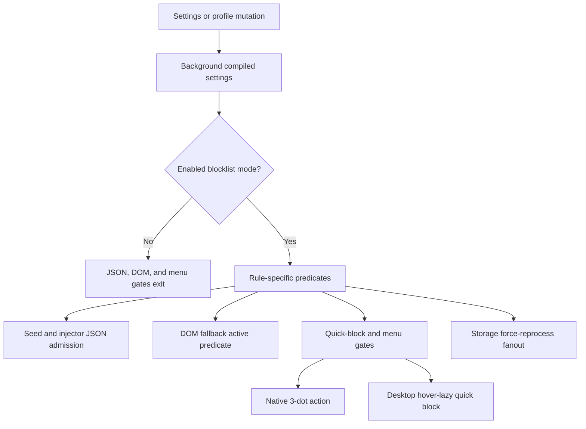

# FilterTube Active Rule Authority Audit - 2026-05-18

Status: current-behavior audit artifact. This is not an implementation patch.

Purpose: prove why empty installs, incomplete filter states, whitelist mode,
and UI affordance state can still wake expensive work or expose action surfaces.
The current product does not have one shared "active rule" authority. Instead,
several subsystems independently infer whether they should parse JSON, scan the
DOM, attach menus, show quick buttons, compile settings, or keep lifecycle work
alive.

## Current Authority Map

```text
profile/settings storage
        |
        v
background compiled settings
        |
        +--> seed JSON/XHR interception active checks
        +--> DOM fallback active checks
        +--> quick-block enabled check
        +--> normal 3-dot menu gate
        +--> fallback 3-dot scan lifecycle
        +--> settings cache invalidation

Current issue:
  each branch has a different predicate.
```

## Source Proof

| Surface | Current active predicate | Source proof | Risk |
| --- | --- | --- | --- |
| Seed JSON processing | Blocklist JSON work is admitted through `hasNetworkJsonWork`: disabled settings exit, whitelist admits JSON work, and blocklist mode requires raw content-filter flags or active JSON rules. Category now requires selected entries. | `js/seed.js:202-238`, `js/seed.js:253-260` | Duration and upload-date still use raw enabled flags, and endpoint-specific JSON ownership is not centralized. |
| DOM fallback | `listMode === "whitelist"` is always active; blocklist mode is active for block lists, boolean layout/content controls, raw duration/upload-date/uppercase content-filter flags, and category filters only when `selected` has entries. | `js/content/dom_fallback.js:1933-1995`, `js/content/dom_fallback.js:2075-2082` | Duration and upload-date still use raw enabled flags rather than one validated compiled predicate. |
| DOM fallback lifecycle | Content bridge asks `hasActiveDOMFallbackWork(currentSettings)` before fallback lifecycle work is treated as active. No-rule decisions are still owned by the fallback predicate instead of a shared compiled active report. | `js/content_bridge.js:6200-6209`, `js/content/dom_fallback.js:2075-2082` | Runtime surfaces can still drift because JSON, DOM, menu, and quick-block do not share one active-state authority. |
| Quick block | `isQuickBlockEnabled()` requires extension enabled, `showQuickBlockButton === true`, and non-whitelist mode before setup installs styles/listeners. Desktop quick-block is hover/viewport lazy; mobile/coarse remains eager. | `js/content/block_channel.js:1205-1222`, `js/content/block_channel.js:1291-1293`, `js/content/block_channel.js:1979-2028` | Quick-block is intentionally allowed as the first channel-rule entry point, so it is not the same predicate as active JSON/DOM filtering. |
| Normal 3-dot menu | The normal dropdown injection exits in whitelist mode and when `showBlockMenuItem === false`. | `js/content_bridge.js:10517-10498`, `js/content/block_channel.js:2913-2921` | This is the best current affordance gate and should be reused by all menu paths. |
| Fallback 3-dot menu | The fallback scan is now eager only on mobile/coarse surfaces; desktop is not an eager fallback scan path. | `js/content_bridge.js:6289-6303`, `js/content_bridge.js:7012-7022` | Mobile/coarse fallback action surfaces still need the same shared menu gate and live observer budget proof. |
| Settings compile | Background compilation passes through raw `contentFilters` and raw `categoryFilters` objects without producing a normalized active report. | `js/background.js:2498-2558` | Runtime surfaces must each reinterpret validity. |
| Settings invalidation | Background reads more compiler dependencies than storage invalidation watches; shared settings keys also omit several runtime dependencies. | `js/background.js:2059-1800`, `js/background.js:4484-4520`, `js/settings_shared.js:17-42` | A change can miss cache refresh or leave a stale runtime active state. |
| List-mode transition | `FilterTube_SetListMode` reads `copyBlocklist`, but switching to whitelist always merges and clears blocklist data. | `js/background.js:3304`, `js/background.js:3451-3453` | UI intent and actual mode transition can diverge. |
| V4 list aliases | Background now prefers canonical Main `keywords` and `channels` before the `blockedKeywords` / `blockedChannels` migration aliases, while shared save mirrors the aliases only for blocklist mode. | `js/background.js:2057-2066`, `js/background.js:2214-2224`, `js/settings_shared.js:918-927` | Alias drift can still recur if future writers bypass shared save or write only one side without a mutation/revision report. |

## Post-Release List-Mode And Alias Snapshot - 2026-05-27

This addendum records the current source state after the release-lag/blocklist
repair. It is audit-only. It does not approve list-mode transition changes,
whitelist behavior changes, alias cleanup, migration deletion, or simultaneous
allow/block semantics.

```text
background list-mode copy flag read tokens: 1
background list-mode copy flag behavior branches: 0
canonical Main keyword precedence rows: 1
canonical Main channel precedence rows: 1
shared save blocklist alias mirror rows: 2
rule mutation authority present: no
blocklist/whitelist behavior approval from this addendum: NO-GO
runtime behavior changed by this addendum: no
```

| Row | Source pins | Current behavior | Remaining risk |
| --- | --- | --- | --- |
| `list_mode_copy_flag_read` | `js/background.js:3304` | `FilterTube_SetListMode` still reads `request?.copyBlocklist === true`. | The flag has no behavior branch inside the background mode writer today. |
| `list_mode_whitelist_merge` | `js/background.js:3451-3453` | Switching to whitelist still calls `mergeAndClearBlocklistIntoWhitelist(requestedProfile)`. | `copyBlocklist:false` still needs a source-backed behavior fixture before transition semantics change. |
| `main_keyword_canonical_before_alias` | `js/background.js:2057-2066` | Main blocklist compilation reads `activeMain.keywords` before `activeMain.blockedKeywords`. | Future writers can reintroduce drift unless aliases have one mutation/revision authority. |
| `main_channel_canonical_before_alias` | `js/background.js:2214-2224` | Main blocklist compilation reads `activeMain.channels` before `activeMain.blockedChannels`. | Future channel writers can reintroduce drift unless aliases have one mutation/revision authority. |
| `shared_save_blocklist_alias_mirror` | `js/settings_shared.js:922-927` | Shared save writes canonical `channels` / `keywords`, then mirrors `blockedChannels` / `blockedKeywords` only when Main mode is blocklist. | Direct background/import/Nanah writers still need parity proof if they bypass shared save. |

## Active Blocklist Observer Budget Addendum - 2026-05-27

This addendum records the current active desktop blocklist budget after the
release-lag repair. It is audit-only. It does not approve additional runtime
optimization, rule semantics changes, fallback menu changes, or list-mode
transition changes.

```text
active desktop blocklist settings/profile update
        |
        +--> background compiles canonical Main keywords/channels
        +--> seed/injector admit JSON only when active JSON work exists
        +--> DOM fallback runs only when hasActiveDOMFallbackWork is true
        +--> quick-block installs only when the user-facing quick button is on
        +--> native 3-dot injection exits for whitelist/showBlockMenuItem=false
        +--> storage refresh preserves forceReprocess through coalescing

Current issue:
  these gates are materially tighter than before, but they are still separate
  predicates rather than one compiled rule/observer authority.
```



| Budget slice | Source pins | Current active blocklist behavior | Remaining risk |
| --- | --- | --- | --- |
| JSON transport admission | `js/seed.js:234-238`, `js/injector.js:185-188` | Blocklist JSON clone/parse/mutation work is admitted only when enabled settings have active content filters or active JSON filter rules. | Endpoint-specific JSON ownership is still spread between seed, injector, and engine paths. |
| DOM fallback active predicate | `js/content/dom_fallback.js:1933-1995`, `js/content/dom_fallback.js:2075-2082` | DOM fallback exits for disabled/no-work blocklist states; category now requires selected entries before page-level fallback is active. | Duration/upload-date predicates still use raw `enabled` flags rather than validated thresholds/dates. |
| Quick-block lifecycle gate | `js/content/block_channel.js:353-365`, `js/content/block_channel.js:1205-1222`, `js/content/block_channel.js:1291-1293`, `js/content/block_channel.js:1979-2028` | Quick-block setup is blocked unless enabled, visible in settings, and not whitelist; desktop is hover/viewport lazy while mobile/coarse can still sweep eagerly. | Quick-block intentionally permits first-rule creation, so it is not governed by active filter-rule presence. |
| Quick-block rule-context helper | `js/content/block_channel.js:1224-1285` | The helper mirrors the blocklist rule predicate family, including selected-category validation. | No active call site uses this helper as the shared lifecycle authority, so it can drift or become dead policy. |
| Native menu action gate | `js/content_bridge.js:10517-10498`, `js/content/block_channel.js:2913-2921` | Native 3-dot injection exits in whitelist mode and clears/exits when `showBlockMenuItem === false`. | Fallback/mobile menu paths still need one shared menu action gate. |
| Storage force-reprocess coalescing | `js/content/bridge_settings.js:1019-1049`, `js/content/bridge_settings.js:1051-1109` | A queued lightweight refresh no longer swallows a later forced rule reprocess. | Dirty-key fanout is still a list of local consumers, not one revisioned active-state report. |
| Main blocklist canonical compile | `js/background.js:2057-2066`, `js/background.js:2214-2224`, `js/settings_shared.js:922-927` | Main blocklist compile prefers canonical `keywords` and `channels`, while shared save mirrors migration aliases in blocklist mode. | Direct writers still need parity proof if they bypass shared save. |

```text
active blocklist observer budget proof slices: 7
active desktop blocklist source proof: PARTIAL
active blocklist observer budget authority: NO-GO
quick/menu shared active-state authority: NO-GO
active blocklist live trace authority: NO-GO
runtime behavior changed by this addendum: no
```

## Current Decision Drift

```text
Raw category enabled, selected = []

seed:
  inactive unless selected.length > 0

DOM fallback:
  inactive unless selected.length > 0

per-card category fetch:
  guarded by selected.length > 0

result:
  this category drift has been closed in current source, but duration and
  upload-date still need validated active predicates.
```

```text
showBlockMenuItem = false

normal dropdown:
  exits and clears injected menu state

mobile/coarse fallback menu scan:
  can still scan cards and append fallback buttons

result:
  desktop native menu is gated, but fallback/mobile menu paths still need one
  shared menu action gate.
```

```text
showQuickBlockButton = false or listMode = whitelist

quick-block action:
  isQuickBlockEnabled() returns false

quick-block lifecycle:
  setupQuickBlockObserver() returns before installing listeners/styles

result:
  the previous eager disabled/whitelist lifecycle drift has been closed on this
  path, but quick/menu/DOM/JSON still do not share one compiled authority.
```

## Required Future Contract

The implementation should introduce one compiled active-state report. Name is
not important, but the report must be computed once from profile, surface, and
settings before JSON, DOM, menu, and lifecycle surfaces decide work.

```text
compiledRuleState({
  profileType,
  surface,
  route,
  settings
})
  -> {
       filteringEnabled,
       listMode,
       hasBlockKeywords,
       hasBlockChannels,
       hasAllowKeywords,
       hasAllowChannels,
       hasCommentRules,
       hasShortsRules,
       hasValidDurationRule,
       hasValidUploadDateRule,
       hasValidCategoryRule,
       hasLayoutRules,
       shouldHarvestIdentity,
       canShowQuickBlock,
       canShowBlockMenu,
       needsDOMFallback,
       needsJSONMutation,
       needsEndpointParsing
     }
```

Minimum gate before implementation:

- Empty blocklist with no valid content/category/layout rules must be a real
  no-work state for JSON mutation, DOM fallback, quick-block lifecycle, and
  fallback menu scanning.
- Disabled mode must avoid YouTubei clone/parse/stringify unless a future
  explicit diagnostics mode asks for it.
- Category is active only when enabled and `selected.length > 0`.
- Upload-date is active only when it has a valid date predicate.
- Duration is active only when the selected condition has meaningful thresholds.
- Whitelist mode is active only as an explicit strict profile state; migration
  and import paths must not silently create empty whitelist enforcement.
- Normal menu and fallback menu must share the same action gate.
- Quick-block must not install global lifecycle work unless its action gate is
  active, or it must have a lifecycle registry proving no-op callback budget.
- Background, shared settings, content bridge, and StateManager must share one
  dependency-key list for active-state invalidation.

## Fixture Candidates

1. Empty blocklist install with quick-block/menu disabled: assert no JSON
   mutation, no DOM fallback scan, no fallback menu scan, and no quick-block
   sweep.
2. Category enabled with empty selected list: assert compiled state reports
   inactive category for JSON and DOM page-level work.
3. Upload-date enabled with blank dates: assert no metadata fetch scheduling.
4. Duration `longer` with zero threshold: assert inactive unless the UI
   explicitly stores a meaningful threshold.
5. `showBlockMenuItem=false`: assert both normal and fallback menus stay hidden.
6. Whitelist import with `copyBlocklist:false`: assert blocklist is preserved and
   not merged into whitelist.
7. Stale `blocked*` aliases plus empty canonical lists: assert canonical or
   migrated state has one winner before compile.
8. Active-to-empty transition: assert observers, timers, and caches either tear
   down or report bounded no-op behavior.

## Method Semantic Proof Gap Boundary

`docs/audit/FILTERTUBE_METHOD_SEMANTIC_PROOF_GAP_INDEX_CURRENT_BEHAVIOR_2026-05-25.md`
is a required source input before this active-rule authority surface can support
runtime optimization. Current proof pins:

```text
method semantic proof gap files covered: 69
method semantic proof gap lexical callables covered: 5797
files with complete per-callable semantic proof: 0
lexical callables requiring semantic proof before behavior changes: 5797
affected callable semantic proof: NO-GO
runtime behavior changed: no
```

These counts are audit-only blockers. They do not approve runtime
optimization, JSON-first behavior, active-rule predicate changes, list-mode
changes, whitelist behavior changes, or selector/renderer authority changes.
