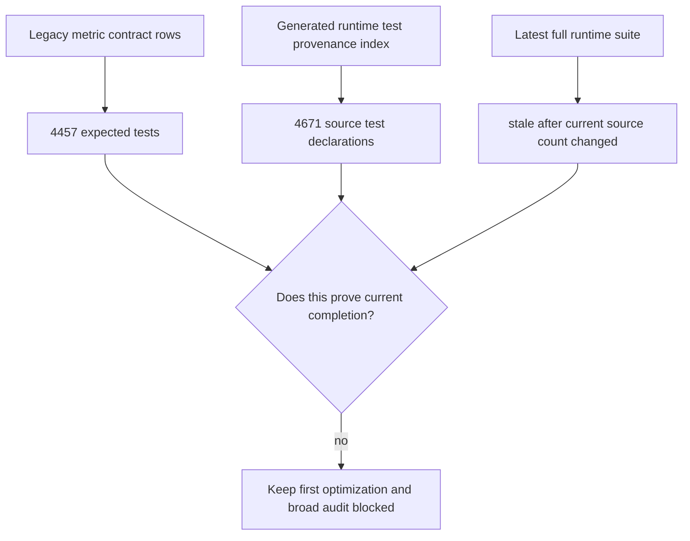
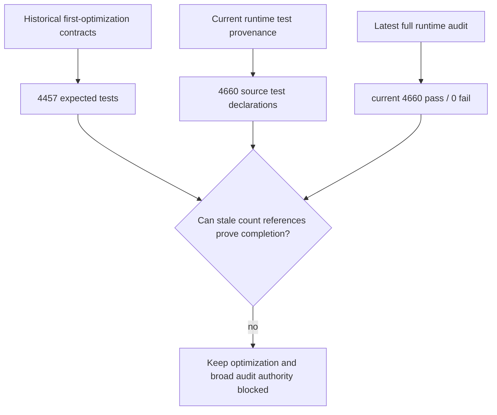
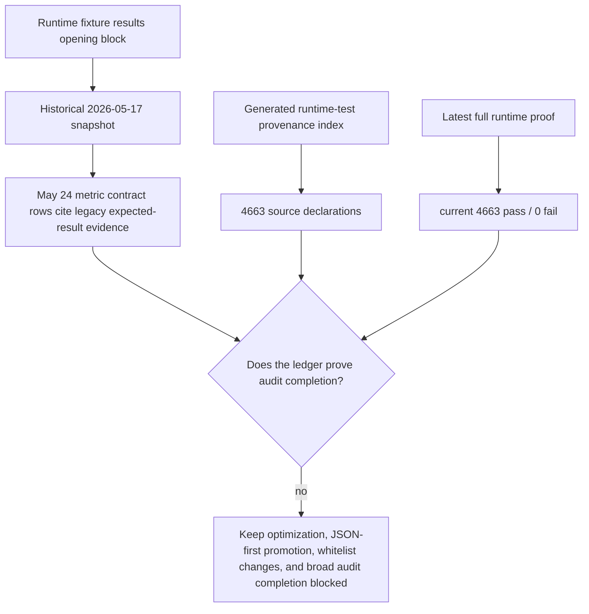
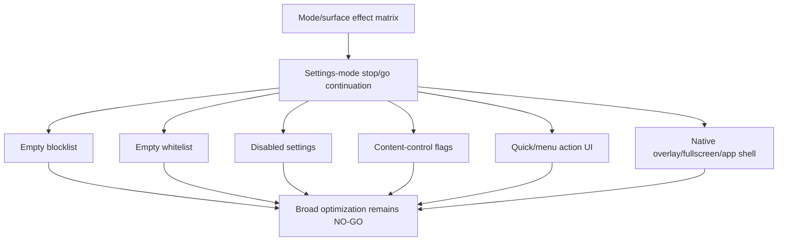
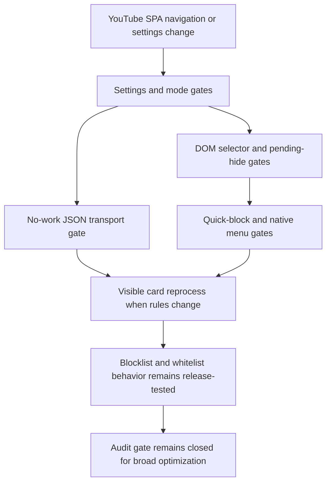
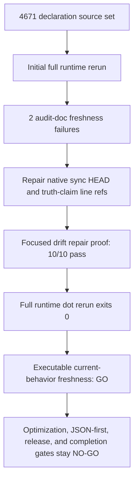

# FilterTube Audit Completion Gap Register - Current Behavior - 2026-05-20

Status: audit-only proof. This is not an implementation patch.

Runtime behavior is unchanged.

Completion is not proven. The active audit goal remains open. A green
`npm run audit:runtime` result proves that current-behavior claims are pinned;
it does not prove that every feature, file, method, JSON path, DOM selector,
lifecycle primitive, settings mode, or cross-feature interaction has complete
semantic coverage.

## Why This Register Exists

The broad audit objective is intentionally larger than any single current
behavior slice. The current docs now prove many high-risk boundaries, but they
do not give permission to optimize, delete, merge, or migrate runtime behavior
without feature-specific fixtures.

This register converts the objective into explicit completion gates.

```text
current-behavior audit pass
        |
        v
documented current behavior and known gaps
        |
        v
NOT implementation-ready by itself
        |
        v
feature-specific positive, negative, route, mode, side-effect, and restore proof
        |
        v
behavior patch may be considered
```

## Required Completion Gates

| Objective requirement | Current evidence | Evidence strength | Missing proof before completion | Gate |
| --- | --- | --- | --- | --- |
| Every feature | `docs/audit/FILTERTUBE_OBJECTIVE_COVERAGE_LEDGER_2026-05-18.md`; `docs/audit/FILTERTUBE_FEATURE_RISK_MATRIX_2026-05-17.md`; `docs/audit/FILTERTUBE_CROSS_FEATURE_AUTHORITY_MATRIX_2026-05-18.md`; P0 family docs/tests | Partial current-behavior proof | Positive and negative fixtures for each feature across blocklist, whitelist, disabled, empty, Main, Kids, YTM, watch, search, home, comments, playlists, posts, import/export, Nanah, profiles, PIN, and release surfaces | closed |
| Every file | `docs/audit/FILTERTUBE_TRACKED_FILE_AUDIT_COVERAGE_2026-05-18.md`; `docs/audit/FILTERTUBE_SOURCE_SURFACE_INVENTORY_2026-05-17.md`; `docs/audit/FILTERTUBE_SOURCE_BOUNDARY_AUDIT_2026-05-18.md`; `docs/audit/FILTERTUBE_ROOT_PLANNING_DOC_BOUNDARY_CURRENT_BEHAVIOR_2026-05-19.md`; `docs/audit/FILTERTUBE_AUDIT_DOC_LAYOUT_CURRENT_BEHAVIOR_2026-05-24.md` | Source inventory plus boundary proof | Behavior, release, quarantine, asset-budget, or audit-layout proof for every tracked path and explicit status for local draft artifacts | closed |
| Every method | `docs/audit/FILTERTUBE_ALL_CALLABLE_INDEX_2026-05-18.md`; `docs/audit/FILTERTUBE_FUNCTION_COVERAGE_2026-05-17.md`; callable-family audits | Lexical proof only | Owner, caller class, trigger, route/surface scope, settings/profile inputs, side effects, teardown/idempotence, and positive plus negative fixtures for each behavior-changing callable | closed |
| Every JSON path | `docs/json_paths_encyclopedia.md`; `docs/audit/FILTERTUBE_JSON_PATH_AUTHORITY_CURRENT_BEHAVIOR_2026-05-19.md`; `docs/audit/FILTERTUBE_RENDERER_AUTHORITY_GAP_AUDIT_2026-05-18.md`; `docs/audit/FILTERTUBE_P0_RENDERER_AUTHORITY_CURRENT_BEHAVIOR_2026-05-19.md` | Representative and gap-oriented proof | Every documented path classified as supported, nested-supported, metadata-only, unsupported gap, or quarantined with route, endpoint, identity-confidence, mutation effect, and sibling-visible fixtures | closed |
| Every DOM selector | `docs/audit/FILTERTUBE_DOM_SELECTOR_INSTANCE_REGISTER_2026-05-18.md`; `docs/youtube_renderer_inventory.md`; selector and DOM side-effect audits | Source-enumerated proof | Surface, route, action, target, owner, settings predicate, no-rule budget, escaping policy, exact hide target, restore owner, and negative sibling-visible fixtures for each selector family | closed |
| Every observer/listener/timer/frame/patch | `docs/audit/FILTERTUBE_LIFECYCLE_INSTANCE_REGISTER_2026-05-18.md`; `docs/audit/FILTERTUBE_REPO_LIFECYCLE_PRIMITIVE_COVERAGE_2026-05-18.md`; `docs/audit/FILTERTUBE_LIFECYCLE_OWNER_MATRIX_2026-05-18.md`; `docs/audit/FILTERTUBE_P0_LIFECYCLE_CURRENT_BEHAVIOR_2026-05-18.md`; `docs/audit/FILTERTUBE_PAGE_GLOBAL_PATCH_AUTHORITY_CURRENT_BEHAVIOR_2026-05-19.md` | Source-enumerated proof plus per-file primitive footprint | Install trigger, active predicate, disabled/no-rule cost, pause/resume behavior, teardown/disconnect/remove/clear/restore proof, and scheduled side effects for every lifecycle primitive | closed |
| Every settings mode | `docs/audit/FILTERTUBE_SETTINGS_MODE_COVERAGE_MATRIX_2026-05-18.md`; `docs/audit/FILTERTUBE_VISIBLE_EMPTY_RUNTIME_ACTIVE_CURRENT_BEHAVIOR_2026-05-19.md`; `docs/audit/FILTERTUBE_P0_SETTINGS_MUTATION_CURRENT_BEHAVIOR_2026-05-19.md` | Partial semantic proof | Profile type, viewing space, lock state, list mode, visible rows, legacy aliases, compiled payload, storage keys, UI/native sync, menu/quick gates, and mutation reports for all mode combinations | closed |
| Every cross-feature interaction | `docs/audit/FILTERTUBE_CROSS_FEATURE_AUTHORITY_MATRIX_2026-05-18.md`; mutation, storage, message, watch/player, hide/restore, and native-sync current-behavior docs | Partial interaction proof | End-to-end authority records for UI saves, background compile, seed JSON mutation, DOM fallback, quick/menu actions, learned identity, stats, import/export, Nanah, native sync, app surfaces, and release claims | closed |
| Reliability risks | `docs/audit/FILTERTUBE_IMPLEMENTATION_READINESS_GATE_2026-05-18.md`; `docs/audit/FILTERTUBE_STABILIZATION_FIX_ORDER_2026-05-19.md`; P0 current-behavior tests | Known-risk proof | Regression fixtures proving each future change preserves intended behavior on working Main, Kids, YTM, watch, search, comments, playlists, posts, profile, sync, import/export, and native paths | closed |
| False-hide risks | `docs/audit/FILTERTUBE_HIDE_DECISION_PIPELINE_CURRENT_BEHAVIOR_2026-05-19.md`; `docs/audit/FILTERTUBE_DOM_BROAD_HIDE_BOUNDARY_CURRENT_BEHAVIOR_2026-05-19.md`; `docs/audit/FILTERTUBE_P0_HIDE_RESTORE_CURRENT_BEHAVIOR_2026-05-19.md`; `docs/audit/FILTERTUBE_P0_SELECTOR_AUTHORITY_CURRENT_BEHAVIOR_2026-05-19.md` | High-risk proof | Non-matching content stays visible, sibling cards stay visible, restore removes the correct marker/writer state, stats do not count false hides as success, and whitelist pending hides fail safely | closed |
| Leak risks | `docs/audit/FILTERTUBE_P0_RENDERER_AUTHORITY_CURRENT_BEHAVIOR_2026-05-19.md`; `docs/audit/FILTERTUBE_WATCH_ENDSCREEN_AUTHORITY_CURRENT_BEHAVIOR_2026-05-19.md`; `docs/audit/FILTERTUBE_P0_CAPTURE_FIXTURE_TRACEABILITY_CURRENT_BEHAVIOR_2026-05-19.md` | Known renderer-gap proof | Capture-backed proof for end screens, compact autoplay, compact playlist, direct watch cards, comments, Shorts, Kids, YTM, posts, collaborator dialogs, and playlist/Mix ownership paths | closed |
| Performance risks | `docs/audit/FILTERTUBE_EMPTY_INSTALL_PERFORMANCE_AUDIT_2026-05-18.md`; `docs/audit/FILTERTUBE_EMPTY_INSTALL_IDLE_OBSERVER_BUDGET_CURRENT_BEHAVIOR_2026-05-26.md`; `docs/audit/FILTERTUBE_P0_NO_WORK_CURRENT_BEHAVIOR_2026-05-18.md`; `docs/audit/FILTERTUBE_XHR_NO_WORK_BOUNDARY_CURRENT_BEHAVIOR_2026-05-19.md`; `docs/audit/FILTERTUBE_ENGAGEMENT_BUDGET_CURRENT_BEHAVIOR_2026-05-19.md` | Current-cost proof | Counters for zero parse, zero clone, zero rewrite, zero scan, zero menu/quick sweep, zero unnecessary fetch, zero storage write, and zero observer work in disabled/empty/no-rule states | closed |
| Code-burden risks | `docs/audit/FILTERTUBE_CODE_BURDEN_DECLUTTER_BOUNDARY_CURRENT_BEHAVIOR_2026-05-19.md`; `docs/audit/FILTERTUBE_RAW_CAPTURE_RELEASE_BOUNDARY_CURRENT_BEHAVIOR_2026-05-19.md`; release/static/native docs | Cleanup boundary proof | Package/support/provenance cleanup separated from behavior-carrying paths; duplicate-looking runtime paths cannot be deleted until replacement authority and parity proof exist | closed |
| Implementation-change boundary | `docs/audit/FILTERTUBE_IMPLEMENTATION_READINESS_GATE_2026-05-18.md`; `docs/audit/FILTERTUBE_STABILIZATION_FIX_ORDER_2026-05-19.md`; this register | Gate proof | A concrete future patch must cite the matching feature family, route, mode, source confidence, side-effect counter, and negative fixture before behavior changes | closed |

## Recent Layout And Lifecycle Proof Addendum

Recent audit layout and lifecycle footprint proof adds stronger evidence to
the file and lifecycle rows without changing their completion status:

- `docs/audit/FILTERTUBE_AUDIT_DOC_LAYOUT_CURRENT_BEHAVIOR_2026-05-24.md`
  and `tests/runtime/audit-doc-layout-current-behavior.test.mjs` prove the
  current audit corpus placement boundary: 0 root-level `FILTERTUBE_*.md`
  files under plain `docs/`, 545 `docs/audit/FILTERTUBE_*.md` files,
  root-level FilterTube audit doc placement `NO-GO`, and new audit artifact
  placement under `docs/audit`.
- `docs/audit/FILTERTUBE_REPO_LIFECYCLE_PRIMITIVE_COVERAGE_2026-05-18.md`
  and `tests/runtime/repo-lifecycle-primitive-coverage-current-behavior.test.mjs`
  now pin 63 per-file primitive footprint rows from the tracked JS/JSX/MJS
  source boundary. This makes listener, observer, timer/frame,
  network/message, DOM side-effect, and total primitive burden first-class per
  file, while still requiring active-state, teardown, no-rule, route, mode, and
  side-effect proof before any lifecycle optimization.

These addenda keep the implementation gate closed. They prove better audit
organization and stronger current-source enumeration, not behavior safety or
optimization readiness.

## Method Semantic Proof Gap Addendum

The method/callable audit now has an explicit repo-wide semantic gap index:

- `docs/audit/FILTERTUBE_METHOD_SEMANTIC_PROOF_GAP_INDEX_CURRENT_BEHAVIOR_2026-05-25.md`
  records 63 tracked JS/JSX/MJS files, 5,473 lexical callables, 63 files with
  lexical accounting, 0 files with complete per-callable semantic proof, and
  5,473 lexical callables still requiring semantic proof before behavior
  changes.
- `tests/runtime/all-callable-index-current-behavior.test.mjs` proves that the
  gap index matches the current tracked source file list, callable counts,
  family totals, required semantic fields, and missing runtime authority
  symbols.
- The new gap index keeps optimization and first-class JSON filter promotion
  blocked until the affected methods have owner, trigger, settings/profile,
  route/surface, side-effect, active/no-rule/disabled, teardown/idempotence,
  and positive plus negative fixture proof.
- The 2026-05-27 DOM visual-writer continuation in the same gap index surfaces
  8 source-pinned `js/content/dom_helpers.js` rows for style injection,
  whitelist-pending stat conversion, new hide side effects, `skipStats` versus
  media playback coupling, restore side effects, container collapse, the
  container restore gap, and external global dependencies. This strengthens
  the false-hide/leak/performance method evidence while keeping visual
  hide/stats/media policy and container restore authority at `NO-GO`.
- The 2026-05-28 collaborator cache provenance continuation in the same gap
  index surfaces 6 source-pinned `js/content_bridge.js` rows for
  video-id-only collaborator cache validation, source/timestamp card stamping,
  by-video-id unstamped cache writes, normalization before fresh parser
  evidence, menu enrichment list-only map writes, and the Block All stale-delete
  no-op guard. This strengthens the method evidence behind the `Kully B &
  Gussy G - Topic` stale-state boundary while keeping collaborator cache
  provenance validation and stale-state invalidation at `NO-GO`.
- The 2026-05-28 native dropdown/menu lifecycle continuation in the same gap
  index surfaces 12 source-pinned `js/content_bridge.js` and
  `js/content/block_channel.js` rows for reusable native dropdown cleanup,
  native close-target resolution, injected menu row rendering, async menu-open
  waiting, page-lifetime menu listeners, dropdown visibility observers,
  deferred injection scheduling, explicit stale-marker repair, outside-pointer
  close ownership, short-lived body discovery, and reusable-node identity
  cleanup. This strengthens the proof around the comment/native 3-dot menu
  regression while keeping native dropdown lifecycle optimization and reusable
  menu state authority at `NO-GO`.
- The 2026-05-28 JSON active-work predicate continuation in the same gap index
  surfaces 12 source-pinned `js/seed.js`, `js/injector.js`,
  `js/content_bridge.js`, and `js/filter_logic.js` rows for strict
  content-filter admission, JSON rule branches, route/layout skip policy,
  seed fetch/XHR parse gates, injector queued replay, identity prefetch,
  MAIN-world runtime injection, and filter-engine harvest-before-mutate
  behavior. This ties the JSON-first first-class direction to concrete method
  rows while keeping shared JSON active-work authority, predicate merge
  optimization, and JSON-first runtime promotion at `NO-GO`.
- The 2026-05-28 rule/settings mutation persistence continuation in the same
  gap index surfaces 13 source-pinned `js/state_manager.js`,
  `js/settings_shared.js`, `js/background.js`, `js/content_bridge.js`, and
  `js/io_manager.js` rows for mode-inferred keyword/channel writes,
  dual-schema profile persistence, subscribed-channel import handoff,
  read-path V4 writes, shared save/root mirrors, list-mode transitions,
  whitelist and blocklist channel adds, content-script add payloads, the shared
  channel mutation helper, and import/restore mutation fanout. This protects
  blocklist, channel blocking, and whitelist behavior while keeping rule
  mutation persistence, blocklist/whitelist mutation authority, and
  cross-context settings refresh authority at `NO-GO`.
- The 2026-05-28 DOM fallback run/selector traversal continuation in the same
  gap index surfaces 12 source-pinned `js/content/dom_fallback.js` rows for
  active-work admission, stale marker cleanup, run-state serialization,
  no-work cleanup returns, `/feed/channels` cleanup, whitelist watch scaffold
  restore, main card selector scope, processed identity skip gates, channel
  identity selector waterfall, pending metadata timers, playlist selected-row
  safeguards, and pending rerun scheduling. This ties the YouTube lag and
  false-hide/leak risk to concrete method rows while keeping DOM fallback run
  admission optimization, selector traversal narrowing, and hide/restore
  behavior changes at `NO-GO`.
- The 2026-05-28 content-bridge runtime lifecycle continuation in the same gap
  index surfaces 13 source-pinned `js/content_bridge.js` rows for identity
  prefetch scan scheduling, IntersectionObserver card attachment, document
  visibility listeners, playlist panel scroll/mutation hooks, right-rail
  whitelist timers, runtime observer fanout, video metadata DOM rerun debounce,
  delayed DOM fallback startup, whitelist pending recheck and pending-hide
  timers, DOM fallback observer refresh, fallback menu scan lifecycle, and the
  page-lifetime message listener/startup timer. This ties SPA lag and whitelist
  pending behavior to concrete lifecycle rows while keeping content-bridge
  lifecycle pruning, observer/listener/timer cleanup, and prefetch/whitelist
  pending budget authority at `NO-GO`.
- The 2026-05-28 background compiled-cache/refresh continuation in the same gap
  index surfaces 14 source-pinned `js/background.js` rows for compiled-settings
  cache shape, learned channel/video/meta map cache patching, storage flush
  scheduling, cache-return gates, compile assignment, runtime
  `getCompiledSettings` delivery, list-mode transitions, whitelist import and
  transfer refreshes, `FilterTube_ApplySettings` recompile broadcasts, learned
  map message receivers, storage-change invalidation, and persistent channel
  mutation cache invalidation. This ties stale visible-card, SPA refresh, and
  post-whitelist cache risk to concrete background methods while keeping
  compiled-cache authority, refresh delivery optimization, and learned-map cache
  patching authority at `NO-GO`.
- The 2026-05-28 quick-block affordance lifecycle continuation in the same gap
  index surfaces 20 source-pinned `js/content/block_channel.js` rows for
  quick-block refresh admission, lazy observer startup, disabled/whitelist
  cleanup, desktop hover intent, Shorts surface detection, host and anchor
  resolution, bounded target lookup, first-rule mode gating, mobile-only eager
  sweeps, button cleanup, identity context building, fallback mutation ingress,
  optimistic hide writes, button wrap/listener insertion, coalesced sweep roots,
  page-lifetime listeners, dynamic pointermove recovery, and mobile-only
  mutation observation. This ties missing quick-cross, Shorts/Home placement, and
  no-work desktop lag risk to concrete methods while keeping quick-block
  availability optimization, selector/anchor rewrites, and mutation/optimistic
  hide behavior changes at `NO-GO`.
- The 2026-05-29 quick-block lifecycle report contract continuation in
  `docs/audit/FILTERTUBE_QUICK_BLOCK_HOVER_LIFECYCLE_TIMER_BOUNDARY_CURRENT_BEHAVIOR_2026-05-23.md`
  turns the hover-lazy quick-cross lifecycle into 12 required report rows and
  20 required fields before any future quick-block optimization. It pins route,
  surface, list-mode, device, active-rule, first-rule affordance, overlay,
  surface-cache, viewport-host, hover-intent, pointer-recovery, sweep,
  observer, button DOM, fallback action, optimistic-hide, DOM fallback rerun,
  negative no-work, and metric artifact proof requirements while keeping
  implementation-ready rows and runtime approvals at 0.
- The 2026-05-31 Home/Shorts quick-cross placement preflight in
  `docs/audit/FILTERTUBE_QUICK_BLOCK_HOVER_LIFECYCLE_TIMER_BOUNDARY_CURRENT_BEHAVIOR_2026-05-23.md`
  narrows the missing quick-cross concern to 6 source-pinned placement rows:
  nested Shorts target detection, outer-host promotion, renderable anchor
  selection, desktop hover-lazy placement, mobile/coarse force-visible
  placement, and release gating. It records that desktop Home/Shorts quick-cross
  display is hover/focus/pointer-recovery behavior today, not an always-visible
  startup guarantee, while live installed Home/Shorts placement proof and
  placement behavior-change approval remain `NO-GO`.
- The 2026-05-29 fallback menu action report contract continuation in
  `docs/audit/FILTERTUBE_FALLBACK_MENU_ACTION_GATE_CURRENT_BEHAVIOR_2026-05-19.md`
  turns the fallback scanner, popover, and `performBlock()` gap into 12 required
  report rows and 20 required fields. It pins primary-gate parity, scanner
  admission, button/popover ownership, target identity, mutation destination,
  optimistic hide, forced refilter, failure rollback, cross-feature parity,
  fixture packet, and metric artifact proof requirements while keeping fallback
  menu behavior-change approval at `NO-GO`.

This strengthens the `Every method` row from a vague lexical boundary into an
explicit non-completion ledger. It does not certify that method coverage is
complete, and it does not authorize any behavior patch.

2026-05-30 method semantic convergence continuation:
`docs/audit/FILTERTUBE_METHOD_SEMANTIC_PROOF_GAP_INDEX_CURRENT_BEHAVIOR_2026-05-25.md`,
`docs/audit/FILTERTUBE_IMPLEMENTATION_READINESS_GATE_2026-05-18.md`, and
`tests/runtime/all-callable-index-current-behavior.test.mjs` now pin a
method/callable convergence boundary for the broad "every method" objective.
The continuation records 10 method semantic convergence rows across repo
census, zero complete files, family weight, hot runtime dominance, selected
triage-not-closure, required field gate, parser visibility debt,
affected-callable packet gap, JSON-first blocker, and authority absence. It
keeps 0 implementation-ready method semantic convergence rows, 149 selected
semantic triage rows, 4 rejected closure candidates, 0 affected-callable
semantic approvals, source-derived ASCII and Mermaid diagrams, and product
source absence for `methodSemanticCoverageComplete`,
`callableBehaviorProofReady`, `behaviorPatchMayProceed`,
`methodSemanticAuthority`, `callableEffectReport`, `callableNoWorkBudget`, and
`callableTeardownRegistry`. Method deletion, method merging,
affected-callable closure, whitelist/cache method optimization, JSON-first
method promotion, release/public-claim use, and broad audit completion remain
`NO-GO`. Runtime behavior changed by this continuation: no.

## Engagement Side-Effect Token Snapshot Addendum - 2026-05-27

`docs/audit/FILTERTUBE_ENGAGEMENT_BUDGET_CURRENT_BEHAVIOR_2026-05-19.md`
now carries a current-source observable side-effect token snapshot for the hot
passive/runtime files. The snapshot pins 4 active `await fetch(` tokens, 8
synthetic `.click(` tokens, 7 media pause/stop tokens, 10 `dispatchEvent(`
tokens, 3 keyboard-event constructor tokens, 1 mouse-event constructor token,
and 4 `window.scrollTo(` tokens across `js/content_bridge.js`,
`js/content/dom_fallback.js`, `js/content/dom_helpers.js`,
`js/content/block_channel.js`, `js/injector.js`, and `js/seed.js`.

This directly supports the user-review risk that passive filtering might look
like engagement to YouTube. It does not prove YouTube ranking behavior, and it
does not approve removing playlist skip, watch owner block, direct identity
fallback, menu-close dispatch, or subscription import behavior. Those changes
remain blocked until side-effect budgets have owner, route, rule, user-action,
dedupe, and max-per-navigation proof.

2026-05-30 store-feedback engagement/end-screen linkage:
`docs/audit/FILTERTUBE_ENGAGEMENT_BUDGET_CURRENT_BEHAVIOR_2026-05-19.md`
and
`docs/audit/FILTERTUBE_WATCH_ENDSCREEN_AUTHORITY_CURRENT_BEHAVIOR_2026-05-19.md`
now explicitly join the Mozilla review risks: blocked topics may worsen
recommendations, and blocked videos can leak into the end-screen video wall.
This is not a YouTube ranking proof. It is a source-backed completion blocker:
direct `endScreenVideoRenderer` JSON rows are supported, but compact/autoplay
renderers and player DOM wall/card overlays remain under-proven; observable
fetch/click/scroll/pause/stop paths still lack shared owner, route, rule,
user-action, dedupe, and max-per-navigation budgets. End-screen behavior
changes, engagement-side-effect pruning, JSON-first promotion, whitelist
optimization, release/public-claim use, and broad-audit completion remain
`NO-GO`; runtime behavior changed by this continuation: no.

2026-05-31 store-feedback readiness gate linkage:
`docs/audit/FILTERTUBE_IMPLEMENTATION_READINESS_GATE_2026-05-18.md` now pulls
the same user/store feedback risk into the global implementation gate. The gate
links `docs/audit/FILTERTUBE_ENGAGEMENT_BUDGET_CURRENT_BEHAVIOR_2026-05-19.md`,
`docs/audit/FILTERTUBE_WATCH_ENDSCREEN_AUTHORITY_CURRENT_BEHAVIOR_2026-05-19.md`,
`docs/audit/FILTERTUBE_DIRECT_WATCH_CARD_AUTHORITY_CURRENT_BEHAVIOR_2026-05-19.md`,
and
`docs/audit/FILTERTUBE_COMPACT_AUTOPLAY_AUTHORITY_CURRENT_BEHAVIOR_2026-05-19.md`.
This keeps the distinction explicit: direct and nested
`endScreenVideoRenderer` JSON rows are source-supported, but
`compactAutoplayRenderer`, endpoint-only `autoplayVideo`/`nextButtonVideo`/
`previousButtonVideo`, direct watch-card child rows, player DOM wall/card
overlays, direct identity fetches, synthetic playlist/player clicks, media
pause/stop paths, and recommendation-observable side effects still lack one
shared authority. End-screen behavior changes, recommendation side-effect
pruning, JSON-first promotion, whitelist/cache optimization, DOM fallback
pruning, release/public-claim use, and broad-audit completion remain `NO-GO`;
runtime behavior changed by this linkage: no.

2026-05-30 watch recommendation renderer topology continuation:
`docs/audit/FILTERTUBE_DIRECT_WATCH_CARD_AUTHORITY_CURRENT_BEHAVIOR_2026-05-19.md`
and
`docs/audit/FILTERTUBE_COMPACT_AUTOPLAY_AUTHORITY_CURRENT_BEHAVIOR_2026-05-19.md`
now link the direct watch-card, compact autoplay, lockup, and end-screen
recommendation paths into one audit-only topology. The source-backed split is:
`compactVideoRenderer`, `watchCardCompactVideoRenderer`,
`endScreenVideoRenderer`, `lockupViewModel`, and the
`universalWatchCardRenderer` title/channel wrapper have explicit runtime rule
ownership, while direct `watchCardRichHeaderRenderer`, direct
`watchCardHeroVideoRenderer`, direct `watchCardRHPanelVideoRenderer`,
`compactAutoplayRenderer`, and the real universal hero
`navigationEndpoint.watchEndpoint.videoId` path remain unsupported or
under-proven. Category and content-control renderer allowlists repeat the same
split. This blocks page-level "watch recommendation" confidence: JSON-first
promotion, whitelist optimization, DOM fallback pruning, recommendation
side-effect pruning, release/public-claim use, and broad-audit completion
remain `NO-GO` until `watchRecommendationRendererAuthority` proves renderer
family, direct-versus-wrapper source, route, endpoint, identity confidence,
video-id path policy, blocklist result, whitelist result, sibling visibility,
side-effect budget, and no-rule work budget. Runtime behavior changed by this
continuation: no.

## Passive YouTubei Transport Token Snapshot Addendum - 2026-05-27

`docs/audit/FILTERTUBE_NETWORK_FETCH_XHR_CALLSITE_REGISTER_CURRENT_BEHAVIOR_2026-05-22.md`
now carries a passive YouTubei transport token snapshot for the seed
fetch/XHR wrappers that ride on page traffic. The snapshot pins 5 watched
YouTubei endpoint names in both the fetch and XHR endpoint arrays, 6 fetch
wrapper token rows, and 11 XHR wrapper token rows.

This supports the release-lag finding that YouTube could feel slow even when
FilterTube was not issuing explicit product `fetch(...)` requests. It also
keeps the passive transport approval at `NO-GO`: future optimization must
preserve the no-work bypass before `response.clone().json()`, before XHR
`JSON.parse`, and before queued initial-data replay, while retaining listener
add/remove symmetry and response override behavior.

## YouTubei Endpoint Admission Owner Flow Addendum - 2026-05-27

`docs/audit/FILTERTUBE_NETWORK_FETCH_XHR_CALLSITE_REGISTER_CURRENT_BEHAVIOR_2026-05-22.md`
now also carries a YouTubei endpoint admission owner-flow addendum with ASCII
and Mermaid diagrams. It pins fetch endpoint ownership, XHR endpoint
ownership, fetch URL/dataName classification, XHR open/send marking, shared
active-work predicates, fetch response rebuild behavior, XHR parse/override
behavior, and seed/injector replay cleanup as one page-traffic admission
chain.

This documents exactly how the release-lag mitigation is supposed to stay
cheap: endpoint arrays admit only known YouTubei families, then the active-work
gate must run before fetch clone/parse, before XHR parse/override, and before
queued replay. YouTubei endpoint admission source proof is `PARTIAL`, while
endpoint policy promotion, JSON-first endpoint ownership, response mutation
rewrites, and XHR patch simplification remain at `NO-GO` until one endpoint
decision report carries route, surface, settings revision, list mode, body
work, mutation effect, no-work proof, and negative sibling-visible proof.

## Storage Cache Write-Pressure Addendum - 2026-05-27

`docs/audit/FILTERTUBE_STORAGE_ACCESS_CALLSITE_REGISTER_CURRENT_BEHAVIOR_2026-05-21.md`
now carries a storage/cache write-pressure snapshot for the lag and stale-cache
audit. The snapshot pins 40 write-capable storage rows, 33 direct
`local.set` rows, 7 wrapper `writeStorage` rows, 3 storage-change listener
rows, and 8 map/cache write labels spanning background, content bridge, and
IO/Nanah owners.

This strengthens the storage/cache portion of the audit without approving a
storage optimization. Cache invalidation, map-only refresh behavior, dashboard
reload, import/export writes, Nanah writes, settings/profile revision policy,
and storage listener lists remain blocked until a shared storage key authority
and write revision contract exist.

## Storage Payload Shape and Owner Layer Addendum - 2026-05-27

`docs/audit/FILTERTUBE_STORAGE_ACCESS_CALLSITE_REGISTER_CURRENT_BEHAVIOR_2026-05-21.md`
now also carries a source-derived payload-shape and owner-layer addendum. The
same 84 storage access rows are classified into 41 reads, 40 writes, and 3
listeners. The write rows split into 17 inline object writes, 15 named payload
writes, and 8 inline computed-key writes. Owner-layer counts are also pinned:
background has 27 read, 24 write, and 1 listener row; content runtime has 5
read, 2 write, and 1 listener row; IO/import-export has 5 read and 8 write
rows; UI/settings has 4 read, 6 write, and 1 listener row.

This strengthens the storage/cache, settings-mode, false-hide/leak,
performance, and code-burden portions of the audit without approving storage
schema cleanup. Storage payload/layer authority remains `NO-GO` because
named-payload and computed-key writes still need row-level key manifests,
target-profile/list-mode reports, revision policy, listener no-op decisions,
and negative fixtures before storage behavior can be simplified.

## List-Mode And Alias Current-Source Addendum - 2026-05-27

`docs/audit/FILTERTUBE_ACTIVE_RULE_AUTHORITY_AUDIT_2026-05-18.md` now carries a
post-release list-mode and alias snapshot. It pins the current source behavior
that Main blocklist compilation reads canonical `keywords` and `channels`
before the `blockedKeywords` / `blockedChannels` migration aliases, while
shared save mirrors the aliases only in blocklist mode.

The same snapshot also records that `FilterTube_SetListMode` reads
`copyBlocklist`, but has 0 background behavior branches for that flag before
the whitelist merge/clear path. This keeps whitelist transition changes,
alias cleanup, and simultaneous allow/block semantics blocked until there is a
rule mutation authority and transition fixture proof.

## Page-Message Learned Identity Trust Addendum - 2026-05-27

`docs/audit/FILTERTUBE_PAGE_MESSAGE_TRUST_AUDIT_2026-05-18.md` now carries a
same-window state-changing message snapshot. It pins 12 accepted
`content_bridge.js` `FilterTube_*` message rows, 8 state-changing rows without
required pending request ownership, 3 pending request maps, 1 injector
string-source listener, 1 subscription string-source listener, and 1 wildcard
collaborator dialog broadcaster.

This strengthens false-hide/leak coverage for learned identity and collaborator
state without approving message trust changes. Map writes, collaborator
application, settings refresh, DOM reruns, nonce insertion, and JSON-first
promotion remain blocked until per-message sender, request ownership, route,
side-effect, stale/replay, and negative spoof fixtures exist.

## Message Sender/Receiver and Owner Layer Addendum - 2026-05-27

`docs/audit/FILTERTUBE_MESSAGE_TRANSPORT_CALLSITE_REGISTER_CURRENT_BEHAVIOR_2026-05-22.md`
now carries a source-derived sender/receiver and owner-layer addendum for the
same 64 message transport rows. It classifies 56 sender rows and 8 receiver
rows, with 31 extension-runtime transport rows, 30 page-message rows, and 3
tab-message rows. Owner-layer counts are pinned as 32 isolated content-runtime
rows, 19 main-world page-runtime rows, 10 extension UI/state rows, and 3
background rows.

This strengthens message trust, cross-feature interaction, settings-mode,
learned-identity, false-hide/leak, performance, and code-burden coverage
without approving message behavior changes. Message sender/receiver authority
remains `NO-GO` because broad receivers still need row-level sender class,
route/profile/list-mode, pending request or nonce, side-effect, teardown, and
negative-spoof proof before transport behavior can be simplified.

## Hide/Stats Side-Effect Current-Source Addendum - 2026-05-27

`docs/audit/FILTERTUBE_STATS_TIME_SAVED_AUTHORITY_AUDIT_2026-05-18.md` now
carries a current-source hide/stats side-effect snapshot with both ASCII and
Mermaid flow diagrams. It pins the shared `toggleVisibility()` side-effect
shape, whitelist pending direct hide, content stats increment/restore, surface
stats storage, media playback side effects, current watch owner block, and the
legacy background `recordTimeSaved` writer.

This strengthens false-hide/leak and misleading-stats coverage without
approving behavior changes. Hide/stats side-effect policy, media side-effect
budget, and background time-saved mutation authority all remain at `NO-GO`
until each hide writer has route, owner, rule/mode, stats, media, restore,
dedupe, max-per-navigation, and negative fixture proof.

## Import Export Nanah Ingress Addendum - 2026-05-27

`docs/audit/FILTERTUBE_IMPORT_EXPORT_NANAH_AUTHORITY_AUDIT_2026-05-18.md` now
carries a current-source external settings ingress snapshot with ASCII and
Mermaid flow diagrams. It pins plain import, encrypted import, trusted Nanah
state export/restore, scoped Nanah apply, Nanah envelope parsing, background
cache convergence, and StateManager external reload as one cross-feature
mutation boundary.

This strengthens the import/export/Nanah portion of the broad audit without
approving schema migration or optimization. External settings ingress mutation
authority, Nanah apply promotion authority, and dual allow/block migration
through import/sync remain at `NO-GO` until import, encrypted import, Nanah,
backup, dashboard reload, and background compile paths share one dry-run
mutation report, typed option contract, sanitizer, per-write status, runtime
revision, and negative fixture proof.

## Native Runtime Release Handoff Addendum - 2026-05-27

`docs/audit/FILTERTUBE_NATIVE_RUNTIME_SYNC_AUTHORITY_AUDIT_2026-05-18.md` now
carries a current-source native release handoff snapshot with ASCII and Mermaid
flow diagrams. It pins the public wrapper script, package entrypoint, app sync
script, direct manifest copies, generated app assets, native release notes, and
Android/iOS build boundary as one native parity gate.

This strengthens native sync/app-surface coverage without approving release or
runtime changes. Native release handoff, generated runtime source authority,
and iOS release sync gate all remain at `NO-GO` until the native path has a
machine-readable sync report, destination-kind metadata, generated-output hash
report, release-note parity/divergence record, Android/iOS gate parity, and
negative stale-app fixtures.

## Profile PIN Mutation Gate Addendum - 2026-05-27

`docs/audit/FILTERTUBE_SECURITY_PIN_LOCK_AUTHORITY_AUDIT_2026-05-18.md` now
carries a current-source profile/PIN mutation gate snapshot with ASCII and
Mermaid flow diagrams. It pins dashboard session unlock state, PIN verifier
lookup, profile unlock prompts, child/admin UI capability gates, account policy
writes, account and child creation, Master PIN mutation, managed child surface
writes, import/export UI auth, import/export writer auth, and Nanah send/apply
auth as one settings-mode and cross-feature mutation boundary.

This strengthens profile/security coverage without approving behavior changes.
Profile/PIN mutation authority, managed child mutation authority, and
import/Nanah trust restoration authority remain at `NO-GO` until profile,
settings, import/export, Nanah, background message, and managed-child editor
paths share one dry-run mutation authority with explicit target profile,
required unlock class, sender/actor class, storage revision, and negative
fixtures for locked, child, stale-profile, wrong-target, spoofed-sender,
trusted-link, and replay cases.

## Security Manager Caller Boundary Addendum - 2026-05-27

`docs/audit/FILTERTUBE_SECURITY_MANAGER_METHOD_SEMANTIC_REGISTER_2026-05-21.md`
now carries a caller-boundary snapshot with ASCII and Mermaid flow diagrams. It
pins the pure `FilterTubeSecurity` helper surface against popup unlock,
dashboard unlock, background session cache, IO PIN checks, IO encrypted
export/import, background encrypted auto-backup, and dashboard encrypted import
decrypt call sites.

This strengthens method/callable, profile/PIN, encrypted backup, import/export,
Nanah, and cross-feature authority coverage without approving behavior changes.
Security manager caller mutation authority, encrypted payload caller authority,
and profile unlock authority remain at `NO-GO` until every behavior-changing
caller has a target-profile mutation plan, unlock-class decision, sender/actor
class, storage revision, rollback/reporting path, and negative fixtures for
wrong PIN, wrong password, malformed payload, stale profile, wrong target, and
unauthorized sender.

## Runtime Fixture Index Completeness Addendum

The runtime fixture results ledger now records its own index-completeness gap,
and a generated companion index provides complete file-level enumeration:

- `docs/audit/FILTERTUBE_RUNTIME_FIXTURE_RESULTS_2026-05-17.md` reports 527
  top-level `tests/runtime/*.test.mjs` files, 528 exact backticked test-path
  entries in that ledger, and 0 top-level runtime test files without exact
  backticked entries there.
- `docs/audit/FILTERTUBE_RUNTIME_TEST_FILE_PROVENANCE_INDEX_CURRENT_BEHAVIOR_2026-05-25.md`
  provides 528 runtime test file rows, 4671 source top-level test declarations,
  527 `yes` rows for exact runtime-results entries, and 0 `no` rows for
  files missing exact runtime-results entries.
- `tests/runtime/audit-completion-gap-register-current-behavior.test.mjs`
  computes those counts from the current worktree and proves the ledger, the
  generated index, and this register agree.
- The generated index now has no missing exact runtime-results rows:
  0 of 528 rows remain `no`, and the missing family priority table records
  `None remaining` 0. This closes the runtime fixture ledger file-level provenance gap before optimization work.
- The generated index keeps exact-row-complete prefix-family snapshots for
  `tests/runtime/json*.test.mjs` files,
  `tests/runtime/content*.test.mjs` files,
  `tests/runtime/background*.test.mjs` files,
  `tests/runtime/website*.test.mjs` files,
  `tests/runtime/seed*.test.mjs` files,
  `tests/runtime/dom*.test.mjs` files,
  `tests/runtime/filter*.test.mjs` files,
  `tests/runtime/identity*.test.mjs` files,
  `tests/runtime/settings*.test.mjs` files,
  `tests/runtime/bridge*.test.mjs` files,
  `tests/runtime/extension*.test.mjs` files,
  `tests/runtime/learned*.test.mjs` files,
  `tests/runtime/nanah*.test.mjs` files,
  `tests/runtime/native*.test.mjs` files,
  `tests/runtime/quick*.test.mjs` files,
  `tests/runtime/source*.test.mjs` files,
  `tests/runtime/state*.test.mjs` files,
  `tests/runtime/ui*.test.mjs` files,
  `tests/runtime/backup*.test.mjs` files,
  `tests/runtime/build*.test.mjs` files,
  `tests/runtime/collab*.test.mjs` files,
  `tests/runtime/compiled*.test.mjs` files,
  `tests/runtime/generated*.test.mjs` files,
  `tests/runtime/ignored*.test.mjs` files,
  `tests/runtime/injector*.test.mjs` files,
  `tests/runtime/legacy*.test.mjs` files,
  `tests/runtime/main*.test.mjs` files,
  `tests/runtime/p0*.test.mjs` files,
  `tests/runtime/popup*.test.mjs` files,
  `tests/runtime/prompt*.test.mjs` files,
  `tests/runtime/release*.test.mjs` files,
  `tests/runtime/root*.test.mjs` files,
  `tests/runtime/security*.test.mjs` files,
  `tests/runtime/static*.test.mjs` files,
  `tests/runtime/storage*.test.mjs` files,
  `tests/runtime/tab*.test.mjs` files,
  `tests/runtime/tracked*.test.mjs` files,
  `tests/runtime/video*.test.mjs` files,
  `tests/runtime/watch*.test.mjs` files,
  `tests/runtime/active*.test.mjs` files,
  `tests/runtime/add*.test.mjs` file,
  `tests/runtime/alias*.test.mjs` file,
  `tests/runtime/batch*.test.mjs` file,
  `tests/runtime/block*.test.mjs` file, and
  `tests/runtime/browser*.test.mjs` file.
- JSON-first provenance is now exact-row complete at file level in the
  narrative ledger. Content-runtime bridge and control provenance is now
  exact-row complete at file level as well. Every prefix-family snapshot and
  the remaining tail snapshot reports 0 missing exact runtime-results rows.

This keeps the audit honest: a green `npm run audit:runtime` result is passing
assertion proof, the runtime fixture results ledger is a narrative ledger, and
the generated provenance index plus narrative ledger are complete file-level
runtime-test provenance only. None of those is complete semantic coverage evidence
for JSON-first filtering, whitelist optimization, or any implementation patch.

## Runtime Count Reconciliation Authority Addendum - 2026-05-27

The first-optimization metric foundation gate now has a separate runtime-count
reconciliation blocker. This top-level completion register treats that blocker
as central audit evidence: old metric contract rows that still say `4457`
cannot prove current full-suite coverage after the runtime test index moved to
`4671` source top-level declarations.

```text
legacy first-optimization metric contract count
        |
        v
expected runtime audit tests: 4457
        |
        v
current runtime test provenance index
        |
        v
source top-level test declarations counted: 4671
        |
        v
latest full runtime evidence: stale after current source count changed
        |
        v
count-reconciled optimization readiness: NO-GO
```



| Reconciliation evidence | Artifact | Current count | Completion effect |
| --- | --- | --- | --- |
| Legacy first-optimization metric contract rows | `docs/audit/FILTERTUBE_FIRST_OPTIMIZATION_METRIC_FOUNDATION_CONTRACT_COVERAGE_GATE_CURRENT_BEHAVIOR_2026-05-24.md` | `4457` expected tests and `4457` expected pass. | Historical snapshot only; not current full-suite proof. |
| Generated runtime test provenance | `docs/audit/FILTERTUBE_RUNTIME_TEST_FILE_PROVENANCE_INDEX_CURRENT_BEHAVIOR_2026-05-25.md` | `4671` source top-level test declarations. | Current file-level runtime-test declaration count. |
| Latest full runtime evidence | `node --test --test-reporter=tap tests/runtime/*.test.mjs`; recorded in `docs/audit/FILTERTUBE_RELEASE_REGRESSION_LAG_AND_BLOCKLIST_FIX_2026-05-26.md` | Current `4663/4663` pass, `0` fail, `83.213s`. | Latest full-suite assertion proof after the 3 lifecycle-convergence proof tests were added; it predates the 4 later content-filter convergence proof declarations. |
| Completion decision | This register. | Count reconciliation status: `BLOCKED`. | No first-optimization, JSON-first promotion, whitelist optimization, or broad audit completion approval. |

Current count reconciliation boundary:

```text
count-reconciliation proof slices: 3
legacy metric contract expected tests: 4457
current generated runtime test declarations: 4671
latest full runtime pass count observed: 4663
latest full runtime pass freshness: 2026-05-30 full runtime rerun covers 4663 generated declarations before 4 later audit-only content-filter declarations
first-optimization count reconciliation status: BLOCKED
full codebase audit completion from count reconciliation: NO-GO
runtime behavior changed by this addendum: no
```

2026-05-30 lifecycle convergence proof-test drift:

```text
current source top-level test declarations counted: 4663
current runtime source declaration phrase: 4663 source top-level test declarations
new declarations since previous full runtime proof: 3
fresh full runtime proof after lifecycle convergence additions: 4663/4663 pass, 0 fail, 83.213s
count reconciliation status after lifecycle convergence additions: CURRENT-FULL-PROOF-REFRESHED
broad audit completion from lifecycle convergence count drift: NO-GO
```

The three added declarations are audit-only proof tests for the runtime
lifecycle convergence boundary. The full runtime suite has now been rerun at
the new source count; the remaining blocker is the broader legacy `4457`
contract reconciliation, not full-suite freshness. This does not change runtime
behavior and does not approve optimization or goal completion.

## Runtime Count Drift Census Addendum - 2026-05-27

The count reconciliation blocker is not isolated to one row. A current
audit-surface census of `docs/audit/**/*.md` and `tests/runtime/**/*.mjs`
excluding this register and its verifier found the following footprint:

```text
census scope: docs/audit markdown plus tests/runtime modules
census exclusions: this gap register and its verifier
census files scanned: 1075
legacy runtime-count token 4457 occurrences: 1230
legacy runtime-count token 4457 files: 167
current runtime-count token 4660 occurrences: 11
current runtime-count token 4660 files: 4
runtime count drift census status: BLOCKED
```



Interpretation:

| Census item | Current value | Completion effect |
| --- | ---: | --- |
| Files scanned outside this self-referential register/verifier | 1075 | Wide enough to quantify audit-surface drift without self-counting this addendum. |
| Legacy `4457` occurrences | 1230 | The stale expected-test count is broad historical contract wording, not current completion proof. |
| Files containing legacy `4457` | 167 | Future count reconciliation is a multi-document audit cleanup, not a single-row fix. |
| Current `4660` occurrences | 11 | Recalculated after the fresh 2026-05-30 full runtime rerun matched the current generated declaration count. |
| Files containing current `4660` | 4 | Recalculated after the fresh 2026-05-30 full runtime rerun matched the current generated declaration count. |

This census intentionally does not rewrite historical first-optimization
contract rows. It records the burden before any optimization or JSON-first
promotion relies on those rows. Count drift remains a blocking audit burden
until the metric-foundation, route/surface, runtime-results, objective-ledger,
and active-goal ledgers are either reconciled to one current count model or
explicitly converted into dated historical snapshots with no completion
authority.

```text
runtime count drift census authority: PARTIAL
runtime count reconciliation approval: NO-GO
first optimization implementation approval from count rows: NO-GO
runtime behavior changed by this census: no
```

## Runtime Fixture Results Historical Snapshot Addendum - 2026-05-28

`docs/audit/FILTERTUBE_RUNTIME_FIXTURE_RESULTS_2026-05-17.md` now labels its
opening TAP block as a historical 2026-05-17 ledger snapshot instead of current
release proof. That ledger still records the old `4457` expected-test result
because many May 24 first-optimization contract rows cite it as historical
evidence. The current runnable source count is now the generated runtime-test
provenance index at `4663` source top-level test declarations; the latest full
runtime proof is the current 2026-05-30 full-suite rerun: `4663/4663`
pass, `0` fail, `83.213s`, which matches the current generated count.

```text
runtime fixture results opening block
        |
        v
historical May 17 TAP snapshot
        |
        v
May 24 metric rows may cite it as legacy expected-result evidence
        |
        v
current generated index plus current full-run proof
        |
        v
runtime-results ledger completion authority: NO-GO
```



This addendum changes documentation only. Runtime behavior changed: no.

## Settings Mode Stop/Go Continuation - 2026-05-28

`docs/audit/FILTERTUBE_OPTIMIZATION_STOP_GO_DECISION_RECORD_CURRENT_BEHAVIOR_2026-05-24.md`
now cites
`docs/audit/FILTERTUBE_MODE_SURFACE_EFFECT_MATRIX_CURRENT_BEHAVIOR_2026-05-20.md`
as a stop/go input. This closes one audit-ledger ambiguity: optimization work
cannot use "empty", "disabled", or "inactive" as a single permission model.
Empty blocklist, empty whitelist, disabled settings, content-control flags,
quick/menu action UI, and native overlay/fullscreen/app shell state each have
different allowed-effect boundaries.

```text
mode/surface effect matrix
        |
        v
settings-mode stop/go continuation
        |
        v
six cross-feature inactive-state rows
        |
        v
broad whitelist and JSON-first optimization remain NO-GO
```



Current continuation status:

```text
settings-mode stop/go continuation rows: 6
settings-mode broad optimization approval: NO-GO
settings-mode JSON-first promotion approval: NO-GO
settings-mode lifecycle pruning approval: NO-GO
runtime behavior changed by this continuation: no
```

## Release Hot-Path Proof Stack Addendum - 2026-05-27

This dated checkpoint records the current release-lag, visible blocklist,
whitelist pending-hide, native/comment menu, quick-block, network JSON no-work,
and Topic byline behavior in `docs/audit`. It documents behavior that is now
present in the current source and proves the matching audit claims, but this
document itself is audit-only and changes no runtime behavior.

```text
2026-05-27 release hot-path checkpoint
        |
        v
source behavior inspected after lag/menu/blocklist fixes
        |
        v
five release proof slices plus method semantic triage
        |
        v
release-risk understanding improved
        |
        v
full codebase audit still open
```



| Proof slice | Artifact | Release rows | Behavior currently documented | Remaining completion gap |
| --- | --- | ---: | --- | --- |
| Lifecycle hot path | `docs/audit/FILTERTUBE_LIFECYCLE_INSTANCE_REGISTER_2026-05-18.md` | 17 | Bridge storage refresh debounce, quick-block observer/timer/listeners, mutation/menu/dropdown observers, whitelist timers, fallback warmup, and background flush timers are now dated in one release slice. | No shared lifecycle registry, and no complete active-state/teardown/no-rule proof for every lifecycle primitive. |
| Settings mode hot path | `docs/audit/FILTERTUBE_SETTINGS_MODE_SOURCE_EFFECT_CURRENT_BEHAVIOR_2026-05-20.md` | 9 | Main keyword alias precedence, save alias mirroring, seed/injector no-work gates, forced reprocess, whitelist pending gate, quick-block blocklist-only gate, and DOM fallback whitelist-active behavior are pinned. | No unified `settingsModeSourceEffectAuthority`, and not every settings/profile/list-mode combination has semantic fixtures. |
| Network JSON no-work | `docs/audit/FILTERTUBE_NETWORK_FETCH_XHR_CALLSITE_REGISTER_CURRENT_BEHAVIOR_2026-05-22.md` | 9 | Seed and injector now avoid clone, parse, replay, and queue work when JSON filtering is inactive or empty. | No central network authority, and JSON-first filtering is not promoted to a complete first-class behavior model. |
| DOM selector hot path | `docs/audit/FILTERTUBE_DOM_SELECTOR_INSTANCE_REGISTER_2026-05-18.md` | 12 | Quick-block overlay/card/sweep selectors, dropdown repair/close selectors, menu activation/discovery selectors, whitelist pending intake, and fallback menu intake are pinned. | No central selector authority, and every selector family still needs surface, route, target, restore, and sibling-visible proof. |
| Cross-feature hot path | `docs/audit/FILTERTUBE_CROSS_FEATURE_AUTHORITY_MATRIX_2026-05-18.md` | 5 | Visible blocklist refresh, empty blocklist no-JSON work, whitelist pending-hide budget, quick-block/menu mode boundary, and Topic byline identity boundary are pinned together. | No `crossFeatureRuntimeAuthority`, and end-to-end cross-feature records are incomplete outside this release path. |
| Method semantic triage | `docs/audit/FILTERTUBE_METHOD_SEMANTIC_PROOF_GAP_INDEX_CURRENT_BEHAVIOR_2026-05-25.md` | 13 | The specific hot-path callables touched by the lag, stale keyword, native menu, quick-block, and Topic byline fixes have owner/trigger/input/side-effect/no-work boundaries recorded. | Repo-wide callable proof remains incomplete: 5,473 lexical callables still require semantic proof before broad behavior changes. |

Behavior-change checkpoint from the current source:

| Area | Before this hot-path stabilization | Current documented behavior |
| --- | --- | --- |
| Empty/no-useful rules | YouTube could still pay for JSON filtering, menu observers, quick-block observers, fallback scans, timers, and SPA refresh work. | No-work gates short-circuit seed/injector JSON work and keep menu/quick/whitelist paths lazy unless rule work exists. |
| Whitelist pending-hide | Selector traversal could run before cheap route/mode gates. | Pending-hide rejects run before broad selector traversal. |
| Network JSON transport | Large YouTube payloads could be cloned, parsed, held, or replayed when JSON filtering was inactive. | Seed/injector clone, parse, hold, replay, and queue work are gated by active JSON work. |
| Visible blocklist refresh | A queued lightweight refresh could swallow a later forced reprocess after keyword/profile changes. | Storage refresh coalescing preserves `forceReprocess`, so visible cards re-evaluate after rule changes. |
| Main keyword alias | UI writes to `main.keywords` could diverge from background preference for `main.blockedKeywords`. | Background compilation prefers `main.keywords` for Main while keeping legacy alias compatibility. |
| Native/comment menus | FilterTube close state could poison YouTube reusable dropdown nodes. | Close handling repairs stale FilterTube hidden state and limits forced hidden markers to owned fallback/mobile paths. |
| Topic bylines | Ampersand bylines such as `Kully B & Gussy G - Topic` could be split as collaborators. | Collaborator parsing no longer treats `&` as a collaborator separator on this path. |

Current release proof-stack status:

```text
release hot-path proof slices: 6
release hot-path documented rows: 65
runtime behavior changed by this addendum: no
full codebase audit completion from this stack: NO-GO
JSON-first promotion approval from this stack: NO-GO
```

This addendum is the dated "what changed and why it matters" ledger for the
recent YouTube smoothness, visible blocklist, native menu, quick-block, and
Topic byline work. It narrows the release-risk surface enough to guide the
next optimization pass, but it does not complete the broad audit objective.

2026-05-27 collaborator Topic source-flow continuation:
`docs/audit/FILTERTUBE_CONTENT_BRIDGE_COLLABORATOR_IDENTITY_PROMOTION_HANDOFF_CURRENT_BEHAVIOR_2026-05-23.md`
now carries an ampersand Topic source-flow addendum with ASCII and Mermaid
diagrams. It pins 5 source-flow rows across `parseCollaboratorNames`,
lockup/YTM extraction gates, watch-like warmup and DOM signal checks, menu
promotion, and quick-block Block All gating. This keeps `Kully B & Gussy G -
Topic` on the single-channel/unresolved lookup path unless stronger
collaboration evidence exists, while topic ampersand proof remains `PARTIAL`
and byline grammar authority, negative fixture packets, menu parity, quick-block
Topic fixtures, and installed-tab byte parity remain at `NO-GO`.

2026-05-28 collaborator byline grammar evidence-gate implementation:
`docs/audit/FILTERTUBE_CONTENT_BRIDGE_COLLABORATOR_IDENTITY_PROMOTION_HANDOFF_CURRENT_BEHAVIOR_2026-05-23.md`
now also carries a grammar matrix for plain `&`, `and`, and `N more` bylines
plus the 2026-05-28 separator evidence gate.
It pins 6 grammar rows across parser behavior, watch-like warmup, DOM signal
checks, generic lockup evidence gates, YTM byline promotion, menu injection, and
quick-block Block All gating. It records the former watch-like single-channel
`and` false-positive risk as gated without stronger evidence, keeps `Kully B &
Gussy G - Topic` in the ampersand literal bucket, and preserves byline grammar
authority, negative corpora, route/surface parity, metric artifacts,
quick-block/menu parity, and installed-tab proof at `NO-GO`.

2026-05-28 single-channel `and` negative fixture refresh:
`docs/audit/FILTERTUBE_CONTENT_BRIDGE_COLLABORATOR_IDENTITY_PROMOTION_HANDOFF_CURRENT_BEHAVIOR_2026-05-23.md`
now carries a fixture packet with 6 byline rows: 3 former current-risk
single-channel `and` names that now stay unsplit without stronger evidence, and
3 controls for true collaborator, Mix, and ampersand Topic behavior. This
preserves the implementation boundary: route/surface authority, installed-tab
parity, quick-block/menu action parity, metric artifacts, and broader
collaborator authority remain `NO-GO`.

2026-05-28 watch-like `and` route-surface matrix refresh:
`docs/audit/FILTERTUBE_CONTENT_BRIDGE_COLLABORATOR_IDENTITY_PROMOTION_HANDOFF_CURRENT_BEHAVIOR_2026-05-23.md`
now carries an 8-row matrix separating generic no-evidence cards, desktop
watch-like/right-rail warmup, Mix guards, ampersand Topic controls, collapsed
`N more`, distinct-link admission, and YTM showSheet parity gaps. It now proves
bare watch-like `and` bylines stay non-collaboration unless separator evidence
exists while keeping route/surface authority, installed-tab parity, JSON-first
collaborator parity, metric artifacts, quick-block/menu action parity, and
broader collaborator authority at `NO-GO`.

2026-05-28 quick-block collaborator action handoff refresh:
`docs/audit/FILTERTUBE_QUICK_BLOCK_BLOCK_MENU_AFFORDANCE_BOUNDARY_CURRENT_BEHAVIOR_2026-05-22.md`
now records that quick-block action construction is unchanged, while the known
bare `and` upstream source path is gated before it can supply collaborator-
shaped context. Quick-block/menu grammar parity, Topic negative action fixtures,
installed-tab parity traces, rollback proof, metric artifacts, and synthetic
collaborator-shaped consequence handling remain at `NO-GO`.

2026-05-28 quick-block action consequence fixture refresh:
`docs/audit/FILTERTUBE_QUICK_BLOCK_BLOCK_MENU_AFFORDANCE_BOUNDARY_CURRENT_BEHAVIOR_2026-05-22.md`
now executes the current `getQuickBlockActionInfo()` implementation and records
4 consequence rows. The fixture still proves that a synthetic upstream split of
`Law and Crime Network` into two provisional collaborators returns a `Both
Channels` Block All action, while the known bare byline source path no longer
creates that split upstream. This keeps action parity, route/surface authority,
installed-tab proof, rollback/restore proof, metric artifacts, and synthetic
collaborator-shaped consequence handling at `NO-GO`.

2026-05-27 primary menu collaborator action consequence continuation:
`docs/audit/FILTERTUBE_CONTENT_BRIDGE_MENU_ACTION_LIST_TARGET_CURRENT_BEHAVIOR_2026-05-23.md`
now executes the current `renderFilterTubeMenuEntries()` implementation and
records 3 primary-menu consequence rows. The fixture proves that a
collaborator-shaped `Kully B & Gussy G - Topic` input renders collaborator
rows plus a resolving block-all row, that a resolved split `Law and Crime
Network` input renders an actionable `Both Channels` row, and that the same
single-channel name renders one normal row when upstream promotion does not
mark it as collaboration. This keeps menu grammar authority, ampersand Topic
single-channel guard proof, route/surface parity, installed-tab proof,
rollback/restore proof, metric artifacts, and runtime behavior changes at
`NO-GO`.

2026-05-28 topic stale collaborator state continuation:
`docs/audit/FILTERTUBE_CONTENT_BRIDGE_COLLABORATOR_IDENTITY_PROMOTION_HANDOFF_CURRENT_BEHAVIOR_2026-05-23.md`
now records the guarded `Kully B & Gussy G - Topic` boundary after the parser
and separator-evidence fixes. Fresh extraction keeps the ampersand Topic byline
literal, and same-video `data-filtertube-collaborators` attrs or resolved
collaborator cache state are now cleared when the visible byline is a literal
`A & B - Topic` label and the roster is name-only. This addendum pins
`topic stale collaborator state rows: 5`, `topic stale ampersand-topic guard rows: 4`,
`topic stale action-layer trust rows: 0`, `topic stale installed-tab parity status: MISSING`,
and `topic stale collaborator state risk:
GATED_FOR_NAME_ONLY_AMPERSAND_TOPIC`. Runtime behavior changed by this
continuation: yes.

2026-05-28 collaborator cache provenance readiness continuation:
`docs/audit/FILTERTUBE_CONTENT_BRIDGE_COLLABORATOR_IDENTITY_PROMOTION_HANDOFF_CURRENT_BEHAVIOR_2026-05-23.md`
now records that stale Topic handling has one shape-specific cache guard, while
general cache provenance remains incomplete. The cache validator rejects
same-video literal ampersand Topic name-only rosters, source labels are still
not authoritative, one collaborator cache writer omits source/timestamp stamps,
extraction can return cache before fresh parsing, resolved collaborator maps
store rosters without evidence metadata, and the Block All cleanup branch deletes only under a `!has(videoId)` guard.
This continuation pins
`collaborator cache provenance readiness rows: 7`,
`collaborator cache ampersand-topic guard rows: 1`,
`collaborator cache source-label write-only rows: 2`,
`collaborator cache stale-delete no-op rows: 1`,
`collaborator cache provenance validation rows: 1`, and
`collaborator cache provenance risk: PARTIAL`. Runtime behavior changed by this continuation: yes.

2026-05-29 installed Topic menu parity continuation:
`docs/audit/FILTERTUBE_CONTENT_BRIDGE_COLLABORATOR_IDENTITY_PROMOTION_HANDOFF_CURRENT_BEHAVIOR_2026-05-23.md`
now records the live `Kully B & Gussy G - Topic` installed-tab shape where a
same-video lockup can already carry `data-filtertube-collaborators`,
`data-filtertube-expected-collaborators`, and
`data-filtertube-collab-state="resolved"` before menu or quick-block action
rendering. It pins that ampersand Topic reader guards are present and
quick-block Topic parity is partial, while writer-side grammar authority and
installed-tab byte parity remain missing. Menu renderer Topic parity is now
source-fixture partial after the renderer guard implementation. This
continuation pins `installed Topic menu parity rows: 5`,
`installed Topic menu live DOM shape: OBSERVED_BY_USER`,
`ampersand Topic reader guard status: PRESENT`,
`collaborator writer grammar authority: NO-GO`,
`quick-block Topic parity proof: PARTIAL_GO`,
`menu renderer Topic parity proof: PARTIAL_GO_SOURCE`, and
`installed-tab byte parity trace: MISSING`. Runtime behavior changed by this
continuation: yes.

2026-05-29 Topic writer-side readiness continuation:
`docs/audit/FILTERTUBE_CONTENT_BRIDGE_COLLABORATOR_IDENTITY_PROMOTION_HANDOFF_CURRENT_BEHAVIOR_2026-05-23.md`
now records the exact writer-side precondition for the `Kully B & Gussy G -
Topic` fix. It pins that the reusable ampersand Topic reader guard exists, but
`applyResolvedCollaborators()`, `applyCollaboratorsByVideoId()`, renderer
hydration, and cache-result promotion now pass through the shared writer-side
Topic rejection before collaborator-shaped state is preserved. This
continuation pins `Topic writer-side readiness rows: 6`, `writer-side reusable guard available: PRESENT`, `applyResolved writer guard status:
PRESENT_FOR_AMPERSAND_TOPIC_NAME_ONLY`, `applyByVideoId writer guard status:
PRESENT_FOR_AMPERSAND_TOPIC_NAME_ONLY`, `renderer hydration writer guard
status: PRESENT_FOR_AMPERSAND_TOPIC_NAME_ONLY`, `cache-result writer guard
status: PRESENT_FOR_AMPERSAND_TOPIC_NAME_ONLY`, `action-layer patch as primary
fix: NO-GO`, and `narrow runtime patch approval from this addendum:
USED_2026_05_29`. Runtime behavior changed by this continuation: yes.

2026-05-29 Topic quick-block clean-state parity fixture continuation:
`docs/audit/FILTERTUBE_CONTENT_BRIDGE_COLLABORATOR_IDENTITY_PROMOTION_HANDOFF_CURRENT_BEHAVIOR_2026-05-23.md`
now executes the quick-block action layer for the same `Kully B & Gussy G -
Topic` boundary. It pins that a clean ampersand Topic card with no collaborator
roster produces a single-channel quick-block action, while stale
collaborator-shaped `base.allCollaborators` input is stripped by the quick-block
ampersand Topic guard before Block All construction. This keeps the menu
action-layer boundary explicit while moving quick-block to partial Topic parity;
installed-tab byte parity is still missing. The
continuation pins `topic quick-block clean-state fixture rows: 3`,
`quick-block clean-state Topic action: SINGLE_CHANNEL`,
`stale collaborator-shaped quick-block action: SINGLE_CHANNEL_AFTER_TOPIC_GUARD`,
`menu renderer action-layer grammar authority: NO-GO`,
`quick-block full Topic parity authority: PARTIAL_GO`, and
`installed-tab byte parity trace: MISSING`. Runtime behavior changed by this
continuation: yes.

2026-05-29 Topic menu renderer parity report contract continuation:
`docs/audit/FILTERTUBE_CONTENT_BRIDGE_MENU_ACTION_LIST_TARGET_CURRENT_BEHAVIOR_2026-05-23.md`
now defines and partially satisfies the report packet required before `menu
renderer Topic parity proof` can move to full `GO`. The contract pins clean primary-menu,
clean old-menu, stale attr cleanup, stale resolved-cache cleanup, placeholder,
true-collab positive, single-channel `and` negative, quick-block crosscheck,
installed-tab trace, and release-gate rows. It records `Topic menu renderer
parity contract rows: 10`, `required Topic menu renderer parity fields: 20`,
`implementation-ready Topic menu renderer rows: 7`, `runtime Topic menu
renderer approvals: 1`, `menu renderer Topic parity proof from contract:
PARTIAL_GO_SOURCE`, and `installed-tab byte parity trace: MISSING`.
Runtime behavior changed by this contract: yes.

2026-05-30 installed Topic reload parity gap continuation:
`docs/audit/FILTERTUBE_CONTENT_BRIDGE_COLLABORATOR_IDENTITY_PROMOTION_HANDOFF_CURRENT_BEHAVIOR_2026-05-23.md`
now records the remaining discrepancy after the focused source tests prove
`Kully B & Gussy G - Topic` stays a single Topic channel label. The source
parser, writer, cache, and quick-block guards pass, but an already-open
YouTube document can still show collaborator-shaped Topic state if it is
running stale content-script bytes or if an uncovered writer path stamped the
same shape before menu rendering. This continuation pins `installed Topic
reload parity rows: 4`, `source-focused Topic guard tests: PASS`, `installed
reloaded-tab byte trace: MISSING`, `uncovered writer-path proof: MISSING`, and
`menu-layer grammar fix approval: NO-GO`. Runtime behavior changed by reload
parity addendum: no. Installed-tab byte parity, uncovered writer-path proof,
menu-layer grammar ownership, release/public claims, and broad-audit completion
remain at `NO-GO`.

2026-05-29 collaborator writer-side method-gate continuation:
`docs/audit/FILTERTUBE_METHOD_SEMANTIC_PROOF_GAP_INDEX_CURRENT_BEHAVIOR_2026-05-25.md`
now lifts the `Kully B & Gussy G - Topic` writer-side guard into the repo-wide
method proof gate. It pins eight source rows across the shared writer guard,
`applyResolvedCollaborators()`, `applyCollaboratorsByVideoId()`, renderer
hydration, cache-result promotion, active-menu refresh, quick-block
collaborator collection, and native menu rendering. This keeps the Topic fix
scoped to writer-side evidence gates and blocks an action-layer-only patch. The
continuation pins `selected collaborator writer-side semantic triage rows: 8`,
`collaborator writer-side guard proof status:
PRESENT_FOR_AMPERSAND_TOPIC_NAME_ONLY`, `collaborator action-layer patch
approval: NO-GO`, `collaborator installed-tab parity authority: NO-GO`, and
runtime behavior changed by this continuation: yes.

2026-05-30 Topic writer-path source census continuation:
`docs/audit/FILTERTUBE_CONTENT_BRIDGE_COLLABORATOR_IDENTITY_PROMOTION_HANDOFF_CURRENT_BEHAVIOR_2026-05-23.md`
now enumerates the current-source writer and near-writer paths that can stamp
or preserve collaborator-shaped state for `Kully B & Gussy G - Topic`. It pins
9 rows across active-menu refresh, `applyResolvedCollaborators()`,
`applyCollaboratorsByVideoId()`, renderer hydration, cache-result promotion,
normalization cache priming, message-entry funnels, menu enrichment
resolved-map writes, and non-writer quick-block/filter-logic/injector/DOM
extractor boundaries. Current status: `Topic writer-path source census rows: 9`,
`DOM collaborator attr writer rows covered: 6`, `resolved-map writer rows
covered: 5`, `entrypoint funnel rows covered: 3`, `known content_bridge DOM
attr writer coverage: PRESENT_FOR_AMPERSAND_TOPIC_NAME_ONLY`, `uncovered
writer-path proof from source census: PARTIAL_SOURCE_CENSUS`, `installed
reloaded-tab byte trace: MISSING`, `runtime behavior changed by writer-path
census addendum: no`, and `menu-layer grammar fix approval: NO-GO`. This
narrows but does not close installed-tab parity, stale open-tab cleanup,
JSON-first collaborator authority, broader non-Topic provenance, release/public
claims, or broad-audit completion.

2026-05-30 ampersand Topic root-cause boundary continuation:
`docs/audit/FILTERTUBE_CONTENT_BRIDGE_COLLABORATOR_IDENTITY_PROMOTION_HANDOFF_CURRENT_BEHAVIOR_2026-05-23.md`
now separates the cause of the user-observed `Kully B & Gussy G - Topic`
collaborator menu from the menu renderer itself. Current source keeps plain
`&` literal; the false menu requires upstream collaborator-shaped state such as
same-video name-only collaborator attrs, resolved-cache state, or
`isCollaboration` channel info. Current status: `ampersand Topic root-cause
rows: 5`, `menu root-cause status: DOWNSTREAM_RENDERER_NOT_CLASSIFIER`,
`current source fresh parser status: NO_PLAIN_AMPERSAND_SPLIT`, `current source
stale name-only roster status: REJECTED_FOR_VISIBLE_TOPIC_LABEL`, `true
collaborator preservation status: STRONGER_EVIDENCE_STILL_ADMITTED`, and
`runtime behavior changed by root-cause addendum: no`. This keeps installed-tab
byte parity, stale open-tab cleanup, uncovered writer proof, JSON-first
collaborator authority, release/public claims, and broad-audit completion at
`NO-GO`.

2026-05-30 ampersand Topic cross-feature matrix linkage:
`docs/audit/FILTERTUBE_CROSS_FEATURE_AUTHORITY_MATRIX_2026-05-18.md` now
records the Ampersand Topic Single-Channel Collaborator Boundary - 2026-05-30
as the cross-feature summary for the `Kully B & Gussy G - Topic` case. It
links parser evidence gating, name-only writer rejection, menu single-channel
normalization, identity normalization, quick-block candidate stripping, and
true-collaborator signal preservation. Current status:
`ampersand Topic boundary rows: 6`, literal `Kully B & Gussy G - Topic`
without avatar stack/two links/N-more: single-channel, stale name-only
ampersand Topic roster behavior:
clear-or-reject-before-writer-menu-quick-block, true collaborator behavior
changed by this addendum: no, runtime behavior changed by this addendum: no,
collaborator JSON-first authority promotion: NO-GO, installed open-tab parity
proof: still required, and release/public-claim use: NO-GO. Runtime behavior
changed by this linkage: no.

## Selector Target Ownership Addendum - 2026-05-27

`docs/audit/FILTERTUBE_SELECTOR_AUTHORITY_AUDIT_2026-05-18.md` now carries a
source-derived selector target ownership census with ASCII and Mermaid flow
diagrams. It classifies all 646 selector API sites into YouTube DOM contracts,
dynamic/caller-owned expressions, FilterTube page-owned selectors,
extension-UI selectors, legacy layout selectors, and generic DOM selectors.

This strengthens the DOM selector portion of the audit without approving
behavior changes. Central selector authority, selector rewrite authority,
route/surface ownership authority, and selector-family restore/sibling-visible
authority remain at `NO-GO` until every selector site has an owner, route,
surface, active-state gate, target-kind policy, restore/teardown owner, and
negative fixture status.

## Lifecycle Install/Teardown Imbalance Addendum - 2026-05-27

`docs/audit/FILTERTUBE_LIFECYCLE_INSTANCE_REGISTER_2026-05-18.md` now carries a
source-derived install/teardown imbalance addendum with ASCII and Mermaid flow
diagrams. It classifies all 510 lifecycle instances into 460 install/schedule
sites and 50 explicit teardown/clear/cancel sites, with source-family splits for
content runtime, extension UI/background, vendor bundles, generated output, and
website components.

This strengthens the observer/listener/timer portion of the audit without
approving cleanup. Shared lifecycle registry authority, lifecycle cleanup
authority, route-teardown authority, observer disconnect authority, and
no-rule lifecycle budget authority remain at `NO-GO` until every lifecycle
owner has install trigger, active predicate, teardown/disconnect/remove/clear
proof, page-lifetime reason, and negative no-work fixture status.

## Event Listener Option Shape Addendum - 2026-05-28

`docs/audit/FILTERTUBE_LIFECYCLE_INSTANCE_REGISTER_2026-05-18.md` now carries a
source-derived event-listener option-shape addendum with ASCII and Mermaid flow
diagrams. It classifies all 288 current `addEventListener` installs into 232
omitted-option listeners, 23 boolean capture listeners, 30 object-option
listeners, 1 explicit bubble listener, and 2 generated expression/identifier
option listeners.

This strengthens the listener-order and scroll/menu interference portion of the
audit without approving cleanup. Listener option cleanup authority remains at
`NO-GO` until every listener option shape has owner, event type, route/surface,
active predicate, ordering impact, passive impact, teardown reason, and
positive/negative fixtures.

## Event Listener Event-Type Addendum - 2026-05-28

`docs/audit/FILTERTUBE_LIFECYCLE_INSTANCE_REGISTER_2026-05-18.md` now carries a
source-derived event-listener event-type addendum with ASCII and Mermaid flow
diagrams. It classifies all 288 current `addEventListener` installs into 114
click listeners, 55 change listeners, 20 input listeners, 14 keydown listeners,
8 `DOMContentLoaded` listeners, 1 `ended` media listener, 72 other literal
event listeners, 4 non-literal event expressions, and 0 missing event
arguments.

This strengthens the listener-target, native menu, media engagement, SPA route,
and UI mutation portion of the audit without approving cleanup. Listener event
cleanup authority remains at `NO-GO` until every event has owner, target,
route/surface, settings/list-mode predicate, native/menu ordering impact,
engagement side-effect status, teardown reason, and positive/negative fixtures.

## Event Listener Target Addendum - 2026-05-28

`docs/audit/FILTERTUBE_LIFECYCLE_INSTANCE_REGISTER_2026-05-18.md` now carries a
source-derived event-listener target addendum with ASCII and Mermaid flow
diagrams. It classifies all 288 current `addEventListener` installs into 203
local element targets, 17 optional local element targets, 39 document targets,
19 window targets, 8 vendor transport targets, and 2 generated shell targets.

This strengthens the listener ownership, native menu, page-global, generated
shell, vendor session, and dashboard/popup target portions of the audit without
approving cleanup. Listener target cleanup authority remains at `NO-GO` until
every target has owner, route/surface, event, option policy, native/menu
impact, settings/list-mode predicate, teardown reason, and positive/negative
fixtures.

## Event Listener Event-Target Matrix Addendum - 2026-05-28

`docs/audit/FILTERTUBE_LIFECYCLE_INSTANCE_REGISTER_2026-05-18.md` now carries a
source-derived event-target matrix addendum with ASCII and Mermaid flow
diagrams. It joins all 288 `addEventListener` installs into target/event pairs,
including 10 document click pairs, 7 document `DOMContentLoaded` pairs, 3
document keydown pairs, 4 document pointer/mouse pairs, 4 window message pairs,
2 window route pairs, 9 window scroll/resize/orientation pairs, 1 window
storage/visibility pair, 104 local click pairs, 68 local change/input/keydown
pairs, 8 vendor transport lifecycle pairs, and 2 generated shell nonliteral
pairs.

This strengthens native menu, SPA route, storage/message, UI mutation, vendor
transport, generated output, no-work budget, and lifecycle cleanup portions of
the audit without approving cleanup. Event-target cleanup authority remains
`NO-GO` until every pair has owner, route/surface, settings/list-mode
predicate, side-effect proof, teardown or page-lifetime reason, and
positive/negative fixtures.

## Observer Observe Target Addendum - 2026-05-28

`docs/audit/FILTERTUBE_LIFECYCLE_INSTANCE_REGISTER_2026-05-18.md` now carries a
source-derived observer observe target addendum with ASCII and Mermaid flow
diagrams. It classifies all 17 current tracked `.observe(...)` activation calls
into 4 card/row targets, 3 `document.body` targets, 4 dropdown targets, 3
generic target expressions, 2 panel/rail targets, and 1 select target.

This strengthens the runtime observer, native dropdown/menu, quick-block,
DOM fallback, right-rail/playlist whitelist, dashboard UI component, and
no-work budget portions of the audit without approving cleanup. Observer
observe target cleanup authority remains at `NO-GO` until every target has
owner, observer type, install trigger, route/surface, settings/list-mode
predicate, no-work budget, disconnect reason, mutation/visibility side effect,
and positive/negative fixtures.

## Observer Observe Option Shape Addendum - 2026-05-28

`docs/audit/FILTERTUBE_LIFECYCLE_INSTANCE_REGISTER_2026-05-18.md` now carries a
source-derived observer observe option-shape addendum with ASCII and Mermaid
flow diagrams. It classifies all 17 current tracked `.observe(...)` activation
calls by option shape: 9 `childList + subtree` observers, 1 `childList`-only
observer, 2 no-option visibility observers, and 5 attribute-filter observers.

The same evidence pins 2 style/hidden attribute filters, 1 `aria-hidden`
attribute filter, 1 `disabled` attribute filter, 1 collaborator identity
attribute filter, 16 content-runtime observer observe option rows, and 1
extension UI/background observer observe option row. This proves option shape
only; it does not prove wake-frequency safety, subtree necessity, or teardown
authority.

This strengthens the runtime observer, YouTube SPA lag, menu/dropdown,
quick-block visibility, prefetch identity, whitelist observation, collaborator
identity, dashboard UI component, and no-work budget portions of the audit
without approving cleanup. Observer observe option-shape cleanup authority
remains at `NO-GO` until each option shape has owner, observer type, target,
route/surface, settings/list-mode predicate, callback side effects,
wake-frequency evidence, no-work budget, release reason, and positive/negative
fixtures.

## Observer Disconnect Addendum - 2026-05-28

`docs/audit/FILTERTUBE_LIFECYCLE_INSTANCE_REGISTER_2026-05-18.md` now carries a
source-derived observer disconnect addendum with ASCII and Mermaid flow
diagrams. It classifies all 10 current tracked observer `.disconnect()` and
optional-chain `.disconnect?.()` invocations into 5 local `observer` variable
disconnects, 2 dropdown close observer disconnects, 1 dropdown discovery
observer disconnect, 1 collaborator dialog observer disconnect, and 1 playlist
fallback row observer state disconnect.

This strengthens the runtime observer teardown, native dropdown/menu,
collaborator dialog, playlist fallback popover, DOM fallback mutation,
prefetch/whitelist route reattach, and no-work budget portions of the audit
without approving cleanup. Observer disconnect cleanup authority remains at
`NO-GO` until every disconnect call has its matching observe target, install
trigger, route/surface, settings/list-mode predicate, native/menu impact,
page-lifetime reason, no-work budget, and positive/negative fixtures.

## Observer Observe/Release Parity Addendum - 2026-05-28

`docs/audit/FILTERTUBE_LIFECYCLE_INSTANCE_REGISTER_2026-05-18.md` now carries a
source-derived observer observe/release parity addendum with ASCII and Mermaid
flow diagrams. It joins all 17 current tracked `.observe(...)` activation rows
to 11 release rows: 10 `.disconnect(...)` or `.disconnect?.(...)` rows and 1
`.unobserve(...)` row. The current row-count delta is 6 observe rows over
release rows.

The same evidence pins 10 local `observer` observe rows, 2 local `obs` observe
rows, 5 exact named observer observe rows, 4 exact named observer observe rows
with release, 1 exact named observer observe row without release, 1
`prefetchObserver.observe(card)` row without direct release, a content-runtime
observe/release delta of 5, and an extension UI/background observe/release
delta of 1.

This strengthens the runtime observer, YouTube SPA lag, menu/dropdown,
quick-block, collaborator dialog, prefetch/whitelist, dashboard UI component,
and no-work budget portions of the audit without approving cleanup. Observer
observe/release cleanup authority remains at `NO-GO` until every activation has
owner, observer type, target, route/surface, settings/list-mode predicate,
release reason, no-work budget, mutation/visibility side effect, and
positive/negative fixtures.

## Observer Constructor/Observe Type Parity Addendum - 2026-05-28

`docs/audit/FILTERTUBE_LIFECYCLE_INSTANCE_REGISTER_2026-05-18.md` now carries a
source-derived observer constructor/observe type parity addendum with ASCII and
Mermaid flow diagrams. It compares all 17 observer constructor rows to all 17
`.observe(...)` activation rows by observer type: 15 `MutationObserver`
constructor rows, 2 `IntersectionObserver` constructor rows, 15 mutation
observer observe rows, and 2 intersection observer observe rows.

The current constructor-minus-observe delta is 0 overall, 0 for mutation
observer rows, 0 for intersection observer rows, 0 for content-runtime rows,
and 0 for extension UI/background rows. This proves count/type parity only; it
does not prove teardown authority or no-work safety for any observer owner.

This strengthens the runtime observer, YouTube SPA lag, menu/dropdown,
quick-block visibility, prefetch identity, whitelist observation, dashboard UI
component, and no-work budget portions of the audit without approving cleanup.
Observer constructor/observe type cleanup authority remains at `NO-GO` until
each constructor is tied to owner, callback side effect, observe target,
route/surface, settings/list-mode predicate, release reason, no-work budget,
and positive/negative fixtures.

## Observer Constructor Callback Identity Addendum - 2026-05-28

`docs/audit/FILTERTUBE_LIFECYCLE_INSTANCE_REGISTER_2026-05-18.md` now carries a
source-derived observer constructor callback identity addendum with ASCII and
Mermaid flow diagrams. It classifies all 17 current `new MutationObserver(...)`
and `new IntersectionObserver(...)` callback arguments into 17 inline arrow
callbacks, 0 identifier callbacks, and 0 missing callbacks.

The same evidence pins 9 observer callbacks with a `mutations` parameter, 2
observer callbacks with an `entries` parameter, 6 observer callbacks with no
parameter, 16 content-runtime observer constructor callbacks, and 1 extension
UI/background observer constructor callback. This proves callback shape only;
it does not prove callback side-effect safety, wake frequency, or teardown
authority.

This strengthens the runtime observer, YouTube SPA lag, menu/dropdown,
quick-block visibility, prefetch identity, whitelist observation, dashboard UI
component, and no-work budget portions of the audit without approving cleanup.
Observer constructor callback cleanup authority remains at `NO-GO` until each
callback has owner, observed target, route/surface, settings/list-mode
predicate, callback side effects, no-work budget, wake-frequency evidence,
release reason, and positive/negative fixtures.

## Timer Delay Shape Addendum - 2026-05-28

`docs/audit/FILTERTUBE_LIFECYCLE_INSTANCE_REGISTER_2026-05-18.md` now carries a
source-derived timer delay-shape addendum with ASCII and Mermaid flow diagrams.
It classifies all 126 current `setTimeout` and `setInterval` delay arguments
into 123 `setTimeout` delay rows, 3 `setInterval` delay rows, 16 zero-delay
timers, 16 1-99ms timers, 18 100-199ms timers, 17 200-999ms timers, 13
1000-4999ms timers, 4 5000ms-plus timers, 37 named/expression timers, 5
`Math.max(...)` expression timers, and 0 missing delay arguments.

This strengthens the SPA lag, no-rule budget, menu/quick-block timing, JSON
replay, background flush, retry/watchdog, and lifecycle cleanup portions of the
audit without approving cleanup. Timer delay cleanup authority remains at
`NO-GO` until every timer has owner, route/surface, settings/list-mode
predicate, no-rule budget, stale-route cancellation, scheduled side effect,
native/menu impact, and positive/negative fixtures.

## Timer Callback Identity Addendum - 2026-05-28

`docs/audit/FILTERTUBE_LIFECYCLE_INSTANCE_REGISTER_2026-05-18.md` now carries a
source-derived timer callback identity addendum with ASCII and Mermaid flow
diagrams. It classifies all 126 current `setTimeout` and `setInterval`
callback arguments into 123 `setTimeout` callback rows, 3 `setInterval`
callback rows, 107 inline arrow timer callbacks, 19 identifier timer
callbacks, 0 inline function timer callbacks, 0 member-reference timer
callbacks, 0 missing callback arguments, 86 content-runtime callbacks, 39
extension UI/background callbacks, and 1 website-component callback.

This strengthens the SPA lag, no-rule budget, menu/quick-block timing, JSON
replay, background flush, retry/watchdog, closure-capture, stale-route, and
lifecycle cleanup portions of the audit without approving cleanup. Timer
callback cleanup authority remains at `NO-GO` until every timer callback has
owner, route/surface, delay, handle/cancel policy, captured-state proof,
settings/list-mode predicate, scheduled DOM/message/storage/network side
effect, stale-route cancellation, no-rule budget, and positive/negative
fixtures.

## Timer Schedule/Clear Parity Addendum - 2026-05-28

`docs/audit/FILTERTUBE_LIFECYCLE_INSTANCE_REGISTER_2026-05-18.md` now carries a
source-derived timer schedule/clear parity addendum with ASCII and Mermaid flow
diagrams. It joins all 123 current `setTimeout` schedule rows, 34
`clearTimeout` rows, 3 `setInterval` schedule rows, and 4 `clearInterval`
rows by direct lexical handle where one exists. It records an 89 timeout
schedule-minus-clear delta, -1 interval schedule-minus-clear delta, 11 timeout
schedules with assigned local id handles, 24 assigned named state handles, 10
assigned property-held handles, 63 fire-and-forget schedules, 14 promise
sleep/timeout schedules, 1 returned timer handle schedule, 3 interval schedules
with assigned named state handles, 32 `clearTimeout` rows with direct schedule
handle, 2 `clearTimeout` rows without direct schedule handle, 26 handled
timeout schedule rows with clear handle, 19 handled timeout schedule rows
without clear handle, 18 distinct scheduled timeout handles without clear, 4
`clearInterval` rows with direct schedule handle, 0 `clearInterval` rows
without direct schedule handle, 3 handled interval schedule rows with clear
handle, 0 handled interval schedule rows without clear handle, and 0 distinct
scheduled interval handles without clear.

This strengthens the timer teardown, debounce, SPA refresh cadence,
menu/quick-block timing, JSON replay timing, background flush, no-rule budget,
stale-route, performance, false-hide/leak, and lifecycle cleanup portions of
the audit without approving cleanup. Timer schedule/clear cleanup authority
remains at `NO-GO` until every timer has owner, route/surface,
settings/list-mode predicate, no-rule budget, stale-route cancellation,
scheduled side effect, native/menu impact, and positive/negative fixtures.

## Explicit Teardown Handle Addendum - 2026-05-28

`docs/audit/FILTERTUBE_LIFECYCLE_INSTANCE_REGISTER_2026-05-18.md` now carries a
source-derived explicit teardown handle addendum with ASCII and Mermaid flow
diagrams. It classifies all 50 current explicit teardown rows into 9
`removeEventListener` rows, 34 `clearTimeout` rows, 4 `clearInterval` rows, 3
`cancelAnimationFrame` rows, 5 listener document targets, 2 listener window
targets, 2 generated shell listener targets, 12 local timeout id handles, 14
named timeout state handles, 8 property-held timeout handles, 2 engine-check
interval handles, 1 warmup interval handle, 1 dashboard rotation interval
handle, 2 profile dropdown frame handles, and 1 generic position frame handle.

This strengthens the listener teardown, timer clear, interval clear, frame
cancel, generated shell freshness, stale-route, recycled-node, no-work budget,
and lifecycle cleanup portions of the audit without approving cleanup.
Explicit teardown cleanup authority remains at `NO-GO` until every
clear/remove/cancel has its matching install/schedule row, owner,
route/surface, settings/list-mode predicate, callback identity proof,
stale-route policy, and positive/negative fixtures.

## Event Listener Callback Identity Addendum - 2026-05-28

`docs/audit/FILTERTUBE_LIFECYCLE_INSTANCE_REGISTER_2026-05-18.md` now carries a
source-derived listener callback identity addendum with ASCII and Mermaid flow
diagrams. It classifies all 288 current `addEventListener` callback arguments
into 252 inline arrow callbacks, 33 identifier callback references, 1 member
callback reference, 2 generated expression callbacks, 74 content-runtime
callbacks, 201 extension UI/background callbacks, 2 generated-output
callbacks, 8 vendor-bundle callbacks, and 3 website-component callbacks.

This strengthens the listener teardown, duplicate-install, closure-capture,
native menu, quick-block/menu, SPA route, settings/list-mode, generated shell,
vendor transport, no-work budget, and lifecycle cleanup portions of the audit
without approving cleanup. Listener callback cleanup authority remains at
`NO-GO` until every callback has target, event, option, owner, closure-capture,
settings/list-mode predicate, native/menu impact, teardown or page-lifetime
reason, duplicate-install proof, and positive/negative fixtures.

## Event Listener Add/Remove Parity Addendum - 2026-05-28

`docs/audit/FILTERTUBE_LIFECYCLE_INSTANCE_REGISTER_2026-05-18.md` now carries a
source-derived listener add/remove parity addendum with ASCII and Mermaid flow
diagrams. It joins all 288 current `addEventListener` install rows and 9
current `removeEventListener` teardown rows by target, event, callback, and
capture semantics. It records a 279 install-minus-remove delta, 9
capture-equivalent remove pairs, 8 exact option-shape remove pairs, 1
capture-equivalent option-shape mismatch pair, 0 remove rows without a
capture-equivalent add pair, 51 page-global listener installs without explicit
remove, 252 inline listener installs without remove handle, 70 content-runtime
add/remove delta, 201 extension UI/background delta, 0 generated-output delta,
8 vendor-bundle delta, 0 website-component delta, 5 document listener removes,
2 window listener removes, and 2 generated shell listener removes.

This strengthens listener teardown, duplicate-install, page-lifetime listener,
quick-block pointermove recovery, native menu, SPA route, generated shell,
vendor transport, no-work budget, performance, false-hide/leak, and lifecycle
cleanup portions of the audit without approving cleanup. Listener add/remove
cleanup authority remains at `NO-GO` until every listener has owner,
route/page lifetime, target/event/callback/options, duplicate-install
behavior, native menu impact, and positive/negative fixtures.

## Content Runtime Page-Global Listener Boundary Addendum - 2026-05-28

`docs/audit/FILTERTUBE_LIFECYCLE_INSTANCE_REGISTER_2026-05-18.md` now carries a
source-derived content-runtime page-global listener boundary addendum with
ASCII and Mermaid flow diagrams. It isolates all 42 current content-runtime
`document`/`window` listener rows from the broader 288-listener inventory.

The same evidence pins 32 document listener rows, 10 window listener rows, 8
source files, 12 quick-block global rows, 3 native menu global rows, 1 Kids
passive menu row, 5 content bridge prefetch/whitelist rows, 7 content bridge
fallback menu rows, 1 content bridge main-world message row, 2 injector
main-world message rows, 7 click rows, 6 DOMContentLoaded rows, 5
`yt-navigate-finish` rows, 4 message rows, and 4 scroll rows.

This strengthens YouTube SPA route work, no-work listener budgets, quick-block
hover/viewport refresh, native dropdown/comment menu behavior, fallback menu,
whitelist prefetch, page-message trust, prompt boot, DOM fallback, performance,
false-hide/leak, code-burden, and lifecycle cleanup portions of the audit
without approving cleanup. Content-runtime page-global listener cleanup
authority remains at `NO-GO` until each row has owner, route, surface,
mode/list predicate, duplicate-install behavior, native menu impact,
page-message trust impact, no-work budget, and positive/negative fixtures.

## Content Runtime Page-Global Listener Row Context Addendum - 2026-05-28

`docs/audit/FILTERTUBE_LIFECYCLE_INSTANCE_REGISTER_2026-05-18.md` now carries a
source-derived row-context addendum for the same 42 current content-runtime
`document`/`window` listener rows. It classifies each row into a current owner,
route scope, surface scope, active predicate class, and duplicate-install
boundary before any cleanup or no-work optimization can be considered.

The same evidence pins 42 row-context rows, 16 route scopes, 16 surface scopes,
14 active predicate classes, and 20 duplicate-install boundary classes. It also
pins 12 quick-block enabled-gated rows, 6 fallback menu eager-or-hover gated
rows, 4 main-world message source-gated rows, 3 identity prefetch-work gated
rows, and 2 whitelist non-watch gated rows.

This strengthens the page-global listener cleanup gate without approving
cleanup. Content-runtime page-global row-context cleanup authority remains at
`NO-GO` until native menu impact, page-message trust impact, no-work budget,
positive fixtures, negative sibling fixtures, and teardown or page-lifetime
justification are proven per row.

## Content Runtime Page-Global Listener Impact And Fixture Addendum - 2026-05-28

`docs/audit/FILTERTUBE_LIFECYCLE_INSTANCE_REGISTER_2026-05-18.md` now carries a
source-derived impact and fixture addendum for the same 42 current
content-runtime `document`/`window` listener rows. It classifies each row into
native/menu impact, page-message trust impact, no-work budget, positive fixture,
negative fixture, and page-lifetime justification classes.

The same evidence pins 42 impact rows, 10 native/menu impact classes, 6
page-message trust classes, 14 no-work budget classes, 13 positive fixture
classes, 12 negative fixture classes, and 6 page-lifetime classes. It also pins
12 quick-block affordance impact rows, 7 custom fallback menu impact rows, 5
page-message impact rows, 37 no page-message trust impact rows, and 30 module
singleton page-lifetime rows.

This strengthens the page-global listener cleanup gate without approving
cleanup, native/menu rewrites, page-message trust changes, no-work pruning, or
release claims. Content-runtime page-global impact/fixture cleanup authority
remains at `NO-GO` until actual fixture artifacts and metric/no-work evidence
prove each row's positive behavior, negative sibling behavior, native/menu
impact, trust boundary, and page-lifetime or transient-remove justification.

## Animation Frame Schedule Addendum - 2026-05-28

`docs/audit/FILTERTUBE_LIFECYCLE_INSTANCE_REGISTER_2026-05-18.md` now carries a
source-derived animation frame schedule addendum with ASCII and Mermaid flow
diagrams. It classifies all 29 current `requestAnimationFrame` schedules into
2 assigned positioning frame handles, 15 inline anonymous frame callbacks, 5
identifier callback frames, 5 inline `scrollIntoView` frames, 2 inline timeout
hop frames, 13 content-runtime frame schedules, 16 extension UI/background
frame schedules, 1 `positionRaf` assignment, and 1
`profileDropdownPositionRaf` assignment.

This strengthens the frame scheduling, dashboard scroll timing, profile
dropdown positioning, quick-block/menu frame timing, fallback scan cadence,
timer-hop, no-work budget, and lifecycle cleanup portions of the audit without
approving cleanup. Animation frame schedule cleanup authority remains at
`NO-GO` until every frame schedule has owner, route/surface,
settings/list-mode predicate, scheduled DOM/message/timer side effect,
stale-route cancellation policy, matching cancel proof when a handle is
stored, and positive/negative no-work fixtures.

## Animation Frame Schedule/Cancel Parity Addendum - 2026-05-28

`docs/audit/FILTERTUBE_LIFECYCLE_INSTANCE_REGISTER_2026-05-18.md` now carries a
source-derived animation frame schedule/cancel parity addendum with ASCII and
Mermaid flow diagrams. It joins all 29 current `requestAnimationFrame`
schedule rows and 3 current `cancelAnimationFrame` rows by direct lexical
handle where one exists. It records a 26 frame schedule-minus-cancel delta, 27
frame schedules without assigned handles, 2 frame schedules with assigned
handles, 3 `cancelAnimationFrame` rows with direct schedule handles, 0
`cancelAnimationFrame` rows without direct schedule handles, 2 handled frame
schedule rows with cancel handles, 0 handled frame schedule rows without
cancel handles, 0 distinct scheduled frame handles without cancel, 13
content-runtime frame schedule/cancel delta, 13 extension UI/background frame
schedule/cancel delta, 1 `positionRaf` cancel row, and 2
`profileDropdownPositionRaf` cancel rows.

This strengthens frame lifecycle, unretained one-shot frame scheduling,
profile dropdown positioning, shared UI positioning, fallback scan cadence,
quick-block/menu frame timing, no-work budget, performance, false-hide/leak,
and lifecycle cleanup portions of the audit without approving cleanup.
Animation frame schedule/cancel cleanup authority remains at `NO-GO` until
every frame has owner, route/surface, settings/list-mode predicate, frame side
effect, stale-route policy, no-work budget, native/menu impact, and
positive/negative fixtures.

## Background Timer Owner/Reason Addendum - 2026-05-28

`docs/audit/FILTERTUBE_LIFECYCLE_INSTANCE_REGISTER_2026-05-18.md` now carries a
source-derived background timer owner/reason addendum with ASCII and Mermaid
flow diagrams. It classifies all 14 current `js/background.js` timer lifecycle
rows into 10 `setTimeout` schedule rows and 4 `clearTimeout` rows, with 3
backup/download rows, 2 post-block enrichment rows, 3 identity map flush rows,
and 6 identity fetch network timeout rows.

The same evidence pins 1 auto-backup debounce schedule row, 1 auto-backup
debounce clear row, 1 blob URL revoke delay row, 1 post-block enrichment
wait-cap row, 1 post-block enrichment jitter row, 1 channel map flush debounce
row, 1 video channel map flush debounce row, 1 video meta map flush debounce
row, 3 fetch abort timeout schedule rows, 3 fetch abort timeout clear rows, and
0 explicit revision-token rows on the timer sites.

This strengthens background cache, auto-backup, identity fetch, storage
write-pressure, no-work budget, stale-state/revision, performance,
false-hide/leak, and lifecycle cleanup portions of the audit without approving
cleanup. Background timer owner/reason cleanup authority remains at `NO-GO`
until every timer has owner, trigger, storage/network side effect, handle
ownership, profile/list-mode relation, revision or stale-state policy,
no-work budget, and positive/negative fixtures.

## Generated/Vendor Lifecycle Freshness Addendum - 2026-05-28

`docs/audit/FILTERTUBE_LIFECYCLE_INSTANCE_REGISTER_2026-05-18.md` now carries a
source-derived generated/vendor lifecycle freshness addendum with ASCII and
Mermaid flow diagrams. It classifies all 12 current lifecycle rows owned by
generated UI shell output and vendor bundles into 8 vendor-bundle lifecycle
rows and 4 generated-shell output lifecycle rows.

The same evidence pins 8 vendor `addEventListener` rows, 0 vendor
`removeEventListener` rows, 2 generated-shell `addEventListener` rows, 2
generated-shell `removeEventListener` rows, 2 generated-shell lifecycle files,
1 vendor lifecycle file, 3 generated-shell source files, 2 generated-shell
output files, 1 generated UI build script file, 2 vendor bundle files, and 0
committed generated freshness manifest files.

This strengthens generated output, vendor bundle, release package, UI shell
load-order, source/provenance, no-work budget, code-burden, performance,
false-hide/leak, and lifecycle cleanup portions of the audit without approving
cleanup. Generated/vendor lifecycle freshness cleanup authority remains at
`NO-GO` until each generated or vendor lifecycle row has source provenance,
package hash, build command or upstream version, manifest/reference owner,
release package status, teardown/page-lifetime reason, and positive/negative
freshness fixtures.

## Website Component Lifecycle Boundary Addendum - 2026-05-28

`docs/audit/FILTERTUBE_LIFECYCLE_INSTANCE_REGISTER_2026-05-18.md` now carries a
source-derived website component lifecycle boundary addendum with ASCII and
Mermaid flow diagrams. It classifies all 9 current website component lifecycle
rows into 5 scene scheduler lifecycle rows and 4 theme sync lifecycle rows.

The same evidence pins 4 install-or-schedule rows, 5 explicit-teardown rows, 3
website component `addEventListener` rows, 3 website component
`removeEventListener` rows, 1 website component `setTimeout` row, 2 website
component `clearTimeout` rows, 2 lifecycle source files, 2 scene scheduler
install-or-schedule rows, 3 scene scheduler explicit-teardown rows, 2 theme
sync install-or-schedule rows, and 2 theme sync explicit-teardown rows.

This strengthens website component, public-site lifecycle, route hydration,
localStorage/theme sync, timer budget, deploy artifact, public-claim,
code-burden, performance, reliability, and lifecycle cleanup portions of the
audit without approving cleanup. Website component lifecycle cleanup authority
remains at `NO-GO` until every website lifecycle row has route, hydration
phase, unmount proof, storage/theme side-effect proof, timer budget,
visibility/background behavior, deploy artifact evidence, browser fixture
evidence, and public-claim impact proof.

## Current Teardown Ownership Source-Flow Addendum - 2026-05-27

`docs/audit/FILTERTUBE_LIFECYCLE_TEARDOWN_DECISION_REGISTER_2026-05-20.md`
now carries a current teardown ownership source-flow addendum with ASCII and
Mermaid diagrams. It pins seed XHR prototype wrapping, injector readiness
interval cleanup, bridge identity prefetch, playlist prefetch, right-rail
whitelist observation, whitelist pending timers, DOM fallback observer
disconnect/reconnect, fallback menu scanning, playlist fallback popover
cleanup, quick-block page lifecycle, and DOM fallback playlist/player guards
as one local-cleanup versus page-lifetime decision map.

This strengthens the release optimization trail without approving lifecycle
cleanup. Current teardown source proof is `PARTIAL`, while shared lifecycle
teardown authority, route lifecycle pause authority, page-lifetime listener
budget authority, and no-work counter artifact authority remain at `NO-GO`
until each row has route, surface, mode, trigger, active predicate, cleanup
primitive, page-lifetime reason, scheduled side effect, positive fixture, and
negative no-work fixture proof.

## Empty-Install Idle Observer Budget Addendum - 2026-05-27

`docs/audit/FILTERTUBE_EMPTY_INSTALL_IDLE_OBSERVER_BUDGET_CURRENT_BEHAVIOR_2026-05-26.md`
now carries an idle observer budget ledger addendum with ASCII and Mermaid
flow diagrams. It pins quick-block idle gates, native dropdown discovery,
fallback menu eager gates, collaborator dialog pending-card lifecycle, DOM
fallback/prefetch gates, seed JSON idle pass-through, and the focused
executable harness as one empty desktop YouTube lag boundary.

This strengthens the performance-risk row without approving broad lifecycle
cleanup. Empty-install idle observer release proof is `PARTIAL`, while live
Chrome performance trace authority, active-rule/mobile/whitelist observer
budget authority, and broad observer/listener/timer completion remain at
`NO-GO`.

## Mode-Split Observer Budget Addendum - 2026-05-27

`docs/audit/FILTERTUBE_LIFECYCLE_INSTANCE_REGISTER_2026-05-18.md` now carries a
mode-split observer budget addendum with ASCII and Mermaid flow diagrams. It
separates empty desktop blocklist proof from active desktop blocklist,
mobile/coarse, whitelist, watch, YouTube Music, and Kids observer budgets.

This keeps the YouTube lag audit honest: empty desktop observer budget proof is
only `PARTIAL`, while active blocklist observer budget authority,
mobile/coarse observer budget authority, whitelist observer budget authority,
and watch/YTM/Kids observer budget authority remain at `NO-GO`.

## Whitelist Observer Budget Matrix Addendum - 2026-05-27

`docs/audit/FILTERTUBE_RIGHT_RAIL_WHITELIST_OBSERVER_CURRENT_BEHAVIOR_2026-05-19.md`
now carries a whitelist observer budget matrix addendum with ASCII and Mermaid
flow diagrams. It pins seed/injector JSON admission, identity prefetch,
right-rail observer install, whitelist pending timers, DOM fallback active
predicate, and quick/menu quiet gates as one whitelist-mode observer budget.

This strengthens the whitelist performance and leak-risk audit path without
approving a watch/right-rail change. Watch/right-rail whitelist authority,
JSON-vs-DOM whitelist owner authority, and active whitelist live trace
authority remain at `NO-GO`.

## Active Blocklist Observer Budget Addendum - 2026-05-27

`docs/audit/FILTERTUBE_ACTIVE_RULE_AUTHORITY_AUDIT_2026-05-18.md`
now carries an active blocklist observer budget addendum with ASCII and Mermaid
flow diagrams. It pins seed/injector JSON admission, DOM fallback active
predicate, quick-block lifecycle gating, quick-block rule-context helper,
native menu action gates, storage force-reprocess coalescing, and Main
blocklist canonical compile as one active desktop blocklist budget.

This strengthens the YouTube lag and visible-blocklist correctness audit path
without approving a runtime optimization. Active desktop blocklist source proof
is `PARTIAL`, while active blocklist observer budget authority, quick/menu
shared active-state authority, and active blocklist live trace authority remain
at `NO-GO`.

## Mobile/Coarse Observer Budget Addendum - 2026-05-27

`docs/audit/FILTERTUBE_LIFECYCLE_INSTANCE_REGISTER_2026-05-18.md`
now carries a mobile/coarse observer budget addendum with ASCII and Mermaid
flow diagrams. It pins shared mobile/coarse classification drift,
force-visible quick-cross behavior, quick-block mobile body observation,
fallback eager admission, visible-card fallback scan coalescing, fallback
observer/listener/warmup behavior, and native overlay quiet gates.

This strengthens the mobile/touch YouTube lag and action-affordance audit path
without approving a release behavior change. Mobile/coarse source proof is
`PARTIAL`, while mobile/coarse live device trace authority, mobile
fallback/quick shared action gate authority, and mobile/coarse teardown
authority remain at `NO-GO`.

## Watch/YTM/Kids Observer Budget Addendum - 2026-05-27

`docs/audit/FILTERTUBE_LIFECYCLE_INSTANCE_REGISTER_2026-05-18.md`
now carries a watch/YTM/Kids observer budget addendum with ASCII and Mermaid
flow diagrams. It pins watch playlist-panel identity prefetch, whitelist
right-rail `/watch` skip behavior, DOM playlist click/autoplay guards,
YTM/watch/Kids quick-block selector admission, YTM fallback menu host and scan
lifecycle, Kids passive native-block observation, and existing YTM/Kids fixture
proof slices as one route/surface observer budget boundary.

This strengthens the watch-player, YouTube Music, and Kids passive-block audit
path without approving behavior changes. Watch/YTM/Kids source proof is
`PARTIAL`, while watch/YTM/Kids live trace authority, watch
JSON/DOM/player/menu owner authority, and Kids passive mutation authority remain
at `NO-GO`.

## Hot YouTube SPA Lifecycle Owner Matrix Addendum - 2026-05-29

`docs/audit/FILTERTUBE_LIFECYCLE_INSTANCE_REGISTER_2026-05-18.md` now carries a
hot YouTube SPA lifecycle owner matrix addendum with ASCII and Mermaid flow
diagrams. It pins 16 high-risk owner rows across quick-block setup, hover
pointer recovery, native menu setup, dropdown discovery and visibility,
identity prefetch, playlist prefetch, whitelist right-rail refresh, DOM
fallback observation, fallback menu scanning, video metadata reruns, DOM
fallback pending reruns, pending metadata rechecks, seed replay transport,
injector startup polling, and bridge settings refresh debounce.

This strengthens the YouTube SPA lag, whitelist/cache, menu, quick-block,
DOM fallback, JSON transport, and no-work budget audit path without approving
runtime cleanup. Hot lifecycle source-locus proof is `PARTIAL`, while shared
hot lifecycle registry authority, lifecycle cleanup/pruning approval, and
route/surface no-work budget authority remain at `NO-GO`.

2026-05-30 hot SPA lifecycle current-source rerun:
`docs/audit/FILTERTUBE_RELEASE_REGRESSION_LAG_AND_BLOCKLIST_FIX_2026-05-26.md`
now records the focused lifecycle rerun against current source. The rerun keeps
the existing lifecycle registers fresh without creating another audit file:
63 tracked JS/JSX/MJS source files, 510 observer/listener/timer/frame lifecycle
instances, 856 broader lifecycle/side-effect primitives, and 42
content-runtime `document`/`window` listener rows remain source-matched.
Focused proof passed 70/70 with 0 failures in 10.7s. Runtime behavior changed: no.
Lifecycle cleanup/pruning approval, route/surface no-work budget authority,
JSON-first promotion, whitelist optimization, release/public-claim use, and
`update_goal(status='complete')` remain `NO-GO`.

## Settings Runtime Refresh Authority Addendum - 2026-05-27

`docs/audit/FILTERTUBE_SETTINGS_REFRESH_FANOUT_CURRENT_BEHAVIOR_2026-05-19.md`
now carries a settings runtime refresh authority snapshot with ASCII and
Mermaid flow diagrams. It pins shared settings load/save, StateManager
refresh requests, background compiled cache reads/invalidations,
ApplySettings recompilation, bridge runtime refresh, main-world delivery,
storage coalescing, and observer refresh as one release-facing cache/refresh
boundary.

This strengthens the lag/stale-blocklist/whitelist-cache portion of the audit
without approving optimization. Settings/runtime refresh authority,
compiled-cache revision authority, and storage-key consumer matrix authority
remain at `NO-GO` until UI writes, background mutations, import/sync writes,
storage listeners, background compilers, seed/injector delivery, DOM fallback,
and quick/menu/prefetch observers share one revisioned dirty-key report with
consumer-specific JSON/DOM/menu/quick work decisions and no-op proof.

## Menu Quick Rule Mutation Ingress Addendum - 2026-05-27

`docs/audit/FILTERTUBE_SINGLE_CHANNEL_RULE_MUTATION_PERSISTENCE_BOUNDARY_CURRENT_BEHAVIOR_2026-05-22.md`
now carries a menu and quick-block rule mutation ingress snapshot with ASCII
and Mermaid flow diagrams. It pins quick-cross enablement and mutation handoff,
3-dot menu injection and block handler behavior, direct content mutation
payloads, Dashboard Main add/remove, Main whitelist background add, legacy
block add, and the shared helper storage/cache fanout as one user-action to
storage/cache/refresh boundary.

This strengthens the blocklist/whitelist correctness and quick-cross/menu
portion of the audit without approving behavior changes. Menu/quick rule
mutation ingress authority, single-channel list-target authority, and
single-channel side-effect budget authority remain at `NO-GO` until Dashboard,
popup, quick-cross, native 3-dot menu, fallback menu, background legacy add,
and shared helper paths all emit one actor/profile/list-target decision with
optimistic-hide, backup, refresh, cache invalidation, identity-fetch, and
negative no-op/rollback proof.

## Native Dropdown Open-Close Owner Flow Addendum - 2026-05-27

`docs/audit/FILTERTUBE_MENU_OBSERVER_KIDS_PASSIVE_LIFECYCLE_BOUNDARY_CURRENT_BEHAVIOR_2026-05-23.md`
now carries a native dropdown open-close owner-flow addendum with ASCII and
Mermaid diagrams. It pins menu button capture, forced-hidden state repair,
dropdown visibility observation, deferred injection scheduling, existing
dropdown scans, outside-pointer close filtering, bounded discovery observer
lifetimes, keyboard discovery, dropdown processing locks, identity routing,
pending-fetch cancellation, and stale item cleanup.

This strengthens the user-observed 3-dot menu regression trail without
approving behavior changes. Native dropdown open-close source proof is
`PARTIAL`, while menu lifecycle optimization, close-helper simplification,
outside-pointer policy changes, quick-block/menu unification, and reusable
YouTube node state cleanup remain at `NO-GO` until one menu lifecycle report
names route, surface, menu owner, user action, dropdown node, injected state,
close reason, pending fetch effect, stale-item effect, no-work budget, and
negative outside-click/comment-menu proof.

2026-05-28 bounded discovery executable continuation:
`docs/audit/FILTERTUBE_MENU_OBSERVER_KIDS_PASSIVE_LIFECYCLE_BOUNDARY_CURRENT_BEHAVIOR_2026-05-23.md`
now executes the 2500 ms dropdown discovery shutdown timer and the no-helper
outside-pointer close fallback. It pins native dropdown discovery stop
executable rows: 1, native dropdown escape fallback executable rows: 1, native
dropdown executable continuation behavior changed: no, and native dropdown
executable continuation approval: `NO-GO`. This narrows the listener/timer proof
for the menu regression path, but menu lifecycle optimization, close-helper
simplification, outside-pointer policy changes, and route/surface authority
remain at `NO-GO`.

2026-05-29 menu lifecycle report contract continuation:
`docs/audit/FILTERTUBE_MENU_OBSERVER_KIDS_PASSIVE_LIFECYCLE_BOUNDARY_CURRENT_BEHAVIOR_2026-05-23.md`
now turns the native dropdown open-close owner flow into 12 required future
report rows and 20 required fields. It pins explicit action, forced-hidden
repair, visibility observer, deferred injection lock, bounded discovery,
outside-pointer close, identity injection, pending-fetch/stale-state, Kids
context/dedupe, startup fanout, cross-feature boundary, and artifact-gate proof
requirements. Current implementation-ready rows remain 0, runtime approvals
remain 0, and menu lifecycle optimization remains `NO-GO`.

## List-Mode Runtime Invariant Addendum - 2026-05-27

`docs/audit/FILTERTUBE_JSON_FIRST_LIST_MODE_MATRIX_BOUNDARY_CURRENT_BEHAVIOR_2026-05-22.md`
now carries a list-mode runtime invariant snapshot with ASCII and Mermaid flow
diagrams. It pins shared save alias mirroring, background profile list-mode
compilation, seed/injector no-work predicates, JSON decision-engine behavior,
DOM fallback list-mode behavior, bridge refresh and delivery, storage refresh
force-reprocess preservation, whitelist pending-hide gates, and quick-block
mode gates as one blocklist/whitelist correctness boundary.

This strengthens the "block matching content, allow only whitelisted content,
and keep empty/no-useful blocklist low-work" release objective without
approving behavior changes. List-mode runtime invariant authority,
blocklist/whitelist parity authority, and empty-list no-work/fail-close
authority remain at `NO-GO` until every profile/list writer, storage key,
compiled setting, JSON consumer, DOM consumer, route, renderer family, comment
surface, and explicit user-action affordance emits one profile/mode/source-row
decision report with negative no-op, stale-refresh, and sibling-visible proof.

## Settings Mode Owner Flow Addendum - 2026-05-27

`docs/audit/FILTERTUBE_SETTINGS_MODE_SOURCE_EFFECT_CURRENT_BEHAVIOR_2026-05-20.md`
now carries a list-mode owner flow addendum with ASCII and Mermaid flow
diagrams. It pins popup/dashboard/import intent, the background
`FilterTube_SetListMode` transition writer, V4 profile storage plus legacy
alias mirroring, visible row hydration, background compilation,
seed/injector JSON admission, filter_logic decisions, DOM fallback,
whitelist pending-hide, quick-block, and native menu action gates as one
settings-mode owner chain.

This strengthens the dated "what changed and why" release trail without
approving behavior changes. Settings-mode owner-flow source proof is
`PARTIAL`, while settings-mode optimization, alias cleanup, simultaneous
allow/block mode, and JSON-first promotion remain at `NO-GO` until those owner
rows emit one source/effect decision report with profile, mode, route,
storage revision, visible rows, compiled rows, side effects, no-op proof, and
sibling-visible proof.

2026-05-30 settings/profile/list-mode convergence continuation:
`docs/audit/FILTERTUBE_SETTINGS_MODE_SOURCE_EFFECT_CURRENT_BEHAVIOR_2026-05-20.md`
now records the Settings/Profile/List-Mode Convergence Boundary - 2026-05-30
and `docs/audit/FILTERTUBE_IMPLEMENTATION_READINESS_GATE_2026-05-18.md` now
links it from the global implementation gate. The continuation joins visible
row versus compiled source drift, empty blocklist versus empty whitelist
policy, Main/Kids profile selection, `syncKidsToMain` merge behavior,
list-mode transition storage, seed/injector JSON admission, JSON decision
comment exceptions, DOM pending/action gates, content-control active-work, and
refresh/cache revision fanout into 10 settings/profile/list-mode convergence
rows with ASCII and Mermaid diagrams. It keeps implementation-ready
settings/profile/list-mode convergence rows 0, records product-source absence
for `settingsModeSourceEffectAuthority`, `settingsSourceEffectDecision`, and
`modeSurfaceEffectAuthority`, and preserves settings-mode implementation,
alias cleanup, simultaneous allow/block mode, whitelist/cache optimization,
JSON-first promotion, refresh pruning, release/public-claim use, and runtime
behavior changes at `NO-GO`.

2026-05-30 content-filter route/surface convergence continuation:
`docs/audit/FILTERTUBE_CONTENT_FILTER_FIELD_EFFECT_ROUTE_SURFACE_MATRIX_CURRENT_BEHAVIOR_2026-05-29.md`,
`docs/audit/FILTERTUBE_CONTENT_FILTER_ROUTE_SURFACE_NO_WORK_BUDGET_CURRENT_BEHAVIOR_2026-05-29.md`,
`docs/audit/FILTERTUBE_IMPLEMENTATION_READINESS_GATE_2026-05-18.md`,
`tests/runtime/content-filter-field-effect-route-surface-matrix-current-behavior.test.mjs`,
and
`tests/runtime/content-filter-route-surface-no-work-budget-current-behavior.test.mjs`
joins field semantics, field-effect manifests, JSON renderer
content/category decisions, metadata fetch side effects, DOM fallback
route/surface effects, watch selected-row risks, whitelist pending-hide
no-work gates, comment exclusions, YTM/Kids/native parity gaps, and missing
no-work artifacts into one implementation-gate convergence boundary. The
continuation pins 10 content-filter route/surface convergence rows,
12 field-effect route/surface rows, 12 no-work budget rows, 9 route/surface
classes, 7 cheap no-work gate families, and 6 known over-work gap families.
It keeps implementation-ready content-filter convergence rows 0, runtime
content-filter convergence approvals 0, records product-source absence for
`contentFilterRouteSurfaceConvergenceAuthority`,
`contentFilterRouteSurfaceConvergenceReport`, and
`contentFilterRouteSurfaceNoWorkBudget`, and preserves JSON-first
content-filter authority, DOM fallback deletion, metadata fetch pruning,
watch/YTM/Kids parity, whitelist/cache optimization, release/public-claim use,
and runtime behavior changes at `NO-GO`.

2026-05-30 content-filter convergence proof-test drift:

```text
current source top-level test declarations counted: 4671
current runtime source declaration phrase: 4671 source top-level test declarations
new declarations since previous full runtime proof: 4
latest full runtime proof after lifecycle convergence additions: 4663/4663 pass, 0 fail, 83.213s
content-filter convergence proof-test freshness: focused rerun required before using this slice
broad audit completion from content-filter convergence count drift: NO-GO
```

The four added declarations are audit-only proof tests for the content-filter
route/surface convergence, active-goal continuation, audit-completion gap, and
objective-coverage ledger rows. They update the generated provenance index to
the current source count but do not convert the earlier 4663-test full-suite
proof into current full-suite proof for the larger 4671-test source set.

2026-05-30 full runtime freshness closure after audit-drift repair:

```text
initial full runtime rerun command: npm run audit:runtime
initial full runtime rerun result: 4665/4667 pass, 2 fail
failed freshness owners: native runtime sync app HEAD fingerprint; truth-claim register exact line references
drift repair documents: docs/audit/FILTERTUBE_NATIVE_RUNTIME_SYNC_METHOD_SEMANTIC_REGISTER_2026-05-21.md; docs/audit/FILTERTUBE_SOURCE_OF_TRUTH_CLAIM_REGISTER_2026-05-20.md
focused drift repair proof: 10/10 pass
fresh full runtime command: node --test --test-reporter=dot tests/runtime/*.test.mjs
fresh full runtime exit status for current source set: 0
current runtime test files: 528
current source top-level test declarations counted: 4671
current full runtime proof for generated 4671 declaration set: GO
full codebase audit completion from full runtime proof: NO-GO
first optimization implementation approval from full runtime proof: NO-GO
JSON-first first-class promotion from full runtime proof: NO-GO
whitelist/cache optimization from full runtime proof: NO-GO
release/public-claim use from full runtime proof: NO-GO
runtime behavior changed by this continuation: no
```



This closes the stale full-runtime freshness blocker for the current generated
runtime-test declaration set only. It does not close semantic method coverage,
route/surface no-work budgets, selector authority, JSON path authority,
affected-callable proof, live installed-profile YouTube SPA evidence, or any
release/public-claim gate.

2026-05-30 selector convergence continuation:
`docs/audit/FILTERTUBE_SELECTOR_AUTHORITY_AUDIT_2026-05-18.md`,
`docs/audit/FILTERTUBE_IMPLEMENTATION_READINESS_GATE_2026-05-18.md`, and
`tests/runtime/selector-authority-current-behavior.test.mjs` now join the
selector target ownership, selector instance register, page-runtime hot-file,
DOM fallback, quick/menu, watch/comment/playlist, extension UI mutation, and
legacy/inventory boundaries into one audit-only convergence boundary. The
continuation pins 10 selector convergence rows across instance census,
page-runtime dominance, YouTube DOM contract ownership, dynamic/caller-owned
selectors, content_bridge hot-file selectors, DOM fallback hot-file selectors,
quick/menu release hot-path selectors, watch/comment/playlist boundaries,
extension UI mutation selectors, and legacy/inventory boundaries. It keeps
implementation-ready selector convergence rows at 0, records product-source
absence for `selectorAuthority`, `selectorEffectReport`,
`selectorTargetDecision`, `selectorRouteSurfaceAuthority`, and
`selectorRestoreAuthority`, carries source-derived ASCII and Mermaid diagrams,
and preserves selector rewrites, DOM fallback selector pruning, quick/menu
selector rewrites, watch-shell selector behavior changes, legacy layout
reactivation, JSON-first selector promotion, release/public-claim use, and
runtime behavior changes at `NO-GO`.

## JSON-First Owner Budget Addendum - 2026-05-27

`docs/audit/FILTERTUBE_JSON_FIRST_NO_WORK_OPTIMIZATION_CROSSWALK_CURRENT_BEHAVIOR_2026-05-21.md`
now carries a JSON-first owner budget ledger addendum with ASCII and Mermaid
flow diagrams. It pins seed transport admission, injector transport admission,
filter_logic renderer/list-mode decision ownership, DOM fallback rendered-card
ownership, bridge whitelist-pending/action ownership, and release proof
ownership as one JSON-first source-owner boundary.

This strengthens the first-class JSON planning path without approving a
renderer promotion, DOM fallback deletion, or behavior rewrite. JSON-first
source proof is `PARTIAL`, while JSON-first promotion authority,
JSON-vs-DOM owner authority, and unsupported renderer policy authority remain
at `NO-GO` until seed, injector, filter logic, DOM fallback, bridge,
quick/menu, route/surface, renderer, live trace, and release package evidence
share one owner decision report with no-op and negative sibling proof.

## JSON-First Source-Flow Addendum - 2026-05-27

`docs/audit/FILTERTUBE_JSON_FIRST_IMPLEMENTATION_AUTHORITY_BOUNDARY_CURRENT_BEHAVIOR_2026-05-24.md`
now carries a current JSON-first source-flow addendum with ASCII and Mermaid
flow diagrams. It pins seed/injector active-work gates, seed fetch/XHR
transport processing, injector page-world replay, `filter_logic` renderer
rules, settings/list-mode reconstruction, harvest versus mutation, category
metadata requests, DOM fallback parity, quick-block action lifecycle, and
fallback menu action lifecycle as one source-flow map.

This strengthens the code-inspection answer that JSON-first filtering is the
right first-class direction, while keeping implementation blocked. Current
JSON-first source-flow proof is `PARTIAL`; runtime JSON-first implementation
approvals remain `0`; implementation-ready JSON-first source-flow rows remain
`0`; and JSON-first promotion, transport simplification, DOM fallback pruning,
category metadata pruning, quick/menu action pruning, diagnostic cleanup, and
release rollout remain at `NO-GO` until the source-flow rows share one
work-decision report with endpoint, route, surface, list mode, active rule,
allowed effect, forbidden effect, metric, parity, rollback, and negative
sibling-visible proof.

## Runtime Diagnostic Source-Flow Addendum - 2026-05-27

`docs/audit/FILTERTUBE_RUNTIME_DIAGNOSTIC_LOGGING_POLICY_MATRIX_CURRENT_BEHAVIOR_2026-05-24.md`
now carries a runtime diagnostic source-flow addendum with ASCII and Mermaid
flow diagrams. It pins seed debug gates and relays, injector `postLog`
relays, filter-logic engine diagnostics, content-bridge request/response
diagnostics, menu and identity extraction diagnostics, background settings
and identity repair diagnostics, import/export and backup diagnostics,
quick-block/menu helper diagnostics, and build/release/native-sync script
diagnostics as one current diagnostic flow map.

This strengthens the performance and privacy side of the optimization audit
without approving log removal, console suppression, runtime metric collectors,
or diagnostic cleanup. Diagnostic source-flow proof is `PARTIAL`; runtime
diagnostic policy approvals remain `0`; implementation-ready diagnostic rows
remain `0`; and diagnostic cleanup, logging removal, metric replacement,
privacy redaction, JSON-first diagnostic reuse, whitelist optimization
measurement, and release/public-claim use remain at `NO-GO` until those rows
share one owner decision report with route, surface, profile, list mode,
user-action reason, privacy class, redaction rule, no-work budget, metric
replacement, fixture provenance, parity, rollback, and release boundary.

## Executable JSON Path Owner Flow Addendum - 2026-05-27

`docs/audit/FILTERTUBE_JSON_PATH_AUTHORITY_CURRENT_BEHAVIOR_2026-05-19.md`
now carries an executable JSON path owner flow addendum with ASCII and Mermaid
flow diagrams. It pins `getByPath()` dot-path syntax, `getTextFromPaths()`,
hand-authored `FILTER_RULES`, candidate field extraction, `_shouldBlock()`
list-mode decisions, content/category field effects, learned map writes,
collaboration identity extraction, and `processData()` export as one
documented-path-to-runtime-effect chain.

This strengthens the "every JSON path" and JSON-first planning rows without
approving behavior changes. JSON path source proof is `PARTIAL`, while
JSON-first promotion, generated path manifests, unsupported renderer policy,
field-effect authority, and JSON-vs-DOM ownership all remain at `NO-GO` until
each executable and documented-only path has normalized syntax, source
provenance, endpoint/route/surface, list-mode behavior, identity confidence,
allowed effect, forbidden effect, no-work budget, and negative sibling-visible
proof.

2026-05-30 JSON path convergence continuation:
`docs/audit/FILTERTUBE_JSON_PATH_AUTHORITY_CURRENT_BEHAVIOR_2026-05-19.md`,
`docs/audit/FILTERTUBE_IMPLEMENTATION_READINESS_GATE_2026-05-18.md`, and
`tests/runtime/json-path-authority-current-behavior.test.mjs` now pin a JSON
path convergence boundary for the broad "every JSON path" objective. The
continuation records 10 JSON path convergence rows across
documentation-not-runtime authority, syntax boundary, executable owner flow,
runtime coverage classes, section index, executable rule paths, field-effect
gap, JSON-first promotion gate, method dependency, and authority absence. It
keeps 0 implementation-ready JSON path convergence rows, 8 executable JSON path
owner rows, 5 runtime coverage classes, 20 section rows, 5
unsupported/direct-gap section rows, 440 effective runtime path rows, 174
effective unique path literals, 177 renderer-field pairs, 13 blocked JSON-first
promotion rows, 0 complete method semantic proof files, source-derived ASCII
and Mermaid diagrams, and product source absence for `jsonPathAuthority`,
`rulePathManifest`, `jsonPathProvenance`, `jsonRuntimeCoverageAuthority`,
`rendererFieldCoverageClass`, `jsonFieldEffectAuthority`,
`jsonSectionCoverageDecision`, `documentedJsonSectionAuthority`,
`jsonFirstFilterReadinessGate`, `jsonFirstPathSyntaxManifest`, and
`jsonFirstOptimizationBudget`. Renderer promotion, JSON-first behavior, DOM
fallback deletion, no-work optimization, whitelist/cache optimization,
release/public-claim use, and broad audit completion remain `NO-GO`. Runtime
behavior changed by this continuation: no.

## Active-Work Predicate Drift Addendum - 2026-05-27

`docs/audit/FILTERTUBE_JSON_FIRST_ACTIVE_WORK_PREDICATE_REGISTER_CURRENT_BEHAVIOR_2026-05-22.md`
now carries an active-work predicate drift addendum with ASCII and Mermaid flow
diagrams. It pins seed JSON work, injector JSON work, bridge MAIN-world and
identity-prefetch work, DOM fallback lifecycle work, quick-block action/rule
context, native menu action gates, and filter-engine harvest/mutation gates as
separate current predicates.

This strengthens the no-work and JSON-first optimization audit without
approving predicate merging. Active-work predicate source proof is `PARTIAL`,
while shared active-work authority, predicate merge optimization authority, and
JSON-first active-work promotion authority remain at `NO-GO` until one report
names the owner, predicate, settings revision, route, surface, list mode,
action type, and work class for each JSON, DOM, bridge, quick/menu, and filter
engine consumer.

## JSON-First Seed/Injector/Bridge Predicate Parity Continuation - 2026-05-27

2026-05-27 JSON-first seed/injector/bridge predicate parity continuation:
`docs/audit/FILTERTUBE_JSON_FIRST_ACTIVE_WORK_PREDICATE_REGISTER_CURRENT_BEHAVIOR_2026-05-22.md`
now carries a seed/injector/bridge predicate parity addendum with ASCII and
Mermaid diagrams. It pins 7 parity rows across seed body-work admission,
injector queued-replay admission, bridge MAIN-world admission, shared rule
branches, whitelist always-active behavior, identity prefetch, and DOM fallback
separation. The 2026-05-28 continuation removes the highest-risk current
drift: seed now requires content-filter `enabled` values to be exactly `true`,
matching injector and bridge passive-admission predicates.

This strengthens the JSON-first first-class planning path without approving a
runtime predicate merge. Shared predicate authority, JSON-first predicate merge
optimization authority, route/surface no-work budgets, DOM fallback deletion,
identity prefetch consolidation, and release/public-claim use remain at
`NO-GO` until one normalized owner decision record proves work class, route,
surface, list mode, settings revision, allowed side effects, forbidden side
effects, metric, fixture, rollback, and sibling-visible behavior.

## JSON-First Work-Class Decision Linkage - 2026-05-30

`docs/audit/FILTERTUBE_JSON_FIRST_ACTIVE_WORK_PREDICATE_REGISTER_CURRENT_BEHAVIOR_2026-05-22.md`
now carries a work-class decision linkage addendum with ASCII and Mermaid flow
diagrams. It records the current split between passive JSON body parsing,
queued initial-data replay, MAIN-world runtime injection, identity prefetch,
filter-logic harvest, filter-logic mutation, DOM fallback scan/stale cleanup,
and quick/menu user-action affordance work.

This strengthens the JSON-first optimization audit without approving a shared
predicate. A future optimizer cannot safely collapse these into one active-work
boolean: empty/no-rule performance needs early body pass-through, whitelist and
channel identity need prefetch without guaranteed mutation, harvest can be
allowed while mutation is forbidden, DOM cleanup has route/surface ownership,
and first-rule quick/menu affordances can remain available even when passive
filtering work is inactive. Shared work-class decision authority and
JSON-first first-class promotion remain at `NO-GO` until
`jsonFirstWorkClassDecisionReport` proves work class, route, surface, endpoint,
profile, list mode, active rule family, allowed effect, forbidden effect,
side-effect budget, no-work counter, sibling-visible proof, rollback, and
release/public-claim boundary. Runtime behavior changed by this continuation:
no.

## Content Filter Enabled Normalization Continuation - 2026-05-27

2026-05-27 content-filter enabled normalization continuation:
`docs/audit/FILTERTUBE_COMPILED_SETTINGS_FIELD_REGISTER_CURRENT_BEHAVIOR_2026-05-22.md`
now carries a content-filter enabled normalization addendum with ASCII and
Mermaid diagrams. It pins 7 rows across shared compiler pass-through,
background compiler pass-through, filter-logic processing pass-through, seed
strict admission, truthy effect consumers, strict consumers, and the missing
schema authority boundary. The source inspection proves deep
`contentFilters.*.enabled` coercion is absent in the shared compiler,
background compiler, and filter-logic processing path.

This strengthens the JSON-first active-work and settings-mode audit without
approving broad behavior changes. Content-filter schema authority, predicate merge
optimization, route/surface no-work budgets, import/sync normalization proof,
DOM fallback deletion, and release/public-claim use remain at `NO-GO` until
one settings owner either normalizes nested content-filter values or explicitly
approves each remaining truthy versus strict consumer as current behavior.

## Content Filter Ingress Normalization Continuation - 2026-05-27

2026-05-27 content-filter ingress normalization continuation:
`docs/audit/FILTERTUBE_IMPORT_EXPORT_NANAH_AUTHORITY_AUDIT_2026-05-18.md`
now carries a content-filter ingress normalization addendum with ASCII and
Mermaid diagrams. It pins 8 rows across V4 profile sanitizer pass-through,
plain import V4 merge pass-through, Nanah scoped apply pass-through, Main state
load pass-through, Kids V4/V3 state load pass-through, local content-filter
update pass-through, category filter strictness contrast, and runtime predicate
impact.

This closes the earlier import/sync normalization proof placeholder without
opening the implementation gate. Import/sync content-filter schema authority,
shared content-filter normalization ownership, JSON-first predicate merge
approval, route/surface no-work budgets, DOM fallback deletion, metric
artifacts, release/public-claim use, and runtime behavior changes remain at
`NO-GO` until file import, encrypted import, Nanah apply, StateManager load,
StateManager update, compiled settings, seed, injector, bridge, and filter
logic all consume one documented content-filter contract.

## Installed Runtime Provenance Addendum - 2026-05-27

`docs/audit/FILTERTUBE_P0_RELEASE_PACKAGE_CURRENT_BEHAVIOR_2026-05-19.md`
now carries an installed runtime provenance snapshot with ASCII and Mermaid
flow diagrams. It pins package.json version/scripts, Chrome manifest script
order, build package roots/flow/manifest repair/zip output/README mutation,
and the Kully/Gussy Topic source/test proof as one workspace-to-installed
runtime boundary.

This strengthens the browser-observed regression triage path without approving
release behavior changes. Installed extension provenance authority,
workspace-to-loaded-runtime parity authority, and reload/package attestation
gate remain at `NO-GO` until a loaded extension ID/path/hash/reload-time
report proves the Chrome runtime bytes match the current workspace or packaged
artifact.

## Chrome Default Unpacked Workspace Byte Snapshot - 2026-05-27

`docs/audit/FILTERTUBE_P0_RELEASE_PACKAGE_CURRENT_BEHAVIOR_2026-05-19.md`
now carries a Chrome Default unpacked workspace byte snapshot with ASCII and
Mermaid flow diagrams. It pins the local Default profile extension id
`gkgjigdfdccckblmglboobikfcpeelio`, the Secure Preferences path
`/Users/devanshvarshney/FilterTube`, path-to-workspace match, 3.3.1 stored
version, absence of a packed `Default/Extensions/<id>` directory, presence of
the Local Extension Settings directory, current workspace hashes for
`manifest.json`, `package.json`, and `js/content_bridge.js`, and the
ampersand Topic fix token in the workspace content bridge.

This strengthens installed-profile provenance without approving live browser
parity. Default profile unpacked workspace path proof and workspace byte hash
snapshot are now present, but running-tab content-script byte authority and
extension reload timestamp authority remain at `NO-GO` until a live loaded-tab
report compares the active document's injected bytes and reload time with the
workspace hash snapshot.

## Default Installed Permission Parity Crosscheck - 2026-05-30

`docs/audit/FILTERTUBE_P0_RELEASE_PACKAGE_CURRENT_BEHAVIOR_2026-05-19.md`
now carries a Default installed permission parity crosscheck for the same
Chrome profile. It pins active and granted API permissions as `activeTab`,
`downloads`, `scripting`, `storage`, and `tabs`; active and granted explicit
hosts as `youtube-nocookie.com`, `youtube.com`, and `youtubekids.com`; active
and granted scriptable hosts as `youtube.com` and `youtubekids.com`; the
known scriptable `youtube-nocookie.com` gap; `from_webstore: false`; no
default install flag; no disable reasons; and no withholding permissions.

This strengthens installed-profile permission provenance without approving
runtime permission use, incognito runtime availability, live-tab byte parity,
or release behavior changes. Installed permission parity authority is
`PARTIAL`, while active-tab permission use proof, visible YouTube tab
content-script byte parity, and extension reload timestamp authority remain
at `NO-GO`.

## Live Chrome Process Attestation Boundary - 2026-05-27

`docs/audit/FILTERTUBE_P0_RELEASE_PACKAGE_CURRENT_BEHAVIOR_2026-05-19.md`
now carries a live Chrome process attestation boundary with ASCII and Mermaid
flow diagrams. It pins the local distinction between visible Default Chrome
and the separate automation Chrome profile: Default Chrome is the user-visible
profile path but has no observed `--remote-debugging-port` and no
`DevToolsActivePort` file, while the automation Chrome process uses
`/private/tmp/filtertube-live-spa-chrome-profile`, exposes CDP on port 9222,
and loads the same workspace extension id/path.

This strengthens installed-runtime and live-smoke provenance by preventing
automation-profile evidence from being confused with visible-tab proof. It
does not approve release behavior changes. Visible Default Chrome CDP target
list authority, visible YouTube tab content-script byte parity authority, and
visible YouTube tab extension reload timestamp authority remain at `NO-GO`
until the actual user-visible YouTube session has active-tab URL, extension id,
extension path, manifest version, content-script byte hash or equivalent
runtime marker, and reload timestamp evidence.

## Browser Manifest Package Reference Closure Addendum - 2026-05-27

`docs/audit/FILTERTUBE_P0_RELEASE_PACKAGE_CURRENT_BEHAVIOR_2026-05-19.md`
now carries a browser manifest package reference closure snapshot with ASCII
and Mermaid flow diagrams. It pins the four browser manifests, 23 combined
unique manifest-referenced paths, 0 unresolved manifest file references, 0
manifest referenced roots outside `COMMON_DIRS`, and 0 manifest content-script
CSS references.

This strengthens release package parity and manifest/resource coverage without
approving release behavior changes. Manifest package reference source proof is
`PARTIAL`, while build-time manifest reference validation, committed package
manifest authority, installed-runtime byte parity, and reload/package
attestation remain at `NO-GO` until build output has a per-file package
manifest, pre-zip reference validation, and loaded Chrome/runtime byte proof.

## Browser Manifest Permission And Resource Validation Snapshot - 2026-05-27

`docs/audit/FILTERTUBE_P0_RELEASE_PACKAGE_CURRENT_BEHAVIOR_2026-05-19.md`
now also carries a browser manifest permission/resource validation snapshot
with ASCII and Mermaid flow diagrams. It pins all four manifests to the same
five permissions, the same three host permissions, the same two active
content-script and web-accessible-resource match hosts, 0 content-script CSS
references, and 4 host-only `youtube-nocookie.com` gaps. It also records the
current browser-specific content-script shape: Chrome/default manifests have
explicit `MAIN` and `ISOLATED` worlds, Firefox has one implicit-world content
script entry, and Opera has two implicit-world content script entries.

This strengthens release package parity, manifest/permission, manifest/resource,
host-scope, file coverage, false-hide/leak, code-burden, and implementation
boundary rows without approving release behavior changes. Manifest
permission/resource source proof is `PARTIAL`, while build-time permission,
host, web-accessible-resource, content-script world, committed package manifest,
installed-runtime byte parity, and reload/package validation remain at `NO-GO`.

## Current Local Dist Package Snapshot - 2026-05-27

`docs/audit/FILTERTUBE_P0_RELEASE_PACKAGE_CURRENT_BEHAVIOR_2026-05-19.md`
now carries a current local `dist/` package snapshot with ASCII and Mermaid
flow diagrams. It pins the existing ignored `dist/` tree without running a
build: 3 browser staged directories, 58 staged files per browser, 3 ZIP
artifacts, 178 total `dist` files including ZIPs, 57 source-backed
non-manifest staged files per browser, 57 byte-identical source-backed
non-manifest staged files per browser, browser manifest hashes, and ZIP
hashes for Chrome, Firefox, and Opera.

This strengthens release package parity, generated-output, package artifact,
manifest/resource, code-burden, source/evidence, and implementation boundary
rows without approving release behavior changes. Local dist snapshot proof is
`PARTIAL`, while committed package manifest authority, reproducible package
build authority, loaded-browser package/runtime parity authority, upload proof,
public-claim proof, and release publication authority remain at `NO-GO`.

## Identity Waterfall Completion Note

The four-step identity shorthand is not enough:

```text
1. XHR JSON interception
2. ytInitial* snapshots
3. DOM extraction
4. network fetch
```

Current behavior is a waterfall with more boundaries:

```text
YouTubei / ytInitial* payloads
        |
        v
filter-engine harvest and mutation
        |
        v
channelMap / videoChannelMap / videoMetaMap
        |
        v
DOM extraction and video-id joins
        |
        v
background watch / Shorts / Kids / channel resolver when current data is insufficient
```

XHR JSON is the preferred evidence tier when it carries the needed fields. It
is not an authority by itself, and it is not proof that every visible YouTube
card has full channel identity before render. On watch, Shorts, playlist,
end-screen, Kids, and some YouTube Music surfaces, a video id can be only a
join key. Display text can be only `displayOnly`. Learned maps can be
`joinedByVideoId` rather than fresh canonical identity. Network fallback can
still be the only proven path after JSON, maps, and DOM are insufficient.

See:

- `docs/audit/FILTERTUBE_IDENTITY_INFORMATION_WATERFALL_CURRENT_BEHAVIOR_2026-05-19.md`
- `docs/audit/FILTERTUBE_SURFACE_INFORMATION_AVAILABILITY_CURRENT_BEHAVIOR_2026-05-20.md`
- `docs/CHANNEL_BLOCKING_SYSTEM.md`
- `docs/PROACTIVE_CHANNEL_IDENTITY.md`

## Still Blocked

- Changing JSON filtering behavior.
- Deleting, broadening, or moving DOM fallback behavior.
- Changing empty whitelist or empty blocklist semantics.
- Introducing simultaneous allow/block data migration.
- Trusting learned maps more strongly without provenance/confidence.
- Removing watch, Shorts, Kids, or channel background resolvers.
- Changing message sender trust behavior.
- Changing lifecycle teardown, fullscreen, native-overlay, menu, or quick-block gates.
- Publishing release, website, extension, Android, iOS, TV, Kids, or sync claims without artifact proof.

## Runtime Authority Status

No shared runtime authority exists yet for:

- `auditCompletionAuthority`
- `completeProofAuthority`
- `implementationGateOpen`

This document is a current audit register, not a runtime decision system.

## Method Semantic Proof Gap Boundary

`docs/audit/FILTERTUBE_METHOD_SEMANTIC_PROOF_GAP_INDEX_CURRENT_BEHAVIOR_2026-05-25.md`
is a required source input before this audit completion gap register can
support runtime optimization or JSON-first promotion. Current proof pins:

```text
method semantic proof gap files covered: 63
method semantic proof gap lexical callables covered: 5473
files with complete per-callable semantic proof: 0
lexical callables requiring semantic proof before behavior changes: 5473
affected callable semantic proof: NO-GO
runtime behavior changed: no
```

These counts are audit-only blockers. They do not approve runtime
optimization, JSON-first behavior, method deletion, method merging, lifecycle
cleanup, no-work changes, or whitelist behavior changes.

## Content Filter Field Semantics Continuation

2026-05-27 content-filter field semantics continuation:
`docs/audit/FILTERTUBE_JSON_FIRST_VIDEO_META_CONTENT_PARITY_CURRENT_BEHAVIOR_2026-05-22.md`
adds audit-only proof for duration, upload-date, and uppercase field semantics
split across JSON engine decisions, DOM fallback decisions, active-work gates,
and settings ingress. The addendum pins 8 field-semantics rows with ASCII and
Mermaid flow diagrams and records that JSON duration supports richer aliases,
string range parsing, min/max swap, and allow/block mode than DOM duration;
DOM upload-date owns fetch and pending marker side effects that JSON does not
report; uppercase wakes DOM fallback without DOM enforcement; and seed,
injector, and bridge differ on truthy versus strict `enabled === true`
admission. Content-filter field semantics contract authority, JSON-first
first-class content-filter promotion, DOM fallback content-filter deletion,
release/public-claim use, and runtime behavior changes remain `NO-GO`.
The 2026-05-29 method-gate continuation in
`docs/audit/FILTERTUBE_METHOD_SEMANTIC_PROOF_GAP_INDEX_CURRENT_BEHAVIOR_2026-05-25.md`
now lifts 16 content/category field callables into the repo-wide semantic proof
index, including settings ingress, active-work gates, JSON duration/date/
category/uppercase decisions, DOM fetch/pending/cache side effects, and the
video metadata fetch/persist/rerun pipeline.

2026-05-29 content-filter field semantics contract gate:
`docs/audit/FILTERTUBE_CONTENT_FILTER_FIELD_SEMANTICS_CONTRACT_GATE_CURRENT_BEHAVIOR_2026-05-29.md`
and
`tests/runtime/content-filter-field-semantics-contract-gate-current-behavior.test.mjs`
bind duration, upload-date, uppercase, category, active-work gates, and
settings/import/sync ingress into one audit-only contract boundary. The gate
pins 12 content-filter field semantics contract rows, 16 content/category
semantic callable rows already lifted into the method gate, 0 JSON-first
content-filter first-class approvals, 0 DOM fallback content-filter deletion
approvals, and 0 settings ingress content-filter normalization approvals. It
keeps content-filter field semantics contract authority, JSON-first
content-filter first-class authority, DOM fallback content-filter deletion,
ingress normalization, release/public-claim use, and runtime behavior changes
at `NO-GO`.

2026-05-29 content-filter field-effect manifest gate:
`docs/audit/FILTERTUBE_CONTENT_FILTER_FIELD_EFFECT_MANIFEST_GATE_CURRENT_BEHAVIOR_2026-05-29.md`
and
`tests/runtime/content-filter-field-effect-manifest-gate-current-behavior.test.mjs`
separate current content-filter field meaning from field side effects. The gate
pins 12 content-filter field-effect manifest rows, 3 JSON pure decision rows,
1 JSON metadata-fetch side-effect row, 5 DOM side-effect rows, and 2
bridge/background metadata side-effect rows. It records that JSON
duration/upload-date/uppercase are pure block/no-block decisions, JSON category
may schedule metadata fetch when category is missing, and DOM fallback owns
pending attrs, metadata fetch scheduling, visibility markers, pending rerun
timers, duration attrs, and selected playlist row side effects. It keeps
content-filter field-effect manifest approval, JSON-first content-filter
first-class authority, DOM fallback content-filter deletion, category fetch
ownership merging, release/public-claim use, and runtime behavior changes at
`NO-GO`.

2026-05-29 content-filter field-effect route/surface matrix:
`docs/audit/FILTERTUBE_CONTENT_FILTER_FIELD_EFFECT_ROUTE_SURFACE_MATRIX_CURRENT_BEHAVIOR_2026-05-29.md`
and
`tests/runtime/content-filter-field-effect-route-surface-matrix-current-behavior.test.mjs`
bind the content-filter field-effect manifest to route and surface behavior.
The matrix pins 12 route/surface rows and 9 route/surface classes covering JSON
renderers, desktop feed/search/channel cards, watch current-video effects,
watch rail/playlist behavior, Shorts shelves/cards, comments exclusion,
mobile/YTM browse and watch playlist rows, Kids sparse cards, and whitelist
pending-hide route exclusions. It keeps JSON-first content-filter route/surface
authority, DOM fallback route deletion, YTM selected-row parity, Kids/native
parity, comment-exclusion approval, release/public-claim use, and runtime
behavior changes at `NO-GO`.
The same matrix now closes the content-filter route/surface documentation
chain: 12 route/surface closure rows link all 12 route/surface matrix rows, 12
field-effect manifest rows, 12 field-semantics contract rows, 9 route/surface
classes, and 8 source input families, while keeping runtime route/surface
closure approvals 0, implementation-ready route/surface rows 0, content-filter
route/surface closure `ROUTE-SURFACE-CHAIN-CLOSED`, and content-filter
route/surface implementation readiness from closure `NO-GO`. It keeps
JSON-first content-filter route authority, DOM fallback deletion, YTM parity,
Kids/native parity, comment-exclusion broad approval, release/public-claim use,
and runtime behavior changes at `NO-GO`.

2026-05-29 whitelist/cache SPA metric packet gate:
`docs/audit/FILTERTUBE_WHITELIST_CACHE_SPA_METRIC_PACKET_GATE_CURRENT_BEHAVIOR_2026-05-29.md`
and
`tests/runtime/whitelist-cache-spa-metric-packet-gate-current-behavior.test.mjs`
bind the release-lag, whitelist cache, live YouTube SPA smoke, route/surface
metric artifact, behavior-invariant, and JSON-first promotion gates into one
required release packet. The gate pins 12 packet rows, 6 live YouTube SPA smoke
rows required, 5 route/surface metric artifact files required, 0 committed
whitelist/cache SPA metric packet files, 0 committed live smoke result files, 0
runtime metric collectors, 0 runtime whitelist/cache optimization approvals, 0
runtime JSON-first first-class promotion approvals, and release readiness
`NO-GO`. It keeps use of the live smoke template as executed proof,
route/surface metric artifact commits, active installed-tab byte parity claims, broad
whitelist/cache optimization, JSON-first first-class filtering, release/public
performance claims, and runtime behavior changes at `NO-GO`.

2026-05-30 release live YouTube SPA smoke runner contract:
`docs/audit/FILTERTUBE_RELEASE_LIVE_YOUTUBE_SPA_SMOKE_BOUNDARY_CURRENT_BEHAVIOR_2026-05-25.md`,
`docs/audit/artifacts/release-live-youtube-spa-smoke/run-live-smoke.mjs`, and
`tests/runtime/right-rail-whitelist-observer-current-behavior.test.mjs` now
pin the executable CDP smoke-runner contract without treating it as executed
evidence. The continuation records 11 runner contract rows, 52
runner/template source anchors, schema version 2 template parity fields, 0
committed executed live smoke result artifacts, smoke-slice readiness as
nonrelease evidence, and release readiness from the runner contract `NO-GO`.
It keeps the template as non-evidence, runner source as non-evidence,
automation profile evidence as non-visible-tab proof, route-only
`smokeSliceReadiness` as nonrelease proof, live smoke without installed byte
parity, live smoke without route-mode metric packets, whitelist/cache
optimization, JSON-first first-class filtering, release/public performance
claims, and runtime behavior changes at `NO-GO`.

2026-05-29 whitelist/cache SPA installed byte parity gate:
`docs/audit/FILTERTUBE_WHITELIST_CACHE_SPA_METRIC_PACKET_GATE_CURRENT_BEHAVIOR_2026-05-29.md`
and
`tests/runtime/whitelist-cache-spa-metric-packet-gate-current-behavior.test.mjs`
bind `FT-WLCACHE-SPA-PACKET-01-installed-profile-bytes` to the concrete
installed-runtime evidence required before live YouTube SPA smoke can count.
The gate pins 12 installed byte parity rows, 14 required installed byte parity
fields, runner installed byte parity schema as `PRESENT`,
`smokeSliceReadiness` as `NONRELEASE_ONLY`, visible Default profile workspace
path proof as `PARTIAL`, active YouTube tab content-script byte authority,
extension reload timestamp authority, automation profile substitution
authority, incognito runtime availability authority, and live smoke acceptance
from this gate at `NO-GO`.
It keeps Default Secure Preferences as active-tab parity proof, automation CDP
profile proof as visible-tab proof, live smoke template use as executed proof,
runner `smokeSliceReadiness` as release proof without byte parity, stale
already-open YouTube tabs, whitelist/cache optimization, JSON-first first-class
filtering, release/public performance claims, and runtime behavior changes at
`NO-GO`.

2026-05-29 whitelist/cache SPA route-mode matrix gate:
`docs/audit/FILTERTUBE_WHITELIST_CACHE_SPA_METRIC_PACKET_GATE_CURRENT_BEHAVIOR_2026-05-29.md`
and
`tests/runtime/whitelist-cache-spa-metric-packet-gate-current-behavior.test.mjs`
bind `FT-WLCACHE-SPA-PACKET-02-route-sequence` and
`FT-WLCACHE-SPA-PACKET-03-list-modes` to a required route-by-mode live smoke
matrix. The gate pins 6 route sequence rows, 6 list-mode states, 36 required
route-mode observation cells, 16 required route-mode fields, 0 committed
route-mode matrix files, 0 runtime route-mode smoke approvals, and route-mode
release readiness `NO-GO`. It keeps six route template rows as executed
route-mode proof, source-only list-mode fixtures as live route-mode proof,
route-mode matrices without installed byte parity, route-mode matrices without
behavior invariants, whitelist/cache optimization, JSON-first first-class
filtering, release/public performance claims, and runtime behavior changes at
`NO-GO`.

2026-05-29 whitelist/cache SPA transport and DOM lifecycle budget gate:
`docs/audit/FILTERTUBE_WHITELIST_CACHE_SPA_METRIC_PACKET_GATE_CURRENT_BEHAVIOR_2026-05-29.md`
and
`tests/runtime/whitelist-cache-spa-metric-packet-gate-current-behavior.test.mjs`
bind `FT-WLCACHE-SPA-PACKET-04-transport-no-work` and
`FT-WLCACHE-SPA-PACKET-05-dom-lifecycle` to the route-mode work-budget proof
required before live YouTube SPA smoke can support release, optimization, or
public performance claims. The gate pins 8 transport budget rows, 10 DOM
lifecycle budget rows, 18 required work-budget fields, 0 committed route-mode
work-budget files, 0 runtime work-budget collectors, and work-budget release
readiness `NO-GO`. It keeps source-only no-work gates as route-mode budget
proof, live smoke without transport counters, live smoke without DOM lifecycle
counters, work-budget matrices without route-mode coverage, whitelist/cache
optimization, JSON-first first-class filtering, release/public performance
claims, and runtime behavior changes at `NO-GO`.

2026-05-29 whitelist/cache SPA pending-rail and cache refresh gate:
`docs/audit/FILTERTUBE_WHITELIST_CACHE_SPA_METRIC_PACKET_GATE_CURRENT_BEHAVIOR_2026-05-29.md`
and
`tests/runtime/whitelist-cache-spa-metric-packet-gate-current-behavior.test.mjs`
bind `FT-WLCACHE-SPA-PACKET-06-whitelist-pending-rail` and
`FT-WLCACHE-SPA-PACKET-07-cache-refresh` to the route-mode behavior proof
required before pending-hide rail behavior or learned-map cache refresh can
support release, optimization, or public performance claims. The gate pins 10
pending-hide rail rows, 10 cache refresh rows, 20 required pending/cache
fields, 0 committed pending/cache metric files, 0 runtime pending/cache
collectors, and pending/cache release readiness `NO-GO`. It keeps source-only
pending-hide tests as route-mode behavior proof, source-only cache hot-path
tests as route-mode behavior proof, live smoke without false-hide and leak
samples, live smoke without `forceReprocess` upgrade samples, pending/cache
matrices without installed byte parity, whitelist/cache optimization,
JSON-first first-class filtering, release/public performance claims, and
runtime behavior changes at `NO-GO`.

2026-05-29 whitelist/cache SPA settings mutation and behavior invariant gate:
`docs/audit/FILTERTUBE_WHITELIST_CACHE_SPA_METRIC_PACKET_GATE_CURRENT_BEHAVIOR_2026-05-29.md`
and
`tests/runtime/whitelist-cache-spa-metric-packet-gate-current-behavior.test.mjs`
bind `FT-WLCACHE-SPA-PACKET-08-settings-mutation` and
`FT-WLCACHE-SPA-PACKET-09-behavior-invariants` to the route-mode mutation and
user-visible invariant proof required before whitelist/cache optimization can
claim safety. The gate pins 10 settings mutation rows, 10 behavior invariant
rows, 20 required settings/behavior fields, 0 committed settings/behavior
metric files, 0 runtime settings/behavior collectors, and settings/behavior
release readiness `NO-GO`. It keeps source-only settings refresh tests as
route-mode mutation proof, source-only behavior fixture tests as live invariant
proof, live smoke without settings revision before/after, live smoke without
blocklist and whitelist invariant samples, live smoke without menu and
quick-block invariant samples, settings/behavior matrices without installed
byte parity, whitelist/cache optimization, JSON-first first-class filtering,
release/public performance claims, and runtime behavior changes at `NO-GO`.

2026-05-29 whitelist/cache SPA JSON-first promotion and rollout nonclaim gate:
`docs/audit/FILTERTUBE_WHITELIST_CACHE_SPA_METRIC_PACKET_GATE_CURRENT_BEHAVIOR_2026-05-29.md`
and
`tests/runtime/whitelist-cache-spa-metric-packet-gate-current-behavior.test.mjs`
bind `FT-WLCACHE-SPA-PACKET-10-json-first-first-class-gate` and
`FT-WLCACHE-SPA-PACKET-11-rollout-nonclaim` to the promotion and rollout proof
required before JSON response paths can become first-class filter authority or
before release/public claims can be made from the whitelist/cache SPA packet.
The gate pins 10 JSON-first promotion rows, 10 rollout nonclaim rows, 20
required JSON-first/rollout fields, 0 committed JSON-first/rollout metric
files, 0 runtime JSON-first/rollout collectors, and JSON-first/rollout release
readiness `NO-GO`. It keeps JSON-first as first-class authority, route/surface
contracts without committed artifacts, promotion without recommendation
engagement noninteraction proof, rollout without explicit rollback plan,
browser packet use as native/mobile/TV proof, public performance claims,
whitelist/cache optimization, JSON-first first-class filtering, release ship
decisions, and runtime behavior changes at `NO-GO`.

2026-05-29 whitelist/cache SPA packet row expansion closure:
`docs/audit/FILTERTUBE_WHITELIST_CACHE_SPA_METRIC_PACKET_GATE_CURRENT_BEHAVIOR_2026-05-29.md`
and
`tests/runtime/whitelist-cache-spa-metric-packet-gate-current-behavior.test.mjs`
close the documentation expansion loop for the whitelist/cache SPA packet
without promoting it to runtime or release evidence. The closure pins 7 packet
row expansion rows, 12 packet rows covered by expansion rows, 0 packet rows
without an expansion row, 0 implementation packet artifacts committed, 0
executed live smoke artifacts committed, packet row expansion closure
`ROW-EXPANSION-CLOSED`, and release readiness from expansion closure `NO-GO`.
It keeps row expansion as live smoke evidence, row expansion as route-mode
metric artifact evidence, row expansion as optimization approval, row expansion
as JSON-first first-class approval, row expansion as release ship decision, and
runtime behavior changes at `NO-GO`.

2026-05-29 source-owner map inline JSON draft shape:
`docs/audit/FILTERTUBE_FIRST_OPTIMIZATION_SOURCE_OWNER_MAP_DRAFT_READINESS_CURRENT_BEHAVIOR_2026-05-29.md`
and
`tests/runtime/first-optimization-source-owner-map-draft-readiness-current-behavior.test.mjs`
now parse and verify an inline structured JSON shape for the future
`source-owner-map.json` without creating the reserved artifact path. The
verifier keeps the 12 draft rows bound to the 12 upstream source-owner contract
rows, requires parseable `sections`, `contractRow`, `mapSection`, and
`requiredProof` fields, and still proves the reserved
`docs/audit/artifacts/first-optimization/metric-foundation/source-owner-map.json`
file and artifact root are absent. Artifact promotion, collector insertion,
JSON-first runtime behavior changes, whitelist optimization, release/public
claim use, and runtime behavior changes remain at `NO-GO`.
The same draft now closes the source-owner draft documentation chain: 12
closure rows link all 12 draft rows, 12 upstream contract rows, 12 inline JSON
sections, 12 source-locus callable rows, 16 source-locus fingerprint rows, 12
metric source-owner rows, and 12 source-owner approval rows, while keeping
runtime source-owner draft closure approvals 0, implementation-ready
source-owner draft closure rows 0, source-owner draft closure
`SOURCE-OWNER-DRAFT-CHAIN-CLOSED`, and source-owner draft implementation
readiness from closure `NO-GO`. It keeps committed artifact approval, artifact
root creation, runtime collector insertion, source-owner authority, JSON-first
runtime behavior, whitelist optimization, release/public-claim use, and
runtime behavior changes at `NO-GO`.

2026-05-29 packet manifest inline JSON draft shape:
`docs/audit/FILTERTUBE_FIRST_OPTIMIZATION_PACKET_MANIFEST_CONTRACT_CURRENT_BEHAVIOR_2026-05-24.md`
and
`tests/runtime/first-optimization-packet-manifest-contract-current-behavior.test.mjs`
now parse and verify an inline structured JSON draft for the future
`packet-manifest.json` without creating the reserved artifact path. The
verifier keeps the 12 manifest rows bound to parseable `sections`,
`requiredFields`, artifact path, candidate id, and packet id fields, and still
proves the reserved
`docs/audit/artifacts/first-optimization/metric-foundation/packet-manifest.json`
file is absent. Packet artifact promotion, collector insertion, JSON-first
runtime behavior changes, whitelist optimization, release/public claim use, and
runtime behavior changes remain at `NO-GO`.
The same manifest now closes the packet-manifest documentation chain: 12
closure rows link all 12 manifest rows, 12 inline manifest JSON sections, 10
artifact path boundary rows, 12 foundation packet rows, 12 metric schema rows,
12 metric source-owner rows, and 5 collector readiness families, while keeping
runtime packet manifest closure approvals 0, implementation-ready packet
manifest closure rows 0, packet manifest draft closure
`PACKET-MANIFEST-CHAIN-CLOSED`, and packet manifest implementation readiness
from closure `NO-GO`. It keeps committed artifact approval, artifact root
creation, runtime collector insertion, JSON-first runtime behavior, whitelist
optimization, release/public-claim use, and runtime behavior changes at
`NO-GO`.

2026-05-29 metric sample inline JSON draft shape:
`docs/audit/FILTERTUBE_FIRST_OPTIMIZATION_METRIC_SAMPLE_CONTRACT_CURRENT_BEHAVIOR_2026-05-24.md`
and
`tests/runtime/first-optimization-metric-sample-contract-current-behavior.test.mjs`
now parse and verify an inline structured JSON draft for the future
`metric-sample.json` without creating the reserved artifact path. The verifier
keeps the 12 metric sample rows bound to parseable `sections`,
`requiredFields`, sample id, packet id, candidate id, and metric sample path
fields, while still proving the reserved
`docs/audit/artifacts/first-optimization/metric-foundation/metric-sample.json`
file is absent. Metric sample artifact promotion, collector insertion,
JSON-first runtime behavior changes, whitelist optimization, release/public
claim use, and runtime behavior changes remain at `NO-GO`.
The same sample now closes the metric-sample documentation chain: 12 closure
rows link all 12 sample rows, 12 inline metric sample JSON sections, 12
manifest contract rows, 10 artifact path boundary rows, 12 foundation packet
rows, 12 metric schema rows, 12 metric source-owner rows, 5 collector
readiness families, 63 method semantic proof gap files, and 5,473 lexical
callables, while keeping runtime metric sample closure approvals 0,
implementation-ready metric sample closure rows 0, metric sample draft closure
`METRIC-SAMPLE-CHAIN-CLOSED`, and metric sample implementation readiness from
closure `NO-GO`. It keeps committed artifact approval, artifact root creation,
runtime collector insertion, JSON-first runtime behavior, whitelist
optimization, release/public-claim use, and runtime behavior changes at
`NO-GO`.

2026-05-29 fixture provenance inline JSON draft shape:
`docs/audit/FILTERTUBE_FIRST_OPTIMIZATION_FIXTURE_PROVENANCE_CONTRACT_CURRENT_BEHAVIOR_2026-05-24.md`
and
`tests/runtime/first-optimization-fixture-provenance-contract-current-behavior.test.mjs`
now parse and verify an inline structured JSON draft for the future
`fixture-provenance.json` without creating the reserved artifact path. The
verifier keeps the 12 fixture provenance rows bound to parseable `sections`,
`requiredFields`, provenance id, sample id, source owner map id, candidate id,
and fixture provenance path fields, while still proving the reserved
`docs/audit/artifacts/first-optimization/metric-foundation/fixture-provenance.json`
file is absent. Fixture provenance artifact promotion, collector insertion,
JSON-first runtime behavior changes, whitelist optimization, release/public
claim use, and runtime behavior changes remain at `NO-GO`.
The same fixture provenance draft now closes the fixture-provenance
documentation chain: 12 closure rows link all 12 fixture provenance rows, 12
inline fixture provenance JSON sections, 12 source owner map contract rows, 12
metric sample contract rows, 12 manifest contract rows, 10 artifact path
boundary rows, 12 foundation packet rows, 12 metric schema rows, 12 metric
source-owner rows, 5 collector readiness families, 63 method semantic proof
gap files, and 5,473 lexical callables, while keeping runtime fixture
provenance closure approvals 0, implementation-ready fixture provenance
closure rows 0, fixture provenance draft closure
`FIXTURE-PROVENANCE-CHAIN-CLOSED`, and fixture provenance implementation
readiness from closure `NO-GO`. It keeps committed artifact approval, artifact
root creation, runtime collector insertion, JSON-first runtime behavior,
whitelist optimization, release/public-claim use, and runtime behavior changes
at `NO-GO`.

2026-05-29 no-work preservation inline JSON draft shape:
`docs/audit/FILTERTUBE_FIRST_OPTIMIZATION_NO_WORK_PRESERVATION_CONTRACT_CURRENT_BEHAVIOR_2026-05-24.md`
and
`tests/runtime/first-optimization-no-work-preservation-contract-current-behavior.test.mjs`
now parse and verify an inline structured JSON draft for the future
`no-work-preservation.json` without creating the reserved artifact path. The
verifier keeps the 12 no-work preservation rows bound to parseable `sections`,
`requiredFields`, preservation id, fixture provenance id, candidate id, and
no-work preservation path fields, while still proving the reserved
`docs/audit/artifacts/first-optimization/metric-foundation/no-work-preservation.json`
file is absent. No-work preservation artifact promotion, collector insertion,
JSON-first runtime behavior changes, whitelist optimization, release/public
claim use, and runtime behavior changes remain at `NO-GO`.
The same no-work preservation draft now closes the no-work preservation
documentation chain: 12 closure rows link all 12 no-work preservation rows, 12
inline no-work preservation JSON sections, 12 fixture provenance contract
rows, 12 source owner map contract rows, 12 metric sample contract rows, 12
manifest contract rows, 10 artifact path boundary rows, 12 foundation packet
rows, 12 metric schema rows, 12 metric source-owner rows, 5 collector
readiness families, 63 method semantic proof gap files, and 5,473 lexical
callables, while keeping runtime no-work preservation closure approvals 0,
implementation-ready no-work preservation closure rows 0, no-work preservation
draft closure `NO-WORK-PRESERVATION-CHAIN-CLOSED`, and no-work preservation
implementation readiness from closure `NO-GO`. It keeps committed artifact
approval, artifact root creation, runtime collector insertion, JSON-first
runtime behavior, whitelist optimization, release/public-claim use, and
runtime behavior changes at `NO-GO`.

2026-05-29 side-effect budget inline JSON draft shape:
`docs/audit/FILTERTUBE_FIRST_OPTIMIZATION_SIDE_EFFECT_BUDGET_CONTRACT_CURRENT_BEHAVIOR_2026-05-24.md`
and
`tests/runtime/first-optimization-side-effect-budget-contract-current-behavior.test.mjs`
now parse and verify an inline structured JSON draft for the future
`side-effect-budget.json` without creating the reserved artifact path. The
verifier keeps the 12 side-effect budget rows bound to parseable `sections`,
`requiredFields`, budget id, no-work preservation id, candidate id, and
side-effect budget path fields, while still proving the reserved
`docs/audit/artifacts/first-optimization/metric-foundation/side-effect-budget.json`
file is absent. Side-effect budget artifact promotion, collector insertion,
JSON-first runtime behavior changes, whitelist optimization, release/public
claim use, and runtime behavior changes remain at `NO-GO`.
The same side-effect budget draft now closes the side-effect budget
documentation chain: 12 closure rows link all 12 side-effect budget rows, 12
inline side-effect budget JSON sections, 12 no-work preservation contract
rows, 12 fixture provenance contract rows, 12 source owner map contract rows,
12 metric sample contract rows, 12 manifest contract rows, 10 artifact path
boundary rows, 12 foundation packet rows, 12 metric schema rows, 12 metric
source-owner rows, 5 collector readiness families, 63 method semantic proof
gap files, and 5,473 lexical callables, while keeping runtime side-effect
budget closure approvals 0, implementation-ready side-effect budget closure
rows 0, side-effect budget draft closure
`SIDE-EFFECT-BUDGET-CHAIN-CLOSED`, and side-effect budget implementation
readiness from closure `NO-GO`. It keeps committed artifact approval, artifact
root creation, runtime collector insertion, JSON-first runtime behavior,
whitelist optimization, release/public-claim use, and runtime behavior changes
at `NO-GO`.

2026-05-29 diagnostic privacy inline JSON draft shape:
`docs/audit/FILTERTUBE_FIRST_OPTIMIZATION_DIAGNOSTIC_PRIVACY_CONTRACT_CURRENT_BEHAVIOR_2026-05-24.md`
and
`tests/runtime/first-optimization-diagnostic-privacy-contract-current-behavior.test.mjs`
now parse and verify an inline structured JSON draft for the future
`diagnostic-privacy.json` without creating the reserved artifact path. The
verifier keeps the 12 diagnostic privacy rows bound to parseable `sections`,
`requiredFields`, privacy id, side-effect budget id, no-work preservation id,
candidate id, and diagnostic privacy path fields, while still proving the
reserved
`docs/audit/artifacts/first-optimization/metric-foundation/diagnostic-privacy.json`
file is absent. Diagnostic privacy artifact promotion, collector insertion,
diagnostic logging removal, JSON-first runtime behavior changes, whitelist
optimization, release/public claim use, and runtime behavior changes remain at
`NO-GO`.
The same diagnostic privacy draft now closes the diagnostic privacy
documentation chain: 12 closure rows link all 12 diagnostic privacy rows, 12
inline diagnostic privacy JSON sections, 12 side-effect budget contract rows,
12 no-work preservation contract rows, 12 fixture provenance contract rows, 12
source owner map contract rows, 12 metric sample contract rows, 12 manifest
contract rows, 10 artifact path boundary rows, 12 foundation packet rows, 12
metric schema rows, 12 metric source-owner rows, 5 collector readiness
families, 21 diagnostic logging policy source files, 419 active console
callsites, 63 method semantic proof gap files, and 5,473 lexical callables,
while keeping runtime diagnostic privacy closure approvals 0,
implementation-ready diagnostic privacy closure rows 0, diagnostic privacy
draft closure `DIAGNOSTIC-PRIVACY-CHAIN-CLOSED`, and diagnostic privacy
implementation readiness from closure `NO-GO`. It keeps committed artifact
approval, artifact root creation, runtime collector insertion, diagnostic
logging removal, JSON-first runtime behavior, whitelist optimization,
release/public-claim use, and runtime behavior changes at `NO-GO`.

2026-05-29 parity rollout inline JSON draft shape:
`docs/audit/FILTERTUBE_FIRST_OPTIMIZATION_PARITY_ROLLOUT_CONTRACT_CURRENT_BEHAVIOR_2026-05-24.md`
and
`tests/runtime/first-optimization-parity-rollout-contract-current-behavior.test.mjs`
now parse and verify an inline structured JSON draft for the future
`parity-rollout.json` without creating the reserved artifact path. The verifier
keeps the 12 parity rollout rows bound to parseable `sections`,
`requiredFields`, rollout id, diagnostic privacy id, candidate id, and parity
rollout path fields, while still proving the reserved
`docs/audit/artifacts/first-optimization/metric-foundation/parity-rollout.json`
file is absent. Parity rollout artifact promotion, collector insertion,
JSON-first runtime behavior changes, whitelist optimization, native sync,
release packages, public claim use, and runtime behavior changes remain at
`NO-GO`.
The same parity rollout draft now closes the parity rollout documentation
chain: 12 closure rows link all 12 parity rollout rows, 12 inline parity
rollout JSON sections, 12 diagnostic privacy contract rows, 12 side-effect
budget contract rows, 12 no-work preservation contract rows, 12 fixture
provenance contract rows, 12 source owner map contract rows, 12 metric sample
contract rows, 12 manifest contract rows, 10 artifact path boundary rows, 12
foundation packet rows, 12 metric schema rows, 12 metric source-owner rows, 5
collector readiness families, 2 evidence parity rollout rows, 8 parity and
release boundary source docs, 63 method semantic proof gap files, and 5,473
lexical callables, while keeping runtime parity rollout closure approvals 0,
implementation-ready parity rollout closure rows 0, parity rollout draft
closure `PARITY-ROLLOUT-CHAIN-CLOSED`, and parity rollout implementation
readiness from closure `NO-GO`. It keeps committed artifact approval, artifact
root creation, runtime collector insertion, native sync, release package,
public claim, JSON-first runtime behavior, whitelist optimization,
release/public-claim use, and runtime behavior changes at `NO-GO`.

2026-05-29 verification output inline metadata JSON draft shape:
`docs/audit/FILTERTUBE_FIRST_OPTIMIZATION_VERIFICATION_OUTPUT_CONTRACT_CURRENT_BEHAVIOR_2026-05-24.md`
and
`tests/runtime/first-optimization-verification-output-contract-current-behavior.test.mjs`
now parse and verify an inline structured metadata JSON draft for the future
`verification-output.tap` without creating the reserved TAP artifact. The
verifier keeps the 12 verification output rows bound to parseable `sections`,
`requiredFields`, verification run id, manifest id, parity rollout id,
diagnostic privacy id, candidate id, and verification output path fields,
while still proving the reserved
`docs/audit/artifacts/first-optimization/metric-foundation/verification-output.tap`
file is absent. Verification output persistence, artifact promotion, collector
insertion, JSON-first runtime behavior changes, whitelist optimization, native
sync, release packages, public claim use, and runtime behavior changes remain
at `NO-GO`.
The same verification output draft now closes the verification output
documentation chain: 12 closure rows link all 12 verification output rows, 12
inline verification output JSON sections, 12 parity rollout contract rows, 12
diagnostic privacy contract rows, 12 side-effect budget contract rows, 12
no-work preservation contract rows, 12 fixture provenance contract rows, 12
source owner map contract rows, 12 metric sample contract rows, 12 manifest
contract rows, 10 artifact path boundary rows, 12 foundation packet rows, 12
metric schema rows, 12 metric source-owner rows, 5 collector readiness
families, 63 method semantic proof gap files, 5,473 lexical callables, 4,457
expected runtime audit tests, 4,457 expected runtime audit passes, and 0
expected runtime audit failures, while keeping runtime verification output
closure approvals 0, persisted verification output closure approvals 0,
implementation-ready verification output closure rows 0, verification output
draft closure `VERIFICATION-OUTPUT-CHAIN-CLOSED`, and verification output
implementation readiness from closure `NO-GO`. It keeps persisted verification
output approval, committed artifact approval, artifact root creation, runtime
collector insertion, native sync, release package, public claim, JSON-first
runtime behavior, whitelist optimization, release/public-claim use, and runtime
behavior changes at `NO-GO`.

2026-05-29 metric foundation inline draft coverage gate:
`docs/audit/FILTERTUBE_FIRST_OPTIMIZATION_METRIC_FOUNDATION_CONTRACT_COVERAGE_GATE_CURRENT_BEHAVIOR_2026-05-24.md`
and
`tests/runtime/first-optimization-metric-foundation-contract-coverage-gate-current-behavior.test.mjs`
now bind the nine reserved metric-foundation artifacts to their inline draft
sources and verifier tests as one gate. The verifier parses all nine draft
shapes, proves 108 inline sections, requires nine `NO-GO` artifact-promotion
decisions, confirms every reserved artifact path remains absent, and records
the combined metric-foundation inline artifact chain verifier as `55/55` pass.
With this strengthened coverage gate included, the combined metric-foundation
inline artifact chain and coverage gate verifier is `61/61` pass.
Artifact root creation, artifact promotion, collector insertion, JSON-first
runtime behavior changes, whitelist optimization, native sync, release
packages, public claim use, and runtime behavior changes remain at `NO-GO`.
The same coverage gate now closes the inline coverage documentation chain: 12
closure rows cover 12 coverage rows and link 9 reserved artifact paths, 9
contract docs, 9 contract tests, 9 inline draft sources, and 9 inline verifier
tests, while keeping committed foundation metric artifacts, runtime metric
collector approvals, artifact readiness, artifact root creation, artifact file
commits, JSON-first runtime behavior changes, whitelist optimization,
release/public-claim use, and runtime behavior changes at `NO-GO`.

2026-05-29 artifact commit readiness inline draft blocker:
`docs/audit/FILTERTUBE_FIRST_OPTIMIZATION_ARTIFACT_COMMIT_READINESS_GATE_CURRENT_BEHAVIOR_2026-05-24.md`
and
`tests/runtime/first-optimization-artifact-commit-readiness-gate-current-behavior.test.mjs`
now bind artifact commit readiness to the nine inline draft sources as a
commit-blocker layer. The verifier parses all nine draft shapes, proves 108
inline sections, requires nine `NO-GO` artifact-promotion decisions, confirms
every reserved artifact path remains absent, and requires the upstream
metric-foundation coverage gate to record the `61/61` inline chain plus
coverage verifier. Artifact root creation, artifact file commits, persisted
TAP output, collector insertion, rollback implementation, JSON-first runtime
behavior changes, whitelist optimization, native sync, release packages,
public claim use, and runtime behavior changes remain at `NO-GO`.
With this blocker included, the combined metric-foundation inline artifact
chain, coverage gate, and artifact commit readiness verifier is `67/67` pass.
The same blocker now closes the artifact commit documentation chain: 12 closure
rows cover 12 commit-readiness rows and link 9 reserved artifact paths, 9
inline draft sources, and 9 inline verifier tests, while keeping artifact
promotion approvals, runtime optimization approvals, artifact root creation,
artifact file commits, collector insertion, verification-output persistence,
rollback implementation, JSON-first runtime behavior changes, whitelist
optimization, release/public-claim use, and runtime behavior changes at
`NO-GO`.

2026-05-29 source-locus implementation closure:
`docs/audit/FILTERTUBE_FIRST_OPTIMIZATION_SOURCE_LOCUS_IMPLEMENTATION_AUTHORITY_BOUNDARY_CURRENT_BEHAVIOR_2026-05-24.md`
and
`tests/runtime/first-optimization-source-locus-implementation-authority-boundary-current-behavior.test.mjs`
close the source-locus implementation authority chain without opening runtime
implementation authority. The closure pins 12 closure rows, 12 implementation
rows covered, 12 callable rows linked, 8 risk classes linked, 9 reserved
artifact paths linked, 0 runtime implementation approvals, 0 runtime
source-owner approvals, 0 runtime collector approvals, source-locus
implementation closure `IMPLEMENTATION-CHAIN-CLOSED`, and source-locus
implementation readiness from closure `NO-GO`. It keeps runtime optimization,
source-owner approval, collector insertion, metric artifact commit approval,
JSON-first runtime behavior changes, whitelist optimization, release/public
claim use, and runtime behavior changes at `NO-GO`.

2026-05-29 settings refresh optimization candidate evidence packet contract:
`docs/audit/FILTERTUBE_SETTINGS_REFRESH_OPTIMIZATION_CANDIDATE_EVIDENCE_PACKET_CONTRACT_CURRENT_BEHAVIOR_2026-05-29.md`
and
`tests/runtime/settings-refresh-optimization-candidate-evidence-packet-contract-current-behavior.test.mjs`
define the proof packet required before any settings-refresh optimization can
touch runtime behavior. The contract pins 12 evidence packet rows, 12
settings-refresh candidate binding rows covered, 12 settings-refresh readiness
rows covered, 10 first-optimization evidence packet rows referenced, 29
required packet fields, 0 implementation-ready settings-refresh evidence
packets, and 0 runtime settings-refresh evidence packet approvals. It keeps
settings refresh evidence packet authority, forced refresh evidence packets,
map-only evidence packets, seed replay evidence packets, observer/menu/quick
evidence packets, import/sync evidence packets, metric collector insertion,
whitelist optimization, JSON-first promotion, release/public-claim use, and
runtime behavior changes at `NO-GO`.
The same contract now closes the settings-refresh evidence chain documentation:
12 chain closure rows link 12 readiness rows, 12 candidate binding rows, and 12
evidence packet rows, while keeping committed settings-refresh evidence
artifacts, runtime chain approvals, implementation readiness, metric artifact
evidence, collector insertion, forced refresh pruning, whitelist optimization,
JSON-first promotion, release/public-claim use, and runtime behavior changes at
`NO-GO`.

2026-05-29 content-filter route/surface no-work budget:
`docs/audit/FILTERTUBE_CONTENT_FILTER_ROUTE_SURFACE_NO_WORK_BUDGET_CURRENT_BEHAVIOR_2026-05-29.md`
and
`tests/runtime/content-filter-route-surface-no-work-budget-current-behavior.test.mjs`
bind the content-filter route/surface matrix to current no-work gates and
over-work gaps. The budget pins 12 no-work rows, 7 current cheap no-work gate
families, and 6 known over-work gap families covering seed network pass-through,
JSON/main-world active-work predicates, identity prefetch, DOM fallback active
predicates, fail-open exception handling, whitelist pending-hide intake,
metadata scheduler needs, comment exclusion, and empty-install idle observer
limits. It keeps JSON-first content-filter no-work authority, DOM fallback
route deletion, broad empty-install completion, broad whitelist optimization,
metadata fetch route/surface authority, release/public-claim use, and runtime
behavior changes at `NO-GO`.
The same budget now closes the content-filter no-work documentation chain: 7
closure rows cover all 12 budget rows and link 7 source input families, while
keeping committed no-work metric artifacts, live trace artifacts, runtime
closure approvals, implementation readiness, JSON-first no-work authority, DOM
fallback deletion, whitelist optimization, metadata scheduler fetch authority,
release/public-claim use, and runtime behavior changes at `NO-GO`.

2026-05-29 settings refresh dirty-key consumer matrix:
`docs/audit/FILTERTUBE_SETTINGS_REFRESH_DIRTY_KEY_CONSUMER_MATRIX_CURRENT_BEHAVIOR_2026-05-29.md`
and
`tests/runtime/settings-refresh-dirty-key-consumer-matrix-current-behavior.test.mjs`
bind settings/storage/UI dirty-key changes to their current consumers. The
matrix pins 13 rows, 7 consumer work families, and 3 dirty-key special cases:
`channelMap`-only storage changes return early, `videoChannelMap`/`videoMetaMap`
changes refresh settings without forced DOM reprocess, and ordinary relevant
keys force background settings refresh plus DOM fallback reprocess. It keeps
settings refresh dirty-key authority, compiled-cache revision authority,
settings no-op refresh authority, broad whitelist optimization, JSON-first
promotion, release/public-claim use, and runtime behavior changes at `NO-GO`.
The same matrix now closes the settings-refresh dirty-key consumer
documentation chain: 13 consumer closure rows link all 13 consumer matrix rows,
7 consumer work families, 3 dirty-key special cases, and 6 source input
families, while keeping runtime dirty-key consumer closure approvals 0,
implementation-ready dirty-key consumer rows 0, settings-refresh dirty-key
consumer closure `CONSUMER-CHAIN-CLOSED`, and settings-refresh consumer
implementation readiness from closure `NO-GO`. It keeps dirty-key consumer
authority, compiled-cache revision authority, settings no-op refresh authority,
seed replay budget evidence, DOM fallback budget evidence, observer/menu/quick
budget evidence, whitelist optimization, JSON-first promotion,
release/public-claim use, and runtime behavior changes at `NO-GO`.

2026-05-29 settings refresh dirty-key producer matrix:
`docs/audit/FILTERTUBE_SETTINGS_REFRESH_DIRTY_KEY_PRODUCER_MATRIX_CURRENT_BEHAVIOR_2026-05-29.md`
and
`tests/runtime/settings-refresh-dirty-key-producer-matrix-current-behavior.test.mjs`
bind settings/storage/UI dirty-key producers to the current consumer matrix. The
matrix pins 14 rows, 8 producer work families, 4 persistence shapes, and 4
broadcast shapes covering shared settings saves, StateManager direct profile
writes, background mode changes, batch whitelist imports, menu/quick channel
mutations, channel/video map producers, content-bridge custom URL map writes,
backup/import IO, and Nanah sync writes. It keeps settings refresh dirty-key
producer authority, producer-to-consumer revision authority, settings no-op
write authority, broad whitelist optimization, JSON-first promotion,
release/public-claim use, and runtime behavior changes at `NO-GO`.
The same matrix now closes the settings-refresh dirty-key producer
documentation chain: 14 producer closure rows link all 14 producer matrix rows,
8 producer work families, 4 persistence shapes, 4 broadcast shapes, and 7
source input families, while keeping runtime dirty-key producer closure
approvals 0, implementation-ready dirty-key producer rows 0, settings-refresh
dirty-key producer closure `PRODUCER-CHAIN-CLOSED`, and settings-refresh
producer implementation readiness from closure `NO-GO`. It keeps dirty-key
producer authority, producer-to-consumer revision authority, settings no-op
write authority, rule mutation report evidence, import/sync write report
evidence, map producer budget evidence, whitelist optimization, JSON-first
promotion, release/public-claim use, and runtime behavior changes at `NO-GO`.

2026-05-29 settings refresh producer-consumer join matrix:
`docs/audit/FILTERTUBE_SETTINGS_REFRESH_DIRTY_KEY_PRODUCER_CONSUMER_JOIN_MATRIX_CURRENT_BEHAVIOR_2026-05-29.md`
and
`tests/runtime/settings-refresh-dirty-key-producer-consumer-join-matrix-current-behavior.test.mjs`
join the producer and consumer matrices into current end-to-end refresh paths.
The matrix pins 14 rows, 8 joined producer families, 7 joined consumer work
families, and 5 refresh/broadcast shapes covering ApplySettings, RefreshNow,
rule/UI storage keys, video-map non-forced refresh, channelMap-only early return,
seed no-work/active replay, and observer/menu/quick-block refreshes. It keeps
settings refresh producer-consumer join authority, write-consumer revision
authority, JSON/DOM consumer budget, seed replay budget, observer/menu/quick
budget, broad whitelist optimization, JSON-first promotion, release/public-claim
use, and runtime behavior changes at `NO-GO`.
The same join matrix now closes the producer-consumer chain documentation: 14
closure rows link 14 producer rows, 13 consumer rows, and 14 join rows, while
keeping committed producer-consumer join artifacts, runtime chain approvals,
implementation readiness, JSON/DOM work-budget evidence, seed replay budget
evidence, observer/menu/quick budget evidence, whitelist optimization,
JSON-first promotion, release/public-claim use, and runtime behavior changes at
`NO-GO`.

2026-05-29 settings refresh optimization readiness boundary:
`docs/audit/FILTERTUBE_SETTINGS_REFRESH_OPTIMIZATION_READINESS_BOUNDARY_CURRENT_BEHAVIOR_2026-05-29.md`
and
`tests/runtime/settings-refresh-optimization-readiness-boundary-current-behavior.test.mjs`
classify the settings-refresh producer-consumer joins into current optimization
readiness classes. The boundary pins 12 rows, 6 readiness classes, 8 blocked
proof families, and 0 implementation-ready optimization rows across
ApplySettings, RefreshNow, rule/UI storage keys, map-only storage keys, seed
JSON replay, observer/menu/quick-block refresh, and import/sync profile writes.
It keeps settings refresh optimization authority, forced refresh pruning,
map-only pruning, seed replay pruning, observer/menu/quick-block pruning,
import/sync pruning, broad whitelist optimization, JSON-first promotion,
release/public-claim use, and runtime behavior changes at `NO-GO`.
The same boundary now closes the settings-refresh readiness classification
chain documentation: 12 classification closure rows link 14 producer-consumer
join rows to 12 readiness rows, 6 readiness classes, and 8 blocked proof
families, while keeping runtime readiness classification approvals 0,
implementation-ready readiness classification rows 0, settings-refresh
readiness classification closure `READINESS-CHAIN-CLOSED`, and
settings-refresh implementation readiness from classification closure `NO-GO`.
It keeps settings refresh optimization, forced refresh pruning, map-only
pruning, seed replay pruning, observer/menu/quick pruning, import/sync pruning,
metric collector insertion, whitelist optimization, JSON-first promotion,
release/public-claim use, and runtime behavior changes at `NO-GO`.

2026-05-29 settings refresh optimization candidate binding matrix:
`docs/audit/FILTERTUBE_SETTINGS_REFRESH_OPTIMIZATION_CANDIDATE_BINDING_MATRIX_CURRENT_BEHAVIOR_2026-05-29.md`
and
`tests/runtime/settings-refresh-optimization-candidate-binding-matrix-current-behavior.test.mjs`
bind the 12 settings-refresh readiness rows back to the 12 ranked optimization
candidates and the 14 first-optimization readiness gates. The matrix pins 12
binding rows, 12 settings-refresh readiness rows covered, 12 optimization
candidates referenced, 14 first-optimization readiness gates referenced, 0
implementation-ready settings-refresh candidate bindings, and 0 runtime
settings-refresh candidate binding approvals. It keeps settings refresh
candidate binding authority, forced refresh candidate pruning, map-only
candidate pruning, seed replay candidate pruning, observer/menu/quick candidate
pruning, import/sync candidate pruning, metric collector insertion, whitelist
optimization, JSON-first promotion, release/public-claim use, and runtime
behavior changes at `NO-GO`.
The same matrix now closes the settings-refresh candidate binding chain
documentation: 12 binding closure rows link 12 readiness rows, 12 candidate
binding rows, 12 optimization candidate ids, and the 14 first-optimization
readiness gates, while keeping runtime binding chain approvals 0,
implementation-ready binding chain rows 0, settings-refresh candidate binding
chain closure `BINDING-CHAIN-CLOSED`, and settings-refresh implementation
readiness from binding closure `NO-GO`. It keeps settings refresh optimization,
forced refresh pruning, map-only pruning, seed replay pruning,
observer/menu/quick pruning, import/sync pruning, metric collector insertion,
whitelist optimization, JSON-first promotion, release/public-claim use, and
runtime behavior changes at `NO-GO`.

2026-05-30 settings refresh fanout metric sample linkage:
`docs/audit/FILTERTUBE_FIRST_OPTIMIZATION_METRIC_SAMPLE_CONTRACT_CURRENT_BEHAVIOR_2026-05-24.md`
and
`tests/runtime/first-optimization-metric-sample-contract-current-behavior.test.mjs`
link the settings-refresh fanout detail from
`docs/audit/FILTERTUBE_SETTINGS_REFRESH_OPTIMIZATION_READINESS_BOUNDARY_CURRENT_BEHAVIOR_2026-05-29.md`
into the future metric-sample contract. The linkage pins 9 fanout metric sample
rows, 9 source settings-refresh fanout rows linked, 8 inline
`domLifecycleCounters` fanout fields linked, 0 committed metric sample files
from fanout linkage, runtime collector insertion from fanout linkage `NO-GO`,
observer/menu/quick pruning from fanout linkage `NO-GO`, whitelist optimization
from fanout linkage `NO-GO`, JSON-first promotion from fanout linkage `NO-GO`,
and runtime behavior changed by fanout linkage: no. This keeps settings-refresh
fanout measurement first-class while blocking metric artifact commits, runtime
collector insertion, observer/menu/quick pruning, whitelist optimization,
JSON-first promotion, release/public-claim use, and runtime behavior changes at
`NO-GO`.

2026-05-30 whitelist/cache SPA affected-callable boundary:
`docs/audit/FILTERTUBE_WHITELIST_CACHE_SPA_AFFECTED_CALLABLE_PROOF_BOUNDARY_CURRENT_BEHAVIOR_2026-05-30.md`
and the existing
`tests/runtime/whitelist-cache-spa-metric-packet-gate-current-behavior.test.mjs`
bind the open whitelist/cache SPA lag and optimization gap to exact callable
anchors. The boundary pins `FT-WLCACHE-SPA-AFFECTED-00-boundary`, 12 affected
callable rows, 8 affected source files, 26 callable or branch anchors, 8
route/mode callable obligation rows, 6 route/mode states, 14 required
route/mode callable budget fields, and 8 current-source fingerprint rows, plus
8 transport no-work source evidence rows and 25 transport no-work source anchors
covering filter map producers, whitelist decisions, right-rail refresh,
visible-card identity prefetch, content/background video maps, storage refresh
fanout, DOM fallback pending rechecks, handle resolution, and JSON transport
active-work gates. It does not close live smoke, installed-tab byte parity,
route/mode work-budget measurement, metric artifact, whitelist/cache
optimization, JSON-first promotion, transport live budget approval,
source-owner approval, release/public-claim, or broad-audit completion gaps.
Route/mode callable budget approval, transport no-work approval, and source
fingerprint release readiness remain `NO-GO`; runtime behavior changed by this
continuation: no.

2026-05-30 whitelist/cache affected-callable current-source rerun:
`docs/audit/FILTERTUBE_WHITELIST_CACHE_SPA_AFFECTED_CALLABLE_PROOF_BOUNDARY_CURRENT_BEHAVIOR_2026-05-30.md`
and the existing
`tests/runtime/whitelist-cache-spa-metric-packet-gate-current-behavior.test.mjs`
were re-bound as the current-source checkpoint for the user-reported SPA lag
path. The rerun pins the same `FT-WLCACHE-SPA-AFFECTED-00-boundary` packet,
12 affected callable rows, 26 callable or branch anchors, 8 source
fingerprint rows, 8 route/mode callable obligation rows, 14 required
route/mode callable budget fields, 8 transport no-work source evidence rows,
and 25 transport no-work source anchors. It confirms the affected-callable
packet is still source-current but remains measurement-incomplete: committed
route/mode callable budget artifacts remain 0, live installed-tab byte parity
remains `MISSING`, runtime route/mode callable budget approvals remain 0,
transport no-work approvals remain 0, whitelist/cache optimization remains
`NO-GO`, JSON-first first-class promotion remains `NO-GO`, and runtime behavior
changed by this rerun: no.

2026-05-30 whitelist/cache route-mode callable budget artifact contract
continuation:
`docs/audit/FILTERTUBE_WHITELIST_CACHE_SPA_AFFECTED_CALLABLE_PROOF_BOUNDARY_CURRENT_BEHAVIOR_2026-05-30.md`
and the existing
`tests/runtime/whitelist-cache-spa-metric-packet-gate-current-behavior.test.mjs`
define the future measured route/mode callable budget artifact contract for
the lag-focused affected-callable packet while keeping the artifact absent. The
contract adds 8 route/mode callable budget contract rows, 1 reserved artifact
path
`docs/audit/artifacts/whitelist-cache-spa/route-mode-callable-budget.json`, 0
committed route/mode callable budget artifacts, artifact root exists no, 8 JSON
sections, 36 route/list cells, 6 counter families, and 24 required artifact
fields. It does not close installed-tab byte parity, live route/mode
measurement, collector approval, source-owner approval, whitelist/cache
optimization, JSON-first first-class promotion, release/public performance
claim, or broad audit completion gaps. Route/mode callable budget runtime
approvals remain 0, implementation-ready rows remain 0, artifact promotion
remains `NO-GO`, whitelist/cache optimization remains `NO-GO`, JSON-first
first-class promotion remains `NO-GO`, and runtime behavior changed by this
continuation: no.

2026-05-30 whitelist/cache route-mode callable budget artifact schema/validator
contract continuation:
`docs/audit/FILTERTUBE_WHITELIST_CACHE_SPA_AFFECTED_CALLABLE_PROOF_BOUNDARY_CURRENT_BEHAVIOR_2026-05-30.md`
and the existing
`tests/runtime/whitelist-cache-spa-metric-packet-gate-current-behavior.test.mjs`
extend the gap register from reserved route/mode budget artifact shape into
schema and fail-closed validator contracts without creating artifacts,
approving collectors, or changing product runtime behavior. The continuation
pins 8 route/mode callable budget artifact schema rows, 8 schema field groups,
24 schema fields, 0 approved budget schemas, 8 route/mode callable budget
artifact validator rows, 8 validator check families, 26 validator fields, 0
approved budget validators, runtime budget schema approvals remain 0, runtime
budget validator approvals remain 0, implementation-ready schema rows remain
0, implementation-ready validator rows remain 0, schema promotion remains
`NO-GO`, and validator promotion remains `NO-GO`. Route/mode metric evidence,
installed byte parity, source-owner proof, collector insertion,
whitelist/cache optimization, JSON-first first-class promotion,
release/public-claim use, and broad-audit completion remain `NO-GO`; runtime
behavior changed by this continuation: no.

2026-05-30 whitelist/cache route-mode callable budget source-owner contract
continuation:
`docs/audit/FILTERTUBE_WHITELIST_CACHE_SPA_AFFECTED_CALLABLE_PROOF_BOUNDARY_CURRENT_BEHAVIOR_2026-05-30.md`
and the existing
`tests/runtime/whitelist-cache-spa-metric-packet-gate-current-behavior.test.mjs`
bind the future measured budget artifact's `source_owner` field to current
affected-callable owner rows while leaving the artifact, collectors, and runtime
unchanged. The continuation pins 8 route/mode callable budget source-owner
contract rows, 8 source-owner files, 26 reused anchors, 6 counter families, 18
required source-owner fields, source-owner runtime approvals remain 0,
source-owner implementation-ready rows remain 0, source-owner promotion remains
`NO-GO`, collector approval remains `NO-GO`, whitelist/cache optimization
remains `NO-GO`, JSON-first first-class promotion remains `NO-GO`, and runtime
behavior changed by this continuation: no.

2026-05-30 whitelist/cache route-mode callable budget collector preflight contract
continuation:
`docs/audit/FILTERTUBE_WHITELIST_CACHE_SPA_AFFECTED_CALLABLE_PROOF_BOUNDARY_CURRENT_BEHAVIOR_2026-05-30.md`
and the existing
`tests/runtime/whitelist-cache-spa-metric-packet-gate-current-behavior.test.mjs`
bind future runtime collector insertion to a route/mode collector preflight
contract while leaving the artifact, collectors, and runtime unchanged. The
continuation pins 8 route/mode callable budget collector preflight rows, 20
collector preflight fields, 6 counter families, runtime collector insertion
approvals remain 0, collector approvals remain 0, collector preflight
implementation-ready rows remain 0, collector preflight promotion remains
`NO-GO`, whitelist/cache optimization remains `NO-GO`, JSON-first first-class
promotion remains `NO-GO`, and runtime behavior changed by this continuation:
no.

2026-05-30 whitelist/cache route-mode callable budget collector approval dependency closure
continuation:
`docs/audit/FILTERTUBE_WHITELIST_CACHE_SPA_AFFECTED_CALLABLE_PROOF_BOUNDARY_CURRENT_BEHAVIOR_2026-05-30.md`
and the existing
`tests/runtime/whitelist-cache-spa-metric-packet-gate-current-behavior.test.mjs`
bind the route/mode collector preflight to upstream collector approval gates
while leaving the artifact, collectors, and runtime unchanged. The continuation
pins 12 route/mode callable budget collector approval dependency rows, 10
upstream collector approval docs, 20 collector approval dependency fields,
runtime collector approvals remain 0, collector approval dependencies approved
remain 0, collector approval dependency implementation-ready rows remain 0,
collector approval dependency promotion remains `NO-GO`, whitelist/cache
optimization remains `NO-GO`, JSON-first first-class promotion remains
`NO-GO`, and runtime behavior changed by this continuation: no.

2026-05-30 whitelist/cache affected callable semantic gap binding
continuation:
`docs/audit/FILTERTUBE_WHITELIST_CACHE_SPA_AFFECTED_CALLABLE_PROOF_BOUNDARY_CURRENT_BEHAVIOR_2026-05-30.md`
and the existing
`tests/runtime/whitelist-cache-spa-metric-packet-gate-current-behavior.test.mjs`
bind the affected whitelist/cache source files to the method semantic proof
gap index while leaving method proof, optimization approval, and runtime
unchanged. The continuation pins 8 affected callable semantic gap binding
rows, 8 affected source files with method-gap rows, 2839 affected lexical
callables requiring semantic proof, 8 affected semantic proof required fields,
affected files with complete per-callable semantic proof remain 0, runtime
affected callable semantic approvals remain 0, implementation-ready affected
semantic rows remain 0, affected callable semantic proof promotion remains
`NO-GO`, whitelist/cache optimization remains `NO-GO`, JSON-first first-class
promotion remains `NO-GO`, and runtime behavior changed by this continuation:
no.

2026-05-30 whitelist/cache affected callable semantic required-field closure
continuation:
`docs/audit/FILTERTUBE_WHITELIST_CACHE_SPA_AFFECTED_CALLABLE_PROOF_BOUNDARY_CURRENT_BEHAVIOR_2026-05-30.md`
and the existing
`tests/runtime/whitelist-cache-spa-metric-packet-gate-current-behavior.test.mjs`
pin the eight required semantic proof fields across the affected whitelist/cache
source files while leaving method proof, optimization approval, fixtures, and
runtime unchanged. The continuation pins 8 affected callable semantic
required-field closure rows, 8 affected source files with method-gap rows, 64
affected callable semantic file-field cells required, 16 affected callable
semantic required-field closure fields, runtime affected callable semantic
field approvals remain 0, implementation-ready affected semantic field rows
remain 0, affected callable semantic required-field promotion remains
`NO-GO`, whitelist/cache optimization remains `NO-GO`, JSON-first first-class
promotion remains `NO-GO`, and runtime behavior changed by this continuation:
no.

2026-05-30 whitelist/cache affected callable semantic file-field matrix
continuation:
`docs/audit/FILTERTUBE_WHITELIST_CACHE_SPA_AFFECTED_CALLABLE_PROOF_BOUNDARY_CURRENT_BEHAVIOR_2026-05-30.md`
and the existing
`tests/runtime/whitelist-cache-spa-metric-packet-gate-current-behavior.test.mjs`
bind each affected whitelist/cache source file to each required semantic proof
field while leaving method proof, optimization approval, fixtures, and runtime
unchanged. The continuation pins 8 affected callable semantic file-field
matrix rows, 8 affected source files with method-gap rows, 64 affected callable
semantic file-field matrix cells required, 0 affected callable semantic
file-field matrix approved cells, 18 affected callable semantic file-field
matrix fields, runtime affected callable semantic matrix approvals remain 0,
implementation-ready affected semantic matrix rows remain 0, affected callable
semantic file-field matrix promotion remains `NO-GO`, whitelist/cache
optimization remains `NO-GO`, JSON-first first-class promotion remains
`NO-GO`, and runtime behavior changed by this continuation: no.

2026-05-30 whitelist/cache affected callable semantic evidence requirement closure continuation:
`docs/audit/FILTERTUBE_WHITELIST_CACHE_SPA_AFFECTED_CALLABLE_PROOF_BOUNDARY_CURRENT_BEHAVIOR_2026-05-30.md`
and the existing
`tests/runtime/whitelist-cache-spa-metric-packet-gate-current-behavior.test.mjs`
define the evidence artifacts required before any affected semantic file-field
cell can be approved while leaving method proof, optimization approval, approved
artifacts, and runtime unchanged. The continuation pins 8 affected callable
semantic evidence requirement rows, 64 affected callable semantic evidence
file-field cells gated, 8 affected callable semantic evidence required
artifacts, 0 affected callable semantic evidence approved artifacts, 18 affected
callable semantic evidence closure fields, runtime affected callable semantic
evidence approvals remain 0, implementation-ready affected semantic evidence
rows remain 0, affected callable semantic evidence promotion remains `NO-GO`,
whitelist/cache optimization remains `NO-GO`, JSON-first first-class promotion
remains `NO-GO`, and runtime behavior changed by this continuation: no.

2026-05-30 whitelist/cache affected callable semantic evidence artifact registry continuation:
`docs/audit/FILTERTUBE_WHITELIST_CACHE_SPA_AFFECTED_CALLABLE_PROOF_BOUNDARY_CURRENT_BEHAVIOR_2026-05-30.md`
and the existing
`tests/runtime/whitelist-cache-spa-metric-packet-gate-current-behavior.test.mjs`
reserve the future evidence artifact paths required by the affected callable
semantic evidence closure while leaving artifacts, optimization approval, and
runtime unchanged. The continuation pins 8 affected callable semantic evidence
artifact registry rows, 8 affected callable semantic evidence artifact paths
reserved, 0 committed affected callable semantic evidence artifacts, 20 affected
callable semantic evidence artifact registry fields, affected callable semantic
evidence artifact root exists no, runtime affected callable semantic artifact
approvals remain 0, implementation-ready affected semantic artifact rows remain
0, affected callable semantic evidence artifact registry promotion remains
`NO-GO`, whitelist/cache optimization remains `NO-GO`, JSON-first first-class
promotion remains `NO-GO`, and runtime behavior changed by this continuation:
no.

2026-05-30 whitelist/cache affected callable semantic evidence artifact schema contract continuation:
`docs/audit/FILTERTUBE_WHITELIST_CACHE_SPA_AFFECTED_CALLABLE_PROOF_BOUNDARY_CURRENT_BEHAVIOR_2026-05-30.md`
and the existing
`tests/runtime/whitelist-cache-spa-metric-packet-gate-current-behavior.test.mjs`
define the required schema for each reserved affected callable semantic evidence
artifact while leaving artifacts, schemas, optimization approval, and runtime
unchanged. The continuation pins 8 affected callable semantic evidence artifact
schema rows, 8 affected callable semantic evidence artifact schema field groups
required, 0 affected callable semantic evidence artifact schemas approved, 20
affected callable semantic evidence artifact schema fields, runtime affected
callable semantic artifact schema approvals remain 0, implementation-ready
affected semantic artifact schema rows remain 0, affected callable semantic
evidence artifact schema promotion remains `NO-GO`, whitelist/cache optimization
remains `NO-GO`, JSON-first first-class promotion remains `NO-GO`, and runtime
behavior changed by this continuation: no.

2026-05-30 whitelist/cache affected callable semantic evidence artifact validator contract continuation:
`docs/audit/FILTERTUBE_WHITELIST_CACHE_SPA_AFFECTED_CALLABLE_PROOF_BOUNDARY_CURRENT_BEHAVIOR_2026-05-30.md`
and the existing
`tests/runtime/whitelist-cache-spa-metric-packet-gate-current-behavior.test.mjs`
define the fail-closed validator contract for future affected callable semantic
evidence artifacts while leaving artifacts, validators, optimization approval,
and runtime unchanged. The continuation pins 8 affected callable semantic
evidence artifact validator rows, 8 affected callable semantic evidence artifact
validator check families required, 0 affected callable semantic evidence
artifact validators approved, 22 affected callable semantic evidence artifact
validator fields, runtime affected callable semantic artifact validator approvals
remain 0, implementation-ready affected semantic artifact validator rows remain
0, affected callable semantic evidence artifact validator promotion remains
`NO-GO`, whitelist/cache optimization remains `NO-GO`, JSON-first first-class
promotion remains `NO-GO`, and runtime behavior changed by this continuation:
no.

2026-05-30 whitelist/cache live evidence execution blocker map continuation:
`docs/audit/FILTERTUBE_WHITELIST_CACHE_SPA_AFFECTED_CALLABLE_PROOF_BOUNDARY_CURRENT_BEHAVIOR_2026-05-30.md`
and the existing
`tests/runtime/whitelist-cache-spa-metric-packet-gate-current-behavior.test.mjs`
bind live evidence acceptance to installed-profile parity without accepting
private/new Chrome profiles, source-only anchors, screenshots, or connected tab
inventory as release proof. The continuation pins 8 live evidence execution
blocker rows, 15 live evidence execution blocker fields, runtime live evidence
execution approvals remain 0, implementation-ready live evidence execution
blocker rows remain 0, live evidence execution release readiness remains
`NO-GO`, connected Chrome profile inventory acceptance remains `NO-GO`,
scratch/private Chrome profile acceptance remains `NO-GO`, source-only
affected-callable packet acceptance remains `NO-GO`, executed smoke proof from
the blocker map remains `NO-GO`, whitelist/cache optimization remains `NO-GO`,
JSON-first first-class promotion remains `NO-GO`, and runtime behavior changed
by this continuation: no.

## YTM ShowSheet JSON-First Parity Continuation

2026-05-30 YTM showSheet injector/filter-logic central-ledger linkage:
`docs/audit/FILTERTUBE_YTM_SHOW_SHEET_INJECTOR_FILTER_LOGIC_PARITY_CURRENT_BEHAVIOR_2026-05-24.md`
and
`tests/runtime/ytm-show-sheet-injector-filter-logic-parity-current-behavior.test.mjs`
are now explicitly reflected in the central completion gap. The slice is
audit-only and pins a cross-owner JSON-first gap: `js/injector.js` can recover
the captured `showSheetCommand.sheetViewModel` collaborators Shakira, Spotify,
and Beele by direct extraction and `lastYtNextResponse` snapshot lookup, while
`js/filter_logic.js` still has 0 `showSheetCommand` tokens and builds filtering
identity from the display byline `Shakira and 2 more`. Matching collaborator
channel blocklist rules therefore leak the row, and matching collaborator
channel whitelist rules false-hide the row. Shared collaborator extraction,
snapshot-to-filter candidate parity, YTM blocklist parity, YTM whitelist parity,
side-effect/no-work budgets, JSON-first promotion, release/public-claim use,
and broad-audit completion remain `NO-GO`; runtime behavior changed by this
continuation: no.

2026-05-30 timer owner-domain context continuation:
`docs/audit/FILTERTUBE_LIFECYCLE_INSTANCE_REGISTER_2026-05-18.md`
and `tests/runtime/lifecycle-instance-register-current-behavior.test.mjs`
extend the lifecycle gap register from timer delay/callback/parity proof into
timer owner-domain context without approving timer cleanup or changing product
runtime behavior. The continuation pins 126 timer owner-context rows, 13 timer
owner domains, 123 `setTimeout` rows, 3 `setInterval` rows, 86 content-runtime
timer owner-context rows, 39 extension UI/background timer owner-context rows,
1 website component timer owner-context row, 37 content bridge owner timer
rows, 16 quick/menu owner timer rows, 15 dashboard owner timer rows, 10
background owner timer rows, 10 DOM fallback owner timer rows, and
source-derived ASCII/Mermaid flow diagrams. Timer owner-context cleanup
approval, timer pruning, route teardown, native/menu timing authority,
whitelist/cache optimization, JSON-first first-class promotion, and
release/public-claim use remain `NO-GO`; runtime behavior changed by this
continuation: no.

2026-05-30 timer owner delay-budget continuation:
`docs/audit/FILTERTUBE_LIFECYCLE_INSTANCE_REGISTER_2026-05-18.md`
and `tests/runtime/lifecycle-instance-register-current-behavior.test.mjs`
extend the lifecycle gap register from timer owner-domain context into
owner-specific delay budgets without approving timer cleanup or changing
product runtime behavior. The continuation pins 126 timer owner delay-budget
rows, 16 immediate-zero timer rows, 34 short-under-200ms timer rows, 17
medium-200-999ms timer rows, 17 long-1000ms-plus timer rows, 5
bounded-expression timer rows, 37 named-or-expression timer rows, 13 content
bridge immediate-or-short timer rows, 9 quick/menu immediate-or-short timer
rows, 6 DOM fallback immediate-or-short timer rows, 5 dashboard
immediate-or-short timer rows, and source-derived ASCII/Mermaid delay-budget
flow diagrams. Timer owner delay-budget cleanup approval, timer pruning, route
teardown, native/menu timing authority, whitelist/cache optimization,
JSON-first first-class promotion, and release/public-claim use remain
`NO-GO`; runtime behavior changed by this continuation: no.

2026-05-30 timer immediate/short row-context continuation:
`docs/audit/FILTERTUBE_LIFECYCLE_INSTANCE_REGISTER_2026-05-18.md`
and `tests/runtime/lifecycle-instance-register-current-behavior.test.mjs`
extend the lifecycle gap register from owner delay budgets into exact
zero-delay and sub-200ms timer side-effect classes without approving timer
cleanup or changing product runtime behavior. The continuation pins 50
immediate/short timer context rows, 10 owner domains, 31 side-effect classes,
13 content bridge context rows, 9 quick/menu context rows, 6 DOM fallback
context rows, 5 content helper context rows, 5 dashboard context rows, 4
state/import context rows, 3 native dropdown injection timer rows, 4 DOM
fallback playlist navigation timer rows, 2 content bridge whitelist refresh
timer rows, and source-derived ASCII/Mermaid row-context flow diagrams.
Immediate/short timer cleanup approval, timer delay changes, route teardown,
native/menu timing authority, whitelist/cache optimization, JSON-first
first-class promotion, and release/public-claim use remain `NO-GO`; runtime
behavior changed by this continuation: no.

2026-05-30 timer immediate/short admission-gate continuation:
`docs/audit/FILTERTUBE_LIFECYCLE_INSTANCE_REGISTER_2026-05-18.md`
and `tests/runtime/lifecycle-instance-register-current-behavior.test.mjs`
extend the lifecycle gap register from zero-delay/sub-200ms side-effect
classes into source-derived admission trigger families without approving timer
cleanup or changing product runtime behavior. The continuation pins 50
immediate/short timer admission rows, 4 admission families, 29 admission
trigger classes, 22 user/menu/navigation admission rows, 11 DOM rerun/scan
admission rows, 9 bootstrap/readiness admission rows, 8 storage/cache
admission rows, 2 whitelist non-watch observer admission rows, 3 native
dropdown injection trigger rows, 4 watch playlist navigation admission rows,
and source-derived ASCII/Mermaid admission flow diagrams. Immediate/short timer
admission cleanup approval, timer delay changes, route teardown, native/menu
timing authority, whitelist/cache optimization, JSON-first first-class
promotion, and release/public-claim use remain `NO-GO`; runtime behavior
changed by this continuation: no.

2026-05-30 timer immediate/short no-work predicate continuation:
`docs/audit/FILTERTUBE_LIFECYCLE_INSTANCE_REGISTER_2026-05-18.md`
and `tests/runtime/lifecycle-instance-register-current-behavior.test.mjs`
extend the lifecycle gap register from immediate/short timer admission trigger
families into active/no-work predicate classes without approving timer cleanup
or changing product runtime behavior. The continuation pins 50 immediate/short
timer no-work predicate rows, 7 predicate classes, 20 direct user-action gated
rows, 2 page-global user-input gated rows, 2 explicit list-mode route-gated
rows, 4 eager surface-gated rows, 5 DOM fallback inherited rows, 9
bootstrap/readiness gated rows, 8 storage dirty-state gated rows, and
source-derived ASCII/Mermaid no-work predicate flow diagrams. Immediate/short
timer no-work predicate cleanup approval, timer delay changes, route teardown,
native/menu timing authority, whitelist/cache optimization, JSON-first
first-class promotion, and release/public-claim use remain `NO-GO`; runtime
behavior changed by this continuation: no.

2026-05-30 timer immediate/short surface ownership continuation:
`docs/audit/FILTERTUBE_LIFECYCLE_INSTANCE_REGISTER_2026-05-18.md`
and `tests/runtime/lifecycle-instance-register-current-behavior.test.mjs`
extend the lifecycle gap register from immediate/short timer no-work predicate
classes into route/surface ownership classes without approving timer cleanup
or changing product runtime behavior. The continuation pins 50 immediate/short
timer surface rows, 7 surface classes, 33 YouTube SPA content runtime rows, 5
extension dashboard UI rows, 2 extension popup UI rows, 3 content prompt
overlay rows, 2 background storage runtime rows, 4 state/import runtime rows,
1 extension UI render-engine row, and source-derived ASCII/Mermaid surface
ownership flow diagrams. Immediate/short timer surface cleanup approval, timer
delay changes, route teardown, native/menu timing authority, whitelist/cache
optimization, JSON-first first-class promotion, and release/public-claim use
remain `NO-GO`; runtime behavior changed by this continuation: no.

2026-05-30 YouTube SPA immediate/short predicate crosswalk continuation:
`docs/audit/FILTERTUBE_LIFECYCLE_INSTANCE_REGISTER_2026-05-18.md`
and `tests/runtime/lifecycle-instance-register-current-behavior.test.mjs`
extend the lifecycle gap register from all immediate/short timer surfaces into
the 33 YouTube SPA content-surface hot timer predicate rows without approving
timer cleanup or changing product runtime behavior. The continuation pins 33
YouTube SPA immediate/short predicate crosswalk rows, 7 predicate classes, 12
direct user-action gated rows, 6 bootstrap/readiness gated rows, 5 DOM
fallback inherited rows, 4 eager surface-gated rows, 2 explicit list-mode
route-gated rows, 2 page-global user-input gated rows, 2 storage dirty-state
gated rows, and source-derived ASCII/Mermaid crosswalk flow diagrams. YouTube
SPA immediate/short predicate crosswalk cleanup approval, timer delay changes,
route teardown, native/menu timing authority, whitelist/cache optimization,
JSON-first first-class promotion, and release/public-claim use remain
`NO-GO`; runtime behavior changed by this continuation: no.

2026-05-30 YouTube SPA eager hot timer candidate continuation:
`docs/audit/FILTERTUBE_LIFECYCLE_INSTANCE_REGISTER_2026-05-18.md`
and `tests/runtime/lifecycle-instance-register-current-behavior.test.mjs`
extend the lifecycle gap register from YouTube SPA hot timer predicate classes
into the 4 eager-surface candidate rows without approving timer cleanup or
changing product runtime behavior. The continuation pins 4 YouTube SPA eager
hot timer rows, 2 candidate classes, 3 fallback menu eager hot timer rows, 1
quick-block eager sweep hot timer row, 4 rule-list independent YouTube SPA
eager hot timer rows, and source-derived ASCII/Mermaid candidate flow
diagrams. YouTube SPA eager hot timer cleanup approval, timer delay changes,
route teardown, native/menu timing authority, quick-block affordance changes,
whitelist/cache optimization, JSON-first first-class promotion, and
release/public-claim use remain `NO-GO`; runtime behavior changed by this
continuation: no.

2026-05-30 YouTube SPA desktop hover/fine residual hot timer continuation:
`docs/audit/FILTERTUBE_LIFECYCLE_INSTANCE_REGISTER_2026-05-18.md`
and `tests/runtime/lifecycle-instance-register-current-behavior.test.mjs`
extend the lifecycle gap register from mobile/coarse eager route admission into
the normal desktop residual hot timer set without approving timer cleanup or
changing product runtime behavior. The continuation pins 29 YouTube SPA
desktop hover/fine residual hot timer rows, 6 residual predicate classes, 12
direct user-action gated rows, 6 bootstrap/readiness gated rows, 5 DOM
fallback inherited rows, 2 explicit list-mode route-gated rows, 2 page-global
user-input gated rows, 2 storage dirty-state gated rows, 0 residual
eager-surface gated rows, and source-derived ASCII/Mermaid desktop residual
flow diagrams. YouTube SPA desktop hover/fine residual cleanup approval,
timer delay changes, route teardown, native/menu timing authority, quick-block
affordance changes, whitelist/cache optimization, JSON-first first-class
promotion, and release/public-claim use remain `NO-GO`; runtime behavior
changed by this continuation: no.

2026-05-30 YouTube SPA desktop direct user-action hot timer continuation:
`docs/audit/FILTERTUBE_LIFECYCLE_INSTANCE_REGISTER_2026-05-18.md`
and `tests/runtime/lifecycle-instance-register-current-behavior.test.mjs`
extend the lifecycle gap register from the normal desktop residual hot timer
set into native/menu and explicit user-action timing without approving timer
cleanup or changing product runtime behavior. The continuation pins
12 YouTube SPA desktop direct user-action hot timer rows, 12 `setTimeout`
rows, 4 `content_bridge` rows, 4 `block_channel` rows, 4 `dom_fallback` rows,
3 native dropdown injection rows, 2 block-action menu close rows,
4 watch playlist navigation rows, 1 quick-block fallback rerun row,
1 fallback row feedback row, 1 native focus-release row, and source-derived
ASCII/Mermaid direct user-action flow diagrams. YouTube SPA desktop direct
user-action cleanup approval, native/menu timing rewrites, timer delay
changes, menu close rewrites, playlist navigation rewrites, quick-block
fallback rewrites, whitelist/cache optimization, JSON-first first-class
promotion, and release/public-claim use remain `NO-GO`; runtime behavior
changed by this continuation: no.

2026-05-30 YouTube SPA desktop startup/readiness hot timer continuation:
`docs/audit/FILTERTUBE_LIFECYCLE_INSTANCE_REGISTER_2026-05-18.md`
and `tests/runtime/lifecycle-instance-register-current-behavior.test.mjs`
extend the lifecycle gap register from the normal desktop residual hot timer
set into startup/readiness timing without approving timer cleanup or changing
product runtime behavior. The continuation pins 6 YouTube SPA desktop
startup/readiness hot timer rows, 5 `setTimeout` rows, 1 `setInterval` row,
1 content bridge startup row, 2 bridge injection rows, 2 quick/menu body
readiness rows, 1 injector readiness poll row, and source-derived
ASCII/Mermaid startup/readiness flow diagrams. YouTube SPA desktop
startup/readiness cleanup approval, timer delay changes, route teardown,
native/menu timing authority, bridge injection changes, whitelist/cache
optimization, JSON-first first-class promotion, and release/public-claim use
remain `NO-GO`; runtime behavior changed by this continuation: no.

2026-05-30 YouTube SPA desktop DOM-fallback inherited hot timer continuation:
`docs/audit/FILTERTUBE_LIFECYCLE_INSTANCE_REGISTER_2026-05-18.md`
and `tests/runtime/lifecycle-instance-register-current-behavior.test.mjs`
extend the lifecycle gap register from the normal desktop residual hot timer
set into inherited DOM fallback reruns without approving timer cleanup or
changing product runtime behavior. The continuation pins 5 YouTube SPA desktop
DOM-fallback inherited hot timer rows, 5 `setTimeout` rows,
3 `content_bridge` rows, 2 `dom_fallback` rows, 2 collaborator rerun rows,
1 identity stamp rerun row, 1 active yield row, 1 pending rerun row, and
source-derived ASCII/Mermaid DOM-fallback inherited flow diagrams. YouTube SPA
desktop DOM-fallback inherited cleanup approval, timer delay changes, route
teardown, collaborator rerun changes, identity-stamp rerun changes,
whitelist/cache optimization, JSON-first first-class promotion, and
release/public-claim use remain `NO-GO`; runtime behavior changed by this
continuation: no.

2026-05-30 YouTube SPA desktop storage dirty-state hot timer continuation:
`docs/audit/FILTERTUBE_LIFECYCLE_INSTANCE_REGISTER_2026-05-18.md`
and `tests/runtime/lifecycle-instance-register-current-behavior.test.mjs`
extend the lifecycle gap register from the normal desktop residual hot timer
set into cache/map dirty-state debounces without approving timer cleanup or
changing product runtime behavior. The continuation pins 2 YouTube SPA desktop
storage dirty-state hot timer rows, 2 `setTimeout` rows, 2 `filter_logic`
rows, 1 `videoChannelMap` flush row, 1 `videoMetaMap` flush row, 2 bridge
message consumers, and source-derived ASCII/Mermaid storage dirty-state flow
diagrams. YouTube SPA desktop storage dirty-state cleanup approval, timer
delay changes, route teardown, map freshness rewrites, bridge message
rewrites, whitelist/cache optimization, JSON-first first-class promotion, and
release/public-claim use remain `NO-GO`; runtime behavior changed by this
continuation: no.

2026-05-30 YouTube SPA desktop explicit list-mode route hot timer continuation:
`docs/audit/FILTERTUBE_LIFECYCLE_INSTANCE_REGISTER_2026-05-18.md`
and `tests/runtime/lifecycle-instance-register-current-behavior.test.mjs`
extend the lifecycle gap register from the normal desktop residual hot timer
set into whitelist-mode non-watch route refresh timing without approving timer
cleanup or changing product runtime behavior. The continuation pins
2 YouTube SPA desktop explicit list-mode route hot timer rows,
2 `setTimeout` rows, 1 immediate refresh row, 1 follow-up refresh row,
2 `content_bridge` rows, 2 force-reprocess rows, and source-derived
ASCII/Mermaid explicit list-mode route flow diagrams. YouTube SPA desktop
explicit list-mode route cleanup approval, timer delay changes, route
teardown, whitelist refresh rewrites, DOM fallback pruning, whitelist/cache
optimization, JSON-first first-class promotion, and release/public-claim use
remain `NO-GO`; runtime behavior changed by this continuation: no.

2026-05-30 YouTube SPA desktop page-global quick-block refresh hot timer
continuation:
`docs/audit/FILTERTUBE_LIFECYCLE_INSTANCE_REGISTER_2026-05-18.md`
and `tests/runtime/lifecycle-instance-register-current-behavior.test.mjs`
extend the lifecycle gap register from the normal desktop residual hot timer
set into page-global quick-block focus/click refresh timing without approving
timer cleanup or changing product runtime behavior. The continuation pins
2 YouTube SPA desktop page-global quick-block refresh hot timer rows,
2 `setTimeout` rows, 1 focusout refresh row, 1 click refresh row,
2 runtime refresh rows, and source-derived ASCII/Mermaid page-global
quick-block refresh flow diagrams. YouTube SPA desktop page-global quick-block
refresh cleanup approval, timer delay changes, route teardown, quick-block
refresh rewrites, native/menu timing rewrites, whitelist/cache optimization,
JSON-first first-class promotion, and release/public-claim use remain
`NO-GO`; runtime behavior changed by this continuation: no.

2026-05-30 YouTube SPA desktop residual hot timer class-closure continuation:
`docs/audit/FILTERTUBE_LIFECYCLE_INSTANCE_REGISTER_2026-05-18.md`
and `tests/runtime/lifecycle-instance-register-current-behavior.test.mjs`
extend the lifecycle gap register from the six predicate-specific desktop
residual timer addenda back to the full 29-row desktop hover/fine residual set
without approving timer cleanup or changing product runtime behavior. The
continuation pins 29 YouTube SPA desktop residual class-closure hot timer rows,
6 predicate classes, 6 source files, 12 direct user-action rows,
6 startup/readiness rows, 5 DOM-fallback inherited rows,
2 storage dirty-state rows, 2 page-global quick-block rows,
2 explicit list-mode route rows, 10 `content_bridge` rows,
8 `block_channel` rows, 6 `dom_fallback` rows, 2 `bridge_injection` rows,
2 `filter_logic` rows, 1 `injector` row, and source-derived ASCII/Mermaid
class-closure flow diagrams. YouTube SPA desktop residual class-closure
cleanup approval, timer delay changes, owner merges, route teardown,
native/menu timing rewrites, whitelist/cache optimization, JSON-first
first-class promotion, and release/public-claim use remain `NO-GO`; runtime
behavior changed by this continuation: no.

2026-05-30 YouTube SPA eager hot timer route admission continuation:
`docs/audit/FILTERTUBE_LIFECYCLE_INSTANCE_REGISTER_2026-05-18.md`
and `tests/runtime/lifecycle-instance-register-current-behavior.test.mjs`
extend the lifecycle gap register from YouTube SPA eager hot timer candidates
into route/surface admission without approving timer cleanup or changing
product runtime behavior. The continuation pins 4 YouTube SPA eager hot timer
route admission rows, 3 fallback menu mobile/coarse route-admitted hot timer
rows, 1 quick-block mobile/coarse route-admitted hot timer row, 0
source-admitted desktop hover/fine eager hot timer rows, 4 rule-list
independent YouTube SPA eager hot timer rows, no shared eager surface
classifier, and source-derived ASCII/Mermaid route admission diagrams. YouTube
SPA eager hot timer route admission cleanup approval, timer delay changes,
route teardown, native/menu timing authority, quick-block affordance changes,
whitelist/cache optimization, JSON-first first-class promotion, and
release/public-claim use remain `NO-GO`; runtime behavior changed by this
continuation: no.

2026-05-30 YouTube SPA runtime optimization boundary continuation:
`docs/audit/FILTERTUBE_IMPLEMENTATION_READINESS_GATE_2026-05-18.md` and
`tests/runtime/implementation-readiness-gate-current-behavior.test.mjs` pull
the current lag-relevant lifecycle proof into the global implementation gate
without approving runtime behavior changes. The continuation pins 8 YouTube
SPA runtime optimization boundary rows, 33 classified YouTube SPA hot timer
lifecycle rows, 29 classified desktop residual lifecycle rows,
4 classified mobile/coarse eager lifecycle rows, 0 implementation-ready
YouTube SPA runtime optimization rows, and source-derived ASCII/Mermaid
runtime optimization boundary diagrams. Runtime YouTube SPA optimization
patch approval, whitelist cache optimization approval, JSON-first promotion,
timer cleanup, observer/listener cleanup, DOM fallback pruning, quick-block
behavior changes, native menu timing changes, and release/public-claim use
remain `NO-GO`; runtime behavior changed by this continuation: no.

2026-05-30 runtime lifecycle convergence continuation:
`docs/audit/FILTERTUBE_LIFECYCLE_INSTANCE_REGISTER_2026-05-18.md`,
`docs/audit/FILTERTUBE_IMPLEMENTATION_READINESS_GATE_2026-05-18.md`, and
`tests/runtime/lifecycle-instance-register-current-behavior.test.mjs` extend
the lifecycle gap register from individual observer/listener/timer/frame slices
into one audit-only convergence boundary without approving cleanup or changing
product runtime behavior. The continuation pins 10 runtime lifecycle
convergence rows, 0 implementation-ready runtime lifecycle convergence rows,
510 tracked lifecycle primitive instances, 460 install-or-schedule rows,
50 explicit teardown rows, 16 hot YouTube SPA lifecycle owner rows, 33
YouTube SPA immediate/short hot timer rows, primitive/listener/observer/timer
surface proof, mode/surface budget proof, teardown/effect-budget proof,
menu/overlay timing proof, method/JSON dependency proof, authority absence
proof, and source-derived ASCII/Mermaid convergence diagrams. Runtime
lifecycle cleanup, route teardown, listener removal, observer disconnect
changes, timer/frame cancellation changes, native-overlay pause rewrites,
whitelist/cache optimization, JSON-first first-class promotion,
release/public-claim use, and broad-audit completion remain `NO-GO`; runtime
behavior changed by this continuation: no.

2026-05-30 whitelist/cache live evidence result artifact schema/validator
contract continuation:
`docs/audit/FILTERTUBE_WHITELIST_CACHE_SPA_AFFECTED_CALLABLE_PROOF_BOUNDARY_CURRENT_BEHAVIOR_2026-05-30.md`
and `tests/runtime/whitelist-cache-spa-metric-packet-gate-current-behavior.test.mjs`
extend the gap register from result artifact shape into schema and fail-closed
validator contracts without creating artifacts, approving collectors, or
changing product runtime behavior. The continuation pins 8 live evidence
result artifact schema rows, 8 schema field groups, 24 schema fields, 0
approved result schemas, 8 live evidence result artifact validator rows, 8
validator check families, 26 validator fields, 0 approved result validators,
runtime schema approvals remain 0, runtime validator approvals remain 0,
implementation-ready schema rows remain 0, implementation-ready validator rows
remain 0, schema promotion remains `NO-GO`, and validator promotion remains
`NO-GO`. Executed smoke proof, installed byte parity, route/mode metric
evidence, privacy redaction proof, rollback proof, whitelist/cache
optimization, JSON-first first-class promotion, release/public-claim use, and
broad-audit completion remain `NO-GO`; runtime behavior changed by this
continuation: no.

2026-05-30 installed Chrome DOM evidence boundary continuation:
`docs/audit/FILTERTUBE_CONTENT_BRIDGE_COLLABORATOR_IDENTITY_PROMOTION_HANDOFF_CURRENT_BEHAVIOR_2026-05-23.md`
and
`tests/runtime/content-bridge-collaborator-identity-promotion-handoff-current-behavior.test.mjs`
extend the gap register with live connected-profile DOM evidence without
claiming installed source-byte parity or changing product runtime behavior. The
continuation pins 5 installed Chrome DOM evidence rows, sampled URL
`https://www.youtube.com/watch?v=aJOTlE1K90k`, 301 FilterTube-stamped DOM
nodes, 236 `data-filtertube-video-id` attrs, 235 processed card attrs, 20
hidden attrs, 4 quick-block event wrapper attrs, 0 collaborator attrs observed
in the sampled Maroon 5 watch tab, installed Chrome extension activity status
`OBSERVED_DOM_STAMPS`, source resource probe
`BLOCKED_BY_BROWSER_POLICY`, source byte parity status `NOT_PROVED`, and
runtime behavior changed by installed Chrome DOM evidence addendum: no.
Installed source byte parity, the `Kully B & Gussy G - Topic` live negative
fixture, allowed installed-resource hashing, whitelist/cache optimization,
JSON-first collaborator authority, release/public-claim use, and broad-audit
completion remain `NO-GO`.

2026-05-30 watch/player route convergence continuation:
`docs/audit/FILTERTUBE_WATCH_PLAYER_CONTROL_AUTHORITY_AUDIT_2026-05-18.md`,
`docs/audit/FILTERTUBE_IMPLEMENTATION_READINESS_GATE_2026-05-18.md`, and
`tests/runtime/watch-player-control-authority-current-behavior.test.mjs` extend
the gap register from scattered watch/player rows into one audit-only route
convergence boundary without approving product runtime changes. The
continuation pins 8 watch/player convergence rows, 0 implementation-ready
watch/player convergence rows, UI/settings/cache split proof, content refresh
compensation proof, `/next` endpoint-policy gaps, `/player` metadata-only
gaps, comment continuation/scaffold split proof, recommendation renderer
topology gaps, selected-row side-effect gaps, whitelist/fullscreen no-work
gaps, and source-derived ASCII/Mermaid route convergence diagrams. Route-scoped
`/next` optimization, metadata-only `/player` optimization, selected-row
JSON-first promotion, watch whitelist/fullscreen no-work approval,
recommendation renderer generalization, whitelist/cache optimization,
JSON-first first-class promotion, and release/public-claim use remain
`NO-GO`; runtime behavior changed by this continuation: no.

2026-05-30 storage/cache key convergence continuation:
`docs/audit/FILTERTUBE_STORAGE_KEY_AUTHORITY_AUDIT_2026-05-18.md`,
`docs/audit/FILTERTUBE_IMPLEMENTATION_READINESS_GATE_2026-05-18.md`, and
`tests/runtime/storage-key-authority-current-behavior.test.mjs` extend the gap
register from split key-list and settings-refresh rows into one audit-only
storage/cache convergence boundary without approving product runtime changes.
The continuation pins 10 storage/cache convergence rows, 0 implementation-ready
storage/cache convergence rows, compiler/invalidation drift proof, content
bridge map-only refresh proof, force-reprocess coalescing proof, StateManager
reload drift proof, shared settings load proof, background map dirty-state
proof, profile/import/Nanah revision gaps, stats dashboard reload gaps,
settings-refresh evidence packet gaps, whitelist-cache hot-path gaps, and
source-derived ASCII/Mermaid convergence diagrams. Map-only pruning,
compiled-cache invalidation changes, broad whitelist/cache optimization,
JSON-first first-class promotion, settings-refresh collector insertion,
release/public-claim use, and runtime behavior changes remain `NO-GO`.

2026-05-30 message side-effect convergence continuation:
`docs/audit/FILTERTUBE_MESSAGE_SIDE_EFFECT_REGISTER_2026-05-18.md`,
`docs/audit/FILTERTUBE_IMPLEMENTATION_READINESS_GATE_2026-05-18.md`, and
`tests/runtime/message-side-effect-register-current-behavior.test.mjs` extend
the gap register from split message trust and transport rows into one
audit-only side-effect convergence boundary without approving product runtime
changes. The continuation pins 10 message side-effect convergence rows, 0
implementation-ready message side-effect convergence rows, background receiver
trust split proof, settings cache broadcast proof, refresh/DOM rerun broadcast
proof, page-world request ownership gaps, learned identity write gaps, rule
mutation storage/backup/refresh gaps, stats storage gaps, script/tab/network
authority gaps, import/Nanah/backup trust gaps, negative spoof fixture gaps,
and source-derived ASCII/Mermaid convergence diagrams. Message trust
hardening, rule mutation optimization, storage/cache optimization,
JSON-first first-class promotion, release/public-claim use, and runtime
behavior changes remain `NO-GO`.

2026-05-30 rule mutation convergence continuation:
`docs/audit/FILTERTUBE_RULE_MUTATION_ENTRYPOINT_AUTHORITY_AUDIT_2026-05-18.md`,
`docs/audit/FILTERTUBE_IMPLEMENTATION_READINESS_GATE_2026-05-18.md`, and
`tests/runtime/rule-mutation-entrypoint-authority-current-behavior.test.mjs`
extend the gap register from split rule writer rows into one audit-only rule
mutation convergence boundary without approving product runtime changes. The
continuation pins 10 rule mutation convergence rows, 0 implementation-ready
rule mutation convergence rows, StateManager mode-inferred row gaps,
background sender split gaps, quick/menu action payload gaps, Filter All
comment-scope gaps, list-mode transfer copy-policy gaps, batch whitelist
import mode gaps, managed child direct-write gaps, import/Nanah apply gaps,
storage/cache/backup/refresh fanout gaps, learned identity rule-input gaps,
and source-derived ASCII/Mermaid convergence diagrams. Rule mutation
implementation, blocklist/whitelist mutation optimization, quick/menu
rewrites, Filter All optimization, import/Nanah mutation optimization,
storage/cache optimization from rule mutation, JSON-first first-class
promotion, release/public-claim use, and runtime behavior changes remain
`NO-GO`.

2026-05-30 diagnostic logging convergence continuation:
`docs/audit/FILTERTUBE_RUNTIME_DIAGNOSTIC_LOGGING_POLICY_MATRIX_CURRENT_BEHAVIOR_2026-05-24.md`,
`docs/audit/FILTERTUBE_IMPLEMENTATION_READINESS_GATE_2026-05-18.md`, and
`tests/runtime/runtime-diagnostic-logging-policy-matrix-current-behavior.test.mjs`
extend the gap register from diagnostic source-flow proof into one audit-only
diagnostic logging convergence boundary without approving logging cleanup,
metric replacement, runtime collectors, or product runtime changes. The
continuation pins 10 diagnostic logging convergence rows, 21 diagnostic
logging policy source files, 419 active console callsites, 9 diagnostic
source-flow rows, source-derived ASCII/Mermaid convergence diagrams, and 0
implementation-ready diagnostic logging convergence rows. It joins console
inventory, hot runtime file cost, level split, relay/direct console paths,
identity privacy exposure, JSON decision diagnostics, no-work logging budget,
release/build diagnostics, metric-foundation handoff, and authority absence.
Diagnostic logging cleanup, diagnostic metric replacement, privacy/redaction
promotion, whitelist/cache optimization, JSON-first first-class promotion,
release/public-claim use, and broad-audit completion remain `NO-GO`; runtime
behavior changed by this continuation: no.

2026-05-31 production console gate coverage reconciliation:
`docs/audit/FILTERTUBE_RUNTIME_DIAGNOSTIC_LOGGING_POLICY_MATRIX_CURRENT_BEHAVIOR_2026-05-24.md`,
`docs/audit/FILTERTUBE_IMPLEMENTATION_READINESS_GATE_2026-05-18.md`, and
`tests/runtime/runtime-diagnostic-logging-policy-matrix-current-behavior.test.mjs`
extend the gap register from diagnostic logging convergence into exact
production-console gate owner coverage without approving logging cleanup or
changing product runtime behavior. The reconciliation pins 3 runtime console
gate owner files (`js/background.js`, `js/content/dom_fallback.js`, and
`js/content_bridge.js`), background `log/debug/info` gating, isolated-world DOM
fallback `log/debug/info` gating, content-bridge backup `log/debug` gating,
no `warn/error` suppression, no MAIN-world global console override, no
extension-UI cleanup approval, no live installed-tab console sampling proof,
and no release/public-claim proof. Diagnostic logging cleanup, diagnostic
metric replacement, privacy/redaction promotion, route/mode console budgets,
whitelist/cache optimization, JSON-first first-class promotion,
release/public-claim use, and broad-audit completion remain `NO-GO`; runtime
behavior changed by this reconciliation: no.

2026-05-31 production console residual hot-path preflight:
`docs/audit/FILTERTUBE_RUNTIME_DIAGNOSTIC_LOGGING_POLICY_MATRIX_CURRENT_BEHAVIOR_2026-05-24.md`,
`docs/audit/FILTERTUBE_IMPLEMENTATION_READINESS_GATE_2026-05-18.md`, and
`tests/runtime/runtime-diagnostic-logging-policy-matrix-current-behavior.test.mjs`
extend the gap register from source-order gate owner coverage into a residual
hot-path preflight that separates textual console callsites from execution-time
production console work. The preflight pins 7 residual rows, 210 selected
routine `log/debug/info` token rows, 126 textual content-bridge routine rows
before backup gate installation, 1 content-bridge top-level executed routine
row before that backup gate, 124 content-bridge function-body rows that execute
through post-install entrypoints, 62 background routine rows behind the startup
gate, 135 manifest-isolated routine rows behind the `dom_fallback` gate, 7
MAIN-world local-debug rows, and 6 extension-UI/inactive-layout rows outside
the YouTube hot path. Live installed-tab console sampling, route/mode console
budgets, release cleanup, whitelist/cache optimization, JSON-first first-class
promotion, release/public-claim use, and broad-audit completion remain
`NO-GO`; runtime behavior changed by this preflight: no.

2026-05-31 installed Chrome unpacked path parity gate linkage:
`docs/audit/FILTERTUBE_INSTALLED_CHROME_UNPACKED_PATH_PARITY_CURRENT_BEHAVIOR_2026-05-30.md`
and `docs/audit/FILTERTUBE_IMPLEMENTATION_READINESS_GATE_2026-05-18.md`
extend the gap register from installed-profile evidence into the global
implementation gate without treating path ownership as live injected-byte
proof. The linkage pins extension id `gkgjigdfdccckblmglboobikfcpeelio`,
Chrome Default profile source path `/Users/devanshvarshney/FilterTube`,
matching workspace root, no CRX-style copy under `Default/Extensions`,
Default-profile local extension storage presence, service worker version
`3.3.1`, and `incognito: null`. Default-profile source-path owner status is
`GO_PATH`, but already-open visible-tab injected byte freshness, incognito
runtime availability, stale open-tab cache cleanup, live `Kully B & Gussy G -
Topic` negative fixture proof, live smoke acceptance, release/public-claim use,
and broad-audit completion remain `NO-GO`; runtime behavior changed by this
linkage: no.

2026-05-31 visible installed-tab byte parity preflight boundary:
`docs/audit/FILTERTUBE_VISIBLE_INSTALLED_TAB_BYTE_PARITY_PREFLIGHT_CURRENT_BEHAVIOR_2026-05-31.md`
and `docs/audit/FILTERTUBE_IMPLEMENTATION_READINESS_GATE_2026-05-18.md`
extend the gap register from installed path ownership into the exact
visible-tab byte/reload evidence contract without approving live-smoke,
release, or runtime behavior changes. The preflight pins the Chrome runtime
parity set to 17 unique files across service worker, MAIN declarative content
script, ISOLATED declarative content scripts, and MAIN web-accessible/injected
resources. It requires future evidence for Default-profile target ownership,
active YouTube URL, extension id/path/version, `js/background.js` service
worker hash, every content/runtime entrypoint hash or equivalent marker,
MAIN/ISOLATED runtime injection markers, reload timestamp, stale open-tab
status, incognito split, and automation-profile exclusion. Installed path
ownership remains `GO_PATH`, but visible-tab byte parity, service-worker reload
freshness, stale open-tab proof, incognito availability, release/public-claim
use, and broad-audit completion remain `NO-GO`; runtime behavior changed by
this preflight: no.

2026-05-31 connected Chrome tab inventory recheck boundary:
`docs/audit/FILTERTUBE_VISIBLE_INSTALLED_TAB_BYTE_PARITY_PREFLIGHT_CURRENT_BEHAVIOR_2026-05-31.md`,
`docs/audit/FILTERTUBE_RELEASE_LIVE_YOUTUBE_SPA_SMOKE_BOUNDARY_CURRENT_BEHAVIOR_2026-05-25.md`,
`docs/audit/FILTERTUBE_RUNTIME_DIAGNOSTIC_LOGGING_POLICY_MATRIX_CURRENT_BEHAVIOR_2026-05-24.md`,
and `docs/audit/FILTERTUBE_IMPLEMENTATION_READINESS_GATE_2026-05-18.md`
record a read-only connected-Chrome inventory recheck. The connector was
reachable and reported 45 open top-level tabs, but 0 relevant
YouTube/FilterTube targets. The audit committed no raw unrelated tab titles or
URLs, claimed no tab, performed no navigation/reload/storage mutation, ran no
live smoke runner, wrote no installed-byte artifact, and collected no
production console runtime sample. This narrows the live blocker without
closing it: visible installed-tab byte parity, six-row SPA smoke, console
sampling, release/public-claim use, and broad-audit completion remain
`NO-GO`; runtime behavior changed by this recheck: no.

2026-05-30 whitelist/cache live evidence result artifact contract
continuation:
`docs/audit/FILTERTUBE_WHITELIST_CACHE_SPA_AFFECTED_CALLABLE_PROOF_BOUNDARY_CURRENT_BEHAVIOR_2026-05-30.md`
and `tests/runtime/whitelist-cache-spa-metric-packet-gate-current-behavior.test.mjs`
extend the gap register from live evidence blockers into the exact future
result artifact contract without creating artifacts, approving collectors, or
changing product runtime behavior. The continuation pins 8 live evidence result
artifact contract rows, 1 reserved result artifact path,
`docs/audit/artifacts/whitelist-cache-spa/live-evidence-result.json`, 0
committed live evidence result artifacts, artifact root exists no, 36 route
cells, 6 counter families, 24 result artifact fields, runtime live evidence
result artifact approvals remain 0, implementation-ready live evidence result
artifact rows remain 0, and live evidence result artifact promotion remains
`NO-GO`. Connected-profile inventory, source-only affected-callable packet
evidence, live blocker-map evidence, scratch/private profile evidence,
whitelist/cache optimization, JSON-first first-class promotion,
release/public-claim use, and broad-audit completion remain `NO-GO`; runtime
behavior changed by this continuation: no.
