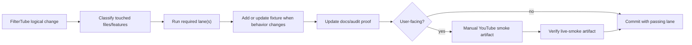

# FilterTube Change-Safety Goal Requirement Audit

Date: 2026-06-01
Status: workflow proof, not broad runtime-audit completion

This audit checks the current `FilterTube Change-Safety Audit and Test Lanes`
goal against the repository state. It proves the repeatable lane workflow, the
matrix, the changed-file classifier, and the named safety-surface sentinels.
It does not claim that every historical runtime audit row is green, that a
future behavior change is release-ready, or that a live installed YouTube smoke
pass has already been performed for future changes.

## Requirement Verdicts

| Requirement | Current evidence | Verdict |
|---|---|---|
| Keep audit proof files inside `docs/audit/`. | `docs/audit/TEST_LANE_MATRIX.md` documents the boundary, and `tests/runtime/release-audit-proof-directory-boundary-current-behavior.test.mjs` rejects tracked proof-style Markdown outside `docs/audit/`. | `GO_WORKFLOW` |
| Turn confirmed risks into focused fixtures/tests. | `docs/audit/TEST_LANE_MATRIX.md` binds named safety surfaces and user-reported anchors to lane-owned `tests/runtime/*current-behavior.test.mjs` files. | `GO_WORKFLOW_FOR_NAMED_RISKS` |
| Create `docs/audit/TEST_LANE_MATRIX.md`. | The matrix exists and is pinned by `tests/runtime/test-lane-matrix-current-behavior.test.mjs`. | `GO_WORKFLOW` |
| Define required test lanes by touched area. | `scripts/test-lane-config.mjs` owns declarative lane data, `scripts/run-test-lane.mjs` classifies changed paths, and the matrix mirrors the file-to-lane review copy. | `GO_WORKFLOW` |
| Preserve blocklist, whitelist, keyword/channel blocking, Shorts, end screens, quick-block, 3-dot menus, JSON-first filtering, DOM fallback, no-rule performance, SPA navigation, settings, and release packaging. | `tests/runtime/test-lane-visible-safety-current-behavior.test.mjs` keeps every named surface tied to focused lanes or manual smoke rows. | `GO_WORKFLOW` |
| Use the requested change flow. | The matrix requires classify -> run lane -> update fixture when behavior changes -> update `docs/audit` proof -> manual YouTube smoke for user-facing changes -> commit only with passing lane. | `GO_WORKFLOW` |
| Expose the requested lane commands. | `package.json` defines `test:release`, `test:whitelist`, `test:blocking`, `test:json`, `test:dom`, `test:menu`, `test:performance`, `test:settings`, `test:smoke`, and `test:changed`. | `GO_WORKFLOW` |
| Keep matrix examples executable. | `tests/runtime/test-lane-matrix-current-behavior.test.mjs` checks the goal examples for `js/seed.js`, `js/injector.js`, `js/content/dom_fallback.js`, `js/content_bridge.js`, `js/background.js`, manifest/build files, and public release copy. | `GO_WORKFLOW` |
| Preserve the Done Means contract. | The matrix Done Criteria section is pinned in `test:smoke` and requires relevant audit proof, behavior fixtures for behavior changes, lane pass, manual smoke when user-facing, clean scope, blocking/whitelist integrity, and snappy empty-rule plus SPA paths. | `GO_WORKFLOW` |
| Keep manual YouTube smoke explicit without pretending automated fixtures prove live browser behavior. | The matrix and release live-smoke docs require `npm run smoke:youtube`, `npm run smoke:youtube:verify`, clean console summary, required SPA rows, automated lane context, and installed byte parity before using a dated artifact as live release evidence. | `GO_WORKFLOW_BOUNDARY` |

## Current Flow

## Boundary

The current lane workflow is usable as the per-change release gate, but the
following are intentionally not proven by this requirement audit:

- full historical runtime audit completion;
- approval for a future runtime behavior change without its focused fixture;
- approval for release without a dated live-smoke artifact when the change is
  user-facing;
- approval to treat the broad `npm run audit:runtime` backlog as a release
  blocker or as completed proof.

The current broad backlog remains documented in
`docs/audit/FILTERTUBE_CHANGE_SAFETY_RUNTIME_AUDIT_BACKLOG_2026-06-01.md`.
The workflow is to retire that backlog in smaller proof batches, not to hide it
behind the bounded lane matrix.
