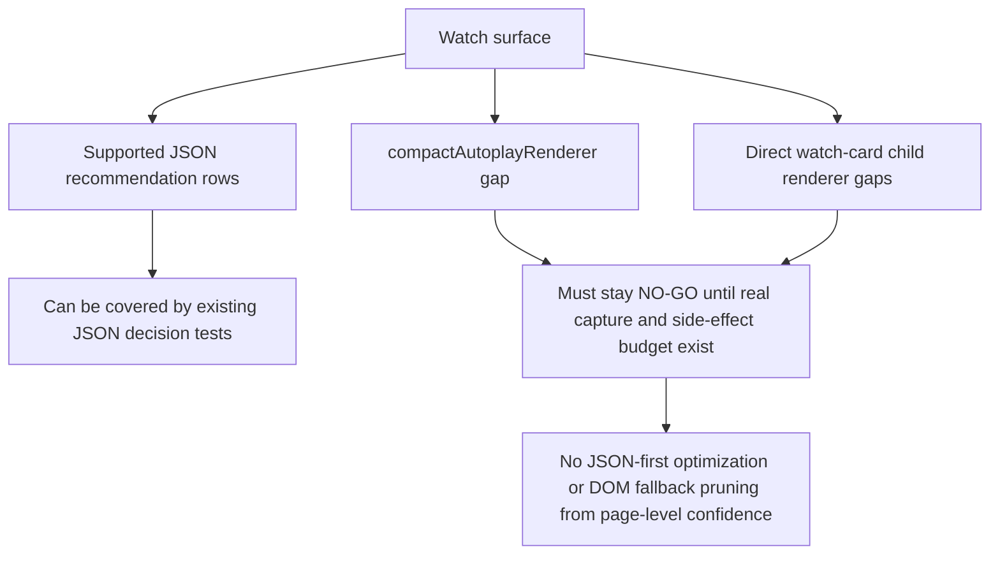

# FilterTube Compact Autoplay Authority Current Behavior - 2026-05-19

Status: audit proof only. No runtime behavior was changed.

This slice separates a documented watch/autoplay gap from proven runtime
coverage. The inventory and fixture gates correctly name `compactAutoplayRenderer`
as high risk, but the current product source does not treat it as a supported
video renderer.

## Method Semantic Proof Gap Boundary

`docs/audit/FILTERTUBE_METHOD_SEMANTIC_PROOF_GAP_INDEX_CURRENT_BEHAVIOR_2026-05-25.md`
is a required source input before this audit slice can support runtime
optimization or JSON-first promotion. Current proof pins:

```text
method semantic proof gap files covered: 69
method semantic proof gap lexical callables covered: 5744
files with complete per-callable semantic proof: 0
lexical callables requiring semantic proof before behavior changes: 5744
affected callable semantic proof: NO-GO
runtime behavior changed: no
```

These counts are audit-only blockers. They do not approve runtime optimization,
JSON-first behavior, method deletion, method merging, lifecycle cleanup, no-work
changes, or whitelist behavior changes.

## Current Verdict

`compactAutoplayRenderer` is not covered by direct JSON filtering today.

This is broader than a keyword-only gap:

- it is not in `FILTER_RULES`
- it is not in the nested known-key unwrap list
- it is not in the category-filter video renderer allowlist
- it is not in the content-filter video renderer allowlist
- it has no committed extracted capture fixture under
  `tests/runtime/fixtures/captures/`

That means a compact autoplay suggestion can pass through keyword, channel, and
content/category rules even when it carries ordinary video-shaped fields.

## Source Evidence

| Area | Current source | Evidence | Verdict |
| --- | --- | --- | --- |
| Direct renderer rules | `js/filter_logic.js:426-435` | Shared video rules include `endScreenVideoRenderer`, but not `compactAutoplayRenderer`. | Missing direct rule. |
| Nested renderer unwrap | `js/filter_logic.js:2517-2527` | Known nested keys include `endScreenVideoRenderer`, but not `compactAutoplayRenderer`. | Nested wrapper can pass through. |
| Category filter type gate | `js/filter_logic.js:2136-2143` | The video renderer allowlist omits `compactAutoplayRenderer`. | Category rules skip it. |
| Content filter type gate | `js/filter_logic.js:2712-2719` | The content-filter video renderer allowlist omits `compactAutoplayRenderer`. | Duration/date/uppercase rules skip it. |
| Inventory status | `docs/youtube_renderer_inventory.md` | The renderer is marked missing / still missing. | Documentation is a gap signal, not runtime proof. |
| Capture fixture status | `tests/runtime/fixtures/captures/` | No committed compact autoplay fixture exists today. | Real fixture proof still missing. |

## Why This Matters

This is one credible explanation for blocked content showing up in autoplay or
end-screen-adjacent places even after the direct `endScreenVideoRenderer` path
works. A fix should not be guessed from the name alone. It needs a real capture
fragment and positive/negative expectations because autoplay modules can affect
watch navigation, player state, and recommendations.

## 2026-05-30 Watch Recommendation Topology Linkage

This continuation ties compact autoplay to the same watch recommendation
surface as direct watch-card subrenderers. Runtime behavior is unchanged.

Current source split:

- `endScreenVideoRenderer` is a direct `BASE_VIDEO_RULES` entry.
- `watchCardCompactVideoRenderer` is a direct `BASE_VIDEO_RULES` entry.
- `lockupViewModel` has explicit runtime rules for modern watch/rail lockups.
- `universalWatchCardRenderer` has wrapper rules for title and channel fields.
- `compactAutoplayRenderer` is absent from direct `FILTER_RULES`, nested known
  keys, category-filter renderer allowlists, and content-filter renderer
  allowlists.
- Direct `watchCardRichHeaderRenderer`, `watchCardHeroVideoRenderer`, and
  `watchCardRHPanelVideoRenderer` are separate direct-child gaps documented in
  `docs/audit/FILTERTUBE_DIRECT_WATCH_CARD_AUTHORITY_CURRENT_BEHAVIOR_2026-05-19.md`.

```text
watch recommendation authority cannot be inferred from page surface alone

supported JSON family:
  endScreenVideoRenderer
  watchCardCompactVideoRenderer
  lockupViewModel
  universalWatchCardRenderer wrapper title/channel fields

unsupported or under-proven family:
  compactAutoplayRenderer
  direct watch-card child renderers
  universal hero video-id navigationEndpoint path

required before optimization:
  per-renderer blocklist and whitelist fixtures
  no navigation, click, playback, metadata fetch, or recommendation side effect
  no-rule zero-work proof
```



This keeps compact autoplay in the same future
`watchRecommendationRendererAuthority` gate as direct watch-card child
renderers. That authority must prove renderer-family identity, route/endpoint
scope, blocklist/whitelist outcome, sibling visibility, no-rule work, and
player/recommendation side-effect budgets before behavior changes.

## Required Future Gate

Before changing behavior, add a `compactAutoplayAuthority` or fold it into
`watchEndscreenAuthority` with:

- real Main watch/next compact autoplay capture provenance
- direct renderer fixture and nested wrapper fixture
- blocklist keyword and channel cases
- whitelist allow and fail-closed cases
- category/content-control cases
- empty blocklist and disabled no-work cases
- non-matching sibling remains visible
- no player metadata, autoplay, click, or navigation side effect
