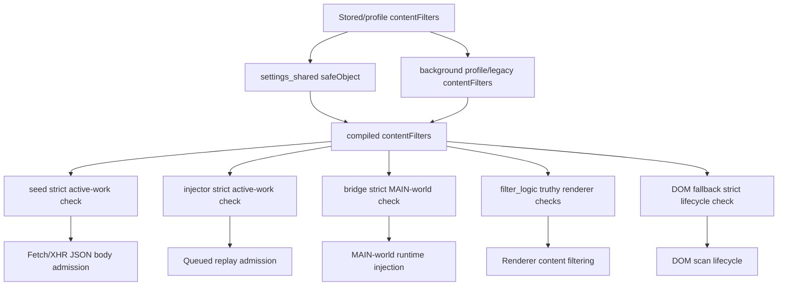
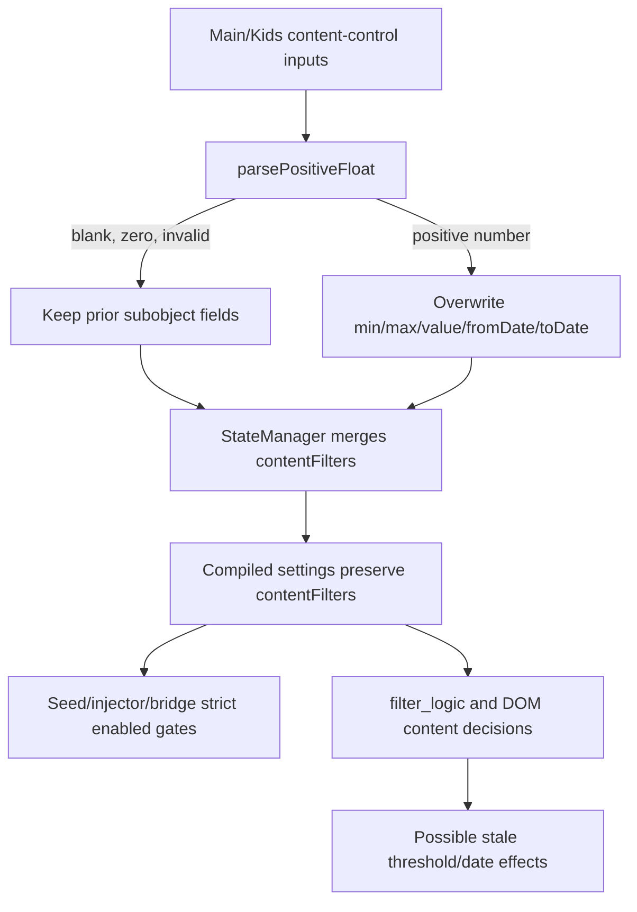

# FilterTube Compiled Settings Field Register - Current Behavior - 2026-05-22

Status: audit-only current-behavior register. Runtime behavior is unchanged.

This slice promotes settings and JSON-first filter review from broad compiler
parity notes into a source-derived field register for the current compiled
settings surfaces. It covers fields emitted by the background compiler, fields
returned by the shared UI compiler, fields normalized by filter logic, and
settings fields consumed by seed/filter/bridge runtime code.

This is not completion proof for settings authority, compiler parity,
JSON-first field promotion, list-mode semantics, profile routing, no-work
budgets, mutation safety, storage revision ownership, or fixture provenance. It
is a current-behavior boundary before changing compiled settings shape, filter
field behavior, background/UI compiler parity, seed no-work gates, bridge
settings relays, or first-class JSON filtering.

## Source Boundary

```text
tracked product files scanned for compiled/settings fields: 6
raw compiled/settings field rows: 309
unique file-field-operation rows: 148
raw cachedSettingsRead rows: 12
raw compiledAssign rows: 54
raw currentSettingsRead rows: 56
raw processedAssign rows: 7
raw settingsRead rows: 144
raw sharedCompiledReturn rows: 36
unique cachedSettingsRead rows: 7
unique compiledAssign rows: 44
unique currentSettingsRead rows: 6
unique processedAssign rows: 7
unique settingsRead rows: 48
unique sharedCompiledReturn rows: 36
runtime behavior changed: no
```

The scan is intentionally limited to the current settings/compiler/runtime
surfaces that create or consume compiled settings fields:

```text
js/background.js
js/settings_shared.js
js/filter_logic.js
js/seed.js
js/content_bridge.js
js/content/bridge_settings.js
```

## Source Fingerprints

| Source file | Lines | Bytes | SHA-256 |
| --- | ---: | ---: | --- |
| `js/background.js` | 6320 | 285103 | `77628ab6dde775f3e2e30746974169e5f685e80172f449639fd845817b1c71ad` |
| `js/settings_shared.js` | 1181 | 57535 | `9710ebb445ba11cc45fc98aced765d298226a8cd4a003600e106f908abc2162c` |
| `js/filter_logic.js` | 3652 | 172174 | `953ef0f14970e6cfbc11215fe9eaa078ced34f001908e1c6d5903a8fd2d9a1f5` |
| `js/seed.js` | 1136 | 50026 | `a9d86cd973b998ffbd58faf316ca679267ce7267af36969683f32b760f49054d` |
| `js/content_bridge.js` | 13571 | 601694 | `1dafb0bf979d391d2a3be827700e39114bc02b839cd26ddc8635a1127a0327b3` |
| `js/content/bridge_settings.js` | 651 | 26462 | `c7828acd09941f4559e47b31ea57d184ef9367ae4964598e865b8a196934e75b` |

## Unique File Counts

| File | Unique rows |
| --- | ---: |
| `js/background.js` | 50 |
| `js/content/bridge_settings.js` | 4 |
| `js/content_bridge.js` | 16 |
| `js/filter_logic.js` | 26 |
| `js/seed.js` | 16 |
| `js/settings_shared.js` | 36 |

## Field Sets By Operation

```text
cachedSettingsRead (7): enabled,filterChannels,filterKeywords,hideAllComments,hideAllShorts,listMode,profileType
compiledAssign (44): categoryFilters,channelMap,contentFilters,disableAnnotations,disableAutoplay,enabled,filterChannels,filterComments,filterKeywords,filterKeywordsComments,hideAllComments,hideAllShorts,hideAskButton,hideEndscreenCards,hideEndscreenVideowall,hideExploreTrending,hideHomeFeed,hideLiveChat,hideMembersOnly,hideMerchTicketsOffers,hideMixPlaylists,hideMoreFromYouTube,hideNotificationBell,hidePlaylistCards,hideRecommended,hideSearchShelves,hideSponsoredCards,hideSubscriptions,hideTopHeader,hideVideoButtonsBar,hideVideoChannelRow,hideVideoDescription,hideVideoInfo,hideVideoSidebar,hideWatchPlaylistPanel,listMode,profileType,showBlockMenuItem,showQuickBlockButton,useExactWordMatching,videoChannelMap,videoMetaMap,whitelistChannels,whitelistKeywords
currentSettingsRead (6): channelMap,filterChannels,listMode,showBlockMenuItem,videoChannelMap,videoMetaMap
processedAssign (7): categoryFilters,contentFilters,filterChannels,filterKeywords,videoMetaMap,whitelistChannels,whitelistKeywords
settingsRead (48 rows; 26 fields): autoBackupEnabled,autoBackupFormat,autoBackupMode,categoryFilters,channelMap,contentFilters,disableAutoplay,enabled,filterChannels,filterComments,filterKeywords,filterKeywordsComments,ftProfilesV4,hideAllComments,hideAllShorts,hideComments,hideEndscreenCards,hideEndscreenVideowall,listMode,minWordLength,mode,profileType,videoChannelMap,videoMetaMap,whitelistChannels,whitelistKeywords
sharedCompiledReturn (36): categoryFilters,contentFilters,disableAnnotations,disableAutoplay,enabled,filterChannels,filterComments,filterKeywords,filterKeywordsComments,hideAllComments,hideAllShorts,hideAskButton,hideEndscreenCards,hideEndscreenVideowall,hideExploreTrending,hideHomeFeed,hideLiveChat,hideMembersOnly,hideMerchTicketsOffers,hideMixPlaylists,hideMoreFromYouTube,hideNotificationBell,hidePlaylistCards,hideRecommended,hideSearchShelves,hideSponsoredCards,hideSubscriptions,hideTopHeader,hideVideoButtonsBar,hideVideoChannelRow,hideVideoDescription,hideVideoInfo,hideVideoSidebar,hideWatchPlaylistPanel,showBlockMenuItem,showQuickBlockButton
```

Background-only compiled fields not returned by `buildCompiledSettings(...)` in
`js/settings_shared.js`:

```text
channelMap,listMode,profileType,useExactWordMatching,videoChannelMap,videoMetaMap,whitelistChannels,whitelistKeywords
```

Shared-only compiled fields not assigned by the background compiler:

```text
none
```

## Unique Field Rows

```text
js/seed.js:269:cachedSettingsRead:listMode:2
js/seed.js:411:cachedSettingsRead:enabled:3
js/seed.js:439:cachedSettingsRead:profileType:1
js/seed.js:441:cachedSettingsRead:filterKeywords:1
js/seed.js:442:cachedSettingsRead:filterChannels:1
js/seed.js:443:cachedSettingsRead:hideAllComments:3
js/seed.js:444:cachedSettingsRead:hideAllShorts:1
js/background.js:1894:compiledAssign:filterKeywords:6
js/background.js:1930:compiledAssign:filterKeywordsComments:6
js/background.js:1990:compiledAssign:listMode:1
js/background.js:1991:compiledAssign:profileType:1
js/background.js:2011:compiledAssign:whitelistKeywords:1
js/background.js:2212:compiledAssign:whitelistChannels:1
js/background.js:2330:compiledAssign:filterChannels:1
js/background.js:2411:compiledAssign:channelMap:1
js/background.js:2424:compiledAssign:videoChannelMap:1
js/background.js:2427:compiledAssign:videoMetaMap:1
js/background.js:2477:compiledAssign:enabled:1
js/background.js:2478:compiledAssign:hideAllComments:1
js/background.js:2479:compiledAssign:filterComments:1
js/background.js:2480:compiledAssign:useExactWordMatching:1
js/background.js:2481:compiledAssign:hideAllShorts:1
js/background.js:2482:compiledAssign:hideHomeFeed:1
js/background.js:2483:compiledAssign:hideSponsoredCards:1
js/background.js:2484:compiledAssign:hideWatchPlaylistPanel:1
js/background.js:2485:compiledAssign:hidePlaylistCards:1
js/background.js:2486:compiledAssign:hideMembersOnly:1
js/background.js:2487:compiledAssign:hideMixPlaylists:1
js/background.js:2488:compiledAssign:hideVideoSidebar:1
js/background.js:2489:compiledAssign:hideRecommended:1
js/background.js:2490:compiledAssign:hideLiveChat:1
js/background.js:2491:compiledAssign:hideVideoInfo:1
js/background.js:2492:compiledAssign:hideVideoButtonsBar:1
js/background.js:2493:compiledAssign:hideAskButton:1
js/background.js:2494:compiledAssign:hideVideoChannelRow:1
js/background.js:2495:compiledAssign:hideVideoDescription:1
js/background.js:2496:compiledAssign:hideMerchTicketsOffers:1
js/background.js:2497:compiledAssign:hideEndscreenVideowall:1
js/background.js:2498:compiledAssign:hideEndscreenCards:1
js/background.js:2499:compiledAssign:disableAutoplay:1
js/background.js:2500:compiledAssign:disableAnnotations:1
js/background.js:2501:compiledAssign:hideTopHeader:1
js/background.js:2502:compiledAssign:hideNotificationBell:1
js/background.js:2503:compiledAssign:hideExploreTrending:1
js/background.js:2504:compiledAssign:hideMoreFromYouTube:1
js/background.js:2505:compiledAssign:hideSubscriptions:1
js/background.js:2506:compiledAssign:showQuickBlockButton:1
js/background.js:2507:compiledAssign:showBlockMenuItem:1
js/background.js:2508:compiledAssign:hideSearchShelves:1
js/background.js:2527:compiledAssign:contentFilters:1
js/background.js:2549:compiledAssign:categoryFilters:1
js/content_bridge.js:254:currentSettingsRead:channelMap:8
js/content_bridge.js:283:currentSettingsRead:videoChannelMap:24
js/content_bridge.js:416:currentSettingsRead:filterChannels:5
js/content_bridge.js:1218:currentSettingsRead:listMode:7
js/content_bridge.js:1654:currentSettingsRead:videoMetaMap:11
js/content_bridge.js:10678:currentSettingsRead:showBlockMenuItem:1
js/filter_logic.js:977:processedAssign:contentFilters:1
js/filter_logic.js:995:processedAssign:categoryFilters:1
js/filter_logic.js:1007:processedAssign:filterKeywords:1
js/filter_logic.js:1021:processedAssign:whitelistKeywords:1
js/filter_logic.js:1036:processedAssign:filterChannels:1
js/filter_logic.js:1052:processedAssign:whitelistChannels:1
js/filter_logic.js:1065:processedAssign:videoMetaMap:1
js/background.js:788:settingsRead:autoBackupEnabled:1
js/background.js:811:settingsRead:ftProfilesV4:1
js/background.js:814:settingsRead:autoBackupFormat:2
js/background.js:839:settingsRead:autoBackupMode:2
js/background.js:1080:settingsRead:filterComments:1
js/background.js:1080:settingsRead:hideComments:1
js/content_bridge.js:1015:settingsRead:enabled:2
js/content_bridge.js:1016:settingsRead:listMode:2
js/content_bridge.js:1017:settingsRead:filterChannels:2
js/content_bridge.js:1026:settingsRead:contentFilters:4
js/content_bridge.js:1037:settingsRead:categoryFilters:2
js/content_bridge.js:1046:settingsRead:filterKeywords:1
js/content_bridge.js:1048:settingsRead:filterKeywordsComments:1
js/content_bridge.js:1049:settingsRead:hideAllComments:1
js/content_bridge.js:1050:settingsRead:hideAllShorts:1
js/content_bridge.js:8327:settingsRead:videoChannelMap:2
js/content/bridge_settings.js:295:settingsRead:profileType:4
js/content/bridge_settings.js:329:settingsRead:listMode:1
js/content/bridge_settings.js:332:settingsRead:whitelistChannels:2
js/content/bridge_settings.js:333:settingsRead:whitelistKeywords:2
js/filter_logic.js:857:settingsRead:channelMap:10
js/filter_logic.js:858:settingsRead:filterChannels:13
js/filter_logic.js:859:settingsRead:whitelistChannels:10
js/filter_logic.js:973:settingsRead:contentFilters:5
js/filter_logic.js:992:settingsRead:categoryFilters:5
js/filter_logic.js:1006:settingsRead:filterKeywords:6
js/filter_logic.js:1020:settingsRead:whitelistKeywords:7
js/filter_logic.js:1065:settingsRead:videoMetaMap:17
js/filter_logic.js:1385:settingsRead:videoChannelMap:9
js/filter_logic.js:1581:settingsRead:listMode:3
js/filter_logic.js:1932:settingsRead:disableAutoplay:1
js/filter_logic.js:1932:settingsRead:hideEndscreenCards:1
js/filter_logic.js:1932:settingsRead:hideEndscreenVideowall:1
js/filter_logic.js:2045:settingsRead:hideAllShorts:1
js/filter_logic.js:2215:settingsRead:hideAllComments:1
js/filter_logic.js:2222:settingsRead:filterKeywordsComments:2
js/filter_logic.js:2999:settingsRead:mode:1
js/filter_logic.js:3000:settingsRead:minWordLength:1
js/filter_logic.js:3603:settingsRead:enabled:2
js/seed.js:204:settingsRead:contentFilters:4
js/seed.js:215:settingsRead:categoryFilters:2
js/seed.js:224:settingsRead:filterKeywords:1
js/seed.js:225:settingsRead:filterChannels:1
js/seed.js:226:settingsRead:filterKeywordsComments:1
js/seed.js:227:settingsRead:hideAllComments:1
js/seed.js:228:settingsRead:hideAllShorts:1
js/seed.js:235:settingsRead:enabled:1
js/seed.js:236:settingsRead:listMode:1
js/settings_shared.js:525:sharedCompiledReturn:enabled:1
js/settings_shared.js:526:sharedCompiledReturn:filterKeywords:1
js/settings_shared.js:527:sharedCompiledReturn:filterKeywordsComments:1
js/settings_shared.js:528:sharedCompiledReturn:filterChannels:1
js/settings_shared.js:529:sharedCompiledReturn:hideAllShorts:1
js/settings_shared.js:530:sharedCompiledReturn:hideAllComments:1
js/settings_shared.js:531:sharedCompiledReturn:filterComments:1
js/settings_shared.js:532:sharedCompiledReturn:hideHomeFeed:1
js/settings_shared.js:533:sharedCompiledReturn:hideSponsoredCards:1
js/settings_shared.js:534:sharedCompiledReturn:hideWatchPlaylistPanel:1
js/settings_shared.js:535:sharedCompiledReturn:hidePlaylistCards:1
js/settings_shared.js:536:sharedCompiledReturn:hideMembersOnly:1
js/settings_shared.js:537:sharedCompiledReturn:hideMixPlaylists:1
js/settings_shared.js:538:sharedCompiledReturn:hideVideoSidebar:1
js/settings_shared.js:539:sharedCompiledReturn:hideRecommended:1
js/settings_shared.js:540:sharedCompiledReturn:hideLiveChat:1
js/settings_shared.js:541:sharedCompiledReturn:hideVideoInfo:1
js/settings_shared.js:542:sharedCompiledReturn:hideVideoButtonsBar:1
js/settings_shared.js:543:sharedCompiledReturn:hideAskButton:1
js/settings_shared.js:544:sharedCompiledReturn:hideVideoChannelRow:1
js/settings_shared.js:545:sharedCompiledReturn:hideVideoDescription:1
js/settings_shared.js:546:sharedCompiledReturn:hideMerchTicketsOffers:1
js/settings_shared.js:547:sharedCompiledReturn:hideEndscreenVideowall:1
js/settings_shared.js:548:sharedCompiledReturn:hideEndscreenCards:1
js/settings_shared.js:549:sharedCompiledReturn:disableAutoplay:1
js/settings_shared.js:550:sharedCompiledReturn:disableAnnotations:1
js/settings_shared.js:551:sharedCompiledReturn:hideTopHeader:1
js/settings_shared.js:552:sharedCompiledReturn:hideNotificationBell:1
js/settings_shared.js:553:sharedCompiledReturn:hideExploreTrending:1
js/settings_shared.js:554:sharedCompiledReturn:hideMoreFromYouTube:1
js/settings_shared.js:555:sharedCompiledReturn:hideSubscriptions:1
js/settings_shared.js:556:sharedCompiledReturn:showQuickBlockButton:1
js/settings_shared.js:557:sharedCompiledReturn:showBlockMenuItem:1
js/settings_shared.js:558:sharedCompiledReturn:hideSearchShelves:1
js/settings_shared.js:559:sharedCompiledReturn:contentFilters:1
js/settings_shared.js:560:sharedCompiledReturn:categoryFilters:1
```

## Current Behavior Boundaries

- The background compiler currently assigns 44 unique compiled fields.
- The shared UI compiler currently returns 36 unique compiled fields.
- The eight background-only compiled fields are map/list/profile/exactness and
  whitelist fields: `channelMap`, `listMode`, `profileType`,
  `useExactWordMatching`, `videoChannelMap`, `videoMetaMap`,
  `whitelistChannels`, and `whitelistKeywords`.
- `filter_logic.js` spreads incoming settings before normalizing seven fields:
  `contentFilters`, `categoryFilters`, `filterKeywords`,
  `whitelistKeywords`, `filterChannels`, `whitelistChannels`, and
  `videoMetaMap`.
- `seed.js` uses 7 cached settings fields in current no-work and route gates:
  list mode, keyword/channel rule arrays, comment/Shorts booleans, enabled,
  and profile type.
- `content_bridge.js` reads current settings heavily for learned map and list
  behavior, especially `videoChannelMap` and `videoMetaMap`.
- `js/content/bridge_settings.js` reads profile, list mode, and whitelist
  fields while relaying settings and normalizing empty Kids whitelist behavior.

## Risk Notes

Reliability risk follows from split compiler surfaces. The background compiler
adds fields that the shared compiler does not return, while filter logic accepts
incoming spread fields before normalizing only a subset. A future JSON-first
field contract needs to say which compiler owns each field and which runtime
consumer is allowed to rely on it.

False-hide/leak risk follows from field effect ambiguity. List mode,
whitelist fields, learned maps, content/category filters, and keyword/channel
arrays affect allow/block decisions across seed, filter logic, bridge code,
DOM fallback, and menu/quick-block behavior. Without per-field effect fixtures,
adding or pruning a field can either hide a visible sibling or leak a target.

Performance risk follows from active-rule gates. Seed has cached settings
checks, filter logic has processed settings normalization, and content bridge
has map/list consumers, but there is no compiled field manifest tying fields to
parse, harvest, DOM, storage, message, network, hide, restore, or no-work
budgets.

Code-burden risk follows from duplicated settings vocabulary. Background,
shared UI, seed, filter logic, content bridge, and bridge settings each encode
local field rules. Field cleanup or JSON-first promotion needs row equivalence
proof before fields can be merged, deleted, renamed, or treated as first-class
filter inputs.

## Content Filter Enabled Normalization Addendum - 2026-05-27

This addendum is audit-only. It follows the `contentFilters.*.enabled` fields
from storage/profile inputs through compiler output and JSON/DOM consumers,
because JSON-first active-work predicates currently disagree on truthy versus
strict boolean admission.

```text
stored/profile contentFilters
        |
        v
settings_shared buildCompiledSettings
        |  safeObject only; no deep enabled coercion
        v
background getCompiledSettings
        |  profile or legacy contentFilters copied as object
        v
seed / injector / content_bridge / filter_logic / DOM fallback
        |  seed/injector/bridge lifecycle is strict; filter effects still have truthy checks
        v
JSON parse admission, renderer filtering, DOM fallback, MAIN-world injection
```



| Row | Source pins | Current behavior | Risk boundary |
| --- | --- | --- | --- |
| `content_enabled_shared_pass_through` | `js/settings_shared.js:522-560` | `contentFilters` becomes `safeObject(contentFilters)` and is returned as `contentFilters: sanitizedContentFilters`; nested `enabled` values are not coerced. | Shared compiler output cannot prove boolean-normalized content filters. |
| `content_enabled_background_pass_through` | `js/background.js:2511-2531` | Background chooses profile content filters, then legacy content filters, then defaults; selected profile/legacy objects pass through without deep enabled coercion. | V4, legacy, import, and sync payloads can carry non-boolean `enabled` unless another owner proves normalization. |
| `content_enabled_filter_logic_pass_through` | `js/filter_logic.js:940-979` | Filter logic overlays incoming subobjects on defaults; nested `enabled` values are preserved. | Renderer filtering can see truthy non-boolean content-filter values. |
| `content_enabled_seed_strict_admission` | `js/seed.js:202-210` | Seed JSON body admission now requires `duration.enabled`, `uploadDate.enabled`, and `uppercase.enabled` to be exactly `true`. | Malformed truthy content-filter values no longer wake seed fetch/XHR body work. |
| `content_enabled_truthy_effect_consumers` | `js/filter_logic.js:2724`; `js/filter_logic.js:2804`; `js/filter_logic.js:2846`; `js/content/dom_fallback.js:3497`; `js/content/dom_fallback.js:3600-3602` | Filter logic and some DOM effect checks still treat truthy `enabled` as active after another path has admitted work. | Truthy strings or numbers can still affect renderer filtering/effect code if another rule admits the runtime path. |
| `content_enabled_strict_consumers` | `js/seed.js:202-210`; `js/injector.js:153-164`; `js/content_bridge.js:1017-1028`; `js/content/dom_fallback.js:1985-1987` | Seed, injector, bridge MAIN-world admission, and DOM fallback lifecycle active-work use `=== true`. | The same malformed value now fails to wake passive admission, but schema authority is still absent. |
| `content_enabled_schema_gap` | `docs/audit/FILTERTUBE_JSON_FIRST_ACTIVE_WORK_PREDICATE_REGISTER_CURRENT_BEHAVIOR_2026-05-22.md` | The active-work predicate parity addendum pins the duplicate helper drift, but no runtime schema authority owns the deep content-filter boolean contract. | First-class JSON promotion needs one schema owner before predicates are merged. |

Current normalization status:

```text
content-filter enabled normalization rows: 7
deep content-filter enabled coercion in shared compiler: absent
deep content-filter enabled coercion in background compiler: absent
deep content-filter enabled coercion in filter_logic processing: absent
seed content-filter enabled admission: strict
truthy content-filter enabled effect consumer group: present
strict content-filter enabled consumer group: present
schema authority for content-filter enabled values: NO-GO
JSON-first predicate merge approval from this addendum: NO-GO
runtime behavior changed by normalization addendum: yes; seed JSON admission ignores malformed truthy enabled values
```

The current release implication is narrow: seed body work now follows the
strict passive-admission contract used by injector, bridge, and DOM lifecycle
checks. JSON-first active-work optimization still needs either deep
normalization at a named settings owner or a source-backed decision that every
remaining runtime effect consumer must keep its current truthy/strict behavior.

## Content Filter Value Normalization Addendum - 2026-05-28

Status: audit-only current-behavior continuation. Runtime behavior is
unchanged. This addendum follows duration thresholds and upload-date relative
date fields from dashboard save paths into StateManager, compiler output, and
runtime consumers. It does not approve a settings schema change, UI behavior
change, stale-threshold cleanup, JSON-first promotion, or optimization patch.

The current value boundary is:

```text
dashboard content-control form
        |
        v
saveVideoFilters / saveKidsVideoFilters
        |  spread prior duration/uploadDate first
        |  only overwrite value fields when parsePositiveFloat(value) > 0
        v
StateManager updateContentFilters / updateKidsContentFilters
        |  merge subobjects without clearing stale threshold/date fields
        v
compiler / filter_logic / DOM fallback
        |  sees preserved caller-shaped values
        v
active-work gates, JSON decisions, DOM decisions, and metadata fetch paths
```



| Row | Source pins | Current behavior | Risk boundary |
| --- | --- | --- | --- |
| `content_value_main_duration_prior_spread` | `js/tab-view.js:1051-1106` | Main `nextDuration` starts with `...(prior.duration || {})`; blank, zero, or invalid duration inputs do not clear previous `minMinutes`, `maxMinutes`, or `value`. | UI can present an edited/blank control while persisted thresholds remain. |
| `content_value_main_upload_prior_spread` | `js/tab-view.js:1107-1158` | Main `nextUpload` starts with `...(prior.uploadDate || {})`; blank, zero, or invalid age inputs do not clear previous `value`, `valueMax`, `unit`, `unitMax`, `fromDate`, or `toDate`. | Upload-date active work can retain old cutoff fields after a blank edit. |
| `content_value_kids_duration_prior_spread` | `js/tab-view.js:2159-2214` | Kids `nextDuration` mirrors Main duration save semantics and keeps prior threshold fields when inputs do not parse as positive numbers. | Main and Kids can preserve stale thresholds consistently, so a fix needs shared behavior proof. |
| `content_value_kids_upload_prior_spread` | `js/tab-view.js:2215-2266` | Kids `nextUpload` mirrors Main upload-date save semantics and keeps prior cutoff fields when inputs do not parse as positive numbers. | Kids route/surface optimization cannot assume blank UI means blank runtime fields. |
| `content_value_main_state_merge` | `js/state_manager.js:2147-2150` | Main StateManager merges `nextContentFilters.duration`, `uploadDate`, and `uppercase` over existing subobjects. | State update does not act as a stale-field cleanup boundary. |
| `content_value_kids_state_merge` | `js/state_manager.js:2170-2174` | Kids StateManager merges incoming content-filter subobjects over current subobjects. | Kids state update also does not clear omitted stale fields. |
| `content_value_compiler_pass_through` | `js/settings_shared.js:522-560`; `js/background.js:2511-2531`; `js/filter_logic.js:940-979` | Shared compiler, background compiler, and filter-logic processing preserve nested content-filter value fields. | Runtime consumers can see stale threshold/date fields unless a dedicated normalizer is introduced. |

Current value-normalization status:

```text
content-filter value normalization rows: 7
dashboard blank duration clears prior threshold fields: no
dashboard blank upload-date clears prior cutoff fields: no
StateManager content-filter value cleanup owner: absent
compiled content-filter value cleanup owner: absent
JSON-first value-normalized content-filter approval: NO-GO
runtime behavior changed by value addendum: no
```

The release implication is narrow: value-level content-filter normalization is
still an open settings-mode and optimization blocker. Before duration or
upload-date can become first-class JSON work predicates, one owner must define
whether blank/zero controls clear stale runtime fields, preserve current
fields, or disable the corresponding content-filter family.

Additional future authority symbols intentionally absent from product runtime:

```text
contentFilterValueNormalizationAuthority
contentFilterDurationValueCleanupReport
contentFilterUploadDateValueCleanupReport
contentFilterStateManagerValueCleanupOwner
contentFilterDashboardBlankValuePolicy
contentFilterJsonFirstValueNormalizedPredicate
```

## Future Proof Fields

Each compiled settings field must eventually be backed by compiler ownership,
runtime ownership, allowed effects, and fixture evidence:

```text
compiledSettingsFieldReference
sourceFile
sourceLine
operation
fieldName
compilerOwner
emittedByBackgroundCompiler
emittedBySharedCompiler
normalizedByFilterLogic
consumedBySeed
consumedByContentBridge
consumedByBridgeSettings
jsonFirstFieldDecision
fieldEffectClass
targetProfile
targetListMode
activeRuleReason
storageKeyOwner
storageRevisionPolicy
messageRelayPolicy
seedNoWorkBudget
filterProcessBudget
bridgeLifecycleBudget
domFallbackParity
nativeRuntimeParity
positiveFixture
negativeDisabledFixture
negativeEmptyRuleFixture
negativeSiblingFixture
```

## Missing Runtime Authority Symbols

No product source currently defines:

```text
compiledSettingsFieldRegisterAuthority
compiledSettingsSchemaManifest
compiledSettingsFieldParityReport
compiledSettingsConsumerManifest
settingsJsonFirstFieldDecision
settingsJsonFirstNoWorkBudget
compiledSettingsRevisionContract
compiledSettingsFixtureProvenance
```

## Method Semantic Proof Gap Boundary

`docs/audit/FILTERTUBE_METHOD_SEMANTIC_PROOF_GAP_INDEX_CURRENT_BEHAVIOR_2026-05-25.md`
is a required source input before this background/settings/storage surface can
support runtime optimization. Current proof pins:

```text
method semantic proof gap files covered: 69
method semantic proof gap lexical callables covered: 5681
files with complete per-callable semantic proof: 0
lexical callables requiring semantic proof before behavior changes: 5681
affected callable semantic proof: NO-GO
runtime behavior changed: no
```

These counts are audit-only blockers. They do not approve runtime
optimization, JSON-first behavior, settings behavior, background message
behavior, storage behavior, cache invalidation behavior, whitelist behavior,
metric collectors, artifact creation, native sync, release package changes, or
public claims.
