# FilterTube Content Bridge Collaborator Identity Promotion Handoff Current Behavior - 2026-05-23

Status: current-behavior proof with 2026-05-28 and 2026-05-29 implementation addenda. The original 2026-05-23 slice was audit-only; the 2026-05-28 continuation changes runtime collaborator byline admission so bare `and` text no longer enters collaborator mode without stronger evidence, and the 2026-05-29 continuation blocks literal ampersand Topic name-only rosters before collaborator writer paths stamp card or resolved-cache state. This is still not completion proof for collaborator identity promotion authority.

## Scope

This slice pins the current behavior after collaborator metadata has been extracted: the helper and `extractChannelFromCard()` handoff paths that can turn a collaborator roster into channel identity used by filtering, menus, playlist fallback, and watch/YTM row handling.

The paired verifier is `tests/runtime/content-bridge-collaborator-identity-promotion-handoff-current-behavior.test.mjs`.

## Source Fingerprint

| File | Lines | Bytes | SHA-256 |
| --- | ---: | ---: | --- |
| `js/content_bridge.js` | 13571 | 601694 | `1dafb0bf979d391d2a3be827700e39114bc02b839cd26ddc8635a1127a0327b3` |

## Pinned Blocks

| Block | Source range | Lines | Bytes | SHA-256 | Current role |
| --- | --- | ---: | ---: | --- | --- |
| Watch-like collaboration warmup | `js/content_bridge.js:4822` through `js/content_bridge.js:4851` | 30 | 1297 | `53d862a7e45c0dacd6795046e53cf9e257dee3394deeed10a06eb5ec1a1dfda2` | Parses watch/YTM bylines into partial collaborators only after separator evidence is present. |
| YTM collaborator identity promotion | `js/content_bridge.js:4852` through `js/content_bridge.js:4943` | 92 | 3296 | `deefe23561a642fd66ccf80bcab3ff513472356c9141dc145d9a1e2227b2b140` | Calls collaborator extraction for YTM watch-like rows and clears literal ampersand Topic name-only stale state before returning collaboration-shaped channel info. |
| Collaboration DOM signal classifier | `js/content_bridge.js:4944` through `js/content_bridge.js:5063` | 120 | 5285 | `9a17597d1f08ebb5c4e4ed9bdd74dcdae28dd00135e3151e0e6575f682aca32a` | Detects avatar stack, attributed collaborator markup, byline, distinct channel-link signals, and the ampersand Topic guard helpers plus the writer-side rejection helper. |
| Collaborator channel-info normalization | `js/content_bridge.js:5064` through `js/content_bridge.js:5217` | 154 | 6370 | `a1b488fd8228fa830e2914f872e3911cb9b8b6e092a7201540867e6b31cf94d0` | Chooses card, resolved-cache, and avatar-stack collaborator rosters; demotes literal ampersand Topic name-only stale state; can write collaborator cache attrs and expected count. |
| Generic collaborator signal promotion | `js/content_bridge.js:5218` through `js/content_bridge.js:5303` | 86 | 3081 | `55ff41d06a422df35dd5c241198978dbd19df3428f0969e06193860652a8a31d` | Calls collaborator extraction for ordinary cards, compares with resolved cache through the guard, and returns collaboration-shaped channel info. |
| `extractChannelFromCard()` collaboration priority handoff | `js/content_bridge.js:9915` through `js/content_bridge.js:9946` | 32 | 1622 | `8e2087627598bda37bb8814981dd27df4a44f9970fd0165a8829d390ecfcbfe4` | Runs collaborator extraction before data-attribute channel identity and returns a collaboration channel-info object when signals pass. |
| `extractChannelFromCard()` lockup collaboration handoff | `js/content_bridge.js:10382` through `js/content_bridge.js:10405` | 24 | 1290 | `163574a088d8e8bd725e9b668974e39da9e85d17a578dbb834bd6d451a8d0bae` | Runs collaborator extraction inside modern lockup fallback before avatar/link channel extraction. |

## Selected Token Counts

These counts are over the seven pinned blocks, not the whole product.

| Token | Count |
| --- | ---: |
| `getWatchLikeCollaborationWarmup` | 1 |
| `promoteYtmWatchRowIdentityFromCollaboratorMetadata` | 1 |
| `cardHasCollaborationDomSignal` | 2 |
| `normalizeCollaboratorChannelInfoForCard` | 1 |
| `promoteChannelInfoFromCollaboratorSignals` | 1 |
| `extractCollaboratorMetadataFromElement` | 4 |
| `sanitizeCollaboratorList` | 9 |
| `resolvedCollaboratorsByVideoId` | 2 |
| `clearCollaboratorMetadataFromCard` | 4 |
| `isMixCardElement` | 5 |
| `isYtmWatchLikeCollaboratorCard` | 2 |
| `isDesktopWatchLikeCollaboratorCard` | 1 |
| `extractVideoIdFromCard` | 6 |
| `ensureVideoIdForCard` | 4 |
| `data-filtertube-expected-collaborators` | 8 |
| `data-filtertube-collaborators` | 1 |
| `setAttribute` | 2 |
| `getValidatedCachedCollaborators` | 1 |
| `extractCollaboratorsFromAvatarStackElement` | 1 |
| `mergeCollaboratorLists` | 1 |
| `getCollaboratorListQuality` | 8 |
| `hasCompleteCollaboratorRoster` | 1 |
| `buildCollaboratorSignature` | 1 |
| `needsEnrichment` | 8 |
| `isCollaboration` | 10 |
| `allCollaborators` | 12 |
| `expectedCollaboratorCount` | 20 |
| `videoId` | 63 |
| `parseCollaboratorNames` | 3 |
| `countDistinctChannelLinks` | 1 |
| `querySelector` | 14 |
| `yt-avatar-stack-view-model` | 3 |
| `extractYtmBylineText` | 4 |
| `extractDesktopWatchLikeBylineText` | 3 |
| `lockupMetadata` | 2 |
| `avatarStackSignal` | 2 |
| `hasCollaboratorSeparatorEvidence` | 4 |
| `isAmpersandTopicNameOnlyCollaboratorState` | 6 |
| `getResolvedCollaboratorsForCard` | 5 |
| `rejectAmpersandTopicCollaboratorWrite` | 1 |
| `shouldStampCardForVideoId` | 1 |

## Current Behavior Proven By Fixtures

- Watch-like collaboration warmup now requires stronger separator evidence before parsing a two-name `and` byline into partial collaborators and expected count, while Mix cards return an empty warmup. It keeps ampersand-only music Topic/right-rail bylines such as `Kully B & Gussy G - Topic` and no-evidence single-channel names such as `Law and Crime Network` out of collaborator mode unless stronger evidence such as `N more`, JSON/showSheet, avatar-stack, attributed collaborator markup, or distinct channel-link signals exists.
- YTM watch-like promotion calls collaborator extraction, merges video id evidence, and can return collaboration-shaped channel info with `needsEnrichment` when a roster is incomplete.
- Generic collaborator signal promotion can prefer a richer resolved-cache roster over a weaker extraction result for the same video id.
- Collaborator channel-info normalization can merge an existing collaborator roster, resolved-cache data, and avatar-stack collaborators, then write `data-filtertube-collaborators` and `data-filtertube-expected-collaborators`; the current fixture shows expected count can include overlapping raw roster inputs.
- Mix-card handling clears collaborator metadata and returns non-collaboration base identity in both YTM promotion and normalization paths.
- Literal ampersand Topic name-only collaborator-shaped state is now rejected both when readers validate stale cache and when the main writer paths try to stamp or promote the same shape. Broader non-Topic collaborator provenance remains list-only and still lacks source, route, settings revision, parser version, installed-tab parity, and JSON-first authority proof.

## Ampersand Topic Source-Flow Addendum - 2026-05-27

This source-flow records why `Kully B & Gussy G - Topic` is now treated as an
ordinary Topic display label unless stronger collaboration evidence exists.
It is audit-only and does not approve broader collaborator, whitelist, quick
block, menu, or JSON-first behavior changes.

```text
Topic/right-rail byline text
        |
        v
parseCollaboratorNames splits comma / "and", not plain "&"
        |
        v
collaboration extractor requires avatar stack, "N more", attributed markup,
or distinct channel links before writing collaborator attrs
        |
        v
promotion and quick-block/menu handoffs stay single-channel unless roster proof exists
```

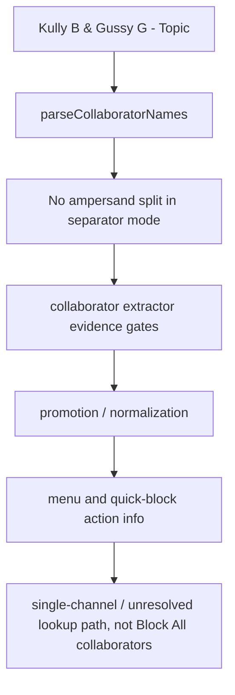

| Source-flow row | Source pins | Current behavior | Remaining proof gap |
| --- | --- | --- | --- |
| `topic_ampersand_parser_guard` | `js/content_bridge.js:2775-2830` | Separator mode splits on comma and `and`; plain `&` is only used when trimming hidden `N more` suffixes. | No first-class byline grammar owner or generated negative byline corpus exists. |
| `topic_lockup_metadata_gate` | `js/content_bridge.js:4555-4577`; `js/content_bridge.js:4580-4601`; `js/content_bridge.js:4604-4633` | Lockup/YTM extraction requires avatar stack, collapsed `N more`, attributed collaborator markup, distinct links, or primary-hint matching before creating collaborators. | No route/surface matrix proving every Topic, Mix, watch, right-rail, YTM, and search byline variant. |
| `topic_watch_warmup_gate` | `js/content_bridge.js:4822-4851`; `js/content_bridge.js:4944-4975` | Watch-like warmup no longer parses bare `and` unless separator evidence exists; the runtime fixture proves `Kully B & Gussy G - Topic` produces no warmup collaborators and no DOM collaboration signal. | No live browser trace proving already-open documents have reloaded this source. |
| `topic_menu_promotion_gate` | `js/content_bridge.js:5218-5303`; `js/content_bridge.js:11046-11101` | Generic promotion and menu injection consume collaborator-shaped identity only after evidence survives extraction/promotion. | Menu parity remains source-backed, not an installed-tab byte-level proof. |
| `topic_quick_block_gate` | `js/content/block_channel.js:1519-1598` | Quick block builds a Block All collaborator action only when collected collaborators are at least two after promotion/extraction. | No dedicated quick-block Topic fixture packet exists for desktop, mobile, YTM, and watch right rail. |

Current ampersand Topic source-flow status:

```text
ampersand Topic source-flow rows: 5
ASCII ampersand Topic source-flow diagram: present
Mermaid ampersand Topic source-flow diagram: present
topic ampersand proof: PARTIAL
runtime behavior changed by this addendum: no
```

Future authority symbols intentionally absent from product runtime:

- `contentBridgeAmpersandTopicBylineAuthority`
- `contentBridgeTopicBylineCollaboratorDecision`
- `contentBridgeTopicBylineNegativeFixturePacket`
- `contentBridgeTopicBylineMenuParityReport`

## Byline Grammar Evidence-Gate Addendum - 2026-05-27

This continuation separates the parser grammar from the caller evidence gates.
It records the release-relevant distinction between literal ampersand Topic
labels, evidence-gated watch-like `and` collaborator warmup, collapsed `N more`
rosters, and the former single-channel `and` false-positive risk. The
2026-05-28 continuation changes runtime behavior by requiring separator
evidence before a bare `and` byline can become provisional collaborators.

```text
byline text
    |
    v
parseCollaboratorNames
    |-- plain "&" stays literal unless trimming an "N more" suffix
    |-- "and" splits only after caller and separator evidence admit split mode
    |-- "N more" marks collapsed collaborators
    v
caller evidence gates
    |-- generic lockup/channel rows require avatar stack, distinct links, or N more
    |-- watch-like rows require separator evidence before warming collaborators
    v
promotion / menu / quick block
    |-- Block All appears only after collaborator-shaped identity survives handoff
```

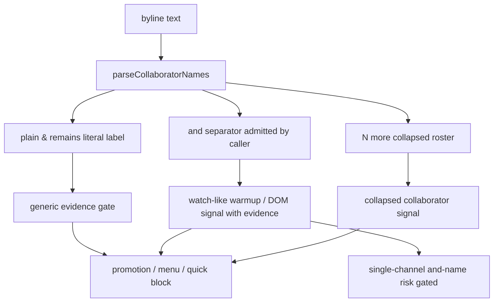

| Grammar row | Source pins | Current behavior | Remaining proof gap |
| --- | --- | --- | --- |
| `grammar_ampersand_literal_gate` | `js/content_bridge.js:2775-2830`; `js/content_bridge.js:4822-4851`; `js/content_bridge.js:4944-4975` | Plain `&` is not a separator in separator mode, so `Kully B & Gussy G - Topic` does not create warmup collaborators or a DOM collaboration signal. | No generated negative corpus for ampersand Topic labels across watch, right rail, YTM, search, and home. |
| `grammar_watch_and_positive_gate` | `js/content_bridge.js:4822-4851`; `js/content_bridge.js:4944-4975`; `js/content_bridge.js:11055-11098` | Watch-like menu warmup can parse `Alice and Bob` as two provisional collaborators only when separator evidence exists, such as two distinct channel links, avatar-stack, attributed collaborator markup, or collapsed `N more`. | Text-only true collaborator bylines without stronger evidence can now wait for JSON/showSheet enrichment instead of entering provisional collaborator mode immediately. |
| `grammar_watch_and_single_name_risk` | `js/content_bridge.js:4822-4851`; `js/content_bridge.js:4944-4975`; `js/content_bridge.js:11055-11098` | A watch-like byline such as `The Institute of Art and Ideas` now returns no warmup collaborators and no DOM collaboration signal in the isolated runtime fixture unless stronger separator evidence is present. | No installed-tab parity trace, route/surface negative corpus, or metric artifact exists. |
| `grammar_lockup_evidence_gate` | `js/content_bridge.js:4542-4563`; `js/content_bridge.js:4580-4601` | Generic lockup and channel-name rows reject `and`/`&` splits unless avatar stack, distinct channel links, or `N more` evidence exists. | No complete route/surface matrix proving every non-watch generic row follows this gate. |
| `grammar_ytm_byline_gate` | `js/content_bridge.js:4604-4688`; `js/content_bridge.js:5218-5303` | YTM collapsed or explicit byline evidence can enter collaborator mode and enrichment, including weak-link rows that need JSON/showSheet repair. | No YTM-specific negative corpus for Topic, Mix, playlist, compact, and queue bylines. |
| `grammar_quick_menu_action_gate` | `js/content_bridge.js:11046-11101`; `js/content/block_channel.js:1519-1598` | Menu and quick-block handoffs render Block All only after collaboration-shaped identity or at least two quick-block collaborators survive promotion. | No quick-block/menu parity packet tying grammar decisions to every action label. |

Current byline grammar evidence-gate status:

```text
byline grammar source-flow rows: 6
ASCII byline grammar diagram: present
Mermaid byline grammar diagram: present
single-channel "and" watch-like false-positive risk: GATED_BY_SEPARATOR_EVIDENCE
runtime behavior changed by 2026-05-28 continuation: yes
```

Future grammar authority symbols intentionally absent from product runtime:

- `contentBridgeBylineGrammarEvidenceGate`
- `contentBridgeSingleChannelAndNameNegativeCorpus`
- `contentBridgeCollaboratorBylineRouteSurfaceMatrix`
- `contentBridgeBylineGrammarMetricArtifact`
- `contentBridgeWatchLikeAndBylineAuthority`

## Single-Channel And Negative Fixture Packet - 2026-05-27

This packet turns the former watch-like `and` risk into explicit
current-behavior fixtures. Rows marked `GATED` are names that should be treated
as one channel and now stay out of collaborator mode without stronger separator
evidence. Rows marked `CONTROL` keep the ampersand Topic, Mix, and true
two-name collaborator behavior pinned so the evidence gate cannot flatten all
collaborator bylines.

```text
single-channel "and" byline
        |
        v
watch-like caller admits separator split
        |
        v
separator evidence gate checks N more / avatar stack / attributed markup / distinct links
        |
        v
runtime fixture keeps bare single-channel names unsplit
        |
        v
release gate: do not optimize/promote this path without route/surface authority
```

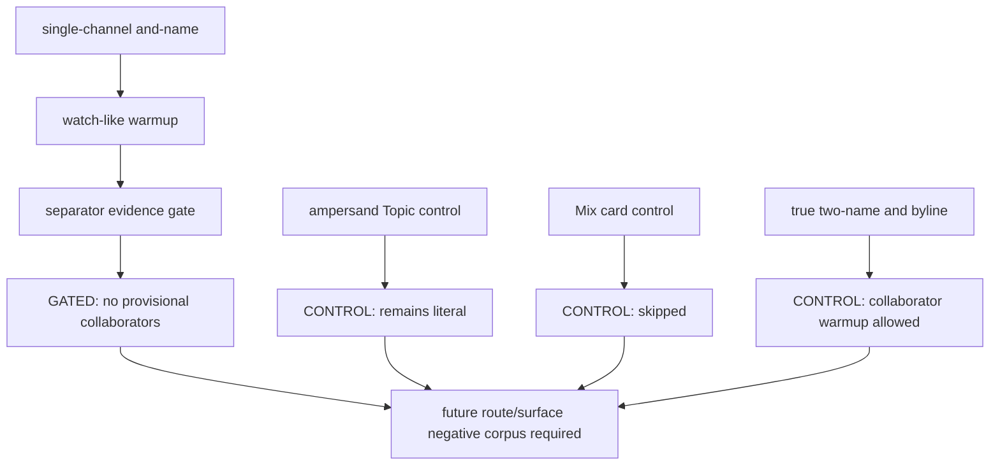

| Fixture row | Surface | Input byline | Current observed behavior | Release interpretation |
| --- | --- | --- | --- | --- |
| `and_negative_watch_institute` | Desktop watch-like card | `The Institute of Art and Ideas` | Returns no collaborators and DOM signal returns false without stronger separator evidence. | `GATED`; single-channel negative fixture is now protected by the runtime evidence gate. |
| `and_negative_watch_law_crime` | Desktop watch-like card | `Law and Crime Network` | Returns no collaborators and DOM signal returns false without stronger separator evidence. | `GATED`; common brand-style channel names no longer become Block All candidates from bare byline text. |
| `and_negative_watch_research_markets` | Desktop watch-like card | `Research and Markets` | Returns no collaborators and DOM signal returns false without stronger separator evidence. | `GATED`; short single-channel names no longer over-promote from bare byline text. |
| `and_control_real_collab` | Desktop watch-like card with two distinct channel links | `Alice and Bob` | Splits into `Alice` and `Bob`; expected count is 2. | `CONTROL`; true collaborator bylines remain supported when stronger separator evidence exists. |
| `and_control_mix_card` | Mix card | `Alice and Bob` | Returns no collaborators and expected count 0. | `CONTROL`; Mix guard must stay before grammar parsing. |
| `and_control_ampersand_topic` | Desktop watch-like/right-rail card | `Kully B & Gussy G - Topic` | Returns no collaborators and no DOM signal. | `CONTROL`; Topic ampersand handling must stay literal unless stronger evidence exists. |

Current single-channel `and` fixture packet status:

```text
single-channel and-name negative fixture rows: 6
single-channel and-name current-risk rows: 0
single-channel and-name evidence-gated rows: 3
single-channel and-name control rows: 3
ASCII single-channel and-name fixture diagram: present
Mermaid single-channel and-name fixture diagram: present
runtime behavior changed by 2026-05-28 continuation: yes
```

## Watch-Like And Route-Surface Matrix Addendum - 2026-05-27

This matrix separates the same `and` byline grammar across route/surface
admission contexts. The 2026-05-28 continuation changes the watch-like
warmup / DOM-signal path so bare `and` bylines no longer admit separator
parsing before the code sees stronger collaborator evidence.

```text
single-channel "and" display name
        |
        +--> generic card / channel-name fallback without stronger evidence
        |       -> stays non-collaboration
        |
        +--> desktop watch-like lockup / right rail warmup
        |       -> separator evidence required before split
        |
        +--> Mix card
        |       -> skipped before grammar parsing
        |
        +--> stronger collaboration evidence
                -> admitted through N more, avatar stack, or distinct links
```

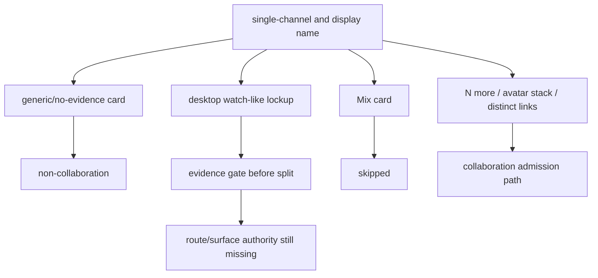

| Matrix row | Surface/admission context | Example input | Current observed behavior | Release interpretation |
| --- | --- | --- | --- | --- |
| `and_matrix_generic_no_evidence_safe` | Generic card or channel-name fallback with no avatar stack, no distinct links, no `N more`. | `The Institute of Art and Ideas` | Does not enter collaborator mode. | Existing generic evidence gate is protective for this shape. |
| `and_matrix_watch_like_current_risk` | Desktop watch-like/right-rail lockup warmup. | `Law and Crime Network` | Returns no collaborators and DOM signal returns false without stronger separator evidence. | `GATED`; bare watch-like byline text no longer feeds menu/quick-block collaborator actions. |
| `and_matrix_watch_like_real_collab_control` | Desktop watch-like/right-rail lockup warmup with distinct channel-link evidence. | `Alice and Bob` | Splits into two provisional collaborators. | `CONTROL`; true two-name collaborator bylines remain supported when stronger evidence exists. |
| `and_matrix_mix_guard_control` | Mix card before collaborator grammar. | `Alice and Bob` | Returns no collaborators and expected count 0. | Mix guard stays ahead of grammar parsing. |
| `and_matrix_ampersand_topic_control` | Desktop watch-like/right-rail card with literal ampersand Topic label. | `Kully B & Gussy G - Topic` | Returns no collaborators and no DOM signal. | The ampersand fix remains intact. |
| `and_matrix_hidden_more_admission` | Any row carrying collapsed collaborator text. | `Alice and 2 more` | Admitted as collapsed collaborator evidence. | Stronger `N more` evidence remains separate from ambiguous brand names. |
| `and_matrix_distinct_links_admission` | Generic card with two distinct channel identities linked. | `Alice and Bob` plus two distinct links. | DOM collaboration signal is true. | Distinct link evidence remains a stronger admission path. |
| `and_matrix_y_t_m_show_sheet_gap` | YTM showSheet / compact rows. | Captured showSheet collaborator roster. | Injector can recover roster, while filter logic still treats the row by display byline. | JSON-first collaborator parity remains a separate future authority gate. |

Current watch-like `and` route/surface matrix status:

```text
watch-like and route-surface matrix rows: 8
watch-like and current-risk rows: 0
watch-like and evidence-gated rows: 1
watch-like and control/admission rows: 7
ASCII watch-like and matrix diagram: present
Mermaid watch-like and matrix diagram: present
runtime behavior changed by 2026-05-28 continuation: yes
```

## Separator Evidence Gate Implementation Addendum - 2026-05-28

This implementation change makes collaborator byline parsing more conservative.
The runtime now calls `hasCollaboratorSeparatorEvidence()` before watch-like
warmup, DOM-signal classification, YTM byline normalization, and YTM identity
hint parsing allow `and` to split a byline into collaborators.

```text
raw byline text
        |
        v
literal parser keeps "&" as text and treats bare "and" as ambiguous
        |
        v
hasCollaboratorSeparatorEvidence
        |-- N more
        |-- avatar stack
        |-- attributed collaborator markup
        |-- two distinct channel links
        v
only then split "Alice and Bob" into provisional collaborators
otherwise keep "Law and Crime Network" / Topic labels single-channel
```

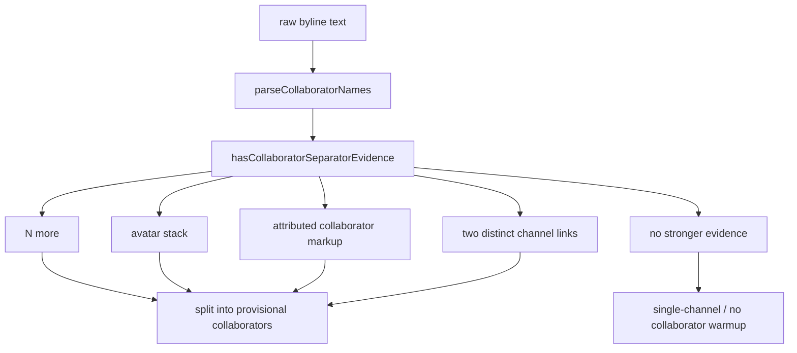

| Implementation row | Source pins | Current behavior | Residual risk |
| --- | --- | --- | --- |
| `separator_evidence_helper` | `js/content_bridge.js:3012-3021` | Centralizes admissible separator evidence: collapsed `N more`, avatar stack, attributed collaborator markup, or at least two distinct channel links. | Helper is DOM-evidence based; no first-class JSON/showSheet collaborator authority yet. |
| `watch_warmup_evidence_gate` | `js/content_bridge.js:4822-4851` | Watch-like warmup does not split bare `and` text unless helper evidence is true. | True text-only collaborations can wait for JSON/showSheet enrichment instead of provisional DOM warmup. |
| `dom_signal_evidence_gate` | `js/content_bridge.js:4944-4975` | DOM collaboration signal no longer returns true solely because a watch-like byline contains `and`. | No installed-tab trace proves every reusable YouTube lockup refresh path has this bytecode loaded. |
| `ytm_byline_evidence_gate` | `js/content_bridge.js:4604-4688`; `js/content_bridge.js:5218-5303`; `js/content_bridge.js:9665-9685` | YTM collapsed/explicit collaborator hints still enter collaborator mode, but bare byline text is not enough. | YTM compact/showSheet parity remains a JSON-first authority gap. |

Current separator evidence implementation status:

```text
implementation date: 2026-05-28
separator evidence implementation rows: 4
ASCII separator evidence diagram: present
Mermaid separator evidence diagram: present
single-channel and-name no-evidence false-positive risk: GATED
true text-only collaborator leak risk: PRESENT
runtime behavior changed by this addendum: yes
```

## Topic Stale Collaborator State Guard Addendum - 2026-05-28

This continuation records the narrow runtime guard added for the remaining
`Kully B & Gussy G - Topic` boundary after the parser and separator-evidence
fixes. Fresh current-source extraction already keeps the ampersand Topic byline
literal. The new guard also rejects stale, installed-tab, or synthetic
collaborator-shaped state when the visible byline is a literal `A & B - Topic`
label, the roster is name-only, and there is no stronger collaborator evidence.

```text
fresh Kully B & Gussy G - Topic byline
        |
        v
parser keeps ampersand literal -> no collaborator warmup

stale same-video data-filtertube-collaborators
        |
        v
ampersand Topic name-only guard compares visible byline to roster
        |
        v
clear collaborator attrs and delete resolved cache entry
        |
        v
promotion/action layer falls back to single-channel or unresolved state
```

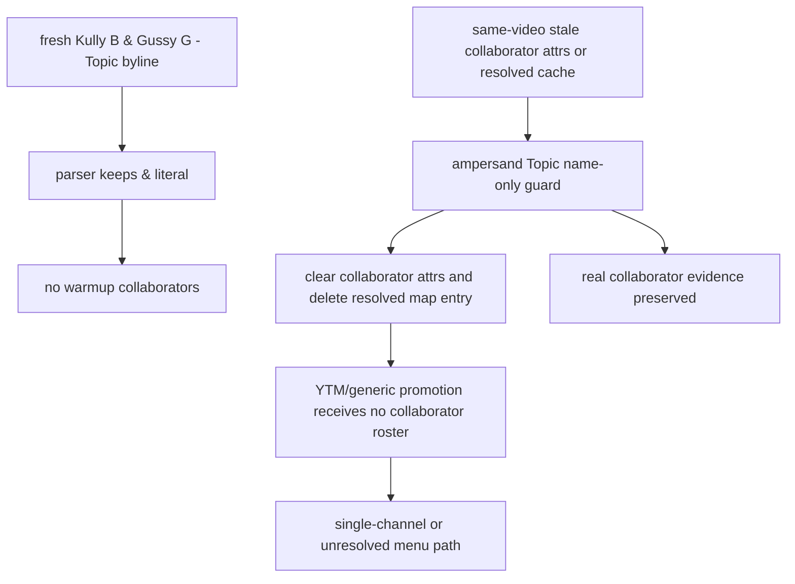

| Boundary row | Source pins | Current behavior | Remaining proof gap |
| --- | --- | --- | --- |
| `topic_parser_no_ampersand_split` | `js/content_bridge.js:2775-2830`; `js/content_bridge.js:4822-4850`; `js/content_bridge.js:4944-4975` | Fresh ampersand Topic bylines do not split and do not create a DOM collaboration signal. | No installed-tab byte parity trace proves the visible tab has reloaded this exact source. |
| `topic_cached_card_roster_guard` | `js/content_bridge.js:2673-2745`; `js/content_bridge.js:4976-5051` | `getValidatedCachedCollaborators()` now rejects same-video `data-filtertube-collaborators` when the visible label is a literal `A & B - Topic` byline and the cached roster is name-only; the writer helper reuses the same predicate before write paths. | This is a shape-specific negative guard, not a general cache provenance contract. |
| `topic_y_t_m_promotion_guard` | `js/content_bridge.js:4852-4920`; `js/content_bridge.js:4996-5058` | YTM promotion clears the same ampersand Topic name-only roster before it can become `isCollaboration`, and resolved-cache reads go through the same guard. | No installed-tab parity or JSON-first collaborator authority proof exists yet. |
| `topic_generic_promotion_guard` | `js/content_bridge.js:5064-5302` | Normalization and generic promotion demote the same ampersand Topic name-only state before collaborator rows reach channel-info or menu action state. | Broader stale collaborator provenance, route/source stamps, and true-collaboration text-only leak handling remain open. |
| `topic_menu_refresh_guard` | `js/content_bridge.js:874-935`; `tests/runtime/content-bridge-collaborator-identity-promotion-handoff-current-behavior.test.mjs` | Active menu refresh validates card and resolved collaborators through the ampersand Topic name-only guard before updating collaboration rows. | Installed Chrome tab parity and stale-attribute cleanup traces are still missing. |

Current Topic stale collaborator state status:

```text
topic stale collaborator state rows: 5
topic stale ampersand-topic guard rows: 4
topic stale action-layer trust rows: 0
topic stale installed-tab parity status: MISSING
topic stale collaborator state risk: GATED_FOR_NAME_ONLY_AMPERSAND_TOPIC
ASCII topic stale collaborator state diagram: present
Mermaid topic stale collaborator state diagram: present
runtime behavior changed by this addendum: yes
```

## Collaborator Cache Provenance Readiness Addendum - 2026-05-28

This continuation narrows the cache provenance state after the ampersand Topic
guard. The stale Topic case now has one shape-specific negative validator, but
general cache provenance is still not first-class. Current validation proves
that a card still points at the same video id and can reject literal
name-only `A & B - Topic` rosters, but it still does not prove which parser,
renderer, dialog, snapshot, route, list mode, settings revision, or grammar
evidence produced other collaborator rosters.

```text
same video id on card
        |
        v
data-filtertube-collaborators accepted
        |
        +--> ampersand Topic name-only roster is rejected
        +--> source label may exist, but validator does not make it authoritative
        +--> timestamp may exist, but validator does not age-check it
        +--> general grammar/evidence stamp is absent
        |
        v
promotion/menu paths can reuse non-Topic collaborator-shaped state
```

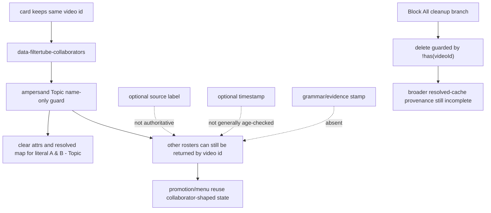

| Boundary row | Source pins | Current behavior | Remaining proof gap |
| --- | --- | --- | --- |
| `collab_cache_ampersand_topic_negative_guard` | `js/content_bridge.js:2673-2745`; `js/content_bridge.js:4976-5051` | `getValidatedCachedCollaborators()` extracts the live video id, accepts matching-video cache only after the ampersand Topic name-only negative guard, and clears that stale state when it matches the visible Topic byline; writer-side helpers now call the same predicate before writes. | This does not validate source, route, settings revision, parser version, or evidence provenance for non-Topic rosters. |
| `collab_cache_source_label_write_only` | `js/content_bridge.js:3501-3601`; `js/content_bridge.js:4284-4363` | `applyResolvedCollaborators()` and lockup hydration can write `data-filtertube-collaborators-source`, but the validator does not use that attribute as authority. | Source labels need an accepted-source policy and negative stale/source-mismatch fixtures before being trusted. |
| `collab_cache_by_id_without_source_stamp` | `js/content_bridge.js:3603-3707` | `applyCollaboratorsByVideoId()` writes `data-filtertube-collaborators` and `data-filtertube-collab-state` without a source label or timestamp. | Same cache attribute can be produced with different metadata completeness, so validation cannot infer provenance from shape. |
| `collab_cache_extraction_precedes_fresh_parse` | `js/content_bridge.js:4284-4310` | `extractCollaboratorMetadataFromElement()` returns validated cached collaborators before the later fresh extraction/parsing path. | Cache provenance must be checked before it can bypass fresh grammar gates. |
| `collab_cache_resolved_map_guarded_topic_only` | `js/content_bridge.js:4996-5058`; `js/content_bridge.js:5064-5302` | `getResolvedCollaboratorsForCard()` rejects the same ampersand Topic name-only roster, and the writer helper blocks that exact shape before common writes, but `resolvedCollaboratorsByVideoId` still stores non-Topic sanitized lists keyed by video id without companion provenance metadata. | Resolved-cache values need source, freshness, settings revision, and grammar-evidence metadata before they can be authoritative. |
| `collab_cache_block_all_cleanup_noop` | `js/content_bridge.js:12542-12546` | The Block All/Done cache cleanup branch currently calls `delete(cacheVideoId)` only inside `if (cacheVideoId && !resolvedCollaboratorsByVideoId.has(cacheVideoId))`, so populated stale entries are not deleted by that branch. | Cleanup needs a positive stale-entry invalidation report and a same-video negative fixture before a runtime fix is approved. |
| `collab_cache_installed_tab_cleanup_missing` | current installed Chrome tab evidence | No installed-tab byte parity or stale-attribute cleanup trace proves already-open YouTube documents have discarded old collaborator attrs/cache after the parser gate changed. | Release validation needs installed-tab source parity and a stale-state cleanup check. |

Current collaborator cache provenance readiness status:

```text
collaborator cache provenance readiness rows: 7
collaborator cache ampersand-topic guard rows: 1
collaborator cache source-label write-only rows: 2
collaborator cache stale-delete no-op rows: 1
collaborator cache provenance validation rows: 1
collaborator cache runtime behavior changed: yes
collaborator cache provenance risk: PARTIAL
ASCII collaborator cache provenance diagram: present
Mermaid collaborator cache provenance diagram: present
```

Future collaborator cache provenance symbols intentionally absent from product
runtime:

- `contentBridgeCollaboratorCacheProvenanceValidationReport`
- `contentBridgeCollaboratorCacheSourceLabelPolicy`
- `contentBridgeCollaboratorCacheStaleInvalidationReport`
- `contentBridgeResolvedCollaboratorGrammarEvidenceStamp`
- `contentBridgeCollaboratorCacheInstalledTabCleanupPlan`

Future Topic stale-state authority symbols intentionally absent from product
runtime:

- `contentBridgeTopicStaleCollaboratorStateReport`
- `contentBridgeCollaboratorCacheEvidenceGate`
- `contentBridgeCollaboratorCacheGrammarVersion`
- `contentBridgeCollaboratorCacheProvenanceStamp`
- `contentBridgeInstalledTabByteParityTrace`

## Installed Topic Menu Parity Addendum - 2026-05-29

This continuation records the current installed-tab failure mode reported for
`Kully B & Gussy G - Topic`: the visible lockup can already carry
`data-filtertube-collaborators`, `data-filtertube-expected-collaborators`, and
`data-filtertube-collab-state="resolved"` before the menu or quick-block layer
gets a chance to decide. Current source has an ampersand Topic negative guard at
validated reads and promotion reads, but the writer paths and action renderers
are still not a first-class grammar authority.

```text
visible byline: Kully B & Gussy G - Topic
        |
        v
writer/cache state can stamp collaborator-shaped attrs for the same video id
        |
        v
validated reads may clear the Topic roster
        |
        +--> menu renderer still renders if handed isCollaboration upstream
        +--> quick-block still builds Block All if handed two collaborators
        |
        v
release fix needs writer-side evidence gating plus installed-tab parity proof
```

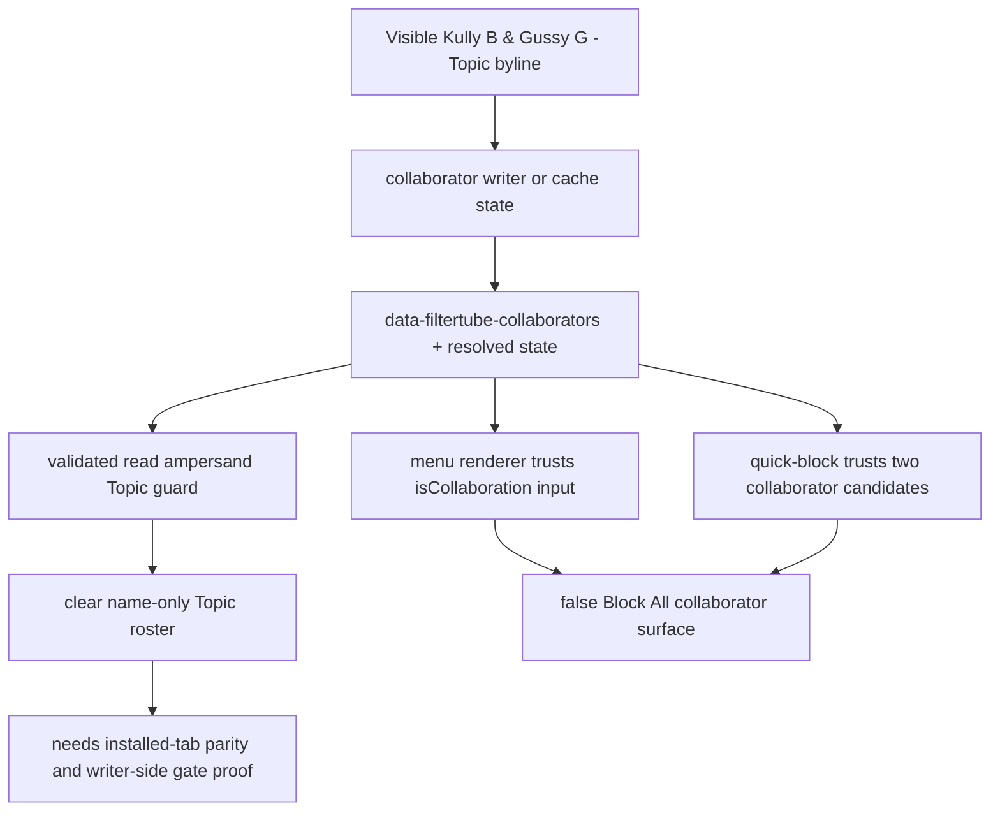

| Boundary row | Source pins | Current behavior | Release gap |
| --- | --- | --- | --- |
| `topic_installed_attr_shape` | user-reported installed Chrome DOM; `docs/audit/FILTERTUBE_CONTENT_BRIDGE_MENU_ACTION_LIST_TARGET_CURRENT_BEHAVIOR_2026-05-23.md:79-121` | The observed card had same-video collaborator attrs and the primary menu renderer fixture proves it will render member rows plus Block All if upstream state is already collaborator-shaped. | Need installed-extension byte parity and stale-attribute cleanup trace before claiming the live tab is on current source. |
| `topic_writer_video_id_only_gate` | `js/content_bridge.js:1594-1626`; `js/content_bridge.js:3501-3601`; `js/content_bridge.js:3603-3673` | Same-video writer gates prove card/video identity before stamping, and now reject literal ampersand Topic name-only rosters before writes. They still do not require source provenance, settings revision, parser version, or broad grammar evidence for non-Topic rosters. | General writer-side grammar/evidence authority is still not approved. |
| `topic_renderer_hydration_stamp_path` | `js/content_bridge.js:4284-4363`; `js/content_bridge.js:4482-4504` | Renderer hydration and cache-result promotion now reject literal ampersand Topic name-only rosters before caching collaborators, expected count, and resolved-map state. Some paths write a source label, while the cache-result promotion path calls `applyResolvedCollaborators()` without a source label. | Need accepted source policy and negative fixture parity around each non-Topic collaborator writer, not only Topic cleanup. |
| `topic_quick_block_action_trust_boundary` | `js/content/block_channel.js:1428-1640`; `docs/audit/FILTERTUBE_P0_RELEASE_PACKAGE_CURRENT_BEHAVIOR_2026-05-19.md:275-338` | Quick-block now strips literal ampersand Topic name-only rosters before it creates a Block All action, while preserving normal multi-collaborator action construction for non-Topic evidence. The Default Chrome profile is configured to load FilterTube from the workspace root, and the workspace byte snapshot contains the ampersand Topic fix token. | Quick-block still needs installed-tab parity proof that already-open YouTube documents were reloaded and are running the current content-script bytes. |
| `topic_menu_renderer_not_grammar_authority` | `docs/audit/FILTERTUBE_CONTENT_BRIDGE_MENU_ACTION_LIST_TARGET_CURRENT_BEHAVIOR_2026-05-23.md:79-121`; `tests/runtime/content-bridge-menu-action-list-target-current-behavior.test.mjs:499-526` | The menu renderer is intentionally an action renderer; it does not repair upstream collaborator-shaped state. | The runtime fix belongs upstream in extraction/cache/writer promotion, with a menu parity fixture proving no Topic rows are handed to render. |

Current installed Topic menu parity status:

```text
installed Topic menu parity rows: 5
installed Topic menu live DOM shape: OBSERVED_BY_USER
ampersand Topic reader guard status: PRESENT
collaborator writer grammar authority: NO-GO
quick-block Topic parity proof: PARTIAL_GO
menu renderer Topic parity proof: PARTIAL_GO_SOURCE
Default profile workspace path proof: PARTIAL
installed-tab byte parity trace: MISSING
runtime behavior changed by this addendum: no
```

Default profile workspace path proof comes from
`docs/audit/FILTERTUBE_P0_RELEASE_PACKAGE_CURRENT_BEHAVIOR_2026-05-19.md`.
It proves Chrome's Default profile is configured to load this workspace as the
unpacked FilterTube extension and that the workspace bytes contain the Topic
fix token. It still does not prove a specific already-open YouTube tab reloaded
the current content-script bytes.

## Topic Writer-Side Readiness Addendum - 2026-05-29

This continuation implements the narrow `Kully B & Gussy G - Topic` fix on the
source side that can create collaborator-shaped state. The installed menu
parity slice proves the menu and quick-block layers render what they receive;
this slice records where the runtime now stops the state before it becomes
`data-filtertube-collaborators`, a resolved-map entry, a refreshed open menu,
or a quick-block Block All candidate.

```text
sanitized collaborator list
        |
        v
writer-side negative guard runs here
        |
        +--> reject visible "A & B - Topic" name-only rosters without evidence
        +--> preserve stronger evidence: avatar stack, N more, distinct links,
             showSheet/dialog JSON, or complete collaborator identifiers
        |
        v
only accepted rosters may write attrs, resolved map, menu refresh, quick-block
```

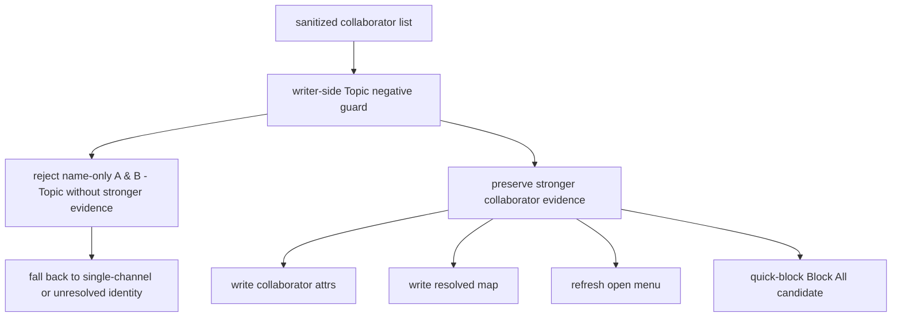

| Boundary row | Source pins | Current behavior | Future patch requirement |
| --- | --- | --- | --- |
| `topic_writer_guard_reuse_point` | `js/content_bridge.js:4976-5051`; `js/content_bridge.js:5064-5302` | A reusable guard now exists for literal ampersand Topic name-only rosters and is shared by reader, promotion, and writer paths. | Future work should keep this single visible-byline predicate as the Topic grammar owner. |
| `topic_apply_resolved_writer_guard` | `js/content_bridge.js:3501-3601` | `applyResolvedCollaborators()` now gathers matching cards plus the source card and calls `rejectAmpersandTopicCollaboratorWrite()` before serialization, card attrs, resolved-map state, active-menu refreshes, and fallback reruns. | General non-Topic collaborator provenance and source-policy proof remains missing. |
| `topic_apply_by_video_id_writer_guard` | `js/content_bridge.js:3603-3673` | `applyCollaboratorsByVideoId()` now gathers matching cards, source card, and pending entry card and rejects the Topic name-only roster before the resolved-map write and per-card attr write while preserving richer-roster skip behavior. | General non-Topic collaborator provenance and source-policy proof remains missing. |
| `topic_renderer_hydration_writer_guard` | `js/content_bridge.js:4284-4363` | Renderer hydration now rejects renderer-derived literal ampersand Topic name-only rosters before it can stamp `data-filtertube-collaborators`, source label `lockup`, timestamp, expected count, or resolved-map state. | Need installed-tab parity and non-Topic renderer-source policy proof. |
| `topic_cache_result_writer_guard` | `js/content_bridge.js:4422-4504` | `cacheResultAndMaybeEnrich()` now rejects best-list literal ampersand Topic rosters before cache-target writes or downstream `applyResolvedCollaborators()` promotion. | Cache-result promotion still lacks a source label for non-Topic rosters. |
| `topic_action_layer_non_fix_boundary` | `docs/audit/FILTERTUBE_CONTENT_BRIDGE_MENU_ACTION_LIST_TARGET_CURRENT_BEHAVIOR_2026-05-23.md:79-121`; `js/content/block_channel.js:1428-1640` | Menu rendering remains an action layer that trusts collaborator-shaped input, while quick-block now has a narrow ampersand Topic pre-action guard. | Do not fix menu by hiding rows after the fact; prove upstream state no longer hands Topic rosters to menu rendering. |

Current Topic writer-side readiness status:

```text
Topic writer-side readiness rows: 6
writer-side reusable guard available: PRESENT
applyResolved writer guard status: PRESENT_FOR_AMPERSAND_TOPIC_NAME_ONLY
applyByVideoId writer guard status: PRESENT_FOR_AMPERSAND_TOPIC_NAME_ONLY
renderer hydration writer guard status: PRESENT_FOR_AMPERSAND_TOPIC_NAME_ONLY
cache-result writer guard status: PRESENT_FOR_AMPERSAND_TOPIC_NAME_ONLY
action-layer patch as primary fix: NO-GO
narrow runtime patch approval from this addendum: USED_2026_05_29
runtime behavior changed by this addendum: yes
```

## Topic Quick-Block/Menu Clean-State Parity Fixture Addendum - 2026-05-29

This continuation adds an executable action-layer fixture for the same `Kully B
& Gussy G - Topic` case. This continuation now changes quick-block runtime
behavior narrowly: quick-block applies the same literal ampersand Topic
name-only guard before it builds Block All actions. The fixture proves the
clean-state consequence of the upstream writer guard and the stale-state action
guard: clean ampersand Topic state produces one single-channel quick-block
action, and stale collaborator-shaped `base.allCollaborators` input is stripped
before quick-block Block All construction. Menu rendering remains a downstream
action layer and is still not treated as grammar authority.
This means clean ampersand Topic state produces one single-channel quick-block action.
stale collaborator-shaped `base.allCollaborators` input is stripped before quick-block Block All construction.
quick-block now applies the same literal ampersand Topic negative guard before action construction.

```text
clean Topic card
        |
        v
no collaborator roster from writer/cache/extraction
        |
        v
quick-block single-channel action

stale collaborator-shaped card
        |
        v
base.allCollaborators has two names
        |
        v
ampersand Topic quick-block guard strips stale roster
        |
        v
quick-block single-channel action
```

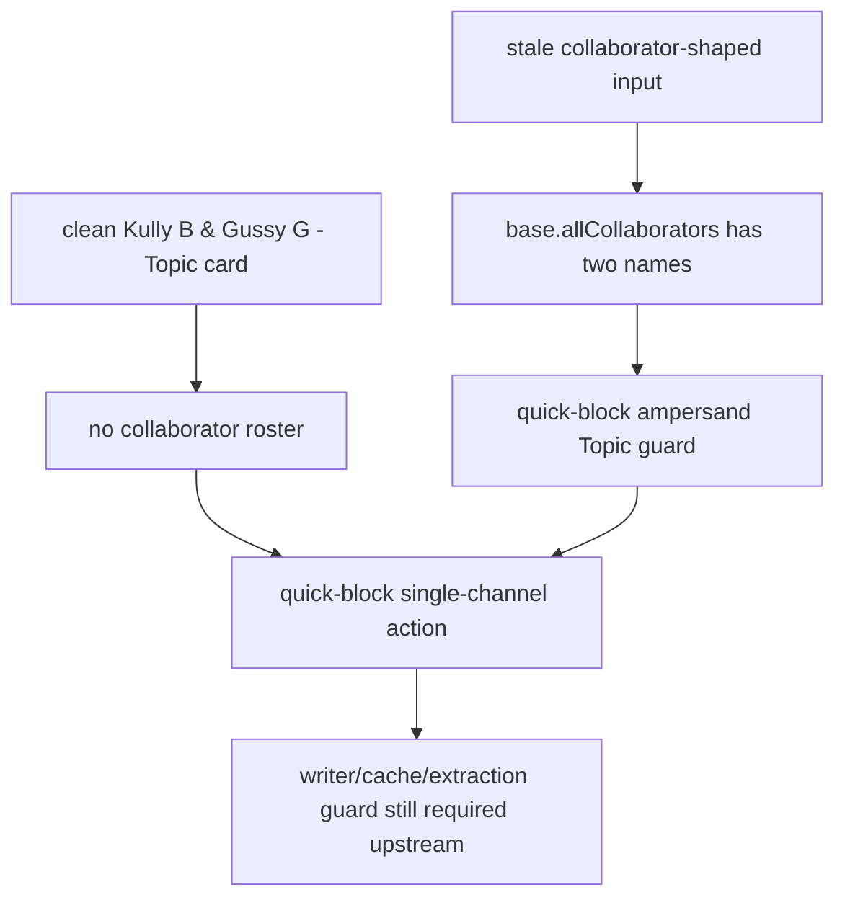

| Boundary row | Source pins | Current behavior | Release gap |
| --- | --- | --- | --- |
| `topic_quick_block_clean_single_channel_fixture` | `js/content/block_channel.js:1428-1640`; `tests/runtime/content-bridge-collaborator-identity-promotion-handoff-current-behavior.test.mjs` | Clean ampersand Topic state produces one single-channel quick-block action and no `data-is-block-all` attr. | Need installed-tab parity proving open YouTube documents are running this exact source and have cleared stale attrs/cache. |
| `topic_quick_block_stale_collaborator_shape_fixture` | `js/content/block_channel.js:1428-1640`; `tests/runtime/content-bridge-collaborator-identity-promotion-handoff-current-behavior.test.mjs` | Stale collaborator-shaped `base.allCollaborators` input is stripped by the quick-block ampersand Topic guard and falls back to one single-channel action. | Installed-tab parity is still needed because already-open tabs can run older bytes until reloaded. |
| `topic_menu_action_layer_boundary_fixture` | `docs/audit/FILTERTUBE_CONTENT_BRIDGE_MENU_ACTION_LIST_TARGET_CURRENT_BEHAVIOR_2026-05-23.md:79-121`; `js/content/block_channel.js:1428-1640`; `docs/audit/FILTERTUBE_P0_RELEASE_PACKAGE_CURRENT_BEHAVIOR_2026-05-19.md:275-338` | Menu rendering remains a trusted action renderer, while quick-block now has its own ampersand Topic pre-action guard. Default-profile workspace path proof is partial and does not replace live-tab byte proof. | Broader menu renderer parity still needs upstream state proof and installed-tab reload proof. |

Current Topic quick-block/menu clean-state parity fixture status:

```text
topic quick-block clean-state fixture rows: 3
quick-block clean-state Topic action: SINGLE_CHANNEL
stale collaborator-shaped quick-block action: SINGLE_CHANNEL_AFTER_TOPIC_GUARD
menu renderer action-layer grammar authority: NO-GO
quick-block full Topic parity authority: PARTIAL_GO
Default profile workspace path proof: PARTIAL
installed-tab byte parity trace: MISSING
runtime behavior changed by this addendum: yes
```

## Ampersand Topic Source Recheck Addendum - 2026-05-30

This recheck records the state after the user-observed installed tab still
showed `Kully B & Gussy G - Topic` with collaborator-shaped attributes and a
Block All-style menu. It is audit-only: no runtime code changed in this
addendum. The current source and focused tests prove the main parser, writer,
and quick-block paths reject literal ampersand Topic name-only rosters; they do
not prove an already-open YouTube document has reloaded the same bytes.

```text
observed installed tab
    |
    v
current source parser / writer / quick-block recheck
    |
    +--> source tests pass for ampersand Topic negative case
    |
    +--> JSON/showSheet tests still mark collaborator parity as partial
    |
    v
remaining discrepancy boundary: installed-tab byte parity or uncovered writer path
```

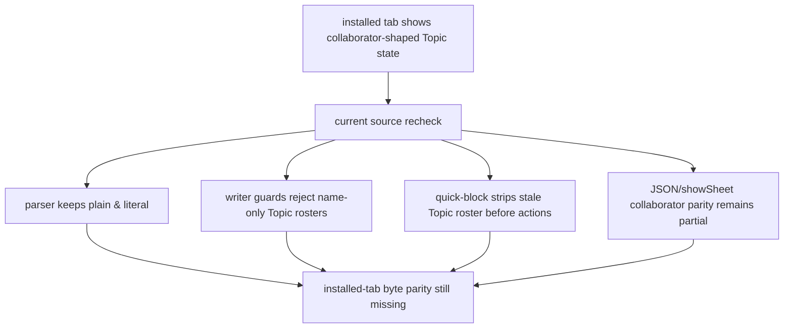

| Recheck row | Proof pins | Current behavior | Remaining proof gap |
| --- | --- | --- | --- |
| `topic_2026_05_30_source_parser_recheck` | `js/content_bridge.js:2775-2830`; `tests/runtime/content-bridge-collaborator-identity-promotion-handoff-current-behavior.test.mjs` | `Kully B & Gussy G - Topic` stays a literal byline; separator mode does not split plain `&`. | Needs installed-tab byte parity to prove the live page is running the current source. |
| `topic_2026_05_30_writer_guard_recheck` | `js/content_bridge.js:3501-3601`; `js/content_bridge.js:3603-3675`; `js/content_bridge.js:4325-4367`; `js/content_bridge.js:4422-4493`; `js/content_bridge.js:5992-6030` | Main resolved-cache and renderer writer paths reject ampersand Topic name-only rosters before collaborator attrs are stamped. | `normalizeCollaboratorChannelInfoForCard()` cache priming remains source-reviewed but still lacks installed-tab parity. |
| `topic_2026_05_30_quick_block_recheck` | `js/content/block_channel.js:1428-1453`; `tests/runtime/content-bridge-collaborator-identity-promotion-handoff-current-behavior.test.mjs` | Clean state produces a single-channel action; stale `base.allCollaborators` Topic input is stripped before Block All construction. | Needs live menu parity on a reloaded installed YouTube tab. |
| `topic_2026_05_30_json_show_sheet_scope` | `tests/runtime/json-path-authority-current-behavior.test.mjs`; `tests/runtime/ytm-show-sheet-collaborator-roster-current-behavior.test.mjs`; `tests/runtime/ytm-show-sheet-enrichment-handoff-current-behavior.test.mjs` | JSON/showSheet tests pass but still declare collaborator channel parity partial and outside filter authority. | JSON-first collaborator authority remains a separate future gate. |
| `topic_2026_05_30_installed_discrepancy_boundary` | User-observed live DOM shape plus source test run on 2026-05-30. | If a live tab still shows Block All for this Topic label, current evidence points to stale installed bytes, unreloaded content scripts, or an uncovered writer path. | Need byte-level installed-tab trace before calling the installed behavior closed. |

Current 2026-05-30 ampersand Topic recheck status:

```text
2026-05-30 ampersand Topic source recheck rows: 5
current source Topic parser proof: GO_SOURCE
current source writer guard proof: GO_SOURCE
current source quick-block guard proof: GO_SOURCE
JSON/showSheet collaborator parity: PARTIAL_NO_AUTHORITY
installed-tab byte parity trace: MISSING
runtime behavior changed by this addendum: no
```

## Installed Topic Reload Parity Gap Addendum - 2026-05-30

This continuation answers the installed-tab discrepancy without changing runtime
behavior. The workspace source and focused executable tests now agree that
`Kully B & Gussy G - Topic` must remain a single Topic channel label unless
stronger collaborator evidence exists. If an already-open YouTube document still
renders Block All collaborator rows for that label, the proof gap is not the
source parser itself; it is one of two remaining boundaries: the installed tab is
running stale content-script bytes, or a writer path not covered by the current
Topic guard is stamping collaborator-shaped state before the menu opens.

```text
workspace source passes Topic negative tests
    |
    +--> parser, writer, cache, quick-block guards are source-backed
    |
    v
installed tab still shows collaborator-shaped Topic menu
    |
    +--> stale content-script bytes / unreloaded YouTube document
    |
    +--> uncovered writer path before menu rendering
    |
    v
no release closure until installed-tab byte parity or uncovered writer proof exists
```

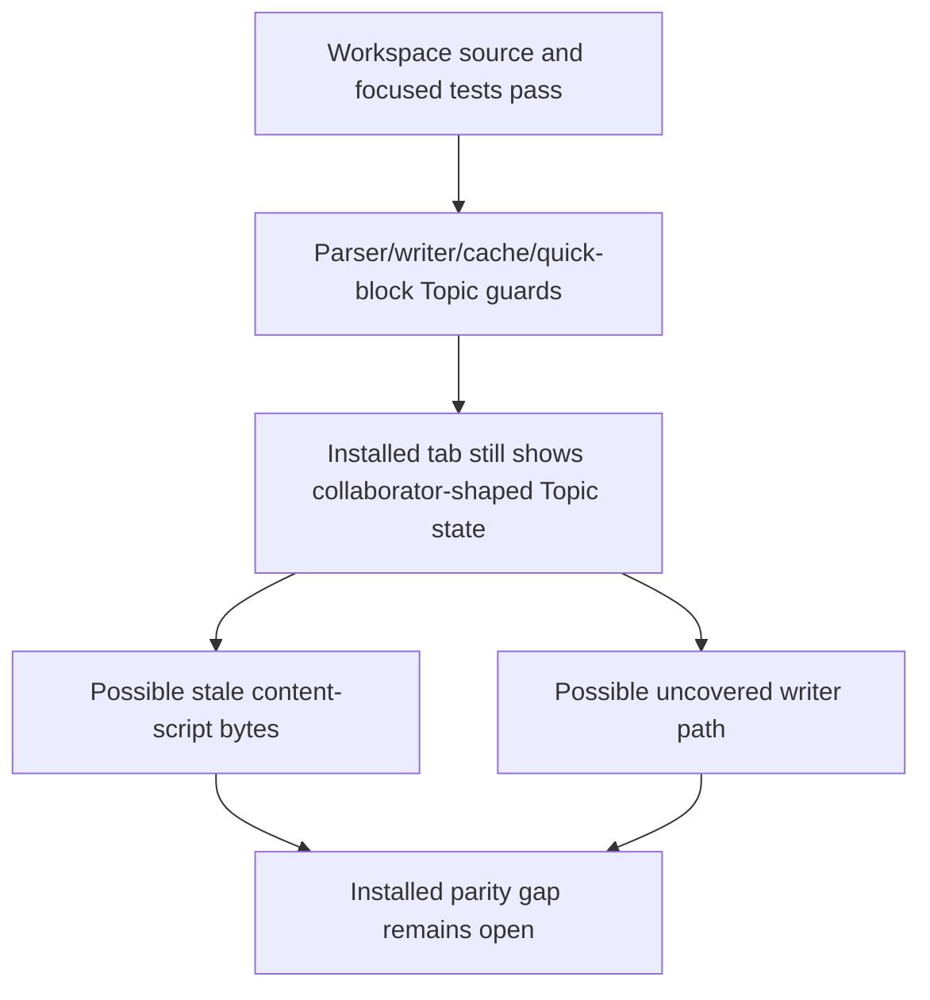

| Installed parity row | Proof pins | Current interpretation | Remaining proof gap |
| --- | --- | --- | --- |
| `topic_reload_parity_source_guard` | `tests/runtime/content-bridge-collaborator-identity-promotion-handoff-current-behavior.test.mjs`; `tests/runtime/content-bridge-collaborator-metadata-extraction-side-effect-boundary-current-behavior.test.mjs` | Focused source tests prove literal ampersand Topic bylines do not split and clean quick-block action state is single-channel. | Need installed-tab byte/version trace from the active YouTube document. |
| `topic_reload_parity_stale_tab_boundary` | User-observed installed DOM; `Ampersand Topic Source Recheck Addendum - 2026-05-30` | A live tab can retain older content-script behavior until the YouTube document reloads or the extension is reloaded. | Need a reloaded-tab observation before deciding the live behavior is current-source behavior. |
| `topic_reload_parity_writer_boundary` | `js/content_bridge.js:3501-3601`; `js/content_bridge.js:3603-3675`; `js/content_bridge.js:4325-4367`; `js/content_bridge.js:4422-4493` | Known writer paths reject literal ampersand Topic name-only rosters before resolved-cache or card attrs are written. | Need a route/surface writer-path matrix proving no uncovered path can stamp the same shape. |
| `topic_reload_parity_menu_boundary` | `docs/audit/FILTERTUBE_CONTENT_BRIDGE_MENU_ACTION_LIST_TARGET_CURRENT_BEHAVIOR_2026-05-23.md:79-121` | Menu rendering is an action layer and should not be made the grammar owner. | Need upstream state proof that menu input is already single-channel for this Topic case. |

Current installed Topic reload parity gap status:

```text
installed Topic reload parity rows: 4
source-focused Topic guard tests: PASS
runtime behavior changed by reload parity addendum: no
installed reloaded-tab byte trace: MISSING
uncovered writer-path proof: MISSING
menu-layer grammar fix approval: NO-GO
```

## Topic Writer-Path Source Census Addendum - 2026-05-30

This audit-only continuation narrows the second branch from the installed-tab
reload gap. It enumerates current-source paths that can stamp
`data-filtertube-collaborators`, write resolved collaborator cache state, or
hand collaborator-shaped state to the menu for the `Kully B & Gussy G - Topic`
boundary. It does not prove the user's already-open YouTube tab has reloaded the
same bytes, and it does not approve a menu-layer grammar fix.

```text
current source collaborator-shaped state
    |
    +--> DOM attr writers
    |       |
    |       +--> ampersand Topic guard before known content_bridge writes
    |
    +--> resolved-map writers
    |       |
    |       +--> applyResolved funnels are guarded
    |       +--> menu-promise writes are admitted only after normalized collaboration state
    |
    +--> non-writer readers / action layers
            |
            +--> quick-block strips stale Topic roster before actions
            +--> menu rendering remains downstream action rendering
```

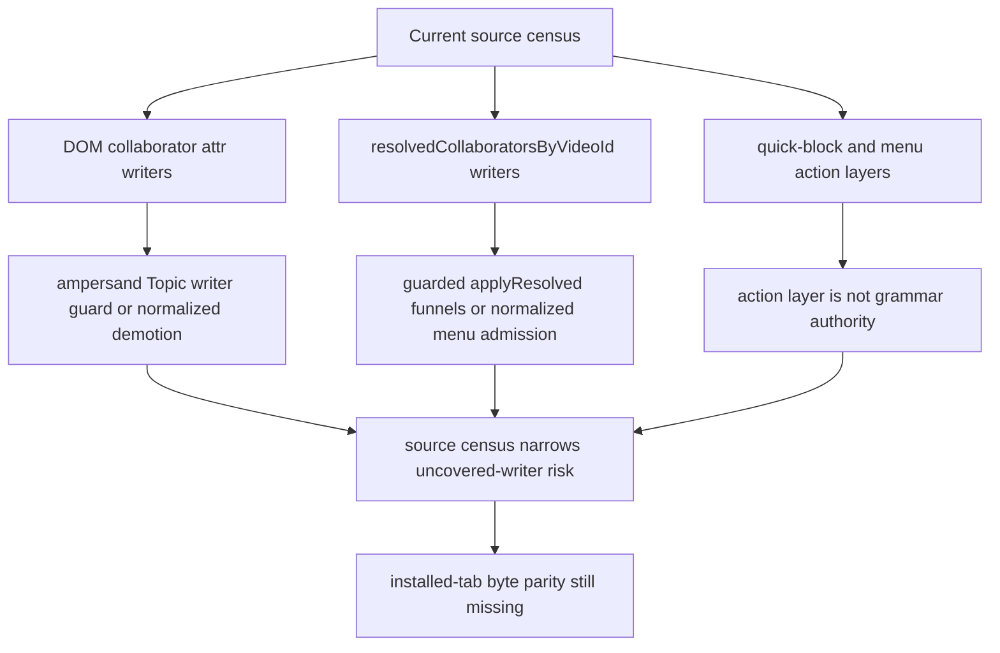

| Source-census row | Proof pins | Current-source interpretation | Remaining proof gap |
| --- | --- | --- | --- |
| `topic_writer_census_active_menu_refresh_attr` | `js/content_bridge.js:876-935` | `refreshActiveCollaborationMenu()` chooses the best collaborator list, rejects literal ampersand Topic name-only state before the `data-filtertube-collaborators` write, and then renders the active menu. | Installed-tab byte parity and broader non-Topic provenance remain missing. |
| `topic_writer_census_apply_resolved_attr` | `js/content_bridge.js:3501-3576` | `applyResolvedCollaborators()` gathers same-video candidates plus the source card and calls `rejectAmpersandTopicCollaboratorWrite()` before card attrs, resolved map state, active-menu refresh, and fallback reruns. | Non-Topic source-label and evidence authority remain incomplete. |
| `topic_writer_census_apply_by_video_id_attr` | `js/content_bridge.js:3603-3675` | `applyCollaboratorsByVideoId()` gathers matching cards, pending entry card, and optional source card, then rejects the Topic name-only roster before the resolved-map write and per-card attr writes. | This path still lacks source/timestamp stamps for non-Topic rosters. |
| `topic_writer_census_renderer_hydration_attr` | `js/content_bridge.js:4309-4368` | Renderer hydration rejects a renderer-derived ampersand Topic name-only roster before it can stamp card attrs or call `applyResolvedCollaborators()`. | Installed route/surface parity for renderer-derived non-Topic rosters remains missing. |
| `topic_writer_census_cache_result_attr` | `js/content_bridge.js:4422-4494` | `cacheResultAndMaybeEnrich()` rejects the best-list Topic name-only roster before cache-target attrs, resolved-map promotion, and downstream `applyResolvedCollaborators()`. | Cache-result source-label policy for non-Topic rosters remains open. |
| `topic_writer_census_normalize_prime_attr` | `js/content_bridge.js:5064-5192` | `normalizeCollaboratorChannelInfoForCard()` demotes visible ampersand Topic name-only collaboration state, reads resolved cache through `getResolvedCollaboratorsForCard()`, and only primes attrs after validated cache comparison. | This row is source-census proof, not live-tab cleanup proof. |
| `topic_writer_census_message_entry_funnels` | `js/content_bridge.js:3464-3490`; `js/content_bridge.js:5992-6030`; `js/content_bridge.js:6048-6067` | Main-world collaborator responses, `FilterTube_CacheCollaboratorInfo`, and dialog data funnel into `applyResolvedCollaborators()`, so known content-bridge attr writes still pass the shared Topic writer guard. | The main-world extractor/cache still lacks full JSON-first collaborator authority. |
| `topic_writer_census_menu_promise_map_writes` | `js/content_bridge.js:11099-11176`; `js/content_bridge.js:11368-11390` | Menu enrichment promises can write `resolvedCollaboratorsByVideoId`, but they are not DOM attr stampers and are reached after `normalizeCollaboratorChannelInfoForCard()` and collaboration admission. | Direct resolved-map provenance and installed-tab parity remain partial for non-Topic rosters. |
| `topic_writer_census_non_writer_boundaries` | `js/content/block_channel.js:1428-1640`; `js/filter_logic.js:1899`; `js/injector.js:1897-2000`; `js/injector.js:3270-3385`; `js/content/dom_extractors.js:126-163` | Quick-block strips stale Topic rosters before action construction; filter logic posts collaborator data; injector caches or reads collaborator state; DOM extractors only read/remove attrs in this boundary. | Action-layer/menu parity and JSON-first promotion remain separate future gates. |

Current Topic writer-path source census status:

```text
Topic writer-path source census rows: 9
DOM collaborator attr writer rows covered: 6
resolved-map writer rows covered: 5
entrypoint funnel rows covered: 3
known content_bridge DOM attr writer coverage: PRESENT_FOR_AMPERSAND_TOPIC_NAME_ONLY
uncovered writer-path proof from source census: PARTIAL_SOURCE_CENSUS
installed reloaded-tab byte trace: MISSING
runtime behavior changed by writer-path census addendum: no
menu-layer grammar fix approval: NO-GO
```

## Ampersand Topic Root-Cause Boundary Addendum - 2026-05-30

This audit-only continuation states the cause boundary for the user-observed
`Kully B & Gussy G - Topic` menu. Current source does not use a plain `&` as a
collaborator separator. The false collaborator menu appears only after an
upstream path has already handed the action layer a collaborator-shaped roster,
such as `[{ name: "Kully B" }, { name: "Gussy G - Topic" }]`, plus same-video
collaborator attrs, resolved-cache state, or `isCollaboration` channel info.
The menu renderer and quick-block action builder are downstream consumers of
that shape; they are not the grammar authority for deciding whether `&` means a
collaboration.

```text
visible label: Kully B & Gussy G - Topic
        |
        +--> current parser keeps plain & literal
        |
        +--> false menu requires upstream collaborator-shaped state
                |
                +--> stale installed bytes / old open tab
                +--> stale same-video cache attrs
                +--> uncovered writer path
        |
        v
current source rejects name-only ampersand Topic rosters before writer/menu/quick-block trust
```

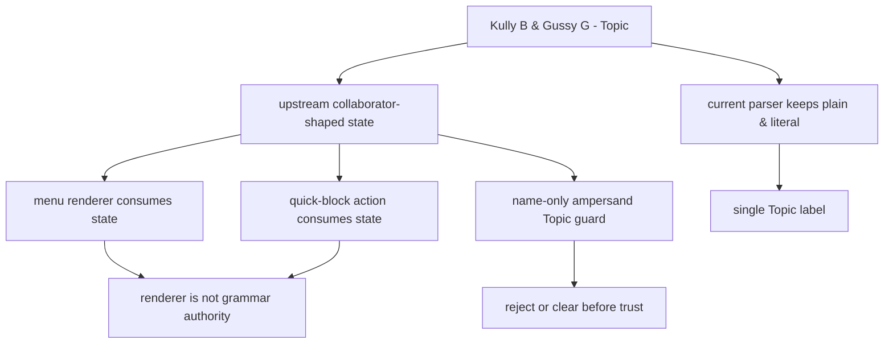

| Root-cause row | Proof pins | Current-source interpretation | Remaining proof gap |
| --- | --- | --- | --- |
| `topic_root_cause_plain_ampersand` | `js/content_bridge.js:2775-2830`; `js/content_bridge.js:4822-4851` | Plain `&` is not split by the current separator parser, and a fresh watch-like `Kully B & Gussy G - Topic` byline produces no warmup collaborators. | Installed-tab byte parity is still missing for already-open YouTube documents. |
| `topic_root_cause_upstream_shape` | User-observed DOM attrs; `js/content_bridge.js:2673-2745`; `js/content_bridge.js:4976-5058` | The observed Block All surface requires collaborator-shaped upstream state; current reads reject the exact name-only ampersand Topic shape when it matches the visible byline. | Stale open-tab cleanup and broader cache provenance remain incomplete. |
| `topic_root_cause_writer_guard` | `js/content_bridge.js:3501-3601`; `js/content_bridge.js:3603-3675`; `js/content_bridge.js:4309-4368`; `js/content_bridge.js:4422-4494`; `js/content_bridge.js:5064-5192` | Known current-source writer paths reject or demote literal ampersand Topic name-only rosters before card attrs or normalized collaborator state are trusted. | Source census is not a live installed-tab trace and not a full non-Topic provenance policy. |
| `topic_root_cause_action_layer` | `js/content_bridge.js:11046-11101`; `js/content/block_channel.js:1428-1640` | Menu rendering consumes `isCollaboration`; quick-block strips stale ampersand Topic rosters before Block All, but neither layer should become the primary byline grammar owner. | Menu parity still needs upstream state proof on a reloaded installed tab. |
| `topic_root_cause_true_collab_preservation` | `js/content_bridge.js:3012-3021`; `js/content_bridge.js:4944-4975` | Stronger collaborator evidence still admits real collaborations through `N more`, avatar stack, attributed collaborator markup, distinct links, or richer identifiers; the Topic guard is shape-specific. | True text-only collaborator leak analysis and JSON-first collaborator authority remain separate future gates. |

Current ampersand Topic root-cause boundary status:

```text
ampersand Topic root-cause rows: 5
menu root-cause status: DOWNSTREAM_RENDERER_NOT_CLASSIFIER
current source fresh parser status: NO_PLAIN_AMPERSAND_SPLIT
current source stale name-only roster status: REJECTED_FOR_VISIBLE_TOPIC_LABEL
true collaborator preservation status: STRONGER_EVIDENCE_STILL_ADMITTED
runtime behavior changed by root-cause addendum: no
```

## Installed Chrome DOM Evidence Boundary - 2026-05-30

This audit-only continuation records what the connected user Chrome profile can
prove without claiming installed extension byte parity. The live user tab was
`https://www.youtube.com/watch?v=aJOTlE1K90k` with title
`Maroon 5 - Girls Like You ft. Cardi B (Official Music Video) - YouTube`. A
read-only DOM probe showed FilterTube is actively stamping the installed
YouTube document, but the browser safety policy blocked direct navigation to
`chrome-extension://gkgjigdfdccckblmglboobikfcpeelio/js/content_bridge.js`.
Therefore this is installed-DOM evidence only, not a proof that the open tab is
running byte-identical current workspace source.

```text
live installed YouTube tab
        |
        +--> data-filtertube-route-watch=true
        +--> 301 FilterTube-stamped DOM nodes
        +--> 236 data-filtertube-video-id attrs
        +--> 235 processed card attrs
        +--> 20 hidden card/container attrs
        +--> 4 quick-block event wrappers
        |
        +--> no data-filtertube-collaborators attrs observed in this sampled tab
        |
        +--> direct chrome-extension source resource probe blocked by browser policy
        |
        v
installed extension activity: OBSERVED
installed source byte parity: NOT_PROVED
```

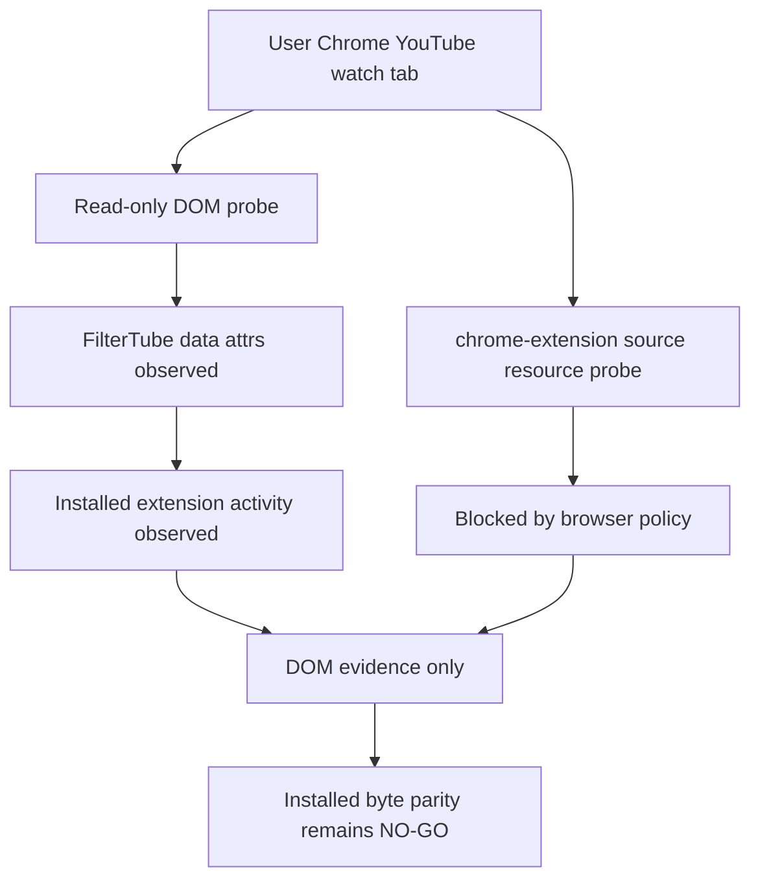

| Installed Chrome evidence row | Observed proof | Current interpretation | Remaining proof gap |
| --- | --- | --- | --- |
| `installed_chrome_dom_activity_observed` | User Chrome tab `https://www.youtube.com/watch?v=aJOTlE1K90k`; `data-filtertube-route-watch=true`; 301 FilterTube-stamped DOM nodes. | The installed extension is active in the connected user profile and the page is not a scratch/private Chrome profile. | This does not prove source-byte parity or the `Kully B & Gussy G - Topic` negative fixture on the live tab. |
| `installed_chrome_dom_processing_counts` | 236 `data-filtertube-video-id`, 235 `data-filtertube-processed`, 235 `data-filtertube-last-processed-mode`, 67 `data-filtertube-channel-id`, 34 `data-filtertube-channel-handle`, and 20 `data-filtertube-hidden` attrs. | The installed content runtime is processing and hiding live YouTube cards under blocklist mode. | Counts are one sampled live tab and are not a route/mode performance metric artifact. |
| `installed_chrome_quick_block_presence` | 4 `data-filtertube-quick-events` and 4 `data-filtertube-quick-wrap-events` attrs. | Quick-block wrappers are present on the live installed tab. | This does not prove quick-block Topic parity or restored homepage Shorts cross-button behavior. |
| `installed_chrome_collaborator_absence_sample` | 0 `data-filtertube-collaborators` attrs were observed in the sampled tab attr census. | The sampled Maroon 5 watch tab did not expose collaborator-shaped DOM state during the probe. | The observed tab is not the `Kully B & Gussy G - Topic` case and cannot close Topic installed-tab parity. |
| `installed_chrome_byte_parity_blocked` | Direct browser navigation to `chrome-extension://gkgjigdfdccckblmglboobikfcpeelio/js/content_bridge.js` was blocked by the browser-use URL policy. | The audit must not claim installed source byte parity from this browser session. | Need an allowed installed-resource hash path or reload/source provenance artifact before release/public claims. |

Current installed Chrome DOM evidence status:

```text
installed Chrome DOM evidence rows: 5
installed Chrome sampled URL: https://www.youtube.com/watch?v=aJOTlE1K90k
installed Chrome FilterTube stamped nodes observed: 301
installed Chrome processed card attrs observed: 235
installed Chrome hidden attrs observed: 20
installed Chrome collaborator attrs observed in sampled tab: 0
installed Chrome source resource probe: BLOCKED_BY_BROWSER_POLICY
installed Chrome extension activity status: OBSERVED_DOM_STAMPS
installed Chrome source byte parity status: NOT_PROVED
runtime behavior changed by installed Chrome DOM evidence addendum: no
```

## Risk Boundary

This boundary is where collaborator evidence stops being only metadata and becomes matchable channel identity. That is useful for fixing collaborator and watch/YTM surfaces, but it also means a call path that appears to be ordinary channel extraction can run side-effecting collaborator extraction, prefer global resolved rosters, write card collaborator attrs, and classify a card as `isCollaboration`.

The current behavior is relevant to reliability, false-hide/leak risk, performance, code-burden, JSON-first identity readiness, whitelist/list-mode behavior, playlist fallback, menu identity, and route/profile confidence. This audit slice now includes one implementation change in the byline separator gate; it still records the broader promotion points that later optimization must gate or split into pure-read and side-effecting modes.

## Missing Future Proof

No product runtime symbol exists yet for:

- `contentBridgeCollaboratorIdentityPromotionContract`
- `contentBridgeCollaboratorIdentityPromotionDecision`
- `contentBridgeCollaboratorPromotionSideEffectReport`
- `contentBridgeCollaboratorPromotionPureReadPolicy`
- `contentBridgeCollaboratorPromotionCallerPolicy`
- `contentBridgeCollaboratorPromotionRouteScopeReport`
- `contentBridgeCollaboratorPromotionCacheWriteReport`
- `contentBridgeCollaboratorPromotionFixtureProvenance`
- `contentBridgeCollaboratorPromotionMetricArtifact`
- `contentBridgeCollaboratorPromotionAuthorityGate`

This slice does not close the audit rows for collaborator identity promotion contracts, promotion decisions, caller-side side-effect budgets, pure-read promotion policy, route/profile/list-mode scope reports, cache-write reports, `extractChannelFromCard()` handoff policy, fixture provenance, metrics, or first-class collaborator promotion gates.

## Method Semantic Proof Gap Boundary

`docs/audit/FILTERTUBE_METHOD_SEMANTIC_PROOF_GAP_INDEX_CURRENT_BEHAVIOR_2026-05-25.md`
is a required source input before this menu/dialog/injector/quick-block
surface can support runtime optimization. Current proof pins:

```text
method semantic proof gap files covered: 63
method semantic proof gap lexical callables covered: 5473
files with complete per-callable semantic proof: 0
lexical callables requiring semantic proof before behavior changes: 5473
affected callable semantic proof: NO-GO
runtime behavior changed: no
```

These counts are audit-only blockers. They do not approve runtime
optimization, JSON-first behavior, menu action behavior, dialog lifecycle
behavior, injector behavior, quick-block behavior, whitelist behavior, metric
collectors, artifact creation, native sync, release package changes, or public
claims.
