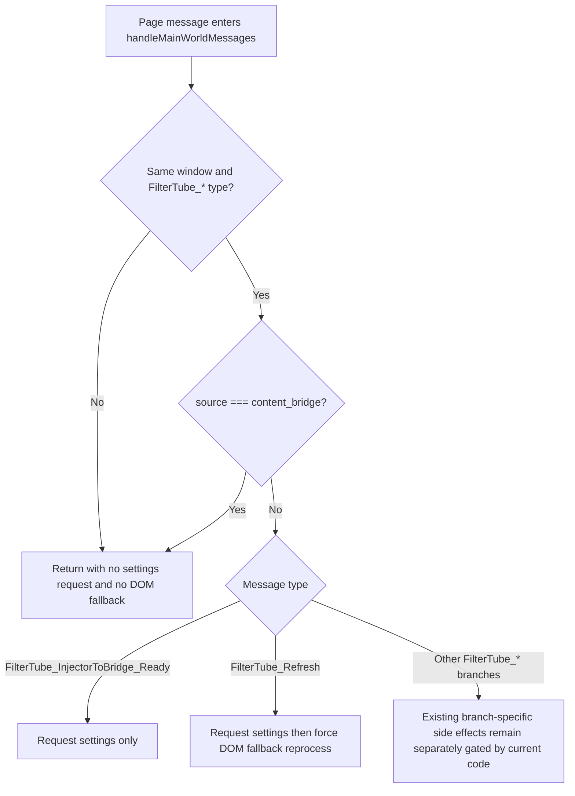

# FilterTube Content Bridge Main-World Message Dispatch Boundary - Current Behavior Audit (2026-05-23)

Status: current-behavior proof with a narrow learned-map no-op DOM work fix.

Runtime behavior changed only for duplicate learned-map page messages that do
not change video-channel/video-meta rows. This is not a broad message-trust,
JSON-first, or page-message authority patch.

This slice narrows the existing page-message trust audit to the exact
`handleMainWorldMessages(event)` receiver in `js/content_bridge.js`. It records
which `FilterTube_*` page messages can currently drive settings refresh,
learned identity writes, storage writes, DOM reruns, pending request resolution,
and collaborator application from the content bridge.

runtime content bridge main-world message dispatch fixtures: 8
message dispatch executable ingress rows: 5
message dispatch executable behavior changed: no
message dispatch executable approval: NO-GO

## Evidence Inputs

- `js/content_bridge.js`
  - lines: 13571
  - bytes: 601694
  - sha256: `1dafb0bf979d391d2a3be827700e39114bc02b839cd26ddc8635a1127a0327b3`

## Selected Source Metrics

- handler lines: 236
- handler bytes: 11060
- handler FilterTube type branches: 12
- handler startsWith FilterTube tokens: 1
- handler source content_bridge guard tokens: 1
- handler event.source window guards: 1
- handler event.origin tokens: 0
- handler nonce tokens: 0
- handler trustedSource tokens: 0
- handler allowedSource tokens: 0
- handler pending request get tokens: 5
- handler pending map get tokens: 1
- handler clearTimeout tokens: 4
- handler setTimeout tokens: 1
- handler requestAnimationFrame tokens: 1
- handler applyDOMFallback tokens: 3
- handler persistChannelMappings tokens: 1
- handler persistVideoChannelMapping tokens: 1
- handler persistVideoMetaMapping tokens: 1
- handler storage local set tokens: 1
- handler stampChannelIdentity tokens: 2
- handler applyResolvedCollaborators tokens: 4
- handler sanitizeCollaboratorList tokens: 2
- handler document.querySelectorAll tokens: 3
- handler document.querySelector tokens: 4
- handler sourceLabel tokens: 2
- handler force true tokens: 3
- handler return statements: 10
- handler browserAPI_BRIDGE tokens: 2

## Current Message Inventory

The receiver currently accepts same-window messages whose `event.data.type`
starts with `FilterTube_`, then drops only messages labelled
`source === 'content_bridge'`.

Current branch inventory:

- `FilterTube_InjectorToBridge_Ready`
- `FilterTube_Refresh`
- `FilterTube_UpdateChannelMap`
- `FilterTube_UpdateVideoChannelMap`
- `FilterTube_UpdateVideoMetaMap`
- `FilterTube_UpdateCustomUrlMap`
- `FilterTube_CollaboratorInfoResponse`
- `FilterTube_SubscriptionsImportProgress`
- `FilterTube_SubscriptionsImportResponse`
- `FilterTube_CacheCollaboratorInfo`
- `FilterTube_ChannelInfoResponse`
- `FilterTube_CollabDialogData`

No `event.origin`, nonce, trusted-source, allowed-source, sender capability,
route, host, or settings revision check exists in this handler today.

## Current Side-Effect Classes

| Message class | Current side effects | Current ownership gap |
|---|---|---|
| Readiness and refresh | `FilterTube_InjectorToBridge_Ready` calls `requestSettingsFromBackground()`. `FilterTube_Refresh` requests settings and calls `applyDOMFallback(..., { forceReprocess: true })`. | Refresh has no pending request id, background-broadcast proof, or nonce. |
| Learned channel identity | `FilterTube_UpdateChannelMap` calls `persistChannelMappings(payload)`. `FilterTube_UpdateVideoChannelMap` persists video/channel pairs, stamps cards by video id or anchor lookup, then schedules `applyDOMFallback(null)` in `requestAnimationFrame`. | Map writes and reruns are accepted from same-window messages without owned page-world request proof. |
| Learned video metadata | `FilterTube_UpdateVideoMetaMap` persists metadata, touches matching DOM state, and schedules `scheduleVideoMetaDomRerun()` when DOM was touched. | Metadata writes are not tied to an active metadata filter reason or bounded schema authority. |
| Custom URL map | `FilterTube_UpdateCustomUrlMap` reads and writes `browserAPI_BRIDGE.storage.local` `channelMap`. | Storage write is not pending-request or sender-class gated. |
| Pending responses | Collaborator, channel, and subscription responses use `requestId` to look up pending maps and clear timers. Subscription progress can rearm a timeout. | Pending request ids are local correlation checks, not sender capability or nonce proof. |
| Unsolicited collaborator data | `FilterTube_CacheCollaboratorInfo` and `FilterTube_CollabDialogData` can call `applyResolvedCollaborators(...)` with `force: true`. | Cache/dialog data can apply by video id without a pending request id. |

## Message Ingress Executable Continuation - 2026-05-28

The current test now executes the real `handleMainWorldMessages(event)` source
slice in a VM harness for the low-cost ingress and refresh/readiness branches.
This is audit-only executable proof, not a runtime patch.

```text
off-window FilterTube_* message
        |
        v
return before settings request or DOM fallback

same-window non-FilterTube_* message
        |
        v
return before settings request or DOM fallback

same-window FilterTube_* message from content_bridge
        |
        v
return before settings request or DOM fallback

same-window FilterTube_InjectorToBridge_Ready
        |
        v
requestSettingsFromBackground()

same-window FilterTube_Refresh
        |
        v
requestSettingsFromBackground() -> applyDOMFallback(..., { forceReprocess: true })
```



Executable rows pinned:

| Row | Message shape | Current executable result |
|---|---|---|
| 1 | Off-window `FilterTube_Refresh` | No settings request, no DOM fallback. |
| 2 | Same-window non-`FilterTube_*` message | No settings request, no DOM fallback. |
| 3 | Same-window `FilterTube_Refresh` from `source: 'content_bridge'` | No settings request, no DOM fallback. |
| 4 | Same-window `FilterTube_InjectorToBridge_Ready` | Calls `requestSettingsFromBackground()`. |
| 5 | Same-window `FilterTube_Refresh` | Calls `requestSettingsFromBackground()`, then `applyDOMFallback(..., { forceReprocess: true })`. |

This narrows the listener no-work proof for noisy SPA pages: unrelated messages
do not reach settings refresh or DOM fallback, but the always-installed listener
still has no origin, nonce, sender capability, route, host, settings revision,
or side-effect budget authority. The continuation keeps page-message listener
changes, refresh ownership changes, learned-map message policy changes,
JSON-first promotion, whitelist optimization, metric artifacts, and first-class
message dispatch authority at `NO-GO`.

## Risk Register

- Reliability: refresh, map persistence, and collaborator application share one
  same-window receiver without a per-message owner report.
- False-hide/leak: spoofed or stale learned identity messages can stamp
  channel/collaborator metadata and rerun DOM fallback against unrelated cards.
- Performance: page messages can force DOM fallback, query selectors, storage
  reads/writes, timeout rearming, and animation-frame reruns without a dispatch
  budget artifact.
- Code burden: pending request correlation, learned identity writes, storage
  writes, and unsolicited collaborator application are all implemented in one
  branch chain rather than a dispatch contract.
- JSON-first readiness: JSON filtering can be made first-class only after the
  page-message path has explicit provenance for learned identity and metadata
  that JSON decisions depend on.

## Missing Authority

No `contentBridgeMainWorldMessageDispatchContract`,
`contentBridgePageMessageSenderPolicy`,
`contentBridgePageMessageNonceReport`,
`contentBridgeMessageTypeSideEffectReport`,
`contentBridgeRefreshOwnershipReport`,
`contentBridgeLearnedMapMessagePolicy`,
`contentBridgePendingResponseCorrelationReport`,
`contentBridgeUnsolicitedCollaboratorPolicy`,
`contentBridgeMessageDispatchMetricArtifact`, or
`contentBridgeMainWorldMessageFixtureProvenance` exists in product runtime
source yet.

## Boundary

This is not completion proof for page-message trust. It pins the current
content bridge dispatch surface so later whitelist optimization, learned
identity cleanup, settings refresh changes, and first-class JSON filter work do
not accidentally treat same-window page messages as audited implementation
permission.

## Method Semantic Proof Gap Boundary

`docs/audit/FILTERTUBE_METHOD_SEMANTIC_PROOF_GAP_INDEX_CURRENT_BEHAVIOR_2026-05-25.md`
is a required source input before this content bridge main-world message surface
can support runtime optimization. Current proof pins:

```text
method semantic proof gap files covered: 69
method semantic proof gap lexical callables covered: 5681
files with complete per-callable semantic proof: 0
lexical callables requiring semantic proof before behavior changes: 5681
affected callable semantic proof: NO-GO
runtime behavior changed: no
```

These counts are audit-only blockers. They do not approve runtime
optimization, JSON-first behavior, page-message trust changes, learned map
message changes, settings refresh changes, or message authority changes.
