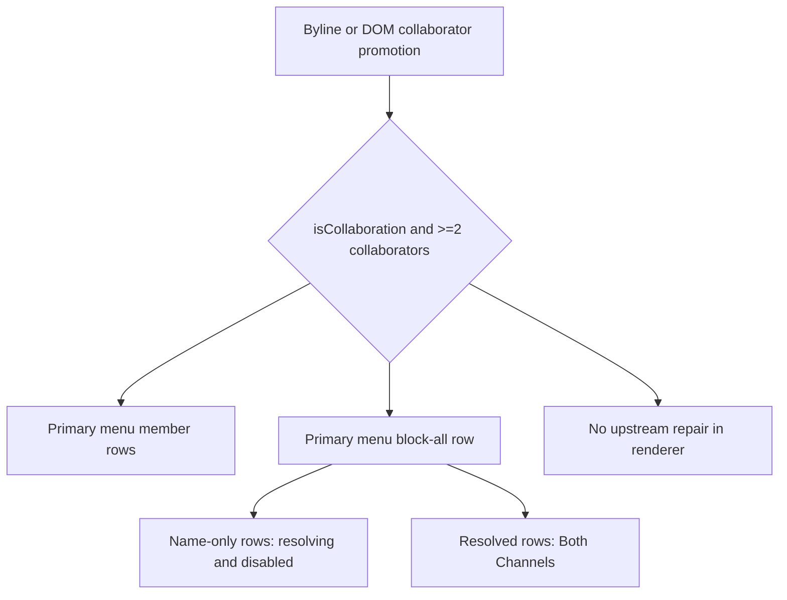
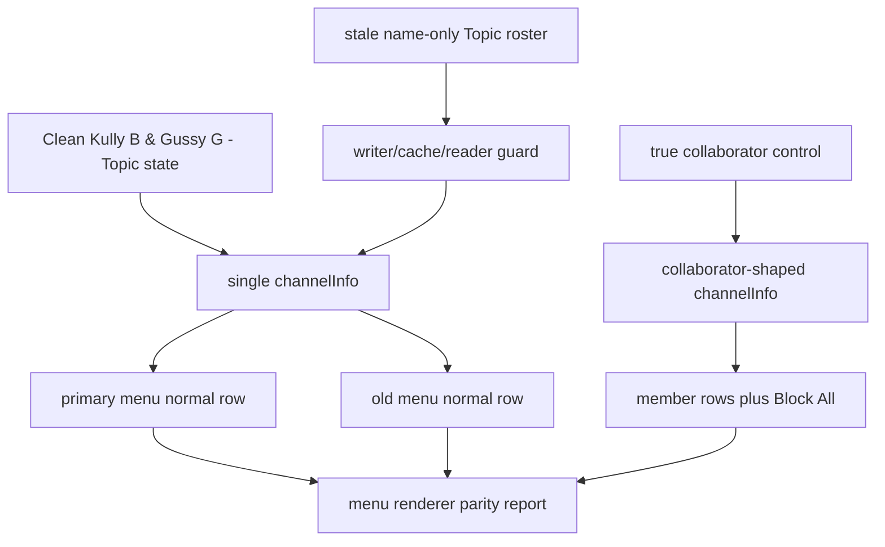

# FilterTube Content Bridge Menu Action List Target Current Behavior - 2026-05-23

Status: current-behavior proof with a 2026-05-29 Topic menu guard implementation addendum. Runtime behavior now changes narrowly for literal ampersand Topic name-only collaborator rosters: menu rendering demotes them back to one channel row. This is not completion proof for menu action list-target authority. Source fingerprints were refreshed on 2026-05-29 after the Topic menu guard changed `content_bridge.js`.

## Scope

This slice covers the content bridge menu action path where the visible three-dot menu, fallback playlist popover, block-click handler, and direct background mutation meet. It is intentionally adjacent to the menu blocked-state list-shape slice: the prior slice proved what the UI considers already blocked; this one proves which paths can still send a block mutation and which paths carry no explicit list target.

## Source Fingerprints

| Source file | Lines | Bytes | SHA-256 |
| --- | ---: | ---: | --- |
| `js/content_bridge.js` | 13571 | 601694 | `1dafb0bf979d391d2a3be827700e39114bc02b839cd26ddc8635a1127a0327b3` |

## Pinned Source And Effect Blocks

| Block | Source lines | Lines | Bytes | SHA-256 |
| --- | ---: | ---: | ---: | --- |
| `contentBridgeFallbackPerformBlock` | `js/content_bridge.js:7429` | 213 | 9930 | `5340e2307068efb0b3b60b32222a83780905964a8d41a81457a7e5ceaa8e00f1` |
| `contentBridgeRenderFilterTubeMenuEntries` | `js/content_bridge.js:689` | 130 | 6824 | `852fa9120a3dc7cc232e8f048b6833141fc4e34cd50bc48e3de696faf6100e9d` |
| `contentBridgeInjectFilterTubeMenuItem` | `js/content_bridge.js:10673` | 738 | 34747 | `bd888fd13303b3b65439b38886c671fa46d87330730efab17e0f11c5eefe6831` |
| `contentBridgeAttachFilterTubeMenuHandlers` | `js/content_bridge.js:11411` | 71 | 2490 | `07e0e72b5c4c4a7f95615c0e752bd1ea987fd4851f31e23e3569e8d3bcadd540` |
| `contentBridgeHandleBlockChannelClick` | `js/content_bridge.js:12141` | 1226 | 60722 | `459943dd5f26638ac63bc413a7cee220e862225929aaf2a4a0b6e068cd32ef9f` |
| `contentBridgeAddChannelDirectly` | `js/content_bridge.js:13375` | 54 | 2662 | `4eb280573a5611b695c8284a8e6b85d17b2a97c459143a3054d02374cdf7c2ca` |
| `contentBridgeAmpersandTopicSingleChannelMenuGuard` | `js/content_bridge.js:13500` | 31 | 1223 | `735cefcc42c64e33cd8ff6842c64f0348b70893bbc4a526e3008a37d782753b6` |

## Selected Token Counts

The reduced source blocks contain:

| Token | Count |
| --- | ---: |
| `listMode` | 1 |
| `showBlockMenuItem` | 1 |
| `addChannelDirectly` | 11 |
| `requestSettingsFromBackground` | 3 |
| `applyDOMFallback` | 5 |
| `upsertFilterChannel` | 1 |
| `FilterTube_ScheduleAutoBackup` | 1 |
| `addFilteredChannel` | 1 |
| `whitelistChannels` | 0 |
| `filterChannels` | 0 |
| `browserAPI_BRIDGE.runtime.sendMessage` | 3 |
| `profile` | 2 |
| `metadata` | 13 |
| `filterAll` | 32 |
| `currentSettings` | 9 |
| `handleBlockChannelClick` | 9 |
| `performBlock` | 1 |
| `attachFilterTubeMenuHandlers` | 1 |
| `click` | 50 |
| `keydown` | 1 |
| `preventNativeClick` | 1 |
| `isPlaceholder` | 1 |
| `toggleMultiStepSelection` | 2 |
| `isFilterAllToggleActive` | 3 |
| `optimisticHide` | 8 |
| `restoreOptimisticHide` | 3 |
| `confirmOptimisticHide` | 2 |
| `syncBlockedElementsWithFilters` | 0 |

## Current Behavior Proof

The primary dropdown injection path has the strongest front-door gate in this slice. `injectFilterTubeMenuItem()` returns immediately when `currentSettings?.listMode === 'whitelist'`, and when `currentSettings?.showBlockMenuItem === false` it clears injected FilterTube rows and multi-step state before returning.

That front-door gate is not repeated inside the later mutation functions. `attachFilterTubeMenuHandlers()` filters toggle clicks, placeholders, disabled native-click handoff, and multi-step member selection, then calls `handleBlockChannelClick()` for the block action. The handler block contains no `listMode`, no `showBlockMenuItem`, and no `whitelistChannels` token, but contains 8 `addChannelDirectly` callsites, optimistic hide/restore logic, settings refresh, DOM fallback rerun, and post-action Shorts/playlist enrichment.

The fallback playlist popover path is a separate mutation route. Its `performBlock` block contains no `listMode`, no `showBlockMenuItem`, and no `whitelistChannels` token. It can call `addChannelDirectly()` directly for collaborator or single-row actions, can hand off to `handleBlockChannelClick()` for weaker watch playlist identities, refreshes settings on success, and invokes `applyDOMFallback()` after a successful fallback block.

`addChannelDirectly()` sends a background message with `type: 'addFilteredChannel'`, `input`, `filterAll`, collaborator metadata, display/canonical handle fields, channel name/logo fields, `profile`, `customUrl`, and `source`. It does not include `listMode`, `whitelistChannels`, `filterChannels`, or a list-target field in the payload. On successful response it schedules `FilterTube_ScheduleAutoBackup` with trigger `channel_added` and delay `1000`.

## Risk Interpretation

For reliability and false-hide/leak risk, the current system depends on the primary injection gate preventing ordinary whitelist-mode menu actions, while fallback and stale/synthetic invocation paths remain mutation-capable without an explicit list-target report. That is not automatically wrong, but it means an optimization must not assume "menu action" means one gated path.

For performance, the post-mutation path is broader than a storage write: a successful action can update in-memory settings, confirm optimistic hide state, schedule backup, refresh settings, rerun DOM fallback, and kick off Shorts/playlist enrichment. Any no-work or JSON-first optimization must account for that fanout before removing or delaying DOM work.

For code burden, the same action concept is split across the primary menu gate, the click handler, the fallback popover action, and the direct background message. The code does not currently expose one first-class menu action decision artifact that records actor, surface, profile, list target, filter-all state, optimistic hide policy, background mutation, refresh, and enrichment effects.

## Primary Menu Collaborator Action Consequence Addendum - 2026-05-27

This addendum executes the current `renderFilterTubeMenuEntries()` source slice
with stubbed menu injectors. Runtime behavior is unchanged.

Primary menu collaborator consequence fixture rows: 3

| Fixture | Input to current menu renderer | Current rendered consequence | Release risk |
| --- | --- | --- | --- |
| `primary_menu_ampersand_topic_name_only_risk` | Upstream state already marks `Kully B & Gussy G - Topic` as two collaborators: `Kully B`, `Gussy G - Topic`, with no UC ID, handle, or custom URL. | The primary menu renders two disabled member rows plus a block-all row. The block-all channel object is still `Both Channels`, but the visible display is `All Collaborators (resolving...)` because identifiers are missing. | The renderer does not repair the upstream misclassification; it treats collaborator-shaped state as collaborator action state. |
| `primary_menu_and_name_resolved_risk` | Upstream state marks `Law and Crime Network` as two collaborator entries with handles. | The primary menu renders two member rows and an actionable block-all row labeled `Both Channels`, with `isBlockAllOption` and `allCollaborators` carried forward. | A single-channel `and` false positive can become an actual block-all action if identifiers are present or later hydrated. |
| `primary_menu_single_channel_control` | The same single-channel name is passed as one channel object, not collaborator-shaped state. | The primary menu renders one normal block row and no block-all collaborator row. | The false action comes from upstream collaborator promotion, not from ordinary single-channel rendering. |

ASCII current consequence map:

```text
byline / DOM promotion
  -> channelInfo.isCollaboration + allCollaborators.length >= 2
     -> renderFilterTubeMenuEntries()
        -> member row per collaborator
        -> block-all row
           -> name-only identity: visible "All Collaborators (resolving...)"
           -> resolved identity: visible "Both Channels"
```

Mermaid current consequence map:



The important boundary is that the primary menu renderer is not the grammar
authority. Once an upstream path has produced collaborator-shaped `channelInfo`,
the menu renderer uses that shape. A future fix for `Kully B & Gussy G - Topic`
therefore belongs before this render step: the byline/DOM promotion layer needs
an ampersand/Topic single-channel guard, and the menu renderer can then stay a
pure action renderer.

## Topic Menu Renderer Parity Report Contract - 2026-05-29

Status: implementation-backed report contract. Runtime behavior changed narrowly in
`contentBridgeAmpersandTopicSingleChannelMenuGuard()`.

This continuation defines the report packet required before the audit can move
`menu renderer Topic parity proof` from `NO-GO` to `GO`. The source fix for
`Kully B & Gussy G - Topic` is now enforced at the renderer boundary as a
last-mile stale-state guard, while broader collaborator grammar authority still
belongs upstream. Installed-tab parity and release/public-claim proof remain
outside this source-level approval.

```text
clean Topic menu handoff
        |
        v
single channelInfo row, no collaborator-shaped attrs
        |
        v
primary and old menu render one normal row

stale Topic menu handoff
        |
        v
writer/cache/reader guard clears name-only ampersand Topic roster first
        |
        v
menu renderer receives single-channel or unresolved state, not Block All
```



Required report fields:

```text
route
surface
profile
listMode
menuSurface
visibleByline
inputChannelInfo
writerSource
cacheSource
expectedCollaboratorCount
outputRows
blockAllState
mutationPayload
upstreamGuardProof
negativeTopicFixture
positiveCollabControl
singleChannelAndControl
quickBlockParityState
installedTabByteTrace
metricArtifact
```

| Contract row | Required proof | Current status | Behavior-change authority |
| --- | --- | --- | --- |
| `topic_menu_report_clean_primary` | Clean `Kully B & Gussy G - Topic` primary-menu input renders one normal row with no Block All state. | Source fixture now renders one primary-menu row after the guard returns single-channel state. | `GO_SOURCE` |
| `topic_menu_report_clean_old_menu` | Clean Topic input renders one normal old-menu row with no Block All state. | Source fixture now renders one old-menu row and no placeholder after guard demotion. | `GO_SOURCE` |
| `topic_menu_report_stale_attr_cleanup` | Same-video name-only Topic `data-filtertube-collaborators` state is cleared before menu render. | `contentBridgeAmpersandTopicSingleChannelMenuGuard()` calls the shared clear helper before rendering. | `GO_SOURCE` |
| `topic_menu_report_stale_resolved_cache_cleanup` | Same-video resolved-map Topic roster is rejected before menu render or active-menu refresh. | Reader and active-menu refresh guards still reject the same shape; renderer guard covers stale action handoff. | `GO_SOURCE` |
| `topic_menu_report_placeholder_path` | Placeholder/enrichment-pending menu path does not convert Topic single-channel state into collaborator rows. | Source fixture proves placeholder input is demoted before placeholder/collaborator branches. | `GO_SOURCE` |
| `topic_menu_report_true_collab_positive` | A real collaborator input with identifiers still renders member rows and Block All. | Resolved collaborator control still renders two member rows plus `Both Channels`. | `GO_SOURCE` |
| `topic_menu_report_single_and_negative` | Single-channel `and` names do not reach menu as collaborator-shaped state. | Existing grammar proof plus menu single-channel control remain intact. | `GO_SOURCE` |
| `topic_menu_report_quick_block_crosscheck` | Quick-block and menu receive equivalent clean Topic state. | Quick-block is `PARTIAL_GO`; menu source guard now matches the single-channel outcome. | `PARTIAL_GO_SOURCE` |
| `topic_menu_report_installed_tab_trace` | Installed normal-profile YouTube tab runs current content-script bytes after reload. | Missing. | `NO-GO` |
| `topic_menu_report_release_gate` | Release/public claim cites a committed parity packet and metric artifact. | Missing. | `NO-GO` |

Current Topic menu renderer report contract status:

```text
Topic menu renderer parity contract rows: 10
required Topic menu renderer parity fields: 20
implementation-ready Topic menu renderer rows: 7
runtime Topic menu renderer approvals: 1
menu renderer Topic parity proof from contract: PARTIAL_GO_SOURCE
installed-tab byte parity trace: MISSING
runtime behavior changed by this contract: yes
```

## Topic Menu Renderer Source Guard Implementation - 2026-05-29

`contentBridgeAmpersandTopicSingleChannelMenuGuard()` is now a renderer-boundary
safety check for stale collaborator-shaped Topic state. It only fires when the
input is collaboration-shaped, the visible byline is a literal ampersand Topic
label, and the collaborator roster is name-only. When it fires, it clears the
same cached collaborator state and returns one single-channel `channelInfo`
row, so primary and old menus no longer show member rows or Block All for
`Kully B & Gussy G - Topic`.

This guard does not change whitelist/blocklist list targeting, direct-add
payload shape, background mutation shape, optimistic hide, or fallback menu
mutation rules. It is intentionally narrow: true collaborators with identifiers
still render member rows and Block All.

## Still Missing

This slice does not close the audit rows for menu action list-target contracts, action decisions, profile target reports, fallback mutation gates, fallback list-mode policies, direct-add list-target reports, whitelist bypass reports, optimistic-hide budgets, mutation fanout metrics, or fixture provenance.

No product runtime source symbol exists yet for:

- `contentBridgeMenuActionListTargetContract`
- `contentBridgeMenuActionListTargetDecision`
- `contentBridgeMenuActionProfileTargetReport`
- `contentBridgeFallbackMenuMutationGate`
- `contentBridgeFallbackMenuListModePolicy`
- `contentBridgeMenuDirectAddListTargetReport`
- `contentBridgeMenuActionWhitelistBypassReport`
- `contentBridgeMenuActionOptimisticHideBudget`
- `contentBridgeMenuActionMutationFanoutMetric`
- `contentBridgeMenuActionListTargetFixtureProvenance`
- `contentBridgeMenuCollaboratorGrammarActionGate`
- `contentBridgePrimaryMenuCollaboratorActionConsequenceFixture`
- `contentBridgeMenuBylineGrammarEvidenceGate`
- `contentBridgeTopicMenuRendererParityReportContract`
- `contentBridgeTopicMenuRendererParityDecision`
- `contentBridgeTopicMenuRendererInstalledTabTrace`
- `contentBridgeTopicMenuRendererMetricArtifact`
- `contentBridgeTopicMenuRendererReleaseGate`

## Verification

Runtime proof: `tests/runtime/content-bridge-menu-action-list-target-current-behavior.test.mjs`

Focused command:

```bash
node --test tests/runtime/content-bridge-menu-action-list-target-current-behavior.test.mjs --test-reporter=spec
```

## Method Semantic Proof Gap Boundary

`docs/audit/FILTERTUBE_METHOD_SEMANTIC_PROOF_GAP_INDEX_CURRENT_BEHAVIOR_2026-05-25.md`
is a required source input before this menu/dialog/injector/quick-block
surface can support runtime optimization. Current proof pins:

```text
method semantic proof gap files covered: 63
method semantic proof gap lexical callables covered: 5473
files with complete per-callable semantic proof: 0
lexical callables requiring semantic proof before behavior changes: 5473
affected callable semantic proof: NO-GO
runtime behavior changed: no
```

These counts are audit-only blockers. They do not approve runtime
optimization, JSON-first behavior, menu action behavior, dialog lifecycle
behavior, injector behavior, quick-block behavior, whitelist behavior, metric
collectors, artifact creation, native sync, release package changes, or public
claims.
