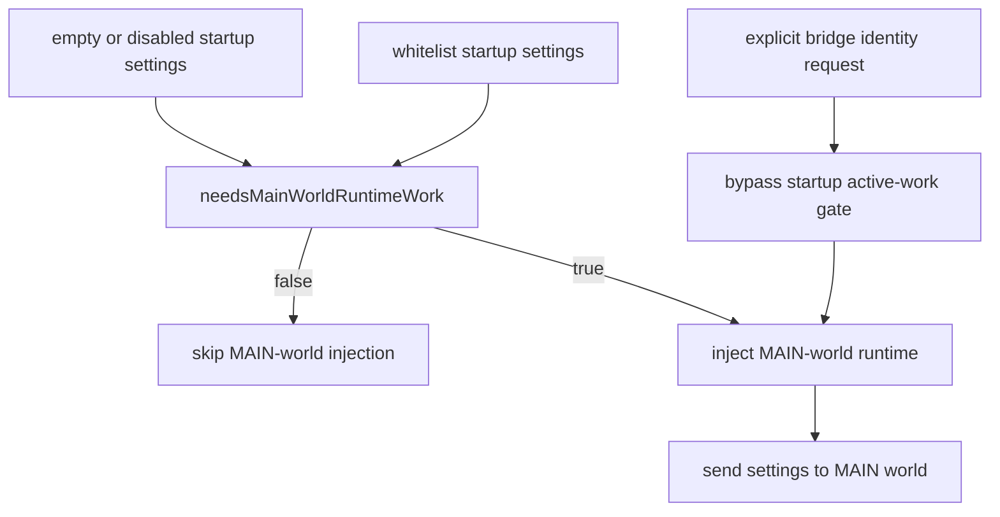

# FilterTube Content Bridge Startup Timing Boundary - Current Behavior - 2026-05-23

Status: current-behavior proof for settings-gated MAIN-world startup and DOM fallback observer refresh.
Runtime behavior changed before this proof refresh to gate MAIN-world injection on active settings work and to expose a local DOM fallback observer refresh/disconnect path.
This document records the current
startup timer, injection, ready-message, settings handoff, DOM fallback startup,
observer, and listener surface in `js/content/bridge_injection.js` and
`js/content_bridge.js` before any additional optimization or first-class JSON
filtering implementation change.

This is not a startup timing implementation patch. It does not add a startup timing contract,
timer budget, startup lifecycle owner, DOM fallback singleton guard, ready-state
authority, or first-class JSON filtering gate.

## Source Scope

- `js/content/bridge_injection.js`
  - Lines: 127
  - Bytes: 4741
  - sha256: `d1b84cf4c43ec5ff5cdc3bd607d8f3d3bf448c12829780b0d05fb9fc14fb5d3e`
- `js/content_bridge.js`
  - Lines: 13571
  - Bytes: 601694
  - sha256: `c651b34aad0ded2668a5cde55bfd4f499fab098f2f04e9ee0f50c5ede5d47b0c`

Related proof already present:

- `FILTERTUBE_STARTUP_INJECTION_READINESS_CURRENT_BEHAVIOR_2026-05-19.md`
- `FILTERTUBE_BRIDGE_INJECTION_METHOD_SEMANTIC_REGISTER_2026-05-21.md`
- `FILTERTUBE_BRIDGE_SETTINGS_LISTENER_TIMER_BOUNDARY_CURRENT_BEHAVIOR_2026-05-23.md`
- `FILTERTUBE_DOCUMENT_START_ZERO_FLASH_BOUNDARY_2026-05-21.md`
- `FILTERTUBE_SEED_SETTINGS_REPLAY_PROVENANCE_BOUNDARY_CURRENT_BEHAVIOR_2026-05-23.md`

## Current Counts

```text
content bridge startup timing source files: 2
bridge_injection lines: 127
bridge_injection bytes: 4741
content_bridge lines: 13562
content_bridge bytes: 601080
fallback block lines: 23
fallback block bytes: 904
injectMainWorldScripts block lines: 46
injectMainWorldScripts block bytes: 1752
needsMainWorldRuntimeWork block lines: 10
needsMainWorldRuntimeWork block bytes: 387
ensureMainWorldRuntimeForSettings block lines: 12
ensureMainWorldRuntimeForSettings block bytes: 395
ensureMainWorldRuntimeForBridgeRequest block lines: 12
ensureMainWorldRuntimeForBridgeRequest block bytes: 453
refreshFilterTubeRuntimeObservers block lines: 30
refreshFilterTubeRuntimeObservers block bytes: 867
main-world handler block lines: 236
main-world handler block bytes: 11060
initialize block lines: 14
initialize block bytes: 467
initializeDOMFallback block lines: 381
initializeDOMFallback block bytes: 17599
DOM observer setup slice lines: 59
DOM observer setup slice bytes: 2092
selected setTimeout tokens: 7
selected clearTimeout tokens: 4
selected addEventListener tokens: 1
selected removeEventListener tokens: 0
selected MutationObserver tokens: 11
selected requestAnimationFrame tokens: 2
selected requestSettingsFromBackground tokens: 6
selected injectMainWorldScripts tokens: 8
selected ensureMainWorldRuntimeForSettings tokens: 2
selected ensureMainWorldRuntimeForBridgeRequest tokens: 1
selected needsMainWorldRuntimeWork tokens: 2
selected sendSettingsToMainWorld tokens: 4
selected initializeDOMFallback tokens: 2
selected applyDOMFallback tokens: 9
selected FilterTube_InjectorToBridge_Ready tokens: 1
selected FilterTube_InjectorBridgeReady tokens: 0
selected DOMContentLoaded tokens: 1
selected startCardPrefetchObserver tokens: 1
selected installPlaylistPanelPrefetchHook tokens: 1
selected installRightRailWhitelistObserver tokens: 1
selected FilterTube_refreshDOMFallbackObserver tokens: 3
selected disconnectFallbackMutationObserver tokens: 3
selected hasActiveFallbackLifecycleWork tokens: 3
runtime content bridge startup timing fixtures: 10
startup no-work gate executable rows: 4
startup explicit bridge request bypass rows: 1
runtime behavior changed: yes, before this proof refresh
not completion proof for content bridge startup timing authority
```

## Current Startup Timing Surface

| Surface | Current owner | Current behavior | Risk before optimization |
| --- | --- | --- | --- |
| Fallback MAIN-world script spacing | `injectViaFallback()` | Loads fallback page scripts one at a time and calls `setTimeout(injectNext, 50)` after each `script.onload`. | Script order is timer-spaced and script elements are not removed by this owner. |
| Injection success settings replay | `injectMainWorldScripts()` | Marks `scriptsInjected = true`, then schedules `requestSettingsFromBackground()` after 100 ms if the function exists. | Settings replay is tied to injection success plus a fixed timer, not a single startup authority report. |
| Content bridge bootstrap | top-level `content_bridge.js` | Registers `window.addEventListener('message', handleMainWorldMessages, false)` and starts `initialize()` through `setTimeout(() => initialize(), 50)`. | Listener lifetime is page-lifetime and boot start is timer-based. |
| Main-world ready message | `handleMainWorldMessages()` | `FilterTube_InjectorToBridge_Ready` triggers another `requestSettingsFromBackground()`. `FilterTube_InjectorBridgeReady` is not handled here. | The bridge-ready and engine-ready messages remain separate signals without one owner deciding startup completion. |
| Settings-gated MAIN-world start | `needsMainWorldRuntimeWork()` and `ensureMainWorldRuntimeForSettings()` | Empty/disabled blocklist settings return false; whitelist, content filters, category filters, keywords, channels, comment keywords, hide-all-comments, and hide-all-shorts can require MAIN-world injection. | This reduces empty-install startup work, but the gate is still local and not represented by one startup contract. |
| Explicit bridge request runtime start | `ensureMainWorldRuntimeForBridgeRequest()` | Collaborator and channel identity bridge requests still inject MAIN-world runtime without the settings active-work gate, then replay latest settings if present. | User actions or identity lookups can still force runtime injection outside the startup active-work path. |
| Initial content bridge chain | `initialize()` | Runs stats init, requests compiled settings, awaits `ensureMainWorldRuntimeForSettings(response.settings)` only on settings success, then calls `initializeDOMFallback(response.settings)` without awaiting it. | DOM fallback setup starts as a detached async flow after settings success, so startup completion is not represented by the `initialize()` promise. |
| DOM fallback start gate | `initializeDOMFallback()` | Waits 1000 ms, requests settings again if none were passed, then runs `applyDOMFallback(settings)` and `ensureFallbackMenuButtons()`. | First DOM fallback work is delayed by a fixed timer and may perform a second settings request. |
| DOM fallback observer attach | `initializeDOMFallback()` | Creates a `MutationObserver`, observes `document.body || document.documentElement` when active fallback work exists, waits for `DOMContentLoaded` once when needed, and disconnects the observer when fallback lifecycle work is inactive. | Observer ownership is still local to the function and has no shared startup budget artifact. |
| Runtime observer refresh | `refreshFilterTubeRuntimeObservers()` | Starts prefetch observers only when identity prefetch work is active, starts right-rail whitelist observer only in whitelist mode, refreshes quick-block availability, and calls the exposed DOM fallback observer refresh hook. | Observer refresh exists, but prefetch, quick-block, whitelist, and fallback observers still do not share one authority object. |

## Runtime Fixture Results

The runtime fixture
`tests/runtime/content-bridge-startup-timing-boundary-current-behavior.test.mjs`
pins these behaviors:

1. The audit document remains audit-only and records exact source/block counts.
2. Fallback script injection spaces loads with a 50 ms timer and has no cleanup
   path for injected script elements.
3. Successful MAIN-world injection schedules a 100 ms settings request separate
   from injector-ready proof.
4. The content bridge registers the message listener at file tail and starts
   initialization through a fixed 50 ms timer.
5. `initialize()` requests settings first, awaits the settings-gated MAIN-world
   runtime path only when settings succeed, then starts DOM fallback without
   awaiting that fallback setup.
6. MAIN-world runtime injection is settings-gated for startup but remains
   unconditional for explicit bridge identity requests.
7. The main-world handler reacts to `FilterTube_InjectorToBridge_Ready` but not
   `FilterTube_InjectorBridgeReady`.
8. `initializeDOMFallback()` waits 1000 ms, can request settings again, applies
   fallback work, installs fallback menu buttons, and attaches the mutation
   observer or one-shot `DOMContentLoaded` fallback.
9. The DOM fallback startup block now has local observer refresh and disconnect
   behavior, but still has no singleton guard or shared startup timing authority.
10. The executable startup gate fixture proves null, disabled, and empty
    blocklist startup settings do not inject MAIN-world runtime, while
    whitelist startup and explicit bridge identity requests still inject and
    replay settings.

## Startup No-Work Gate Executable Continuation - 2026-05-28

This continuation executes the current `bridgeHasList()`,
`needsMainWorldRuntimeWork()`, `ensureMainWorldRuntimeForSettings()`, and
`ensureMainWorldRuntimeForBridgeRequest()` source slice. It narrows the empty
install and SPA-lag proof by showing the startup path does no MAIN-world
injection for empty/disabled settings, while preserving whitelist semantics and
explicit user/request paths.

```text
null settings
  -> needsMainWorldRuntimeWork() false
  -> no injectMainWorldScripts()

disabled settings
  -> needsMainWorldRuntimeWork() false
  -> no injectMainWorldScripts()

empty blocklist settings
  -> no keyword/channel/comment/content/category work
  -> ensureMainWorldRuntimeForSettings() false
  -> no injectMainWorldScripts()

whitelist settings
  -> needsMainWorldRuntimeWork() true
  -> injectMainWorldScripts()
  -> sendSettingsToMainWorld()

explicit bridge identity request
  -> bypasses needsMainWorldRuntimeWork()
  -> injectMainWorldScripts()
  -> sendSettingsToMainWorld(currentSettings)
```



Current executable startup gate status:

```text
startup no-work gate executable rows: 4
startup explicit bridge request bypass rows: 1
startup executable continuation behavior changed: no
startup executable continuation approval: NO-GO
```

This does not approve deleting DOM fallback startup, page-message listeners,
identity bridge injection, whitelist MAIN-world admission, first-class JSON
promotion, or broader startup lifecycle changes. It only proves the current
startup active-work gate behavior for the selected source slice.

## Missing First-Class Authority

The current code still lacks:

- `contentBridgeStartupTimingContract`
- `contentBridgeStartupTimerBudgetReport`
- `contentBridgeInjectionSettingsReplayReport`
- `contentBridgeReadyMessageDecisionReport`
- `contentBridgeInitializePromiseContract`
- `contentBridgeFirstDomFallbackPolicy`
- `contentBridgeDomFallbackSingletonReport`
- `contentBridgeStartupObserverOwnerReport`
- `contentBridgeStartupFixtureProvenance`
- `contentBridgeStartupMetricArtifact`

Those missing artifacts mean this slice is current-behavior evidence only. It
does not make startup timing safe to optimize yet, and it does not promote the
content bridge into a first-class JSON filter authority.

## Method Semantic Proof Gap Boundary

`docs/audit/FILTERTUBE_METHOD_SEMANTIC_PROOF_GAP_INDEX_CURRENT_BEHAVIOR_2026-05-25.md`
is a required source input before this content bridge startup timing surface can
support runtime optimization. Current proof pins:

```text
method semantic proof gap files covered: 69
method semantic proof gap lexical callables covered: 5789
files with complete per-callable semantic proof: 0
lexical callables requiring semantic proof before behavior changes: 5789
affected callable semantic proof: NO-GO
runtime behavior changed: no
```

These counts are audit-only blockers. They do not approve runtime
optimization, JSON-first behavior, startup timing changes, ready-message
changes, DOM fallback singleton changes, or observer/timer authority changes.
