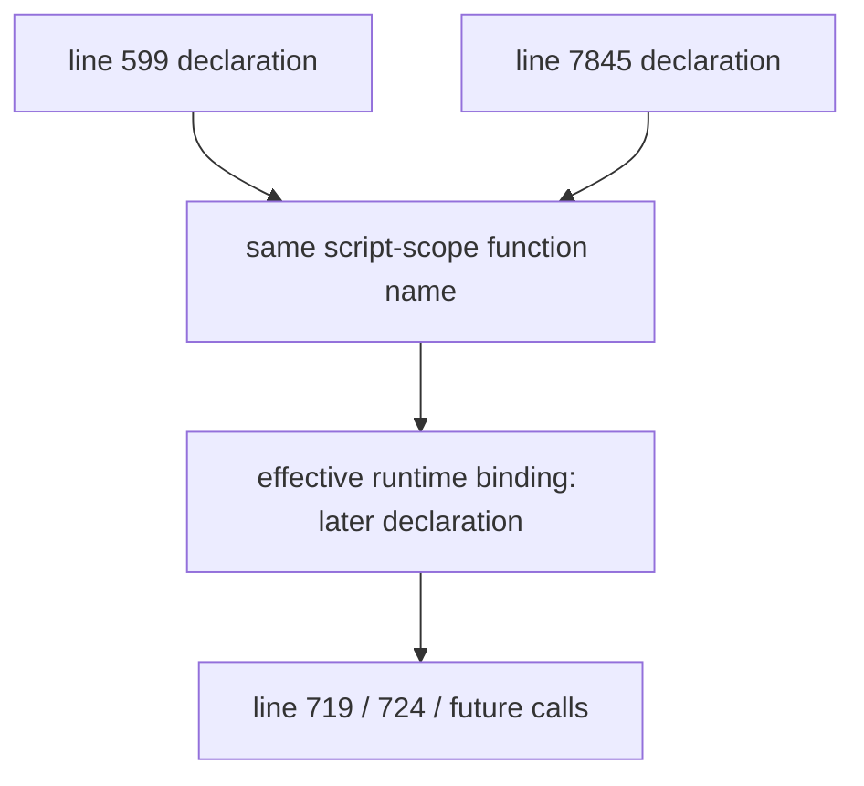

# FilterTube Content Bridge Top-Level Method Semantic Register - Current Behavior - 2026-05-21

Status: audit-only proof. This is not an implementation patch.
Runtime behavior is unchanged.

## Purpose

This register promotes the largest callable source file from lexical visibility
toward method-level semantic proof. The repo-wide callable index already pins
`js/content_bridge.js` as the largest callable surface:

```text
source file: js/content_bridge.js
lexical callable forms: 1198
top-level function declarations: 190
unique top-level function names: 189
duplicate top-level name: injectCollaboratorPlaceholderMenu at lines 599 and 7845
semantic groups: 14
```

This is not completion proof for every nested callback, inline event handler,
timer callback, promise callback, or DOM callback inside `content_bridge.js`.
It is a source-derived top-level method inventory that records the semantic
method families, observable side-effect classes, and missing proof needed
before changing content bridge identity, menu, lifecycle, fetch, stats, hide,
or mutation behavior.

## Semantic Group Summary

| Semantic group | Top-level functions | Current owner/effect shape | Missing proof before behavior changes |
| --- | ---: | --- | --- |
| `debugStartup` | 3 | Debug flag and native overlay quiet checks. | Debug/noise policy, native overlay route proof, and no-work impact. |
| `identityMetadataNormalization` | 8 | HTML/object extraction, handle/custom URL normalization, metadata payload construction, mapping hydration, title hints, in-memory channel upsert. | Identity confidence, source tier, route/surface, stale-map, and false-hide proof. |
| `menuDropdownLifecycle` | 12 | Active collaboration dropdown tracking, menu cleanup, placeholder rendering, forced close, frame waits, and rendered menu entry refresh. | Dropdown owner, teardown, duplicate insertion, spoofed response, and stale collaborator proof. |
| `prefetchAndMetadataWork` | 29 | Card prefetch observers, right-rail observer, queue/concurrency, metadata fetch scheduling, learned map writes, and targeted DOM reruns. | No-rule budget, dedupe, route/surface reason, fetch budget, map provenance, and rerun side-effect proof. |
| `collaborationRosterState` | 66 | Collaboration identity parsing, composite-label handling, roster quality, selection state, retry scheduling, enrichment request options, and collaborator application. | Roster confidence, source provenance, expected count, fallback identity, negative avatar-stack, and stale-card proof. |
| `statsAndMediaSideEffects` | 3 | Stats initialization, content-type/time estimates, hidden count updates, storage writes, and media pause/autoplay side effects. | Hide decision provenance, false-hide decrement, stats surface, media restore, and no-rule budget proof. |
| `collaborationRendererHydration` | 20 | Renderer and DOM collaborator extraction, watch-like warmup, YTM row promotion, collaboration signal promotion, and channel match checks. | Renderer/path coverage, route identity confidence, playlist/Mix drift, YTM/Kids proof, and sibling-visible fixtures. |
| `mainWorldMessageBridge` | 8 | Main-world request/response bridge, subscription import bridge, collaborator merge, same-window `FilterTube_*` message handling, and startup initialization. | Request id/nonce, sender/source contract, replay timeout, spoof-negative, and forced DOM rerun proof. |
| `startupDomFallbackBridge` | 4 | Delayed DOM fallback initialization and fallback menu button installation. | Startup ordering, disabled/no-rule budget, teardown, and route-pause proof. |
| `fallbackMenuAndPlaylistPopover` | 5 | Playlist fallback popover refresh/open, fallback collaborator placeholder, and debounce helper. | Fallback action gate, list-mode/menu visibility, popover disposal, and playlist row target proof. |
| `ytInitialAndBackgroundResolvers` | 5 | `ytInitialData` search, background watch/Shorts identity requests, direct watch/Shorts fetch fallback, and visible Shorts/playlist enrichment. | Network authority, credentials/origin policy, resolver reason, cache budget, post-action fanout, and negative sender proof. |
| `cardIdentityExtraction` | 3 | Monolithic card identity extraction for normal, watch, Shorts, playlist, comments, Kids, and YTM-like surfaces. | Route/surface split, source confidence, video-id-only boundary, low-confidence display text, and negative sibling proof. |
| `menuInjectionAndActionBinding` | 6 | FilterTube menu injection, handler binding, icon/title/placeholder construction, old/new menu insertion, blocked-state check, and blocked marker writes. | Menu action authority, whitelist/hidden gate parity, duplicate insertion, lock/session, and spoofed click proof. |
| `clickedHideAndRuleMutation` | 18 | Clicked-content hide target resolution, blocked element sync, channel block click, direct add-channel message, Filter All checkbox mutation, Topic menu demotion guard, and production log/debug console gating. | Exact target, restore owner, list-mode target, background message contract, stats/media policy, production diagnostics policy, and rollback proof. |

## Source-Derived Top-Level Function Inventory

| Line | Function | Kind | Semantic group |
| ---: | --- | --- | --- |
| 3 | `isFilterTubeDebugEnabled` | function | `debugStartup` |
| 11 | `filterTubeDebugLog` | function | `debugStartup` |
| 16 | `isFilterTubeNativeOverlayQuietMode` | function | `debugStartup` |
| 31 | `extractJsonObjectFromHtml` | function | `identityMetadataNormalization` |
| 82 | `extractCustomUrlFromHref` | function | `identityMetadataNormalization` |
| 93 | `isLowConfidenceExpectedChannelLabel` | function | `identityMetadataNormalization` |
| 119 | `buildChannelMetadataPayload` | function | `identityMetadataNormalization` |
| 195 | `pickMenuChannelDisplayName` | function | `identityMetadataNormalization` |
| 280 | `hydrateChannelInfoFromCurrentMappings` | function | `identityMetadataNormalization` |
| 345 | `collectCardTitleHints` | function | `identityMetadataNormalization` |
| 410 | `upsertFilterChannel` | function | `identityMetadataNormalization` |
| 432 | `registerActiveCollaborationMenu` | function | `menuDropdownLifecycle` |
| 459 | `unregisterActiveCollaborationMenu` | function | `menuDropdownLifecycle` |
| 471 | `cleanupDropdownState` | function | `menuDropdownLifecycle` |
| 488 | `getReusableNativeDropdownRoot` | function | `menuDropdownLifecycle` |
| 497 | `forceCloseDropdown` | function | `menuDropdownLifecycle` |
| 583 | `clearFilterTubeMenuItems` | function | `menuDropdownLifecycle` |
| 588 | `waitForNextFrameDelay` | function | `menuDropdownLifecycle` |
| 599 | `injectCollaboratorPlaceholderMenu` | function | `menuDropdownLifecycle` |
| 664 | `getMenuContainers` | function | `menuDropdownLifecycle` |
| 689 | `renderFilterTubeMenuEntries` | function | `menuDropdownLifecycle` |
| 819 | `updateInjectedMenuChannelName` | function | `menuDropdownLifecycle` |
| 874 | `refreshActiveCollaborationMenu` | function | `menuDropdownLifecycle` |
| 984 | `getStatsSurfaceKey` | function | `prefetchAndMetadataWork` |
| 1008 | `bridgeHasList` | function | `prefetchAndMetadataWork` |
| 1012 | `needsIdentityPrefetchWork` | function | `prefetchAndMetadataWork` |
| 1023 | `hasBridgeEnabledContentFilters` | function | `prefetchAndMetadataWork` |
| 1035 | `hasBridgeSelectedCategoryFilters` | function | `prefetchAndMetadataWork` |
| 1042 | `hasBridgeActiveJsonFilterRules` | function | `prefetchAndMetadataWork` |
| 1056 | `needsMainWorldRuntimeWork` | function | `prefetchAndMetadataWork` |
| 1067 | `ensureMainWorldRuntimeForSettings` | async function | `prefetchAndMetadataWork` |
| 1080 | `ensureMainWorldRuntimeForBridgeRequest` | async function | `prefetchAndMetadataWork` |
| 1093 | `schedulePrefetchScan` | function | `prefetchAndMetadataWork` |
| 1114 | `attachPrefetchObservers` | function | `prefetchAndMetadataWork` |
| 1144 | `startCardPrefetchObserver` | function | `prefetchAndMetadataWork` |
| 1172 | `installPlaylistPanelPrefetchHook` | function | `prefetchAndMetadataWork` |
| 1217 | `installRightRailWhitelistObserver` | function | `prefetchAndMetadataWork` |
| 1281 | `refreshFilterTubeRuntimeObservers` | function | `prefetchAndMetadataWork` |
| 1317 | `queuePrefetchForCard` | function | `prefetchAndMetadataWork` |
| 1372 | `drainPrefetchQueue` | function | `prefetchAndMetadataWork` |
| 1384 | `withTimeout` | function | `prefetchAndMetadataWork` |
| 1391 | `prefetchIdentityForCard` | async function | `prefetchAndMetadataWork` |
| 1484 | `stampChannelIdentity` | function | `prefetchAndMetadataWork` |
| 1507 | `resetCardIdentityIfStale` | function | `prefetchAndMetadataWork` |
| 1579 | `cardContainsVideoIdLink` | function | `prefetchAndMetadataWork` |
| 1594 | `shouldStampCardForVideoId` | function | `prefetchAndMetadataWork` |
| 1628 | `resolveIdFromHandle` | function | `prefetchAndMetadataWork` |
| 1638 | `persistVideoChannelMapping` | function | `prefetchAndMetadataWork` |
| 1649 | `persistVideoMetaMapping` | function | `prefetchAndMetadataWork` |
| 1714 | `scheduleVideoMetaDomRerun` | function | `prefetchAndMetadataWork` |
| 1729 | `touchDomForVideoMetaUpdate` | function | `prefetchAndMetadataWork` |
| 1794 | `scheduleVideoMetaFetch` | function | `prefetchAndMetadataWork` |
| 1871 | `processWatchMetaFetchQueue` | function | `collaborationRosterState` |
| 1889 | `fetchVideoMetaFromWatchUrl` | async function | `collaborationRosterState` |
| 2065 | `generateCollaborationGroupId` | function | `collaborationRosterState` |
| 2088 | `findStoredChannelEntry` | function | `collaborationRosterState` |
| 2104 | `scheduleDropdownCleanup` | function | `collaborationRosterState` |
| 2119 | `cancelDropdownCleanup` | function | `collaborationRosterState` |
| 2128 | `getCollaboratorKey` | function | `collaborationRosterState` |
| 2134 | `clearMultiStepStateForDropdown` | function | `collaborationRosterState` |
| 2143 | `updateMultiStepActionLabel` | function | `collaborationRosterState` |
| 2185 | `isFilterAllToggleActive` | function | `collaborationRosterState` |
| 2193 | `applyFilterAllStateToToggle` | function | `collaborationRosterState` |
| 2202 | `persistFilterAllStateForMenuItem` | function | `collaborationRosterState` |
| 2221 | `hydrateFilterAllToggle` | function | `collaborationRosterState` |
| 2231 | `getFilterAllPreference` | function | `collaborationRosterState` |
| 2245 | `getFilterAllPreferenceForCollaborator` | function | `collaborationRosterState` |
| 2251 | `refreshMultiStepSelections` | function | `collaborationRosterState` |
| 2270 | `setupMultiStepMenu` | function | `collaborationRosterState` |
| 2316 | `toggleMultiStepSelection` | function | `collaborationRosterState` |
| 2335 | `applyBlockedVisualState` | function | `collaborationRosterState` |
| 2352 | `forceDropdownResize` | function | `collaborationRosterState` |
| 2370 | `markMultiStepSelection` | function | `collaborationRosterState` |
| 2394 | `applyHandleMetadata` | function | `collaborationRosterState` |
| 2411 | `isPlaceholderCollaboratorEntry` | function | `collaborationRosterState` |
| 2421 | `hasStrongCollaboratorIdentity` | function | `collaborationRosterState` |
| 2430 | `normalizeCompositeCollaboratorLabel` | function | `collaborationRosterState` |
| 2445 | `collaboratorCompositeLabelVariants` | function | `collaborationRosterState` |
| 2456 | `isCompositeNameOnlyCollaborator` | function | `collaborationRosterState` |
| 2487 | `sanitizeCollaboratorListWithMeta` | function | `collaborationRosterState` |
| 2534 | `sanitizeCollaboratorList` | function | `collaborationRosterState` |
| 2538 | `resolveExpectedCollaboratorCount` | function | `collaborationRosterState` |
| 2553 | `getCollaboratorListQuality` | function | `collaborationRosterState` |
| 2566 | `extractCollaboratorsFromAvatarStackElement` | function | `collaborationRosterState` |
| 2615 | `mergeCollaboratorLists` | function | `collaborationRosterState` |
| 2652 | `getCachedCollaboratorsFromCard` | function | `collaborationRosterState` |
| 2673 | `getValidatedCachedCollaborators` | function | `collaborationRosterState` |
| 2746 | `clearCollaboratorMetadataFromCard` | function | `collaborationRosterState` |
| 2760 | `buildCollaboratorSignature` | function | `collaborationRosterState` |
| 2768 | `hasCompleteCollaboratorRoster` | function | `collaborationRosterState` |
| 2775 | `parseCollaboratorNames` | function | `collaborationRosterState` |
| 2832 | `hasAttributedCollaboratorSignal` | function | `collaborationRosterState` |
| 2843 | `normalizeLooseChannelLabel` | function | `collaborationRosterState` |
| 2854 | `extractYtmBylineFromAriaLabel` | function | `collaborationRosterState` |
| 2864 | `extractYtmBylineText` | function | `collaborationRosterState` |
| 2883 | `getDesktopLockupMetadataRows` | function | `collaborationRosterState` |
| 2908 | `normalizeMetadataRowText` | function | `collaborationRosterState` |
| 2912 | `isStatsMetadataRowText` | function | `collaborationRosterState` |
| 2923 | `extractDesktopLockupBylineText` | function | `collaborationRosterState` |
| 2933 | `isDesktopWatchPlaylistPanelCard` | function | `collaborationRosterState` |
| 2952 | `isWatchPlaylistLikeCard` | function | `collaborationRosterState` |
| 2959 | `extractDesktopWatchPlaylistBylineText` | function | `collaborationRosterState` |
| 2982 | `extractDesktopWatchLikeBylineText` | function | `collaborationRosterState` |
| 2986 | `countDistinctChannelLinks` | function | `collaborationRosterState` |
| 3012 | `hasCollaboratorSeparatorEvidence` | function | `collaborationRosterState` |
| 3024 | `textFromRendererTextLike` | function | `collaborationRosterState` |
| 3035 | `normalizeChannelNameFromRendererData` | function | `collaborationRosterState` |
| 3053 | `extractChannelNameFromRendererData` | function | `collaborationRosterState` |
| 3106 | `isMixTitleText` | function | `collaborationRosterState` |
| 3110 | `hasMixRendererDataSignal` | function | `collaborationRosterState` |
| 3187 | `getRendererDataCandidatesForElement` | function | `collaborationRosterState` |
| 3233 | `isMixCardElement` | function | `collaborationRosterState` |
| 3308 | `generateCollabEntryKey` | function | `collaborationRosterState` |
| 3319 | `markCardForDialogEnrichment` | function | `collaborationRosterState` |
| 3374 | `scheduleCollaboratorRetry` | function | `collaborationRosterState` |
| 3391 | `buildCollaboratorLookupRequestOptions` | function | `collaborationRosterState` |
| 3445 | `requestCollaboratorEnrichment` | function | `collaborationRosterState` |
| 3501 | `applyResolvedCollaborators` | function | `collaborationRosterState` |
| 3603 | `applyCollaboratorsByVideoId` | function | `statsAndMediaSideEffects` |
| 3709 | `initializeStats` | function | `statsAndMediaSideEffects` |
| 3744 | `getContentType` | function | `statsAndMediaSideEffects` |
| 3796 | `estimateTimeSaved` | function | `collaborationRendererHydration` |
| 3826 | `incrementHiddenStats` | function | `collaborationRendererHydration` |
| 3899 | `decrementHiddenStats` | function | `collaborationRendererHydration` |
| 3921 | `saveStats` | function | `collaborationRendererHydration` |
| 3957 | `handleMediaPlayback` | function | `collaborationRendererHydration` |
| 3997 | `extractCollaboratorMetadataFromRenderer` | function | `collaborationRendererHydration` |
| 4239 | `hydrateCollaboratorsFromRendererData` | function | `collaborationRendererHydration` |
| 4284 | `extractCollaboratorMetadataFromElement` | function | `collaborationRendererHydration` |
| 4790 | `isYtmWatchLikeCollaboratorCard` | function | `collaborationRendererHydration` |
| 4804 | `isDesktopWatchLikeCollaboratorCard` | function | `collaborationRendererHydration` |
| 4822 | `getWatchLikeCollaborationWarmup` | function | `collaborationRendererHydration` |
| 4852 | `promoteYtmWatchRowIdentityFromCollaboratorMetadata` | function | `collaborationRendererHydration` |
| 4944 | `cardHasCollaborationDomSignal` | function | `collaborationRendererHydration` |
| 4972 | `normalizeCollaboratorLabelForComparison` | function | `collaborationRendererHydration` |
| 4976 | `getLiteralAmpersandTopicByline` | function | `collaborationRendererHydration` |
| 4996 | `isAmpersandTopicNameOnlyCollaboratorState` | function | `collaborationRendererHydration` |
| 5010 | `clearAmpersandTopicCollaboratorState` | function | `collaborationRendererHydration` |
| 5018 | `rejectAmpersandTopicCollaboratorWrite` | function | `collaborationRendererHydration` |
| 5053 | `getResolvedCollaboratorsForCard` | function | `collaborationRendererHydration` |
| 5064 | `normalizeCollaboratorChannelInfoForCard` | function | `collaborationRendererHydration` |
| 5218 | `promoteChannelInfoFromCollaboratorSignals` | function | `mainWorldMessageBridge` |
| 5304 | `normalizeHandleForComparison` | function | `mainWorldMessageBridge` |
| 5310 | `channelMatchesFilter` | function | `mainWorldMessageBridge` |
| 5509 | `requestCollaboratorInfoFromMainWorld` | function | `mainWorldMessageBridge` |
| 5564 | `requestChannelInfoFromMainWorld` | function | `mainWorldMessageBridge` |
| 5612 | `requestSubscribedChannelsFromMainWorld` | function | `mainWorldMessageBridge` |
| 5659 | `normalizeCollaboratorName` | function | `mainWorldMessageBridge` |
| 5669 | `mergeCollaboratorsWithMainWorld` | function | `mainWorldMessageBridge` |
| 5811 | `enrichCollaboratorsWithMainWorld` | async function | `startupDomFallbackBridge` |
| 5837 | `handleMainWorldMessages` | function | `startupDomFallbackBridge` |
| 6086 | `initialize` | async function | `startupDomFallbackBridge` |
| 6088 | `initializeDOMFallback` | async function | `startupDomFallbackBridge` |
| 6473 | `shouldEagerFallbackMenuScan` | function | `fallbackMenuAndPlaylistPopover` |
| 6485 | `shouldInstallFallbackMenuButtons` | function | `fallbackMenuAndPlaylistPopover` |
| 6489 | `ensureFallbackMenuButtons` | function | `fallbackMenuAndPlaylistPopover` |
| 7212 | `refreshOpenPlaylistFallbackPopoverForVideo` | function | `fallbackMenuAndPlaylistPopover` |
| 7233 | `openFilterTubePlaylistFallbackPopover` | function | `fallbackMenuAndPlaylistPopover` |
| 7845 | `injectCollaboratorPlaceholderMenu` | function | `ytInitialAndBackgroundResolvers` |
| 7902 | `debounce` | function | `ytInitialAndBackgroundResolvers` |
| 7933 | `searchYtInitialDataForVideoChannel` | async function | `ytInitialAndBackgroundResolvers` |
| 8045 | `extractChannelFromInitialData` | function | `ytInitialAndBackgroundResolvers` |
| 8305 | `enrichVisibleShortsWithChannelInfo` | async function | `ytInitialAndBackgroundResolvers` |
| 8451 | `fetchWatchIdentityFromBackground` | async function | `cardIdentityExtraction` |
| 8507 | `enrichVisiblePlaylistRowsWithChannelInfo` | async function | `cardIdentityExtraction` |
| 8634 | `fetchChannelFromShortsUrl` | async function | `cardIdentityExtraction` |
| 8703 | `fetchChannelFromShortsUrlDirect` | async function | `menuInjectionAndActionBinding` |
| 8834 | `fetchChannelFromWatchUrl` | async function | `menuInjectionAndActionBinding` |
| 9144 | `extractChannelFromCard` | function | `menuInjectionAndActionBinding` |
| 10673 | `injectFilterTubeMenuItem` | async function | `menuInjectionAndActionBinding` |
| 11411 | `attachFilterTubeMenuHandlers` | function | `menuInjectionAndActionBinding` |
| 11482 | `createFilterTubeIconElement` | function | `menuInjectionAndActionBinding` |
| 11502 | `createFilterTubeTitleElement` | function | `clickedHideAndRuleMutation` |
| 11523 | `createFilterTubePlaceholderContent` | function | `clickedHideAndRuleMutation` |
| 11559 | `injectIntoNewMenu` | function | `clickedHideAndRuleMutation` |
| 11678 | `injectIntoOldMenu` | function | `clickedHideAndRuleMutation` |
| 11925 | `checkIfChannelBlocked` | async function | `clickedHideAndRuleMutation` |
| 11982 | `markElementAsBlocked` | function | `clickedHideAndRuleMutation` |
| 12002 | `clearBlockedElementAttributes` | function | `clickedHideAndRuleMutation` |
| 12021 | `isCommentContextTag` | function | `clickedHideAndRuleMutation` |
| 12025 | `resolveCommentHideTarget` | function | `clickedHideAndRuleMutation` |
| 12032 | `isShortsContentElement` | function | `clickedHideAndRuleMutation` |
| 12060 | `extractShortsVideoIdFromElement` | function | `clickedHideAndRuleMutation` |
| 12075 | `resolveClickedContentHideTarget` | function | `clickedHideAndRuleMutation` |
| 12101 | `syncBlockedElementsWithFilters` | function | `clickedHideAndRuleMutation` |
| 12141 | `handleBlockChannelClick` | async function | `clickedHideAndRuleMutation` |
| 13375 | `addChannelDirectly` | async function | `clickedHideAndRuleMutation` |
| 13434 | `addFilterAllContentCheckbox` | function | `clickedHideAndRuleMutation` |
| 13500 | `contentBridgeAmpersandTopicSingleChannelMenuGuard` | function | `clickedHideAndRuleMutation` |
| 13543 | `installFilterTubeProductionConsoleGate` | function | `clickedHideAndRuleMutation` |

## Cross-Feature Risk Shape

The current content bridge top-level methods form one page-runtime junction:

```text
current settings and list mode
  -> menu and quick-action gates
  -> DOM/channel/card identity extraction
  -> main-world request/response messages
  -> background identity and mutation messages
  -> prefetch, metadata, resolver, and enrichment work
  -> hide/restore, stats, media, and rule-mutation side effects
```

Changing one method without the whole owner/effect contract can leave the same
effect reachable through another method family. Examples:

- hardening `injectFilterTubeMenuItem` does not harden fallback playlist
  popovers, `addChannelDirectly`, or same-window `FilterTube_*` messages;
- optimizing watch identity fetches does not classify `fetchVideoMetaFromWatchUrl`,
  `fetchWatchIdentityFromBackground`, `fetchChannelFromWatchUrl`, and visible
  playlist enrichment together;
- hiding a clicked card through `handleBlockChannelClick` can also write stats,
  pause media, stamp blocked metadata, send background mutations, and schedule
  post-action enrichment;
- deleting a duplicate-looking helper such as `injectCollaboratorPlaceholderMenu`
  still needs line-specific caller proof because two top-level declarations
  currently exist.

## Duplicate Function Runtime Binding Addendum - 2026-05-29

This continuation pins the code-burden and reliability risk behind the duplicate
top-level `injectCollaboratorPlaceholderMenu` declarations. It is audit-only and
does not remove either declaration.

JavaScript function declarations in the same script scope are hoisted by name,
so the later declaration is the effective runtime binding for all calls,
including callsites that appear before the later declaration in source order.
That means the earlier menu-dropdown helper at line 599 is source-visible and
lexically counted, but current runtime calls resolve to the later declaration at
line 7845.

Current binding summary:

```text
duplicate function name: injectCollaboratorPlaceholderMenu
first declaration line: 599
second declaration line: 7845
effective runtime declaration: 7845
first declaration shadowed by later function declaration: yes
runtime behavior changed by this addendum: no
duplicate runtime-binding proof: PARTIAL
```

```text
line 599 declaration
        |
        v
same script-scope name
        |
        v
line 7845 declaration wins as effective binding
        |
        v
all callsites resolve to later helper until the duplicate is removed explicitly
```



| Duplicate declaration row | Source range | Lines | Bytes | SHA-256 | Current behavior/risk |
| --- | --- | ---: | ---: | --- | --- |
| `duplicate_first_placeholder_declaration` | `js/content_bridge.js:599` through `js/content_bridge.js:663` | 65 | 3758 | `e3e38a43b0bf8caaf6706e024a5c200c18f9d4ad86c5fcf296fb676ff60101b9` | Earlier source-visible declaration has mobile-aware old-menu handling and `tabindex="0"` on new-structure items, but is shadowed by the later declaration at runtime. |
| `duplicate_second_placeholder_declaration` | `js/content_bridge.js:7845` through `js/content_bridge.js:7900` | 56 | 3142 | `f8db8367dfa7560e3c929a3e6f13e5865c65b73ff3b9f78f36f95bffbe6f7a2e` | Later declaration is the effective binding; it uses `tabindex="-1"` for new-structure items, desktop-only old renderer construction, and optional sibling fallback. |
| `duplicate_early_menu_callsite` | `js/content_bridge.js:719`; `js/content_bridge.js:724` | 2 callsites | n/a | n/a | Source-order callers near the first declaration still call the later binding because the declarations share one script-scope name. |
| `duplicate_cleanup_gate` | missing runtime authority symbols | n/a | n/a | n/a | No runtime cleanup authority exists yet: `contentBridgeDuplicateFunctionBindingReport`, `contentBridgeDuplicateCallableCleanupAuthority`, and `contentBridgePlaceholderMenuParityFixture` are absent from runtime source. |

Current duplicate binding status:

```text
duplicate top-level function names in content_bridge: 1
duplicate name: injectCollaboratorPlaceholderMenu
source-visible declarations: 2
effective runtime binding declarations: 1
runtime behavior changed by this addendum: no
code-burden risk: SHADOWED_DECLARATION
```

Future cleanup remains blocked until a runtime patch proves old/new menu
placeholder parity, mobile fallback behavior, keyboard/focus behavior,
collaborator enrichment timing, and outside-close behavior for both menu
structures. A simple deletion would be unsafe without that parity packet
because the shadowed declaration contains behavior that is not identical to the
effective one.

## Required Future Method Contract

Before changing any method in this surface, each behavior-changing method needs:

```text
methodName
sourceLine
ownerFamily
callerClass
triggerPath
routeOrSurface
profileType
listMode
settingsPredicate
identitySourceTier
identityConfidence
domSelectorOrTarget
messageAuthority
networkAuthority
storageKeysTouched
mapWriteAuthority
hideRestoreAuthority
statsMediaPolicy
lifecycleBudget
teardownOrRestoreOwner
positiveFixture
negativeIdentityFixture
negativeSenderFixture
negativeSiblingVisibleFixture
rollbackOrRestoreProof
```

## Runtime Authority Status

No runtime symbol exists yet for:

- `contentBridgeMethodAuthority`
- `contentBridgeMethodEffectReport`
- `contentBridgeCallerContract`
- `contentBridgeLifecycleBudget`
- `contentBridgeIdentityConfidenceReport`
- `contentBridgeDuplicateFunctionBindingReport`
- `contentBridgeDuplicateCallableCleanupAuthority`
- `contentBridgePlaceholderMenuParityFixture`

This register does not permit menu hardening, identity resolver changes,
fallback pruning, selector cleanup, lifecycle cleanup, direct hide changes,
stats changes, background message changes, or code-burden cleanup. It is a
current-state top-level method inventory and a fixture gate.

## Method Semantic Proof Gap Boundary

`docs/audit/FILTERTUBE_METHOD_SEMANTIC_PROOF_GAP_INDEX_CURRENT_BEHAVIOR_2026-05-25.md`
is a required source input before this content bridge top-level method surface
can support runtime optimization. Current proof pins:

```text
method semantic proof gap files covered: 69
method semantic proof gap lexical callables covered: 5836
files with complete per-callable semantic proof: 0
lexical callables requiring semantic proof before behavior changes: 5836
affected callable semantic proof: NO-GO
runtime behavior changed: no
```

These counts are audit-only blockers. They do not approve runtime
optimization, JSON-first behavior, content bridge method changes, selector
cleanup, lifecycle cleanup, direct hide changes, or message authority changes.
