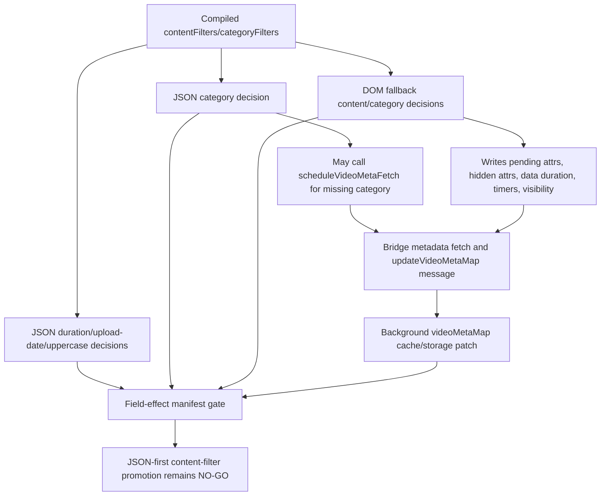

# FilterTube Content Filter Field Effect Manifest Gate - Current Behavior - 2026-05-29

Status: audit-only current-behavior content-filter field-effect manifest gate.
Runtime behavior is unchanged. This is not a JSON-first behavior patch, DOM
fallback patch, metadata-fetch patch, settings schema patch, release patch, or
first-class content-filter approval.

## Purpose

The content-filter field semantics contract proves the current field meanings,
but JSON-first promotion also needs an effect manifest. Duration, upload-date,
uppercase, and category do not have the same side-effect shape across JSON,
DOM fallback, bridge metadata fetch, and background metadata persistence. This
gate records the current effect split before any JSON-first content-filter
promotion or DOM fallback deletion.

Current answer:

```text
content-filter field-effect manifest rows: 12
JSON pure decision rows: 3
JSON metadata-fetch side-effect rows: 1
DOM side-effect rows: 5
bridge/background metadata side-effect rows: 2
runtime behavior changed: no
JSON-first content-filter first-class approvals: 0
DOM fallback content-filter deletion approvals: 0
content-filter field-effect manifest approval: NO-GO
```

## Source Inputs

| Input | Current proof used |
| --- | --- |
| `docs/audit/FILTERTUBE_CONTENT_FILTER_FIELD_SEMANTICS_CONTRACT_GATE_CURRENT_BEHAVIOR_2026-05-29.md` | Defines the field semantics boundary and keeps first-class content-filter promotion blocked. |
| `docs/audit/FILTERTUBE_JSON_FIRST_VIDEO_META_CONTENT_PARITY_CURRENT_BEHAVIOR_2026-05-22.md` | Proves duration, upload-date, uppercase, and category/current metadata parity gaps. |
| `docs/audit/FILTERTUBE_METHOD_SEMANTIC_PROOF_GAP_INDEX_CURRENT_BEHAVIOR_2026-05-25.md` | Pins source-owned content/category callable rows and current side effects. |
| `docs/audit/FILTERTUBE_COMPILED_SETTINGS_FIELD_REGISTER_CURRENT_BEHAVIOR_2026-05-22.md` | Proves compiled/settings fields are enumerated but not first-class authority. |
| `docs/audit/FILTERTUBE_JSON_FIRST_ACTIVE_WORK_PREDICATE_REGISTER_CURRENT_BEHAVIOR_2026-05-22.md` | Pins active-work admission as separate from field-effect ownership. |
| `docs/audit/FILTERTUBE_WHITELIST_CACHE_SPA_METRIC_PACKET_GATE_CURRENT_BEHAVIOR_2026-05-29.md` | Keeps optimization and JSON-first promotion blocked on missing route/surface metric artifacts. |

## Effect Flow

ASCII flow:

```text
compiled content/category settings
  -> JSON duration/upload-date/uppercase pure decisions
  -> JSON category may schedule metadata fetch
  -> DOM fallback metadata reads, fetch scheduling, pending attrs, timers, markers
  -> bridge metadata fetch and background videoMetaMap persistence
  -> field-effect manifest approval remains NO-GO
```

Mermaid flow:



## Manifest Rows

| Row | Current owner | Current effect shape | Missing proof before first-class promotion |
| --- | --- | --- | --- |
| `FT-CFEFFECT-00-scope` | Audit gate | Binds JSON decisions, DOM writes, metadata fetch scheduling, pending reruns, bridge messages, and background metadata persistence into one effect boundary. | One committed field-effect manifest with route, surface, list mode, rule state, owner, effect, no-work, and rollback fields. |
| `FT-CFEFFECT-01-json-duration` | `js/filter_logic.js` | JSON duration reads renderer fields and `videoMetaMap.lengthSeconds`, then returns a block/no-block decision. No DOM marker, timer, storage, or fetch effect is emitted by this field. | Route/surface fixtures proving parity with DOM duration and learned metadata freshness. |
| `FT-CFEFFECT-02-json-upload-date` | `js/filter_logic.js` | JSON upload-date reads renderer fields and `videoMetaMap.uploadDate/publishDate`, then returns a block/no-block decision. Missing metadata is a no-op. | Missing-metadata policy and DOM parity for watch playlist, search, Kids, and Mix-like rows. |
| `FT-CFEFFECT-03-json-uppercase` | `js/filter_logic.js` | JSON uppercase title filtering is a pure title heuristic returning a block/no-block decision. | Alphabet, threshold, renderer, and DOM parity policy. |
| `FT-CFEFFECT-04-json-category` | `js/filter_logic.js` | JSON category reads `videoMetaMap.category`; when missing, it may call `scheduleVideoMetaFetch(videoId, { needCategory: true })` and returns no block. | Category fetch owner, global availability, endpoint budget, and missing-category route fixtures. |
| `FT-CFEFFECT-05-dom-category` | `js/content/dom_fallback.js` | DOM category can read `videoMetaMap.category`, call `scheduleVideoMetaFetch`, set pending category attrs, hide by category, and clear markers. | Pending/fetch/visibility budget and category false-hide/leak fixtures. |
| `FT-CFEFFECT-06-dom-upload-date` | `js/content/dom_fallback.js` | DOM upload-date can read text/aria/videoMetaMap, schedule date metadata fetch, set pending upload-date attrs, hide non-selected watch playlist rows, and clear markers. | Watch playlist negative fixtures, pending TTL budget, and DOM-vs-JSON missing-date policy. |
| `FT-CFEFFECT-07-dom-duration` | `js/content/dom_fallback.js` | DOM duration can read visible text or `videoMetaMap`, write `data-filtertube-duration`, schedule duration fetches for Kids/Mix-like cards, hide by duration, and stamp hidden-by-duration. | Kids/Mix fetch budget, marker ownership, and duration parity fixtures. |
| `FT-CFEFFECT-08-dom-pending-rerun` | `js/content/dom_fallback.js` | Pending category/upload-date can set timestamp attrs and one `window.__filtertubePendingMetaRecheck` timer that reruns DOM fallback after TTL. | Timer owner, cancellation, route scope, and no-rule budget proof. |
| `FT-CFEFFECT-09-dom-visibility-markers` | `js/content/dom_fallback.js` | DOM fallback can call `toggleVisibility`, stamp processed/mode/id attrs, and add or remove content-filter hidden markers. | Shared hide/restore owner and sibling-visible fixtures for every affected surface. |
| `FT-CFEFFECT-10-bridge-background-meta` | `js/content_bridge.js`, `js/background.js` | Bridge metadata fetch can send `updateVideoMetaMap`; background accepts the message and enqueues video metadata cache/storage patching. | Sender trust, cache revision, size budget, stale-card, and refresh delivery proof. |
| `FT-CFEFFECT-11-promotion-decision` | Audit gate | Current effect ownership is split and partial. JSON-first content-filter promotion and DOM fallback deletion remain blocked. | Field-effect manifest artifact, route/surface metrics, DOM parity, native parity, rollback proof, and public-claim boundary. |

## Current Decision

```text
define content-filter field-effect manifest gate: GO
approve JSON-first content-filter as first-class filter authority now: NO-GO
delete DOM fallback content-filter behavior now: NO-GO
merge JSON and DOM category fetch ownership now: NO-GO
use content-filter field effects for release/public claims now: NO-GO
runtime behavior changed by this gate: no
continue proof-backed audit: GO
```

## Missing Product Authority Symbols

No product runtime, build, script, website, manifest, CSS, source, or asset file
currently defines:

```text
contentFilterFieldEffectManifestGate
contentFilterFieldEffectManifestReport
jsonFirstContentFilterEffectAuthority
jsonFirstContentFilterPureDecisionReport
jsonFirstContentFilterFetchSideEffectBudget
domContentFilterPendingEffectBudget
domContentFilterVisibilityMarkerManifest
contentFilterVideoMetaFetchOwnerReport
contentFilterFieldEffectRouteSurfaceMatrix
contentFilterFieldEffectRollbackReport
contentFilterFieldEffectPublicClaimBoundary
```

## Verification

Current proof command:

```bash
node --test tests/runtime/content-filter-field-effect-manifest-gate-current-behavior.test.mjs --test-reporter=spec
```

This gate is not a completion claim. It records the current field-effect split
that must be converted into committed effect authority before JSON-first
content filters can be treated as first-class filter authority or before DOM
fallback content-filter behavior can be removed.
