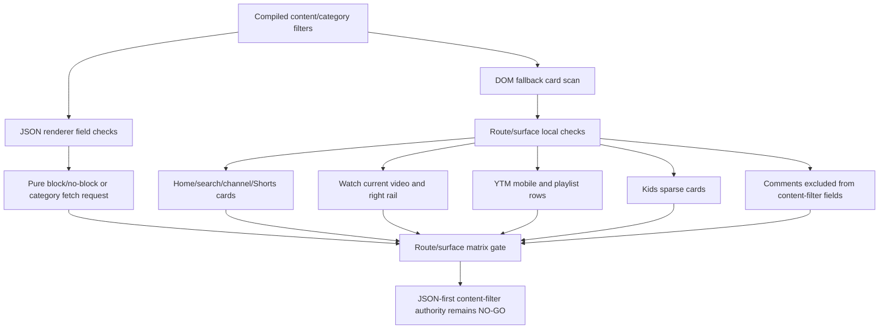
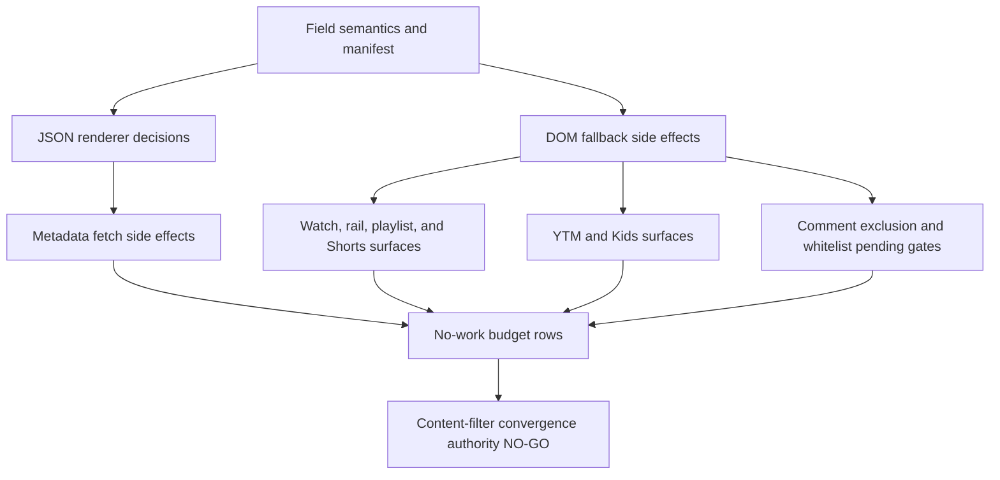

# FilterTube Content Filter Field Effect Route Surface Matrix - Current Behavior - 2026-05-29

Status: audit-only current-behavior content-filter field-effect route/surface
matrix. Runtime behavior is unchanged. This is not a JSON-first behavior patch,
DOM fallback patch, whitelist patch, Kids patch, YTM patch, metric artifact,
release patch, public-claim patch, or first-class content-filter approval.

## Purpose

The field-effect manifest proves which content-filter fields are pure JSON
decisions, which fields schedule metadata fetches, and which fields mutate DOM
state. This route/surface matrix records where those effects can currently
land before any JSON-first promotion or DOM fallback deletion.

Current answer:

```text
content-filter field-effect route/surface rows: 12
route/surface classes covered: 9
JSON route/surface approval rows: 0
DOM fallback deletion approvals: 0
content-filter route/surface matrix approval: NO-GO
runtime behavior changed: no
```

## Source Inputs

| Input | Current proof used |
| --- | --- |
| `docs/audit/FILTERTUBE_CONTENT_FILTER_FIELD_EFFECT_MANIFEST_GATE_CURRENT_BEHAVIOR_2026-05-29.md` | Defines current content-filter field side effects and keeps first-class promotion blocked. |
| `docs/audit/FILTERTUBE_ROUTE_SURFACE_EFFECT_AUTHORITY_CURRENT_BEHAVIOR_2026-05-20.md` | Defines the missing shared route/surface authority needed before behavior changes. |
| `docs/audit/FILTERTUBE_JSON_FIRST_ROUTE_SURFACE_METRIC_SIDE_EFFECT_BUDGET_CONTRACT_CURRENT_BEHAVIOR_2026-05-24.md` | Defines the future side-effect budget artifact shape while proving no committed artifact exists. |
| `docs/audit/FILTERTUBE_JSON_FIRST_VIDEO_META_CONTENT_PARITY_CURRENT_BEHAVIOR_2026-05-22.md` | Proves current duration/upload-date/category parity gaps. |
| `docs/audit/FILTERTUBE_WHITELIST_PENDING_INTAKE_NO_WORK_CONTRACT_CURRENT_BEHAVIOR_2026-05-25.md` | Pins whitelist pending-hide no-work and route-exclusion boundaries. |
| `docs/audit/FILTERTUBE_YTM_WATCH_PLAYER_SELECTED_ROW_SIDE_EFFECT_BOUNDARY_CURRENT_BEHAVIOR_2026-05-23.md` | Pins YTM watch selected-row side-effect risks. |
| `docs/audit/FILTERTUBE_RIGHT_RAIL_WHITELIST_OBSERVER_CURRENT_BEHAVIOR_2026-05-19.md` | Pins right-rail whitelist observer limitations and timer budget. |
| `docs/audit/FILTERTUBE_KIDS_LATEST_JSON_OWNER_EXTENSION_FIXTURE_BOUNDARY_CURRENT_BEHAVIOR_2026-05-23.md` | Pins Kids sparse-identity and owner-extension behavior. |

## Route/Surface Flow

ASCII flow:

```text
compiled content/category filters
  -> JSON renderer decisions without route-owned side-effect report
  -> DOM fallback route checks and broad card selectors
  -> watch/YTM/Kids/pending/comment special cases
  -> metadata fetch and visibility marker side effects
  -> route/surface matrix approval remains NO-GO
```

Mermaid flow:



## Matrix Rows

| Row | Current route/surface class | Current effect shape | Missing proof before first-class promotion |
| --- | --- | --- | --- |
| `FT-CFROUTE-00-scope` | Audit gate | Binds content-filter field effects to route, surface, list mode, rule state, owner, no-work, and rollback boundaries. | One committed route/surface field-effect matrix artifact. |
| `FT-CFROUTE-01-json-renderers` | YouTubei renderer objects | JSON duration, upload-date, and uppercase are renderer decisions; JSON category can schedule metadata fetch when category is missing. | Route/surface ownership for every endpoint and renderer family. |
| `FT-CFROUTE-02-desktop-feed-search-channel` | Main home, search, channel/feed cards | DOM fallback can scan broad video-card selectors, read metadata, hide/restore cards, and stamp content-filter markers. | Per-route selector, mutation, no-rule, and stale-card budgets. |
| `FT-CFROUTE-03-watch-current-video` | Main watch current video | DOM current-watch owner logic can hide watch metadata, pause video, and click next/playlist targets through local route checks. | Watch-surface effect budget and no-playback-side-effect report. |
| `FT-CFROUTE-04-watch-rail-playlist` | Watch right rail and playlist panels | DOM fallback treats right-rail, selected playlist rows, and playlist skip behavior separately from JSON decisions. | Selected-row mode matrix and sibling-preservation fixtures. |
| `FT-CFROUTE-05-shorts-shelves-cards` | Shorts shelves, cards, and disguised Shorts | DOM fallback uses Shorts links/renderers, hide-all-Shorts markers, and shelf-level visibility alongside content-filter checks. | Shorts source-confidence and shelf/card rollback fixtures. |
| `FT-CFROUTE-06-comments-exclusion` | Comment threads/view models | JSON content/category checks skip comment renderers; DOM whitelist fail-closed excludes comment context from non-comment content-filter semantics. | Comment exclusion report proving keyword/comment features remain independent. |
| `FT-CFROUTE-07-mobile-ytm-browse-search` | Mobile/YTM browse, search, compact rows | DOM fallback uses `ytm-*` selectors and mobile route markers; content-filter markers can land on compact/mobile rows. | YTM browse/search fixture parity and selector stability budget. |
| `FT-CFROUTE-08-mobile-ytm-watch-playlist` | YTM watch player and playlist panel | Selected YTM playlist rows, current-watch owner effects, and mobile playlist visibility use DOM-only policy. | YTM selected-row side-effect and JSON parity authority. |
| `FT-CFROUTE-09-kids-cards` | YouTube Kids cards and sparse DOM | Kids cards can rely on sparse identity and duration metadata fetches; Kids whitelist can fail closed when identity is missing. | Kids route/surface field matrix and native parity proof. |
| `FT-CFROUTE-10-whitelist-pending-exclusions` | Whitelist pending-hide route gates | Pending-hide intake currently excludes root, search, feed/channels, and watch routes before some selector traversal. | Shared route no-work budget proving pending hides cannot leak or false-hide. |
| `FT-CFROUTE-11-promotion-decision` | Audit gate | Current route/surface ownership is split across JSON, DOM, bridge, background, YTM, Kids, and comment exclusions. | Route/surface matrix artifact, metric packet, DOM/JSON/native parity, rollback, and public-claim proof. |

## Route/Surface Chain Closure

This closure table proves the documentation chain is complete from field
semantics, through field side effects, to route/surface behavior. It does not
create route/surface authority, JSON-vs-DOM parity authority, native parity,
DOM fallback deletion authority, release authority, or public-claim authority.

Current route/surface closure answer:

```text
content-filter field-effect route/surface closure rows: 12
route/surface matrix rows linked by closure: 12
field-effect manifest rows linked by closure: 12
field semantics contract rows linked by closure: 12
route/surface classes linked by closure: 9
source input families linked by route/surface closure: 8
runtime route/surface closure approvals: 0
implementation-ready route/surface rows: 0
content-filter route/surface closure: ROUTE-SURFACE-CHAIN-CLOSED
content-filter route/surface implementation readiness from closure: NO-GO
runtime behavior changed: no
```

Route/surface closure rows:

| Closure row | Route/surface row | Field-effect link | Field-semantics link | Current state |
| --- | --- | --- | --- | --- |
| `FT-CFROUTE-CLOSURE-00-scope` | `FT-CFROUTE-00-scope` | `FT-CFEFFECT-00-scope` | `FT-CFFIELD-00-contract-scope` | Chain linked; committed route/surface field-effect matrix artifact absent. |
| `FT-CFROUTE-CLOSURE-01-json-renderers` | `FT-CFROUTE-01-json-renderers` | `FT-CFEFFECT-01-json-duration` through `FT-CFEFFECT-04-json-category` | JSON duration, upload-date, uppercase, and category field rows. | Chain linked; route/surface ownership for every endpoint and renderer family missing. |
| `FT-CFROUTE-CLOSURE-02-desktop-feed-search-channel` | `FT-CFROUTE-02-desktop-feed-search-channel` | DOM side-effect rows for category, upload-date, duration, pending rerun, and visibility markers. | DOM duration, upload-date, uppercase wake, category, and active-work rows. | Chain linked; per-route selector, mutation, no-rule, and stale-card budgets missing. |
| `FT-CFROUTE-CLOSURE-03-watch-current-video` | `FT-CFROUTE-03-watch-current-video` | DOM upload-date, duration, visibility marker, and playlist side-effect rows. | DOM metadata and active-work rows. | Chain linked; watch-surface effect budget and no-playback-side-effect report missing. |
| `FT-CFROUTE-CLOSURE-04-watch-rail-playlist` | `FT-CFROUTE-04-watch-rail-playlist` | DOM upload-date, duration, pending rerun, and visibility marker rows. | DOM duration/upload-date/category rows. | Chain linked; selected-row mode matrix and sibling-preservation fixtures missing. |
| `FT-CFROUTE-CLOSURE-05-shorts-shelves-cards` | `FT-CFROUTE-05-shorts-shelves-cards` | JSON pure decision rows plus DOM duration and visibility marker rows. | JSON/DOM duration, uppercase, and active-work rows. | Chain linked; Shorts source-confidence and shelf/card rollback fixtures missing. |
| `FT-CFROUTE-CLOSURE-06-comments-exclusion` | `FT-CFROUTE-06-comments-exclusion` | Promotion-decision and route-exclusion boundary. | Active-work and promotion-decision rows. | Chain linked; comment exclusion report proving keyword/comment independence missing. |
| `FT-CFROUTE-CLOSURE-07-mobile-ytm-browse-search` | `FT-CFROUTE-07-mobile-ytm-browse-search` | DOM category, upload-date, duration, pending rerun, and visibility marker rows. | DOM content-filter field rows. | Chain linked; YTM browse/search fixture parity and selector stability budget missing. |
| `FT-CFROUTE-CLOSURE-08-mobile-ytm-watch-playlist` | `FT-CFROUTE-08-mobile-ytm-watch-playlist` | DOM metadata, selected-row, pending rerun, and visibility marker rows. | DOM metadata and active-work rows. | Chain linked; YTM selected-row side-effect and JSON parity authority missing. |
| `FT-CFROUTE-CLOSURE-09-kids-cards` | `FT-CFROUTE-09-kids-cards` | JSON category fetch, DOM duration/category fetch, pending rerun, and visibility marker rows. | JSON/DOM category and duration rows. | Chain linked; Kids route/surface field matrix and native parity proof missing. |
| `FT-CFROUTE-CLOSURE-10-whitelist-pending-exclusions` | `FT-CFROUTE-10-whitelist-pending-exclusions` | Pending rerun and route-exclusion boundary. | Active-work and ingress rows. | Chain linked; shared route no-work budget proving pending hides cannot leak or false-hide missing. |
| `FT-CFROUTE-CLOSURE-11-promotion-decision` | `FT-CFROUTE-11-promotion-decision` | `FT-CFEFFECT-11-promotion-decision` | `FT-CFFIELD-11-promotion-decision` | Chain linked; metric packet, parity, rollback, and public-claim proof missing. |

Route/surface closure decision:

```text
close content-filter route/surface documentation chain now: GO
accept route/surface closure as JSON-first content-filter route authority now: NO-GO
accept route/surface closure as DOM fallback deletion approval now: NO-GO
accept route/surface closure as YTM parity proof now: NO-GO
accept route/surface closure as Kids/native parity proof now: NO-GO
accept route/surface closure as comment-exclusion broad approval now: NO-GO
accept route/surface closure as release/public-claim approval now: NO-GO
continue proof-backed audit: GO
```

## Current Decision

```text
define content-filter field-effect route/surface matrix: GO
approve JSON-first content-filter route/surface authority now: NO-GO
delete DOM fallback content-filter route behavior now: NO-GO
use YTM selected-row content-filter behavior as JSON parity proof now: NO-GO
use Kids content-filter behavior as native parity proof now: NO-GO
use comment exclusion as broad content-filter approval now: NO-GO
runtime behavior changed by this matrix: no
continue proof-backed audit: GO
```

## Content-Filter Route/Surface Convergence Boundary - 2026-05-30

This boundary joins the field-effect route/surface matrix with the no-work
budget so the global implementation gate can reason about content-filter
optimization as one blocked surface. It does not approve runtime changes,
metric collectors, JSON-first promotion, DOM fallback deletion, native parity,
or release/public claims.

Current convergence answer:

```text
content-filter route/surface convergence rows: 10
field-effect route/surface rows covered: 12
no-work budget rows covered: 12
route/surface classes covered: 9
cheap no-work gate families covered: 7
known over-work gap families covered: 6
runtime content-filter convergence approvals: 0
implementation-ready content-filter convergence rows: 0
content-filter JSON-first route authority: NO-GO
content-filter DOM fallback deletion approval: NO-GO
runtime behavior changed: no
```

ASCII convergence flow:

```text
field semantics and manifest rows
  -> JSON renderer content/category decisions
  -> metadata fetch side effects
  -> DOM fallback route/surface side effects
  -> watch, YTM, Kids, comments, and whitelist-pending exceptions
  -> no-work budget rows
  -> content-filter convergence authority remains NO-GO
```

Mermaid convergence flow:



Convergence rows:

| Row | Joined proof | Current blocked authority |
| --- | --- | --- |
| `FT-CFCONVERGE-00-field-semantics-manifest` | Field semantics and field-effect manifest rows are linked to route/surface rows. | One implemented content-filter field authority is absent. |
| `FT-CFCONVERGE-01-json-renderer-decisions` | JSON duration, upload-date, uppercase, and category decisions are route-classified. | JSON-first route authority and renderer-family proof are absent. |
| `FT-CFCONVERGE-02-metadata-fetch-side-effects` | Category metadata fetch and video metadata cache effects are named. | Reason-preserving metadata queue and stale-cache budget are absent. |
| `FT-CFCONVERGE-03-dom-fallback-side-effects` | DOM fallback selectors, markers, hide/restore, and route checks are classified. | DOM fallback deletion and selector pruning approvals are absent. |
| `FT-CFCONVERGE-04-watch-side-effects` | Watch current-video, rail, playlist, selected-row, and fullscreen risks are linked. | Watch no-playback and selected-row side-effect budgets are absent. |
| `FT-CFCONVERGE-05-whitelist-pending-gates` | Pending-hide route exclusions and queue caps are linked to field effects. | Shared whitelist pending no-work authority is absent. |
| `FT-CFCONVERGE-06-comments-exclusion` | JSON and DOM content/category comment exclusions are explicit. | Independent comment-keyword/filter-all proof is absent. |
| `FT-CFCONVERGE-07-ytm-kids-native-parity` | YTM mobile rows and Kids sparse cards are kept separate from Main JSON claims. | YTM/Kids/native parity authority is absent. |
| `FT-CFCONVERGE-08-no-work-artifact-gap` | No-work rows name current cheap gates and over-work gaps. | Committed route/surface counter artifacts and live traces are absent. |
| `FT-CFCONVERGE-09-authority-absence` | Future authority symbols remain absent from product source. | Runtime implementation readiness remains 0. |

Convergence decision:

```text
define content-filter route/surface convergence boundary: GO
accept convergence as JSON-first content-filter authority now: NO-GO
accept convergence as DOM fallback deletion approval now: NO-GO
accept convergence as metadata fetch pruning approval now: NO-GO
accept convergence as watch/YTM/Kids/native parity proof now: NO-GO
accept convergence as release/public-claim proof now: NO-GO
continue proof-backed audit: GO
```

## Missing Product Authority Symbols

No product runtime, build, script, website, manifest, CSS, source, or asset file
currently defines:

```text
contentFilterFieldEffectRouteSurfaceMatrix
contentFilterRouteSurfaceEffectDecision
contentFilterRouteSurfaceNoWorkBudget
contentFilterRouteSurfaceJsonDomParityReport
contentFilterRouteSurfaceWatchBudget
contentFilterRouteSurfaceYtmBudget
contentFilterRouteSurfaceKidsBudget
contentFilterRouteSurfaceCommentExclusionReport
contentFilterRouteSurfaceRollbackReport
contentFilterRouteSurfacePublicClaimBoundary
contentFilterRouteSurfaceClosure
contentFilterRouteSurfaceClosureRuntimeApproval
contentFilterRouteSurfaceImplementationReadiness
contentFilterRouteSurfaceConvergenceAuthority
contentFilterRouteSurfaceConvergenceReport
contentFilterRouteSurfaceConvergenceApproval
```

## Verification

Current proof command:

```bash
node --test tests/runtime/content-filter-field-effect-route-surface-matrix-current-behavior.test.mjs --test-reporter=spec
```

This matrix is not a completion claim. It records that content-filter field
effects still lack one route/surface authority for JSON, DOM, YTM, Kids, watch,
Shorts, and comment-exclusion behavior.
