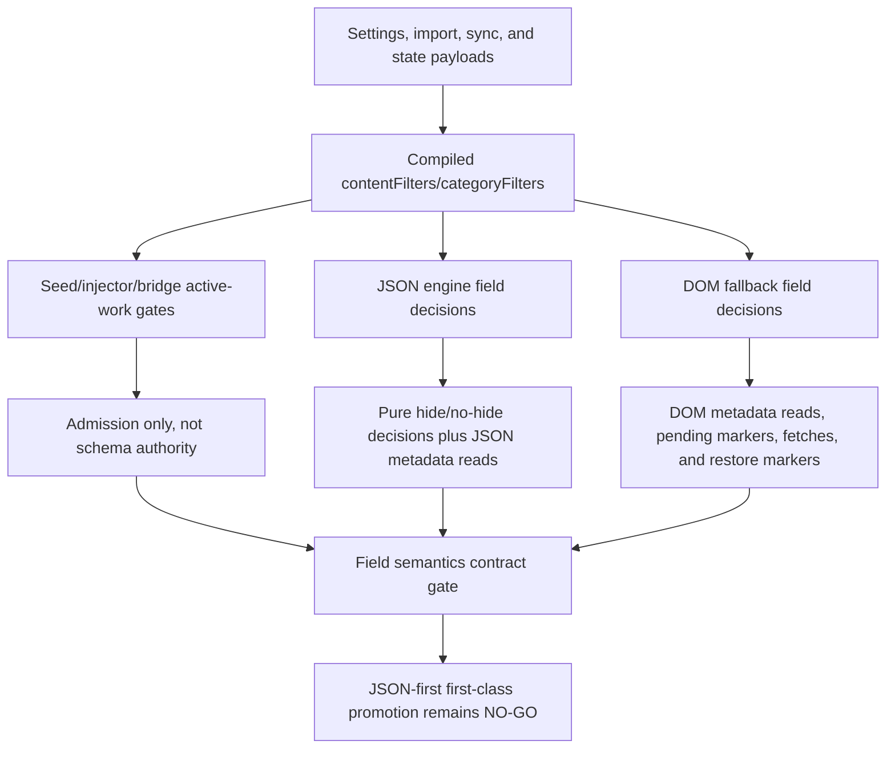

# FilterTube Content Filter Field Semantics Contract Gate - Current Behavior - 2026-05-29

Status: audit-only current-behavior content-filter field semantics contract
gate. Runtime behavior is unchanged. This is not a settings schema patch,
JSON-first behavior patch, DOM fallback patch, metadata-fetch patch, no-work
optimization patch, release patch, public claim, or first-class filter
approval.

## Purpose

The audit already proves duration, upload-date, uppercase, and category filters
are active in both JSON and DOM paths, but they are not governed by one shared
field-semantics contract. This gate binds the split current behavior into one
NO-GO decision boundary before any JSON-first first-class content-filter
promotion, DOM fallback deletion, or broad whitelist/cache optimization.

Current answer:

```text
content-filter field semantics contract rows: 12
content/category semantic callable rows already lifted into method gate: 16
JSON-first content-filter first-class approvals: 0
DOM fallback content-filter deletion approvals: 0
settings ingress content-filter normalization approvals: 0
content-filter field semantics contract approval: NO-GO
runtime behavior changed: no
not completion proof for JSON-first content-filter promotion
```

## Source Inputs

| Input | Current proof used |
| --- | --- |
| `docs/audit/FILTERTUBE_JSON_FIRST_VIDEO_META_CONTENT_PARITY_CURRENT_BEHAVIOR_2026-05-22.md` | Proves duration, upload-date, uppercase, and validity semantics are split across JSON, DOM fallback, and active-work gates. |
| `docs/audit/FILTERTUBE_METHOD_SEMANTIC_PROOF_GAP_INDEX_CURRENT_BEHAVIOR_2026-05-25.md` | Lifts 16 content/category semantic callable rows into the repo-wide semantic proof gate while leaving content/category contract approval at NO-GO. |
| `docs/audit/FILTERTUBE_COMPILED_SETTINGS_FIELD_REGISTER_CURRENT_BEHAVIOR_2026-05-22.md` | Proves compiled/settings field consumers and keeps first-class settings field authority absent. |
| `docs/audit/FILTERTUBE_IMPORT_EXPORT_NANAH_AUTHORITY_AUDIT_2026-05-18.md` | Shows import/sync/state ingress can preserve caller-shaped nested content-filter objects. |
| `docs/audit/FILTERTUBE_JSON_FIRST_ACTIVE_WORK_PREDICATE_REGISTER_CURRENT_BEHAVIOR_2026-05-22.md` | Pins strict `enabled === true` active-work admission for seed, injector, and bridge after the release-lag fixes. |
| `docs/audit/FILTERTUBE_JSON_FIRST_FILTER_READINESS_GATE_CURRENT_BEHAVIOR_2026-05-21.md` | Keeps JSON-first promotion blocked until normalized path, route/surface, field-effect, no-work, side-effect, and parity proof exist. |
| `docs/audit/FILTERTUBE_WHITELIST_CACHE_SPA_METRIC_PACKET_GATE_CURRENT_BEHAVIOR_2026-05-29.md` | Keeps whitelist/cache optimization and JSON-first first-class promotion gated by route/surface metric proof. |

## Field Semantics Flow

ASCII flow:

```text
settings/import/sync/state payload
  -> compiled settings contentFilters/categoryFilters
  -> active-work gates
  -> JSON engine decisions
  -> DOM fallback decisions
  -> first-class promotion decision remains NO-GO
```

Mermaid flow:



## Contract Rows

| Row | Current owner | Current behavior | Missing proof before first-class promotion |
| --- | --- | --- | --- |
| `FT-CFFIELD-00-contract-scope` | Audit gate | Binds duration, upload-date, uppercase, category, active gates, and ingress into one contract boundary. | Route/surface metric artifact, field-effect manifest, and behavior fixture packet. |
| `FT-CFFIELD-01-duration-json` | `js/filter_logic.js` | JSON duration uses extracted seconds, aliases, optional string ranges, min/max swap, and allow/block mode. | Shared duration alias/range/mode policy and parity fixtures. |
| `FT-CFFIELD-02-duration-dom` | `js/content/dom_fallback.js` | DOM duration reads visible text or `videoMetaMap`, writes `data-filtertube-duration`, can fetch metadata, and supports fewer aliases. | DOM-vs-JSON parity report and marker/fetch side-effect budget. |
| `FT-CFFIELD-03-upload-date-json` | `js/filter_logic.js` | JSON upload-date checks extracted timestamps with `fromDate`/`toDate`; blank or invalid cutoffs no-op. | Date cutoff policy, missing-metadata policy, and decision report. |
| `FT-CFFIELD-04-upload-date-dom` | `js/content/dom_fallback.js` | DOM upload-date reads text, aria labels, and `videoMetaMap`; can schedule date metadata fetch and pending markers. | Fetch/pending budget and playlist-row false-hide/leak proof. |
| `FT-CFFIELD-05-uppercase-json` | `js/filter_logic.js` | JSON uppercase uses ASCII title heuristic with `single_word`, `all_caps`, `both`, and `minWordLength`. | Alphabet policy, invalid threshold policy, and renderer route scope. |
| `FT-CFFIELD-06-uppercase-dom` | `js/content/dom_fallback.js` | DOM active-work can wake for uppercase, but DOM fallback has no equivalent uppercase hide branch. | DOM parity or explicit JSON-only field policy. |
| `FT-CFFIELD-07-category-json` | `js/filter_logic.js` | JSON category uses `categoryFilters.enabled`, selected list, mode, video id, `videoMetaMap.category`, and metadata fetch helper side effects. | Category fetch side-effect authority and route/profile metric budget. |
| `FT-CFFIELD-08-category-dom` | `js/content/dom_fallback.js` | DOM category reads learned category, schedules metadata fetches, and uses pending markers on selected routes/modes. | DOM pending/fetch budget and category false-hide/leak fixtures. |
| `FT-CFFIELD-09-active-work-gates` | `js/seed.js`, `js/injector.js`, `js/content_bridge.js` | Active-work gates require exact `enabled === true` for content/category filters but do not validate thresholds or normalize fields. | Admission-vs-effect contract and no-work budget per invalid value. |
| `FT-CFFIELD-10-settings-ingress` | `settings_shared.js`, `background.js`, `filter_logic.js`, import/sync/state paths | Nested objects pass through without deep content-filter schema normalization or canonical field enforcement. | Shared normalizer ownership, import/sync migration policy, and rollback fixtures. |
| `FT-CFFIELD-11-promotion-decision` | Audit gate | Current source proof is partial; JSON-first content-filter promotion remains blocked. | Metric artifact packet, live route/surface smoke, DOM parity, native parity, and public-claim boundary. |

## Current Decision

```text
define content-filter field semantics contract gate: GO
approve JSON-first content-filter as first-class filter authority now: NO-GO
delete DOM fallback content-filter behavior now: NO-GO
merge active-work predicates into effect authority now: NO-GO
normalize import/sync/state content-filter payloads now: NO-GO
use content-filter semantics for release/public claims now: NO-GO
continue proof-backed audit: GO
```

## Missing Product Authority Symbols

No product runtime, build, script, website, manifest, CSS, source, or asset file
currently defines:

```text
contentFilterFieldSemanticsContractGate
contentFilterFieldSemanticsReport
jsonFirstContentFilterFirstClassAuthority
jsonFirstContentFilterJsonDomParityReport
jsonFirstContentFilterFieldEffectManifest
jsonFirstContentFilterDurationPolicy
jsonFirstContentFilterUploadDatePolicy
jsonFirstContentFilterUppercasePolicy
jsonFirstCategoryFilterSideEffectBudget
contentFilterSettingsIngressNormalizer
contentFilterActiveWorkEffectAuthority
contentFilterFieldSemanticsMetricArtifact
```

## Verification

Current proof command:

```bash
node --test tests/runtime/content-filter-field-semantics-contract-gate-current-behavior.test.mjs --test-reporter=spec
```

This gate is not a completion claim. It records the current field-semantics
contract boundary that must be satisfied before JSON-first content filters can
be treated as first-class filter authority or before DOM fallback
content-filter behavior can be removed.
