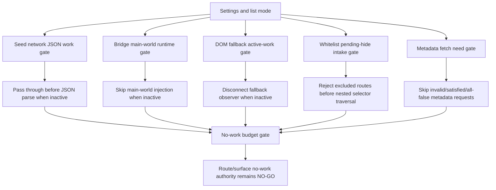

# FilterTube Content Filter Route Surface No-Work Budget - Current Behavior - 2026-05-29

Status: audit-only current-behavior content-filter route/surface no-work
budget. Runtime behavior is unchanged. This is not an optimization patch,
JSON-first behavior patch, DOM fallback patch, whitelist patch, metric
collector, release package patch, public-claim patch, or first-class
content-filter approval.

## Purpose

The content-filter field-effect route/surface matrix proves that content-filter
effects are split across JSON renderers, DOM fallback, bridge metadata fetch,
background metadata cache, YTM rows, Kids cards, watch surfaces, and comment
exclusions. This budget records the current no-work gates and over-work gaps
for those effects before changing any runtime behavior.

Current answer:

```text
content-filter route/surface no-work budget rows: 12
current cheap no-work gate families covered: 7
known over-work gap families covered: 6
runtime no-work authority approvals: 0
content-filter no-work budget approval: NO-GO
runtime behavior changed: no
```

## Source Inputs

| Input | Current proof used |
| --- | --- |
| `docs/audit/FILTERTUBE_CONTENT_FILTER_FIELD_EFFECT_ROUTE_SURFACE_MATRIX_CURRENT_BEHAVIOR_2026-05-29.md` | Defines route/surface effect rows and keeps content-filter route/surface authority blocked. |
| `docs/audit/FILTERTUBE_CONTENT_FILTER_FIELD_EFFECT_MANIFEST_GATE_CURRENT_BEHAVIOR_2026-05-29.md` | Defines current field-effect ownership and keeps JSON-first promotion blocked. |
| `docs/audit/FILTERTUBE_JSON_FIRST_VIDEO_META_NO_WORK_BUDGET_CURRENT_BEHAVIOR_2026-05-22.md` | Pins metadata scheduler no-work gates and queue reason-loss gaps. |
| `docs/audit/FILTERTUBE_WHITELIST_PENDING_INTAKE_NO_WORK_CONTRACT_CURRENT_BEHAVIOR_2026-05-25.md` | Pins the narrow implemented pending-hide intake no-work patch and its limits. |
| `docs/audit/FILTERTUBE_EMPTY_INSTALL_IDLE_OBSERVER_BUDGET_CURRENT_BEHAVIOR_2026-05-26.md` | Pins empty desktop idle observer reductions while keeping broad observer/listener/timer completion open. |
| `docs/audit/FILTERTUBE_JSON_FIRST_ROUTE_SURFACE_METRIC_NO_WORK_BUDGET_CONTRACT_CURRENT_BEHAVIOR_2026-05-24.md` | Defines the future route/surface no-work metric artifact contract while proving no committed artifact exists. |
| `docs/audit/FILTERTUBE_JSON_FIRST_ACTIVE_WORK_PREDICATE_REGISTER_CURRENT_BEHAVIOR_2026-05-22.md` | Pins active-work predicate split and lack of one shared active-work authority. |

## No-Work Flow

ASCII flow:

```text
settings/profile/list mode
  -> seed hasNetworkJsonWork gate
  -> bridge needsMainWorldRuntimeWork and identity prefetch gates
  -> DOM fallback hasActiveDOMFallbackWork gate
  -> whitelist pending-hide early route/cap gates
  -> metadata scheduler field-need gates
  -> no-work budget approval remains NO-GO
```

Mermaid flow:



## Budget Rows

| Row | Current owner | Current no-work or over-work behavior | Missing proof before optimization |
| --- | --- | --- | --- |
| `FT-CFNOWORK-00-scope` | Audit gate | Binds content-filter route/surface no-work decisions to settings, route, surface, list mode, rules, metadata, DOM, bridge, and seed work. | One committed no-work budget artifact with route/surface counters and rollback fields. |
| `FT-CFNOWORK-01-seed-network` | `js/seed.js` | `shouldBypassYouTubeiNetworkResponse()` passes through before JSON parse when settings are missing or when `hasNetworkJsonWork()` is false. | Endpoint-family route/surface counters and live trace proof. |
| `FT-CFNOWORK-02-json-work-predicate` | `js/seed.js`, `js/content_bridge.js` | Blocklist mode needs content filters, category filters, comments/Shorts toggles, keywords, or channels; whitelist mode still admits JSON/main-world work. | One shared active-work authority and whitelist empty/active budget. |
| `FT-CFNOWORK-03-main-world-injection` | `js/content_bridge.js` | `ensureMainWorldRuntimeForSettings()` returns before injection when `needsMainWorldRuntimeWork()` is false. | Per-route proof that skipped injection cannot leak blocked/allowed content. |
| `FT-CFNOWORK-04-identity-prefetch` | `js/content_bridge.js` | Identity prefetch requires whitelist mode or non-empty channel blocklist. | Route/surface identity confidence and prefetch budget proof. |
| `FT-CFNOWORK-05-dom-fallback-active` | `js/content/dom_fallback.js` | DOM fallback returns false for missing/disabled settings, but whitelist mode, keyword/channel/comment rules, boolean toggles, content filters, and selected category filters all make DOM fallback active. | Route-local active DOM decision report and false-hide/leak fixtures. |
| `FT-CFNOWORK-06-dom-fallback-fail-open-catch` | `js/content/dom_fallback.js`, `js/content_bridge.js` | Active-work predicates return true on exceptions, keeping work fail-open rather than no-work. | Exception policy, telemetry-free diagnostics, and rollback proof. |
| `FT-CFNOWORK-07-whitelist-pending-intake` | `js/content_bridge.js` | Pending-hide intake rejects native overlay, non-whitelist mode, excluded routes, full candidate queues, and resource-only nodes before nested selector traversal. | Shared no-work budget connecting intake, apply, and DOM fallback route policy. |
| `FT-CFNOWORK-08-metadata-scheduler` | `js/content_bridge.js` | Metadata scheduler skips invalid ids, satisfied needs, and explicit all-false need flags, but admitted queue work loses caller reason and field need flags. | Reason-preserving queue, route/surface caller budget, and stale metadata policy. |
| `FT-CFNOWORK-09-comments-exclusion` | `js/filter_logic.js`, `js/content/dom_fallback.js` | JSON content/category checks skip comment renderers; DOM whitelist fail-closed excludes comment context from non-comment content-filter semantics. | Independent comment-keyword/filter-all proof before claiming content-filter no-work. |
| `FT-CFNOWORK-10-empty-install-boundary` | `js/seed.js`, `js/content_bridge.js`, `js/content/block_channel.js` | Empty desktop install idle observers and JSON parse/replay are reduced, but live Chrome trace, active-rule, mobile, whitelist, YTM, Kids, and comments budgets remain open. | Live route/surface performance trace and active-mode observer/listener/timer budgets. |
| `FT-CFNOWORK-11-promotion-decision` | Audit gate | Current no-work gates are split and partial. They are useful release evidence but not first-class route/surface authority. | No-work artifact, route/surface metrics, DOM/JSON/native parity, live trace, rollback, and public-claim proof. |

## No-Work Budget Closure

This closure table links the 12 budget rows to their current source-proof
families and the future artifact boundary. It closes the documentation chain
only; it does not create live traces, no-work counters, route/surface metric
artifacts, or runtime approval authority.

Current closure answer:

```text
content-filter no-work closure rows: 7
budget rows covered by closure rows: 12
source input families linked: 7
committed no-work metric artifacts: 0
committed live trace artifacts: 0
runtime no-work closure approvals: 0
content-filter no-work closure: BUDGET-CHAIN-CLOSED
content-filter implementation readiness from closure: NO-GO
runtime behavior changed: no
```

Closure rows:

| Closure row | Budget rows covered | Source proof family | Current state |
| --- | --- | --- | --- |
| `FT-CFNOWORK-CLOSURE-00-scope-and-promotion` | `FT-CFNOWORK-00-scope`, `FT-CFNOWORK-11-promotion-decision` | Field-effect route/surface matrix plus route/surface metric artifact contract. | Chain linked; metric artifact and promotion approval absent. |
| `FT-CFNOWORK-CLOSURE-01-seed-json-predicate` | `FT-CFNOWORK-01-seed-network`, `FT-CFNOWORK-02-json-work-predicate` | Seed network gate and JSON active-work predicate register. | Chain linked; shared active-work authority absent. |
| `FT-CFNOWORK-CLOSURE-02-main-world-identity` | `FT-CFNOWORK-03-main-world-injection`, `FT-CFNOWORK-04-identity-prefetch` | Bridge main-world runtime gate and identity prefetch gate. | Chain linked; per-route leak/stale identity proof absent. |
| `FT-CFNOWORK-CLOSURE-03-dom-fallback-policy` | `FT-CFNOWORK-05-dom-fallback-active`, `FT-CFNOWORK-06-dom-fallback-fail-open-catch` | DOM fallback active-work predicate and fail-open exception policy. | Chain linked; route-local false-hide/leak fixtures absent. |
| `FT-CFNOWORK-CLOSURE-04-pending-hide-intake` | `FT-CFNOWORK-07-whitelist-pending-intake` | Whitelist pending-hide no-work contract. | Chain linked; broad whitelist optimization proof absent. |
| `FT-CFNOWORK-CLOSURE-05-metadata-comments` | `FT-CFNOWORK-08-metadata-scheduler`, `FT-CFNOWORK-09-comments-exclusion` | Video metadata no-work budget plus comments exclusion proof. | Chain linked; reason-preserving queue and independent comment proof absent. |
| `FT-CFNOWORK-CLOSURE-06-empty-install-boundary` | `FT-CFNOWORK-10-empty-install-boundary` | Empty-install idle observer budget. | Chain linked; live route/surface trace and active-mode budget absent. |

Closure decision:

```text
close content-filter no-work documentation chain now: GO
accept closure as JSON-first no-work authority now: NO-GO
accept closure as DOM fallback deletion approval now: NO-GO
accept closure as live trace or metric artifact evidence now: NO-GO
accept closure as whitelist optimization approval now: NO-GO
accept closure as metadata scheduler fetch authority now: NO-GO
accept closure as release/public-claim approval now: NO-GO
continue proof-backed audit: GO
```

## Current Decision

```text
define content-filter route/surface no-work budget: GO
approve JSON-first content-filter no-work authority now: NO-GO
delete DOM fallback no-work route behavior now: NO-GO
use empty-install idle observer proof as broad no-work completion now: NO-GO
use whitelist pending-intake patch as broad whitelist optimization proof now: NO-GO
use metadata scheduler no-work gates as route/surface fetch authority now: NO-GO
runtime behavior changed by this budget: no
continue proof-backed audit: GO
```

## Content-Filter Convergence Handoff

The route/surface matrix now owns the implementation-gate convergence boundary
for content filters. This no-work budget is one source input to that boundary,
not a behavior-change approval.

```text
content-filter route/surface convergence rows: 10
no-work budget rows covered by convergence: 12
cheap no-work gate families covered by convergence: 7
known over-work gap families covered by convergence: 6
runtime content-filter convergence approvals: 0
implementation-ready content-filter convergence rows: 0
content-filter no-work authority from convergence: NO-GO
runtime behavior changed: no
```

Handoff decisions:

```text
use no-work budget in content-filter convergence boundary: GO
accept no-work budget as standalone optimization approval now: NO-GO
accept convergence handoff as live route/surface metric proof now: NO-GO
accept convergence handoff as JSON-first content-filter authority now: NO-GO
accept convergence handoff as release/public-claim proof now: NO-GO
```

## Missing Product Authority Symbols

No product runtime, build, script, website, manifest, CSS, source, or asset file
currently defines:

```text
contentFilterRouteSurfaceNoWorkBudget
contentFilterNoWorkDecisionReport
contentFilterSeedNoWorkCounter
contentFilterDomFallbackNoWorkCounter
contentFilterMainWorldNoWorkCounter
contentFilterPendingHideNoWorkCounter
contentFilterMetadataFetchNoWorkCounter
contentFilterNoWorkLiveTraceArtifact
contentFilterNoWorkRollbackReport
contentFilterNoWorkPublicClaimBoundary
contentFilterNoWorkBudgetClosure
contentFilterNoWorkBudgetClosureApproval
contentFilterNoWorkImplementationReadiness
contentFilterRouteSurfaceConvergenceAuthority
contentFilterRouteSurfaceConvergenceReport
```

## Verification

Current proof command:

```bash
node --test tests/runtime/content-filter-route-surface-no-work-budget-current-behavior.test.mjs --test-reporter=spec
```

This budget is not a completion claim. It records current no-work gates and
remaining over-work gaps so future optimization patches can be scoped without
breaking blocklist, whitelist, channel blocking, YTM, Kids, comments, or JSON
filter behavior.
