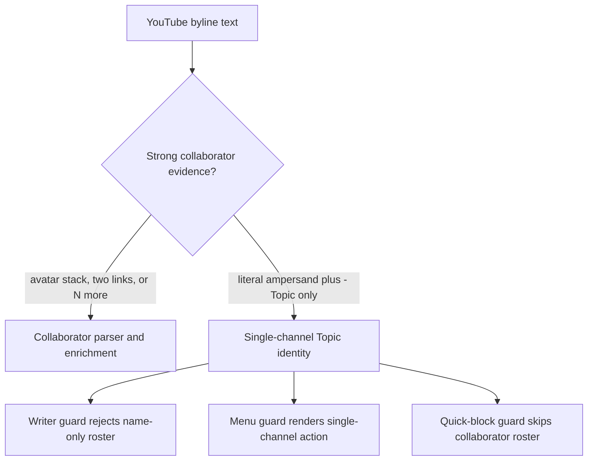
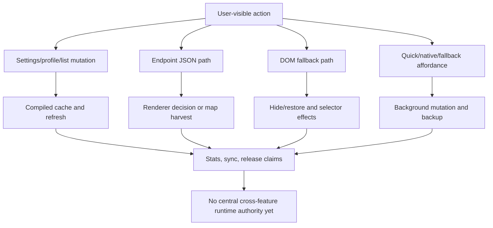

# FilterTube Cross-Feature Authority Matrix - 2026-05-18

Status: audit-only authority map. This is not an implementation patch.

This artifact connects product features to source authority, runtime surfaces,
current proof coverage, and missing proof gates. It exists because FilterTube's
current risks are cross-feature risks: one user action can touch settings,
JSON interception, DOM fallback, learned maps, quick affordances, release/app
surfaces, and public claims.

## Authority Families

| Authority family | Owns | Primary source files | Current proof artifacts |
| --- | --- | --- | --- |
| Endpoint authority | Whether YouTubei fetch/XHR responses are passed through, harvested, or mutated. | `js/seed.js`, `js/filter_logic.js` | `docs/audit/FILTERTUBE_ENDPOINT_DECISION_MATRIX_2026-05-18.md`, `tests/runtime/seed-network-current-behavior.test.mjs`, `tests/runtime/endpoint-decision-matrix-current-behavior.test.mjs` |
| JSON renderer authority | Which renderer objects are blocked, allowed, traversed, or left untouched. | `js/filter_logic.js`, `docs/json_paths_encyclopedia.md`, `docs/youtube_renderer_inventory.md` | `tests/runtime/filter-engine-current-behavior.test.mjs`, `tests/runtime/extracted-capture-current-behavior.test.mjs`, `docs/audit/FILTERTUBE_RENDERER_CONTRACT_COVERAGE_2026-05-17.md` |
| DOM enforcement authority | Which page nodes are scanned, hidden, restored, or marked as pending. | `js/content/dom_fallback.js`, `js/content/dom_extractors.js`, `js/content/dom_helpers.js`, `js/content_bridge.js` | `tests/runtime/dom-target-source-current-behavior.test.mjs`, `tests/runtime/lifecycle-source-current-behavior.test.mjs`, `docs/audit/FILTERTUBE_SELECTOR_LIFECYCLE_INVENTORY_2026-05-17.md` |
| Affordance authority | Quick-cross, native 3-dot, fallback 3-dot, playlist, post, Kids, and Shorts blocking entry points. | `js/content/block_channel.js`, `js/content/menu.js`, `js/content_bridge.js` | `tests/runtime/dom-target-source-current-behavior.test.mjs`, `docs/audit/FILTERTUBE_LIFECYCLE_TEARDOWN_AUDIT_2026-05-17.md` |
| Identity authority | UC IDs, handles, custom URLs, names, learned video maps, collaborator rosters, and resolver fallbacks. | `js/shared/identity.js`, `js/content/dom_extractors.js`, `js/content/handle_resolver.js`, `js/content_bridge.js`, `js/background.js`, `js/filter_logic.js` | `tests/runtime/extracted-capture-current-behavior.test.mjs`, `docs/audit/FILTERTUBE_CONTENT_HELPER_CALLABLE_AUDIT_2026-05-18.md` |
| Settings/mutation authority | Profiles, list modes, filters, imports, sync, derived keywords, runtime cache, and save/revision behavior. | `js/background.js`, `js/settings_shared.js`, `js/state_manager.js`, `js/tab-view.js`, `js/popup.js`, `js/io_manager.js`, `js/nanah_sync_adapter.js` | `tests/runtime/settings-authority-source-current-behavior.test.mjs`, `docs/audit/FILTERTUBE_SETTINGS_MUTATION_AUTHORITY_2026-05-17.md`, `docs/audit/FILTERTUBE_UI_SETTINGS_CALLABLE_AUDIT_2026-05-18.md` |
| Static/release authority | Extension packaging, website copy, app download claims, generated shell output, vendor bundles, and public release assets. | `build.js`, `scripts/*.mjs`, `README.md`, `data/release_notes.json`, `website/`, `js/vendor/` | `tests/runtime/public-release-surface-current-behavior.test.mjs`, `tests/runtime/static-generated-vendor-current-behavior.test.mjs`, `docs/audit/FILTERTUBE_PUBLIC_RELEASE_SURFACE_AUDIT_2026-05-18.md` |

## Cross-Feature Matrix

| Feature | Primary authority | Secondary authorities touched | Current pinned risk | Missing proof gate |
| --- | --- | --- | --- | --- |
| Empty install and disabled mode | Endpoint authority | DOM enforcement, affordance authority, learned maps | Fetch can clone/parse/stringify YouTubei responses before settings/no-rule decisions; disabled fetch still parses/rebuilds. | One no-work fixture proving no parse, no rewrite, no map write, no DOM hide, no menu insert, and no quick sweep. |
| Blocklist keyword filtering | JSON renderer authority | DOM enforcement, endpoint authority, settings authority | JSON-first works for many renderers, but DOM fallback has broad parent-hide and one-sided boundary risks. | One-keyword blocklist fixture per route proving only matching cards disappear. |
| Blocklist channel filtering | Identity authority | JSON renderer, DOM enforcement, learned maps, background mutations | Identity comes from UC, handle, custom URL, name, maps, DOM, and collaborators without one confidence object. | `channelMatchResult` proof for exact UC, handle, custom URL, learned map, stale map, name-only, collaborator, and no identity. |
| Whitelist mode | Settings/mutation authority | JSON renderer, DOM pending hides, identity authority | Empty whitelist fail-closed is engine behavior; pending hides can hide unresolved content while identity resolves. | Explicit empty-whitelist product fixture plus allowlist visibility fixtures for resolved, unresolved, stale, Shorts, playlist, and watch rail cards. |
| Simultaneous allow/block future work | Settings/mutation authority | JSON renderer, DOM fallback, quick/block UI, import/sync | Current V4 shape and mode logic are still either/or; stale Main `blocked*` aliases can override canonical lists. | Migration contract for canonical V4 list shape before adding per-entry allow/block semantics. |
| Content filters | Settings/mutation authority | Endpoint authority, JSON renderer, DOM fallback | Raw enabled flags can wake endpoint/DOM work even when selected categories are empty or dates/thresholds are blank. | `compiledRuleState` validator fixtures for inactive empty predicates and explicit broad predicates. |
| Comments filtering | Endpoint authority | JSON renderer, DOM fallback, UI settings | Append comment continuation has a synthetic end shortcut; reload continuation misses it; serialized comment keyword regexes are not reconstructed. | One comment policy fixture covering hide-all, comment-only keyword, global keyword, append/reload/replace continuations, and comments header. |
| End-screen and watch recommendations | JSON renderer authority | Endpoint `/next`, DOM fallback, player/watch state | Direct `endScreenVideoRenderer` works, but alternate watch-card, compact autoplay, and DOM end-screen surfaces are incomplete. | Fixture set from watch captures for end-screen wall, compact autoplay, watch-card hero/header/RH panel, and watch rail DOM. |
| Player payloads | Endpoint authority | JSON renderer, metadata harvest, learned maps | `/player` can run `processData` and rewrite player-shaped response bodies. | `playerMetadataOnly` proof: metadata harvest allowed, renderer mutation count must be zero. |
| Quick-cross button | Affordance authority | DOM lifecycle, settings mode, background mutations | Quick-block lifecycle installs document/window listeners and interval work before feature-enabled checks. | Visible-affordance gate fixture proving disabled/whitelist/no-rule state installs no sweep or observer work. |
| Native and fallback 3-dot menus | Affordance authority | Identity authority, background mutations, DOM fallback | Primary dropdown has mode/menu gates; fallback playlist buttons/rows can bypass list mode and `showBlockMenuItem`. | One action gate fixture for desktop, mobile, playlist, posts, Shorts, Kids, disabled, and whitelist modes. |
| Playlists/radio/mixes | JSON renderer authority | DOM fallback, identity authority, quick/block UI | `compactPlaylistRenderer` has no direct rule; radio avatar stacks can be treated as collaborator identity. | Playlist/radio matrix for compact playlist, playlist panel selected row, radio/mix owner identity, and avatar-stack non-collab. |
| Shorts/reels | Identity authority | JSON renderer, DOM fallback, quick/block UI, background watch/Shorts resolver | Title filtering works, but owner UC/handle extraction is partial and depends on learned maps/resolvers. | Shorts matrix for `shortsLockupViewModel`, `shortsLockupViewModelV2`, `reelItemRenderer`, DOM cards, owner present, owner missing, and whitelist pending. |
| Posts/community | JSON renderer authority | DOM fallback, 3-dot affordance, identity authority | `postRenderer` and `sharedPostRenderer` are not directly covered by JSON filtering; fallback menu scans omit post renderers. | Post renderer and DOM menu fixture for author, body keyword, shared original, disabled, and whitelist states. |
| YouTube Kids surface | Affordance/identity authority | JSON renderer, DOM passive listener, app runtime copies | Kids JSON owner baseline exists, but native/app WebView and passive listener parity are not fully proven in extension source. | Kids route/player/surface-state report plus no unintended desktop menu injection proof. |
| Nanah/import/export/sync | Settings/mutation authority | Security, profile modes, derived keywords, runtime cache | Import/Nanah can write V4 profiles and rely on storage listeners for runtime convergence. | Trusted mutation intent fixture for receive, apply, reject, import, backup, rollback, and list conflict handling. |
| Release website and download claims | Static/release authority | App artifacts, README/privacy, website performance | Build can publish public GitHub releases before asset uploads; website video/CDN-logo budget risks are pinned. | Draft-first release proof, artifact manifest gate, local media budget, and public claim manifest. |

## Release Hot-Path Cross-Feature Addendum - 2026-05-27

This addendum ties the release lag/blocklist/whitelist/menu/collaborator fixes
back to the authority families above. It is audit-only. It does not approve a
broader authority rewrite, JSON-first promotion, selector cleanup, list-mode
change, identity policy change, or release claim.

| Interaction row | Cross-feature path | Source pins | Current proof meaning |
| --- | --- | --- | --- |
| `release_cross_visible_blocklist_to_runtime_filter` | Popup/dashboard visible Main keyword -> background compile -> content refresh/DOM rerun. | `js/background.js:2057-2074`; `js/content/bridge_settings.js:557-583` | Canonical `main.keywords` now wins over `main.blockedKeywords`, and a later rule-changing storage refresh upgrades pending map-only debounce to `forceReprocess:true`. |
| `release_cross_empty_blocklist_no_json_work` | Settings mode -> seed transport -> injector page-world queue. | `js/seed.js:253-260`; `js/injector.js:3412-3436` | Missing/no-active JSON work bypasses YouTubei fetch/XHR body processing before parse/replay, while injector processing clears or returns inactive queued JSON. |
| `release_cross_whitelist_pending_hide_budget` | Whitelist mode -> DOM mutation observer -> pending-card hide queue. | `js/content_bridge.js:6170-6212` | Whitelist pending-hide selector work is admitted only after overlay, list-mode, route, and queue-limit gates. |
| `release_cross_quick_block_menu_mode_boundary` | Settings mode -> quick-cross affordance -> native menu close behavior. | `js/content/block_channel.js:1205-1218`; `js/content/block_channel.js:2469-2493` | Quick-block is blocklist-only and outside-click close only targets visible FilterTube-enriched dropdowns. |
| `release_cross_topic_byline_identity_boundary` | DOM byline text -> collaborator parser -> right-rail/watch collaborator warmup. | `js/content_bridge.js:2775-2814`; `js/content_bridge.js:5269-5281` | Ampersand-only Topic bylines need stronger collaborator evidence before entering collaborator identity behavior. |

Current release cross-feature status:

```text
release cross-feature interaction rows: 5
release cross-feature source files covered: 6
central crossFeatureRuntimeAuthority in product source: absent
cross-feature behavior change approval from this addendum: NO-GO
runtime behavior changed by this addendum: no
```

## Ampersand Topic Single-Channel Collaborator Boundary - 2026-05-30

This continuation is audit-only and documents why a card like
`Kully B & Gussy G - Topic` must remain one Topic channel unless YouTube gives
stronger collaborator evidence. The current source already contains guards for
the parser, cached/writer state, menu rendering, and quick-block actions; this
section does not change runtime behavior.

| Boundary row | Source pins | Current behavior proof | Risk held by boundary |
| --- | --- | --- | --- |
| `ampersand_topic_separator_evidence_gate` | `js/content_bridge.js:2775-2814`; `js/content_bridge.js:2832-2839`; `js/content_bridge.js:3012-3020`; `js/content_bridge.js:4976-4993` | Bare `&` or `and` text is not enough. Separator splitting requires avatar stack, two distinct channel links, or `N more`; literal `... & ... - Topic` without that evidence is detected as a Topic byline. | Prevents false collaborator parsing from a single channel display name. |
| `ampersand_topic_name_only_writer_reject` | `js/content_bridge.js:4996-5007`; `js/content_bridge.js:5018-5050`; `js/content_bridge.js:5053-5061` | Name-only rosters that reconstruct the literal Topic byline are rejected or cleared before they can become resolved collaborator state. | Prevents stale false-hide/leak paths through `data-filtertube-collaborators` and the resolved collaborator map. |
| `ampersand_topic_menu_single_channel_guard` | `js/content_bridge.js:689-697`; `js/content_bridge.js:13500-13524` | Before rendering FilterTube menu rows, collaborator-shaped Topic state is normalized back to one channel and the placeholder collaborator path is disabled. | Prevents "Block all collaborators" menu rows for a single Topic channel. |
| `ampersand_topic_identity_normalize_guard` | `js/content_bridge.js:5087-5098` | If `channelInfo.isCollaboration` is only the name-only Topic roster, the identity handoff returns `isCollaboration:false` with an empty collaborator list. | Keeps blocklist and whitelist decisions pointed at the owning channel instead of fabricated collaborators. |
| `ampersand_topic_quick_block_guard` | `js/content/block_channel.js:1428-1451` | Quick-block collection skips the name-only Topic roster and clears stale collaborator state before adding quick action candidates. | Keeps the home/search quick cross as a single-channel action for Topic cards. |
| `collaborator_signal_preservation` | `js/content_bridge.js:4822-4849`; `js/content_bridge.js:4852-4878`; `js/content_bridge.js:5269-5286` | Real collaborator evidence still flows through YTM/watch warmup and parsed byline promotion when the card has stronger evidence or hidden collaborator count hints. | Avoids fixing Topic false positives by disabling true collaborator blocking/whitelisting. |

Current ampersand Topic boundary status:

```text
ampersand Topic boundary rows: 6
literal `Kully B & Gussy G - Topic` without avatar stack/two links/N-more: single-channel
stale name-only ampersand Topic roster behavior: clear-or-reject-before-writer-menu-quick-block
true collaborator behavior changed by this addendum: no
runtime behavior changed by this addendum: no
collaborator JSON-first authority promotion: NO-GO
installed open-tab parity proof: still required
release/public-claim use: NO-GO
```

ASCII flow:

```text
YouTube byline text
    |
    v
separator evidence gate
    |-- avatar stack / two channel links / N more --> collaborator parser and enrichment
    |
    `-- literal ampersand + "- Topic" only -------> single-channel Topic identity
                                                     |
                                                     v
                                    writer/menu/quick-block guards clear stale roster
```

Mermaid flow:



## Audit Completion Implication

This matrix is not a claim that the full audit is complete. It is a coverage
map for the remaining work. A feature can move from "mapped" to "audited" only
when its row has:

```text
1. source-backed owner file(s)
2. current behavior fixture(s)
3. false-hide/leak fixture(s)
4. no-work/performance fixture(s), when page-resident
5. settings/import/sync fixture(s), when settings-changing
6. release/public-claim fixture(s), when externally promised
```

The strongest current improvement candidates remain:

- endpoint `passThrough` for empty/disabled/no-settings states
- one canonical V4 list shape before simultaneous allow/block
- route-scoped JSON filtering for `/next` and metadata-only `/player`
- lifecycle registry for quick-block, fallback menu, and DOM fallback
- exact-card DOM hide targets instead of broad parent containers
- extracted renderer fixtures from the ignored capture corpus

## Method Semantic Proof Gap Boundary

`docs/audit/FILTERTUBE_METHOD_SEMANTIC_PROOF_GAP_INDEX_CURRENT_BEHAVIOR_2026-05-25.md`
is a required source input before this audit slice can support runtime
optimization or JSON-first promotion. Current proof pins:

```text
method semantic proof gap files covered: 69
method semantic proof gap lexical callables covered: 5681
files with complete per-callable semantic proof: 0
lexical callables requiring semantic proof before behavior changes: 5681
affected callable semantic proof: NO-GO
runtime behavior changed: no
```

These counts are audit-only blockers. They do not approve runtime optimization,
JSON-first behavior, method deletion, method merging, lifecycle cleanup, no-work
changes, or whitelist behavior changes.

## Cross-Feature Current-Source Convergence Boundary - 2026-05-31

This continuation joins the broad cross-feature rows into one current-source
convergence boundary. It is audit-only. It does not approve a cross-feature
runtime rewrite, JSON-first promotion, selector cleanup, settings-mode change,
metric collection, release package change, or public claim.

| Convergence row | Current source/evidence pins | Current proof meaning | Boundary held open |
| --- | --- | --- | --- |
| `cross_feature_authority_family_inventory` | This matrix; `tests/runtime/cross-feature-authority-matrix-current-behavior.test.mjs` | The audit names 7 authority families and 17 feature rows. | A mapped family is not an executable behavior authority. |
| `cross_feature_release_hot_path_boundary` | Release hot-path addendum above; `js/background.js`; `js/content/bridge_settings.js`; `js/seed.js`; `js/injector.js`; `js/content_bridge.js`; `js/content/block_channel.js` | The lag/blocklist/menu/Topic fixes are source-pinned and local. | They do not become broad optimization or release-performance proof. |
| `cross_feature_settings_json_dom_chain` | `js/background.js` `getCompiledSettings`; `js/seed.js`; `js/content/dom_fallback.js`; `docs/audit/FILTERTUBE_SETTINGS_MODE_COVERAGE_MATRIX_2026-05-18.md` | Settings mode can affect JSON interception, DOM fallback, and action gates through separate local predicates. | One settings-mode report must still connect mode, profile, aliases, route, JSON, DOM, and mutation effects. |
| `cross_feature_identity_collaborator_chain` | `js/shared/identity.js`; `js/content/dom_extractors.js`; `js/content/handle_resolver.js`; `js/content_bridge.js`; `js/filter_logic.js`; `js/background.js` | UC IDs, handles, custom URLs, names, maps, collaborators, and resolver fallbacks are split across authority families. | Blocklist/whitelist identity changes still need confidence, provenance, stale-state, and false-hide/leak fixtures. |
| `cross_feature_affordance_action_chain` | `js/content/block_channel.js`; `js/content/menu.js`; `js/content_bridge.js`; `docs/audit/FILTERTUBE_QUICK_BLOCK_BLOCK_MENU_AFFORDANCE_BOUNDARY_CURRENT_BEHAVIOR_2026-05-22.md` | Quick cross, native menu, fallback menu, playlist, Shorts, Kids, and posts have different lifecycle and action gates. | One affordance action contract is still missing. |
| `cross_feature_storage_cache_refresh_chain` | `js/background.js`; `js/settings_shared.js`; `js/state_manager.js`; `js/content/bridge_settings.js`; `docs/audit/FILTERTUBE_SETTINGS_REFRESH_DIRTY_KEY_PRODUCER_CONSUMER_JOIN_MATRIX_CURRENT_BEHAVIOR_2026-05-29.md` | Storage writes, compiled caches, dirty keys, refresh messages, and forced reprocesses are not one revisioned contract. | Runtime cache optimization remains blocked until producer/consumer parity and visible reprocess evidence exist. |
| `cross_feature_comments_watch_player_chain` | `js/seed.js`; `js/filter_logic.js`; `js/content/dom_fallback.js`; watch/player/comment audit addenda | Comments, `/next`, `/player`, watch rails, end-screens, playlist panels, and current-playback side effects cross endpoint, renderer, DOM, and player state. | JSON-first promotion and DOM pruning remain blocked by route/surface fixture gaps. |
| `cross_feature_stats_engagement_claim_chain` | `js/background.js` `recordTimeSaved`; stats/time-saved and engagement-budget audits | Hidden/time-saved metrics can be affected by false hides, restore gaps, and media side effects. | Public performance/engagement claims need metric artifacts and false-hide exclusions. |
| `cross_feature_static_release_native_chain` | `build.js`; `scripts/*.mjs`; `website/`; native sync docs; `data/release_notes.json` | Release, website, native sync, and public copy are downstream of runtime behavior proof, not substitutes for it. | Release/public-claim use stays blocked without artifact, native parity, rollback, and claim evidence. |
| `cross_feature_authority_absence_boundary` | Product source absence for `crossFeatureRuntimeAuthority`, `crossFeatureEffectBudget`, `unifiedFeatureAuthority`, `featureInteractionDecision`, and `releaseClaimAuthority` | The product runtime still lacks a central cross-feature authority/report object. | Cross-feature behavior changes need fixture-backed proof or a deliberately implemented authority layer. |

Current cross-feature convergence status:

```text
cross-feature convergence rows: 10
authority families covered: 7
feature rows covered: 17
primary source files covered by this matrix: 19
implementation-ready cross-feature convergence rows: 0
first-class cross-feature runtime authority in product source: absent
runtime behavior changed by this addendum: no
cross-feature implementation approval: NO-GO
JSON-first first-class promotion: NO-GO
whitelist/cache optimization approval: NO-GO
release/public-claim use: NO-GO
```

ASCII flow:

```text
one user-visible action
    |
    +--> settings/profile/list mutation
    +--> endpoint JSON parsing or pass-through
    +--> DOM fallback hide/restore
    +--> quick/native/fallback menu action
    +--> learned identity/map/cache writes
    +--> stats, backup, sync, release claims
    |
    v
current state: mapped cross-feature paths, no central runtime authority
```

Mermaid flow:


