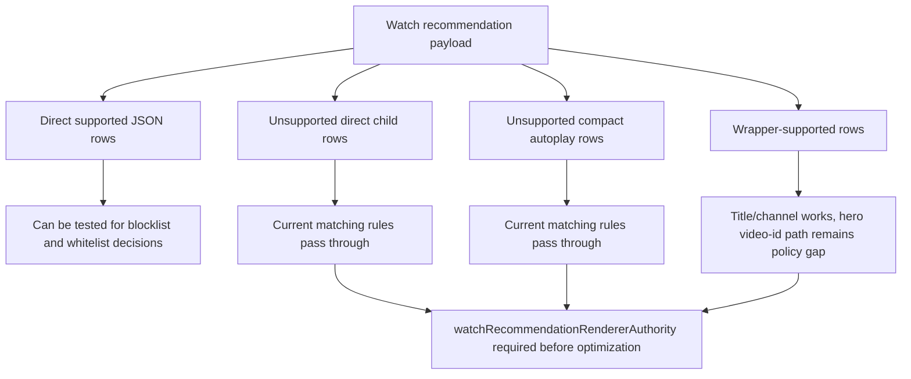

# FilterTube Direct Watch-Card Authority Current Behavior - 2026-05-19

Status: audit proof only. No runtime behavior was changed.

This slice separates direct watch-card subrenderers from the currently supported
watch-card paths. The runtime has partial watch-card support, but it is not a
blanket claim that every documented watch-card renderer is JSON-first covered.

## Current Verdict

Direct watch-card subrenderers are split today:

- `watchCardCompactVideoRenderer` has a direct `BASE_VIDEO_RULES` entry.
- `universalWatchCardRenderer` has nested paths for rich header and hero fields.
- Direct `watchCardRichHeaderRenderer` has no direct `FILTER_RULES` entry.
- Direct `watchCardHeroVideoRenderer` has no direct `FILTER_RULES` entry.
- Direct `watchCardRHPanelVideoRenderer` has no direct `FILTER_RULES` entry.

That means a nested `universalWatchCardRenderer` can be filtered while the same
kind of title/channel information can pass through if YouTube sends one of the
direct subrenderer keys.

## Source Evidence

| Renderer | Source evidence | Current verdict |
| --- | --- | --- |
| `watchCardCompactVideoRenderer` | `js/filter_logic.js:434` maps it to `BASE_VIDEO_RULES`. | Direct supported path. |
| `universalWatchCardRenderer` | `js/filter_logic.js:528-567` maps nested rich-header and hero fields. | Wrapper-supported path. |
| `watchCardRichHeaderRenderer` | `js/filter_logic.js:426-567` has nested paths, but no direct key. | Direct pass-through gap. |
| `watchCardHeroVideoRenderer` | `js/filter_logic.js:426-567` has nested hero paths, but no direct key. | Direct pass-through gap. |
| `watchCardRHPanelVideoRenderer` | `docs/youtube_renderer_inventory.md` marks RHS panel video as not parsed; no direct key exists in `FILTER_RULES`. | Direct pass-through gap. |
| Layout-only watch-card handling | `docs/youtube_renderer_inventory.md` cites layout fixes for some watch-card DOM tags. | Layout visibility is not JSON filtering authority. |

## Why This Matters

Watch recommendations can arrive through several renderer families. If a fix
only checks that `universalWatchCardRenderer` works, direct header, hero, or RHS
panel renderers can still leak blocked content or fail closed in whitelist mode.
If a fix broadens DOM selectors instead, it can increase watch-page false-hide
and scan costs.

## 2026-05-30 Watch Recommendation Topology Linkage

This continuation links the direct watch-card gap to adjacent watch
recommendation surfaces without changing runtime behavior.

Source-backed topology:

- `compactVideoRenderer`, `watchCardCompactVideoRenderer`,
  `endScreenVideoRenderer`, and `lockupViewModel` have direct or explicit
  runtime rule ownership in `js/filter_logic.js`.
- `universalWatchCardRenderer` has wrapper rules for title and channel fields,
  but the real Main search hero video id sits under
  `callToAction.watchCardHeroVideoRenderer.navigationEndpoint.watchEndpoint.videoId`,
  not the current wrapper `videoId` path.
- Direct `watchCardRichHeaderRenderer`, direct `watchCardHeroVideoRenderer`,
  direct `watchCardRHPanelVideoRenderer`, and `compactAutoplayRenderer` are not
  direct `FILTER_RULES` keys today.
- Category and content-control renderer allowlists include supported video card
  families, but not direct watch-card child renderers or compact autoplay.
- `docs/audit/FILTERTUBE_COMPACT_AUTOPLAY_AUTHORITY_CURRENT_BEHAVIOR_2026-05-19.md`
  and `docs/audit/FILTERTUBE_WATCH_ENDSCREEN_AUTHORITY_CURRENT_BEHAVIOR_2026-05-19.md`
  are adjacent blockers: a watch recommendation optimization cannot treat
  "watch surface" as one homogeneous JSON family.

```text
watch recommendation JSON
  -> supported rows
       compactVideoRenderer
       watchCardCompactVideoRenderer
       endScreenVideoRenderer
       lockupViewModel
       universalWatchCardRenderer title/channel wrapper
  -> unresolved rows
       direct watchCardRichHeaderRenderer
       direct watchCardHeroVideoRenderer
       direct watchCardRHPanelVideoRenderer
       compactAutoplayRenderer
       universal hero video-id navigationEndpoint path
  -> release risk
       blocklist leak
       whitelist false-hide/pass-through drift
       broad DOM fallback scan cost if JSON confidence is guessed
```



Required future authority: `watchRecommendationRendererAuthority`. It must
record renderer family, direct-versus-wrapper source, route, endpoint, identity
confidence, video-id path policy, blocklist result, whitelist result,
side-effect budget, sibling-visible proof, and no-rule work budget before JSON
promotion, whitelist optimization, DOM fallback pruning, or release claims.

## Required Future Gate

Before changing behavior, add direct watch-card authority fixtures for:

- `watchCardRichHeaderRenderer`
- `watchCardHeroVideoRenderer`
- `watchCardRHPanelVideoRenderer`
- `watchCardSectionSequenceRenderer` if a real capture proves it owns cards
- wrapper-versus-direct parity
- blocklist keyword and channel decisions
- whitelist allow and fail-closed decisions
- empty blocklist and disabled no-work cases
- negative sibling-visible proof
- route/surface ownership for Main watch, mobile watch, and YTM if applicable

## Method Semantic Proof Gap Boundary

`docs/audit/FILTERTUBE_METHOD_SEMANTIC_PROOF_GAP_INDEX_CURRENT_BEHAVIOR_2026-05-25.md`
is a required source input before this watch/player/end-screen surface can
support runtime optimization. Current proof pins:

```text
method semantic proof gap files covered: 69
method semantic proof gap lexical callables covered: 5836
files with complete per-callable semantic proof: 0
lexical callables requiring semantic proof before behavior changes: 5836
affected callable semantic proof: NO-GO
runtime behavior changed: no
```

These counts are audit-only blockers. They do not approve runtime
optimization, JSON-first behavior, watch-card behavior, player behavior,
end-screen behavior, whitelist behavior, metric collectors, artifact creation,
native sync, release package changes, or public claims.
