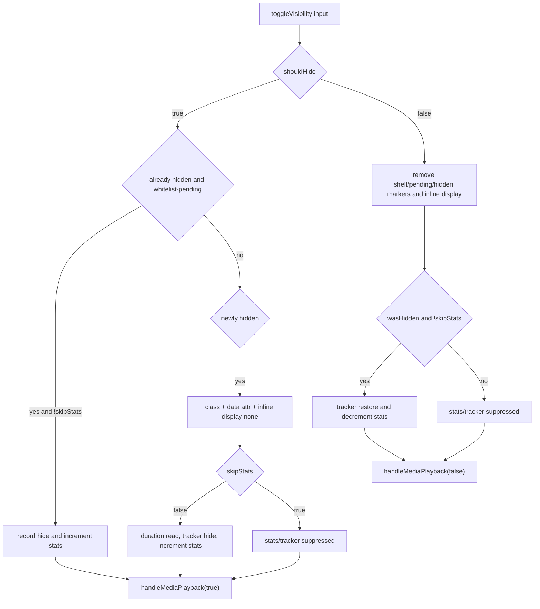

# FilterTube DOM Fallback Method Semantic Register - 2026-05-21

Status: audit-only current-behavior register. Runtime behavior is unchanged.

This register promotes `js/content/dom_fallback.js` and
`js/content/dom_helpers.js` from representative DOM fallback tokens to a
source-derived method inventory. The DOM fallback surface owns rendered-card
scans, whitelist fail-closed decisions, broad content-control CSS, direct
display writes, hide/restore helpers, playlist/player guards, pending metadata
rechecks, parent container collapse, and current-watch navigation side effects.

This is not completion proof for every inline loop callback, selector string,
settings mode, route-specific card shape, runtime lifecycle instance, or
negative sibling-visible fixture. It is the current-behavior boundary for the
DOM fallback and visual helper method rows.

## Source-Derived Summary

```text
source files: js/content/dom_fallback.js; js/content/dom_helpers.js
runtime owner: isolated-world DOM fallback and visual helper runtime
js/content/dom_fallback.js split source lines: 4839
js/content/dom_fallback.js wc line count: 4838
js/content/dom_fallback.js source bytes: 228332
js/content/dom_fallback.js source sha256: 2129fcc16f8ad1420a6cb44905ddcd0b68d5511f3b647e2db100c0d67d492aef
js/content/dom_helpers.js split source lines: 207
js/content/dom_helpers.js wc line count: 206
js/content/dom_helpers.js source bytes: 8292
js/content/dom_helpers.js source sha256: a8c6ebfc10394f67254fbe5d324090ba9d01bead7efbb61d44e63dda4b52c242
combined source bytes: 236587
top-level function declarations: 50
js/content/dom_fallback.js top-level function declarations: 47
js/content/dom_helpers.js top-level function declarations: 3
semantic method groups: 11
repo-wide broad parser lexical callable matches: 439
broad parser declaration/inventory matches: 85
semantic method rows promoted: 50
local callable tokens held below method authority: 35
control-flow lexical artifacts: 354
file-local executable proof probes: 8
global method proof count promoted: 0
runtime behavior changed: no
```

## Method Group Counts

```text
activeWorkAndCleanup: 3
blockedMarkerAndStaleRestore: 5
domFallbackMainPipeline: 1
fallbackSurfaceHandlers: 4
helperVisualWriters: 3
hideDecisionEngine: 1
identityNormalizationAndCompiledRules: 9
playlistWatchAndRouteIdentity: 16
runStateAndTracking: 2
styleAndStaticSurfaceControls: 2
textAndKeywordMatching: 4
```

## Lexical Callable Reconciliation

The broad callable scanner intentionally over-counts this file pair because it
matches control-flow shapes in addition to function declarations and local
arrow helpers. The reconciliation is:

```text
js/content/dom_fallback.js broad callable matches: 418
js/content/dom_helpers.js broad callable matches: 21
broad callable matches total: 439
accepted top-level semantic method rows: 50
accepted local arrow callable tokens: 34
accepted nested local helper tokens: 1
accepted declaration/inventory rows total: 85
rejected control-flow artifacts total: 354
rejected if artifacts: 325
rejected for artifacts: 25
rejected fallback tracker object-method artifacts: 4
global method proof count promoted: 0
runtime behavior changed: no
```

The 35 accepted local callable tokens remain below method-authority promotion:
they are executable implementation details inside the 50 top-level method rows,
not independent approval to change DOM fallback behavior.

## Semantic Group Summary

| Semantic group | Top-level functions | Current owner/effect shape | Missing proof before behavior changes |
| --- | ---: | --- | --- |
| `runStateAndTracking` | 2 | Fallback run signature cache and best-effort filtering tracker shim. | Run-scoped cache lifetime, tracker side-effect policy, and no-work metric proof. |
| `identityNormalizationAndCompiledRules` | 9 | Channel id/handle/custom URL/name normalization, compiled keyword regexes, compiled channel indexes, channel-map lookup, and shared identity fallback wrapper. | Source confidence, stale alias policy, map provenance, whitelist/blocklist parity, and unresolved-handle fetch budget. |
| `playlistWatchAndRouteIdentity` | 16 | Mix/radio detection, playlist panel row discovery, creator/watch owner metadata, current-watch block enforcement, and playlist skip/open fallback. | Current-video authority, selected-row preservation, pause/click policy, playlist target proof, and route-specific negative fixtures. |
| `blockedMarkerAndStaleRestore` | 5 | Pending/confirmed blocked-channel markers, hidden marker inspection, recycled-card stale marker cleanup, and explicit hide-reason checks. | Marker owner, stale-card reset fixture, pending-state TTL proof, restore ownership, and false-hide sibling visibility. |
| `styleAndStaticSurfaceControls` | 2 | Dynamic content-control style injection and mobile Open App button direct hide. | Style registry, route/mode scope, direct display writer registry, and generated CSS parity proof. |
| `textAndKeywordMatching` | 4 | Unicode normalization, plain keyword extraction, alphanumeric boundary heuristic, and regex/normalized fallback matching. | Exact/substr policy authority, locale proof, comment/title split, and negative keyword fixture coverage. |
| `fallbackSurfaceHandlers` | 4 | Home feed, comment containers/threads/renderers/view-models, mobile comment cards, and guide subscription entries. | Route/mode proof, author identity confidence, composer preservation, guide whitelist behavior, and container false-hide fixtures. |
| `activeWorkAndCleanup` | 3 | Active-work predicate, stale DOM fallback cleanup for hidden/pending markers plus content-control CSS clearing, and the production routine console-log gate. | Disabled/no-rule/empty-list budget, cleanup scope, stale-marker preservation, debug-mode authority, and cleanup side-effect proof. |
| `domFallbackMainPipeline` | 1 | Main rendered-DOM pipeline: run serialization, scan/yield loop, style injection, card extraction, hide markers, timers, permanent guards, and scroll preservation. | Selector target registry, lifecycle owner, per-route budgets, positive/negative fixtures, and exact hide/restore authority. |
| `hideDecisionEngine` | 1 | Central DOM fallback decision helper for whitelist fail-closed, keyword, channel, collaborator, and unresolved-handle background-only repair. | Decision report, source-tier effect authority, unresolved identity policy, background resolver budget, and allow/block fixtures. |
| `helperVisualWriters` | 3 | Shared hide CSS, `toggleVisibility()` stats/media side effects, and parent container collapse. | Visual writer registry, stats/media policy, restore/decrement proof, parent collapse target proof, and no-rule sibling-visible fixtures. |

## Current Top-Level Method Inventory

| Source file | Source line | Method | Kind | Semantic group |
| --- | ---: | --- | --- | --- |
| js/content/dom_fallback.js | 16 | `getFilteringTracker` | function | `runStateAndTracking` |
| js/content/dom_fallback.js | 29 | `getListSignatureForRun` | function | `runStateAndTracking` |
| js/content/dom_fallback.js | 73 | `normalizeUcIdForComparison` | function | `identityNormalizationAndCompiledRules` |
| js/content/dom_fallback.js | 79 | `normalizeChannelNameForComparison` | function | `identityNormalizationAndCompiledRules` |
| js/content/dom_fallback.js | 84 | `normalizeCustomUrlForComparison` | function | `identityNormalizationAndCompiledRules` |
| js/content/dom_fallback.js | 110 | `isFilterTubeMixOrRadioElement` | function | `playlistWatchAndRouteIdentity` |
| js/content/dom_fallback.js | 159 | `isPlaylistPanelRowElement` | function | `playlistWatchAndRouteIdentity` |
| js/content/dom_fallback.js | 171 | `getPlaylistPanelRow` | function | `playlistWatchAndRouteIdentity` |
| js/content/dom_fallback.js | 187 | `getPlaylistPanelRows` | function | `playlistWatchAndRouteIdentity` |
| js/content/dom_fallback.js | 199 | `getPlaylistPanelContainer` | function | `playlistWatchAndRouteIdentity` |
| js/content/dom_fallback.js | 211 | `isSelectedPlaylistPanelRow` | function | `playlistWatchAndRouteIdentity` |
| js/content/dom_fallback.js | 229 | `extractPlaylistPanelBylineChannelName` | function | `playlistWatchAndRouteIdentity` |
| js/content/dom_fallback.js | 246 | `normalizeHandleForComparison` | function | `identityNormalizationAndCompiledRules` |
| js/content/dom_fallback.js | 263 | `getCompiledKeywordRegexes` | function | `identityNormalizationAndCompiledRules` |
| js/content/dom_fallback.js | 297 | `getChannelMapLookup` | function | `identityNormalizationAndCompiledRules` |
| js/content/dom_fallback.js | 310 | `getCompiledChannelFilterIndex` | function | `identityNormalizationAndCompiledRules` |
| js/content/dom_fallback.js | 449 | `channelMetaMatchesIndex` | function | `identityNormalizationAndCompiledRules` |
| js/content/dom_fallback.js | 496 | `isCreatorChannelPagePath` | function | `playlistWatchAndRouteIdentity` |
| js/content/dom_fallback.js | 506 | `getCurrentPageChannelMeta` | function | `playlistWatchAndRouteIdentity` |
| js/content/dom_fallback.js | 580 | `getCurrentWatchVideoId` | function | `playlistWatchAndRouteIdentity` |
| js/content/dom_fallback.js | 593 | `getCurrentWatchOwnerMeta` | function | `playlistWatchAndRouteIdentity` |
| js/content/dom_fallback.js | 681 | `getPlaylistRowVideoId` | function | `playlistWatchAndRouteIdentity` |
| js/content/dom_fallback.js | 697 | `getPlaylistRowChannelName` | function | `playlistWatchAndRouteIdentity` |
| js/content/dom_fallback.js | 715 | `findNextAllowedWatchPlaylistLink` | function | `playlistWatchAndRouteIdentity` |
| js/content/dom_fallback.js | 762 | `openWatchPlaylistPanelIfCollapsed` | function | `playlistWatchAndRouteIdentity` |
| js/content/dom_fallback.js | 783 | `enforceCurrentWatchOwnerBlock` | function | `playlistWatchAndRouteIdentity` |
| js/content/dom_fallback.js | 933 | `markedChannelIsStillBlocked` | function | `blockedMarkerAndStaleRestore` |
| js/content/dom_fallback.js | 964 | `channelMatchesFilter` | function | `identityNormalizationAndCompiledRules` |
| js/content/dom_fallback.js | 972 | `markElementAsBlocked` | function | `blockedMarkerAndStaleRestore` |
| js/content/dom_fallback.js | 991 | `clearBlockedElementAttributes` | function | `blockedMarkerAndStaleRestore` |
| js/content/dom_fallback.js | 1001 | `isExplicitlyHiddenByFilterTube` | function | `blockedMarkerAndStaleRestore` |
| js/content/dom_fallback.js | 1049 | `hasExplicitHideReasonMarker` | function | `blockedMarkerAndStaleRestore` |
| js/content/dom_fallback.js | 1064 | `ensureContentControlStyles` | function | `styleAndStaticSurfaceControls` |
| js/content/dom_fallback.js | 1409 | `hideYouTubeOpenAppButtons` | function | `styleAndStaticSurfaceControls` |
| js/content/dom_fallback.js | 1431 | `normalizeTextForMatching` | function | `textAndKeywordMatching` |
| js/content/dom_fallback.js | 1448 | `extractPlainKeyword` | function | `textAndKeywordMatching` |
| js/content/dom_fallback.js | 1466 | `isAlphanumeric` | function | `textAndKeywordMatching` |
| js/content/dom_fallback.js | 1480 | `matchesKeyword` | function | `textAndKeywordMatching` |
| js/content/dom_fallback.js | 1520 | `collectMobileCommentEntryCards` | function | `fallbackSurfaceHandlers` |
| js/content/dom_fallback.js | 1551 | `handleHomeFeedFallback` | function | `fallbackSurfaceHandlers` |
| js/content/dom_fallback.js | 1575 | `handleCommentsFallback` | function | `fallbackSurfaceHandlers` |
| js/content/dom_fallback.js | 1888 | `handleGuideSubscriptionsFallback` | function | `fallbackSurfaceHandlers` |
| js/content/dom_fallback.js | 1933 | `hasActiveDOMFallbackWork` | function | `activeWorkAndCleanup` |
| js/content/dom_fallback.js | 2001 | `clearStaleDOMFallbackVisibility` | function | `activeWorkAndCleanup` |
| js/content/dom_fallback.js | 2035 | `applyDOMFallback` | async function | `domFallbackMainPipeline` |
| js/content/dom_fallback.js | 4536 | `shouldHideContent` | function | `hideDecisionEngine` |
| js/content/dom_fallback.js | 4817 | `installFilterTubeRoutineConsoleGate` | function | `activeWorkAndCleanup` |
| js/content/dom_helpers.js | 11 | `ensureStyles` | function | `helperVisualWriters` |
| js/content/dom_helpers.js | 67 | `toggleVisibility` | function | `helperVisualWriters` |
| js/content/dom_helpers.js | 154 | `updateContainerVisibility` | function | `helperVisualWriters` |

## Current Behavior Boundaries

- `hasActiveDOMFallbackWork()` returns false when settings are missing,
  non-object, or `enabled === false`; returns true for whitelist mode even
  before route-specific proof; returns true for nonempty keyword/channel/comment
  lists, many boolean controls, enabled content filters, and enabled category
  filters; and fails open on exceptions.
- `applyDOMFallback()` serializes concurrent runs through
  `window.__filtertubeDomFallbackRunState`, records one pending run, sets
  `window.__filtertubeDomFallbackActiveRun`, yields through `setTimeout(resolve,
  0)`, installs one scroll listener, installs playlist click and ended guards
  once, and schedules retry/reprocess work through `setTimeout()` without a
  shared teardown owner.
- `clearStaleDOMFallbackVisibility()` can restore elements with generic
  FilterTube hidden/pending markers and clear the dynamic content-control style
  text. That cleanup is useful but not proof that every route-specific marker
  or direct display writer has a correct restore owner.
- `ensureContentControlStyles()` writes broad CSS rules for home feed, ads,
  playlist cards, Mix, members-only, watch panels, comments, header/sidebar
  controls, end-screen elements, subscriptions, and search shelves. It then
  calls `hideYouTubeOpenAppButtons()`, which directly writes display none on
  Open App targets.
- `applyDOMFallback()` also has direct style display writes for members-only
  cards/shelves, playlist lockups, Mix chips, and other fallback surfaces before
  or beside the shared `toggleVisibility()` path.
- `shouldHideContent()` is the DOM fallback decision helper, but it is not a
  future `hideDecisionAuthority`: whitelist mode can fail closed, Kids and
  Shorts identity-less cards can hide, creator-page identity can allow, and an
  unresolved blocklist handle can trigger `fetchIdForHandle()` with
  `backgroundOnly: true`.
- `enforceCurrentWatchOwnerBlock()` can pause the current video, hide the
  selected playlist row, open a collapsed playlist panel, click an allowed
  playlist item, retry `applyDOMFallback()`, click the player Next button, or
  hide the whole watch shell.
- `toggleVisibility()` couples visual hide/restore with `filteringTracker`,
  `incrementHiddenStats()`, `decrementHiddenStats()`, inline display writes, and
  `handleMediaPlayback()`. `updateContainerVisibility()` can collapse parent
  shelves when all relevant children are hidden or when a previously populated
  container becomes empty.
- Both files depend on globals owned elsewhere, including `currentSettings`,
  `VIDEO_CARD_SELECTORS`, `extractChannelMetadataFromElement`,
  `buildChannelMetadata`, `extractVideoIdFromCard`, `ensureVideoIdForCard`,
  `clearCachedChannelMetadata`, `scheduleVideoMetaFetch`, `filteringTracker`,
  `incrementHiddenStats`, `decrementHiddenStats`, and `handleMediaPlayback`.

## File-Local Executable Behavior Proof

`tests/runtime/dom-fallback-method-semantic-register-current-behavior.test.mjs`
runs the current `js/content/dom_helpers.js` and `js/content/dom_fallback.js`
sources in a VM-backed fake DOM. It proves these current-behavior edges without
changing runtime source:

| Probe | Executable proof | Current behavior pinned | Risk exposed before optimization |
| --- | --- | --- | --- |
| Active-work gate | active-work gate proof: executable | Disabled/missing settings return false; whitelist mode, nonempty lists, boolean controls, content filters, and category filters return true. | No-work optimizations must preserve whitelist fail-closed and disabled cleanup behavior. |
| Channel index/cache | channel index/cache proof: executable | Handles, UC ids, mapped ids, names, stable names, name-only names, and unresolved handle keys are compiled from list entries and channelMap. | JSON-first promotion must preserve alias/map provenance and unresolved-handle repair budget. |
| Hidden marker stale cleanup | hidden marker stale cleanup proof: executable | A recycled hidden card with a mismatched live video id and no explicit hide reason clears FilterTube hide markers and inline display; explicit hide-reason markers return hidden before the stale-id cleanup branch. | Restore changes can otherwise keep stale hidden rows invisible and leak navigation skips, especially when explicit markers mask recycled-card identity drift. |
| Content-control style/direct Open App hide | content-control style proof: executable | Route attributes are stamped, dynamic CSS is written, and Open App anchors are directly hidden on their button host. | Broad CSS pruning must account for direct display writers outside `toggleVisibility()`. |
| Visual writer hide/restore | visual writer proof: executable | `toggleVisibility()` writes class/attribute/display state, records tracker/stat/media side effects, and removes display on restore. | Stats/media and hide/restore behavior are coupled in the helper, not isolated in the fallback pipeline. |
| Container collapse | container collapse proof: executable | `updateContainerVisibility()` hides a container when all matched children are hidden and restores when any child is visible. | Shelf cleanup needs sibling-visible fixtures before collapse policy changes. |
| Stale cleanup | stale cleanup proof: executable | `clearStaleDOMFallbackVisibility()` restores marked elements and clears pending/category/upload-date/hide-all-shorts markers plus content-control CSS. | Disabled/no-rule cleanup is broad and can affect multiple marker owners. |
| Hide decision engine | hide decision proof: executable | Whitelist with no rules blocks, keyword/channel whitelist allows, Kids identity-less cards block, blocklist keywords hide, and unresolved handle blocklist repair calls `fetchIdForHandle()` with `{ skipNetwork: true, backgroundOnly: true }`. | JSON-first filtering must keep whitelist false-hide/leak semantics and background-only handle resolution explicit. |

## DOM Helpers Visual Writer Flow - 2026-05-27

This addendum narrows the `js/content/dom_helpers.js` proof surface because the
helper is a cross-feature side-effect sink, not just a display helper. It is
still audit-only current-behavior proof and changes no runtime behavior.

```text
toggleVisibility(element, shouldHide, reason, skipStats)
        |
        +-- shouldHide = true
        |      |
        |      +-- already hidden + whitelist pending + !skipStats
        |      |      -> remove pending marker
        |      |      -> tracker hide + hidden stats
        |      |
        |      +-- newly hidden
        |             -> optional duration read when !skipStats
        |             -> class + data attr + inline display none
        |             -> optional tracker/stat write when !skipStats
        |             -> media playback side effect always runs
        |
        +-- shouldHide = false
               |
               +-- remove shelf/pending markers
               +-- remove hidden class/data attr/display
               +-- optional tracker/stat restore when !skipStats and class existed
               +-- media playback side effect always runs
```



Current visual-writer proof rows:

| Row | Source pins | Current behavior | Risk boundary |
| --- | --- | --- | --- |
| `dom_helper_style_injection` | `js/content/dom_helpers.js:11-57` | `ensureStyles()` injects one `#filtertube-style` node with global `.filtertube-hidden`, `.filtertube-hidden-shelf`, pending metadata, and shimmer CSS. | Global class semantics affect every card/shelf writer using these classes. |
| `dom_helper_whitelist_pending_conversion` | `js/content/dom_helpers.js:72-78` | A card already hidden and carrying `data-filtertube-whitelist-pending="true"` can become a counted hide when later called with `skipStats === false`. | Pending-hide timing can change stats without a structured hide-decision id. |
| `dom_helper_new_hide_side_effects` | `js/content/dom_helpers.js:80-107` | New hides can read duration, write class/data attr/inline display, record tracker hide, increment hidden stats, and then call media playback handling. | Visual, stats, duration, and media side effects remain coupled. |
| `dom_helper_skipstats_media_coupling` | `js/content/dom_helpers.js:83-107` and `js/content/dom_helpers.js:137-147` | `skipStats` suppresses duration/tracker/stats work but does not suppress `handleMediaPlayback()` on hide or restore. | Cleanup/container paths can still affect playback unless callers control target selection perfectly. |
| `dom_helper_restore_side_effects` | `js/content/dom_helpers.js:109-147` | Restore removes helper classes, pending marker, hidden attr, and inline display, then optionally records tracker restore and decrements stats only when `wasHidden && !skipStats`. | Restore accounting depends on previous class state rather than a persistent counted-hide token. |
| `dom_helper_container_collapse` | `js/content/dom_helpers.js:154-204` | Containers with all hidden children, or with prior children that later disappear, can receive `filtertube-hidden-shelf`; visible children remove helper classes and attrs. | Parent collapse needs sibling-visible fixtures because a broad child selector can hide a shelf. |
| `dom_helper_container_restore_gap` | `js/content/dom_helpers.js:160-204` | Container restore removes helper classes and attrs, but does not remove an inline `display` style if another writer placed one on the same container. | Container restore is not a complete direct-display restore authority. |
| `dom_helper_external_globals` | `js/content/dom_helpers.js:74-147` | The helper depends on `filteringTracker`, `incrementHiddenStats`, `decrementHiddenStats`, `extractVideoDuration`, and `handleMediaPlayback` globals owned outside this file. | Method proof needs caller/global dependency fixtures before behavior changes. |

Current visual-writer addendum status:

```text
dom helper visual writer proof rows: 8
stats/media coupling approved for behavior change: NO-GO
container restore authority approved: NO-GO
runtime behavior changed by this addendum: no
```

## Future DOM Fallback Proof Fields

Any future behavior change in these files needs rows with at least:

```text
methodReference
sourceFile
sourceLine
semanticGroup
ownerRuntime
callerClass
triggerPath
routeOrSurface
settingsModeInput
profileInput
listModeInput
selectorOrTargetClass
identitySourceTier
identityConfidence
observableSideEffects
directDisplayWrites
statsMediaPolicy
lifecyclePrimitive
disabledBehavior
noRuleBehavior
emptyListBehavior
whitelistBehavior
teardownOrRestoreOwner
positiveFixture
negativeIdentityFixture
negativeSiblingVisibleFixture
restoreFixture
performanceBudget
fixtureProvenance
```

## Missing Runtime Authorities

No runtime source currently implements:

- `domFallbackMethodAuthority`
- `domFallbackEffectReport`
- `domFallbackNoWorkBudget`
- `domFallbackLifecycleOwner`
- `domFallbackHideDecisionReport`
- `domFallbackSelectorTargetReport`
- `domFallbackGlobalDependencyContract`
- `domHelperVisualWriterReport`

These are future contract names. This register does not authorize selector
cleanup, hide/restore changes, watch/player navigation changes, broad CSS
pruning, no-work optimizations, stats/media changes, or DOM fallback lifecycle
teardown.

## Method Semantic Proof Gap Boundary

`docs/audit/FILTERTUBE_METHOD_SEMANTIC_PROOF_GAP_INDEX_CURRENT_BEHAVIOR_2026-05-25.md`
is a required source input before this method semantic register can support
runtime optimization or JSON-first promotion. Current proof pins:

```text
method semantic proof gap files covered: 69
method semantic proof gap lexical callables covered: 5681
files with complete per-callable semantic proof: 0
lexical callables requiring semantic proof before behavior changes: 5681
affected callable semantic proof: NO-GO
runtime behavior changed: no
```

These counts are audit-only blockers. They do not approve runtime
optimization, JSON-first behavior, method deletion, method merging, lifecycle
cleanup, no-work changes, or whitelist behavior changes.
