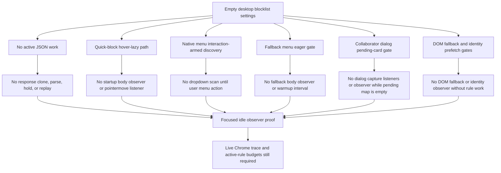

# FilterTube Empty-Install Idle Observer Budget - Current Behavior - 2026-05-26

Status: focused runtime proof for the YouTube lag release blocker.

## Boundary

This slice pins the idle observer budget for an empty desktop YouTube install.
The target state is not "every feature disabled"; it is: when the user has no
active blocklist rules and is on desktop YouTube, FilterTube must not keep
expensive body observers or full-page scan loops alive just to support optional
affordances.

## Current Proof

The paired verifier is
`tests/runtime/empty-install-idle-observer-budget-current-behavior.test.mjs`.
It includes both source-structure checks and an executable fake desktop YouTube
startup harness for `js/content/block_channel.js`.

It pins these current behaviors:

- Quick-block has no periodic full-document interval.
- Quick-block body mutation observation exists only inside
  `shouldEagerQuickBlockSweep()`, which returns `isMobileYouTubeSurface()`.
- Desktop quick-block click/focus/input/resize refreshes are gated behind
  `shouldRefreshQuickBlockRuntimeState()`, so they do not scan YouTube overlay
  DOM until a mobile eager surface is active or a quick-block host has actually
  been tracked.
- Desktop quick-block pointer recovery is attached only after a
  quick-block-capable card hover, removes its `pointermove` listener after the
  short recovery window, and caches the last target-to-host resolution before it
  can call `elementsFromPoint()`.
- Desktop quick-block hover entry uses `findQuickBlockCardFromTarget()`, a
  bounded tag/class walk, before falling into button setup. It no longer uses a
  broad card-selector `closest()` call for the hot pointer-enter path.
- Desktop quick-block SPA navigation no longer forces the search/overlay
  selector scan when there are no tracked quick-block hosts. Stale tracked
  hosts are pruned, and desktop button creation is delayed behind a short
  hover-intent timer so fly-by pointer movement does not stamp card UI.
- Quick-block viewport refresh now reuses cached top/bottom occlusion bounds
  for 250 ms and caps each refresh to 32 host updates, so previously stamped
  optional quick-block hosts cannot multiply broad occlusion probes across a
  single click, scroll, or SPA burst.
- Native dropdown discovery no longer observes the body at idle; it arms a
  short-lived body observer only after a menu click or keyboard menu action.
- Native dropdown injection is frame-deferred after YouTube opens its menu, so
  FilterTube extraction/enrichment does not compete with the native 3-dot menu
  paint.
- Native dropdown visibility changes reuse the same deferred injection path
  instead of synchronously entering `handleDropdownAppeared()` from the
  visibility MutationObserver callback.
- Native dropdown visibility observation is also interaction-armed. Startup no
  longer scans existing YouTube dropdown containers; `armDropdownDiscoveryObserver()`
  performs that scan after the user actually invokes a menu.
- Fallback menu body observation, scroll rescans, and warmup intervals are
  gated by `shouldEagerFallbackMenuScan()`.
- Fallback menu buttons are now installed only when
  `shouldInstallFallbackMenuButtons()` is true. On hover-capable desktop YouTube,
  optional fallback menu UI is not installed, so comments/cards do not receive
  extra `FilterTube menu` buttons while native 3-dot dropdown blocking remains
  available.
- Collaborator dialog capture listeners and the document-wide dialog
  `MutationObserver` are now lazy. Empty desktop startup keeps them detached
  until `content_bridge.js` creates a pending collaborator card, and they are
  removed/disconnected again when the pending-card map becomes empty.
- DOM fallback body observation disconnects when
  `hasActiveDOMFallbackWork(currentSettings)` is false.
- Identity prefetch observation requires whitelist mode or a non-empty channel
  blocklist.
- Right-rail whitelist observation requires whitelist mode.
- Seed fetch/XHR interception passes YouTubei responses through before JSON
  parse when settings are not loaded or when loaded settings have no active JSON
  work.
- Seed fetch interception now returns the native `fetch` promise before
  attaching response hooks when no active JSON work exists.
- Seed `ytInitialData` and `ytInitialPlayerResponse` setters no longer compute
  payload sizes unless seed debug logging is enabled, only retain raw snapshots
  when active JSON work exists, and clear pending pre-settings data without
  replay when settings resolve to an empty blocklist.

## Idle Observer Budget Ledger Addendum - 2026-05-27

This addendum turns the empty-install observer proof into a dated release
ledger. It is audit-only. It does not change settings, observers, timers, menu
behavior, JSON interception, or YouTube runtime behavior.

```text
desktop YouTube, empty blocklist
        |
        v
settings/runtime refresh
        |
        +--> seed fetch/XHR: pass through before JSON parse/clone/replay
        +--> quick-block: keep hover entrypoint, no body observer at idle
        +--> native 3-dot menu: arm discovery only after menu action
        +--> fallback menu: no body observer/warmup when eager scan is false
        +--> collaborator dialog: detach until pending collaborator cards exist
        +--> DOM fallback/prefetch: disconnect when no active rule work exists
        |
        v
focused idle release proof exists; broad observer budget remains open
```



| Idle budget boundary | Source pins | Current proof | Remaining gap |
| --- | --- | --- | --- |
| Quick-block idle gate | `js/content/block_channel.js:353`, `js/content/block_channel.js:1291`, `js/content/block_channel.js:1979-2022` | Desktop keeps the hover/menu entrypoints but does not attach the old periodic full-document timer or startup body observer. | Active-rule, mobile/coarse, hover-stamped host, and teardown budgets remain feature-specific. |
| Native dropdown discovery | `js/content/block_channel.js:2493-2541` | Body observation is interaction-armed and capped by a 2500 ms stop timer after menu activation. | Manual live Chrome proof is still needed for comment menus, playlist panels, and YouTube dropdown reuse. |
| Fallback menu eager gate | `js/content_bridge.js:6289-6301`, `js/content_bridge.js:7014` | Fallback menu body observation and warmup interval require the eager fallback-menu scan path. | Fallback/menu behavior still lacks one shared native/fallback affordance owner. |
| Collaborator dialog lifecycle | `js/content/collab_dialog.js:31`, `js/content/collab_dialog.js:370` | Capture listeners and the document observer stay detached until pending collaborator cards exist, then detach again when pending cards clear. | Active collaborator-card budget and installed-extension provenance remain separate gates. |
| DOM fallback and prefetch gates | `js/content_bridge.js:1006`, `js/content_bridge.js:1211`, `js/content_bridge.js:6200-6286` | Identity prefetch, right-rail whitelist observation, and DOM fallback observation are settings/list-mode gated. | Active whitelist/channel-blocklist and route-specific observer budgets remain open. |
| Seed JSON idle pass-through | `js/seed.js:97-131`, `js/seed.js:690-698` | No active JSON work returns the native fetch promise before response hooks and avoids queued pre-settings replay for empty blocklist settings. | Live endpoint trace and startup settings-not-loaded timing still need browser evidence. |
| Focused executable harness | `tests/runtime/empty-install-idle-observer-budget-current-behavior.test.mjs` | Proves no startup body observer, no pointermove listener, no dropdown scan, lazy collaborator dialog, and no JSON parse/stringify/replay in the focused harness. | This is not a live Chrome performance profile and does not prove every active-rule mode is fast. |

Current authority status:

```text
empty-install idle observer release proof: PARTIAL
live Chrome performance trace authority: NO-GO
active-rule/mobile/whitelist observer budget authority: NO-GO
broad observer/listener/timer completion: NO-GO
runtime behavior changed by this addendum: no
```

## Verification

```text
node --test --test-reporter=dot \
  tests/runtime/empty-install-idle-observer-budget-current-behavior.test.mjs
```

The executable startup harness currently proves:

```text
desktop startup document pointerenter listener: present
desktop startup native menu click listener: present
desktop startup document pointermove listener: absent
desktop startup document.body observer calls: 0
desktop startup dropdown container querySelectorAll scans: 0
empty desktop SPA quick-block overlay scans: 0
desktop startup collaborator dialog click/keydown listeners: absent
desktop startup collaborator dialog MutationObserver observe calls: 0
pending collaborator card runtime attach: click listener + keydown listener + MutationObserver
empty pending collaborator map runtime detach: removeEventListener + observer disconnect
settings-not-loaded empty blocklist response JSON parses: 0
settings-not-loaded empty blocklist response stringifies: 0
settings-not-loaded empty blocklist queued seed replays: 0
```

This proof is source-level, not a live Chrome performance trace. It exists
because the local tool surface does not currently expose a connected Chrome
DevTools evaluator. Manual Chrome testing is still required before release.

## Remaining Risk

This does not prove every YouTube interaction is fast. It specifically proves
that the release blocker no-rule idle paths no longer keep the largest known
body observers and full-page scan loops active on desktop. Feature-specific
observer budgets still need to be audited under active rules, whitelist mode,
mobile/coarse surfaces, Kids, YouTube Music, Shorts, comments, playlists, and
end-screen surfaces.
