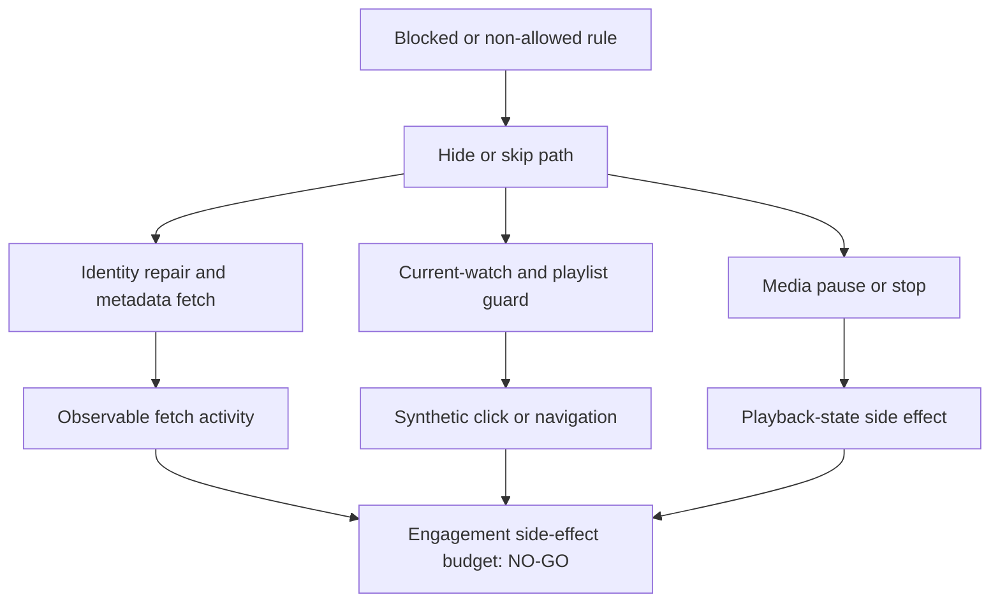

# FilterTube Engagement Budget Current Behavior - 2026-05-19

Status: current-behavior proof slice. This is not an implementation patch.

This does not prove YouTube recommendation behavior. It proves which
FilterTube-owned paths can create YouTube-observable or recommendation-relevant
activity today, and which paths still lack one shared owner/budget contract.

## Why This Exists

The user review raised a credible product concern: after blocking a topic,
YouTube recommendations can appear worse. FilterTube cannot prove YouTube's
ranking model from source code, but it can prove whether its own runtime may
perform observable work while trying to hide, skip, enrich, or import content.

The current source has useful safety boundaries, especially normal card
prefetch avoiding direct network fetches. It also has risky boundaries: direct
watch/shorts fetch fallbacks, synthetic playlist/player clicks, scroll/click
automation for subscription import, media pause/stop on hide, and identity map
writes without one shared side-effect authority.

## 2026-05-30 Store-Feedback Linkage

The Mozilla review feedback is now pinned as an audit input, not a proven
YouTube recommendation-causality claim. The relevant source-backed question is
whether FilterTube can perform YouTube-observable work while hiding, skipping,
or repairing content identity.

This linkage also connects to
`docs/audit/FILTERTUBE_WATCH_ENDSCREEN_AUTHORITY_CURRENT_BEHAVIOR_2026-05-19.md`:
end-screen leaks and recommendation side effects are adjacent release risks.
Direct `endScreenVideoRenderer` filtering is source-supported, but player DOM
video walls, compact/autoplay variants, current-watch skip logic, playlist guard
clicks, direct identity fetches, and media pause/stop paths still lack one
shared owner/budget contract.

```text
ASCII risk flow:
blocked topic or channel rule
  -> JSON/DOM hide path
  -> identity repair or selected-row/player guard path
  -> possible observable fetch/click/scroll/pause/stop
  -> YouTube recommendation impact remains unproven but plausible enough to budget
  -> runtime behavior changed by this continuation: no
```



## Current Proof Fixtures

```text
engagement_side_effect_normal_prefetch_is_no_network_today
engagement_side_effect_whitelist_pending_prefetches_before_hide_today
engagement_side_effect_watch_metadata_fetch_lacks_budget_today
engagement_side_effect_identity_fallback_fetch_lacks_budget_today
engagement_side_effect_current_watch_block_can_click_and_pause_today
engagement_side_effect_playlist_guard_can_click_and_pause_today
engagement_side_effect_subscription_import_is_user_action_but_observable_today
engagement_side_effect_hide_helper_media_pause_is_not_separated_from_skipstats_today
```

## Current Findings

| Fixture | Current behavior | Risk | Future expectation |
| --- | --- | --- | --- |
| `engagement_side_effect_normal_prefetch_is_no_network_today` | Card prefetch uses `IntersectionObserver`, a queue cap of 10, concurrency 2, a visibility listener, DOM extraction, saved maps, and `ytInitialData` search. It does not call `fetch()` in `prefetchIdentityForCard()`. | CPU/storage work remains, but the no-network property is valuable and must be preserved. | Keep normal card identity prefetch network-free unless a future user-visible reason and budget explicitly allows it. |
| `engagement_side_effect_whitelist_pending_prefetches_before_hide_today` | Whitelist pending cards queue identity prefetch before adding hidden/pending markers and inline `display:none`. | Empty or incomplete whitelist can do identity work and hide while identity is unresolved. | Pending whitelist should report reason, target, TTL, budget, and identity outcome. |
| `engagement_side_effect_watch_metadata_fetch_lacks_budget_today` | `fetchVideoMetaFromWatchUrl()` performs a direct YouTube watch HTML fetch with same-origin credentials and parses player metadata. | YouTube-visible request activity can happen for metadata extraction without a shared budget report. | Require metadata reason, active predicate, dedupe key, and max-per-navigation budget. |
| `engagement_side_effect_identity_fallback_fetch_lacks_budget_today` | Legacy Shorts/watch identity fallbacks can fetch `/shorts/...` and `/watch?v=...` HTML. | A failed identity path can create YouTube-visible page fetches. | Prefer JSON/DOM/known-map identity; require explicit identity reason and budget for fallback fetches. |
| `engagement_side_effect_current_watch_block_can_click_and_pause_today` | Current-watch owner block can pause playback, hide selected playlist rows, open collapsed playlist panels, click next playlist links, click player next, or hide the watch shell. | A false owner match can look like playback/navigation engagement. | Require owner confidence, selected-row policy, route state, and side-effect budget before changing this path. |
| `engagement_side_effect_playlist_guard_can_click_and_pause_today` | Playlist guards install click and ended listeners, prevent default next/prev behavior, pause video, and click alternate rows/buttons. | Correct skip behavior can still be synthetic navigation. | Keep only behind explicit playlist route state, rule match, and per-navigation budget. |
| `engagement_side_effect_subscription_import_is_user_action_but_observable_today` | Subscription import scrolls, dispatches scroll, clicks "More", and performs credentialed YouTubei browse fetches. | Intended import behavior is observable and must never run during passive filtering. | Keep tied to explicit import request/capability with visible progress and budget. |
| `engagement_side_effect_hide_helper_media_pause_is_not_separated_from_skipstats_today` | `toggleVisibility()` calls `handleMediaPlayback()` even when `skipStats` avoids stats, and media hide can call `pause()`, `pauseVideo()`, or `stopVideo()`. | Visual hide policy and media side effects are coupled. | Hide decisions need separate visual, stats, and media side-effect policy fields. |

## Observable Side-Effect Token Snapshot - 2026-05-27

This snapshot is a source-token baseline for the hot passive/runtime files that
can create YouTube-observable work. It is not a behavior fix and it does not
claim YouTube recommendation causality. It gives the next optimization pass a
stable current-state count for direct fetch, synthetic click, scroll,
dispatch, keyboard/mouse event, and media pause/stop surfaces.

| Source file | `await fetch(` | `.click(` | `video.pause()` | `media.pause()` | `pauseVideo(` | `stopVideo(` | `dispatchEvent(` | `new MouseEvent(` | `new KeyboardEvent(` | `window.scrollTo(` |
| --- | ---: | ---: | ---: | ---: | ---: | ---: | ---: | ---: | ---: | ---: |
| `js/content_bridge.js` | 3 | 0 | 0 | 1 | 1 | 1 | 5 | 1 | 1 | 0 |
| `js/content/dom_fallback.js` | 0 | 7 | 4 | 0 | 0 | 0 | 0 | 0 | 0 | 2 |
| `js/content/dom_helpers.js` | 0 | 0 | 0 | 0 | 0 | 0 | 0 | 0 | 0 | 0 |
| `js/content/block_channel.js` | 0 | 0 | 0 | 0 | 0 | 0 | 2 | 0 | 2 | 0 |
| `js/injector.js` | 1 | 1 | 0 | 0 | 0 | 0 | 2 | 0 | 0 | 2 |
| `js/seed.js` | 0 | 0 | 0 | 0 | 0 | 0 | 1 | 0 | 0 | 0 |
| **Total** | **4** | **8** | **4** | **1** | **1** | **1** | **10** | **1** | **3** | **4** |

Current interpretation:

- Normal card prefetch remains no-network inside `prefetchIdentityForCard()`,
  but direct `await fetch(` still exists in watch metadata, direct Shorts/watch
  identity fallback, and explicit subscription import paths.
- The highest passive synthetic-navigation footprint is still in
  `js/content/dom_fallback.js`: 7 `.click(` tokens, 4 `video.pause()` tokens,
  and 2 `window.scrollTo(` tokens across watch/playlist guard behavior.
- `js/content/dom_helpers.js` has no direct click/fetch/pause/dispatch tokens,
  but it calls `handleMediaPlayback()` through `toggleVisibility()`; the media
  side effects live in `js/content_bridge.js`, so the risk is cross-file.
- `dispatchEvent(` is used for menu close/resize, subscription import scroll,
  readiness events, and seed readiness. It needs owner/budget classification
  before any side-effect pruning.

## Missing Shared Contract

The source still has no central authority token such as:

```text
engagementSideEffectAuthority
observableSideEffectBudget
sideEffectBudget
maxPerNavigation
```

Future changes should add an implementation-neutral report before behavior is
flipped:

```text
observableSideEffect = {
  owner: "normal_prefetch" | "whitelist_pending" | "watch_metadata_fetch" | "identity_fallback" | "current_watch_block" | "playlist_guard" | "subscription_import" | "hide_media",
  observableType: "fetch" | "click" | "scroll" | "pause" | "stop" | "map-write" | "response-mutation",
  userInitiated: true | false,
  route: "home" | "search" | "watch" | "shorts" | "playlist" | "import",
  activeRuleReason: string,
  identityReason: string,
  metadataReason: string,
  targetVideoId: string,
  targetChannelId: string,
  dedupeKey: string,
  maxPerNavigation: number,
  disabledWhenNoRules: true | false
}
```

## Current Verdict

```text
engagement side-effect authority slice is not green.
Current behavior is proof-pinned.
Runtime behavior remains unchanged.
Normal prefetch is no-network today and should stay that way.
Synthetic clicks, direct fetch fallbacks, scroll import, and media pause need
explicit side-effect budgets before optimization or behavior changes.
```

Related artifacts:

- `docs/audit/FILTERTUBE_ENGAGEMENT_SIDE_EFFECT_AUDIT_2026-05-18.md`
- `docs/audit/FILTERTUBE_NETWORK_AUTHORITY_AUDIT_2026-05-18.md`
- `docs/audit/FILTERTUBE_P0_NETWORK_AUTHORITY_CURRENT_BEHAVIOR_2026-05-18.md`
- `docs/audit/FILTERTUBE_HIDE_RESTORE_AUTHORITY_AUDIT_2026-05-18.md`
- `docs/audit/FILTERTUBE_WATCH_PLAYER_CONTROL_AUTHORITY_AUDIT_2026-05-18.md`
- `tests/runtime/engagement-side-effect-current-behavior.test.mjs`
- `tests/runtime/p0-network-authority-current-behavior.test.mjs`

## Method Semantic Proof Gap Boundary

`docs/audit/FILTERTUBE_METHOD_SEMANTIC_PROOF_GAP_INDEX_CURRENT_BEHAVIOR_2026-05-25.md`
is a required source input before this engagement budget can support runtime
optimization or JSON-first promotion. Current proof pins:

```text
method semantic proof gap files covered: 69
method semantic proof gap lexical callables covered: 5720
files with complete per-callable semantic proof: 0
lexical callables requiring semantic proof before behavior changes: 5720
affected callable semantic proof: NO-GO
runtime behavior changed: no
```

These counts are audit-only blockers. They do not approve runtime
optimization, JSON-first behavior, method deletion, method merging, lifecycle
cleanup, no-work changes, or whitelist behavior changes.
