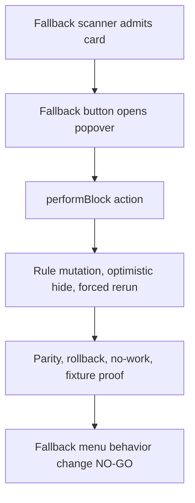

# FilterTube Fallback Menu Action Gate Current Behavior - 2026-05-19

Status: current-behavior audit proof. This is not an implementation patch.

## Why This Slice Exists

Earlier lifecycle proofs already showed that fallback menu scanning can install
mutation, click, scroll, navigation, and warmup work without sharing the primary
dropdown gate. This slice pins the action side too: once a fallback button
exists, the fallback popover can build block rows and call block mutation paths
without re-checking the same settings gate used by the primary dropdown.

```text
primary dropdown gate
  -> injectFilterTubeMenuItem()
    -> returns in whitelist mode
    -> clears rows when showBlockMenuItem === false

fallback scanner
  -> ensureFallbackMenuButtons()
    -> creates fallback buttons on playlist/mobile/comment/lockup surfaces
      -> openFilterTubePlaylistFallbackPopover()
        -> creates Block / Filter All rows
          -> performBlock()
            -> addChannelDirectly() or handleBlockChannelClick()
            -> optimistic row hide
            -> forced applyDOMFallback()
```

## Current Evidence

| Area | Current source evidence | Current behavior |
| --- | --- | --- |
| Primary dropdown gate | `js/content_bridge.js:10090-10099` returns for `currentSettings?.listMode === 'whitelist'` and clears menu rows when `currentSettings?.showBlockMenuItem === false`. | The normal YouTube dropdown action has an explicit settings gate. |
| Fallback scanner | `js/content_bridge.js:6498-6538` scans playlist, lockup, mobile, Shorts, and comment renderers; `js/content_bridge.js:6423-6428` opens the fallback popover. | The scanner checks native overlay quiet mode, but not the primary dropdown's list-mode or menu-visibility gate. |
| Fallback popover | `js/content_bridge.js:6650-6844` builds a FilterTube fallback popover with `Block` and `Filter All` rows. | The popover creation path does not re-check `currentSettings?.showBlockMenuItem` or `currentSettings?.listMode`. |
| Mutation path | `js/content_bridge.js:6846-7056` calls `addChannelDirectly()` or hands off to `handleBlockChannelClick()`. | The fallback action can mutate channel rules through a user action, but it is not locally protected by one shared menu action authority. |
| Optimistic hide | `js/content_bridge.js:6847-6856` sets `row.style.display = 'none'`, adds `filtertube-hidden`, and writes `data-filtertube-hidden`. | This is an action-side DOM side effect separate from JSON/DOM filtering authority and needs transaction/rollback proof. |
| Forced refilter | `js/content_bridge.js:6903-6906` and `js/content_bridge.js:7043-7046` call `applyDOMFallback(null, { forceReprocess: true, preserveScroll: true })` after success. | A fallback menu action can wake DOM fallback after mutation, so it must share the same action and lifecycle budget. |

## Current Verdict

This is a `current-gap`, not a fix. The fallback menu remains valuable because
some YouTube surfaces do not expose reliable native 3-dot menus, especially
playlist, mobile, lockup, and comment shapes. The gap is that primary dropdown,
fallback scanner, fallback popover, quick block, and native app overlays do not
all share one explicit `shared menu action authority`.

Future implementation should not simply delete fallback menus. It should first
define a shared authority object that records:

- active profile and list mode,
- `showBlockMenuItem`,
- visible affordance owner,
- surface and route,
- native app ownership or overlay/fullscreen pause reason,
- target renderer kind,
- identity confidence,
- mutation destination,
- optimistic hide and rollback owner,
- forced refilter budget.

## Runnable Proof

The current behavior is pinned by:

- `tests/runtime/fallback-menu-action-gate-current-behavior.test.mjs`

Runtime behavior remains unchanged. Future fixes should update this proof only
after the shared menu action authority and negative fixtures exist.

## Fallback Menu Action Report Contract Continuation - 2026-05-29

This continuation turns the fallback scanner/popover/action gap into the
minimum report a future implementation must provide before changing fallback
menu behavior. It is audit-only. It does not approve deleting fallback menus,
sharing the primary gate, changing `performBlock()`, changing optimistic hide,
changing forced DOM fallback reruns, or changing playlist/mobile/comment/lockup
coverage.

```text
fallback scanner admits a card
        |
        v
fallback button opens popover
        |
        v
popover row calls performBlock()
        |
        v
rule mutation + optimistic hide + forced DOM fallback rerun
        |
        v
future fix must prove parity, rollback, no-work, and fixture coverage first
```



| Report contract row | Source owner rows | Required future proof before behavior changes |
| --- | --- | --- |
| `FT-FMAR-00-scope` | primary dropdown gate; fallback scanner | Route, surface, profile, list mode, settings enabled state, `showBlockMenuItem`, native overlay state, and fallback surface class. |
| `FT-FMAR-01-primary-gate-parity` | `injectFilterTubeMenuItem()` | Whether fallback scanner/popover/action intentionally shares or diverges from primary list-mode and `showBlockMenuItem` gates. |
| `FT-FMAR-02-scanner-admission` | fallback scanner | Selector family, renderer kind, route, mobile/coarse state, warmup/hover trigger, MutationObserver state, and no-work budget. |
| `FT-FMAR-03-button-popover` | fallback button creation; popover open | Button owner, popover node, row identity source, labels, Filter All state, outside-close state, and stale popover cleanup. |
| `FT-FMAR-04-target-identity` | popover rows; `performBlock()` | Channel id/name/handle/custom URL, collaborator count, filter-all target list, identity confidence, and wrong-target negative fixture. |
| `FT-FMAR-05-mutation-path` | `addChannelDirectly()`; `handleBlockChannelClick()` | Mutation destination, actor, profile/list target, cache invalidation, settings refresh, and duplicate/no-op behavior. |
| `FT-FMAR-06-optimistic-hide` | `performBlock()` | Inline display write, `filtertube-hidden` class, hidden attribute, stats impact, restore owner, and rollback on failure. |
| `FT-FMAR-07-forced-refilter` | `applyDOMFallback(null, { forceReprocess: true, preserveScroll: true })` | DOM fallback rerun reason, route/surface cost, settings freshness, scroll preservation, and no extra SPA lag proof. |
| `FT-FMAR-08-failure-rollback` | `performBlock()` catch/finally paths | Network/storage/message failure behavior, row restore, busy state clear, popover close state, and user-visible error policy. |
| `FT-FMAR-09-cross-feature` | fallback menu, quick-block, primary menu, DOM fallback, settings refresh | Quick-block/menu parity, whitelist no-work, native overlay pause, Topic/collaborator identity state, and JSON/DOM parity. |
| `FT-FMAR-10-fixture-packet` | this report plus runtime fixture rows | Positive fallback action fixture, negative disabled/menu-hidden fixture, whitelist fixture, mobile/coarse fixture, comment/playlist fixture, and sibling-visible fixture. |
| `FT-FMAR-11-artifact-gate` | release and metric ledgers | Metric artifact path, no-work counter, false-hide/leak counter, rollback report, release claim boundary, and install-tab parity proof. |

Required fallback menu action report fields:

```text
route
surface
profile
listMode
showBlockMenuItem
fallbackSurfaceClass
scannerTrigger
popoverOwner
targetIdentity
filterAllState
mutationDestination
optimisticHideState
restoreOwner
domFallbackRerunReason
settingsRefreshEffect
failureRollbackState
negativeDisabledProof
negativeWhitelistProof
noWorkBudget
metricArtifact
```

Current fallback menu action report contract status:

```text
fallback menu action report contract rows: 12
required fallback menu action report fields: 20
implementation-ready fallback menu action rows: 0
runtime fallback menu action approvals: 0
fallback menu behavior-change approval from report contract: NO-GO
runtime behavior changed by this continuation: no
```

No product runtime symbol exists yet for:

- `fallbackMenuActionReportContract`
- `fallbackMenuActionReportApproval`
- `fallbackMenuScannerGateParityReport`
- `fallbackMenuOptimisticHideRollbackReport`
- `fallbackMenuNegativeFixturePacket`
- `fallbackMenuDomFallbackRerunBudget`
- `fallbackMenuMetricArtifact`

## Method Semantic Proof Gap Boundary

`docs/audit/FILTERTUBE_METHOD_SEMANTIC_PROOF_GAP_INDEX_CURRENT_BEHAVIOR_2026-05-25.md`
is a required source input before this menu/dialog/injector/quick-block
surface can support runtime optimization. Current proof pins:

```text
method semantic proof gap files covered: 69
method semantic proof gap lexical callables covered: 5830
files with complete per-callable semantic proof: 0
lexical callables requiring semantic proof before behavior changes: 5830
affected callable semantic proof: NO-GO
runtime behavior changed: no
```

These counts are audit-only blockers. They do not approve runtime
optimization, JSON-first behavior, menu action behavior, dialog lifecycle
behavior, injector behavior, quick-block behavior, whitelist behavior, metric
collectors, artifact creation, native sync, release package changes, or public
claims.
