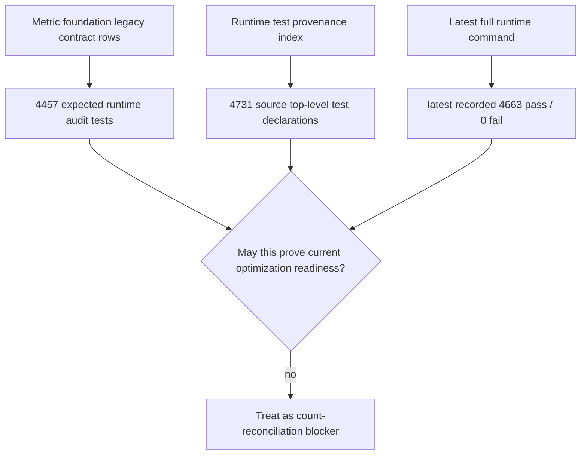

# FilterTube First Optimization Metric Foundation Contract Coverage Gate - Current Behavior - 2026-05-24

Status: audit-only current-behavior first optimization metric foundation
contract coverage gate. Runtime behavior is unchanged. This is not an
implementation patch, optimization patch, metric collector patch, JSON-first
behavior patch, whitelist patch, native sync patch, release package patch,
public claim patch, diagnostic patch, committed metric artifact, persisted TAP
output, or artifact-root creation.

## Purpose

The metric artifact path boundary reserves
`docs/audit/artifacts/first-optimization/metric-foundation/` and nine future
artifact files. The preceding contract slices define each reserved artifact
shape without creating any of those files. This gate proves the contract set is
complete enough to remain one explicit audit-only packet boundary: every
reserved metric-foundation artifact file has a matching current-behavior
contract doc, runtime proof test, reserved path, zero committed files, and zero
runtime collector approval.

The current boundary is:

```text
Reserved metric foundation artifact root: docs/audit/artifacts/first-optimization/metric-foundation/
Reserved metric foundation artifact files covered: 9
Metric foundation contract docs covered: 9
Metric foundation contract tests covered: 9
Committed foundation metric artifact files: 0
Runtime metric collector approval exists: no
Implementation-ready contract coverage rows: 0
```

This is a contract coverage gate, not a metric packet. It is the audit-only
handoff from shape definition to future artifact creation, and it keeps actual
optimization work blocked until one scoped packet has persisted artifacts,
collector approval, no-work proof, side-effect proof, fixture provenance,
diagnostic privacy, parity rollout, verification output, rollback boundaries,
explicit release/public-claim limits, and affected callable semantic proof.

## Source Inputs

| Input | Current proof used |
| --- | --- |
| `docs/audit/FILTERTUBE_FIRST_OPTIMIZATION_METRIC_ARTIFACT_PATH_BOUNDARY_CURRENT_BEHAVIOR_2026-05-24.md` | Reserves the artifact root and 9 future artifact files, but proves 0 committed foundation metric artifact files. |
| `docs/audit/FILTERTUBE_FIRST_OPTIMIZATION_PACKET_MANIFEST_CONTRACT_CURRENT_BEHAVIOR_2026-05-24.md` | Defines the future `packet-manifest.json` shape and proves 0 committed packet manifest files. |
| `docs/audit/FILTERTUBE_FIRST_OPTIMIZATION_METRIC_SAMPLE_CONTRACT_CURRENT_BEHAVIOR_2026-05-24.md` | Defines the future `metric-sample.json` shape and proves 0 committed metric sample files. |
| `docs/audit/FILTERTUBE_FIRST_OPTIMIZATION_SOURCE_OWNER_MAP_CONTRACT_CURRENT_BEHAVIOR_2026-05-24.md` | Defines the future `source-owner-map.json` shape and proves 0 committed source owner map files. |
| `docs/audit/FILTERTUBE_FIRST_OPTIMIZATION_FIXTURE_PROVENANCE_CONTRACT_CURRENT_BEHAVIOR_2026-05-24.md` | Defines the future `fixture-provenance.json` shape and proves 0 committed fixture provenance files. |
| `docs/audit/FILTERTUBE_FIRST_OPTIMIZATION_NO_WORK_PRESERVATION_CONTRACT_CURRENT_BEHAVIOR_2026-05-24.md` | Defines the future `no-work-preservation.json` shape and proves 0 committed no-work preservation files. |
| `docs/audit/FILTERTUBE_FIRST_OPTIMIZATION_SIDE_EFFECT_BUDGET_CONTRACT_CURRENT_BEHAVIOR_2026-05-24.md` | Defines the future `side-effect-budget.json` shape and proves 0 committed side-effect budget files. |
| `docs/audit/FILTERTUBE_FIRST_OPTIMIZATION_DIAGNOSTIC_PRIVACY_CONTRACT_CURRENT_BEHAVIOR_2026-05-24.md` | Defines the future `diagnostic-privacy.json` shape and proves 0 committed diagnostic privacy files. |
| `docs/audit/FILTERTUBE_FIRST_OPTIMIZATION_PARITY_ROLLOUT_CONTRACT_CURRENT_BEHAVIOR_2026-05-24.md` | Defines the future `parity-rollout.json` shape and proves 0 committed parity rollout files. |
| `docs/audit/FILTERTUBE_FIRST_OPTIMIZATION_VERIFICATION_OUTPUT_CONTRACT_CURRENT_BEHAVIOR_2026-05-24.md` | Defines the future `verification-output.tap` shape and proves 0 committed verification output files. |
| `docs/audit/FILTERTUBE_METHOD_SEMANTIC_PROOF_GAP_INDEX_CURRENT_BEHAVIOR_2026-05-25.md` | Proves 69 JS/JSX/MJS files and 5,697 lexical callables still lack complete per-callable semantic proof before behavior changes. |
| `docs/audit/FILTERTUBE_FIRST_OPTIMIZATION_METRIC_ARTIFACT_FOUNDATION_PACKET_CURRENT_BEHAVIOR_2026-05-24.md` | 12 foundation packet rows exist, but 0 committed artifacts and 0 runtime collectors are approved. |
| `docs/audit/FILTERTUBE_FIRST_OPTIMIZATION_METRIC_ARTIFACT_SCHEMA_CURRENT_BEHAVIOR_2026-05-24.md` | 12 metric schema rows define field groups the contract set must preserve. |
| `docs/audit/FILTERTUBE_FIRST_OPTIMIZATION_METRIC_SOURCE_OWNER_MATRIX_CURRENT_BEHAVIOR_2026-05-24.md` | 12 source-owner rows map current runtime owners, but 0 owner rows are implementation-ready. |
| `docs/audit/FILTERTUBE_FIRST_OPTIMIZATION_METRIC_COLLECTOR_INSERTION_GATE_CURRENT_BEHAVIOR_2026-05-24.md` | 12 insertion rows exist; 0 collector insertion points are approved. |
| `docs/audit/FILTERTUBE_FIRST_OPTIMIZATION_METRIC_COLLECTOR_NO_WORK_PRESERVATION_MATRIX_CURRENT_BEHAVIOR_2026-05-24.md` | 12 no-work rows exist; 0 no-work proofs are approved. |
| `docs/audit/FILTERTUBE_FIRST_OPTIMIZATION_METRIC_COLLECTOR_SIDE_EFFECT_BUDGET_MATRIX_CURRENT_BEHAVIOR_2026-05-24.md` | 12 side-effect rows exist; 0 side-effect budgets are approved. |
| `docs/audit/FILTERTUBE_FIRST_OPTIMIZATION_METRIC_COLLECTOR_FIXTURE_PROVENANCE_MATRIX_CURRENT_BEHAVIOR_2026-05-24.md` | 12 fixture provenance rows exist; 0 fixture packets are approved. |
| `docs/audit/FILTERTUBE_FIRST_OPTIMIZATION_METRIC_COLLECTOR_PARITY_ROLLOUT_BOUNDARY_CURRENT_BEHAVIOR_2026-05-24.md` | 12 parity/rollout rows exist; 0 parity rollout proofs are approved. |
| `docs/audit/FILTERTUBE_RUNTIME_FIXTURE_RESULTS_2026-05-17.md` | Runtime proof is tracked in the audit harness, not as a committed metric artifact. |

## Contract Artifact Coverage Set

| Reserved artifact path | Contract doc | Runtime proof test |
| --- | --- | --- |
| `docs/audit/artifacts/first-optimization/metric-foundation/packet-manifest.json` | `docs/audit/FILTERTUBE_FIRST_OPTIMIZATION_PACKET_MANIFEST_CONTRACT_CURRENT_BEHAVIOR_2026-05-24.md` | `tests/runtime/first-optimization-packet-manifest-contract-current-behavior.test.mjs` |
| `docs/audit/artifacts/first-optimization/metric-foundation/metric-sample.json` | `docs/audit/FILTERTUBE_FIRST_OPTIMIZATION_METRIC_SAMPLE_CONTRACT_CURRENT_BEHAVIOR_2026-05-24.md` | `tests/runtime/first-optimization-metric-sample-contract-current-behavior.test.mjs` |
| `docs/audit/artifacts/first-optimization/metric-foundation/source-owner-map.json` | `docs/audit/FILTERTUBE_FIRST_OPTIMIZATION_SOURCE_OWNER_MAP_CONTRACT_CURRENT_BEHAVIOR_2026-05-24.md` | `tests/runtime/first-optimization-source-owner-map-contract-current-behavior.test.mjs` |
| `docs/audit/artifacts/first-optimization/metric-foundation/fixture-provenance.json` | `docs/audit/FILTERTUBE_FIRST_OPTIMIZATION_FIXTURE_PROVENANCE_CONTRACT_CURRENT_BEHAVIOR_2026-05-24.md` | `tests/runtime/first-optimization-fixture-provenance-contract-current-behavior.test.mjs` |
| `docs/audit/artifacts/first-optimization/metric-foundation/no-work-preservation.json` | `docs/audit/FILTERTUBE_FIRST_OPTIMIZATION_NO_WORK_PRESERVATION_CONTRACT_CURRENT_BEHAVIOR_2026-05-24.md` | `tests/runtime/first-optimization-no-work-preservation-contract-current-behavior.test.mjs` |
| `docs/audit/artifacts/first-optimization/metric-foundation/side-effect-budget.json` | `docs/audit/FILTERTUBE_FIRST_OPTIMIZATION_SIDE_EFFECT_BUDGET_CONTRACT_CURRENT_BEHAVIOR_2026-05-24.md` | `tests/runtime/first-optimization-side-effect-budget-contract-current-behavior.test.mjs` |
| `docs/audit/artifacts/first-optimization/metric-foundation/diagnostic-privacy.json` | `docs/audit/FILTERTUBE_FIRST_OPTIMIZATION_DIAGNOSTIC_PRIVACY_CONTRACT_CURRENT_BEHAVIOR_2026-05-24.md` | `tests/runtime/first-optimization-diagnostic-privacy-contract-current-behavior.test.mjs` |
| `docs/audit/artifacts/first-optimization/metric-foundation/parity-rollout.json` | `docs/audit/FILTERTUBE_FIRST_OPTIMIZATION_PARITY_ROLLOUT_CONTRACT_CURRENT_BEHAVIOR_2026-05-24.md` | `tests/runtime/first-optimization-parity-rollout-contract-current-behavior.test.mjs` |
| `docs/audit/artifacts/first-optimization/metric-foundation/verification-output.tap` | `docs/audit/FILTERTUBE_FIRST_OPTIMIZATION_VERIFICATION_OUTPUT_CONTRACT_CURRENT_BEHAVIOR_2026-05-24.md` | `tests/runtime/first-optimization-verification-output-contract-current-behavior.test.mjs` |

## Inline Draft Coverage Set

The artifact files are still absent. The following inline draft sources are the
current machine-readable shape proof for the reserved metric-foundation packet.
The `source-owner-map.json` draft lives in a separate draft-readiness document
because its base contract stays table-only until source-locus ownership proof is
promoted.

| Reserved artifact path | Inline draft source | Inline draft verifier |
| --- | --- | --- |
| `docs/audit/artifacts/first-optimization/metric-foundation/packet-manifest.json` | `docs/audit/FILTERTUBE_FIRST_OPTIMIZATION_PACKET_MANIFEST_CONTRACT_CURRENT_BEHAVIOR_2026-05-24.md` | `tests/runtime/first-optimization-packet-manifest-contract-current-behavior.test.mjs` |
| `docs/audit/artifacts/first-optimization/metric-foundation/metric-sample.json` | `docs/audit/FILTERTUBE_FIRST_OPTIMIZATION_METRIC_SAMPLE_CONTRACT_CURRENT_BEHAVIOR_2026-05-24.md` | `tests/runtime/first-optimization-metric-sample-contract-current-behavior.test.mjs` |
| `docs/audit/artifacts/first-optimization/metric-foundation/source-owner-map.json` | `docs/audit/FILTERTUBE_FIRST_OPTIMIZATION_SOURCE_OWNER_MAP_DRAFT_READINESS_CURRENT_BEHAVIOR_2026-05-29.md` | `tests/runtime/first-optimization-source-owner-map-draft-readiness-current-behavior.test.mjs` |
| `docs/audit/artifacts/first-optimization/metric-foundation/fixture-provenance.json` | `docs/audit/FILTERTUBE_FIRST_OPTIMIZATION_FIXTURE_PROVENANCE_CONTRACT_CURRENT_BEHAVIOR_2026-05-24.md` | `tests/runtime/first-optimization-fixture-provenance-contract-current-behavior.test.mjs` |
| `docs/audit/artifacts/first-optimization/metric-foundation/no-work-preservation.json` | `docs/audit/FILTERTUBE_FIRST_OPTIMIZATION_NO_WORK_PRESERVATION_CONTRACT_CURRENT_BEHAVIOR_2026-05-24.md` | `tests/runtime/first-optimization-no-work-preservation-contract-current-behavior.test.mjs` |
| `docs/audit/artifacts/first-optimization/metric-foundation/side-effect-budget.json` | `docs/audit/FILTERTUBE_FIRST_OPTIMIZATION_SIDE_EFFECT_BUDGET_CONTRACT_CURRENT_BEHAVIOR_2026-05-24.md` | `tests/runtime/first-optimization-side-effect-budget-contract-current-behavior.test.mjs` |
| `docs/audit/artifacts/first-optimization/metric-foundation/diagnostic-privacy.json` | `docs/audit/FILTERTUBE_FIRST_OPTIMIZATION_DIAGNOSTIC_PRIVACY_CONTRACT_CURRENT_BEHAVIOR_2026-05-24.md` | `tests/runtime/first-optimization-diagnostic-privacy-contract-current-behavior.test.mjs` |
| `docs/audit/artifacts/first-optimization/metric-foundation/parity-rollout.json` | `docs/audit/FILTERTUBE_FIRST_OPTIMIZATION_PARITY_ROLLOUT_CONTRACT_CURRENT_BEHAVIOR_2026-05-24.md` | `tests/runtime/first-optimization-parity-rollout-contract-current-behavior.test.mjs` |
| `docs/audit/artifacts/first-optimization/metric-foundation/verification-output.tap` | `docs/audit/FILTERTUBE_FIRST_OPTIMIZATION_VERIFICATION_OUTPUT_CONTRACT_CURRENT_BEHAVIOR_2026-05-24.md` | `tests/runtime/first-optimization-verification-output-contract-current-behavior.test.mjs` |

## Current Counts

```text
first optimization metric foundation contract coverage rows: 12
reserved metric foundation artifact roots covered: 1
reserved metric foundation artifact files covered: 9
metric foundation contract docs covered: 9
metric foundation contract tests covered: 9
metric foundation inline draft sources covered: 9
metric foundation inline draft verifier tests covered: 9
metric foundation inline draft sections covered: 108
metric foundation inline draft artifact promotion decisions: 9 NO-GO
combined metric-foundation inline artifact chain verifier tests observed: 55
combined metric-foundation inline artifact chain plus coverage gate verifier tests observed: 61
committed foundation metric artifact files: 0
runtime metric collector approvals: 0
implementation-ready contract coverage rows: 0
artifact path boundary rows covered: 10
foundation packet rows covered: 12
metric schema rows covered: 12
source-owner rows covered: 12
collector insertion rows covered: 12
collector no-work rows covered: 12
collector side-effect rows covered: 12
collector fixture provenance rows covered: 12
collector parity rollout rows covered: 12
method semantic proof gap files covered: 69
method semantic proof gap lexical callables covered: 5720
files with complete per-callable semantic proof: 0
lexical callables requiring semantic proof before behavior changes: 5720
expected runtime audit tests: 4457
expected runtime audit pass: 4457
expected runtime audit fail: 0
runtime behavior changed: no
not completion proof for metric foundation artifact authority
```

## Runtime Count Reconciliation Addendum - 2026-05-27

Status: audit-only runtime-count reconciliation. Runtime behavior changed by
this addendum: no. This addendum does not create metric-foundation artifacts,
runtime collectors, release approval, public claims, JSON-first behavior,
whitelist behavior, native sync behavior, or optimization authority.

The metric foundation contract rows above still record the legacy contract
runtime count:

```text
legacy metric contract expected tests: 4457
current generated runtime test declarations: 4731
latest historical full runtime pass count observed: 4663
current broad runtime audit snapshot: 4731 tests, 4580 pass, 151 fail
current broad runtime proof for generated 4731 declaration set: NO-GO
count reconciliation status for metric foundation: BLOCKED
runtime behavior changed by this addendum: no
```

The legacy `4457` rows are historical metric-contract snapshot evidence, not
current full-suite proof or optimization approval. The current generated
runtime test provenance index records `4731` source top-level test declarations.
The latest historical full runtime audit evidence records a current `4663/4663`
pass, while the current broad runtime audit snapshot records `4731` tests,
`4580` pass, and `151` fail. Current broad runtime proof for the generated
`4731` declaration set is therefore `NO-GO`.
Until the contract rows and ledgers are reconciled as one scoped audit packet,
the older `4457` rows cannot prove current full-suite coverage or
first-optimization readiness.

```text
legacy metric contract rows
        |
        v
expected runtime audit tests: 4457
        |
        v
current generated test provenance index
        |
        v
source top-level test declarations counted: 4731
        |
        v
metric-foundation contract count is stale for completion proof
```



| Evidence | Artifact | Count | Current interpretation |
| --- | --- | --- | --- |
| Legacy metric contract rows | This contract gate and upstream first-optimization gates. | `4457` expected tests, `4457` expected pass. | Historical contract snapshot only. |
| Runtime test provenance index | `docs/audit/FILTERTUBE_RUNTIME_TEST_FILE_PROVENANCE_INDEX_CURRENT_BEHAVIOR_2026-05-25.md` | `4731` source top-level test declarations. | Current generated runtime-test declaration count. |
| Historical full runtime command evidence | `node --test --test-reporter=tap tests/runtime/*.test.mjs` | Current `4663/4663` pass, `0` fail, `83.213s`. | Latest local full-suite pass evidence after the 2026-05-30 freshness rerun; retained as historical evidence only. |
| Current broad runtime audit evidence | `npm run audit:runtime` | `4731` tests, `4580` pass, `151` fail. | Current generated declaration set remains `NO-GO`. |
| Metric foundation readiness | This addendum. | Count reconciliation status: `BLOCKED`. | No optimization or artifact authority until the count boundary is reconciled. |

## Contract Coverage Matrix

| Contract coverage row id | Required coverage section | Required structured fields | Current state |
| --- | --- | --- | --- |
| `FT-METRIC-CONTRACT-COVERAGE-00-root-boundary` | Artifact root boundary. | `artifactRoot`, `reservedArtifactRoot`, `artifactRootExists`, `artifactRootCommitGate`, `artifactPathBoundaryDoc`, `artifactPathBoundaryTest`. | Reserved only; root is not committed. |
| `FT-METRIC-CONTRACT-COVERAGE-01-packet-manifest-contract` | Packet manifest contract coverage. | `packetManifestPath`, `packetManifestContractDoc`, `packetManifestContractTest`, `packetManifestRows`, `packetManifestFilesCommitted`. | Contract exists; artifact missing. |
| `FT-METRIC-CONTRACT-COVERAGE-02-metric-sample-contract` | Metric sample contract coverage. | `metricSamplePath`, `metricSampleContractDoc`, `metricSampleContractTest`, `metricSampleRows`, `metricSampleFilesCommitted`. | Contract exists; artifact missing. |
| `FT-METRIC-CONTRACT-COVERAGE-03-source-owner-map-contract` | Source owner map contract coverage. | `sourceOwnerMapPath`, `sourceOwnerMapContractDoc`, `sourceOwnerMapContractTest`, `sourceOwnerMapRows`, `sourceOwnerMapFilesCommitted`. | Contract exists; artifact missing. |
| `FT-METRIC-CONTRACT-COVERAGE-04-fixture-provenance-contract` | Fixture provenance contract coverage. | `fixtureProvenancePath`, `fixtureProvenanceContractDoc`, `fixtureProvenanceContractTest`, `fixtureProvenanceRows`, `fixtureProvenanceFilesCommitted`. | Contract exists; artifact missing. |
| `FT-METRIC-CONTRACT-COVERAGE-05-no-work-preservation-contract` | No-work preservation contract coverage. | `noWorkPreservationPath`, `noWorkPreservationContractDoc`, `noWorkPreservationContractTest`, `noWorkPreservationRows`, `noWorkPreservationFilesCommitted`. | Contract exists; artifact missing. |
| `FT-METRIC-CONTRACT-COVERAGE-06-side-effect-budget-contract` | Side-effect budget contract coverage. | `sideEffectBudgetPath`, `sideEffectBudgetContractDoc`, `sideEffectBudgetContractTest`, `sideEffectBudgetRows`, `sideEffectBudgetFilesCommitted`. | Contract exists; artifact missing. |
| `FT-METRIC-CONTRACT-COVERAGE-07-diagnostic-privacy-contract` | Diagnostic privacy contract coverage. | `diagnosticPrivacyPath`, `diagnosticPrivacyContractDoc`, `diagnosticPrivacyContractTest`, `diagnosticPrivacyRows`, `diagnosticPrivacyFilesCommitted`. | Contract exists; artifact missing. |
| `FT-METRIC-CONTRACT-COVERAGE-08-parity-rollout-contract` | Parity rollout contract coverage. | `parityRolloutPath`, `parityRolloutContractDoc`, `parityRolloutContractTest`, `parityRolloutRows`, `parityRolloutFilesCommitted`. | Contract exists; artifact missing. |
| `FT-METRIC-CONTRACT-COVERAGE-09-verification-output-contract` | Verification output contract coverage. | `verificationOutputPath`, `verificationOutputContractDoc`, `verificationOutputContractTest`, `verificationOutputRows`, `verificationOutputFilesCommitted`. | Contract exists; artifact missing. |
| `FT-METRIC-CONTRACT-COVERAGE-10-ledger-runtime-results` | Runtime result, affected callable proof, and ledger coverage. | `runtimeResultsPath`, `objectiveLedgerPath`, `activeGoalAuditPath`, `trackedFileIndexPath`, `expectedTests`, `expectedPass`, `expectedFail`, `affectedCallableIds`, `methodSemanticProofStatus`, `methodSemanticProofArtifact`, `callableOwnerProofStatus`. | Ledgers reference contracts; latest expected count is audit-only. |
| `FT-METRIC-CONTRACT-COVERAGE-11-authority-artifact-absence-gate` | Runtime authority and artifact absence gate. | `reservedArtifactPaths`, `futureAuthorityTokens`, `runtimeAuthorityMatches`, `artifactAbsenceCheck`, `collectorApprovalStatus`, `optimizationApprovalStatus`, `releaseClaimStatus`, `publicClaimStatus`. | No artifact files or runtime authority exist. |

## Inline Coverage Chain Closure

Current answer:

```text
metric foundation inline coverage closure rows: 12
coverage rows covered by closure: 12
reserved artifact paths linked by closure: 9
contract docs linked by closure: 9
contract tests linked by closure: 9
inline draft sources linked by closure: 9
inline draft verifier tests linked by closure: 9
committed foundation metric artifacts from closure: 0
runtime metric collector approvals from closure: 0
metric foundation inline coverage closure: COVERAGE-CHAIN-CLOSED
metric foundation artifact readiness from closure: NO-GO
runtime behavior changed: no
```

| Closure row | Coverage row covered | Linked proof | Current state |
| --- | --- | --- | --- |
| `FT-METRIC-CONTRACT-CLOSURE-00-root-boundary` | `FT-METRIC-CONTRACT-COVERAGE-00-root-boundary` | Artifact path boundary and reserved root absence. | Root is reserved only; it is not created. |
| `FT-METRIC-CONTRACT-CLOSURE-01-packet-manifest-contract` | `FT-METRIC-CONTRACT-COVERAGE-01-packet-manifest-contract` | `packet-manifest.json`, contract doc/test, inline draft source/test. | Draft parses; artifact is absent; promotion remains `NO-GO`. |
| `FT-METRIC-CONTRACT-CLOSURE-02-metric-sample-contract` | `FT-METRIC-CONTRACT-COVERAGE-02-metric-sample-contract` | `metric-sample.json`, contract doc/test, inline draft source/test. | Draft parses; artifact is absent; promotion remains `NO-GO`. |
| `FT-METRIC-CONTRACT-CLOSURE-03-source-owner-map-contract` | `FT-METRIC-CONTRACT-COVERAGE-03-source-owner-map-contract` | `source-owner-map.json`, contract doc/test, separate draft-readiness source/test. | Draft parses; artifact is absent; source-owner approval remains `NO-GO`. |
| `FT-METRIC-CONTRACT-CLOSURE-04-fixture-provenance-contract` | `FT-METRIC-CONTRACT-COVERAGE-04-fixture-provenance-contract` | `fixture-provenance.json`, contract doc/test, inline draft source/test. | Draft parses; artifact is absent; fixture packet approval remains `NO-GO`. |
| `FT-METRIC-CONTRACT-CLOSURE-05-no-work-preservation-contract` | `FT-METRIC-CONTRACT-COVERAGE-05-no-work-preservation-contract` | `no-work-preservation.json`, contract doc/test, inline draft source/test. | Draft parses; artifact is absent; no-work approval remains `NO-GO`. |
| `FT-METRIC-CONTRACT-CLOSURE-06-side-effect-budget-contract` | `FT-METRIC-CONTRACT-COVERAGE-06-side-effect-budget-contract` | `side-effect-budget.json`, contract doc/test, inline draft source/test. | Draft parses; artifact is absent; side-effect approval remains `NO-GO`. |
| `FT-METRIC-CONTRACT-CLOSURE-07-diagnostic-privacy-contract` | `FT-METRIC-CONTRACT-COVERAGE-07-diagnostic-privacy-contract` | `diagnostic-privacy.json`, contract doc/test, inline draft source/test. | Draft parses; artifact is absent; diagnostic privacy approval remains `NO-GO`. |
| `FT-METRIC-CONTRACT-CLOSURE-08-parity-rollout-contract` | `FT-METRIC-CONTRACT-COVERAGE-08-parity-rollout-contract` | `parity-rollout.json`, contract doc/test, inline draft source/test. | Draft parses; artifact is absent; parity rollout approval remains `NO-GO`. |
| `FT-METRIC-CONTRACT-CLOSURE-09-verification-output-contract` | `FT-METRIC-CONTRACT-COVERAGE-09-verification-output-contract` | `verification-output.tap`, contract doc/test, inline metadata draft source/test. | Draft parses; TAP artifact is absent; persistence remains `NO-GO`. |
| `FT-METRIC-CONTRACT-CLOSURE-10-ledger-runtime-results` | `FT-METRIC-CONTRACT-COVERAGE-10-ledger-runtime-results` | Runtime results ledger, objective ledger, active goal audit, tracked file index, method semantic proof gap. | Ledger evidence is audit-only; count reconciliation remains blocked. |
| `FT-METRIC-CONTRACT-CLOSURE-11-authority-artifact-absence-gate` | `FT-METRIC-CONTRACT-COVERAGE-11-authority-artifact-absence-gate` | Future authority-token absence, artifact absence, collector approval absence, release/public status. | No artifact file, runtime collector approval, release approval, or public-claim approval exists. |

## Current Contract Coverage Decision

```text
define metric foundation contract coverage gate: GO
commit metric foundation artifact root now: NO-GO
commit metric foundation artifact files now: NO-GO
runtime metric collector insertion: NO-GO
JSON-first runtime behavior patch: NO-GO
whitelist optimization patch: NO-GO
native sync patch: NO-GO
release package patch: NO-GO
public claim patch: NO-GO
close metric foundation inline coverage documentation chain now: GO
accept coverage closure as artifact root creation approval now: NO-GO
accept coverage closure as artifact file commit approval now: NO-GO
accept coverage closure as collector insertion approval now: NO-GO
accept coverage closure as JSON-first runtime behavior approval now: NO-GO
accept coverage closure as whitelist optimization approval now: NO-GO
accept coverage closure as release/public-claim approval now: NO-GO
continue proof-backed audit: GO
```

This gate does not create the artifact root or artifact files. A future patch
that creates any metric-foundation artifact must also prove the matching
contract row, collector approval, fixture provenance, no-work preservation,
side-effect budget, diagnostic privacy, parity rollout, verification output,
rollback boundary, unclaimed surfaces, affected callable semantic proof, and
release/public-claim limits.

## Missing Runtime Authority Symbols

No product runtime source currently defines:

```text
firstOptimizationMetricFoundationContractCoverageGate
firstOptimizationMetricFoundationContractCoverageReport
firstOptimizationMetricFoundationContractCoverageApproval
firstOptimizationMetricFoundationContractCoverageNoGoBoundary
jsonFirstMetricFoundationContractCoverageAuthority
metricArtifactContractCoverageCollector
metricArtifactContractCoverageRuntimeApproval
metricArtifactContractCoverageVerification
metricFoundationArtifactCommitApproval
whitelistOptimizationContractCoverageBudget
releasePackageContractCoverageApproval
publicClaimContractCoverageApproval
nativeSyncContractCoverageApproval
rawCaptureContractCoverageExclusionProof
firstOptimizationMetricFoundationInlineCoverageClosure
metricFoundationInlineCoverageClosureApproval
metricFoundationInlineCoverageImplementationReadiness
```

## Verification

Current proof command:

```bash
node --test tests/runtime/first-optimization-metric-foundation-contract-coverage-gate-current-behavior.test.mjs --test-reporter=spec
```

This gate is not a completion claim. It proves the reserved
metric-foundation artifact contract set is named, linked, and still audit-only
while no artifact root, artifact file, runtime collector, native sync patch,
release package patch, public claim patch, or runtime optimization approval
exists yet.

## First Optimization Rollback Unclaimed Surface Boundary Addendum

First optimization rollback unclaimed surface boundary addendum:
`docs/audit/FILTERTUBE_FIRST_OPTIMIZATION_ROLLBACK_UNCLAIMED_SURFACE_BOUNDARY_CURRENT_BEHAVIOR_2026-05-24.md`
and
`tests/runtime/first-optimization-rollback-unclaimed-surface-boundary-current-behavior.test.mjs`
isolates rollback, unclaimed-surface, native sync, release package,
raw-capture, diagnostic performance, and public-claim limits before any
metric-foundation artifact is committed or runtime behavior changes. The
addendum pins 12 rollback/unclaimed boundary rows, 8 release/native/public
source docs covered, 0 committed rollback/unclaimed artifacts, 0 runtime
rollback approvals, 0 runtime unclaimed-surface approvals, 0 runtime metric
collector approvals, 0 implementation-ready rollback/unclaimed rows, expected
runtime audit tests 4457, expected runtime audit pass: 4457, and expected
runtime audit fail 0. It keeps JSON-first, whitelist, collector, native,
release, and public claim work blocked until measured surfaces, unclaimed
surfaces, rollback command, artifact absence, authority absence, raw-capture
exclusion, and release/public claim limits are proved.

## First Optimization Artifact Commit Readiness Gate Addendum

First optimization artifact commit readiness gate addendum:
`docs/audit/FILTERTUBE_FIRST_OPTIMIZATION_ARTIFACT_COMMIT_READINESS_GATE_CURRENT_BEHAVIOR_2026-05-24.md`
and
`tests/runtime/first-optimization-artifact-commit-readiness-gate-current-behavior.test.mjs`
prove the reserved metric-foundation artifact root and files are not
commit-ready yet without creating the artifact root, artifact files, runtime
collectors, rollback implementation, native sync changes, release package
changes, or public claims. The addendum pins 12 artifact commit readiness rows,
1 reserved artifact root covered, 9 reserved artifact files covered, 9 contract
docs covered, 9 contract tests covered, 0 committed metric foundation artifact
files, 0 runtime metric collector approvals, 0 runtime rollback approvals, 0
runtime unclaimed-surface approvals, 0 implementation-ready artifact commit
rows, expected runtime audit tests: 4457, expected runtime audit pass: 4457, and
expected runtime audit fail 0. It keeps contract coverage separate from artifact
commit authority until collector approval, no-work proof, side-effect proof,
fixture provenance, diagnostic privacy, parity rollout, verification output,
rollback, unclaimed-surface, native/release, raw-capture, and public-claim
limits are proved.

## First Optimization Source-Locus Implementation Authority Boundary Addendum

First optimization source-locus implementation authority boundary addendum:
`docs/audit/FILTERTUBE_FIRST_OPTIMIZATION_SOURCE_LOCUS_IMPLEMENTATION_AUTHORITY_BOUNDARY_CURRENT_BEHAVIOR_2026-05-24.md`
and
`tests/runtime/first-optimization-source-locus-implementation-authority-boundary-current-behavior.test.mjs`
binds the reserved metric-foundation contract set back to source-locus
implementation authority without creating artifact files. The addendum pins 12
source-locus implementation authority rows, 12 metric foundation contract
coverage rows covered, 9 reserved metric foundation artifact files covered, 0
committed metric foundation artifact files, 0 runtime first optimization
approvals, 0 runtime source-owner approvals, 0 runtime metric collector
approvals, 0 implementation-ready source-locus implementation rows, expected
runtime audit tests 4457, expected runtime audit pass: 4457, and expected
runtime audit fail 0.

## JSON-First Route/Surface Metric Artifact Contract Coverage Gate Addendum

`docs/audit/FILTERTUBE_JSON_FIRST_ROUTE_SURFACE_METRIC_ARTIFACT_CONTRACT_COVERAGE_GATE_CURRENT_BEHAVIOR_2026-05-24.md`
and
`tests/runtime/json-first-route-surface-metric-artifact-contract-coverage-gate-current-behavior.test.mjs`
prove the first-optimization metric foundation contract set and the
route/surface-specific per-file metric contract set are both covered, while
neither is artifact approval. The addendum pins 10 JSON-first route/surface
metric artifact contract coverage rows, 12 first optimization contract
coverage rows covered, 5 source metric foundation contract docs referenced,
5 source metric foundation contract tests referenced, 5 route/surface-specific
per-file metric artifact contract docs covered, 5 route/surface-specific
per-file metric artifact contract tests covered, 0 committed route/surface
metric artifact files, 0 committed metric foundation artifact files, 0 runtime
metric collector approvals, and 0 implementation-ready route/surface metric
artifact contract coverage rows.
