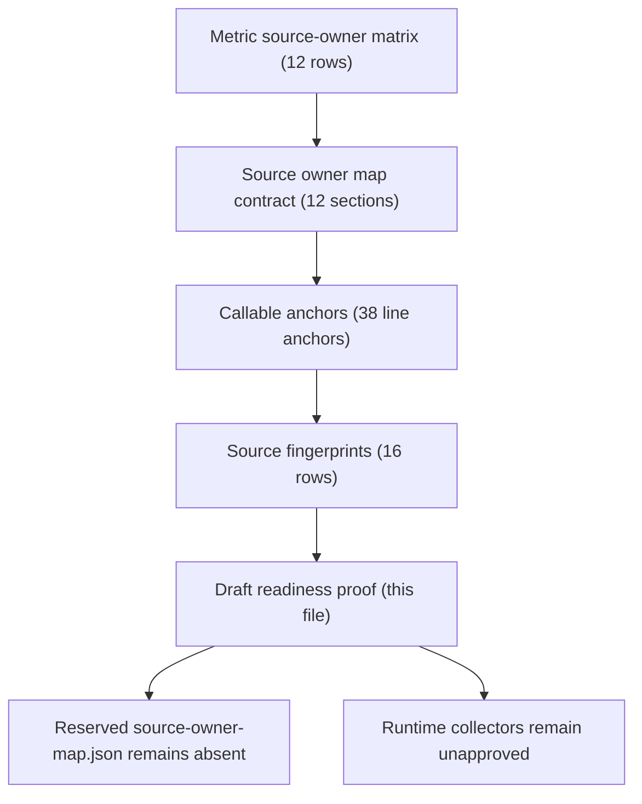

# FilterTube First Optimization Source Owner Map Draft Readiness - Current Behavior - 2026-05-29

Status: audit-only current-behavior source owner map draft readiness proof.
Runtime behavior is unchanged. This is not an implementation patch,
optimization patch, metric collector patch, JSON-first behavior patch,
whitelist patch, settings patch, lifecycle patch, diagnostic patch, native sync
patch, release patch, public claim patch, or committed metric artifact.

## Purpose

The selected first optimization packet remains
`FT-BIND-00-metric-artifact-foundation`. The reserved artifact root is still:

```text
docs/audit/artifacts/first-optimization/metric-foundation/
```

The reserved source owner map remains:

```text
docs/audit/artifacts/first-optimization/metric-foundation/source-owner-map.json
```

This document is a pre-artifact readiness proof. It consolidates the current
source-owner map contract, source-locus line anchors, source fingerprints, and
metric owner rows without creating the reserved JSON artifact. It answers the
current optimization question narrowly: source ownership has enough evidence to
draft the map shape, but not enough authority to commit the artifact or insert
collectors.

## Source Inputs

| Input | Current proof used |
| --- | --- |
| `docs/audit/FILTERTUBE_FIRST_OPTIMIZATION_SOURCE_OWNER_MAP_CONTRACT_CURRENT_BEHAVIOR_2026-05-24.md` | Defines 12 future `source-owner-map.json` sections, 0 committed source-owner map files, and 0 implementation-ready rows. |
| `docs/audit/FILTERTUBE_FIRST_OPTIMIZATION_SOURCE_LOCUS_CALLABLE_ANCHOR_BOUNDARY_CURRENT_BEHAVIOR_2026-05-24.md` | Pins 12 source-locus callable rows, 38 line anchors, 14 runtime source files, 2 audit/test anchor files, and 0 source-owner approvals. |
| `docs/audit/FILTERTUBE_FIRST_OPTIMIZATION_SOURCE_LOCUS_FINGERPRINT_BOUNDARY_CURRENT_BEHAVIOR_2026-05-24.md` | Pins 16 file fingerprints covering the current runtime/audit anchor set for source-locus proof. |
| `docs/audit/FILTERTUBE_FIRST_OPTIMIZATION_METRIC_SOURCE_OWNER_MATRIX_CURRENT_BEHAVIOR_2026-05-24.md` | Maps 12 metric owner rows across 10 owner families, but leaves 0 rows implementation-ready. |
| `docs/audit/FILTERTUBE_FIRST_OPTIMIZATION_SOURCE_OWNER_APPROVAL_BOUNDARY_CURRENT_BEHAVIOR_2026-05-24.md` | Requires line-anchored ownership, callable ownership, metric field production proof, and runtime source-owner approval before implementation. |
| `docs/audit/FILTERTUBE_FIRST_OPTIMIZATION_METRIC_ARTIFACT_PATH_BOUNDARY_CURRENT_BEHAVIOR_2026-05-24.md` | Reserves the metric-foundation artifact root and files while proving 0 foundation metric artifacts exist. |
| `docs/audit/FILTERTUBE_FIRST_OPTIMIZATION_COLLECTOR_APPROVAL_AUTHORITY_BOUNDARY_CURRENT_BEHAVIOR_2026-05-24.md` | Keeps runtime metric collector approvals at 0. |
| `docs/audit/FILTERTUBE_FIRST_OPTIMIZATION_METRIC_COLLECTOR_INSERTION_GATE_CURRENT_BEHAVIOR_2026-05-24.md` | Keeps runtime collector insertion points approved at 0. |
| `docs/audit/FILTERTUBE_METHOD_SEMANTIC_PROOF_GAP_INDEX_CURRENT_BEHAVIOR_2026-05-25.md` | Keeps 69 tracked JS/JSX/MJS files and 5,697 lexical callables outside complete per-callable semantic proof. |

## Current Counts

```text
source owner map draft readiness rows: 12
source owner map contract rows covered: 12
source-locus callable rows covered: 12
source-locus fingerprint rows covered: 16
metric source-owner rows covered: 12
source-owner approval rows covered: 12
line anchors covered: 38
runtime source files covered: 14
audit/test anchor files covered: 2
owner families covered: 10
reserved source-owner map paths covered: 1
committed reserved source-owner map files: 0
reserved metric-foundation artifact root exists: no
runtime source-owner approvals: 0
runtime metric collector approvals: 0
runtime collector insertion points approved: 0
implementation-ready draft readiness rows: 0
inline draft JSON sections covered: 12
inline draft JSON artifact promotion decision: NO-GO
method semantic proof gap files covered: 69
method semantic proof gap lexical callables covered: 5736
files with complete per-callable semantic proof: 0
lexical callables requiring semantic proof before behavior changes: 5736
draft artifact promotion decision: NO-GO
source-owner draft closure rows: 12
source-owner draft rows linked by closure: 12
upstream contract rows linked by draft closure: 12
inline draft JSON sections linked by closure: 12
source-locus callable rows linked by draft closure: 12
source-locus fingerprint rows linked by draft closure: 16
metric source-owner rows linked by draft closure: 12
source-owner approval rows linked by draft closure: 12
runtime source-owner draft closure approvals: 0
implementation-ready source-owner draft closure rows: 0
source-owner draft closure: SOURCE-OWNER-DRAFT-CHAIN-CLOSED
source-owner draft implementation readiness from closure: NO-GO
runtime behavior changed: no
not completion proof for source owner map authority
```

## Draft Readiness Matrix

| Draft row id | Future map section | Current source evidence | Missing proof before promotion |
| --- | --- | --- | --- |
| `FT-SOURCE-OWNER-MAP-DRAFT-00-map-identity` | Map identity, packet binding, affected callable proof binding. | `FT-SOURCE-OWNER-MAP-00-map-identity`, `FT-SOURCE-LOCUS-CALLABLE-00-settings-scope`, method gap count 5,697. | Committed packet manifest, affected callable IDs, complete semantic proof status, artifact verification output. |
| `FT-SOURCE-OWNER-MAP-DRAFT-01-artifact-binding` | Artifact path binding. | Reserved path `docs/audit/artifacts/first-optimization/metric-foundation/source-owner-map.json`, path boundary rows covered 10. | Actual artifact root creation approval, packet manifest, metric sample, source-owner map, and verification output. |
| `FT-SOURCE-OWNER-MAP-DRAFT-02-source-locus-catalog` | Runtime source locus catalog and callable owner proof. | 12 source-locus callable rows, 38 line anchors, 14 runtime source files, 16 fingerprints. | Per-callable owner proof, approved owner claims, freshness check after source edits. |
| `FT-SOURCE-OWNER-MAP-DRAFT-03-collector-insertion-owner` | Collector insertion ownership. | Collector approval boundary and insertion gate both prove 0 runtime approvals. | Approved insertion points, teardown owners, disabled/no-rule preservation, side-effect budget. |
| `FT-SOURCE-OWNER-MAP-DRAFT-04-transport-owner` | Fetch/XHR metric ownership. | `js/seed.js:685`, `js/seed.js:813`, `js/seed.js:924`, `FT-SOURCE-LOCUS-CALLABLE-02-transport-json`. | Body read budget, endpoint class policy, clone/parse no-work proof, response rewrite side-effect proof. |
| `FT-SOURCE-OWNER-MAP-DRAFT-05-engine-owner` | Filter engine metric ownership. | `js/filter_logic.js:844`, `js/filter_logic.js:1825`, `js/filter_logic.js:3391`, `FT-SOURCE-LOCUS-CALLABLE-03-filter-engine`. | Field production proof for blocklist, whitelist, content-control, category, and renderer mutation decisions. |
| `FT-SOURCE-OWNER-MAP-DRAFT-06-dom-lifecycle-owner` | DOM, listener, observer, timer ownership. | `js/content/dom_fallback.js:2035`, `js/content/dom_fallback.js:2105`, `js/content_bridge.js:1193`, quick-block observer anchors. | Observer/listener/timer budget approval, teardown proof, SPA route no-work preservation. |
| `FT-SOURCE-OWNER-MAP-DRAFT-07-network-storage-owner` | Resolver, network, map, and storage ownership. | `js/content/handle_resolver.js:149`, `js/content/handle_resolver.js:239`, `js/background.js:1452`, `js/io_manager.js:409`. | Credential policy proof, cache write budget, map flush side-effect budget, cross-context refresh ownership. |
| `FT-SOURCE-OWNER-MAP-DRAFT-08-visual-diagnostic-owner` | Visual mutation and diagnostic ownership. | `js/content/dom_fallback.js:972`, `js/content/dom_fallback.js:1027`, `js/seed.js:150`, `js/filter_logic.js:21`. | Hide/restore invariant proof, diagnostic redaction policy, release diagnostic absence proof. |
| `FT-SOURCE-OWNER-MAP-DRAFT-09-no-work-side-effect-owner` | No-work and side-effect ownership. | Metric no-work and side-effect matrices each cover 12 rows while approving 0 implementation rows. | Disabled master switch, empty rules, excluded route, blocklist, whitelist, and SPA no-work proof by owner. |
| `FT-SOURCE-OWNER-MAP-DRAFT-10-fixture-parity-owner` | Fixture, parity, and rollout ownership. | Fixture provenance and parity rollout matrices each cover 12 rows while approving 0 rollout rows. | Committed fixture provenance, JSON/DOM/native parity, release exclusion, rollback and unclaimed surface proof. |
| `FT-SOURCE-OWNER-MAP-DRAFT-11-verification-owner` | Verification ownership. | Existing focused audit commands pin the source-owner contract, source-locus anchors, fingerprints, and absence boundaries. | Committed verification output artifact, pass/fail counts for promoted artifact, product authority-token absence proof. |

## Inline Draft JSON Shape

The future artifact must be structured data, but the reserved artifact remains
absent. This inline draft shape is intentionally embedded in the audit document
so the verifier can parse the section model without creating
`source-owner-map.json`.

```json
{
  "schemaVersion": "source-owner-map-draft-readiness-2026-05-29",
  "packetId": "FT-BIND-00-metric-artifact-foundation",
  "artifactPath": "docs/audit/artifacts/first-optimization/metric-foundation/source-owner-map.json",
  "artifactPromotionDecision": "NO-GO",
  "runtimeBehaviorChanged": false,
  "sections": [
    {
      "id": "FT-SOURCE-OWNER-MAP-DRAFT-00-map-identity",
      "contractRow": "FT-SOURCE-OWNER-MAP-00-map-identity",
      "mapSection": "mapIdentity",
      "requiredProof": ["packetManifest", "affectedCallableIds", "methodSemanticProofStatus", "verificationOutput"]
    },
    {
      "id": "FT-SOURCE-OWNER-MAP-DRAFT-01-artifact-binding",
      "contractRow": "FT-SOURCE-OWNER-MAP-01-artifact-binding",
      "mapSection": "artifactBinding",
      "requiredProof": ["artifactRoot", "packetManifestPath", "metricSamplePath", "sourceOwnerMapPath", "verificationOutputPath"]
    },
    {
      "id": "FT-SOURCE-OWNER-MAP-DRAFT-02-source-locus-catalog",
      "contractRow": "FT-SOURCE-OWNER-MAP-02-source-locus-catalog",
      "mapSection": "sourceLocusCatalog",
      "requiredProof": ["sourceLocus", "sourceOwner", "ownerFamily", "sourceFiles", "callables", "lineAnchors"]
    },
    {
      "id": "FT-SOURCE-OWNER-MAP-DRAFT-03-collector-insertion-owner",
      "contractRow": "FT-SOURCE-OWNER-MAP-03-collector-insertion-owner",
      "mapSection": "collectorInsertionOwner",
      "requiredProof": ["collectorInsertionId", "approvedInsertionPoint", "collectorApproved", "teardownOwner"]
    },
    {
      "id": "FT-SOURCE-OWNER-MAP-DRAFT-04-transport-owner",
      "contractRow": "FT-SOURCE-OWNER-MAP-04-transport-owner",
      "mapSection": "transportOwner",
      "requiredProof": ["transportOwner", "fetchOwner", "xhrOwner", "endpointOwner", "bodyReadOwner", "responseRewriteOwner"]
    },
    {
      "id": "FT-SOURCE-OWNER-MAP-DRAFT-05-engine-owner",
      "contractRow": "FT-SOURCE-OWNER-MAP-05-engine-owner",
      "mapSection": "engineOwner",
      "requiredProof": ["engineOwner", "ruleCompilerOwner", "candidateExtractionOwner", "decisionReportOwner", "rendererMutationOwner"]
    },
    {
      "id": "FT-SOURCE-OWNER-MAP-DRAFT-06-dom-lifecycle-owner",
      "contractRow": "FT-SOURCE-OWNER-MAP-06-dom-lifecycle-owner",
      "mapSection": "domLifecycleOwner",
      "requiredProof": ["domOwner", "selectorOwner", "listenerOwner", "observerOwner", "timerOwner", "restoreOwner"]
    },
    {
      "id": "FT-SOURCE-OWNER-MAP-DRAFT-07-network-storage-owner",
      "contractRow": "FT-SOURCE-OWNER-MAP-07-network-storage-owner",
      "mapSection": "networkStorageOwner",
      "requiredProof": ["networkOwner", "credentialOwner", "resolverOwner", "storageOwner", "mapWriteOwner", "messageOwner"]
    },
    {
      "id": "FT-SOURCE-OWNER-MAP-DRAFT-08-visual-diagnostic-owner",
      "contractRow": "FT-SOURCE-OWNER-MAP-08-visual-diagnostic-owner",
      "mapSection": "visualDiagnosticOwner",
      "requiredProof": ["visualOwner", "hideOwner", "restoreMutationOwner", "diagnosticOwner", "privacyOwner", "redactionOwner"]
    },
    {
      "id": "FT-SOURCE-OWNER-MAP-DRAFT-09-no-work-side-effect-owner",
      "contractRow": "FT-SOURCE-OWNER-MAP-09-no-work-side-effect-owner",
      "mapSection": "noWorkSideEffectOwner",
      "requiredProof": ["noWorkResponsibilities", "sideEffectResponsibilities", "disabledOwner", "emptyListOwner", "settingsBudgetOwner"]
    },
    {
      "id": "FT-SOURCE-OWNER-MAP-DRAFT-10-fixture-parity-owner",
      "contractRow": "FT-SOURCE-OWNER-MAP-10-fixture-parity-owner",
      "mapSection": "fixtureParityOwner",
      "requiredProof": ["fixtureResponsibilities", "parityResponsibilities", "nativeParityOwner", "releaseOwner", "publicClaimOwner", "rollbackOwner"]
    },
    {
      "id": "FT-SOURCE-OWNER-MAP-DRAFT-11-verification-owner",
      "contractRow": "FT-SOURCE-OWNER-MAP-11-verification-owner",
      "mapSection": "verificationOwner",
      "requiredProof": ["verificationResponsibilities", "verificationCommand", "expectedTests", "expectedPass", "expectedFail", "authorityTokenAbsenceCheck"]
    }
  ]
}
```

Inline draft shape decision:

```text
parse inline source-owner map JSON draft: GO
use inline draft as committed artifact: NO-GO
derive runtime collector insertion from inline draft: NO-GO
```

## Source-Owner Draft Chain Closure

This closure table proves the draft-readiness documentation chain is complete
from each future `source-owner-map.json` section to its upstream contract row,
inline JSON section, source-locus evidence, owner family, and missing proof. It
does not create the reserved JSON artifact, create the metric-foundation
artifact root, approve runtime collectors, approve source-owner authority,
approve JSON-first runtime behavior, or approve whitelist/cache optimization.

Source-owner draft closure rows:

| Closure row | Draft row | Inline map section | Upstream proof link | Current state |
| --- | --- | --- | --- | --- |
| `FT-SOURCE-OWNER-DRAFT-CLOSURE-00-map-identity` | `FT-SOURCE-OWNER-MAP-DRAFT-00-map-identity` | `mapIdentity` | `FT-SOURCE-OWNER-MAP-00-map-identity`; method gap count 5,697. | Chain linked; packet manifest and complete semantic callable proof missing. |
| `FT-SOURCE-OWNER-DRAFT-CLOSURE-01-artifact-binding` | `FT-SOURCE-OWNER-MAP-DRAFT-01-artifact-binding` | `artifactBinding` | Reserved `source-owner-map.json` path and metric artifact path boundary. | Chain linked; artifact root creation and artifact promotion remain blocked. |
| `FT-SOURCE-OWNER-DRAFT-CLOSURE-02-source-locus-catalog` | `FT-SOURCE-OWNER-MAP-DRAFT-02-source-locus-catalog` | `sourceLocusCatalog` | 12 source-locus callable rows, 38 line anchors, 14 runtime files, 16 fingerprints. | Chain linked; per-callable owner approval and post-edit freshness proof missing. |
| `FT-SOURCE-OWNER-DRAFT-CLOSURE-03-collector-insertion-owner` | `FT-SOURCE-OWNER-MAP-DRAFT-03-collector-insertion-owner` | `collectorInsertionOwner` | Collector approval boundary and insertion gate prove 0 runtime approvals. | Chain linked; approved insertion points and teardown owners missing. |
| `FT-SOURCE-OWNER-DRAFT-CLOSURE-04-transport-owner` | `FT-SOURCE-OWNER-MAP-DRAFT-04-transport-owner` | `transportOwner` | Seed fetch/XHR anchors and transport source-locus row. | Chain linked; body-read, endpoint, clone/parse, and response-rewrite budgets missing. |
| `FT-SOURCE-OWNER-DRAFT-CLOSURE-05-engine-owner` | `FT-SOURCE-OWNER-MAP-DRAFT-05-engine-owner` | `engineOwner` | Filter logic anchors and filter-engine source-locus row. | Chain linked; blocklist, whitelist, content-control, category, and renderer mutation field proof missing. |
| `FT-SOURCE-OWNER-DRAFT-CLOSURE-06-dom-lifecycle-owner` | `FT-SOURCE-OWNER-MAP-DRAFT-06-dom-lifecycle-owner` | `domLifecycleOwner` | DOM fallback, content bridge, and quick-block lifecycle anchors. | Chain linked; observer/listener/timer budget approval and SPA no-work preservation missing. |
| `FT-SOURCE-OWNER-DRAFT-CLOSURE-07-network-storage-owner` | `FT-SOURCE-OWNER-MAP-DRAFT-07-network-storage-owner` | `networkStorageOwner` | Resolver, background map, and IO/storage anchors. | Chain linked; credential policy, cache-write budget, map flush budget, and refresh ownership missing. |
| `FT-SOURCE-OWNER-DRAFT-CLOSURE-08-visual-diagnostic-owner` | `FT-SOURCE-OWNER-MAP-DRAFT-08-visual-diagnostic-owner` | `visualDiagnosticOwner` | DOM visual mutation and diagnostic anchors. | Chain linked; hide/restore invariants, diagnostic redaction, and release diagnostic absence proof missing. |
| `FT-SOURCE-OWNER-DRAFT-CLOSURE-09-no-work-side-effect-owner` | `FT-SOURCE-OWNER-MAP-DRAFT-09-no-work-side-effect-owner` | `noWorkSideEffectOwner` | Metric no-work and side-effect matrices. | Chain linked; disabled, empty, excluded-route, blocklist, whitelist, and SPA no-work proof by owner missing. |
| `FT-SOURCE-OWNER-DRAFT-CLOSURE-10-fixture-parity-owner` | `FT-SOURCE-OWNER-MAP-DRAFT-10-fixture-parity-owner` | `fixtureParityOwner` | Fixture provenance and parity rollout matrices. | Chain linked; committed fixture provenance, native parity, rollback, and unclaimed-surface proof missing. |
| `FT-SOURCE-OWNER-DRAFT-CLOSURE-11-verification-owner` | `FT-SOURCE-OWNER-MAP-DRAFT-11-verification-owner` | `verificationOwner` | Focused audit commands and absence boundaries. | Chain linked; committed verification output artifact and promoted-artifact pass/fail proof missing. |

Source-owner draft closure decision:

```text
close source-owner draft documentation chain now: GO
accept source-owner draft closure as committed artifact approval now: NO-GO
accept source-owner draft closure as artifact root creation approval now: NO-GO
accept source-owner draft closure as runtime collector insertion approval now: NO-GO
accept source-owner draft closure as source-owner authority approval now: NO-GO
accept source-owner draft closure as JSON-first runtime behavior approval now: NO-GO
accept source-owner draft closure as whitelist optimization approval now: NO-GO
accept source-owner draft closure as release/public-claim approval now: NO-GO
continue proof-backed audit: GO
```

## Upstream Contract Row Binding

Every future source-owner map contract row is bound by this draft readiness
proof, but no upstream row is promoted to implementation-ready state:

```text
FT-SOURCE-OWNER-MAP-00-map-identity
FT-SOURCE-OWNER-MAP-01-artifact-binding
FT-SOURCE-OWNER-MAP-02-source-locus-catalog
FT-SOURCE-OWNER-MAP-03-collector-insertion-owner
FT-SOURCE-OWNER-MAP-04-transport-owner
FT-SOURCE-OWNER-MAP-05-engine-owner
FT-SOURCE-OWNER-MAP-06-dom-lifecycle-owner
FT-SOURCE-OWNER-MAP-07-network-storage-owner
FT-SOURCE-OWNER-MAP-08-visual-diagnostic-owner
FT-SOURCE-OWNER-MAP-09-no-work-side-effect-owner
FT-SOURCE-OWNER-MAP-10-fixture-parity-owner
FT-SOURCE-OWNER-MAP-11-verification-owner
```

## Readiness Flow

```text
metric source-owner matrix
  -> source owner map contract
  -> source-locus callable anchors
  -> source-locus file fingerprints
  -> draft readiness proof
  -> source-owner-map.json remains absent
```



## Current Decision

```text
write pre-artifact source owner map readiness proof: GO
commit source-owner-map.json now: NO-GO
create reserved metric-foundation artifact root now: NO-GO
runtime metric collector insertion: NO-GO
JSON-first runtime behavior patch from this gate: NO-GO
whitelist optimization patch from this gate: NO-GO
continue proof-backed audit: GO
```

The reason is specific: the line anchors and fingerprints are enough to say
which owners a future map must cover, but the metric artifact path boundary and
source-owner approval boundary still require absent artifacts, absent runtime
approvals, and no collector insertion.

## Missing Runtime Authority Symbols

No product runtime source should define these draft readiness symbols:

```text
firstOptimizationSourceOwnerMapDraftReadiness
firstOptimizationSourceOwnerMapDraftReadinessReport
firstOptimizationSourceOwnerMapDraftApproval
sourceOwnerMapDraftArtifactPromotion
metricFoundationSourceOwnerMapDraftCollector
jsonFirstSourceOwnerMapDraftAuthority
whitelistSourceOwnerMapDraftBudget
runtimeSourceOwnerMapDraftCollector
sourceOwnerMapDraftClosure
sourceOwnerMapDraftClosureRuntimeApproval
sourceOwnerMapDraftImplementationReadiness
```

## Verification

Current proof command:

```bash
node --test tests/runtime/first-optimization-source-owner-map-draft-readiness-current-behavior.test.mjs --test-reporter=spec
```

This readiness proof is not a completion claim. It advances the first
optimization audit by proving the map can be drafted from current anchored
evidence while the reserved JSON artifact, runtime collectors, JSON-first
behavior changes, and whitelist optimization changes remain blocked.
