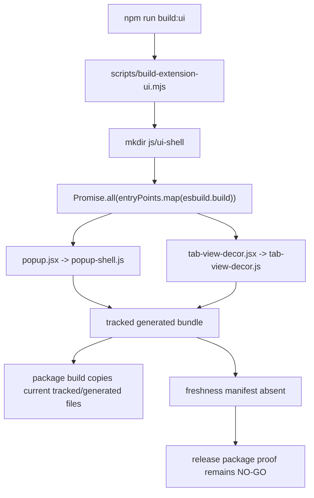

# FilterTube Generated UI Shell Method Semantic Register - Current Behavior - 2026-05-21

Status: audit-only current-behavior register. Runtime and build behavior are unchanged.

This register promotes the generated extension UI shell from static boundary
markers to a source-derived method and artifact inventory. It covers
`scripts/build-extension-ui.mjs`, the authored Preact shell inputs in
`src/extension-shell/`, the shared shell runtime helper, the tracked generated
outputs in `js/ui-shell/`, and the HTML script-entry surfaces that load those
outputs.

This is not completion proof for generated-output freshness, output hash
provenance, source/output drift detection, package parity, popup/dashboard
render fixtures, or release safety. It is a current-behavior boundary before
changing the shell build script, generated output files, extension shell source,
HTML load order, package copying, or public release claims.

## Source-Derived Summary

```text
build script: scripts/build-extension-ui.mjs
source shell files: src/extension-shell/popup.jsx, src/extension-shell/tab-view-decor.jsx, src/extension-shell/shared/runtime.js
generated output files: js/ui-shell/popup-shell.js, js/ui-shell/tab-view-decor.js
authoring/build source line count: 249
generated output line count: 697
authoring/build source bytes: 7615
generated output bytes: 39369
named method/helper/component declarations in source scope: 8
plain function declarations: 3
async function declarations: 2
export function declarations: 3
semantic method groups: 4
arrow token sites in authoring/build source: 2
document literal occurrences in authoring/build source: 6
window literal occurrences in authoring/build source: 1
style property writes in authoring/build source: 12
dataset writes/reads in authoring/build source: 6
render calls in authoring/build source: 2
video JSX elements in authoring/build source: 2
document literal occurrences in generated output: 20
window literal occurrences in generated output: 2
style property writes in generated output: 28
dataset writes/reads in generated output: 12
render calls in generated output: 4
runtime behavior changed: no
```

## Build Freshness Flow - 2026-05-27

This dated addendum pins the current generated UI build freshness boundary.
It does not run the build, regenerate output, approve generated-output cleanup,
or claim that tracked generated bundles are fresh.

```text
npm run build:ui
        |
        v
node scripts/build-extension-ui.mjs
        |
        v
ensure js/ui-shell exists
        |
        v
Promise.all two esbuild browser IIFE bundles
        |
        +--> src/extension-shell/popup.jsx -> js/ui-shell/popup-shell.js
        |
        +--> src/extension-shell/tab-view-decor.jsx -> js/ui-shell/tab-view-decor.js
        |
        v
tracked generated output may change
        |
        v
no source/output freshness manifest is written
```



Current artifact hashes:

| Artifact | Role | Current sha256 |
| --- | --- | --- |
| `scripts/build-extension-ui.mjs` | Build entrypoint | `6326362ebf90f448ccdbf68945b3fb522b7b215edaf9b3e28589a4e166239cf3` |
| `src/extension-shell/popup.jsx` | Popup shell source | `3a3772e7d77f8466fea609a80c1d4f09873e47022aee17f3b8b09858397b298c` |
| `src/extension-shell/tab-view-decor.jsx` | Dashboard decor source | `354cd36fa62b215a415e88b8b0c84bd43725196613766d6af921eac44d1f63f1` |
| `src/extension-shell/shared/runtime.js` | Shared shell runtime source | `d54cc87b8f48736df6ca063fa79e37b2439b580710746e215e8b428fc7207ec8` |
| `js/ui-shell/popup-shell.js` | Tracked generated popup bundle | `dc750d44dd4b9fde63b85b4dfc9f5ce9ba76964afbd6dfcedc7b3b7cce084b05` |
| `js/ui-shell/tab-view-decor.js` | Tracked generated dashboard bundle | `234171091e523aa5de4c3c0f97e7341c55893bdd31b3e25a075490170fa9742f` |

Build dependency pins from current manifests:

```text
package.json esbuild range: ^0.27.4
package-lock esbuild version: 0.27.4
package.json preact range: ^10.29.0
package-lock preact version: 10.29.0
```

Current stale-output behavior:

```text
source/output freshness manifest: absent
generated output hash manifest: absent
build failure rollback: absent
stale generated bundle deletion on failure: absent
tracked generated output owner: source review and package build both see js/ui-shell
release package proof: NO-GO
runtime behavior changed: no
```

The release-relevant gap is that a failed build sets `process.exitCode = 1`
but does not delete old output files or write a failed-build report. If old
`js/ui-shell/*.js` files already exist, they can remain in the worktree after a
failed build attempt. That is current behavior, not a recommendation.

## Artifact Line Counts

```text
scripts/build-extension-ui.mjs: 50 lines, 1188 bytes
src/extension-shell/popup.jsx: 113 lines, 3864 bytes
src/extension-shell/tab-view-decor.jsx: 34 lines, 1101 bytes
src/extension-shell/shared/runtime.js: 52 lines, 1462 bytes
js/ui-shell/popup-shell.js: 374 lines, 21080 bytes
js/ui-shell/tab-view-decor.js: 323 lines, 18289 bytes
```

## Method Group Counts

```text
generatedUiBuildScript: 2
generatedPopupShell: 2
generatedTabViewShell: 1
generatedShellRuntime: 3
```

## Semantic Group Summary

| Semantic group | Declarations | Current owner/effect shape | Missing proof before behavior changes |
| --- | ---: | --- | --- |
| `generatedUiBuildScript` | 2 | Creates `js/ui-shell`, runs two esbuild browser IIFE bundles in parallel, and fails by setting `process.exitCode = 1`. | Build failure fixture, source/output hash manifest, package parity report, output freshness gate, and deterministic build proof. |
| `generatedPopupShell` | 2 | Renders the popup frame, ambient media, brand/status area, profile/list-mode placeholders, open-in-tab button, and `popupFiltersTabsContainer`. | Popup render fixture, accessibility fit proof, generated-output drift report, and manifest/package load-order proof. |
| `generatedTabViewShell` | 1 | Renders the dashboard ambient media/decor layer into `tabViewShellDecor`. | Dashboard render fixture, output drift report, route/load-order proof, and generated-output ownership record. |
| `generatedShellRuntime` | 3 | Derives a time-of-day scene, probes system theme, mutates root/body dataset/style fields, adds `ft-extension-surface`, and clamps popup width to `392px`. | Theme/scene contract, popup sizing fixture, no-DOM fallback proof, and root/body mutation ownership record. |

## Current Method Inventory

| Source file | Source line | Kind | Method or function | Semantic group |
| --- | ---: | --- | --- | --- |
| `scripts/build-extension-ui.mjs` | 19 | `asyncFunction` | `ensureOutputDirectories` | `generatedUiBuildScript` |
| `scripts/build-extension-ui.mjs` | 23 | `asyncFunction` | `bundleAll` | `generatedUiBuildScript` |
| `src/extension-shell/popup.jsx` | 5 | `function` | `ShellGlow` | `generatedPopupShell` |
| `src/extension-shell/popup.jsx` | 9 | `function` | `PopupShell` | `generatedPopupShell` |
| `src/extension-shell/tab-view-decor.jsx` | 5 | `function` | `TabViewDecor` | `generatedTabViewShell` |
| `src/extension-shell/shared/runtime.js` | 1 | `exportFunction` | `getSceneForHour` | `generatedShellRuntime` |
| `src/extension-shell/shared/runtime.js` | 8 | `exportFunction` | `getSystemTheme` | `generatedShellRuntime` |
| `src/extension-shell/shared/runtime.js` | 16 | `exportFunction` | `applyExtensionEnvironment` | `generatedShellRuntime` |

## Current Entrypoints And Dependencies

```text
npm script entrypoint: npm run build:ui -> node scripts/build-extension-ui.mjs
package build entrypoint: build.js calls node scripts/build-extension-ui.mjs before package copy
build output directory: js/ui-shell
build input 1: src/extension-shell/popup.jsx
build output 1: js/ui-shell/popup-shell.js
build input 2: src/extension-shell/tab-view-decor.jsx
build output 2: js/ui-shell/tab-view-decor.js
shared runtime import: src/extension-shell/shared/runtime.js
build executor: esbuild build()
build concurrency: Promise.all(entryPoints.map(...))
bundle format: browser IIFE
target browsers: chrome111 and firefox109
JSX runtime: Preact h and Fragment
legal comments: none
sourcemap: false
minify: false
log level: info
popup HTML mount node: popupRoot
popup HTML generated output script: ../js/ui-shell/popup-shell.js
tab-view HTML mount node: tabViewShellDecor
tab-view HTML generated output script: ../js/ui-shell/tab-view-decor.js
popup shell media: ../assets/images/homepage_hero_day.mp4
tab-view shell media: ../assets/images/homepage_hero_day.mp4
source/output freshness manifest: absent
generated output hash manifest: absent
sourceMappingURL output: absent
runtime behavior changed: no
```

## Current Behavior Boundaries

```text
generated UI output is tracked source, not regenerated on import or extension startup
build.js regenerates UI shell output before copying package roots
npm run build:ui can update tracked js/ui-shell files without writing a freshness manifest
the build script has no dry-run mode and no package manifest integration
the two esbuild outputs are built concurrently by Promise.all
build failure sets process.exitCode but does not delete stale output files
popup shell render is skipped silently when popupRoot is missing
tab-view shell render is skipped silently when tabViewShellDecor is missing
applyExtensionEnvironment returns early when documentElement is missing
system theme probing catches errors and falls back to light
popup environment writes fixed 392px width to html, body, and popupRoot
generated output bundles include Preact runtime code and authored shell markers
no committed source/output hash or freshness report proves generated output parity today
```

## Risk Notes

Reliability risk is concentrated in drift between authored shell source and
tracked generated output. The package build regenerates the shell, but normal
source review can see stale generated bundles, and there is no committed
freshness manifest tying the generated output to source hashes, esbuild
version, or package copy state.

False-hide/leak risk is indirect: the generated shell owns extension popup and
dashboard scaffolding that hosts profile/list-mode controls and rule editing
surfaces. A stale shell can expose missing mount nodes, wrong load order, or
out-of-date UI scaffolding even when filtering runtime logic is unchanged.

Performance/code-burden risk comes from tracked generated output plus bundled
Preact runtime duplication. Both generated files carry bundled runtime code,
source and output are both tracked, and stale output can look product-authored
unless a source/output provenance report separates generated code from
hand-owned runtime.

## Future Proof Fields

Each generated UI shell row must eventually be backed by source line, build
command, generated artifact, hash, package copy result, and render fixture
before generated shell, release package, UI load order, or cleanup behavior can
claim semantic coverage:

```text
generatedUiMethodReference
sourceFile
sourceLine
semanticGroup
buildEntrypoint
sourceInputPath
generatedOutputPath
sourceHash
generatedOutputHash
esbuildVersion
preactVersion
htmlMountSelector
htmlScriptPath
packageTarget
sourceOutputFreshness
loadOrderProof
renderFixture
missingMountBehavior
buildFailureBehavior
staleOutputPolicy
positiveFixture
negativeFixture
releasePackageProof
```

## Missing Runtime Authorities

These authority/report tokens do not exist in generated UI shell source,
generated output, build script, or HTML load surfaces today:

```text
generatedUiShellMethodAuthority
uiShellFreshnessManifest
uiShellSourceHashManifest
uiShellGeneratedOutputHash
uiShellGeneratedOutputOwner
uiShellPackageParityReport
uiShellBrowserRenderFixture
uiShellBuildFailureContract
uiShellSourceOutputDriftReport
uiShellStaleOutputFailureReport
uiShellReleaseFixtureProvenance
```

## Method Semantic Proof Gap Boundary

`docs/audit/FILTERTUBE_METHOD_SEMANTIC_PROOF_GAP_INDEX_CURRENT_BEHAVIOR_2026-05-25.md`
is a required source input before this static/generated/asset package surface
can support runtime optimization. Current proof pins:

```text
method semantic proof gap files covered: 69
method semantic proof gap lexical callables covered: 5673
files with complete per-callable semantic proof: 0
lexical callables requiring semantic proof before behavior changes: 5673
affected callable semantic proof: NO-GO
runtime behavior changed: no
```

These counts are audit-only blockers. They do not approve runtime
optimization, JSON-first behavior, asset optimization, generated-output
cleanup, package pruning, CSS activation/deletion, whitelist behavior, metric
collectors, artifact creation, native sync, release package changes, or public
claims.
