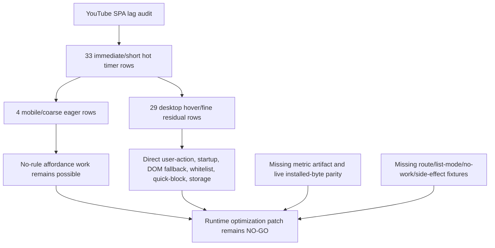

# FilterTube Implementation Readiness Gate - 2026-05-18

Status: audit gate. This is not an implementation patch.

The current audit has enough evidence to explain the disease, but not enough
evidence to safely start broad behavior cleanup. This gate marks which
implementation areas are still blocked and what proof must exist before each
area can move from current-behavior audit to behavior change.

## Current Verdict

```text
Implementation readiness: NOT READY for broad behavior changes.
Allowed next work: fixtures, instrumentation, source-boundary proof, and
implementation-neutral contracts.
Blocked next work: changing JSON filtering, DOM fallback, message trust,
settings mutation semantics, lifecycle ownership, or simultaneous allow/block
mode until the gate below is satisfied.
```

Green current-behavior tests prove what the source does today. They do not yet
prove the future behavior is safe. A future fix should flip or replace a
specific current-behavior fixture only after its negative/positive gate exists.

The broad audit objective is tracked separately in
`docs/audit/FILTERTUBE_OBJECTIVE_COVERAGE_LEDGER_2026-05-18.md`. That ledger is part
of this readiness gate: it says Completion is not proven and the project is NOT
READY for implementation changes until feature, file, callable, JSON path, DOM
selector, lifecycle, settings-mode, cross-feature, raw-capture, reliability,
false-hide, leak, performance, and code-burden coverage rows are behavior
backed instead of only classified or partially fixture-backed.

Settings-mode coverage is expanded in
`docs/audit/FILTERTUBE_SETTINGS_MODE_COVERAGE_MATRIX_2026-05-18.md`. That matrix is
also part of this gate: it says enabled/disabled, empty blocklist, explicit
empty whitelist, Main/Kids modes, profile/lock modes, syncKidsToMain,
quick/menu affordances, content predicates, keyword/comment scope, watch/route
modes, import/Nanah apply, and future simultaneous allow/block behavior are
still not-ready-for-behavior-change until the named fixtures exist.

The counted P0 fixture wall is recorded in
`docs/audit/FILTERTUBE_P0_FIXTURE_GATE_REGISTER_2026-05-18.md`: 217 named P0
fixture obligations across 23 families. That register is the current minimum
proof wall before broad runtime behavior changes.

## Readiness Matrix

| Area | Current evidence | Ready? | Blocking proof |
| --- | --- | --- | --- |
| `compiledRuleState` | Active predicates are split across seed, DOM fallback, quick block, menu gates, background compile, and UI state. | No | One compiled active-state report for profile/surface/route/list mode, with fixtures for enabled-empty category, blank upload date, zero duration, empty blocklist, and explicit empty whitelist. |
| Content/category predicate authority | Content/category controls have split activation versus decision logic: raw enabled flags can wake JSON/DOM work, while final engine/card decisions sometimes validate selected categories, dates, or ranges later. | No | One `contentPredicateAuthority` report with fixtures for enabled-empty category, blank upload date, zero-duration longer, stale threshold saves, route-scoped booleans, and metadata-fetch pending reasons. |
| Keyword match authority | Keyword exactness, comments scope, channel-derived keyword metadata, whitelist allow matching, JSON regex matching, and DOM normalized fallback matching are split across UI, shared settings, background, engine, and DOM fallback. | No | One `keywordMatchAuthority` report with fixtures for substring policy, exact Unicode boundaries, DOM normalized boundaries, comment keyword reconstruction, channel-derived metadata round-trip, Kids-to-Main sync, and whitelist fail-closed reasons. |
| Stats/time-saved side-effect authority | Stats are written by hide paths and a legacy background message path. The shared hide helper couples display, tracker, stats, and media side effects, while dashboard reads `statsBySurface` but StateManager external reload watches only legacy `stats`. | No | One `statsSideEffectAuthority` report with fixtures for trusted sender/range validation, structured hide decisions, prior-counted restore, media separation from `skipStats`, surface-scoped stats, dashboard refresh, and storage-write batching. |
| Backup/export authority | Manual export/import, encrypted backup restore, background auto-backup, IO-manager auto-backup, StateManager scheduling, content-script scheduling, download methods, encryption policy, and rotation policy are split across multiple owners. | No | One `backupExportAuthority` report with fixtures for actor class, target profile/scope, unlock/PIN requirements, encryption policy, download method, filename/rotation policy, trigger/delay clamp, post-mutation revision, and trusted Nanah restore policy. |
| Profile/viewing-space authority | Profile switching, Main/Kids surface selection, child profile policy, allowed viewing spaces, managed-child edits, syncKidsToMain, and runtime compile are split across popup, tab-view, StateManager, shared settings, and background. | No | One `profileViewingAuthority` report with fixtures for active profile, target profile, Main/Kids viewing access, lock state, parent manager, runtime compile permission, profile switch invalidation, managed-child target surface, and compiled revision. |
| Watch/player control authority | Comments, live chat, watch recommendations, watch playlist panels, playlist/mix cards, video metadata chrome, end-screen overlays, autoplay, and annotations are split across UI catalog, shared settings, background compile, content refresh, seed `/next`, JSON renderer rules, and DOM fallback selectors. | No | One `watchSurfaceControlAuthority` report with fixtures for route-scoped watch controls, background invalidation keys, `/next` and `/player` no-rule policies, comment continuation rewrites, end-screen JSON/DOM split, whitelist watch scaffolding, and fullscreen quiet mode. |
| `endpointPolicy` | Endpoint decision matrix and seed fixtures pin current parse/rewrite behavior, including mobile browse/player/next/guide no-rule overwork. | No | Negative pass-through fixtures for no-rule `/search`, `/browse`, `/next`, `/player`, `/guide`, plus mutation-only fixtures for active recommendation/comment cases. |
| Network/fetch authority | Direct network work is split across passive YouTubei fetch/XHR interception, background watch/shorts/Kids/channel identity fetches, content-bridge watch/shorts fallbacks, explicit subscription import, local release-note fetches, website remotes, and tab/window opens. | No | One `networkAuthority` report with owner/trigger/route/credentials/user-action/cache-budget records, plus fixtures for no-rule pass-through, direct identity fetch reasons, import gating, website-only remotes, allowlisted opens, and raw-capture URL exclusion. |
| External navigation/link authority | Runtime and static navigation are split across background tab creation, popup fallbacks, dashboard Ko-fi/import tab creation, release-banner fallback navigation, extension HTML target-blank anchors, and website public links. | No | One `externalNavigationAuthority` report with owner/sender/url-class/user-action/allowlist/fallback/rel-policy records, plus fixtures for What's New allowlisting, popup internal opens, fixed workflow URLs, extension target-blank policy, website link policy, and raw-capture URL exclusion. |
| Message trust contract | Background and page-message audits pin unguarded/split paths, same-window page message spoof surfaces, and the full current receiver inventory. | No | Sender-class fixtures for `trustedUi`, `allowedYoutubeContentScript`, `ownedPageWorldRequest`, and `backgroundInternal`; reject untrusted settings apply, injection, tab open, channel fetch, learned maps, and forced DOM reruns; keep a `messageSenderClassMatrix` inventory for every receiver action/message. |
| Message side-effect contract | Message receivers can trigger tab opens, script injection, network fetches, storage writes, compiled cache broadcasts, DOM reruns, learned identity, stats mutation, backup scheduling, and rule mutation. | No | One `messageSideEffectAuthority` table with receiver, sender class, route/profile/list target, storage keys, network/script/tab authority, compiled cache/broadcast authority, DOM rerun authority, backup/stat authority, nonce/request/provenance requirement, and negative spoof fixture. |
| Lifecycle registry | Repo-wide primitive coverage pins 830 lifecycle/side-effect primitives and owner rows, but no shared lifecycle registry exists in source. | No | Owner fixtures for install, pause, resume, teardown, fullscreen/native-overlay quiet mode, and no-affordance zero-work for every observer/listener/timer/prototype patch owner. |
| Lifecycle instance register | The source-derived lifecycle register pins 489 current observer/listener/timer/frame instances by file, line, primitive family, source family, and owner class. | No | Instance-level fixtures for disabled zero active instances, empty blocklist zero DOM scan instances, quick/fallback affordance zero lifecycle when off, fullscreen/native overlay pause, route teardown, UI listener idempotence, background timer owner/revision reason, and vendor/generated freshness proof. |
| Renderer JSON expansion | Renderer gap fixtures prove many direct renderer leaks and broad container risks, and capture traceability now shows which raw evidence families are represented versus still unextracted. | No | Each new renderer rule needs blocklist, whitelist, nested/direct, route, owner identity, false-hide boundary fixtures, and a capture traceability record from minimal extracted captures. |
| DOM selector registry | DOM route-scope and selector-authority audits prove 646 selector API call sites across 11 tracked non-vendor files, with global mixed-surface selectors, split menu gates, broad watch/member targets, and no central selector authority. | No | One `selectorAuthority` report with selector owner records for surface/route/action/target, plus fixtures for watch primary no-hide, playlist selected row, posts, Shorts shelves, Kids passive listener, disabled/whitelist modes, no-rule zero-scan, and inventory-to-runtime proof status. |
| DOM selector instance register | The source-derived selector register pins 646 tracked non-vendor selector API sites, including 579 static literal argument sites, 374 unique static selector literals, and 67 dynamic selector expressions. | No | Selector-instance fixtures for static literal registry parity, dynamic expression source owner and escape policy, global card constants by surface/route/action, quick/fallback menu gates, video-id template ownership, comment/watch-shell boundaries, legacy quarantine, inventory status, and minimal raw-capture DOM fragments. |
| Hide/restore authority | Shared and direct hide writers are split across `toggleVisibility()`, generated CSS, pending whitelist, optimistic menu hides, members/playlist fallback, container cleanup, and recycled-card repair. | No | One `hideRestoreAuthority` report with fixtures for writer identity, reason marker, stats/media policy, route owner, restore owner, disabled cleanup, pending identity TTL, and recycled-node cleanup for every hide writer family. |
| Storage/cache key authority | Background compile, background invalidation, content bridge refresh, StateManager reload, shared settings load/save, learned identity maps, stats, import/export, and Nanah writes all maintain different key lists and cache behavior. | No | One `storageKeyAuthority` report with key owner/schema/profile/surface/revision records, plus fixtures for compiler dependency invalidation, map-only refresh, dashboard reload keys, statsBySurface, read-path migration writes, import/Nanah profile writes, and ignored unknown keys. |
| Settings mutation/revision | Settings authority fixtures prove read-path writes, dropped saves, alias drift, `copyBlocklist` mismatch, and caller-payload cache authority. | No | One mutation report and background-owned settings revision for UI, import, Nanah, profile changes, list-mode changes, learned maps, and runtime broadcasts. |
| Rule mutation entrypoint authority | Rule writes are split across UI rows, StateManager, background actions, content-script quick/menu actions, managed child edits, import/export, Nanah, and learned identity/cache writes. | No | One `ruleMutationAuthority` report plus fixtures for actor class, target profile/surface/list, storage keys, cache invalidation, backup trigger, broadcast target, lock authority, and learned identity provenance for every rule writer. |
| Learned identity provenance | Learned identity fixtures prove map writes, pending map merge into compiled settings, direct custom URL writes, and collaborator application gaps. | No | Source/provenance/confidence/TTL/cap fixtures for channelMap, videoChannelMap, videoMetaMap, collaborator caches, and DOM identity stamps. |
| Public/release claims | Public release audit pins website/download/README claim drift and release asset risks. | No | Public claim manifest proving artifact, store link, checksum, runtime behavior, privacy text, and last-verified date before claim exposure. |
| Release package parity | Build-package behavior copies whole common directories, packages quarantined CSS, mutates README badges, regenerates UI shell output, publishes public GitHub releases before asset upload proof, and lacks a committed package manifest. | No | One `releasePackageParity` manifest with package path/source family/hash/size/manifest-reference/quarantine/upload/claim records, plus fixtures for common roots, generated freshness, no README mutation in dry-run, draft-first release publishing, mobile checksum gates, and raw-capture exclusion. |
| Native runtime sync authority | App sync currently has fresh manifest-listed direct copies, but generated Main/Kids runtime assets are app build outputs, iOS intentionally diverges, the broad extension-source mirror has drift, Android and iOS freshness gates are asymmetric, and raw capture evidence must stay out of native assets. | No | One `nativeRuntimeSyncAuthority` manifest with source revision, app revision, platform, generated-from list, hash/size, sync command, freshness status, intentional divergence reason, and raw-capture exclusion before app release/runtime changes. |
| Prompt/onboarding coordinator | First-run refresh and release-notes prompts are independent page overlays; update flow can make both eligible; prompt ack and What’s New tab-open share the same message-trust gaps. | No | One prompt owner/priority report plus fixtures for fresh install, update overlap, replay, sender-gated ack, allowlisted What’s New URL, mobile viewport fit, and release-note schema. |
| Manifest/permission authority | Browser packages differ in startup world model and web-accessible resource parity; NoCookie is host-permitted but not actively content-script matched; build only repairs collaborator script order. | No | Browser-package parity, host-scope classification, web-accessible resource allowlist, build manifest validation, browser-specific seed/injector readiness, and permission-to-feature fixtures. |
| Security/PIN lock authority | PIN crypto and UI lock gates exist, but mutation authority is split across UI state, background trusted-sender checks, session cache, StateManager, import/export, and Nanah. | No | One `securityLockAuthority` report plus fixtures for locked list-mode changes, locked allow/block row changes, child/parent policy changes, content-script rule mutation rejection, Nanah apply authority, encrypted import target profile preservation, and `syncKidsToMain` lock enforcement. |
| Simultaneous allow/block UI | UI row/list-mode audit proves current mode-inferred row behavior and mode-switch mutation risks. | No | Canonical per-entry action schema, migration fixtures from current modes, row action fixtures, quick/menu default action policy, import/export/Nanah schema proof, and rollback proof. |

## YouTube SPA Runtime Optimization Boundary - 2026-05-30

This addendum pulls the current lag-relevant lifecycle audit into the global
implementation gate. It is audit-only. It does not approve timer cleanup,
observer/listener cleanup, DOM fallback pruning, JSON-first promotion,
whitelist cache changes, quick-block behavior changes, native menu timing
changes, or release/public-claim use.

Source inputs:

| Source | Current proof used |
| --- | --- |
| `docs/audit/FILTERTUBE_LIFECYCLE_INSTANCE_REGISTER_2026-05-18.md` | 33 YouTube SPA immediate/short hot timer rows, the 4 mobile/coarse eager rows, and the 29 desktop hover/fine residual rows are classified by predicate, source file, and risk. |
| `docs/audit/FILTERTUBE_OPTIMIZATION_CANDIDATE_PRIORITY_REGISTER_CURRENT_BEHAVIOR_2026-05-24.md` | Current optimization priority remains blocked by live-profile parity, metric artifact absence, semantic proof gaps, and zero implementation-ready candidates. |
| `docs/audit/FILTERTUBE_WHITELIST_CACHE_SPA_AFFECTED_CALLABLE_PROOF_BOUNDARY_CURRENT_BEHAVIOR_2026-05-30.md` | Whitelist/cache SPA work has affected-callable proof boundaries but still cannot substitute for live route/mode budget evidence. |
| `docs/audit/FILTERTUBE_RELEASE_REGRESSION_LAG_AND_BLOCKLIST_FIX_2026-05-26.md` | The release-lag repairs explain the recent slowdown causes, but they are not a broad approval for further lifecycle pruning. |

Current YouTube SPA optimization boundary:

| Boundary row | Current source-backed finding | Implementation decision |
| --- | --- | --- |
| Hot timer scope | 33 YouTube SPA immediate/short rows are classified. | `NO-GO` for broad timer cleanup. |
| Eager mobile/coarse rows | 4 rows are admitted through mobile/coarse surface gates and can run without a rule list. | `NO-GO` until mobile/coarse affordance fixtures and no-work budgets exist. |
| Desktop residual rows | 29 desktop hover/fine rows remain after excluding mobile/coarse eager rows. | `NO-GO` until each predicate class has route, side-effect, and fixture proof. |
| Whitelist route refresh | 2 desktop residual rows are whitelist/non-watch forced refresh timers. | `NO-GO` for whitelist cache or route-refresh changes without stale-node fixtures. |
| Quick-block refresh | 2 desktop residual rows are document focus/click quick-block refresh timers. | `NO-GO` for quick-block lifecycle pruning without stale-affordance fixtures. |
| Storage dirty-state | 2 desktop residual rows flush page-world video/channel/meta maps. | `NO-GO` for cache debounce cleanup without identity/meta freshness proof. |
| DOM-fallback inherited work | 5 desktop residual rows rerun or yield DOM fallback work. | `NO-GO` for DOM fallback pruning without caller-level redundancy proof. |
| Runtime patch readiness | The current gate has no approved metric artifact, live installed-byte parity trace, or scoped rollback packet. | Runtime optimization patch remains `NO-GO`. |

ASCII runtime optimization boundary flow diagram: present

```text
YouTube SPA lag audit
  |
  +--> 33 immediate/short hot timer rows
        |
        +--> 4 mobile/coarse eager rows
        |     +--> plausible no-rule affordance work
        |     +--> still needs mobile/coarse fixtures
        |
        +--> 29 desktop hover/fine residual rows
              +--> direct user-action
              +--> startup/readiness
              +--> DOM-fallback inherited
              +--> whitelist route refresh
              +--> quick-block page input refresh
              +--> storage dirty-state

Implementation gate:
  no broad cleanup until route, list-mode, no-work, side-effect, fixture,
  metric artifact, live installed-byte parity, and rollback proof exist.
```

Mermaid runtime optimization boundary flow diagram: present



Current implementation boundary after this addendum:

```text
YouTube SPA runtime optimization boundary rows: 8
YouTube SPA hot timer lifecycle rows classified: 33
YouTube SPA desktop residual lifecycle rows classified: 29
YouTube SPA mobile/coarse eager lifecycle rows classified: 4
implementation-ready YouTube SPA runtime optimization rows: 0
runtime YouTube SPA optimization patch approval: NO-GO
runtime whitelist cache optimization approval: NO-GO
runtime JSON-first promotion approval: NO-GO
runtime behavior changed by this addendum: no
```

## Home/Shorts Quick-Block Placement Preflight - 2026-05-31

`docs/audit/FILTERTUBE_QUICK_BLOCK_HOVER_LIFECYCLE_TIMER_BOUNDARY_CURRENT_BEHAVIOR_2026-05-23.md`
now carries a Home/Shorts placement preflight for the missing quick-cross risk.
It pins 6 placement rows: nested Shorts target detection, outer-host promotion,
renderable anchor selection, desktop hover-lazy placement, mobile/coarse
force-visible placement, and release gating. Current source can promote nested
`/shorts/` targets to outer Home/Shorts hosts and avoid duplicate nested
controls, but desktop startup/navigation/mutation no longer run eager
full-document sweeps. A desktop quick-cross is therefore hover/focus/pointer
recovery behavior today, not an always-visible startup guarantee.

```text
Home/Shorts quick-cross placement preflight rows: 6
desktop Home/Shorts always-visible startup status: NOT_CURRENT_BEHAVIOR
mobile/coarse force-visible status: PRESENT_SOURCE
live installed Home/Shorts placement proof: NO-GO
quick-block placement behavior-change approval: NO-GO
runtime behavior changed by this preflight: no
```

## Minimum Gate Before First Behavior Patch

The first behavior patch should not land until these runnable fixture families
exist and are intentionally flipped or extended:

```text
P0 no-work:
  empty_blocklist_desktop_home_no_work
  empty_blocklist_mobile_home_no_work
  empty_blocklist_watch_no_player_mutation
  disabled_extension_no_mutation

P0 endpoint policy:
  seed_search_no_rule_pass_through
  seed_browse_mobile_home_no_rule_pass_through
  seed_next_watch_no_rule_pass_through
  seed_player_metadata_only
  seed_guide_no_rule_pass_through

P0 network/fetch authority:
  network_authority_counts_all_tracked_fetch_xhr_open_surfaces
  network_authority_release_note_fetches_are_extension_resource_only
  network_authority_watch_identity_fetch_requires_valid_video_id_and_active_reason
  network_authority_kids_identity_fetch_requires_kids_surface_reason
  network_authority_channel_detail_fetch_rejects_untrusted_sender
  network_authority_content_bridge_watch_fetch_requires_metadata_or_identity_reason
  network_authority_subscription_import_fetch_requires_explicit_user_import
  network_authority_seed_interception_no_rule_passes_through_without_parse
  network_authority_fetch_credentials_policy_is_declared_per_owner
  network_authority_website_remotes_are_website_only_claims
  network_authority_external_tab_open_urls_are_allowlisted
  network_authority_raw_capture_urls_never_become_runtime_fetch_targets

P0 external navigation/link authority:
  external_navigation_authority_counts_extension_runtime_open_surfaces
  external_navigation_authority_open_whats_new_rejects_caller_supplied_url
  external_navigation_authority_release_banner_fallbacks_use_allowlisted_extension_url
  external_navigation_authority_popup_internal_opens_use_runtime_geturl
  external_navigation_authority_kofi_link_is_fixed_and_user_initiated
  external_navigation_authority_subscription_import_tab_uses_fixed_youtube_channels_url
  external_navigation_authority_extension_target_blank_links_have_noopener_policy
  external_navigation_authority_website_external_links_share_one_component_policy
  external_navigation_authority_public_link_data_is_classified_by_url_class
  external_navigation_authority_raw_capture_urls_never_become_open_targets

P0 release package parity:
  release_package_parity_build_common_dirs_are_explicit
  release_package_parity_common_files_are_explicit
  release_package_parity_quarantined_css_is_packaged_but_not_manifest_loaded
  release_package_parity_build_has_no_committed_package_manifest
  release_package_parity_generated_shells_have_source_output_freshness_manifest
  release_package_parity_build_does_not_mutate_readme_during_package_dry_run
  release_package_parity_browser_manifest_validation_covers_permissions_and_resources
  release_package_parity_github_release_is_draft_until_all_assets_upload
  release_package_parity_mobile_artifacts_have_checksum_and_claim_gate
  release_package_parity_raw_captures_never_enter_package_contents

P0 native runtime sync authority:
  native_runtime_sync_public_wrapper_delegates_to_app_sync_script
  native_runtime_sync_manifest_sources_exist_and_are_public_repo_owned
  native_runtime_sync_manifest_destinations_are_byte_identical_after_sync
  native_runtime_sync_generated_main_assets_are_not_source_authority
  native_runtime_sync_ios_kids_runtime_documents_intentional_divergence
  native_runtime_sync_extension_source_mirror_drift_is_detected
  native_runtime_sync_android_has_prebuild_freshness_but_ios_needs_release_gate
  native_runtime_sync_raw_root_captures_never_become_app_runtime_inputs
  native_runtime_sync_future_authority_token_is_absent_from_product_source

P0 content/category predicates:
  content_predicate_enabled_empty_category_is_inactive
  content_predicate_blank_upload_date_is_inactive
  content_predicate_zero_duration_longer_is_inactive
  content_predicate_blank_duration_save_clears_old_threshold
  content_predicate_route_scope_home_does_not_scan_watch_controls
  content_predicate_route_scope_watch_does_not_scan_home_feed_controls
  content_predicate_category_storage_change_refreshes_runtime
  content_predicate_kids_and_main_are_independent
  content_predicate_boolean_controls_are_route_scoped
  content_predicate_metadata_fetch_requires_valid_pending_reason

Content-filter route/surface convergence boundary - 2026-05-30:
  docs/audit/FILTERTUBE_CONTENT_FILTER_FIELD_EFFECT_ROUTE_SURFACE_MATRIX_CURRENT_BEHAVIOR_2026-05-29.md
  tests/runtime/content-filter-field-effect-route-surface-matrix-current-behavior.test.mjs
  docs/audit/FILTERTUBE_CONTENT_FILTER_ROUTE_SURFACE_NO_WORK_BUDGET_CURRENT_BEHAVIOR_2026-05-29.md
  tests/runtime/content-filter-route-surface-no-work-budget-current-behavior.test.mjs
  This addendum joins field semantics, field-effect manifests, JSON renderer
  content/category decisions, metadata fetch side effects, DOM fallback
  route/surface effects, watch selected-row risks, whitelist pending-hide
  no-work gates, comment exclusions, YTM/Kids/native parity gaps, and missing
  no-work artifacts into one audit-only convergence boundary. It pins 10
  content-filter route/surface convergence rows, 12 field-effect route/surface
  rows, 12 no-work budget rows, 9 route/surface classes, 7 cheap no-work gate
  families, 6 known over-work gap families, 0 implementation-ready
  content-filter convergence rows, and keeps JSON-first content-filter
  authority, DOM fallback deletion, metadata fetch pruning, watch/YTM/Kids
  parity, release claims, and `contentFilterRouteSurfaceConvergenceAuthority`
  implementation at `NO-GO`.

P0 keyword match authority:
  keyword_non_exact_substring_policy_is_explicit
  keyword_exact_unicode_boundary_matches_json_and_dom
  keyword_dom_normalized_fallback_requires_both_boundaries
  keyword_comment_serialized_rules_are_reconstructed
  keyword_global_rules_do_not_affect_comments_unless_enabled
  keyword_channel_derived_metadata_round_trips
  keyword_channel_derived_comments_policy_round_trips
  keyword_kids_to_main_sync_preserves_source_and_action
  keyword_whitelist_keyword_miss_reports_fail_closed_reason
  keyword_import_legacy_compiled_exactness_round_trips

P0 stats/time-saved authority:
  stats_rejects_untrusted_record_time_saved
  stats_rejects_negative_or_nonfinite_seconds
  stats_records_only_structured_hide_decisions
  stats_restore_decrements_only_prior_counted_hide
  stats_skipstats_does_not_pause_media_without_side_effect_reason
  stats_surface_scope_main_and_kids_are_separate
  stats_dashboard_refreshes_on_stats_by_surface_change
  stats_storage_write_is_batched_or_debounced
  stats_legacy_background_path_cannot_override_surface_stats
  stats_no_rule_hide_path_does_not_increment_dashboard

P0 backup/export authority:
  backup_schedule_rejects_untrusted_sender_or_non_internal_actor
  backup_schedule_clamps_delay_to_known_range
  backup_schedule_dedupes_same_mutation_trigger
  backup_auto_encryption_policy_matches_manual_export_policy
  backup_auto_missing_session_pin_reports_visible_skip
  backup_io_and_background_paths_share_one_filename_policy
  backup_rotation_policy_does_not_claim_file_deletion_without_remove_proof
  backup_directory_probe_does_not_write_test_file_per_backup
  backup_manual_export_child_gate_and_master_pin_gate_are_consistent
  backup_import_encrypted_and_plain_share_target_profile_contract
  backup_trusted_nanah_restore_requires_explicit_same_device_choice
  backup_after_import_or_nanah_apply_refreshes_compiled_runtime_revision

P0 profile/viewing-space authority:
  profile_switch_invalidates_compiled_main_and_kids_by_revision
  profile_switch_rejects_locked_profile_without_session_unlock
  profile_viewing_space_main_denied_blocks_main_runtime_compile
  profile_viewing_space_kids_denied_blocks_kids_runtime_compile
  profile_viewing_space_cannot_disable_both_surfaces
  child_profile_cannot_mutate_parent_policy_from_child_surface
  parent_managed_child_edit_reports_target_profile_and_surface
  managed_child_edit_refreshes_only_target_surface_or_reports_broadcast_scope
  sync_kids_to_main_requires_matching_modes_and_profile_authority
  import_nanah_profile_apply_updates_profile_viewing_authority_revision

P0 watch/player control authority:
  watch_controls_background_invalidation_covers_all_compiled_keys
  watch_controls_content_refresh_is_derived_from_background_schema
  watch_next_no_rule_pass_through_without_json_rewrite
  watch_player_no_rule_metadata_only_without_recommendation_mutation
  watch_comments_hide_all_uses_comment_continuation_rewrite_only_for_comments
  watch_comments_keyword_filter_does_not_hide_non_comment_watch_scaffolding
  watch_sidebar_toggle_is_route_scoped_to_watch
  watch_playlist_panel_toggle_does_not_disable_playlist_card_identity_fixtures
  watch_endscreen_videowall_json_and_dom_have_separate_fixtures
  watch_endscreen_cards_do_not_depend_on_broad_movie_player_hide
  watch_whitelist_mode_keeps_watch_metadata_and_rail_scaffolding_visible
  watch_fullscreen_pauses_non_player_dom_work

Watch/player route convergence boundary - 2026-05-30:
  docs/audit/FILTERTUBE_WATCH_PLAYER_CONTROL_AUTHORITY_AUDIT_2026-05-18.md
  tests/runtime/watch-player-control-authority-current-behavior.test.mjs
  This addendum joins `/next`, `/player`, comments, watch recommendations,
  watch playlist panels, player overlays, autoplay endpoints, selected-row
  side effects, whitelist scaffolding, and fullscreen quiet behavior into one
  audit-only convergence boundary. It pins 8 watch/player convergence rows,
  0 implementation-ready watch/player convergence rows, source-derived ASCII
  and Mermaid route convergence diagrams, and keeps route-scoped `/next`
  optimization, metadata-only `/player` optimization, selected-row JSON-first
  promotion, watch whitelist/fullscreen no-work approval, and
  `watchSurfaceControlAuthority` implementation at `NO-GO`.

P0 capture fixture traceability:
  capture_traceability_main_watch_end_screen_dom_wall
  capture_traceability_main_next_compact_autoplay_renderer
  capture_traceability_main_search_no_rule_real_capture_pass_through
  capture_traceability_main_guide_no_rule_real_capture_pass_through
  capture_traceability_comment_continuation_append_reload_replace
  capture_traceability_reel_item_owner_identity
  capture_traceability_kids_browse_public_web_renderer_drift
  capture_traceability_ytm_dom_selector_guardrails
  capture_traceability_collab_homepage_avatar_stack_false_positive
  capture_traceability_post_menu_insertion_boundaries
  capture_traceability_playlist_json_creator_identity

P0 message trust:
  message_sender_matrix_background_actions_are_complete_current_inventory
  message_sender_matrix_page_messages_are_complete_current_inventory
  message_sender_matrix_main_world_receivers_are_complete_current_inventory
  message_sender_matrix_channel_mutations_have_uniform_sender_classes
  message_sender_matrix_ignored_captures_are_evidence_only
  message_sender_matrix_future_contract_has_side_effect_columns
  background_rejects_untrusted_apply_settings
  background_rejects_untrusted_script_injection
  background_rejects_untrusted_subscriptions_bridge_injection
  background_rejects_arbitrary_whats_new_url
  background_rejects_untrusted_channel_detail_fetch
  page_message_rejects_spoof_refresh
  page_message_rejects_spoof_video_channel_map
  page_message_requires_pending_collaborator_response

Message side-effect convergence boundary - 2026-05-30:
  docs/audit/FILTERTUBE_MESSAGE_SIDE_EFFECT_REGISTER_2026-05-18.md
  tests/runtime/message-side-effect-register-current-behavior.test.mjs
  This addendum joins background receiver trust split, settings cache
  broadcast, refresh/DOM rerun broadcast, page-world request ownership,
  learned identity writes, rule mutation storage/backup/refresh, stats
  storage, script/tab/network authority, import/Nanah/backup trust, and
  negative spoof fixture gaps into one audit-only convergence boundary. It
  pins 10 message side-effect convergence rows, 0 implementation-ready
  message side-effect convergence rows, source-derived ASCII and Mermaid
  convergence diagrams, and keeps message trust hardening, rule mutation
  optimization, storage/cache optimization, JSON-first promotion, release
  claims, and `messageSideEffectAuthority` implementation at `NO-GO`.

P0 lifecycle:
  quick_block_disabled_zero_lifecycle_work
  menu_disabled_zero_fallback_insertion
  native_overlay_quiet_mode_pauses_runtime
  fullscreen_pauses_non_player_runtime
  navigation_disconnects_route_observers

P0 hide/restore authority:
  hide_restore_shared_toggle_reports_writer_reason_and_marker
  hide_restore_direct_display_writes_have_registered_restorers
  hide_restore_disabled_extension_clears_all_filtertube_hide_markers
  hide_restore_css_control_rules_have_route_owner_and_disable_path
  hide_restore_members_only_restore_clears_members_marker_and_generic_marker
  hide_restore_open_app_button_hide_is_excluded_from_content_filter_stats
  hide_restore_pending_whitelist_restore_requires_identity_outcome
  hide_restore_recycled_card_cleanup_clears_identity_and_hide_markers
  hide_restore_shelf_title_restore_clears_specific_marker
  hide_restore_current_watch_owner_block_has_playback_side_effect_reason
  hide_restore_no_rule_path_does_not_leave_inline_display_none
  hide_restore_writer_registry_covers_toggle_visibility_direct_style_and_css

P0 selector authority:
  selector_authority_global_card_selector_split_by_surface_route_action
  selector_authority_dom_fallback_no_rule_zero_card_scan
  selector_authority_quick_block_disabled_zero_selector_scan
  selector_authority_fallback_menu_uses_primary_menu_action_gate
  selector_authority_watch_selectors_do_not_target_primary_player_shell_without_policy
  selector_authority_members_only_badge_does_not_hide_watch_shell_without_fixture
  selector_authority_playlist_selected_row_preserves_current_watch_card
  selector_authority_kids_selectors_have_kids_surface_gate
  selector_authority_ytm_selectors_are_not_claimed_for_main_release_without_fixture
  selector_authority_legacy_layout_selectors_remain_quarantined_or_loaded_explicitly
  selector_authority_inventory_rows_require_runtime_source_or_fixture_status
  selector_authority_raw_capture_extracts_minimal_committed_dom_fixture

P0 storage/cache key authority:
  storage_key_background_invalidation_covers_compiler_dependencies
  storage_key_content_bridge_map_only_refresh_policy_is_named
  storage_key_state_manager_reload_keys_match_ui_claims
  storage_key_settings_shared_load_keys_are_classified
  storage_key_video_channel_map_change_has_cache_and_dom_policy
  storage_key_video_meta_map_change_has_cache_and_dom_policy
  storage_key_stats_by_surface_change_refreshes_dashboard
  storage_key_channel_map_only_change_does_not_force_dom_reprocess
  storage_key_read_path_write_reports_migration_revision
  storage_key_import_nanah_profile_write_reports_target_profile_revision
  storage_key_unknown_key_is_ignored_with_no_runtime_reprocess
  storage_key_raw_capture_evidence_never_becomes_storage_authority

Storage/cache key convergence boundary - 2026-05-30:
  docs/audit/FILTERTUBE_STORAGE_KEY_AUTHORITY_AUDIT_2026-05-18.md
  tests/runtime/storage-key-authority-current-behavior.test.mjs
  This addendum joins compiler/invalidation drift, content bridge map-only
  refresh, force-reprocess coalescing, StateManager reload drift, shared
  settings load, background map dirty-state, profile/import/Nanah revision
  gaps, stats dashboard reload drift, settings-refresh evidence packets, and
  whitelist-cache hot paths into one audit-only convergence boundary. It pins
  10 storage/cache convergence rows, 0 implementation-ready storage/cache
  convergence rows, source-derived ASCII and Mermaid convergence diagrams, and
  keeps map-only pruning, compiled-cache invalidation changes,
  whitelist/cache optimization, JSON-first promotion, and
  `storageKeyAuthority` implementation at `NO-GO`.

P0 mutation:
  set_list_mode_copy_false_does_not_clear_blocklist
  apply_settings_payload_cannot_override_background_revision
  two_mutations_during_save_are_not_dropped
  v3_to_v4_preserves_modes_and_whitelists

P0 prompt/onboarding:
  install_shows_one_prompt_owner
  update_prompt_priority_is_explicit
  replay_prompt_has_named_owner
  prompt_ack_rejects_wrong_sender_class
  whats_new_url_is_allowlisted
  prompt_overlay_fits_mobile_viewport
  current_manifest_version_has_release_note_entry

P0 manifest/permission:
  chrome_manifest_main_world_seed_ready
  firefox_fallback_injection_reports_seed_ready
  opera_world_model_is_proven_or_not_claimed
  youtube_nocookie_host_scope_is_classified
  web_accessible_resources_are_allowlisted
  build_rejects_manifest_permission_drift
  permissions_map_to_trusted_sender_features

P0 security/PIN lock:
  locked_profile_rejects_set_list_mode
  locked_profile_rejects_add_whitelist_channel
  locked_profile_rejects_transfer_whitelist_to_blocklist
  child_profile_rejects_parent_policy_mutation
  content_script_rejects_add_filtered_channel_without_ui_owner
  nanah_apply_requires_target_profile_authority
  encrypted_import_preserves_target_profile_id
  sync_kids_to_main_setter_requires_unlocked_ui_or_background_authority

P0 rule mutation authority:
  rule_mutation_report_exists_for_state_manager_add_keyword
  rule_mutation_report_exists_for_state_manager_add_channel
  rule_mutation_report_exists_for_background_add_filtered_channel
  rule_mutation_report_exists_for_kids_block_and_whitelist
  rule_mutation_report_exists_for_list_mode_transfer
  rule_mutation_report_exists_for_managed_child_edit
  rule_mutation_report_exists_for_import_v3
  rule_mutation_report_exists_for_nanah_scoped_apply
  rule_mutation_report_exists_for_learned_identity_writes
  content_script_channel_add_requires_allowed_youtube_action
  page_world_identity_update_requires_owned_request
```

Rule mutation convergence boundary - 2026-05-30:
  docs/audit/FILTERTUBE_RULE_MUTATION_ENTRYPOINT_AUTHORITY_AUDIT_2026-05-18.md
  tests/runtime/rule-mutation-entrypoint-authority-current-behavior.test.mjs
  This addendum joins StateManager mode-inferred rows, background sender split,
  quick/menu action payloads, Filter All comment scope, list-mode transfer
  copy policy, batch whitelist import mode behavior, managed child direct
  writes, import/Nanah apply paths, storage/cache/backup/refresh fanout, and
  learned identity rule inputs into one audit-only convergence boundary. It
  pins 10 rule mutation convergence rows, 0 implementation-ready rule mutation
  convergence rows, source-derived ASCII and Mermaid diagrams, and keeps
  rule mutation implementation, blocklist/whitelist mutation optimization,
  quick/menu rewrites, Filter All optimization, import/Nanah mutation
  optimization, JSON-first promotion, release claims, and
  `ruleMutationAuthority` implementation at `NO-GO`.

Settings/profile/list-mode convergence boundary - 2026-05-30:
  docs/audit/FILTERTUBE_SETTINGS_MODE_SOURCE_EFFECT_CURRENT_BEHAVIOR_2026-05-20.md
  tests/runtime/settings-mode-source-effect-current-behavior.test.mjs
  This addendum joins visible row versus compiled source drift, empty
  blocklist versus empty whitelist policy, Main/Kids profile selection,
  `syncKidsToMain` merge behavior, list-mode transition storage, seed/injector
  JSON admission, JSON decision comment exceptions, DOM pending/action gates,
  content-control active-work, and refresh/cache revision fanout into one
  audit-only convergence boundary. It pins 10 settings/profile/list-mode
  convergence rows, 0 implementation-ready settings/profile/list-mode
  convergence rows, source-derived ASCII and Mermaid diagrams, and keeps
  settings-mode implementation, alias cleanup, simultaneous allow/block mode,
  whitelist/cache optimization, JSON-first promotion, refresh pruning, release
  claims, and `settingsModeSourceEffectAuthority` implementation at `NO-GO`.

Selector convergence boundary - 2026-05-30:
  docs/audit/FILTERTUBE_SELECTOR_AUTHORITY_AUDIT_2026-05-18.md
  tests/runtime/selector-authority-current-behavior.test.mjs
  This addendum joins selector instance census, page-runtime dominance,
  YouTube DOM contract ownership, dynamic/caller-owned selectors,
  content_bridge hot-file selectors, DOM fallback hot-file selectors,
  quick/menu release hot-path selectors, watch/comment/playlist boundaries,
  extension UI mutation selectors, and legacy/inventory boundaries into one
  audit-only convergence boundary. It pins 10 selector convergence rows,
  0 implementation-ready selector convergence rows, source-derived ASCII and
  Mermaid diagrams, and keeps selector rewrites, DOM fallback selector pruning,
  quick/menu selector rewrites, watch-shell selector behavior changes, legacy
  layout reactivation, JSON-first selector promotion, release claims, and
  `selectorAuthority` implementation at `NO-GO`.

JSON path convergence boundary - 2026-05-30:
  docs/audit/FILTERTUBE_JSON_PATH_AUTHORITY_CURRENT_BEHAVIOR_2026-05-19.md
  tests/runtime/json-path-authority-current-behavior.test.mjs
  This addendum joins documentation/runtime authority split, dot-path syntax,
  executable JSON owner flow, runtime coverage classes, section coverage
  classes, effective `FILTER_RULES` runtime path rows, field-effect gaps,
  JSON-first readiness promotion blockers, method semantic dependency, and
  missing runtime authority symbols into one audit-only convergence boundary.
  It pins 10 JSON path convergence rows, 0 implementation-ready JSON path
  convergence rows, source-derived ASCII and Mermaid diagrams, 440 effective
  runtime path rows, 20 section rows, 5 unsupported/direct-gap section rows,
  13 blocked JSON-first promotion rows, and keeps renderer promotion,
  JSON-first behavior, DOM fallback deletion, no-work optimization,
  whitelist/cache optimization, release claims, and `jsonPathAuthority`
  implementation at `NO-GO`.

## Source Status

The current product source has no implementation of the future control points:

```text
compiledRuleState
contentPredicateAuthority
contentFilterRouteSurfaceConvergenceAuthority
contentFilterRouteSurfaceConvergenceReport
contentFilterRouteSurfaceNoWorkBudget
keywordMatchAuthority
statsSideEffectAuthority
backupExportAuthority
profileViewingAuthority
watchSurfaceControlAuthority
endpointPolicy
networkAuthority
externalNavigationAuthority
releasePackageParity
lifecycleRegistry
mutationContract
settingsRevision
trustedUi
allowedYoutubeContentScript
ownedPageWorldRequest
backgroundInternal
promptCoordinator
manifestAuthority
securityLockAuthority
ruleMutationAuthority
settingsModeSourceEffectAuthority
settingsSourceEffectDecision
modeSurfaceEffectAuthority
hideRestoreAuthority
selectorAuthority
selectorEffectReport
selectorTargetDecision
selectorRouteSurfaceAuthority
selectorRestoreAuthority
jsonPathAuthority
rulePathManifest
jsonPathProvenance
jsonRuntimeCoverageAuthority
rendererFieldCoverageClass
jsonFieldEffectAuthority
jsonSectionCoverageDecision
documentedJsonSectionAuthority
jsonFirstFilterReadinessGate
jsonFirstPathSyntaxManifest
jsonFirstOptimizationBudget
methodSemanticCoverageComplete
callableBehaviorProofReady
behaviorPatchMayProceed
methodSemanticAuthority
callableEffectReport
callableNoWorkBudget
callableTeardownRegistry
lifecycleEffectBudget
lifecycleOwnerDecision
routeSurfaceLifecycleScope
fullscreenPauseAuthority
nativeOverlayPauseAuthority
noRuleLifecycleCounter
lifecycleTeardownAuthority
listenerLifecycleAuthority
observerLifecycleAuthority
timerLifecycleAuthority
routeTeardownAuthority
storageKeyAuthority
diagnosticLoggingConvergenceAuthority
diagnosticLoggingConvergenceReport
diagnosticLogWorkBudget
diagnosticMetricReplacementAuthority
diagnosticPrivacyRedactionAuthority
```

That absence is expected at audit stage. It is also the reason broad cleanup is
not ready: these names describe the missing authority boundaries, not a promise
that they already exist.

## Safe Next Work

Safe next work means adding proof without changing runtime behavior:

1. Add negative fixtures for the message-trust gate.
2. Add pass-through counters for no-rule endpoint policy.
3. Add no-affordance lifecycle counters for quick/menu/fallback owners.
4. Extract minimal renderer/DOM fixtures from ignored captures.
5. Add implementation-neutral contract docs for compiled rule state, endpoint
   policy, lifecycle ownership, mutation reports, and learned identity
   provenance.
6. Add a prompt/onboarding coordinator contract before adding or redesigning
   coachmarks, release banners, or replay flows.
7. Add a manifest/permission authority report before changing browser package
   manifests, host permissions, web-accessible resources, or startup injection.
8. Add a security/PIN lock authority report before changing profile-scoped
   rule mutation, import/export, Nanah sync, or parent/child management flows.
9. Add a rule mutation entrypoint authority report before changing
   whitelist/blocklist semantics, quick/menu default actions, import/sync
   behavior, learned identity writes, or row-level allow/block UI.
10. Add a content/category predicate authority report before changing duration,
   upload-date, uppercase, category, comment, Shorts, end-screen, search-shelf,
   home-feed, or watch-control behavior.
11. Add a keyword match authority report before changing keyword matching,
   exact-match behavior, comment keyword scope, channel-derived Filter All
   keywords, Kids-to-Main keyword sync, or whitelist keyword allow behavior.
12. Add a stats/time-saved side-effect authority report before changing hide
   counters, time-saved estimates, dashboard stats, background metric messages,
   or media side effects attached to hide/restore paths.
13. Add a backup/export authority report before changing automatic backup,
   manual export/import, encrypted backup, download filename, rotation, or
   trusted Nanah restore behavior.
14. Add a profile/viewing-space authority report before changing profile
   switching, Main/Kids routing, allowed viewing spaces, child policy,
   managed-child editing, syncKidsToMain, or runtime profile compilation.
15. Add a watch/player control authority report before changing comments, live
   chat, watch rails, playlist panels, playlist/mix cards, player end-screen
   overlays, autoplay, annotations, `/next`, `/player`, or fullscreen
   watch-page quiet behavior.
16. Add a hide/restore authority report before changing visual hide writers,
    direct display writes, pending whitelist hiding, generated CSS controls,
    optimistic quick/menu hides, stale cleanup, or recycled-card cleanup.
17. Add a selector authority report before changing global card selectors,
    DOM fallback scan selectors, quick-block selectors, fallback menu selectors,
    watch/member selectors, Kids/YTM selectors, or legacy layout selector
    status.
17a. Keep the DOM selector instance register current before changing static
    selector literals, dynamic selector constants, joined selector arrays,
    runtime id selector templates, caller-provided selector variables, or
    inventory-to-runtime selector claims.
18. Add a storage/cache key authority report before changing storage
    invalidation, compiled settings cache behavior, learned map refreshes,
    dashboard reload keys, stats refresh, profile migration writes, import/Nanah
    writes, or map-only refresh policy.
18a. Keep the lifecycle instance register current before deleting, moving,
    adding, pausing, or broadening any observer, listener, timer, interval,
    animation-frame scheduler, or route/fullscreen/native-overlay lifecycle
    behavior.
19. Add a network/fetch authority report before changing YouTubei interception,
    direct watch/shorts/channel/Kids identity fetches, subscription import
    fetches, local release-note fetches, website remotes, or tab/window open
    behavior.
20. Add an external navigation/link authority report before changing release
    banner CTAs, What's New opens, popup open-in-tab behavior, support links,
    subscription-import tab creation, extension target-blank anchors, website
    external links, or public link data.
21. Add a native runtime sync authority report before relying on Android/iOS
    app runtime freshness, hand-editing generated app assets, changing runtime
    sync scripts, or making app release claims from extension-side fixes.
22. Keep the objective coverage ledger current before claiming the audit is
    complete. Ignored root HTML/JSON/TXT captures remain raw evidence only;
    they must be reduced into minimal committed fixtures before they can support
    JSON path, DOM selector, renderer, endpoint, leak, or false-hide claims.
23. Add a message side-effect authority table before changing any message
    receiver that opens tabs, injects scripts, fetches network data, writes
    storage, broadcasts compiled settings, reruns DOM fallback, learns identity,
    mutates stats, schedules backups, or changes rules.
24. Keep the settings-mode coverage matrix current before changing enabled,
    disabled, empty blocklist, explicit empty whitelist, Main/Kids list mode,
    profile/lock, syncKidsToMain, quick/menu affordance, content predicate,
    keyword/comment scope, route, import/Nanah, or simultaneous allow/block
    behavior.

Unsafe next work means changing runtime behavior before the matching proof
exists. That includes deleting broad scans, broadening renderer rules, changing
empty whitelist behavior, merging allow/block semantics, or hardening only one
message path while leaving another path with the same side effect. It also
includes adding another independent prompt or coachmark overlay without an owner
and priority fixture. It also includes assuming Firefox or Opera has Chrome's
MAIN-world startup behavior without browser-specific proof. It also includes
adding rule-mutating profile UI, import, export, or Nanah behavior without a
single parent/profile lock authority. It also includes changing any rule writer
before every entrypoint has an actor class, target profile/surface/list, and
storage/cache/broadcast mutation report. It also includes changing content or
category controls before every raw UI flag is normalized into route-scoped
active/inactive predicate authority.
It also includes changing keyword matcher behavior before substring/exact,
comment scope, channel-derived metadata, DOM normalized fallback, and whitelist
fail-closed behavior have one shared authority report.
It also includes changing stats or time-saved behavior before hide decisions,
surface scope, trusted sender/range validation, and media side effects have one
shared authority report.
It also includes changing backup/export/import behavior before schedule actor
class, target profile/scope, encryption policy, filename policy, and download
rotation semantics have one shared authority report.
It also includes changing profile switching or Main/Kids routing behavior before
allowed viewing spaces, lock state, parent-managed child edits, and compiled
profile revision have one shared authority report.
It also includes changing any visual hide path before direct writers, CSS
writers, pending whitelist hides, disabled cleanup, and recycled-node cleanup
share one hide/restore authority.
It also includes changing selectors before every selector family has a
surface/route/action owner and before inventory rows are mapped to runtime
source, fixture-backed coverage, fallback-only status, or quarantine status.
It also includes changing network/fetch behavior before passive YouTubei
interception, direct identity fetches, explicit import fetches, website remotes,
and external opens share one owner/trigger/credentials/cache-budget authority.
It also includes changing external navigation behavior before runtime tab
creation, static target-blank links, website external links, URL classes, rel
policy, fallback navigation, and raw-capture URL exclusion share one authority.
It also includes changing Android/iOS generated runtime assets, app sync
scripts, or app release claims before native runtime sync has source/app
revision, generated-output hash, intentional platform divergence, and raw
capture exclusion proof.

## Method Semantic Proof Gap Boundary

`docs/audit/FILTERTUBE_METHOD_SEMANTIC_PROOF_GAP_INDEX_CURRENT_BEHAVIOR_2026-05-25.md`
is a required source input before this implementation readiness gate can
support runtime optimization or JSON-first promotion. Current proof pins:

```text
method semantic proof gap files covered: 63
method semantic proof gap lexical callables covered: 5473
files with complete per-callable semantic proof: 0
lexical callables requiring semantic proof before behavior changes: 5473
affected callable semantic proof: NO-GO
runtime behavior changed: no
```

These counts are audit-only blockers. They do not approve runtime
optimization, JSON-first behavior, method deletion, method merging, lifecycle
cleanup, no-work changes, or whitelist behavior changes.

Method semantic convergence boundary - 2026-05-30:
  docs/audit/FILTERTUBE_METHOD_SEMANTIC_PROOF_GAP_INDEX_CURRENT_BEHAVIOR_2026-05-25.md
  tests/runtime/all-callable-index-current-behavior.test.mjs
  This addendum joins the repo-wide callable census, selected method semantic
  triage rows, required semantic fields, parser visibility debt,
  whitelist/cache affected-callable packet gaps, JSON-first method blockers,
  first optimization source-locus blockers, and missing runtime authority
  symbols into one audit-only convergence boundary. It pins 10 method semantic
  convergence rows, 0 implementation-ready method semantic convergence rows,
  source-derived ASCII and Mermaid diagrams, and keeps method deletion, method
  merging, affected-callable closure, whitelist/cache method optimization,
  JSON-first method promotion, release claims, and
  `methodSemanticCoverageComplete` implementation at `NO-GO`.

Runtime lifecycle convergence boundary - 2026-05-30:
  docs/audit/FILTERTUBE_LIFECYCLE_INSTANCE_REGISTER_2026-05-18.md
  tests/runtime/lifecycle-instance-register-current-behavior.test.mjs
  This addendum joins lifecycle primitive census, listener add/remove shape,
  observer observe/release shape, timer/frame shape, hot YouTube SPA owners,
  mode/surface observer budgets, teardown/effect-budget gaps, menu/overlay
  timing, method/JSON dependencies, and missing runtime authority symbols into
  one audit-only convergence boundary. It pins 10 runtime lifecycle convergence
  rows, 0 implementation-ready runtime lifecycle convergence rows, 510 tracked
  lifecycle primitive instances, 460 install-or-schedule rows, 50 explicit
  teardown rows, 16 hot YouTube SPA lifecycle owner rows, 33 YouTube SPA
  immediate/short hot timer rows, source-derived ASCII and Mermaid diagrams,
  and keeps observer/listener/timer/frame cleanup, route teardown,
  native-overlay pause rewrites, whitelist/cache optimization, JSON-first
  promotion, release claims, and `lifecycleEffectBudget` implementation at
  `NO-GO`.

Diagnostic logging convergence boundary - 2026-05-30:
  docs/audit/FILTERTUBE_RUNTIME_DIAGNOSTIC_LOGGING_POLICY_MATRIX_CURRENT_BEHAVIOR_2026-05-24.md
  tests/runtime/runtime-diagnostic-logging-policy-matrix-current-behavior.test.mjs
  This addendum joins console inventory, diagnostic source-flow rows, debug
  gate and relay ownership, direct console paths, identity/import privacy
  exposure, JSON decision diagnostics, build/release diagnostics, metric
  replacement blockers, and missing runtime authority symbols into one
  audit-only convergence boundary. It pins 10 diagnostic logging convergence
  rows, 21 diagnostic logging policy source files, 419 active console
  callsites, 9 diagnostic source-flow rows, 0 implementation-ready diagnostic
  logging convergence rows, source-derived ASCII and Mermaid diagrams, and
  keeps logging cleanup, diagnostic metric replacement, privacy/redaction
  promotion, whitelist/cache optimization, JSON-first promotion, release
  claims, and `diagnosticLoggingConvergenceAuthority` implementation at
  `NO-GO`.

Production console gate coverage reconciliation - 2026-05-31:
  docs/audit/FILTERTUBE_RUNTIME_DIAGNOSTIC_LOGGING_POLICY_MATRIX_CURRENT_BEHAVIOR_2026-05-24.md
  tests/runtime/runtime-diagnostic-logging-policy-matrix-current-behavior.test.mjs
  This addendum reconciles the current source-order production console gates
  with the broader diagnostic logging policy blocker. It pins 3 runtime console
  gate owner files (`js/background.js`, `js/content/dom_fallback.js`, and
  `js/content_bridge.js`), background `log/debug/info` gating, isolated-world
  DOM fallback `log/debug/info` gating, content-bridge backup `log/debug`
  gating, no `warn/error` suppression, no MAIN-world global console override,
  no extension-UI cleanup approval, no live installed-tab console sampling
  proof, and no release/public-claim proof. It keeps diagnostic logging
  cleanup, diagnostic metric replacement, privacy/redaction promotion,
  route/mode console budgets, whitelist/cache optimization, JSON-first
  promotion, release claims, and `diagnosticLoggingConvergenceAuthority`
  implementation at `NO-GO`.

Production console residual hot-path preflight - 2026-05-31:
  docs/audit/FILTERTUBE_RUNTIME_DIAGNOSTIC_LOGGING_POLICY_MATRIX_CURRENT_BEHAVIOR_2026-05-24.md
  tests/runtime/runtime-diagnostic-logging-policy-matrix-current-behavior.test.mjs
  This addendum separates textual console callsites from execution-time
  production console work. It pins 7 residual preflight rows, 210 selected
  routine `log/debug/info` token rows, 126 textual content-bridge routine rows
  before the backup gate install, 1 content-bridge top-level executed routine
  row before that backup gate, 124 content-bridge function-body rows that run
  through post-install entrypoints, 62 background routine rows behind the
  startup gate, 135 manifest-isolated routine rows behind the `dom_fallback`
  gate, 7 MAIN-world local-debug rows, and 6 extension-UI/inactive-layout rows
  outside the YouTube hot path. It keeps live installed-tab console sampling,
  route/mode console budgets, release cleanup, whitelist/cache optimization,
  JSON-first promotion, release claims, and
  `diagnosticLoggingConvergenceAuthority` implementation at `NO-GO`.

Installed Chrome unpacked path parity boundary - 2026-05-31:
  docs/audit/FILTERTUBE_INSTALLED_CHROME_UNPACKED_PATH_PARITY_CURRENT_BEHAVIOR_2026-05-30.md
  This addendum pulls Default-profile unpacked path parity into the global
  implementation gate without approving release or live-smoke validation.
  It pins extension id `gkgjigdfdccckblmglboobikfcpeelio`, Chrome Default
  profile path `/Users/devanshvarshney/FilterTube`, matching workspace root,
  no CRX-style copy under `Default/Extensions`, Default-profile local extension
  storage presence, service worker version `3.3.1`, and `incognito: null`.
  The narrow Default-profile source-path owner question is `GO_PATH`, while
  already-open visible-tab injected byte freshness, incognito runtime
  availability, stale open-tab cache cleanup, live `Kully B & Gussy G - Topic`
  negative fixture proof, live smoke acceptance, release/public-claim use, and
  broad audit completion remain `NO-GO`. Runtime behavior changed by this
  addendum: no.

Visible installed-tab byte parity preflight boundary - 2026-05-31:
  docs/audit/FILTERTUBE_VISIBLE_INSTALLED_TAB_BYTE_PARITY_PREFLIGHT_CURRENT_BEHAVIOR_2026-05-31.md
  This addendum makes the remaining installed-tab byte/reload proof a
  first-class release gate instead of letting Default-profile path parity stand
  in for active visible-tab runtime proof. It pins the Chrome runtime parity
  set to 17 unique files: service worker `js/background.js`, MAIN declarative
  `js/seed.js`, the ISOLATED content-script chain, and MAIN web-accessible
  resources `js/injector.js`, `js/filter_logic.js`, `js/seed.js`, and
  `js/shared/identity.js`. Installed path ownership remains `GO_PATH`, while
  visible-tab byte hashes or runtime markers, service-worker reload timestamp,
  stale open-tab status, incognito availability, automation-profile exclusion,
  release/public-claim use, and broad audit completion remain `NO-GO`.
  Runtime behavior changed by this addendum: no.

Connected Chrome tab inventory recheck boundary - 2026-05-31:
  docs/audit/FILTERTUBE_VISIBLE_INSTALLED_TAB_BYTE_PARITY_PREFLIGHT_CURRENT_BEHAVIOR_2026-05-31.md
  docs/audit/FILTERTUBE_RELEASE_LIVE_YOUTUBE_SPA_SMOKE_BOUNDARY_CURRENT_BEHAVIOR_2026-05-25.md
  docs/audit/FILTERTUBE_RUNTIME_DIAGNOSTIC_LOGGING_POLICY_MATRIX_CURRENT_BEHAVIOR_2026-05-24.md
  This addendum records that the Chrome connector was reachable and returned a
  read-only tab inventory, but exposed 0 relevant YouTube/FilterTube tabs out
  of 45 open top-level tabs. It committed no raw unrelated tab titles/URLs and
  did not claim, navigate, reload, or mutate a tab. The recheck proves
  communication only; visible-tab byte parity, live SPA route rows, production
  console runtime sampling, release/public-claim use, and broad audit
  completion remain `NO-GO`. Runtime behavior changed by this addendum: no.

Store feedback engagement/end-screen readiness boundary - 2026-05-31:
  docs/audit/FILTERTUBE_ENGAGEMENT_BUDGET_CURRENT_BEHAVIOR_2026-05-19.md
  docs/audit/FILTERTUBE_WATCH_ENDSCREEN_AUTHORITY_CURRENT_BEHAVIOR_2026-05-19.md
  docs/audit/FILTERTUBE_DIRECT_WATCH_CARD_AUTHORITY_CURRENT_BEHAVIOR_2026-05-19.md
  docs/audit/FILTERTUBE_COMPACT_AUTOPLAY_AUTHORITY_CURRENT_BEHAVIOR_2026-05-19.md
  This addendum pulls user/store feedback about recommendation degradation and
  end-screen video-wall leaks into the global implementation gate. It does not
  prove YouTube ranking causality. It pins the source-backed boundary that
  direct and nested `endScreenVideoRenderer` JSON rows use `BASE_VIDEO_RULES`,
  while `compactAutoplayRenderer`, endpoint-only `autoplayVideo`/`nextButtonVideo`
  / `previousButtonVideo`, direct watch-card child rows, player DOM wall/card
  overlays, direct identity fetches, synthetic playlist/player clicks, media
  pause/stop paths, and recommendation-observable side effects still lack one
  shared authority. End-screen behavior changes, recommendation side-effect
  pruning, JSON-first promotion, whitelist/cache optimization, DOM fallback
  pruning, release/public-claim use, and broad audit completion remain
  `NO-GO`. Runtime behavior changed by this addendum: no.
