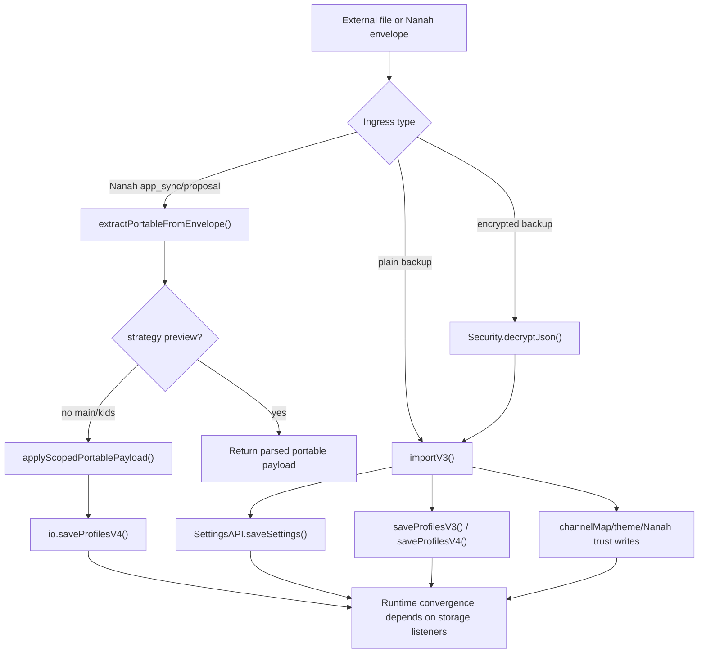
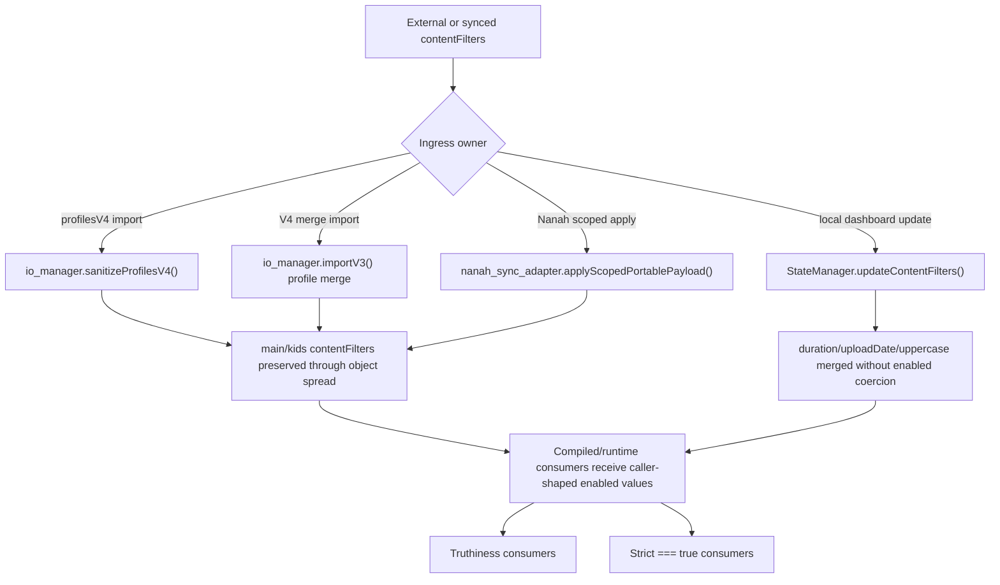

# FilterTube Import Export Nanah Authority Audit - 2026-05-18

Status: current-behavior audit. This is not an implementation patch.

Scope:

- `js/io_manager.js`
- `js/nanah_sync_adapter.js`
- `js/security_manager.js`
- `js/settings_shared.js`
- `js/state_manager.js`
- `js/background.js`
- prior audit fixtures and ignored root capture boundary docs

This slice covers settings data that enters FilterTube from outside the normal
keyword/channel row UI: backup import, encrypted import, BlockTube import,
profile-scoped export/import, Nanah sync envelopes, Nanah control proposals,
trusted Nanah backup state, and automatic backups.

## Current Authority Flow

```text
user file / encrypted file / Nanah envelope
        |
        v
FilterTubeIO.normalizeIncomingV3()
        |
        +--> SettingsAPI.saveSettings()
        +--> saveProfilesV3()
        +--> saveProfilesV4()
        +--> writeStorage(channelMap)
        +--> writeStorage(ftNanahTrustedLinks / ftNanahDeviceId)
        |
        v
background/storage listeners eventually recompile runtime state
```

```text
Nanah main/kids scoped payload
        |
        v
FilterTubeNanahAdapter.applyScopedPortablePayload()
        |
        +--> loadProfilesV4()
        +--> merge or replace profile section
        +--> saveProfilesV4()
        |
        v
no direct background compile/broadcast call in this function
```

## High-Confidence Findings

| Area | Current behavior | Proof | Risk | Required fix gate |
| --- | --- | --- | --- | --- |
| V4 direct writes | `saveProfilesV4()` writes `ftProfilesV4` directly, and invalid input writes `{}` instead of being a no-op or error. | `js/io_manager.js:620-624` | A caller error can still produce a storage write; import/sync writes depend on later listeners for runtime convergence. | `saveProfilesV4` should reject invalid profile state, return an error, and route successful writes through one mutation/broadcast authority. |
| Read-path migration writes | `loadProfilesV4()` can sanitize and write `ftProfilesV4` while the caller thinks it is only reading. | `js/io_manager.js:561-607` | Read/compile/import operations can race active UI saves or generate unexpected profile writes. | Split pure load from explicit migration repair with a migration revision. |
| Import breadth | `importV3()` can call `SettingsAPI.saveSettings()`, `saveProfilesV3()`, `saveProfilesV4()`, `writeStorage(channelMap)`, `SettingsAPI.setThemePreference()`, and Nanah trusted-state writes. | `js/io_manager.js:1241-1726` | One import can alter filtering, profile modes, Kids state, learned maps, theme, and Nanah trust. | Add a dry-run mutation report before any write and require explicit user confirmation per mutation family. |
| V4 sync failures are swallowed | The V4 sync block catches errors and continues returning `{ ok: true }`. | `js/io_manager.js:1507-1678`, `1726` | UI can report import success while active profile/runtime state remains partially stale. | Return partial-failure status with per-write results and require refresh proof. |
| Encrypted target profile drift | `importV3Encrypted()` forwards `strategy`, `scope`, and `auth`, but not `targetProfileId`. | `js/io_manager.js:1759-1770` | Encrypted imports cannot target the same profile path as unencrypted imports. | Encrypted and unencrypted import options must share one typed option object fixture. |
| Scoped Nanah replace sanitization drift | `applyScopedPortablePayload()` uses `safeArray()` for replacement channel arrays and does not run the same channel sanitizer used by IO imports. | `js/nanah_sync_adapter.js:211-257` | A P2P payload can introduce profile section arrays with weaker shape normalization than file import. | Use the same sanitizer for import, Nanah, backup, and UI row writes. |
| Scoped Nanah direct save | Scoped Nanah apply writes profiles through `io.saveProfilesV4()` with no direct background refresh/broadcast call. | `js/nanah_sync_adapter.js:186-277` | Sync may succeed locally but rely on storage listeners that are already known to have key-drift issues. | Return a mutation result that forces one runtime refresh/revision broadcast. |
| Nanah envelope parsing | `extractPortableFromEnvelope()` parses `root.payload` JSON for `app_sync` and `control_proposal` without validating `app`, `payloadVersion`, or proposal action. | `js/nanah_sync_adapter.js:353-368` | A syntactically compatible envelope can reach import/apply logic without a strict FilterTube app/action contract. | Validate app id, payload version, action, scope, and proposal strategy before exposing payload. |
| Preview mode boundary | `applyIncomingEnvelope(..., strategy: "preview")` returns the parsed portable payload without writing. | `js/nanah_sync_adapter.js:371-397` | This is a useful safe path and should become the required default before apply. | Preserve preview fixtures and make apply require a preview-confirmed mutation plan. |
| Trusted Nanah backup state | Full encrypted export can include `nanahState`; import restores it only with `auth.restoreTrustedNanahState === true`. | `js/io_manager.js:1729-1748`, `1691-1723` | Good explicit gate, but it still writes trusted link/device state from backup payload. | Keep explicit opt-in and add shape/provenance/status reporting before restore. |
| Settings key drift | Shared settings keys, background invalidation keys, StateManager reload keys, and runtime compiler dependencies remain different sets. | `js/settings_shared.js:17-56`; `js/background.js:1784-1810`, `4484-4523`; `js/state_manager.js:2356-2405` | Import/Nanah writes can succeed while stale runtime caches miss a changed dependency. | One shared runtime dependency key list imported by background, StateManager, bridge, and settings shared code. |

## Current Safety Baselines

- PIN verification exists before full Default/Master import/export when a local
  or incoming master verifier is present.
- Encrypted backups use PBKDF2 plus AES-GCM through WebCrypto.
- Nanah scoped `preview` returns a parsed payload without applying it.
- Trusted Nanah state restore is opt-in via `auth.restoreTrustedNanahState`.
- Ignored root captures remain raw evidence inputs and are not import/release
  source files.

## External Settings Ingress Snapshot - 2026-05-27

This current-source checkpoint pins the import/export/Nanah ingress paths that
can mutate filtering state outside ordinary keyword/channel row actions. It is
audit-only and does not change runtime behavior.

```text
external payload or sync envelope
        |
        +--> file backup import
        |       + normalizeIncomingV3()
        |       + SettingsAPI.saveSettings()
        |       + saveProfilesV3() / saveProfilesV4()
        |       + channelMap / theme / Nanah trusted-state writes
        |
        +--> encrypted backup import
        |       + Security.decryptJson()
        |       + importV3(... strategy/scope/auth only)
        |
        +--> Nanah scoped apply
                + extractPortableFromEnvelope()
                + preview or apply
                + io.saveProfilesV4()
                + no direct compile/broadcast result
```



| Ingress path | Current source | State families reachable | Audit blocker |
| --- | --- | --- | --- |
| Plain V3/V4 import | `js/io_manager.js:1241-1726` | Settings, Main/Kids profile lists, profile mode, subscriptions, channel maps, theme, and trusted Nanah state. | Needs one dry-run mutation report and per-write result before it can be optimized or dual-list migrated. |
| Encrypted import | `js/io_manager.js:1759-1770` | Same as plain import after decrypt, but the option handoff omits `targetProfileId`. | Encrypted and unencrypted imports need one typed option contract. |
| Full encrypted export with trusted Nanah state | `js/io_manager.js:1729-1748` | Backup payload may include trusted Nanah link/device state only for full encrypted exports. | Trusted state must stay explicit opt-in and provenance-reported. |
| Nanah scoped apply | `js/nanah_sync_adapter.js:186-277` | Main or Kids profile section for the active/target profile. | Needs shared import sanitizer, mutation status, runtime refresh, and revision result. |
| Nanah envelope parsing | `js/nanah_sync_adapter.js:353-397` | `app_sync` and `control_proposal` payloads can enter preview/apply flow. | Needs app id, payload version, action, scope, and proposal policy validation before apply. |
| Background cache convergence | `js/background.js:4484-4523` | Invalidates compiled settings for selected storage keys, then recompiles Main and Kids. | Import/sync convergence still depends on storage-key parity rather than one runtime dependency authority. |
| StateManager external reload | `js/state_manager.js:2356-2405` | Dashboard/tab state reload after local storage changes. | Key list still differs from background and settings-shared lists. |

Current approval state:

```text
external settings ingress mutation authority: NO-GO
Nanah apply promotion authority: NO-GO
dual allow/block migration through import/sync: NO-GO
runtime behavior changed by this addendum: no
```

## Content Filter Ingress Normalization Addendum - 2026-05-27

This continuation connects the import/Nanah ingress boundary to the separate
compiled-settings finding that `contentFilters.*.enabled` is not normalized by
the runtime compilers. It is audit-only and does not change product behavior.

```text
backup / profilesV4 / Nanah scoped data / dashboard update
        |
        +--> sanitizeProfilesV4() preserves profile main/kids extra fields
        +--> importV3() merges profile main/kids objects
        +--> applyScopedPortablePayload() spreads scoped data into main/kids
        +--> StateManager loads or updates contentFilters
        |
        v
contentFilters duration/uploadDate/uppercase enabled values remain caller-shaped
        |
        +--> seed/filter_logic/selected DOM effects read truthy values
        +--> injector/bridge/DOM lifecycle require enabled === true
```



| Row | Current source | Proof | Risk | Required fix gate |
| --- | --- | --- | --- | --- |
| V4 profile sanitizer pass-through | `js/io_manager.js:627-706` | `sanitizeProfilesV4()` sanitizes keyword/channel lists but spreads `main` and `kids`, so `contentFilters` is preserved if present and no nested `enabled` coercion helper exists in the block. | Imported `profilesV4` can carry truthy non-boolean content-filter flags into runtime state. | One shared content-filter schema sanitizer used by import, Nanah, StateManager, and compiler entrypoints. |
| Plain import V4 merge pass-through | `js/io_manager.js:1511-1675` | `importV3()` uses `sanitizeProfilesV4()` and merges `...incMain`, `...incKids`, `...targetMain`, and `...targetKids` while only rebuilding list fields. | Merge/replace imports can preserve caller-shaped content-filter subobjects without a mutation report. | Import dry-run must include content-filter field normalization and conflict reporting. |
| Nanah scoped apply pass-through | `js/nanah_sync_adapter.js:186-270` | Main and Kids scoped apply spread `...data` into the target section and then save profiles; no content-filter-specific sanitizer or boolean coercion is called. | P2P sync can introduce content-filter enabled-shape drift through a weaker ingress than UI row actions. | Nanah apply must use the same portable schema validator as file import. |
| Main state load pass-through | `js/state_manager.js:250-254` | Main `contentFilters` is loaded through `JSON.parse(JSON.stringify(data.contentFilters))` or defaults, with no post-load boolean normalization. | Legacy/local storage can keep non-boolean enabled values alive across reloads. | State load should either normalize nested fields or mark caller-shaped values as explicit current behavior. |
| Kids V4/V3 state load pass-through | `js/state_manager.js:380-399`, `js/state_manager.js:444-463` | Kids `contentFilters` is cloned, overlaid onto defaults, and copied by subobject spread; `enabled` is not coerced. | Kids content-filter behavior can diverge from Main/category filters after import or sync. | Main and Kids content-filter load paths need one shared normalizer. |
| Local content-filter update pass-through | `js/state_manager.js:2147-2175` | Main and Kids update methods merge duration/uploadDate/uppercase subobjects directly from `nextContentFilters`. | Dashboard writes and external callers can persist non-boolean `enabled` values that consumers interpret differently. | UI/state mutation contract must define boolean coercion before JSON-first predicate consolidation. |
| Category filter contrast | `js/state_manager.js:262-268`, `js/state_manager.js:403-408`, `js/state_manager.js:2194-2228` | Category filters explicitly set `enabled: loaded.enabled === true` and `enabled: nextCategoryFilters.enabled === true`. | The codebase already has a stricter local pattern, so content-filter pass-through is an inconsistency, not a universal style. | Decide whether content filters intentionally allow truthy values or should match category filter strictness. |
| Runtime predicate impact | `docs/audit/FILTERTUBE_COMPILED_SETTINGS_FIELD_REGISTER_CURRENT_BEHAVIOR_2026-05-22.md` | The compiled-settings addendum proves compiler pass-through plus truthy/strict consumer split. | Import/sync can feed the predicate drift that made JSON-first no-work gates fragile. | JSON-first predicate merge remains blocked until ingress and compiler normalization share one authority. |

Current approval state:

```text
content-filter ingress normalization rows: 8
content-filter state load deep enabled coercion: absent
content-filter state update deep enabled coercion: absent
category filter enabled coercion contrast: present
import/sync content-filter schema authority: NO-GO
JSON-first predicate merge approval from ingress addendum: NO-GO
runtime behavior changed by ingress addendum: no
```

## Why This Matters For Simultaneous Allow And Block

The proposed future model has both blocked and allowed entries active at the
same time. That is a schema and behavior change. Before that work starts, every
external settings ingress path must have a single answer for:

```text
incoming payload
  |
  +--> which profile?
  +--> which viewing space? main/kids
  +--> which list family? block/allow
  +--> merge, replace, preview, or reject?
  +--> which runtime revision should apply it?
  +--> which UI should show the mutation to the user?
```

Today, imports and Nanah sync can reach `ftProfilesV4` through paths that do not
share one mutation contract with popup/dashboard row actions. That is manageable
for the current either-or list mode, but it becomes a migration risk for a
dual-list model unless fixed behind fixtures first.

## Future Contract

Required before implementation changes:

1. One portable schema validator for file import, encrypted import, Nanah
   `app_sync`, and Nanah `control_proposal`.
2. One dry-run mutation report:

```text
profile: default
surface: main
strategy: merge
changes:
  - add blocked keyword: "spoiler"
  - add allowed channel: "@trusted"
  - change main mode: blocklist -> dual-list
runtime:
  revision: next
  refresh: required
```

3. One canonical V4 list shape. Legacy aliases must be migrated or ignored with
   explicit conflict rules.
4. Import/Nanah apply must return per-write status and cannot report full
   success after V4/profile persistence failure.
5. Background must own the background compiled settings revision after import/sync.
6. Encrypted and unencrypted imports must accept the same target profile/scope
   option contract.
7. Raw ignored root captures can inform fixtures, but only reduced minimal
   fixtures should be committed.

## Runnable Proof

Executable current-behavior fixtures are in:

- `tests/runtime/import-export-nanah-authority-current-behavior.test.mjs`

## Method Semantic Proof Gap Boundary

`docs/audit/FILTERTUBE_METHOD_SEMANTIC_PROOF_GAP_INDEX_CURRENT_BEHAVIOR_2026-05-25.md`
is a required source input before this backup/import/Nanah/vendor surface can
support runtime optimization. Current proof pins:

```text
method semantic proof gap files covered: 69
method semantic proof gap lexical callables covered: 5673
files with complete per-callable semantic proof: 0
lexical callables requiring semantic proof before behavior changes: 5673
affected callable semantic proof: NO-GO
runtime behavior changed: no
```

These counts are audit-only blockers. They do not approve runtime
optimization, JSON-first behavior, backup/export behavior, import behavior,
Nanah sync behavior, vendor runtime behavior, whitelist behavior, metric
collectors, artifact creation, native sync, release package changes, or public
claims.
