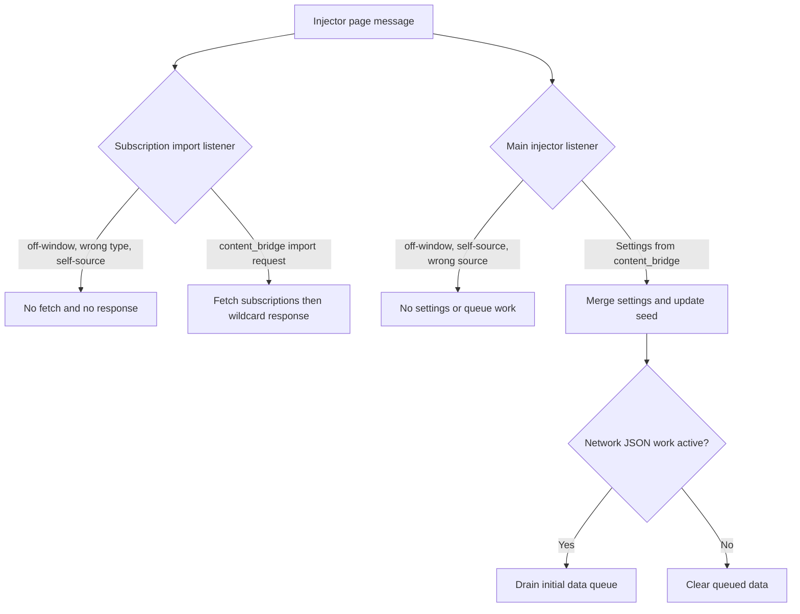

# FilterTube Injector Main-World Message Dispatch Boundary - Current Behavior Audit (2026-05-23)

Status: audit-only.

Runtime behavior is unchanged. This is not an implementation patch.

This slice narrows the page-message and injector-method audits to the two
main-world message listeners in `js/injector.js`. It records the current
dispatch surface that receives settings, subscription import requests,
collaborator cache updates, and isolated-world channel/collaborator lookups.

runtime injector main-world message dispatch fixtures: 8
injector dispatch executable ingress rows: 8
injector dispatch executable behavior changed: no
injector dispatch executable approval: NO-GO

## Evidence Inputs

- `js/injector.js`
  - lines: 3593
  - bytes: 155830
  - sha256: `634041581ec84db2edd4f07d46f4bfb9d3a7d97036a0fb83db7739856bdc3e04`

## Selected Source Metrics

- subscription handler lines: 46
- subscription handler bytes: 1795
- install block lines: 7
- install block bytes: 355
- main listener block lines: 124
- main listener block bytes: 5524
- selected addEventListener tokens: 2
- selected removeEventListener tokens: 0
- selected postMessage tokens: 3
- selected wildcard postMessage target tokens: 3
- selected event.source window guards: 2
- selected source injector self-guards: 2
- selected source content_bridge gates: 4
- selected source filter_logic gates: 1
- selected event.origin tokens: 0
- selected nonce tokens: 0
- selected capability tokens: 0
- selected revision tokens: 0
- selected requestId tokens: 9
- selected currentSettings tokens: 3
- selected updateSeedSettings tokens: 1
- selected processInitialDataQueue tokens: 1
- selected collaboratorCache tokens: 1
- selected searchYtInitialDataForCollaborators tokens: 1
- selected searchYtInitialDataForVideoChannel tokens: 1
- selected fetchSubscribedChannelsFromYoutubei tokens: 1
- selected setTimeout tokens: 0
- selected clearTimeout tokens: 0
- selected return statements: 7
- selected settingsReceived tokens: 1

## Current Message Inventory

The selected injector dispatch surface currently accepts these message types:

- `FilterTube_RequestSubscriptionImport`
- `FilterTube_SettingsToInjector`
- `FilterTube_CacheCollaboratorInfo`
- `FilterTube_RequestCollaboratorInfo`
- `FilterTube_RequestChannelInfo`

The subscription import handler is installed before the duplicate-run guard. It
uses `window.__filtertubeSubscriptionsImportListenerInstalled` to avoid attaching
the same named listener twice, then announces bridge readiness with a wildcard
`postMessage`.

The later anonymous message listener ignores only messages labelled
`source === 'injector'`, then accepts selected string source labels:
`source === 'content_bridge'` for settings and lookup requests, and
`source === 'filter_logic'` for collaborator cache updates.

No `event.origin`, nonce, capability token, sender capability, settings revision,
route, host, profile, list-mode, or active-rule reason check exists in these
selected listener blocks today.

## Current Side-Effect Classes

| Message class | Current side effects | Current ownership gap |
|---|---|---|
| Subscription import request | `FilterTube_RequestSubscriptionImport` with `source: 'content_bridge'` calls `fetchSubscribedChannelsFromYoutubei(requestId, payload || {})`, then posts `FilterTube_SubscriptionsImportResponse` with wildcard target. | Request id is present, but no action token, sender capability, route/profile gate, or fetch budget artifact is attached at dispatch time. |
| Settings relay | `FilterTube_SettingsToInjector` merges caller payload into `currentSettings`, sets `settingsReceived = true`, calls `updateSeedSettings()`, and drains `processInitialDataQueue()`. | Payload is not revision-checked before seed update or queued data replay. |
| Collaborator cache update | `FilterTube_CacheCollaboratorInfo` from `source: 'filter_logic'` caches collaborators with local quality comparison. | Cache mutation uses a string source label without sender capability or cache provenance. |
| Collaborator lookup | `FilterTube_RequestCollaboratorInfo` from `content_bridge` checks `collaboratorCache`, searches `ytInitialData`, and posts `FilterTube_CollaboratorInfoResponse` with wildcard target. | Lookup request id is a response correlation field, not an active-rule or sender-capability proof. |
| Channel lookup | `FilterTube_RequestChannelInfo` from `content_bridge` searches `ytInitialData` and related snapshot state, then posts `FilterTube_ChannelInfoResponse` with wildcard target. | Lookup can read page-global JSON state without a route/profile/list-mode authority record. |

## Injector Message Ingress Executable Continuation - 2026-05-28

The current test now executes the real subscription import handler, install
guard, and anonymous injector `message` listener source slices in a VM harness.
This is audit-only executable proof, not a runtime patch.

```text
subscription import listener install
        |
        v
first install adds listener and announces readiness
repeat install announces readiness but does not add another listener

off-window / wrong-type / injector-source subscription request
        |
        v
return before fetch and wildcard response

same-window FilterTube_RequestSubscriptionImport from content_bridge
        |
        v
fetchSubscribedChannelsFromYoutubei(requestId, payload) -> wildcard response

off-window / injector-source / wrong-source settings message
        |
        v
return before settings merge, seed update, and queue drain

same-window FilterTube_SettingsToInjector from content_bridge
        |
        v
merge payload -> updateSeedSettings() -> hasNetworkJsonWork() -> processInitialDataQueue()
```



Executable rows pinned:

| Row | Message shape | Current executable result |
|---|---|---|
| 1 | Repeat subscription bridge install | No duplicate message listener is added. |
| 2 | Off-window subscription import request | No subscription fetch, no response. |
| 3 | Same-window wrong-type subscription message | No subscription fetch, no response. |
| 4 | Same-window subscription request from `source: 'injector'` | No subscription fetch, no response. |
| 5 | Same-window subscription request from `source: 'content_bridge'` | Calls `fetchSubscribedChannelsFromYoutubei(requestId, payload)` and posts `FilterTube_SubscriptionsImportResponse` to `'*'`. |
| 6 | Off-window settings message | No settings merge, seed update, or queue drain. |
| 7 | Same-window settings message from wrong/self source | No settings merge, seed update, or queue drain. |
| 8 | Same-window settings message from `source: 'content_bridge'` | Merges payload, sets settings received, calls `updateSeedSettings()`, checks `hasNetworkJsonWork()`, and drains queued data when active. |

This narrows the MAIN-world injector listener no-work proof for noisy SPA
messages: wrong-source and off-window messages do not reach fetch, settings
merge, seed update, or queue-drain effects. The continuation still leaves the
listener model without origin, nonce, sender capability, settings revision,
route, host, profile, list-mode, active-rule reason, fetch budget, or wildcard
postMessage target authority. Injector dispatch changes, subscription import
policy changes, settings revision changes, collaborator cache policy changes,
lookup policy changes, JSON-first promotion, whitelist optimization, metric
artifacts, and first-class injector message dispatch authority remain `NO-GO`.

## Risk Register

- Reliability: settings, seed updates, queue drains, collaborator cache mutation,
  and lookup responses depend on string source labels in one page-message channel.
- False-hide/leak: spoofed or stale collaborator/channel responses can influence
  learned identity and downstream DOM/JSON decisions when the isolated bridge
  accepts the wildcard responses.
- Performance: the dispatch path can trigger subscription import fetch work,
  snapshot searches, seed settings updates, and queued data replay without a
  shared budget artifact.
- Code burden: subscription import is handled by a separate early listener while
  settings and lookups are handled by a later anonymous listener.
- JSON-first readiness: first-class JSON filtering needs a revisioned settings
  path and provenance for page-global JSON lookups before optimizing whitelist or
  no-work behavior.

## Missing Authority

No `injectorMainWorldMessageDispatchContract`,
`injectorPageMessageSenderPolicy`, `injectorPageMessageNonceReport`,
`injectorSettingsMessageRevisionReport`,
`injectorSubscriptionImportDispatchPolicy`,
`injectorSubscriptionImportActionTokenReport`,
`injectorCollaboratorCacheMessagePolicy`,
`injectorLookupRequestCorrelationReport`,
`injectorMainWorldDispatchMetricArtifact`, or
`injectorMainWorldMessageFixtureProvenance` exists in product runtime source yet.

## Boundary

This is not completion proof for injector message trust. It pins current
main-world dispatch behavior so later settings replay, subscription import,
learned identity, whitelist optimization, and first-class JSON filter work do
not accidentally treat source-label page messages as audited implementation
permission.

## Method Semantic Proof Gap Boundary

`docs/audit/FILTERTUBE_METHOD_SEMANTIC_PROOF_GAP_INDEX_CURRENT_BEHAVIOR_2026-05-25.md`
is a required source input before this menu/dialog/injector/quick-block
surface can support runtime optimization. Current proof pins:

```text
method semantic proof gap files covered: 69
method semantic proof gap lexical callables covered: 5797
files with complete per-callable semantic proof: 0
lexical callables requiring semantic proof before behavior changes: 5797
affected callable semantic proof: NO-GO
runtime behavior changed: no
```

These counts are audit-only blockers. They do not approve runtime
optimization, JSON-first behavior, menu action behavior, dialog lifecycle
behavior, injector behavior, quick-block behavior, whitelist behavior, metric
collectors, artifact creation, native sync, release package changes, or public
claims.
