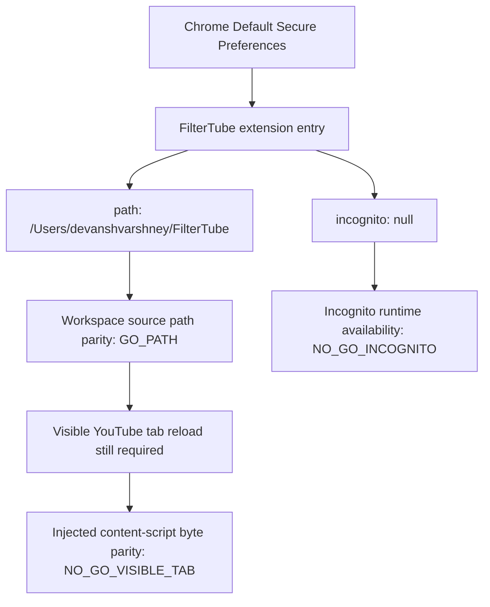

# FilterTube Installed Chrome Unpacked Path Parity Current Behavior - 2026-05-30

Status: audit-only current-state proof. Runtime behavior changed: no.

## Question

The active audit previously kept installed source-byte parity at `NO-GO`
because direct browser navigation to
`chrome-extension://gkgjigdfdccckblmglboobikfcpeelio/js/content_bridge.js`
was blocked by browser policy. This continuation checks Chrome's own Default
profile extension metadata instead of using a browser page probe.

## Evidence

Command:

```sh
/usr/bin/jq -r '.extensions.settings["gkgjigdfdccckblmglboobikfcpeelio"] | {path, from_webstore, location, version: .service_worker_registration_info.version, has_started_service_worker, incognito: .incognito, active_permissions}' "/Users/devanshvarshney/Library/Application Support/Google/Chrome/Default/Secure Preferences"
```

Observed fields:

```json
{
  "path": "/Users/devanshvarshney/FilterTube",
  "from_webstore": false,
  "location": 4,
  "version": "3.3.2",
  "has_started_service_worker": true,
  "incognito": null,
  "active_permissions": {
    "api": [
      "activeTab",
      "downloads",
      "storage",
      "tabs",
      "scripting"
    ],
    "explicit_host": [
      "*://*.youtube-nocookie.com/*",
      "*://*.youtube.com/*",
      "*://*.youtubekids.com/*"
    ],
    "manifest_permissions": [],
    "scriptable_host": [
      "*://*.youtube.com/*",
      "*://*.youtubekids.com/*"
    ]
  }
}
```

Command:

```sh
git rev-parse --show-toplevel
```

Observed output:

```text
/Users/devanshvarshney/FilterTube
```

Command:

```sh
test -d "/Users/devanshvarshney/Library/Application Support/Google/Chrome/Default/Extensions/gkgjigdfdccckblmglboobikfcpeelio"
```

Observed exit status: `1`, so there is no packed CRX copy under the normal
Default-profile `Extensions` directory for this ID.

Command:

```sh
ls -la "/Users/devanshvarshney/Library/Application Support/Google/Chrome/Default/Local Extension Settings/gkgjigdfdccckblmglboobikfcpeelio"
```

Observed: LevelDB state files exist for this ID under Default profile local
extension storage.

## Current Decision

| Row | Current finding | Status |
| --- | --- | --- |
| `installed_default_profile_unpacked_path` | Chrome Default profile extension metadata points `gkgjigdfdccckblmglboobikfcpeelio` at `/Users/devanshvarshney/FilterTube`. | `GO_PATH` |
| `workspace_path_match` | The repository root is also `/Users/devanshvarshney/FilterTube`. | `GO_PATH` |
| `packed_copy_exclusion` | No CRX-style installed copy exists under `Default/Extensions/gkgjigdfdccckblmglboobikfcpeelio`. | `GO_PATH` |
| `default_profile_storage_presence` | Chrome has Default-profile local extension storage for this ID. | `GO_STORAGE` |
| `incognito_runtime_availability` | Secure Preferences does not carry `"incognito": true` for this extension entry; observed value is `null`. | `NO_GO_INCOGNITO` |
| `already_open_tab_injected_byte_parity` | This filesystem/profile proof does not prove an already-open YouTube tab has reloaded latest content-script bytes after workspace edits. | `NO_GO_VISIBLE_TAB` |
| `live_kully_gussy_negative_fixture` | This proof does not inspect a live `Kully B & Gussy G - Topic` card in the installed visible tab. | `NO_GO_LIVE_FIXTURE` |

## Risk Boundary

The old "installed source byte parity: NOT_PROVED" status was too broad for the
Default profile. For this Chrome profile, the extension is unpacked and points
directly at the current workspace. That proves the installed extension's source
path owner, not the currently injected bytes in an already-open YouTube document.

The remaining release-relevant distinction is reload state:

```text
Chrome Default Secure Preferences
  -> extension id gkgjigdfdccckblmglboobikfcpeelio
  -> path /Users/devanshvarshney/FilterTube
  -> workspace source path owner proved
  -> already-open YouTube tab injection freshness not proved
```



## Release Meaning

This closes the narrow question "is the Default-profile installed extension
loading from a different packaged copy?" with `GO_PATH`.

It does not close:

- installed visible-tab injected byte parity
- stale already-open tab cache cleanup
- live `Kully B & Gussy G - Topic` negative card proof
- incognito runtime availability
- release/public claim use
- broad audit completion
