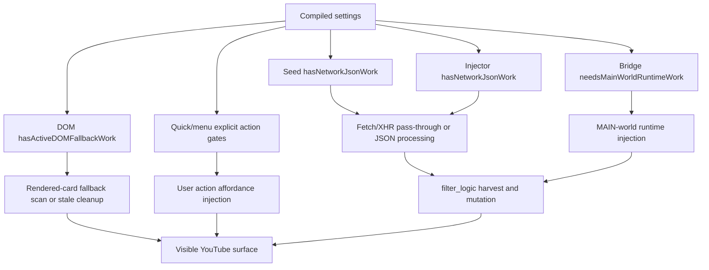
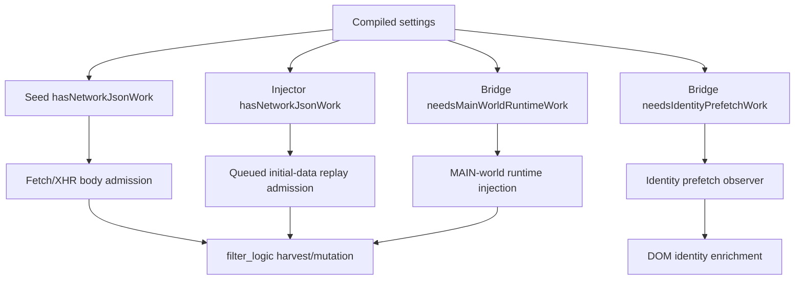
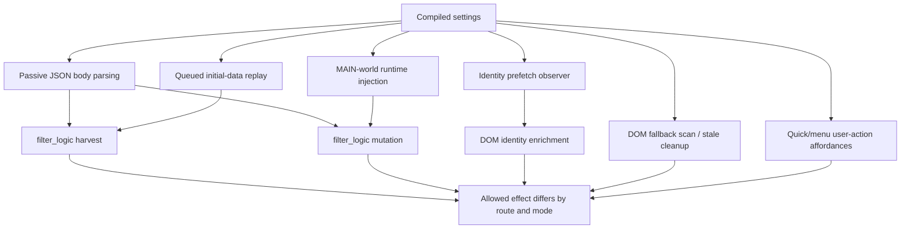
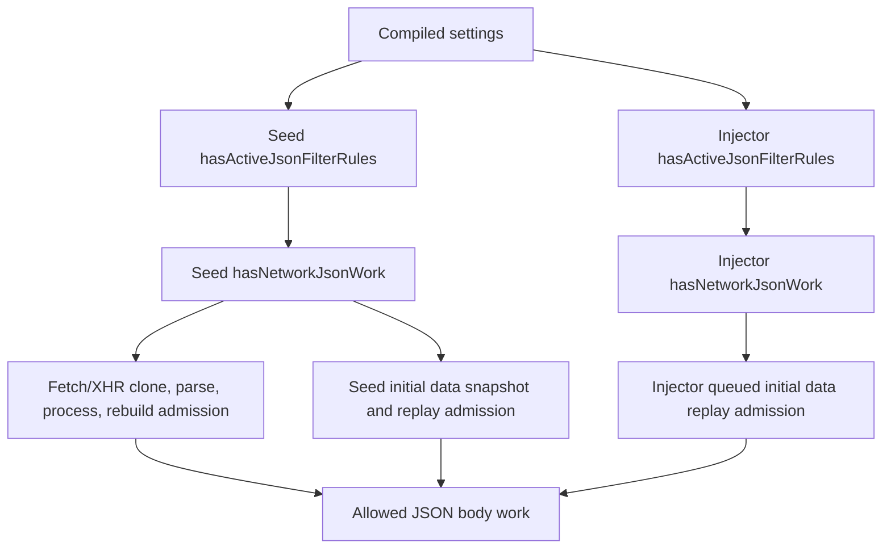

# FilterTube JSON-First Active Work Predicate Register - Current Behavior - 2026-05-22

Status: current-behavior register with 2026-05-25 SPA drag optimization addendum.
Runtime behavior changed only for quick-block and fallback-menu lifecycle
scheduling; this remains not completion proof or permission to make
first-class JSON filter behavior changes.

## Purpose

This register keeps the codebase inspection aligned with the optimization goal:
before JSON can become a first-class filter path, the code must prove when work
is allowed and when it should be a no-work pass-through.

The current boundary is:

```text
JSON-first filtering cannot be promoted by adding renderer paths alone.
Endpoint parsing, engine harvest, engine mutation, DOM fallback, fallback menu
repair, quick-block lifecycle, and category metadata fetches currently use
separate active-work predicates.
```

## Source Scope

| Source | Lines | Bytes | SHA-256 |
| --- | ---: | ---: | --- |
| `js/seed.js` | 1136 | 50026 | `a9d86cd973b998ffbd58faf316ca679267ce7267af36969683f32b760f49054d` |
| `js/filter_logic.js` | 3652 | 172174 | `953ef0f14970e6cfbc11215fe9eaa078ced34f001908e1c6d5903a8fd2d9a1f5` |
| `js/content/dom_fallback.js` | 4838 | 228332 | `2129fcc16f8ad1420a6cb44905ddcd0b68d5511f3b647e2db100c0d67d492aef` |
| `js/content/block_channel.js` | 3175 | 127396 | `1b6fffa249a746c01686df0d6a05dc4b770a6f0c5ded08b78a7043c11e9cdd83` |
| `js/content_bridge.js` | 13571 | 601694 | `1dafb0bf979d391d2a3be827700e39114bc02b839cd26ddc8635a1127a0327b3` |

Related proof layers:

- `docs/audit/FILTERTUBE_JSON_FIRST_FILTER_READINESS_GATE_CURRENT_BEHAVIOR_2026-05-21.md`
- `docs/audit/FILTERTUBE_JSON_FIRST_NO_WORK_OPTIMIZATION_CROSSWALK_CURRENT_BEHAVIOR_2026-05-21.md`
- `docs/audit/FILTERTUBE_JSON_FIRST_IMPLEMENTATION_LOCUS_REGISTER_CURRENT_BEHAVIOR_2026-05-21.md`
- `docs/audit/FILTERTUBE_COMPILED_SETTINGS_FIELD_REGISTER_CURRENT_BEHAVIOR_2026-05-22.md`
- `docs/audit/FILTERTUBE_SETTINGS_REFRESH_KEY_PARITY_REGISTER_CURRENT_BEHAVIOR_2026-05-22.md`

## Current Counts

```text
source files with active-work predicates: 5
current predicate anchors: 11
endpoint interceptor key sets: 2
interceptor endpoint entries per set: 5
seed content-filter active branches: 3
seed JSON active-rule branches: 6
seed skip route classes: 3
processWithEngine work classes: 4
DOM fallback active trigger total: 36
DOM fallback boolean keys: 28
fallback menu warmup scans: 8
fallback menu warmup interval ms: 1500
quick-block setup delay ms: 1000
quick-block periodic timer ms: none
runtime behavior changed: yes; quick-block periodic sweep removed and fallback-menu mutation repair scoped
not completion proof for JSON-first work authority
```

## Predicate Inventory

| Predicate owner | Source anchor | Current active/no-work inputs | Current work effect | Missing proof before first-class JSON filter behavior |
| --- | --- | --- | --- | --- |
| Seed JSON no-work predicate | `js/seed.js:263` `shouldSkipEngineProcessing()` | Path route, whitelist/blocklist mode, named content-filter helper, named active-rule helper, search/channel/home continuation shape. | Allows harvest-only skips for selected search, channel, and desktop home browse cases when blocklist mode has no active content or JSON rules. | One route/endpoint/list-mode active-work decision that distinguishes JSON mutation, harvest-only, DOM fallback, and pass-through. |
| Seed work dispatcher | `js/seed.js:383` `processWithEngine()` | Missing settings, network JSON work helper, disabled settings, skip predicate, engine availability. | Queues missing-settings data, returns no-active-work/disabled data, runs harvest-only for skip cases, or calls `FilterTubeEngine.processData()`. | A work report that proves parse, queue, harvest, mutation, and response rebuild budgets per endpoint. |
| Seed fetch endpoint predicate | `js/seed.js:666` `setupFetchInterception()` | 5 endpoint substrings plus `shouldBypassYouTubeiNetworkResponse()` before clone parsing. | Matching endpoints now return original fetch before clone/parse/stringify when there is no active JSON work; active paths still parse, process, and rebuild. | Endpoint pass-through proof that can avoid body work when no JSON or harvest work is allowed. |
| Seed XHR endpoint predicate | `js/seed.js:757` `setupXhrInterception()` | The same 5 endpoint substrings plus XHR ready-state/load wrapping and `shouldBypassYouTubeiNetworkResponse()` before response parsing. | Marks matching requests in `open()`/`send()` and wraps listeners; no-active-work responses return before JSON parse/rewrite, while active paths can override `response` and `responseText`. | XHR parity proof for mark/wrap/listener work even when processing is later skipped. |
| Filter engine mutation predicate | `js/filter_logic.js:3588` `processData()` | Data existence and `this.settings.enabled === false` after harvest. | Harvests channel data before the disabled-filtering skip, then recursively filters and counts blocked renderers when enabled. | A harvest-versus-mutation decision so disabled and no-rule states can be optimized without losing map learning. |
| DOM fallback active predicate | `js/content/dom_fallback.js:1933` `hasActiveDOMFallbackWork()` | Global enabled, whitelist mode, 3 list arrays, 28 boolean keys, 3 strict content-filter flags, and selected category values. | Returns active work for whitelist mode, broad booleans, strict content-filter flags, and selected category values before route-specific proof. | A DOM active-work report with duration/date value validity, route, selector owner, and negative sibling-visible proof. |
| DOM category metadata predicate | `js/content/dom_fallback.js:2487` category metadata branch | Category enabled plus `selected.length > 0`, card video id, missing `videoMetaMap[videoId].category`, and `scheduleVideoMetaFetch()`. | Schedules metadata fetches and marks pending category metadata for allow mode or home/search. | Category selected-value and network-budget proof shared with JSON category filtering. |
| Content bridge DOM fallback lifecycle | `js/content_bridge.js:6088` `initializeDOMFallback()` | Settings existence after a 1000 ms delay and native-overlay quiet checks inside scheduled work. | Calls `applyDOMFallback()`, installs fallback menu work, mutation observer, requestAnimationFrame/setTimeout reprocess paths, prefetch hooks, and whitelist pending timers. | A lifecycle budget proving which work remains necessary when JSON endpoint filtering is active. |
| Content bridge fallback menu lifecycle | `js/content_bridge.js:6489` `ensureFallbackMenuButtons()` | One install flag, native-overlay quiet checks, menu scan state, navigation/click/scroll events, and 8 warmup scans. | Installs style, observer, DOMContentLoaded, `yt-navigate-finish`, click, scroll, requestAnimationFrame, timeout, and interval work; menu item injection later checks whitelist and `showBlockMenuItem`. | A separate explicit-user-action budget so menu affordance repair is not confused with passive JSON filtering work. |
| Quick-block action predicate | `js/content/block_channel.js:1205` `isQuickBlockEnabled()` | Settings object, global `enabled !== false`, `showQuickBlockButton === true`, and `listMode !== 'whitelist'`. | Gates button sweep/insertion and now also rejects globally disabled settings. | A quick-block action fixture matrix for disabled, whitelist, enabled blocklist, desktop, and mobile surfaces. |
| Quick-block lifecycle predicate | `js/content/block_channel.js:1979` and `js/content/block_channel.js:3174` | One observer-started flag, `isQuickBlockEnabled()` setup entry guard, and a fixed 1000 ms startup timer. | The startup timer still calls setup, but disabled quick-block exits before styles, focus listeners, mutation observer, and route/mutation-scoped sweeps. Per-card insertion later calls the same action predicate. | A lifecycle setup budget proving whether observer/timer work is allowed before the action predicate is true. |

## Source-Derived Predicate Rows

```text
fetchEndpoints(5): /youtubei/v1/search,/youtubei/v1/guide,/youtubei/v1/browse,/youtubei/v1/next,/youtubei/v1/player
xhrEndpoints(5): /youtubei/v1/search,/youtubei/v1/guide,/youtubei/v1/browse,/youtubei/v1/next,/youtubei/v1/player
seedContentFilterBranches(3): duration.enabled,uploadDate.enabled,uppercase.enabled
seedJsonActiveRuleBranches(6): filterKeywords,filterChannels,filterKeywordsComments,hideAllComments,hideAllShorts,categoryFilters.selected
seedSkipRouteClasses(3): search-results,channel-page,desktop-home-browse
processWithEngineWorkClasses(4): missing-settings-queue,disabled-pass-through,harvest-only,processData-filter
domFallbackActiveTriggers(36): whitelist-mode,filterKeywords,filterChannels,filterKeywordsComments,hideAllComments,hideAllShorts,hideShorts,hideComments,filterComments,hideHomeFeed,hideSponsoredCards,hideWatchPlaylistPanel,hidePlaylistCards,hideMembersOnly,hideMixPlaylists,hideVideoSidebar,hideRecommended,hideLiveChat,hideVideoInfo,hideVideoButtonsBar,hideAskButton,hideVideoChannelRow,hideVideoDescription,hideMerchTicketsOffers,hideEndscreenVideowall,hideEndscreenCards,hideTopHeader,hideNotificationBell,hideExploreTrending,hideMoreFromYouTube,hideSubscriptions,hideSearchShelves,duration.enabled,uploadDate.enabled,uppercase.enabled,categoryFilters.selected
domFallbackBooleanKeys(28): hideAllComments,hideAllShorts,hideShorts,hideComments,filterComments,hideHomeFeed,hideSponsoredCards,hideWatchPlaylistPanel,hidePlaylistCards,hideMembersOnly,hideMixPlaylists,hideVideoSidebar,hideRecommended,hideLiveChat,hideVideoInfo,hideVideoButtonsBar,hideAskButton,hideVideoChannelRow,hideVideoDescription,hideMerchTicketsOffers,hideEndscreenVideowall,hideEndscreenCards,hideTopHeader,hideNotificationBell,hideExploreTrending,hideMoreFromYouTube,hideSubscriptions,hideSearchShelves
quickBlockActionGateBranches(3): enabled-not-false,showQuickBlockButton,listMode-not-whitelist
```

## Current Predicate Mismatches

- Seed fetch interception now checks `shouldBypassYouTubeiNetworkResponse()` before response clone parsing, so no-active JSON work can pass through before clone/parse/stringify.
- Seed XHR interception can still mark endpoint-like requests, but active-work bypass runs before response JSON parse.
- `hasActiveJsonFilterRules()` requires selected category values before category JSON work is active.
- `hasActiveDOMFallbackWork()` now requires selected category values before
  category DOM fallback work is active, matching the DOM category metadata
  branch's `selected.length > 0` gate.
- `hasActiveDOMFallbackWork()` treats whitelist mode as active work even when
  no whitelist arrays are separately proven active.
- `FilterTubeEngine.processData()` harvests channel data before its disabled
  setting check, so disabled mode is not equivalent to "no engine work" when
  the engine is called directly.
- `initializeDOMFallback()` installs lifecycle work after settings exist even
  though `applyDOMFallback()` can later return early when no active fallback
  work is detected.
- Fallback menu lifecycle work is installed separately from the later
  `showBlockMenuItem` and whitelist checks inside menu item injection.
- `isQuickBlockEnabled()` includes the global enabled flag and gates action insertion.
- `setupQuickBlockObserver()` starts from a fixed timer but now exits before style/listener/observer setup when quick-block is disabled.

## Active-Work Predicate Drift Addendum - 2026-05-27

This addendum is audit-only. It records the current post-lag-fix drift between
active-work predicates that look related but do not yet share one runtime
authority. It does not approve predicate merging, JSON-first promotion, DOM
fallback deletion, quick/menu lifecycle changes, or whitelist behavior changes.

```text
compiled settings
  -> seed JSON predicate
  -> injector JSON predicate
  -> bridge MAIN-world injection predicate
  -> DOM fallback predicate
  -> quick-block/menu action predicates
  -> filter_logic renderer mutation predicate
```



| Predicate family | Source pins | Current drift | Missing proof before optimization |
| --- | --- | --- | --- |
| Seed JSON active work | `js/seed.js:202-238`, `js/seed.js:253-260`, `js/seed.js:383-430` | Whitelist is always active; blocklist requires selected category values for JSON category work; no-active work returns before engine processing. | Shared predicate authority with transport, harvest, mutation, and DOM fallback decisions. |
| Injector JSON active work | `js/injector.js:153-188`, `js/injector.js:1940-1944`, `js/injector.js:3405-3437` | Mirrors the seed helper shape but lives separately and clears queued initial data through its own path. | Drift proof that seed and injector cannot disagree after settings refresh, profile switch, import, or sync. |
| Bridge MAIN-world and identity work | `js/content_bridge.js:1008-1065`, `js/content_bridge.js:1067-1074` | MAIN-world injection uses JSON/content/category work, while identity prefetch also wakes for whitelist or channel rows. | One bridge decision report that separates JSON mutation need from identity prefetch need. |
| DOM fallback lifecycle work | `js/content/dom_fallback.js:1933-1999`, `js/content/dom_fallback.js:2035-2088`, `js/content_bridge.js:6356-6365` | DOM fallback treats whitelist as active work and can run stale cleanup when no active fallback work exists; bridge lifecycle delegates to the DOM helper when available. | Route/surface selector budget proving scan, stale cleanup, and pending-hide ownership separately from JSON. |
| Quick-block action and rule context | `js/content/block_channel.js:1205-1289`, `js/content/block_channel.js:1979-2028` | Quick-block affordance is allowed for enabled blocklist mode even with empty lists, but its rule-context helper treats empty blocklist as no active rule context. | Explicit action-vs-passive-work matrix so first-rule affordance stays available without passive scans. |
| Native/fallback menu action gate | `js/content_bridge.js:10673-10685` | Menu item injection exits in whitelist mode or when `showBlockMenuItem === false`, separate from JSON and DOM active-work predicates. | User-action lifecycle budget for native menu repair, outside-close behavior, and add-rule side effects. |
| Filter engine mutation gate | `js/filter_logic.js:1957-2261`, `js/filter_logic.js:3588-3619` | `processData()` harvests before disabled no-mutation return, and `_shouldBlock()` owns supported renderer mutation after transport admission. | Harvest-versus-mutation decision report plus unsupported-renderer and sibling-visible fixtures. |

Current drift invariant:

```text
the predicates are intentionally not equivalent today:
  seed/injector decide JSON body work
  bridge decides MAIN-world runtime and identity prefetch work
  DOM fallback decides rendered-card scan and stale cleanup work
  quick/menu decide explicit user-action affordances
  filter_logic decides supported renderer harvest and mutation
```

```text
active-work predicate drift proof slices: 7
active-work predicate source proof: PARTIAL
shared active-work authority: NO-GO
predicate merge optimization authority: NO-GO
JSON-first active-work promotion authority: NO-GO
runtime behavior changed by this addendum: no
```

Future optimization must introduce one report that names the owner, predicate,
settings revision, route, surface, list mode, action type, and work class before
any of these predicates are merged, removed, or treated as interchangeable.

## Seed/Injector/Bridge Predicate Parity Addendum - 2026-05-27

This addendum is audit-only. It records the current duplicated JSON body-work
admission shape across seed, injector, and the content bridge before any
JSON-first predicate is promoted into a shared runtime contract.

```text
compiled settings
  |
  +--> seed hasNetworkJsonWork(settings)
  |       contentFilters.*.enabled must be === true
  |       whitelist mode is active JSON work
  |
  +--> injector hasNetworkJsonWork(settings)
  |       contentFilters.*.enabled must be === true
  |       whitelist mode is active JSON work
  |
  +--> bridge needsMainWorldRuntimeWork(settings)
  |       contentFilters.*.enabled must be === true
  |       whitelist mode is active MAIN-world work
  |
  +--> bridge needsIdentityPrefetchWork(settings)
          whitelist mode or channel rows wake identity work
```



| Predicate parity row | Source pins | Current behavior | Risk before first-class JSON promotion |
| --- | --- | --- | --- |
| `json_predicate_seed_content_strict` | `js/seed.js:202-210` | Seed now requires each content-filter `enabled` value to be exactly `true`, matching injector and bridge body-work admission. | This narrows malformed/imported truthy values out of seed JSON body work, but settings/schema ownership is still separate from predicate ownership. |
| `json_predicate_injector_content_strict` | `js/injector.js:153-164` | Injector requires each content-filter `enabled` value to be exactly `true`. | Seed/injector drift can make fetch/XHR admission and queued replay admission disagree if non-boolean values survive compilation. |
| `json_predicate_bridge_content_strict` | `js/content_bridge.js:1023-1034` | Bridge MAIN-world admission also requires each content-filter `enabled` value to be exactly `true`. | Bridge still owns MAIN-world runtime work separately from seed transport admission. |
| `json_predicate_shared_rule_fields` | `js/seed.js:219-230`; `js/injector.js:171-182`; `js/content_bridge.js:1036-1047` | The three JSON-work predicates share the same six rule branches: keywords, channels, comment keywords, hide-all comments, hide-all Shorts, and selected categories. | Shared names are not shared authority; every predicate is still hand-maintained. |
| `json_predicate_whitelist_always_active` | `js/seed.js:236`; `js/injector.js:187`; `js/content_bridge.js:1054` | Whitelist mode wakes JSON or MAIN-world work even before a per-route whitelist effect is proven. | Whitelist remains the highest-risk performance mode until route/surface no-work budgets exist. |
| `json_predicate_identity_prefetch_extra` | `js/content_bridge.js:1008-1014` | Identity prefetch wakes for whitelist or channel rows, even when JSON mutation work is not the only reason. | Identity prefetch must stay separate from JSON mutation ownership. |
| `json_predicate_dom_fallback_not_json` | `js/content/dom_fallback.js:1933-1999` | DOM fallback has its own active-work predicate and selected-category behavior. | DOM scan/stale cleanup cannot be deleted merely because JSON body predicates look inactive. |

Current parity status:

```text
seed/injector/bridge predicate parity rows: 7
shared JSON rule branch names: 6
content-filter enabled strictness mismatch rows: 0
seed malformed truthy content-filter JSON admission: no-work
whitelist-active JSON predicate families: 3
identity-prefetch non-JSON branch: present
DOM fallback separate active-work predicate: present
shared predicate authority: NO-GO
JSON-first predicate merge optimization authority: NO-GO
runtime behavior changed by parity addendum: yes; seed content-filter admission is now strict boolean
```

The immediate optimization lesson is narrow: a future JSON-first owner should
not merely copy one of these helpers. It needs one normalized decision record
that says whether the work class is passive body parsing, queued replay,
MAIN-world injection, identity prefetch, DOM fallback scan, menu action repair,
or quick-block user affordance work.

## Work-Class Decision Linkage - 2026-05-30

This continuation is audit-only. It links the predicate drift rows to the
release question: how can JSON become a first-class filter without making
YouTube slow again or breaking blocklist/whitelist behavior?

Current source-backed answer: a boolean "active work" answer is not enough.
The runtime currently has different work classes with different allowed effects.

```text
settings/profile/list mode
  -> passive JSON body parsing
  -> queued initial-data replay
  -> MAIN-world runtime injection
  -> identity prefetch observer
  -> filter_logic harvest
  -> filter_logic mutation
  -> DOM fallback scan and stale cleanup
  -> explicit quick/menu user-action affordances
```



Work-class rows:

| Work class | Current source owners | Current allowed effect | Why it cannot be merged by boolean predicate |
| --- | --- | --- | --- |
| `passive_json_body_parsing` | `js/seed.js`, `js/injector.js` | May parse/process/rebuild only when JSON work is active. | Empty/no-rule performance depends on passing through before clone/parse/stringify. |
| `queued_initial_data_replay` | `js/seed.js`, `js/injector.js` | Replays page-global snapshots through installed setters when settings arrive or update. | Replay can duplicate work after SPA/profile changes unless revision and route are explicit. |
| `main_world_runtime_injection` | `js/content_bridge.js` | Injects page-world runtime only when JSON/content/category work exists. | Injection is not the same as mutating every endpoint response. |
| `identity_prefetch_observer` | `js/content_bridge.js` | Wakes for whitelist or channel rows to improve identity confidence. | Identity enrichment is useful even when JSON mutation is not the allowed effect. |
| `filter_logic_harvest` | `js/filter_logic.js` | Can learn channel/video maps before mutation. | Harvest can be allowed while mutation is forbidden or disabled. |
| `filter_logic_mutation` | `js/filter_logic.js` | Removes supported renderer rows under blocklist/whitelist decisions. | Mutation needs renderer, list-mode, identity, and sibling-visible proof. |
| `dom_fallback_scan_cleanup` | `js/content/dom_fallback.js`, `js/content_bridge.js` | Scans rendered cards, applies/restores hidden markers, and performs stale cleanup. | DOM scan cost and restore ownership are route/surface problems, not JSON body problems. |
| `quick_menu_user_action_affordance` | `js/content/block_channel.js`, `js/content_bridge.js` | Keeps first-rule quick/menu actions available in enabled blocklist mode. | User-action affordances can be allowed even when passive filtering work is inactive. |

Current work-class linkage status:

```text
JSON-first work-class rows: 8
passive body parsing authority: PARTIAL
queued replay authority: PARTIAL
identity prefetch authority: PARTIAL
DOM scan/stale cleanup authority: PARTIAL
quick/menu action affordance authority: PARTIAL
shared work-class decision authority: NO-GO
JSON-first first-class promotion from work-class linkage: NO-GO
runtime behavior changed by this continuation: no
```

Future optimization must introduce one `jsonFirstWorkClassDecisionReport`
before treating these predicates as interchangeable. That report must name the
work class, route, surface, endpoint, profile, list mode, active rule family,
allowed effect, forbidden effect, side-effect budget, no-work counter,
sibling-visible proof, rollback path, and release/public-claim boundary.

## Seed/Injector Network Predicate Parity Addendum - 2026-05-30

This continuation is audit-only. It pins the current source parity between
the two page-world transport predicates that decide whether YouTube JSON body
work is allowed before clone/parse/replay. It does not approve a shared
predicate authority, JSON-first promotion, route-budget merging, DOM fallback
deletion, quick/menu lifecycle changes, or whitelist behavior changes.

```text
compiled settings
  -> seed hasActiveJsonFilterRules(settings)
  -> seed hasNetworkJsonWork(settings)
  -> injector hasActiveJsonFilterRules(settings)
  -> injector hasNetworkJsonWork(settings)
```



Parity scope:

| Row | Source pins | Current source-backed behavior | Boundary kept out of scope |
| --- | --- | --- | --- |
| `seed_active_json_rules` | `js/seed.js:220-232` | Active JSON rules are keywords, channels, comment keywords, hide-all comments, hide-all Shorts, or selected enabled categories. | Does not decide route-specific skip or DOM fallback work. |
| `injector_active_json_rules` | `js/injector.js:171-183` | The same six active-rule branches are present in the injector copy. | Does not prove settings-refresh ordering across every profile/sync source. |
| `seed_network_json_work` | `js/seed.js:234-238` | Missing settings or disabled settings are no-work; whitelist mode is active; otherwise content filters or active JSON rules wake JSON work. | Seed still has route-specific `shouldSkipEngineProcessing()` and harvest-only paths. |
| `injector_network_json_work` | `js/injector.js:185-189` | The injector network predicate has the same branch shape as seed. | Injector does not own fetch/XHR endpoint wrapping. |
| `seed_no_work_consumers` | `js/seed.js:240`, `js/seed.js:253`, `js/seed.js:383`, `js/seed.js:983` | Snapshot capture, fetch/XHR pre-parse bypass, engine dispatch, and settings-update queue clearing all depend on `hasNetworkJsonWork()`. | This is not a live installed-profile smoke proof. |
| `injector_no_work_consumers` | `js/injector.js:1940`, `js/injector.js:3405`, `js/injector.js:3427` | Settings refresh, direct processing, and queued replay clear or pass through when `hasNetworkJsonWork()` is false. | This is not proof that queued replay has a route/revision budget. |
| `seed_only_route_skip` | `js/seed.js:263-360` | Search, channel, and desktop-home browse can still skip mutation or run harvest-only after the shared-shaped network predicate admits work. | This is intentional drift, not predicate parity. |

Current seed/injector network parity status:

```text
seed/injector network predicate source files covered: 2
seed/injector active-rule predicate blocks compared: 2
seed/injector network-work predicate blocks compared: 2
mirrored active-rule branches: 6
mirrored network-work branches: 3
network no-work consumer rows covered: 7
seed-only route skip classes outside parity: 3
seed/injector network predicate parity source proof: PARTIAL
shared seed/injector network predicate authority: NO-GO
promote seed/injector predicate parity to shared authority now: NO-GO
approve JSON-first first-class filtering from predicate parity now: NO-GO
runtime behavior changed by seed/injector network predicate parity addendum: no
```

The release lesson is narrow: seed and injector currently agree on the core
network JSON work branches, but agreement is not authority. A future shared
runtime predicate still needs installed-byte evidence, route/surface budget,
settings revision proof, queued replay limits, and explicit DOM/menu/quick
action separation before it can replace these duplicated helpers.

## Future Proof Shape

A future active-work decision report should contain at least:

```text
sourceOwner
predicateOwner
endpoint
route
surface
profileType
listMode
extensionEnabled
jsonRuleState
domRuleState
contentFilterState
categorySelectedState
whitelistState
quickBlockState
menuActionState
settingsRevision
workAllowed
workForbidden
parseAllowed
stringifyAllowed
harvestAllowed
mutationAllowed
domScanAllowed
menuRepairAllowed
quickBlockLifecycleAllowed
metadataFetchAllowed
listenerAllowed
observerAllowed
timerAllowed
positiveFixture
negativeFixture
siblingVisibleFixture
metricArtifact
```

## Missing Runtime Authority Symbols

No product runtime source currently defines:

```text
jsonFirstActiveWorkPredicateAuthority
jsonFirstActiveRulePredicateReport
jsonFirstNoWorkDecisionMatrix
jsonFirstEndpointActiveRuleDecision
jsonFirstDomActiveWorkPredicate
jsonFirstQuickBlockLifecyclePredicate
jsonFirstFallbackMenuLifecyclePredicate
jsonFirstCategorySelectedDecision
jsonFirstDisabledModeWorkBudget
jsonFirstActiveWorkFixtureProvenance
jsonFirstSharedActiveWorkAuthority
jsonFirstPredicateDriftReport
jsonFirstPredicateMergeOptimizationGate
jsonFirstBridgeIdentityWorkDecision
jsonFirstActionVsPassiveWorkMatrix
jsonFirstWorkClassDecisionReport
jsonFirstSeedInjectorNetworkPredicateParityReport
jsonFirstSharedNetworkJsonWorkPredicate
jsonFirstNetworkPredicateParityPromotionGate
```

## Runnable Proof

```bash
node --test tests/runtime/json-first-active-work-predicate-register-current-behavior.test.mjs --test-reporter=spec
```

## First Optimization Metric Collector No-Work Preservation Matrix Addendum

First optimization metric collector no-work preservation matrix addendum:
`docs/audit/FILTERTUBE_FIRST_OPTIMIZATION_METRIC_COLLECTOR_NO_WORK_PRESERVATION_MATRIX_CURRENT_BEHAVIOR_2026-05-24.md`
and
`tests/runtime/first-optimization-metric-collector-no-work-preservation-matrix-current-behavior.test.mjs`
maps these split active-work predicates to collector preservation rows. The
addendum pins 12 collector no-work preservation rows, 12 collector insertion
rows covered, 4 P0 no-work fixture names covered, 9 required no-work counter
groups covered, 12 route/surface obligations covered, 0 runtime collector
no-work proofs approved, and 0 implementation-ready collector no-work rows.
It does not approve JSON-first work until passive measurement can preserve
endpoint, engine, DOM, menu, quick-block, network, storage, visual, and
diagnostic no-work states.

## First Optimization Metric Collector Side-Effect Budget Matrix Addendum

First optimization metric collector side-effect budget matrix addendum:
`docs/audit/FILTERTUBE_FIRST_OPTIMIZATION_METRIC_COLLECTOR_SIDE_EFFECT_BUDGET_MATRIX_CURRENT_BEHAVIOR_2026-05-24.md`
and
`tests/runtime/first-optimization-metric-collector-side-effect-budget-matrix-current-behavior.test.mjs`
maps these split active-work predicates to collector side-effect budget rows.
The addendum pins 12 collector side-effect budget rows, 12 collector no-work
preservation rows covered, 12 collector insertion rows covered, 7 evidence
side-effect rows covered, 12 required work-budget fields covered, 12
route/surface obligations covered, 0 runtime collector side-effect budgets
approved, and 0 implementation-ready side-effect rows. It keeps JSON-first work
blocked until active-work measurement has explicit settings, transport, engine,
DOM, menu, quick-block, network, storage, visual, diagnostic, and rollout
budgets.

## Method Semantic Proof Gap Boundary

`docs/audit/FILTERTUBE_METHOD_SEMANTIC_PROOF_GAP_INDEX_CURRENT_BEHAVIOR_2026-05-25.md`
is a required source input before this JSON-first active-work predicate register
can support runtime optimization or JSON-first promotion. Current proof pins:

```text
method semantic proof gap files covered: 69
method semantic proof gap lexical callables covered: 5673
files with complete per-callable semantic proof: 0
lexical callables requiring semantic proof before behavior changes: 5673
affected callable semantic proof: NO-GO
runtime behavior changed: no
```

These counts are audit-only blockers. They do not approve runtime
optimization, JSON-first behavior, method deletion, method merging, lifecycle
cleanup, no-work changes, or whitelist behavior changes.
