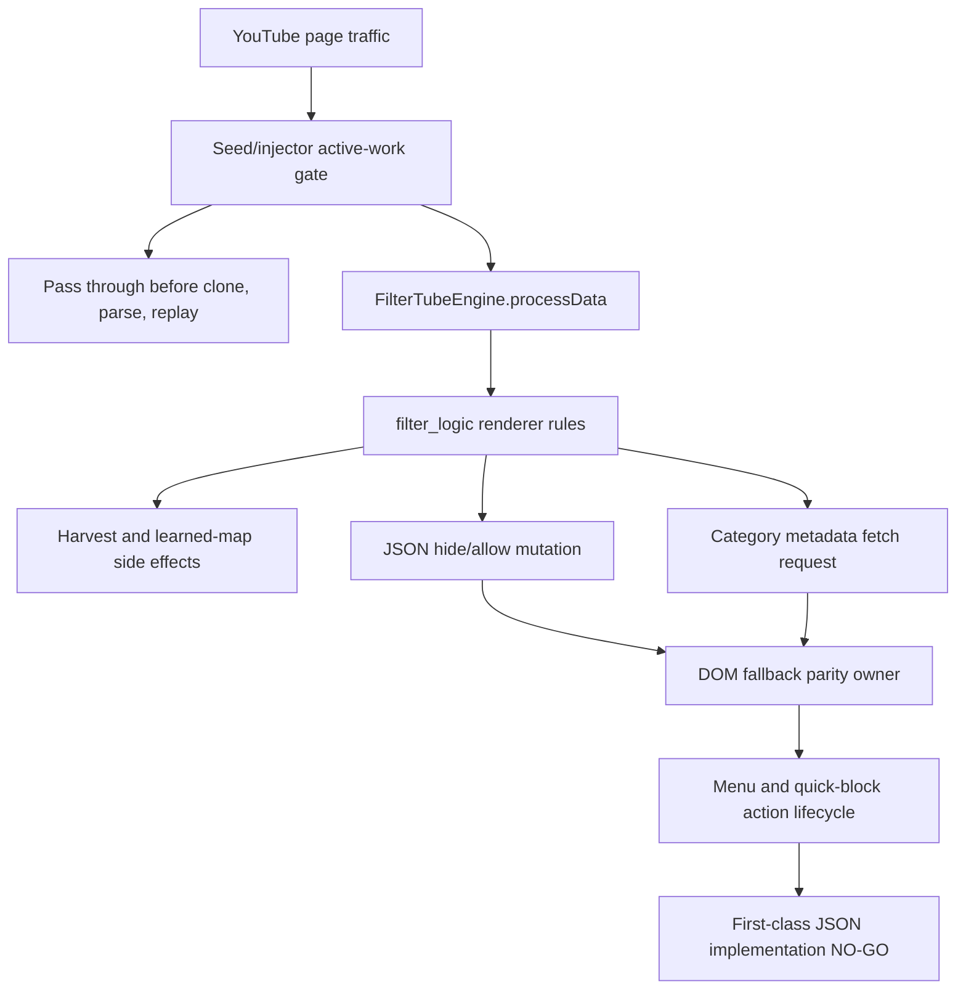

# FilterTube JSON-First Implementation Authority Boundary - Current Behavior - 2026-05-24

Status: audit-only current-behavior JSON-first implementation authority
boundary. Runtime behavior is unchanged. This is not an implementation patch,
optimization patch, JSON-first behavior patch, whitelist patch, metric collector
patch, source-owner approval, artifact commit, release patch, public claim patch,
or native sync patch.

## Purpose

This slice answers the active audit direction directly: codebase inspection is
finding concrete optimization locations, and JSON-first filtering is the right
future direction only after it has first-class ownership, work-budget, parity,
fixture, and metric proof. The current source evidence identifies where a
future first-class JSON filter contract would have to attach, but it does not
approve a runtime change.

The current boundary is:

```text
JSON-first implementation authority boundary rows: 13
Current JSON-first source anchors covered: 16
Runtime JSON-first implementation approvals: 0
Runtime JSON-first promotion authority rows: 0
Implementation-ready JSON-first rows: 0
```

JSON path evidence is source evidence. It is not effect authority by itself.
`FILTER_RULES` paths, renderer keys, documented paths, and reduced fixtures must
still bind to endpoint, route, surface, list mode, identity confidence,
mutation effect, no-work preservation, DOM/native parity, metric artifact,
diagnostic privacy, and rollback proof before JSON can become a first-class
filter implementation surface.

The repo-wide method semantic proof gap is now part of this gate. A JSON field
or renderer path cannot become first-class filter authority while its affected
callables remain only lexically counted. The current callable gap index proves
69 tracked JS/JSX/MJS files, 5,697 lexical callables, 0 files with complete
per-callable semantic proof, and 5,697 callables still requiring semantic proof
before behavior changes.

## Source Inputs

| Input | Current proof used |
| --- | --- |
| `docs/audit/FILTERTUBE_JSON_FIRST_FILTER_READINESS_GATE_CURRENT_BEHAVIOR_2026-05-21.md` | 13 JSON-first promotion gates remain blocked. |
| `docs/audit/FILTERTUBE_JSON_FIRST_NO_WORK_OPTIMIZATION_CROSSWALK_CURRENT_BEHAVIOR_2026-05-21.md` | 7 optimization candidate classes are source-backed but require budgets before implementation. |
| `docs/audit/FILTERTUBE_JSON_FIRST_IMPLEMENTATION_LOCUS_REGISTER_CURRENT_BEHAVIOR_2026-05-21.md` | 16 source anchors identify where future JSON-first contracts would have to land. |
| `docs/audit/FILTERTUBE_FILTER_LOGIC_RULE_PATH_SEMANTIC_REGISTER_2026-05-21.md` | Runtime path strings are source-enumerated, but path existence is not route/effect authority. |
| `docs/audit/FILTERTUBE_FILTER_LOGIC_RULE_FIELD_EFFECT_SEMANTIC_REGISTER_2026-05-21.md` | Rule fields are consumer-classified, but field availability is not hide/allow authority. |
| `docs/audit/FILTERTUBE_JSON_FIRST_LIST_MODE_MATRIX_BOUNDARY_CURRENT_BEHAVIOR_2026-05-22.md` | Disabled, empty blocklist, empty whitelist, conflicts, unknown mode, and comments have split current behavior. |
| `docs/audit/FILTERTUBE_JSON_FIRST_WHITELIST_DECISION_IDENTITY_BOUNDARY_CURRENT_BEHAVIOR_2026-05-22.md` | Whitelist decisions depend on empty rows, identity tier, creator-page fallback, unresolved identity, and comment bypass. |
| `docs/audit/FILTERTUBE_CONTENT_CONTROL_JSON_FIRST_BOUNDARY_INDEX_CURRENT_BEHAVIOR_2026-05-22.md` | 27 catalog controls have JSON-first-named proof docs, but action controls are not JSON row filters. |
| `docs/audit/FILTERTUBE_CANDIDATE_OBLIGATION_BINDING_MATRIX_CURRENT_BEHAVIOR_2026-05-24.md` | 10 candidate-obligation bindings are mapped, but 0 bindings have committed metric artifacts. |
| `docs/audit/FILTERTUBE_FIRST_OPTIMIZATION_SOURCE_LOCUS_IMPLEMENTATION_AUTHORITY_BOUNDARY_CURRENT_BEHAVIOR_2026-05-24.md` | 12 first-optimization source-locus implementation authority rows remain NO-GO. |
| `docs/audit/FILTERTUBE_WHITELIST_OPTIMIZATION_READINESS_GAP_MATRIX_CURRENT_BEHAVIOR_2026-05-24.md` | 10 whitelist readiness gaps keep recent whitelist optimization in audit mode. |
| `docs/audit/FILTERTUBE_METHOD_SEMANTIC_PROOF_GAP_INDEX_CURRENT_BEHAVIOR_2026-05-25.md` | 69 tracked JS/JSX/MJS files, 5,697 lexical callables, 0 files with complete per-callable semantic proof, and 5,697 callables still requiring semantic proof before JSON-first behavior changes. |
| `docs/audit/FILTERTUBE_FIRST_OPTIMIZATION_IMPLEMENTATION_READINESS_GATE_CURRENT_BEHAVIOR_2026-05-24.md` | 14 first-optimization readiness rows remain NO-GO. |
| `docs/audit/FILTERTUBE_RUNTIME_FIXTURE_RESULTS_2026-05-17.md` | Runtime proof is tracked by the audit harness, not as implementation authority. |

## Current Counts

```text
JSON-first implementation authority boundary rows: 13
JSON-first readiness promotion rows covered: 13
JSON-first no-work optimization candidates covered: 7
JSON-first implementation source anchors covered: 16
filter logic path semantic rows covered: 440
filter logic field-effect rows covered: 11
JSON-first list-mode states covered: 6
JSON-first whitelist decision states covered: 7
content control JSON-first proof docs covered: 27
candidate-obligation binding rows covered: 10
first optimization source-locus implementation rows covered: 12
whitelist readiness gaps covered: 10
method semantic proof gap files covered: 69
method semantic proof gap lexical callables covered: 5744
complete per-callable semantic proof files covered: 0
first optimization implementation readiness rows covered: 14
runtime JSON-first implementation approvals: 0
runtime JSON-first promotion authority rows: 0
runtime whitelist optimization approvals: 0
runtime metric collector approvals: 0
committed JSON-first metric artifacts: 0
implementation-ready JSON-first rows: 0
expected runtime audit tests: 4457
expected runtime audit pass: 4457
expected runtime audit fail: 0
runtime behavior changed: no
not completion proof for JSON-first implementation authority
```

## JSON-First Implementation Authority Matrix

| JSON-first authority row id | Current evidence | Current decision | Missing before implementation |
| --- | --- | --- | --- |
| `FT-JSON-AUTH-00-path-syntax` | Runtime paths use dot-index syntax and documented paths can use bracket-index notation. | NO-GO | Generated path syntax manifest, unsupported-path rejection policy, documented-path provenance, and fixture-backed parser proof. |
| `FT-JSON-AUTH-01-renderer-ownership` | `FILTER_RULES` defines current renderer extraction, including effective duplicate override behavior. | NO-GO | Renderer owner manifest with endpoint, route, surface, field effect, fixture, and documentation provenance for each promoted renderer. |
| `FT-JSON-AUTH-02-field-effect` | Rule fields are consumed as search text, channel identity evidence, join keys, metadata predicates, or category fetch inputs. | NO-GO | Field-effect decision that separates hide/allow authority, metadata-only fields, join-only fields, network-triggering fields, and forbidden effects. |
| `FT-JSON-AUTH-03-route-surface-scope` | JSON rows are endpoint-shaped, while visible effects differ on Main, Kids, YTM, watch, search, home, Shorts, playlists, comments, and posts. | NO-GO | Route/surface scope artifact with positive, negative sibling-visible, disabled, empty-list, sparse-surface, and route-transition fixtures. |
| `FT-JSON-AUTH-04-list-mode-whitelist-policy` | Empty whitelist, unresolved identity, comments, dormant imports, unknown mode, conflicts, and selected/current rows have split current behavior. | NO-GO | Product policy and fixtures for empty whitelist, unresolved identity, comments, selected row, transition/import, unknown mode, and simultaneous allow/block states. |
| `FT-JSON-AUTH-05-identity-confidence` | JSON identity can be canonical, display-only, joined by video id, learned from maps, DOM-derived, or network-derived depending on surface. | NO-GO | Identity confidence report with allowed evidence tiers, stale-map rules, pending identity TTL, fallback fetch budget, and restore behavior. |
| `FT-JSON-AUTH-06-mutation-effect` | `processData()` can harvest before disabled filtering and mutate only later; seed skip branches can perform harvest-only work. | NO-GO | Harvest-versus-mutation budget that separates passive learning, map writes, allow/hide mutation, no-rule behavior, disabled behavior, and rollback. |
| `FT-JSON-AUTH-07-transport-no-work` | Fetch and XHR interceptors still match, clone, parse, wrap, stringify, or override at different stages before one shared work decision exists. | NO-GO | Endpoint/list-mode work decision with parse, stringify, clone, listener, response-rebuild, disabled, missing-settings, no-rule, and active-rule counters. |
| `FT-JSON-AUTH-08-dom-lifecycle-parity` | DOM fallback, pending whitelist, selected-row preservation, stale marker cleanup, and sparse-surface repair remain separate from JSON filtering. | NO-GO | DOM parity packet with selector owner, observer/listener/timer budget, selected-row proof, sibling-visible proof, restore proof, and native parity. |
| `FT-JSON-AUTH-09-menu-quick-action-lifecycle` | Fallback menu and quick-block setup have lifecycle work outside JSON row mutation and protect explicit action affordances. | NO-GO | Action lifecycle budget with disabled, whitelist, enabled, desktop, mobile, menu-open, quick-click, teardown, and diagnostic proof. |
| `FT-JSON-AUTH-10-category-metadata-fetch-budget` | Category rules can schedule metadata fetches when JSON/DOM category data is absent. | NO-GO | Category budget with selected values, cache hit/miss, dedupe, retry, credential class, network/storage counters, DOM rerun, and false-hide proof. |
| `FT-JSON-AUTH-11-metric-diagnostic-artifact` | Current performance proof is source/count/debug proof rather than committed route/sample/device artifacts. | NO-GO | Metric artifact with schema, sample, owner map, fixture provenance, no-work preservation, side-effect budget, diagnostic privacy, and TAP verification output. |
| `FT-JSON-AUTH-12-release-rollout-boundary` | Native sync, browser package, release notes, public claims, raw captures, and website/native parity are separate proof surfaces. | NO-GO | Release rollout packet with package hashes, native freshness, raw-capture exclusion, public claim scope, rollback approval, and unclaimed-surface boundary. |

## Current JSON-First Source Anchors

| Source anchor | Current authority class |
| --- | --- |
| `js/seed.js:263` | active-rule and route-specific no-work predicate |
| `js/seed.js:383` | missing-settings, disabled, harvest-only, and mutation-capable processing split |
| `js/seed.js:666` | fetch endpoint interception, no-active-rule bypass, clone, parse, process, and response rebuild |
| `js/seed.js:757` | XHR patch, endpoint mark, listener wrapping, parse, and response override |
| `js/filter_logic.js:163` | runtime path syntax and unsupported documented syntax boundary |
| `js/filter_logic.js:435` | hand-authored renderer rule surface |
| `js/filter_logic.js:2263` | category metadata fetch trigger |
| `js/filter_logic.js:3588` | harvest before disabled skip and later mutation split |
| `js/content_bridge.js:1794` | shared metadata fetch queue and cache-write path |
| `js/content_bridge.js:6150` | DOM fallback startup and debounced mutation-driven fallback work |
| `js/content_bridge.js:6554` | fallback menu CSS/listener/observer/timer repair path |
| `js/content/dom_fallback.js:2117` | DOM fallback active-work predicate |
| `js/content/dom_fallback.js:2669` | DOM category metadata branch |
| `js/content/block_channel.js:1212` | quick-block action gate |
| `js/content/block_channel.js:1993` | quick-block observer setup |
| `js/content/block_channel.js:3185` | fixed quick-block delayed startup |

## Current JSON-First Source-Flow Addendum - 2026-05-27

This addendum converts the source anchors above into one current source-flow
map. It is audit-only. It does not approve JSON-first promotion, whitelist
optimization, transport simplification, DOM fallback pruning, category metadata
fetch pruning, menu/quick-block lifecycle pruning, diagnostic cleanup, or
release/native/public rollout changes.

```text
YouTube page traffic
        |
        v
seed/injector active-work gate
        |
        +--> no active JSON work: pass through before clone/parse/replay
        |
        +--> active JSON work: process through FilterTubeEngine
                                      |
                                      v
                         filter_logic renderer rules
                                      |
                                      +--> harvest/map write
                                      +--> JSON mutation
                                      +--> category metadata fetch request
                                      |
                                      v
                         DOM fallback, menu, and quick-block parity remain
                         separate lifecycle/action owners
                                      |
                                      v
                         first-class JSON implementation remains NO-GO
```



| JSON-first source-flow row | Source pins | Current owner boundary | Missing before first-class JSON authority |
| --- | --- | --- | --- |
| `json_flow_seed_active_work_gate` | `js/seed.js:220-260` | Seed decides whether settings/list-mode/content/rule state requires JSON work before transport body work starts. | Shared endpoint/list-mode work-decision report with disabled, empty blocklist, empty whitelist, and active-rule counters. |
| `json_flow_seed_fetch_response_owner` | `js/seed.js:666-754` | Fetch interception admits known YouTubei endpoints, gates before `response.clone().json()`, and rebuilds the response after engine processing. | Fetch response mutation budget, parse/stringify counter, endpoint reason, route/surface, and negative no-work fixture. |
| `json_flow_seed_xhr_response_owner` | `js/seed.js:757-971` | XHR interception marks endpoints in open/send, gates before parse/override, wraps listeners, and overrides response fields after processing. | XHR parity with fetch, listener lifecycle proof, response override budget, and no-active-work parse counter. |
| `json_flow_injector_active_work_gate` | `js/injector.js:171-188` | Injector mirrors the active JSON work predicate used by seed for page-world hooks. | One shared predicate owner and revision report proving seed/injector/list-mode parity. |
| `json_flow_injector_processing_replay_owner` | `js/injector.js:3405-3476` | Injector page-world processing and queued initial-data replay pass through when no active JSON work exists and call `FilterTubeEngine.processData()` when active. | Replay budget, duplicate hook proof, settings revision proof, and route/surface fixture packets. |
| `json_flow_renderer_rule_owner` | `js/filter_logic.js:435-844` | `FILTER_RULES` owns current renderer key to field-path extraction for supported JSON-like renderer shapes. | Generated renderer owner manifest with endpoint, route, surface, supported/unsupported class, field effect, fixture, and doc provenance. |
| `json_flow_settings_list_mode_owner` | `js/filter_logic.js:947-1069` | Filter logic reconstructs serialized keyword regexes, list-mode settings, content filters, category filters, and channel rows before rule evaluation. | Product policy and fixtures for exact/substr, comments, empty whitelist, conflicts, unknown mode, and simultaneous allow/block states. |
| `json_flow_harvest_mutation_owner` | `js/filter_logic.js:3588-3619` | Engine processing harvests identity mappings before enabled-state mutation and separates `processData()` from `harvestOnly()`. | Harvest-versus-mutation budget with storage/map side-effect counters, disabled behavior, rollback, and no-rule proof. |
| `json_flow_category_metadata_owner` | `js/filter_logic.js:2263-2319`; `js/content_bridge.js:1794-1881` | Category rules can request video metadata when JSON row data lacks a category, delegating to a bridge fetch queue/cache. | Category fetch budget with cache hit/miss, credential class, retry/dedupe, network/storage counters, and false-hide proof. |
| `json_flow_dom_fallback_parity_owner` | `js/content/dom_fallback.js:2117-2184`; `js/content_bridge.js:6420-6478` | DOM fallback active-work predicates and bridge mutation observation remain separate from JSON renderer mutation. | DOM parity packet with selector owner, observer/listener/timer budget, sibling-visible proof, selected-row proof, restore proof, and native parity. |
| `json_flow_quick_block_action_owner` | `js/content/block_channel.js:1212-1296`; `js/content/block_channel.js:1993-2042` | Quick-block rule creation and hover/action lifecycle stay outside JSON filtering so users can create the first rule and use explicit actions. | Action lifecycle budget with disabled, whitelist, empty blocklist, desktop/mobile, menu-open, quick-click, teardown, and diagnostic proof. |
| `json_flow_fallback_menu_action_owner` | `js/content_bridge.js:6554-7241`; `js/content_bridge.js:7243-7271` | Fallback menu UI and playlist popover cleanup remain imperative DOM/action owners outside JSON row mutation. | Shared menu action authority for primary dropdown, fallback scanner, fallback popover, quick block, list mode, disabled state, and teardown. |

Current JSON-first source-flow status:

```text
current JSON-first source-flow rows: 12
ASCII JSON-first source-flow diagram: present
Mermaid JSON-first source-flow diagram: present
current JSON-first source-flow proof: PARTIAL
runtime JSON-first implementation approvals: 0
implementation-ready JSON-first source-flow rows: 0
runtime behavior changed by this addendum: no
```

## First-Class JSON Contract Shape

A future JSON-first implementation report must bind one scoped change to:

```text
candidateId
obligationId
JSONAuthorityRowId
sourceLocus
sourceOwner
rendererKey
runtimePath
documentedPath
endpoint
route
surface
profileType
listMode
ruleState
fieldEffect
identityConfidence
allowedEffects
forbiddenEffects
activeJsonFields
activeDomControls
parseBudget
stringifyBudget
harvestBudget
listenerBudget
observerBudget
timerBudget
networkBudget
storageBudget
hideBudget
restoreBudget
positiveFixture
negativeSiblingFixture
disabledFixture
emptyListFixture
domParityFixture
nativeParityFixture
metricArtifact
diagnosticPrivacy
rollbackPlan
releaseClaimScope
```

Until that packet exists, JSON-first filtering remains an audit direction and
optimization target, not runtime implementation authority.

## Current Decision

```text
JSON-first implementation authority boundary documented: GO
JSON-first runtime implementation now: NO-GO
JSON-first path promotion now: NO-GO
JSON-first whitelist optimization now: NO-GO
JSON-first transport pass-through now: NO-GO
JSON-first DOM fallback pruning now: NO-GO
JSON-first menu or quick-block lifecycle pruning now: NO-GO
JSON-first category metadata fetch pruning now: NO-GO
JSON-first diagnostic log removal now: NO-GO
JSON-first release/native/public rollout claim now: NO-GO
continue proof-backed audit: GO
```

## Missing Product Authority Symbols

No product runtime, build, script, or website source currently defines:

```text
jsonFirstImplementationAuthorityBoundary
jsonFirstImplementationAuthorityReport
jsonFirstFirstClassFilterApproval
jsonFirstRuntimePromotionAuthority
jsonFirstFilterPromotionGoGate
jsonFirstTransportNoWorkApproval
jsonFirstDomParityImplementationPacket
jsonFirstWhitelistPolicyImplementationPacket
jsonFirstMetricDiagnosticApproval
jsonFirstReleaseRolloutApproval
jsonFirstImplementationNoGoReport
jsonFirstSourceFlowAuthority
jsonFirstSourceFlowReport
jsonFirstWorkDecisionReport
jsonFirstActionParityBudget
```

## Verification

Current proof command:

```bash
node --test tests/runtime/json-first-implementation-authority-boundary-current-behavior.test.mjs --test-reporter=spec
```

This boundary is not a completion claim. It proves JSON-first filtering is a
real future optimization direction found by code inspection while preserving
the current NO-GO boundary for runtime behavior, whitelist optimization,
transport pass-through, DOM fallback pruning, lifecycle pruning, diagnostics,
metric artifacts, release packages, native sync, and public claims.

## JSON-First Route/Surface Implementation Authority Boundary Addendum

`docs/audit/FILTERTUBE_JSON_FIRST_ROUTE_SURFACE_IMPLEMENTATION_AUTHORITY_BOUNDARY_CURRENT_BEHAVIOR_2026-05-24.md`
and
`tests/runtime/json-first-route-surface-implementation-authority-boundary-current-behavior.test.mjs`
split the route/surface prerequisite out of this implementation authority
boundary. The addendum pins 12 JSON-first route/surface implementation
authority rows, 9 route/surface effect classes covered, 12 route/surface metric
obligations covered, 0 runtime JSON-first route/surface approvals, 0 runtime
route/surface metric artifacts, 0 runtime JSON-first implementation approvals,
and 0 implementation-ready JSON-first route/surface rows.

## JSON-First Route/Surface Fixture Packet Contract Addendum

`docs/audit/FILTERTUBE_JSON_FIRST_ROUTE_SURFACE_FIXTURE_PACKET_CONTRACT_CURRENT_BEHAVIOR_2026-05-24.md`
and
`tests/runtime/json-first-route-surface-fixture-packet-contract-current-behavior.test.mjs`
define the route/surface fixture packet that is still missing before
JSON-first can become implementation authority. The addendum pins 12
route/surface fixture packet rows, 12 route/surface authority rows covered, 12
route/surface metric obligations covered, 8 fixture mode classes required, 14
fixture evidence classes required, 0 runtime JSON-first fixture packet
approvals, 0 runtime route/surface metric artifacts, and 0
implementation-ready JSON-first fixture packet rows.

## JSON-First Route/Surface Fixture Artifact Path Boundary Addendum

`docs/audit/FILTERTUBE_JSON_FIRST_ROUTE_SURFACE_FIXTURE_ARTIFACT_PATH_BOUNDARY_CURRENT_BEHAVIOR_2026-05-24.md`
and
`tests/runtime/json-first-route-surface-fixture-artifact-path-boundary-current-behavior.test.mjs`
reserve the future route/surface fixture packet artifact location while keeping
JSON-first implementation at NO-GO. The addendum pins 6 fixture artifact path
rows, 0 committed route/surface fixture packet files, 0 runtime JSON-first
fixture packet approvals, 0 runtime route/surface metric artifacts, and 0
implementation-ready route/surface fixture artifact path rows.

## JSON-First Route/Surface Fixture Artifact Commit Readiness Gate Addendum

`docs/audit/FILTERTUBE_JSON_FIRST_ROUTE_SURFACE_FIXTURE_ARTIFACT_COMMIT_READINESS_GATE_CURRENT_BEHAVIOR_2026-05-24.md`
and
`tests/runtime/json-first-route-surface-fixture-artifact-commit-readiness-gate-current-behavior.test.mjs`
keep the reserved route/surface fixture artifact root out of JSON-first
implementation authority. The addendum pins 10 artifact commit readiness rows,
0 committed route/surface fixture packet files, 0 runtime JSON-first fixture
packet approvals, 0 runtime route/surface metric artifact approvals, and 0
implementation-ready route/surface fixture artifact commit rows.

## JSON-First Route/Surface Fixture Artifact Contract Coverage Gate Addendum

`docs/audit/FILTERTUBE_JSON_FIRST_ROUTE_SURFACE_FIXTURE_ARTIFACT_CONTRACT_COVERAGE_GATE_CURRENT_BEHAVIOR_2026-05-24.md`
and
`tests/runtime/json-first-route-surface-fixture-artifact-contract-coverage-gate-current-behavior.test.mjs`
keep JSON-first implementation at NO-GO because route/surface fixture artifact
contracts are covered but still unbacked by artifacts and approvals. The addendum pins 10 fixture artifact contract
coverage rows, 13 JSON-first implementation authority rows covered, 5 reserved
future artifact files, 5 per-file fixture artifact contract docs, 5 per-file
fixture artifact contract tests, 0 committed route/surface fixture packet
files, 0 runtime JSON-first fixture packet approvals, 0 runtime route/surface
metric artifact approvals, and 0 implementation-ready route/surface fixture
artifact contract coverage rows.

## JSON-First Route/Surface Fixture Manifest Contract Addendum

`docs/audit/FILTERTUBE_JSON_FIRST_ROUTE_SURFACE_FIXTURE_MANIFEST_CONTRACT_CURRENT_BEHAVIOR_2026-05-24.md`
and
`tests/runtime/json-first-route-surface-fixture-manifest-contract-current-behavior.test.mjs`
keep JSON-first implementation at NO-GO while the first per-file route/surface
fixture artifact contract is defined. The addendum pins 12 manifest contract
rows, 13 JSON-first implementation authority rows covered, 1 reserved manifest
path, 0 committed route/surface fixture manifest files, 0 runtime JSON-first
fixture manifest approvals, 0 runtime route/surface metric artifact approvals,
and 0 implementation-ready JSON-first fixture manifest contract rows.

## JSON-First Route/Surface Fixture Approval Boundary Addendum

`docs/audit/FILTERTUBE_JSON_FIRST_ROUTE_SURFACE_FIXTURE_APPROVAL_BOUNDARY_CURRENT_BEHAVIOR_2026-05-24.md`
and
`tests/runtime/json-first-route-surface-fixture-approval-boundary-current-behavior.test.mjs`
keep JSON-first implementation approval at NO-GO until route/surface fixture
contracts become an approved packet. The addendum pins 12 JSON-first
route/surface fixture approval boundary rows, 13 JSON-first implementation
authority rows covered, 12 route/surface authority rows covered, 0 runtime
JSON-first fixture packet approvals, 0 runtime JSON-first implementation
approvals, 0 runtime route/surface metric artifact approvals, expected runtime
audit tests: 4457, expected runtime audit pass: 4457, and expected runtime
audit fail 0.

## JSON-First Route/Surface Metric Artifact Approval Boundary Addendum

`docs/audit/FILTERTUBE_JSON_FIRST_ROUTE_SURFACE_METRIC_ARTIFACT_APPROVAL_BOUNDARY_CURRENT_BEHAVIOR_2026-05-24.md`
and
`tests/runtime/json-first-route-surface-metric-artifact-approval-boundary-current-behavior.test.mjs`
keep JSON-first implementation authority blocked while route/surface metric
artifact approval is absent. The addendum pins 12 JSON-first route/surface
metric artifact approval boundary rows, 13 JSON-first implementation authority
rows covered, 12 route/surface authority rows covered, 12 route/surface metric
obligations covered, 0 runtime route/surface metric artifact approvals, 0
runtime metric collector approvals, 0 runtime JSON-first implementation
approvals, 0 runtime whitelist optimization approvals, and 0
implementation-ready route/surface metric artifact approval rows.

## JSON-First Route/Surface Metric Artifact Path Boundary Addendum

`docs/audit/FILTERTUBE_JSON_FIRST_ROUTE_SURFACE_METRIC_ARTIFACT_PATH_BOUNDARY_CURRENT_BEHAVIOR_2026-05-24.md`
and
`tests/runtime/json-first-route-surface-metric-artifact-path-boundary-current-behavior.test.mjs`
keep JSON-first implementation authority blocked while the metric artifact path
is only reserved. The addendum pins 6 JSON-first route/surface metric artifact
path rows, 13 JSON-first implementation authority rows covered, 12
route/surface authority rows covered, 0 committed route/surface metric artifact
files, 0 runtime route/surface metric artifact approvals, 0 runtime metric
collector approvals, and 0 implementation-ready route/surface metric artifact
path rows.

## JSON-First Route/Surface Metric Artifact Commit Readiness Gate Addendum

`docs/audit/FILTERTUBE_JSON_FIRST_ROUTE_SURFACE_METRIC_ARTIFACT_COMMIT_READINESS_GATE_CURRENT_BEHAVIOR_2026-05-24.md`
and
`tests/runtime/json-first-route-surface-metric-artifact-commit-readiness-gate-current-behavior.test.mjs`
keep JSON-first implementation authority blocked while metric artifact commit
readiness is absent. The addendum pins 10 JSON-first route/surface metric
artifact commit readiness rows, 13 JSON-first implementation authority rows
covered, 12 route/surface authority rows covered, 0 committed route/surface
metric artifact files, 0 runtime route/surface metric artifact approvals, 0
runtime metric collector approvals, 0 runtime JSON-first implementation
approvals, and 0 implementation-ready route/surface metric artifact commit
rows.

## 2026-05-30 Current-Source Runtime And Method Freshness Addendum

This addendum refreshes the JSON-first implementation boundary against the
current method-gap and runtime-suite proof. The older `4457` rows above remain
historical contract counts for the May 24 fixture packet chain; they are not
current full-suite proof and they do not approve JSON-first promotion.

```text
current-source freshness date: 2026-05-30
latest full runtime proof: 4663/4663 pass, 0 fail, 83.213s
current method semantic gap files: 69
current method semantic gap lexical callables: 5701
complete per-callable semantic proof files: 0
runtime JSON-first implementation approvals: 0
runtime JSON-first promotion authority rows: 0
runtime whitelist optimization approvals: 0
committed JSON-first metric artifacts: 0
current-source JSON-first implementation readiness: NO-GO
runtime behavior changed: no
```

JSON can become a first-class filter surface only through an
affected-callable closure packet. That packet must bind the exact source rows
to route/surface fixtures and preserve current blocklist, whitelist, channel,
menu, quick-block, category, and no-work behavior. A green runtime suite is
necessary evidence, but it is not sufficient authority by itself.

```text
first-class JSON closure packet required proof:
affected_callable_rows_named: required
route_surface_fixture_packet: required
blocklist_behavior_preserved: required
whitelist_behavior_preserved: required
channel_and_collaborator_behavior_preserved: required
transport_no_work_budget: required
DOM_parity_and_restore_budget: required
menu_quick_block_action_budget: required
category_metadata_fetch_budget: required
metric_artifact_and_rollout_boundary: required
```
