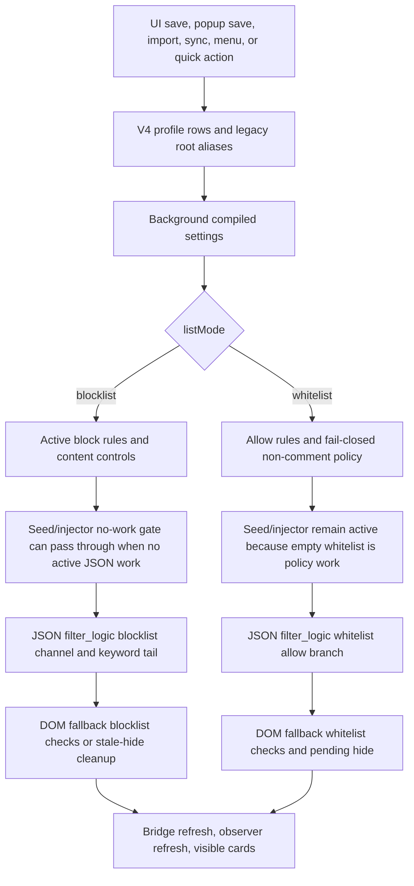

# FilterTube JSON-First List-Mode Matrix Boundary - Current Behavior - 2026-05-22

Status: audit-only current-behavior register. Runtime behavior is unchanged.
This is not an implementation patch, optimization patch, list-mode migration,
simultaneous allow/block migration, settings-mode patch, or permission to alter
JSON filtering behavior.

## Purpose

This register narrows the current JSON filtering list-mode matrix inside
`YouTubeDataFilter.processData()` and `YouTubeDataFilter._shouldBlock()`. It
extends the broader block-decision/effect and whitelist-decision proofs by
pinning which rule family currently has authority when `enabled`, `listMode`,
blocklist arrays, and whitelist arrays conflict.

The current boundary is:

```text
disabled mode harvests first and returns the original payload; `listMode` is
normalized to whitelist only for the exact string "whitelist"; empty blocklist
mode preserves matching renderers; empty whitelist mode fail-closes non-comment
renderers; blocklist mode ignores whitelist rows; whitelist mode ignores
blocklist rows except for comment-specific and global controls; no simultaneous
allow/block decision contract exists.
```

## Source Scope

| Source | Lines | Bytes | SHA-256 |
| --- | ---: | ---: | --- |
| `js/filter_logic.js` | 3652 | 172174 | `953ef0f14970e6cfbc11215fe9eaa078ced34f001908e1c6d5903a8fd2d9a1f5` |

Related proof layers:

- `docs/audit/FILTERTUBE_JSON_FIRST_BLOCK_DECISION_EFFECT_BOUNDARY_CURRENT_BEHAVIOR_2026-05-22.md`
- `docs/audit/FILTERTUBE_JSON_FIRST_WHITELIST_DECISION_IDENTITY_BOUNDARY_CURRENT_BEHAVIOR_2026-05-22.md`
- `docs/audit/FILTERTUBE_JSON_FIRST_FILTER_READINESS_GATE_CURRENT_BEHAVIOR_2026-05-21.md`
- `docs/audit/FILTERTUBE_HIDE_DECISION_PIPELINE_CURRENT_BEHAVIOR_2026-05-19.md`
- `docs/audit/FILTERTUBE_SETTINGS_MODE_SOURCE_EFFECT_CURRENT_BEHAVIOR_2026-05-20.md`
- `docs/audit/FILTERTUBE_LIST_MODE_TRANSITION_PERSISTENCE_BOUNDARY_CURRENT_BEHAVIOR_2026-05-22.md`

## Current Counts

```text
list-mode matrix boundary source files: 1
filter_logic _shouldBlock block lines: 306
filter_logic _shouldBlock block bytes: 15523
list-mode setup block lines: 5
list-mode setup block bytes: 368
whitelist decision branch lines: 110
whitelist decision branch bytes: 5535
blocklist decision tail lines: 85
blocklist decision tail bytes: 4702
processData block lines: 32
processData block bytes: 1240
enabled skip block lines: 7
enabled skip block bytes: 387
_shouldBlock listMode === 'whitelist' tokens: 2
_shouldBlock this.settings.listMode tokens: 1
_shouldBlock _hasChannelPolicyRules tokens: 1
_shouldBlock extractChannelIdentity tokens: 1
_shouldBlock filterChannels tokens: 4
_shouldBlock filterKeywords tokens: 5
_shouldBlock whitelistChannels tokens: 6
_shouldBlock whitelistKeywords tokens: 5
_shouldBlock hideAllComments tokens: 2
_shouldBlock hideAllShorts tokens: 1
_shouldBlock return true tokens: 11
_shouldBlock return false tokens: 11
_shouldBlock _checkContentFilters tokens: 1
_shouldBlock _checkCategoryFilters tokens: 1
_shouldBlock filterKeywordsComments tokens: 2
_shouldBlock pageChannelMeta tokens: 3
processData _harvestChannelData tokens: 1
processData settings.enabled === false tokens: 1
processData return data tokens: 2
processData this.filter(data) tokens: 1
processData blockedCount tokens: 2
runtime list-mode matrix fixtures: 6
runtime behavior changed: no
not completion proof for JSON-first list-mode matrix authority
```

## Current Decision Matrix

| Boundary | Current behavior | Missing proof gate |
| --- | --- | --- |
| Disabled mode | `processData()` harvests channel data before `settings.enabled === false` returns the original payload reference. | Disabled-mode harvest policy with side-effect budget and route/profile proof. |
| List-mode normalization | `_shouldBlock()` uses whitelist mode only when `this.settings.listMode === 'whitelist'`; every other value falls back to blocklist behavior. | Settings validation and unknown-mode fallback policy. |
| Empty blocklist | With blocklist mode and no active blocklist/content/category/comment/global rules, supported video renderers remain visible. | Empty blocklist no-work policy proving when parse/traverse/filter work can be skipped. |
| Empty whitelist | With whitelist mode and no whitelist channel or keyword rows, non-comment renderers fail-close and are removed. | Empty whitelist product decision with route, renderer, profile, and user-facing copy proof. |
| Blocklist with whitelist rows | In blocklist mode, matching whitelist rows do not allow a renderer that matches a blocklist rule. | Simultaneous allow/block conflict policy and migration report. |
| Whitelist with blocklist rows | In whitelist mode, matching blocklist rows do not remove a non-comment renderer that matches whitelist channel allow rules. | Simultaneous allow/block precedence policy and negative fixtures. |
| Unknown listMode | Unknown strings are treated like blocklist mode; whitelist arrays are dormant unless `listMode` is exactly `whitelist`. | Invalid settings recovery policy with migration and telemetry proof. |
| Comments | Comment renderers bypass non-comment whitelist fail-close but still honor hide-all, comment keywords, and author-channel blocklist checks. | Comment list-mode matrix with explicit allow/block/comment scope authority. |

## Runtime Fixture Summary

The disabled fixture proves `settings.enabled === false` returns the same payload
object even when whitelist mode would otherwise remove the video.

The empty-list fixture proves empty blocklist mode preserves a normal
`videoRenderer`, while empty whitelist mode removes the same renderer.

The unknown-mode fixture proves an unknown `listMode` falls back to blocklist:
matching blocklist channel rows remove content, while matching whitelist-only
rows are ignored.

The blocklist conflict fixture proves blocklist mode removes a renderer when a
blocklist channel row and whitelist channel row both match the same channel.

The whitelist conflict fixture proves whitelist mode preserves a renderer when a
whitelist channel row matches, even if a blocklist channel row also matches.

The comment fixture proves empty whitelist mode preserves a neutral
`commentRenderer`, while a blocklist author channel still removes a matching
comment author.

## List-Mode Runtime Invariant Snapshot - 2026-05-27

This addendum is audit-only. It records the runtime path that must stay true
while the release-lag and whitelist fixes are optimized further: blocklist hides
matching content, whitelist allows only matching content, and empty/no-useful
blocklist installs must remain low-work. It does not approve a list-mode rewrite,
new JSON-first authority, whitelist behavior change, import/migration change, or
runtime optimization.

```text
settings/profile write
  -> shared save alias mirror and storage mutation
  -> background getCompiledSettings(forceRefresh)
  -> compiled listMode plus blocklist and whitelist arrays
  -> seed/injector JSON no-work gate
  -> JSON _shouldBlock list-mode branch
  -> DOM fallback list-mode branch and stale-hide cleanup
  -> bridge storage refresh with forceReprocess preservation
  -> whitelist pending hide or quick-block/menu affordance gates
  -> visible YouTube surface
```



| Boundary | Source pins | Current invariant | Still missing before behavior change |
| --- | --- | --- | --- |
| Shared save and blocklist alias mirror | `js/settings_shared.js:742-954` | Normal Main saves write canonical `main.channels` / `main.keywords`; `blockedChannels` / `blockedKeywords` are mirrored only while Main mode is blocklist. | One mutation authority for Dashboard, popup, import, sync, menu, and quick actions. |
| Background profile list-mode compiler | `js/background.js:1984-2022`, `js/background.js:2056-2076`, `js/background.js:2212-2224` | `listMode` is compiled from active Main/Kids mode; whitelist rows compile separately; Main blocklist rows prefer canonical rows before migration aliases. | A source-of-truth report proving every writer updates the same profile/list target. |
| Seed JSON no-work predicate | `js/seed.js:220-260` | Disabled or missing settings bypass network JSON work; whitelist mode is always active JSON work; blocklist mode needs active JSON/content/category rules. | A first-class no-work budget that separates pass-through, harvest-only, DOM fallback, and mutation. |
| Injector JSON no-work predicate | `js/injector.js:171-188` | MAIN-world injector shares the same whitelist-active and no-rule blocklist predicate as the seed path. | Drift proof tying both predicates to one named runtime authority. |
| JSON decision engine | `js/filter_logic.js:1846-2036`, `js/filter_logic.js:2038-2108` | Exact `listMode === 'whitelist'` enters fail-closed non-comment allow logic; blocklist channel/keyword/comment checks run after that branch. | Simultaneous allow/block conflict policy, disabled harvest policy, and comment-specific mode authority. |
| DOM fallback list-mode gate | `js/content/dom_fallback.js:1933-2088`, `js/content/dom_fallback.js:4547-4746` | DOM fallback treats whitelist as active work, clears stale hides when blocklist has no work, fail-closes whitelist non-comment cards, and then applies blocklist keyword/channel checks. | Per-surface selector proof and negative sibling-visible proof for each fallback card family. |
| Bridge refresh and delivery | `js/content/bridge_settings.js:806-978`, `js/content/bridge_settings.js:1018-1108` | Runtime refresh requests forced compiled settings, delivers them to MAIN world/seed, applies managed route/time gates, and preserves `forceReprocess` across coalesced storage refreshes. | Revisioned dirty-key report that explains which consumers need JSON, DOM, menu, quick, prefetch, or managed-policy work. |
| Whitelist pending and quick-block gates | `js/content_bridge.js:6014-6037`, `js/content/block_channel.js:1205-1222` | Whitelist pending hide rejects non-whitelist and excluded routes before selector collection; quick-block is blocklist-only and enabled only by user setting. | Unified mode/action matrix proving passive hide work and explicit add-rule work cannot cross modes. |

Current behavior invariant:

```text
blocklist mode:
  matching blocklist keyword/channel/content/comment rules hide matching content
  whitelist rows do not allow blocklist matches
  empty/no-useful blocklist can skip JSON work and clear stale DOM hides

whitelist mode:
  matching whitelist keyword/channel rules allow non-comment content
  non-matching or empty whitelist non-comment content fail-closes
  blocklist rows do not remove an allowed non-comment whitelist match
  comments keep their separate comment/blocklist behavior
```

```text
list-mode runtime invariant authority: NO-GO
blocklist/whitelist parity authority: NO-GO
empty-list no-work/fail-close authority: NO-GO
runtime behavior changed by this addendum: no
```

The next optimization can only use this as a source map. It still needs one
shared decision report that carries profile, mode, source row family, active
rule status, route, renderer, JSON/DOM consumer, and negative no-op proof before
changing blocklist or whitelist behavior.

## Risks Identified

- Reliability: one string comparison controls whether blocklist or whitelist
  rows are active, with no structured report for invalid mode recovery.
- False-hide/leak: empty whitelist fail-closes non-comment JSON while empty
  blocklist preserves, and comments use a separate policy path.
- Performance: empty blocklist no-work and disabled harvest/no-mutate behavior
  are not represented by one first-class list-mode budget.
- Code burden: blocklist, whitelist, comment, disabled, unknown mode, and future
  simultaneous allow/block semantics are distributed across process and decision
  branches without a reusable list-mode authority object.

## Method Semantic Proof Gap Boundary

`docs/audit/FILTERTUBE_METHOD_SEMANTIC_PROOF_GAP_INDEX_CURRENT_BEHAVIOR_2026-05-25.md`
is a required source input before this list/settings-mode surface can support
runtime optimization. Current proof pins:

```text
method semantic proof gap files covered: 69
method semantic proof gap lexical callables covered: 5789
files with complete per-callable semantic proof: 0
lexical callables requiring semantic proof before behavior changes: 5789
affected callable semantic proof: NO-GO
runtime behavior changed: no
```

These counts are audit-only blockers. They do not approve runtime
optimization, JSON-first behavior, whitelist behavior, settings-mode behavior,
metric collectors, artifact creation, native sync, release package changes, or
public claims.

## Missing Authority Symbols

The following symbols are intentionally absent from current product runtime
source and remain future-work gates:

```text
jsonFirstListModeMatrixContract
jsonFirstListModeDecisionReport
jsonFirstDisabledModeHarvestPolicy
jsonFirstEmptyBlocklistPolicy
jsonFirstEmptyWhitelistPolicy
jsonFirstUnknownListModeFallbackPolicy
jsonFirstSimultaneousAllowBlockPolicy
jsonFirstBlocklistWhitelistConflictReport
jsonFirstCommentListModePolicy
jsonFirstListModeFixtureProvenance
```

## Verification

Current proof command:

```bash
node --test tests/runtime/json-first-list-mode-matrix-boundary-current-behavior.test.mjs --test-reporter=spec
```

This register is not a completion claim. It narrows one open JSON-first
filtering gap into current list-mode selection, disabled behavior, empty-list
behavior, blocklist/whitelist conflict behavior, comment handling, and missing
first-class list-mode matrix authority only.

## Whitelist Optimization Readiness Gap Matrix Addendum

Whitelist optimization readiness gap matrix addendum:
`docs/audit/FILTERTUBE_WHITELIST_OPTIMIZATION_READINESS_GAP_MATRIX_CURRENT_BEHAVIOR_2026-05-24.md`
and
`tests/runtime/whitelist-optimization-readiness-gap-matrix-current-behavior.test.mjs`
carry this list-mode boundary into the broader optimization decision. The
readiness matrix keeps whitelist optimization blocked until empty list,
conflict, unknown-mode, comments, transition, import, route/surface, and metric
evidence exists.
