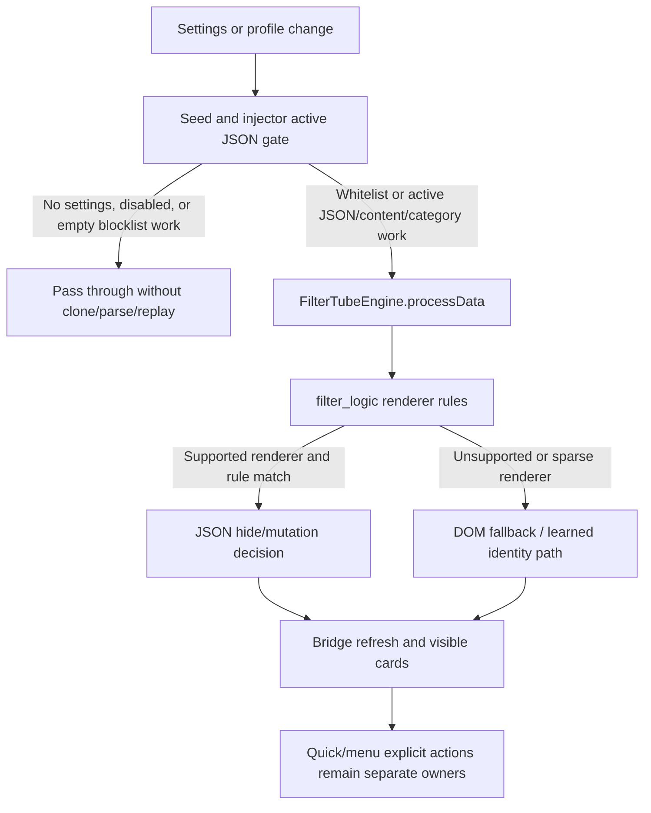

# FilterTube JSON-First No-Work Optimization Crosswalk - Current Behavior - 2026-05-21

Status: current-behavior crosswalk with 2026-05-25 SPA drag optimization addendum.
Runtime behavior changed for seed no-work transport bypass and quick-block/fallback-menu lifecycle
scheduling. This does not open the JSON-first implementation gate.

## Purpose

This register answers the current audit question directly: yes, the inspection
is finding optimization locations, and yes, JSON-first filtering can become a
first-class direction only after the no-work and effect budgets are proven.

The current boundary is:

```text
JSON-first optimization is not just adding more FILTER_RULES paths.
It must prove when seed transport, filter engine harvest, DOM fallback,
quick-block/menu lifecycle, category metadata fetches, learned-map writes,
native parity, and metrics are allowed to do work.
```

## Source Scope

| Source | Current fingerprint |
| --- | --- |
| `js/seed.js` | 1,136 lines, 50,026 bytes, sha256 `a9d86cd973b998ffbd58faf316ca679267ce7267af36969683f32b760f49054d` |
| `js/filter_logic.js` | 3,652 lines, 172,174 bytes, sha256 `953ef0f14970e6cfbc11215fe9eaa078ced34f001908e1c6d5903a8fd2d9a1f5` |
| `js/content_bridge.js` | 13,636 | 604,184 | `8d55d0c8995e5b68bb9142c41f95046a676f5af2b83f8545b00f91a6a5a3776d` |
| `js/content/dom_fallback.js` | 5,030 lines, 235,555 bytes, sha256 `fdc4391aed06849c1ba0a9afbb5b05e5e115b0929639e7014738d1462bf13ec5` |
| `js/content/block_channel.js` | 3,189 lines, 127,857 bytes, sha256 `c040b57e0b107fd7b6fb0a18bc4ca014e5a22fbb82755f81e51a497eee387dba` |
| JSON-first gate | `docs/audit/FILTERTUBE_JSON_FIRST_FILTER_READINESS_GATE_CURRENT_BEHAVIOR_2026-05-21.md` |
| P0 no-work proof | `docs/audit/FILTERTUBE_P0_NO_WORK_CURRENT_BEHAVIOR_2026-05-18.md` |
| XHR no-work proof | `docs/audit/FILTERTUBE_XHR_NO_WORK_BOUNDARY_CURRENT_BEHAVIOR_2026-05-19.md` |
| Performance claim boundary | `docs/audit/FILTERTUBE_PERFORMANCE_CLAIM_EVIDENCE_BOUNDARY_2026-05-20.md` |

## Current Source Facts

- Fetch interception in `js/seed.js` uses endpoint substring matching, builds a
  parsed-path `dataName`, and calls `shouldBypassYouTubeiNetworkResponse()`
  before `response.clone().json()`. Missing settings, disabled filtering, and
  inactive/empty JSON work now avoid body parse and response rebuild work.
- `shouldSkipEngineProcessing()` has partial no-work skips for blocklist search,
  channel, and non-mobile home browse cases. Whitelist mode returns to engine
  processing, mobile home does not share the desktop home skip, and player,
  guide, and next endpoints do not share one no-work pass-through policy.
- XHR interception patches `XMLHttpRequest.prototype.open`,
  `XMLHttpRequest.prototype.send`, `addEventListener`, and
  `removeEventListener`. It marks endpoint-like URLs by substring only after the
  same no-work gate allows processing, while late guards still protect response
  parsing and override work.
- `processData()` in `js/filter_logic.js` still harvests channel mappings before
  the disabled-filtering skip, so disabled filtering is not a blanket no-work
  authority.
- `hasActiveDOMFallbackWork()` in `js/content/dom_fallback.js` returns true for
  whitelist mode, broad boolean controls, strict content-filter booleans, and
  selected categories. It still does not prove target route or duration/date
  value validity before DOM fallback work is considered active.
- DOM fallback startup in `js/content_bridge.js` installs a body
  `MutationObserver`, starts the card prefetch observer, installs playlist-panel
  and right-rail whitelist hooks, schedules prefetch scans, and owns pending
  whitelist timers.
- Fallback menu lifecycle in `js/content_bridge.js` installs a
  `MutationObserver`, `DOMContentLoaded`, `yt-navigate-finish`, click, scroll,
  timeout, and warmup interval work for menu repairs.
- Quick block setup in `js/content/block_channel.js` starts after a fixed
  `setTimeout(..., 1000)` and then installs styles, listeners, a mutation
  observer, and route/mutation-scoped sweep scheduling. The previous periodic
  full-document sweep was removed in the 2026-05-25 SPA drag optimization
  addendum. The per-card action checks
  `isQuickBlockEnabled()`, but setup itself is not governed by a shared
  no-work authority.
- Category filtering can still request metadata through
  `scheduleVideoMetaFetch(videoId, { needDuration: false, needDates: false,
  needCategory: true })` when category metadata is missing.
- Current performance docs are claim boundaries, not measurement artifacts. No
  current runtime source has a named JSON-first metric artifact authority.

## Optimization Candidate Crosswalk

| Candidate | Current evidence | Optimization risk if changed first | Proof required before implementation |
| --- | --- | --- | --- |
| Seed fetch pass-through | Matching inactive fetch responses now bypass parse and stringify before body work; active matching responses still parse and rebuild locally. | A broad pass-through can miss zero-flash JSON mutation on supported active rules. | `jsonFirstSeedPassThroughBudget` with endpoint, route, rule-state, parse/stringify counters, and positive active-rule fixture. |
| Seed XHR pass-through | XHR open/send now use the no-work gate before marking endpoint-like requests; active requests still own local hooks and late mutation guards. | A narrow XHR removal can leave fetch covered but XHR still doing work or leaking mutations. | `jsonFirstXhrPassThroughBudget` with open/send marks, wrapped-listener counts, parse/stringify counts, and shared endpoint policy. |
| Engine harvest split | `processData()` harvests before disabled filtering; seed skip branches can call `harvestOnly()`. | Removing harvest blindly can break channel-map learning and menu identity. | `jsonFirstHarvestDecision` separating disabled, no-rule harvest, map-write provenance, and mutation-free pass-through. |
| DOM lifecycle gate | DOM fallback and bridge observers can scan, reprocess, prefetch, or pending-hide outside a central JSON-first budget. | Deleting DOM fallback because JSON exists can cause leaks on sparse surfaces and false restores. | `jsonFirstDomLifecycleBudget` with route/surface, list mode, selector owner, listener/observer/timer counts, and DOM parity fixtures. |
| Quick-block lifecycle gate | Quick-block observer setup happens after a fixed timer even when the UI action is disabled or whitelist mode is active. | Deferring setup incorrectly can break explicit user action affordances. | `jsonFirstQuickBlockLifecycleBudget` with disabled, whitelist, enabled, mobile, and desktop action fixtures. |
| Category metadata fetch gate | Category filtering can schedule `scheduleVideoMetaFetch()` when metadata is absent. | JSON-first category rules can silently become network-first rules without a fetch budget. | `jsonFirstCategoryMetadataBudget` with rule-state, route, profile, cache-hit, cache-miss, fetch, and DOM rerun counters. |
| Metric artifact gate | Historical performance claims are not current measurements. | Optimization can move cost between seed, DOM, network, and storage without reducing user-visible lag. | `jsonFirstMetricArtifactReport` with browser/device, route, sample size, before/after counters, and committed artifacts. |

## First-Class JSON Optimization Budget Shape

A future JSON-first optimization report should contain at least:

```text
sourceOwner
route
surface
endpoint
profileType
listMode
ruleState
activeJsonFields
activeDomSelectors
workAllowed
workForbidden
parseBudget
stringifyBudget
processDataBudget
harvestBudget
listenerBudget
observerBudget
timerBudget
networkFetchBudget
storageWriteBudget
hideMutationBudget
restoreBudget
positiveFixture
negativeSiblingFixture
domParityFixture
nativeParityFixture
metricArtifact
```

Until that report exists, these are audit-discovered optimization candidates,
not approved behavior changes.

## Implementation Locus Register Addendum

`docs/audit/FILTERTUBE_JSON_FIRST_IMPLEMENTATION_LOCUS_REGISTER_CURRENT_BEHAVIOR_2026-05-21.md`
and
`tests/runtime/json-first-implementation-locus-register-current-behavior.test.mjs`
convert the candidate classes above into exact source anchors for future work:
seed active-rule/no-work decisions, seed fetch/XHR transport wrappers, runtime
path syntax, hand-authored renderer rules, category metadata fetches, engine
harvest-before-disabled behavior, DOM fallback active-work and lifecycle gates,
fallback menu lifecycle, quick-block action/setup split, and metric fixture
requirements. This source-locus register remains audit-only and keeps the same
implementation boundary closed.

## JSON-First Implementation Authority Boundary Addendum

`docs/audit/FILTERTUBE_JSON_FIRST_IMPLEMENTATION_AUTHORITY_BOUNDARY_CURRENT_BEHAVIOR_2026-05-24.md`
and
`tests/runtime/json-first-implementation-authority-boundary-current-behavior.test.mjs`
bind the no-work optimization candidates back to a JSON-first implementation
authority NO-GO. The addendum keeps seed fetch pass-through, seed XHR
pass-through, engine harvest split, DOM lifecycle pruning, quick-block/menu
lifecycle pruning, category metadata fetch pruning, diagnostic cleanup,
whitelist optimization, native/release rollout, and public claims blocked until
one scoped packet proves source ownership, route/surface/list-mode scope,
fixtures, side-effect budgets, parity, diagnostic privacy, metric artifacts,
rollback, and release boundaries.

## JSON-First Owner Budget Ledger Addendum - 2026-05-27

This addendum is audit-only. It records the current JSON-first ownership
boundary after the release-lag fixes: JSON transport can now stay idle when
blocklist mode has no active JSON/content/category work, but JSON is still not a
single authority for every hide, restore, learned identity, quick action, menu
action, or unsupported renderer. It does not approve runtime optimization,
renderer promotion, DOM fallback deletion, whitelist behavior changes, or public
JSON-first claims.

```text
settings/profile state
  -> seed/injector active JSON gate
  -> filter_logic renderer and list-mode decision
  -> DOM fallback for rendered/sparse/unsupported surfaces
  -> bridge refresh, pending-hide, quick/menu explicit actions
  -> visible YouTube surface
```



| Owner slice | Source pins | Current behavior | Missing proof before promotion |
| --- | --- | --- | --- |
| Seed transport admission | `js/seed.js:220-260`, `js/seed.js:383-430`, `js/seed.js:1002-1014` | Missing settings, disabled settings, and inactive blocklist JSON work pass through before clone/parse/replay; whitelist always remains active JSON work. | One shared active-state object for seed, injector, bridge, DOM, quick, and menu consumers. |
| Injector transport admission | `js/injector.js:171-188`, `js/injector.js:1940-1944`, `js/injector.js:3405-3437` | MAIN-world injector shares the no-active-JSON predicate and clears queued initial data when there is no JSON work. | Drift proof that seed and injector cannot disagree after profile, import, sync, or storage refresh. |
| JSON renderer owner | `js/filter_logic.js:435-529`, `js/filter_logic.js:1721-2261`, `js/filter_logic.js:3588-3619` | Hand-authored `FILTER_RULES` define supported renderer extraction; `_shouldBlock()` owns JSON blocklist/whitelist decisions; `processData()` still harvests before disabled no-mutation return. | Renderer coverage map with unsupported-renderer policy, disabled harvest policy, and per-renderer negative sibling fixtures. |
| DOM fallback owner | `js/content/dom_fallback.js:1933-1999`, `js/content/dom_fallback.js:2035-2088`, `js/content/dom_fallback.js:4547-4752` | DOM fallback treats whitelist as active work, clears stale hides when no fallback work exists, and remains owner for rendered cards, sparse identity, and fallback blocklist/whitelist checks. | JSON-vs-DOM owner decision report proving which route/surface/card family can safely skip fallback work. |
| Bridge/action owner | `js/content_bridge.js:6014-6037`, `js/content/block_channel.js:1205-1222` | Whitelist pending-hide and quick-block/menu affordances remain separate action/lifecycle owners outside `filter_logic` renderer decisions. | Mode/action matrix proving passive hide work and explicit add-rule work cannot cross blocklist/whitelist boundaries. |
| Release proof owner | `docs/audit/FILTERTUBE_RELEASE_REGRESSION_LAG_AND_BLOCKLIST_FIX_2026-05-26.md` | The lag fix changed hot-path runtime behavior, but this owner ledger is documentation-only and records current boundaries after that change. | Loaded-extension parity, live trace budgets, and release package attestation before claiming final performance authority. |

Current owner invariant:

```text
JSON owns:
  supported YouTube JSON renderer mutation when active JSON work exists
  blocklist channel/keyword/comment/global decisions inside filter_logic
  whitelist non-comment fail-close/allow decisions for supported renderers

JSON does not yet own:
  unsupported renderer policy
  all DOM fallback hide/restore decisions
  learned identity provenance and page-message trust
  quick-block and native/fallback menu explicit actions
  live observer/listener/timer budgets
  release/package/installed-runtime parity
```

```text
JSON-first owner budget proof slices: 6
JSON-first source proof: PARTIAL
JSON-first promotion authority: NO-GO
JSON-vs-DOM owner authority: NO-GO
unsupported renderer policy authority: NO-GO
runtime behavior changed by this addendum: no
```

The next optimization can use this ledger as a map, not as permission. A
runtime behavior change still needs `jsonFirstOwnerBudgetLedger`,
`jsonFirstSourceOwnerDecision`, `jsonFirstDomFallbackOwnershipPolicy`,
`jsonFirstUnsupportedRendererPolicy`, and `jsonFirstJsonDomPromotionGate` to be
real, tested product authorities rather than audit names.

## Missing Runtime Authority Symbols

No product runtime source currently defines:

```text
jsonFirstNoWorkOptimizationCrosswalk
jsonFirstWorkDecision
jsonFirstSeedPassThroughBudget
jsonFirstXhrPassThroughBudget
jsonFirstHarvestDecision
jsonFirstDomLifecycleBudget
jsonFirstQuickBlockLifecycleBudget
jsonFirstCategoryMetadataBudget
jsonFirstMetricArtifactReport
jsonFirstNoWorkOptimizationBudget
jsonFirstOwnerBudgetLedger
jsonFirstSourceOwnerDecision
jsonFirstDomFallbackOwnershipPolicy
jsonFirstUnsupportedRendererPolicy
jsonFirstJsonDomPromotionGate
```

## Runnable Proof

```bash
node --test tests/runtime/json-first-no-work-optimization-crosswalk-current-behavior.test.mjs --test-reporter=spec
```

## Method Semantic Proof Gap Boundary

`docs/audit/FILTERTUBE_METHOD_SEMANTIC_PROOF_GAP_INDEX_CURRENT_BEHAVIOR_2026-05-25.md`
is a required source input before this JSON-first no-work optimization
crosswalk can support runtime optimization or JSON-first promotion. Current
proof pins:

```text
method semantic proof gap files covered: 69
method semantic proof gap lexical callables covered: 5830
files with complete per-callable semantic proof: 0
lexical callables requiring semantic proof before behavior changes: 5830
affected callable semantic proof: NO-GO
runtime behavior changed: no for this audit-only method proof gap boundary
```

These counts are audit-only blockers. They do not approve runtime
optimization, JSON-first behavior, method deletion, method merging, lifecycle
cleanup, no-work changes, or whitelist behavior changes.
